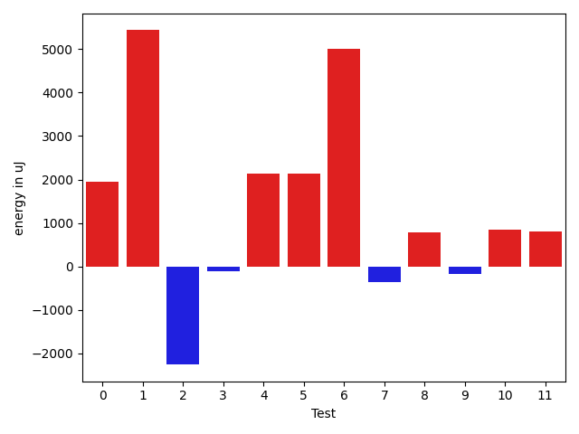
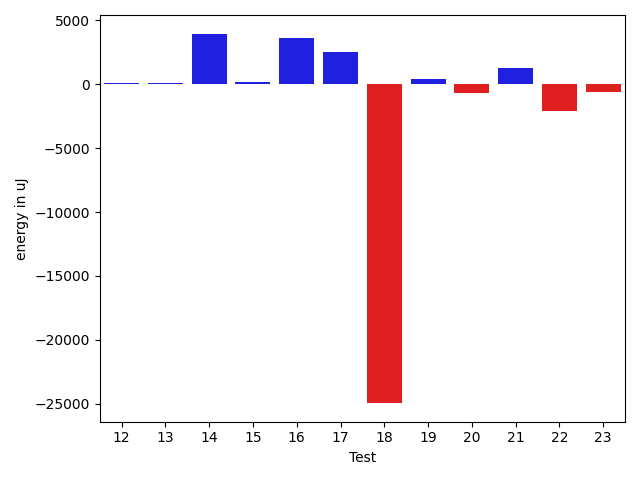
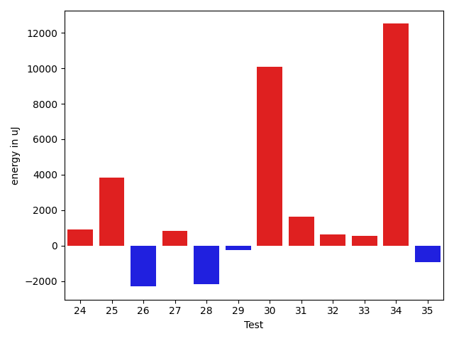
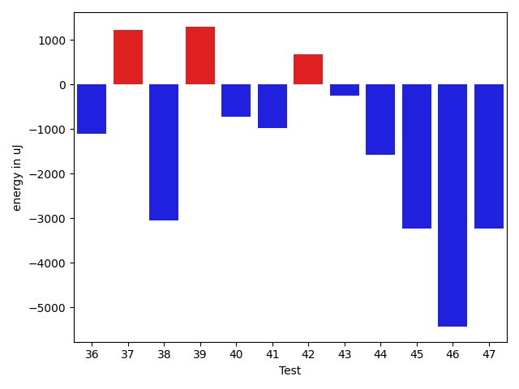
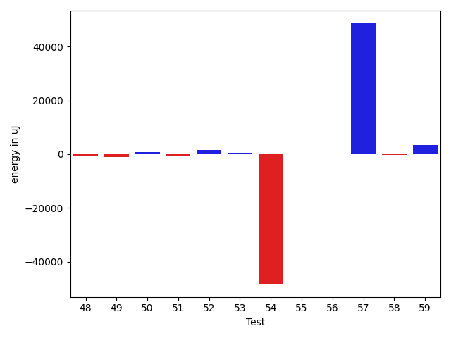
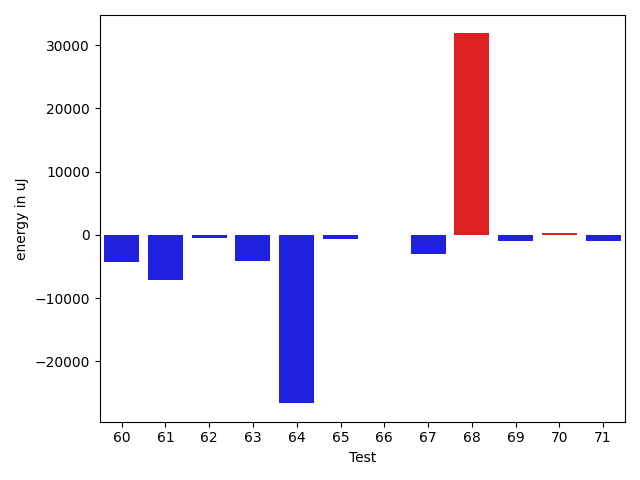
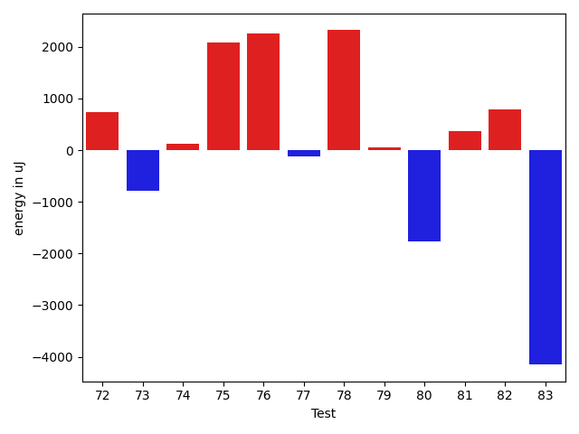
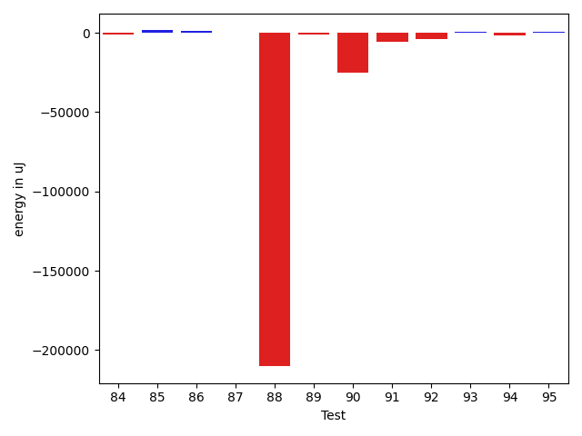
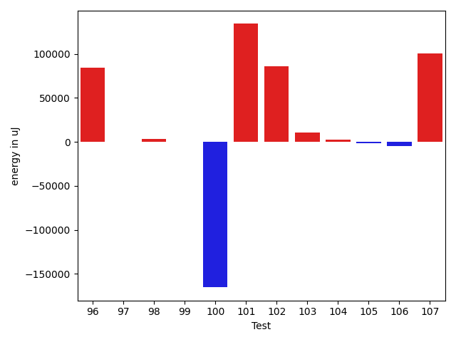
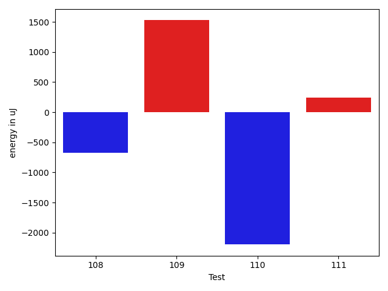

# gson 6029af

https://github.com/google/gson/commit/6029af

## Delta Energy per test method

| ID | EnergyV1 | EnergyV2 | DeltaEnergy | σV1 | σV2 |
| --- | --- | --- | --- | --- | --- |
| 0 | 82459 | 84411 | 1952 | 24930.615410626677 | 22761.20238358993 |
| 1 | 102478 | 107910 | 5432 | 80881.48031618696 | 73612.82661718111 |
| 2 | 41809 | 39551 | -2258 | 7028.553552559381 | 5234.3216834349305 |
| 3 | 39794 | 39673 | -121 | 4063.5635257123768 | 4011.5160802006008 |
| 4 | 74463 | 76598 | 2135 | 21314.108613956872 | 17894.820943004306 |
| 5 | 77210 | 79345 | 2135 | 17829.09128919214 | 18892.69598508747 |
| 6 | 82031 | 87036 | 5005 | 28016.919558578928 | 23242.07093481222 |
| 7 | 40161 | 39794 | -367 | 4188.430193054871 | 5460.135885389346 |
| 8 | 40100 | 40893 | 793 | 4786.430688349618 | 4211.2525932133485 |
| 9 | 42419 | 42237 | -182 | 8340.1932595355 | 22244.088635979366 |
| 10 | 37659 | 38513 | 854 | 4626.493544542967 | 5104.625803978138 |
| 11 | 38025 | 38819 | 794 | 5787.956904485156 | 4755.8386894383175 |
| 12 | 40283 | 41565 | 1282 | 28052.31126226246 | 22903.954234182434 |
| 13 | 40222 | 40344 | 122 | 4837.909432452389 | 4906.329236414396 |
| 14 | 86364 | 92773 | 6409 | 30895.396271829697 | 26346.419871421247 |
| 15 | 38085 | 38452 | 367 | 4941.670906479213 | 5050.2201112374605 |
| 16 | 40100 | 40772 | 672 | 23478.43916967524 | 23066.104030979073 |
| 17 | 37048 | 40161 | 3113 | 4260.01431401601 | 4132.177404535288 |
| 18 | 42480 | 42542 | 62 | 307392.6260247402 | 257839.176788561 |
| 19 | 40161 | 41077 | 916 | 7474.042632126962 | 8221.860116918468 |
| 20 | 39673 | 37658 | -2015 | 5385.823884507416 | 3911.629453616484 |
| 21 | 38574 | 38635 | 61 | 5382.508189337386 | 5255.476188251429 |
| 22 | 41565 | 41626 | 61 | 25145.842907141832 | 19800.34378576228 |
| 23 | 40527 | 39795 | -732 | 13140.370409754649 | 19932.336607026842 |
| 24 | 38757 | 40345 | 1588 | 5568.091881080909 | 4709.599441349463 |
| 25 | 39367 | 38269 | -1098 | 4759.00963592676 | 24876.421296986417 |
| 26 | 43212 | 40284 | -2928 | 15569.185087065609 | 16778.761131189036 |
| 27 | 42236 | 41198 | -1038 | 7636.727073787447 | 13142.792424400046 |
| 28 | 43945 | 41076 | -2869 | 5363.667794683059 | 7801.309945090952 |
| 29 | 40955 | 40406 | -549 | 4063.4434154416213 | 4565.431209371137 |
| 30 | 37842 | 39428 | 1586 | 5145.7817173868925 | 39272.08348834539 |
| 31 | 39978 | 41016 | 1038 | 4474.11254145445 | 3849.234282609239 |
| 32 | 40100 | 39550 | -550 | 4983.575870456595 | 4855.744694681811 |
| 33 | 39429 | 40650 | 1221 | 4270.649356591334 | 4592.816051182543 |
| 34 | 38086 | 40710 | 2624 | 3475.4343342428942 | 37986.294847524354 |
| 35 | 42237 | 41137 | -1100 | 4064.9162590164924 | 4627.979157428999 |
| 36 | 43701 | 42603 | -1098 | 9055.671157469347 | 6523.7882572221215 |
| 37 | 39124 | 40344 | 1220 | 4198.213745061954 | 4810.387055452386 |
| 38 | 41809 | 38758 | -3051 | 5182.506749305516 | 4107.684965291091 |
| 39 | 42114 | 43396 | 1282 | 300988.95697724464 | 27034.286197842233 |
| 40 | 89050 | 88317 | -733 | 360827.9787508894 | 49753.584564938676 |
| 41 | 42907 | 41931 | -976 | 48228.04833926097 | 32311.254666617035 |
| 42 | 37781 | 38452 | 671 | 6223.551794324453 | 5263.264108198738 |
| 43 | 40100 | 39856 | -244 | 4829.557964697701 | 5749.20329375956 |
| 44 | 87890 | 86303 | -1587 | 298232.4936456853 | 64684.40574535962 |
| 45 | 40528 | 37292 | -3236 | 5490.28184726877 | 4848.159095322191 |
| 46 | 42358 | 36926 | -5432 | 21718.370201259622 | 5905.917594986319 |
| 47 | 42237 | 39001 | -3236 | 4550.0791691525055 | 5198.588114839942 |
| 48 | 42053 | 38879 | -3174 | 5999.146235646091 | 6528.028624512072 |
| 49 | 39062 | 39063 | 1 | 4489.372302850367 | 5897.527286061824 |
| 50 | 39856 | 40038 | 182 | 5056.150031357044 | 6213.766231715022 |
| 51 | 38330 | 38086 | -244 | 5263.2651345592185 | 5061.088323222367 |
| 52 | 38086 | 40527 | 2441 | 5515.287922428343 | 4762.745419051623 |
| 53 | 37476 | 39306 | 1830 | 4617.042540753686 | 4654.450506691362 |
| 54 | 43579 | 44617 | 1038 | 712307.1875319284 | 580340.7195219038 |
| 55 | 40466 | 40100 | -366 | 5747.51786140608 | 5073.785918510457 |
| 56 | 40344 | 39795 | -549 | 7972.444081058205 | 10058.555179711986 |
| 57 | 43396 | 43396 | 0 | 414669.7282888646 | 536865.4520178 |
| 58 | 41443 | 40283 | -1160 | 5992.84300959069 | 5801.073112626223 |
| 59 | 41626 | 40039 | -1587 | 4724.029077079061 | 28059.16059865372 |
| 60 | 43335 | 41687 | -1648 | 26716.306294809652 | 4762.8657611067965 |
| 61 | 46448 | 44189 | -2259 | 44337.037640364535 | 32528.797012067746 |
| 62 | 41504 | 39978 | -1526 | 5761.205513732568 | 4914.8481863005145 |
| 63 | 44067 | 42175 | -1892 | 35325.316865198336 | 24722.762740586735 |
| 64 | 43884 | 41626 | -2258 | 485791.8760853334 | 454881.84989923827 |
| 65 | 40894 | 38635 | -2259 | 4732.747865705452 | 5220.363017229118 |
| 66 | 40832 | 37719 | -3113 | 5209.148772832275 | 4825.4209300013845 |
| 67 | 42053 | 39368 | -2685 | 10374.430819296787 | 7377.035714444062 |
| 68 | 183716 | 178467 | -5249 | 194472.39792025392 | 305439.00216568116 |
| 69 | 41320 | 38940 | -2380 | 5074.543162361187 | 4833.522223993984 |
| 70 | 40161 | 39001 | -1160 | 10357.61437373918 | 11758.896837612065 |
| 71 | 41382 | 39367 | -2015 | 21460.95020136174 | 15564.455470345863 |
| 72 | 41138 | 41871 | 733 | 21758.143704355272 | 26698.21622257038 |
| 73 | 40283 | 39490 | -793 | 4822.029665778243 | 5139.716996528866 |
| 74 | 39245 | 39368 | 123 | 11051.038211310515 | 10739.105161568765 |
| 75 | 41626 | 43701 | 2075 | 19926.858645572407 | 25742.368694868226 |
| 76 | 39977 | 42236 | 2259 | 55003.91785831236 | 47868.781681232496 |
| 77 | 40100 | 39978 | -122 | 12843.053559018183 | 9441.77867822701 |
| 78 | 43762 | 46082 | 2320 | 460415.5119315784 | 664272.9087110211 |
| 79 | 43945 | 44006 | 61 | 20793.032032968116 | 29453.527330201487 |
| 80 | 41137 | 39367 | -1770 | 5704.541289644551 | 4124.962924262861 |
| 81 | 42663 | 43030 | 367 | 26667.739980052862 | 23381.691635062936 |
| 82 | 39184 | 39978 | 794 | 4555.716242994622 | 3535.8995834008265 |
| 83 | 42725 | 38574 | -4151 | 8304.119925997653 | 8215.012096641845 |
| 84 | 40161 | 37964 | -2197 | 6232.462607160981 | 5123.477661317629 |
| 85 | 37842 | 38086 | 244 | 4526.549960786912 | 4461.406117750323 |
| 86 | 38208 | 40222 | 2014 | 5437.077939518552 | 8239.94826458829 |
| 87 | 38086 | 38879 | 793 | 5546.145303977835 | 6503.938613512598 |
| 88 | 44068 | 42419 | -1649 | 594906.4193277903 | 361808.32282127795 |
| 89 | 40710 | 38391 | -2319 | 5109.129890829459 | 3943.954335435439 |
| 90 | 43640 | 40954 | -2686 | 81914.26194091864 | 43259.65887141404 |
| 91 | 79955 | 78186 | -1769 | 30283.10950896365 | 30873.959818639578 |
| 92 | 38146 | 40466 | 2320 | 28628.06976084844 | 4940.2655181949785 |
| 93 | 40710 | 41626 | 916 | 5360.996854702952 | 4529.966150689085 |
| 94 | 40466 | 40100 | -366 | 48633.74307419606 | 63534.264815646464 |
| 95 | 40711 | 41748 | 1037 | 27709.358143788548 | 26646.031065290957 |
| 96 | 42663 | 41992 | -671 | 286101.61628956604 | 541493.7103508759 |
| 97 | 39734 | 37841 | -1893 | 4764.455052597815 | 4091.560259610592 |
| 98 | 41259 | 41686 | 427 | 13206.530183622117 | 21394.627094084473 |
| 99 | 41687 | 39002 | -2685 | 5833.701828177638 | 5214.333248690101 |
| 100 | 43091 | 41931 | -1160 | 566696.9098422246 | 20194.857435707763 |
| 101 | 44311 | 45837 | 1526 | 777145.3464191625 | 812927.9726636391 |
| 102 | 40466 | 39490 | -976 | 8908.93821165977 | 408550.53717958473 |
| 103 | 40772 | 42419 | 1647 | 14872.917651112948 | 33666.34618155554 |
| 104 | 41565 | 42786 | 1221 | 6697.526404532307 | 15102.004687517056 |
| 105 | 42664 | 41320 | -1344 | 3451.4571708303324 | 4119.477979975133 |
| 106 | 40649 | 39123 | -1526 | 22906.309605803493 | 7404.520846541772 |
| 107 | 42359 | 40711 | -1648 | 388423.09167275636 | 580190.8463357028 |
| 108 | 42968 | 42297 | -671 | 10904.316404140149 | 7189.554729704464 |
| 109 | 41321 | 42847 | 1526 | 545825.238309249 | 571059.8370946214 |
| 110 | 41748 | 39551 | -2197 | 8393.547662341593 | 6421.321922489833 |
| 111 | 41748 | 41992 | 244 | 7148.128714794096 | 12012.413244572328 |

## Delta Duration per test method

| ID | DurationV1 | DurationsV2 | DeltaDuration |
| --- | --- | --- | --- |
| 0 | 2556792.303030303 | 2598484.3232323234 | 41692.02020202018 |
| 1 | 3568281.797979798 | 3727577.757575758 | 159295.95959595963 |
| 2 | 901529.8723404255 | 966374.7708333334 | 64844.89849290787 |
| 3 | 568747.325 | 592599.5454545454 | 23852.22045454546 |
| 4 | 2222213.272727273 | 2163291.9191919193 | -58921.35353535367 |
| 5 | 2298404.101010101 | 2310586.0707070706 | 12181.969696969725 |
| 6 | 2630878.6868686867 | 2666968.5353535353 | 36089.848484848626 |
| 7 | 648605.1515151515 | 872605.6153846154 | 224000.46386946389 |
| 8 | 666897.21875 | 693967.1538461539 | 27069.935096153873 |
| 9 | 1006850.1764705882 | 1230735.50877193 | 223885.3323013417 |
| 10 | 900043.245614035 | 850216.8095238095 | -49826.43609022559 |
| 11 | 855942.7209302326 | 991109.7096774194 | 135166.98874718684 |
| 12 | 1251058.0945945946 | 1243689.1875 | -7368.907094594557 |
| 13 | 911561.3518518518 | 933567.276923077 | 22005.925071225152 |
| 14 | 2815927.98989899 | 2861342.6868686867 | 45414.696969696786 |
| 15 | 866642.6862745098 | 900475.7358490566 | 33833.049574546865 |
| 16 | 1236292.9512195121 | 1377581.1095890412 | 141288.15836952906 |
| 17 | 734732.75 | 788903.7826086957 | 54171.03260869568 |
| 18 | 3248015.835616438 | 2550023.435897436 | -697992.3997190022 |
| 19 | 942051.649122807 | 945698.9038461539 | 3647.2547233469086 |
| 20 | 543086.5416666666 | 534878.04 | -8208.50166666659 |
| 21 | 554708.2307692308 | 678100.7222222222 | 123392.4914529915 |
| 22 | 1471928.253164557 | 1449901.9375 | -22026.31566455704 |
| 23 | 1099845.4 | 1133567.8 | 33722.40000000014 |
| 24 | 758780.8703703703 | 961924.9795918367 | 203144.10922146635 |
| 25 | 670877.03125 | 862069.1860465116 | 191192.15479651163 |
| 26 | 1219601.9142857143 | 1248851.15 | 29249.235714285634 |
| 27 | 1119513.261904762 | 1140545.6666666667 | 21032.40476190485 |
| 28 | 633308.1739130435 | 921264.3125 | 287956.13858695654 |
| 29 | 451683.95454545453 | 460475.35 | 8791.395454545447 |
| 30 | 529394.4761904762 | 695585.5294117647 | 166191.0532212885 |
| 31 | 546942.64 | 539477.1851851852 | -7465.454814814846 |
| 32 | 821313.1666666666 | 778951.0625 | -42362.10416666663 |
| 33 | 665872.2162162162 | 681338.88 | 15466.663783783792 |
| 34 | 502200.7894736842 | 848814.75 | 346613.9605263158 |
| 35 | 472702.6956521739 | 507594.5416666667 | 34891.846014492796 |
| 36 | 1023927.5 | 800989.7105263158 | -222937.78947368416 |
| 37 | 658868.275862069 | 543821.125 | -115047.15086206899 |
| 38 | 537038.0416666666 | 683585.0344827586 | 146546.99281609198 |
| 39 | 2329141.5308641978 | 1526480.3804347827 | -802661.150429415 |
| 40 | 5040171.878787879 | 2949911.393939394 | -2090260.4848484849 |
| 41 | 1684163.6184210526 | 1471248.9315068494 | -212914.68691420322 |
| 42 | 635248.6666666666 | 698936.2285714286 | 63687.56190476194 |
| 43 | 615465.0 | 682020.2647058824 | 66555.26470588241 |
| 44 | 4852576.253333333 | 2815331.376470588 | -2037244.8768627448 |
| 45 | 624534.5142857142 | 623661.551724138 | -872.962561576278 |
| 46 | 1176764.5 | 978306.4109589041 | -198458.08904109593 |
| 47 | 588654.3333333334 | 651093.3928571428 | 62439.05952380947 |
| 48 | 819621.5 | 735701.1714285715 | -83920.32857142854 |
| 49 | 596461.08 | 732039.09375 | 135578.01375000004 |
| 50 | 613623.0285714286 | 638020.9310344828 | 24397.902463054168 |
| 51 | 586163.9333333333 | 564684.3103448276 | -21479.622988505755 |
| 52 | 805709.5925925926 | 874765.4285714285 | 69055.83597883594 |
| 53 | 874803.5476190476 | 912051.9361702128 | 37248.38855116523 |
| 54 | 7338091.692307692 | 6197929.128571428 | -1140162.5637362637 |
| 55 | 700134.4137931034 | 790524.5625 | 90390.14870689658 |
| 56 | 1029444.92 | 1045692.5283018867 | 16247.608301886707 |
| 57 | 3773857.804597701 | 5463208.811111111 | 1689351.0065134102 |
| 58 | 579787.64 | 613245.5151515151 | 33457.87515151512 |
| 59 | 821166.2619047619 | 926687.4285714285 | 105521.16666666663 |
| 60 | 1003581.515625 | 921907.8620689656 | -81673.65355603443 |
| 61 | 1666599.9402985075 | 1474424.8461538462 | -192175.0941446612 |
| 62 | 934261.6724137932 | 872086.9365079365 | -62174.73590585671 |
| 63 | 1257956.0222222223 | 1199798.21875 | -58157.803472222295 |
| 64 | 6269403.659574468 | 5241270.588235294 | -1028133.0713391732 |
| 65 | 615657.6111111111 | 655843.8775510204 | 40186.26643990923 |
| 66 | 702711.03125 | 718511.268292683 | 15800.237042682944 |
| 67 | 884582.725 | 864470.268292683 | -20112.456707317033 |
| 68 | 6149573.626262627 | 7364583.343434343 | 1215009.7171717165 |
| 69 | 674119.7 | 701496.0 | 27376.300000000047 |
| 70 | 977063.0967741936 | 1050684.1641791044 | 73621.0674049108 |
| 71 | 1170326.718309859 | 1223341.8051948051 | 53015.0868849461 |
| 72 | 895688.975 | 1239605.6666666667 | 343916.69166666677 |
| 73 | 686924.6578947369 | 792207.2424242424 | 105282.58452950558 |
| 74 | 1152909.2162162163 | 1136853.6301369863 | -16055.586079230066 |
| 75 | 1508347.847826087 | 1555736.8144329898 | 47388.96660690289 |
| 76 | 1822056.9879518072 | 1784389.6404494382 | -37667.34750236897 |
| 77 | 1220085.243902439 | 1215980.5164835164 | -4104.727418922586 |
| 78 | 3873570.25 | 7390452.68115942 | 3516882.43115942 |
| 79 | 1377385.1369863013 | 1638052.4155844157 | 260667.27859811438 |
| 80 | 719619.0882352941 | 740701.8888888889 | 21082.80065359478 |
| 81 | 1698685.6464646466 | 1653633.686868687 | -45051.95959595963 |
| 82 | 608006.4242424242 | 632652.5652173914 | 24646.14097496716 |
| 83 | 873361.75 | 844419.4418604651 | -28942.3081395349 |
| 84 | 699341.5238095238 | 773735.3529411765 | 74393.82913165272 |
| 85 | 745883.5 | 772072.125 | 26188.625 |
| 86 | 740366.7291666666 | 908088.4827586206 | 167721.753591954 |
| 87 | 935027.4915254237 | 968013.4444444445 | 32985.95291902078 |
| 88 | 10974481.620689655 | 3532584.21875 | -7441897.401939655 |
| 89 | 836807.1132075472 | 819843.86 | -16963.25320754724 |
| 90 | 2110083.9555555554 | 1341869.3111111112 | -768214.6444444442 |
| 91 | 2160978.1818181816 | 2143288.6868686867 | -17689.494949494954 |
| 92 | 763180.6585365854 | 740141.7575757576 | -23038.90096082783 |
| 93 | 787867.1632653062 | 996515.1666666666 | 208648.00340136047 |
| 94 | 1687489.4666666666 | 1706857.588888889 | 19368.122222222388 |
| 95 | 1364816.2222222222 | 1550488.8405797102 | 185672.61835748795 |
| 96 | 2390715.7586206896 | 4668024.344262295 | 2277308.585641606 |
| 97 | 525371.2692307692 | 489148.8888888889 | -36222.38034188037 |
| 98 | 1004697.8113207547 | 1183934.3733333333 | 179236.5620125786 |
| 99 | 594841.0 | 641204.2222222222 | 46363.22222222225 |
| 100 | 6048343.0 | 991713.8260869565 | -5056629.173913043 |
| 101 | 10149148.75 | 14767577.4 | 4618428.65 |
| 102 | 623030.4230769231 | 3197153.090909091 | 2574122.667832168 |
| 103 | 931373.296875 | 1423203.1311475409 | 491829.8342725409 |
| 104 | 939872.3582089553 | 1035106.78125 | 95234.42304104473 |
| 105 | 441830.70588235295 | 522540.15 | 80709.44411764707 |
| 106 | 1139349.0131578948 | 1083018.028169014 | -56330.98498888081 |
| 107 | 2880942.6071428573 | 5529752.9130434785 | 2648810.305900621 |
| 108 | 1072799.18 | 943961.5714285715 | -128837.60857142846 |
| 109 | 4588035.360655738 | 5338378.634920635 | 750343.2742648972 |
| 110 | 937519.95 | 841236.0384615385 | -96283.91153846146 |
| 111 | 840775.8333333334 | 821784.9354838709 | -18990.89784946246 |

## Misc.

| ID | Test Class | Test Method |
| --- | --- | --- |
| 0 | com.google.gson.functional.DefaultTypeAdaptersTest | testDateSerializationWithPatternNotOverridenByTypeAdapter |
| 1 | com.google.gson.functional.DefaultTypeAdaptersTest | testDateSerializationWithPattern |
| 2 | com.google.gson.functional.DefaultTypeAdaptersTest | testBitSetDeserialization |
| 3 | com.google.gson.functional.DefaultTypeAdaptersTest | testDefaultGregorianCalendarDeserialization |
| 4 | com.google.gson.functional.DefaultTypeAdaptersTest | testSqlDateSerialization |
| 5 | com.google.gson.functional.DefaultTypeAdaptersTest | testTimestampSerialization |
| 6 | com.google.gson.functional.DefaultTypeAdaptersTest | testDateDeserializationWithPattern |
| 7 | com.google.gson.functional.DefaultTypeAdaptersTest | testBitSetSerialization |
| 8 | com.google.gson.functional.DefaultTypeAdaptersTest | testDefaultCalendarDeserialization |
| 9 | com.google.gson.functional.DefaultTypeAdaptersTest | testSetSerialization |
| 10 | com.google.gson.functional.CustomTypeAdaptersTest | testCustomAdapterInvokedForMapElementDeserialization |
| 11 | com.google.gson.functional.CustomTypeAdaptersTest | testCustomAdapterInvokedForMapElementSerializationWithType |
| 12 | com.google.gson.functional.CustomTypeAdaptersTest | testCustomNestedSerializers |
| 13 | com.google.gson.functional.CustomTypeAdaptersTest | testCustomNestedDeserializers |
| 14 | com.google.gson.functional.CustomTypeAdaptersTest | testCustomTypeAdapterDoesNotAppliesToSubClasses |
| 15 | com.google.gson.functional.CustomTypeAdaptersTest | testCustomTypeAdapterAppliesToSubClassesSerializedAsBaseClass |
| 16 | com.google.gson.functional.CustomTypeAdaptersTest | testCustomAdapterInvokedForCollectionElementSerializationWithType |
| 17 | com.google.gson.functional.CustomTypeAdaptersTest | testEnsureCustomSerializerNotInvokedForNullValues |
| 18 | com.google.gson.functional.CustomTypeAdaptersTest | testCustomSerializers |
| 19 | com.google.gson.functional.CustomTypeAdaptersTest | testCustomDeserializers |
| 20 | com.google.gson.functional.CustomTypeAdaptersTest | testCustomAdapterInvokedForMapElementSerialization |
| 21 | com.google.gson.functional.CustomTypeAdaptersTest | testCustomAdapterInvokedForCollectionElementSerialization |
| 22 | com.google.gson.functional.MapTest | testSerializeMaps |
| 23 | com.google.gson.functional.MapTest | testGeneralMapField |
| 24 | com.google.gson.functional.MapTest | testMapSerializationWithNullValueButSerializeNulls |
| 25 | com.google.gson.functional.MapTest | testMapSerializationWithNullValuesSerialized |
| 26 | com.google.gson.functional.ReadersWritersTest | testReadWriteTwoObjects |
| 27 | com.google.gson.functional.ReadersWritersTest | testReadWriteTwoStrings |
| 28 | com.google.gson.functional.ReadersWritersTest | testTopLevelNullObjectSerializationWithWriterAndSerializeNulls |
| 29 | com.google.gson.functional.PrimitiveTest | testLongAsStringDeserialization |
| 30 | com.google.gson.functional.PrimitiveTest | testFloatInfinitySerialization |
| 31 | com.google.gson.functional.PrimitiveTest | testDoubleNaNSerialization |
| 32 | com.google.gson.functional.PrimitiveTest | testHtmlCharacterSerialization |
| 33 | com.google.gson.functional.PrimitiveTest | testLongAsStringSerialization |
| 34 | com.google.gson.functional.PrimitiveTest | testNegativeInfinityFloatSerialization |
| 35 | com.google.gson.functional.PrimitiveTest | testNegativeInfinitySerialization |
| 36 | com.google.gson.functional.PrimitiveTest | testMoreSpecificSerialization |
| 37 | com.google.gson.functional.PrimitiveTest | testDoubleInfinitySerialization |
| 38 | com.google.gson.functional.PrimitiveTest | testFloatNaNSerialization |
| 39 | com.google.gson.JsonParserTest | testReadWriteTwoObjects |
| 40 | com.google.gson.functional.NamingPolicyTest | testGsonWithNonDefaultFieldNamingPolicySerialization |
| 41 | com.google.gson.functional.NamingPolicyTest | testGsonWithSerializedNameFieldNamingPolicySerialization |
| 42 | com.google.gson.functional.NamingPolicyTest | testGsonWithLowerCaseDashPolicySerialization |
| 43 | com.google.gson.functional.NamingPolicyTest | testGsonWithLowerCaseUnderscorePolicySerialization |
| 44 | com.google.gson.functional.NamingPolicyTest | testGsonDuplicateNameUsingSerializedNameFieldNamingPolicySerialization |
| 45 | com.google.gson.functional.NamingPolicyTest | testGsonWithSerializedNameFieldNamingPolicyDeserialization |
| 46 | com.google.gson.functional.NamingPolicyTest | testComplexFieldNameStrategy |
| 47 | com.google.gson.functional.NamingPolicyTest | testGsonWithLowerCaseUnderscorePolicyDeserialiation |
| 48 | com.google.gson.functional.NamingPolicyTest | testGsonWithNonDefaultFieldNamingPolicyDeserialiation |
| 49 | com.google.gson.functional.NamingPolicyTest | testGsonWithUpperCamelCaseSpacesPolicySerialiation |
| 50 | com.google.gson.functional.NamingPolicyTest | testGsonWithLowerCaseDashPolicyDeserialiation |
| 51 | com.google.gson.functional.NamingPolicyTest | testGsonWithUpperCamelCaseSpacesPolicyDeserialiation |
| 52 | com.google.gson.functional.CustomSerializerTest | testSerializerReturnsNull |
| 53 | com.google.gson.functional.CustomSerializerTest | testBaseClassSerializerInvokedForBaseClassFieldsHoldingSubClassInstances |
| 54 | com.google.gson.functional.CustomSerializerTest | testSubClassSerializerInvokedForBaseClassFieldsHoldingSubClassInstances |
| 55 | com.google.gson.functional.CustomSerializerTest | testBaseClassSerializerInvokedForBaseClassFields |
| 56 | com.google.gson.functional.CustomSerializerTest | testSubClassSerializerInvokedForBaseClassFieldsHoldingArrayOfSubClassInstances |
| 57 | com.google.gson.functional.FieldExclusionTest | testDefaultInnerClassExclusion |
| 58 | com.google.gson.functional.FieldExclusionTest | testInnerClassExclusion |
| 59 | com.google.gson.functional.FieldExclusionTest | testDefaultNestedStaticClassIncluded |
| 60 | com.google.gson.functional.CustomDeserializerTest | testCustomDeserializerReturnsNull |
| 61 | com.google.gson.functional.CustomDeserializerTest | testCustomDeserializerReturnsNullForTopLevelObject |
| 62 | com.google.gson.functional.CustomDeserializerTest | testCustomDeserializerReturnsNullForArrayElements |
| 63 | com.google.gson.functional.SecurityTest | testJsonWithNonExectuableTokenSerialization |
| 64 | com.google.gson.functional.SecurityTest | testNonExecutableJsonSerialization |
| 65 | com.google.gson.functional.SecurityTest | testJsonWithNonExectuableTokenWithConfiguredGsonDeserialization |
| 66 | com.google.gson.functional.SecurityTest | testJsonWithNonExectuableTokenWithRegularGsonDeserialization |
| 67 | com.google.gson.functional.SecurityTest | testNonExecutableJsonDeserialization |
| 68 | com.google.gson.functional.VersioningTest | testVersionedUntilSerialization |
| 69 | com.google.gson.functional.VersioningTest | testIgnoreLaterVersionClassSerialization |
| 70 | com.google.gson.functional.VersioningTest | testVersionedClassesSerialization |
| 71 | com.google.gson.functional.VersioningTest | testVersionedGsonMixingSinceAndUntilSerialization |
| 72 | com.google.gson.functional.VersioningTest | testVersionedGsonWithUnversionedClassesSerialization |
| 73 | com.google.gson.functional.VersioningTest | testVersionedGsonWithUnversionedClassesDeserialization |
| 74 | com.google.gson.functional.ParameterizedTypesTest | testParameterizedTypeWithReaderDeserialization |
| 75 | com.google.gson.functional.ParameterizedTypesTest | testParameterizedTypeWithCustomSerializer |
| 76 | com.google.gson.functional.ParameterizedTypesTest | testParameterizedTypeDeserialization |
| 77 | com.google.gson.functional.ParameterizedTypesTest | testParameterizedTypesWithCustomDeserializer |
| 78 | com.google.gson.functional.InstanceCreatorTest | testInstanceCreatorReturnsBaseType |
| 79 | com.google.gson.functional.EscapingTest | testGsonAcceptsEscapedAndNonEscapedJsonDeserialization |
| 80 | com.google.gson.functional.NullObjectAndFieldTest | testPrintPrintingArraysWithNulls |
| 81 | com.google.gson.functional.NullObjectAndFieldTest | testExplicitSerializationOfNullArrayMembers |
| 82 | com.google.gson.functional.NullObjectAndFieldTest | testCustomTypeAdapterPassesNullSerialization |
| 83 | com.google.gson.functional.NullObjectAndFieldTest | testExplicitDeserializationOfNulls |
| 84 | com.google.gson.functional.NullObjectAndFieldTest | testExplicitSerializationOfNullStringMembers |
| 85 | com.google.gson.functional.NullObjectAndFieldTest | testExplicitSerializationOfNullCollectionMembers |
| 86 | com.google.gson.functional.NullObjectAndFieldTest | testCustomSerializationOfNulls |
| 87 | com.google.gson.functional.NullObjectAndFieldTest | testPrintPrintingObjectWithNulls |
| 88 | com.google.gson.functional.NullObjectAndFieldTest | testTopLevelNullObjectSerialization |
| 89 | com.google.gson.functional.NullObjectAndFieldTest | testNullWrappedPrimitiveMemberSerialization |
| 90 | com.google.gson.functional.NullObjectAndFieldTest | testExplicitSerializationOfNulls |
| 91 | com.google.gson.functional.UncategorizedTest | testReturningDerivedClassesDuringDeserialization |
| 92 | com.google.gson.MixedStreamTest | testWriteInvalidState |
| 93 | com.google.gson.MixedStreamTest | testWriteDoesNotMutateState |
| 94 | com.google.gson.MixedStreamTest | testWriteHtmlSafe |
| 95 | com.google.gson.MixedStreamTest | testWriteLenient |
| 96 | com.google.gson.MixedStreamTest | testWriteMixedStreamed |
| 97 | com.google.gson.MixedStreamTest | testWriteNulls |
| 98 | com.google.gson.MixedStreamTest | testReadClosed |
| 99 | com.google.gson.MixedStreamTest | testWriteClosed |
| 100 | com.google.gson.DefaultMapJsonSerializerTest | testNonEmptyMapSerialization |
| 101 | com.google.gson.JsonObjectTest | testPropertyWithQuotes |
| 102 | com.google.gson.JsonObjectTest | testWritePropertyWithEmptyStringName |
| 103 | com.google.gson.functional.MapAsArrayTypeAdapterTest | testTwoTypesCollapseToOneDeserialize |
| 104 | com.google.gson.functional.ObjectTest | testInnerClassDeserialization |
| 105 | com.google.gson.functional.ObjectTest | testJsonObjectSerialization |
| 106 | com.google.gson.functional.TypeVariableTest | testBasicTypeVariables |
| 107 | com.google.gson.GsonBuilderTest | testCreatingMoreThanOnce |
| 108 | com.google.gson.functional.TypeHierarchyAdapterTest | testRegisterSuperTypeFirst |
| 109 | com.google.gson.FunctionWithInternalDependenciesTest | testAnonymousLocalClassesSerialization |
| 110 | com.google.gson.functional.ArrayTest | testNullsInArrayWithSerializeNullPropertySetSerialization |
| 111 | com.google.gson.functional.PrintFormattingTest | testJsonObjectWithNullValuesSerialized |

| Test | IterationV1 | IterationV2 | DeltaIteration |
| --- | --- | --- | --- |
| 0 | 99 | 99 | 0 |
| 1 | 99 | 99 | 0 |
| 2 | 47 | 48 | 1 |
| 3 | 40 | 33 | -7 |
| 4 | 99 | 99 | 0 |
| 5 | 99 | 99 | 0 |
| 6 | 99 | 99 | 0 |
| 7 | 33 | 39 | 6 |
| 8 | 32 | 26 | -6 |
| 9 | 34 | 57 | 23 |
| 10 | 57 | 63 | 6 |
| 11 | 43 | 62 | 19 |
| 12 | 74 | 64 | -10 |
| 13 | 54 | 65 | 11 |
| 14 | 99 | 99 | 0 |
| 15 | 51 | 53 | 2 |
| 16 | 82 | 73 | -9 |
| 17 | 52 | 46 | -6 |
| 18 | 73 | 78 | 5 |
| 19 | 57 | 52 | -5 |
| 20 | 24 | 25 | 1 |
| 21 | 26 | 36 | 10 |
| 22 | 79 | 80 | 1 |
| 23 | 60 | 75 | 15 |
| 24 | 54 | 49 | -5 |
| 25 | 32 | 43 | 11 |
| 26 | 70 | 80 | 10 |
| 27 | 84 | 81 | -3 |
| 28 | 23 | 16 | -7 |
| 29 | 22 | 20 | -2 |
| 30 | 21 | 17 | -4 |
| 31 | 25 | 27 | 2 |
| 32 | 48 | 48 | 0 |
| 33 | 37 | 25 | -12 |
| 34 | 19 | 24 | 5 |
| 35 | 23 | 24 | 1 |
| 36 | 30 | 38 | 8 |
| 37 | 29 | 24 | -5 |
| 38 | 24 | 29 | 5 |
| 39 | 81 | 92 | 11 |
| 40 | 99 | 99 | 0 |
| 41 | 76 | 73 | -3 |
| 42 | 33 | 35 | 2 |
| 43 | 40 | 34 | -6 |
| 44 | 75 | 85 | 10 |
| 45 | 35 | 29 | -6 |
| 46 | 68 | 73 | 5 |
| 47 | 30 | 28 | -2 |
| 48 | 30 | 35 | 5 |
| 49 | 25 | 32 | 7 |
| 50 | 35 | 29 | -6 |
| 51 | 30 | 29 | -1 |
| 52 | 54 | 49 | -5 |
| 53 | 42 | 47 | 5 |
| 54 | 65 | 70 | 5 |
| 55 | 29 | 32 | 3 |
| 56 | 50 | 53 | 3 |
| 57 | 87 | 90 | 3 |
| 58 | 25 | 33 | 8 |
| 59 | 42 | 49 | 7 |
| 60 | 64 | 58 | -6 |
| 61 | 67 | 65 | -2 |
| 62 | 58 | 63 | 5 |
| 63 | 45 | 32 | -13 |
| 64 | 47 | 51 | 4 |
| 65 | 36 | 49 | 13 |
| 66 | 32 | 41 | 9 |
| 67 | 40 | 41 | 1 |
| 68 | 99 | 99 | 0 |
| 69 | 30 | 32 | 2 |
| 70 | 62 | 67 | 5 |
| 71 | 71 | 77 | 6 |
| 72 | 40 | 42 | 2 |
| 73 | 38 | 33 | -5 |
| 74 | 74 | 73 | -1 |
| 75 | 92 | 97 | 5 |
| 76 | 83 | 89 | 6 |
| 77 | 82 | 91 | 9 |
| 78 | 64 | 69 | 5 |
| 79 | 73 | 77 | 4 |
| 80 | 34 | 36 | 2 |
| 81 | 99 | 99 | 0 |
| 82 | 33 | 23 | -10 |
| 83 | 44 | 43 | -1 |
| 84 | 42 | 34 | -8 |
| 85 | 40 | 40 | 0 |
| 86 | 48 | 29 | -19 |
| 87 | 59 | 54 | -5 |
| 88 | 29 | 32 | 3 |
| 89 | 53 | 50 | -3 |
| 90 | 45 | 45 | 0 |
| 91 | 99 | 99 | 0 |
| 92 | 41 | 33 | -8 |
| 93 | 49 | 48 | -1 |
| 94 | 90 | 90 | 0 |
| 95 | 81 | 69 | -12 |
| 96 | 58 | 61 | 3 |
| 97 | 26 | 18 | -8 |
| 98 | 53 | 75 | 22 |
| 99 | 38 | 36 | -2 |
| 100 | 52 | 69 | 17 |
| 101 | 20 | 25 | 5 |
| 102 | 26 | 22 | -4 |
| 103 | 64 | 61 | -3 |
| 104 | 67 | 64 | -3 |
| 105 | 17 | 20 | 3 |
| 106 | 76 | 71 | -5 |
| 107 | 28 | 23 | -5 |
| 108 | 50 | 56 | 6 |
| 109 | 61 | 63 | 2 |
| 110 | 20 | 26 | 6 |
| 111 | 24 | 31 | 7 |

| Time Label | Time (s) |
| --- | --- |
| Selection | 30.143789529800415 |
| Injection | 14.953865766525269 |
| Total | 1258.3232762813568 |

