# gson 3aeb70

https://github.com/google/gson/commit/3aeb70

## Delta Energy per test method

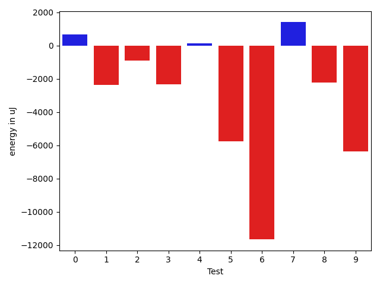

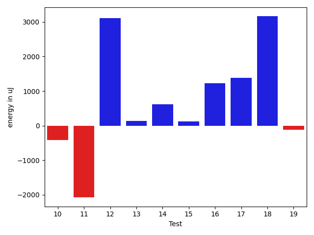

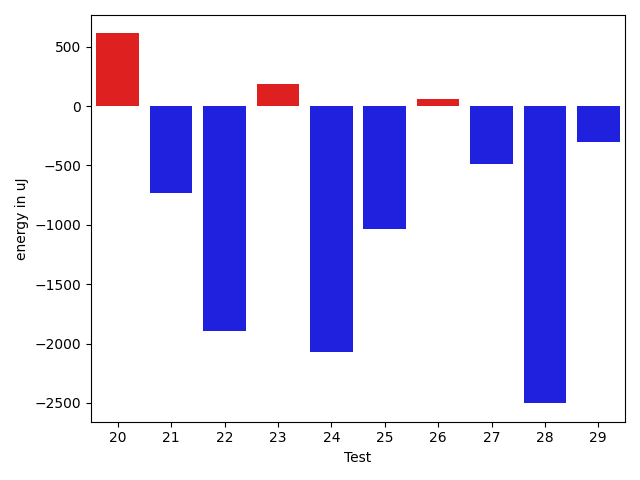

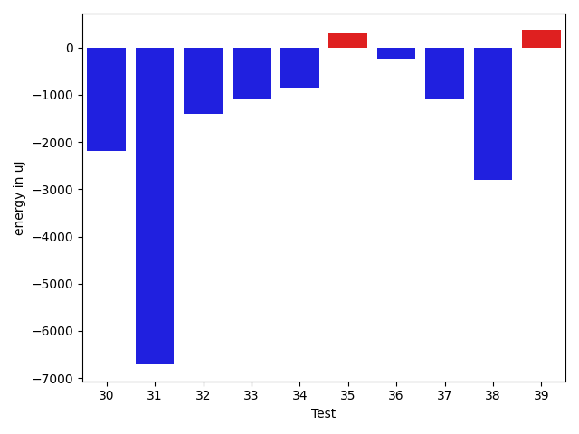

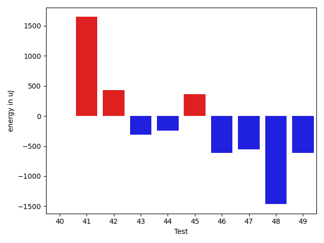

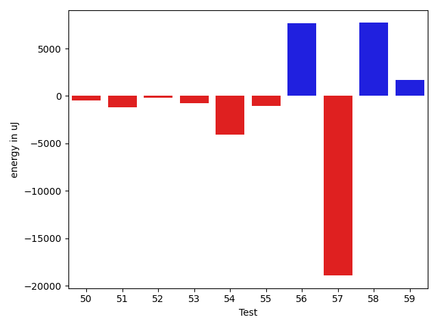

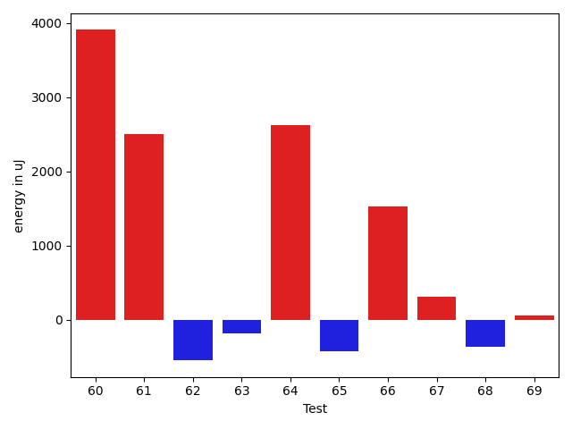

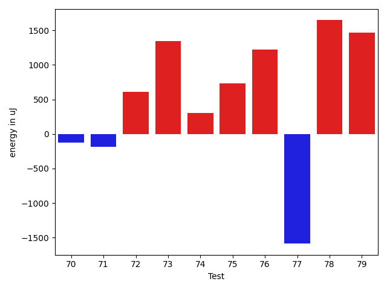

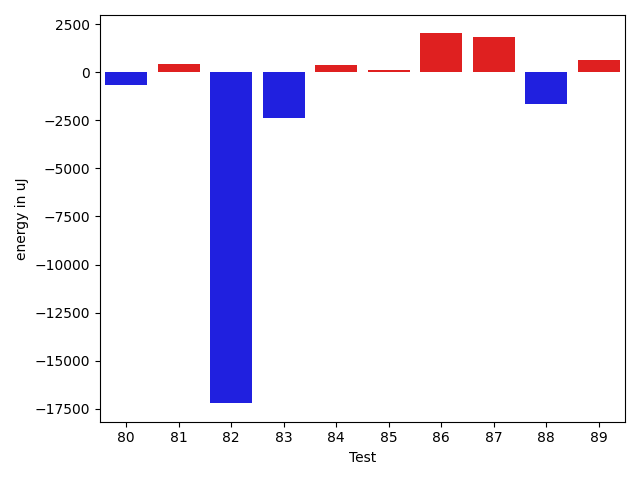

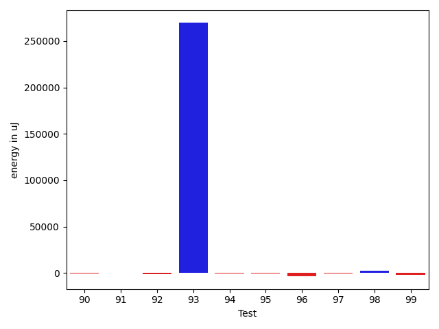

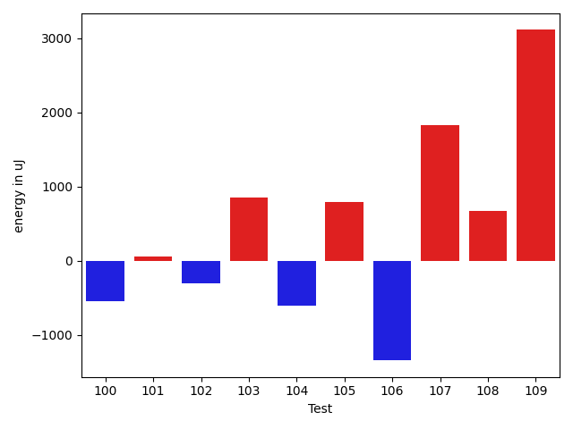

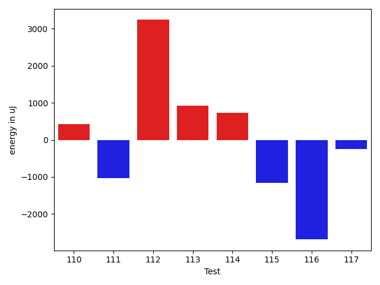

| ID | EnergyV1 | EnergyV2 | DeltaEnergy | σV1 | σV2 |
| --- | --- | --- | --- | --- | --- |
| 0 | 39866.19047619047 | 40518.90909090909 | 652.7186147186148 | 4508.912545688949 | 4497.195984055872 |
| 1 | 42637.87096774193 | 40258.37037037037 | -2379.5005973715597 | 10584.270291156301 | 5050.942120760268 |
| 2 | 44481.70175438596 | 43566.17543859649 | -915.5263157894733 | 15819.55286143104 | 16266.963651073966 |
| 3 | 40882.95744680851 | 38553.90909090909 | -2329.0483558994238 | 4579.744287934653 | 5324.327804286013 |
| 4 | 40127.642857142855 | 40252.5 | 124.85714285714494 | 4639.197138162453 | 5280.98371856175 |
| 5 | 91427.9696969697 | 85651.19191919192 | -5776.777777777781 | 30770.98117732425 | 17835.11619616883 |
| 6 | 125831.36363636363 | 114164.37373737374 | -11666.989898989894 | 67528.18506992073 | 53917.88234170417 |
| 7 | 73768.54545454546 | 75163.12121212122 | 1394.5757575757598 | 24446.059022731737 | 21501.787084419087 |
| 8 | 78864.04040404041 | 76640.76767676767 | -2223.272727272735 | 19469.81927819671 | 22496.36383764547 |
| 9 | 94273.14141414141 | 87906.44444444444 | -6366.696969696975 | 25536.64031476852 | 22196.33193248413 |
| 10 | 40207.34 | 39790.73333333333 | -416.60666666666657 | 6131.245193629105 | 4402.39607183785 |
| 11 | 40800.0625 | 38724.53571428572 | -2075.5267857142826 | 4086.551036154296 | 4333.191709534858 |
| 12 | 40598.38888888889 | 43715.3 | 3116.9111111111124 | 3875.959890270751 | 27059.696394145554 |
| 13 | 39236.0 | 39373.029411764706 | 137.0294117647063 | 5528.949702475145 | 4238.493485726586 |
| 14 | 41056.775 | 41678.107142857145 | 621.3321428571435 | 5541.962614848191 | 10453.58018418053 |
| 15 | 40134.77142857143 | 40262.06896551724 | 127.29753694580722 | 4229.612174627255 | 4126.653682577859 |
| 16 | 40835.5641025641 | 42066.954545454544 | 1231.3904428904425 | 6024.83115965096 | 8952.700592950978 |
| 17 | 39474.77777777778 | 40855.942307692305 | 1381.1645299145239 | 4141.633340651375 | 4505.867548214906 |
| 18 | 50915.0 | 54075.15151515151 | 3160.1515151515123 | 19288.6067487033 | 22350.53022820921 |
| 19 | 40554.67346938775 | 40434.72972972973 | -119.94373965802515 | 4487.625704624477 | 4840.363760334484 |
| 20 | 40012.30909090909 | 40184.48936170213 | 172.1802707930401 | 4431.77439478602 | 5004.49385232632 |
| 21 | 39741.59574468085 | 38883.42857142857 | -858.1671732522809 | 5375.645749075767 | 5351.944542664385 |
| 22 | 243555.82142857142 | 41346.25 | -202209.57142857142 | 492472.24087288516 | 4927.185016568791 |
| 23 | 58983.307692307695 | 51409.969696969696 | -7573.337995337999 | 52240.02935030483 | 29817.97531435638 |
| 24 | 41476.26190476191 | 40369.41379310345 | -1106.848111658459 | 4016.6841931618637 | 4567.23234323054 |
| 25 | 40288.194444444445 | 39906.8 | -381.39444444444234 | 4526.054701021167 | 3243.391973433574 |
| 26 | 39580.019230769234 | 40012.83928571428 | 432.82005494504847 | 5966.923351953811 | 5536.433314794906 |
| 27 | 39347.96226415094 | 38035.67213114754 | -1312.2901330034001 | 5632.491663393621 | 5606.323372884805 |
| 28 | 39379.84 | 38560.318181818184 | -819.5218181818127 | 4381.509800787852 | 4085.06172632082 |
| 29 | 173650.7794117647 | 90899.12 | -82751.6594117647 | 452587.6176640161 | 251285.3467942747 |
| 30 | 41832.05172413793 | 40397.68421052631 | -1434.3675136116144 | 8185.5385461451515 | 4843.393221727616 |
| 31 | 103491.26262626263 | 101156.59595959596 | -2334.6666666666715 | 32732.57127440583 | 35511.82424475384 |
| 32 | 47079.9358974359 | 44939.64 | -2140.295897435899 | 18595.165569232584 | 15687.500528883922 |
| 33 | 40818.05882352941 | 43994.19607843137 | 3176.137254901958 | 4982.5207432909 | 30549.201055641763 |
| 34 | 39347.71153846154 | 38518.98039215686 | -828.731146304679 | 4044.480504515422 | 4558.153261626717 |
| 35 | 42168.0 | 42077.01960784314 | -90.98039215686003 | 7689.940065006348 | 7696.774102690738 |
| 36 | 39655.92592592593 | 39833.27777777778 | 177.351851851854 | 5470.827193368314 | 4825.5257760613085 |
| 37 | 50187.28571428572 | 47093.13559322034 | -3094.1501210653805 | 27311.18753140387 | 22229.36158835162 |
| 38 | 41281.35294117647 | 38652.71428571428 | -2628.638655462186 | 5757.456903275924 | 5081.073819229808 |
| 39 | 54628.41860465116 | 52606.71590909091 | -2021.7026955602487 | 26172.619653861562 | 27001.865592933347 |
| 40 | 39974.02127659575 | 39729.0 | -245.02127659574762 | 4450.4634828648195 | 5567.626854367459 |
| 41 | 39541.675 | 41474.24137931035 | 1932.566379310345 | 5325.05027857719 | 5094.585690272481 |
| 42 | 49839.36923076923 | 48876.49206349206 | -962.8771672771691 | 25862.360591627385 | 19123.924113215686 |
| 43 | 41407.103896103894 | 43704.049382716046 | 2296.9454866121523 | 8812.915095625971 | 12350.882602441401 |
| 44 | 43168.379310344826 | 45090.380952380954 | 1922.001642036128 | 7097.20101902148 | 13478.151697774018 |
| 45 | 39833.92 | 40667.333333333336 | 833.4133333333375 | 4507.440106490601 | 4115.879897826628 |
| 46 | 39929.27272727273 | 40085.31034482759 | 156.03761755485903 | 5179.822984706384 | 4365.57120411165 |
| 47 | 40312.0 | 41006.80952380953 | 694.8095238095266 | 4090.967341531057 | 5677.699229014108 |
| 48 | 40086.0 | 39565.24 | -520.760000000002 | 4114.535472425308 | 3796.4424113108844 |
| 49 | 41898.25 | 42448.055555555555 | 549.8055555555547 | 6536.28800087306 | 10350.653441381384 |
| 50 | 39366.47169811321 | 38897.38636363636 | -469.0853344768475 | 4475.519148146438 | 4216.720808098446 |
| 51 | 40903.625 | 39710.0 | -1193.625 | 4419.803821178982 | 3814.4559099416642 |
| 52 | 40771.25 | 40578.36 | -192.88999999999942 | 4023.770875994308 | 4523.106630447706 |
| 53 | 39062.275862068964 | 38340.608695652176 | -721.667166416788 | 4861.671125322719 | 3746.129129591846 |
| 54 | 44607.36363636364 | 40518.392857142855 | -4088.9707792207846 | 28087.14043916872 | 4235.153449229485 |
| 55 | 41682.08 | 40640.25925925926 | -1041.820740740739 | 4470.655870630169 | 3519.885305292527 |
| 56 | 42165.63157894737 | 49835.125 | 7669.4934210526335 | 3988.8546332648625 | 45304.06648259486 |
| 57 | 137110.71951219512 | 118177.9512195122 | -18932.76829268293 | 419256.91651322506 | 395388.8906432133 |
| 58 | 92200.49494949495 | 99910.59595959596 | 7710.101010101003 | 32357.13748166778 | 35438.560376715715 |
| 59 | 159144.0707070707 | 160814.2626262626 | 1670.191919191915 | 299034.0067355691 | 265273.42513383063 |
| 60 | 38079.36842105263 | 39385.76666666667 | 1306.3982456140366 | 4256.591096053598 | 4625.772761988591 |
| 61 | 36717.583333333336 | 38672.28571428572 | 1954.7023809523816 | 4835.355372295699 | 5115.070707911942 |
| 62 | 39150.666666666664 | 39197.67567567567 | 47.00900900900888 | 4659.158165893793 | 4422.832289651203 |
| 63 | 39510.425531914894 | 42602.43661971831 | 3092.0110878034175 | 5301.070914466169 | 28683.896696766493 |
| 64 | 38369.807692307695 | 39422.0 | 1052.192307692305 | 5311.547015115933 | 4926.7555850269855 |
| 65 | 41031.098039215685 | 41232.54098360656 | 201.4429443908739 | 8552.486658815193 | 10381.933563195991 |
| 66 | 37800.382352941175 | 39344.857142857145 | 1544.4747899159702 | 5132.846131789824 | 4121.521945958848 |
| 67 | 38971.903225806454 | 39419.857142857145 | 447.9539170506905 | 4727.127432683436 | 3905.2045100488813 |
| 68 | 39410.83870967742 | 39603.83870967742 | 193.0 | 4455.9958381341985 | 4617.535853794988 |
| 69 | 39020.307692307695 | 39173.58823529412 | 153.28054298642382 | 4226.535303834125 | 4276.048011324909 |
| 70 | 176197.58620689655 | 105344.27710843373 | -70853.30909846282 | 518509.23444935307 | 385742.189206489 |
| 71 | 41222.02127659575 | 41544.46153846154 | 322.4402618657914 | 4942.885467439859 | 4522.478755580235 |
| 72 | 39329.05263157895 | 40155.545454545456 | 826.4928229665093 | 4843.494426587875 | 4495.43837206393 |
| 73 | 40079.28813559322 | 40672.07843137255 | 592.790295779334 | 5130.049476256763 | 5572.901327812542 |
| 74 | 40497.92 | 41298.403846153844 | 800.4838461538457 | 5124.814001854116 | 4733.4970820071085 |
| 75 | 59106.532258064515 | 65633.33928571429 | 6526.807027649775 | 36050.602328518165 | 39974.976446556444 |
| 76 | 43975.34246575343 | 42206.14492753623 | -1769.197538217195 | 10847.589776130473 | 8178.855083185519 |
| 77 | 65283.0 | 68144.91489361702 | 2861.914893617024 | 35642.71305049603 | 48961.389942040936 |
| 78 | 44576.35849056604 | 47444.023255813954 | 2867.664765247915 | 23347.42076667978 | 23959.87254255066 |
| 79 | 40849.444444444445 | 42328.53658536585 | 1479.092140921406 | 6743.997135084259 | 7067.557711455851 |
| 80 | 118519.76190476191 | 39932.15625 | -78587.60565476191 | 350955.93914491055 | 4891.601380870679 |
| 81 | 125502.28947368421 | 84924.37837837837 | -40577.91109530584 | 352021.2026074645 | 247634.7466453912 |
| 82 | 260666.35353535353 | 286508.82828282827 | 25842.474747474742 | 243813.91021479602 | 375319.7415663276 |
| 83 | 55472.64864864865 | 52650.044444444444 | -2822.6042042042027 | 35723.56236300601 | 32404.591418813587 |
| 84 | 39609.859375 | 41365.357142857145 | 1755.497767857145 | 4519.557403203284 | 9254.80284274945 |
| 85 | 39227.431818181816 | 39179.5 | -47.9318181818162 | 4225.5909398338335 | 4933.227405957371 |
| 86 | 38275.51351351351 | 39697.882352941175 | 1422.3688394276614 | 5039.197440506969 | 4905.6348019077595 |
| 87 | 41320.69736842105 | 44755.81690140845 | 3435.1195329873954 | 10290.465294349115 | 14625.559104093083 |
| 88 | 41068.34328358209 | 41329.987341772154 | 261.6440581900606 | 7155.061908328056 | 10685.034428895176 |
| 89 | 45336.391304347824 | 46869.58064516129 | 1533.1893408134638 | 15258.644274893833 | 16235.659614062848 |
| 90 | 48780.16455696202 | 48247.808988764045 | -532.3555681979778 | 27054.553643918338 | 22184.954501236683 |
| 91 | 41323.670731707316 | 41608.743902439026 | 285.07317073171 | 9948.151930414351 | 10197.611805318684 |
| 92 | 52318.256097560974 | 51518.9125 | -799.3435975609755 | 21647.173041824808 | 21012.248456075416 |
| 93 | 51420.52380952381 | 320827.6909090909 | 269407.16709956713 | 21478.513073225873 | 762842.5821427708 |
| 94 | 39902.854166666664 | 39827.913043478264 | -74.94112318840052 | 5029.191854353869 | 4680.6530240522 |
| 95 | 40285.06060606061 | 40020.51515151515 | -264.54545454545587 | 5017.057805789159 | 5704.488674513188 |
| 96 | 43924.757575757576 | 40369.87096774193 | -3554.886608015644 | 8585.29180962313 | 6257.485157751452 |
| 97 | 41719.666666666664 | 40953.14893617021 | -766.5177304964527 | 7029.687483783196 | 6533.230545510905 |
| 98 | 68260.0303030303 | 70885.62626262626 | 2625.5959595959575 | 24080.57539181948 | 27013.63920060236 |
| 99 | 39836.55263157895 | 38188.117647058825 | -1648.4349845201214 | 5233.257492620826 | 4764.580092384575 |
| 100 | 50586.795454545456 | 54072.406593406595 | 3485.611138861139 | 34643.52823372481 | 33630.11808999144 |
| 101 | 46340.23943661972 | 47974.44776119403 | 1634.2083245743124 | 20032.057809860664 | 20612.923507616608 |
| 102 | 74950.91525423729 | 230071.4090909091 | 155120.4938366718 | 252228.77355795895 | 657667.1523226481 |
| 103 | 43116.81481481482 | 46995.96610169492 | 3879.1512868801 | 11170.087477813357 | 22374.049080799778 |
| 104 | 39817.36956521739 | 39803.51162790698 | -13.857937310414854 | 5053.475839367764 | 4919.415641096491 |
| 105 | 40177.15789473684 | 39899.72222222222 | -277.4356725146208 | 5567.432567721128 | 5403.637928958967 |
| 106 | 39815.125 | 39614.24 | -200.88500000000204 | 5602.662732371844 | 5962.639142393241 |
| 107 | 79697.77358490566 | 75987.38461538461 | -3710.388969521053 | 281993.35585466394 | 238270.7265549933 |
| 108 | 40165.61538461538 | 41799.31578947369 | 1633.700404858304 | 5102.572451352531 | 5284.922586224161 |
| 109 | 163541.33333333334 | 339046.35 | 175505.01666666663 | 460046.12247631093 | 703578.1473376127 |
| 110 | 45046.94827586207 | 43679.267857142855 | -1367.6804187192174 | 15692.517511290283 | 13274.788571750629 |
| 111 | 41383.48484848485 | 40737.5 | -645.984848484848 | 4956.67278507017 | 3923.2081295513467 |
| 112 | 41845.234375 | 45734.3125 | 3889.078125 | 10321.385311184897 | 21931.224008872457 |
| 113 | 245318.95454545456 | 350047.9 | 104728.94545454546 | 647954.9308583034 | 739908.7302410954 |
| 114 | 43263.967741935485 | 42690.25 | -573.7177419354848 | 6337.779383592368 | 6596.889224285944 |
| 115 | 168617.38461538462 | 113828.25 | -54789.134615384624 | 513336.4610877007 | 390565.7880853803 |
| 116 | 260096.3650793651 | 91898.59701492537 | -168197.7680644397 | 673553.0466061939 | 274038.86957799224 |
| 117 | 42917.10526315789 | 46824.125 | 3907.019736842107 | 5474.837184743121 | 13271.012019663069 |

## Delta Duration per test method

| ID | DurationV1 | DurationsV2 | DeltaDuration |
| --- | --- | --- | --- |
| 0 | 744217.9047619047 | 724690.3636363636 | -19527.541125541087 |
| 1 | 874628.5161290322 | 671030.8148148148 | -203597.7013142174 |
| 2 | 1000194.2807017544 | 980982.1754385965 | -19212.105263157864 |
| 3 | 943157.9574468085 | 797616.6363636364 | -145541.3210831721 |
| 4 | 943957.3571428572 | 782462.7857142857 | -161494.57142857148 |
| 5 | 2593814.707070707 | 2434387.8282828284 | -159426.87878787844 |
| 6 | 3475392.888888889 | 3126513.757575758 | -348879.1313131312 |
| 7 | 2180854.3535353537 | 2073937.7878787878 | -106916.56565656583 |
| 8 | 2278421.8181818184 | 2196711.696969697 | -81710.12121212156 |
| 9 | 2663599.3131313133 | 2453890.9292929294 | -209708.38383838395 |
| 10 | 935211.5 | 764330.8666666667 | -170880.6333333333 |
| 11 | 645560.46875 | 595621.3928571428 | -49939.07589285716 |
| 12 | 536987.9722222222 | 696462.3666666667 | 159474.39444444445 |
| 13 | 631120.09375 | 556533.6176470588 | -74586.4761029412 |
| 14 | 779944.75 | 751366.5714285715 | -28578.17857142852 |
| 15 | 597136.8857142857 | 573578.1724137932 | -23558.713300492498 |
| 16 | 783902.2564102564 | 740286.9318181818 | -43615.32459207461 |
| 17 | 801889.074074074 | 804446.6923076923 | 2557.61823361821 |
| 18 | 1538085.5 | 1526513.2828282828 | -11572.217171717202 |
| 19 | 711558.4285714285 | 712828.3513513514 | 1269.9227799228393 |
| 20 | 875443.4545454546 | 888536.914893617 | 13093.46034816245 |
| 21 | 698767.8297872341 | 668123.2857142857 | -30644.544072948396 |
| 22 | 7377077.642857143 | 540904.0 | -6836173.642857143 |
| 23 | 1438513.8461538462 | 1049384.2121212122 | -389129.6340326341 |
| 24 | 676946.9761904762 | 674933.6896551724 | -2013.2865353038069 |
| 25 | 591478.3611111111 | 699305.1 | 107826.73888888885 |
| 26 | 905185.0769230769 | 850109.6607142857 | -55075.4162087912 |
| 27 | 889564.0 | 867090.1803278689 | -22473.819672131096 |
| 28 | 541634.36 | 507712.7727272727 | -33921.58727272728 |
| 29 | 5273261.0 | 2519560.1333333333 | -2753700.8666666667 |
| 30 | 916238.5 | 897730.6315789474 | -18507.868421052583 |
| 31 | 2790774.888888889 | 2758745.1515151514 | -32029.73737373762 |
| 32 | 1276835.1666666667 | 1193101.7466666666 | -83733.42000000016 |
| 33 | 842814.6078431372 | 1056988.450980392 | 214173.84313725482 |
| 34 | 781033.8461538461 | 744162.7843137255 | -36871.06184012059 |
| 35 | 955830.5762711865 | 921366.7647058824 | -34463.81156530406 |
| 36 | 798178.7592592592 | 836477.7962962963 | 38299.03703703708 |
| 37 | 1347920.6 | 1214008.6610169492 | -133911.93898305087 |
| 38 | 560989.5294117647 | 588238.5238095238 | 27248.99439775909 |
| 39 | 1485831.7674418604 | 1494767.2045454546 | 8935.437103594188 |
| 40 | 788704.0 | 796689.947368421 | 7985.94736842101 |
| 41 | 719644.075 | 759990.5172413794 | 40346.44224137941 |
| 42 | 1308772.553846154 | 1319123.2222222222 | 10350.668376068352 |
| 43 | 1134338.3376623376 | 1167472.4444444445 | 33134.106782106915 |
| 44 | 869452.8620689656 | 741579.2380952381 | -127873.62397372746 |
| 45 | 559509.16 | 669343.1851851852 | 109834.02518518514 |
| 46 | 581947.2954545454 | 576267.3793103448 | -5679.916144200601 |
| 47 | 485199.94736842107 | 537440.9523809524 | 52241.00501253136 |
| 48 | 479783.6538461539 | 580624.64 | 100840.98615384614 |
| 49 | 721390.1785714285 | 818205.1388888889 | 96814.96031746035 |
| 50 | 703534.4528301887 | 773989.6818181818 | 70455.22898799309 |
| 51 | 465826.6666666667 | 504118.3888888889 | 38291.72222222219 |
| 52 | 453343.8125 | 453770.28 | 426.46750000002794 |
| 53 | 479808.1379310345 | 508971.17391304346 | 29163.035982008965 |
| 54 | 723686.9090909091 | 617200.4285714285 | -106486.48051948054 |
| 55 | 470270.36 | 489126.14814814815 | 18855.78814814816 |
| 56 | 462289.84210526315 | 710991.125 | 248701.28289473685 |
| 57 | 3938187.7682926827 | 3291086.975609756 | -647100.7926829266 |
| 58 | 2655018.393939394 | 2706581.0808080807 | 51562.686868686695 |
| 59 | 4692620.242424242 | 4552380.878787879 | -140239.3636363633 |
| 60 | 522854.55263157893 | 557072.5 | 34217.94736842107 |
| 61 | 548208.75 | 748011.75 | 199803.0 |
| 62 | 563434.3703703703 | 540034.8918918918 | -23399.4784784785 |
| 63 | 998381.0638297872 | 969001.5774647887 | -29379.486364998505 |
| 64 | 718687.1153846154 | 673261.4054054054 | -45425.70997920993 |
| 65 | 905198.5882352941 | 972412.8524590164 | 67214.26422372228 |
| 66 | 566153.3823529412 | 545242.0571428571 | -20911.32521008409 |
| 67 | 642479.6774193548 | 617644.9285714285 | -24834.74884792627 |
| 68 | 621718.9354838709 | 555611.5483870967 | -66107.38709677418 |
| 69 | 542922.5384615385 | 540578.0 | -2344.5384615384974 |
| 70 | 5209292.264367816 | 2985436.060240964 | -2223856.204126852 |
| 71 | 727063.5957446808 | 715693.5384615385 | -11370.057283142349 |
| 72 | 605033.8421052631 | 527245.2272727273 | -77788.61483253585 |
| 73 | 941383.6440677966 | 952510.8431372549 | 11127.199069458293 |
| 74 | 887150.52 | 850416.6923076923 | -36733.827692307765 |
| 75 | 1443836.0322580645 | 1554490.875 | 110654.84274193551 |
| 76 | 1124136.5479452056 | 1041397.0724637681 | -82739.47548143752 |
| 77 | 1571994.342857143 | 1544431.2340425532 | -27563.10881458968 |
| 78 | 1067911.7547169812 | 1018642.1627906977 | -49269.59192628355 |
| 79 | 852914.3888888889 | 720051.756097561 | -132862.6327913279 |
| 80 | 3218000.738095238 | 691278.65625 | -2526722.081845238 |
| 81 | 3493592.0 | 2114977.5945945946 | -1378614.4054054054 |
| 82 | 7041121.101010101 | 8093119.484848484 | 1051998.3838383835 |
| 83 | 1180196.3513513512 | 1184564.0222222223 | 4367.67087087105 |
| 84 | 1003394.734375 | 1052981.2857142857 | 49586.55133928568 |
| 85 | 639650.0454545454 | 747096.9722222222 | 107446.92676767684 |
| 86 | 631116.9189189189 | 681625.9705882353 | 50509.051669316366 |
| 87 | 1117442.2894736843 | 1165510.352112676 | 48068.062638991745 |
| 88 | 1056294.537313433 | 1082483.5189873418 | 26188.981673908886 |
| 89 | 1275548.4782608696 | 1405811.8602150537 | 130263.38195418403 |
| 90 | 1330784.0253164556 | 1413335.5617977527 | 82551.53648129711 |
| 91 | 1083005.219512195 | 1154229.3292682928 | 71224.10975609766 |
| 92 | 1466481.963414634 | 1406384.4375 | -60097.52591463411 |
| 93 | 1204735.238095238 | 9414495.581818182 | 8209760.343722944 |
| 94 | 812455.1666666666 | 850341.9130434783 | 37886.74637681164 |
| 95 | 766559.9090909091 | 891410.3636363636 | 124850.45454545459 |
| 96 | 677483.8484848485 | 696751.9354838709 | 19268.086999022402 |
| 97 | 799509.3333333334 | 938968.8510638297 | 139459.51773049636 |
| 98 | 1975409.393939394 | 2104529.9696969697 | 129120.57575757569 |
| 99 | 617014.3157894737 | 687178.2352941176 | 70163.91950464388 |
| 100 | 1415029.5681818181 | 1583348.3406593406 | 168318.7724775225 |
| 101 | 1209629.028169014 | 1281093.2686567164 | 71464.24048770242 |
| 102 | 2045534.0169491526 | 6703180.378787879 | 4657646.361838726 |
| 103 | 887921.1666666666 | 1067150.847457627 | 179229.68079096044 |
| 104 | 789704.5869565217 | 829663.1395348837 | 39958.55257836194 |
| 105 | 462427.6842105263 | 496195.55555555556 | 33767.87134502927 |
| 106 | 561986.4166666666 | 681986.4 | 119999.9833333334 |
| 107 | 2065137.7547169812 | 2011197.25 | -53940.5047169812 |
| 108 | 514558.76923076925 | 523020.3157894737 | 8461.54655870446 |
| 109 | 4339430.933333334 | 9647995.15 | 5308564.216666667 |
| 110 | 1041651.1379310344 | 1036628.5178571428 | -5022.620073891594 |
| 111 | 446124.7878787879 | 454906.1666666667 | 8781.378787878784 |
| 112 | 877782.859375 | 1077497.21875 | 199714.359375 |
| 113 | 6650222.818181818 | 9633462.65 | 2983239.831818182 |
| 114 | 788041.6774193548 | 796685.1875 | 8643.51008064521 |
| 115 | 4656559.673076923 | 3112341.283333333 | -1544218.3897435898 |
| 116 | 7248250.317460317 | 2487262.8656716417 | -4760987.451788675 |
| 117 | 658496.5263157894 | 766308.3333333334 | 107811.80701754394 |

## Misc.

| ID | Test Class | Test Method |
| --- | --- | --- |
| 0 | com.google.gson.internal.bind.MiniGsonTest | testSerializeRecursive |
| 1 | com.google.gson.internal.bind.MiniGsonTest | testDeserializeNullObject |
| 2 | com.google.gson.internal.bind.MiniGsonTest | testSerializeWithCustomTypeAdapter |
| 3 | com.google.gson.internal.bind.MiniGsonTest | testDeserializeWithCustomTypeAdapter |
| 4 | com.google.gson.internal.bind.MiniGsonTest | testDeserialize |
| 5 | com.google.gson.functional.DefaultTypeAdaptersTest | testDateSerializationWithPatternNotOverridenByTypeAdapter |
| 6 | com.google.gson.functional.DefaultTypeAdaptersTest | testDateSerializationWithPattern |
| 7 | com.google.gson.functional.DefaultTypeAdaptersTest | testSqlDateSerialization |
| 8 | com.google.gson.functional.DefaultTypeAdaptersTest | testTimestampSerialization |
| 9 | com.google.gson.functional.DefaultTypeAdaptersTest | testDateDeserializationWithPattern |
| 10 | com.google.gson.functional.DefaultTypeAdaptersTest | testBitSetDeserialization |
| 11 | com.google.gson.functional.DefaultTypeAdaptersTest | testDefaultCalendarDeserialization |
| 12 | com.google.gson.functional.DefaultTypeAdaptersTest | testDefaultGregorianCalendarDeserialization |
| 13 | com.google.gson.functional.DefaultTypeAdaptersTest | testBitSetSerialization |
| 14 | com.google.gson.functional.DefaultTypeAdaptersTest | testSetSerialization |
| 15 | com.google.gson.functional.NullObjectAndFieldTest | testCustomTypeAdapterPassesNullSerialization |
| 16 | com.google.gson.functional.NullObjectAndFieldTest | testExplicitDeserializationOfNulls |
| 17 | com.google.gson.functional.NullObjectAndFieldTest | testNullWrappedPrimitiveMemberSerialization |
| 18 | com.google.gson.functional.NullObjectAndFieldTest | testExplicitSerializationOfNullArrayMembers |
| 19 | com.google.gson.functional.NullObjectAndFieldTest | testExplicitSerializationOfNullCollectionMembers |
| 20 | com.google.gson.functional.NullObjectAndFieldTest | testPrintPrintingObjectWithNulls |
| 21 | com.google.gson.functional.NullObjectAndFieldTest | testPrintPrintingArraysWithNulls |
| 22 | com.google.gson.functional.NullObjectAndFieldTest | testTopLevelNullObjectSerialization |
| 23 | com.google.gson.functional.NullObjectAndFieldTest | testExplicitSerializationOfNulls |
| 24 | com.google.gson.functional.NullObjectAndFieldTest | testExplicitSerializationOfNullStringMembers |
| 25 | com.google.gson.functional.NullObjectAndFieldTest | testCustomSerializationOfNulls |
| 26 | com.google.gson.functional.CustomTypeAdaptersTest | testCustomTypeAdapterAppliesToSubClassesSerializedAsBaseClass |
| 27 | com.google.gson.functional.CustomTypeAdaptersTest | testCustomAdapterInvokedForMapElementSerializationWithType |
| 28 | com.google.gson.functional.CustomTypeAdaptersTest | testCustomAdapterInvokedForMapElementSerialization |
| 29 | com.google.gson.functional.CustomTypeAdaptersTest | testCustomSerializers |
| 30 | com.google.gson.functional.CustomTypeAdaptersTest | testCustomNestedDeserializers |
| 31 | com.google.gson.functional.CustomTypeAdaptersTest | testCustomTypeAdapterDoesNotAppliesToSubClasses |
| 32 | com.google.gson.functional.CustomTypeAdaptersTest | testCustomAdapterInvokedForCollectionElementSerializationWithType |
| 33 | com.google.gson.functional.CustomTypeAdaptersTest | testCustomByteArraySerializer |
| 34 | com.google.gson.functional.CustomTypeAdaptersTest | testEnsureCustomSerializerNotInvokedForNullValues |
| 35 | com.google.gson.functional.CustomTypeAdaptersTest | testCustomDeserializers |
| 36 | com.google.gson.functional.CustomTypeAdaptersTest | testCustomByteArrayDeserializerAndInstanceCreator |
| 37 | com.google.gson.functional.CustomTypeAdaptersTest | testCustomNestedSerializers |
| 38 | com.google.gson.functional.CustomTypeAdaptersTest | testCustomAdapterInvokedForCollectionElementSerialization |
| 39 | com.google.gson.functional.MapTest | testSerializeMaps |
| 40 | com.google.gson.functional.MapTest | testMapSerializationWithNullValueButSerializeNulls |
| 41 | com.google.gson.functional.MapTest | testMapSerializationWithNullValuesSerialized |
| 42 | com.google.gson.functional.ReadersWritersTest | testReadWriteTwoObjects |
| 43 | com.google.gson.functional.ReadersWritersTest | testReadWriteTwoStrings |
| 44 | com.google.gson.functional.ReadersWritersTest | testTopLevelNullObjectSerializationWithWriterAndSerializeNulls |
| 45 | com.google.gson.functional.CollectionTest | testRawCollectionOfBagOfPrimitivesNotAllowed |
| 46 | com.google.gson.functional.CollectionTest | testRawCollectionDeserializationNotAlllowed |
| 47 | com.google.gson.functional.PrimitiveTest | testDoubleInfinitySerialization |
| 48 | com.google.gson.functional.PrimitiveTest | testDoubleNaNSerialization |
| 49 | com.google.gson.functional.PrimitiveTest | testMoreSpecificSerialization |
| 50 | com.google.gson.functional.PrimitiveTest | testHtmlCharacterSerialization |
| 51 | com.google.gson.functional.PrimitiveTest | testFloatNaNSerialization |
| 52 | com.google.gson.functional.PrimitiveTest | testNegativeInfinityFloatSerialization |
| 53 | com.google.gson.functional.PrimitiveTest | testLongAsStringDeserialization |
| 54 | com.google.gson.functional.PrimitiveTest | testLongAsStringSerialization |
| 55 | com.google.gson.functional.PrimitiveTest | testNegativeInfinitySerialization |
| 56 | com.google.gson.functional.PrimitiveTest | testFloatInfinitySerialization |
| 57 | com.google.gson.JsonParserTest | testReadWriteTwoObjects |
| 58 | com.google.gson.functional.NamingPolicyTest | testGsonWithNonDefaultFieldNamingPolicySerialization |
| 59 | com.google.gson.functional.NamingPolicyTest | testGsonDuplicateNameUsingSerializedNameFieldNamingPolicySerialization |
| 60 | com.google.gson.functional.NamingPolicyTest | testGsonWithLowerCaseDashPolicyDeserialiation |
| 61 | com.google.gson.functional.NamingPolicyTest | testGsonWithSerializedNameFieldNamingPolicyDeserialization |
| 62 | com.google.gson.functional.NamingPolicyTest | testGsonWithUpperCamelCaseSpacesPolicyDeserialiation |
| 63 | com.google.gson.functional.NamingPolicyTest | testGsonWithSerializedNameFieldNamingPolicySerialization |
| 64 | com.google.gson.functional.NamingPolicyTest | testGsonWithNonDefaultFieldNamingPolicyDeserialiation |
| 65 | com.google.gson.functional.NamingPolicyTest | testComplexFieldNameStrategy |
| 66 | com.google.gson.functional.NamingPolicyTest | testGsonWithUpperCamelCaseSpacesPolicySerialiation |
| 67 | com.google.gson.functional.NamingPolicyTest | testGsonWithLowerCaseDashPolicySerialization |
| 68 | com.google.gson.functional.NamingPolicyTest | testGsonWithLowerCaseUnderscorePolicyDeserialiation |
| 69 | com.google.gson.functional.NamingPolicyTest | testGsonWithLowerCaseUnderscorePolicySerialization |
| 70 | com.google.gson.functional.FieldExclusionTest | testDefaultInnerClassExclusion |
| 71 | com.google.gson.functional.FieldExclusionTest | testDefaultNestedStaticClassIncluded |
| 72 | com.google.gson.functional.FieldExclusionTest | testInnerClassExclusion |
| 73 | com.google.gson.functional.CustomDeserializerTest | testCustomDeserializerReturnsNull |
| 74 | com.google.gson.functional.CustomDeserializerTest | testCustomDeserializerReturnsNullForArrayElements |
| 75 | com.google.gson.functional.CustomDeserializerTest | testCustomDeserializerReturnsNullForTopLevelObject |
| 76 | com.google.gson.functional.TypeVariableTest | testBasicTypeVariables |
| 77 | com.google.gson.functional.SecurityTest | testJsonWithNonExectuableTokenSerialization |
| 78 | com.google.gson.functional.SecurityTest | testNonExecutableJsonSerialization |
| 79 | com.google.gson.functional.SecurityTest | testNonExecutableJsonDeserialization |
| 80 | com.google.gson.functional.SecurityTest | testJsonWithNonExectuableTokenWithConfiguredGsonDeserialization |
| 81 | com.google.gson.functional.SecurityTest | testJsonWithNonExectuableTokenWithRegularGsonDeserialization |
| 82 | com.google.gson.functional.VersioningTest | testVersionedUntilSerialization |
| 83 | com.google.gson.functional.VersioningTest | testVersionedGsonWithUnversionedClassesSerialization |
| 84 | com.google.gson.functional.VersioningTest | testVersionedClassesSerialization |
| 85 | com.google.gson.functional.VersioningTest | testVersionedGsonWithUnversionedClassesDeserialization |
| 86 | com.google.gson.functional.VersioningTest | testIgnoreLaterVersionClassSerialization |
| 87 | com.google.gson.functional.VersioningTest | testVersionedGsonMixingSinceAndUntilSerialization |
| 88 | com.google.gson.functional.ParameterizedTypesTest | testParameterizedTypeWithReaderDeserialization |
| 89 | com.google.gson.functional.ParameterizedTypesTest | testParameterizedTypeWithCustomSerializer |
| 90 | com.google.gson.functional.ParameterizedTypesTest | testParameterizedTypeDeserialization |
| 91 | com.google.gson.functional.ParameterizedTypesTest | testParameterizedTypesWithCustomDeserializer |
| 92 | com.google.gson.functional.EscapingTest | testGsonAcceptsEscapedAndNonEscapedJsonDeserialization |
| 93 | com.google.gson.functional.CustomSerializerTest | testSubClassSerializerInvokedForBaseClassFieldsHoldingSubClassInstances |
| 94 | com.google.gson.functional.CustomSerializerTest | testSerializerReturnsNull |
| 95 | com.google.gson.functional.CustomSerializerTest | testBaseClassSerializerInvokedForBaseClassFieldsHoldingSubClassInstances |
| 96 | com.google.gson.functional.CustomSerializerTest | testBaseClassSerializerInvokedForBaseClassFields |
| 97 | com.google.gson.functional.CustomSerializerTest | testSubClassSerializerInvokedForBaseClassFieldsHoldingArrayOfSubClassInstances |
| 98 | com.google.gson.functional.UncategorizedTest | testReturningDerivedClassesDuringDeserialization |
| 99 | com.google.gson.MixedStreamTest | testWriteInvalidState |
| 100 | com.google.gson.MixedStreamTest | testWriteHtmlSafe |
| 101 | com.google.gson.MixedStreamTest | testWriteLenient |
| 102 | com.google.gson.MixedStreamTest | testWriteMixedStreamed |
| 103 | com.google.gson.MixedStreamTest | testReadClosed |
| 104 | com.google.gson.MixedStreamTest | testWriteDoesNotMutateState |
| 105 | com.google.gson.MixedStreamTest | testWriteNulls |
| 106 | com.google.gson.MixedStreamTest | testWriteClosed |
| 107 | com.google.gson.DefaultMapJsonSerializerTest | testNonEmptyMapSerialization |
| 108 | com.google.gson.JsonObjectTest | testWritePropertyWithEmptyStringName |
| 109 | com.google.gson.JsonObjectTest | testPropertyWithQuotes |
| 110 | com.google.gson.functional.ObjectTest | testInnerClassDeserialization |
| 111 | com.google.gson.functional.ObjectTest | testJsonObjectSerialization |
| 112 | com.google.gson.functional.TypeHierarchyAdapterTest | testRegisterSuperTypeFirst |
| 113 | com.google.gson.GsonBuilderTest | testCreatingMoreThanOnce |
| 114 | com.google.gson.functional.ArrayTest | testNullsInArrayWithSerializeNullPropertySetSerialization |
| 115 | com.google.gson.FunctionWithInternalDependenciesTest | testAnonymousLocalClassesSerialization |
| 116 | com.google.gson.functional.InstanceCreatorTest | testInstanceCreatorReturnsBaseType |
| 117 | com.google.gson.functional.PrintFormattingTest | testJsonObjectWithNullValuesSerialized |

| Test | IterationV1 | IterationV2 | DeltaIteration |
| --- | --- | --- | --- |
| 0 | 42 | 44 | 2 |
| 1 | 31 | 27 | -4 |
| 2 | 57 | 57 | 0 |
| 3 | 47 | 33 | -14 |
| 4 | 42 | 28 | -14 |
| 5 | 99 | 99 | 0 |
| 6 | 99 | 99 | 0 |
| 7 | 99 | 99 | 0 |
| 8 | 99 | 99 | 0 |
| 9 | 99 | 99 | 0 |
| 10 | 50 | 45 | -5 |
| 11 | 32 | 28 | -4 |
| 12 | 36 | 30 | -6 |
| 13 | 32 | 34 | 2 |
| 14 | 40 | 28 | -12 |
| 15 | 35 | 29 | -6 |
| 16 | 39 | 44 | 5 |
| 17 | 54 | 52 | -2 |
| 18 | 98 | 99 | 1 |
| 19 | 49 | 37 | -12 |
| 20 | 55 | 47 | -8 |
| 21 | 47 | 28 | -19 |
| 22 | 28 | 24 | -4 |
| 23 | 39 | 33 | -6 |
| 24 | 42 | 29 | -13 |
| 25 | 36 | 30 | -6 |
| 26 | 52 | 56 | 4 |
| 27 | 53 | 61 | 8 |
| 28 | 25 | 22 | -3 |
| 29 | 68 | 75 | 7 |
| 30 | 58 | 57 | -1 |
| 31 | 99 | 99 | 0 |
| 32 | 78 | 75 | -3 |
| 33 | 51 | 51 | 0 |
| 34 | 52 | 51 | -1 |
| 35 | 59 | 51 | -8 |
| 36 | 54 | 54 | 0 |
| 37 | 70 | 59 | -11 |
| 38 | 17 | 21 | 4 |
| 39 | 86 | 88 | 2 |
| 40 | 47 | 38 | -9 |
| 41 | 40 | 29 | -11 |
| 42 | 65 | 63 | -2 |
| 43 | 77 | 81 | 4 |
| 44 | 29 | 21 | -8 |
| 45 | 25 | 27 | 2 |
| 46 | 44 | 29 | -15 |
| 47 | 19 | 21 | 2 |
| 48 | 26 | 25 | -1 |
| 49 | 28 | 36 | 8 |
| 50 | 53 | 44 | -9 |
| 51 | 24 | 18 | -6 |
| 52 | 16 | 25 | 9 |
| 53 | 29 | 23 | -6 |
| 54 | 33 | 28 | -5 |
| 55 | 25 | 27 | 2 |
| 56 | 19 | 24 | 5 |
| 57 | 82 | 82 | 0 |
| 58 | 99 | 99 | 0 |
| 59 | 99 | 99 | 0 |
| 60 | 38 | 30 | -8 |
| 61 | 24 | 28 | 4 |
| 62 | 27 | 37 | 10 |
| 63 | 47 | 71 | 24 |
| 64 | 26 | 37 | 11 |
| 65 | 51 | 61 | 10 |
| 66 | 34 | 35 | 1 |
| 67 | 31 | 42 | 11 |
| 68 | 31 | 31 | 0 |
| 69 | 26 | 34 | 8 |
| 70 | 87 | 83 | -4 |
| 71 | 47 | 39 | -8 |
| 72 | 19 | 22 | 3 |
| 73 | 59 | 51 | -8 |
| 74 | 50 | 52 | 2 |
| 75 | 62 | 56 | -6 |
| 76 | 73 | 69 | -4 |
| 77 | 35 | 47 | 12 |
| 78 | 53 | 43 | -10 |
| 79 | 36 | 41 | 5 |
| 80 | 42 | 32 | -10 |
| 81 | 38 | 37 | -1 |
| 82 | 99 | 99 | 0 |
| 83 | 37 | 45 | 8 |
| 84 | 64 | 56 | -8 |
| 85 | 44 | 36 | -8 |
| 86 | 37 | 34 | -3 |
| 87 | 76 | 71 | -5 |
| 88 | 67 | 79 | 12 |
| 89 | 92 | 93 | 1 |
| 90 | 79 | 89 | 10 |
| 91 | 82 | 82 | 0 |
| 92 | 82 | 80 | -2 |
| 93 | 63 | 55 | -8 |
| 94 | 48 | 46 | -2 |
| 95 | 33 | 33 | 0 |
| 96 | 33 | 31 | -2 |
| 97 | 39 | 47 | 8 |
| 98 | 99 | 99 | 0 |
| 99 | 38 | 34 | -4 |
| 100 | 88 | 91 | 3 |
| 101 | 71 | 67 | -4 |
| 102 | 59 | 66 | 7 |
| 103 | 54 | 59 | 5 |
| 104 | 46 | 43 | -3 |
| 105 | 19 | 18 | -1 |
| 106 | 24 | 25 | 1 |
| 107 | 53 | 52 | -1 |
| 108 | 13 | 19 | 6 |
| 109 | 30 | 20 | -10 |
| 110 | 58 | 56 | -2 |
| 111 | 33 | 18 | -15 |
| 112 | 64 | 64 | 0 |
| 113 | 22 | 20 | -2 |
| 114 | 31 | 32 | 1 |
| 115 | 52 | 60 | 8 |
| 116 | 63 | 67 | 4 |
| 117 | 19 | 24 | 5 |

| Time Label | Time (s) |
| --- | --- |
| Selection | 30.616692304611206 |
| Injection | 15.691321611404419 |
| Total | 1265.7911803722382 |

