# gson 9fb39c

https://github.com/google/gson/commit/9fb39c

## Delta Energy per test method

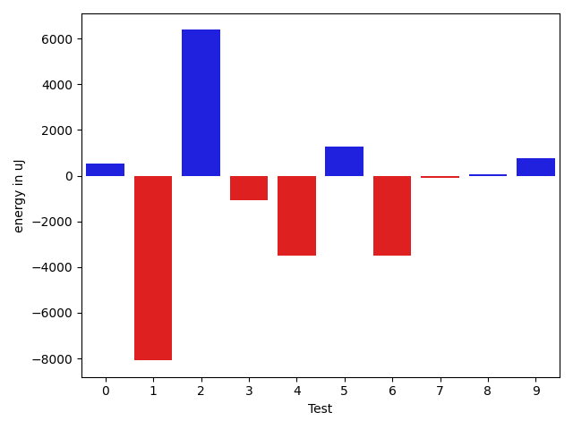

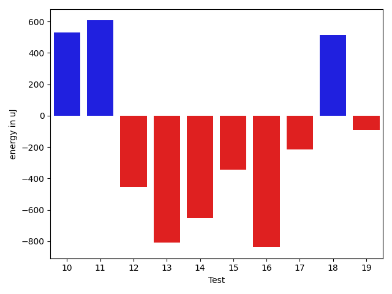

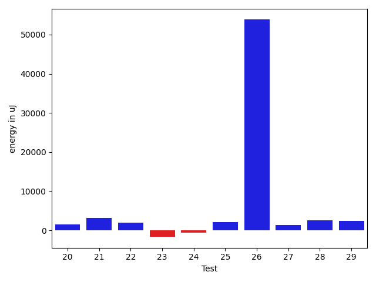

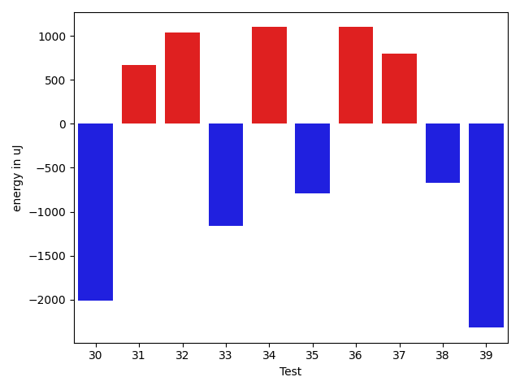

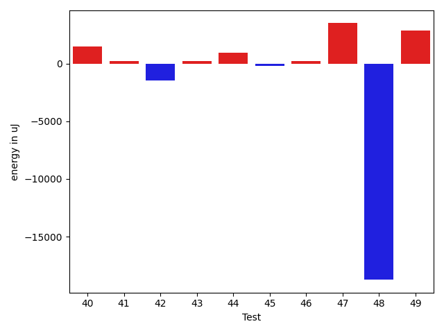

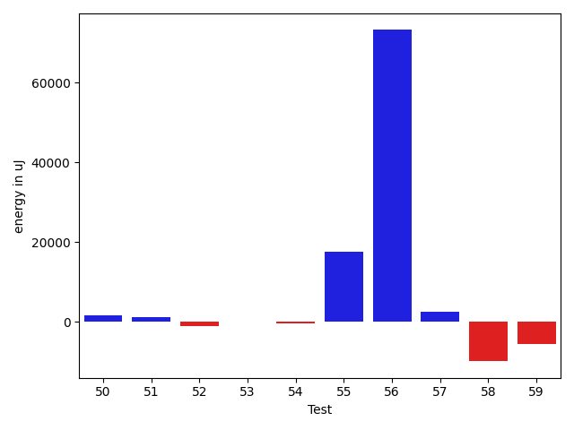

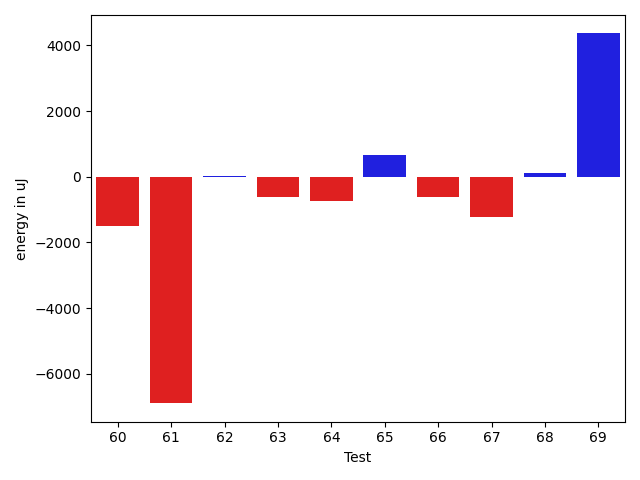

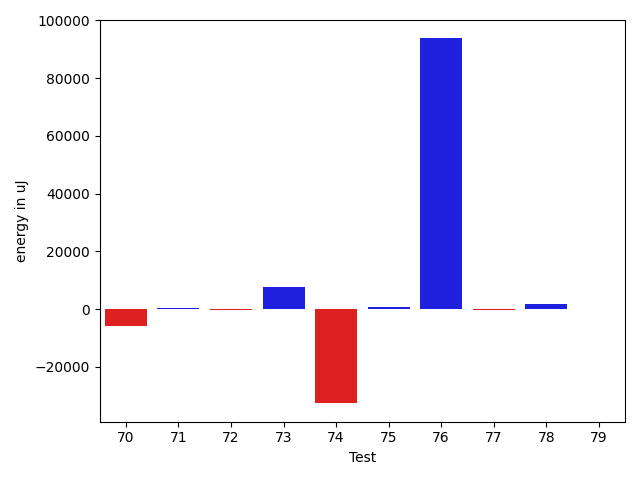

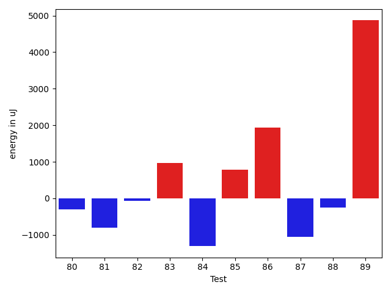

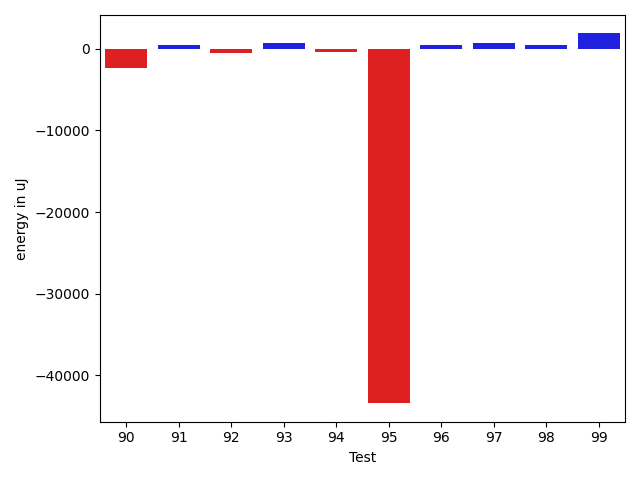

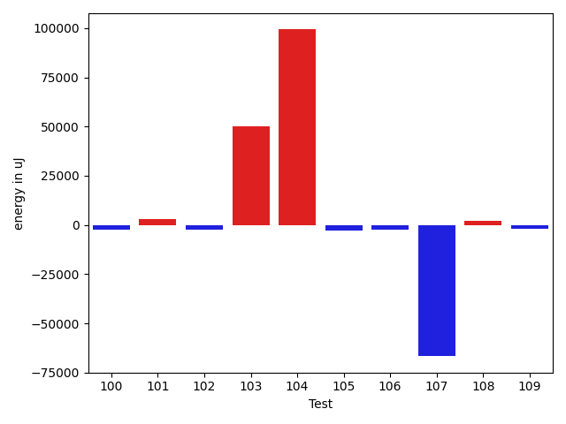

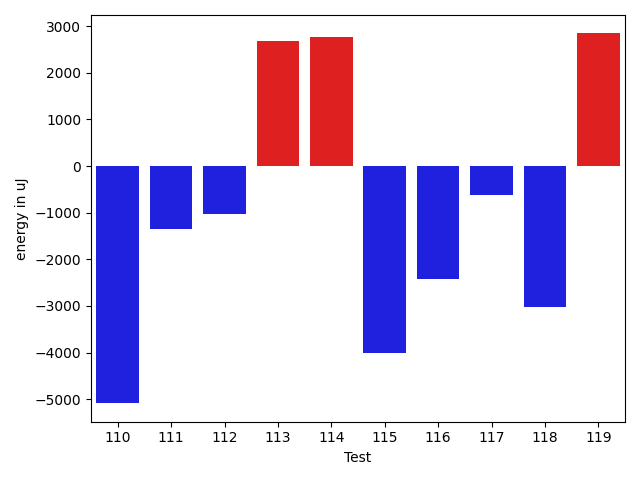

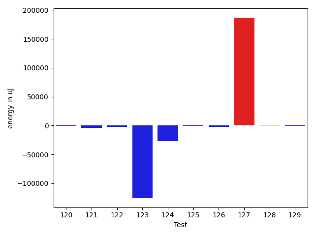

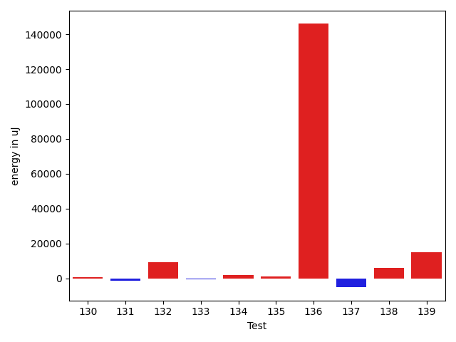

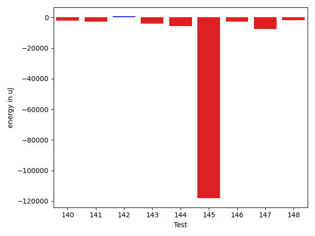

| ID | EnergyV1 | EnergyV2 | DeltaEnergy | σV1 | σV2 |
| --- | --- | --- | --- | --- | --- |
| 0 | 83374 | 81604 | -1770 | 22255.49233135334 | 22033.785221459097 |
| 1 | 112610 | 90210 | -22400 | 64024.242577609366 | 64734.8210225734 |
| 2 | 37414 | 40528 | 3114 | 4669.942204557335 | 26499.465943160576 |
| 3 | 76965 | 78003 | 1038 | 21571.85334849773 | 17834.99136233036 |
| 4 | 79345 | 79590 | 245 | 23014.61551947444 | 17563.83583055087 |
| 5 | 36560 | 39429 | 2869 | 4457.678655193662 | 3216.333193046347 |
| 6 | 83130 | 81847 | -1283 | 22367.556796703797 | 21129.374251259087 |
| 7 | 40466 | 38025 | -2441 | 5013.958325847288 | 4735.417367098024 |
| 8 | 41199 | 41443 | 244 | 4781.223476161105 | 4606.273177943722 |
| 9 | 39917 | 41565 | 1648 | 4544.120411080675 | 4100.519996890389 |
| 10 | 39490 | 39429 | -61 | 4331.866651629526 | 4260.168861254211 |
| 11 | 40283 | 38696 | -1587 | 4324.068633832553 | 9421.7661044171 |
| 12 | 38696 | 38574 | -122 | 3518.1170630387637 | 3524.207354380083 |
| 13 | 40345 | 39123 | -1222 | 3584.185752849051 | 4261.03365655638 |
| 14 | 40710 | 37292 | -3418 | 3737.196367872783 | 4719.853943714784 |
| 15 | 42175 | 39063 | -3112 | 5575.576770961807 | 4124.076995219658 |
| 16 | 40771 | 39307 | -1464 | 4345.214464913527 | 4147.630024587738 |
| 17 | 39734 | 40222 | 488 | 4377.009128914464 | 4999.18678094177 |
| 18 | 38940 | 40039 | 1099 | 4138.016562748419 | 5747.29950990965 |
| 19 | 39306 | 39551 | 245 | 5374.521617530395 | 5398.210150177998 |
| 20 | 39673 | 41076 | 1403 | 4158.505141415225 | 4602.251139581058 |
| 21 | 40832 | 41992 | 1160 | 4549.062726274362 | 9617.68908698764 |
| 22 | 39368 | 41565 | 2197 | 4865.551902862892 | 6156.027538530906 |
| 23 | 40955 | 39795 | -1160 | 3884.4172311535262 | 5562.708479970535 |
| 24 | 44006 | 43518 | -488 | 23523.611940494247 | 23864.74336260487 |
| 25 | 40283 | 42847 | 2564 | 6764.149665463469 | 9558.367530087797 |
| 26 | 44006 | 44128 | 122 | 519268.4513045727 | 599006.021023589 |
| 27 | 44128 | 44434 | 306 | 68810.05315399957 | 69434.86350040002 |
| 28 | 40161 | 41321 | 1160 | 10992.910797844901 | 13928.832565059303 |
| 29 | 41443 | 40161 | -1282 | 13490.944304484923 | 20118.457144968965 |
| 30 | 80139 | 78124 | -2015 | 37737.364849838355 | 45680.79008181811 |
| 31 | 41809 | 42480 | 671 | 39199.78408464234 | 35973.73055532806 |
| 32 | 39917 | 40954 | 1037 | 9140.416579526825 | 9570.361275433008 |
| 33 | 41015 | 39856 | -1159 | 11208.501927535539 | 6474.8838260972825 |
| 34 | 44128 | 45227 | 1099 | 32099.055837915155 | 34129.96686698673 |
| 35 | 41992 | 41199 | -793 | 10702.755054569614 | 6348.633310399342 |
| 36 | 38757 | 39856 | 1099 | 5040.0451834669975 | 5347.416414032336 |
| 37 | 40588 | 41382 | 794 | 3901.358566426746 | 28857.581183362556 |
| 38 | 42725 | 42053 | -672 | 12330.831186983885 | 15864.346585176201 |
| 39 | 43945 | 41626 | -2319 | 6028.290335779207 | 5681.511755001676 |
| 40 | 41626 | 40893 | -733 | 4508.723812465426 | 12074.950367206022 |
| 41 | 40222 | 40833 | 611 | 9976.269607530468 | 8747.697915985354 |
| 42 | 40649 | 42297 | 1648 | 25649.83990038838 | 28378.505646947415 |
| 43 | 40161 | 40222 | 61 | 4416.233439884667 | 5028.437384378573 |
| 44 | 39489 | 40893 | 1404 | 4274.511736708101 | 4104.907288350178 |
| 45 | 40588 | 39916 | -672 | 3906.6734631466607 | 3481.320742785603 |
| 46 | 39795 | 39856 | 61 | 4320.71257606087 | 4190.904609853211 |
| 47 | 41992 | 42786 | 794 | 23786.927476987672 | 21896.43900526466 |
| 48 | 42480 | 42542 | 62 | 108791.56652116666 | 71564.11237136697 |
| 49 | 42359 | 42542 | 183 | 13268.648930693067 | 18606.943509492154 |
| 50 | 39733 | 40100 | 367 | 4959.601681054696 | 4241.674504249471 |
| 51 | 38635 | 40405 | 1770 | 4292.85679872052 | 4261.4352456585775 |
| 52 | 40710 | 38025 | -2685 | 3590.669453356002 | 3873.6509909902825 |
| 53 | 40283 | 39917 | -366 | 3800.357068750251 | 5086.923967368874 |
| 54 | 40710 | 40772 | 62 | 5020.0304057536705 | 4872.420249877133 |
| 55 | 46203 | 85754 | 39551 | 56067.4993256547 | 60882.37221992354 |
| 56 | 43456 | 43884 | 428 | 250180.2111468259 | 534078.125280674 |
| 57 | 86364 | 89050 | 2686 | 39820.066514157406 | 38547.04870047755 |
| 58 | 88196 | 85449 | -2747 | 371858.29191269696 | 351030.7468402571 |
| 59 | 39245 | 40649 | 1404 | 30085.95113139635 | 5018.723958638329 |
| 60 | 39551 | 38330 | -1221 | 4771.225982386498 | 4832.861151700338 |
| 61 | 35827 | 37964 | 2137 | 37109.45931411574 | 5213.824303151612 |
| 62 | 40344 | 38513 | -1831 | 9615.41858434213 | 11743.283775630673 |
| 63 | 40039 | 39429 | -610 | 5314.344272320438 | 4769.716800043486 |
| 64 | 39124 | 39612 | 488 | 5017.798457491094 | 5545.560399208924 |
| 65 | 40222 | 39428 | -794 | 8606.950120992664 | 10180.91264622832 |
| 66 | 41015 | 39734 | -1281 | 5132.235622997948 | 4543.913584422398 |
| 67 | 39185 | 39673 | 488 | 8105.637768032907 | 5389.255547722333 |
| 68 | 38269 | 39856 | 1587 | 5908.41391200342 | 4922.1388960717295 |
| 69 | 40100 | 42175 | 2075 | 3730.245372617001 | 24882.10712745287 |
| 70 | 44861 | 44007 | -854 | 467491.0924174278 | 429884.4346640645 |
| 71 | 42602 | 41626 | -976 | 4069.786994842728 | 5096.1330311756 |
| 72 | 42236 | 41260 | -976 | 4852.137881686052 | 5655.92721891155 |
| 73 | 41503 | 42602 | 1099 | 4403.444353866642 | 30753.494950077536 |
| 74 | 44434 | 42297 | -2137 | 260087.6328966549 | 9300.848299970525 |
| 75 | 41992 | 40222 | -1770 | 5564.44038342746 | 24674.949520940656 |
| 76 | 42358 | 41504 | -854 | 4536.144883628987 | 447693.4195320734 |
| 77 | 41199 | 41137 | -62 | 4642.641063823477 | 4314.897228165848 |
| 78 | 39856 | 43457 | 3601 | 3688.9895804949083 | 4006.5603986928368 |
| 79 | 41076 | 41138 | 62 | 3557.776280338862 | 5358.778929156366 |
| 80 | 41198 | 41320 | 122 | 4729.3463680868135 | 4120.6018875348245 |
| 81 | 41443 | 40039 | -1404 | 4305.099389096609 | 4558.3522564757595 |
| 82 | 38819 | 40405 | 1586 | 3170.510792837646 | 4167.703687617172 |
| 83 | 39489 | 41992 | 2503 | 3660.036364573445 | 3528.568237338702 |
| 84 | 41138 | 41625 | 487 | 3393.224100402971 | 4951.855580935741 |
| 85 | 42297 | 43396 | 1099 | 6761.160139620548 | 6591.323285114217 |
| 86 | 38452 | 41504 | 3052 | 3461.0304417916154 | 3776.858536186769 |
| 87 | 42908 | 42846 | -62 | 9367.085347694894 | 8445.669983415148 |
| 88 | 42663 | 42115 | -548 | 27519.43595458038 | 23216.957386503065 |
| 89 | 84228 | 87341 | 3113 | 27639.491192130536 | 29517.040151228844 |
| 90 | 41443 | 40344 | -1099 | 18265.748318555477 | 11638.342733044052 |
| 91 | 41992 | 42664 | 672 | 8853.644382772194 | 9345.983271246561 |
| 92 | 40833 | 40344 | -489 | 4362.364103929783 | 4316.600008525228 |
| 93 | 39184 | 40588 | 1404 | 4270.006933627056 | 4533.495886875136 |
| 94 | 39429 | 39977 | 548 | 4370.727478608806 | 3516.937026122914 |
| 95 | 42664 | 42846 | 182 | 422975.31269456464 | 265969.41595297423 |
| 96 | 40283 | 40527 | 244 | 4582.5196044206905 | 4004.9031884223045 |
| 97 | 39612 | 41993 | 2381 | 4324.068713015223 | 4548.397096715312 |
| 98 | 39429 | 39490 | 61 | 3974.3857237081397 | 7752.960168327596 |
| 99 | 37720 | 40527 | 2807 | 3825.3589931680654 | 3831.989117761095 |
| 100 | 41077 | 37963 | -3114 | 4042.4760509431567 | 4947.588129583949 |
| 101 | 42298 | 43579 | 1281 | 10546.274004343008 | 17410.168643475325 |
| 102 | 42541 | 44373 | 1832 | 44944.15251400641 | 43951.207821600314 |
| 103 | 40039 | 41748 | 1709 | 6047.1478561694685 | 295022.76096502173 |
| 104 | 42542 | 44311 | 1769 | 463446.37120185775 | 547938.5992222246 |
| 105 | 43641 | 39489 | -4152 | 4008.0296172346034 | 4841.116046582939 |
| 106 | 42297 | 39978 | -2319 | 3906.7893619258894 | 6257.428553228989 |
| 107 | 208130 | 183533 | -24597 | 321763.2298207309 | 222795.47629968467 |
| 108 | 41320 | 39428 | -1892 | 8436.998816940672 | 14109.626349197448 |
| 109 | 41992 | 40405 | -1587 | 12859.94312356405 | 11927.804811943357 |
| 110 | 44006 | 41015 | -2991 | 26382.755267688382 | 31778.880256611956 |
| 111 | 41077 | 40222 | -855 | 6352.262786325818 | 6971.837060351722 |
| 112 | 41870 | 39062 | -2808 | 5098.420515257642 | 4770.814941664837 |
| 113 | 42358 | 42358 | 0 | 276396.1454205796 | 275361.64251036843 |
| 114 | 42298 | 43213 | 915 | 28268.83469149739 | 32032.869920797268 |
| 115 | 43152 | 43640 | 488 | 21815.86024503751 | 16980.834935420276 |
| 116 | 43457 | 43518 | 61 | 39377.07417484173 | 34220.66471484459 |
| 117 | 40710 | 39672 | -1038 | 5352.466166203823 | 4203.346764778512 |
| 118 | 40039 | 39184 | -855 | 2983.3041307134913 | 3278.389441987229 |
| 119 | 40527 | 41260 | 733 | 4917.487050200427 | 22568.642076976204 |
| 120 | 41687 | 41137 | -550 | 32772.523797725305 | 35008.78155184636 |
| 121 | 41503 | 41260 | -243 | 14719.546858166204 | 9160.7384673775 |
| 122 | 77026 | 76049 | -977 | 30232.552397120686 | 25467.742626205523 |
| 123 | 44922 | 41504 | -3418 | 452240.13312147703 | 4406.989182235844 |
| 124 | 42603 | 40954 | -1649 | 459817.9696792296 | 427496.98509586003 |
| 125 | 40954 | 41443 | 489 | 4276.99407638064 | 4972.099532867301 |
| 126 | 41870 | 41199 | -671 | 27005.881694664437 | 27560.343293107624 |
| 127 | 42603 | 42603 | 0 | 469889.2320078148 | 784882.8215443984 |
| 128 | 41870 | 42175 | 305 | 11589.610364718812 | 11657.353656114123 |
| 129 | 40955 | 41321 | 366 | 3888.2388613887006 | 5277.806714729364 |
| 130 | 41626 | 41199 | -427 | 49739.90690228957 | 44421.14632442177 |
| 131 | 40955 | 40833 | -122 | 4925.823890828844 | 5024.958648772645 |
| 132 | 41870 | 41077 | -793 | 4464.074125518857 | 43071.15874889163 |
| 133 | 42358 | 42602 | 244 | 5150.7464249732775 | 5532.980082663927 |
| 134 | 42847 | 43518 | 671 | 17916.109854327387 | 35671.561303142014 |
| 135 | 41748 | 42846 | 1098 | 36365.06002703261 | 47446.10047930253 |
| 136 | 42175 | 44617 | 2442 | 562607.5278958326 | 692499.0717205462 |
| 137 | 44006 | 43518 | -488 | 107506.26214979267 | 104529.94049652472 |
| 138 | 44617 | 41443 | -3174 | 4702.577041722266 | 33442.065681185006 |
| 139 | 79528 | 84960 | 5432 | 117648.92410265378 | 134096.08910554205 |
| 140 | 39917 | 41565 | 1648 | 18960.090137494437 | 3865.9489507752164 |
| 141 | 41625 | 41748 | 123 | 92508.36853882764 | 77851.76642325676 |
| 142 | 42297 | 42969 | 672 | 25472.855522742026 | 24222.359428176103 |
| 143 | 43457 | 42847 | -610 | 20354.63442058234 | 10827.058697061466 |
| 144 | 43945 | 41686 | -2259 | 19444.228720568353 | 13615.989356066937 |
| 145 | 43579 | 42175 | -1404 | 589145.6953595779 | 390702.9593348151 |
| 146 | 42175 | 41748 | -427 | 10855.473506963734 | 4738.94385353306 |
| 147 | 44800 | 42297 | -2503 | 35062.62736072933 | 31618.181872988407 |
| 148 | 42297 | 39855 | -2442 | 10743.236795786006 | 8676.632005675254 |

## Delta Duration per test method

| ID | DurationV1 | DurationsV2 | DeltaDuration |
| --- | --- | --- | --- |
| 0 | 2515543.6868686867 | 2409651.98989899 | -105891.69696969679 |
| 1 | 3431977.272727273 | 3375963.282828283 | -56013.98989898991 |
| 2 | 486037.8947368421 | 651138.0909090909 | 165100.19617224886 |
| 3 | 2173769.515151515 | 2064749.0202020202 | -109020.49494949495 |
| 4 | 2307747.6868686867 | 2184158.9393939395 | -123588.74747474724 |
| 5 | 731464.1627906977 | 804600.8936170213 | 73136.73082632362 |
| 6 | 2618398.787878788 | 2504650.8181818184 | -113747.96969696973 |
| 7 | 550620.4 | 577806.2162162162 | 27185.81621621619 |
| 8 | 430430.53846153844 | 414749.0 | -15681.53846153844 |
| 9 | 687333.44 | 519182.28571428574 | -168151.1542857142 |
| 10 | 634897.0625 | 643687.04 | 8789.977500000037 |
| 11 | 746910.9782608695 | 812237.0227272727 | 65326.0444664032 |
| 12 | 741909.756097561 | 550121.3 | -191788.45609756093 |
| 13 | 512899.51612903224 | 542696.1739130435 | 29796.657784011215 |
| 14 | 438332.0588235294 | 380007.21428571426 | -58324.84453781514 |
| 15 | 421914.26666666666 | 481103.25 | 59188.98333333334 |
| 16 | 512377.1875 | 425065.4761904762 | -87311.71130952379 |
| 17 | 594874.2121212122 | 590746.3076923077 | -4127.90442890441 |
| 18 | 659278.0666666667 | 657460.5806451613 | -1817.4860215053195 |
| 19 | 722428.358490566 | 721169.4210526316 | -1258.9374379344517 |
| 20 | 602919.5641025641 | 615064.1538461539 | 12144.58974358975 |
| 21 | 909399.0793650794 | 870664.1929824562 | -38734.88638262323 |
| 22 | 689086.3658536585 | 753215.0 | 64128.63414634147 |
| 23 | 805091.3137254902 | 830551.5576923077 | 25460.243966817507 |
| 24 | 1624258.1958762887 | 1617278.5567010308 | -6979.639175257878 |
| 25 | 851769.4137931034 | 979103.4615384615 | 127334.04774535808 |
| 26 | 7539581.19047619 | 9152323.0 | 1612741.8095238097 |
| 27 | 1832855.2972972973 | 1890130.4285714286 | 57275.13127413136 |
| 28 | 1194292.475 | 1174631.2972972973 | -19661.177702702815 |
| 29 | 1316052.471264368 | 1383485.9662921347 | 67433.4950277668 |
| 30 | 2451643.8181818184 | 2432731.8080808083 | -18912.01010101009 |
| 31 | 1589974.5308641975 | 1496348.2 | -93626.33086419757 |
| 32 | 1115648.8533333333 | 1204542.6025641025 | 88893.74923076923 |
| 33 | 1108660.119402985 | 1061944.082191781 | -46716.03721120418 |
| 34 | 1570243.144736842 | 1663993.7215189873 | 93750.5767821453 |
| 35 | 988960.3559322034 | 1028490.8125 | 39530.456567796646 |
| 36 | 680881.1875 | 783079.6666666666 | 102198.47916666663 |
| 37 | 792776.6346153846 | 932486.0943396227 | 139709.45972423803 |
| 38 | 1033689.1470588235 | 1130242.7397260275 | 96553.59266720398 |
| 39 | 609724.2142857143 | 648608.9333333333 | 38884.71904761903 |
| 40 | 1089902.8648648649 | 1097829.52 | 7926.655135135166 |
| 41 | 846299.695652174 | 890460.7021276596 | 44161.00647548563 |
| 42 | 1192692.7666666666 | 1141583.1607142857 | -51109.60595238092 |
| 43 | 795445.2666666667 | 714714.4838709678 | -80730.78279569896 |
| 44 | 720958.9591836735 | 775553.2181818181 | 54594.25899814465 |
| 45 | 745219.2 | 745254.25 | 35.050000000046566 |
| 46 | 723274.125 | 767571.6222222223 | 44297.49722222227 |
| 47 | 1337929.3614457832 | 1429883.9743589743 | 91954.61291319109 |
| 48 | 2155894.7916666665 | 1469234.2063492064 | -686660.5853174601 |
| 49 | 1089835.4901960783 | 1056563.1666666667 | -33272.32352941157 |
| 50 | 583287.5172413794 | 622745.9 | 39458.38275862066 |
| 51 | 890524.4666666667 | 827526.9803921569 | -62997.48627450981 |
| 52 | 535921.1666666666 | 628833.8888888889 | 92912.72222222225 |
| 53 | 847088.82 | 887237.6774193548 | 40148.85741935484 |
| 54 | 420672.1666666667 | 478575.36842105264 | 57903.201754385955 |
| 55 | 2112484.021978022 | 2534532.6631578947 | 422048.6411798727 |
| 56 | 2368123.8235294116 | 4492423.975 | 2124300.151470588 |
| 57 | 2800795.6666666665 | 2780095.8383838385 | -20699.828282827977 |
| 58 | 5780310.161616161 | 5416309.515151516 | -364000.64646464586 |
| 59 | 771602.5 | 570284.7647058824 | -201317.7352941176 |
| 60 | 604544.6875 | 610291.3513513514 | 5746.663851351361 |
| 61 | 847050.5217391305 | 612409.5405405406 | -234640.9811985899 |
| 62 | 1042173.2727272727 | 1092958.68852459 | 50785.4157973174 |
| 63 | 593051.0 | 531744.7878787878 | -61306.21212121216 |
| 64 | 667575.5777777778 | 667373.1052631579 | -202.47251461993437 |
| 65 | 989245.6551724138 | 916845.5409836066 | -72400.1141888072 |
| 66 | 643908.1944444445 | 574082.1904761905 | -69826.00396825396 |
| 67 | 748456.2051282051 | 660512.3783783783 | -87943.82674982678 |
| 68 | 632496.8 | 616377.9666666667 | -16118.833333333372 |
| 69 | 796118.625 | 889794.6734693878 | 93676.04846938781 |
| 70 | 3927216.603448276 | 3816797.2622950817 | -110419.3411531942 |
| 71 | 741222.6764705882 | 785778.8918918918 | 44556.21542130364 |
| 72 | 673440.0 | 663267.3243243244 | -10172.675675675622 |
| 73 | 827176.64 | 1030228.5111111111 | 203051.87111111113 |
| 74 | 2051640.6363636365 | 1168062.9761904762 | -883577.6601731603 |
| 75 | 757683.1521739131 | 847570.0714285715 | 89886.9192546584 |
| 76 | 535621.40625 | 3280777.8846153845 | 2745156.4783653845 |
| 77 | 658166.7 | 702560.1063829787 | 44393.40638297878 |
| 78 | 478519.25 | 511873.4117647059 | 33354.1617647059 |
| 79 | 390818.05263157893 | 425207.9090909091 | 34389.856459330185 |
| 80 | 539760.8125 | 575896.6666666666 | 36135.85416666663 |
| 81 | 521506.8 | 816406.1176470588 | 294899.3176470588 |
| 82 | 468674.9 | 440818.27777777775 | -27856.62222222227 |
| 83 | 415404.6 | 456140.0 | 40735.40000000002 |
| 84 | 415311.4666666667 | 438355.8333333333 | 23044.36666666664 |
| 85 | 607155.03125 | 643061.1 | 35906.06874999998 |
| 86 | 374302.54545454547 | 494624.23076923075 | 120321.68531468528 |
| 87 | 970652.5660377359 | 946850.8070175438 | -23801.759020192083 |
| 88 | 1232862.396825397 | 1173267.3559322034 | -59595.04089319357 |
| 89 | 2681677.515151515 | 2669227.0606060605 | -12450.454545454588 |
| 90 | 1109589.8795180724 | 1093924.3970588236 | -15665.482459248742 |
| 91 | 972636.1372549019 | 900856.7647058824 | -71779.37254901952 |
| 92 | 823163.0892857143 | 790160.96 | -33002.129285714356 |
| 93 | 781754.0545454546 | 794424.8571428572 | 12670.802597402595 |
| 94 | 707243.9069767442 | 775657.7142857143 | 68413.80730897014 |
| 95 | 3704537.3333333335 | 2619777.359375 | -1084759.9739583335 |
| 96 | 908079.298245614 | 884292.8431372549 | -23786.455108359107 |
| 97 | 817164.7173913043 | 855903.7692307692 | 38739.051839464926 |
| 98 | 862938.3529411765 | 811074.1147540984 | -51864.238187078154 |
| 99 | 482004.85185185185 | 552759.380952381 | 70754.5291005291 |
| 100 | 533211.2142857143 | 454950.05 | -78261.16428571433 |
| 101 | 1032195.1071428572 | 1106933.763888889 | 74738.65674603183 |
| 102 | 1457846.9130434783 | 1418492.35 | -39354.56304347818 |
| 103 | 852291.25 | 2279551.625 | 1427260.375 |
| 104 | 4137259.9811320757 | 8021569.448979592 | 3884309.4678475163 |
| 105 | 691415.7058823529 | 700736.9032258064 | 9321.197343453532 |
| 106 | 596896.8787878788 | 733912.7037037037 | 137015.82491582492 |
| 107 | 7848624.0 | 6035528.515151516 | -1813095.4848484844 |
| 108 | 1044797.3389830509 | 912956.1071428572 | -131841.23184019374 |
| 109 | 1141066.7808219178 | 1047469.0704225352 | -93597.71039938263 |
| 110 | 1252477.0 | 1003983.6571428571 | -248493.3428571429 |
| 111 | 790014.4827586206 | 679051.78125 | -110962.70150862064 |
| 112 | 615405.92 | 637368.6764705882 | 21962.756470588152 |
| 113 | 2072979.5666666667 | 2120903.672727273 | 47924.106060606195 |
| 114 | 1270606.1454545455 | 1480029.1363636365 | 209422.99090909096 |
| 115 | 1278276.5135135136 | 1231426.6455696202 | -46849.86794389342 |
| 116 | 1345092.7222222222 | 1370464.3396226414 | 25371.6174004192 |
| 117 | 684477.1851851852 | 594804.8387096775 | -89672.34647550771 |
| 118 | 557082.4117647059 | 379402.55555555556 | -177679.85620915034 |
| 119 | 850267.3725490196 | 849812.1964285715 | -455.17612044815905 |
| 120 | 1298380.0697674418 | 1099477.517857143 | -198902.55191029888 |
| 121 | 1078582.2698412698 | 1063865.8548387096 | -14716.415002560243 |
| 122 | 2012745.696969697 | 1988083.9797979798 | -24661.717171717202 |
| 123 | 4311420.448275862 | 532412.3125 | -3779008.1357758623 |
| 124 | 4142511.2 | 3518503.45 | -624007.75 |
| 125 | 823505.5434782609 | 803213.6666666666 | -20291.876811594237 |
| 126 | 1415635.8630136987 | 1338143.4782608696 | -77492.3847528291 |
| 127 | 4214359.349206349 | 9752020.431034483 | 5537661.081828134 |
| 128 | 1016686.0588235294 | 1028659.3050847457 | 11973.24626121635 |
| 129 | 690408.1578947369 | 622509.7567567568 | -67898.40113798005 |
| 130 | 1682626.6781609196 | 1784621.4767441861 | 101994.79858326656 |
| 131 | 474024.8823529412 | 483062.03125 | 9037.148897058796 |
| 132 | 643344.0967741936 | 938719.9166666666 | 295375.81989247305 |
| 133 | 666983.71875 | 660304.5882352941 | -6679.130514705903 |
| 134 | 1225028.5789473683 | 1186468.361111111 | -38560.2178362573 |
| 135 | 1181665.0819672132 | 1290475.6769230769 | 108810.59495586366 |
| 136 | 6324131.363636363 | 11045557.772727273 | 4721426.40909091 |
| 137 | 2338255.3855421687 | 2304977.939759036 | -33277.44578313269 |
| 138 | 525068.375 | 749006.3333333334 | 223937.95833333337 |
| 139 | 3110752.4646464647 | 3449546.696969697 | 338794.2323232321 |
| 140 | 904405.8918918918 | 788178.06 | -116227.83189189178 |
| 141 | 1629870.6333333333 | 1668294.810810811 | 38424.177477477584 |
| 142 | 1292543.12 | 1302776.8461538462 | 10233.726153846132 |
| 143 | 1120396.95 | 1001520.8787878788 | -118876.07121212117 |
| 144 | 1351782.4024390243 | 1269326.417721519 | -82455.98471750529 |
| 145 | 6784396.431372549 | 3177129.7407407407 | -3607266.6906318087 |
| 146 | 898809.6734693878 | 817406.125 | -81403.54846938781 |
| 147 | 1423984.1403508773 | 1242175.8510638298 | -181808.28928704746 |
| 148 | 897015.7457627119 | 901589.1886792453 | 4573.442916533444 |

## Misc.

| ID | Test Class | Test Method |
| --- | --- | --- |
| 0 | com.google.gson.functional.DefaultTypeAdaptersTest | testDateSerializationWithPatternNotOverridenByTypeAdapter |
| 1 | com.google.gson.functional.DefaultTypeAdaptersTest | testDateSerializationWithPattern |
| 2 | com.google.gson.functional.DefaultTypeAdaptersTest | testLocaleSerializationWithLanguageCountryVariant |
| 3 | com.google.gson.functional.DefaultTypeAdaptersTest | testSqlDateSerialization |
| 4 | com.google.gson.functional.DefaultTypeAdaptersTest | testTimestampSerialization |
| 5 | com.google.gson.functional.DefaultTypeAdaptersTest | testTreeSetSerialization |
| 6 | com.google.gson.functional.DefaultTypeAdaptersTest | testDateDeserializationWithPattern |
| 7 | com.google.gson.functional.DefaultTypeAdaptersTest | testBitSetSerialization |
| 8 | com.google.gson.functional.DefaultTypeAdaptersTest | testLocaleDeserializationWithLanguageCountry |
| 9 | com.google.gson.functional.DefaultTypeAdaptersTest | testLocaleSerializationWithLanguage |
| 10 | com.google.gson.functional.DefaultTypeAdaptersTest | testSetSerialization |
| 11 | com.google.gson.functional.DefaultTypeAdaptersTest | testBitSetDeserialization |
| 12 | com.google.gson.functional.DefaultTypeAdaptersTest | testDefaultCalendarDeserialization |
| 13 | com.google.gson.functional.DefaultTypeAdaptersTest | testDefaultGregorianCalendarDeserialization |
| 14 | com.google.gson.functional.DefaultTypeAdaptersTest | testLocaleSerializationWithLanguageCountry |
| 15 | com.google.gson.functional.DefaultTypeAdaptersTest | testLocaleDeserializationWithLanguageCountryVariant |
| 16 | com.google.gson.functional.DefaultTypeAdaptersTest | testLocaleDeserializationWithLanguage |
| 17 | com.google.gson.functional.NullObjectAndFieldTest | testCustomTypeAdapterPassesNullSerialization |
| 18 | com.google.gson.functional.NullObjectAndFieldTest | testExplicitSerializationOfNullStringMembers |
| 19 | com.google.gson.functional.NullObjectAndFieldTest | testExplicitSerializationOfNullCollectionMembers |
| 20 | com.google.gson.functional.NullObjectAndFieldTest | testCustomSerializationOfNulls |
| 21 | com.google.gson.functional.NullObjectAndFieldTest | testPrintPrintingObjectWithNulls |
| 22 | com.google.gson.functional.NullObjectAndFieldTest | testPrintPrintingArraysWithNulls |
| 23 | com.google.gson.functional.NullObjectAndFieldTest | testNullWrappedPrimitiveMemberSerialization |
| 24 | com.google.gson.functional.NullObjectAndFieldTest | testExplicitSerializationOfNullArrayMembers |
| 25 | com.google.gson.functional.NullObjectAndFieldTest | testExplicitDeserializationOfNulls |
| 26 | com.google.gson.functional.NullObjectAndFieldTest | testTopLevelNullObjectSerialization |
| 27 | com.google.gson.functional.NullObjectAndFieldTest | testExplicitSerializationOfNulls |
| 28 | com.google.gson.functional.ParameterizedTypesTest | testParameterizedTypeGenericArraysSerialization |
| 29 | com.google.gson.functional.ParameterizedTypesTest | testParameterizedTypeWithCustomSerializer |
| 30 | com.google.gson.functional.ParameterizedTypesTest | testVariableTypeFieldsAndGenericArraysSerialization |
| 31 | com.google.gson.functional.ParameterizedTypesTest | testParameterizedTypeDeserialization |
| 32 | com.google.gson.functional.ParameterizedTypesTest | testParameterizedTypesWithCustomDeserializer |
| 33 | com.google.gson.functional.ParameterizedTypesTest | testParameterizedTypeWithReaderDeserialization |
| 34 | com.google.gson.functional.MapTest | testSerializeMaps |
| 35 | com.google.gson.functional.MapTest | testCustomSerializerForSpecificMapType |
| 36 | com.google.gson.functional.MapTest | testMapSerializationWithNullValuesSerialized |
| 37 | com.google.gson.functional.MapTest | testMapSerializationWithNullValueButSerializeNulls |
| 38 | com.google.gson.functional.ReadersWritersTest | testReadWriteTwoObjects |
| 39 | com.google.gson.functional.ReadersWritersTest | testTopLevelNullObjectSerializationWithWriterAndSerializeNulls |
| 40 | com.google.gson.functional.ReadersWritersTest | testReadWriteTwoStrings |
| 41 | com.google.gson.functional.CollectionTest | testRawCollectionSerialization |
| 42 | com.google.gson.functional.CollectionTest | testCollectionOfBagOfPrimitivesSerialization |
| 43 | com.google.gson.functional.CollectionTest | testRawCollectionOfIntegersSerialization |
| 44 | com.google.gson.functional.CollectionTest | testQueueSerialization |
| 45 | com.google.gson.functional.CollectionTest | testCollectionOfObjectSerialization |
| 46 | com.google.gson.functional.CollectionTest | testNullsInListSerialization |
| 47 | com.google.gson.functional.CollectionTest | testWildcardPrimitiveCollectionSerilaization |
| 48 | com.google.gson.functional.CollectionTest | testSetSerialization |
| 49 | com.google.gson.functional.CollectionTest | testCollectionOfObjectWithNullSerialization |
| 50 | com.google.gson.functional.CollectionTest | testRawCollectionDeserializationNotAlllowed |
| 51 | com.google.gson.functional.CollectionTest | testTopLevelCollectionOfIntegersSerialization |
| 52 | com.google.gson.functional.CollectionTest | testRawCollectionOfBagOfPrimitivesNotAllowed |
| 53 | com.google.gson.functional.CollectionTest | testLinkedListSerialization |
| 54 | com.google.gson.functional.CollectionTest | testCollectionOfStringsSerialization |
| 55 | com.google.gson.functional.InheritanceTest | testSubInterfacesOfCollectionSerialization |
| 56 | com.google.gson.JsonParserTest | testReadWriteTwoObjects |
| 57 | com.google.gson.functional.NamingPolicyTest | testGsonWithNonDefaultFieldNamingPolicySerialization |
| 58 | com.google.gson.functional.NamingPolicyTest | testGsonDuplicateNameUsingSerializedNameFieldNamingPolicySerialization |
| 59 | com.google.gson.functional.NamingPolicyTest | testGsonWithLowerCaseDashPolicyDeserialiation |
| 60 | com.google.gson.functional.NamingPolicyTest | testGsonWithUpperCamelCaseSpacesPolicyDeserialiation |
| 61 | com.google.gson.functional.NamingPolicyTest | testGsonWithLowerCaseUnderscorePolicySerialization |
| 62 | com.google.gson.functional.NamingPolicyTest | testComplexFieldNameStrategy |
| 63 | com.google.gson.functional.NamingPolicyTest | testGsonWithUpperCamelCaseSpacesPolicySerialiation |
| 64 | com.google.gson.functional.NamingPolicyTest | testGsonWithLowerCaseDashPolicySerialization |
| 65 | com.google.gson.functional.NamingPolicyTest | testGsonWithSerializedNameFieldNamingPolicySerialization |
| 66 | com.google.gson.functional.NamingPolicyTest | testGsonWithLowerCaseUnderscorePolicyDeserialiation |
| 67 | com.google.gson.functional.NamingPolicyTest | testGsonWithNonDefaultFieldNamingPolicyDeserialiation |
| 68 | com.google.gson.functional.NamingPolicyTest | testGsonWithSerializedNameFieldNamingPolicyDeserialization |
| 69 | com.google.gson.functional.CustomSerializerTest | testSerializerReturnsNull |
| 70 | com.google.gson.functional.CustomSerializerTest | testSubClassSerializerInvokedForBaseClassFieldsHoldingSubClassInstances |
| 71 | com.google.gson.functional.CustomSerializerTest | testBaseClassSerializerInvokedForBaseClassFieldsHoldingSubClassInstances |
| 72 | com.google.gson.functional.CustomSerializerTest | testBaseClassSerializerInvokedForBaseClassFields |
| 73 | com.google.gson.functional.CustomSerializerTest | testSubClassSerializerInvokedForBaseClassFieldsHoldingArrayOfSubClassInstances |
| 74 | com.google.gson.functional.FieldExclusionTest | testDefaultInnerClassExclusion |
| 75 | com.google.gson.functional.FieldExclusionTest | testDefaultNestedStaticClassIncluded |
| 76 | com.google.gson.functional.FieldExclusionTest | testInnerClassExclusion |
| 77 | com.google.gson.functional.PrimitiveTest | testHtmlCharacterSerialization |
| 78 | com.google.gson.functional.PrimitiveTest | testFloatNaNSerialization |
| 79 | com.google.gson.functional.PrimitiveTest | testNegativeInfinityFloatSerialization |
| 80 | com.google.gson.functional.PrimitiveTest | testLongAsStringSerialization |
| 81 | com.google.gson.functional.PrimitiveTest | testDoubleNaNSerialization |
| 82 | com.google.gson.functional.PrimitiveTest | testDoubleInfinitySerialization |
| 83 | com.google.gson.functional.PrimitiveTest | testLongAsStringDeserialization |
| 84 | com.google.gson.functional.PrimitiveTest | testNegativeInfinitySerialization |
| 85 | com.google.gson.functional.PrimitiveTest | testMoreSpecificSerialization |
| 86 | com.google.gson.functional.PrimitiveTest | testFloatInfinitySerialization |
| 87 | com.google.gson.functional.TypeHierarchyAdapterTest | testRegisterSuperTypeFirst |
| 88 | com.google.gson.functional.CustomTypeAdaptersTest | testCustomNestedSerializers |
| 89 | com.google.gson.functional.CustomTypeAdaptersTest | testCustomTypeAdapterDoesNotAppliesToSubClasses |
| 90 | com.google.gson.functional.CustomTypeAdaptersTest | testCustomAdapterInvokedForCollectionElementSerializationWithType |
| 91 | com.google.gson.functional.CustomTypeAdaptersTest | testCustomDeserializers |
| 92 | com.google.gson.functional.CustomTypeAdaptersTest | testCustomTypeAdapterAppliesToSubClassesSerializedAsBaseClass |
| 93 | com.google.gson.functional.CustomTypeAdaptersTest | testCustomByteArrayDeserializerAndInstanceCreator |
| 94 | com.google.gson.functional.CustomTypeAdaptersTest | testEnsureCustomSerializerNotInvokedForNullValues |
| 95 | com.google.gson.functional.CustomTypeAdaptersTest | testCustomSerializers |
| 96 | com.google.gson.functional.CustomTypeAdaptersTest | testCustomNestedDeserializers |
| 97 | com.google.gson.functional.CustomTypeAdaptersTest | testCustomByteArraySerializer |
| 98 | com.google.gson.functional.CustomTypeAdaptersTest | testCustomAdapterInvokedForMapElementSerializationWithType |
| 99 | com.google.gson.functional.CustomTypeAdaptersTest | testCustomAdapterInvokedForCollectionElementSerialization |
| 100 | com.google.gson.functional.CustomTypeAdaptersTest | testCustomAdapterInvokedForMapElementSerialization |
| 101 | com.google.gson.functional.TypeVariableTest | testBasicTypeVariables |
| 102 | com.google.gson.functional.SecurityTest | testJsonWithNonExectuableTokenSerialization |
| 103 | com.google.gson.functional.SecurityTest | testNonExecutableJsonDeserialization |
| 104 | com.google.gson.functional.SecurityTest | testNonExecutableJsonSerialization |
| 105 | com.google.gson.functional.SecurityTest | testJsonWithNonExectuableTokenWithRegularGsonDeserialization |
| 106 | com.google.gson.functional.SecurityTest | testJsonWithNonExectuableTokenWithConfiguredGsonDeserialization |
| 107 | com.google.gson.functional.VersioningTest | testVersionedUntilSerialization |
| 108 | com.google.gson.functional.VersioningTest | testVersionedClassesSerialization |
| 109 | com.google.gson.functional.VersioningTest | testVersionedGsonMixingSinceAndUntilSerialization |
| 110 | com.google.gson.functional.VersioningTest | testVersionedGsonWithUnversionedClassesSerialization |
| 111 | com.google.gson.functional.VersioningTest | testVersionedGsonWithUnversionedClassesDeserialization |
| 112 | com.google.gson.functional.VersioningTest | testIgnoreLaterVersionClassSerialization |
| 113 | com.google.gson.FunctionWithInternalDependenciesTest | testAnonymousLocalClassesSerialization |
| 114 | com.google.gson.functional.InstanceCreatorTest | testInstanceCreatorReturnsBaseType |
| 115 | com.google.gson.functional.EscapingTest | testGsonAcceptsEscapedAndNonEscapedJsonDeserialization |
| 116 | com.google.gson.functional.EscapingTest | testEscapeAllHtmlCharacters |
| 117 | com.google.gson.functional.ObjectTest | testEmptyCollectionInAnObjectSerialization |
| 118 | com.google.gson.functional.ObjectTest | testJsonObjectSerialization |
| 119 | com.google.gson.functional.ObjectTest | testInnerClassDeserialization |
| 120 | com.google.gson.functional.ObjectTest | testAnonymousLocalClassesSerialization |
| 121 | com.google.gson.functional.MoreSpecificTypeSerializationTest | testListOfParameterizedSubclassFields |
| 122 | com.google.gson.functional.UncategorizedTest | testReturningDerivedClassesDuringDeserialization |
| 123 | com.google.gson.JsonObjectTest | testPropertyWithQuotes |
| 124 | com.google.gson.JsonObjectTest | testWritePropertyWithEmptyStringName |
| 125 | com.google.gson.MixedStreamTest | testWriteDoesNotMutateState |
| 126 | com.google.gson.MixedStreamTest | testWriteLenient |
| 127 | com.google.gson.MixedStreamTest | testWriteMixedStreamed |
| 128 | com.google.gson.MixedStreamTest | testReadClosed |
| 129 | com.google.gson.MixedStreamTest | testWriteInvalidState |
| 130 | com.google.gson.MixedStreamTest | testWriteHtmlSafe |
| 131 | com.google.gson.MixedStreamTest | testWriteNulls |
| 132 | com.google.gson.MixedStreamTest | testWriteClosed |
| 133 | com.google.gson.functional.ArrayTest | testNullsInArrayWithSerializeNullPropertySetSerialization |
| 134 | com.google.gson.functional.ArrayTest | testArrayOfCollectionSerialization |
| 135 | com.google.gson.functional.CircularReferenceTest | testDirectedAcyclicGraphSerialization |
| 136 | com.google.gson.GsonBuilderTest | testCreatingMoreThanOnce |
| 137 | com.google.gson.functional.PrintFormattingTest | testCompactFormattingLeavesNoWhiteSpace |
| 138 | com.google.gson.functional.PrintFormattingTest | testJsonObjectWithNullValuesSerialized |
| 139 | com.google.gson.functional.PrettyPrintingTest | testPrettyPrintList |
| 140 | com.google.gson.functional.PrettyPrintingTest | testPrettyPrintListOfPrimitiveArrays |
| 141 | com.google.gson.functional.RawSerializationTest | testCollectionOfPrimitives |
| 142 | com.google.gson.functional.RawSerializationTest | testCollectionOfObjects |
| 143 | com.google.gson.functional.EnumTest | testCollectionOfEnumsSerialization |
| 144 | com.google.gson.functional.MapAsArrayTypeAdapterTest | testMapWithTypeVariableSerialization |
| 145 | com.google.gson.DefaultMapJsonSerializerTest | testNonEmptyMapSerialization |
| 146 | com.google.gson.functional.CustomDeserializerTest | testCustomDeserializerReturnsNullForArrayElements |
| 147 | com.google.gson.functional.CustomDeserializerTest | testCustomDeserializerReturnsNullForTopLevelObject |
| 148 | com.google.gson.functional.CustomDeserializerTest | testCustomDeserializerReturnsNull |

| Test | IterationV1 | IterationV2 | DeltaIteration |
| --- | --- | --- | --- |
| 0 | 99 | 99 | 0 |
| 1 | 99 | 99 | 0 |
| 2 | 19 | 22 | 3 |
| 3 | 99 | 99 | 0 |
| 4 | 99 | 99 | 0 |
| 5 | 43 | 47 | 4 |
| 6 | 99 | 99 | 0 |
| 7 | 30 | 37 | 7 |
| 8 | 13 | 16 | 3 |
| 9 | 25 | 14 | -11 |
| 10 | 32 | 25 | -7 |
| 11 | 46 | 44 | -2 |
| 12 | 41 | 30 | -11 |
| 13 | 31 | 23 | -8 |
| 14 | 17 | 14 | -3 |
| 15 | 15 | 16 | 1 |
| 16 | 16 | 21 | 5 |
| 17 | 33 | 39 | 6 |
| 18 | 45 | 31 | -14 |
| 19 | 53 | 38 | -15 |
| 20 | 39 | 26 | -13 |
| 21 | 63 | 57 | -6 |
| 22 | 41 | 31 | -10 |
| 23 | 51 | 52 | 1 |
| 24 | 97 | 97 | 0 |
| 25 | 29 | 26 | -3 |
| 26 | 21 | 30 | 9 |
| 27 | 37 | 35 | -2 |
| 28 | 80 | 74 | -6 |
| 29 | 87 | 89 | 2 |
| 30 | 99 | 99 | 0 |
| 31 | 81 | 80 | -1 |
| 32 | 75 | 78 | 3 |
| 33 | 67 | 73 | 6 |
| 34 | 76 | 79 | 3 |
| 35 | 59 | 64 | 5 |
| 36 | 48 | 39 | -9 |
| 37 | 52 | 53 | 1 |
| 38 | 68 | 73 | 5 |
| 39 | 14 | 15 | 1 |
| 40 | 74 | 75 | 1 |
| 41 | 46 | 47 | 1 |
| 42 | 60 | 56 | -4 |
| 43 | 30 | 31 | 1 |
| 44 | 49 | 55 | 6 |
| 45 | 45 | 48 | 3 |
| 46 | 48 | 45 | -3 |
| 47 | 83 | 78 | -5 |
| 48 | 72 | 63 | -9 |
| 49 | 51 | 54 | 3 |
| 50 | 29 | 30 | 1 |
| 51 | 45 | 51 | 6 |
| 52 | 24 | 27 | 3 |
| 53 | 50 | 62 | 12 |
| 54 | 18 | 19 | 1 |
| 55 | 91 | 95 | 4 |
| 56 | 85 | 80 | -5 |
| 57 | 99 | 99 | 0 |
| 58 | 99 | 99 | 0 |
| 59 | 26 | 34 | 8 |
| 60 | 32 | 37 | 5 |
| 61 | 23 | 37 | 14 |
| 62 | 66 | 61 | -5 |
| 63 | 31 | 33 | 2 |
| 64 | 45 | 38 | -7 |
| 65 | 58 | 61 | 3 |
| 66 | 36 | 42 | 6 |
| 67 | 39 | 37 | -2 |
| 68 | 30 | 30 | 0 |
| 69 | 48 | 49 | 1 |
| 70 | 58 | 61 | 3 |
| 71 | 34 | 37 | 3 |
| 72 | 31 | 37 | 6 |
| 73 | 50 | 45 | -5 |
| 74 | 88 | 84 | -4 |
| 75 | 46 | 28 | -18 |
| 76 | 32 | 26 | -6 |
| 77 | 40 | 47 | 7 |
| 78 | 16 | 17 | 1 |
| 79 | 19 | 22 | 3 |
| 80 | 32 | 30 | -2 |
| 81 | 20 | 17 | -3 |
| 82 | 20 | 18 | -2 |
| 83 | 20 | 24 | 4 |
| 84 | 15 | 18 | 3 |
| 85 | 32 | 30 | -2 |
| 86 | 11 | 13 | 2 |
| 87 | 53 | 57 | 4 |
| 88 | 63 | 59 | -4 |
| 89 | 99 | 99 | 0 |
| 90 | 83 | 68 | -15 |
| 91 | 51 | 51 | 0 |
| 92 | 56 | 50 | -6 |
| 93 | 55 | 56 | 1 |
| 94 | 43 | 35 | -8 |
| 95 | 63 | 64 | 1 |
| 96 | 57 | 51 | -6 |
| 97 | 46 | 52 | 6 |
| 98 | 51 | 61 | 10 |
| 99 | 27 | 21 | -6 |
| 100 | 28 | 20 | -8 |
| 101 | 56 | 72 | 16 |
| 102 | 46 | 40 | -6 |
| 103 | 40 | 40 | 0 |
| 104 | 53 | 49 | -4 |
| 105 | 34 | 31 | -3 |
| 106 | 33 | 27 | -6 |
| 107 | 99 | 99 | 0 |
| 108 | 59 | 56 | -3 |
| 109 | 73 | 71 | -2 |
| 110 | 42 | 35 | -7 |
| 111 | 29 | 32 | 3 |
| 112 | 25 | 34 | 9 |
| 113 | 60 | 55 | -5 |
| 114 | 55 | 66 | 11 |
| 115 | 74 | 79 | 5 |
| 116 | 54 | 53 | -1 |
| 117 | 27 | 31 | 4 |
| 118 | 17 | 9 | -8 |
| 119 | 51 | 56 | 5 |
| 120 | 43 | 56 | 13 |
| 121 | 63 | 62 | -1 |
| 122 | 99 | 99 | 0 |
| 123 | 29 | 16 | -13 |
| 124 | 15 | 20 | 5 |
| 125 | 46 | 42 | -4 |
| 126 | 73 | 69 | -4 |
| 127 | 63 | 58 | -5 |
| 128 | 51 | 59 | 8 |
| 129 | 38 | 37 | -1 |
| 130 | 87 | 86 | -1 |
| 131 | 17 | 32 | 15 |
| 132 | 31 | 24 | -7 |
| 133 | 32 | 17 | -15 |
| 134 | 76 | 72 | -4 |
| 135 | 61 | 65 | 4 |
| 136 | 22 | 22 | 0 |
| 137 | 83 | 83 | 0 |
| 138 | 24 | 18 | -6 |
| 139 | 99 | 99 | 0 |
| 140 | 37 | 50 | 13 |
| 141 | 30 | 37 | 7 |
| 142 | 75 | 78 | 3 |
| 143 | 60 | 66 | 6 |
| 144 | 82 | 79 | -3 |
| 145 | 51 | 54 | 3 |
| 146 | 49 | 56 | 7 |
| 147 | 57 | 47 | -10 |
| 148 | 59 | 53 | -6 |

| Time Label | Time (s) |
| --- | --- |
| Selection | 30.530341148376465 |
| Injection | 15.64423394203186 |
| Total | 1271.2688488960266 |

