# gson f9976f

https://github.com/google/gson/commit/f9976f

## Delta Energy per test method

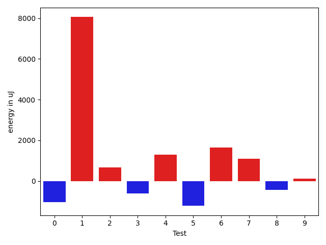

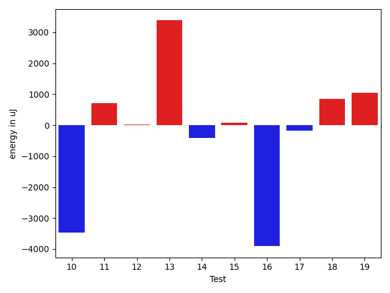

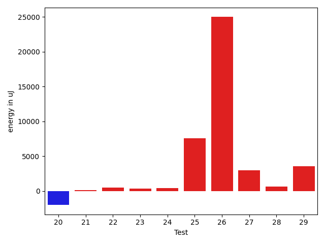

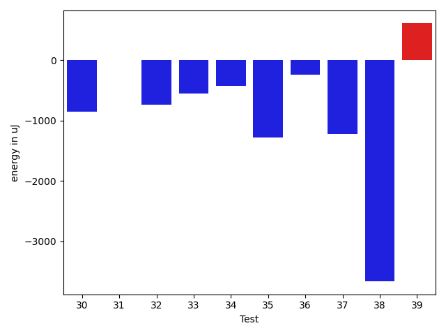

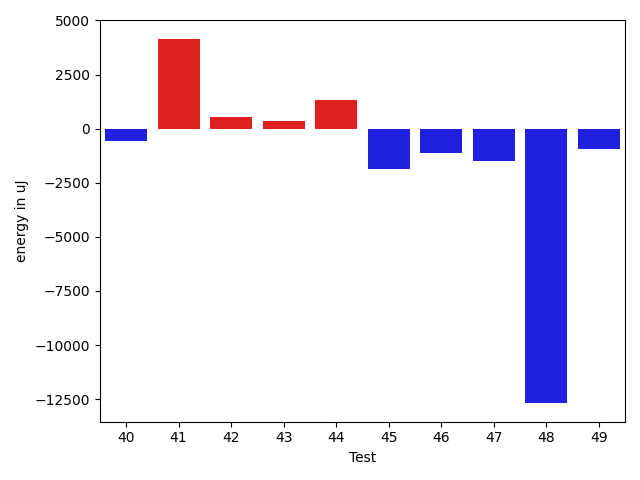

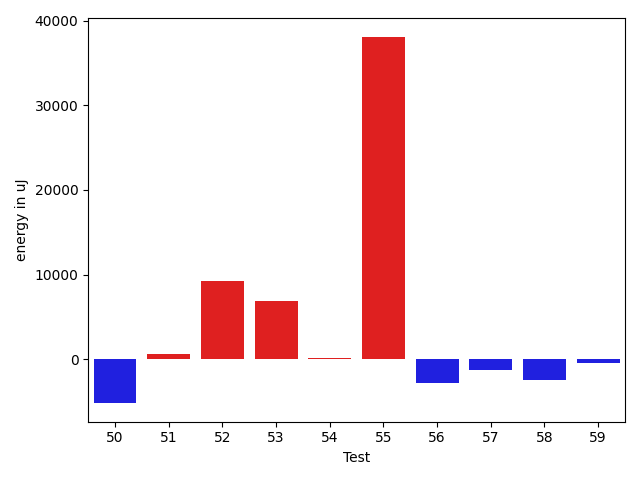

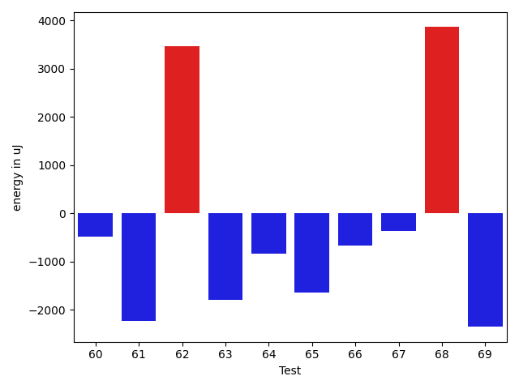

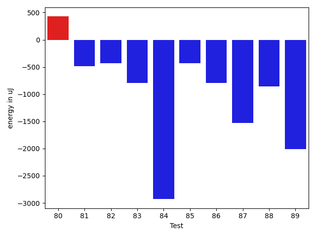

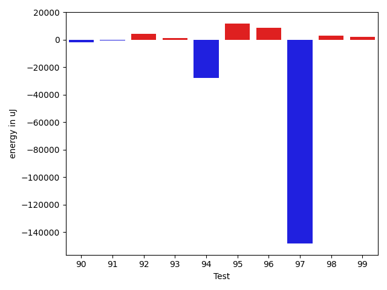

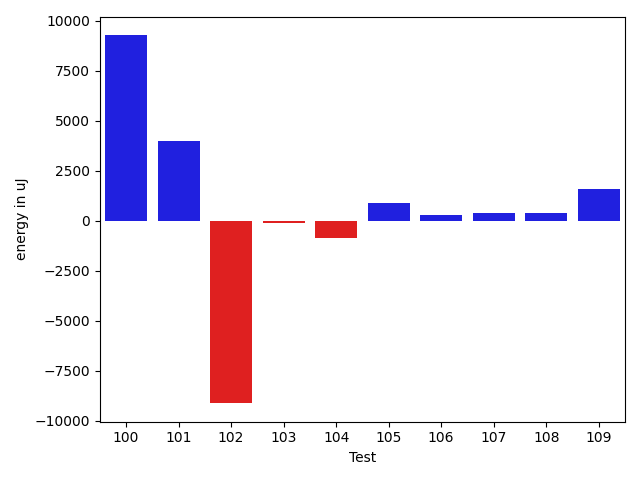

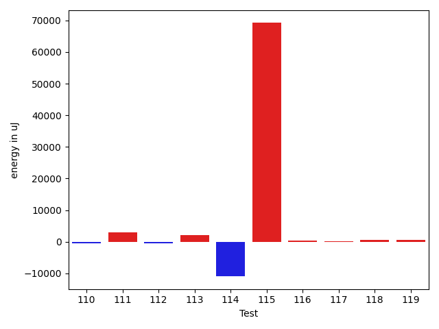

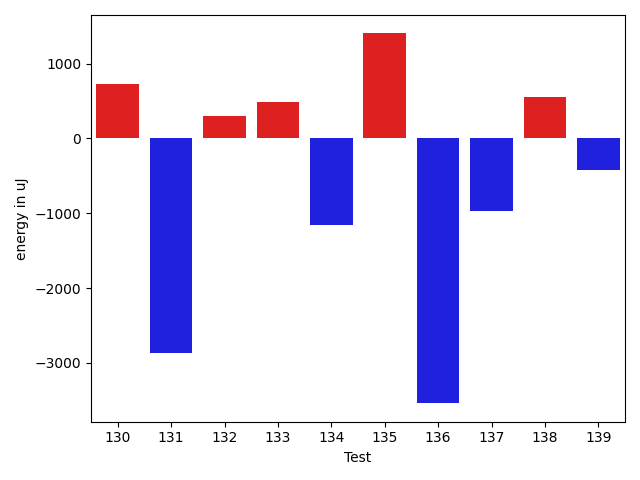

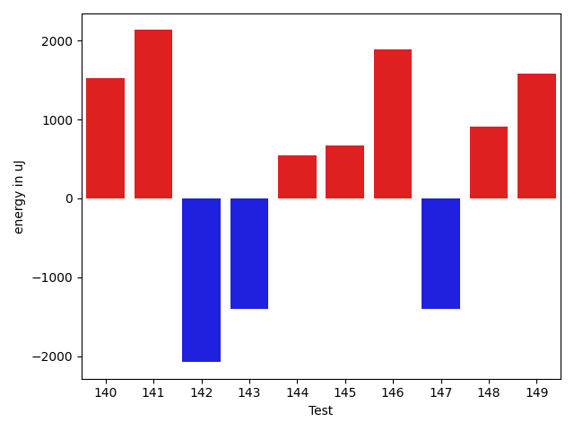

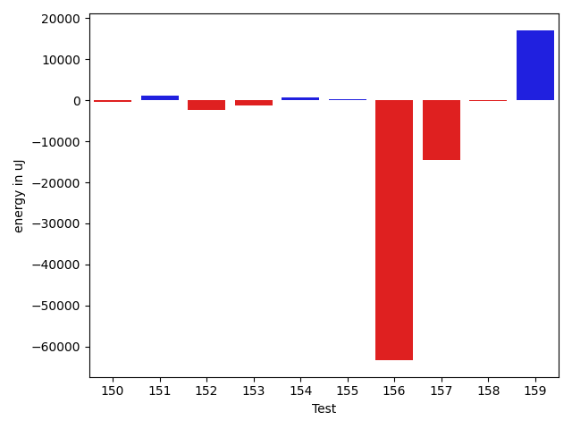

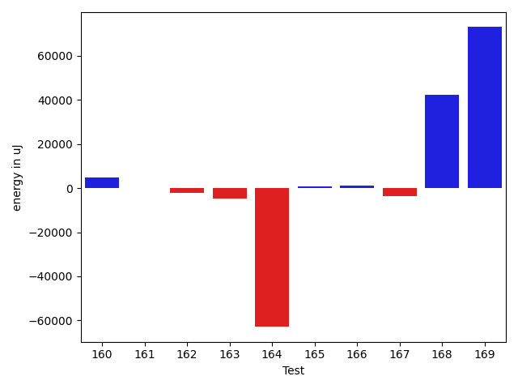

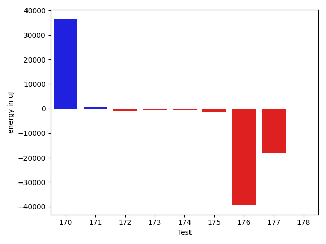

| ID | EnergyV1 | EnergyV2 | DeltaEnergy | σV1 | σV2 |
| --- | --- | --- | --- | --- | --- |
| 0 | 83496 | 82458 | -1038 | 26918.189392744356 | 21783.72895747009 |
| 1 | 88989 | 97046 | 8057 | 70514.2621933216 | 59389.02346999933 |
| 2 | 42236 | 42908 | 672 | 64584.50333930053 | 44235.9669661269 |
| 3 | 40344 | 39733 | -611 | 3056.7890485274306 | 3993.41130474797 |
| 4 | 40222 | 41504 | 1282 | 3974.0985937865316 | 3984.8581670581757 |
| 5 | 78736 | 77514 | -1222 | 27144.024164212722 | 20613.442250476583 |
| 6 | 40588 | 42236 | 1648 | 3270.381180236214 | 5499.228040238807 |
| 7 | 40588 | 41687 | 1099 | 4757.098260212072 | 4586.940652207634 |
| 8 | 81299 | 80872 | -427 | 18740.049703436125 | 19168.28132856227 |
| 9 | 40223 | 40345 | 122 | 3534.3742081842806 | 5216.615000162208 |
| 10 | 41626 | 41321 | -305 | 31347.540090690876 | 28320.113109604736 |
| 11 | 38635 | 40466 | 1831 | 4359.237471347165 | 3522.9153716509436 |
| 12 | 39795 | 39673 | -122 | 3853.150041596558 | 3222.3072863918305 |
| 13 | 83679 | 84472 | 793 | 23558.563253620527 | 29304.40825427379 |
| 14 | 39001 | 39917 | 916 | 3166.398979640737 | 3916.1873075451554 |
| 15 | 38391 | 40283 | 1892 | 5299.0542787584645 | 4887.296108101482 |
| 16 | 41321 | 36499 | -4822 | 3784.4537835730007 | 2990.8209324531617 |
| 17 | 40832 | 39794 | -1038 | 4623.652466814256 | 3986.035522972669 |
| 18 | 39795 | 40894 | 1099 | 4364.155556131363 | 3838.0025205176717 |
| 19 | 39001 | 40711 | 1710 | 4991.599968937403 | 4398.237605364334 |
| 20 | 38574 | 38208 | -366 | 3507.3711555578925 | 5050.154190467852 |
| 21 | 38696 | 39490 | 794 | 3626.742321599916 | 3558.667403521842 |
| 22 | 39978 | 40405 | 427 | 4813.127624613332 | 4257.819837449159 |
| 23 | 39795 | 38636 | -1159 | 3979.0653679452103 | 6117.6757683717315 |
| 24 | 42786 | 42786 | 0 | 17681.299498474964 | 19746.168064881283 |
| 25 | 41321 | 39795 | -1526 | 23302.97126536126 | 33291.18511423708 |
| 26 | 40832 | 41870 | 1038 | 67382.25772176629 | 111642.7074378132 |
| 27 | 42664 | 42175 | -489 | 15459.631052646462 | 23533.416784808214 |
| 28 | 41198 | 40588 | -610 | 3870.5390293512764 | 7805.049148960376 |
| 29 | 40649 | 40833 | 184 | 5032.904101185046 | 27024.028999926883 |
| 30 | 40467 | 39611 | -856 | 4736.124053367784 | 3900.5907883961263 |
| 31 | 40466 | 40466 | 0 | 2807.8408292581294 | 4211.025142202773 |
| 32 | 38757 | 38025 | -732 | 4431.4612941798405 | 4108.801892356792 |
| 33 | 40283 | 39734 | -549 | 4343.677996535642 | 4500.413230894575 |
| 34 | 41199 | 40771 | -428 | 10080.83267753711 | 27066.450556013617 |
| 35 | 43091 | 41809 | -1282 | 15427.449809448077 | 14765.30194664691 |
| 36 | 81054 | 80811 | -243 | 44610.85085941055 | 42696.3421363171 |
| 37 | 43396 | 42175 | -1221 | 41237.02479219216 | 29789.60558110845 |
| 38 | 84289 | 80627 | -3662 | 51161.67551212966 | 41161.46776060749 |
| 39 | 41077 | 41687 | 610 | 9913.77843013764 | 8927.979202310704 |
| 40 | 41138 | 40466 | -672 | 10552.962364595616 | 10033.51962349694 |
| 41 | 41748 | 42358 | 610 | 25529.0725517497 | 27529.077930896354 |
| 42 | 39673 | 41809 | 2136 | 4464.793925280871 | 5128.947740478178 |
| 43 | 41993 | 41687 | -306 | 4582.8608716083145 | 3935.04609428882 |
| 44 | 40649 | 42908 | 2259 | 7943.257214319544 | 8559.494076183497 |
| 45 | 41565 | 41687 | 122 | 17762.58604210978 | 14683.28896878464 |
| 46 | 41748 | 41381 | -367 | 11388.13285560455 | 8841.957518826883 |
| 47 | 41931 | 40527 | -1404 | 4530.508097033262 | 5310.092569006 |
| 48 | 42542 | 42907 | 365 | 121004.5628702368 | 101578.19715416219 |
| 49 | 41077 | 41260 | 183 | 4582.091261956632 | 4209.790481590371 |
| 50 | 42602 | 42054 | -548 | 28710.860409398214 | 13874.690888603112 |
| 51 | 42969 | 43273 | 304 | 4234.421414379509 | 4574.577611697477 |
| 52 | 45532 | 75439 | 29907 | 52131.37509542271 | 48981.260504325284 |
| 53 | 43701 | 44311 | 610 | 21617.005712994698 | 27351.51765717101 |
| 54 | 83984 | 84838 | 854 | 33807.96099829384 | 29566.845025041537 |
| 55 | 86548 | 86792 | 244 | 68150.33498363898 | 272814.13822655776 |
| 56 | 42297 | 40650 | -1647 | 4039.019419226228 | 5638.010656688275 |
| 57 | 41138 | 38086 | -3052 | 5126.239925064202 | 4640.243964807244 |
| 58 | 41320 | 38391 | -2929 | 3680.588047798884 | 3982.7980880280643 |
| 59 | 40039 | 39978 | -61 | 4799.559987498854 | 4702.576268217242 |
| 60 | 40527 | 39673 | -854 | 4366.062412953078 | 4240.591687971797 |
| 61 | 41260 | 38818 | -2442 | 4284.153547948533 | 4853.84941469097 |
| 62 | 39489 | 40466 | 977 | 6307.176313863968 | 12623.267463623282 |
| 63 | 41443 | 38696 | -2747 | 4711.183804506438 | 4031.6831234471997 |
| 64 | 40650 | 40405 | -245 | 4475.0711370135505 | 5542.281377019414 |
| 65 | 41138 | 39733 | -1405 | 4347.394451668723 | 4712.8946617494785 |
| 66 | 41076 | 42297 | 1221 | 8120.943883716718 | 5114.71079725343 |
| 67 | 40405 | 41504 | 1099 | 8402.232774434664 | 4839.583387313985 |
| 68 | 43640 | 44921 | 1281 | 34372.95229641619 | 40231.04395309587 |
| 69 | 42358 | 42175 | -183 | 23414.239910674965 | 9586.598058188118 |
| 70 | 41626 | 42786 | 1160 | 11178.008325032024 | 11367.787624020944 |
| 71 | 187316 | 188354 | 1038 | 185012.82268318124 | 319214.57834189344 |
| 72 | 41565 | 40711 | -854 | 30513.10222982088 | 16461.536794855856 |
| 73 | 40405 | 40405 | 0 | 9619.444820533507 | 13117.504274216306 |
| 74 | 41382 | 38269 | -3113 | 4237.783953313446 | 3776.788932668476 |
| 75 | 40894 | 39916 | -978 | 4126.922002769942 | 3831.105638620021 |
| 76 | 41199 | 42053 | 854 | 8156.702800519686 | 7549.432572797453 |
| 77 | 41809 | 41382 | -427 | 29241.58923232367 | 15008.472706192893 |
| 78 | 43640 | 43457 | -183 | 30060.87561685963 | 16164.89790069004 |
| 79 | 43579 | 42541 | -1038 | 16915.900194119844 | 15590.11275350797 |
| 80 | 43396 | 43823 | 427 | 7843.839945123225 | 5476.718959336583 |
| 81 | 41809 | 41321 | -488 | 12422.10720000523 | 13306.141871051917 |
| 82 | 44617 | 44189 | -428 | 25434.874991131936 | 24311.003675795 |
| 83 | 41443 | 40649 | -794 | 7302.85003706302 | 4949.328803666745 |
| 84 | 43090 | 40161 | -2929 | 31977.29211238671 | 8171.766209076375 |
| 85 | 40893 | 40466 | -427 | 4599.501712225895 | 4216.366396082217 |
| 86 | 40588 | 39795 | -793 | 5249.777612015921 | 3676.73245366476 |
| 87 | 43579 | 42053 | -1526 | 23439.080526815054 | 38461.738136230415 |
| 88 | 42236 | 41381 | -855 | 23767.103554401165 | 6834.54707827065 |
| 89 | 41138 | 39124 | -2014 | 3500.502585118671 | 3910.5023704814216 |
| 90 | 42664 | 40161 | -2503 | 3719.2006273750094 | 4407.256687600576 |
| 91 | 39611 | 39123 | -488 | 5732.789371869702 | 3089.4500734229127 |
| 92 | 40771 | 40893 | 122 | 5933.077710018622 | 24560.262851152638 |
| 93 | 40771 | 42053 | 1282 | 5414.794485447461 | 4932.32263467047 |
| 94 | 42542 | 42602 | 60 | 154283.35930274395 | 80397.92669228515 |
| 95 | 42724 | 43579 | 855 | 29484.886162404768 | 50994.811382552005 |
| 96 | 43701 | 43274 | -427 | 58958.79453916505 | 67112.60662517992 |
| 97 | 43030 | 42786 | -244 | 591668.8280391302 | 27669.13342416861 |
| 98 | 39062 | 42175 | 3113 | 4765.162096928078 | 5453.605575423548 |
| 99 | 41382 | 41443 | 61 | 4037.5425231159547 | 8740.293468940374 |
| 100 | 42297 | 42481 | 184 | 51553.20892711499 | 63356.808318451614 |
| 101 | 42419 | 42175 | -244 | 24914.214655156557 | 34288.25377869279 |
| 102 | 42237 | 42236 | -1 | 430224.8427373186 | 395741.8864387111 |
| 103 | 39001 | 39489 | 488 | 4626.382744303198 | 4244.356142704768 |
| 104 | 42724 | 42542 | -182 | 14081.226027585539 | 11286.006560857386 |
| 105 | 41687 | 42297 | 610 | 3907.365567929425 | 5041.037634336927 |
| 106 | 40893 | 41442 | 549 | 4182.7591724098465 | 6296.26652627709 |
| 107 | 84655 | 87525 | 2870 | 29566.30207875828 | 31010.53997107143 |
| 108 | 39490 | 40039 | 549 | 4541.6042247442565 | 5275.095166420498 |
| 109 | 41016 | 41260 | 244 | 4123.052048407532 | 6640.439576918236 |
| 110 | 40039 | 39795 | -244 | 6569.204881529438 | 5954.872325864974 |
| 111 | 41260 | 41870 | 610 | 18718.09008825529 | 23465.509770658962 |
| 112 | 40710 | 39978 | -732 | 3912.6600670132334 | 4246.9603011300915 |
| 113 | 41931 | 43274 | 1343 | 31350.73054472469 | 34579.36937630671 |
| 114 | 40467 | 40100 | -367 | 40954.847430432455 | 5430.569910853434 |
| 115 | 43151 | 44128 | 977 | 352988.96952270507 | 475991.0314248242 |
| 116 | 42969 | 41199 | -1770 | 5624.409971721478 | 10683.096366587182 |
| 117 | 38696 | 38025 | -671 | 5013.5855748272315 | 5012.052955785406 |
| 118 | 40466 | 40955 | 489 | 4215.628661652231 | 5709.517054696467 |
| 119 | 41137 | 41260 | 123 | 7531.634097368866 | 6960.921105715824 |
| 120 | 42542 | 41686 | -856 | 13816.632086480306 | 12375.826583286274 |
| 121 | 42480 | 42542 | 62 | 23529.92626450607 | 29744.85654768015 |
| 122 | 65125 | 74523 | 9398 | 27827.890569044248 | 25426.217130140016 |
| 123 | 42968 | 43335 | 367 | 10824.394731104088 | 14616.044065839686 |
| 124 | 44311 | 41443 | -2868 | 7497.937671746485 | 8723.630870849967 |
| 125 | 43457 | 42175 | -1282 | 645847.3459571671 | 409732.0959752209 |
| 126 | 39062 | 39916 | 854 | 4579.9183721213585 | 5556.567240446209 |
| 127 | 42114 | 42786 | 672 | 19985.923439653146 | 22986.820266530496 |
| 128 | 44799 | 43701 | -1098 | 46935.544269081576 | 59133.009970108484 |
| 129 | 41260 | 39367 | -1893 | 4085.2258940670044 | 4362.001419868955 |
| 130 | 39856 | 40588 | 732 | 5267.857022487892 | 9733.18285015533 |
| 131 | 41260 | 38391 | -2869 | 4923.134915630487 | 5810.232329808719 |
| 132 | 40466 | 40772 | 306 | 4478.333480059373 | 5001.6084162997 |
| 133 | 38391 | 38879 | 488 | 5285.330764171161 | 5639.798458179946 |
| 134 | 39428 | 38269 | -1159 | 6109.105060045728 | 6616.921894325186 |
| 135 | 41931 | 43335 | 1404 | 499519.5282390797 | 523361.35167693323 |
| 136 | 42236 | 38696 | -3540 | 4171.849254716862 | 5569.947919754302 |
| 137 | 43335 | 42359 | -976 | 10446.69701384871 | 17567.593273474373 |
| 138 | 42908 | 43457 | 549 | 4807.758192415119 | 49999.77393506565 |
| 139 | 42297 | 41870 | -427 | 7673.855238169984 | 2251.2318599541736 |
| 140 | 40832 | 42358 | 1526 | 4067.952915724835 | 4180.032001554972 |
| 141 | 41260 | 43396 | 2136 | 4535.0745718729895 | 23139.053757123416 |
| 142 | 44007 | 41931 | -2076 | 7335.0464520738815 | 4144.088670307671 |
| 143 | 42663 | 41259 | -1404 | 3144.4217075640477 | 3180.688834199284 |
| 144 | 40283 | 40833 | 550 | 2664.9767327595155 | 3689.5570261061002 |
| 145 | 39795 | 40467 | 672 | 3627.1798384665894 | 3122.6076342537817 |
| 146 | 40589 | 42481 | 1892 | 8511.376804737423 | 21345.642002592875 |
| 147 | 42175 | 40771 | -1404 | 3558.1303563322494 | 3681.3247266514754 |
| 148 | 40222 | 41138 | 916 | 4449.505264004077 | 3838.1346416586275 |
| 149 | 39306 | 40894 | 1588 | 4769.436665314086 | 3856.6341133745686 |
| 150 | 41138 | 41260 | 122 | 3731.96500987897 | 4309.676771701472 |
| 151 | 40772 | 40711 | -61 | 4907.091844574926 | 3617.251696624758 |
| 152 | 44251 | 41138 | -3113 | 4801.5166315457245 | 4596.118607525035 |
| 153 | 41076 | 40284 | -792 | 5635.127394079037 | 4407.330155779212 |
| 154 | 39368 | 39856 | 488 | 4643.234015037364 | 3916.8702541998114 |
| 155 | 39855 | 42175 | 2320 | 5556.030183503326 | 4214.858011293301 |
| 156 | 42907 | 41748 | -1159 | 630666.5279446354 | 479824.8339462225 |
| 157 | 44251 | 43640 | -611 | 109080.25603190593 | 99543.63885305278 |
| 158 | 41565 | 43213 | 1648 | 3714.749068725722 | 4050.806379103752 |
| 159 | 82520 | 87341 | 4821 | 128550.5344439879 | 139967.31614274762 |
| 160 | 42725 | 43762 | 1037 | 9842.097623274987 | 27047.228892908704 |
| 161 | 41565 | 42785 | 1220 | 4905.646851028534 | 4977.708513534545 |
| 162 | 41809 | 42175 | 366 | 19678.203683170974 | 11658.33501973579 |
| 163 | 42785 | 41321 | -1464 | 20359.513388042473 | 15494.077254891583 |
| 164 | 43579 | 43457 | -122 | 538481.4595795715 | 353062.56522970623 |
| 165 | 43029 | 41382 | -1647 | 256716.64232193708 | 281810.2260725458 |
| 166 | 41138 | 41138 | 0 | 5570.228066681269 | 9543.128620461252 |
| 167 | 41137 | 42785 | 1648 | 15448.570762519448 | 5479.773555743177 |
| 168 | 42236 | 43884 | 1648 | 32653.816883265055 | 228894.4331156023 |
| 169 | 42603 | 42298 | -305 | 4954.966582163511 | 306435.3446675048 |
| 170 | 48461 | 43090 | -5371 | 527818.8132044311 | 632337.5767166535 |
| 171 | 40832 | 41443 | 611 | 5216.795227654514 | 3194.4929837650525 |
| 172 | 40588 | 40344 | -244 | 4895.313272910178 | 4384.040853664256 |
| 173 | 42480 | 41015 | -1465 | 11614.911747279231 | 9934.461930147867 |
| 174 | 42786 | 41443 | -1343 | 5794.510809842124 | 4129.324069423634 |
| 175 | 42480 | 42419 | -61 | 8356.286873134246 | 8467.319432201868 |
| 176 | 41626 | 40528 | -1098 | 505691.1190764153 | 402666.745140738 |
| 177 | 42664 | 43030 | 366 | 615604.2474339682 | 564908.3673117928 |
| 178 | 44434 | 42724 | -1710 | 4911.471165994972 | 3518.2714189419426 |

## Delta Duration per test method

| ID | DurationV1 | DurationsV2 | DeltaDuration |
| --- | --- | --- | --- |
| 0 | 2483750.242424242 | 2391938.5555555555 | -91811.6868686867 |
| 1 | 3497402.767676768 | 3140005.9595959596 | -357396.80808080826 |
| 2 | 1643308.0869565217 | 1285533.9710144927 | -357774.11594202905 |
| 3 | 394537.4705882353 | 415209.06666666665 | 20671.59607843135 |
| 4 | 556950.6153846154 | 472914.7727272727 | -84035.84265734267 |
| 5 | 2139902.727272727 | 2026013.888888889 | -113888.83838383807 |
| 6 | 537131.0555555555 | 507339.61904761905 | -29791.43650793645 |
| 7 | 559138.5172413794 | 511768.59375 | -47369.92349137936 |
| 8 | 2181804.5353535353 | 2131050.02020202 | -50754.51515151514 |
| 9 | 688187.695652174 | 409066.1818181818 | -279121.5138339921 |
| 10 | 1513643.010989011 | 1438652.0454545454 | -74990.96553446562 |
| 11 | 637436.625 | 539118.0344827586 | -98318.59051724139 |
| 12 | 773472.2777777778 | 769046.7575757576 | -4425.520202020183 |
| 13 | 2472462.2525252528 | 2544742.101010101 | 72279.84848484816 |
| 14 | 385561.4705882353 | 328318.3333333333 | -57243.13725490199 |
| 15 | 700732.3333333334 | 622213.8333333334 | -78518.5 |
| 16 | 372024.0 | 355524.1 | -16499.900000000023 |
| 17 | 655425.9714285714 | 636126.92 | -19299.051428571343 |
| 18 | 506689.60714285716 | 495522.8 | -11166.807142857171 |
| 19 | 751530.4081632653 | 686454.0263157894 | -65076.38184747589 |
| 20 | 352636.5 | 368535.5 | 15899.0 |
| 21 | 380642.3333333333 | 366186.6666666667 | -14455.666666666628 |
| 22 | 792060.0 | 804752.1296296297 | 12692.129629629664 |
| 23 | 872697.880952381 | 848248.7906976744 | -24449.090254706563 |
| 24 | 1274820.7605633803 | 1289054.4605263157 | 14233.69996293541 |
| 25 | 1016966.612244898 | 1364276.38 | 347309.7677551019 |
| 26 | 1364547.2222222222 | 2206379.48 | 841832.2577777777 |
| 27 | 983124.6481481482 | 1188118.3636363635 | 204993.71548821533 |
| 28 | 891811.6451612903 | 1018220.3650793651 | 126408.71991807478 |
| 29 | 768128.2325581395 | 906091.2708333334 | 137963.0382751939 |
| 30 | 756088.3777777777 | 767278.8846153846 | 11190.506837606896 |
| 31 | 324732.71428571426 | 379900.875 | 55168.16071428574 |
| 32 | 541211.0 | 542934.6774193548 | 1723.67741935479 |
| 33 | 777701.976744186 | 804449.3448275862 | 26747.368083400186 |
| 34 | 1151083.9375 | 1271647.3896103897 | 120563.45211038971 |
| 35 | 1304860.1511627906 | 1304232.802197802 | -627.3489649884868 |
| 36 | 2538916.787878788 | 2420793.696969697 | -118123.09090909129 |
| 37 | 1588039.3139534884 | 1351574.6025641025 | -236464.71138938586 |
| 38 | 2603450.6767676766 | 2480808.8585858587 | -122641.81818181789 |
| 39 | 1083846.9104477612 | 1034777.5753424658 | -49069.33510529541 |
| 40 | 1120278.4571428571 | 1095327.9146341463 | -24950.542508710874 |
| 41 | 1444767.5875 | 1537321.5189873418 | 92553.93148734188 |
| 42 | 687423.5151515151 | 720135.6538461539 | 32712.138694638736 |
| 43 | 761423.6851851852 | 798156.4782608695 | 36732.79307568434 |
| 44 | 989044.9074074074 | 1026544.2272727273 | 37499.31986531988 |
| 45 | 1169240.1025641025 | 1122295.027027027 | -46945.07553707552 |
| 46 | 1093682.049382716 | 1066476.107142857 | -27205.94223985891 |
| 47 | 479324.27777777775 | 806520.3157894737 | 327196.03801169596 |
| 48 | 2081670.3243243243 | 1601208.65625 | -480461.66807432426 |
| 49 | 767919.4791666666 | 605717.7666666667 | -162201.7124999999 |
| 50 | 1397782.8395061728 | 1169804.9367088608 | -227977.902797312 |
| 51 | 775837.3478260869 | 454952.1923076923 | -320885.1555183946 |
| 52 | 2000923.2424242424 | 2391720.6170212766 | 390797.3745970342 |
| 53 | 1351052.8192771084 | 1615045.1397849463 | 263992.3205078379 |
| 54 | 2615592.0505050505 | 2623536.484848485 | 7944.434343434405 |
| 55 | 2945077.6363636362 | 4292839.515151516 | 1347761.8787878794 |
| 56 | 568600.5806451613 | 568363.6666666666 | -236.91397849470377 |
| 57 | 562100.6896551724 | 547703.0434782609 | -14397.646176911541 |
| 58 | 520726.36 | 552401.9 | 31675.540000000037 |
| 59 | 560278.56 | 551743.68 | -8534.880000000005 |
| 60 | 600931.0909090909 | 593052.3333333334 | -7878.757575757569 |
| 61 | 570596.24 | 688766.5 | 118170.26000000001 |
| 62 | 912723.0 | 983548.6226415094 | 70825.6226415094 |
| 63 | 577017.9375 | 624561.5945945946 | 47543.65709459456 |
| 64 | 898240.7586206896 | 922015.9615384615 | 23775.20291777188 |
| 65 | 553673.88 | 593427.8620689656 | 39753.98206896556 |
| 66 | 889180.0392156863 | 955657.875 | 66477.83578431373 |
| 67 | 848529.1538461539 | 917563.387755102 | 69034.23390894814 |
| 68 | 1460030.156862745 | 1502591.3870967743 | 42561.23023402924 |
| 69 | 974214.6315789474 | 909779.6545454545 | -64434.977033492876 |
| 70 | 1024482.9344262296 | 1020677.6875 | -3805.2469262295635 |
| 71 | 6221414.202020202 | 7285964.939393939 | 1064550.7373737376 |
| 72 | 1067192.2222222222 | 880973.2391304348 | -186218.98309178744 |
| 73 | 1079705.8 | 1111047.3235294118 | 31341.52352941176 |
| 74 | 684227.0625 | 672567.0833333334 | -11659.979166666628 |
| 75 | 643331.2972972973 | 557976.5185185185 | -85354.77877877874 |
| 76 | 1007113.1698113207 | 1005952.593220339 | -1160.5765909816837 |
| 77 | 1402446.365079365 | 1152084.4444444445 | -250361.92063492048 |
| 78 | 1460795.8208955224 | 1129233.32 | -331562.5008955223 |
| 79 | 1150534.105263158 | 1189669.9642857143 | 39135.85902255634 |
| 80 | 970414.8181818182 | 639184.0 | -331230.81818181823 |
| 81 | 1234742.9726027397 | 1240792.647887324 | 6049.675284584286 |
| 82 | 1692412.0606060605 | 1729739.0505050505 | 37326.98989898991 |
| 83 | 892698.2307692308 | 917365.5 | 24667.26923076925 |
| 84 | 1054953.8863636365 | 890259.9333333333 | -164693.95303030312 |
| 85 | 782262.5098039216 | 814207.3913043478 | 31944.881500426214 |
| 86 | 786008.9523809524 | 797958.358974359 | 11949.406593406573 |
| 87 | 1041931.0789473684 | 1107693.53125 | 65762.45230263157 |
| 88 | 1010679.6274509804 | 893043.9795918367 | -117635.64785914368 |
| 89 | 498522.55555555556 | 521377.1785714286 | 22854.623015873018 |
| 90 | 638342.1 | 645699.04 | 7356.9400000000605 |
| 91 | 478381.0 | 390730.44444444444 | -87650.55555555556 |
| 92 | 830020.3636363636 | 953043.5208333334 | 123023.15719696973 |
| 93 | 767536.7906976744 | 805589.3125 | 38052.52180232562 |
| 94 | 2685380.974025974 | 1720850.3975903615 | -964530.5764356125 |
| 95 | 1198812.9811320754 | 1483516.2978723405 | 284703.3167402651 |
| 96 | 1268472.4545454546 | 1518362.0196078431 | 249889.56506238854 |
| 97 | 5465434.871428572 | 1304439.0634920634 | -4160995.807936508 |
| 98 | 611193.4666666667 | 610889.925925926 | -303.5407407407183 |
| 99 | 770602.7966101695 | 766820.3488372093 | -3782.4477729601786 |
| 100 | 1684865.4395604397 | 1888933.1547619049 | 204067.71520146518 |
| 101 | 1241832.391304348 | 1343794.0 | 101961.6086956521 |
| 102 | 3275556.6440677964 | 3403555.2666666666 | 127998.62259887019 |
| 103 | 472953.7826086957 | 392032.2727272727 | -80921.50988142297 |
| 104 | 1031310.724137931 | 964053.3076923077 | -67257.41644562327 |
| 105 | 619866.6578947369 | 629150.4516129033 | 9283.793718166417 |
| 106 | 870928.2884615385 | 938971.2909090909 | 68043.0024475524 |
| 107 | 2719330.232323232 | 2711559.9696969697 | -7770.262626262382 |
| 108 | 755387.0545454546 | 809361.4038461539 | 53974.34930069931 |
| 109 | 756684.1607142857 | 848439.0588235294 | 91754.89810924372 |
| 110 | 829267.25 | 880640.6666666666 | 51373.41666666663 |
| 111 | 1179179.9 | 1290240.7826086956 | 111060.88260869565 |
| 112 | 754741.3555555556 | 728288.05 | -26453.305555555504 |
| 113 | 1366277.5636363637 | 1448005.2258064516 | 81727.66217008792 |
| 114 | 741473.6 | 557790.3 | -183683.29999999993 |
| 115 | 3337696.5857142857 | 5737440.803278688 | 2399744.2175644026 |
| 116 | 925872.54 | 1000316.2608695652 | 74443.72086956515 |
| 117 | 542397.8181818182 | 541711.3333333334 | -686.4848484848626 |
| 118 | 823329.3269230769 | 835474.2615384615 | 12144.93461538467 |
| 119 | 983022.9583333334 | 806025.4444444445 | -176997.51388888888 |
| 120 | 1037110.4576271187 | 909402.052631579 | -127708.40499553969 |
| 121 | 1259243.7464788733 | 1334419.9473684211 | 75176.20088954782 |
| 122 | 1922555.6363636365 | 2015743.3434343433 | 93187.70707070688 |
| 123 | 1025994.9534883721 | 1181658.1698113207 | 155663.21632294857 |
| 124 | 896323.1739130435 | 1022394.0425531915 | 126070.86864014808 |
| 125 | 6876243.5 | 3262401.294117647 | -3613842.205882353 |
| 126 | 763207.023255814 | 943265.38 | 180058.35674418602 |
| 127 | 1444038.15625 | 1620997.237113402 | 176959.080863402 |
| 128 | 1345237.2162162163 | 1659222.3265306123 | 313985.110314396 |
| 129 | 493217.8333333333 | 590881.5714285715 | 97663.73809523816 |
| 130 | 692539.7083333334 | 799186.3333333334 | 106646.625 |
| 131 | 570957.925 | 734660.8787878788 | 163702.95378787874 |
| 132 | 604812.2068965518 | 708892.8333333334 | 104080.6264367816 |
| 133 | 618315.925925926 | 681528.5 | 63212.574074074044 |
| 134 | 818296.5106382979 | 1034975.42 | 216678.90936170216 |
| 135 | 6588071.833333333 | 8241302.9 | 1653231.0666666673 |
| 136 | 539956.2380952381 | 603235.2413793104 | 63279.00328407227 |
| 137 | 1114739.1369863013 | 1159630.32 | 44891.183013698785 |
| 138 | 636539.8571428572 | 1007188.1724137932 | 370648.315270936 |
| 139 | 985138.0333333333 | 910723.2181818181 | -74414.81515151518 |
| 140 | 551658.8148148148 | 451843.96153846156 | -99814.85327635327 |
| 141 | 480024.78571428574 | 660031.8260869565 | 180007.0403726708 |
| 142 | 567844.0 | 505112.8695652174 | -62731.13043478259 |
| 143 | 458336.3125 | 439941.75 | -18394.5625 |
| 144 | 478613.4736842105 | 411262.0 | -67351.4736842105 |
| 145 | 453847.0909090909 | 411726.75 | -42120.34090909088 |
| 146 | 794328.3333333334 | 838954.3142857143 | 44625.98095238092 |
| 147 | 513743.6666666667 | 410313.0416666667 | -103430.625 |
| 148 | 516759.6 | 498249.2 | -18510.399999999965 |
| 149 | 755238.2608695652 | 732197.5111111111 | -23040.74975845404 |
| 150 | 596342.9375 | 582324.8148148148 | -14018.122685185168 |
| 151 | 509946.0625 | 395652.9285714286 | -114293.13392857142 |
| 152 | 648405.3571428572 | 654199.6923076923 | 5794.3351648350945 |
| 153 | 507553.95 | 449247.71428571426 | -58306.23571428575 |
| 154 | 423674.28 | 383305.8823529412 | -40368.397647058824 |
| 155 | 564824.65 | 532413.5882352941 | -32411.061764705926 |
| 156 | 6625007.904761905 | 5060750.52 | -1564257.3847619053 |
| 157 | 2482247.0 | 2044694.0833333333 | -437552.91666666674 |
| 158 | 443093.0 | 484218.2962962963 | 41125.29629629629 |
| 159 | 3195147.878787879 | 3620101.212121212 | 424953.333333333 |
| 160 | 1049295.9574468085 | 1085329.3214285714 | 36033.3639817629 |
| 161 | 818827.2222222222 | 906666.4571428571 | 87839.23492063489 |
| 162 | 984715.1818181818 | 888181.375 | -96533.80681818177 |
| 163 | 1343018.939759036 | 1212472.0120481928 | -130546.92771084327 |
| 164 | 5096669.174418605 | 3251772.012987013 | -1844897.161431592 |
| 165 | 2237584.45 | 2261185.0 | 23600.549999999814 |
| 166 | 770370.28125 | 711485.3666666667 | -58884.9145833333 |
| 167 | 701474.6052631579 | 833392.5666666667 | 131917.9614035088 |
| 168 | 913972.1219512195 | 2474668.785714286 | 1560696.6637630663 |
| 169 | 631865.7142857143 | 3215986.6666666665 | 2584120.9523809524 |
| 170 | 5640764.509090909 | 6618802.054545455 | 978037.5454545459 |
| 171 | 825978.880952381 | 729247.0 | -96731.88095238095 |
| 172 | 809621.2708333334 | 825214.8333333334 | 15593.5625 |
| 173 | 1023433.8048780488 | 962692.1914893617 | -60741.61338868714 |
| 174 | 713376.7037037037 | 641953.0 | -71423.70370370371 |
| 175 | 960045.7636363637 | 1056388.828125 | 96343.06448863633 |
| 176 | 4323704.118644068 | 3285813.5454545454 | -1037890.5731895226 |
| 177 | 6787650.368421053 | 6354423.736842105 | -433226.6315789474 |
| 178 | 458451.6 | 463622.0625 | 5170.462500000023 |

## Misc.

| ID | Test Class | Test Method |
| --- | --- | --- |
| 0 | com.google.gson.functional.DefaultTypeAdaptersTest | testDateSerializationWithPatternNotOverridenByTypeAdapter |
| 1 | com.google.gson.functional.DefaultTypeAdaptersTest | testDateSerializationWithPattern |
| 2 | com.google.gson.functional.DefaultTypeAdaptersTest | testUrlSerialization |
| 3 | com.google.gson.functional.DefaultTypeAdaptersTest | testUuidDeserialization |
| 4 | com.google.gson.functional.DefaultTypeAdaptersTest | testDefaultGregorianCalendarDeserialization |
| 5 | com.google.gson.functional.DefaultTypeAdaptersTest | testSqlDateSerialization |
| 6 | com.google.gson.functional.DefaultTypeAdaptersTest | testUuidSerialization |
| 7 | com.google.gson.functional.DefaultTypeAdaptersTest | testUriSerialization |
| 8 | com.google.gson.functional.DefaultTypeAdaptersTest | testTimestampSerialization |
| 9 | com.google.gson.functional.DefaultTypeAdaptersTest | testUriDeserialization |
| 10 | com.google.gson.functional.DefaultTypeAdaptersTest | testUrlNullSerialization |
| 11 | com.google.gson.functional.DefaultTypeAdaptersTest | testDefaultCalendarDeserialization |
| 12 | com.google.gson.functional.DefaultTypeAdaptersTest | testTreeSetSerialization |
| 13 | com.google.gson.functional.DefaultTypeAdaptersTest | testDateDeserializationWithPattern |
| 14 | com.google.gson.functional.DefaultTypeAdaptersTest | testStringBuilderSerialization |
| 15 | com.google.gson.functional.DefaultTypeAdaptersTest | testUrlDeserialization |
| 16 | com.google.gson.functional.DefaultTypeAdaptersTest | testStringBuilderDeserialization |
| 17 | com.google.gson.functional.DefaultTypeAdaptersTest | testSetSerialization |
| 18 | com.google.gson.functional.DefaultTypeAdaptersTest | testBitSetSerialization |
| 19 | com.google.gson.functional.DefaultTypeAdaptersTest | testBitSetDeserialization |
| 20 | com.google.gson.functional.DefaultTypeAdaptersTest | testStringBufferDeserialization |
| 21 | com.google.gson.functional.DefaultTypeAdaptersTest | testStringBufferSerialization |
| 22 | com.google.gson.functional.CollectionTest | testCollectionOfObjectSerialization |
| 23 | com.google.gson.functional.CollectionTest | testRawCollectionSerialization |
| 24 | com.google.gson.functional.CollectionTest | testWildcardPrimitiveCollectionSerilaization |
| 25 | com.google.gson.functional.CollectionTest | testCollectionOfBagOfPrimitivesSerialization |
| 26 | com.google.gson.functional.CollectionTest | testSetSerialization |
| 27 | com.google.gson.functional.CollectionTest | testTopLevelCollectionOfIntegersSerialization |
| 28 | com.google.gson.functional.CollectionTest | testLinkedListSerialization |
| 29 | com.google.gson.functional.CollectionTest | testNullsInListSerialization |
| 30 | com.google.gson.functional.CollectionTest | testCollectionOfObjectWithNullSerialization |
| 31 | com.google.gson.functional.CollectionTest | testCollectionOfStringsSerialization |
| 32 | com.google.gson.functional.CollectionTest | testRawCollectionOfIntegersSerialization |
| 33 | com.google.gson.functional.CollectionTest | testQueueSerialization |
| 34 | com.google.gson.functional.ParameterizedTypesTest | testParameterizedTypeGenericArraysSerialization |
| 35 | com.google.gson.functional.ParameterizedTypesTest | testParameterizedTypeWithCustomSerializer |
| 36 | com.google.gson.functional.ParameterizedTypesTest | testVariableTypeFieldsAndGenericArraysSerialization |
| 37 | com.google.gson.functional.ParameterizedTypesTest | testParameterizedTypeDeserialization |
| 38 | com.google.gson.functional.ParameterizedTypesTest | testTypesWithMultipleParametersSerialization |
| 39 | com.google.gson.functional.ParameterizedTypesTest | testParameterizedTypeWithReaderDeserialization |
| 40 | com.google.gson.functional.ParameterizedTypesTest | testParameterizedTypesWithCustomDeserializer |
| 41 | com.google.gson.functional.MapTest | testSerializeMaps |
| 42 | com.google.gson.functional.MapTest | testMapSerializationWithNullValuesSerialized |
| 43 | com.google.gson.functional.MapTest | testMapSerializationWithNullValueButSerializeNulls |
| 44 | com.google.gson.functional.MapTest | testCustomSerializerForSpecificMapType |
| 45 | com.google.gson.functional.ReadersWritersTest | testReadWriteTwoObjects |
| 46 | com.google.gson.functional.ReadersWritersTest | testReadWriteTwoStrings |
| 47 | com.google.gson.functional.ReadersWritersTest | testTopLevelNullObjectSerializationWithWriterAndSerializeNulls |
| 48 | com.google.gson.functional.ReadersWritersTest | testWriterForSerialization |
| 49 | com.google.gson.functional.FieldExclusionTest | testDefaultNestedStaticClassIncluded |
| 50 | com.google.gson.functional.FieldExclusionTest | testDefaultInnerClassExclusion |
| 51 | com.google.gson.functional.FieldExclusionTest | testInnerClassExclusion |
| 52 | com.google.gson.functional.InheritanceTest | testSubInterfacesOfCollectionSerialization |
| 53 | com.google.gson.functional.InheritanceTest | testSubClassSerialization |
| 54 | com.google.gson.functional.NamingPolicyTest | testGsonWithNonDefaultFieldNamingPolicySerialization |
| 55 | com.google.gson.functional.NamingPolicyTest | testGsonDuplicateNameUsingSerializedNameFieldNamingPolicySerialization |
| 56 | com.google.gson.functional.NamingPolicyTest | testGsonWithSerializedNameFieldNamingPolicyDeserialization |
| 57 | com.google.gson.functional.NamingPolicyTest | testGsonWithUpperCamelCaseSpacesPolicyDeserialiation |
| 58 | com.google.gson.functional.NamingPolicyTest | testGsonWithUpperCamelCaseSpacesPolicySerialiation |
| 59 | com.google.gson.functional.NamingPolicyTest | testGsonWithLowerCaseUnderscorePolicySerialization |
| 60 | com.google.gson.functional.NamingPolicyTest | testGsonWithLowerCaseDashPolicyDeserialiation |
| 61 | com.google.gson.functional.NamingPolicyTest | testGsonWithNonDefaultFieldNamingPolicyDeserialiation |
| 62 | com.google.gson.functional.NamingPolicyTest | testComplexFieldNameStrategy |
| 63 | com.google.gson.functional.NamingPolicyTest | testGsonWithLowerCaseDashPolicySerialization |
| 64 | com.google.gson.functional.NamingPolicyTest | testGsonWithSerializedNameFieldNamingPolicySerialization |
| 65 | com.google.gson.functional.NamingPolicyTest | testGsonWithLowerCaseUnderscorePolicyDeserialiation |
| 66 | com.google.gson.functional.CustomDeserializerTest | testCustomDeserializerReturnsNull |
| 67 | com.google.gson.functional.CustomDeserializerTest | testCustomDeserializerReturnsNullForArrayElements |
| 68 | com.google.gson.functional.CustomDeserializerTest | testCustomDeserializerReturnsNullForTopLevelObject |
| 69 | com.google.gson.functional.TypeHierarchyAdapterTest | testRegisterSuperTypeFirst |
| 70 | com.google.gson.functional.TypeVariableTest | testBasicTypeVariables |
| 71 | com.google.gson.functional.VersioningTest | testVersionedUntilSerialization |
| 72 | com.google.gson.functional.VersioningTest | testVersionedGsonWithUnversionedClassesSerialization |
| 73 | com.google.gson.functional.VersioningTest | testVersionedGsonMixingSinceAndUntilSerialization |
| 74 | com.google.gson.functional.VersioningTest | testVersionedGsonWithUnversionedClassesDeserialization |
| 75 | com.google.gson.functional.VersioningTest | testIgnoreLaterVersionClassSerialization |
| 76 | com.google.gson.functional.VersioningTest | testVersionedClassesSerialization |
| 77 | com.google.gson.functional.ArrayTest | testObjectArrayWithNonPrimitivesSerialization |
| 78 | com.google.gson.functional.ArrayTest | testArrayOfCollectionSerialization |
| 79 | com.google.gson.functional.ArrayTest | testArrayOfPrimitivesAsObjectsSerialization |
| 80 | com.google.gson.functional.ArrayTest | testNullsInArrayWithSerializeNullPropertySetSerialization |
| 81 | com.google.gson.functional.ObjectTest | testArrayOfObjectsAsFields |
| 82 | com.google.gson.functional.ObjectTest | testArrayOfArraysSerialization |
| 83 | com.google.gson.functional.ObjectTest | testArrayOfObjectsSerialization |
| 84 | com.google.gson.functional.ObjectTest | testClassWithTransientFieldsSerialization |
| 85 | com.google.gson.functional.ObjectTest | testInnerClassDeserialization |
| 86 | com.google.gson.functional.ObjectTest | testBagOfPrimitiveWrappersSerialization |
| 87 | com.google.gson.functional.ObjectTest | testBagOfPrimitivesSerialization |
| 88 | com.google.gson.functional.ObjectTest | testNestedSerialization |
| 89 | com.google.gson.functional.ObjectTest | testPrimitiveArrayFieldSerialization |
| 90 | com.google.gson.functional.ObjectTest | testEmptyCollectionInAnObjectSerialization |
| 91 | com.google.gson.functional.ObjectTest | testJsonObjectSerialization |
| 92 | com.google.gson.functional.ObjectTest | testNullFieldsSerialization |
| 93 | com.google.gson.functional.EscapingTest | testGsonDoubleDeserialization |
| 94 | com.google.gson.functional.EscapingTest | testGsonAcceptsEscapedAndNonEscapedJsonDeserialization |
| 95 | com.google.gson.functional.EscapingTest | testEscapingObjectFields |
| 96 | com.google.gson.functional.EscapingTest | testEscapeAllHtmlCharacters |
| 97 | com.google.gson.functional.InstanceCreatorTest | testInstanceCreatorReturnsBaseType |
| 98 | com.google.gson.MixedStreamTest | testWriteClosed |
| 99 | com.google.gson.MixedStreamTest | testWriteDoesNotMutateState |
| 100 | com.google.gson.MixedStreamTest | testWriteHtmlSafe |
| 101 | com.google.gson.MixedStreamTest | testWriteLenient |
| 102 | com.google.gson.MixedStreamTest | testWriteMixedStreamed |
| 103 | com.google.gson.MixedStreamTest | testWriteNulls |
| 104 | com.google.gson.MixedStreamTest | testReadClosed |
| 105 | com.google.gson.MixedStreamTest | testWriteInvalidState |
| 106 | com.google.gson.functional.CustomTypeAdaptersTest | testCustomNestedDeserializers |
| 107 | com.google.gson.functional.CustomTypeAdaptersTest | testCustomTypeAdapterDoesNotAppliesToSubClasses |
| 108 | com.google.gson.functional.CustomTypeAdaptersTest | testCustomByteArrayDeserializerAndInstanceCreator |
| 109 | com.google.gson.functional.CustomTypeAdaptersTest | testCustomByteArraySerializer |
| 110 | com.google.gson.functional.CustomTypeAdaptersTest | testCustomAdapterInvokedForMapElementSerializationWithType |
| 111 | com.google.gson.functional.CustomTypeAdaptersTest | testCustomAdapterInvokedForCollectionElementSerializationWithType |
| 112 | com.google.gson.functional.CustomTypeAdaptersTest | testEnsureCustomSerializerNotInvokedForNullValues |
| 113 | com.google.gson.functional.CustomTypeAdaptersTest | testCustomNestedSerializers |
| 114 | com.google.gson.functional.CustomTypeAdaptersTest | testCustomAdapterInvokedForMapElementSerialization |
| 115 | com.google.gson.functional.CustomTypeAdaptersTest | testCustomSerializers |
| 116 | com.google.gson.functional.CustomTypeAdaptersTest | testCustomDeserializers |
| 117 | com.google.gson.functional.CustomTypeAdaptersTest | testCustomAdapterInvokedForCollectionElementSerialization |
| 118 | com.google.gson.functional.CustomTypeAdaptersTest | testCustomTypeAdapterAppliesToSubClassesSerializedAsBaseClass |
| 119 | com.google.gson.internal.bind.MiniGsonTest | testDeserializeWithCustomTypeAdapter |
| 120 | com.google.gson.internal.bind.MiniGsonTest | testSerializeWithCustomTypeAdapter |
| 121 | com.google.gson.functional.JsonTreeTest | testJsonTreeToString |
| 122 | com.google.gson.functional.UncategorizedTest | testReturningDerivedClassesDuringDeserialization |
| 123 | com.google.gson.functional.UncategorizedTest | testGsonInstanceReusableForSerializationAndDeserialization |
| 124 | com.google.gson.functional.UncategorizedTest | testStaticFieldsAreNotSerialized |
| 125 | com.google.gson.DefaultMapJsonSerializerTest | testNonEmptyMapSerialization |
| 126 | com.google.gson.functional.NullObjectAndFieldTest | testNullWrappedPrimitiveMemberSerialization |
| 127 | com.google.gson.functional.NullObjectAndFieldTest | testExplicitSerializationOfNullArrayMembers |
| 128 | com.google.gson.functional.NullObjectAndFieldTest | testExplicitSerializationOfNulls |
| 129 | com.google.gson.functional.NullObjectAndFieldTest | testCustomSerializationOfNulls |
| 130 | com.google.gson.functional.NullObjectAndFieldTest | testExplicitDeserializationOfNulls |
| 131 | com.google.gson.functional.NullObjectAndFieldTest | testExplicitSerializationOfNullCollectionMembers |
| 132 | com.google.gson.functional.NullObjectAndFieldTest | testPrintPrintingArraysWithNulls |
| 133 | com.google.gson.functional.NullObjectAndFieldTest | testExplicitSerializationOfNullStringMembers |
| 134 | com.google.gson.functional.NullObjectAndFieldTest | testPrintPrintingObjectWithNulls |
| 135 | com.google.gson.functional.NullObjectAndFieldTest | testTopLevelNullObjectSerialization |
| 136 | com.google.gson.functional.NullObjectAndFieldTest | testCustomTypeAdapterPassesNullSerialization |
| 137 | com.google.gson.functional.RawSerializationTest | testCollectionOfObjects |
| 138 | com.google.gson.functional.RawSerializationTest | testCollectionOfPrimitives |
| 139 | com.google.gson.functional.CircularReferenceTest | testDirectedAcyclicGraphSerialization |
| 140 | com.google.gson.functional.PrimitiveTest | testDoubleNaNSerialization |
| 141 | com.google.gson.functional.PrimitiveTest | testNegativeInfinitySerialization |
| 142 | com.google.gson.functional.PrimitiveTest | testNumberSerialization |
| 143 | com.google.gson.functional.PrimitiveTest | testDeserializeJsonObjectAsShortPrimitive |
| 144 | com.google.gson.functional.PrimitiveTest | testDoubleInfinitySerialization |
| 145 | com.google.gson.functional.PrimitiveTest | testDeserializeJsonArrayAsShortWrapper |
| 146 | com.google.gson.functional.PrimitiveTest | testMoreSpecificSerialization |
| 147 | com.google.gson.functional.PrimitiveTest | testLongAsStringDeserialization |
| 148 | com.google.gson.functional.PrimitiveTest | testFloatNaNSerialization |
| 149 | com.google.gson.functional.PrimitiveTest | testHtmlCharacterSerialization |
| 150 | com.google.gson.functional.PrimitiveTest | testLongAsStringSerialization |
| 151 | com.google.gson.functional.PrimitiveTest | testFloatInfinitySerialization |
| 152 | com.google.gson.functional.PrimitiveTest | testPrimitiveLongAutoboxedInASingleElementArraySerialization |
| 153 | com.google.gson.functional.PrimitiveTest | testPrimitiveLongAutoboxedSerialization |
| 154 | com.google.gson.functional.PrimitiveTest | testNegativeInfinityFloatSerialization |
| 155 | com.google.gson.functional.PrimitiveTest | testReallyLongValuesSerialization |
| 156 | com.google.gson.GsonBuilderTest | testCreatingMoreThanOnce |
| 157 | com.google.gson.functional.PrintFormattingTest | testCompactFormattingLeavesNoWhiteSpace |
| 158 | com.google.gson.functional.PrintFormattingTest | testJsonObjectWithNullValuesSerialized |
| 159 | com.google.gson.functional.PrettyPrintingTest | testPrettyPrintList |
| 160 | com.google.gson.functional.PrettyPrintingTest | testPrettyPrintArrayOfObjects |
| 161 | com.google.gson.functional.PrettyPrintingTest | testPrettyPrintListOfPrimitiveArrays |
| 162 | com.google.gson.functional.EnumTest | testCollectionOfEnumsSerialization |
| 163 | com.google.gson.functional.MapAsArrayTypeAdapterTest | testMapWithTypeVariableSerialization |
| 164 | com.google.gson.JsonParserTest | testReadWriteTwoObjects |
| 165 | com.google.gson.functional.SecurityTest | testNonExecutableJsonSerialization |
| 166 | com.google.gson.functional.SecurityTest | testNonExecutableJsonDeserialization |
| 167 | com.google.gson.functional.SecurityTest | testJsonWithNonExectuableTokenWithConfiguredGsonDeserialization |
| 168 | com.google.gson.functional.SecurityTest | testJsonWithNonExectuableTokenSerialization |
| 169 | com.google.gson.functional.SecurityTest | testJsonWithNonExectuableTokenWithRegularGsonDeserialization |
| 170 | com.google.gson.functional.CustomSerializerTest | testSubClassSerializerInvokedForBaseClassFieldsHoldingSubClassInstances |
| 171 | com.google.gson.functional.CustomSerializerTest | testBaseClassSerializerInvokedForBaseClassFieldsHoldingSubClassInstances |
| 172 | com.google.gson.functional.CustomSerializerTest | testSerializerReturnsNull |
| 173 | com.google.gson.functional.CustomSerializerTest | testSubClassSerializerInvokedForBaseClassFieldsHoldingArrayOfSubClassInstances |
| 174 | com.google.gson.functional.CustomSerializerTest | testBaseClassSerializerInvokedForBaseClassFields |
| 175 | com.google.gson.functional.MoreSpecificTypeSerializationTest | testListOfParameterizedSubclassFields |
| 176 | com.google.gson.FunctionWithInternalDependenciesTest | testAnonymousLocalClassesSerialization |
| 177 | com.google.gson.JsonObjectTest | testPropertyWithQuotes |
| 178 | com.google.gson.JsonObjectTest | testWritePropertyWithEmptyStringName |

| Test | IterationV1 | IterationV2 | DeltaIteration |
| --- | --- | --- | --- |
| 0 | 99 | 99 | 0 |
| 1 | 99 | 99 | 0 |
| 2 | 69 | 69 | 0 |
| 3 | 17 | 15 | -2 |
| 4 | 26 | 22 | -4 |
| 5 | 99 | 99 | 0 |
| 6 | 36 | 21 | -15 |
| 7 | 29 | 32 | 3 |
| 8 | 99 | 99 | 0 |
| 9 | 23 | 22 | -1 |
| 10 | 91 | 88 | -3 |
| 11 | 24 | 29 | 5 |
| 12 | 36 | 33 | -3 |
| 13 | 99 | 99 | 0 |
| 14 | 17 | 18 | 1 |
| 15 | 36 | 24 | -12 |
| 16 | 10 | 10 | 0 |
| 17 | 35 | 25 | -10 |
| 18 | 28 | 20 | -8 |
| 19 | 49 | 38 | -11 |
| 20 | 18 | 20 | 2 |
| 21 | 18 | 15 | -3 |
| 22 | 48 | 54 | 6 |
| 23 | 42 | 43 | 1 |
| 24 | 71 | 76 | 5 |
| 25 | 49 | 50 | 1 |
| 26 | 63 | 75 | 12 |
| 27 | 54 | 66 | 12 |
| 28 | 62 | 63 | 1 |
| 29 | 43 | 48 | 5 |
| 30 | 45 | 52 | 7 |
| 31 | 14 | 24 | 10 |
| 32 | 21 | 31 | 10 |
| 33 | 43 | 58 | 15 |
| 34 | 80 | 77 | -3 |
| 35 | 86 | 91 | 5 |
| 36 | 99 | 99 | 0 |
| 37 | 86 | 78 | -8 |
| 38 | 99 | 99 | 0 |
| 39 | 67 | 73 | 6 |
| 40 | 70 | 82 | 12 |
| 41 | 80 | 79 | -1 |
| 42 | 33 | 26 | -7 |
| 43 | 54 | 46 | -8 |
| 44 | 54 | 66 | 12 |
| 45 | 78 | 74 | -4 |
| 46 | 81 | 84 | 3 |
| 47 | 18 | 19 | 1 |
| 48 | 37 | 32 | -5 |
| 49 | 48 | 30 | -18 |
| 50 | 81 | 79 | -2 |
| 51 | 23 | 26 | 3 |
| 52 | 99 | 94 | -5 |
| 53 | 83 | 93 | 10 |
| 54 | 99 | 99 | 0 |
| 55 | 99 | 99 | 0 |
| 56 | 31 | 24 | -7 |
| 57 | 29 | 23 | -6 |
| 58 | 25 | 20 | -5 |
| 59 | 25 | 25 | 0 |
| 60 | 22 | 33 | 11 |
| 61 | 25 | 22 | -3 |
| 62 | 60 | 53 | -7 |
| 63 | 32 | 37 | 5 |
| 64 | 58 | 52 | -6 |
| 65 | 25 | 29 | 4 |
| 66 | 51 | 56 | 5 |
| 67 | 52 | 49 | -3 |
| 68 | 51 | 62 | 11 |
| 69 | 57 | 55 | -2 |
| 70 | 61 | 64 | 3 |
| 71 | 99 | 99 | 0 |
| 72 | 36 | 46 | 10 |
| 73 | 75 | 68 | -7 |
| 74 | 32 | 48 | 16 |
| 75 | 37 | 27 | -10 |
| 76 | 53 | 59 | 6 |
| 77 | 63 | 63 | 0 |
| 78 | 67 | 75 | 8 |
| 79 | 38 | 28 | -10 |
| 80 | 22 | 19 | -3 |
| 81 | 73 | 71 | -2 |
| 82 | 99 | 99 | 0 |
| 83 | 52 | 46 | -6 |
| 84 | 44 | 45 | 1 |
| 85 | 51 | 46 | -5 |
| 86 | 42 | 39 | -3 |
| 87 | 38 | 32 | -6 |
| 88 | 51 | 49 | -2 |
| 89 | 27 | 28 | 1 |
| 90 | 30 | 25 | -5 |
| 91 | 15 | 18 | 3 |
| 92 | 44 | 48 | 4 |
| 93 | 43 | 48 | 5 |
| 94 | 77 | 83 | 6 |
| 95 | 53 | 47 | -6 |
| 96 | 33 | 51 | 18 |
| 97 | 70 | 63 | -7 |
| 98 | 30 | 27 | -3 |
| 99 | 59 | 43 | -16 |
| 100 | 91 | 84 | -7 |
| 101 | 69 | 70 | 1 |
| 102 | 59 | 60 | 1 |
| 103 | 23 | 22 | -1 |
| 104 | 58 | 52 | -6 |
| 105 | 38 | 31 | -7 |
| 106 | 52 | 55 | 3 |
| 107 | 99 | 99 | 0 |
| 108 | 55 | 52 | -3 |
| 109 | 56 | 51 | -5 |
| 110 | 56 | 54 | -2 |
| 111 | 70 | 69 | -1 |
| 112 | 45 | 40 | -5 |
| 113 | 55 | 62 | 7 |
| 114 | 20 | 30 | 10 |
| 115 | 70 | 61 | -9 |
| 116 | 50 | 46 | -4 |
| 117 | 22 | 24 | 2 |
| 118 | 52 | 65 | 13 |
| 119 | 48 | 45 | -3 |
| 120 | 59 | 57 | -2 |
| 121 | 71 | 76 | 5 |
| 122 | 99 | 99 | 0 |
| 123 | 43 | 53 | 10 |
| 124 | 46 | 47 | 1 |
| 125 | 54 | 51 | -3 |
| 126 | 43 | 50 | 7 |
| 127 | 96 | 97 | 1 |
| 128 | 37 | 49 | 12 |
| 129 | 30 | 35 | 5 |
| 130 | 24 | 42 | 18 |
| 131 | 40 | 33 | -7 |
| 132 | 29 | 36 | 7 |
| 133 | 27 | 30 | 3 |
| 134 | 47 | 50 | 3 |
| 135 | 24 | 30 | 6 |
| 136 | 21 | 29 | 8 |
| 137 | 73 | 75 | 2 |
| 138 | 28 | 29 | 1 |
| 139 | 60 | 55 | -5 |
| 140 | 27 | 26 | -1 |
| 141 | 14 | 23 | 9 |
| 142 | 14 | 23 | 9 |
| 143 | 16 | 20 | 4 |
| 144 | 19 | 15 | -4 |
| 145 | 22 | 8 | -14 |
| 146 | 30 | 35 | 5 |
| 147 | 21 | 24 | 3 |
| 148 | 25 | 20 | -5 |
| 149 | 46 | 45 | -1 |
| 150 | 32 | 27 | -5 |
| 151 | 16 | 14 | -2 |
| 152 | 28 | 26 | -2 |
| 153 | 20 | 14 | -6 |
| 154 | 25 | 17 | -8 |
| 155 | 20 | 17 | -3 |
| 156 | 21 | 25 | 4 |
| 157 | 85 | 84 | -1 |
| 158 | 17 | 27 | 10 |
| 159 | 99 | 99 | 0 |
| 160 | 47 | 56 | 9 |
| 161 | 36 | 35 | -1 |
| 162 | 55 | 56 | 1 |
| 163 | 83 | 83 | 0 |
| 164 | 86 | 77 | -9 |
| 165 | 40 | 40 | 0 |
| 166 | 32 | 30 | -2 |
| 167 | 38 | 30 | -8 |
| 168 | 41 | 42 | 1 |
| 169 | 28 | 27 | -1 |
| 170 | 55 | 55 | 0 |
| 171 | 42 | 33 | -9 |
| 172 | 48 | 48 | 0 |
| 173 | 41 | 47 | 6 |
| 174 | 27 | 23 | -4 |
| 175 | 55 | 64 | 9 |
| 176 | 59 | 55 | -4 |
| 177 | 19 | 19 | 0 |
| 178 | 25 | 16 | -9 |

| Time Label | Time (s) |
| --- | --- |
| Selection | 31.421704053878784 |
| Injection | 15.938929796218872 |
| Total | 1281.9763112068176 |

