# gson 84c714

https://github.com/google/gson/commit/84c714

## Delta Energy per test method

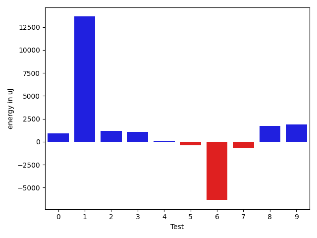

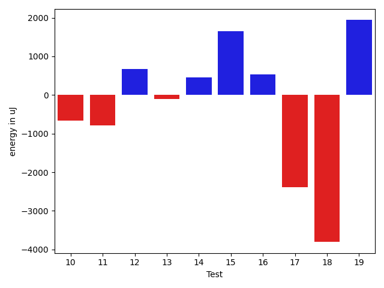

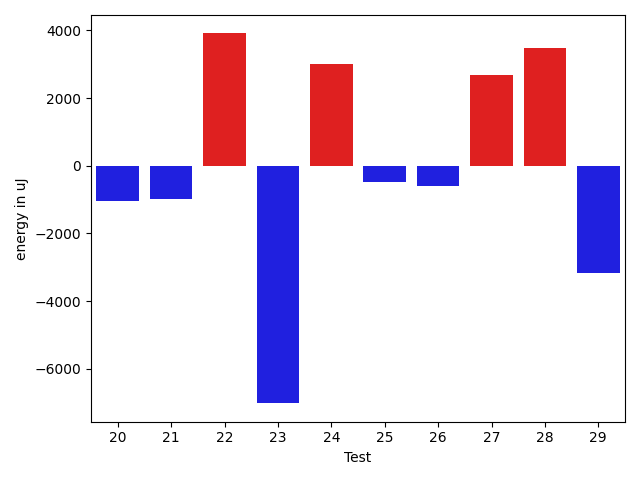

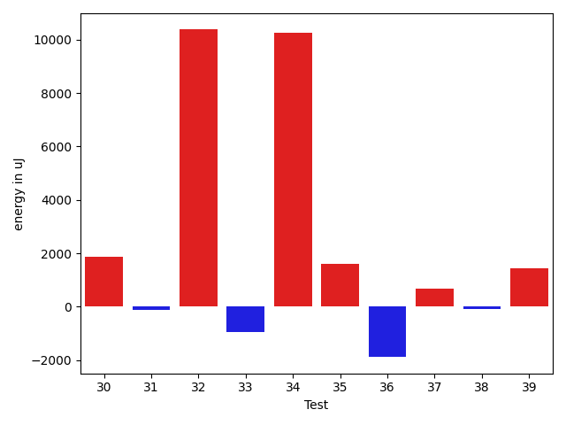

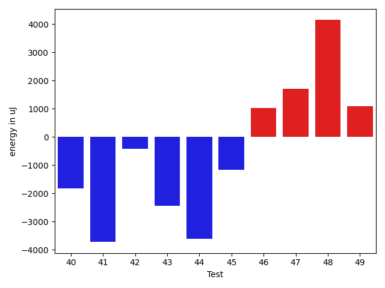

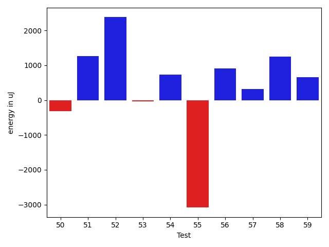

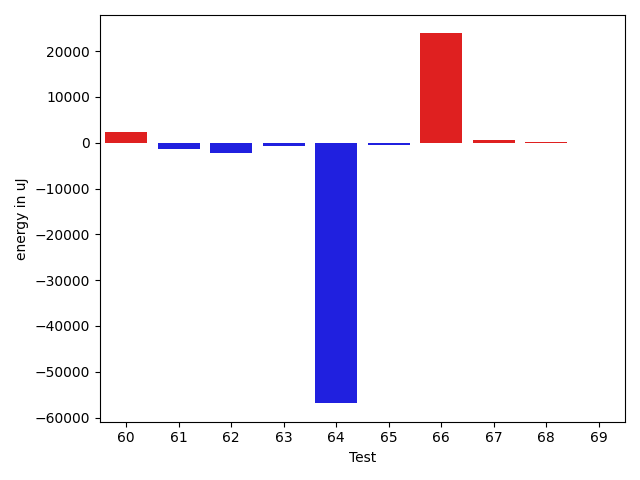

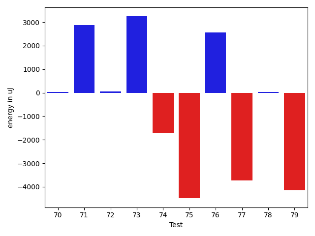

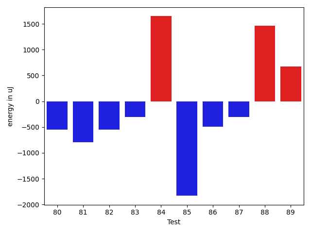

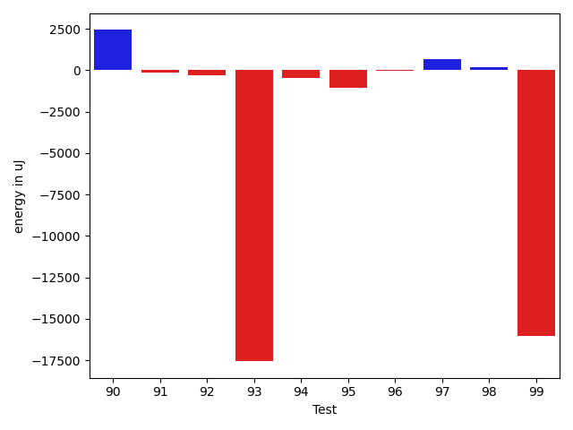

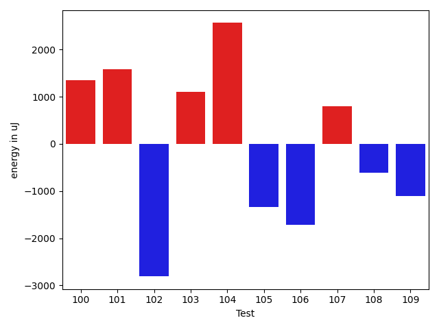

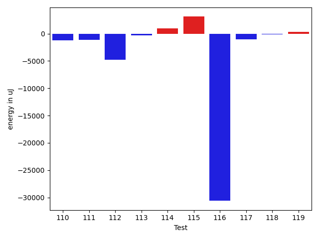

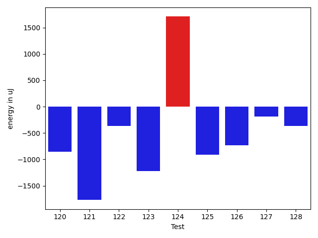

| ID | EnergyV1 | EnergyV2 | DeltaEnergy | σV1 | σV2 |
| --- | --- | --- | --- | --- | --- |
| 0 | 39049.52631578947 | 39941.2 | 891.6736842105238 | 4978.811540374935 | 4876.616425350676 |
| 1 | 38987.59090909091 | 52636.5 | 13648.909090909088 | 5062.385807098996 | 36757.84539455489 |
| 2 | 38391.0 | 39585.71428571428 | 1194.7142857142826 | 3990.698384994787 | 5412.250013079739 |
| 3 | 39069.333333333336 | 40137.46153846154 | 1068.1282051282033 | 4451.215077556539 | 4873.541274700874 |
| 4 | 40767.82352941176 | 40869.88888888889 | 102.06535947712837 | 4997.157924440582 | 5645.494967857005 |
| 5 | 41909.142857142855 | 41509.27272727273 | -399.87012987012713 | 5440.162587606352 | 4333.381024954766 |
| 6 | 67540.06451612903 | 61187.59375 | -6352.47076612903 | 51285.4138031817 | 38703.181315348105 |
| 7 | 40871.22727272727 | 40147.07692307692 | -724.1503496503501 | 3966.0492356066634 | 3126.0279899711136 |
| 8 | 39409.769230769234 | 41137.545454545456 | 1727.7762237762217 | 4068.466166351339 | 5226.557868906149 |
| 9 | 40963.84210526316 | 42850.92857142857 | 1887.0864661654123 | 5125.360580518449 | 4761.491054945554 |
| 10 | 42231.25 | 41564.71428571428 | -666.5357142857174 | 5697.624331318566 | 3569.2809485659604 |
| 11 | 39914.9375 | 39128.307692307695 | -786.6298076923049 | 4899.561733828215 | 4837.106006767895 |
| 12 | 39011.5 | 39683.72727272727 | 672.2272727272721 | 3069.3890135769147 | 3932.6944288966033 |
| 13 | 38801.92307692308 | 38693.40909090909 | -108.51398601398978 | 4285.844553007538 | 3071.0806457409462 |
| 14 | 38287.148148148146 | 38735.645161290326 | 448.49701314217964 | 4368.925816818928 | 3978.2915813634822 |
| 15 | 39993.94736842105 | 41647.294117647056 | 1653.3467492260024 | 4991.808653064424 | 3329.717471934605 |
| 16 | 38046.8 | 38574.12 | 527.3199999999997 | 4376.059560837809 | 5020.14057428674 |
| 17 | 39171.42857142857 | 36783.583333333336 | -2387.8452380952367 | 4604.266588320721 | 5643.495850066891 |
| 18 | 51000.47619047619 | 47194.97297297297 | -3805.5032175032175 | 24683.727478835794 | 15629.325363674334 |
| 19 | 38596.42105263158 | 40534.833333333336 | 1938.4122807017557 | 3813.2521182648707 | 4242.093112158456 |
| 20 | 37381.8 | 35692.11111111111 | -1689.6888888888934 | 4165.02807033358 | 3833.559310569529 |
| 21 | 39189.5 | 39116.23529411765 | -73.26470588234952 | 5299.555445192235 | 3916.792843632504 |
| 22 | 39384.5 | 40859.125 | 1474.625 | 5171.902908451051 | 5058.712149290074 |
| 23 | 40824.75 | 36597.166666666664 | -4227.583333333336 | 4262.462030622678 | 4147.786441116648 |
| 24 | 38911.380952380954 | 39577.944444444445 | 666.5634920634911 | 5502.4694583968 | 4300.752601738214 |
| 25 | 38434.294117647056 | 38976.117647058825 | 541.8235294117694 | 4329.688411078126 | 5366.149817933908 |
| 26 | 38376.380952380954 | 38503.769230769234 | 127.38827838828001 | 4780.445242026954 | 4096.640164702443 |
| 27 | 39270.5 | 40388.166666666664 | 1117.6666666666642 | 3443.274983738064 | 4048.990343969167 |
| 28 | 39294.4 | 41217.307692307695 | 1922.9076923076937 | 3768.3082110322844 | 4990.341168923075 |
| 29 | 41101.63636363636 | 38787.78571428572 | -2313.850649350643 | 5488.71439282009 | 4206.655036598411 |
| 30 | 37617.833333333336 | 39489.78571428572 | 1871.9523809523816 | 5840.84193179564 | 4818.707001713981 |
| 31 | 38874.166666666664 | 38741.10526315789 | -133.06140350877104 | 4125.75804819214 | 3454.759248139279 |
| 32 | 38736.833333333336 | 49110.25 | 10373.416666666664 | 3430.86607546517 | 38125.25220654284 |
| 33 | 38292.739130434784 | 37339.46153846154 | -953.2775919732449 | 3969.5163238095583 | 3790.757253664895 |
| 34 | 39520.416666666664 | 49769.78571428572 | 10249.369047619053 | 2689.810416439956 | 37560.435892759306 |
| 35 | 36639.0 | 38254.692307692305 | 1615.692307692305 | 4856.415393125699 | 4435.209931456985 |
| 36 | 39621.07692307692 | 37736.36363636364 | -1884.7132867132823 | 4109.120839182747 | 3901.79320715552 |
| 37 | 39363.142857142855 | 40034.71428571428 | 671.5714285714275 | 3127.19068031043 | 4267.11341756548 |
| 38 | 38030.13636363636 | 37959.9375 | -70.19886363636033 | 4668.535728153028 | 3758.2155085351014 |
| 39 | 38282.72222222222 | 39737.5625 | 1454.840277777781 | 3747.7588681704983 | 5698.171405906789 |
| 40 | 40039.1 | 38593.63157894737 | -1445.468421052632 | 5573.36031402959 | 5058.069178217549 |
| 41 | 39611.769230769234 | 37211.13333333333 | -2400.6358974359027 | 4802.893601439196 | 5482.848126860913 |
| 42 | 39838.5 | 38055.42857142857 | -1783.0714285714275 | 3231.139908320724 | 5405.317179992912 |
| 43 | 40069.333333333336 | 37678.92592592593 | -2390.4074074074088 | 3249.213862186086 | 3936.3295266861464 |
| 44 | 91153.23958333333 | 89598.64516129032 | -1554.5944220430101 | 54255.57692604528 | 61691.71681379299 |
| 45 | 47881.44776119403 | 46674.68 | -1206.7677611940308 | 12790.318727177735 | 15384.488629057512 |
| 46 | 40398.40740740741 | 42285.53846153846 | 1887.1310541310522 | 4568.30030195411 | 6876.789558590264 |
| 47 | 39651.12903225807 | 40388.833333333336 | 737.7043010752677 | 4432.337457616398 | 4719.574550623063 |
| 48 | 74282.67676767676 | 76684.63636363637 | 2401.9595959596045 | 25232.583969429466 | 19819.188362355202 |
| 49 | 40357.74074074074 | 39939.48148148148 | -418.2592592592555 | 4492.270889828379 | 4521.258751067174 |
| 50 | 79109.90909090909 | 78793.16161616161 | -316.7474747474771 | 20073.353031345527 | 18002.46201496181 |
| 51 | 39906.72222222222 | 41174.333333333336 | 1267.6111111111168 | 4355.135357069291 | 4005.76820209169 |
| 52 | 40696.833333333336 | 43078.45 | 2381.6166666666613 | 4043.8630355144323 | 2959.7895951401683 |
| 53 | 89682.0505050505 | 89641.95959595959 | -40.09090909091174 | 25420.516389772685 | 26413.242847014022 |
| 54 | 38062.78378378379 | 38799.40476190476 | 736.6209781209764 | 4382.353681651948 | 4700.294803619206 |
| 55 | 43298.24444444444 | 40213.58139534884 | -3084.6630490956013 | 22160.812016967207 | 4079.405766305369 |
| 56 | 38500.95 | 39409.42105263158 | 908.471052631583 | 4102.606153105608 | 5234.398194090093 |
| 57 | 39886.27777777778 | 40204.46666666667 | 318.18888888888614 | 6228.700486953345 | 4428.44436493599 |
| 58 | 38073.53333333333 | 39319.47368421053 | 1245.9403508771939 | 5032.72223045231 | 4094.214523580433 |
| 59 | 40491.17647058824 | 41156.6875 | 665.5110294117621 | 5458.046614972344 | 3929.5080277108164 |
| 60 | 39377.26315789474 | 41361.52380952381 | 1984.260651629069 | 3666.816442840405 | 4087.5606023647574 |
| 61 | 41486.357142857145 | 41943.26666666667 | 456.9095238095251 | 3610.722693928319 | 4412.188640069184 |
| 62 | 36682.0 | 34362.0 | -2320.0 | 0.0 | 0.0 |
| 63 | 35950.0 | 35339.0 | -611.0 | 0.0 | 0.0 |
| 64 | 95184.0 | 65186.0 | -29998.0 | 26886.0 | 0.0 |
| 65 | 40297.86486486487 | 39770.09375 | -527.7711148648668 | 4637.625237834915 | 5389.831411784689 |
| 66 | 65350.26315789474 | 85052.23076923077 | 19701.967611336026 | 34597.880143217335 | 70418.30543932981 |
| 67 | 41307.75409836065 | 43869.875 | 2562.1209016393477 | 9210.752618108436 | 13395.108766239078 |
| 68 | 40023.4358974359 | 39726.15625 | -297.27964743589837 | 4878.114462313213 | 5084.590286526136 |
| 69 | 39678.15151515151 | 38441.391304347824 | -1236.760210803688 | 5000.940269899628 | 4962.928174401904 |
| 70 | 40857.41176470588 | 40897.620689655174 | 40.20892494929285 | 4598.182928311415 | 4385.408583282811 |
| 71 | 40879.83870967742 | 43752.25806451613 | 2872.419354838712 | 6229.505857774751 | 10853.777484145241 |
| 72 | 41248.04761904762 | 41311.92857142857 | 63.88095238095411 | 4291.849867300429 | 5709.858598002553 |
| 73 | 40751.385714285716 | 43993.101265822785 | 3241.7155515370687 | 8726.184124793375 | 13315.00304700093 |
| 74 | 41094.354166666664 | 39375.17857142857 | -1719.1755952380918 | 7129.089813017225 | 4768.490147786909 |
| 75 | 57182.49397590361 | 52696.23170731707 | -4486.262268586543 | 39558.18850859186 | 34493.79434760827 |
| 76 | 42658.86075949367 | 45226.2375 | 2567.3767405063336 | 11425.465704974515 | 14272.174089153126 |
| 77 | 44106.45283018868 | 40375.28571428572 | -3731.1671159029647 | 23834.74785168569 | 4504.169687237436 |
| 78 | 41685.851851851854 | 41718.97727272727 | 33.12542087541806 | 3961.9179671028173 | 7073.454641663102 |
| 79 | 52170.51851851852 | 48023.18666666667 | -4147.33185185185 | 23222.297003128457 | 16535.729553257966 |
| 80 | 59912.19047619047 | 62734.5 | 2822.3095238095266 | 55171.43493214269 | 57731.88366215877 |
| 81 | 55575.05714285714 | 57148.529411764706 | 1573.4722689075643 | 51328.91843504031 | 66955.17492992006 |
| 82 | 44578.171428571426 | 41943.18 | -2634.991428571426 | 10500.29299043117 | 4070.3399351405515 |
| 83 | 41890.393939393936 | 41145.291666666664 | -745.1022727272721 | 4514.225125220872 | 4784.594718809932 |
| 84 | 39811.454545454544 | 40247.09090909091 | 435.6363636363676 | 5642.96635988936 | 4724.0081393692 |
| 85 | 40929.78125 | 41235.08 | 305.29875000000175 | 4379.7917811122525 | 4057.9664357409365 |
| 86 | 40950.625 | 40611.125 | -339.5 | 6010.4937076229435 | 4241.090173454816 |
| 87 | 41179.730769230766 | 41349.25 | 169.51923076923413 | 5049.379547244412 | 4768.573646804671 |
| 88 | 110809.76388888889 | 132152.33333333334 | 21342.569444444453 | 290901.01833849744 | 414489.4526368997 |
| 89 | 39001.35 | 39016.06060606061 | 14.71060606060928 | 4290.089209736787 | 4236.099305925233 |
| 90 | 38740.769230769234 | 41169.57142857143 | 2428.8021978021934 | 3912.2128039855706 | 5411.442564219852 |
| 91 | 40047.666666666664 | 39916.91428571429 | -130.75238095237728 | 4000.486617225856 | 4528.037685175262 |
| 92 | 44858.637931034486 | 44545.20754716981 | -313.4303838646738 | 19643.44712769531 | 12594.971971263936 |
| 93 | 77761.52380952382 | 60196.80487804878 | -17564.718931475036 | 111683.9207419629 | 71054.07319445456 |
| 94 | 39775.029411764706 | 39326.142857142855 | -448.88655462185125 | 4655.083593646932 | 5796.196220147226 |
| 95 | 41539.794871794875 | 40472.916666666664 | -1066.8782051282105 | 10618.751636463525 | 5403.839249269397 |
| 96 | 39912.02 | 39897.94827586207 | -14.07172413792432 | 3587.8575472836155 | 4475.975784280177 |
| 97 | 38232.28571428572 | 38901.92592592593 | 669.6402116402096 | 5239.26122148331 | 4911.813204660372 |
| 98 | 38827.55 | 39001.47368421053 | 173.9236842105238 | 4584.825956075105 | 4183.521991015164 |
| 99 | 55857.92857142857 | 39825.3 | -16032.62857142857 | 85429.33406118622 | 4709.827726148803 |
| 100 | 40330.4693877551 | 40312.34 | -18.129387755107018 | 6890.949962952861 | 5174.618983500138 |
| 101 | 39098.10344827586 | 51602.12903225807 | 12504.025583982206 | 4965.896448882376 | 63486.92308770871 |
| 102 | 40608.032258064515 | 39101.36363636364 | -1506.6686217008755 | 4283.46569424784 | 5957.313897031832 |
| 103 | 39468.59375 | 40119.36363636364 | 650.7698863636397 | 2984.0201894777683 | 4567.827179359555 |
| 104 | 40514.07142857143 | 44197.72727272727 | 3683.6558441558445 | 6852.616508948059 | 6175.5209326222985 |
| 105 | 41286.47457627119 | 39557.53703703704 | -1728.9375392341535 | 6977.869502342854 | 4874.3521875863935 |
| 106 | 42188.12280701754 | 41651.92592592593 | -536.1968810916151 | 5360.704320281043 | 6801.016868010069 |
| 107 | 39911.0 | 40244.065573770495 | 333.06557377049467 | 4693.627217998726 | 4743.6326637039565 |
| 108 | 42902.89743589744 | 43342.743589743586 | 439.8461538461488 | 7045.814607031615 | 9312.331052242584 |
| 109 | 41958.818181818184 | 40834.25 | -1124.5681818181838 | 4173.603796332413 | 5743.856331986377 |
| 110 | 40592.0 | 39402.88461538462 | -1189.115384615383 | 4385.780532014797 | 6261.686098358708 |
| 111 | 70687.66666666667 | 69595.95959595959 | -1091.7070707070816 | 26488.654802623056 | 24070.024278048455 |
| 112 | 48632.891304347824 | 43832.92 | -4799.971304347826 | 17077.810037065596 | 8397.915576713069 |
| 113 | 41699.22222222222 | 41354.17647058824 | -345.0457516339811 | 8109.405644902728 | 6911.505714630346 |
| 114 | 41338.84375 | 42261.25 | 922.40625 | 6493.4253509288865 | 10928.523436811058 |
| 115 | 68148.41509433962 | 71254.47272727273 | 3106.057632933109 | 47735.62364098467 | 55115.514298229566 |
| 116 | 229213.51515151514 | 198603.0404040404 | -30610.474747474742 | 72419.32780176762 | 46648.38378893292 |
| 117 | 41394.41176470588 | 40307.4 | -1087.0117647058796 | 4801.851782003707 | 4298.227724694601 |
| 118 | 39876.71428571428 | 39712.12903225807 | -164.58525345621456 | 5630.420032905075 | 4721.198773015008 |
| 119 | 44576.5 | 44943.48684210526 | 366.9868421052597 | 9017.798061532063 | 12767.933145284655 |
| 120 | 41009.63636363636 | 41202.5625 | 192.92613636363967 | 3716.943888165194 | 4065.1079931649724 |
| 121 | 72060.09090909091 | 49822.0 | -22238.09090909091 | 73513.20470680397 | 29313.84481532818 |
| 122 | 52673.31578947369 | 40649.375 | -12023.940789473687 | 50212.611153450736 | 3760.1968511468917 |
| 123 | 41466.63043478261 | 42885.61111111111 | 1418.9806763285014 | 8674.259688643766 | 11592.715730812693 |
| 124 | 41379.65517241379 | 44077.27272727273 | 2697.617554858938 | 6531.71427979042 | 10091.62667391238 |
| 125 | 40339.5 | 39147.217391304344 | -1192.2826086956557 | 5145.0645151819635 | 4019.153587689412 |
| 126 | 70951.82608695653 | 60590.47619047619 | -10361.349896480337 | 76117.89593190413 | 61605.03635458251 |
| 127 | 41243.192307692305 | 49520.61538461538 | 8277.423076923078 | 4215.756880846234 | 47169.42807588319 |
| 128 | 40588.26666666667 | 41399.58536585366 | 811.3186991869879 | 4753.380034366189 | 9523.012274448565 |

## Delta Duration per test method

| ID | DurationV1 | DurationsV2 | DeltaDuration |
| --- | --- | --- | --- |
| 0 | 453915.4736842105 | 519838.4 | 65922.92631578952 |
| 1 | 410163.04545454547 | 819314.7 | 409151.6545454545 |
| 2 | 442783.26666666666 | 669936.0 | 227152.73333333334 |
| 3 | 396789.1666666667 | 321224.76923076925 | -75564.39743589744 |
| 4 | 437815.29411764705 | 422821.6666666667 | -14993.627450980362 |
| 5 | 436924.0 | 449948.0 | 13024.0 |
| 6 | 1477417.322580645 | 1333123.78125 | -144293.5413306451 |
| 7 | 451687.1818181818 | 380328.07692307694 | -71359.10489510489 |
| 8 | 388728.76923076925 | 402498.0 | 13769.230769230751 |
| 9 | 582089.0 | 457015.71428571426 | -125073.28571428574 |
| 10 | 528895.0 | 411282.85714285716 | -117612.14285714284 |
| 11 | 476801.71875 | 373052.07692307694 | -103749.64182692306 |
| 12 | 428085.3333333333 | 355363.36363636365 | -72721.96969696967 |
| 13 | 539421.9230769231 | 439688.7272727273 | -99733.19580419583 |
| 14 | 518524.6296296296 | 506654.67741935485 | -11869.952210274758 |
| 15 | 542974.2631578947 | 448029.5882352941 | -94944.67492260062 |
| 16 | 535390.32 | 483060.0 | -52330.31999999995 |
| 17 | 346411.14285714284 | 350908.25 | 4497.1071428571595 |
| 18 | 1219537.738095238 | 999144.2432432432 | -220393.4948519949 |
| 19 | 453492.5789473684 | 400666.4166666667 | -52826.16228070174 |
| 20 | 361555.6 | 358457.77777777775 | -3097.822222222225 |
| 21 | 395753.8333333333 | 338292.64705882355 | -57461.18627450976 |
| 22 | 521558.8333333333 | 502079.5625 | -19479.270833333314 |
| 23 | 431915.125 | 385020.3888888889 | -46894.736111111124 |
| 24 | 476044.95238095237 | 430480.72222222225 | -45564.23015873012 |
| 25 | 426682.23529411765 | 381979.82352941175 | -44702.4117647059 |
| 26 | 478234.4285714286 | 447464.73076923075 | -30769.69780219783 |
| 27 | 416673.2272727273 | 325058.8888888889 | -91614.33838383842 |
| 28 | 440403.2 | 377719.3846153846 | -62683.81538461539 |
| 29 | 456166.1818181818 | 417485.28571428574 | -38680.896103896084 |
| 30 | 493715.75 | 444625.4285714286 | -49090.32142857142 |
| 31 | 471548.5416666667 | 432678.5789473684 | -38869.96271929826 |
| 32 | 439952.5 | 675501.375 | 235548.875 |
| 33 | 430366.5652173913 | 402019.07692307694 | -28347.48829431436 |
| 34 | 333134.0833333333 | 834883.5714285715 | 501749.48809523816 |
| 35 | 390827.4705882353 | 345846.07692307694 | -44981.393665158364 |
| 36 | 390558.3846153846 | 330785.1818181818 | -59773.2027972028 |
| 37 | 433412.4285714286 | 386819.4285714286 | -46593.0 |
| 38 | 526970.4545454546 | 391860.375 | -135110.0795454546 |
| 39 | 472542.6666666667 | 402655.5625 | -69887.10416666669 |
| 40 | 509758.6 | 393289.7368421053 | -116468.8631578947 |
| 41 | 643306.1923076923 | 578099.6 | -65206.59230769228 |
| 42 | 464762.21428571426 | 398521.9285714286 | -66240.28571428568 |
| 43 | 407301.25 | 357148.6296296296 | -50152.620370370394 |
| 44 | 2472411.8854166665 | 2353602.6774193547 | -118809.20799731184 |
| 45 | 1171222.7611940298 | 999193.8 | -172028.96119402978 |
| 46 | 716986.5185185185 | 686191.9230769231 | -30794.59544159542 |
| 47 | 573171.7419354839 | 496270.13333333336 | -76901.60860215052 |
| 48 | 2149620.1818181816 | 2087565.878787879 | -62054.30303030275 |
| 49 | 639235.3333333334 | 560813.5185185185 | -78421.81481481483 |
| 50 | 2219940.1616161615 | 2205479.6868686867 | -14460.474747474771 |
| 51 | 540420.6666666666 | 422480.13333333336 | -117940.53333333327 |
| 52 | 469388.94444444444 | 517522.55 | 48133.60555555555 |
| 53 | 2508762.1515151514 | 2585415.505050505 | 76653.35353535367 |
| 54 | 673316.4594594594 | 618582.0238095238 | -54734.43564993562 |
| 55 | 787174.8888888889 | 604097.7674418605 | -183077.12144702836 |
| 56 | 398046.25 | 335530.05263157893 | -62516.19736842107 |
| 57 | 876084.6111111111 | 706337.0 | -169747.61111111112 |
| 58 | 379825.93333333335 | 371688.84210526315 | -8137.091228070203 |
| 59 | 485537.70588235295 | 446821.1875 | -38716.51838235295 |
| 60 | 532259.5263157894 | 494165.04761904763 | -38094.478696741804 |
| 61 | 464428.0714285714 | 431245.0 | -33183.07142857142 |
| 62 | 1573299.0 | 1297285.0 | -276014.0 |
| 63 | 967914.0 | 686662.0 | -281252.0 |
| 64 | 3164247.0 | 2562813.0 | -601434.0 |
| 65 | 640260.1081081082 | 700288.21875 | 60028.110641891835 |
| 66 | 1650706.8771929825 | 2285895.730769231 | 635188.8535762485 |
| 67 | 1034316.4590163934 | 1100344.375 | 66027.9159836066 |
| 68 | 552674.4102564103 | 634893.40625 | 82218.99599358975 |
| 69 | 657931.1818181818 | 744210.8260869565 | 86279.64426877478 |
| 70 | 645081.6470588235 | 624973.7931034482 | -20107.853955375263 |
| 71 | 708579.9677419355 | 733583.5483870967 | 25003.580645161215 |
| 72 | 526999.5714285715 | 549599.7142857143 | 22600.14285714284 |
| 73 | 1092012.3142857142 | 1144162.3544303798 | 52150.04014466563 |
| 74 | 816211.3333333334 | 801459.6428571428 | -14751.690476190532 |
| 75 | 1611048.843373494 | 1500087.0975609757 | -110961.74581251829 |
| 76 | 1196065.17721519 | 1197030.25 | 965.0727848100942 |
| 77 | 931476.1509433963 | 808169.7551020408 | -123306.39584135544 |
| 78 | 818628.6111111111 | 806560.3863636364 | -12068.224747474771 |
| 79 | 1370143.4814814816 | 1243801.4933333334 | -126341.98814814817 |
| 80 | 1432002.5555555555 | 1434607.3448275863 | 2604.7892720308155 |
| 81 | 1252129.5714285714 | 1258225.9117647058 | 6096.340336134424 |
| 82 | 989002.4714285714 | 866239.42 | -122763.05142857134 |
| 83 | 581373.4545454546 | 471167.2916666667 | -110206.1628787879 |
| 84 | 666091.6060606061 | 560134.9545454546 | -105956.65151515149 |
| 85 | 544570.46875 | 470825.36 | -73745.10875000001 |
| 86 | 494928.0625 | 391023.25 | -103904.8125 |
| 87 | 463239.1923076923 | 481620.53125 | 18381.338942307688 |
| 88 | 2817044.402777778 | 3688310.3913043477 | 871265.9885265697 |
| 89 | 891782.5 | 667480.1818181818 | -224302.31818181823 |
| 90 | 512334.8076923077 | 513582.3333333333 | 1247.525641025626 |
| 91 | 807559.3571428572 | 797676.2 | -9883.157142857206 |
| 92 | 952653.0344827586 | 987914.0943396227 | 35261.05985686404 |
| 93 | 2060987.238095238 | 1425909.1463414633 | -635078.0917537748 |
| 94 | 658472.7647058824 | 581106.7142857143 | -77366.05042016809 |
| 95 | 822882.4871794871 | 711233.1944444445 | -111649.29273504263 |
| 96 | 843448.98 | 800560.7931034482 | -42888.18689655175 |
| 97 | 590052.7428571428 | 595881.1111111111 | 5828.368253968307 |
| 98 | 486629.0 | 464884.5789473684 | -21744.421052631573 |
| 99 | 1209640.642857143 | 529640.9 | -679999.7428571429 |
| 100 | 889154.3469387755 | 728496.32 | -160658.02693877555 |
| 101 | 637406.2068965518 | 914554.2580645161 | 277148.05116796435 |
| 102 | 749217.9677419355 | 623236.6363636364 | -125981.33137829916 |
| 103 | 571611.09375 | 511007.0909090909 | -60604.00284090912 |
| 104 | 871575.2380952381 | 779349.3181818182 | -92225.91991341987 |
| 105 | 968629.406779661 | 1034865.5370370371 | 66236.13025737612 |
| 106 | 989493.8947368421 | 1010234.8148148148 | 20740.920077972696 |
| 107 | 839881.9615384615 | 851064.4098360656 | 11182.448297604104 |
| 108 | 868726.1538461539 | 964306.7692307692 | 95580.61538461538 |
| 109 | 732516.9090909091 | 727457.09375 | -5059.815340909059 |
| 110 | 691129.3541666666 | 822182.8461538461 | 131053.4919871795 |
| 111 | 2027134.4646464647 | 1892044.7373737374 | -135089.7272727273 |
| 112 | 1128926.1739130435 | 872427.54 | -256498.63391304342 |
| 113 | 946629.9629629629 | 893958.5098039216 | -52671.45315904135 |
| 114 | 923122.703125 | 915674.0178571428 | -7448.6852678571595 |
| 115 | 1721776.8490566039 | 1762047.690909091 | 40270.841852487065 |
| 116 | 6059282.04040404 | 5099159.767676768 | -960122.2727272725 |
| 117 | 636298.4705882353 | 550301.9 | -85996.57058823528 |
| 118 | 628969.2857142857 | 591255.6129032258 | -37713.67281105986 |
| 119 | 1141037.0714285714 | 1057431.5 | -83605.57142857136 |
| 120 | 478159.04545454547 | 396727.875 | -81431.17045454547 |
| 121 | 1603362.1363636365 | 801722.8571428572 | -801639.2792207793 |
| 122 | 819748.4210526316 | 369520.75 | -450227.6710526316 |
| 123 | 888494.6739130435 | 771623.75 | -116870.92391304346 |
| 124 | 971882.5344827586 | 980463.4545454546 | 8580.92006269598 |
| 125 | 579806.8846153846 | 534587.6086956522 | -45219.275919732405 |
| 126 | 1642387.652173913 | 1301332.142857143 | -341055.5093167701 |
| 127 | 728518.9615384615 | 901301.0384615385 | 172782.076923077 |
| 128 | 832964.8666666667 | 938654.1707317074 | 105689.30406504066 |

## Misc.

| ID | Test Class | Test Method |
| --- | --- | --- |
| 0 | com.google.gson.functional.StringTest | testEscapingQuotesInStringSerialization |
| 1 | com.google.gson.functional.StringTest | testEscapingQuotesInStringDeserialization |
| 2 | com.google.gson.functional.StringTest | testAssignmentCharDeserialization |
| 3 | com.google.gson.functional.StringTest | testJavascriptKeywordsInStringDeserialization |
| 4 | com.google.gson.functional.StringTest | testSingleQuoteInStringDeserialization |
| 5 | com.google.gson.functional.StringTest | testEscapedCtrlRInStringDeserialization |
| 6 | com.google.gson.functional.StringTest | testSingleQuoteInStringSerialization |
| 7 | com.google.gson.functional.StringTest | testStringWithEscapedSlashDeserialization |
| 8 | com.google.gson.functional.StringTest | testEscapedBackslashInStringDeserialization |
| 9 | com.google.gson.functional.StringTest | testStringValueDeserialization |
| 10 | com.google.gson.functional.StringTest | testEscapedCtrlNInStringDeserialization |
| 11 | com.google.gson.functional.PrimitiveTest | testDoubleNoFractAsStringRepresentationDeserialization |
| 12 | com.google.gson.functional.PrimitiveTest | testBigDecimalPreservePrecisionDeserialization |
| 13 | com.google.gson.functional.PrimitiveTest | testBigIntegerDeserialization |
| 14 | com.google.gson.functional.PrimitiveTest | testDeserializingBigIntegerAsBigDecimal |
| 15 | com.google.gson.functional.PrimitiveTest | testReallyLongValuesDeserialization |
| 16 | com.google.gson.functional.PrimitiveTest | testPrimitiveDoubleAutoboxedDeserialization |
| 17 | com.google.gson.functional.PrimitiveTest | testDeserializingBigDecimalAsDouble |
| 18 | com.google.gson.functional.PrimitiveTest | testNumberDeserialization |
| 19 | com.google.gson.functional.PrimitiveTest | testDoubleNaNDeserialization |
| 20 | com.google.gson.functional.PrimitiveTest | testDeserializeJsonArrayAsByteWrapper |
| 21 | com.google.gson.functional.PrimitiveTest | testDeserializeJsonObjectAsNumber |
| 22 | com.google.gson.functional.PrimitiveTest | testPrimitiveLongAutoboxedDeserialization |
| 23 | com.google.gson.functional.PrimitiveTest | testDeserializeJsonObjectAsBytePrimitive |
| 24 | com.google.gson.functional.PrimitiveTest | testDoubleAsStringRepresentationDeserialization |
| 25 | com.google.gson.functional.PrimitiveTest | testDoubleInfinityDeserialization |
| 26 | com.google.gson.functional.PrimitiveTest | testPrimitiveClassLiteral |
| 27 | com.google.gson.functional.PrimitiveTest | testNegativeInfinityFloatDeserialization |
| 28 | com.google.gson.functional.PrimitiveTest | testFloatInfinityDeserialization |
| 29 | com.google.gson.functional.PrimitiveTest | testLargeDoubleDeserialization |
| 30 | com.google.gson.functional.PrimitiveTest | testBigDecimalAsStringRepresentationDeserialization |
| 31 | com.google.gson.functional.PrimitiveTest | testDeserializeJsonObjectAsShortPrimitive |
| 32 | com.google.gson.functional.PrimitiveTest | testNegativeInfinityDeserialization |
| 33 | com.google.gson.functional.PrimitiveTest | testDeserializeJsonArrayAsShortWrapper |
| 34 | com.google.gson.functional.PrimitiveTest | testQuotedStringSerializationAndDeserialization |
| 35 | com.google.gson.functional.PrimitiveTest | testBigDecimalNoFractAsStringRepresentationDeserialization |
| 36 | com.google.gson.functional.PrimitiveTest | testDeserializingBigDecimalAsFloat |
| 37 | com.google.gson.functional.PrimitiveTest | testSmallValueForBigIntegerDeserialization |
| 38 | com.google.gson.functional.PrimitiveTest | testLongAsStringDeserialization |
| 39 | com.google.gson.functional.PrimitiveTest | testBigDecimalDeserialization |
| 40 | com.google.gson.functional.PrimitiveTest | testSmallValueForBigDecimalDeserialization |
| 41 | com.google.gson.functional.PrimitiveTest | testPrimitiveIntegerAutoboxedDeserialization |
| 42 | com.google.gson.functional.PrimitiveTest | testFloatNaNDeserialization |
| 43 | com.google.gson.functional.PrimitiveTest | testDeserializeJsonArrayAsNumber |
| 44 | com.google.gson.functional.InheritanceTest | testSubInterfacesOfCollectionSerialization |
| 45 | com.google.gson.functional.InheritanceTest | testSubClassDeserialization |
| 46 | com.google.gson.functional.DefaultTypeAdaptersTest | testUrlDeserialization |
| 47 | com.google.gson.functional.DefaultTypeAdaptersTest | testDefaultGregorianCalendarDeserialization |
| 48 | com.google.gson.functional.DefaultTypeAdaptersTest | testSqlDateSerialization |
| 49 | com.google.gson.functional.DefaultTypeAdaptersTest | testBigIntegerFieldDeserialization |
| 50 | com.google.gson.functional.DefaultTypeAdaptersTest | testTimestampSerialization |
| 51 | com.google.gson.functional.DefaultTypeAdaptersTest | testUriDeserialization |
| 52 | com.google.gson.functional.DefaultTypeAdaptersTest | testLocaleDeserializationWithLanguage |
| 53 | com.google.gson.functional.DefaultTypeAdaptersTest | testDateDeserializationWithPattern |
| 54 | com.google.gson.functional.DefaultTypeAdaptersTest | testBigDecimalFieldDeserialization |
| 55 | com.google.gson.functional.DefaultTypeAdaptersTest | testDefaultCalendarDeserialization |
| 56 | com.google.gson.functional.DefaultTypeAdaptersTest | testStringBuilderDeserialization |
| 57 | com.google.gson.functional.DefaultTypeAdaptersTest | testBitSetDeserialization |
| 58 | com.google.gson.functional.DefaultTypeAdaptersTest | testStringBufferDeserialization |
| 59 | com.google.gson.functional.DefaultTypeAdaptersTest | testLocaleDeserializationWithLanguageCountry |
| 60 | com.google.gson.functional.DefaultTypeAdaptersTest | testUuidDeserialization |
| 61 | com.google.gson.functional.DefaultTypeAdaptersTest | testLocaleDeserializationWithLanguageCountryVariant |
| 62 | com.google.gson.functional.DefaultTypeAdaptersTest | testDefaultJavaSqlTimestampDeserialization |
| 63 | com.google.gson.functional.DefaultTypeAdaptersTest | testDefaultJavaSqlTimeDeserialization |
| 64 | com.google.gson.functional.DefaultTypeAdaptersTest | testDefaultDateDeserialization |
| 65 | com.google.gson.functional.NamingPolicyTest | testGsonWithLowerCaseDashPolicyDeserialiation |
| 66 | com.google.gson.functional.NamingPolicyTest | testGsonWithNonDefaultFieldNamingPolicyDeserialiation |
| 67 | com.google.gson.functional.NamingPolicyTest | testComplexFieldNameStrategy |
| 68 | com.google.gson.functional.NamingPolicyTest | testGsonWithUpperCamelCaseSpacesPolicyDeserialiation |
| 69 | com.google.gson.functional.NamingPolicyTest | testGsonWithSerializedNameFieldNamingPolicyDeserialization |
| 70 | com.google.gson.functional.NamingPolicyTest | testGsonWithLowerCaseUnderscorePolicyDeserialiation |
| 71 | com.google.gson.functional.EnumTest | testTopLevelEnumDeserialization |
| 72 | com.google.gson.functional.EnumTest | testTopLevelEnumInASingleElementArrayDeserialization |
| 73 | com.google.gson.functional.ParameterizedTypesTest | testParameterizedTypeWithReaderDeserialization |
| 74 | com.google.gson.functional.ParameterizedTypesTest | testDeepParameterizedTypeDeserialization |
| 75 | com.google.gson.functional.ParameterizedTypesTest | testParameterizedTypeDeserialization |
| 76 | com.google.gson.functional.ParameterizedTypesTest | testParameterizedTypesWithCustomDeserializer |
| 77 | com.google.gson.functional.JsonParserTest | testExtraCommasInMaps |
| 78 | com.google.gson.functional.EscapingTest | testGsonDoubleDeserialization |
| 79 | com.google.gson.functional.EscapingTest | testGsonAcceptsEscapedAndNonEscapedJsonDeserialization |
| 80 | com.google.gson.functional.EscapingTest | testEscapingObjectFields |
| 81 | com.google.gson.functional.EscapingTest | testEscapingQuotesInStringArray |
| 82 | com.google.gson.functional.ArrayTest | testTopLevelArrayOfIntsDeserialization |
| 83 | com.google.gson.functional.ArrayTest | testEmptyArrayDeserialization |
| 84 | com.google.gson.functional.ArrayTest | testSingleNullInArrayDeserialization |
| 85 | com.google.gson.functional.ArrayTest | testMultidimenstionalArraysDeserialization |
| 86 | com.google.gson.functional.ArrayTest | testArrayOfStringsDeserialization |
| 87 | com.google.gson.functional.ArrayTest | testInvalidArrayDeserialization |
| 88 | com.google.gson.functional.InstanceCreatorTest | testInstanceCreatorReturnsBaseType |
| 89 | com.google.gson.functional.ObjectTest | testPrimitiveArrayInAnObjectDeserialization |
| 90 | com.google.gson.functional.ObjectTest | testNullArraysDeserialization |
| 91 | com.google.gson.functional.ObjectTest | testArrayOfObjectsDeserialization |
| 92 | com.google.gson.functional.ObjectTest | testTruncatedDeserialization |
| 93 | com.google.gson.functional.ObjectTest | testJsonInSingleQuotesDeserialization |
| 94 | com.google.gson.functional.ObjectTest | testBagOfPrimitiveWrappersDeserialization |
| 95 | com.google.gson.functional.ObjectTest | testNullFieldsDeserialization |
| 96 | com.google.gson.functional.ObjectTest | testInnerClassDeserialization |
| 97 | com.google.gson.functional.ObjectTest | testClassWithTransientFieldsDeserialization |
| 98 | com.google.gson.functional.ObjectTest | testClassWithNoFieldsDeserialization |
| 99 | com.google.gson.functional.ObjectTest | testClassWithTransientFieldsDeserializationTransientFieldsPassedInJsonAreIgnored |
| 100 | com.google.gson.functional.ObjectTest | testNestedDeserialization |
| 101 | com.google.gson.functional.ObjectTest | testJsonInMixedQuotesDeserialization |
| 102 | com.google.gson.functional.ObjectTest | testBagOfPrimitivesDeserialization |
| 103 | com.google.gson.functional.ObjectTest | testObjectFieldNamesWithoutQuotesDeserialization |
| 104 | com.google.gson.functional.ReadersWritersTest | testReaderForDeserialization |
| 105 | com.google.gson.functional.CustomTypeAdaptersTest | testCustomNestedDeserializers |
| 106 | com.google.gson.functional.CustomTypeAdaptersTest | testCustomDeserializers |
| 107 | com.google.gson.functional.CustomTypeAdaptersTest | testCustomByteArrayDeserializerAndInstanceCreator |
| 108 | com.google.gson.functional.SecurityTest | testNonExecutableJsonDeserialization |
| 109 | com.google.gson.functional.SecurityTest | testJsonWithNonExectuableTokenWithConfiguredGsonDeserialization |
| 110 | com.google.gson.functional.SecurityTest | testJsonWithNonExectuableTokenWithRegularGsonDeserialization |
| 111 | com.google.gson.functional.UncategorizedTest | testReturningDerivedClassesDuringDeserialization |
| 112 | com.google.gson.functional.UncategorizedTest | testGsonInstanceReusableForSerializationAndDeserialization |
| 113 | com.google.gson.functional.CustomDeserializerTest | testCustomDeserializerReturnsNullForArrayElements |
| 114 | com.google.gson.functional.CustomDeserializerTest | testCustomDeserializerReturnsNull |
| 115 | com.google.gson.functional.CustomDeserializerTest | testCustomDeserializerReturnsNullForTopLevelObject |
| 116 | com.google.gson.DefaultInetAddressTypeAdapterTest | testInetAddressSerializationAndDeserialization |
| 117 | com.google.gson.functional.CollectionTest | testRawCollectionOfBagOfPrimitivesNotAllowed |
| 118 | com.google.gson.functional.CollectionTest | testRawCollectionDeserializationNotAlllowed |
| 119 | com.google.gson.functional.TypeVariableTest | testBasicTypeVariables |
| 120 | com.google.gson.functional.InternationalizationTest | testStringsWithUnicodeChineseCharactersEscapedDeserialization |
| 121 | com.google.gson.functional.InternationalizationTest | testStringsWithRawChineseCharactersDeserialization |
| 122 | com.google.gson.functional.InternationalizationTest | testStringsWithUnicodeChineseCharactersDeserialization |
| 123 | com.google.gson.functional.VersioningTest | testVersionedGsonWithUnversionedClassesDeserialization |
| 124 | com.google.gson.functional.TypeHierarchyAdapterTest | testRegisterSuperTypeFirst |
| 125 | com.google.gson.GsonTypeAdapterTest | testTypeAdapterProperlyConvertsTypes |
| 126 | com.google.gson.GsonTypeAdapterTest | testTypeAdapterDoesNotAffectNonAdaptedTypes |
| 127 | com.google.gson.GsonTypeAdapterTest | testTypeAdapterThrowsException |
| 128 | com.google.gson.functional.ExposeFieldsTest | testExposeAnnotationDeserialization |

| Test | IterationV1 | IterationV2 | DeltaIteration |
| --- | --- | --- | --- |
| 0 | 19 | 15 | -4 |
| 1 | 22 | 10 | -12 |
| 2 | 15 | 7 | -8 |
| 3 | 18 | 13 | -5 |
| 4 | 17 | 18 | 1 |
| 5 | 14 | 11 | -3 |
| 6 | 31 | 32 | 1 |
| 7 | 22 | 13 | -9 |
| 8 | 13 | 11 | -2 |
| 9 | 19 | 14 | -5 |
| 10 | 12 | 14 | 2 |
| 11 | 32 | 13 | -19 |
| 12 | 6 | 11 | 5 |
| 13 | 26 | 22 | -4 |
| 14 | 27 | 31 | 4 |
| 15 | 19 | 17 | -2 |
| 16 | 25 | 25 | 0 |
| 17 | 14 | 12 | -2 |
| 18 | 42 | 37 | -5 |
| 19 | 19 | 24 | 5 |
| 20 | 15 | 9 | -6 |
| 21 | 12 | 17 | 5 |
| 22 | 18 | 16 | -2 |
| 23 | 16 | 18 | 2 |
| 24 | 21 | 18 | -3 |
| 25 | 17 | 17 | 0 |
| 26 | 21 | 26 | 5 |
| 27 | 22 | 18 | -4 |
| 28 | 15 | 13 | -2 |
| 29 | 22 | 14 | -8 |
| 30 | 12 | 14 | 2 |
| 31 | 24 | 19 | -5 |
| 32 | 18 | 16 | -2 |
| 33 | 23 | 13 | -10 |
| 34 | 12 | 14 | 2 |
| 35 | 17 | 13 | -4 |
| 36 | 13 | 11 | -2 |
| 37 | 14 | 14 | 0 |
| 38 | 22 | 16 | -6 |
| 39 | 18 | 16 | -2 |
| 40 | 20 | 19 | -1 |
| 41 | 26 | 15 | -11 |
| 42 | 14 | 14 | 0 |
| 43 | 12 | 27 | 15 |
| 44 | 96 | 93 | -3 |
| 45 | 67 | 50 | -17 |
| 46 | 27 | 26 | -1 |
| 47 | 31 | 30 | -1 |
| 48 | 99 | 99 | 0 |
| 49 | 27 | 27 | 0 |
| 50 | 99 | 99 | 0 |
| 51 | 18 | 15 | -3 |
| 52 | 18 | 20 | 2 |
| 53 | 99 | 99 | 0 |
| 54 | 37 | 42 | 5 |
| 55 | 45 | 43 | -2 |
| 56 | 20 | 19 | -1 |
| 57 | 54 | 45 | -9 |
| 58 | 15 | 19 | 4 |
| 59 | 17 | 16 | -1 |
| 60 | 19 | 21 | 2 |
| 61 | 14 | 15 | 1 |
| 62 | 1 | 1 | 0 |
| 63 | 1 | 1 | 0 |
| 64 | 2 | 1 | -1 |
| 65 | 37 | 32 | -5 |
| 66 | 57 | 52 | -5 |
| 67 | 61 | 64 | 3 |
| 68 | 39 | 32 | -7 |
| 69 | 33 | 23 | -10 |
| 70 | 34 | 29 | -5 |
| 71 | 31 | 31 | 0 |
| 72 | 21 | 14 | -7 |
| 73 | 70 | 79 | 9 |
| 74 | 48 | 56 | 8 |
| 75 | 83 | 82 | -1 |
| 76 | 79 | 80 | 1 |
| 77 | 53 | 49 | -4 |
| 78 | 54 | 44 | -10 |
| 79 | 81 | 75 | -6 |
| 80 | 63 | 58 | -5 |
| 81 | 35 | 34 | -1 |
| 82 | 70 | 50 | -20 |
| 83 | 33 | 24 | -9 |
| 84 | 33 | 22 | -11 |
| 85 | 32 | 25 | -7 |
| 86 | 16 | 16 | 0 |
| 87 | 26 | 32 | 6 |
| 88 | 72 | 69 | -3 |
| 89 | 40 | 33 | -7 |
| 90 | 26 | 21 | -5 |
| 91 | 42 | 35 | -7 |
| 92 | 58 | 53 | -5 |
| 93 | 42 | 41 | -1 |
| 94 | 34 | 28 | -6 |
| 95 | 39 | 36 | -3 |
| 96 | 50 | 58 | 8 |
| 97 | 35 | 27 | -8 |
| 98 | 20 | 19 | -1 |
| 99 | 28 | 20 | -8 |
| 100 | 49 | 50 | 1 |
| 101 | 29 | 31 | 2 |
| 102 | 31 | 22 | -9 |
| 103 | 32 | 22 | -10 |
| 104 | 42 | 44 | 2 |
| 105 | 59 | 54 | -5 |
| 106 | 57 | 54 | -3 |
| 107 | 52 | 61 | 9 |
| 108 | 39 | 39 | 0 |
| 109 | 44 | 32 | -12 |
| 110 | 48 | 26 | -22 |
| 111 | 99 | 99 | 0 |
| 112 | 46 | 50 | 4 |
| 113 | 54 | 51 | -3 |
| 114 | 64 | 56 | -8 |
| 115 | 53 | 55 | 2 |
| 116 | 99 | 99 | 0 |
| 117 | 34 | 30 | -4 |
| 118 | 35 | 31 | -4 |
| 119 | 70 | 76 | 6 |
| 120 | 22 | 16 | -6 |
| 121 | 22 | 14 | -8 |
| 122 | 19 | 16 | -3 |
| 123 | 46 | 36 | -10 |
| 124 | 58 | 55 | -3 |
| 125 | 26 | 23 | -3 |
| 126 | 23 | 21 | -2 |
| 127 | 26 | 26 | 0 |
| 128 | 45 | 41 | -4 |

| Time Label | Time (s) |
| --- | --- |
| Selection | 30.669421672821045 |
| Injection | 15.522674560546875 |
| Total | 1280.5907027721405 |

