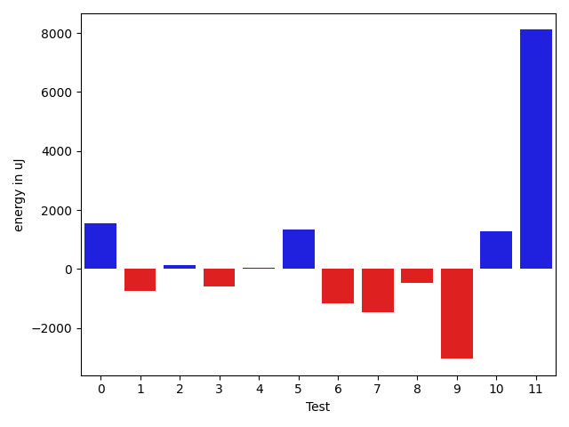
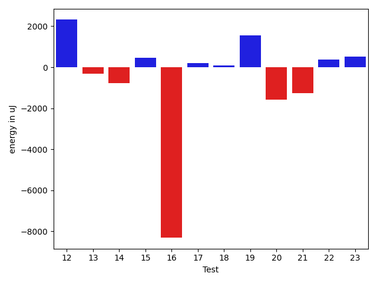
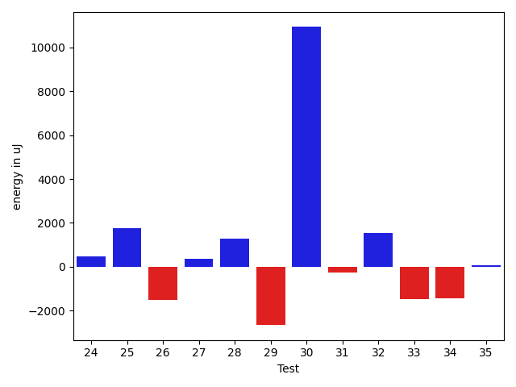
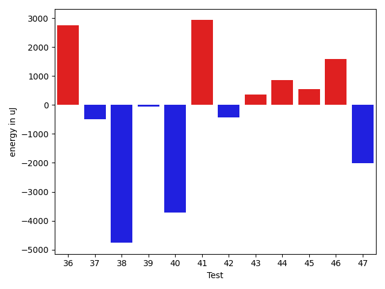
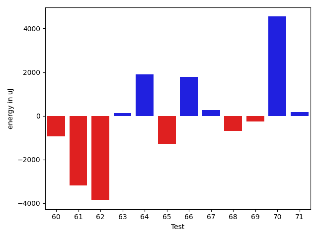
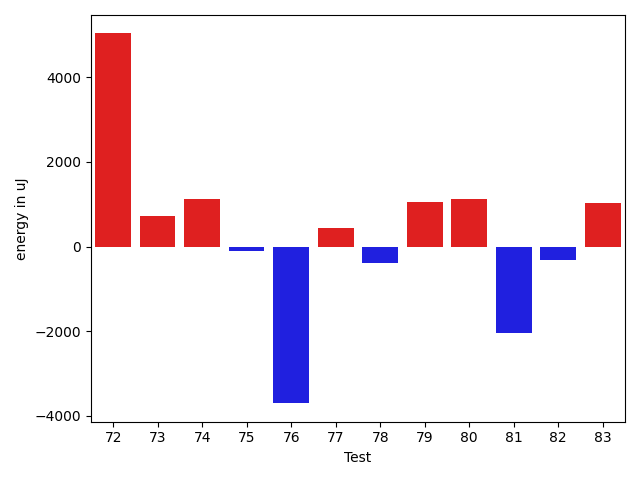
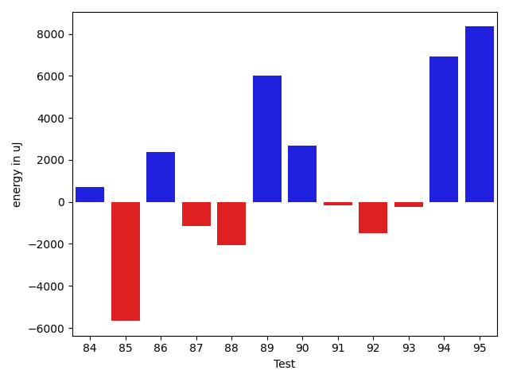
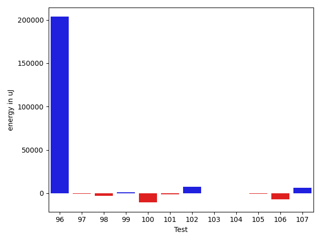
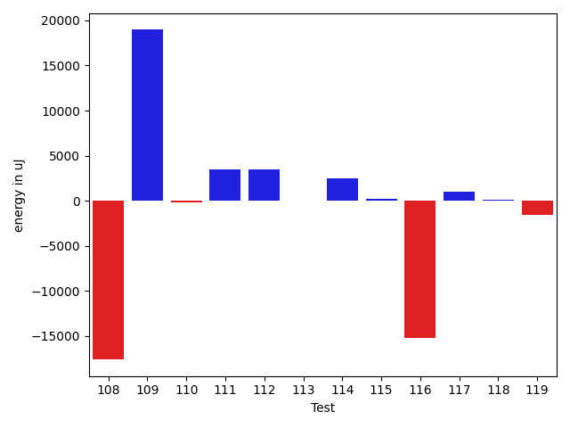
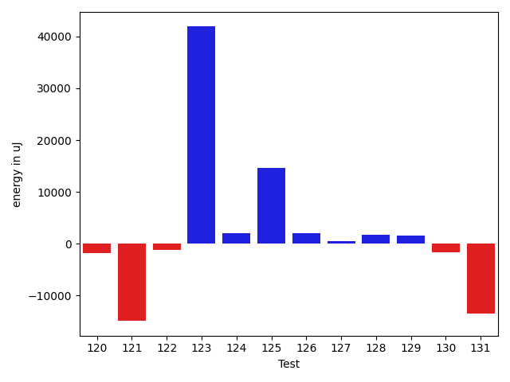

# gson ff88ac

https://github.com/google/gson/commit/ff88ac

## Delta Energy per test method

| ID | EnergyV1 | EnergyV2 | DeltaEnergy | σV1 | σV2 |
| --- | --- | --- | --- | --- | --- |
| 0 | 39184 | 40588 | 1404 | 3486.319324929108 | 5029.342108406271 |
| 1 | 40710 | 38635 | -2075 | 4059.4648583634876 | 5581.87200096204 |
| 2 | 39734 | 40955 | 1221 | 4482.972867905292 | 4523.644106956249 |
| 3 | 40466 | 40100 | -366 | 4398.203751961397 | 3863.2105090843806 |
| 4 | 39490 | 39490 | 0 | 1784.3566102090394 | 4147.611948500759 |
| 5 | 39734 | 41809 | 2075 | 2828.579242633297 | 3830.845595739283 |
| 6 | 40466 | 39184 | -1282 | 2717.775924392335 | 3679.5037467687416 |
| 7 | 38208 | 37292 | -916 | 3730.2424471548447 | 4510.675562228085 |
| 8 | 41626 | 40527 | -1099 | 4496.9943065574225 | 3992.291145714726 |
| 9 | 40161 | 36682 | -3479 | 3002.7957373088166 | 3744.169719562521 |
| 10 | 38696 | 40649 | 1953 | 4562.423258870179 | 4496.556921652373 |
| 11 | 41320 | 40649 | -671 | 4608.354700930342 | 34754.98917284448 |
| 12 | 36743 | 39795 | 3052 | 4041.2687737812066 | 4031.0528212242516 |
| 13 | 40710 | 39978 | -732 | 3564.369860943166 | 4641.416851145206 |
| 14 | 40710 | 39490 | -1220 | 3435.2008514204817 | 3873.0256489333915 |
| 15 | 40832 | 40833 | 1 | 2891.177064944601 | 4106.821969908213 |
| 16 | 39673 | 40711 | 1038 | 42490.70653615162 | 3342.3947552615623 |
| 17 | 39916 | 38879 | -1037 | 3950.1163799223127 | 3639.1449110621943 |
| 18 | 37597 | 38391 | 794 | 4645.69648759745 | 4316.05380784603 |
| 19 | 39795 | 41015 | 1220 | 3479.1329968430673 | 4488.222149241482 |
| 20 | 40771 | 40283 | -488 | 3494.738818321624 | 3022.848888327375 |
| 21 | 40222 | 38025 | -2197 | 3303.553355935121 | 4432.168523726808 |
| 22 | 38941 | 40100 | 1159 | 3027.3774159994637 | 4234.40160738818 |
| 23 | 41321 | 42420 | 1099 | 4617.135084205623 | 4179.335744506072 |
| 24 | 39977 | 38269 | -1708 | 3812.9744699635417 | 4402.13164526258 |
| 25 | 40100 | 40954 | 854 | 2376.7049574033067 | 4527.119464835106 |
| 26 | 41076 | 36926 | -4150 | 4678.349396570215 | 3624.408430231864 |
| 27 | 40222 | 38636 | -1586 | 4765.196947398921 | 3190.4132487187294 |
| 28 | 38574 | 38818 | 244 | 2833.2028559281644 | 3270.5515317449604 |
| 29 | 42175 | 39306 | -2869 | 5506.994238534538 | 4286.811679239466 |
| 30 | 39124 | 43579 | 4455 | 7503.5764158230395 | 19119.095997612723 |
| 31 | 39855 | 39978 | 123 | 3296.800025782577 | 4464.913908657168 |
| 32 | 38635 | 40344 | 1709 | 3183.7962296759456 | 4076.092920575347 |
| 33 | 41198 | 38819 | -2379 | 4279.306981848576 | 4284.325550448077 |
| 34 | 41809 | 39917 | -1892 | 3846.253486549961 | 4056.7700121068588 |
| 35 | 41748 | 42297 | 549 | 3969.504190018529 | 3893.7182752924214 |
| 36 | 40100 | 42846 | 2746 | 21135.900327091218 | 4604.493688046915 |
| 37 | 39977 | 39490 | -487 | 6611.844762965186 | 6151.423211035151 |
| 38 | 83863 | 79101 | -4762 | 20207.885566093788 | 21265.286723716974 |
| 39 | 40710 | 40649 | -61 | 4338.670082888795 | 4791.250315756347 |
| 40 | 80932 | 77209 | -3723 | 26137.119364291037 | 24524.38487416926 |
| 41 | 40711 | 43640 | 2929 | 4485.983396491789 | 5400.462733797025 |
| 42 | 86243 | 85815 | -428 | 23679.178585819503 | 19220.152810898202 |
| 43 | 40344 | 40711 | 367 | 4281.268954337604 | 4048.842597857099 |
| 44 | 40527 | 41382 | 855 | 5133.579923561843 | 4604.152806615639 |
| 45 | 39795 | 40344 | 549 | 6074.798675210228 | 3833.0602625482597 |
| 46 | 39550 | 41138 | 1588 | 4075.8805742340373 | 3314.415081711636 |
| 47 | 41320 | 39306 | -2014 | 4902.840784462154 | 3970.4017876728244 |
| 48 | 40710 | 39490 | -1220 | 3806.8818935553136 | 3591.893417264445 |
| 49 | 37231 | 42176 | 4945 | 3991.0257340340745 | 3373.3988543080573 |
| 50 | 41259 | 39916 | -1343 | 3433.440326771386 | 3541.8237954172614 |
| 51 | 100708 | 61279 | -39429 | 15965.166433520197 | 0.0 |
| 52 | 39062 | 40406 | 1344 | 4355.933166857847 | 4738.821652858058 |
| 53 | 33020 | 33691 | 671 | 0.0 | 0.0 |
| 54 | 42908 | 44861 | 1953 | 589920.6461980619 | 470721.4823344457 |
| 55 | 43029 | 40649 | -2380 | 33215.20400813628 | 48596.86205915282 |
| 56 | 42298 | 41687 | -611 | 33983.23645314328 | 4560.797619660403 |
| 57 | 43823 | 41626 | -2197 | 4379.77152992265 | 4902.498033246561 |
| 58 | 40161 | 39917 | -244 | 4353.8964085641655 | 2962.225126907025 |
| 59 | 41565 | 38208 | -3357 | 4699.339618942929 | 5144.537720536675 |
| 60 | 40039 | 39429 | -610 | 3818.9070081427885 | 4190.421204962575 |
| 61 | 43701 | 38513 | -5188 | 4183.668866389135 | 4191.977976489368 |
| 62 | 42846 | 40527 | -2319 | 3726.5853532505766 | 4209.195232662257 |
| 63 | 39734 | 39307 | -427 | 5229.467237045599 | 4611.583650157145 |
| 64 | 40955 | 40284 | -671 | 4311.805932553088 | 5309.7001263817865 |
| 65 | 43762 | 41016 | -2746 | 4777.642649436465 | 4237.398182773835 |
| 66 | 41747 | 42358 | 611 | 7922.1468992349555 | 11137.60716930959 |
| 67 | 41931 | 42358 | 427 | 8415.239807589998 | 8998.907515112905 |
| 68 | 45288 | 46447 | 1159 | 45309.15320264787 | 41023.965409767196 |
| 69 | 39795 | 38879 | -916 | 3455.3672300082485 | 4640.3900170774095 |
| 70 | 39917 | 37353 | -2564 | 3106.7954940316777 | 34001.829965933044 |
| 71 | 40161 | 39307 | -854 | 3810.0346976766496 | 7657.780466582664 |
| 72 | 40955 | 38269 | -2686 | 3650.261603516203 | 32604.74096974726 |
| 73 | 39184 | 38940 | -244 | 4026.104410741291 | 3887.957520529313 |
| 74 | 38391 | 38635 | 244 | 3601.494380565188 | 6017.578356640263 |
| 75 | 39612 | 38574 | -1038 | 3834.488436753982 | 6371.555339946441 |
| 76 | 41931 | 41809 | -122 | 78813.46584370513 | 106777.71949500931 |
| 77 | 39917 | 40588 | 671 | 4694.248500492385 | 5669.340140812001 |
| 78 | 40283 | 39489 | -794 | 3435.3764914310655 | 4666.115923510082 |
| 79 | 40466 | 39795 | -671 | 4377.67239187816 | 4151.503488236744 |
| 80 | 40527 | 40161 | -366 | 3976.6999521952825 | 7131.83347307923 |
| 81 | 41748 | 38208 | -3540 | 4495.89274920635 | 5055.5480549394915 |
| 82 | 40223 | 41503 | 1280 | 4096.852113725309 | 4778.769840398259 |
| 83 | 39978 | 41382 | 1404 | 3494.2134555762605 | 7003.417397956515 |
| 84 | 40711 | 40161 | -550 | 7317.602572825225 | 12753.008126670065 |
| 85 | 42846 | 40466 | -2380 | 45321.19406267877 | 27974.523331319077 |
| 86 | 40893 | 40039 | -854 | 7724.428094168885 | 17177.34436522147 |
| 87 | 41382 | 39063 | -2319 | 3766.924513445949 | 4412.56737602725 |
| 88 | 41565 | 37415 | -4150 | 4154.841984426791 | 4692.632885841975 |
| 89 | 81787 | 79712 | -2075 | 59133.87348923003 | 76192.62728877613 |
| 90 | 40344 | 40100 | -244 | 7823.402607534702 | 18610.28731526698 |
| 91 | 40954 | 41748 | 794 | 3318.2934201517232 | 5020.387846632195 |
| 92 | 41382 | 39123 | -2259 | 3988.106470648005 | 4302.734864132394 |
| 93 | 41198 | 41381 | 183 | 3656.6891235017133 | 4964.801037444778 |
| 94 | 39795 | 44128 | 4333 | 6804.650031110964 | 18851.032332540806 |
| 95 | 61585 | 78735 | 17150 | 23911.69612729966 | 23553.896479642972 |
| 96 | 45288 | 44555 | -733 | 286267.69626891887 | 763772.6520070742 |
| 97 | 42419 | 41931 | -488 | 101634.89306089235 | 79555.20102601426 |
| 98 | 42419 | 40344 | -2075 | 3425.542867592852 | 3836.4870443675422 |
| 99 | 41320 | 44739 | 3419 | 4341.968110936432 | 5064.324472165562 |
| 100 | 43579 | 42602 | -977 | 28498.56568835234 | 15967.394000802306 |
| 101 | 41625 | 42053 | 428 | 25218.776077779647 | 10609.885999903134 |
| 102 | 41687 | 43212 | 1525 | 11680.715835643898 | 21953.378784826476 |
| 103 | 41504 | 42480 | 976 | 8244.167701378323 | 4455.674063602341 |
| 104 | 40466 | 40283 | -183 | 4072.9555782041316 | 4984.604716176492 |
| 105 | 40954 | 40344 | -610 | 3674.619807708827 | 4303.8368587881805 |
| 106 | 43518 | 41809 | -1709 | 19199.302101474244 | 5503.113177877235 |
| 107 | 42481 | 42724 | 243 | 16661.783389463435 | 23400.089831661844 |
| 108 | 41016 | 42297 | 1281 | 98201.54315184006 | 39772.32319367605 |
| 109 | 41443 | 44556 | 3113 | 51995.03507310059 | 70470.46102340033 |
| 110 | 40283 | 40832 | 549 | 3857.1161540769895 | 4510.813938481612 |
| 111 | 199218 | 188415 | -10803 | 70839.66030484697 | 64625.974944205154 |
| 112 | 38818 | 41321 | 2503 | 4277.2902637066845 | 10296.160706282706 |
| 113 | 41504 | 42908 | 1404 | 10549.872071965587 | 6949.106110111705 |
| 114 | 42175 | 41748 | -427 | 4956.443975155779 | 8785.83193484914 |
| 115 | 42359 | 42236 | -123 | 6545.698193680548 | 9549.965443248793 |
| 116 | 43518 | 41870 | -1648 | 39608.528855171935 | 10165.14815082396 |
| 117 | 40528 | 42602 | 2074 | 5171.397638929979 | 3735.091693476572 |
| 118 | 41809 | 41320 | -489 | 3677.0778717014164 | 4418.671142673082 |
| 119 | 41992 | 40345 | -1647 | 3301.4212869880284 | 4144.291810152889 |
| 120 | 42481 | 39978 | -2503 | 3490.28341424137 | 4450.826136436514 |
| 121 | 42114 | 40405 | -1709 | 67853.24620509766 | 3707.8507634509333 |
| 122 | 41809 | 40344 | -1465 | 3888.234353842371 | 4495.017872638349 |
| 123 | 42115 | 43884 | 1769 | 3147.747134405917 | 95019.59747272673 |
| 124 | 40466 | 40711 | 245 | 3863.6500081920553 | 11490.500166624615 |
| 125 | 42054 | 42846 | 792 | 51025.09541766897 | 77001.78382660127 |
| 126 | 41260 | 42236 | 976 | 6353.916550081249 | 11368.777753897506 |
| 127 | 40894 | 42969 | 2075 | 15488.053054200274 | 10672.209976278473 |
| 128 | 42359 | 42785 | 426 | 21234.597131863313 | 28827.964122241923 |
| 129 | 39063 | 42297 | 3234 | 4445.4009762899905 | 4568.723468535215 |
| 130 | 40954 | 40405 | -549 | 3127.960246194818 | 4803.53597451061 |
| 131 | 42236 | 41260 | -976 | 41088.52867809465 | 5106.946712016389 |

## Delta Duration per test method

| ID | DurationV1 | DurationsV2 | DeltaDuration |
| --- | --- | --- | --- |
| 0 | 458590.85714285716 | 474235.7272727273 | 15644.870129870134 |
| 1 | 468396.5263157895 | 669416.2272727273 | 201019.7009569378 |
| 2 | 362233.375 | 487777.16 | 125543.78499999997 |
| 3 | 392959.05263157893 | 433788.375 | 40829.32236842107 |
| 4 | 315824.36363636365 | 401770.4736842105 | 85946.11004784686 |
| 5 | 333756.4210526316 | 344885.8333333333 | 11129.412280701741 |
| 6 | 326442.4090909091 | 369610.1538461539 | 43167.744755244756 |
| 7 | 420320.0869565217 | 424757.70588235295 | 4437.618925831222 |
| 8 | 372219.5 | 456762.3793103448 | 84542.87931034481 |
| 9 | 349759.73333333334 | 414079.94444444444 | 64320.2111111111 |
| 10 | 360669.8823529412 | 400494.95238095237 | 39825.07002801116 |
| 11 | 437575.8181818182 | 683238.2608695652 | 245662.442687747 |
| 12 | 475872.8947368421 | 502158.9 | 26286.005263157946 |
| 13 | 411822.92 | 431799.5 | 19976.580000000016 |
| 14 | 465227.12 | 535555.6071428572 | 70328.48714285716 |
| 15 | 423904.14285714284 | 463513.15789473685 | 39609.015037594014 |
| 16 | 757746.3333333334 | 374775.1 | -382971.2333333334 |
| 17 | 511305.4583333333 | 523279.9310344828 | 11974.472701149469 |
| 18 | 447360.90476190473 | 441686.3333333333 | -5674.57142857142 |
| 19 | 354406.75 | 442289.4210526316 | 87882.67105263157 |
| 20 | 352859.0 | 409712.3157894737 | 56853.31578947371 |
| 21 | 366427.2380952381 | 445247.4210526316 | 78820.18295739347 |
| 22 | 357184.0869565217 | 445804.3793103448 | 88620.29235382308 |
| 23 | 416231.6111111111 | 477196.09523809527 | 60964.48412698414 |
| 24 | 334206.3125 | 388283.2 | 54076.88750000001 |
| 25 | 351522.04545454547 | 419397.4666666667 | 67875.4212121212 |
| 26 | 376736.25 | 442668.77777777775 | 65932.52777777775 |
| 27 | 482109.5 | 572409.16 | 90299.66000000003 |
| 28 | 346624.05555555556 | 355575.9411764706 | 8951.88562091504 |
| 29 | 452366.23529411765 | 427498.6666666667 | -24867.568627450964 |
| 30 | 835619.4838709678 | 1179039.9591836734 | 343420.4753127056 |
| 31 | 404360.0 | 442727.652173913 | 38367.652173913026 |
| 32 | 412784.1666666667 | 509256.3043478261 | 96472.13768115942 |
| 33 | 334541.5714285714 | 411023.73333333334 | 76482.16190476192 |
| 34 | 538177.1739130435 | 652715.7272727273 | 114538.55335968384 |
| 35 | 639457.2195121951 | 689302.7272727273 | 49845.5077605322 |
| 36 | 972825.0571428571 | 737496.2083333334 | -235328.84880952374 |
| 37 | 890251.725490196 | 859738.1111111111 | -30513.614379084902 |
| 38 | 2176353.5656565656 | 2103797.868686869 | -72555.69696969679 |
| 39 | 594538.0 | 600523.9411764706 | 5985.941176470602 |
| 40 | 2272863.393939394 | 2221130.0606060605 | -51733.33333333349 |
| 41 | 560257.28 | 564756.9130434783 | 4499.633043478243 |
| 42 | 2570029.727272727 | 2478286.2525252528 | -91743.4747474743 |
| 43 | 518584.9375 | 427130.6666666667 | -91454.27083333331 |
| 44 | 461577.7916666667 | 470810.2 | 9232.408333333326 |
| 45 | 601462.40625 | 609724.7714285714 | 8262.365178571432 |
| 46 | 524000.25925925927 | 525515.5142857142 | 1515.255026454979 |
| 47 | 452744.76470588235 | 465617.8 | 12873.035294117639 |
| 48 | 351055.0 | 431207.27777777775 | 80152.27777777775 |
| 49 | 430258.25 | 429105.1666666667 | -1153.083333333314 |
| 50 | 599464.9 | 669481.947368421 | 70017.04736842099 |
| 51 | 2787209.5 | 2659075.0 | -128134.5 |
| 52 | 461724.04545454547 | 539244.2857142857 | 77520.24025974021 |
| 53 | 848209.0 | 1069795.0 | 221586.0 |
| 54 | 4546284.886075949 | 4088391.7011494255 | -457893.1849265238 |
| 55 | 1323564.2727272727 | 1102903.2121212122 | -220661.06060606055 |
| 56 | 1330040.888888889 | 570030.5 | -760010.388888889 |
| 57 | 427995.55555555556 | 432739.04761904763 | 4743.492063492071 |
| 58 | 409813.71428571426 | 349873.7272727273 | -59939.98701298697 |
| 59 | 362762.5 | 409334.0 | 46571.5 |
| 60 | 344693.94736842107 | 406425.25 | 61731.30263157893 |
| 61 | 421747.8125 | 434135.5 | 12387.6875 |
| 62 | 381340.6111111111 | 411507.13333333336 | 30166.522222222236 |
| 63 | 388227.1666666667 | 400552.5909090909 | 12325.424242424197 |
| 64 | 380369.5 | 433962.3333333333 | 53592.833333333314 |
| 65 | 392934.64285714284 | 403864.125 | 10929.48214285716 |
| 66 | 925570.641509434 | 1042197.0322580645 | 116626.39074863051 |
| 67 | 865513.6949152543 | 980638.1833333333 | 115124.4884180791 |
| 68 | 1792596.0740740742 | 1734835.3692307693 | -57760.70484330482 |
| 69 | 602928.4090909091 | 629048.7567567568 | 26120.347665847745 |
| 70 | 537604.9545454546 | 860347.5666666667 | 322742.61212121206 |
| 71 | 663608.6 | 876285.5 | 212676.90000000002 |
| 72 | 615773.8484848485 | 801874.1818181818 | 186100.33333333326 |
| 73 | 701147.8571428572 | 740289.0263157894 | 39141.16917293228 |
| 74 | 482076.7619047619 | 617452.0540540541 | 135375.2921492922 |
| 75 | 776806.08 | 830290.68 | 53484.60000000009 |
| 76 | 1684424.84375 | 1676808.8139534884 | -7616.029796511633 |
| 77 | 607078.8333333334 | 712992.6666666666 | 105913.83333333326 |
| 78 | 524257.8387096774 | 579806.5263157894 | 55548.68760611204 |
| 79 | 544583.1428571428 | 746381.0344827586 | 201797.89162561577 |
| 80 | 756973.2264150943 | 866200.033898305 | 109226.8074832107 |
| 81 | 530215.9310344828 | 861543.7222222222 | 331327.79118773947 |
| 82 | 446036.7727272727 | 482713.1666666667 | 36676.39393939398 |
| 83 | 484020.4210526316 | 667482.1875 | 183461.76644736843 |
| 84 | 979775.796875 | 1093915.4210526317 | 114139.62417763169 |
| 85 | 1549011.482352941 | 1437078.512195122 | -111932.9701578191 |
| 86 | 1094059.1153846155 | 1258603.1724137932 | 164544.05702917767 |
| 87 | 731788.58 | 785456.306122449 | 53667.726122449036 |
| 88 | 657845.0333333333 | 714713.6666666666 | 56868.6333333333 |
| 89 | 2381682.8412698414 | 2488033.8852459015 | 106351.04397606011 |
| 90 | 985032.0163934426 | 1133413.328125 | 148381.31173155736 |
| 91 | 602158.4666666667 | 704290.0857142857 | 102131.61904761905 |
| 92 | 571228.6571428571 | 694480.3142857143 | 123251.6571428572 |
| 93 | 563139.0869565217 | 611002.5789473684 | 47863.4919908467 |
| 94 | 805708.0625 | 1048733.8979591837 | 243025.83545918367 |
| 95 | 1816669.7272727273 | 1964912.4040404041 | 148242.67676767684 |
| 96 | 2479652.6133333333 | 8528337.848484848 | 6048685.235151514 |
| 97 | 1614049.34375 | 1994159.0357142857 | 380109.6919642857 |
| 98 | 442496.0588235294 | 517003.24 | 74507.18117647059 |
| 99 | 385441.1666666667 | 534775.875 | 149334.7083333333 |
| 100 | 1292746.6333333333 | 969205.5641025641 | -323541.0692307692 |
| 101 | 1126041.1168831168 | 1157928.5316455697 | 31887.414762452943 |
| 102 | 1076340.0576923077 | 1277185.0 | 200844.94230769225 |
| 103 | 867021.7258064516 | 933416.2028985508 | 66394.47709209914 |
| 104 | 799724.3673469388 | 845752.1818181818 | 46027.81447124295 |
| 105 | 602807.3488372093 | 729006.7894736842 | 126199.44063647487 |
| 106 | 1153808.551020408 | 940895.2857142857 | -212913.26530612237 |
| 107 | 1194352.138888889 | 1427297.25 | 232945.111111111 |
| 108 | 1468497.5483870967 | 1160800.1555555556 | -307697.39283154113 |
| 109 | 1253747.2063492064 | 1964300.0625 | 710552.8561507936 |
| 110 | 721009.3541666666 | 868686.68 | 147677.32583333342 |
| 111 | 5405433.97979798 | 5656086.303030303 | 250652.32323232293 |
| 112 | 431371.36 | 636123.8 | 204752.44000000006 |
| 113 | 636267.5862068966 | 613197.5357142857 | -23070.0504926109 |
| 114 | 643837.4722222222 | 799734.380952381 | 155896.9087301587 |
| 115 | 819902.2549019608 | 948566.5555555555 | 128664.30065359466 |
| 116 | 1459875.361111111 | 1003356.5967741936 | -456518.76433691743 |
| 117 | 555968.7083333334 | 587838.3181818182 | 31869.609848484863 |
| 118 | 385868.1153846154 | 597504.8571428572 | 211636.74175824178 |
| 119 | 454596.52173913043 | 682997.8064516129 | 228401.28471248242 |
| 120 | 423346.55555555556 | 530568.4782608695 | 107221.92270531395 |
| 121 | 935934.6 | 676924.3461538461 | -259010.25384615385 |
| 122 | 552546.6 | 565743.4516129033 | 13196.851612903294 |
| 123 | 450245.94736842107 | 2024973.6956521738 | 1574727.7482837527 |
| 124 | 864146.2037037037 | 1054070.156862745 | 189923.95315904135 |
| 125 | 948194.0 | 1500663.8974358975 | 552469.8974358975 |
| 126 | 1046731.3606557377 | 1090491.9846153846 | 43760.62395964691 |
| 127 | 997785.2708333334 | 1017389.2592592592 | 19603.98842592584 |
| 128 | 826582.2222222222 | 1059010.2307692308 | 232428.0085470085 |
| 129 | 579225.32 | 785557.3611111111 | 206332.04111111118 |
| 130 | 571646.8076923077 | 781656.9756097561 | 210010.16791744833 |
| 131 | 1157310.6756756757 | 996578.3 | -160732.3756756757 |

## Misc.

| ID | Test Class | Test Method |
| --- | --- | --- |
| 0 | com.google.gson.functional.PrimitiveTest | testDoubleNoFractAsStringRepresentationDeserialization |
| 1 | com.google.gson.functional.PrimitiveTest | testPrimitiveIntegerAutoboxedDeserialization |
| 2 | com.google.gson.functional.PrimitiveTest | testDoubleAsStringRepresentationDeserialization |
| 3 | com.google.gson.functional.PrimitiveTest | testPrimitiveClassLiteral |
| 4 | com.google.gson.functional.PrimitiveTest | testDeserializeJsonArrayAsByteWrapper |
| 5 | com.google.gson.functional.PrimitiveTest | testDeserializingBigDecimalAsDouble |
| 6 | com.google.gson.functional.PrimitiveTest | testDeserializingBigDecimalAsFloat |
| 7 | com.google.gson.functional.PrimitiveTest | testFloatInfinityDeserialization |
| 8 | com.google.gson.functional.PrimitiveTest | testLargeDoubleDeserialization |
| 9 | com.google.gson.functional.PrimitiveTest | testDeserializeJsonObjectAsBytePrimitive |
| 10 | com.google.gson.functional.PrimitiveTest | testSmallValueForBigIntegerDeserialization |
| 11 | com.google.gson.functional.PrimitiveTest | testLongAsStringDeserialization |
| 12 | com.google.gson.functional.PrimitiveTest | testBigIntegerDeserialization |
| 13 | com.google.gson.functional.PrimitiveTest | testDoubleInfinityDeserialization |
| 14 | com.google.gson.functional.PrimitiveTest | testDeserializingBigIntegerAsBigDecimal |
| 15 | com.google.gson.functional.PrimitiveTest | testDoubleNaNDeserialization |
| 16 | com.google.gson.functional.PrimitiveTest | testQuotedStringSerializationAndDeserialization |
| 17 | com.google.gson.functional.PrimitiveTest | testPrimitiveDoubleAutoboxedDeserialization |
| 18 | com.google.gson.functional.PrimitiveTest | testBigDecimalDeserialization |
| 19 | com.google.gson.functional.PrimitiveTest | testSmallValueForBigDecimalDeserialization |
| 20 | com.google.gson.functional.PrimitiveTest | testNegativeInfinityFloatDeserialization |
| 21 | com.google.gson.functional.PrimitiveTest | testBigDecimalNoFractAsStringRepresentationDeserialization |
| 22 | com.google.gson.functional.PrimitiveTest | testDeserializeJsonObjectAsShortPrimitive |
| 23 | com.google.gson.functional.PrimitiveTest | testReallyLongValuesDeserialization |
| 24 | com.google.gson.functional.PrimitiveTest | testDeserializeJsonObjectAsNumber |
| 25 | com.google.gson.functional.PrimitiveTest | testDeserializeJsonArrayAsNumber |
| 26 | com.google.gson.functional.PrimitiveTest | testNegativeInfinityDeserialization |
| 27 | com.google.gson.functional.PrimitiveTest | testUnquotedStringDeserializationFails |
| 28 | com.google.gson.functional.PrimitiveTest | testDeserializeJsonArrayAsShortWrapper |
| 29 | com.google.gson.functional.PrimitiveTest | testPrimitiveLongAutoboxedDeserialization |
| 30 | com.google.gson.functional.PrimitiveTest | testNumberDeserialization |
| 31 | com.google.gson.functional.PrimitiveTest | testFloatNaNDeserialization |
| 32 | com.google.gson.functional.PrimitiveTest | testBigDecimalPreservePrecisionDeserialization |
| 33 | com.google.gson.functional.PrimitiveTest | testBigDecimalAsStringRepresentationDeserialization |
| 34 | com.google.gson.functional.CollectionTest | testRawCollectionOfBagOfPrimitivesNotAllowed |
| 35 | com.google.gson.functional.CollectionTest | testRawCollectionDeserializationNotAlllowed |
| 36 | com.google.gson.functional.DefaultTypeAdaptersTest | testUrlDeserialization |
| 37 | com.google.gson.functional.DefaultTypeAdaptersTest | testBitSetDeserialization |
| 38 | com.google.gson.functional.DefaultTypeAdaptersTest | testSqlDateSerialization |
| 39 | com.google.gson.functional.DefaultTypeAdaptersTest | testBigIntegerFieldDeserialization |
| 40 | com.google.gson.functional.DefaultTypeAdaptersTest | testTimestampSerialization |
| 41 | com.google.gson.functional.DefaultTypeAdaptersTest | testLocaleDeserializationWithLanguage |
| 42 | com.google.gson.functional.DefaultTypeAdaptersTest | testDateDeserializationWithPattern |
| 43 | com.google.gson.functional.DefaultTypeAdaptersTest | testLocaleDeserializationWithLanguageCountryVariant |
| 44 | com.google.gson.functional.DefaultTypeAdaptersTest | testLocaleDeserializationWithLanguageCountry |
| 45 | com.google.gson.functional.DefaultTypeAdaptersTest | testBigDecimalFieldDeserialization |
| 46 | com.google.gson.functional.DefaultTypeAdaptersTest | testDefaultGregorianCalendarDeserialization |
| 47 | com.google.gson.functional.DefaultTypeAdaptersTest | testUriDeserialization |
| 48 | com.google.gson.functional.DefaultTypeAdaptersTest | testStringBufferDeserialization |
| 49 | com.google.gson.functional.DefaultTypeAdaptersTest | testStringBuilderDeserialization |
| 50 | com.google.gson.functional.DefaultTypeAdaptersTest | testDefaultCalendarDeserialization |
| 51 | com.google.gson.functional.DefaultTypeAdaptersTest | testDefaultDateDeserialization |
| 52 | com.google.gson.functional.DefaultTypeAdaptersTest | testUuidDeserialization |
| 53 | com.google.gson.functional.DefaultTypeAdaptersTest | testDefaultJavaSqlTimestampDeserialization |
| 54 | com.google.gson.JsonParserTest | testReadWriteTwoObjects |
| 55 | com.google.gson.functional.StringTest | testSingleQuoteInStringSerialization |
| 56 | com.google.gson.functional.StringTest | testStringValueDeserialization |
| 57 | com.google.gson.functional.StringTest | testEscapedCtrlNInStringDeserialization |
| 58 | com.google.gson.functional.StringTest | testAssignmentCharDeserialization |
| 59 | com.google.gson.functional.StringTest | testStringWithEscapedSlashDeserialization |
| 60 | com.google.gson.functional.StringTest | testSingleQuoteInStringDeserialization |
| 61 | com.google.gson.functional.StringTest | testEscapedBackslashInStringDeserialization |
| 62 | com.google.gson.functional.StringTest | testEscapingQuotesInStringDeserialization |
| 63 | com.google.gson.functional.StringTest | testEscapingQuotesInStringSerialization |
| 64 | com.google.gson.functional.StringTest | testEscapedCtrlRInStringDeserialization |
| 65 | com.google.gson.functional.StringTest | testJavascriptKeywordsInStringDeserialization |
| 66 | com.google.gson.functional.CustomDeserializerTest | testCustomDeserializerReturnsNull |
| 67 | com.google.gson.functional.CustomDeserializerTest | testCustomDeserializerReturnsNullForArrayElements |
| 68 | com.google.gson.functional.CustomDeserializerTest | testCustomDeserializerReturnsNullForTopLevelObject |
| 69 | com.google.gson.functional.ObjectTest | testClassWithTransientFieldsDeserialization |
| 70 | com.google.gson.functional.ObjectTest | testClassWithTransientFieldsDeserializationTransientFieldsPassedInJsonAreIgnored |
| 71 | com.google.gson.functional.ObjectTest | testNestedDeserialization |
| 72 | com.google.gson.functional.ObjectTest | testBagOfPrimitiveWrappersDeserialization |
| 73 | com.google.gson.functional.ObjectTest | testPrimitiveArrayInAnObjectDeserialization |
| 74 | com.google.gson.functional.ObjectTest | testObjectFieldNamesWithoutQuotesDeserialization |
| 75 | com.google.gson.functional.ObjectTest | testArrayOfObjectsDeserialization |
| 76 | com.google.gson.functional.ObjectTest | testJsonInSingleQuotesDeserialization |
| 77 | com.google.gson.functional.ObjectTest | testJsonInMixedQuotesDeserialization |
| 78 | com.google.gson.functional.ObjectTest | testNullPrimitiveFieldsDeserialization |
| 79 | com.google.gson.functional.ObjectTest | testBagOfPrimitivesDeserialization |
| 80 | com.google.gson.functional.ObjectTest | testInnerClassDeserialization |
| 81 | com.google.gson.functional.ObjectTest | testNullFieldsDeserialization |
| 82 | com.google.gson.functional.ObjectTest | testClassWithNoFieldsDeserialization |
| 83 | com.google.gson.functional.ObjectTest | testNullArraysDeserialization |
| 84 | com.google.gson.functional.ParameterizedTypesTest | testParameterizedTypeWithReaderDeserialization |
| 85 | com.google.gson.functional.ParameterizedTypesTest | testParameterizedTypeDeserialization |
| 86 | com.google.gson.functional.ParameterizedTypesTest | testParameterizedTypesWithCustomDeserializer |
| 87 | com.google.gson.functional.ParameterizedTypesTest | testDeepParameterizedTypeDeserialization |
| 88 | com.google.gson.functional.NamingPolicyTest | testGsonWithSerializedNameFieldNamingPolicyDeserialization |
| 89 | com.google.gson.functional.NamingPolicyTest | testGsonWithNonDefaultFieldNamingPolicyDeserialiation |
| 90 | com.google.gson.functional.NamingPolicyTest | testComplexFieldNameStrategy |
| 91 | com.google.gson.functional.NamingPolicyTest | testGsonWithLowerCaseDashPolicyDeserialiation |
| 92 | com.google.gson.functional.NamingPolicyTest | testGsonWithLowerCaseUnderscorePolicyDeserialiation |
| 93 | com.google.gson.functional.NamingPolicyTest | testGsonWithUpperCamelCaseSpacesPolicyDeserialiation |
| 94 | com.google.gson.functional.UncategorizedTest | testGsonInstanceReusableForSerializationAndDeserialization |
| 95 | com.google.gson.functional.UncategorizedTest | testReturningDerivedClassesDuringDeserialization |
| 96 | com.google.gson.functional.InstanceCreatorTest | testInstanceCreatorReturnsBaseType |
| 97 | com.google.gson.functional.InternationalizationTest | testStringsWithRawChineseCharactersDeserialization |
| 98 | com.google.gson.functional.InternationalizationTest | testStringsWithUnicodeChineseCharactersEscapedDeserialization |
| 99 | com.google.gson.functional.InternationalizationTest | testStringsWithUnicodeChineseCharactersDeserialization |
| 100 | com.google.gson.functional.ReadersWritersTest | testReaderForDeserialization |
| 101 | com.google.gson.functional.ReadersWritersTest | testReadWriteTwoStrings |
| 102 | com.google.gson.functional.ReadersWritersTest | testReadWriteTwoObjects |
| 103 | com.google.gson.functional.CustomTypeAdaptersTest | testCustomNestedDeserializers |
| 104 | com.google.gson.functional.CustomTypeAdaptersTest | testCustomByteArrayDeserializerAndInstanceCreator |
| 105 | com.google.gson.functional.CustomTypeAdaptersTest | testEnsureCustomDeserializerNotInvokedForNullValues |
| 106 | com.google.gson.functional.CustomTypeAdaptersTest | testCustomDeserializers |
| 107 | com.google.gson.functional.EscapingTest | testGsonAcceptsEscapedAndNonEscapedJsonDeserialization |
| 108 | com.google.gson.functional.EscapingTest | testEscapingQuotesInStringArray |
| 109 | com.google.gson.functional.EscapingTest | testEscapingObjectFields |
| 110 | com.google.gson.functional.EscapingTest | testGsonDoubleDeserialization |
| 111 | com.google.gson.DefaultInetAddressTypeAdapterTest | testInetAddressSerializationAndDeserialization |
| 112 | com.google.gson.functional.EnumTest | testTopLevelEnumInASingleElementArrayDeserialization |
| 113 | com.google.gson.functional.EnumTest | testTopLevelEnumDeserialization |
| 114 | com.google.gson.functional.VersioningTest | testVersionedGsonWithUnversionedClassesDeserialization |
| 115 | com.google.gson.functional.TypeHierarchyAdapterTest | testRegisterSuperTypeFirst |
| 116 | com.google.gson.functional.ArrayTest | testTopLevelArrayOfIntsDeserialization |
| 117 | com.google.gson.functional.ArrayTest | testMultidimenstionalArraysDeserialization |
| 118 | com.google.gson.functional.ArrayTest | testSingleNullInArrayDeserialization |
| 119 | com.google.gson.functional.ArrayTest | testEmptyArrayDeserialization |
| 120 | com.google.gson.functional.ArrayTest | testArrayOfStringsDeserialization |
| 121 | com.google.gson.GsonTypeAdapterTest | testTypeAdapterProperlyConvertsTypes |
| 122 | com.google.gson.GsonTypeAdapterTest | testTypeAdapterThrowsException |
| 123 | com.google.gson.GsonTypeAdapterTest | testTypeAdapterDoesNotAffectNonAdaptedTypes |
| 124 | com.google.gson.functional.JsonParserTest | testChangingCustomTreeAndDeserializing |
| 125 | com.google.gson.functional.JsonParserTest | testDeserializingCustomTree |
| 126 | com.google.gson.functional.TypeVariableTest | testBasicTypeVariables |
| 127 | com.google.gson.functional.InheritanceTest | testSubClassDeserialization |
| 128 | com.google.gson.functional.SecurityTest | testNonExecutableJsonDeserialization |
| 129 | com.google.gson.functional.SecurityTest | testJsonWithNonExectuableTokenWithRegularGsonDeserialization |
| 130 | com.google.gson.functional.SecurityTest | testJsonWithNonExectuableTokenWithConfiguredGsonDeserialization |
| 131 | com.google.gson.functional.ExposeFieldsTest | testExposeAnnotationDeserialization |

| Test | IterationV1 | IterationV2 | DeltaIteration |
| --- | --- | --- | --- |
| 0 | 21 | 22 | 1 |
| 1 | 19 | 22 | 3 |
| 2 | 16 | 25 | 9 |
| 3 | 19 | 16 | -3 |
| 4 | 11 | 19 | 8 |
| 5 | 19 | 18 | -1 |
| 6 | 22 | 13 | -9 |
| 7 | 23 | 17 | -6 |
| 8 | 18 | 29 | 11 |
| 9 | 15 | 18 | 3 |
| 10 | 17 | 21 | 4 |
| 11 | 22 | 23 | 1 |
| 12 | 19 | 20 | 1 |
| 13 | 25 | 26 | 1 |
| 14 | 25 | 28 | 3 |
| 15 | 21 | 19 | -2 |
| 16 | 18 | 20 | 2 |
| 17 | 24 | 29 | 5 |
| 18 | 21 | 18 | -3 |
| 19 | 12 | 19 | 7 |
| 20 | 13 | 19 | 6 |
| 21 | 21 | 19 | -2 |
| 22 | 23 | 29 | 6 |
| 23 | 18 | 21 | 3 |
| 24 | 16 | 15 | -1 |
| 25 | 22 | 15 | -7 |
| 26 | 12 | 9 | -3 |
| 27 | 20 | 25 | 5 |
| 28 | 18 | 17 | -1 |
| 29 | 17 | 24 | 7 |
| 30 | 31 | 49 | 18 |
| 31 | 20 | 23 | 3 |
| 32 | 18 | 23 | 5 |
| 33 | 7 | 15 | 8 |
| 34 | 23 | 33 | 10 |
| 35 | 41 | 33 | -8 |
| 36 | 35 | 24 | -11 |
| 37 | 51 | 54 | 3 |
| 38 | 99 | 99 | 0 |
| 39 | 33 | 34 | 1 |
| 40 | 99 | 99 | 0 |
| 41 | 25 | 23 | -2 |
| 42 | 99 | 99 | 0 |
| 43 | 16 | 15 | -1 |
| 44 | 24 | 15 | -9 |
| 45 | 32 | 35 | 3 |
| 46 | 27 | 35 | 8 |
| 47 | 17 | 15 | -2 |
| 48 | 13 | 18 | 5 |
| 49 | 12 | 18 | 6 |
| 50 | 40 | 38 | -2 |
| 51 | 4 | 1 | -3 |
| 52 | 22 | 21 | -1 |
| 53 | 1 | 1 | 0 |
| 54 | 79 | 87 | 8 |
| 55 | 33 | 33 | 0 |
| 56 | 18 | 20 | 2 |
| 57 | 18 | 21 | 3 |
| 58 | 21 | 11 | -10 |
| 59 | 12 | 18 | 6 |
| 60 | 19 | 16 | -3 |
| 61 | 16 | 22 | 6 |
| 62 | 18 | 15 | -3 |
| 63 | 18 | 22 | 4 |
| 64 | 10 | 18 | 8 |
| 65 | 14 | 16 | 2 |
| 66 | 53 | 62 | 9 |
| 67 | 59 | 60 | 1 |
| 68 | 54 | 65 | 11 |
| 69 | 22 | 37 | 15 |
| 70 | 22 | 30 | 8 |
| 71 | 40 | 40 | 0 |
| 72 | 33 | 33 | 0 |
| 73 | 42 | 38 | -4 |
| 74 | 21 | 37 | 16 |
| 75 | 50 | 50 | 0 |
| 76 | 32 | 43 | 11 |
| 77 | 24 | 30 | 6 |
| 78 | 31 | 19 | -12 |
| 79 | 35 | 29 | -6 |
| 80 | 53 | 59 | 6 |
| 81 | 29 | 36 | 7 |
| 82 | 22 | 12 | -10 |
| 83 | 19 | 32 | 13 |
| 84 | 64 | 76 | 12 |
| 85 | 85 | 82 | -3 |
| 86 | 78 | 87 | 9 |
| 87 | 50 | 49 | -1 |
| 88 | 30 | 33 | 3 |
| 89 | 63 | 61 | -2 |
| 90 | 61 | 64 | 3 |
| 91 | 30 | 35 | 5 |
| 92 | 35 | 35 | 0 |
| 93 | 23 | 38 | 15 |
| 94 | 32 | 49 | 17 |
| 95 | 99 | 99 | 0 |
| 96 | 75 | 66 | -9 |
| 97 | 32 | 28 | -4 |
| 98 | 17 | 25 | 8 |
| 99 | 12 | 16 | 4 |
| 100 | 30 | 39 | 9 |
| 101 | 77 | 79 | 2 |
| 102 | 52 | 68 | 16 |
| 103 | 62 | 69 | 7 |
| 104 | 49 | 55 | 6 |
| 105 | 43 | 38 | -5 |
| 106 | 49 | 63 | 14 |
| 107 | 72 | 80 | 8 |
| 108 | 31 | 45 | 14 |
| 109 | 63 | 64 | 1 |
| 110 | 48 | 50 | 2 |
| 111 | 99 | 99 | 0 |
| 112 | 25 | 25 | 0 |
| 113 | 29 | 28 | -1 |
| 114 | 36 | 42 | 6 |
| 115 | 51 | 63 | 12 |
| 116 | 36 | 62 | 26 |
| 117 | 24 | 22 | -2 |
| 118 | 26 | 28 | 2 |
| 119 | 23 | 31 | 8 |
| 120 | 18 | 23 | 5 |
| 121 | 25 | 26 | 1 |
| 122 | 25 | 31 | 6 |
| 123 | 19 | 23 | 4 |
| 124 | 54 | 51 | -3 |
| 125 | 30 | 39 | 9 |
| 126 | 61 | 65 | 4 |
| 127 | 48 | 54 | 6 |
| 128 | 27 | 39 | 12 |
| 129 | 25 | 36 | 11 |
| 130 | 26 | 41 | 15 |
| 131 | 37 | 40 | 3 |

| Time Label | Time (s) |
| --- | --- |
| Selection | 30.020673274993896 |
| Injection | 15.619102954864502 |
| Total | 1278.4723224639893 |

