# gson 70965e

https://github.com/google/gson/commit/70965e

## Delta Energy per test method

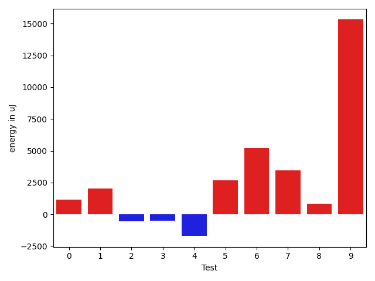

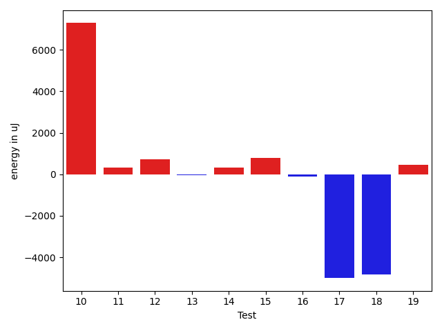

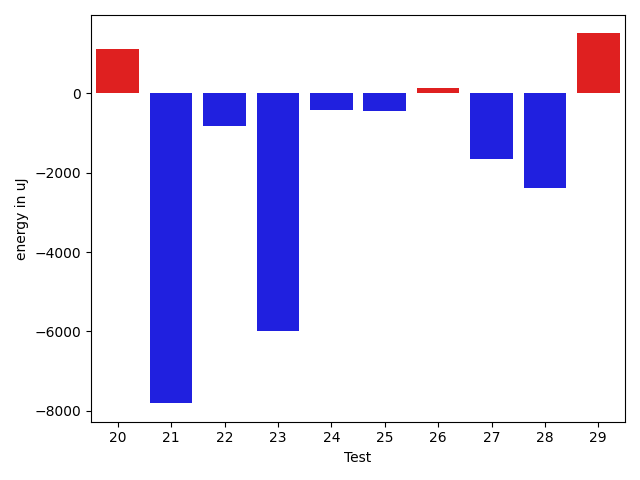

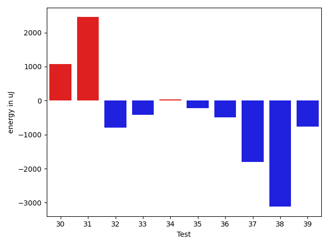

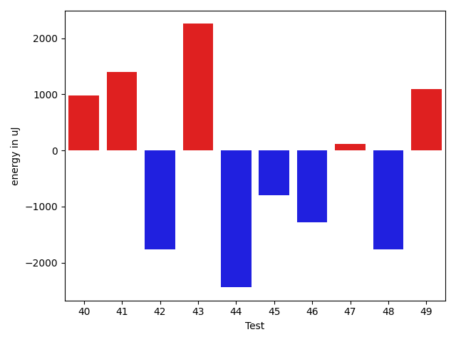

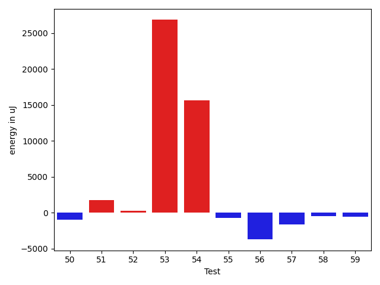

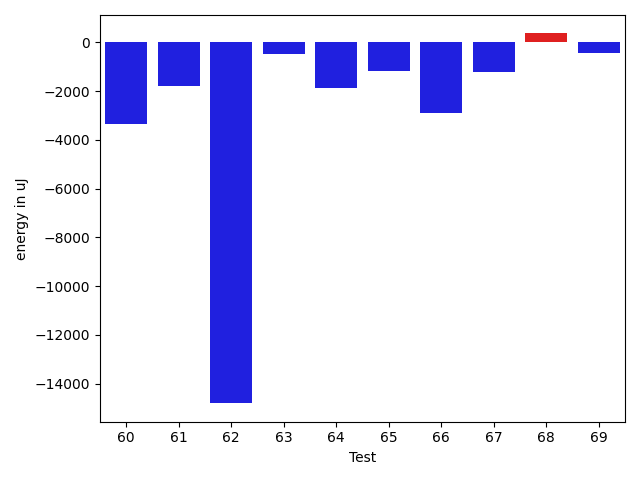

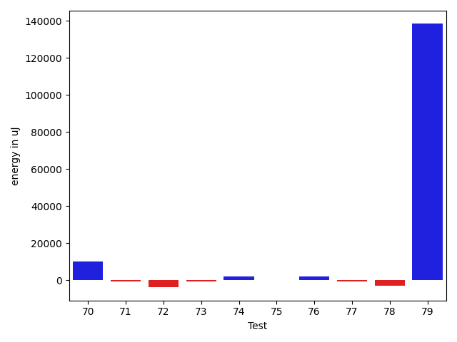

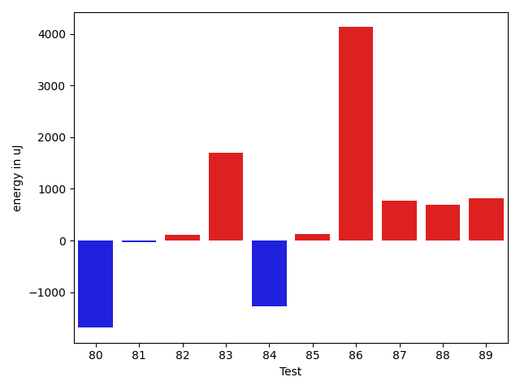

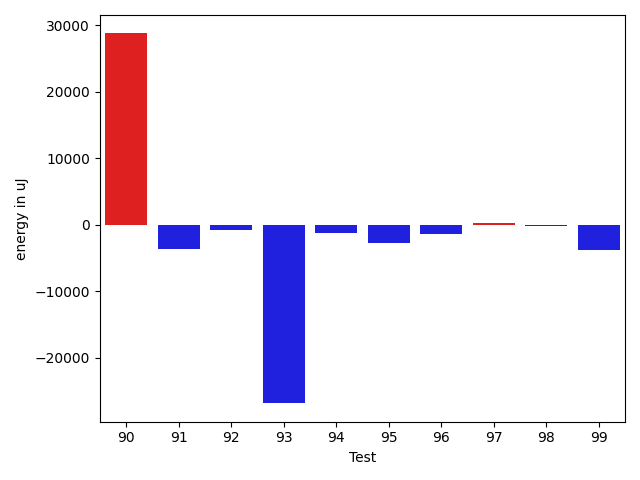

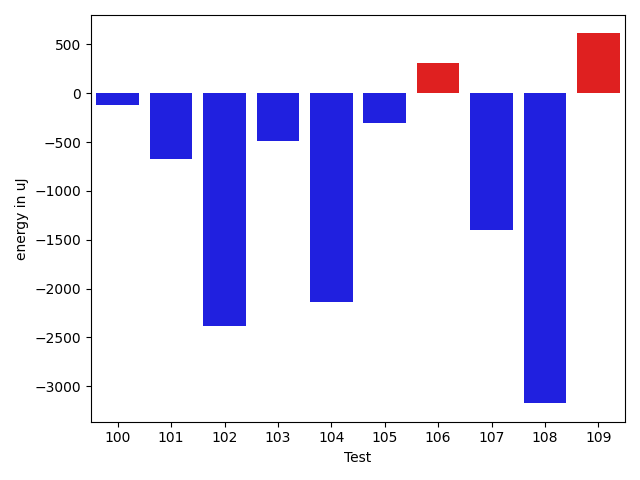

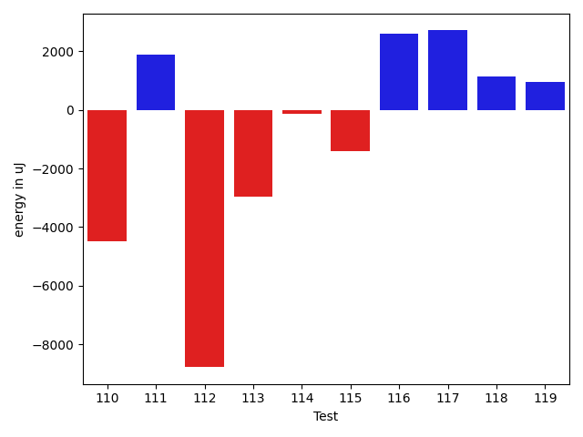

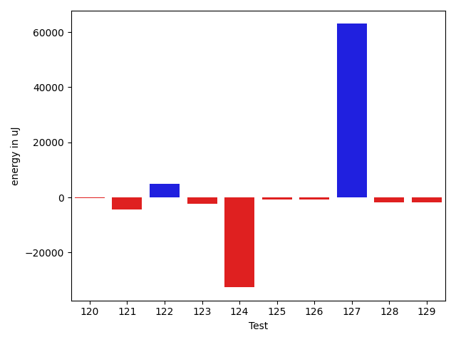

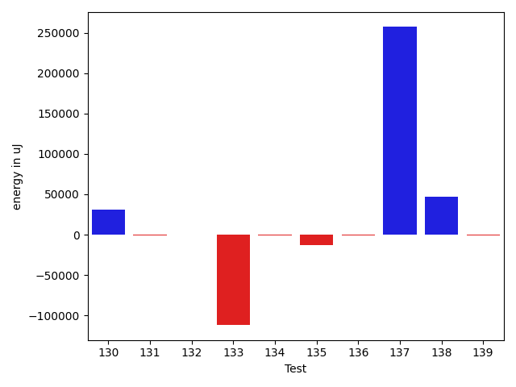

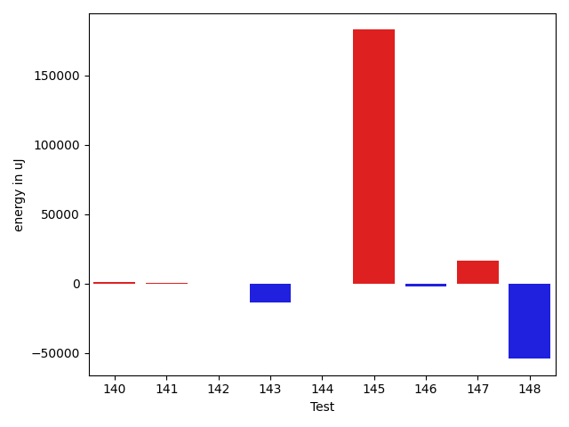

| ID | EnergyV1 | EnergyV2 | DeltaEnergy | σV1 | σV2 |
| --- | --- | --- | --- | --- | --- |
| 0 | 39031.867647058825 | 39563.1186440678 | 531.2509970089741 | 4695.120558197852 | 4981.966516924224 |
| 1 | 38351.625 | 39403.32075471698 | 1051.6957547169804 | 4590.243365121469 | 5195.6542718132 |
| 2 | 39425.51724137931 | 40170.519230769234 | 745.0019893899225 | 6916.14749060282 | 4896.980056392624 |
| 3 | 39724.117647058825 | 39709.604166666664 | -14.513480392161 | 4184.211555251521 | 5194.621147316647 |
| 4 | 39426.2 | 39441.291666666664 | 15.091666666667152 | 4334.744753731181 | 4171.432542496309 |
| 5 | 67956.12121212122 | 141287.52777777778 | 73331.40656565657 | 212023.33899457756 | 406012.88829991367 |
| 6 | 93455.0303030303 | 102498.11111111111 | 9043.080808080806 | 24469.01277805083 | 31098.54153710636 |
| 7 | 40738.66071428572 | 46731.40740740741 | 5992.746693121691 | 14182.580466489753 | 22239.40647316073 |
| 8 | 38927.27450980392 | 39932.07142857143 | 1004.7969187675044 | 4648.511674438331 | 4296.610108384212 |
| 9 | 75137.15151515152 | 84756.39795918367 | 9619.24644403215 | 63067.80555050922 | 65046.17260081563 |
| 10 | 42290.89552238806 | 49583.40579710145 | 7292.510274713386 | 13132.11371072732 | 23785.87581404406 |
| 11 | 39713.46296296296 | 40051.73134328358 | 338.2683803206164 | 6783.851303491809 | 6323.083773400088 |
| 12 | 40001.5918367347 | 40717.307692307695 | 715.7158555729984 | 4336.282235892991 | 5877.185045510444 |
| 13 | 39427.25 | 39385.86 | -41.38999999999942 | 4303.468702026097 | 4796.503384800222 |
| 14 | 38917.77777777778 | 39230.84 | 313.0622222222155 | 5098.066135407392 | 3767.4772321010782 |
| 15 | 45488.561643835616 | 46278.07792207792 | 789.5162782423067 | 19273.518377742006 | 18543.37751619736 |
| 16 | 38663.666666666664 | 38565.651162790695 | -98.01550387596944 | 4285.045214334254 | 5254.114790062148 |
| 17 | 92690.59595959596 | 87686.29292929293 | -5004.303030303025 | 21398.05512776553 | 20414.22740666818 |
| 18 | 119137.898989899 | 114304.32323232324 | -4833.57575757576 | 61921.51579893923 | 42154.97933319847 |
| 19 | 40052.1875 | 40514.9 | 462.71250000000146 | 4440.458692786563 | 3813.5523365142553 |
| 20 | 72312.25252525252 | 73436.84848484848 | 1124.5959595959575 | 17729.548745927263 | 17684.281767250483 |
| 21 | 81655.65656565657 | 73844.9797979798 | -7810.676767676763 | 19996.854259760286 | 16901.175729217626 |
| 22 | 92059.95959595959 | 91238.0808080808 | -821.8787878787844 | 21432.337315525067 | 23275.867660888758 |
| 23 | 109580.68686868687 | 103593.67676767676 | -5987.010101010106 | 30280.254956910187 | 28802.186392116622 |
| 24 | 39078.83783783784 | 38654.25 | -424.5878378378402 | 5034.296389354286 | 4553.736686777135 |
| 25 | 39153.05405405405 | 38716.38888888889 | -436.66516516516276 | 4671.411193378152 | 5355.791446222686 |
| 26 | 39733.791666666664 | 39867.63157894737 | 133.83991228070226 | 7368.143230484228 | 5548.865936392354 |
| 27 | 40585.34146341463 | 38926.42857142857 | -1658.9128919860595 | 3615.5834573497646 | 3907.322958502511 |
| 28 | 44331.73333333333 | 41936.606060606064 | -2395.1272727272662 | 10289.80898732117 | 7621.502854024438 |
| 29 | 38834.2962962963 | 40347.25 | 1512.9537037037007 | 4467.631320499959 | 3563.030786774091 |
| 30 | 39361.166666666664 | 40441.75555555556 | 1080.5888888888949 | 4330.523921023361 | 4084.6668796885615 |
| 31 | 38365.94117647059 | 40820.15 | 2454.208823529414 | 3758.9044316065765 | 4105.464934389283 |
| 32 | 40958.75862068965 | 40170.916666666664 | -787.8419540229879 | 4631.707889776598 | 5655.94651610635 |
| 33 | 40792.25 | 40375.58620689655 | -416.6637931034493 | 4886.507053867824 | 4046.897956479083 |
| 34 | 39434.6 | 39464.083333333336 | 29.483333333337214 | 5015.482493240306 | 3431.661877728567 |
| 35 | 41140.73684210526 | 40919.032258064515 | -221.70458404074452 | 3824.344496182942 | 4619.295494978337 |
| 36 | 41743.38461538462 | 41252.41176470588 | -490.972850678736 | 4375.777531584205 | 5552.487763143796 |
| 37 | 41130.77777777778 | 39328.89473684211 | -1801.8830409356742 | 4583.2557878961925 | 5110.315933118821 |
| 38 | 45306.666666666664 | 42187.916666666664 | -3118.75 | 20005.828856166456 | 8969.600710718523 |
| 39 | 39061.25 | 38293.09302325582 | -768.1569767441833 | 4907.393868476132 | 4664.972672787945 |
| 40 | 297810.26666666666 | 218489.48387096773 | -79320.78279569893 | 574525.8619172238 | 544797.7761566371 |
| 41 | 39025.58490566038 | 39214.43859649123 | 188.85369083085243 | 7032.422429285879 | 4596.652153269751 |
| 42 | 58371.69696969697 | 52884.07070707071 | -5487.626262626261 | 27929.616845934313 | 24327.994381188975 |
| 43 | 38405.35294117647 | 39212.90625 | 807.5533088235316 | 4529.872124427777 | 4851.459338174539 |
| 44 | 38891.795454545456 | 38062.78378378379 | -829.0116707616689 | 5618.201429200474 | 4060.29465802758 |
| 45 | 39494.166666666664 | 38152.41071428572 | -1341.7559523809468 | 10012.650712325736 | 5019.842487486129 |
| 46 | 40402.025 | 38496.09302325582 | -1905.9319767441848 | 7871.517352097689 | 5154.815823809148 |
| 47 | 62868.604166666664 | 53826.64102564102 | -9041.96314102564 | 51155.818354619405 | 43896.81610759438 |
| 48 | 39390.76190476191 | 38904.26470588235 | -486.4971988795587 | 5216.315995255491 | 4203.661109562526 |
| 49 | 38284.375 | 38944.85365853659 | 660.4786585365873 | 5619.960007364376 | 5132.731125614557 |
| 50 | 47238.96666666667 | 46317.69565217391 | -921.2710144927551 | 14419.774086263931 | 14632.64366269972 |
| 51 | 38163.625 | 39907.18421052631 | 1743.559210526313 | 4449.535288586326 | 5444.823509078495 |
| 52 | 38770.42857142857 | 39039.5625 | 269.13392857142753 | 5555.852656874366 | 4922.627175461671 |
| 53 | 208479.75294117647 | 235301.32 | 26821.567058823537 | 606264.9798241865 | 626391.6826860365 |
| 54 | 120832.65656565657 | 136452.0909090909 | 15619.434343434346 | 212089.09659782134 | 312250.25076261366 |
| 55 | 40281.16129032258 | 39541.307692307695 | -739.8535980148881 | 4934.9669547984995 | 4944.713118918263 |
| 56 | 104868.5731707317 | 101164.28 | -3704.293170731704 | 63532.54371158263 | 59947.16958401732 |
| 57 | 39657.89189189189 | 38015.82352941176 | -1642.0683624801313 | 4725.809513287665 | 4826.436241409135 |
| 58 | 41165.65573770492 | 40692.47692307692 | -473.17881462799414 | 10387.054460090854 | 10545.699117661032 |
| 59 | 39054.666666666664 | 38492.15789473684 | -562.5087719298244 | 4467.04709200857 | 4505.975941524274 |
| 60 | 40647.03571428572 | 37316.833333333336 | -3330.2023809523816 | 3746.257222521688 | 4388.421204969074 |
| 61 | 40478.0 | 38685.068181818184 | -1792.9318181818162 | 4046.4713580616017 | 4488.606507783332 |
| 62 | 70404.34782608696 | 55601.333333333336 | -14803.014492753624 | 55838.94801260478 | 36153.422616181124 |
| 63 | 45020.529411764706 | 44545.645161290326 | -474.8842504743807 | 25698.726114268655 | 16867.672896360236 |
| 64 | 40414.35 | 38521.26666666667 | -1893.0833333333285 | 3427.57744296172 | 4786.6853871500225 |
| 65 | 40009.620689655174 | 38823.64705882353 | -1185.9736308316424 | 4806.9041396566045 | 5645.04072763067 |
| 66 | 94031.47474747474 | 91153.61616161616 | -2877.8585858585866 | 39735.66501378511 | 34118.38856536329 |
| 67 | 42235.15789473684 | 41015.57692307692 | -1219.5809716599179 | 8412.424551502281 | 6892.828869267386 |
| 68 | 39745.92 | 40109.15 | 363.2300000000032 | 4904.413472944548 | 4042.899866123325 |
| 69 | 38855.30357142857 | 38434.18965517241 | -421.1139162561594 | 4575.0403234743 | 5357.935791588916 |
| 70 | 254762.58585858587 | 264830.82828282827 | 10068.242424242402 | 297482.92335147166 | 257309.48271604138 |
| 71 | 40007.606060606064 | 39408.83783783784 | -598.7682227682235 | 3967.63495647496 | 5089.61736741343 |
| 72 | 46607.825 | 42850.354166666664 | -3757.470833333333 | 20639.287330098752 | 17782.946481448624 |
| 73 | 41017.0625 | 40402.1875 | -614.875 | 10257.497381603065 | 8612.912858164986 |
| 74 | 37393.1 | 39627.666666666664 | 2234.5666666666657 | 4321.942629188869 | 4285.5804827437405 |
| 75 | 39182.433333333334 | 39247.2 | 64.76666666666279 | 4416.384476645523 | 5272.102615519868 |
| 76 | 39982.53703703704 | 42089.78333333333 | 2107.2462962962964 | 6221.183407469113 | 8546.189872474686 |
| 77 | 39504.13157894737 | 38830.086956521736 | -674.0446224256302 | 4719.65992402805 | 5266.074748169468 |
| 78 | 49599.36111111111 | 46841.10526315789 | -2758.2558479532163 | 31932.382534690714 | 21632.183720448462 |
| 79 | 46051.15730337079 | 184400.52272727274 | 138349.36542390194 | 17591.867524128633 | 556907.6867017746 |
| 80 | 40559.04 | 38871.434782608696 | -1687.605217391305 | 5403.781775608634 | 5079.69677994479 |
| 81 | 39543.30952380953 | 39508.64444444444 | -34.66507936508424 | 5000.88721408557 | 4231.325881804034 |
| 82 | 39546.40350877193 | 39664.63333333333 | 118.22982456140016 | 4194.343763821761 | 3920.339751291404 |
| 83 | 67201.45161290323 | 68909.21052631579 | 1707.7589134125592 | 55224.98444584078 | 52391.46155964422 |
| 84 | 47286.439024390245 | 46010.5625 | -1275.8765243902453 | 31360.341679750116 | 30400.93389841986 |
| 85 | 49145.229166666664 | 49264.75 | 119.52083333333576 | 19613.682349892453 | 16782.192377636482 |
| 86 | 56783.24193548387 | 60915.48936170213 | 4132.247426218259 | 27377.9599570386 | 36802.63388404529 |
| 87 | 39997.22222222222 | 40765.955555555556 | 768.7333333333372 | 5193.6681487659735 | 5286.70106317333 |
| 88 | 39140.260869565216 | 39825.382352941175 | 685.1214833759586 | 4554.5458694445715 | 5391.762527033611 |
| 89 | 40635.14492753623 | 41457.958333333336 | 822.8134057971038 | 7103.658735346974 | 8168.692339654526 |
| 90 | 178539.0101010101 | 207306.9292929293 | 28767.91919191921 | 471970.90632054885 | 539193.8310604278 |
| 91 | 61862.791666666664 | 58240.343434343435 | -3622.4482323232296 | 25622.21285733528 | 25203.075587994692 |
| 92 | 48461.01234567901 | 47749.16279069767 | -711.8495549813379 | 18673.319599803104 | 20857.09494022579 |
| 93 | 134858.38383838383 | 108048.59595959596 | -26809.787878787873 | 88363.26602165792 | 59933.369144479664 |
| 94 | 46133.17391304348 | 44916.023255813954 | -1217.1506572295257 | 14736.568054841387 | 12903.186123550804 |
| 95 | 56766.75342465754 | 54027.09090909091 | -2739.662515566626 | 27508.473574110878 | 28025.748537419022 |
| 96 | 47956.30337078652 | 46658.7108433735 | -1297.5925274130204 | 15550.828998029132 | 14461.830898210525 |
| 97 | 41567.57142857143 | 41883.86363636364 | 316.29220779221214 | 4778.420067358672 | 4311.459110698273 |
| 98 | 41468.16 | 41289.37837837838 | -178.78162162162334 | 9221.221790399217 | 3986.7856716865194 |
| 99 | 45360.52173913043 | 41513.66216216216 | -3846.8595769682724 | 15886.647963774165 | 6984.620511034432 |
| 100 | 44196.6 | 41934.15 | -2262.449999999997 | 7875.813314191747 | 3894.8257249201797 |
| 101 | 40659.47619047619 | 40944.94117647059 | 285.46498599439656 | 8593.767711983395 | 7631.688581459737 |
| 102 | 53932.232558139534 | 44174.73809523809 | -9757.494462901443 | 30613.348159378318 | 16626.104268459632 |
| 103 | 39129.142857142855 | 39165.05263157895 | 35.90977443609154 | 4996.164503045972 | 4283.80626956036 |
| 104 | 39338.096774193546 | 38064.84375 | -1273.2530241935456 | 4393.470193989424 | 4620.585765824062 |
| 105 | 39230.22222222222 | 39864.794117647056 | 634.5718954248368 | 4438.871090911337 | 3471.2139576761033 |
| 106 | 39219.94736842105 | 39101.41025641026 | -118.53711201079568 | 4898.013275794738 | 3862.757542441627 |
| 107 | 60023.593406593405 | 51076.2 | -8947.393406593408 | 38238.89010239776 | 30287.986487201302 |
| 108 | 240363.6 | 114580.78125 | -125782.81875 | 639288.4388254851 | 402886.7836457924 |
| 109 | 38108.13333333333 | 38826.857142857145 | 718.7238095238135 | 4594.545263921363 | 4708.499667882433 |
| 110 | 47891.74193548387 | 43414.61224489796 | -4477.129690585913 | 18615.85508155007 | 10970.841165109181 |
| 111 | 37990.53125 | 39891.82352941176 | 1901.2922794117621 | 4885.421073103467 | 3815.7722329253365 |
| 112 | 55331.109589041094 | 46553.17567567567 | -8777.933913365421 | 26233.200418168024 | 17589.80882412137 |
| 113 | 47215.307692307695 | 44253.08888888889 | -2962.2188034188075 | 21891.16559564828 | 21350.4581161594 |
| 114 | 39196.38888888889 | 39072.94285714286 | -123.44603174603253 | 5492.325783803442 | 4819.224762450948 |
| 115 | 38006.232558139534 | 36614.794871794875 | -1391.4376863446596 | 4707.369891431299 | 4708.214214129127 |
| 116 | 54565.91860465116 | 57167.32183908046 | 2601.403234429301 | 29286.377014059864 | 25941.21635123298 |
| 117 | 42324.64179104478 | 45037.544117647056 | 2712.9023266022778 | 14210.457964934802 | 18685.071030759405 |
| 118 | 39432.885714285716 | 40574.2131147541 | 1141.3274004683844 | 6405.921500662731 | 6281.746992871564 |
| 119 | 40078.333333333336 | 41020.70212765958 | 942.3687943262412 | 4343.08419853398 | 3988.1966644934055 |
| 120 | 39362.876923076925 | 39109.970588235294 | -252.90633484163118 | 6005.212826581948 | 5632.029035610388 |
| 121 | 48964.97872340425 | 44535.66292134832 | -4429.315802055935 | 18632.254850341058 | 14216.879253429799 |
| 122 | 58047.84705882353 | 62850.7 | 4802.852941176468 | 47139.80410987921 | 57757.4409497166 |
| 123 | 42416.18987341772 | 40029.329268292684 | -2386.860605125039 | 12114.15167738469 | 9619.352184027928 |
| 124 | 131186.80821917808 | 98526.25757575757 | -32660.550643420516 | 440684.285814116 | 283399.24031753314 |
| 125 | 41954.18965517241 | 41231.015625 | -723.174030172413 | 8049.449026886542 | 6570.619561474463 |
| 126 | 41235.65573770492 | 40564.08620689655 | -671.5695308083668 | 6159.538131730137 | 4334.807426357353 |
| 127 | 87900.04285714286 | 150914.07594936708 | 63014.033092224214 | 295228.5382663228 | 506022.8672987615 |
| 128 | 51809.41176470588 | 49957.1375 | -1852.274264705884 | 24787.277781529076 | 19019.899738000564 |
| 129 | 72086.61616161616 | 70195.20202020202 | -1891.414141414134 | 24762.050874865665 | 26444.54147642915 |
| 130 | 184391.62626262626 | 215458.44444444444 | 31066.818181818177 | 337671.0579939585 | 440430.6315071447 |
| 131 | 40859.32203389831 | 39878.60784313725 | -980.7141907610567 | 7073.919263304593 | 4847.623481133868 |
| 132 | 70187.0 | 70296.42857142857 | 109.42857142856519 | 35069.515770514685 | 41109.32574949668 |
| 133 | 350745.8181818182 | 238707.89795918367 | -112037.92022263451 | 703893.9426077778 | 575900.4347065502 |
| 134 | 40131.65517241379 | 39491.46875 | -640.1864224137898 | 3825.771441483828 | 5103.408566734926 |
| 135 | 72812.67741935483 | 60058.51612903226 | -12754.161290322576 | 46268.34811247569 | 37044.242057364034 |
| 136 | 40999.77777777778 | 39548.24 | -1451.537777777783 | 4110.601328753571 | 4309.177529691716 |
| 137 | 43306.1568627451 | 300465.46774193546 | 257159.31087919037 | 14660.783446648127 | 729938.3518763256 |
| 138 | 195543.54716981133 | 242258.16923076924 | 46714.62206095792 | 566050.7333109888 | 642739.7879818638 |
| 139 | 40499.0243902439 | 39526.73170731707 | -972.2926829268326 | 5883.116701320511 | 4784.699282159952 |
| 140 | 39553.820512820515 | 40550.55882352941 | 996.7383107088972 | 4984.775595452128 | 4502.585663627567 |
| 141 | 40527.19047619047 | 40809.10638297872 | 281.91590678825014 | 5424.10675217191 | 4700.828678571302 |
| 142 | 41646.60975609756 | 41350.06 | -296.54975609756366 | 8305.980172634503 | 6959.472673730389 |
| 143 | 164015.76 | 150460.45 | -13555.309999999998 | 487895.7997707527 | 474018.4163946033 |
| 144 | 42715.71428571428 | 42783.91891891892 | 68.2046332046375 | 6917.3592961948325 | 7870.280194807375 |
| 145 | 129257.05 | 312026.125 | 182769.075 | 389611.0148304941 | 722569.4551602124 |
| 146 | 44728.5 | 42743.38461538462 | -1985.115384615383 | 13015.468409422178 | 8312.083970280502 |
| 147 | 136532.47619047618 | 153414.88888888888 | 16882.412698412692 | 430035.50596717 | 460571.3348852571 |
| 148 | 197580.12 | 143574.55555555556 | -54005.56444444443 | 533446.3740843175 | 419312.7288010469 |

## Delta Duration per test method

| ID | DurationV1 | DurationsV2 | DeltaDuration |
| --- | --- | --- | --- |
| 0 | 863293.3529411765 | 932701.6779661017 | 69408.32502492517 |
| 1 | 813617.5625 | 882015.283018868 | 68397.72051886795 |
| 2 | 839810.448275862 | 899589.25 | 59778.80172413797 |
| 3 | 824537.1372549019 | 890907.7291666666 | 66370.5919117647 |
| 4 | 484736.24 | 555535.9583333334 | 70799.71833333338 |
| 5 | 1862456.1666666667 | 4149206.972222222 | 2286750.805555555 |
| 6 | 2738438.9696969697 | 2842329.8181818184 | 103890.84848484863 |
| 7 | 892218.8928571428 | 1146829.7222222222 | 254610.8293650794 |
| 8 | 787898.1372549019 | 814192.9642857143 | 26294.82703081239 |
| 9 | 2161815.1515151514 | 2402862.1428571427 | 241046.99134199135 |
| 10 | 1050252.7611940298 | 1342532.5942028984 | 292279.8330088686 |
| 11 | 886322.1481481482 | 970488.1791044776 | 84166.03095632943 |
| 12 | 809149.1632653062 | 834691.9807692308 | 25542.817503924598 |
| 13 | 736891.8863636364 | 785385.42 | 48493.53363636369 |
| 14 | 491501.77777777775 | 565719.56 | 74217.7822222223 |
| 15 | 1167165.2191780822 | 1238651.2857142857 | 71486.06653620349 |
| 16 | 647944.7333333333 | 643224.1395348837 | -4720.593798449612 |
| 17 | 2563091.404040404 | 2570170.5656565656 | 7079.161616161466 |
| 18 | 3286766.4343434344 | 3117317.5454545454 | -169448.888888889 |
| 19 | 533496.59375 | 557744.0333333333 | 24247.439583333326 |
| 20 | 2156804.7474747472 | 2142343.6565656564 | -14461.090909090824 |
| 21 | 2298204.6565656564 | 2192167.5454545454 | -106037.11111111101 |
| 22 | 2598730.8282828284 | 2639855.9292929294 | 41125.101010100916 |
| 23 | 3074281.6666666665 | 2914843.868686869 | -159437.7979797977 |
| 24 | 676719.027027027 | 652332.78125 | -24386.245777026983 |
| 25 | 654468.1081081082 | 576139.25 | -78328.85810810816 |
| 26 | 863054.5208333334 | 829179.701754386 | -33874.81907894742 |
| 27 | 615003.1463414634 | 647925.4571428571 | 32922.3108013937 |
| 28 | 792469.0333333333 | 776108.4848484849 | -16360.548484848463 |
| 29 | 511061.3703703704 | 477696.3 | -33365.070370370406 |
| 30 | 791735.1041666666 | 782214.5111111111 | -9520.59305555548 |
| 31 | 486835.76470588235 | 449603.1 | -37232.66470588237 |
| 32 | 545021.724137931 | 555055.4583333334 | 10033.734195402358 |
| 33 | 604653.28125 | 628292.551724138 | 23639.27047413797 |
| 34 | 470623.9 | 509242.1666666667 | 38618.26666666666 |
| 35 | 491947.7368421053 | 483427.0967741936 | -8520.640067911707 |
| 36 | 519815.3846153846 | 501417.4117647059 | -18397.97285067872 |
| 37 | 435647.1111111111 | 507288.63157894736 | 71641.52046783624 |
| 38 | 995251.3888888889 | 797393.0416666666 | -197858.34722222225 |
| 39 | 751114.5 | 733150.1860465116 | -17964.313953488367 |
| 40 | 9204944.566666666 | 5810688.548387097 | -3394256.018279569 |
| 41 | 910533.9433962264 | 834668.5614035088 | -75865.38199271762 |
| 42 | 1759087.191919192 | 1625215.6363636365 | -133871.5555555555 |
| 43 | 563719.5588235294 | 538341.75 | -25377.808823529398 |
| 44 | 722380.75 | 745917.3513513514 | 23536.60135135136 |
| 45 | 965422.0185185185 | 911761.4642857143 | -53660.55423280422 |
| 46 | 762174.975 | 700820.5581395349 | -61354.41686046508 |
| 47 | 1684369.5833333333 | 1267205.4615384615 | -417164.12179487175 |
| 48 | 693938.8095238095 | 708340.5 | 14401.690476190532 |
| 49 | 749450.21875 | 692403.0731707317 | -57047.14557926834 |
| 50 | 892849.0333333333 | 766561.1739130435 | -126287.85942028987 |
| 51 | 608319.125 | 630890.5263157894 | 22571.401315789437 |
| 52 | 640228.25 | 572628.71875 | -67599.53125 |
| 53 | 6232027.2235294115 | 7065695.693333333 | 833668.4698039219 |
| 54 | 3402032.6565656564 | 3905672.0606060605 | 503639.40404040413 |
| 55 | 611551.6774193548 | 585098.3461538461 | -26453.331265508663 |
| 56 | 2712626.8536585364 | 2790208.7866666666 | 77581.93300813017 |
| 57 | 668710.7297297297 | 627047.2058823529 | -41663.52384737681 |
| 58 | 1039269.0983606557 | 1032579.8153846153 | -6689.282976040384 |
| 59 | 604404.6666666666 | 597798.6578947369 | -6606.0087719297735 |
| 60 | 548917.2857142857 | 548599.8666666667 | -317.4190476189833 |
| 61 | 688155.7419354839 | 658143.9318181818 | -30011.810117302113 |
| 62 | 1784578.9420289856 | 1510342.7901234569 | -274236.15190552874 |
| 63 | 882387.7352941176 | 919376.8709677419 | 36989.13567362435 |
| 64 | 616397.75 | 631601.2333333333 | 15203.483333333279 |
| 65 | 618056.8965517242 | 564497.9705882353 | -53558.92596348887 |
| 66 | 2585103.8383838385 | 2568333.8383838385 | -16770.0 |
| 67 | 962571.7719298246 | 909868.0769230769 | -52703.69500674773 |
| 68 | 471991.24 | 458443.9 | -13547.339999999967 |
| 69 | 843084.6607142857 | 856280.1551724138 | 13195.494458128116 |
| 70 | 7004767.282828283 | 7038124.96969697 | 33357.68686868716 |
| 71 | 621972.1212121212 | 638429.8648648649 | 16457.743652743637 |
| 72 | 981569.525 | 942840.2291666666 | -38729.295833333395 |
| 73 | 1099043.4 | 1142157.9375 | 43114.53750000009 |
| 74 | 551898.5 | 540859.2592592592 | -11039.240740740788 |
| 75 | 690195.1333333333 | 633039.6857142857 | -57155.4476190476 |
| 76 | 964291.1481481482 | 1008139.9166666666 | 43848.768518518424 |
| 77 | 754612.1842105263 | 776872.5869565217 | 22260.402745995438 |
| 78 | 984580.6388888889 | 970577.8684210526 | -14002.770467836293 |
| 79 | 1332770.6629213484 | 5537547.8977272725 | 4204777.234805924 |
| 80 | 600539.44 | 625666.6086956522 | 25127.168695652275 |
| 81 | 864057.880952381 | 866165.7111111111 | 2107.830158730154 |
| 82 | 877025.3333333334 | 864258.55 | -12766.783333333326 |
| 83 | 1984355.7096774194 | 2005031.4631578948 | 20675.753480475396 |
| 84 | 1363011.024390244 | 1376538.35 | 13527.325609756168 |
| 85 | 1468285.25 | 1470673.6770833333 | 2388.4270833332557 |
| 86 | 1402164.5806451612 | 1556728.3404255318 | 154563.75978037063 |
| 87 | 847414.7037037037 | 851650.6666666666 | 4235.96296296292 |
| 88 | 904389.463768116 | 901743.5735294118 | -2645.89023870416 |
| 89 | 1018583.0579710145 | 1021950.2361111111 | 3367.1781400965992 |
| 90 | 5169226.292929293 | 6033167.333333333 | 863941.0404040404 |
| 91 | 1721652.9375 | 1704263.393939394 | -17389.543560605962 |
| 92 | 1368960.3456790124 | 1363580.011627907 | -5380.334051105427 |
| 93 | 3747374.6565656564 | 2970730.404040404 | -776644.2525252523 |
| 94 | 1290383.6304347827 | 1242024.534883721 | -48359.09555106168 |
| 95 | 1469602.5616438356 | 1350504.7878787878 | -119097.77376504778 |
| 96 | 1402291.2808988765 | 1298505.8192771084 | -103785.46162176807 |
| 97 | 481798.04761904763 | 409600.4090909091 | -72197.63852813852 |
| 98 | 1139243.16 | 1042779.7432432432 | -96463.41675675672 |
| 99 | 1204381.115942029 | 1007166.8513513514 | -197214.2645906777 |
| 100 | 819299.16 | 429235.15 | -390064.01 |
| 101 | 978850.5476190476 | 856380.0 | -122470.54761904757 |
| 102 | 1205037.7441860465 | 892811.8333333334 | -312225.91085271316 |
| 103 | 476176.3333333333 | 525748.052631579 | 49571.719298245676 |
| 104 | 644904.8709677419 | 634398.1875 | -10506.68346774194 |
| 105 | 702400.6666666666 | 674123.3823529412 | -28277.284313725424 |
| 106 | 823047.6052631579 | 771456.5384615385 | -51591.06680161937 |
| 107 | 1878670.087912088 | 1532303.2333333334 | -346366.85457875463 |
| 108 | 7060539.142857143 | 3220225.15625 | -3840313.9866071427 |
| 109 | 501753.93333333335 | 436640.78571428574 | -65113.14761904761 |
| 110 | 1173490.8064516129 | 983759.8775510204 | -189730.9289005925 |
| 111 | 745866.59375 | 660159.2352941176 | -85707.35845588241 |
| 112 | 1562727.2876712328 | 1240256.3378378379 | -322470.94983339496 |
| 113 | 1253746.0192307692 | 1085630.7333333334 | -168115.28589743585 |
| 114 | 552508.4722222222 | 543632.7142857143 | -8875.75793650793 |
| 115 | 709426.7674418605 | 772867.5384615385 | 63440.77101967798 |
| 116 | 1549671.7790697673 | 1709416.528735632 | 159744.74966586474 |
| 117 | 1115580.343283582 | 1227440.6764705882 | 111860.33318700618 |
| 118 | 967268.9714285714 | 1082661.2950819673 | 115392.32365339587 |
| 119 | 808350.9555555555 | 867108.4893617021 | 58757.53380614659 |
| 120 | 1043993.1230769231 | 1019752.6029411765 | -24240.52013574657 |
| 121 | 1345617.0638297873 | 1355404.370786517 | 9787.306956729619 |
| 122 | 1731899.611764706 | 1955515.7 | 223616.08823529398 |
| 123 | 1159754.1898734176 | 1141682.1829268292 | -18072.0069465884 |
| 124 | 3549063.698630137 | 2730943.3484848486 | -818120.3501452883 |
| 125 | 1060998.051724138 | 1009827.28125 | -51170.77047413797 |
| 126 | 919075.8196721311 | 904730.7413793104 | -14345.078292820719 |
| 127 | 2407205.842857143 | 4355808.392405063 | 1948602.54954792 |
| 128 | 1396807.7411764706 | 1391657.5875 | -5150.153676470742 |
| 129 | 2021262.5555555555 | 2045726.7171717172 | 24464.1616161617 |
| 130 | 5151438.555555556 | 6062980.353535353 | 911541.7979797972 |
| 131 | 917092.8644067796 | 901737.1960784313 | -15355.668328348314 |
| 132 | 1825656.8918918918 | 1749850.0952380951 | -75806.79665379669 |
| 133 | 10385794.113636363 | 6940615.306122449 | -3445178.807513914 |
| 134 | 667495.3793103448 | 645547.75 | -21947.62931034481 |
| 135 | 1884778.7096774194 | 1305408.5483870967 | -579370.1612903227 |
| 136 | 679267.4074074074 | 628567.8 | -50699.60740740737 |
| 137 | 1013646.1176470588 | 8615465.790322581 | 7601819.672675522 |
| 138 | 5767668.264150944 | 7069813.230769231 | 1302144.9666182874 |
| 139 | 874965.512195122 | 829400.0975609756 | -45565.41463414638 |
| 140 | 714904.9743589744 | 674562.2352941176 | -40342.73906485678 |
| 141 | 794012.619047619 | 837094.6382978724 | 43082.01925025333 |
| 142 | 1037263.5609756098 | 971169.1 | -66094.46097560984 |
| 143 | 4766507.24 | 4171859.3666666667 | -594647.8733333335 |
| 144 | 848522.8214285715 | 867827.2972972973 | 19304.4758687258 |
| 145 | 3343284.5 | 8549630.458333334 | 5206345.958333334 |
| 146 | 806240.3333333334 | 798052.6153846154 | -8187.7179487179965 |
| 147 | 3665465.714285714 | 4164457.0555555555 | 498991.3412698414 |
| 148 | 5237013.32 | 3655422.611111111 | -1581590.7088888893 |

## Misc.

| ID | Test Class | Test Method |
| --- | --- | --- |
| 0 | com.google.gson.functional.CustomTypeAdaptersTest | testCustomAdapterInvokedForCollectionElementDeserialization |
| 1 | com.google.gson.functional.CustomTypeAdaptersTest | testCustomTypeAdapterAppliesToSubClassesSerializedAsBaseClass |
| 2 | com.google.gson.functional.CustomTypeAdaptersTest | testCustomAdapterInvokedForMapElementDeserialization |
| 3 | com.google.gson.functional.CustomTypeAdaptersTest | testCustomAdapterInvokedForMapElementSerializationWithType |
| 4 | com.google.gson.functional.CustomTypeAdaptersTest | testCustomAdapterInvokedForMapElementSerialization |
| 5 | com.google.gson.functional.CustomTypeAdaptersTest | testCustomSerializers |
| 6 | com.google.gson.functional.CustomTypeAdaptersTest | testCustomTypeAdapterDoesNotAppliesToSubClasses |
| 7 | com.google.gson.functional.CustomTypeAdaptersTest | testCustomDeserializers |
| 8 | com.google.gson.functional.CustomTypeAdaptersTest | testCustomByteArrayDeserializerAndInstanceCreator |
| 9 | com.google.gson.functional.CustomTypeAdaptersTest | testCustomDeserializerForLong |
| 10 | com.google.gson.functional.CustomTypeAdaptersTest | testCustomNestedSerializers |
| 11 | com.google.gson.functional.CustomTypeAdaptersTest | testCustomNestedDeserializers |
| 12 | com.google.gson.functional.CustomTypeAdaptersTest | testCustomByteArraySerializer |
| 13 | com.google.gson.functional.CustomTypeAdaptersTest | testEnsureCustomSerializerNotInvokedForNullValues |
| 14 | com.google.gson.functional.CustomTypeAdaptersTest | testCustomAdapterInvokedForCollectionElementSerialization |
| 15 | com.google.gson.functional.CustomTypeAdaptersTest | testCustomAdapterInvokedForCollectionElementSerializationWithType |
| 16 | com.google.gson.functional.CustomTypeAdaptersTest | testEnsureCustomDeserializerNotInvokedForNullValues |
| 17 | com.google.gson.functional.DefaultTypeAdaptersTest | testDateSerializationWithPatternNotOverridenByTypeAdapter |
| 18 | com.google.gson.functional.DefaultTypeAdaptersTest | testDateSerializationWithPattern |
| 19 | com.google.gson.functional.DefaultTypeAdaptersTest | testDefaultGregorianCalendarDeserialization |
| 20 | com.google.gson.functional.DefaultTypeAdaptersTest | testSqlDateSerialization |
| 21 | com.google.gson.functional.DefaultTypeAdaptersTest | testTimestampSerialization |
| 22 | com.google.gson.functional.DefaultTypeAdaptersTest | testDateDeserializationWithPattern |
| 23 | com.google.gson.functional.DefaultTypeAdaptersTest | testDateSerializationInCollection |
| 24 | com.google.gson.functional.DefaultTypeAdaptersTest | testSetSerialization |
| 25 | com.google.gson.functional.DefaultTypeAdaptersTest | testBitSetSerialization |
| 26 | com.google.gson.functional.DefaultTypeAdaptersTest | testBitSetDeserialization |
| 27 | com.google.gson.functional.DefaultTypeAdaptersTest | testDefaultCalendarDeserialization |
| 28 | com.google.gson.functional.PrimitiveTest | testMoreSpecificSerialization |
| 29 | com.google.gson.functional.PrimitiveTest | testLongAsStringDeserialization |
| 30 | com.google.gson.functional.PrimitiveTest | testHtmlCharacterSerialization |
| 31 | com.google.gson.functional.PrimitiveTest | testNegativeInfinitySerialization |
| 32 | com.google.gson.functional.PrimitiveTest | testDoubleNaNSerialization |
| 33 | com.google.gson.functional.PrimitiveTest | testLongAsStringSerialization |
| 34 | com.google.gson.functional.PrimitiveTest | testNegativeInfinityFloatSerialization |
| 35 | com.google.gson.functional.PrimitiveTest | testDoubleInfinitySerialization |
| 36 | com.google.gson.functional.PrimitiveTest | testFloatNaNSerialization |
| 37 | com.google.gson.functional.PrimitiveTest | testFloatInfinitySerialization |
| 38 | com.google.gson.functional.NullObjectAndFieldTest | testExplicitDeserializationOfNulls |
| 39 | com.google.gson.functional.NullObjectAndFieldTest | testCustomTypeAdapterPassesNullDesrialization |
| 40 | com.google.gson.functional.NullObjectAndFieldTest | testTopLevelNullObjectSerialization |
| 41 | com.google.gson.functional.NullObjectAndFieldTest | testNullWrappedPrimitiveMemberSerialization |
| 42 | com.google.gson.functional.NullObjectAndFieldTest | testExplicitSerializationOfNullArrayMembers |
| 43 | com.google.gson.functional.NullObjectAndFieldTest | testCustomTypeAdapterPassesNullSerialization |
| 44 | com.google.gson.functional.NullObjectAndFieldTest | testExplicitSerializationOfNullCollectionMembers |
| 45 | com.google.gson.functional.NullObjectAndFieldTest | testPrintPrintingObjectWithNulls |
| 46 | com.google.gson.functional.NullObjectAndFieldTest | testExplicitNullSetsFieldToNullDuringDeserialization |
| 47 | com.google.gson.functional.NullObjectAndFieldTest | testExplicitSerializationOfNulls |
| 48 | com.google.gson.functional.NullObjectAndFieldTest | testExplicitSerializationOfNullStringMembers |
| 49 | com.google.gson.functional.NullObjectAndFieldTest | testPrintPrintingArraysWithNulls |
| 50 | com.google.gson.functional.NullObjectAndFieldTest | testTopLevelNullObjectDeserialization |
| 51 | com.google.gson.functional.NullObjectAndFieldTest | testCustomSerializationOfNulls |
| 52 | com.google.gson.functional.NullObjectAndFieldTest | testNullWrappedPrimitiveMemberDeserialization |
| 53 | com.google.gson.JsonParserTest | testReadWriteTwoObjects |
| 54 | com.google.gson.functional.NamingPolicyTest | testGsonWithNonDefaultFieldNamingPolicySerialization |
| 55 | com.google.gson.functional.NamingPolicyTest | testGsonWithLowerCaseDashPolicyDeserialiation |
| 56 | com.google.gson.functional.NamingPolicyTest | testGsonDuplicateNameUsingSerializedNameFieldNamingPolicySerialization |
| 57 | com.google.gson.functional.NamingPolicyTest | testGsonWithLowerCaseUnderscorePolicySerialization |
| 58 | com.google.gson.functional.NamingPolicyTest | testComplexFieldNameStrategy |
| 59 | com.google.gson.functional.NamingPolicyTest | testGsonWithUpperCamelCaseSpacesPolicySerialiation |
| 60 | com.google.gson.functional.NamingPolicyTest | testGsonWithUpperCamelCaseSpacesPolicyDeserialiation |
| 61 | com.google.gson.functional.NamingPolicyTest | testGsonWithLowerCaseDashPolicySerialization |
| 62 | com.google.gson.functional.NamingPolicyTest | testGsonWithSerializedNameFieldNamingPolicySerialization |
| 63 | com.google.gson.functional.NamingPolicyTest | testGsonWithNonDefaultFieldNamingPolicyDeserialiation |
| 64 | com.google.gson.functional.NamingPolicyTest | testGsonWithSerializedNameFieldNamingPolicyDeserialization |
| 65 | com.google.gson.functional.NamingPolicyTest | testGsonWithLowerCaseUnderscorePolicyDeserialiation |
| 66 | com.google.gson.functional.ObjectTest | testSingletonLists |
| 67 | com.google.gson.functional.ObjectTest | testInnerClassDeserialization |
| 68 | com.google.gson.functional.ObjectTest | testJsonObjectSerialization |
| 69 | com.google.gson.functional.VersioningTest | testVersionedGsonMixingSinceAndUntilDeserialization |
| 70 | com.google.gson.functional.VersioningTest | testVersionedUntilSerialization |
| 71 | com.google.gson.functional.VersioningTest | testIgnoreLaterVersionClassSerialization |
| 72 | com.google.gson.functional.VersioningTest | testVersionedGsonWithUnversionedClassesSerialization |
| 73 | com.google.gson.functional.VersioningTest | testVersionedGsonMixingSinceAndUntilSerialization |
| 74 | com.google.gson.functional.VersioningTest | testIgnoreLaterVersionClassDeserialization |
| 75 | com.google.gson.functional.VersioningTest | testVersionedGsonWithUnversionedClassesDeserialization |
| 76 | com.google.gson.functional.VersioningTest | testVersionedClassesSerialization |
| 77 | com.google.gson.functional.VersioningTest | testVersionedClassesDeserialization |
| 78 | com.google.gson.functional.VersioningTest | testVersionedUntilDeserialization |
| 79 | com.google.gson.functional.FieldExclusionTest | testDefaultInnerClassExclusion |
| 80 | com.google.gson.functional.FieldExclusionTest | testInnerClassExclusion |
| 81 | com.google.gson.functional.FieldExclusionTest | testDefaultNestedStaticClassIncluded |
| 82 | com.google.gson.functional.CustomDeserializerTest | testCustomDeserializerReturnsNull |
| 83 | com.google.gson.functional.CustomDeserializerTest | testCustomDeserializerReturnsNullForTopLevelPrimitives |
| 84 | com.google.gson.functional.CustomDeserializerTest | testJsonTypeFieldBasedDeserialization |
| 85 | com.google.gson.functional.CustomDeserializerTest | testCustomDeserializerReturnsNullForPrimitiveFields |
| 86 | com.google.gson.functional.CustomDeserializerTest | testCustomDeserializerReturnsNullForTopLevelObject |
| 87 | com.google.gson.functional.CustomDeserializerTest | testCustomDeserializerReturnsNullForArrayElements |
| 88 | com.google.gson.functional.CustomDeserializerTest | testCustomDeserializerReturnsNullForArrayElementsForArrayField |
| 89 | com.google.gson.functional.TypeVariableTest | testBasicTypeVariables |
| 90 | com.google.gson.functional.TypeVariableTest | testAdvancedTypeVariables |
| 91 | com.google.gson.functional.TypeVariableTest | testTypeVariablesViaTypeParameter |
| 92 | com.google.gson.functional.EnumTest | testEnumSubclassWithRegisteredTypeAdapter |
| 93 | com.google.gson.functional.MapAsArrayTypeAdapterTest | testMultipleEnableComplexKeyRegistrationHasNoEffect |
| 94 | com.google.gson.functional.MapAsArrayTypeAdapterTest | testMapWithTypeVariableDeserialization |
| 95 | com.google.gson.functional.MapAsArrayTypeAdapterTest | testTwoTypesCollapseToOneDeserialize |
| 96 | com.google.gson.functional.MapAsArrayTypeAdapterTest | testMapWithTypeVariableSerialization |
| 97 | com.google.gson.functional.ReadersWritersTest | testTopLevelNullObjectDeserializationWithReaderAndSerializeNulls |
| 98 | com.google.gson.functional.ReadersWritersTest | testReadWriteTwoStrings |
| 99 | com.google.gson.functional.ReadersWritersTest | testReadWriteTwoObjects |
| 100 | com.google.gson.functional.ReadersWritersTest | testTopLevelNullObjectSerializationWithWriterAndSerializeNulls |
| 101 | com.google.gson.functional.ExclusionStrategyFunctionalTest | testExclusionStrategyWithMode |
| 102 | com.google.gson.functional.ExclusionStrategyFunctionalTest | testExclusionStrategyDeserialization |
| 103 | com.google.gson.MixedStreamTest | testReadInvalidState |
| 104 | com.google.gson.MixedStreamTest | testWriteClosed |
| 105 | com.google.gson.MixedStreamTest | testWriteInvalidState |
| 106 | com.google.gson.MixedStreamTest | testWriteDoesNotMutateState |
| 107 | com.google.gson.MixedStreamTest | testWriteHtmlSafe |
| 108 | com.google.gson.MixedStreamTest | testWriteMixedStreamed |
| 109 | com.google.gson.MixedStreamTest | testWriteNulls |
| 110 | com.google.gson.MixedStreamTest | testReadClosed |
| 111 | com.google.gson.MixedStreamTest | testReaderDoesNotMutateState |
| 112 | com.google.gson.MixedStreamTest | testWriteLenient |
| 113 | com.google.gson.MixedStreamTest | testReadMixedStreamed |
| 114 | com.google.gson.MixedStreamTest | testReadNulls |
| 115 | com.google.gson.functional.MapTest | testMapSerializationWithNullValuesSerialized |
| 116 | com.google.gson.functional.MapTest | testSerializeMaps |
| 117 | com.google.gson.functional.MapTest | testMapSubclassDeserialization |
| 118 | com.google.gson.functional.MapTest | testCustomSerializerForSpecificMapType |
| 119 | com.google.gson.functional.MapTest | testMapSerializationWithNullValueButSerializeNulls |
| 120 | com.google.gson.functional.ParameterizedTypesTest | testParameterizedTypeWithReaderDeserialization |
| 121 | com.google.gson.functional.ParameterizedTypesTest | testParameterizedTypeWithCustomSerializer |
| 122 | com.google.gson.functional.ParameterizedTypesTest | testParameterizedTypeDeserialization |
| 123 | com.google.gson.functional.ParameterizedTypesTest | testParameterizedTypesWithCustomDeserializer |
| 124 | com.google.gson.functional.InstanceCreatorTest | testInstanceCreatorReturnsBaseType |
| 125 | com.google.gson.functional.InstanceCreatorTest | testInstanceCreatorReturnsSubTypeForField |
| 126 | com.google.gson.functional.InstanceCreatorTest | testInstanceCreatorReturnsSubTypeForTopLevelObject |
| 127 | com.google.gson.CommentsTest | testParseComments |
| 128 | com.google.gson.functional.EscapingTest | testGsonAcceptsEscapedAndNonEscapedJsonDeserialization |
| 129 | com.google.gson.functional.UncategorizedTest | testReturningDerivedClassesDuringDeserialization |
| 130 | com.google.gson.functional.TypeHierarchyAdapterTest | testTypeHierarchy |
| 131 | com.google.gson.functional.TypeHierarchyAdapterTest | testRegisterSuperTypeFirst |
| 132 | com.google.gson.functional.SecurityTest | testJsonWithNonExectuableTokenSerialization |
| 133 | com.google.gson.functional.SecurityTest | testNonExecutableJsonSerialization |
| 134 | com.google.gson.functional.SecurityTest | testJsonWithNonExectuableTokenWithRegularGsonDeserialization |
| 135 | com.google.gson.functional.SecurityTest | testNonExecutableJsonDeserialization |
| 136 | com.google.gson.functional.SecurityTest | testJsonWithNonExectuableTokenWithConfiguredGsonDeserialization |
| 137 | com.google.gson.FunctionWithInternalDependenciesTest | testAnonymousLocalClassesSerialization |
| 138 | com.google.gson.functional.CustomSerializerTest | testSubClassSerializerInvokedForBaseClassFieldsHoldingSubClassInstances |
| 139 | com.google.gson.functional.CustomSerializerTest | testBaseClassSerializerInvokedForBaseClassFieldsHoldingSubClassInstances |
| 140 | com.google.gson.functional.CustomSerializerTest | testBaseClassSerializerInvokedForBaseClassFields |
| 141 | com.google.gson.functional.CustomSerializerTest | testSerializerReturnsNull |
| 142 | com.google.gson.functional.CustomSerializerTest | testSubClassSerializerInvokedForBaseClassFieldsHoldingArrayOfSubClassInstances |
| 143 | com.google.gson.DefaultMapJsonSerializerTest | testNonEmptyMapSerialization |
| 144 | com.google.gson.functional.ArrayTest | testNullsInArrayWithSerializeNullPropertySetSerialization |
| 145 | com.google.gson.GsonBuilderTest | testCreatingMoreThanOnce |
| 146 | com.google.gson.functional.PrintFormattingTest | testJsonObjectWithNullValuesSerialized |
| 147 | com.google.gson.JsonObjectTest | testWritePropertyWithEmptyStringName |
| 148 | com.google.gson.JsonObjectTest | testPropertyWithQuotes |

| Test | IterationV1 | IterationV2 | DeltaIteration |
| --- | --- | --- | --- |
| 0 | 68 | 59 | -9 |
| 1 | 48 | 53 | 5 |
| 2 | 58 | 52 | -6 |
| 3 | 51 | 48 | -3 |
| 4 | 25 | 24 | -1 |
| 5 | 66 | 72 | 6 |
| 6 | 99 | 99 | 0 |
| 7 | 56 | 54 | -2 |
| 8 | 51 | 56 | 5 |
| 9 | 99 | 98 | -1 |
| 10 | 67 | 69 | 2 |
| 11 | 54 | 67 | 13 |
| 12 | 49 | 52 | 3 |
| 13 | 44 | 50 | 6 |
| 14 | 27 | 25 | -2 |
| 15 | 73 | 77 | 4 |
| 16 | 30 | 43 | 13 |
| 17 | 99 | 99 | 0 |
| 18 | 99 | 99 | 0 |
| 19 | 32 | 30 | -2 |
| 20 | 99 | 99 | 0 |
| 21 | 99 | 99 | 0 |
| 22 | 99 | 99 | 0 |
| 23 | 99 | 99 | 0 |
| 24 | 37 | 32 | -5 |
| 25 | 37 | 36 | -1 |
| 26 | 48 | 57 | 9 |
| 27 | 41 | 35 | -6 |
| 28 | 30 | 33 | 3 |
| 29 | 27 | 20 | -7 |
| 30 | 48 | 45 | -3 |
| 31 | 17 | 20 | 3 |
| 32 | 29 | 24 | -5 |
| 33 | 32 | 29 | -3 |
| 34 | 20 | 12 | -8 |
| 35 | 19 | 31 | 12 |
| 36 | 13 | 17 | 4 |
| 37 | 18 | 19 | 1 |
| 38 | 36 | 24 | -12 |
| 39 | 56 | 43 | -13 |
| 40 | 30 | 31 | 1 |
| 41 | 53 | 57 | 4 |
| 42 | 99 | 99 | 0 |
| 43 | 34 | 32 | -2 |
| 44 | 44 | 37 | -7 |
| 45 | 54 | 56 | 2 |
| 46 | 40 | 43 | 3 |
| 47 | 48 | 39 | -9 |
| 48 | 42 | 34 | -8 |
| 49 | 32 | 41 | 9 |
| 50 | 30 | 23 | -7 |
| 51 | 40 | 38 | -2 |
| 52 | 28 | 32 | 4 |
| 53 | 85 | 75 | -10 |
| 54 | 99 | 99 | 0 |
| 55 | 31 | 26 | -5 |
| 56 | 82 | 75 | -7 |
| 57 | 37 | 34 | -3 |
| 58 | 61 | 65 | 4 |
| 59 | 24 | 38 | 14 |
| 60 | 28 | 30 | 2 |
| 61 | 31 | 44 | 13 |
| 62 | 69 | 81 | 12 |
| 63 | 34 | 31 | -3 |
| 64 | 20 | 30 | 10 |
| 65 | 29 | 34 | 5 |
| 66 | 99 | 99 | 0 |
| 67 | 57 | 52 | -5 |
| 68 | 25 | 20 | -5 |
| 69 | 56 | 58 | 2 |
| 70 | 99 | 99 | 0 |
| 71 | 33 | 37 | 4 |
| 72 | 40 | 48 | 8 |
| 73 | 80 | 80 | 0 |
| 74 | 20 | 27 | 7 |
| 75 | 30 | 35 | 5 |
| 76 | 54 | 60 | 6 |
| 77 | 38 | 46 | 8 |
| 78 | 36 | 38 | 2 |
| 79 | 89 | 88 | -1 |
| 80 | 25 | 23 | -2 |
| 81 | 42 | 45 | 3 |
| 82 | 57 | 60 | 3 |
| 83 | 93 | 95 | 2 |
| 84 | 82 | 80 | -2 |
| 85 | 96 | 96 | 0 |
| 86 | 62 | 47 | -15 |
| 87 | 54 | 45 | -9 |
| 88 | 69 | 68 | -1 |
| 89 | 69 | 72 | 3 |
| 90 | 99 | 99 | 0 |
| 91 | 96 | 99 | 3 |
| 92 | 81 | 86 | 5 |
| 93 | 99 | 99 | 0 |
| 94 | 92 | 86 | -6 |
| 95 | 73 | 66 | -7 |
| 96 | 89 | 83 | -6 |
| 97 | 21 | 22 | 1 |
| 98 | 75 | 74 | -1 |
| 99 | 69 | 74 | 5 |
| 100 | 25 | 20 | -5 |
| 101 | 42 | 51 | 9 |
| 102 | 43 | 42 | -1 |
| 103 | 21 | 19 | -2 |
| 104 | 31 | 32 | 1 |
| 105 | 36 | 34 | -2 |
| 106 | 38 | 39 | 1 |
| 107 | 91 | 90 | -1 |
| 108 | 70 | 64 | -6 |
| 109 | 30 | 14 | -16 |
| 110 | 62 | 49 | -13 |
| 111 | 32 | 34 | 2 |
| 112 | 73 | 74 | 1 |
| 113 | 52 | 45 | -7 |
| 114 | 36 | 35 | -1 |
| 115 | 43 | 39 | -4 |
| 116 | 86 | 87 | 1 |
| 117 | 67 | 68 | 1 |
| 118 | 70 | 61 | -9 |
| 119 | 45 | 47 | 2 |
| 120 | 65 | 68 | 3 |
| 121 | 94 | 89 | -5 |
| 122 | 85 | 80 | -5 |
| 123 | 79 | 82 | 3 |
| 124 | 73 | 66 | -7 |
| 125 | 58 | 64 | 6 |
| 126 | 61 | 58 | -3 |
| 127 | 70 | 79 | 9 |
| 128 | 85 | 80 | -5 |
| 129 | 99 | 99 | 0 |
| 130 | 99 | 99 | 0 |
| 131 | 59 | 51 | -8 |
| 132 | 37 | 42 | 5 |
| 133 | 44 | 49 | 5 |
| 134 | 29 | 32 | 3 |
| 135 | 31 | 31 | 0 |
| 136 | 27 | 25 | -2 |
| 137 | 51 | 62 | 11 |
| 138 | 53 | 65 | 12 |
| 139 | 41 | 41 | 0 |
| 140 | 39 | 34 | -5 |
| 141 | 42 | 47 | 5 |
| 142 | 41 | 50 | 9 |
| 143 | 50 | 60 | 10 |
| 144 | 28 | 37 | 9 |
| 145 | 20 | 24 | 4 |
| 146 | 30 | 26 | -4 |
| 147 | 21 | 18 | -3 |
| 148 | 25 | 18 | -7 |

| Time Label | Time (s) |
| --- | --- |
| Selection | 29.527962684631348 |
| Injection | 15.153324604034424 |
| Total | 1237.5132491588593 |

