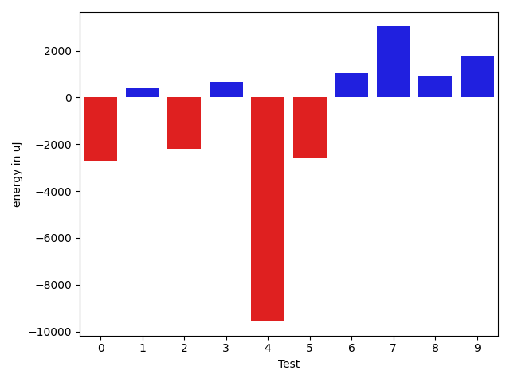
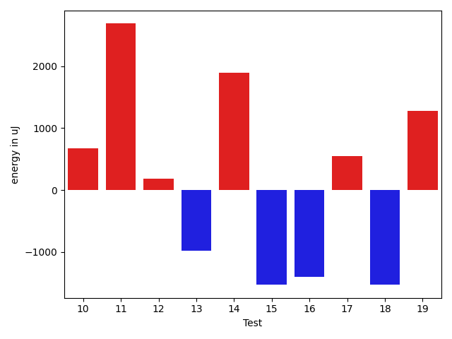
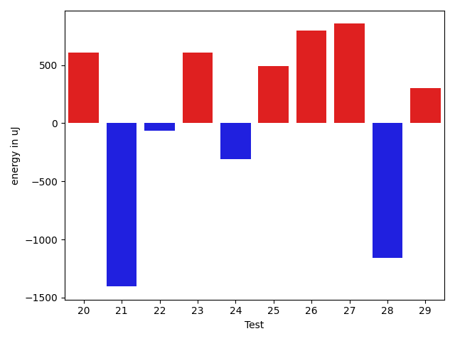
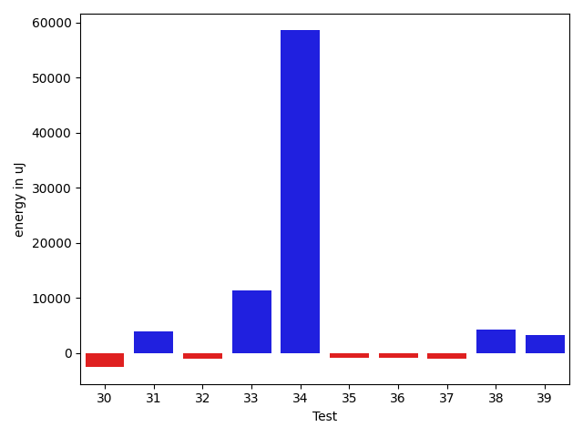
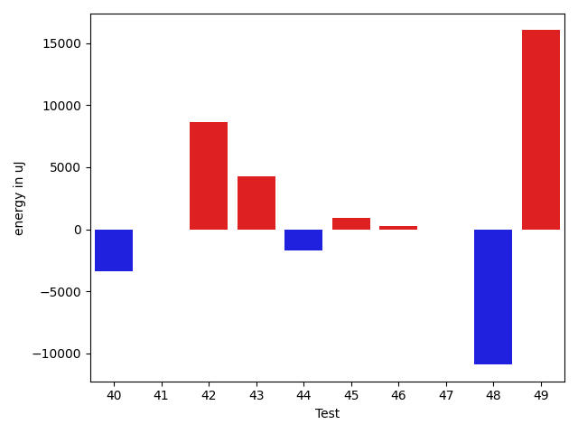
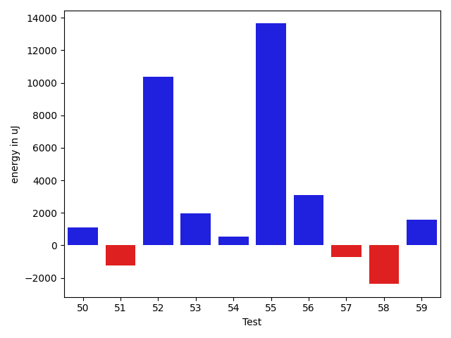
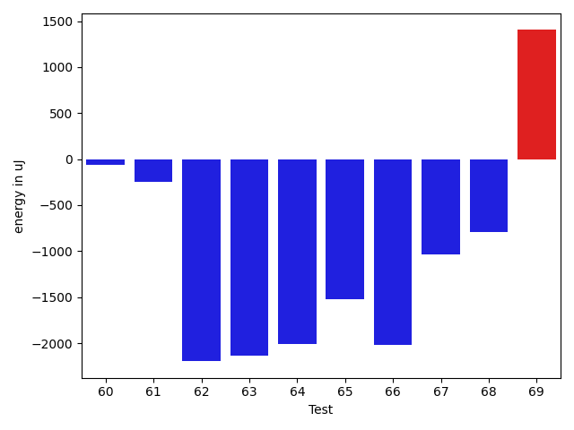
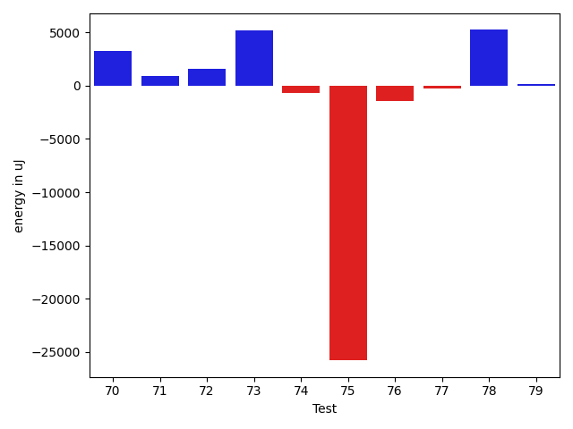
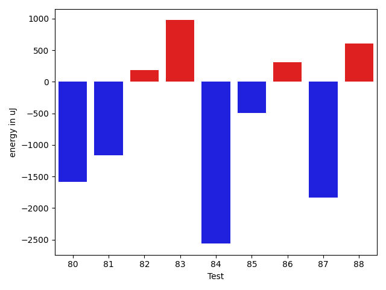

# gson 57ea7f

https://github.com/google/gson/commit/57ea7f

## Delta Energy per test method

| ID | EnergyV1 | EnergyV2 | DeltaEnergy | σV1 | σV2 |
| --- | --- | --- | --- | --- | --- |
| 0 | 40466 | 39673 | -793 | 15541.765260502774 | 13829.709126231572 |
| 1 | 36987 | 37231 | 244 | 4147.570537922584 | 4256.4559829011505 |
| 2 | 87890 | 87341 | -549 | 45445.39513477488 | 39033.33006478874 |
| 3 | 41992 | 40406 | -1586 | 21110.698478013273 | 20447.176036324 |
| 4 | 84655 | 81115 | -3540 | 76941.62544056487 | 47260.05628924931 |
| 5 | 78552 | 81298 | 2746 | 40402.691081989404 | 31480.685679919206 |
| 6 | 39185 | 39612 | 427 | 8941.814872775572 | 10209.322233801811 |
| 7 | 36865 | 39612 | 2747 | 4293.414131827071 | 3685.229747097036 |
| 8 | 87585 | 98693 | 11108 | 111440.4055214958 | 90430.84970926051 |
| 9 | 37414 | 38330 | 916 | 3972.958681978109 | 4384.845793804539 |
| 10 | 37903 | 38574 | 671 | 4020.801014213267 | 3936.3949315626405 |
| 11 | 37292 | 39977 | 2685 | 9210.798258584418 | 9952.86324925503 |
| 12 | 40161 | 40344 | 183 | 7859.4030201790765 | 13339.879622310844 |
| 13 | 41626 | 40649 | -977 | 147620.53119228824 | 107254.91327050107 |
| 14 | 128173 | 130065 | 1892 | 78101.29603971077 | 121416.14793074763 |
| 15 | 39612 | 38085 | -1527 | 4645.133080978412 | 3826.070419265372 |
| 16 | 39917 | 38513 | -1404 | 8056.968380431667 | 11603.4711527128 |
| 17 | 39490 | 40039 | 549 | 3750.7746955274447 | 4292.228980664115 |
| 18 | 43518 | 41992 | -1526 | 69293.37249465828 | 65581.81363306331 |
| 19 | 38940 | 40222 | 1282 | 9603.824632214319 | 7852.367285784756 |
| 20 | 43396 | 44006 | 610 | 655284.527966222 | 401963.8728042938 |
| 21 | 39429 | 38025 | -1404 | 3914.634176681146 | 4484.561200678363 |
| 22 | 39673 | 39611 | -62 | 31453.209806159677 | 40961.53903543196 |
| 23 | 40100 | 40710 | 610 | 18765.187345863254 | 17965.79249582166 |
| 24 | 37903 | 37597 | -306 | 4705.381072348028 | 4629.0051599956705 |
| 25 | 41320 | 41809 | 489 | 17720.104603881435 | 18284.807604247053 |
| 26 | 40832 | 41626 | 794 | 16020.738900227503 | 13553.092686547643 |
| 27 | 40283 | 41138 | 855 | 54537.52123873769 | 85947.42209462842 |
| 28 | 38269 | 37109 | -1160 | 3250.1059166026885 | 4581.954986684177 |
| 29 | 38696 | 39001 | 305 | 8888.91709037189 | 10215.725875439795 |
| 30 | 40649 | 38391 | -2258 | 7451.665937874638 | 4112.842685823679 |
| 31 | 40466 | 42236 | 1770 | 20076.80540736242 | 21367.20571016255 |
| 32 | 39856 | 41870 | 2014 | 18712.605119782278 | 13984.363962691346 |
| 33 | 89295 | 109497 | 20202 | 26125.749565810966 | 30625.81834068486 |
| 34 | 171508 | 186278 | 14770 | 333498.4165380912 | 443153.1270670573 |
| 35 | 39368 | 40162 | 794 | 13538.629385894043 | 10763.85332510725 |
| 36 | 41382 | 40161 | -1221 | 29042.820761554143 | 27846.345823897303 |
| 37 | 39734 | 38940 | -794 | 7484.476226551404 | 5057.21978483864 |
| 38 | 89356 | 88379 | -977 | 71547.76503974127 | 65376.34960148346 |
| 39 | 40649 | 40039 | -610 | 12489.81813703628 | 18397.791501189637 |
| 40 | 41016 | 39856 | -1160 | 19641.149311984198 | 15002.499114221679 |
| 41 | 37903 | 37659 | -244 | 4642.28097963464 | 4376.303095761897 |
| 42 | 41016 | 63781 | 22765 | 20216.229125507933 | 25581.08382141963 |
| 43 | 37475 | 40100 | 2625 | 3209.577435192988 | 13871.56819365483 |
| 44 | 39307 | 39185 | -122 | 8627.600007951176 | 5121.181485613818 |
| 45 | 38758 | 39124 | 366 | 4202.528262008522 | 5602.7379906885 |
| 46 | 38757 | 37659 | -1098 | 4167.025291766565 | 6819.694879254903 |
| 47 | 38147 | 38147 | 0 | 8037.043781071422 | 6090.224304121066 |
| 48 | 39185 | 38696 | -489 | 59079.28116948785 | 12835.366117420772 |
| 49 | 38574 | 40527 | 1953 | 65468.78192996007 | 111032.25815326738 |
| 50 | 40344 | 40100 | -244 | 8629.152147353445 | 12936.027635052891 |
| 51 | 39551 | 39551 | 0 | 7075.268676757411 | 6154.530163454557 |
| 52 | 45044 | 43762 | -1282 | 98877.01279407612 | 119382.22139547543 |
| 53 | 304870 | 296386 | -8484 | 107888.61611957075 | 121325.68550656195 |
| 54 | 37597 | 38757 | 1160 | 4672.744838778943 | 4794.715165910353 |
| 55 | 40772 | 42542 | 1770 | 35128.946676731946 | 56889.647576900185 |
| 56 | 40466 | 41687 | 1221 | 14655.50500126554 | 17294.963736828453 |
| 57 | 39856 | 40711 | 855 | 18886.405801165565 | 17573.37538304903 |
| 58 | 40649 | 41015 | 366 | 26099.738624403133 | 23976.93620977678 |
| 59 | 41016 | 42419 | 1403 | 19792.19943419762 | 26208.17824477695 |
| 60 | 40771 | 40710 | -61 | 17771.87967317381 | 13935.13126827767 |
| 61 | 40771 | 40528 | -243 | 486694.23795973795 | 432181.28986202274 |
| 62 | 38513 | 36316 | -2197 | 3875.2678933920884 | 4257.00081817896 |
| 63 | 40039 | 37903 | -2136 | 6984.991435884156 | 4391.84079566508 |
| 64 | 39001 | 36987 | -2014 | 13264.37231111413 | 4209.118184004401 |
| 65 | 41138 | 39612 | -1526 | 293188.11746007524 | 266460.1861077523 |
| 66 | 37903 | 35888 | -2015 | 4790.35686317243 | 5237.684034509094 |
| 67 | 40405 | 39367 | -1038 | 20647.980674490507 | 24133.342612238146 |
| 68 | 37842 | 37048 | -794 | 8236.420869203528 | 4111.964692593566 |
| 69 | 36316 | 37720 | 1404 | 4502.969968129651 | 4455.901625863727 |
| 70 | 40588 | 44861 | 4273 | 17418.792777054012 | 16048.260291205746 |
| 71 | 37842 | 38147 | 305 | 3898.044051645829 | 4358.28291733109 |
| 72 | 39673 | 39429 | -244 | 5376.039617381353 | 9175.072956488522 |
| 73 | 39367 | 41504 | 2137 | 9781.362143337134 | 15835.9454904894 |
| 74 | 41015 | 41321 | 306 | 20424.737614973972 | 18028.277215432347 |
| 75 | 123657 | 124939 | 1282 | 477015.1022241539 | 406245.57835776126 |
| 76 | 44556 | 45105 | 549 | 28721.828660261683 | 26117.03691188629 |
| 77 | 38574 | 39672 | 1098 | 4439.257269483237 | 4803.506905054712 |
| 78 | 40039 | 41199 | 1160 | 27281.10716153665 | 32700.411408848628 |
| 79 | 38452 | 38391 | -61 | 4085.0406385445467 | 3868.7239707956032 |
| 80 | 44983 | 43396 | -1587 | 139123.03374929432 | 118607.56402475013 |
| 81 | 41626 | 40466 | -1160 | 43990.36230729065 | 54226.781548310195 |
| 82 | 39977 | 40161 | 184 | 5432.237032055733 | 5256.438076302241 |
| 83 | 39246 | 40222 | 976 | 3802.10549041577 | 4883.2452160648645 |
| 84 | 40649 | 38085 | -2564 | 3801.570223880106 | 4813.149161211665 |
| 85 | 40528 | 40039 | -489 | 6350.411966015849 | 4902.675260441238 |
| 86 | 37170 | 37476 | 306 | 5146.164999453476 | 4790.398225588581 |
| 87 | 41321 | 39490 | -1831 | 546285.7131223367 | 53464.280786147385 |
| 88 | 39245 | 39856 | 611 | 7696.0768232350565 | 5109.039991267744 |

## Delta Duration per test method

| ID | DurationV1 | DurationsV2 | DeltaDuration |
| --- | --- | --- | --- |
| 0 | 1458898.7717391304 | 1382361.0 | -76537.77173913037 |
| 1 | 734760.0487804879 | 713652.2 | -21107.848780487897 |
| 2 | 2838224.404040404 | 2816161.4646464647 | -22062.93939393945 |
| 3 | 1656238.2448979593 | 1599292.5555555555 | -56945.689342403784 |
| 4 | 3067926.121212121 | 2731331.202020202 | -336594.91919191927 |
| 5 | 2718917.767676768 | 2603111.0404040404 | -115806.72727272753 |
| 6 | 1061033.6301369863 | 1078332.0133333334 | 17298.38319634716 |
| 7 | 581489.5217391305 | 535801.1 | -45688.421739130514 |
| 8 | 3716280.404040404 | 3756985.717171717 | 40705.31313131284 |
| 9 | 662048.9696969697 | 686357.0303030303 | 24308.06060606055 |
| 10 | 617786.03125 | 601221.3548387097 | -16564.676411290304 |
| 11 | 1081781.3396226414 | 1020799.7540983607 | -60981.58552428079 |
| 12 | 1138588.8933333333 | 1218088.1739130435 | 79499.28057971015 |
| 13 | 2846374.644444444 | 2007989.2954545454 | -838385.3489898988 |
| 14 | 4461465.333333333 | 5117035.414141414 | 655570.0808080807 |
| 15 | 677652.425 | 719444.7027027027 | 41792.277702702675 |
| 16 | 961633.0784313725 | 1011103.9629629629 | 49470.88453159039 |
| 17 | 836111.7843137255 | 849441.9411764706 | 13330.156862745062 |
| 18 | 1941817.1326530613 | 1924724.06185567 | -17093.070797391236 |
| 19 | 938322.0 | 927331.737704918 | -10990.262295081979 |
| 20 | 6555914.731707317 | 3874834.7564102565 | -2681079.9752970603 |
| 21 | 533014.8260869565 | 569237.7058823529 | 36222.87979539635 |
| 22 | 1031602.2162162162 | 1229221.7435897435 | 197619.5273735273 |
| 23 | 1285992.7105263157 | 1376256.6216216215 | 90263.91109530581 |
| 24 | 520273.94736842107 | 537639.3478260869 | 17365.400457665848 |
| 25 | 1283491.675 | 1329353.5487804879 | 45861.873780487804 |
| 26 | 1027730.8478260869 | 1101415.076923077 | 73684.22909699008 |
| 27 | 1232190.2258064516 | 1890419.3333333333 | 658229.1075268816 |
| 28 | 614249.3333333334 | 611421.625 | -2827.708333333372 |
| 29 | 1026450.6885245901 | 1052869.7692307692 | 26419.080706179142 |
| 30 | 918095.4821428572 | 912071.6458333334 | -6023.836309523787 |
| 31 | 1560670.3263157895 | 1607285.7032967033 | 46615.3769809138 |
| 32 | 1286579.865671642 | 1178440.0142857144 | -108139.85138592753 |
| 33 | 2809436.9595959596 | 2922869.777777778 | 113432.81818181835 |
| 34 | 7419035.858585859 | 9031540.666666666 | 1612504.8080808073 |
| 35 | 1297441.6 | 1246918.987341772 | -50522.61265822803 |
| 36 | 1165343.9791666667 | 1163615.3653846155 | -1728.6137820512522 |
| 37 | 1075624.5 | 1062890.31147541 | -12734.188524590107 |
| 38 | 3384969.5656565656 | 3503118.1818181816 | 118148.61616161605 |
| 39 | 1292266.626506024 | 1378884.4352941175 | 86617.8087880935 |
| 40 | 1368778.780487805 | 1369704.5333333334 | 925.7528455285355 |
| 41 | 675813.0357142857 | 631027.9189189189 | -44785.11679536675 |
| 42 | 1713023.6989247312 | 1805640.5319148935 | 92616.83299016231 |
| 43 | 787365.25 | 825805.3076923077 | 38440.057692307746 |
| 44 | 972494.2631578947 | 958618.9375 | -13875.325657894718 |
| 45 | 843061.9756097561 | 918379.7872340425 | 75317.81162428646 |
| 46 | 886253.0333333333 | 888833.4310344828 | 2580.397701149457 |
| 47 | 774539.8979591837 | 848272.4324324324 | 73732.53447324876 |
| 48 | 1215946.0952380951 | 795362.756097561 | -420583.33914053417 |
| 49 | 1301924.1132075472 | 1721201.213114754 | 419277.09990720684 |
| 50 | 953555.0769230769 | 933749.1153846154 | -19805.961538461503 |
| 51 | 844697.3170731707 | 838106.2058823529 | -6591.1111908177845 |
| 52 | 2601302.0 | 3022313.551020408 | 421011.55102040805 |
| 53 | 8710400.565656565 | 8996221.676767677 | 285821.11111111194 |
| 54 | 852009.5882352941 | 940735.3636363636 | 88725.77540106955 |
| 55 | 1385889.3043478262 | 1785251.9846153846 | 399362.68026755843 |
| 56 | 1390452.5632183908 | 1416214.0114942528 | 25761.44827586203 |
| 57 | 1583398.4329896907 | 1521013.1063829786 | -62385.32660671207 |
| 58 | 1542921.042105263 | 1474922.9895833333 | -67998.05252192984 |
| 59 | 1322641.5681818181 | 1421870.1125 | 99228.54431818193 |
| 60 | 1447802.9772727273 | 1373053.712643678 | -74749.26462904923 |
| 61 | 4316225.15 | 4604526.666666667 | 288301.5166666666 |
| 62 | 671780.7 | 648013.3076923077 | -23767.392307692207 |
| 63 | 757361.175 | 707430.8085106383 | -49930.36648936174 |
| 64 | 939788.2727272727 | 863600.358974359 | -76187.91375291371 |
| 65 | 2217110.6666666665 | 2342184.0508474577 | 125073.38418079121 |
| 66 | 546185.9444444445 | 524019.04761904763 | -22166.896825396863 |
| 67 | 1211954.8070175438 | 1286931.3818181818 | 74976.57480063802 |
| 68 | 814502.9354838709 | 719019.2564102564 | -95483.67907361453 |
| 69 | 673852.4 | 625261.05 | -48591.34999999998 |
| 70 | 1091824.1785714286 | 1069913.652173913 | -21910.526397515554 |
| 71 | 447738.8095238095 | 488199.25 | 40460.44047619047 |
| 72 | 986189.6811594203 | 1191179.303030303 | 204989.6218708827 |
| 73 | 1061540.554054054 | 1242414.5076923077 | 180873.95363825373 |
| 74 | 1313275.8717948718 | 1346186.0985915493 | 32910.22679667757 |
| 75 | 6267210.666666667 | 5379640.05050505 | -887570.6161616165 |
| 76 | 1891874.7878787878 | 1871541.606060606 | -20333.18181818188 |
| 77 | 890624.6923076923 | 900480.0769230769 | 9855.384615384624 |
| 78 | 1221875.431372549 | 1320324.559322034 | 98449.12794948509 |
| 79 | 775644.3829787234 | 755481.7777777778 | -20162.605200945633 |
| 80 | 2902994.315217391 | 2411670.965909091 | -491323.3493083003 |
| 81 | 1298434.6530612244 | 1569153.7209302327 | 270719.0678690083 |
| 82 | 646664.4210526316 | 614704.2142857143 | -31960.206766917254 |
| 83 | 671779.0645161291 | 679873.9090909091 | 8094.844574779971 |
| 84 | 661869.3214285715 | 598295.5714285715 | -63573.75 |
| 85 | 802891.8055555555 | 858959.6764705882 | 56067.87091503269 |
| 86 | 675855.68 | 896905.625 | 221049.94499999995 |
| 87 | 4369938.966101695 | 1607750.0196078431 | -2762188.946493852 |
| 88 | 941443.1777777778 | 830194.8148148148 | -111248.36296296294 |

## Misc.

| ID | Test Class | Test Method |
| --- | --- | --- |
| 0 | com.google.gson.functional.ParameterizedTypesTest | testParameterizedTypeGenericArraysSerialization |
| 1 | com.google.gson.functional.ParameterizedTypesTest | testDeepParameterizedTypeSerialization |
| 2 | com.google.gson.functional.ParameterizedTypesTest | testVariableTypeFieldsAndGenericArraysSerialization |
| 3 | com.google.gson.functional.ParameterizedTypesTest | testParameterizedTypeGenericArraysDeserialization |
| 4 | com.google.gson.functional.ParameterizedTypesTest | testVariableTypeFieldsAndGenericArraysDeserialization |
| 5 | com.google.gson.functional.ParameterizedTypesTest | testTypesWithMultipleParametersSerialization |
| 6 | com.google.gson.functional.PrettyPrintingTest | testEmptyMapField |
| 7 | com.google.gson.functional.PrettyPrintingTest | testPrettyPrintArrayOfPrimitives |
| 8 | com.google.gson.functional.PrettyPrintingTest | testPrettyPrintList |
| 9 | com.google.gson.functional.PrettyPrintingTest | testPrettyPrintArrayOfPrimitiveArrays |
| 10 | com.google.gson.functional.PrettyPrintingTest | testMultipleArrays |
| 11 | com.google.gson.functional.PrettyPrintingTest | testPrettyPrintArrayOfObjects |
| 12 | com.google.gson.functional.ReadersWritersTest | testReadWriteTwoObjects |
| 13 | com.google.gson.functional.ReadersWritersTest | testWriterForSerialization |
| 14 | com.google.gson.functional.ExposeFieldsTest | testNullExposeFieldSerialization |
| 15 | com.google.gson.functional.ExposeFieldsTest | testExposeAnnotationSerialization |
| 16 | com.google.gson.functional.ExposeFieldsTest | testArrayWithOneNullExposeFieldObjectSerialization |
| 17 | com.google.gson.functional.ExposeFieldsTest | testExposedInterfaceFieldSerialization |
| 18 | com.google.gson.functional.MoreSpecificTypeSerializationTest | testSubclassFields |
| 19 | com.google.gson.functional.MoreSpecificTypeSerializationTest | testParameterizedSubclassFields |
| 20 | com.google.gson.JsonParserTest | testReadWriteTwoObjects |
| 21 | com.google.gson.functional.ArrayTest | testMultiDimenstionalObjectArraysSerialization |
| 22 | com.google.gson.functional.ArrayTest | testSingleNullInArraySerialization |
| 23 | com.google.gson.functional.ArrayTest | testObjectArrayWithNonPrimitivesSerialization |
| 24 | com.google.gson.functional.ArrayTest | testArrayOfNullSerialization |
| 25 | com.google.gson.functional.ArrayTest | testArrayOfCollectionSerialization |
| 26 | com.google.gson.functional.ArrayTest | testArrayOfPrimitivesAsObjectsSerialization |
| 27 | com.google.gson.functional.ArrayTest | testTopLevelArrayOfIntsSerialization |
| 28 | com.google.gson.functional.ArrayTest | testMixingTypesInObjectArraySerialization |
| 29 | com.google.gson.functional.InheritanceTest | testClassWithBaseArrayFieldSerialization |
| 30 | com.google.gson.functional.InheritanceTest | testClassWithBaseFieldSerialization |
| 31 | com.google.gson.functional.InheritanceTest | testSubClassSerialization |
| 32 | com.google.gson.functional.CustomTypeAdaptersTest | testCustomNestedSerializers |
| 33 | com.google.gson.functional.CustomTypeAdaptersTest | testCustomTypeAdapterDoesNotAppliesToSubClasses |
| 34 | com.google.gson.functional.VersioningTest | testVersionedUntilSerialization |
| 35 | com.google.gson.functional.VersioningTest | testVersionedGsonMixingSinceAndUntilSerialization |
| 36 | com.google.gson.functional.VersioningTest | testVersionedGsonWithUnversionedClassesSerialization |
| 37 | com.google.gson.functional.VersioningTest | testVersionedClassesSerialization |
| 38 | com.google.gson.functional.MapAsArrayTypeAdapterTest | testMultipleEnableComplexKeyRegistrationHasNoEffect |
| 39 | com.google.gson.functional.MapAsArrayTypeAdapterTest | testMapWithTypeVariableSerialization |
| 40 | com.google.gson.functional.ObjectTest | testArrayOfObjectsAsFields |
| 41 | com.google.gson.functional.ObjectTest | testPrimitiveArrayFieldSerialization |
| 42 | com.google.gson.functional.ObjectTest | testArrayOfArraysSerialization |
| 43 | com.google.gson.functional.ObjectTest | testBagOfPrimitivesSerialization |
| 44 | com.google.gson.functional.ObjectTest | testNestedSerialization |
| 45 | com.google.gson.functional.ObjectTest | testNullFieldsSerialization |
| 46 | com.google.gson.functional.ObjectTest | testInnerClassSerialization |
| 47 | com.google.gson.functional.ObjectTest | testClassWithTransientFieldsSerialization |
| 48 | com.google.gson.functional.ObjectTest | testClassWithObjectFieldSerialization |
| 49 | com.google.gson.functional.ObjectTest | testArrayOfObjectsSerialization |
| 50 | com.google.gson.functional.UncategorizedTest | testGsonInstanceReusableForSerializationAndDeserialization |
| 51 | com.google.gson.functional.UncategorizedTest | testStaticFieldsAreNotSerialized |
| 52 | com.google.gson.functional.ConcurrencyTest | testSingleThreadSerialization |
| 53 | com.google.gson.functional.ConcurrencyTest | testMultiThreadSerialization |
| 54 | com.google.gson.functional.EscapingTest | testGsonDoubleDeserialization |
| 55 | com.google.gson.functional.EscapingTest | testEscapingObjectFields |
| 56 | com.google.gson.functional.EscapingTest | testGsonAcceptsEscapedAndNonEscapedJsonDeserialization |
| 57 | com.google.gson.functional.RawSerializationTest | testThreeLevelParameterizedObject |
| 58 | com.google.gson.functional.RawSerializationTest | testParameterizedObject |
| 59 | com.google.gson.functional.RawSerializationTest | testCollectionOfObjects |
| 60 | com.google.gson.functional.RawSerializationTest | testTwoLevelParameterizedObject |
| 61 | com.google.gson.functional.SecurityTest | testNonExecutableJsonSerialization |
| 62 | com.google.gson.MixedStreamTest | testWriteClosed |
| 63 | com.google.gson.MixedStreamTest | testWriteInvalidState |
| 64 | com.google.gson.MixedStreamTest | testWriteDoesNotMutateState |
| 65 | com.google.gson.MixedStreamTest | testWriteMixedStreamed |
| 66 | com.google.gson.internal.bind.MiniGsonTest | testSerializeNullObject |
| 67 | com.google.gson.internal.bind.MiniGsonTest | testSerializeWithCustomTypeAdapter |
| 68 | com.google.gson.internal.bind.MiniGsonTest | testSerialize1dArray |
| 69 | com.google.gson.internal.bind.MiniGsonTest | testSerialize2dArray |
| 70 | com.google.gson.internal.bind.MiniGsonTest | testSerialize |
| 71 | com.google.gson.internal.bind.MiniGsonTest | testSerializeNullField |
| 72 | com.google.gson.functional.NamingPolicyTest | testGsonWithSerializedNameFieldNamingPolicySerialization |
| 73 | com.google.gson.functional.NamingPolicyTest | testComplexFieldNameStrategy |
| 74 | com.google.gson.functional.JsonTreeTest | testJsonTreeToString |
| 75 | com.google.gson.functional.TypeHierarchyAdapterTest | testTypeHierarchy |
| 76 | com.google.gson.functional.CollectionTest | testWildcardCollectionField |
| 77 | com.google.gson.functional.CollectionTest | testRawCollectionSerialization |
| 78 | com.google.gson.functional.CollectionTest | testCollectionOfBagOfPrimitivesSerialization |
| 79 | com.google.gson.functional.CollectionTest | testSetSerialization |
| 80 | com.google.gson.functional.PrintFormattingTest | testCompactFormattingLeavesNoWhiteSpace |
| 81 | com.google.gson.functional.NullObjectAndFieldTest | testExplicitSerializationOfNulls |
| 82 | com.google.gson.functional.PrimitiveTest | testPrimitiveLongAutoboxedInASingleElementArraySerialization |
| 83 | com.google.gson.functional.PrimitiveTest | testPrimitiveDoubleAutoboxedInASingleElementArraySerialization |
| 84 | com.google.gson.functional.PrimitiveTest | testPrimitiveBooleanAutoboxedInASingleElementArraySerialization |
| 85 | com.google.gson.functional.PrimitiveTest | testPrimitiveIntegerAutoboxedInASingleElementArraySerialization |
| 86 | com.google.gson.functional.CustomSerializerTest | testBaseClassSerializerInvokedForBaseClassFieldsHoldingSubClassInstances |
| 87 | com.google.gson.functional.ExclusionStrategyFunctionalTest | testExclusionStrategyWithMode |
| 88 | com.google.gson.functional.InterfaceTest | testSerializingInterfaceObjectField |

| Test | IterationV1 | IterationV2 | DeltaIteration |
| --- | --- | --- | --- |
| 0 | 92 | 90 | -2 |
| 1 | 41 | 40 | -1 |
| 2 | 99 | 99 | 0 |
| 3 | 98 | 99 | 1 |
| 4 | 99 | 99 | 0 |
| 5 | 99 | 99 | 0 |
| 6 | 73 | 75 | 2 |
| 7 | 23 | 30 | 7 |
| 8 | 99 | 99 | 0 |
| 9 | 33 | 33 | 0 |
| 10 | 32 | 31 | -1 |
| 11 | 53 | 61 | 8 |
| 12 | 75 | 69 | -6 |
| 13 | 45 | 44 | -1 |
| 14 | 99 | 99 | 0 |
| 15 | 40 | 37 | -3 |
| 16 | 51 | 54 | 3 |
| 17 | 51 | 51 | 0 |
| 18 | 98 | 97 | -1 |
| 19 | 56 | 61 | 5 |
| 20 | 82 | 78 | -4 |
| 21 | 23 | 17 | -6 |
| 22 | 37 | 39 | 2 |
| 23 | 76 | 74 | -2 |
| 24 | 19 | 23 | 4 |
| 25 | 80 | 82 | 2 |
| 26 | 46 | 39 | -7 |
| 27 | 31 | 30 | -1 |
| 28 | 27 | 24 | -3 |
| 29 | 61 | 65 | 4 |
| 30 | 56 | 48 | -8 |
| 31 | 95 | 91 | -4 |
| 32 | 67 | 70 | 3 |
| 33 | 99 | 99 | 0 |
| 34 | 99 | 99 | 0 |
| 35 | 80 | 79 | -1 |
| 36 | 48 | 52 | 4 |
| 37 | 68 | 61 | -7 |
| 38 | 99 | 99 | 0 |
| 39 | 83 | 85 | 2 |
| 40 | 82 | 90 | 8 |
| 41 | 28 | 37 | 9 |
| 42 | 93 | 94 | 1 |
| 43 | 32 | 39 | 7 |
| 44 | 57 | 64 | 7 |
| 45 | 41 | 47 | 6 |
| 46 | 60 | 58 | -2 |
| 47 | 49 | 37 | -12 |
| 48 | 42 | 41 | -1 |
| 49 | 53 | 61 | 8 |
| 50 | 52 | 52 | 0 |
| 51 | 41 | 34 | -7 |
| 52 | 99 | 98 | -1 |
| 53 | 99 | 99 | 0 |
| 54 | 51 | 44 | -7 |
| 55 | 69 | 65 | -4 |
| 56 | 87 | 87 | 0 |
| 57 | 97 | 94 | -3 |
| 58 | 95 | 96 | 1 |
| 59 | 88 | 80 | -8 |
| 60 | 88 | 87 | -1 |
| 61 | 40 | 48 | 8 |
| 62 | 30 | 26 | -4 |
| 63 | 40 | 47 | 7 |
| 64 | 44 | 39 | -5 |
| 65 | 63 | 59 | -4 |
| 66 | 18 | 21 | 3 |
| 67 | 57 | 55 | -2 |
| 68 | 31 | 39 | 8 |
| 69 | 35 | 40 | 5 |
| 70 | 28 | 23 | -5 |
| 71 | 21 | 20 | -1 |
| 72 | 69 | 66 | -3 |
| 73 | 74 | 65 | -9 |
| 74 | 78 | 71 | -7 |
| 75 | 99 | 99 | 0 |
| 76 | 99 | 99 | 0 |
| 77 | 52 | 52 | 0 |
| 78 | 51 | 59 | 8 |
| 79 | 47 | 54 | 7 |
| 80 | 92 | 88 | -4 |
| 81 | 49 | 43 | -6 |
| 82 | 38 | 28 | -10 |
| 83 | 31 | 33 | 2 |
| 84 | 28 | 21 | -7 |
| 85 | 36 | 34 | -2 |
| 86 | 25 | 48 | 23 |
| 87 | 59 | 51 | -8 |
| 88 | 45 | 54 | 9 |

| Time Label | Time (s) |
| --- | --- |
| Selection | 29.410964012145996 |
| Injection | 14.697782754898071 |
| Total | 1205.2770862579346 |

