# gson f7121a

https://github.com/google/gson/commit/f7121a

## Delta Energy per test method

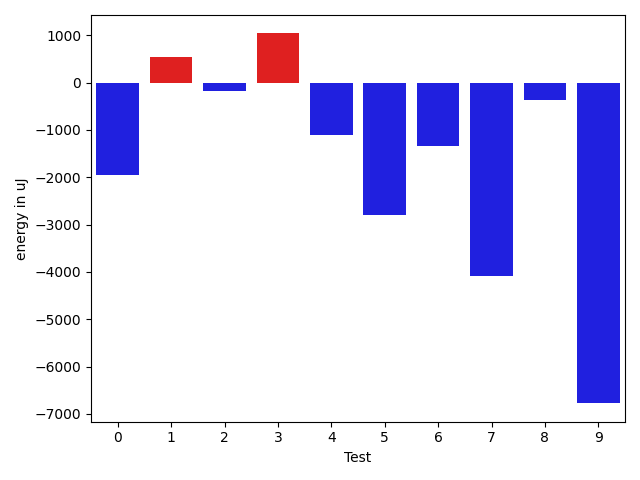

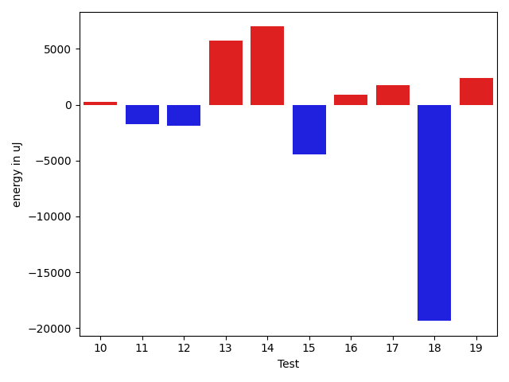

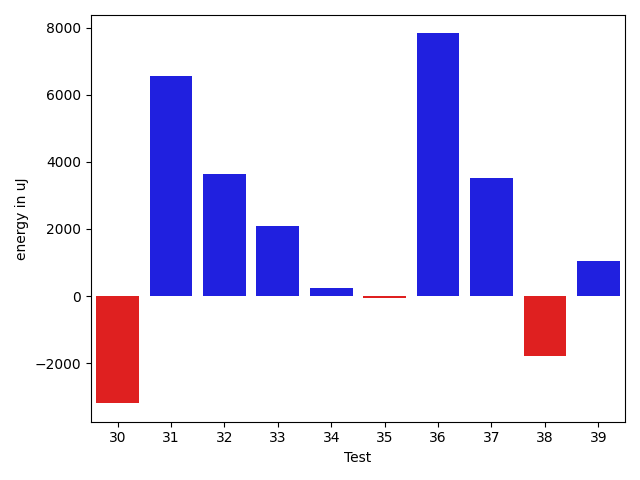

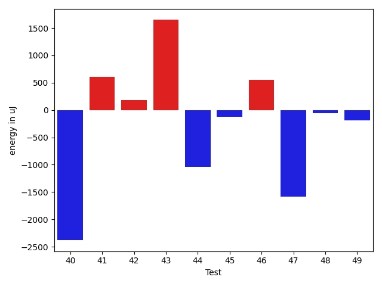

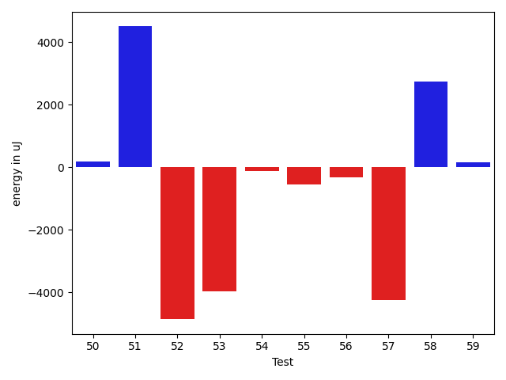

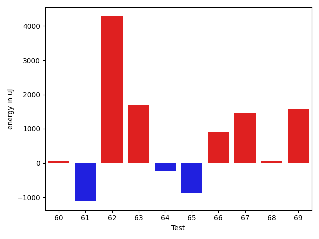

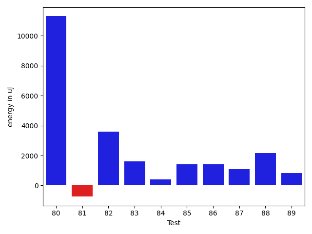

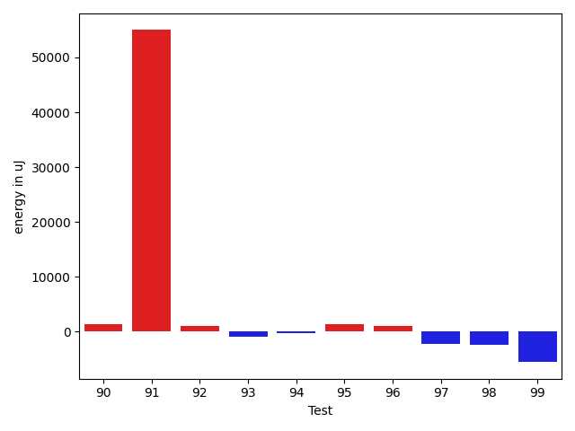

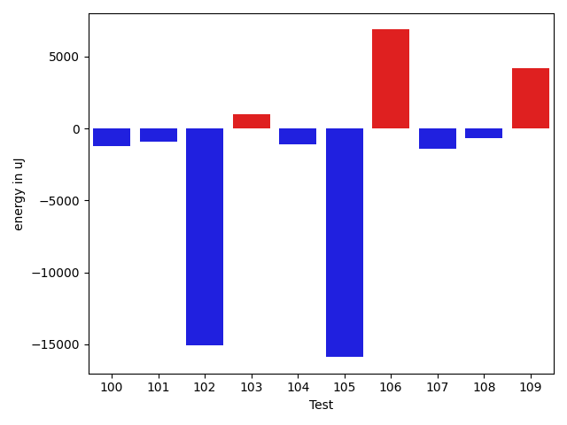

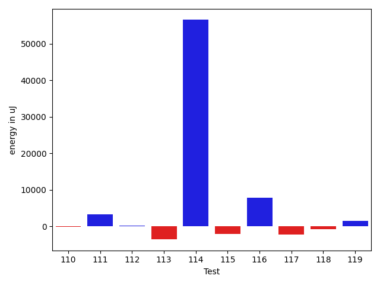

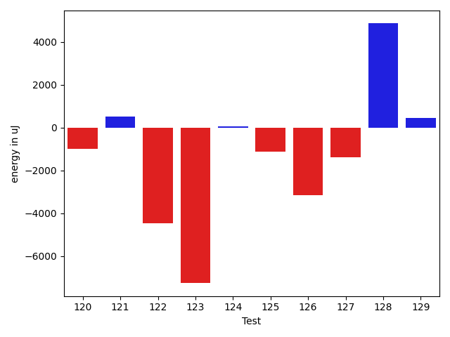

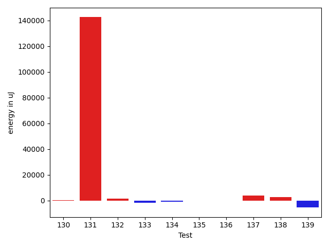

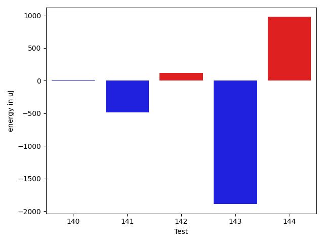

| ID | EnergyV1 | EnergyV2 | DeltaEnergy | σV1 | σV2 |
| --- | --- | --- | --- | --- | --- |
| 0 | 43762 | 41809 | -1953 | 111253.40299975827 | 67570.40072312742 |
| 1 | 40649 | 41199 | 550 | 5027.956222800011 | 5127.694596878603 |
| 2 | 40283 | 40100 | -183 | 13119.511142454594 | 11394.039389131505 |
| 3 | 39368 | 40405 | 1037 | 8145.045015410016 | 7092.238375735304 |
| 4 | 41687 | 40588 | -1099 | 17981.41270131443 | 13934.165776996715 |
| 5 | 80445 | 77637 | -2808 | 101021.0592189136 | 65085.84325046045 |
| 6 | 41565 | 40222 | -1343 | 16160.986837843906 | 12621.457404405053 |
| 7 | 83069 | 78980 | -4089 | 37822.45319792186 | 45584.91929705982 |
| 8 | 41137 | 40772 | -365 | 15222.821627101352 | 16275.246957103027 |
| 9 | 80810 | 74035 | -6775 | 31914.309352620327 | 34851.349787425876 |
| 10 | 81848 | 81603 | -245 | 37130.009177170774 | 40188.47448587578 |
| 11 | 42481 | 40406 | -2075 | 16051.38065525776 | 16392.02442709706 |
| 12 | 41565 | 38635 | -2930 | 3841.943951506282 | 3665.5130955679874 |
| 13 | 41748 | 42419 | 671 | 21884.597531256237 | 27428.29434341637 |
| 14 | 42114 | 44251 | 2137 | 23860.254896870174 | 29498.36178559792 |
| 15 | 38574 | 39429 | 855 | 29269.552780374303 | 4128.916741511426 |
| 16 | 39672 | 41443 | 1771 | 6619.460089068384 | 4275.994287636057 |
| 17 | 39307 | 41564 | 2257 | 4603.626244077131 | 4630.668089388575 |
| 18 | 85693 | 80505 | -5188 | 97775.17869751863 | 94344.82887635227 |
| 19 | 38879 | 41260 | 2381 | 4360.100059344968 | 8330.258414317499 |
| 20 | 41443 | 41504 | 61 | 8843.599420438697 | 8231.77148715729 |
| 21 | 39246 | 40405 | 1159 | 4173.0324099388445 | 4022.0349093624463 |
| 22 | 40894 | 42602 | 1708 | 3580.516663687989 | 3648.742425235616 |
| 23 | 130493 | 127685 | -2808 | 105538.50138748517 | 112090.89018150528 |
| 24 | 40649 | 41381 | 732 | 4309.87860818422 | 3679.2601524603356 |
| 25 | 41016 | 40711 | -305 | 5523.458318200603 | 9677.939889606521 |
| 26 | 40466 | 40161 | -305 | 4415.913021376018 | 4090.1388212190286 |
| 27 | 41138 | 41626 | 488 | 4618.450389470477 | 4543.460174701395 |
| 28 | 42785 | 40955 | -1830 | 15456.70847967391 | 16725.116309733297 |
| 29 | 43152 | 43945 | 793 | 25550.323830566893 | 22688.49413368477 |
| 30 | 43945 | 42664 | -1281 | 26905.248347674722 | 24887.433771194654 |
| 31 | 42236 | 42847 | 611 | 61647.2100383295 | 74187.64530668865 |
| 32 | 70801 | 76477 | 5676 | 46089.90412456962 | 50159.21345084009 |
| 33 | 43029 | 43456 | 427 | 24754.825766290287 | 24991.203692222924 |
| 34 | 39672 | 40405 | 733 | 4031.2424015432266 | 4976.076624168884 |
| 35 | 40406 | 40345 | -61 | 4684.993981166522 | 4039.4475884894287 |
| 36 | 44983 | 45166 | 183 | 111060.57141086673 | 122915.56945235179 |
| 37 | 41504 | 41626 | 122 | 9544.924196414288 | 13173.895137431005 |
| 38 | 40649 | 40039 | -610 | 15722.720320706743 | 7080.456720727554 |
| 39 | 38757 | 40649 | 1892 | 3045.7759051292546 | 4894.006980878643 |
| 40 | 41321 | 38940 | -2381 | 4621.29012059384 | 3604.4012016090364 |
| 41 | 40649 | 41259 | 610 | 4700.097863408786 | 4565.012794173099 |
| 42 | 43518 | 43701 | 183 | 71893.0406837524 | 76960.02787365671 |
| 43 | 40222 | 41870 | 1648 | 5671.500668642347 | 6452.189788312182 |
| 44 | 42114 | 41077 | -1037 | 12340.125449258945 | 10343.815214806627 |
| 45 | 39307 | 39184 | -123 | 7990.393765580472 | 6507.632090811749 |
| 46 | 43334 | 43884 | 550 | 4698.312146509816 | 5613.230120191245 |
| 47 | 41748 | 40161 | -1587 | 12463.779117340258 | 7304.910873808052 |
| 48 | 83069 | 83008 | -61 | 38782.99765385967 | 36624.80101560568 |
| 49 | 42114 | 41931 | -183 | 15389.375019970961 | 15422.650853524896 |
| 50 | 39795 | 39123 | -672 | 4278.163033180908 | 4670.313888005816 |
| 51 | 40100 | 40161 | 61 | 3708.3975832487763 | 27165.43161828623 |
| 52 | 45471 | 44067 | -1404 | 24910.506093298587 | 21454.690772064085 |
| 53 | 42297 | 40222 | -2075 | 9576.865778597623 | 5689.925204615697 |
| 54 | 39917 | 40710 | 793 | 4265.461058942101 | 4598.2682435354045 |
| 55 | 39917 | 39550 | -367 | 4015.2008691002457 | 4514.069722531604 |
| 56 | 40955 | 40222 | -733 | 3417.5896645963153 | 4915.752025641652 |
| 57 | 41992 | 39306 | -2686 | 15972.232582615903 | 4805.555387294282 |
| 58 | 39550 | 42541 | 2991 | 16280.915379906677 | 21248.89209566649 |
| 59 | 41260 | 40405 | -855 | 7275.406295183795 | 5660.893716214975 |
| 60 | 39978 | 40039 | 61 | 4381.048859186115 | 4761.229963510699 |
| 61 | 43151 | 42053 | -1098 | 461428.03320134286 | 619824.6491094417 |
| 62 | 85876 | 90149 | 4273 | 59186.6261754464 | 46110.10890568082 |
| 63 | 39489 | 41198 | 1709 | 23860.70208079055 | 3967.1354721511593 |
| 64 | 39734 | 39490 | -244 | 5456.454920448706 | 5009.378614718596 |
| 65 | 41443 | 40588 | -855 | 9643.606126283184 | 24938.974203112437 |
| 66 | 39978 | 40893 | 915 | 5382.212234862448 | 4242.969167402603 |
| 67 | 39795 | 41259 | 1464 | 6076.203358247684 | 4241.439514936095 |
| 68 | 42725 | 42785 | 60 | 349632.85697700153 | 514449.37289944605 |
| 69 | 40588 | 42175 | 1587 | 4179.170863326275 | 5189.516888811155 |
| 70 | 40161 | 41870 | 1709 | 21516.355509151937 | 16749.08344059149 |
| 71 | 86487 | 90210 | 3723 | 27943.50731795582 | 37374.45659580691 |
| 72 | 40039 | 41992 | 1953 | 3783.3091608273303 | 4007.599311141003 |
| 73 | 41138 | 41809 | 671 | 5894.852069980551 | 10602.036343128395 |
| 74 | 87829 | 91370 | 3541 | 458213.819847847 | 582228.1456906673 |
| 75 | 45166 | 44373 | -793 | 24806.880192054366 | 31566.78149269626 |
| 76 | 179687 | 181580 | 1893 | 280197.739354598 | 261998.3367214078 |
| 77 | 42175 | 41809 | -366 | 29224.637720498344 | 19457.117504633115 |
| 78 | 40527 | 41260 | 733 | 6377.076400165966 | 8328.844254104579 |
| 79 | 41260 | 41382 | 122 | 8226.286986818914 | 11902.20803802486 |
| 80 | 87951 | 87158 | -793 | 56775.47673656666 | 94015.61385976491 |
| 81 | 43091 | 41260 | -1831 | 13595.086625173957 | 15554.090122466316 |
| 82 | 40039 | 41565 | 1526 | 5463.371761066194 | 10559.654916862737 |
| 83 | 41809 | 41626 | -183 | 4043.9309186191367 | 14809.543364687599 |
| 84 | 41443 | 42236 | 793 | 6368.014564711984 | 4607.352521970507 |
| 85 | 40832 | 42725 | 1893 | 3344.142092253622 | 3220.856746387197 |
| 86 | 40528 | 41809 | 1281 | 4365.576223134811 | 3903.3048295993276 |
| 87 | 41382 | 41260 | -122 | 3050.6853507654637 | 3841.775539564863 |
| 88 | 39184 | 43213 | 4029 | 3328.2160947366215 | 5094.53537026576 |
| 89 | 41870 | 42297 | 427 | 10406.530638230448 | 12486.418172395033 |
| 90 | 42663 | 44067 | 1404 | 71277.77887311245 | 68184.11253965698 |
| 91 | 327392 | 382384 | 54992 | 173886.8495127015 | 192383.87846832452 |
| 92 | 40710 | 41687 | 977 | 4648.757683510725 | 3709.2722294571777 |
| 93 | 40772 | 39917 | -855 | 3576.133456681951 | 4290.426578834988 |
| 94 | 41382 | 41077 | -305 | 13482.784033849128 | 13916.962478534108 |
| 95 | 39978 | 41320 | 1342 | 5091.165817509537 | 4499.781454531537 |
| 96 | 41381 | 42481 | 1100 | 4229.634563410887 | 4644.381526102265 |
| 97 | 43640 | 41443 | -2197 | 11700.151626937719 | 13536.430978161978 |
| 98 | 45044 | 42663 | -2381 | 47344.163593940095 | 38319.56985832072 |
| 99 | 40467 | 34912 | -5555 | 4370.458415936719 | 4495.163408483113 |
| 100 | 41076 | 41870 | 794 | 17776.103050246227 | 14214.18983587652 |
| 101 | 40833 | 40100 | -733 | 4469.7019561027655 | 3848.281698526951 |
| 102 | 42420 | 41381 | -1039 | 83591.83300991745 | 67192.8131208663 |
| 103 | 39307 | 40954 | 1647 | 4746.788964040407 | 4714.495072380499 |
| 104 | 38696 | 39306 | 610 | 4007.2213577490324 | 4398.0544797213715 |
| 105 | 68603 | 75988 | 7385 | 104831.44606201256 | 36152.80383023329 |
| 106 | 40771 | 41992 | 1221 | 11996.916821618952 | 28660.061722575334 |
| 107 | 40832 | 40772 | -60 | 11159.013114702462 | 4127.07924409916 |
| 108 | 41382 | 41443 | 61 | 12841.386095582604 | 13851.432733443407 |
| 109 | 40954 | 42664 | 1710 | 339255.21620262286 | 338448.92951959156 |
| 110 | 42541 | 43030 | 489 | 26637.33248040136 | 27461.259590787842 |
| 111 | 40772 | 41626 | 854 | 14631.021987885877 | 20147.456034495746 |
| 112 | 41015 | 42175 | 1160 | 10931.43120952154 | 11866.967560345096 |
| 113 | 43823 | 43029 | -794 | 33060.33576035483 | 31638.195888454462 |
| 114 | 114501 | 105712 | -8789 | 472796.64959627413 | 590928.2100622699 |
| 115 | 43152 | 42785 | -367 | 29162.983984772454 | 34961.127566260155 |
| 116 | 39977 | 41931 | 1954 | 8578.002009593312 | 14904.38799857909 |
| 117 | 41443 | 41382 | -61 | 14531.332963980443 | 6596.254521738497 |
| 118 | 39856 | 39794 | -62 | 4243.534149040641 | 4460.771650336534 |
| 119 | 39062 | 39734 | 672 | 4558.718059223481 | 4719.457136496011 |
| 120 | 40222 | 38513 | -1709 | 5928.99308464198 | 4295.857130355836 |
| 121 | 39734 | 40528 | 794 | 6900.06510290845 | 7010.086137086983 |
| 122 | 41260 | 37598 | -3662 | 3451.733246119529 | 4874.781720803995 |
| 123 | 43518 | 42908 | -610 | 85911.73027335029 | 77781.35161774929 |
| 124 | 43335 | 43335 | 0 | 27312.10566924774 | 23252.87038750608 |
| 125 | 39306 | 38391 | -915 | 4363.7876481051535 | 5661.935476511886 |
| 126 | 41321 | 36926 | -4395 | 6818.234802740818 | 4088.4436073113798 |
| 127 | 40649 | 38818 | -1831 | 4450.712244791619 | 5370.444336719123 |
| 128 | 42664 | 43030 | 366 | 49070.9833868175 | 51971.45759864269 |
| 129 | 39306 | 38635 | -671 | 4686.159884686367 | 5012.555058380344 |
| 130 | 40832 | 38330 | -2502 | 8203.752002662206 | 9609.742733023122 |
| 131 | 42297 | 41503 | -794 | 289810.8176552451 | 607722.3961807004 |
| 132 | 38758 | 42908 | 4150 | 4764.892754677655 | 6137.693978396852 |
| 133 | 41016 | 39916 | -1100 | 4003.7940158740157 | 5597.673893826462 |
| 134 | 39795 | 38757 | -1038 | 4682.404160872754 | 4885.333972538891 |
| 135 | 41198 | 41259 | 61 | 6423.341527727451 | 6133.378282803921 |
| 136 | 41687 | 42236 | 549 | 5315.8709859807395 | 4903.7810219487255 |
| 137 | 41443 | 42420 | 977 | 4270.389974385634 | 14867.623051029374 |
| 138 | 42419 | 42663 | 244 | 14091.077162256019 | 19199.536429820382 |
| 139 | 43334 | 42724 | -610 | 36840.792860317124 | 27143.819235013445 |
| 140 | 42908 | 42907 | -1 | 88377.69844845225 | 88449.68121783329 |
| 141 | 41015 | 40527 | -488 | 4311.983085243241 | 4460.606919649891 |
| 142 | 40466 | 40589 | 123 | 5121.805039397975 | 4382.398944987956 |
| 143 | 42236 | 40344 | -1892 | 10058.202191213693 | 12779.260611651045 |
| 144 | 41992 | 42969 | 977 | 101334.88150620469 | 95917.30495694508 |

## Delta Duration per test method

| ID | DurationV1 | DurationsV2 | DeltaDuration |
| --- | --- | --- | --- |
| 0 | 2235717.272727273 | 1455308.8923076922 | -780408.3804195807 |
| 1 | 744928.552631579 | 865887.6111111111 | 120959.05847953213 |
| 2 | 1195777.9770114943 | 1169921.388888889 | -25856.588122605346 |
| 3 | 919067.0666666667 | 918581.6607142857 | -485.4059523809701 |
| 4 | 1416914.2093023255 | 1268222.5340909092 | -148691.67521141632 |
| 5 | 3051691.585858586 | 2485479.232323232 | -566212.3535353537 |
| 6 | 1353442.1684210526 | 1270356.294117647 | -83085.87430340564 |
| 7 | 2601837.202020202 | 2436542.6868686867 | -165294.51515151514 |
| 8 | 1397336.4945054946 | 1306985.4777777777 | -90351.0167277169 |
| 9 | 2238438.101010101 | 2086008.98989899 | -152429.111111111 |
| 10 | 2583288.8282828284 | 2445173.9696969697 | -138114.85858585872 |
| 11 | 1330363.0329670329 | 1246267.188235294 | -84095.84473173879 |
| 12 | 658948.9459459459 | 597291.1025641026 | -61657.8433818433 |
| 13 | 1468060.1333333333 | 1531497.3461538462 | 63437.21282051294 |
| 14 | 1458393.68852459 | 1561580.4038461538 | 103186.71532156365 |
| 15 | 782041.6097560975 | 694307.6041666666 | -87734.00558943092 |
| 16 | 1003915.8769230769 | 941687.0158730159 | -62228.86105006107 |
| 17 | 799612.5588235294 | 574954.1071428572 | -224658.45168067224 |
| 18 | 3359852.98989899 | 2850136.0606060605 | -509716.92929292936 |
| 19 | 801449.675 | 735654.6578947369 | -65795.01710526319 |
| 20 | 1043005.9821428572 | 972295.3414634146 | -70710.64067944256 |
| 21 | 543045.0 | 555665.5384615385 | 12620.538461538497 |
| 22 | 505230.94736842107 | 484813.4285714286 | -20417.51879699249 |
| 23 | 4671351.838383839 | 4579728.565656566 | -91623.27272727247 |
| 24 | 644306.6666666666 | 632040.7073170731 | -12265.959349593497 |
| 25 | 929916.7307692308 | 895321.1551724138 | -34595.575596816954 |
| 26 | 824067.5714285715 | 776160.7142857143 | -47906.85714285716 |
| 27 | 868120.0444444445 | 818471.6730769231 | -49648.37136752135 |
| 28 | 1249706.7236842106 | 1276542.7215189873 | 26835.99783477676 |
| 29 | 1626181.8469387756 | 1656915.3469387756 | 30733.5 |
| 30 | 1272661.5849056605 | 1264878.76 | -7782.824905660469 |
| 31 | 1399095.9253731344 | 1584357.9027777778 | 185261.97740464332 |
| 32 | 2225301.7474747472 | 2356078.2525252528 | 130776.50505050551 |
| 33 | 1511386.569892473 | 1638488.8695652173 | 127102.29967274424 |
| 34 | 548153.05 | 683089.84 | 134936.78999999992 |
| 35 | 507656.6296296296 | 534432.0714285715 | 26775.441798941873 |
| 36 | 2569072.847826087 | 2829949.836734694 | 260876.98890860705 |
| 37 | 1024769.1111111111 | 1170266.4210526317 | 145497.30994152057 |
| 38 | 935591.1707317074 | 993642.1025641026 | 58050.93183239526 |
| 39 | 526906.2105263158 | 490212.06666666665 | -36694.14385964919 |
| 40 | 613621.5384615385 | 628538.5789473684 | 14917.04048582993 |
| 41 | 543344.6363636364 | 528413.7391304348 | -14930.89723320154 |
| 42 | 1831547.6210526316 | 1909590.9473684211 | 78043.32631578948 |
| 43 | 844827.9649122807 | 925269.22 | 80441.2550877193 |
| 44 | 1016126.775862069 | 1057791.68852459 | 41664.91266252112 |
| 45 | 925178.0784313725 | 944612.5438596491 | 19434.46542827657 |
| 46 | 684622.5416666666 | 655389.4 | -29233.141666666605 |
| 47 | 945968.75 | 945029.5882352941 | -939.1617647059029 |
| 48 | 2308720.3131313133 | 2358865.5757575757 | 50145.26262626238 |
| 49 | 1237771.1714285715 | 1223328.1126760563 | -14443.05875251512 |
| 50 | 518046.54545454547 | 557290.71875 | 39244.17329545453 |
| 51 | 601899.9393939395 | 733250.7941176471 | 131350.85472370766 |
| 52 | 1683375.5578947368 | 1677234.84375 | -6140.714144736761 |
| 53 | 935399.5789473684 | 809984.304347826 | -125415.27459954238 |
| 54 | 715845.5952380953 | 760734.0555555555 | 44888.46031746024 |
| 55 | 776171.9607843137 | 814356.3333333334 | 38184.37254901964 |
| 56 | 515583.93333333335 | 555225.64 | 39641.706666666665 |
| 57 | 808413.125 | 734131.3829787234 | -74281.74202127662 |
| 58 | 826441.3703703703 | 854902.8536585366 | 28461.48328816623 |
| 59 | 946583.575 | 819598.9019607843 | -126984.67303921562 |
| 60 | 589226.5238095238 | 572637.7777777778 | -16588.746031746035 |
| 61 | 4317860.394736842 | 6288335.884615385 | 1970475.4898785427 |
| 62 | 3025341.606060606 | 2893359.4343434344 | -131982.17171717156 |
| 63 | 1053148.596491228 | 955923.48 | -97225.11649122811 |
| 64 | 647030.2 | 580466.76 | -66563.43999999994 |
| 65 | 1022654.4516129033 | 1113765.6379310344 | 91111.18631813116 |
| 66 | 653708.1935483871 | 602222.8965517242 | -51485.296996662975 |
| 67 | 738765.1612903225 | 636356.0303030303 | -102409.13098729227 |
| 68 | 2877032.1494252873 | 4719789.24137931 | 1842757.091954023 |
| 69 | 775280.380952381 | 806020.2272727273 | 30739.846320346347 |
| 70 | 1159167.3230769231 | 1113607.5967741935 | -45559.72630272969 |
| 71 | 2750328.5555555555 | 2742773.111111111 | -7555.444444444496 |
| 72 | 790767.92 | 789444.8695652174 | -1323.0504347826354 |
| 73 | 1002388.2702702703 | 1083264.948051948 | 80876.6777816778 |
| 74 | 5154655.868686869 | 6968276.464646464 | 1813620.5959595954 |
| 75 | 1740541.6593406594 | 1759952.0103092783 | 19410.350968618877 |
| 76 | 6299931.7272727275 | 6031169.737373738 | -268761.9898989899 |
| 77 | 951208.85 | 994156.9705882353 | 42948.120588235324 |
| 78 | 888924.8909090909 | 966446.125 | 77521.23409090913 |
| 79 | 1053899.375 | 1114487.2297297297 | 60587.854729729705 |
| 80 | 2968061.3131313133 | 3296787.393939394 | 328726.08080808073 |
| 81 | 1197937.4814814816 | 1235873.4615384615 | 37935.980056979926 |
| 82 | 869538.4901960784 | 815701.6511627907 | -53836.83903328772 |
| 83 | 579599.9393939395 | 667121.3243243244 | 87521.38493038493 |
| 84 | 809019.6153846154 | 803285.303030303 | -5734.312354312395 |
| 85 | 745080.3829787234 | 728900.6578947369 | -16179.72508398653 |
| 86 | 668141.175 | 652007.34375 | -16133.831250000047 |
| 87 | 549236.5 | 587600.3684210526 | 38363.86842105258 |
| 88 | 555889.2083333334 | 548597.7916666666 | -7291.416666666744 |
| 89 | 1257206.9764705882 | 1319032.094117647 | 61825.117647058796 |
| 90 | 1871208.829787234 | 1959505.2842105264 | 88296.4544232923 |
| 91 | 9956831.262626262 | 10270031.93939394 | 313200.67676767707 |
| 92 | 450079.5625 | 441374.8888888889 | -8704.673611111124 |
| 93 | 432614.6875 | 465469.4117647059 | 32854.7242647059 |
| 94 | 1261637.9117647058 | 1216455.5405405406 | -45182.371224165196 |
| 95 | 556167.75 | 554793.8888888889 | -1373.861111111124 |
| 96 | 535277.85 | 525991.2 | -9286.650000000023 |
| 97 | 904942.5333333333 | 976950.75 | 72008.21666666667 |
| 98 | 1646667.7692307692 | 1235628.121212121 | -411039.64801864815 |
| 99 | 505937.18518518517 | 516246.3103448276 | 10309.125159642426 |
| 100 | 1250545.5423728814 | 1114167.4615384615 | -136378.08083441993 |
| 101 | 524230.1666666667 | 556655.9677419355 | 32425.801075268828 |
| 102 | 1723285.923076923 | 1343152.0 | -380133.923076923 |
| 103 | 460529.0 | 439159.8 | -21369.20000000001 |
| 104 | 489023.0 | 516958.2916666667 | 27935.291666666686 |
| 105 | 2715999.5154639175 | 2059772.7525773195 | -656226.762886598 |
| 106 | 1128878.1375 | 1353547.6575342466 | 224669.5200342466 |
| 107 | 857675.4074074074 | 912291.5581395349 | 54616.150732127484 |
| 108 | 1257148.1466666667 | 1247733.8607594937 | -9414.285907173064 |
| 109 | 2999512.56 | 3438392.425925926 | 438879.8659259258 |
| 110 | 1343026.5974025973 | 1332945.5810810812 | -10081.01632151613 |
| 111 | 1337686.3777777778 | 1357088.3157894737 | 19401.938011695864 |
| 112 | 1132990.3064516129 | 1115598.0606060605 | -17392.2458455523 |
| 113 | 1501362.051724138 | 1470992.4545454546 | -30369.597178683383 |
| 114 | 5745765.070707071 | 7615090.95959596 | 1869325.888888889 |
| 115 | 1137155.4615384615 | 1157944.5454545454 | 20789.08391608391 |
| 116 | 633698.6774193548 | 949211.2105263158 | 315512.53310696105 |
| 117 | 1020227.8070175438 | 940949.4333333333 | -79278.37368421047 |
| 118 | 618277.8518518518 | 587507.1304347826 | -30770.721417069202 |
| 119 | 723531.8684210526 | 760463.4772727273 | 36931.60885167471 |
| 120 | 476313.85714285716 | 459836.0588235294 | -16477.79831932776 |
| 121 | 666612.775 | 750816.2702702703 | 84203.49527027027 |
| 122 | 401782.8461538461 | 390961.3157894737 | -10821.530364372418 |
| 123 | 2124693.807228916 | 1844255.9885057472 | -280437.8187231687 |
| 124 | 1661251.1414141415 | 1677453.8865979381 | 16202.745183796622 |
| 125 | 762809.3571428572 | 791200.6976744186 | 28391.340531561407 |
| 126 | 799848.8285714285 | 743123.0454545454 | -56725.78311688313 |
| 127 | 844246.641509434 | 880297.5283018867 | 36050.88679245277 |
| 128 | 1463085.0952380951 | 1760288.9423076923 | 297203.8470695971 |
| 129 | 740306.34375 | 703477.1351351351 | -36829.20861486485 |
| 130 | 964367.7450980392 | 980271.7192982456 | 15903.97420020646 |
| 131 | 2281222.962962963 | 6656776.35 | 4375553.387037037 |
| 132 | 596845.5161290322 | 588350.25 | -8495.266129032243 |
| 133 | 680425.9189189189 | 669047.5588235294 | -11378.360095389537 |
| 134 | 731727.9268292683 | 756430.4285714285 | 24702.50174216018 |
| 135 | 778412.0 | 806115.2162162162 | 27703.216216216213 |
| 136 | 745303.1142857143 | 692148.2857142857 | -53154.82857142866 |
| 137 | 768248.3333333334 | 790459.15625 | 22210.822916666628 |
| 138 | 1220559.1142857142 | 1258002.16 | 37443.04571428569 |
| 139 | 1156630.4385964912 | 1121420.234375 | -35210.204221491236 |
| 140 | 1452861.8 | 1415846.0 | -37015.80000000005 |
| 141 | 773436.6578947369 | 742789.9387755102 | -30646.719119226676 |
| 142 | 738125.2903225806 | 658571.0 | -79554.29032258061 |
| 143 | 1049138.734375 | 1171367.4 | 122228.6656249999 |
| 144 | 1668944.6666666667 | 1726751.08 | 57806.41333333333 |

## Misc.

| ID | Test Class | Test Method |
| --- | --- | --- |
| 0 | com.google.gson.functional.InterfaceTest | testSerializingObjectImplementingInterface |
| 1 | com.google.gson.functional.InterfaceTest | testSerializingInterfaceObjectField |
| 2 | com.google.gson.functional.ParameterizedTypesTest | testParameterizedTypeGenericArraysSerialization |
| 3 | com.google.gson.functional.ParameterizedTypesTest | testParameterizedTypesWithWriterSerialization |
| 4 | com.google.gson.functional.ParameterizedTypesTest | testVariableTypeArrayDeserialization |
| 5 | com.google.gson.functional.ParameterizedTypesTest | testParameterizedTypesSerialization |
| 6 | com.google.gson.functional.ParameterizedTypesTest | testVariableTypeDeserialization |
| 7 | com.google.gson.functional.ParameterizedTypesTest | testVariableTypeFieldsAndGenericArraysSerialization |
| 8 | com.google.gson.functional.ParameterizedTypesTest | testParameterizedTypeGenericArraysDeserialization |
| 9 | com.google.gson.functional.ParameterizedTypesTest | testVariableTypeFieldsAndGenericArraysDeserialization |
| 10 | com.google.gson.functional.ParameterizedTypesTest | testTypesWithMultipleParametersSerialization |
| 11 | com.google.gson.functional.ParameterizedTypesTest | testParameterizedTypeWithVariableTypeDeserialization |
| 12 | com.google.gson.functional.ParameterizedTypesTest | testDeepParameterizedTypeSerialization |
| 13 | com.google.gson.functional.MapTest | testSerializeMaps |
| 14 | com.google.gson.functional.MapTest | testMapSerializationWithNullValues |
| 15 | com.google.gson.functional.MapTest | testMapSerializationWithNullValuesSerialized |
| 16 | com.google.gson.functional.PrettyPrintingTest | testEmptyMapField |
| 17 | com.google.gson.functional.PrettyPrintingTest | testPrettyPrintArrayOfPrimitiveArrays |
| 18 | com.google.gson.functional.PrettyPrintingTest | testPrettyPrintList |
| 19 | com.google.gson.functional.PrettyPrintingTest | testPrettyPrintListOfPrimitiveArrays |
| 20 | com.google.gson.functional.PrettyPrintingTest | testPrettyPrintArrayOfObjects |
| 21 | com.google.gson.functional.PrettyPrintingTest | testMultipleArrays |
| 22 | com.google.gson.functional.PrettyPrintingTest | testPrettyPrintArrayOfPrimitives |
| 23 | com.google.gson.functional.ExposeFieldsTest | testNullExposeFieldSerialization |
| 24 | com.google.gson.functional.ExposeFieldsTest | testExposeAnnotationSerialization |
| 25 | com.google.gson.functional.ExposeFieldsTest | testArrayWithOneNullExposeFieldObjectSerialization |
| 26 | com.google.gson.functional.ExposeFieldsTest | testExposedInterfaceFieldSerialization |
| 27 | com.google.gson.functional.CollectionTest | testRawCollectionSerialization |
| 28 | com.google.gson.functional.CollectionTest | testFieldIsArrayList |
| 29 | com.google.gson.functional.CollectionTest | testWildcardCollectionField |
| 30 | com.google.gson.functional.CollectionTest | testCollectionOfBagOfPrimitivesSerialization |
| 31 | com.google.gson.functional.CollectionTest | testSetSerialization |
| 32 | com.google.gson.functional.InheritanceTest | testSubInterfacesOfCollectionSerialization |
| 33 | com.google.gson.functional.InheritanceTest | testSubClassSerialization |
| 34 | com.google.gson.functional.InheritanceTest | testBaseSerializedAsSub |
| 35 | com.google.gson.functional.InheritanceTest | testBaseSerializedAsBaseWhenSpecifiedWithExplicitType |
| 36 | com.google.gson.functional.InheritanceTest | testBaseSerializedAsBaseWhenSpecifiedWithExplicitTypeForToJsonMethod |
| 37 | com.google.gson.functional.InheritanceTest | testClassWithBaseArrayFieldSerialization |
| 38 | com.google.gson.functional.InheritanceTest | testClassWithBaseFieldSerialization |
| 39 | com.google.gson.functional.InheritanceTest | testBaseSerializedAsSubWhenSpecifiedWithExplicitType |
| 40 | com.google.gson.functional.InheritanceTest | testBaseSerializedAsSubForToJsonMethod |
| 41 | com.google.gson.functional.InheritanceTest | testBaseSerializedAsSubWhenSpecifiedWithExplicitTypeForToJsonMethod |
| 42 | com.google.gson.functional.MoreSpecificTypeSerializationTest | testSubclassFields |
| 43 | com.google.gson.functional.MoreSpecificTypeSerializationTest | testParameterizedSubclassFields |
| 44 | com.google.gson.functional.MoreSpecificTypeSerializationTest | testListOfParameterizedSubclassFields |
| 45 | com.google.gson.functional.MoreSpecificTypeSerializationTest | testMapOfParameterizedSubclassFields |
| 46 | com.google.gson.functional.StringTest | testStringValueAsSingleElementArraySerialization |
| 47 | com.google.gson.functional.ObjectTest | testNestedSerialization |
| 48 | com.google.gson.functional.ObjectTest | testSingletonLists |
| 49 | com.google.gson.functional.ObjectTest | testArrayOfObjectsAsFields |
| 50 | com.google.gson.functional.ObjectTest | testPrimitiveArrayFieldSerialization |
| 51 | com.google.gson.functional.ObjectTest | testStringFieldWithEmptyValueSerialization |
| 52 | com.google.gson.functional.ObjectTest | testArrayOfArraysSerialization |
| 53 | com.google.gson.functional.ObjectTest | testClassWithTransientFieldsSerialization |
| 54 | com.google.gson.functional.ObjectTest | testNullFieldsSerialization |
| 55 | com.google.gson.functional.ObjectTest | testInnerClassSerialization |
| 56 | com.google.gson.functional.ObjectTest | testClassWithObjectFieldSerialization |
| 57 | com.google.gson.functional.ObjectTest | testBagOfPrimitiveWrappersSerialization |
| 58 | com.google.gson.functional.ObjectTest | testBagOfPrimitivesSerialization |
| 59 | com.google.gson.functional.ObjectTest | testArrayOfObjectsSerialization |
| 60 | com.google.gson.functional.ObjectTest | testEmptyCollectionInAnObjectSerialization |
| 61 | com.google.gson.JsonParserTest | testReadWriteTwoObjects |
| 62 | com.google.gson.functional.NamingPolicyTest | testGsonWithNonDefaultFieldNamingPolicySerialization |
| 63 | com.google.gson.functional.NamingPolicyTest | testGsonWithSerializedNameFieldNamingPolicySerialization |
| 64 | com.google.gson.functional.NamingPolicyTest | testGsonWithLowerCaseUnderscorePolicySerialization |
| 65 | com.google.gson.functional.NamingPolicyTest | testComplexFieldNameStrategy |
| 66 | com.google.gson.functional.NamingPolicyTest | testGsonWithUpperCamelCaseSpacesPolicySerialiation |
| 67 | com.google.gson.functional.NamingPolicyTest | testGsonWithLowerCaseDashPolicySerialization |
| 68 | com.google.gson.functional.FieldExclusionTest | testDefaultInnerClassExclusion |
| 69 | com.google.gson.functional.FieldExclusionTest | testDefaultNestedStaticClassIncluded |
| 70 | com.google.gson.functional.CustomTypeAdaptersTest | testCustomNestedSerializers |
| 71 | com.google.gson.functional.CustomTypeAdaptersTest | testCustomTypeAdapterDoesNotAppliesToSubClasses |
| 72 | com.google.gson.functional.CustomTypeAdaptersTest | testEnsureCustomSerializerNotInvokedForNullValues |
| 73 | com.google.gson.functional.TypeVariableTest | testBasicTypeVariables |
| 74 | com.google.gson.functional.TypeVariableTest | testAdvancedTypeVariables |
| 75 | com.google.gson.functional.TypeVariableTest | testTypeVariablesViaTypeParameter |
| 76 | com.google.gson.functional.VersioningTest | testVersionedUntilSerialization |
| 77 | com.google.gson.functional.VersioningTest | testVersionedGsonWithUnversionedClassesSerialization |
| 78 | com.google.gson.functional.VersioningTest | testVersionedClassesSerialization |
| 79 | com.google.gson.functional.VersioningTest | testVersionedGsonMixingSinceAndUntilSerialization |
| 80 | com.google.gson.functional.MapAsArrayTypeAdapterTest | testMultipleEnableComplexKeyRegistrationHasNoEffect |
| 81 | com.google.gson.functional.MapAsArrayTypeAdapterTest | testMapWithTypeVariableSerialization |
| 82 | com.google.gson.functional.ExclusionStrategyFunctionalTest | testExclusionStrategyWithMode |
| 83 | com.google.gson.functional.PrimitiveTest | testPrimitiveIntegerAutoboxedInASingleElementArraySerialization |
| 84 | com.google.gson.functional.PrimitiveTest | testPrimitiveDoubleAutoboxedInASingleElementArraySerialization |
| 85 | com.google.gson.functional.PrimitiveTest | testBigIntegerInASingleElementArraySerialization |
| 86 | com.google.gson.functional.PrimitiveTest | testBigDecimalInASingleElementArraySerialization |
| 87 | com.google.gson.functional.PrimitiveTest | testPrimitiveLongAutoboxedInASingleElementArraySerialization |
| 88 | com.google.gson.functional.PrimitiveTest | testPrimitiveBooleanAutoboxedInASingleElementArraySerialization |
| 89 | com.google.gson.functional.EnumTest | testClassWithEnumFieldSerialization |
| 90 | com.google.gson.functional.ConcurrencyTest | testSingleThreadSerialization |
| 91 | com.google.gson.functional.ConcurrencyTest | testMultiThreadSerialization |
| 92 | com.google.gson.functional.ArrayTest | testArrayOfStringsSerialization |
| 93 | com.google.gson.functional.ArrayTest | testArrayOfNullSerialization |
| 94 | com.google.gson.functional.ArrayTest | testArrayOfCollectionSerialization |
| 95 | com.google.gson.functional.ArrayTest | testNullsInArrayWithSerializeNullPropertySetSerialization |
| 96 | com.google.gson.functional.ArrayTest | testNullsInArraySerialization |
| 97 | com.google.gson.functional.ArrayTest | testArrayOfPrimitivesAsObjectsSerialization |
| 98 | com.google.gson.functional.ArrayTest | testSingleNullInArraySerialization |
| 99 | com.google.gson.functional.ArrayTest | testMixingTypesInObjectArraySerialization |
| 100 | com.google.gson.functional.ArrayTest | testObjectArrayWithNonPrimitivesSerialization |
| 101 | com.google.gson.functional.ArrayTest | testMultidimenstionalArraysSerialization |
| 102 | com.google.gson.functional.ArrayTest | testTopLevelArrayOfIntsSerialization |
| 103 | com.google.gson.functional.ArrayTest | testSingleStringArraySerialization |
| 104 | com.google.gson.functional.ArrayTest | testMultiDimenstionalObjectArraysSerialization |
| 105 | com.google.gson.functional.RawSerializationTest | testThreeLevelParameterizedObject |
| 106 | com.google.gson.functional.RawSerializationTest | testParameterizedObject |
| 107 | com.google.gson.functional.RawSerializationTest | testCollectionOfObjects |
| 108 | com.google.gson.functional.RawSerializationTest | testTwoLevelParameterizedObject |
| 109 | com.google.gson.functional.SecurityTest | testNonExecutableJsonSerialization |
| 110 | com.google.gson.functional.JsonTreeTest | testJsonTreeToString |
| 111 | com.google.gson.functional.DefaultTypeAdaptersTest | testUrlNullSerialization |
| 112 | com.google.gson.functional.DefaultTypeAdaptersTest | testBigIntegerFieldSerialization |
| 113 | com.google.gson.functional.DefaultTypeAdaptersTest | testBigDecimalFieldSerialization |
| 114 | com.google.gson.functional.TypeHierarchyAdapterTest | testTypeHierarchy |
| 115 | com.google.gson.functional.CircularReferenceTest | testDirectedAcyclicGraphSerialization |
| 116 | com.google.gson.internal.bind.MiniGsonTest | testSerialize |
| 117 | com.google.gson.internal.bind.MiniGsonTest | testSerializeWithCustomTypeAdapter |
| 118 | com.google.gson.internal.bind.MiniGsonTest | testSerialize2dArray |
| 119 | com.google.gson.internal.bind.MiniGsonTest | testSerializeRecursive |
| 120 | com.google.gson.internal.bind.MiniGsonTest | testSerializeNullObject |
| 121 | com.google.gson.internal.bind.MiniGsonTest | testSerialize1dArray |
| 122 | com.google.gson.internal.bind.MiniGsonTest | testSerializeNullField |
| 123 | com.google.gson.functional.PrintFormattingTest | testCompactFormattingLeavesNoWhiteSpace |
| 124 | com.google.gson.functional.NullObjectAndFieldTest | testExplicitSerializationOfNullArrayMembers |
| 125 | com.google.gson.functional.NullObjectAndFieldTest | testExplicitSerializationOfNullCollectionMembers |
| 126 | com.google.gson.functional.NullObjectAndFieldTest | testPrintPrintingArraysWithNulls |
| 127 | com.google.gson.functional.NullObjectAndFieldTest | testNullWrappedPrimitiveMemberSerialization |
| 128 | com.google.gson.functional.NullObjectAndFieldTest | testExplicitSerializationOfNulls |
| 129 | com.google.gson.functional.NullObjectAndFieldTest | testExplicitSerializationOfNullStringMembers |
| 130 | com.google.gson.functional.NullObjectAndFieldTest | testPrintPrintingObjectWithNulls |
| 131 | com.google.gson.MixedStreamTest | testWriteMixedStreamed |
| 132 | com.google.gson.MixedStreamTest | testWriteClosed |
| 133 | com.google.gson.MixedStreamTest | testWriteInvalidState |
| 134 | com.google.gson.MixedStreamTest | testWriteDoesNotMutateState |
| 135 | com.google.gson.functional.UncategorizedTest | testGsonInstanceReusableForSerializationAndDeserialization |
| 136 | com.google.gson.functional.UncategorizedTest | testStaticFieldsAreNotSerialized |
| 137 | com.google.gson.functional.UncategorizedTest | testObjectEqualButNotSameSerialization |
| 138 | com.google.gson.functional.EscapingTest | testGsonAcceptsEscapedAndNonEscapedJsonDeserialization |
| 139 | com.google.gson.functional.EscapingTest | testEscapingObjectFields |
| 140 | com.google.gson.functional.EscapingTest | testEscapingQuotesInStringArray |
| 141 | com.google.gson.functional.EscapingTest | testGsonDoubleDeserialization |
| 142 | com.google.gson.functional.CustomSerializerTest | testBaseClassSerializerInvokedForBaseClassFields |
| 143 | com.google.gson.functional.ReadersWritersTest | testReadWriteTwoObjects |
| 144 | com.google.gson.functional.ReadersWritersTest | testWriterForSerialization |

| Test | IterationV1 | IterationV2 | DeltaIteration |
| --- | --- | --- | --- |
| 0 | 66 | 65 | -1 |
| 1 | 38 | 36 | -2 |
| 2 | 87 | 72 | -15 |
| 3 | 60 | 56 | -4 |
| 4 | 86 | 88 | 2 |
| 5 | 99 | 99 | 0 |
| 6 | 95 | 85 | -10 |
| 7 | 99 | 99 | 0 |
| 8 | 91 | 90 | -1 |
| 9 | 99 | 99 | 0 |
| 10 | 99 | 99 | 0 |
| 11 | 91 | 85 | -6 |
| 12 | 37 | 39 | 2 |
| 13 | 75 | 78 | 3 |
| 14 | 61 | 52 | -9 |
| 15 | 41 | 48 | 7 |
| 16 | 65 | 63 | -2 |
| 17 | 34 | 28 | -6 |
| 18 | 99 | 99 | 0 |
| 19 | 40 | 38 | -2 |
| 20 | 56 | 41 | -15 |
| 21 | 25 | 26 | 1 |
| 22 | 19 | 14 | -5 |
| 23 | 99 | 99 | 0 |
| 24 | 36 | 41 | 5 |
| 25 | 52 | 58 | 6 |
| 26 | 42 | 49 | 7 |
| 27 | 45 | 52 | 7 |
| 28 | 76 | 79 | 3 |
| 29 | 98 | 98 | 0 |
| 30 | 53 | 50 | -3 |
| 31 | 67 | 72 | 5 |
| 32 | 99 | 99 | 0 |
| 33 | 93 | 92 | -1 |
| 34 | 20 | 25 | 5 |
| 35 | 27 | 28 | 1 |
| 36 | 46 | 49 | 3 |
| 37 | 54 | 57 | 3 |
| 38 | 41 | 39 | -2 |
| 39 | 19 | 15 | -4 |
| 40 | 26 | 38 | 12 |
| 41 | 22 | 23 | 1 |
| 42 | 95 | 95 | 0 |
| 43 | 57 | 50 | -7 |
| 44 | 58 | 61 | 3 |
| 45 | 51 | 57 | 6 |
| 46 | 24 | 30 | 6 |
| 47 | 44 | 51 | 7 |
| 48 | 99 | 99 | 0 |
| 49 | 70 | 71 | 1 |
| 50 | 33 | 32 | -1 |
| 51 | 33 | 34 | 1 |
| 52 | 95 | 96 | 1 |
| 53 | 38 | 46 | 8 |
| 54 | 42 | 36 | -6 |
| 55 | 51 | 54 | 3 |
| 56 | 30 | 25 | -5 |
| 57 | 48 | 47 | -1 |
| 58 | 27 | 41 | 14 |
| 59 | 40 | 51 | 11 |
| 60 | 21 | 18 | -3 |
| 61 | 76 | 78 | 2 |
| 62 | 99 | 99 | 0 |
| 63 | 57 | 50 | -7 |
| 64 | 30 | 25 | -5 |
| 65 | 62 | 58 | -4 |
| 66 | 31 | 29 | -2 |
| 67 | 31 | 33 | 2 |
| 68 | 87 | 87 | 0 |
| 69 | 42 | 44 | 2 |
| 70 | 65 | 62 | -3 |
| 71 | 99 | 99 | 0 |
| 72 | 50 | 46 | -4 |
| 73 | 74 | 77 | 3 |
| 74 | 99 | 99 | 0 |
| 75 | 91 | 97 | 6 |
| 76 | 99 | 99 | 0 |
| 77 | 40 | 34 | -6 |
| 78 | 55 | 64 | 9 |
| 79 | 72 | 74 | 2 |
| 80 | 99 | 99 | 0 |
| 81 | 81 | 78 | -3 |
| 82 | 51 | 43 | -8 |
| 83 | 33 | 37 | 4 |
| 84 | 39 | 33 | -6 |
| 85 | 47 | 38 | -9 |
| 86 | 40 | 32 | -8 |
| 87 | 24 | 19 | -5 |
| 88 | 24 | 24 | 0 |
| 89 | 85 | 85 | 0 |
| 90 | 94 | 95 | 1 |
| 91 | 99 | 99 | 0 |
| 92 | 16 | 18 | 2 |
| 93 | 16 | 17 | 1 |
| 94 | 68 | 74 | 6 |
| 95 | 28 | 27 | -1 |
| 96 | 20 | 15 | -5 |
| 97 | 30 | 36 | 6 |
| 98 | 26 | 33 | 7 |
| 99 | 27 | 29 | 2 |
| 100 | 59 | 78 | 19 |
| 101 | 24 | 31 | 7 |
| 102 | 39 | 28 | -11 |
| 103 | 18 | 20 | 2 |
| 104 | 20 | 24 | 4 |
| 105 | 97 | 97 | 0 |
| 106 | 80 | 73 | -7 |
| 107 | 54 | 43 | -11 |
| 108 | 75 | 79 | 4 |
| 109 | 50 | 54 | 4 |
| 110 | 77 | 74 | -3 |
| 111 | 90 | 95 | 5 |
| 112 | 62 | 66 | 4 |
| 113 | 58 | 66 | 8 |
| 114 | 99 | 99 | 0 |
| 115 | 65 | 66 | 1 |
| 116 | 31 | 19 | -12 |
| 117 | 57 | 60 | 3 |
| 118 | 27 | 23 | -4 |
| 119 | 38 | 44 | 6 |
| 120 | 21 | 17 | -4 |
| 121 | 40 | 37 | -3 |
| 122 | 13 | 19 | 6 |
| 123 | 83 | 87 | 4 |
| 124 | 99 | 97 | -2 |
| 125 | 42 | 43 | 1 |
| 126 | 35 | 44 | 9 |
| 127 | 53 | 53 | 0 |
| 128 | 42 | 52 | 10 |
| 129 | 32 | 37 | 5 |
| 130 | 51 | 57 | 6 |
| 131 | 54 | 60 | 6 |
| 132 | 31 | 28 | -3 |
| 133 | 37 | 34 | -3 |
| 134 | 41 | 42 | 1 |
| 135 | 43 | 37 | -6 |
| 136 | 35 | 28 | -7 |
| 137 | 30 | 32 | 2 |
| 138 | 70 | 75 | 5 |
| 139 | 57 | 64 | 7 |
| 140 | 30 | 34 | 4 |
| 141 | 38 | 49 | 11 |
| 142 | 31 | 27 | -4 |
| 143 | 64 | 55 | -9 |
| 144 | 36 | 50 | 14 |

| Time Label | Time (s) |
| --- | --- |
| Selection | 29.080247163772583 |
| Injection | 15.825352668762207 |
| Total | 1253.4440026283264 |

