# gson ad5ff0

https://github.com/google/gson/commit/ad5ff0

## Delta Energy per test method

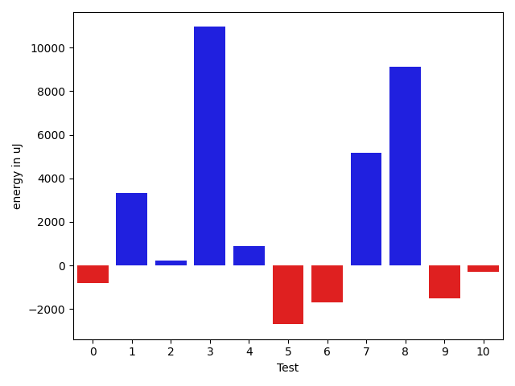

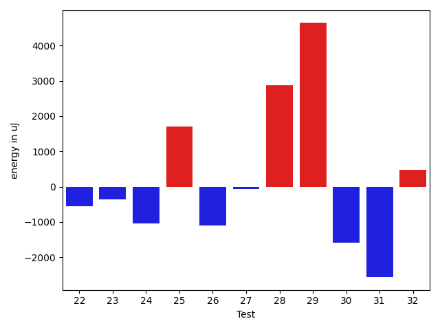

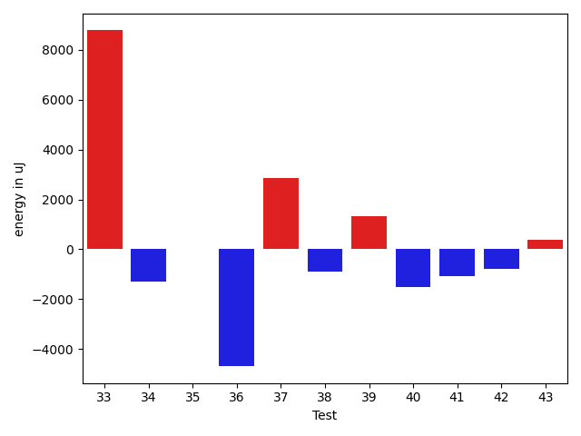

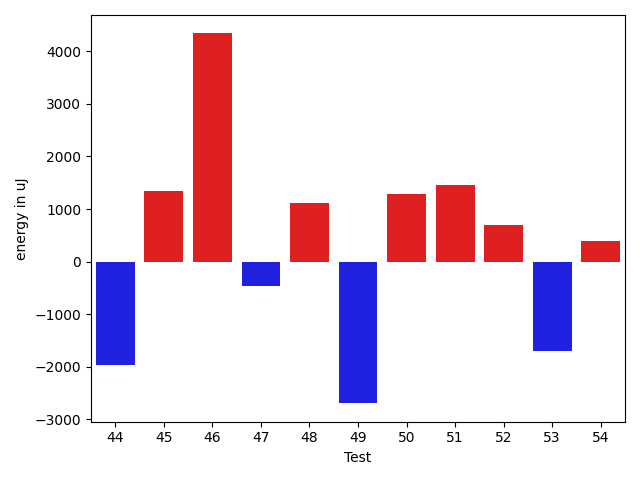

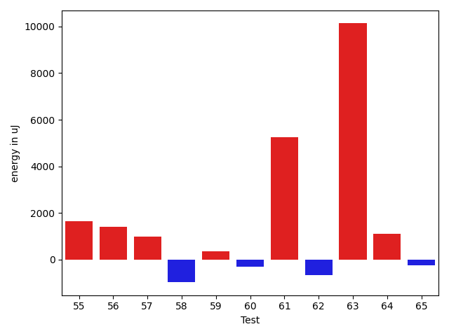

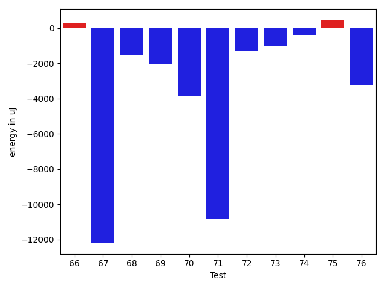

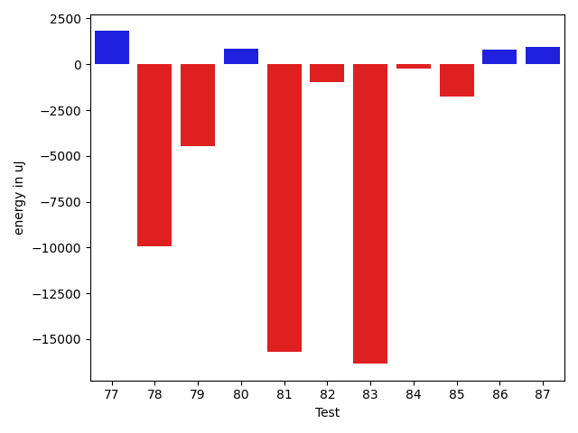

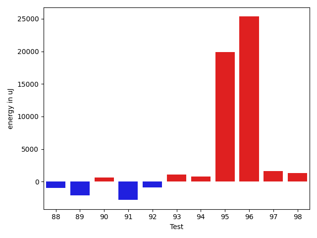

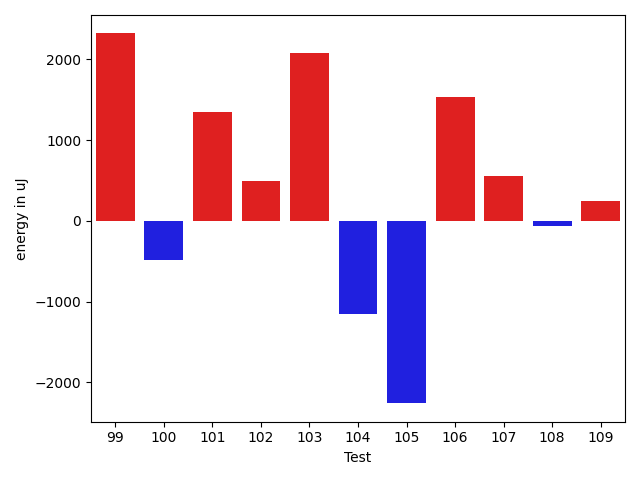

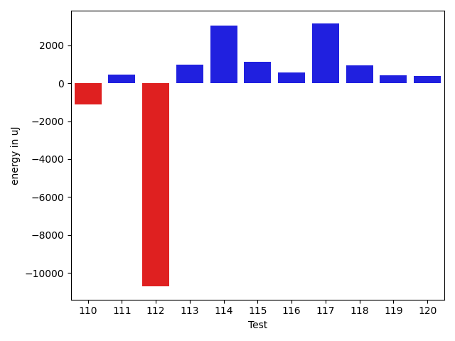

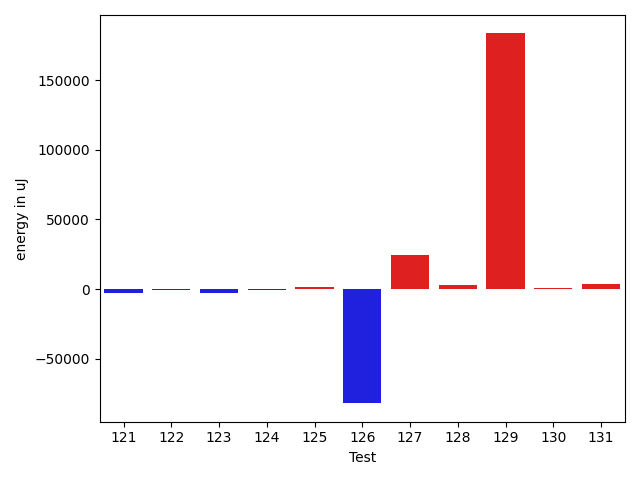

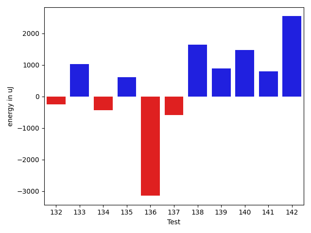

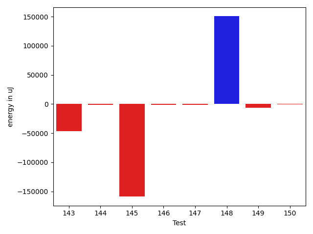

| ID | EnergyV1 | EnergyV2 | DeltaEnergy | σV1 | σV2 |
| --- | --- | --- | --- | --- | --- |
| 0 | 41199 | 41992 | 793 | 14068.871432459482 | 13109.076567933902 |
| 1 | 40650 | 40467 | -183 | 4935.943926086196 | 20441.71298035661 |
| 2 | 40650 | 42114 | 1464 | 17744.502114238912 | 15099.949002840875 |
| 3 | 83374 | 83679 | 305 | 63177.8006907311 | 86438.88955675754 |
| 4 | 41687 | 41626 | -61 | 14950.835549915699 | 14940.780738878428 |
| 5 | 84289 | 82520 | -1769 | 36495.820509638754 | 37416.563019175635 |
| 6 | 42541 | 41626 | -915 | 18707.99955487913 | 18238.326482768243 |
| 7 | 76965 | 79285 | 2320 | 33511.540806966994 | 32846.678419545264 |
| 8 | 83069 | 86547 | 3478 | 36471.47460156345 | 37300.315359907836 |
| 9 | 42725 | 42541 | -184 | 18035.810931691398 | 16762.734135798994 |
| 10 | 40893 | 39978 | -915 | 4446.525975267039 | 4242.90186597107 |
| 11 | 41443 | 41809 | 366 | 22886.75393387771 | 22717.031077586926 |
| 12 | 42481 | 43152 | 671 | 17165.24689509206 | 20508.719395793203 |
| 13 | 41443 | 38329 | -3114 | 3840.459621975564 | 4192.844306365766 |
| 14 | 131225 | 131714 | 489 | 82914.58165999546 | 90330.87660320854 |
| 15 | 40588 | 41443 | 855 | 4060.6451091111667 | 3832.3679955906086 |
| 16 | 40894 | 41199 | 305 | 7608.5748790367625 | 5494.473421719574 |
| 17 | 41870 | 42236 | 366 | 4303.739707768376 | 4290.72314841725 |
| 18 | 39734 | 41625 | 1891 | 6225.821161440919 | 6573.667324574832 |
| 19 | 41993 | 40649 | -1344 | 16890.524028208834 | 12418.625905700323 |
| 20 | 43946 | 41931 | -2015 | 42713.59615812871 | 25437.213014065986 |
| 21 | 43152 | 42176 | -976 | 24125.434631373366 | 27574.936539807444 |
| 22 | 42785 | 42236 | -549 | 84502.3138780899 | 98854.98973515033 |
| 23 | 73608 | 73242 | -366 | 41837.044280693146 | 38343.73478432283 |
| 24 | 43152 | 42115 | -1037 | 9698.597812839058 | 10183.245515857254 |
| 25 | 40100 | 41809 | 1709 | 8366.426344930518 | 4294.983697279282 |
| 26 | 44128 | 43030 | -1098 | 19396.302557426254 | 24545.2690226749 |
| 27 | 40100 | 40039 | -61 | 5716.481011154021 | 31689.572886939743 |
| 28 | 39002 | 41870 | 2868 | 5019.677279559883 | 3788.013589311174 |
| 29 | 38269 | 42907 | 4638 | 4223.926506913024 | 3770.3266487863816 |
| 30 | 41443 | 39856 | -1587 | 4876.80234471062 | 3621.140309990901 |
| 31 | 45776 | 43212 | -2564 | 80770.37663170608 | 21979.48549438376 |
| 32 | 39612 | 40100 | 488 | 4196.125706827668 | 4665.492012318055 |
| 33 | 44372 | 43090 | -1282 | 68931.82506140953 | 96165.46594762152 |
| 34 | 41138 | 39245 | -1893 | 5792.481269663995 | 6287.569872875294 |
| 35 | 40893 | 40161 | -732 | 7637.327286470128 | 7241.167850184619 |
| 36 | 43274 | 39368 | -3906 | 12180.795494703416 | 8513.494904002333 |
| 37 | 43763 | 44189 | 426 | 7211.278166654994 | 4661.1399995852535 |
| 38 | 88318 | 88379 | 61 | 54298.2285507907 | 50802.66972695011 |
| 39 | 39245 | 41748 | 2503 | 4482.7759133807685 | 5315.781336427065 |
| 40 | 40161 | 38452 | -1709 | 4283.074607077949 | 5707.111058448871 |
| 41 | 40955 | 40588 | -367 | 14424.586030128965 | 9476.421916877753 |
| 42 | 40711 | 40832 | 121 | 4945.263505471266 | 5308.764731293167 |
| 43 | 39795 | 41138 | 1343 | 4484.864914490122 | 4263.401763383408 |
| 44 | 78064 | 80749 | 2685 | 45356.10304573979 | 39002.52656279072 |
| 45 | 41504 | 42846 | 1342 | 11714.402760649433 | 13430.34319712326 |
| 46 | 40100 | 38757 | -1343 | 4220.41161249574 | 28853.38039304697 |
| 47 | 40466 | 39551 | -915 | 4320.363621023934 | 3515.3168924965044 |
| 48 | 41321 | 40283 | -1038 | 3986.382616247285 | 18563.87151471177 |
| 49 | 45959 | 43457 | -2502 | 23626.86079045089 | 22852.074955244218 |
| 50 | 40161 | 40100 | -61 | 4807.322193857184 | 8076.879991915355 |
| 51 | 39856 | 41321 | 1465 | 4984.93063311955 | 5677.2714325562165 |
| 52 | 38879 | 40161 | 1282 | 3742.9856641988304 | 4272.194283433704 |
| 53 | 41259 | 41321 | 62 | 14525.36972915228 | 14553.583859233955 |
| 54 | 40405 | 39916 | -489 | 7970.84754347507 | 11174.46201710227 |
| 55 | 38757 | 40406 | 1649 | 4455.35948632024 | 4477.454661884181 |
| 56 | 39429 | 40833 | 1404 | 9089.977615362093 | 8003.281250414897 |
| 57 | 40161 | 41137 | 976 | 4104.5112662312085 | 33963.15130136389 |
| 58 | 43335 | 42359 | -976 | 554735.4401334635 | 302511.46828941314 |
| 59 | 42237 | 42603 | 366 | 5007.13223249325 | 5074.71626796348 |
| 60 | 41931 | 41626 | -305 | 20058.779779497225 | 27037.029238560244 |
| 61 | 86059 | 91308 | 5249 | 33225.82806849914 | 29888.219498315924 |
| 62 | 40588 | 39917 | -671 | 4963.564934088698 | 3887.928763790077 |
| 63 | 165954 | 176086 | 10132 | 71482.65575729047 | 266340.1291084427 |
| 64 | 40832 | 41931 | 1099 | 20781.33375142768 | 26947.171459757756 |
| 65 | 41077 | 40833 | -244 | 10973.61967008062 | 13061.817215304878 |
| 66 | 41138 | 40222 | -916 | 6606.104855779657 | 5170.657338623073 |
| 67 | 91980 | 90087 | -1893 | 79105.74657766422 | 77432.57706007776 |
| 68 | 41565 | 42602 | 1037 | 17425.44957740958 | 13651.035718716903 |
| 69 | 40406 | 39002 | -1404 | 7660.980341599565 | 4190.204445797109 |
| 70 | 41015 | 39185 | -1830 | 11257.595099052665 | 6225.497356254336 |
| 71 | 81238 | 77637 | -3601 | 116329.79358243152 | 99487.13963021172 |
| 72 | 39551 | 40039 | 488 | 4937.704687564579 | 4214.978215964894 |
| 73 | 40039 | 40344 | 305 | 19526.02944962539 | 7241.353772603573 |
| 74 | 39184 | 39185 | 1 | 5137.350648529884 | 3897.6642347291013 |
| 75 | 39489 | 38696 | -793 | 5020.306702159034 | 4102.67904960686 |
| 76 | 41321 | 41809 | 488 | 16505.69932169659 | 14431.856820554802 |
| 77 | 41382 | 41443 | 61 | 5212.793706677227 | 5823.079225687991 |
| 78 | 42175 | 40589 | -1586 | 24029.522732243528 | 10827.39085640705 |
| 79 | 42725 | 39001 | -3724 | 14653.87212854888 | 10022.111623182192 |
| 80 | 37719 | 37842 | 123 | 3340.985106854708 | 4755.014998519715 |
| 81 | 40405 | 44250 | 3845 | 91415.80668953045 | 69003.57902550853 |
| 82 | 39550 | 39368 | -182 | 4678.617902928171 | 4121.238375779785 |
| 83 | 41565 | 41748 | 183 | 55411.67256234588 | 29245.41505892469 |
| 84 | 41504 | 40772 | -732 | 4296.0241425764825 | 6031.399057225446 |
| 85 | 39673 | 38818 | -855 | 4906.250235408808 | 5968.880942456083 |
| 86 | 39246 | 41931 | 2685 | 4930.753933977847 | 5033.3223630123275 |
| 87 | 37658 | 41259 | 3601 | 3735.109830073051 | 4333.0525107854955 |
| 88 | 38391 | 37414 | -977 | 4054.031468899378 | 5747.032341033839 |
| 89 | 41748 | 39611 | -2137 | 4873.597609380905 | 4935.343471514236 |
| 90 | 41259 | 41931 | 672 | 19541.674623741903 | 20020.873880280793 |
| 91 | 89966 | 87158 | -2808 | 501203.0561330189 | 364354.6618430962 |
| 92 | 43762 | 42847 | -915 | 27926.467233446976 | 22779.379652916792 |
| 93 | 39551 | 40650 | 1099 | 4765.466364951599 | 4873.738200628139 |
| 94 | 44677 | 45471 | 794 | 57669.037943086834 | 69659.74029301958 |
| 95 | 388549 | 408446 | 19897 | 170243.28183201893 | 191372.27482924124 |
| 96 | 46020 | 71350 | 25330 | 51025.72186320724 | 70359.98823273781 |
| 97 | 40954 | 42603 | 1649 | 9928.93327537477 | 13543.70536628035 |
| 98 | 41320 | 42663 | 1343 | 19018.56691098202 | 6300.805268528047 |
| 99 | 40161 | 42480 | 2319 | 9907.29204078881 | 14532.372154613187 |
| 100 | 39795 | 39307 | -488 | 9199.957870853797 | 6851.678869399075 |
| 101 | 41870 | 43212 | 1342 | 4376.687677528514 | 13281.97780302178 |
| 102 | 40771 | 41260 | 489 | 6953.3666922892835 | 12249.44119722132 |
| 103 | 39246 | 41321 | 2075 | 3408.3449369428085 | 4647.394241902598 |
| 104 | 41077 | 39917 | -1160 | 5400.49625648667 | 5005.583968057621 |
| 105 | 41687 | 39428 | -2259 | 3846.6495402241108 | 4994.928336410101 |
| 106 | 40832 | 42359 | 1527 | 3806.399869932437 | 4912.9580056780005 |
| 107 | 40344 | 40893 | 549 | 4039.9076376910375 | 4416.443016349998 |
| 108 | 41809 | 41748 | -61 | 4758.889113893605 | 5285.968397289455 |
| 109 | 42541 | 42785 | 244 | 15268.303043879618 | 17487.72002669286 |
| 110 | 43396 | 42236 | -1160 | 41472.734265371386 | 40972.347980608596 |
| 111 | 39490 | 38330 | -1160 | 5602.70699320088 | 4898.649693741281 |
| 112 | 43334 | 41443 | -1891 | 101434.90692437606 | 87655.83665509796 |
| 113 | 41870 | 42236 | 366 | 24403.120903320632 | 23638.94676122978 |
| 114 | 38879 | 40711 | 1832 | 4456.37869473003 | 7299.585794714658 |
| 115 | 38513 | 38574 | 61 | 4384.637403872172 | 5415.486162235579 |
| 116 | 39062 | 40649 | 1587 | 4377.647046576505 | 4868.214071460101 |
| 117 | 41809 | 43274 | 1465 | 22997.07353999118 | 28918.996722813215 |
| 118 | 38818 | 39428 | 610 | 4851.85282050924 | 4217.8695288875515 |
| 119 | 41442 | 41992 | 550 | 39198.9724846043 | 40124.40145693765 |
| 120 | 40100 | 39246 | -854 | 5522.650998560665 | 4493.654371239878 |
| 121 | 42297 | 41382 | -915 | 22598.312498380415 | 17998.03107515589 |
| 122 | 40283 | 39673 | -610 | 10038.494114235094 | 9734.010215765362 |
| 123 | 42480 | 42785 | 305 | 33040.11071930834 | 21032.347303879465 |
| 124 | 41504 | 41625 | 121 | 4942.577446977943 | 4508.012909251629 |
| 125 | 41626 | 41443 | -183 | 44685.77535860825 | 63602.246607795685 |
| 126 | 125855 | 118591 | -7264 | 449960.48403505026 | 51927.859079216454 |
| 127 | 43457 | 44555 | 1098 | 24552.634760927074 | 96570.28777746069 |
| 128 | 40039 | 42419 | 2380 | 4885.78963892566 | 8575.113023641914 |
| 129 | 42602 | 44800 | 2198 | 417855.54749490926 | 759608.1489003056 |
| 130 | 41077 | 41077 | 0 | 4926.52652997211 | 5425.808522464554 |
| 131 | 43152 | 44373 | 1221 | 105867.91996882451 | 112745.85480446719 |
| 132 | 42359 | 41076 | -1283 | 11393.879129943196 | 11402.729314172273 |
| 133 | 38452 | 41687 | 3235 | 5025.556472006587 | 4547.303341772876 |
| 134 | 41687 | 40405 | -1282 | 6343.38013915639 | 9748.584000350907 |
| 135 | 41565 | 41870 | 305 | 5219.862971511611 | 4084.545661756737 |
| 136 | 41687 | 41748 | 61 | 15694.656814576856 | 14547.650005803618 |
| 137 | 41199 | 41870 | 671 | 17198.87240599075 | 14352.352617773264 |
| 138 | 37964 | 41870 | 3906 | 4981.340658738368 | 4958.637808544171 |
| 139 | 39001 | 41015 | 2014 | 6800.0633344471935 | 4694.463960101815 |
| 140 | 37598 | 40100 | 2502 | 5766.84855691564 | 5806.158432479737 |
| 141 | 42175 | 41565 | -610 | 5132.128828442286 | 3985.2617390692026 |
| 142 | 37963 | 41015 | 3052 | 5096.518454774945 | 3242.068816357851 |
| 143 | 42541 | 42236 | -305 | 346145.09389770456 | 24588.142462283595 |
| 144 | 41626 | 39795 | -1831 | 4627.8411175636475 | 5305.499988212764 |
| 145 | 43946 | 43640 | -306 | 675874.3558096725 | 442453.0516684251 |
| 146 | 42114 | 41504 | -610 | 5430.154743094401 | 4628.182577827222 |
| 147 | 40955 | 38574 | -2381 | 5025.787518812952 | 4497.325139474674 |
| 148 | 43335 | 42664 | -671 | 302065.697578238 | 652450.2339283632 |
| 149 | 41137 | 39917 | -1220 | 21881.650333259488 | 5246.0397720566325 |
| 150 | 42968 | 42724 | -244 | 46638.17480390624 | 41704.16099359509 |

## Delta Duration per test method

| ID | DurationV1 | DurationsV2 | DeltaDuration |
| --- | --- | --- | --- |
| 0 | 1205139.7710843373 | 1257359.1358024692 | 52219.364718131954 |
| 1 | 882647.7903225806 | 916386.9838709678 | 33739.19354838715 |
| 2 | 1338904.8279569892 | 1366230.9444444445 | 27326.11648745532 |
| 3 | 2442382.4646464647 | 2775329.6868686867 | 332947.222222222 |
| 4 | 1321209.9670329671 | 1376597.1084337349 | 55387.14140076772 |
| 5 | 2524648.474747475 | 2555768.494949495 | 31120.020202020183 |
| 6 | 1397896.8602150537 | 1453517.4431818181 | 55620.58296676446 |
| 7 | 2180927.4343434344 | 2183336.696969697 | 2409.2626262623817 |
| 8 | 2460246.727272727 | 2629944.282828283 | 169697.55555555597 |
| 9 | 1364300.0 | 1424280.677419355 | 59980.677419354906 |
| 10 | 686609.1428571428 | 678655.4848484849 | -7953.658008657978 |
| 11 | 1328576.1265822784 | 1379001.2988505748 | 50425.17226829636 |
| 12 | 1298691.4153846153 | 1429875.4615384615 | 131184.0461538462 |
| 13 | 655678.9166666666 | 679158.9210526316 | 23480.004385964945 |
| 14 | 4371031.474747474 | 4307174.525252526 | -63856.94949494861 |
| 15 | 705130.84375 | 573999.4545454546 | -131131.3892045454 |
| 16 | 906463.2380952381 | 822157.6808510638 | -84305.5572441743 |
| 17 | 739618.1666666666 | 724731.8181818182 | -14886.348484848393 |
| 18 | 831599.7692307692 | 818529.0789473684 | -13070.690283400821 |
| 19 | 1307692.2125 | 1150639.168831169 | -157053.043668831 |
| 20 | 1477091.0196078431 | 1104423.2608695652 | -372667.75873827795 |
| 21 | 1679311.2604166667 | 1561559.3608247424 | -117751.89959192439 |
| 22 | 1649314.9714285715 | 1487200.6557377048 | -162114.31569086667 |
| 23 | 2240183.767676768 | 2072884.191919192 | -167299.57575757592 |
| 24 | 971388.2727272727 | 891437.262295082 | -79951.01043219073 |
| 25 | 795401.9047619047 | 793118.2564102564 | -2283.6483516483568 |
| 26 | 1408926.0 | 1439211.923076923 | 30285.923076923005 |
| 27 | 691243.7419354839 | 677810.8 | -13432.941935483832 |
| 28 | 655047.5714285715 | 536174.6785714285 | -118872.89285714296 |
| 29 | 557852.9444444445 | 546842.4761904762 | -11010.468253968284 |
| 30 | 536622.90625 | 501923.3870967742 | -34699.51915322582 |
| 31 | 1923335.1333333333 | 1245611.1956521738 | -677723.9376811595 |
| 32 | 530113.65 | 458778.6551724138 | -71334.99482758623 |
| 33 | 1890094.15625 | 2224902.85106383 | 334808.69481382985 |
| 34 | 851877.033898305 | 854337.6530612245 | 2460.6191629194655 |
| 35 | 974407.8909090909 | 896472.9193548387 | -77934.9715542522 |
| 36 | 1028085.1384615385 | 974141.4285714285 | -53943.70989010995 |
| 37 | 915900.9375 | 700182.3225806452 | -215718.6149193548 |
| 38 | 2856550.98989899 | 2802295.898989899 | -54255.090909090824 |
| 39 | 944537.2545454545 | 890670.3620689656 | -53866.89247648895 |
| 40 | 675808.3714285714 | 670228.3428571429 | -5580.028571428498 |
| 41 | 1034281.7076923077 | 1025214.606557377 | -9067.10113493062 |
| 42 | 577062.3703703703 | 566534.0833333334 | -10528.287037036964 |
| 43 | 643354.6 | 639645.8529411765 | -3708.747058823472 |
| 44 | 2463721.242424242 | 2368066.797979798 | -95654.44444444403 |
| 45 | 1319745.2352941176 | 1212448.3582089553 | -107296.87708516233 |
| 46 | 590340.9 | 717608.8928571428 | 127267.99285714282 |
| 47 | 561005.7631578947 | 557315.0294117647 | -3690.7337461300194 |
| 48 | 719556.5660377359 | 850259.1794871795 | 130702.6134494436 |
| 49 | 1692754.2727272727 | 1661881.6530612244 | -30872.619666048326 |
| 50 | 935580.3265306122 | 876896.4255319149 | -58683.90099869727 |
| 51 | 821163.5853658536 | 799090.7027027027 | -22072.8826631509 |
| 52 | 809005.5535714285 | 869065.5762711865 | 60060.022699757945 |
| 53 | 908067.7948717949 | 850181.8857142857 | -57885.90915750922 |
| 54 | 908184.7450980392 | 897654.4893617021 | -10530.255736337043 |
| 55 | 624284.59375 | 625899.9722222222 | 1615.378472222248 |
| 56 | 908857.6052631579 | 818176.380952381 | -90681.22431077692 |
| 57 | 645223.8787878788 | 715838.6875 | 70614.80871212122 |
| 58 | 4917210.225 | 2098388.95505618 | -2818821.26994382 |
| 59 | 742755.5555555555 | 745912.9591836735 | 3157.403628117987 |
| 60 | 1143237.2461538462 | 1335313.9344262294 | 192076.6882723833 |
| 61 | 2714418.383838384 | 2770163.131313131 | 55744.747474747244 |
| 62 | 735681.2608695652 | 787060.5652173914 | 51379.30434782617 |
| 63 | 4932405.363636363 | 6442716.151515151 | 1510310.787878788 |
| 64 | 806915.3157894737 | 1124174.173076923 | 317258.8572874493 |
| 65 | 1045496.0 | 1192995.1095890412 | 147499.1095890412 |
| 66 | 843822.7333333333 | 1009272.7321428572 | 165449.99880952388 |
| 67 | 3568540.121212121 | 3392255.3535353537 | -176284.76767676743 |
| 68 | 1357798.5625 | 1315673.896551724 | -42124.66594827594 |
| 69 | 818019.725 | 803302.7058823529 | -14717.019117647083 |
| 70 | 1047559.3829787234 | 936166.659574468 | -111392.72340425535 |
| 71 | 3466739.1616161615 | 3161283.3636363638 | -305455.7979797977 |
| 72 | 572500.9583333334 | 606226.9130434783 | 33725.9547101449 |
| 73 | 1023100.6451612903 | 998013.5166666667 | -25087.128494623583 |
| 74 | 657670.9090909091 | 635060.9230769231 | -22609.986013985937 |
| 75 | 557435.8260869565 | 475469.35294117645 | -81966.4731457801 |
| 76 | 1288868.5909090908 | 1093921.4923076923 | -194947.09860139852 |
| 77 | 508223.29411764705 | 450042.92307692306 | -58180.371040723985 |
| 78 | 1344699.5405405406 | 1203524.9104477612 | -141174.6300927794 |
| 79 | 1040486.1470588235 | 942707.7826086957 | -97778.36445012782 |
| 80 | 623195.1111111111 | 570272.0 | -52923.111111111124 |
| 81 | 2085006.52 | 1318928.48 | -766078.04 |
| 82 | 480236.96 | 455219.0 | -25017.96000000002 |
| 83 | 1594132.861111111 | 995983.9393939395 | -598148.9217171716 |
| 84 | 496488.92 | 573256.85 | 76767.93 |
| 85 | 440045.64285714284 | 469640.1904761905 | 29594.547619047633 |
| 86 | 534223.5454545454 | 474724.6 | -59498.945454545435 |
| 87 | 541403.5 | 469890.0 | -71513.5 |
| 88 | 594290.4545454546 | 505147.26666666666 | -89143.18787878793 |
| 89 | 457253.71428571426 | 435742.4090909091 | -21511.305194805143 |
| 90 | 1369176.0833333333 | 1460218.0229885057 | 91041.9396551724 |
| 91 | 5903989.222222222 | 4069250.232323232 | -1834738.98989899 |
| 92 | 1722433.829787234 | 1599488.7849462365 | -122945.04484099755 |
| 93 | 1040234.2857142857 | 949436.6271186441 | -90797.65859564161 |
| 94 | 1963260.108695652 | 2182900.793814433 | 219640.6851187807 |
| 95 | 10417339.202020202 | 11328669.161616161 | 911329.9595959596 |
| 96 | 2002082.494736842 | 2341879.2291666665 | 339796.7344298244 |
| 97 | 1084426.857142857 | 1225915.7916666667 | 141488.9345238097 |
| 98 | 898247.175 | 891289.7843137255 | -6957.390686274506 |
| 99 | 1112061.746835443 | 1290924.148148148 | 178862.40131270513 |
| 100 | 710458.7368421053 | 853126.7931034482 | 142668.05626134295 |
| 101 | 748406.4848484849 | 922978.4545454546 | 174571.96969696973 |
| 102 | 768690.4545454546 | 934139.1063829787 | 165448.65183752414 |
| 103 | 528297.3571428572 | 499569.3181818182 | -28728.038961038983 |
| 104 | 708015.5714285715 | 860548.1025641026 | 152532.53113553114 |
| 105 | 739707.0243902439 | 715639.6842105263 | -24067.340179717634 |
| 106 | 531965.8518518518 | 572917.7 | 40951.84814814816 |
| 107 | 626103.8181818182 | 697528.625 | 71424.80681818177 |
| 108 | 616313.8387096775 | 654960.2285714286 | 38646.389861751115 |
| 109 | 1190688.8717948718 | 1286107.1973684211 | 95418.32557354937 |
| 110 | 1393515.125 | 1396510.4714285715 | 2995.3464285715017 |
| 111 | 768635.8684210526 | 806784.1764705882 | 38148.30804953561 |
| 112 | 1911369.1875 | 1563573.761904762 | -347795.4255952381 |
| 113 | 1372891.696969697 | 1232549.956521739 | -140341.740447958 |
| 114 | 846360.641509434 | 911243.52 | 64882.87849056604 |
| 115 | 644057.0789473684 | 688790.5862068966 | 44733.50725952815 |
| 116 | 819193.54 | 800623.7307692308 | -18569.809230769286 |
| 117 | 1541894.7525773195 | 1620363.418367347 | 78468.66579002747 |
| 118 | 666514.9677419355 | 672619.7575757576 | 6104.789833822055 |
| 119 | 1232965.1944444445 | 1283529.05 | 50563.85555555555 |
| 120 | 684774.8235294118 | 753597.6571428571 | 68822.83361344528 |
| 121 | 1496020.4239130435 | 1381521.5 | -114498.92391304346 |
| 122 | 1112252.5223880596 | 1107979.9848484849 | -4272.537539574783 |
| 123 | 1591792.4237288137 | 1507485.076923077 | -84307.34680573666 |
| 124 | 776276.9 | 724627.6136363636 | -51649.286363636376 |
| 125 | 1166319.65 | 1175205.896551724 | 8886.24655172415 |
| 126 | 5814849.636363637 | 3259604.757575758 | -2555244.878787879 |
| 127 | 1333808.9615384615 | 2130475.6578947366 | 796666.6963562751 |
| 128 | 732614.2916666666 | 894381.512195122 | 161767.22052845533 |
| 129 | 3462480.5970149254 | 8777583.566666666 | 5315102.969651741 |
| 130 | 621908.6764705882 | 690933.9642857143 | 69025.28781512612 |
| 131 | 2083508.7555555555 | 2078851.775 | -4656.98055555555 |
| 132 | 1061787.4428571428 | 1055748.794117647 | -6038.64873949578 |
| 133 | 809300.085106383 | 828799.3333333334 | 19499.24822695041 |
| 134 | 699778.40625 | 717844.7804878049 | 18066.374237804906 |
| 135 | 674807.6111111111 | 700146.9705882353 | 25339.359477124177 |
| 136 | 942595.1875 | 799037.5925925926 | -143557.59490740742 |
| 137 | 1110460.49122807 | 1056326.9047619049 | -54133.58646616526 |
| 138 | 631909.76 | 591261.2222222222 | -40648.53777777776 |
| 139 | 771114.8157894737 | 788384.0731707317 | 17269.25738125795 |
| 140 | 653874.84 | 594295.3888888889 | -59579.45111111109 |
| 141 | 400550.1666666667 | 507483.0 | 106932.83333333331 |
| 142 | 415232.35294117645 | 384922.7 | -30309.652941176435 |
| 143 | 2835150.3378378376 | 1274857.3164556962 | -1560293.0213821414 |
| 144 | 909191.693877551 | 912209.0 | 3017.306122448994 |
| 145 | 9927219.326086957 | 4952902.325581395 | -4974317.000505562 |
| 146 | 706218.1388888889 | 684006.1621621621 | -22211.976726726745 |
| 147 | 629808.2352941176 | 670603.9629629629 | 40795.72766884533 |
| 148 | 2225509.5166666666 | 6993154.049180328 | 4767644.532513661 |
| 149 | 920169.3846153846 | 825542.775 | -94626.6096153846 |
| 150 | 1275483.5151515151 | 1272629.1851851852 | -2854.3299663299695 |

## Misc.

| ID | Test Class | Test Method |
| --- | --- | --- |
| 0 | com.google.gson.functional.ParameterizedTypesTest | testParameterizedTypeGenericArraysSerialization |
| 1 | com.google.gson.functional.ParameterizedTypesTest | testParameterizedTypesWithWriterSerialization |
| 2 | com.google.gson.functional.ParameterizedTypesTest | testVariableTypeArrayDeserialization |
| 3 | com.google.gson.functional.ParameterizedTypesTest | testParameterizedTypesSerialization |
| 4 | com.google.gson.functional.ParameterizedTypesTest | testVariableTypeDeserialization |
| 5 | com.google.gson.functional.ParameterizedTypesTest | testVariableTypeFieldsAndGenericArraysSerialization |
| 6 | com.google.gson.functional.ParameterizedTypesTest | testParameterizedTypeGenericArraysDeserialization |
| 7 | com.google.gson.functional.ParameterizedTypesTest | testVariableTypeFieldsAndGenericArraysDeserialization |
| 8 | com.google.gson.functional.ParameterizedTypesTest | testTypesWithMultipleParametersSerialization |
| 9 | com.google.gson.functional.ParameterizedTypesTest | testParameterizedTypeWithVariableTypeDeserialization |
| 10 | com.google.gson.functional.ParameterizedTypesTest | testDeepParameterizedTypeSerialization |
| 11 | com.google.gson.functional.MapTest | testSerializeMaps |
| 12 | com.google.gson.functional.MapTest | testMapSerializationWithNullValues |
| 13 | com.google.gson.functional.MapTest | testMapSerializationWithNullValuesSerialized |
| 14 | com.google.gson.functional.ExposeFieldsTest | testNullExposeFieldSerialization |
| 15 | com.google.gson.functional.ExposeFieldsTest | testExposeAnnotationSerialization |
| 16 | com.google.gson.functional.ExposeFieldsTest | testArrayWithOneNullExposeFieldObjectSerialization |
| 17 | com.google.gson.functional.ExposeFieldsTest | testExposedInterfaceFieldSerialization |
| 18 | com.google.gson.functional.CollectionTest | testRawCollectionSerialization |
| 19 | com.google.gson.functional.CollectionTest | testFieldIsArrayList |
| 20 | com.google.gson.functional.CollectionTest | testCollectionOfBagOfPrimitivesSerialization |
| 21 | com.google.gson.functional.CollectionTest | testWildcardCollectionField |
| 22 | com.google.gson.functional.CollectionTest | testSetSerialization |
| 23 | com.google.gson.functional.InheritanceTest | testSubInterfacesOfCollectionSerialization |
| 24 | com.google.gson.functional.InheritanceTest | testClassWithBaseArrayFieldSerialization |
| 25 | com.google.gson.functional.InheritanceTest | testClassWithBaseFieldSerialization |
| 26 | com.google.gson.functional.InheritanceTest | testSubClassSerialization |
| 27 | com.google.gson.functional.InheritanceTest | testBaseSerializedAsSubWhenSpecifiedWithExplicitType |
| 28 | com.google.gson.functional.InheritanceTest | testBaseSerializedAsSubForToJsonMethod |
| 29 | com.google.gson.functional.InheritanceTest | testBaseSerializedAsSub |
| 30 | com.google.gson.functional.InheritanceTest | testBaseSerializedAsSubWhenSpecifiedWithExplicitTypeForToJsonMethod |
| 31 | com.google.gson.functional.InheritanceTest | testBaseSerializedAsBaseWhenSpecifiedWithExplicitTypeForToJsonMethod |
| 32 | com.google.gson.functional.InheritanceTest | testBaseSerializedAsBaseWhenSpecifiedWithExplicitType |
| 33 | com.google.gson.functional.MoreSpecificTypeSerializationTest | testSubclassFields |
| 34 | com.google.gson.functional.MoreSpecificTypeSerializationTest | testParameterizedSubclassFields |
| 35 | com.google.gson.functional.MoreSpecificTypeSerializationTest | testMapOfParameterizedSubclassFields |
| 36 | com.google.gson.functional.MoreSpecificTypeSerializationTest | testListOfParameterizedSubclassFields |
| 37 | com.google.gson.functional.StringTest | testStringValueAsSingleElementArraySerialization |
| 38 | com.google.gson.functional.NamingPolicyTest | testGsonWithNonDefaultFieldNamingPolicySerialization |
| 39 | com.google.gson.functional.NamingPolicyTest | testGsonWithSerializedNameFieldNamingPolicySerialization |
| 40 | com.google.gson.functional.NamingPolicyTest | testGsonWithLowerCaseDashPolicySerialization |
| 41 | com.google.gson.functional.NamingPolicyTest | testComplexFieldNameStrategy |
| 42 | com.google.gson.functional.NamingPolicyTest | testGsonWithUpperCamelCaseSpacesPolicySerialiation |
| 43 | com.google.gson.functional.NamingPolicyTest | testGsonWithLowerCaseUnderscorePolicySerialization |
| 44 | com.google.gson.functional.ObjectTest | testSingletonLists |
| 45 | com.google.gson.functional.ObjectTest | testArrayOfObjectsAsFields |
| 46 | com.google.gson.functional.ObjectTest | testPrimitiveArrayFieldSerialization |
| 47 | com.google.gson.functional.ObjectTest | testClassWithObjectFieldSerialization |
| 48 | com.google.gson.functional.ObjectTest | testBagOfPrimitiveWrappersSerialization |
| 49 | com.google.gson.functional.ObjectTest | testArrayOfArraysSerialization |
| 50 | com.google.gson.functional.ObjectTest | testArrayOfObjectsSerialization |
| 51 | com.google.gson.functional.ObjectTest | testNullFieldsSerialization |
| 52 | com.google.gson.functional.ObjectTest | testInnerClassSerialization |
| 53 | com.google.gson.functional.ObjectTest | testBagOfPrimitivesSerialization |
| 54 | com.google.gson.functional.ObjectTest | testNestedSerialization |
| 55 | com.google.gson.functional.ObjectTest | testStringFieldWithEmptyValueSerialization |
| 56 | com.google.gson.functional.ObjectTest | testClassWithTransientFieldsSerialization |
| 57 | com.google.gson.functional.ObjectTest | testEmptyCollectionInAnObjectSerialization |
| 58 | com.google.gson.functional.FieldExclusionTest | testDefaultInnerClassExclusion |
| 59 | com.google.gson.functional.FieldExclusionTest | testDefaultNestedStaticClassIncluded |
| 60 | com.google.gson.functional.CustomTypeAdaptersTest | testCustomNestedSerializers |
| 61 | com.google.gson.functional.CustomTypeAdaptersTest | testCustomTypeAdapterDoesNotAppliesToSubClasses |
| 62 | com.google.gson.functional.CustomTypeAdaptersTest | testEnsureCustomSerializerNotInvokedForNullValues |
| 63 | com.google.gson.functional.VersioningTest | testVersionedUntilSerialization |
| 64 | com.google.gson.functional.VersioningTest | testVersionedGsonWithUnversionedClassesSerialization |
| 65 | com.google.gson.functional.VersioningTest | testVersionedGsonMixingSinceAndUntilSerialization |
| 66 | com.google.gson.functional.VersioningTest | testVersionedClassesSerialization |
| 67 | com.google.gson.functional.MapAsArrayTypeAdapterTest | testMultipleEnableComplexKeyRegistrationHasNoEffect |
| 68 | com.google.gson.functional.MapAsArrayTypeAdapterTest | testMapWithTypeVariableSerialization |
| 69 | com.google.gson.functional.PrettyPrintingTest | testPrettyPrintListOfPrimitiveArrays |
| 70 | com.google.gson.functional.PrettyPrintingTest | testPrettyPrintArrayOfObjects |
| 71 | com.google.gson.functional.PrettyPrintingTest | testPrettyPrintList |
| 72 | com.google.gson.functional.PrettyPrintingTest | testMultipleArrays |
| 73 | com.google.gson.functional.PrettyPrintingTest | testEmptyMapField |
| 74 | com.google.gson.functional.PrettyPrintingTest | testPrettyPrintArrayOfPrimitiveArrays |
| 75 | com.google.gson.functional.PrettyPrintingTest | testPrettyPrintArrayOfPrimitives |
| 76 | com.google.gson.functional.ArrayTest | testObjectArrayWithNonPrimitivesSerialization |
| 77 | com.google.gson.functional.ArrayTest | testArrayOfStringsSerialization |
| 78 | com.google.gson.functional.ArrayTest | testArrayOfCollectionSerialization |
| 79 | com.google.gson.functional.ArrayTest | testArrayOfPrimitivesAsObjectsSerialization |
| 80 | com.google.gson.functional.ArrayTest | testMultidimenstionalArraysSerialization |
| 81 | com.google.gson.functional.ArrayTest | testTopLevelArrayOfIntsSerialization |
| 82 | com.google.gson.functional.ArrayTest | testSingleStringArraySerialization |
| 83 | com.google.gson.functional.ArrayTest | testSingleNullInArraySerialization |
| 84 | com.google.gson.functional.ArrayTest | testNullsInArrayWithSerializeNullPropertySetSerialization |
| 85 | com.google.gson.functional.ArrayTest | testEmptyArraySerialization |
| 86 | com.google.gson.functional.ArrayTest | testNullsInArraySerialization |
| 87 | com.google.gson.functional.ArrayTest | testMixingTypesInObjectArraySerialization |
| 88 | com.google.gson.functional.ArrayTest | testMultiDimenstionalObjectArraysSerialization |
| 89 | com.google.gson.functional.ArrayTest | testArrayOfNullSerialization |
| 90 | com.google.gson.functional.EnumTest | testClassWithEnumFieldSerialization |
| 91 | com.google.gson.functional.TypeVariableTest | testAdvancedTypeVariables |
| 92 | com.google.gson.functional.TypeVariableTest | testTypeVariablesViaTypeParameter |
| 93 | com.google.gson.functional.TypeVariableTest | testBasicTypeVariables |
| 94 | com.google.gson.functional.ConcurrencyTest | testSingleThreadSerialization |
| 95 | com.google.gson.functional.ConcurrencyTest | testMultiThreadSerialization |
| 96 | com.google.gson.functional.RawSerializationTest | testThreeLevelParameterizedObject |
| 97 | com.google.gson.functional.RawSerializationTest | testParameterizedObject |
| 98 | com.google.gson.functional.RawSerializationTest | testCollectionOfObjects |
| 99 | com.google.gson.functional.RawSerializationTest | testTwoLevelParameterizedObject |
| 100 | com.google.gson.functional.UncategorizedTest | testStaticFieldsAreNotSerialized |
| 101 | com.google.gson.functional.UncategorizedTest | testObjectEqualButNotSameSerialization |
| 102 | com.google.gson.functional.UncategorizedTest | testGsonInstanceReusableForSerializationAndDeserialization |
| 103 | com.google.gson.functional.PrimitiveTest | testPrimitiveLongAutoboxedInASingleElementArraySerialization |
| 104 | com.google.gson.functional.PrimitiveTest | testPrimitiveDoubleAutoboxedInASingleElementArraySerialization |
| 105 | com.google.gson.functional.PrimitiveTest | testBigIntegerInASingleElementArraySerialization |
| 106 | com.google.gson.functional.PrimitiveTest | testPrimitiveBooleanAutoboxedInASingleElementArraySerialization |
| 107 | com.google.gson.functional.PrimitiveTest | testPrimitiveIntegerAutoboxedInASingleElementArraySerialization |
| 108 | com.google.gson.functional.PrimitiveTest | testBigDecimalInASingleElementArraySerialization |
| 109 | com.google.gson.functional.EscapingTest | testGsonAcceptsEscapedAndNonEscapedJsonDeserialization |
| 110 | com.google.gson.functional.EscapingTest | testEscapingObjectFields |
| 111 | com.google.gson.functional.EscapingTest | testGsonDoubleDeserialization |
| 112 | com.google.gson.functional.EscapingTest | testEscapingQuotesInStringArray |
| 113 | com.google.gson.functional.JsonTreeTest | testJsonTreeToString |
| 114 | com.google.gson.functional.NullObjectAndFieldTest | testPrintPrintingObjectWithNulls |
| 115 | com.google.gson.functional.NullObjectAndFieldTest | testPrintPrintingArraysWithNulls |
| 116 | com.google.gson.functional.NullObjectAndFieldTest | testNullWrappedPrimitiveMemberSerialization |
| 117 | com.google.gson.functional.NullObjectAndFieldTest | testExplicitSerializationOfNullArrayMembers |
| 118 | com.google.gson.functional.NullObjectAndFieldTest | testExplicitSerializationOfNullStringMembers |
| 119 | com.google.gson.functional.NullObjectAndFieldTest | testExplicitSerializationOfNulls |
| 120 | com.google.gson.functional.NullObjectAndFieldTest | testExplicitSerializationOfNullCollectionMembers |
| 121 | com.google.gson.functional.DefaultTypeAdaptersTest | testUrlNullSerialization |
| 122 | com.google.gson.functional.DefaultTypeAdaptersTest | testBigIntegerFieldSerialization |
| 123 | com.google.gson.functional.DefaultTypeAdaptersTest | testBigDecimalFieldSerialization |
| 124 | com.google.gson.functional.InterfaceTest | testSerializingInterfaceObjectField |
| 125 | com.google.gson.functional.InterfaceTest | testSerializingObjectImplementingInterface |
| 126 | com.google.gson.functional.TypeHierarchyAdapterTest | testTypeHierarchy |
| 127 | com.google.gson.functional.PrintFormattingTest | testCompactFormattingLeavesNoWhiteSpace |
| 128 | com.google.gson.functional.CustomSerializerTest | testSubClassSerializerInvokedForBaseClassFieldsHoldingArrayOfSubClassInstances |
| 129 | com.google.gson.functional.CustomSerializerTest | testSubClassSerializerInvokedForBaseClassFieldsHoldingSubClassInstances |
| 130 | com.google.gson.functional.CustomSerializerTest | testBaseClassSerializerInvokedForBaseClassFields |
| 131 | com.google.gson.functional.ReadersWritersTest | testWriterForSerialization |
| 132 | com.google.gson.functional.ReadersWritersTest | testReadWriteTwoObjects |
| 133 | com.google.gson.internal.bind.MiniGsonTest | testSerializeRecursive |
| 134 | com.google.gson.internal.bind.MiniGsonTest | testDeserialize1dArray |
| 135 | com.google.gson.internal.bind.MiniGsonTest | testSerialize1dArray |
| 136 | com.google.gson.internal.bind.MiniGsonTest | testSerialize |
| 137 | com.google.gson.internal.bind.MiniGsonTest | testSerializeWithCustomTypeAdapter |
| 138 | com.google.gson.internal.bind.MiniGsonTest | testDeserialize2dArray |
| 139 | com.google.gson.internal.bind.MiniGsonTest | testDeserializeWithCustomTypeAdapter |
| 140 | com.google.gson.internal.bind.MiniGsonTest | testSerialize2dArray |
| 141 | com.google.gson.internal.bind.MiniGsonTest | testSerializeNullObject |
| 142 | com.google.gson.internal.bind.MiniGsonTest | testSerializeNullField |
| 143 | com.google.gson.JsonParserTest | testReadWriteTwoObjects |
| 144 | com.google.gson.functional.ExclusionStrategyFunctionalTest | testExclusionStrategyWithMode |
| 145 | com.google.gson.functional.SecurityTest | testNonExecutableJsonSerialization |
| 146 | com.google.gson.MixedStreamTest | testWriteInvalidState |
| 147 | com.google.gson.MixedStreamTest | testWriteClosed |
| 148 | com.google.gson.MixedStreamTest | testWriteMixedStreamed |
| 149 | com.google.gson.MixedStreamTest | testWriteDoesNotMutateState |
| 150 | com.google.gson.functional.CircularReferenceTest | testDirectedAcyclicGraphSerialization |

| Test | IterationV1 | IterationV2 | DeltaIteration |
| --- | --- | --- | --- |
| 0 | 83 | 81 | -2 |
| 1 | 62 | 62 | 0 |
| 2 | 93 | 90 | -3 |
| 3 | 99 | 99 | 0 |
| 4 | 91 | 83 | -8 |
| 5 | 99 | 99 | 0 |
| 6 | 93 | 88 | -5 |
| 7 | 99 | 99 | 0 |
| 8 | 99 | 99 | 0 |
| 9 | 84 | 93 | 9 |
| 10 | 28 | 33 | 5 |
| 11 | 79 | 87 | 8 |
| 12 | 65 | 65 | 0 |
| 13 | 36 | 38 | 2 |
| 14 | 99 | 99 | 0 |
| 15 | 32 | 33 | 1 |
| 16 | 42 | 47 | 5 |
| 17 | 48 | 44 | -4 |
| 18 | 52 | 38 | -14 |
| 19 | 80 | 77 | -3 |
| 20 | 51 | 46 | -5 |
| 21 | 96 | 97 | 1 |
| 22 | 70 | 61 | -9 |
| 23 | 99 | 99 | 0 |
| 24 | 55 | 61 | 6 |
| 25 | 42 | 39 | -3 |
| 26 | 92 | 91 | -1 |
| 27 | 31 | 30 | -1 |
| 28 | 21 | 28 | 7 |
| 29 | 18 | 21 | 3 |
| 30 | 32 | 31 | -1 |
| 31 | 45 | 46 | 1 |
| 32 | 20 | 29 | 9 |
| 33 | 96 | 94 | -2 |
| 34 | 59 | 49 | -10 |
| 35 | 55 | 62 | 7 |
| 36 | 65 | 63 | -2 |
| 37 | 32 | 31 | -1 |
| 38 | 99 | 99 | 0 |
| 39 | 55 | 58 | 3 |
| 40 | 35 | 35 | 0 |
| 41 | 65 | 61 | -4 |
| 42 | 27 | 24 | -3 |
| 43 | 35 | 34 | -1 |
| 44 | 99 | 99 | 0 |
| 45 | 68 | 67 | -1 |
| 46 | 30 | 28 | -2 |
| 47 | 38 | 34 | -4 |
| 48 | 53 | 39 | -14 |
| 49 | 99 | 98 | -1 |
| 50 | 49 | 47 | -2 |
| 51 | 41 | 37 | -4 |
| 52 | 56 | 59 | 3 |
| 53 | 39 | 35 | -4 |
| 54 | 51 | 47 | -4 |
| 55 | 32 | 36 | 4 |
| 56 | 38 | 42 | 4 |
| 57 | 33 | 32 | -1 |
| 58 | 80 | 89 | 9 |
| 59 | 36 | 49 | 13 |
| 60 | 65 | 61 | -4 |
| 61 | 99 | 99 | 0 |
| 62 | 46 | 46 | 0 |
| 63 | 99 | 99 | 0 |
| 64 | 38 | 52 | 14 |
| 65 | 72 | 73 | 1 |
| 66 | 60 | 56 | -4 |
| 67 | 99 | 99 | 0 |
| 68 | 80 | 87 | 7 |
| 69 | 40 | 34 | -6 |
| 70 | 47 | 47 | 0 |
| 71 | 99 | 99 | 0 |
| 72 | 24 | 23 | -1 |
| 73 | 62 | 60 | -2 |
| 74 | 33 | 26 | -7 |
| 75 | 23 | 17 | -6 |
| 76 | 66 | 65 | -1 |
| 77 | 17 | 13 | -4 |
| 78 | 74 | 67 | -7 |
| 79 | 34 | 23 | -11 |
| 80 | 27 | 29 | 2 |
| 81 | 25 | 25 | 0 |
| 82 | 25 | 16 | -9 |
| 83 | 36 | 33 | -3 |
| 84 | 25 | 20 | -5 |
| 85 | 14 | 21 | 7 |
| 86 | 22 | 20 | -2 |
| 87 | 24 | 14 | -10 |
| 88 | 22 | 15 | -7 |
| 89 | 14 | 22 | 8 |
| 90 | 84 | 87 | 3 |
| 91 | 99 | 99 | 0 |
| 92 | 94 | 93 | -1 |
| 93 | 63 | 59 | -4 |
| 94 | 92 | 97 | 5 |
| 95 | 99 | 99 | 0 |
| 96 | 95 | 96 | 1 |
| 97 | 77 | 72 | -5 |
| 98 | 40 | 51 | 11 |
| 99 | 79 | 81 | 2 |
| 100 | 38 | 29 | -9 |
| 101 | 33 | 33 | 0 |
| 102 | 44 | 47 | 3 |
| 103 | 28 | 22 | -6 |
| 104 | 42 | 39 | -3 |
| 105 | 41 | 38 | -3 |
| 106 | 27 | 30 | 3 |
| 107 | 22 | 24 | 2 |
| 108 | 31 | 35 | 4 |
| 109 | 78 | 76 | -2 |
| 110 | 56 | 70 | 14 |
| 111 | 38 | 51 | 13 |
| 112 | 32 | 42 | 10 |
| 113 | 66 | 69 | 3 |
| 114 | 53 | 50 | -3 |
| 115 | 38 | 29 | -9 |
| 116 | 50 | 52 | 2 |
| 117 | 97 | 98 | 1 |
| 118 | 31 | 33 | 2 |
| 119 | 36 | 40 | 4 |
| 120 | 34 | 35 | 1 |
| 121 | 92 | 94 | 2 |
| 122 | 67 | 66 | -1 |
| 123 | 59 | 65 | 6 |
| 124 | 40 | 44 | 4 |
| 125 | 60 | 58 | -2 |
| 126 | 99 | 99 | 0 |
| 127 | 78 | 76 | -2 |
| 128 | 48 | 41 | -7 |
| 129 | 67 | 60 | -7 |
| 130 | 34 | 28 | -6 |
| 131 | 45 | 40 | -5 |
| 132 | 70 | 68 | -2 |
| 133 | 47 | 54 | 7 |
| 134 | 32 | 41 | 9 |
| 135 | 36 | 34 | -2 |
| 136 | 16 | 27 | 11 |
| 137 | 57 | 63 | 6 |
| 138 | 25 | 27 | 2 |
| 139 | 38 | 41 | 3 |
| 140 | 25 | 36 | 11 |
| 141 | 18 | 15 | -3 |
| 142 | 17 | 10 | -7 |
| 143 | 74 | 79 | 5 |
| 144 | 49 | 41 | -8 |
| 145 | 46 | 43 | -3 |
| 146 | 36 | 37 | 1 |
| 147 | 34 | 27 | -7 |
| 148 | 60 | 61 | 1 |
| 149 | 39 | 40 | 1 |
| 150 | 66 | 54 | -12 |

| Time Label | Time (s) |
| --- | --- |
| Selection | 29.5730562210083 |
| Injection | 15.453386068344116 |
| Total | 1253.9586098194122 |

