# gson fc9955

https://github.com/google/gson/commit/fc9955

## Delta Energy per test method

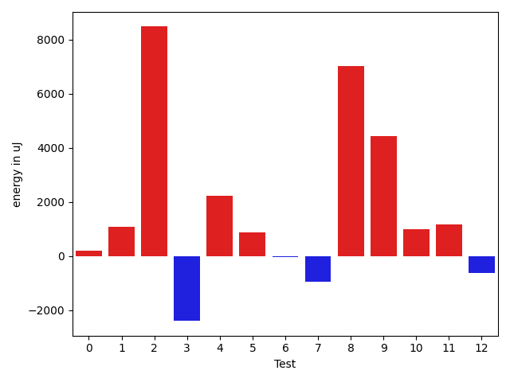

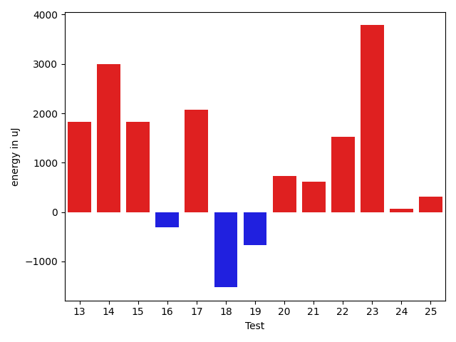

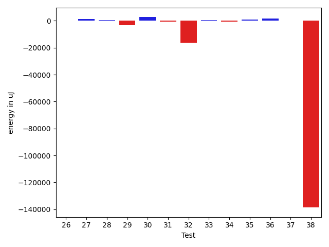

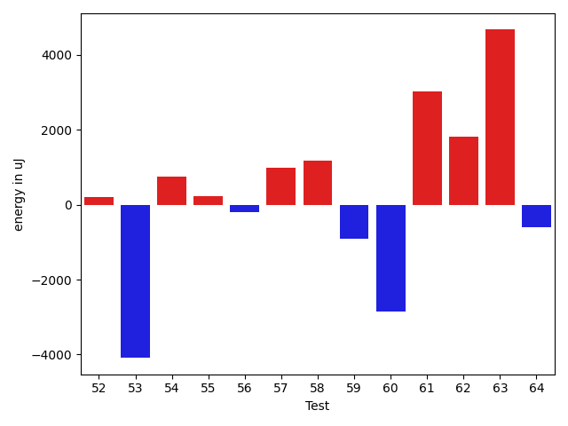

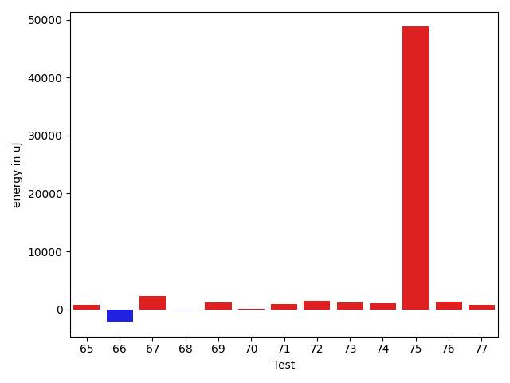

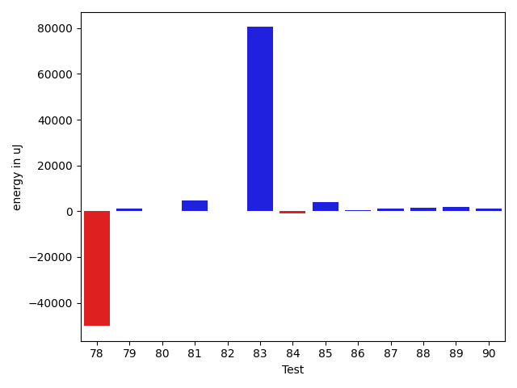

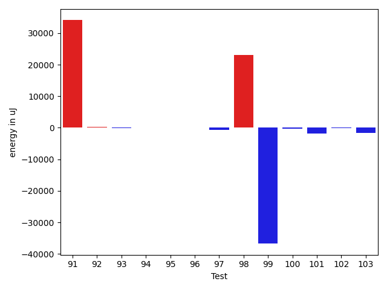

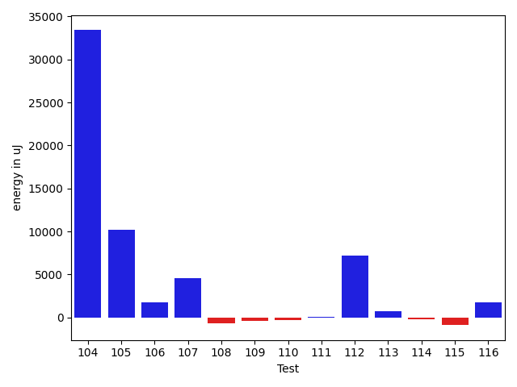

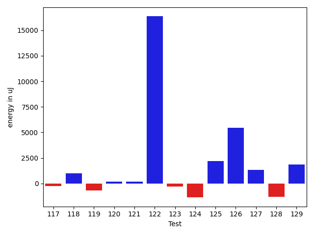

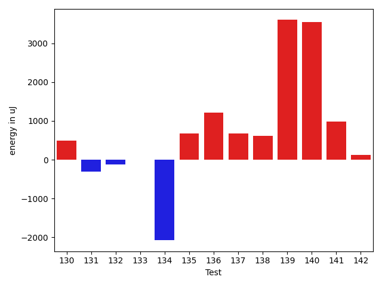

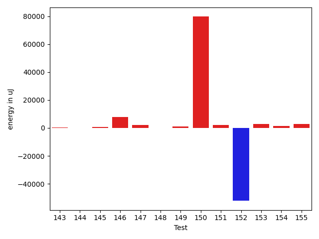

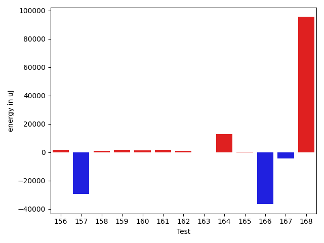

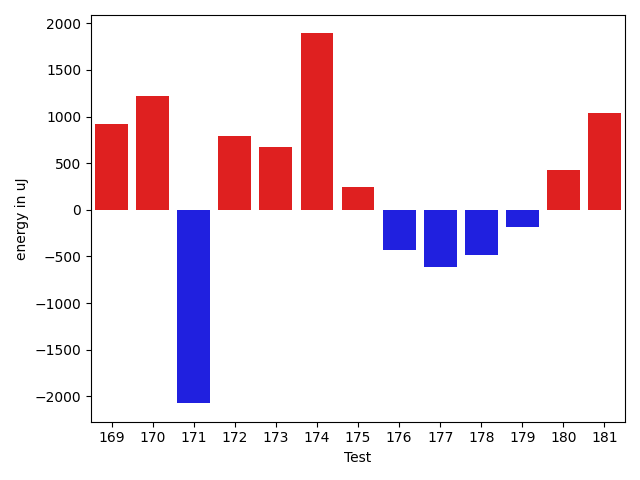

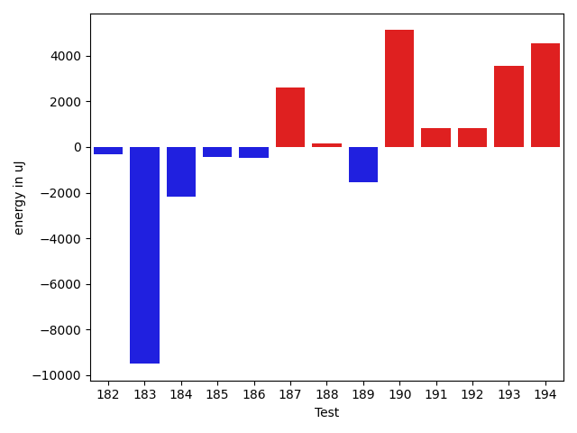

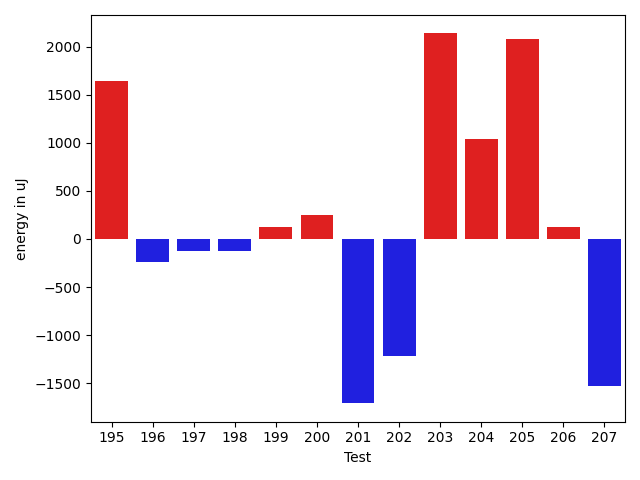

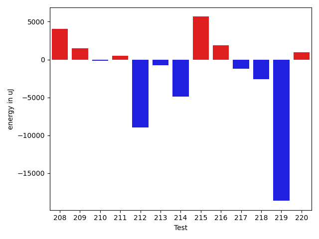

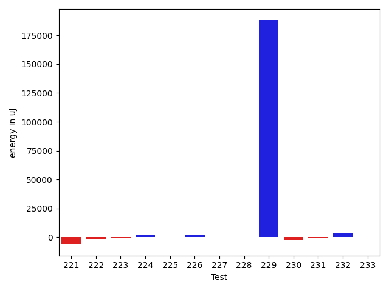

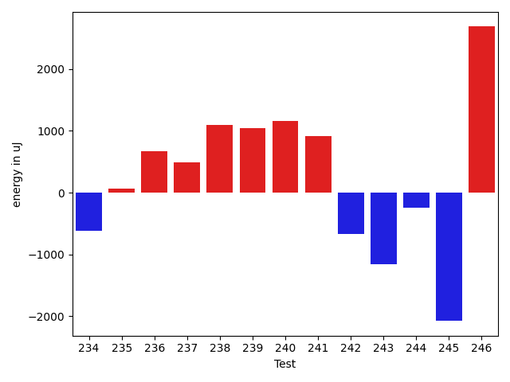

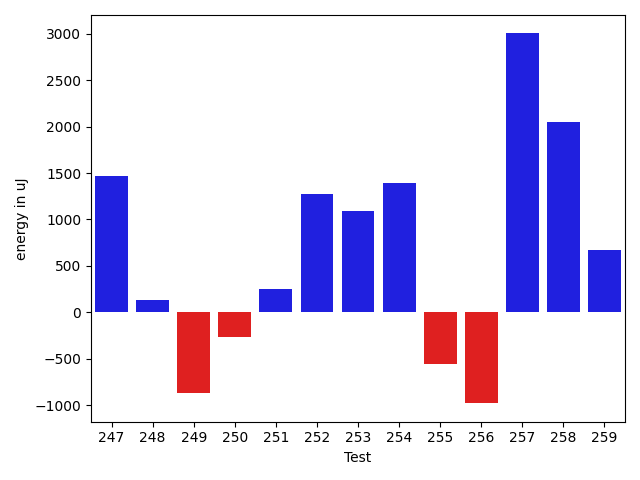

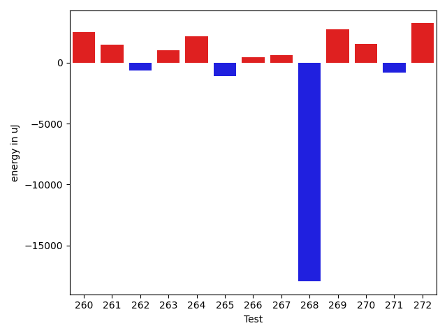

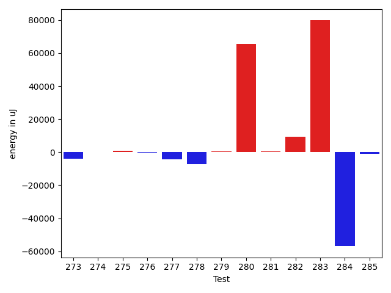

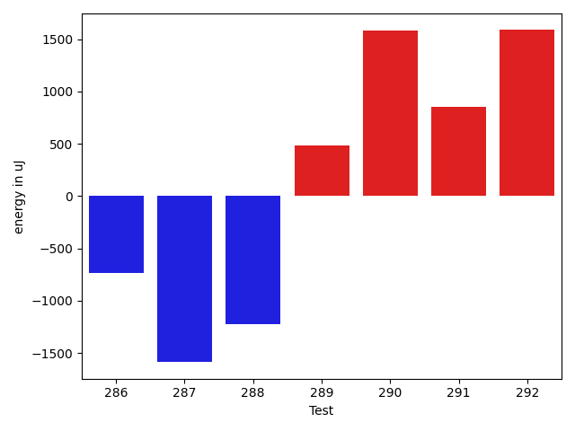

| ID | EnergyV1 | EnergyV2 | DeltaEnergy | σV1 | σV2 |
| --- | --- | --- | --- | --- | --- |
| 0 | 81238 | 82642 | 1404 | 19883.900484084435 | 19337.16007478295 |
| 1 | 41870 | 40466 | -1404 | 4753.959609088381 | 3928.4543219153 |
| 2 | 88257 | 90759 | 2502 | 59247.4444173669 | 67375.48500795476 |
| 3 | 40589 | 41443 | 854 | 38947.97602275182 | 25625.08698112766 |
| 4 | 77209 | 78674 | 1465 | 19625.78674825056 | 19568.99052025 |
| 5 | 40161 | 40283 | 122 | 4094.522356202709 | 4495.514036112989 |
| 6 | 78247 | 76660 | -1587 | 26307.74276975561 | 19194.028634199978 |
| 7 | 39367 | 37781 | -1586 | 3962.6014979990664 | 4906.568841295819 |
| 8 | 82153 | 86486 | 4333 | 23938.885475092888 | 28577.510023284136 |
| 9 | 88196 | 89661 | 1465 | 26208.391610024635 | 26907.58677437287 |
| 10 | 40710 | 39917 | -793 | 7623.474586642656 | 10170.515891257408 |
| 11 | 42481 | 44189 | 1708 | 30606.50947497405 | 26534.959480443384 |
| 12 | 40527 | 39368 | -1159 | 3820.740536859314 | 4757.847687438502 |
| 13 | 39124 | 40955 | 1831 | 3457.7077117071026 | 3343.5020591577086 |
| 14 | 38635 | 41626 | 2991 | 3522.9536869691174 | 4617.50863026993 |
| 15 | 38697 | 40527 | 1830 | 4869.666473593773 | 3621.0863064529626 |
| 16 | 40833 | 40528 | -305 | 13502.006965020772 | 20916.561956931924 |
| 17 | 38391 | 40466 | 2075 | 4166.79178195074 | 3011.5964716340204 |
| 18 | 40771 | 39245 | -1526 | 3294.0759189372397 | 3683.9692324387775 |
| 19 | 40344 | 39673 | -671 | 3532.400876978528 | 4353.286600484918 |
| 20 | 39368 | 40100 | 732 | 3734.315350755596 | 4261.0486549837005 |
| 21 | 38391 | 39002 | 611 | 4218.420391407127 | 4733.6074021918985 |
| 22 | 38879 | 40406 | 1527 | 4139.394934721739 | 4650.662736227394 |
| 23 | 38269 | 42053 | 3784 | 4433.416372773372 | 2911.4212922262564 |
| 24 | 39246 | 39307 | 61 | 3490.4862712410463 | 4219.331630720677 |
| 25 | 39917 | 40222 | 305 | 4200.384717903034 | 3920.6220358418886 |
| 26 | 40466 | 41015 | 549 | 3996.021195129861 | 4138.356024236356 |
| 27 | 40039 | 43151 | 3112 | 14320.94385570893 | 13429.804517563249 |
| 28 | 38940 | 40039 | 1099 | 3769.5721654361205 | 4974.332897700443 |
| 29 | 41259 | 40161 | -1098 | 13459.624768572208 | 6098.014323246825 |
| 30 | 42114 | 43030 | 916 | 20103.45616890875 | 21093.548431812127 |
| 31 | 41260 | 41626 | 366 | 4887.212845980871 | 4602.725679127089 |
| 32 | 44067 | 41565 | -2502 | 79059.37741198845 | 53397.99807038406 |
| 33 | 40467 | 40405 | -62 | 4295.7379820625465 | 4929.795721385962 |
| 34 | 39062 | 38880 | -182 | 6642.78831265699 | 4449.045321551523 |
| 35 | 39368 | 40222 | 854 | 4273.959758690246 | 3407.916770861663 |
| 36 | 40161 | 43274 | 3113 | 10479.936606682 | 8927.988284122403 |
| 37 | 39795 | 39245 | -550 | 4523.004270639397 | 4600.72241537493 |
| 38 | 44555 | 43701 | -854 | 641510.5146677208 | 503780.2326465877 |
| 39 | 38268 | 39916 | 1648 | 4545.354632771168 | 5439.013590001611 |
| 40 | 37232 | 39185 | 1953 | 4957.128831202084 | 3884.163671854221 |
| 41 | 40711 | 41687 | 976 | 24013.204005744527 | 17256.49426210791 |
| 42 | 43640 | 42542 | -1098 | 27231.602452640218 | 19283.977678114024 |
| 43 | 40344 | 41076 | 732 | 5187.955332686532 | 4521.10962519773 |
| 44 | 40406 | 40772 | 366 | 4169.894272771643 | 2760.1561097155354 |
| 45 | 39429 | 41138 | 1709 | 3876.278999375476 | 2934.4527246506927 |
| 46 | 40832 | 41137 | 305 | 11623.290717027789 | 6792.155169945443 |
| 47 | 40344 | 41748 | 1404 | 17675.710422046308 | 13474.841023016026 |
| 48 | 40405 | 41687 | 1282 | 4092.4454672529264 | 3866.1303151737297 |
| 49 | 40771 | 40894 | 123 | 10141.640305896353 | 21999.95896721253 |
| 50 | 40344 | 41321 | 977 | 6102.213639413 | 6207.00041397773 |
| 51 | 40406 | 42175 | 1769 | 4371.817521997876 | 3089.725791516791 |
| 52 | 40222 | 41504 | 1282 | 3949.9297926396116 | 4211.169876107126 |
| 53 | 42053 | 41260 | -793 | 35584.58197037743 | 6947.6428017871285 |
| 54 | 41015 | 40650 | -365 | 4620.570225745451 | 2855.1787889143943 |
| 55 | 40527 | 40222 | -305 | 3768.330229985454 | 3549.7316641543484 |
| 56 | 39673 | 38696 | -977 | 4289.407464074397 | 4053.2617097221837 |
| 57 | 39978 | 41259 | 1281 | 3708.341309782754 | 3596.228653373385 |
| 58 | 40832 | 41199 | 367 | 8435.876214678296 | 9982.147151112174 |
| 59 | 41260 | 41503 | 243 | 13163.012043735775 | 11048.087758628793 |
| 60 | 40894 | 41199 | 305 | 13547.20258469404 | 8662.02998005849 |
| 61 | 77941 | 75806 | -2135 | 46977.079025670646 | 62502.45785749987 |
| 62 | 40833 | 41504 | 671 | 12692.942203465722 | 13439.65899103565 |
| 63 | 80811 | 82520 | 1709 | 32044.3912703257 | 35343.80467799432 |
| 64 | 40832 | 41870 | 1038 | 28910.01606012839 | 13040.205357960349 |
| 65 | 40649 | 41443 | 794 | 27720.950062170945 | 34306.47054754855 |
| 66 | 75379 | 73242 | -2137 | 32444.540701374248 | 29954.20477344761 |
| 67 | 80871 | 83130 | 2259 | 40102.42033892077 | 40361.10092971887 |
| 68 | 39794 | 39673 | -121 | 12135.300484746556 | 4689.415893302716 |
| 69 | 39062 | 40222 | 1160 | 4201.028871168216 | 4233.311574878467 |
| 70 | 39368 | 39489 | 121 | 6417.502251085486 | 3999.17757172235 |
| 71 | 40650 | 41565 | 915 | 10720.472718015577 | 13212.832668369525 |
| 72 | 39429 | 40894 | 1465 | 3087.5360725625533 | 3795.1354591620075 |
| 73 | 39978 | 41138 | 1160 | 4007.8060666359665 | 20822.00532554623 |
| 74 | 39307 | 40405 | 1098 | 9484.980141910684 | 3582.8049124114796 |
| 75 | 40893 | 89660 | 48767 | 14879.166442630898 | 29763.102985724505 |
| 76 | 39917 | 41259 | 1342 | 24613.669533999873 | 25089.625286065508 |
| 77 | 39977 | 40772 | 795 | 3436.8170754347693 | 3725.6914191333553 |
| 78 | 84411 | 43945 | -40466 | 82664.82143231969 | 70940.1986172344 |
| 79 | 39123 | 40527 | 1404 | 4168.277950984874 | 4201.928436195366 |
| 80 | 40039 | 40344 | 305 | 4216.010275428334 | 4386.440707639014 |
| 81 | 40893 | 42175 | 1282 | 22838.272711813643 | 31463.89330010817 |
| 82 | 39917 | 40832 | 915 | 3041.2818039994036 | 4122.722453367434 |
| 83 | 41687 | 43213 | 1526 | 205973.17228695363 | 409572.8606816678 |
| 84 | 40527 | 40100 | -427 | 4147.642716603655 | 5439.098259398357 |
| 85 | 41626 | 42480 | 854 | 23529.438308033856 | 29785.853727172722 |
| 86 | 39246 | 40711 | 1465 | 3586.886486602186 | 4241.696210220143 |
| 87 | 40039 | 41504 | 1465 | 4311.971352769563 | 4366.029922847212 |
| 88 | 39490 | 39612 | 122 | 4265.947483496142 | 6456.757349798033 |
| 89 | 41076 | 42175 | 1099 | 3964.9395605905274 | 3790.4915894638143 |
| 90 | 41747 | 40466 | -1281 | 2981.0059415110445 | 9882.581483156031 |
| 91 | 80932 | 84716 | 3784 | 49503.503452443794 | 116860.02736879469 |
| 92 | 40466 | 40588 | 122 | 2817.7000279483264 | 3863.9034740703564 |
| 93 | 41260 | 41260 | 0 | 4366.1326191341 | 4232.469438876127 |
| 94 | 40466 | 41443 | 977 | 5982.7525010148765 | 4073.0564765252266 |
| 95 | 40405 | 40344 | -61 | 5018.068112778815 | 4543.972118743353 |
| 96 | 40038 | 40710 | 672 | 4779.310174857875 | 3961.63851935459 |
| 97 | 41748 | 41260 | -488 | 6522.266495533154 | 4569.9547499078135 |
| 98 | 104187 | 130249 | 26062 | 85199.30595849993 | 95900.415532287 |
| 99 | 45410 | 41382 | -4028 | 110832.60458351832 | 46709.366286828285 |
| 100 | 42419 | 41626 | -793 | 4373.936586234908 | 5385.077776069812 |
| 101 | 41747 | 41321 | -426 | 7979.265875346008 | 4804.949401154431 |
| 102 | 42237 | 41626 | -611 | 5352.5453883549635 | 6924.76178785658 |
| 103 | 41015 | 38391 | -2624 | 4197.066917916533 | 4746.372227977459 |
| 104 | 42663 | 41931 | -732 | 408922.8496976637 | 492160.23770415335 |
| 105 | 44677 | 66162 | 21485 | 42594.80636266742 | 52196.42237357407 |
| 106 | 40832 | 42541 | 1709 | 11027.381825182592 | 11133.102005478975 |
| 107 | 41870 | 43457 | 1587 | 19442.5160438732 | 21332.028189762117 |
| 108 | 42114 | 42053 | -61 | 3669.167712785211 | 4521.940743751514 |
| 109 | 40405 | 40161 | -244 | 4204.940337928927 | 4839.074199679108 |
| 110 | 40955 | 39612 | -1343 | 2798.0977037980642 | 4321.4653603805955 |
| 111 | 40283 | 41504 | 1221 | 3020.693807775361 | 4658.011080370255 |
| 112 | 44738 | 44189 | -549 | 62865.88476856166 | 82127.44387718143 |
| 113 | 40588 | 41809 | 1221 | 3877.3662584164836 | 4407.034817140614 |
| 114 | 40222 | 39855 | -367 | 4142.98164591638 | 3742.4023000032016 |
| 115 | 43762 | 44617 | 855 | 64755.40096541796 | 52931.102034846954 |
| 116 | 41748 | 41687 | -61 | 12532.594603941578 | 14573.042055347909 |
| 117 | 41260 | 40283 | -977 | 4450.6277907279555 | 4966.456921743018 |
| 118 | 41138 | 40650 | -488 | 6584.433063326872 | 9507.693494393545 |
| 119 | 43579 | 42053 | -1526 | 4138.264520263226 | 4298.898313528615 |
| 120 | 40771 | 39978 | -793 | 3769.537221205836 | 3786.2120847381602 |
| 121 | 40833 | 41626 | 793 | 5353.766328288955 | 3967.1306916516332 |
| 122 | 40649 | 43762 | 3113 | 74186.3760935473 | 87261.8607133837 |
| 123 | 42053 | 41626 | -427 | 46550.28074314498 | 43357.76628189251 |
| 124 | 40344 | 40711 | 367 | 7393.669169677713 | 4092.489656473218 |
| 125 | 42053 | 42175 | 122 | 15387.716937217507 | 17796.67624495763 |
| 126 | 42236 | 43701 | 1465 | 31406.538902170574 | 31085.674125822392 |
| 127 | 40283 | 41321 | 1038 | 3894.156713551124 | 7321.384830863583 |
| 128 | 76965 | 77148 | 183 | 53892.413166982304 | 26800.648773891244 |
| 129 | 40344 | 41321 | 977 | 17157.873872027365 | 20821.039378761605 |
| 130 | 41687 | 42176 | 489 | 17863.675962539193 | 15471.162300223648 |
| 131 | 42541 | 42236 | -305 | 22849.39330576378 | 21249.480101979527 |
| 132 | 42602 | 42480 | -122 | 35368.690504005266 | 65011.48897653752 |
| 133 | 41077 | 41077 | 0 | 4430.568443430381 | 10592.659239552575 |
| 134 | 81664 | 79589 | -2075 | 34627.73844357105 | 36966.0218910246 |
| 135 | 40527 | 41198 | 671 | 3618.696089547194 | 4874.716029791609 |
| 136 | 41443 | 42664 | 1221 | 13128.541239114986 | 10211.784735662028 |
| 137 | 40527 | 41199 | 672 | 3532.7541648965853 | 3868.4085682081122 |
| 138 | 40772 | 41382 | 610 | 4132.649779170612 | 5008.923199578352 |
| 139 | 41016 | 44617 | 3601 | 9972.351817329258 | 22031.310956634232 |
| 140 | 39611 | 43152 | 3541 | 4905.151898435171 | 36358.11184065096 |
| 141 | 41320 | 42297 | 977 | 4664.296043182712 | 7060.929053953144 |
| 142 | 41199 | 41321 | 122 | 9048.399808988646 | 16117.464391142206 |
| 143 | 40161 | 40406 | 245 | 3949.3458460320044 | 2840.1402979642385 |
| 144 | 39673 | 40649 | 976 | 4313.545396866915 | 2993.7821696368524 |
| 145 | 40893 | 42236 | 1343 | 4307.585093743796 | 3161.2321028616775 |
| 146 | 39611 | 42358 | 2747 | 3450.716009596978 | 29252.065172305563 |
| 147 | 39612 | 41626 | 2014 | 4235.658282172127 | 3310.360804849529 |
| 148 | 43213 | 40893 | -2320 | 4218.971062978142 | 3374.0646244500713 |
| 149 | 39429 | 40039 | 610 | 5024.192032580653 | 2959.1847150042518 |
| 150 | 42480 | 42969 | 489 | 23643.951876290863 | 430008.288193244 |
| 151 | 86243 | 85510 | -733 | 22949.214072700554 | 34083.330391834046 |
| 152 | 83374 | 83007 | -367 | 366154.5274224476 | 245579.24928686334 |
| 153 | 38086 | 41138 | 3052 | 4613.926978883443 | 3707.490072321656 |
| 154 | 41138 | 41260 | 122 | 8862.182427907372 | 9142.779017719879 |
| 155 | 39368 | 41870 | 2502 | 5068.268580790169 | 4787.412342423674 |
| 156 | 41687 | 40466 | -1221 | 4741.803948696089 | 4689.931184139774 |
| 157 | 43151 | 42602 | -549 | 58076.58730084597 | 21589.91225277779 |
| 158 | 40344 | 40589 | 245 | 10265.316365244465 | 15361.83495296477 |
| 159 | 39062 | 40894 | 1832 | 4505.511942162554 | 5110.819793211035 |
| 160 | 39917 | 41199 | 1282 | 5174.37716279488 | 4148.740616051044 |
| 161 | 39734 | 41870 | 2136 | 4359.000308653835 | 3986.9746481706784 |
| 162 | 40894 | 40833 | -61 | 4831.008004206196 | 4493.732302431594 |
| 163 | 41565 | 43152 | 1587 | 7484.465727724841 | 4595.859634104254 |
| 164 | 88989 | 113281 | 24292 | 384876.2157843012 | 376673.7654116457 |
| 165 | 40161 | 40954 | 793 | 7899.510150318831 | 4917.578414352106 |
| 166 | 86242 | 87524 | 1282 | 552505.3877892294 | 421240.67010310694 |
| 167 | 44800 | 44922 | 122 | 26328.244034152278 | 22690.832131159146 |
| 168 | 154724 | 175171 | 20447 | 201186.29195290015 | 407673.62715928303 |
| 169 | 40710 | 41626 | 916 | 6127.879706811778 | 12556.531233121965 |
| 170 | 41321 | 42542 | 1221 | 24520.323471872867 | 30333.50660140969 |
| 171 | 42053 | 39978 | -2075 | 19800.014646434567 | 3357.464590375341 |
| 172 | 40405 | 41199 | 794 | 5082.923091642795 | 4039.8514256980693 |
| 173 | 41626 | 42298 | 672 | 11427.276954904071 | 41070.11689162198 |
| 174 | 40345 | 42236 | 1891 | 6657.451119800555 | 8721.789349928242 |
| 175 | 39612 | 39856 | 244 | 3911.9180812340273 | 4113.269380990611 |
| 176 | 40527 | 40100 | -427 | 3778.549070263464 | 4579.724098948014 |
| 177 | 86243 | 85632 | -611 | 81244.51891743654 | 93204.37927627811 |
| 178 | 41138 | 40649 | -489 | 12795.515298687013 | 10837.681988062528 |
| 179 | 43274 | 43090 | -184 | 24265.261363823687 | 28192.325587230927 |
| 180 | 41870 | 42298 | 428 | 12210.71852899577 | 14705.45282229086 |
| 181 | 40100 | 41138 | 1038 | 11690.859137545229 | 9729.211153431439 |
| 182 | 40955 | 40466 | -489 | 3595.7699944552314 | 3794.945017717648 |
| 183 | 42053 | 42358 | 305 | 35317.64461513353 | 19407.306287011783 |
| 184 | 41626 | 43151 | 1525 | 82787.06205780638 | 70280.31204782744 |
| 185 | 41199 | 42053 | 854 | 15359.691098232934 | 13137.50197603536 |
| 186 | 40649 | 41382 | 733 | 7041.676278976336 | 6254.6301050393895 |
| 187 | 38330 | 42053 | 3723 | 4504.176049638165 | 4459.362209669091 |
| 188 | 38269 | 39734 | 1465 | 8608.161223649551 | 4051.499067385811 |
| 189 | 41625 | 41992 | 367 | 14932.316462851488 | 12168.905482283804 |
| 190 | 39856 | 39185 | -671 | 12869.462619571308 | 32846.72985919199 |
| 191 | 41748 | 42054 | 306 | 4355.575977843278 | 4265.785537205675 |
| 192 | 39307 | 39856 | 549 | 4333.182992609737 | 3590.249030350715 |
| 193 | 37292 | 39429 | 2137 | 3759.569555148568 | 3415.4507033370005 |
| 194 | 40283 | 39978 | -305 | 4982.5561948035265 | 28196.781061127942 |
| 195 | 41260 | 42907 | 1647 | 3275.160864958854 | 4391.040641303636 |
| 196 | 41809 | 41565 | -244 | 3708.1291018379384 | 4360.323912853264 |
| 197 | 41137 | 41015 | -122 | 46473.612381784114 | 22253.087277423085 |
| 198 | 41259 | 41137 | -122 | 19412.68040660251 | 20889.743015396754 |
| 199 | 42663 | 42785 | 122 | 277490.65505162027 | 18118.12796112103 |
| 200 | 41443 | 41687 | 244 | 12004.033371297977 | 11638.92672763695 |
| 201 | 43396 | 41687 | -1709 | 4759.685424384719 | 4671.2149906516715 |
| 202 | 41565 | 40344 | -1221 | 4697.613372833523 | 5441.009783407671 |
| 203 | 39611 | 41748 | 2137 | 3799.7143368439056 | 3645.1061796914078 |
| 204 | 41321 | 42358 | 1037 | 14765.229852055374 | 368283.39818833146 |
| 205 | 39368 | 41443 | 2075 | 4801.88785976427 | 4410.661460093663 |
| 206 | 38819 | 38940 | 121 | 5349.965307680829 | 4132.712681859619 |
| 207 | 41748 | 40222 | -1526 | 7387.247715136129 | 6514.013177698947 |
| 208 | 75073 | 76172 | 1099 | 55074.74690938806 | 55531.69856851579 |
| 209 | 40833 | 40771 | -62 | 4815.5334983872235 | 3871.4776945708713 |
| 210 | 39855 | 39428 | -427 | 8215.128058363187 | 9200.66267852748 |
| 211 | 44128 | 44434 | 306 | 68155.02945934057 | 55203.001184878354 |
| 212 | 330626 | 321899 | -8727 | 176045.83885833304 | 156820.7821552465 |
| 213 | 40405 | 39428 | -977 | 4533.75830917746 | 3639.2006854265214 |
| 214 | 41748 | 41443 | -305 | 27251.23994293573 | 17267.9820343768 |
| 215 | 43030 | 43457 | 427 | 20284.00871351617 | 31259.124992874527 |
| 216 | 40100 | 41442 | 1342 | 4747.971338867869 | 3843.629906741803 |
| 217 | 39978 | 39490 | -488 | 3770.2312256541986 | 4703.215201792812 |
| 218 | 39795 | 37598 | -2197 | 2743.137900881506 | 3267.7159519150377 |
| 219 | 41504 | 42053 | 549 | 87181.15070371974 | 53197.21255168864 |
| 220 | 38147 | 39978 | 1831 | 4629.379665251924 | 3500.213313936103 |
| 221 | 41931 | 39917 | -2014 | 25368.166804203993 | 20663.002188982406 |
| 222 | 40832 | 41382 | 550 | 19210.326650993466 | 15603.418798885412 |
| 223 | 38940 | 40527 | 1587 | 4070.298389503138 | 3119.8107136313397 |
| 224 | 42237 | 42236 | -1 | 5033.277760068482 | 5380.59173177849 |
| 225 | 40466 | 41138 | 672 | 5051.548399686476 | 5194.6620812993115 |
| 226 | 37110 | 40466 | 3356 | 4566.519588872422 | 4357.221212475268 |
| 227 | 42053 | 44128 | 2075 | 7085.251366259134 | 4217.3447389915855 |
| 228 | 42724 | 42664 | -60 | 4755.3749852141 | 4987.923971417654 |
| 229 | 43274 | 43335 | 61 | 279412.2303309278 | 733914.6090432378 |
| 230 | 42358 | 41016 | -1342 | 10821.829244432125 | 6276.3547456712295 |
| 231 | 42114 | 41931 | -183 | 4131.572599928927 | 6515.418292615013 |
| 232 | 42663 | 41931 | -732 | 274560.95037538797 | 335039.8170319338 |
| 233 | 42053 | 40832 | -1221 | 15918.968727896823 | 26222.20731053488 |
| 234 | 42542 | 41931 | -611 | 37751.28000225415 | 33412.62554394821 |
| 235 | 41565 | 41626 | 61 | 41480.70954340189 | 45542.20084564848 |
| 236 | 41809 | 42480 | 671 | 83158.36757639374 | 95903.76198454664 |
| 237 | 41382 | 41870 | 488 | 3530.313833544209 | 4158.806861348577 |
| 238 | 42419 | 43518 | 1099 | 421904.36815448955 | 384543.82572427037 |
| 239 | 40588 | 41626 | 1038 | 6891.997996146611 | 10228.513402902929 |
| 240 | 42237 | 43396 | 1159 | 4517.768399326042 | 3645.782138087793 |
| 241 | 40588 | 41504 | 916 | 3370.051501252429 | 3461.9545322463264 |
| 242 | 44312 | 43640 | -672 | 30056.562916869167 | 32443.38929477981 |
| 243 | 39734 | 38574 | -1160 | 2917.924308728406 | 58294.005776999824 |
| 244 | 39734 | 39490 | -244 | 3848.7760601638442 | 4634.567921326102 |
| 245 | 42358 | 40283 | -2075 | 4865.164602356707 | 2903.8073068553053 |
| 246 | 39917 | 42603 | 2686 | 2917.5322818980003 | 4263.674652134729 |
| 247 | 39307 | 41992 | 2685 | 3282.5454408779433 | 3188.0375000995227 |
| 248 | 40405 | 40344 | -61 | 3145.387402168805 | 3563.0716540912235 |
| 249 | 42969 | 41870 | -1099 | 4572.7536612937065 | 4103.506878570979 |
| 250 | 42480 | 41443 | -1037 | 9740.116511762404 | 8769.669753009115 |
| 251 | 40955 | 40345 | -610 | 4083.3615721963615 | 3483.9523173588614 |
| 252 | 39429 | 40771 | 1342 | 2528.36349925698 | 3522.341546787055 |
| 253 | 39855 | 40711 | 856 | 3890.006452356474 | 3274.1317424115155 |
| 254 | 40100 | 40588 | 488 | 3968.5408002407894 | 3666.743926269373 |
| 255 | 40405 | 39795 | -610 | 3993.6438997906494 | 4213.204111647096 |
| 256 | 39794 | 39855 | 61 | 3822.984559766737 | 4186.501484724447 |
| 257 | 39185 | 42541 | 3356 | 4313.601411435921 | 3475.1149221604487 |
| 258 | 38574 | 41809 | 3235 | 3743.16614343309 | 3930.656570175568 |
| 259 | 40222 | 42358 | 2136 | 4410.940426655069 | 3252.5572332482566 |
| 260 | 39917 | 42175 | 2258 | 4235.243999880102 | 3290.8044835207593 |
| 261 | 40344 | 42297 | 1953 | 2874.4374041707483 | 3743.2080995508663 |
| 262 | 41382 | 39917 | -1465 | 4584.334229059999 | 4848.074244315984 |
| 263 | 41015 | 43701 | 2686 | 3649.7255030344404 | 4532.236903786123 |
| 264 | 39550 | 41504 | 1954 | 4537.002077409213 | 3478.732509899622 |
| 265 | 179076 | 177673 | -1403 | 62972.61395619911 | 52727.56440600271 |
| 266 | 42724 | 42725 | 1 | 17128.95117888192 | 22751.06218285915 |
| 267 | 41077 | 41931 | 854 | 12722.26484331561 | 14103.251502603283 |
| 268 | 40039 | 43030 | 2991 | 73758.78675357939 | 8336.99177489071 |
| 269 | 41564 | 42053 | 489 | 16914.071453093035 | 17846.680890163454 |
| 270 | 42114 | 42236 | 122 | 20023.81540487311 | 24683.42693995305 |
| 271 | 41504 | 40771 | -733 | 10325.215450235231 | 9199.132210280612 |
| 272 | 43029 | 43396 | 367 | 106799.97160876135 | 113682.00369170133 |
| 273 | 42664 | 41138 | -1526 | 13508.714125785846 | 5348.169683624833 |
| 274 | 41626 | 40405 | -1221 | 4451.905197652898 | 4015.0030899739045 |
| 275 | 42602 | 42175 | -427 | 4043.4112543035453 | 5136.505985044698 |
| 276 | 41687 | 43701 | 2014 | 3491.0181428158444 | 6038.656137760568 |
| 277 | 44067 | 44677 | 610 | 90665.73532565022 | 79314.49922450527 |
| 278 | 42114 | 41259 | -855 | 78606.37321506471 | 64928.12071030108 |
| 279 | 42237 | 41626 | -611 | 4383.993719475196 | 3946.386281210862 |
| 280 | 43518 | 42969 | -549 | 287191.127053404 | 414086.39438775304 |
| 281 | 42236 | 44006 | 1770 | 33456.90345677125 | 29241.705091973534 |
| 282 | 44677 | 43457 | -1220 | 45271.00613967036 | 52551.04287234889 |
| 283 | 42480 | 39612 | -2868 | 4073.160445490195 | 357339.8344287235 |
| 284 | 40832 | 40405 | -427 | 303091.1537898693 | 4456.999249539986 |
| 285 | 43213 | 43457 | 244 | 34220.44957078134 | 40064.128737102896 |
| 286 | 41809 | 41077 | -732 | 4755.039428832768 | 3532.2434457437953 |
| 287 | 43579 | 41992 | -1587 | 798954.3011431552 | 516964.4814011561 |
| 288 | 42359 | 41138 | -1221 | 8419.695487165252 | 8433.972576094908 |
| 289 | 42785 | 43273 | 488 | 13380.964762803149 | 23411.64252607179 |
| 290 | 41565 | 43152 | 1587 | 816504.1936496979 | 561029.6572253319 |
| 291 | 41076 | 41931 | 855 | 3907.7454201995947 | 408280.8827400839 |
| 292 | 41503 | 43091 | 1588 | 247904.3202675421 | 7139.2605850638765 |

## Delta Duration per test method

| ID | DurationV1 | DurationsV2 | DeltaDuration |
| --- | --- | --- | --- |
| 0 | 2353346.767676768 | 2420382.111111111 | 67035.34343434311 |
| 1 | 409725.5625 | 468621.6875 | 58896.125 |
| 2 | 3122173.696969697 | 3366849.02020202 | 244675.3232323234 |
| 3 | 1222719.8260869565 | 1105465.7972972973 | -117254.02878965926 |
| 4 | 2024430.121212121 | 2052359.707070707 | 27929.58585858601 |
| 5 | 528591.7307692308 | 563720.4666666667 | 35128.73589743592 |
| 6 | 2155096.757575758 | 2143566.9595959596 | -11529.797979798168 |
| 7 | 668184.6111111111 | 716695.65 | 48511.0388888889 |
| 8 | 2457288.3434343436 | 2571634.0303030303 | 114345.6868686867 |
| 9 | 2756565.0404040404 | 2873850.727272727 | 117285.6868686867 |
| 10 | 1006658.1363636364 | 1001933.8208955224 | -4724.315468113986 |
| 11 | 1367690.6896551724 | 1330658.435483871 | -37032.25417130138 |
| 12 | 362503.875 | 434545.3846153846 | 72041.50961538462 |
| 13 | 519911.02777777775 | 547233.1714285715 | 27322.143650793703 |
| 14 | 423905.17391304346 | 495442.5925925926 | 71537.41867954913 |
| 15 | 486457.30555555556 | 549043.1052631579 | 62585.7997076023 |
| 16 | 1031989.1571428571 | 1306408.2105263157 | 274419.05338345864 |
| 17 | 489356.95454545453 | 513965.5882352941 | 24608.633689839568 |
| 18 | 456165.9583333333 | 487254.5416666667 | 31088.583333333372 |
| 19 | 691204.947368421 | 710602.7115384615 | 19397.764170040493 |
| 20 | 329994.5833333333 | 383100.8823529412 | 53106.29901960789 |
| 21 | 499152.38095238095 | 591227.15625 | 92074.77529761905 |
| 22 | 487220.16 | 513110.57575757575 | 25890.41575757577 |
| 23 | 327826.9375 | 421503.53846153844 | 93676.60096153844 |
| 24 | 335756.6666666667 | 362231.0 | 26474.333333333314 |
| 25 | 513985.5263157895 | 504155.73076923075 | -9829.795546558744 |
| 26 | 676058.25 | 702395.8541666666 | 26337.604166666628 |
| 27 | 857263.1428571428 | 808386.0 | -48877.14285714284 |
| 28 | 787433.5094339623 | 767698.2452830189 | -19735.264150943374 |
| 29 | 793625.023255814 | 755867.125 | -37757.89825581398 |
| 30 | 1338053.5813953488 | 1536920.84375 | 198867.26235465123 |
| 31 | 538057.7777777778 | 554151.7857142857 | 16094.00793650793 |
| 32 | 2035088.3953488371 | 1573943.9705882352 | -461144.42476060195 |
| 33 | 860016.3770491803 | 581463.5555555555 | -278552.8214936248 |
| 34 | 837704.4893617021 | 810095.2448979592 | -27609.244463742943 |
| 35 | 766334.5217391305 | 651950.7380952381 | -114383.78364389238 |
| 36 | 815779.9393939395 | 789589.4137931034 | -26190.52560083603 |
| 37 | 623421.7666666667 | 790879.2 | 167457.43333333323 |
| 38 | 11190186.695652174 | 7164701.5 | -4025485.195652174 |
| 39 | 609280.9166666666 | 694103.9 | 84822.9833333334 |
| 40 | 422196.35294117645 | 401798.2727272727 | -20398.08021390374 |
| 41 | 1292079.8904109588 | 1196167.6142857142 | -95912.27612524456 |
| 42 | 1565826.038961039 | 1310334.2571428572 | -255491.78181818174 |
| 43 | 669419.0 | 570845.7083333334 | -98573.29166666663 |
| 44 | 485432.875 | 408481.125 | -76951.75 |
| 45 | 629812.4358974359 | 660385.4166666666 | 30572.98076923075 |
| 46 | 922711.8 | 887962.9433962264 | -34748.85660377366 |
| 47 | 1245109.6417910447 | 1105385.7833333334 | -139723.8584577113 |
| 48 | 590648.1463414634 | 597567.4615384615 | 6919.315196998068 |
| 49 | 1107590.564102564 | 916316.6779661017 | -191273.88613646233 |
| 50 | 902205.4411764706 | 920438.6315789474 | 18233.190402476816 |
| 51 | 642703.9591836735 | 696330.4594594594 | 53626.50027578592 |
| 52 | 547907.3235294118 | 540604.9333333333 | -7302.390196078457 |
| 53 | 954870.9791666666 | 1020563.8857142857 | 65692.90654761903 |
| 54 | 644098.9230769231 | 622671.1388888889 | -21427.784188034246 |
| 55 | 701063.9375 | 718097.225 | 17033.287499999977 |
| 56 | 495281.9285714286 | 432557.85 | -62724.0785714286 |
| 57 | 399357.8095238095 | 390456.0 | -8901.809523809527 |
| 58 | 1031474.6375 | 1109975.2738095238 | 78500.63630952383 |
| 59 | 1193999.5795454546 | 1227871.2674418604 | 33871.68789640581 |
| 60 | 1201934.2093023255 | 1193786.6888888888 | -8147.520413436694 |
| 61 | 2148435.303030303 | 2383560.222222222 | 235124.9191919188 |
| 62 | 1197456.5802469135 | 1190172.3181818181 | -7284.262065095361 |
| 63 | 2252701.1414141413 | 2337088.2525252528 | 84387.11111111147 |
| 64 | 1304075.9782608696 | 1269333.4333333333 | -34742.54492753628 |
| 65 | 1247183.2375 | 1338494.7710843373 | 91311.53358433722 |
| 66 | 2001724.4040404041 | 1979623.1616161617 | -22101.24242424243 |
| 67 | 2415030.797979798 | 2534049.0303030303 | 119018.2323232321 |
| 68 | 1046294.802631579 | 1009072.4078947369 | -37222.394736842136 |
| 69 | 813858.0333333333 | 801461.3 | -12396.733333333279 |
| 70 | 896200.9137931034 | 943869.328358209 | 47668.41456510557 |
| 71 | 1189224.3411764705 | 1208399.9325842697 | 19175.591407799162 |
| 72 | 561341.25 | 575069.2413793104 | 13727.991379310377 |
| 73 | 788982.074074074 | 918568.5593220339 | 129586.48524795985 |
| 74 | 832115.0 | 781911.7142857143 | -50203.28571428568 |
| 75 | 1265954.280487805 | 2643381.4545454546 | 1377427.1740576497 |
| 76 | 1292173.9655172413 | 1177224.25 | -114949.71551724127 |
| 77 | 692061.05 | 673950.1632653062 | -18110.886734693893 |
| 78 | 3415299.0303030303 | 2173137.404040404 | -1242161.6262626261 |
| 79 | 637699.7666666667 | 546978.1621621621 | -90721.60450450459 |
| 80 | 763248.0735294118 | 781242.1020408163 | 17994.028511404525 |
| 81 | 1166119.2923076923 | 1355322.5 | 189203.20769230765 |
| 82 | 439746.95238095237 | 473795.35 | 34048.39761904761 |
| 83 | 2005645.0161290322 | 4348855.171875 | 2343210.1557459678 |
| 84 | 890051.5925925926 | 942781.8870967742 | 52730.2945041816 |
| 85 | 1098627.2903225806 | 1090553.4181818182 | -8073.872140762396 |
| 86 | 802613.3260869565 | 718657.1904761905 | -83956.13561076601 |
| 87 | 821777.9795918367 | 765108.1372549019 | -56669.84233693476 |
| 88 | 836900.8550724637 | 834838.75 | -2062.105072463746 |
| 89 | 548488.8333333334 | 463648.3333333333 | -84840.50000000006 |
| 90 | 880744.9848484849 | 961911.1492537314 | 81166.1644052465 |
| 91 | 2302718.797979798 | 3181498.909090909 | 878780.111111111 |
| 92 | 457669.45 | 549183.9393939395 | 91514.48939393944 |
| 93 | 516607.67741935485 | 606937.7428571428 | 90330.06543778797 |
| 94 | 833903.7804878049 | 923442.7826086957 | 89539.00212089077 |
| 95 | 398348.2631578947 | 439653.76470588235 | 41305.50154798763 |
| 96 | 500176.2 | 499520.2173913043 | -655.9826086956891 |
| 97 | 577699.2941176471 | 769570.4736842106 | 191871.17956656346 |
| 98 | 3523191.8421052634 | 4102443.2040816327 | 579251.3619763693 |
| 99 | 2156158.6136363638 | 1226979.1785714286 | -929179.4350649351 |
| 100 | 660181.1724137932 | 606049.8333333334 | -54131.33908045979 |
| 101 | 676560.7872340425 | 777216.088888889 | 100655.30165484641 |
| 102 | 843664.62 | 832280.0 | -11384.619999999995 |
| 103 | 748321.4285714285 | 735491.7837837838 | -12829.644787644735 |
| 104 | 3092618.5802469137 | 4037602.5512820515 | 944983.9710351378 |
| 105 | 1898202.3043478262 | 2250053.7065217393 | 351851.4021739131 |
| 106 | 871979.1020408163 | 919256.16 | 47277.0579591837 |
| 107 | 1164067.12 | 1390623.7032967033 | 226556.58329670317 |
| 108 | 434862.36363636365 | 471614.25 | 36751.88636363635 |
| 109 | 452268.18518518517 | 397544.3 | -54723.88518518518 |
| 110 | 468093.9 | 525953.8571428572 | 57859.957142857136 |
| 111 | 498608.3157894737 | 583511.3461538461 | 84903.03036437242 |
| 112 | 1500138.3157894737 | 1935235.3181818181 | 435097.0023923444 |
| 113 | 697616.9230769231 | 703199.6086956522 | 5582.685618729098 |
| 114 | 462864.2 | 451228.2105263158 | -11635.989473684225 |
| 115 | 1829236.0319148935 | 1721039.0736842104 | -108196.95823068311 |
| 116 | 970488.276923077 | 1047888.5571428571 | 77400.28021978016 |
| 117 | 837832.08 | 906401.3793103448 | 68569.29931034485 |
| 118 | 873471.1851851852 | 939641.5925925926 | 66170.40740740742 |
| 119 | 743406.8181818182 | 625891.3846153846 | -117515.43356643361 |
| 120 | 846613.7884615385 | 916952.9814814815 | 70339.19301994296 |
| 121 | 815830.7173913043 | 928677.7843137255 | 112847.06692242122 |
| 122 | 1982567.043956044 | 2357431.3586956523 | 374864.31473960844 |
| 123 | 1440429.4743589743 | 1498136.857142857 | 57707.382783882786 |
| 124 | 828189.6086956522 | 932416.9024390244 | 104227.2937433722 |
| 125 | 1341621.6875 | 1437899.0 | 96277.3125 |
| 126 | 1336110.509090909 | 1557324.267857143 | 221213.75876623392 |
| 127 | 758894.8947368421 | 798467.4509803922 | 39572.55624355003 |
| 128 | 2170700.8191489363 | 1976737.030612245 | -193963.78853669134 |
| 129 | 1137917.6623376624 | 1216675.3766233767 | 78757.71428571432 |
| 130 | 954773.6346153846 | 1270079.7411764706 | 315306.106561086 |
| 131 | 1131485.918367347 | 1106622.7118644067 | -24863.206502940273 |
| 132 | 907569.5357142857 | 1549368.6046511629 | 641799.0689368772 |
| 133 | 830175.7297297297 | 898707.8139534884 | 68532.08422375866 |
| 134 | 2185390.1224489794 | 2097451.494949495 | -87938.62749948446 |
| 135 | 661455.6315789474 | 736860.9117647059 | 75405.28018575849 |
| 136 | 1087169.2 | 1113625.4666666666 | 26456.266666666605 |
| 137 | 584653.3225806452 | 539554.03125 | -45099.29133064521 |
| 138 | 693269.3095238095 | 756519.9268292683 | 63250.61730545887 |
| 139 | 1117567.1829268292 | 1654855.7777777778 | 537288.5948509485 |
| 140 | 691404.9677419355 | 997861.1111111111 | 306456.1433691756 |
| 141 | 781509.3478260869 | 793847.9019607843 | 12338.55413469742 |
| 142 | 830040.4545454546 | 900943.9230769231 | 70903.46853146853 |
| 143 | 748292.7090909091 | 748218.7704918033 | -73.93859910580795 |
| 144 | 754683.7826086957 | 721888.8863636364 | -32794.896245059324 |
| 145 | 516854.6875 | 524122.8095238095 | 7268.122023809527 |
| 146 | 470002.63333333336 | 654262.6363636364 | 184260.003030303 |
| 147 | 543910.25 | 471371.3461538461 | -72538.90384615387 |
| 148 | 366198.77777777775 | 412861.0588235294 | 46662.281045751646 |
| 149 | 416798.55555555556 | 384509.46153846156 | -32289.094017094 |
| 150 | 1202973.5223880596 | 3756081.847222222 | 2553108.3248341624 |
| 151 | 2514068.6363636362 | 2570886.3434343436 | 56817.70707070734 |
| 152 | 5401548.545454546 | 3743366.777777778 | -1658181.767676768 |
| 153 | 519894.5862068966 | 441551.7727272727 | -78342.81347962387 |
| 154 | 850576.7142857143 | 909406.5490196078 | 58829.83473389351 |
| 155 | 591194.3636363636 | 566620.0769230769 | -24574.28671328677 |
| 156 | 484000.6153846154 | 576531.1290322581 | 92530.51364764269 |
| 157 | 1898528.6486486488 | 846923.4090909091 | -1051605.2395577398 |
| 158 | 1158119.7746478873 | 1035093.5178571428 | -123026.25679074449 |
| 159 | 564207.1785714285 | 563515.8787878788 | -691.2997835497372 |
| 160 | 651560.7105263158 | 546104.7741935484 | -105455.93633276748 |
| 161 | 534941.551724138 | 546407.5294117647 | 11465.977687626728 |
| 162 | 543035.0731707317 | 599151.2307692308 | 56116.15759849909 |
| 163 | 859011.4285714285 | 835837.8833333333 | -23173.54523809522 |
| 164 | 4632683.141414141 | 5096542.343434343 | 463859.20202020183 |
| 165 | 972998.234375 | 938450.5384615385 | -34547.6959134615 |
| 166 | 5770899.96969697 | 4895510.676767677 | -875389.2929292927 |
| 167 | 1580509.4583333333 | 1574942.0666666667 | -5567.391666666605 |
| 168 | 5484009.303030303 | 8153672.757575758 | 2669663.454545455 |
| 169 | 987457.344262295 | 1077168.6142857142 | 89711.27002341917 |
| 170 | 1229355.5862068965 | 1129968.7837837837 | -99386.8024231128 |
| 171 | 924205.5 | 700327.9310344828 | -223877.56896551722 |
| 172 | 778206.9555555555 | 823389.3137254902 | 45182.35816993471 |
| 173 | 812197.5714285715 | 1361511.4130434783 | 549313.8416149068 |
| 174 | 870562.5294117647 | 944030.7627118644 | 73468.23330009973 |
| 175 | 734684.1714285715 | 762984.3658536585 | 28300.194425087073 |
| 176 | 545254.1111111111 | 489135.3076923077 | -56118.803418803436 |
| 177 | 3092724.888888889 | 3209048.02020202 | 116323.13131313119 |
| 178 | 1109025.4133333333 | 1098687.8 | -10337.613333333284 |
| 179 | 1190373.6923076923 | 1150925.8676470588 | -39447.82466063346 |
| 180 | 1147742.8395061728 | 1215634.6 | 67891.76049382729 |
| 181 | 1110991.831168831 | 1105690.8292682928 | -5301.0019005383365 |
| 182 | 686486.4347826086 | 740934.53125 | 54448.096467391355 |
| 183 | 1654295.7142857143 | 1477458.618556701 | -176837.0957290132 |
| 184 | 1578504.734375 | 1408947.9 | -169556.8343750001 |
| 185 | 1019619.8269230769 | 942592.3620689656 | -77027.46485411131 |
| 186 | 875078.6129032258 | 907168.4901960784 | 32089.877292852616 |
| 187 | 734995.6060606061 | 714321.0545454546 | -20674.551515151514 |
| 188 | 791248.96875 | 744258.7741935484 | -46990.194556451635 |
| 189 | 1211167.3692307693 | 1164870.582278481 | -46296.786952288356 |
| 190 | 881284.2 | 1044435.8297872341 | 163151.62978723412 |
| 191 | 485431.94444444444 | 478285.85714285716 | -7146.0873015872785 |
| 192 | 722279.1702127659 | 745513.2564102564 | 23234.086197490455 |
| 193 | 414471.2 | 385662.7368421053 | -28808.46315789473 |
| 194 | 732176.9791666666 | 798453.9285714285 | 66276.9494047619 |
| 195 | 454898.7037037037 | 399620.6111111111 | -55278.092592592584 |
| 196 | 633523.4358974359 | 657953.34375 | 24429.907852564123 |
| 197 | 1619957.6235294119 | 1320466.6235294119 | -299491.0 |
| 198 | 1173181.8133333332 | 1110153.4057971016 | -63028.40753623168 |
| 199 | 2180321.86440678 | 962470.4166666666 | -1217851.4477401134 |
| 200 | 885694.1590909091 | 802388.0961538461 | -83306.06293706293 |
| 201 | 578820.3235294118 | 578010.3333333334 | -809.9901960784337 |
| 202 | 618297.0322580645 | 510100.0 | -108197.03225806449 |
| 203 | 584448.8620689656 | 534418.380952381 | -50030.48111658462 |
| 204 | 965683.6612903225 | 2503719.5535714286 | 1538035.8922811062 |
| 205 | 636028.9230769231 | 490812.6666666667 | -145216.25641025644 |
| 206 | 440171.4090909091 | 369624.7894736842 | -70546.6196172249 |
| 207 | 749857.8888888889 | 787371.3409090909 | 37513.452020202065 |
| 208 | 2110741.626262626 | 2175776.393939394 | 65034.76767676789 |
| 209 | 689126.4516129033 | 658875.243902439 | -30251.207710464252 |
| 210 | 686764.3214285715 | 734106.4411764706 | 47342.11974789912 |
| 211 | 1773757.8666666667 | 1827122.1325301204 | 53364.26586345374 |
| 212 | 9915052.707070706 | 9604936.070707072 | -310116.63636363484 |
| 213 | 473100.81481481483 | 486274.84210526315 | 13174.027290448314 |
| 214 | 1279485.8461538462 | 1137485.487804878 | -142000.3583489682 |
| 215 | 948556.4666666667 | 1081306.75 | 132750.28333333333 |
| 216 | 478371.2727272727 | 492950.1 | 14578.82727272727 |
| 217 | 456279.4285714286 | 518672.0625 | 62392.63392857142 |
| 218 | 393818.4705882353 | 506974.8 | 113156.32941176469 |
| 219 | 1830640.851851852 | 1102215.6486486488 | -728425.2032032032 |
| 220 | 476909.81481481483 | 547013.7083333334 | 70103.89351851854 |
| 221 | 1184578.576923077 | 1119810.0303030303 | -64768.54662004672 |
| 222 | 1167963.1692307692 | 1087683.7611940298 | -80279.40803673933 |
| 223 | 389030.0 | 390493.1666666667 | 1463.166666666686 |
| 224 | 399932.5 | 444767.82352941175 | 44835.32352941175 |
| 225 | 438451.3125 | 401376.5833333333 | -37074.729166666686 |
| 226 | 426773.2 | 423798.55555555556 | -2974.6444444444496 |
| 227 | 639949.3846153846 | 503844.65 | -136104.7346153846 |
| 228 | 581369.6785714285 | 561817.2857142857 | -19552.39285714284 |
| 229 | 2384950.0625 | 7626168.440677966 | 5241218.378177966 |
| 230 | 972951.6229508197 | 932375.695652174 | -40575.92729864572 |
| 231 | 801196.4255319149 | 805553.3571428572 | 4356.931610942236 |
| 232 | 2240970.9305555555 | 2320807.0149253733 | 79836.08436981775 |
| 233 | 1151701.0649350649 | 1180671.8648648649 | 28970.799929799978 |
| 234 | 1381376.2708333333 | 1240721.3921568627 | -140654.8786764706 |
| 235 | 1249666.8644067796 | 1257372.0192307692 | 7705.154823989607 |
| 236 | 1363696.0285714285 | 1443762.9428571428 | 80066.91428571427 |
| 237 | 709273.2564102564 | 697157.225 | -12116.0314102564 |
| 238 | 3240527.3970588236 | 2848571.245614035 | -391956.15144478856 |
| 239 | 777797.1333333333 | 853636.4130434783 | 75839.27971014497 |
| 240 | 562454.3214285715 | 612717.12 | 50262.79857142852 |
| 241 | 844941.5416666666 | 740673.2340425532 | -104268.3076241134 |
| 242 | 1359021.5285714285 | 1297787.0 | -61234.5285714285 |
| 243 | 387898.6842105263 | 931498.4666666667 | 543599.7824561404 |
| 244 | 634913.6774193548 | 620453.2702702703 | -14460.407149084494 |
| 245 | 407061.55555555556 | 395408.63157894736 | -11652.923976608203 |
| 246 | 516090.64705882355 | 544403.1363636364 | 28312.4893048128 |
| 247 | 397539.28571428574 | 377757.71428571426 | -19781.57142857148 |
| 248 | 399705.5833333333 | 375700.36842105264 | -24005.214912280673 |
| 249 | 487661.40625 | 556051.6363636364 | 68390.23011363635 |
| 250 | 1107366.5681818181 | 1003038.4489795918 | -104328.11920222628 |
| 251 | 924378.7884615385 | 888212.6538461539 | -36166.134615384624 |
| 252 | 469142.3125 | 420818.2916666667 | -48324.020833333314 |
| 253 | 684203.125 | 670879.6444444444 | -13323.48055555555 |
| 254 | 551014.1739130435 | 519019.97222222225 | -31994.20169082121 |
| 255 | 454970.29032258067 | 572237.76 | 117267.46967741934 |
| 256 | 610563.8181818182 | 526488.4 | -84075.41818181821 |
| 257 | 537053.3103448276 | 554840.6666666666 | 17787.356321839034 |
| 258 | 402945.0625 | 416438.76470588235 | 13493.70220588235 |
| 259 | 380253.25 | 366437.75 | -13815.5 |
| 260 | 445778.85714285716 | 460283.36363636365 | 14504.506493506487 |
| 261 | 424229.6818181818 | 401985.3333333333 | -22244.34848484851 |
| 262 | 720046.1481481482 | 671097.04 | -48949.10814814817 |
| 263 | 417566.35 | 378354.28571428574 | -39212.06428571424 |
| 264 | 367822.0 | 377514.23529411765 | 9692.23529411765 |
| 265 | 5083420.3838383835 | 5065416.222222222 | -18004.161616161466 |
| 266 | 1011441.0178571428 | 1084828.352112676 | 73387.33425553318 |
| 267 | 1160471.857142857 | 1135154.746835443 | -25317.110307414085 |
| 268 | 1267698.28 | 622702.8148148148 | -644995.4651851852 |
| 269 | 1254163.253012048 | 1259238.7954545454 | 5075.542442497332 |
| 270 | 1357587.6593406594 | 1288761.5416666667 | -68826.11767399264 |
| 271 | 1116921.2727272727 | 1041625.1733333333 | -75296.09939393937 |
| 272 | 1984450.6511627906 | 2085603.1555555556 | 101152.504392765 |
| 273 | 1098853.2096774194 | 1023194.796875 | -75658.41280241939 |
| 274 | 420806.0833333333 | 423688.6875 | 2882.604166666686 |
| 275 | 489516.89285714284 | 436172.2 | -53344.69285714283 |
| 276 | 440801.1904761905 | 542591.1904761905 | 101790.00000000006 |
| 277 | 2142812.3333333335 | 2038439.4117647058 | -104372.9215686277 |
| 278 | 1402962.1666666667 | 1346336.2428571428 | -56625.92380952393 |
| 279 | 783334.1964285715 | 656285.7391304348 | -127048.45729813667 |
| 280 | 2044897.8837209302 | 4695819.485714286 | 2650921.6019933554 |
| 281 | 1033665.9032258064 | 1169296.9545454546 | 135631.05131964816 |
| 282 | 1354138.0 | 1647124.4722222222 | 292986.47222222225 |
| 283 | 530791.9411764706 | 3257608.1 | 2726816.1588235293 |
| 284 | 2392512.0689655175 | 667230.88 | -1725281.1889655176 |
| 285 | 1120453.0208333333 | 1138177.5849056605 | 17724.564072327223 |
| 286 | 448627.17391304346 | 438455.8 | -10171.37391304347 |
| 287 | 12844685.85 | 4454678.322580645 | -8390007.527419355 |
| 288 | 897663.0 | 781250.5333333333 | -116412.46666666667 |
| 289 | 850182.3421052631 | 724870.4102564103 | -125311.9318488529 |
| 290 | 11523964.176470589 | 5419649.458333333 | -6104314.718137256 |
| 291 | 833406.3272727273 | 2991484.805970149 | 2158078.478697422 |
| 292 | 2077455.0208333333 | 920551.0 | -1156904.0208333333 |

## Misc.

| ID | Test Class | Test Method |
| --- | --- | --- |
| 0 | com.google.gson.functional.DefaultTypeAdaptersTest | testDateSerializationWithPatternNotOverridenByTypeAdapter |
| 1 | com.google.gson.functional.DefaultTypeAdaptersTest | testLocaleSerializationWithLanguage |
| 2 | com.google.gson.functional.DefaultTypeAdaptersTest | testDateSerializationWithPattern |
| 3 | com.google.gson.functional.DefaultTypeAdaptersTest | testUrlSerialization |
| 4 | com.google.gson.functional.DefaultTypeAdaptersTest | testSqlDateSerialization |
| 5 | com.google.gson.functional.DefaultTypeAdaptersTest | testUuidSerialization |
| 6 | com.google.gson.functional.DefaultTypeAdaptersTest | testTimestampSerialization |
| 7 | com.google.gson.functional.DefaultTypeAdaptersTest | testTreeSetSerialization |
| 8 | com.google.gson.functional.DefaultTypeAdaptersTest | testDateDeserializationWithPattern |
| 9 | com.google.gson.functional.DefaultTypeAdaptersTest | testDateSerializationInCollection |
| 10 | com.google.gson.functional.DefaultTypeAdaptersTest | testBigIntegerFieldSerialization |
| 11 | com.google.gson.functional.DefaultTypeAdaptersTest | testBigDecimalFieldSerialization |
| 12 | com.google.gson.functional.DefaultTypeAdaptersTest | testPropertiesSerialization |
| 13 | com.google.gson.functional.DefaultTypeAdaptersTest | testDefaultCalendarDeserialization |
| 14 | com.google.gson.functional.DefaultTypeAdaptersTest | testLocaleSerializationWithLanguageCountryVariant |
| 15 | com.google.gson.functional.DefaultTypeAdaptersTest | testUriSerialization |
| 16 | com.google.gson.functional.DefaultTypeAdaptersTest | testUrlNullSerialization |
| 17 | com.google.gson.functional.DefaultTypeAdaptersTest | testDefaultJavaSqlDateSerialization |
| 18 | com.google.gson.functional.DefaultTypeAdaptersTest | testDefaultGregorianCalendarDeserialization |
| 19 | com.google.gson.functional.DefaultTypeAdaptersTest | testBitSetDeserialization |
| 20 | com.google.gson.functional.DefaultTypeAdaptersTest | testStringBufferSerialization |
| 21 | com.google.gson.functional.DefaultTypeAdaptersTest | testSetSerialization |
| 22 | com.google.gson.functional.DefaultTypeAdaptersTest | testBitSetSerialization |
| 23 | com.google.gson.functional.DefaultTypeAdaptersTest | testLocaleSerializationWithLanguageCountry |
| 24 | com.google.gson.functional.DefaultTypeAdaptersTest | testStringBuilderSerialization |
| 25 | com.google.gson.functional.NullObjectAndFieldTest | testCustomTypeAdapterPassesNullSerialization |
| 26 | com.google.gson.functional.NullObjectAndFieldTest | testCustomTypeAdapterPassesNullDesrialization |
| 27 | com.google.gson.functional.NullObjectAndFieldTest | testTopLevelNullObjectDeserialization |
| 28 | com.google.gson.functional.NullObjectAndFieldTest | testNullWrappedPrimitiveMemberSerialization |
| 29 | com.google.gson.functional.NullObjectAndFieldTest | testExplicitNullSetsFieldToNullDuringDeserialization |
| 30 | com.google.gson.functional.NullObjectAndFieldTest | testExplicitSerializationOfNullArrayMembers |
| 31 | com.google.gson.functional.NullObjectAndFieldTest | testCustomSerializationOfNulls |
| 32 | com.google.gson.functional.NullObjectAndFieldTest | testExplicitSerializationOfNulls |
| 33 | com.google.gson.functional.NullObjectAndFieldTest | testNullWrappedPrimitiveMemberDeserialization |
| 34 | com.google.gson.functional.NullObjectAndFieldTest | testPrintPrintingObjectWithNulls |
| 35 | com.google.gson.functional.NullObjectAndFieldTest | testPrintPrintingArraysWithNulls |
| 36 | com.google.gson.functional.NullObjectAndFieldTest | testExplicitDeserializationOfNulls |
| 37 | com.google.gson.functional.NullObjectAndFieldTest | testExplicitSerializationOfNullStringMembers |
| 38 | com.google.gson.functional.NullObjectAndFieldTest | testTopLevelNullObjectSerialization |
| 39 | com.google.gson.functional.NullObjectAndFieldTest | testExplicitSerializationOfNullCollectionMembers |
| 40 | com.google.gson.functional.MapTest | testWriteMapsWithEmptyStringKey |
| 41 | com.google.gson.functional.MapTest | testSerializeMaps |
| 42 | com.google.gson.functional.MapTest | testMapSerializationWithNullValues |
| 43 | com.google.gson.functional.MapTest | testMapSerializationWithNullValuesSerialized |
| 44 | com.google.gson.functional.MapTest | testMapWithQuotes |
| 45 | com.google.gson.functional.MapTest | testMapSerializationWithIntegerKeys |
| 46 | com.google.gson.functional.MapTest | testCustomSerializerForSpecificMapType |
| 47 | com.google.gson.functional.MapTest | testMapSerializationWithWildcardValues |
| 48 | com.google.gson.functional.MapTest | testMapSerializationWithNullValue |
| 49 | com.google.gson.functional.MapTest | testMapSubclassDeserialization |
| 50 | com.google.gson.functional.MapTest | testParameterizedMapSubclassSerialization |
| 51 | com.google.gson.functional.MapTest | testMapSerializationWithNullValueButSerializeNulls |
| 52 | com.google.gson.functional.MapTest | testMapSerialization |
| 53 | com.google.gson.functional.MapTest | testMapSubclassSerialization |
| 54 | com.google.gson.functional.MapTest | testMapSerializationEmpty |
| 55 | com.google.gson.functional.MapTest | testMapSerializationWithNullKey |
| 56 | com.google.gson.functional.MapTest | testMapOfMapSerialization |
| 57 | com.google.gson.functional.MapTest | testRawMapSerialization |
| 58 | com.google.gson.functional.ParameterizedTypesTest | testParameterizedTypeGenericArraysSerialization |
| 59 | com.google.gson.functional.ParameterizedTypesTest | testVariableTypeArrayDeserialization |
| 60 | com.google.gson.functional.ParameterizedTypesTest | testParameterizedTypeWithCustomSerializer |
| 61 | com.google.gson.functional.ParameterizedTypesTest | testParameterizedTypesSerialization |
| 62 | com.google.gson.functional.ParameterizedTypesTest | testVariableTypeDeserialization |
| 63 | com.google.gson.functional.ParameterizedTypesTest | testVariableTypeFieldsAndGenericArraysSerialization |
| 64 | com.google.gson.functional.ParameterizedTypesTest | testParameterizedTypeGenericArraysDeserialization |
| 65 | com.google.gson.functional.ParameterizedTypesTest | testParameterizedTypeDeserialization |
| 66 | com.google.gson.functional.ParameterizedTypesTest | testVariableTypeFieldsAndGenericArraysDeserialization |
| 67 | com.google.gson.functional.ParameterizedTypesTest | testTypesWithMultipleParametersSerialization |
| 68 | com.google.gson.functional.ParameterizedTypesTest | testParameterizedTypesWithCustomDeserializer |
| 69 | com.google.gson.functional.ParameterizedTypesTest | testParameterizedTypesWithWriterSerialization |
| 70 | com.google.gson.functional.ParameterizedTypesTest | testParameterizedTypeWithReaderDeserialization |
| 71 | com.google.gson.functional.ParameterizedTypesTest | testParameterizedTypeWithVariableTypeDeserialization |
| 72 | com.google.gson.functional.ParameterizedTypesTest | testDeepParameterizedTypeSerialization |
| 73 | com.google.gson.functional.CustomTypeAdaptersTest | testCustomTypeAdapterAppliesToSubClassesSerializedAsBaseClass |
| 74 | com.google.gson.functional.CustomTypeAdaptersTest | testCustomAdapterInvokedForMapElementDeserialization |
| 75 | com.google.gson.functional.CustomTypeAdaptersTest | testCustomTypeAdapterDoesNotAppliesToSubClasses |
| 76 | com.google.gson.functional.CustomTypeAdaptersTest | testCustomAdapterInvokedForCollectionElementSerializationWithType |
| 77 | com.google.gson.functional.CustomTypeAdaptersTest | testEnsureCustomSerializerNotInvokedForNullValues |
| 78 | com.google.gson.functional.CustomTypeAdaptersTest | testCustomDeserializerForLong |
| 79 | com.google.gson.functional.CustomTypeAdaptersTest | testEnsureCustomDeserializerNotInvokedForNullValues |
| 80 | com.google.gson.functional.CustomTypeAdaptersTest | testCustomAdapterInvokedForMapElementSerializationWithType |
| 81 | com.google.gson.functional.CustomTypeAdaptersTest | testCustomNestedSerializers |
| 82 | com.google.gson.functional.CustomTypeAdaptersTest | testCustomAdapterInvokedForMapElementSerialization |
| 83 | com.google.gson.functional.CustomTypeAdaptersTest | testCustomSerializers |
| 84 | com.google.gson.functional.CustomTypeAdaptersTest | testCustomNestedDeserializers |
| 85 | com.google.gson.functional.CustomTypeAdaptersTest | testCustomDeserializers |
| 86 | com.google.gson.functional.CustomTypeAdaptersTest | testCustomByteArrayDeserializerAndInstanceCreator |
| 87 | com.google.gson.functional.CustomTypeAdaptersTest | testCustomByteArraySerializer |
| 88 | com.google.gson.functional.CustomTypeAdaptersTest | testCustomAdapterInvokedForCollectionElementDeserialization |
| 89 | com.google.gson.functional.CustomTypeAdaptersTest | testCustomAdapterInvokedForCollectionElementSerialization |
| 90 | com.google.gson.functional.PrettyPrintingTest | testEmptyMapField |
| 91 | com.google.gson.functional.PrettyPrintingTest | testPrettyPrintList |
| 92 | com.google.gson.functional.PrettyPrintingTest | testMultipleArrays |
| 93 | com.google.gson.functional.PrettyPrintingTest | testPrettyPrintArrayOfPrimitiveArrays |
| 94 | com.google.gson.functional.PrettyPrintingTest | testPrettyPrintArrayOfObjects |
| 95 | com.google.gson.functional.PrettyPrintingTest | testPrettyPrintArrayOfPrimitives |
| 96 | com.google.gson.functional.PrettyPrintingTest | testMap |
| 97 | com.google.gson.functional.PrettyPrintingTest | testPrettyPrintListOfPrimitiveArrays |
| 98 | com.google.gson.functional.ExposeFieldsTest | testNullExposeFieldSerialization |
| 99 | com.google.gson.functional.ExposeFieldsTest | testExposedInterfaceFieldSerialization |
| 100 | com.google.gson.functional.ExposeFieldsTest | testExposeAnnotationSerialization |
| 101 | com.google.gson.functional.ExposeFieldsTest | testNoExposedFieldSerialization |
| 102 | com.google.gson.functional.ExposeFieldsTest | testArrayWithOneNullExposeFieldObjectSerialization |
| 103 | com.google.gson.functional.FieldExclusionTest | testDefaultNestedStaticClassIncluded |
| 104 | com.google.gson.functional.FieldExclusionTest | testDefaultInnerClassExclusion |
| 105 | com.google.gson.functional.InheritanceTest | testSubInterfacesOfCollectionSerialization |
| 106 | com.google.gson.functional.InheritanceTest | testClassWithBaseArrayFieldSerialization |
| 107 | com.google.gson.functional.InheritanceTest | testSubClassSerialization |
| 108 | com.google.gson.functional.InheritanceTest | testBaseSerializedAsBaseWhenSpecifiedWithExplicitType |
| 109 | com.google.gson.functional.InheritanceTest | testBaseSerializedAsSubWhenSpecifiedWithExplicitType |
| 110 | com.google.gson.functional.InheritanceTest | testBaseSerializedAsSubForToJsonMethod |
| 111 | com.google.gson.functional.InheritanceTest | testBaseSerializedAsSub |
| 112 | com.google.gson.functional.InheritanceTest | testBaseSerializedAsBaseWhenSpecifiedWithExplicitTypeForToJsonMethod |
| 113 | com.google.gson.functional.InheritanceTest | testClassWithBaseFieldSerialization |
| 114 | com.google.gson.functional.InheritanceTest | testBaseSerializedAsSubWhenSpecifiedWithExplicitTypeForToJsonMethod |
| 115 | com.google.gson.functional.MoreSpecificTypeSerializationTest | testSubclassFields |
| 116 | com.google.gson.functional.MoreSpecificTypeSerializationTest | testListOfParameterizedSubclassFields |
| 117 | com.google.gson.functional.MoreSpecificTypeSerializationTest | testParameterizedSubclassFields |
| 118 | com.google.gson.functional.MoreSpecificTypeSerializationTest | testMapOfParameterizedSubclassFields |
| 119 | com.google.gson.functional.StringTest | testStringValueAsSingleElementArraySerialization |
| 120 | com.google.gson.functional.CustomDeserializerTest | testCustomDeserializerReturnsNullForArrayElementsForArrayField |
| 121 | com.google.gson.functional.CustomDeserializerTest | testCustomDeserializerReturnsNull |
| 122 | com.google.gson.functional.CustomDeserializerTest | testCustomDeserializerReturnsNullForTopLevelPrimitives |
| 123 | com.google.gson.functional.CustomDeserializerTest | testJsonTypeFieldBasedDeserialization |
| 124 | com.google.gson.functional.CustomDeserializerTest | testCustomDeserializerReturnsNullForArrayElements |
| 125 | com.google.gson.functional.CustomDeserializerTest | testCustomDeserializerReturnsNullForPrimitiveFields |
| 126 | com.google.gson.functional.CustomDeserializerTest | testCustomDeserializerReturnsNullForTopLevelObject |
| 127 | com.google.gson.functional.EnumTest | testEnumSubclassAsParameterizedType |
| 128 | com.google.gson.functional.EnumTest | testEnumSubclass |
| 129 | com.google.gson.functional.EnumTest | testEnumSubclassWithRegisteredTypeAdapter |
| 130 | com.google.gson.functional.EnumTest | testClassWithEnumFieldSerialization |
| 131 | com.google.gson.functional.EnumTest | testCollectionOfEnumsSerialization |
| 132 | com.google.gson.functional.EnumTest | testTopLevelEnumSerialization |
| 133 | com.google.gson.functional.ObjectTest | testNestedSerialization |
| 134 | com.google.gson.functional.ObjectTest | testSingletonLists |
| 135 | com.google.gson.functional.ObjectTest | testNullFieldsSerialization |
| 136 | com.google.gson.functional.ObjectTest | testArrayOfObjectsAsFields |
| 137 | com.google.gson.functional.ObjectTest | testStringFieldWithEmptyValueSerialization |
| 138 | com.google.gson.functional.ObjectTest | testBagOfPrimitiveWrappersSerialization |
| 139 | com.google.gson.functional.ObjectTest | testArrayOfArraysSerialization |
| 140 | com.google.gson.functional.ObjectTest | testBagOfPrimitivesSerialization |
| 141 | com.google.gson.functional.ObjectTest | testArrayOfObjectsSerialization |
| 142 | com.google.gson.functional.ObjectTest | testClassWithTransientFieldsSerialization |
| 143 | com.google.gson.functional.ObjectTest | testInnerClassSerialization |
| 144 | com.google.gson.functional.ObjectTest | testInnerClassDeserialization |
| 145 | com.google.gson.functional.ObjectTest | testPrimitiveArrayFieldSerialization |
| 146 | com.google.gson.functional.ObjectTest | testClassWithObjectFieldSerialization |
| 147 | com.google.gson.functional.ObjectTest | testEmptyCollectionInAnObjectSerialization |
| 148 | com.google.gson.functional.ObjectTest | testClassWithNoFieldsSerialization |
| 149 | com.google.gson.functional.ObjectTest | testJsonObjectSerialization |
| 150 | com.google.gson.JsonParserTest | testReadWriteTwoObjects |
| 151 | com.google.gson.functional.NamingPolicyTest | testGsonWithNonDefaultFieldNamingPolicySerialization |
| 152 | com.google.gson.functional.NamingPolicyTest | testGsonDuplicateNameUsingSerializedNameFieldNamingPolicySerialization |
| 153 | com.google.gson.functional.NamingPolicyTest | testGsonWithUpperCamelCaseSpacesPolicyDeserialiation |
| 154 | com.google.gson.functional.NamingPolicyTest | testGsonWithSerializedNameFieldNamingPolicySerialization |
| 155 | com.google.gson.functional.NamingPolicyTest | testGsonWithLowerCaseUnderscorePolicySerialization |
| 156 | com.google.gson.functional.NamingPolicyTest | testGsonWithLowerCaseUnderscorePolicyDeserialiation |
| 157 | com.google.gson.functional.NamingPolicyTest | testGsonWithNonDefaultFieldNamingPolicyDeserialiation |
| 158 | com.google.gson.functional.NamingPolicyTest | testComplexFieldNameStrategy |
| 159 | com.google.gson.functional.NamingPolicyTest | testGsonWithLowerCaseDashPolicyDeserialiation |
| 160 | com.google.gson.functional.NamingPolicyTest | testGsonWithLowerCaseDashPolicySerialization |
| 161 | com.google.gson.functional.NamingPolicyTest | testGsonWithUpperCamelCaseSpacesPolicySerialiation |
| 162 | com.google.gson.functional.NamingPolicyTest | testGsonWithSerializedNameFieldNamingPolicyDeserialization |
| 163 | com.google.gson.functional.TypeHierarchyAdapterTest | testRegisterSuperTypeFirst |
| 164 | com.google.gson.functional.TypeHierarchyAdapterTest | testTypeHierarchy |
| 165 | com.google.gson.functional.TypeVariableTest | testBasicTypeVariables |
| 166 | com.google.gson.functional.TypeVariableTest | testAdvancedTypeVariables |
| 167 | com.google.gson.functional.TypeVariableTest | testTypeVariablesViaTypeParameter |
| 168 | com.google.gson.functional.VersioningTest | testVersionedUntilSerialization |
| 169 | com.google.gson.functional.VersioningTest | testVersionedGsonMixingSinceAndUntilSerialization |
| 170 | com.google.gson.functional.VersioningTest | testVersionedUntilDeserialization |
| 171 | com.google.gson.functional.VersioningTest | testVersionedGsonWithUnversionedClassesDeserialization |
| 172 | com.google.gson.functional.VersioningTest | testVersionedGsonMixingSinceAndUntilDeserialization |
| 173 | com.google.gson.functional.VersioningTest | testVersionedGsonWithUnversionedClassesSerialization |
| 174 | com.google.gson.functional.VersioningTest | testVersionedClassesSerialization |
| 175 | com.google.gson.functional.VersioningTest | testVersionedClassesDeserialization |
| 176 | com.google.gson.functional.VersioningTest | testIgnoreLaterVersionClassDeserialization |
| 177 | com.google.gson.functional.MapAsArrayTypeAdapterTest | testMultipleEnableComplexKeyRegistrationHasNoEffect |
| 178 | com.google.gson.functional.MapAsArrayTypeAdapterTest | testMapWithTypeVariableDeserialization |
| 179 | com.google.gson.functional.MapAsArrayTypeAdapterTest | testTwoTypesCollapseToOneDeserialize |
| 180 | com.google.gson.functional.MapAsArrayTypeAdapterTest | testMapWithTypeVariableSerialization |
| 181 | com.google.gson.functional.CollectionTest | testFieldIsArrayList |
| 182 | com.google.gson.functional.CollectionTest | testNullsInListSerialization |
| 183 | com.google.gson.functional.CollectionTest | testWildcardCollectionField |
| 184 | com.google.gson.functional.CollectionTest | testSetSerialization |
| 185 | com.google.gson.functional.CollectionTest | testTopLevelCollectionOfIntegersSerialization |
| 186 | com.google.gson.functional.CollectionTest | testLinkedListSerialization |
| 187 | com.google.gson.functional.CollectionTest | testCollectionOfObjectSerialization |
| 188 | com.google.gson.functional.CollectionTest | testRawCollectionSerialization |
| 189 | com.google.gson.functional.CollectionTest | testWildcardPrimitiveCollectionSerilaization |
| 190 | com.google.gson.functional.CollectionTest | testCollectionOfBagOfPrimitivesSerialization |
| 191 | com.google.gson.functional.CollectionTest | testRawCollectionOfIntegersSerialization |
| 192 | com.google.gson.functional.CollectionTest | testQueueSerialization |
| 193 | com.google.gson.functional.CollectionTest | testCollectionOfStringsSerialization |
| 194 | com.google.gson.functional.CollectionTest | testCollectionOfObjectWithNullSerialization |
| 195 | com.google.gson.MixedStreamTest | testReadInvalidState |
| 196 | com.google.gson.MixedStreamTest | testWriteDoesNotMutateState |
| 197 | com.google.gson.MixedStreamTest | testWriteHtmlSafe |
| 198 | com.google.gson.MixedStreamTest | testWriteLenient |
| 199 | com.google.gson.MixedStreamTest | testWriteMixedStreamed |
| 200 | com.google.gson.MixedStreamTest | testReadMixedStreamed |
| 201 | com.google.gson.MixedStreamTest | testReaderDoesNotMutateState |
| 202 | com.google.gson.MixedStreamTest | testWriteClosed |
| 203 | com.google.gson.MixedStreamTest | testWriteInvalidState |
| 204 | com.google.gson.MixedStreamTest | testReadClosed |
| 205 | com.google.gson.MixedStreamTest | testReadNulls |
| 206 | com.google.gson.MixedStreamTest | testWriteNulls |
| 207 | com.google.gson.functional.UncategorizedTest | testGsonInstanceReusableForSerializationAndDeserialization |
| 208 | com.google.gson.functional.UncategorizedTest | testReturningDerivedClassesDuringDeserialization |
| 209 | com.google.gson.functional.UncategorizedTest | testStaticFieldsAreNotSerialized |
| 210 | com.google.gson.functional.UncategorizedTest | testObjectEqualButNotSameSerialization |
| 211 | com.google.gson.functional.ConcurrencyTest | testSingleThreadSerialization |
| 212 | com.google.gson.functional.ConcurrencyTest | testMultiThreadSerialization |
| 213 | com.google.gson.functional.ArrayTest | testMixingTypesInObjectArraySerialization |
| 214 | com.google.gson.functional.ArrayTest | testArrayOfCollectionSerialization |
| 215 | com.google.gson.functional.ArrayTest | testSingleNullInArraySerialization |
| 216 | com.google.gson.functional.ArrayTest | testNullsInArrayWithSerializeNullPropertySetSerialization |
| 217 | com.google.gson.functional.ArrayTest | testNullsInArraySerialization |
| 218 | com.google.gson.functional.ArrayTest | testMultiDimenstionalObjectArraysSerialization |
| 219 | com.google.gson.functional.ArrayTest | testTopLevelArrayOfIntsSerialization |
| 220 | com.google.gson.functional.ArrayTest | testMultidimenstionalArraysSerialization |
| 221 | com.google.gson.functional.ArrayTest | testArrayOfPrimitivesAsObjectsSerialization |
| 222 | com.google.gson.functional.ArrayTest | testObjectArrayWithNonPrimitivesSerialization |
| 223 | com.google.gson.functional.ArrayTest | testSingleStringArraySerialization |
| 224 | com.google.gson.functional.ArrayTest | testArrayOfStringsSerialization |
| 225 | com.google.gson.functional.ArrayTest | testArrayOfNullSerialization |
| 226 | com.google.gson.functional.ArrayTest | testEmptyArraySerialization |
| 227 | com.google.gson.GsonTypeAdapterTest | testTypeAdapterProperlyConvertsTypes |
| 228 | com.google.gson.GsonTypeAdapterTest | testTypeAdapterThrowsException |
| 229 | com.google.gson.functional.InstanceCreatorTest | testInstanceCreatorReturnsBaseType |
| 230 | com.google.gson.functional.InstanceCreatorTest | testInstanceCreatorReturnsSubTypeForField |
| 231 | com.google.gson.functional.InstanceCreatorTest | testInstanceCreatorReturnsSubTypeForTopLevelObject |
| 232 | com.google.gson.CommentsTest | testParseComments |
| 233 | com.google.gson.functional.EscapingTest | testGsonAcceptsEscapedAndNonEscapedJsonDeserialization |
| 234 | com.google.gson.functional.EscapingTest | testEscapeAllHtmlCharacters |
| 235 | com.google.gson.functional.EscapingTest | testEscapingObjectFields |
| 236 | com.google.gson.functional.EscapingTest | testEscapingQuotesInStringArray |
| 237 | com.google.gson.functional.EscapingTest | testGsonDoubleDeserialization |
| 238 | com.google.gson.functional.CustomSerializerTest | testSubClassSerializerInvokedForBaseClassFieldsHoldingSubClassInstances |
| 239 | com.google.gson.functional.CustomSerializerTest | testSubClassSerializerInvokedForBaseClassFieldsHoldingArrayOfSubClassInstances |
| 240 | com.google.gson.functional.CustomSerializerTest | testBaseClassSerializerInvokedForBaseClassFields |
| 241 | com.google.gson.functional.CustomSerializerTest | testSerializerReturnsNull |
| 242 | com.google.gson.functional.JsonTreeTest | testJsonTreeToString |
| 243 | com.google.gson.functional.PrimitiveTest | testNumberSerialization |
| 244 | com.google.gson.functional.PrimitiveTest | testBigIntegerInASingleElementArraySerialization |
| 245 | com.google.gson.functional.PrimitiveTest | testFloatNaNSerialization |
| 246 | com.google.gson.functional.PrimitiveTest | testPrimitiveBooleanAutoboxedInASingleElementArraySerialization |
| 247 | com.google.gson.functional.PrimitiveTest | testSmallValueForBigIntegerSerialization |
| 248 | com.google.gson.functional.PrimitiveTest | testFloatInfinitySerialization |
| 249 | com.google.gson.functional.PrimitiveTest | testPrimitiveLongAutoboxedInASingleElementArraySerialization |
| 250 | com.google.gson.functional.PrimitiveTest | testBigDecimalSerialization |
| 251 | com.google.gson.functional.PrimitiveTest | testBigIntegerSerialization |
| 252 | com.google.gson.functional.PrimitiveTest | testDoubleInfinitySerialization |
| 253 | com.google.gson.functional.PrimitiveTest | testHtmlCharacterSerialization |
| 254 | com.google.gson.functional.PrimitiveTest | testLongAsStringSerialization |
| 255 | com.google.gson.functional.PrimitiveTest | testBigDecimalInASingleElementArraySerialization |
| 256 | com.google.gson.functional.PrimitiveTest | testMoreSpecificSerialization |
| 257 | com.google.gson.functional.PrimitiveTest | testPrimitiveDoubleAutoboxedInASingleElementArraySerialization |
| 258 | com.google.gson.functional.PrimitiveTest | testNegativeInfinityFloatSerialization |
| 259 | com.google.gson.functional.PrimitiveTest | testBigDecimalPreservePrecisionSerialization |
| 260 | com.google.gson.functional.PrimitiveTest | testDoubleNaNSerialization |
| 261 | com.google.gson.functional.PrimitiveTest | testLongAsStringDeserialization |
| 262 | com.google.gson.functional.PrimitiveTest | testPrimitiveIntegerAutoboxedInASingleElementArraySerialization |
| 263 | com.google.gson.functional.PrimitiveTest | testSmallValueForBigDecimalSerialization |
| 264 | com.google.gson.functional.PrimitiveTest | testNegativeInfinitySerialization |
| 265 | com.google.gson.DefaultInetAddressTypeAdapterTest | testInetAddressSerializationAndDeserialization |
| 266 | com.google.gson.functional.RawSerializationTest | testCollectionOfObjects |
| 267 | com.google.gson.functional.RawSerializationTest | testTwoLevelParameterizedObject |
| 268 | com.google.gson.functional.RawSerializationTest | testCollectionOfPrimitives |
| 269 | com.google.gson.functional.RawSerializationTest | testThreeLevelParameterizedObject |
| 270 | com.google.gson.functional.RawSerializationTest | testParameterizedObject |
| 271 | com.google.gson.functional.ReadersWritersTest | testReadWriteTwoStrings |
| 272 | com.google.gson.functional.ReadersWritersTest | testWriterForSerialization |
| 273 | com.google.gson.functional.ReadersWritersTest | testReadWriteTwoObjects |
| 274 | com.google.gson.functional.ReadersWritersTest | testTopLevelNullObjectDeserializationWithReaderAndSerializeNulls |
| 275 | com.google.gson.functional.ReadersWritersTest | testTopLevelNullObjectSerializationWithWriterAndSerializeNulls |
| 276 | com.google.gson.functional.PrintFormattingTest | testJsonObjectWithNullValuesSerialized |
| 277 | com.google.gson.functional.PrintFormattingTest | testCompactFormattingLeavesNoWhiteSpace |
| 278 | com.google.gson.functional.InterfaceTest | testSerializingObjectImplementingInterface |
| 279 | com.google.gson.functional.InterfaceTest | testSerializingInterfaceObjectField |
| 280 | com.google.gson.functional.SecurityTest | testNonExecutableJsonSerialization |
| 281 | com.google.gson.functional.SecurityTest | testNonExecutableJsonDeserialization |
| 282 | com.google.gson.functional.SecurityTest | testJsonWithNonExectuableTokenSerialization |
| 283 | com.google.gson.functional.SecurityTest | testJsonWithNonExectuableTokenWithRegularGsonDeserialization |
| 284 | com.google.gson.functional.SecurityTest | testJsonWithNonExectuableTokenWithConfiguredGsonDeserialization |
| 285 | com.google.gson.functional.CircularReferenceTest | testDirectedAcyclicGraphSerialization |
| 286 | com.google.gson.JsonObjectTest | testWritePropertyWithEmptyStringName |
| 287 | com.google.gson.JsonObjectTest | testPropertyWithQuotes |
| 288 | com.google.gson.functional.ExclusionStrategyFunctionalTest | testExclusionStrategyWithMode |
| 289 | com.google.gson.functional.ExclusionStrategyFunctionalTest | testExclusionStrategyDeserialization |
| 290 | com.google.gson.GsonBuilderTest | testCreatingMoreThanOnce |
| 291 | com.google.gson.FunctionWithInternalDependenciesTest | testAnonymousLocalClassesSerialization |
| 292 | com.google.gson.DefaultMapJsonSerializerTest | testNonEmptyMapSerialization |

| Test | IterationV1 | IterationV2 | DeltaIteration |
| --- | --- | --- | --- |
| 0 | 99 | 99 | 0 |
| 1 | 16 | 16 | 0 |
| 2 | 99 | 99 | 0 |
| 3 | 69 | 74 | 5 |
| 4 | 99 | 99 | 0 |
| 5 | 26 | 30 | 4 |
| 6 | 99 | 99 | 0 |
| 7 | 36 | 40 | 4 |
| 8 | 99 | 99 | 0 |
| 9 | 99 | 99 | 0 |
| 10 | 66 | 67 | 1 |
| 11 | 58 | 62 | 4 |
| 12 | 16 | 26 | 10 |
| 13 | 36 | 35 | -1 |
| 14 | 23 | 27 | 4 |
| 15 | 36 | 19 | -17 |
| 16 | 70 | 95 | 25 |
| 17 | 22 | 17 | -5 |
| 18 | 24 | 24 | 0 |
| 19 | 38 | 52 | 14 |
| 20 | 12 | 17 | 5 |
| 21 | 21 | 32 | 11 |
| 22 | 25 | 33 | 8 |
| 23 | 16 | 13 | -3 |
| 24 | 12 | 20 | 8 |
| 25 | 38 | 26 | -12 |
| 26 | 48 | 48 | 0 |
| 27 | 28 | 23 | -5 |
| 28 | 53 | 53 | 0 |
| 29 | 43 | 32 | -11 |
| 30 | 86 | 96 | 10 |
| 31 | 27 | 28 | 1 |
| 32 | 43 | 34 | -9 |
| 33 | 61 | 27 | -34 |
| 34 | 47 | 49 | 2 |
| 35 | 23 | 42 | 19 |
| 36 | 33 | 29 | -4 |
| 37 | 30 | 30 | 0 |
| 38 | 23 | 30 | 7 |
| 39 | 36 | 30 | -6 |
| 40 | 17 | 22 | 5 |
| 41 | 73 | 70 | -3 |
| 42 | 77 | 70 | -7 |
| 43 | 36 | 24 | -12 |
| 44 | 16 | 16 | 0 |
| 45 | 39 | 36 | -3 |
| 46 | 65 | 53 | -12 |
| 47 | 67 | 60 | -7 |
| 48 | 41 | 52 | 11 |
| 49 | 78 | 59 | -19 |
| 50 | 68 | 57 | -11 |
| 51 | 49 | 37 | -12 |
| 52 | 34 | 45 | 11 |
| 53 | 48 | 70 | 22 |
| 54 | 39 | 36 | -3 |
| 55 | 48 | 40 | -8 |
| 56 | 14 | 20 | 6 |
| 57 | 21 | 16 | -5 |
| 58 | 80 | 84 | 4 |
| 59 | 88 | 86 | -2 |
| 60 | 86 | 90 | 4 |
| 61 | 99 | 99 | 0 |
| 62 | 81 | 88 | 7 |
| 63 | 99 | 99 | 0 |
| 64 | 92 | 90 | -2 |
| 65 | 80 | 83 | 3 |
| 66 | 99 | 99 | 0 |
| 67 | 99 | 99 | 0 |
| 68 | 76 | 76 | 0 |
| 69 | 60 | 50 | -10 |
| 70 | 58 | 67 | 9 |
| 71 | 85 | 89 | 4 |
| 72 | 40 | 29 | -11 |
| 73 | 54 | 59 | 5 |
| 74 | 47 | 49 | 2 |
| 75 | 82 | 99 | 17 |
| 76 | 58 | 72 | 14 |
| 77 | 40 | 49 | 9 |
| 78 | 99 | 99 | 0 |
| 79 | 30 | 37 | 7 |
| 80 | 68 | 49 | -19 |
| 81 | 65 | 52 | -13 |
| 82 | 21 | 20 | -1 |
| 83 | 62 | 64 | 2 |
| 84 | 54 | 62 | 8 |
| 85 | 62 | 55 | -7 |
| 86 | 46 | 42 | -4 |
| 87 | 49 | 51 | 2 |
| 88 | 69 | 56 | -13 |
| 89 | 18 | 21 | 3 |
| 90 | 66 | 67 | 1 |
| 91 | 99 | 99 | 0 |
| 92 | 20 | 33 | 13 |
| 93 | 31 | 35 | 4 |
| 94 | 41 | 46 | 5 |
| 95 | 19 | 17 | -2 |
| 96 | 20 | 23 | 3 |
| 97 | 34 | 38 | 4 |
| 98 | 95 | 98 | 3 |
| 99 | 44 | 56 | 12 |
| 100 | 29 | 36 | 7 |
| 101 | 47 | 45 | -2 |
| 102 | 50 | 56 | 6 |
| 103 | 35 | 37 | 2 |
| 104 | 81 | 78 | -3 |
| 105 | 92 | 92 | 0 |
| 106 | 49 | 50 | 1 |
| 107 | 75 | 91 | 16 |
| 108 | 22 | 20 | -2 |
| 109 | 27 | 20 | -7 |
| 110 | 20 | 28 | 8 |
| 111 | 19 | 26 | 7 |
| 112 | 38 | 44 | 6 |
| 113 | 39 | 46 | 7 |
| 114 | 25 | 19 | -6 |
| 115 | 94 | 95 | 1 |
| 116 | 65 | 70 | 5 |
| 117 | 50 | 58 | 8 |
| 118 | 54 | 54 | 0 |
| 119 | 22 | 26 | 4 |
| 120 | 52 | 54 | 2 |
| 121 | 46 | 51 | 5 |
| 122 | 91 | 92 | 1 |
| 123 | 78 | 84 | 6 |
| 124 | 46 | 41 | -5 |
| 125 | 96 | 97 | 1 |
| 126 | 55 | 56 | 1 |
| 127 | 57 | 51 | -6 |
| 128 | 94 | 98 | 4 |
| 129 | 77 | 77 | 0 |
| 130 | 52 | 85 | 33 |
| 131 | 49 | 59 | 10 |
| 132 | 56 | 43 | -13 |
| 133 | 37 | 43 | 6 |
| 134 | 98 | 99 | 1 |
| 135 | 38 | 34 | -4 |
| 136 | 70 | 60 | -10 |
| 137 | 31 | 32 | 1 |
| 138 | 42 | 41 | -1 |
| 139 | 82 | 99 | 17 |
| 140 | 31 | 27 | -4 |
| 141 | 46 | 51 | 5 |
| 142 | 44 | 39 | -5 |
| 143 | 55 | 61 | 6 |
| 144 | 46 | 44 | -2 |
| 145 | 16 | 21 | 5 |
| 146 | 30 | 33 | 3 |
| 147 | 24 | 26 | 2 |
| 148 | 18 | 17 | -1 |
| 149 | 9 | 13 | 4 |
| 150 | 67 | 72 | 5 |
| 151 | 99 | 99 | 0 |
| 152 | 99 | 99 | 0 |
| 153 | 29 | 22 | -7 |
| 154 | 70 | 51 | -19 |
| 155 | 22 | 26 | 4 |
| 156 | 26 | 31 | 5 |
| 157 | 37 | 22 | -15 |
| 158 | 71 | 56 | -15 |
| 159 | 28 | 33 | 5 |
| 160 | 38 | 31 | -7 |
| 161 | 29 | 34 | 5 |
| 162 | 41 | 26 | -15 |
| 163 | 49 | 60 | 11 |
| 164 | 99 | 99 | 0 |
| 165 | 64 | 65 | 1 |
| 166 | 99 | 99 | 0 |
| 167 | 96 | 90 | -6 |
| 168 | 99 | 99 | 0 |
| 169 | 61 | 70 | 9 |
| 170 | 87 | 37 | -50 |
| 171 | 32 | 29 | -3 |
| 172 | 45 | 51 | 6 |
| 173 | 35 | 46 | 11 |
| 174 | 51 | 59 | 8 |
| 175 | 35 | 41 | 6 |
| 176 | 36 | 26 | -10 |
| 177 | 99 | 99 | 0 |
| 178 | 75 | 80 | 5 |
| 179 | 65 | 68 | 3 |
| 180 | 81 | 75 | -6 |
| 181 | 77 | 82 | 5 |
| 182 | 46 | 32 | -14 |
| 183 | 98 | 97 | -1 |
| 184 | 64 | 60 | -4 |
| 185 | 52 | 58 | 6 |
| 186 | 62 | 51 | -11 |
| 187 | 33 | 55 | 22 |
| 188 | 32 | 31 | -1 |
| 189 | 65 | 79 | 14 |
| 190 | 45 | 47 | 2 |
| 191 | 18 | 21 | 3 |
| 192 | 47 | 39 | -8 |
| 193 | 10 | 19 | 9 |
| 194 | 48 | 56 | 8 |
| 195 | 27 | 18 | -9 |
| 196 | 39 | 32 | -7 |
| 197 | 85 | 85 | 0 |
| 198 | 75 | 69 | -6 |
| 199 | 59 | 60 | 1 |
| 200 | 44 | 52 | 8 |
| 201 | 34 | 30 | -4 |
| 202 | 31 | 23 | -8 |
| 203 | 29 | 21 | -8 |
| 204 | 62 | 56 | -6 |
| 205 | 26 | 30 | 4 |
| 206 | 22 | 19 | -3 |
| 207 | 36 | 44 | 8 |
| 208 | 99 | 99 | 0 |
| 209 | 31 | 41 | 10 |
| 210 | 28 | 34 | 6 |
| 211 | 90 | 83 | -7 |
| 212 | 99 | 99 | 0 |
| 213 | 27 | 19 | -8 |
| 214 | 65 | 82 | 17 |
| 215 | 30 | 28 | -2 |
| 216 | 22 | 20 | -2 |
| 217 | 14 | 16 | 2 |
| 218 | 17 | 25 | 8 |
| 219 | 27 | 37 | 10 |
| 220 | 27 | 24 | -3 |
| 221 | 26 | 33 | 7 |
| 222 | 65 | 67 | 2 |
| 223 | 7 | 12 | 5 |
| 224 | 10 | 17 | 7 |
| 225 | 16 | 12 | -4 |
| 226 | 15 | 18 | 3 |
| 227 | 26 | 20 | -6 |
| 228 | 28 | 28 | 0 |
| 229 | 64 | 59 | -5 |
| 230 | 61 | 69 | 8 |
| 231 | 47 | 56 | 9 |
| 232 | 72 | 67 | -5 |
| 233 | 77 | 74 | -3 |
| 234 | 48 | 51 | 3 |
| 235 | 59 | 52 | -7 |
| 236 | 35 | 35 | 0 |
| 237 | 39 | 40 | 1 |
| 238 | 68 | 57 | -11 |
| 239 | 30 | 46 | 16 |
| 240 | 28 | 25 | -3 |
| 241 | 48 | 47 | -1 |
| 242 | 70 | 73 | 3 |
| 243 | 19 | 15 | -4 |
| 244 | 31 | 37 | 6 |
| 245 | 18 | 19 | 1 |
| 246 | 17 | 22 | 5 |
| 247 | 14 | 14 | 0 |
| 248 | 12 | 19 | 7 |
| 249 | 32 | 22 | -10 |
| 250 | 44 | 49 | 5 |
| 251 | 52 | 52 | 0 |
| 252 | 16 | 24 | 8 |
| 253 | 40 | 45 | 5 |
| 254 | 23 | 36 | 13 |
| 255 | 31 | 25 | -6 |
| 256 | 22 | 25 | 3 |
| 257 | 29 | 24 | -5 |
| 258 | 16 | 17 | 1 |
| 259 | 20 | 12 | -8 |
| 260 | 28 | 11 | -17 |
| 261 | 22 | 18 | -4 |
| 262 | 27 | 25 | -2 |
| 263 | 20 | 14 | -6 |
| 264 | 19 | 17 | -2 |
| 265 | 99 | 99 | 0 |
| 266 | 56 | 71 | 15 |
| 267 | 77 | 79 | 2 |
| 268 | 25 | 27 | 2 |
| 269 | 83 | 88 | 5 |
| 270 | 91 | 72 | -19 |
| 271 | 77 | 75 | -2 |
| 272 | 43 | 45 | 2 |
| 273 | 62 | 64 | 2 |
| 274 | 12 | 16 | 4 |
| 275 | 28 | 25 | -3 |
| 276 | 21 | 21 | 0 |
| 277 | 78 | 85 | 7 |
| 278 | 48 | 70 | 22 |
| 279 | 56 | 46 | -10 |
| 280 | 43 | 35 | -8 |
| 281 | 31 | 22 | -9 |
| 282 | 33 | 36 | 3 |
| 283 | 34 | 20 | -14 |
| 284 | 29 | 25 | -4 |
| 285 | 48 | 53 | 5 |
| 286 | 23 | 20 | -3 |
| 287 | 20 | 31 | 11 |
| 288 | 44 | 45 | 1 |
| 289 | 38 | 39 | 1 |
| 290 | 17 | 24 | 7 |
| 291 | 55 | 67 | 12 |
| 292 | 48 | 57 | 9 |

| Time Label | Time (s) |
| --- | --- |
| Selection | 29.666532278060913 |
| Injection | 16.291410446166992 |
| Total | 1284.4610617160797 |

