# gson e9a971

https://github.com/google/gson/commit/e9a971

## Delta Energy per test method

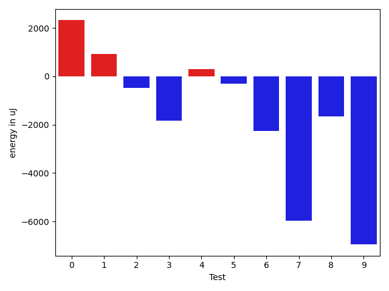

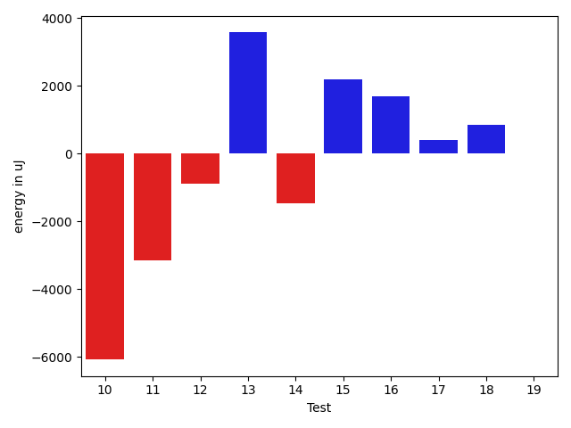

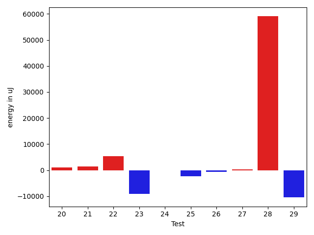

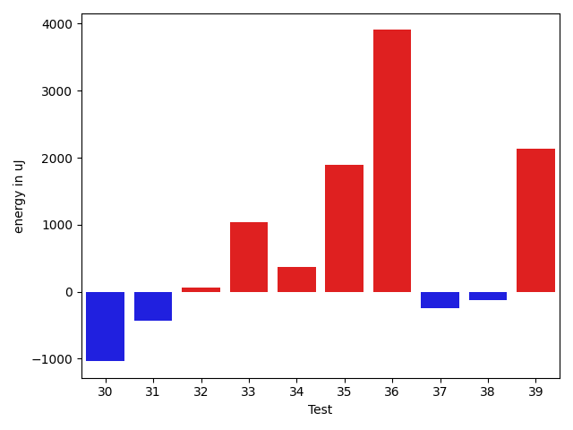

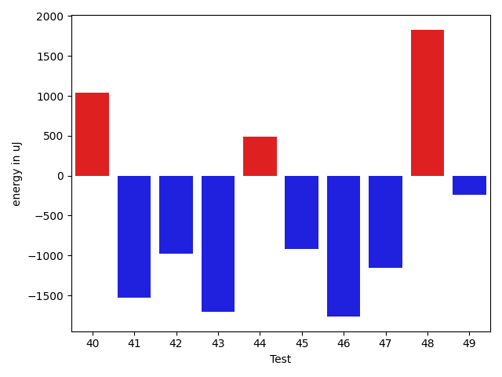

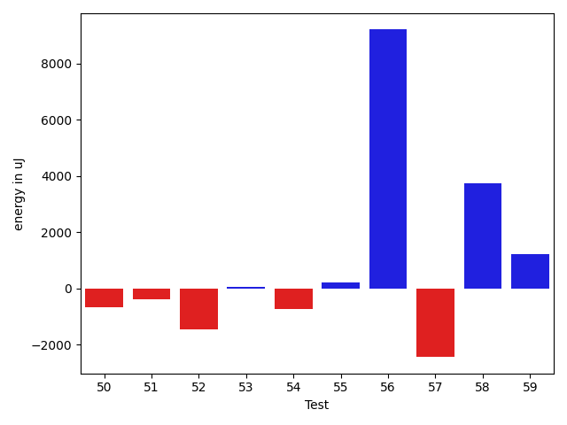

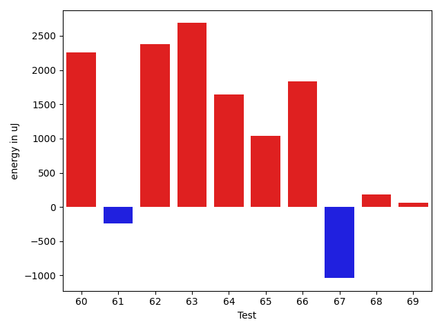

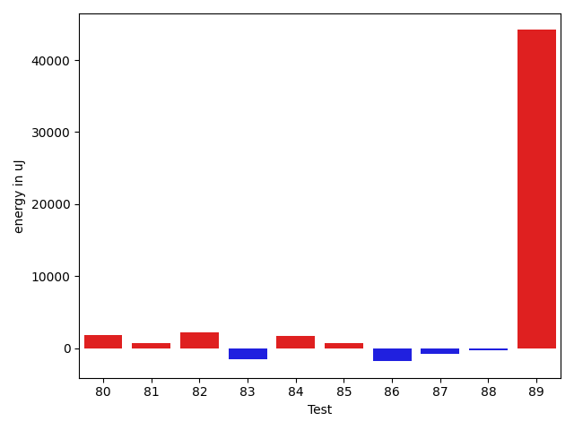

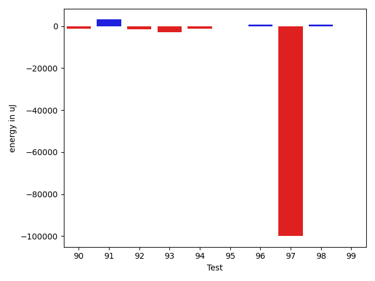

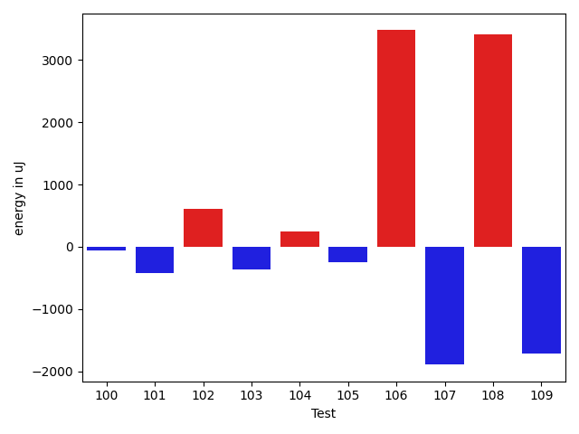

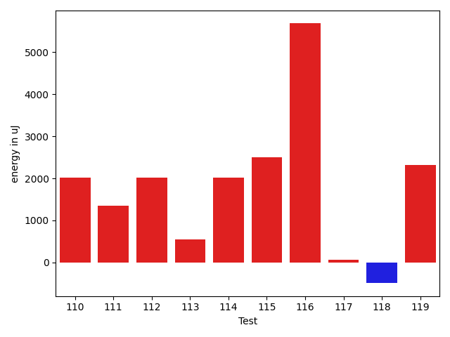

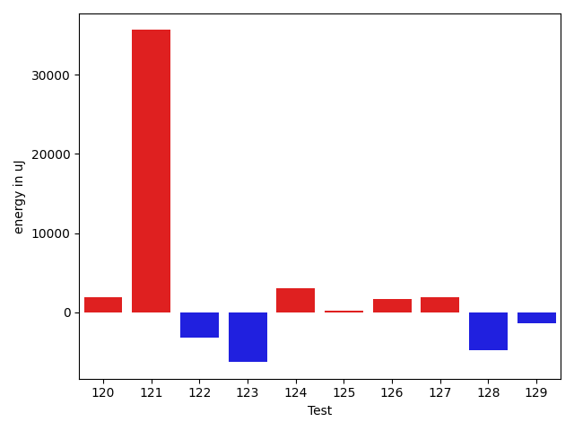

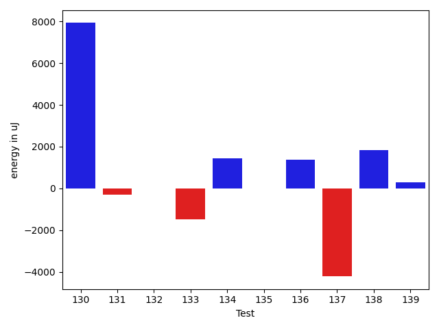

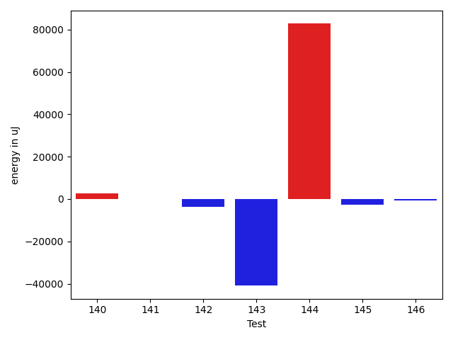

| ID | EnergyV1 | EnergyV2 | DeltaEnergy | σV1 | σV2 |
| --- | --- | --- | --- | --- | --- |
| 0 | 61850.55319148936 | 57856.95348837209 | -3993.5997031172665 | 82758.02795019114 | 70685.69960039893 |
| 1 | 39277.479166666664 | 39855.891304347824 | 578.41213768116 | 5051.201102995139 | 4607.296336428071 |
| 2 | 43867.31578947369 | 42661.18292682927 | -1206.1328626444156 | 13691.399324134425 | 12857.266570374115 |
| 3 | 48335.950617283954 | 45442.53333333333 | -2893.417283950621 | 17043.369834950325 | 16301.634149986317 |
| 4 | 95077.65656565657 | 81585.30303030302 | -13492.35353535354 | 91148.8487170722 | 61155.743238717085 |
| 5 | 39699.86111111111 | 38322.06451612903 | -1377.7965949820791 | 4173.942468543365 | 5196.516543742168 |
| 6 | 48004.318681318684 | 43510.40740740741 | -4493.911273911275 | 16966.287002661604 | 14742.229663497417 |
| 7 | 86601.26262626263 | 81471.24242424243 | -5130.020202020198 | 43134.176990387765 | 39810.15682341463 |
| 8 | 49503.336956521736 | 47393.045454545456 | -2110.2915019762804 | 19345.926719505074 | 17987.66245798712 |
| 9 | 78548.9696969697 | 71699.48484848485 | -6849.484848484848 | 42557.43529772786 | 34632.896160907396 |
| 10 | 90234.9898989899 | 84148.83838383839 | -6086.151515151505 | 43124.19929972408 | 39229.75429485235 |
| 11 | 48495.449438202246 | 45352.15 | -3143.2994382022443 | 17270.521217492194 | 14066.658800244637 |
| 12 | 39440.38596491228 | 38552.68421052631 | -887.7017543859693 | 4949.972283297862 | 5256.309919558819 |
| 13 | 47543.09333333333 | 51123.931506849316 | 3580.8381735159855 | 20719.553835076233 | 20246.79247069701 |
| 14 | 49384.264150943396 | 47923.933333333334 | -1460.3308176100618 | 20004.144551841728 | 19992.317436677746 |
| 15 | 37141.625 | 39340.8717948718 | 2199.2467948717967 | 5228.925921915035 | 4929.204830965612 |
| 16 | 39835.796875 | 41531.95384615385 | 1696.1569711538468 | 4437.013040815323 | 12143.692699606872 |
| 17 | 39136.06896551724 | 39544.709677419356 | 408.6407119021169 | 4586.384722505294 | 4951.288455273607 |
| 18 | 38685.65714285714 | 39534.365853658535 | 848.7087108013948 | 4846.562068358248 | 4425.251442524564 |
| 19 | 39789.96 | 39805.0 | 15.040000000000873 | 4954.480876782149 | 5179.174234373661 |
| 20 | 47791.333333333336 | 48861.81538461539 | 1070.4820512820515 | 18393.086796100564 | 23088.39529813279 |
| 21 | 111940.0303030303 | 113348.16161616161 | 1408.1313131313073 | 114586.85021533584 | 87624.18480857793 |
| 22 | 39858.07692307692 | 45312.53333333333 | 5454.456410256411 | 4295.067080366973 | 36770.532414542075 |
| 23 | 134945.30303030304 | 125766.0 | -9179.30303030304 | 66235.75997223925 | 57166.83966136913 |
| 24 | 40477.78571428572 | 40432.38888888889 | -45.3968253968269 | 3237.0012984956593 | 4191.176957992811 |
| 25 | 42109.3 | 39767.53191489362 | -2341.768085106385 | 4345.200318742509 | 3772.912475376785 |
| 26 | 40452.64444444444 | 39767.44736842105 | -685.197076023389 | 3852.237780566601 | 3968.20753447997 |
| 27 | 39251.28571428572 | 39588.307692307695 | 337.0219780219777 | 4551.794106177696 | 4208.250535791816 |
| 28 | 107834.31818181818 | 166881.9375 | 59047.61931818182 | 405504.81133950746 | 523675.5572976541 |
| 29 | 79951.34375 | 69485.54545454546 | -10465.798295454544 | 48511.45428011223 | 37541.04165107747 |
| 30 | 75280.89361702128 | 51634.255319148935 | -23646.63829787235 | 85632.92717502509 | 23883.32947713814 |
| 31 | 40779.75862068965 | 40201.73333333333 | -578.0252873563222 | 4381.228387463422 | 4244.906531623779 |
| 32 | 43485.86440677966 | 43067.729166666664 | -418.1352401129989 | 10521.443059267633 | 9658.410781411329 |
| 33 | 39480.15625 | 40567.0 | 1086.84375 | 4534.023524347435 | 3055.487817026931 |
| 34 | 52850.76623376623 | 45582.642857142855 | -7268.123376623378 | 24828.872137245602 | 13021.998146033735 |
| 35 | 39224.02702702703 | 39822.325 | 598.2979729729705 | 4792.536632895769 | 3856.7776730549303 |
| 36 | 37141.36842105263 | 39804.88888888889 | 2663.520467836257 | 4655.34193679438 | 4179.862011131319 |
| 37 | 39573.80952380953 | 40063.36 | 489.550476190474 | 4315.461059283818 | 4063.5247446521103 |
| 38 | 48525.391304347824 | 39676.0 | -8849.391304347824 | 40558.859578705386 | 4040.4928698834437 |
| 39 | 58396.62886597938 | 65732.77777777778 | 7336.148911798402 | 73138.23734310306 | 67777.58484741543 |
| 40 | 39423.25862068965 | 42301.078125 | 2877.819504310348 | 6100.099277203284 | 8609.017344303675 |
| 41 | 40586.936170212764 | 39683.0 | -903.9361702127644 | 5456.001814922389 | 4543.29300406156 |
| 42 | 39678.730769230766 | 40621.64150943396 | 942.910740203195 | 4779.648635764031 | 4452.471457407862 |
| 43 | 41301.8275862069 | 39945.89473684211 | -1355.9328493647918 | 6209.781139288219 | 6373.676943365844 |
| 44 | 194195.16883116882 | 186170.44736842104 | -8024.721462747781 | 591227.1899919715 | 561533.5648475802 |
| 45 | 95035.83838383839 | 97390.95959595959 | 2355.121212121201 | 30065.640206797325 | 34675.540510208855 |
| 46 | 40056.53571428572 | 38580.23333333333 | -1476.3023809523875 | 3915.995234585446 | 4684.06914753496 |
| 47 | 41995.65671641791 | 42937.23611111111 | 941.5793946932026 | 8512.718995893843 | 13718.441987676717 |
| 48 | 39543.71428571428 | 40303.40740740741 | 759.6931216931262 | 4714.021683515368 | 4575.351702808165 |
| 49 | 40618.142857142855 | 40906.25806451613 | 288.11520737327373 | 6246.648182041637 | 8143.205614212267 |
| 50 | 39336.96875 | 38661.6 | -675.3687500000015 | 4929.139145710277 | 4985.774734849807 |
| 51 | 39268.34375 | 38893.307692307695 | -375.0360576923049 | 4978.476490161015 | 4379.585989998026 |
| 52 | 39546.05 | 38101.46153846154 | -1444.588461538464 | 5139.344992068542 | 4468.056445745384 |
| 53 | 39127.15625 | 39192.7027027027 | 65.54645270269975 | 4810.71464356762 | 4747.035546441788 |
| 54 | 39816.04651162791 | 39073.980769230766 | -742.0657423971425 | 5293.305846872475 | 3692.7288975998 |
| 55 | 46953.57894736842 | 47171.134146341465 | 217.55519897304475 | 16746.422618186996 | 18574.734712192963 |
| 56 | 56231.575 | 65432.86486486487 | 9201.28986486487 | 46702.04808886196 | 51538.72168923204 |
| 57 | 41696.42222222222 | 39263.13333333333 | -2433.288888888892 | 10413.053859862393 | 7295.809462667975 |
| 58 | 82127.90909090909 | 85867.57575757576 | 3739.6666666666715 | 37463.70275672522 | 40142.82768273149 |
| 59 | 38351.204081632655 | 39590.795454545456 | 1239.5913729128006 | 4318.548352944313 | 4988.43014374966 |
| 60 | 42176.79746835443 | 44445.6375 | 2268.8400316455663 | 10300.29727404333 | 11523.133454321081 |
| 61 | 39904.07692307692 | 39100.79069767442 | -803.2862254025022 | 4453.598272296898 | 4250.633296499336 |
| 62 | 41515.67532467532 | 44447.2375 | 2931.5621753246814 | 9890.817197918372 | 12103.01788423424 |
| 63 | 49825.95 | 45234.92105263158 | -4591.028947368417 | 59861.94881264309 | 15281.636569118158 |
| 64 | 40370.204081632655 | 42978.97872340425 | 2608.774641771597 | 8475.258332056042 | 10880.43158462165 |
| 65 | 38997.4 | 39728.181818181816 | 730.7818181818147 | 4694.730468656677 | 4963.561340314368 |
| 66 | 38686.84782608696 | 40397.880952380954 | 1711.0331262939944 | 4563.93170969463 | 6410.152989045622 |
| 67 | 39084.94736842105 | 37619.94736842105 | -1465.0 | 3740.0803745048356 | 4349.449892302585 |
| 68 | 43290.68965517241 | 38976.59090909091 | -4314.098746081501 | 22938.457193563117 | 4133.700077732373 |
| 69 | 42474.2 | 47124.93548387097 | 4650.7354838709725 | 15207.958136887848 | 27284.809051257434 |
| 70 | 40131.05263157895 | 40369.294117647056 | 238.24148606810923 | 4178.976662365841 | 4460.99582786623 |
| 71 | 37132.3125 | 39403.8125 | 2271.5 | 4213.444652519332 | 4691.519133217273 |
| 72 | 40203.444444444445 | 40780.561643835616 | 577.1171993911703 | 7856.066576377082 | 8926.145049890209 |
| 73 | 162915.94949494948 | 142243.0202020202 | -20672.92929292927 | 375229.3519077883 | 354671.1917242655 |
| 74 | 60851.17204301075 | 51626.62105263158 | -9224.550990379175 | 26337.519119874512 | 19863.696493950145 |
| 75 | 195126.43434343435 | 189461.2626262626 | -5665.171717171732 | 178127.0423012552 | 72566.2270512687 |
| 76 | 40822.957746478874 | 42964.35211267605 | 2141.394366197179 | 4855.613131782493 | 12601.71116158279 |
| 77 | 44171.148148148146 | 43697.62857142857 | -473.51957671957643 | 9116.180140191533 | 8812.466724835136 |
| 78 | 41053.57377049181 | 40360.065573770495 | -693.5081967213118 | 7519.583606929781 | 7998.30561947875 |
| 79 | 98484.60606060606 | 117617.48484848485 | 19132.878787878784 | 48874.772234622484 | 75012.3216945546 |
| 80 | 44824.84705882353 | 48155.85897435898 | 3331.0119155354478 | 22950.19595226143 | 15605.025810020112 |
| 81 | 45400.97297297297 | 47985.16455696202 | 2584.19158398905 | 15068.464059331915 | 15156.797877002697 |
| 82 | 60682.47959183674 | 64140.969072164946 | 3458.4894803282077 | 39405.190908240635 | 33500.192825865604 |
| 83 | 60005.529411764706 | 65390.77777777778 | 5385.248366013075 | 77555.29179246147 | 88252.70289910807 |
| 84 | 42659.75 | 44974.851851851854 | 2315.101851851854 | 10309.99908361619 | 14422.209054617437 |
| 85 | 39389.51282051282 | 40850.75 | 1461.2371794871797 | 5492.442055863233 | 4372.189312861464 |
| 86 | 40943.38775510204 | 39131.93023255814 | -1811.457522543904 | 5045.574750603908 | 5112.235970985639 |
| 87 | 42362.732142857145 | 40828.07272727273 | -1534.659415584414 | 10212.412483435244 | 10144.217933661512 |
| 88 | 72961.61538461539 | 64358.70652173913 | -8602.908862876262 | 85418.57480315112 | 64312.96718012392 |
| 89 | 369369.64646464644 | 406187.2727272727 | 36817.62626262626 | 171379.73664011335 | 198445.1820236011 |
| 90 | 74200.94845360825 | 72904.08421052631 | -1296.864243081931 | 51336.88597344945 | 56828.30670836742 |
| 91 | 41193.901960784315 | 44280.88888888889 | 3086.986928104576 | 3967.0470879775867 | 20178.04159748603 |
| 92 | 44961.04761904762 | 43550.49333333333 | -1410.5542857142864 | 14233.759712224715 | 11595.074715726885 |
| 93 | 46460.27272727273 | 43648.620253164554 | -2811.652474108174 | 15431.625171870277 | 10427.626614806348 |
| 94 | 40044.75 | 38839.275862068964 | -1205.4741379310362 | 4860.382720270081 | 3938.9249793396216 |
| 95 | 38595.45 | 38382.51724137931 | -212.9327586206855 | 4671.700551993889 | 3987.7800463388894 |
| 96 | 39714.0 | 40404.02 | 690.0199999999968 | 4387.20870258072 | 6090.310722746419 |
| 97 | 234939.98333333334 | 135011.56363636363 | -99928.41969696971 | 642025.6258572417 | 464173.42224865465 |
| 98 | 44766.433333333334 | 45566.75257731959 | 800.3192439862542 | 13601.895987978214 | 14442.445124558908 |
| 99 | 39227.234042553195 | 39036.84 | -190.39404255319823 | 4690.760080915826 | 3836.1523763270925 |
| 100 | 46549.89705882353 | 47639.22535211268 | 1089.3282932891452 | 23756.766189210495 | 23205.663979075885 |
| 101 | 57802.32142857143 | 57160.32142857143 | -642.0 | 53831.478662949055 | 46071.29750068565 |
| 102 | 58543.25 | 97241.06666666667 | 38697.816666666666 | 73257.5492344475 | 129152.56291660994 |
| 103 | 39749.7 | 38245.8 | -1503.8999999999942 | 6342.918445794491 | 5196.6198655151475 |
| 104 | 44515.142857142855 | 48425.43037974684 | 3910.2875226039832 | 14624.876295815413 | 25176.938707889993 |
| 105 | 49789.92957746479 | 46942.246753246756 | -2847.6828242180345 | 21027.449464137862 | 17501.711963873295 |
| 106 | 37863.392857142855 | 40013.5 | 2150.107142857145 | 5237.2122992191025 | 5128.22689468137 |
| 107 | 47766.83870967742 | 47957.91428571429 | 191.0755760368702 | 19237.371834609257 | 20138.092253766852 |
| 108 | 38399.04347826087 | 39975.09523809524 | 1576.051759834365 | 5244.712620951744 | 4959.8804027897 |
| 109 | 70059.86206896552 | 72744.15625 | 2684.2941810344782 | 74418.04176997354 | 86611.14771281948 |
| 110 | 39540.555555555555 | 40249.6 | 709.0444444444438 | 5936.366473995709 | 5047.4865864111025 |
| 111 | 48569.608695652176 | 47106.51470588235 | -1463.0939897698263 | 17861.247187102166 | 13903.470244439659 |
| 112 | 44456.40625 | 52787.2 | 8330.793749999997 | 11032.025844839693 | 18801.297399204486 |
| 113 | 37914.53846153846 | 39703.318181818184 | 1788.7797202797228 | 4093.5930637518954 | 4706.594111035395 |
| 114 | 37814.8 | 42816.13636363636 | 5001.336363636357 | 5257.225656180262 | 18549.43982809051 |
| 115 | 43085.0 | 40366.30303030303 | -2718.696969696968 | 22688.676535609124 | 4410.764748402299 |
| 116 | 37529.294117647056 | 40841.21428571428 | 3311.9201680672268 | 3363.073485137663 | 6125.566203317412 |
| 117 | 40064.117647058825 | 37442.53846153846 | -2621.5791855203643 | 4344.514159290635 | 4616.39062497606 |
| 118 | 48884.46268656717 | 44045.84507042253 | -4838.617616144635 | 26314.577510045452 | 15649.130831867253 |
| 119 | 42631.524590163935 | 43227.723076923074 | 596.1984867591382 | 14033.478919258194 | 12318.737384735616 |
| 120 | 55217.242424242424 | 57068.75409836065 | 1851.5116741182283 | 25012.828308120883 | 28882.38459948637 |
| 121 | 168963.9595959596 | 204605.40404040404 | 35641.44444444444 | 380948.39746574016 | 471385.8443989761 |
| 122 | 49935.030303030304 | 46689.53571428572 | -3245.4945887445865 | 33345.67882548524 | 26806.699113390805 |
| 123 | 51259.166666666664 | 44976.28571428572 | -6282.880952380947 | 26239.262427176236 | 13973.417226641302 |
| 124 | 41517.81967213115 | 44523.50819672131 | 3005.688524590165 | 10910.913469456791 | 17650.27110516998 |
| 125 | 38896.40625 | 39054.54838709677 | 158.14213709677279 | 4619.7857963017 | 5590.998097972281 |
| 126 | 38983.634146341465 | 40675.02 | 1691.3858536585321 | 3667.1663397931757 | 4747.926635869598 |
| 127 | 39748.066666666666 | 41600.18421052631 | 1852.1175438596474 | 3297.585540293922 | 8647.270286826642 |
| 128 | 43374.6 | 38563.916666666664 | -4810.683333333334 | 13110.76531099539 | 4992.5285420371465 |
| 129 | 41031.954545454544 | 39665.944444444445 | -1366.0101010100989 | 4203.561179386233 | 4329.1910518687255 |
| 130 | 60393.40243902439 | 68320.11538461539 | 7926.7129455910035 | 55632.949547788885 | 70163.00995666445 |
| 131 | 39723.967741935485 | 39431.45238095238 | -292.51536098310316 | 5905.402460862923 | 4969.007907124495 |
| 132 | 40787.769230769234 | 40791.619047619046 | 3.8498168498117593 | 4020.466298134816 | 4715.35080224246 |
| 133 | 41106.07407407407 | 39636.95121951219 | -1469.1228545618796 | 4025.6838013668075 | 4621.870220926143 |
| 134 | 39007.92857142857 | 40458.88 | 1450.951428571425 | 3483.319752032242 | 4029.449007693235 |
| 135 | 39998.73684210526 | 39996.37209302326 | -2.364749082000344 | 5825.172153246498 | 4475.899151051551 |
| 136 | 39951.96153846154 | 41333.71428571428 | 1381.7527472527436 | 3955.074067970927 | 3819.5487192032715 |
| 137 | 42489.37037037037 | 38272.63636363636 | -4216.734006734012 | 6679.034240168583 | 5324.704480735295 |
| 138 | 43943.52777777778 | 45777.62790697674 | 1834.1001291989596 | 9822.279633245678 | 16179.894647116194 |
| 139 | 42192.92105263158 | 42484.925 | 292.0039473684228 | 7155.562074290913 | 8730.83790763378 |
| 140 | 47520.32352941176 | 50294.39506172839 | 2774.0715323166296 | 23724.19205308791 | 23807.786653223517 |
| 141 | 43886.91044776119 | 43776.59322033898 | -110.31722742220882 | 10285.57202892137 | 10630.78993847053 |
| 142 | 91638.89655172414 | 87798.1282051282 | -3840.7683465959417 | 121690.87785361071 | 123133.24677412439 |
| 143 | 125827.0 | 84928.44897959183 | -40898.551020408166 | 381712.3264901637 | 261631.40548996697 |
| 144 | 97346.75 | 180114.37704918033 | 82767.62704918033 | 297061.46938692813 | 538980.3737291539 |
| 145 | 42474.354838709674 | 39726.885714285716 | -2747.4691244239584 | 3967.0214352380144 | 4720.021106317389 |
| 146 | 41955.27906976744 | 41136.2 | -819.0790697674456 | 5982.923950033755 | 6243.4083626030915 |

## Delta Duration per test method

| ID | DurationV1 | DurationsV2 | DeltaDuration |
| --- | --- | --- | --- |
| 0 | 1529937.574468085 | 1333637.441860465 | -196300.13260761998 |
| 1 | 852956.5208333334 | 865111.9347826086 | 12155.413949275273 |
| 2 | 1216968.2368421052 | 1182711.3902439023 | -34256.84659820283 |
| 3 | 1391396.5802469135 | 1271426.8555555556 | -119969.72469135793 |
| 4 | 2787164.404040404 | 2296648.0707070706 | -490516.3333333335 |
| 5 | 681266.9722222222 | 612334.1612903225 | -68932.8109318997 |
| 6 | 1317470.6923076923 | 1297962.962962963 | -19507.729344729334 |
| 7 | 2501888.474747475 | 2324548.9393939395 | -177339.53535353532 |
| 8 | 1388948.5652173914 | 1347767.5681818181 | -41180.99703557324 |
| 9 | 2222094.868686869 | 2114810.3131313133 | -107284.5555555555 |
| 10 | 2565883.373737374 | 2404911.111111111 | -160972.26262626285 |
| 11 | 1327760.404494382 | 1324494.1125 | -3266.291994381929 |
| 12 | 899330.3157894737 | 811001.2280701754 | -88329.08771929832 |
| 13 | 1301025.2933333332 | 1400994.9589041097 | 99969.66557077644 |
| 14 | 1376827.0188679246 | 1350058.7733333334 | -26768.245534591144 |
| 15 | 676476.5 | 630154.358974359 | -46322.141025641 |
| 16 | 948642.9375 | 1029412.5230769231 | 80769.5855769231 |
| 17 | 617730.7586206896 | 635123.2580645161 | 17392.4994438265 |
| 18 | 682815.9142857143 | 774902.6829268293 | 92086.76864111505 |
| 19 | 484447.8 | 562227.25 | 77779.45000000001 |
| 20 | 1060354.9333333333 | 1102925.6923076923 | 42570.758974358905 |
| 21 | 3157503.101010101 | 3148966.0606060605 | -8537.040404040366 |
| 22 | 528248.1153846154 | 822673.7666666667 | 294425.65128205135 |
| 23 | 3463517.212121212 | 3308043.090909091 | -155474.1212121211 |
| 24 | 574698.2142857143 | 580832.2777777778 | 6134.063492063433 |
| 25 | 723893.5 | 730048.8723404255 | 6155.3723404255 |
| 26 | 713186.3333333334 | 692024.9210526316 | -21161.4122807018 |
| 27 | 788786.619047619 | 743759.2051282051 | -45027.41391941393 |
| 28 | 3002848.1704545454 | 5025109.9125 | 2022261.7420454542 |
| 29 | 2332197.9791666665 | 1984288.7474747475 | -347909.23169191903 |
| 30 | 2091656.9574468085 | 1152717.680851064 | -938939.2765957445 |
| 31 | 612052.3103448276 | 516430.06666666665 | -95622.24367816094 |
| 32 | 1018022.7457627119 | 870049.3125 | -147973.43326271186 |
| 33 | 589388.1875 | 529810.55 | -59577.63749999995 |
| 34 | 1380171.0779220778 | 1208034.9142857143 | -172136.16363636358 |
| 35 | 843094.5945945946 | 767927.525 | -75167.06959459453 |
| 36 | 540050.0 | 437508.94444444444 | -102541.05555555556 |
| 37 | 601009.7619047619 | 485332.4 | -115677.36190476187 |
| 38 | 850826.9130434783 | 560075.7368421053 | -290751.176201373 |
| 39 | 1851555.5463917525 | 1915007.3333333333 | 63451.78694158071 |
| 40 | 1046346.9827586206 | 1052702.6875 | 6355.7047413793625 |
| 41 | 936116.1489361703 | 957640.5094339623 | 21524.36049779202 |
| 42 | 858336.4230769231 | 939087.3773584906 | 80750.95428156748 |
| 43 | 706294.9310344828 | 863735.4736842106 | 157440.54264972778 |
| 44 | 5658294.7272727275 | 5560255.75 | -98038.97727272753 |
| 45 | 2661473.1818181816 | 2803040.414141414 | 141567.23232323257 |
| 46 | 539179.1785714285 | 696878.5 | 157699.32142857148 |
| 47 | 1080225.2686567164 | 1158523.625 | 78298.35634328355 |
| 48 | 583775.8571428572 | 794718.8518518518 | 210942.99470899464 |
| 49 | 918794.5102040817 | 985399.4354838709 | 66604.92527978926 |
| 50 | 631292.375 | 719385.4666666667 | 88093.09166666667 |
| 51 | 697622.28125 | 686732.2692307692 | -10890.012019230751 |
| 52 | 643837.95 | 714584.1025641026 | 70746.15256410267 |
| 53 | 680184.5625 | 687288.7297297297 | 7104.167229729705 |
| 54 | 831790.9302325582 | 828333.25 | -3457.6802325581666 |
| 55 | 1294433.644736842 | 1339786.524390244 | 45352.879653401906 |
| 56 | 1355047.75 | 1812027.7027027027 | 456979.9527027027 |
| 57 | 854486.5555555555 | 890859.2888888889 | 36372.733333333395 |
| 58 | 2369917.1616161615 | 2334319.414141414 | -35597.747474747244 |
| 59 | 753840.7959183673 | 749134.6590909091 | -4706.136827458278 |
| 60 | 1183358.594936709 | 1118214.125 | -65144.46993670892 |
| 61 | 715260.1153846154 | 755047.9534883721 | 39787.838103756774 |
| 62 | 1190293.2857142857 | 1174168.7875 | -16124.498214285588 |
| 63 | 1178304.775 | 890087.447368421 | -288217.3276315789 |
| 64 | 956742.0204081633 | 953713.3617021276 | -3028.658706035698 |
| 65 | 598350.3666666667 | 557971.8787878788 | -40378.48787878791 |
| 66 | 839549.8260869565 | 863455.4523809524 | 23905.626293995883 |
| 67 | 561407.8421052631 | 553283.5789473684 | -8124.2631578947185 |
| 68 | 703591.8965517242 | 523237.04545454547 | -180354.8510971787 |
| 69 | 808450.0666666667 | 1042315.7419354839 | 233865.67526881723 |
| 70 | 827356.2807017544 | 788714.3921568628 | -38641.88854489161 |
| 71 | 552835.875 | 526615.96875 | -26219.90625 |
| 72 | 1054140.5972222222 | 969566.3698630137 | -84574.22735920851 |
| 73 | 4564331.929292929 | 4148289.525252525 | -416042.40404040413 |
| 74 | 1781133.9784946237 | 1533350.894736842 | -247783.08375778166 |
| 75 | 5149198.6161616165 | 4942538.212121212 | -206660.4040404046 |
| 76 | 966551.0422535212 | 1109938.323943662 | 143387.28169014084 |
| 77 | 772405.0 | 865276.1142857143 | 92871.11428571434 |
| 78 | 835203.8524590164 | 945987.1803278689 | 110783.32786885253 |
| 79 | 2749900.01010101 | 3376999.4242424243 | 627099.4141414142 |
| 80 | 1192948.905882353 | 1326322.358974359 | 133373.45309200604 |
| 81 | 1200338.310810811 | 1313851.5063291139 | 113513.19551830296 |
| 82 | 1819122.469387755 | 1853839.6288659794 | 34717.15947822435 |
| 83 | 1610047.0588235294 | 1796654.6984126985 | 186607.63958916906 |
| 84 | 977896.8125 | 1072302.6666666667 | 94405.85416666674 |
| 85 | 838031.641025641 | 906840.725 | 68809.08397435897 |
| 86 | 943090.2040816327 | 928056.4651162791 | -15033.73896535358 |
| 87 | 955743.5 | 906295.4 | -49448.09999999998 |
| 88 | 2083334.0989010988 | 1919013.2173913044 | -164320.8815097944 |
| 89 | 9416800.8989899 | 10226346.070707072 | 809545.1717171725 |
| 90 | 2092347.5979381443 | 2130170.863157895 | 37823.26521975058 |
| 91 | 808400.274509804 | 916179.7777777778 | 107779.50326797378 |
| 92 | 1215842.511904762 | 1180985.6533333333 | -34856.85857142857 |
| 93 | 1221058.4545454546 | 1137332.9620253164 | -83725.49252013816 |
| 94 | 580183.21875 | 651679.9655172414 | 71496.74676724139 |
| 95 | 745358.25 | 734034.2068965518 | -11324.043103448232 |
| 96 | 756097.025 | 690630.68 | -65466.34499999997 |
| 97 | 6677062.066666666 | 3660393.0545454547 | -3016669.0121212117 |
| 98 | 1286036.9444444445 | 1339868.7113402062 | 53831.76689576171 |
| 99 | 776377.7446808511 | 784173.58 | 7795.835319148842 |
| 100 | 1198010.4705882352 | 1235263.2394366197 | 37252.7688483845 |
| 101 | 1409857.6964285714 | 1525950.4464285714 | 116092.75 |
| 102 | 1318083.925 | 2630802.2 | 1312718.2750000001 |
| 103 | 793980.54 | 832877.5111111111 | 38896.97111111111 |
| 104 | 1254603.8831168832 | 1302238.7721518988 | 47634.8890350156 |
| 105 | 1272947.690140845 | 1271443.4935064935 | -1504.1966343515087 |
| 106 | 458891.9285714286 | 452549.9583333333 | -6341.970238095266 |
| 107 | 1002202.6451612903 | 1172030.5428571429 | 169827.89769585256 |
| 108 | 422132.0869565217 | 444326.09523809527 | 22194.008281573537 |
| 109 | 1643034.3793103448 | 1836788.09375 | 193753.7144396552 |
| 110 | 528390.7777777778 | 534211.3 | 5820.522222222295 |
| 111 | 1260596.8550724639 | 1218344.9117647058 | -42251.943307758076 |
| 112 | 1050452.375 | 1156613.1 | 106160.7250000001 |
| 113 | 503600.3076923077 | 441742.0 | -61858.30769230769 |
| 114 | 572599.0 | 694337.4090909091 | 121738.40909090906 |
| 115 | 676965.375 | 525039.5757575758 | -151925.7992424242 |
| 116 | 431460.64705882355 | 445640.78571428574 | 14180.138655462186 |
| 117 | 457708.5882352941 | 454414.92307692306 | -3293.6651583710336 |
| 118 | 1423584.5223880596 | 1097483.3943661973 | -326101.12802186236 |
| 119 | 1168648.1639344261 | 1113821.9384615384 | -54826.225472887745 |
| 120 | 1447015.0 | 1420310.737704918 | -26704.26229508198 |
| 121 | 4767392.101010101 | 5732410.232323232 | 965018.1313131312 |
| 122 | 1115415.8484848484 | 1031054.0 | -84361.8484848484 |
| 123 | 1061531.2916666667 | 901510.8928571428 | -160020.3988095239 |
| 124 | 985267.8032786886 | 1113927.0 | 128659.19672131143 |
| 125 | 649473.625 | 620175.8709677419 | -29297.75403225806 |
| 126 | 736684.4634146341 | 778522.74 | 41838.27658536588 |
| 127 | 707520.9666666667 | 725105.8157894737 | 17584.849122807034 |
| 128 | 606998.8 | 420195.3333333333 | -186803.46666666673 |
| 129 | 358086.0909090909 | 431767.55555555556 | 73681.46464646468 |
| 130 | 1598027.5487804879 | 1902671.8333333333 | 304644.2845528454 |
| 131 | 830927.7419354839 | 789254.1428571428 | -41673.59907834104 |
| 132 | 645346.8461538461 | 577896.9523809524 | -67449.8937728937 |
| 133 | 579594.6296296297 | 622959.0975609756 | 43364.46793134592 |
| 134 | 592845.9285714285 | 528184.52 | -64661.4085714285 |
| 135 | 725580.0 | 744595.7441860465 | 19015.744186046533 |
| 136 | 582399.6923076923 | 525245.2142857143 | -57154.478021977935 |
| 137 | 703759.5185185185 | 794250.6363636364 | 90491.11784511781 |
| 138 | 800519.7222222222 | 1043974.023255814 | 243454.30103359174 |
| 139 | 852590.2105263158 | 936779.575 | 84189.36447368411 |
| 140 | 1222338.0 | 1289683.3456790124 | 67345.34567901236 |
| 141 | 1095874.7164179105 | 1095903.0508474577 | 28.334429547190666 |
| 142 | 2629409.9655172415 | 2421653.0256410255 | -207756.939876216 |
| 143 | 3414856.5555555555 | 2210311.5102040814 | -1204545.045351474 |
| 144 | 2618261.066666667 | 5174369.803278688 | 2556108.7366120215 |
| 145 | 621982.6451612903 | 664070.0285714286 | 42087.38341013831 |
| 146 | 723918.5116279069 | 842508.0444444445 | 118589.53281653754 |

## Misc.

| ID | Test Class | Test Method |
| --- | --- | --- |
| 0 | com.google.gson.functional.InterfaceTest | testSerializingObjectImplementingInterface |
| 1 | com.google.gson.functional.InterfaceTest | testSerializingInterfaceObjectField |
| 2 | com.google.gson.functional.ParameterizedTypesTest | testParameterizedTypeGenericArraysSerialization |
| 3 | com.google.gson.functional.ParameterizedTypesTest | testVariableTypeArrayDeserialization |
| 4 | com.google.gson.functional.ParameterizedTypesTest | testParameterizedTypesSerialization |
| 5 | com.google.gson.functional.ParameterizedTypesTest | testDeepParameterizedTypeSerialization |
| 6 | com.google.gson.functional.ParameterizedTypesTest | testVariableTypeDeserialization |
| 7 | com.google.gson.functional.ParameterizedTypesTest | testVariableTypeFieldsAndGenericArraysSerialization |
| 8 | com.google.gson.functional.ParameterizedTypesTest | testParameterizedTypeGenericArraysDeserialization |
| 9 | com.google.gson.functional.ParameterizedTypesTest | testVariableTypeFieldsAndGenericArraysDeserialization |
| 10 | com.google.gson.functional.ParameterizedTypesTest | testTypesWithMultipleParametersSerialization |
| 11 | com.google.gson.functional.ParameterizedTypesTest | testParameterizedTypeWithVariableTypeDeserialization |
| 12 | com.google.gson.functional.ParameterizedTypesTest | testParameterizedTypesWithWriterSerialization |
| 13 | com.google.gson.functional.MapTest | testSerializeMaps |
| 14 | com.google.gson.functional.MapTest | testMapSerializationWithNullValues |
| 15 | com.google.gson.functional.MapTest | testMapSerializationWithNullValuesSerialized |
| 16 | com.google.gson.functional.PrettyPrintingTest | testEmptyMapField |
| 17 | com.google.gson.functional.PrettyPrintingTest | testPrettyPrintArrayOfPrimitiveArrays |
| 18 | com.google.gson.functional.PrettyPrintingTest | testPrettyPrintListOfPrimitiveArrays |
| 19 | com.google.gson.functional.PrettyPrintingTest | testPrettyPrintArrayOfPrimitives |
| 20 | com.google.gson.functional.PrettyPrintingTest | testPrettyPrintArrayOfObjects |
| 21 | com.google.gson.functional.PrettyPrintingTest | testPrettyPrintList |
| 22 | com.google.gson.functional.PrettyPrintingTest | testMultipleArrays |
| 23 | com.google.gson.functional.ExposeFieldsTest | testNullExposeFieldSerialization |
| 24 | com.google.gson.functional.ExposeFieldsTest | testExposeAnnotationSerialization |
| 25 | com.google.gson.functional.ExposeFieldsTest | testArrayWithOneNullExposeFieldObjectSerialization |
| 26 | com.google.gson.functional.ExposeFieldsTest | testExposedInterfaceFieldSerialization |
| 27 | com.google.gson.functional.FieldExclusionTest | testDefaultNestedStaticClassIncluded |
| 28 | com.google.gson.functional.FieldExclusionTest | testDefaultInnerClassExclusion |
| 29 | com.google.gson.functional.InheritanceTest | testSubInterfacesOfCollectionSerialization |
| 30 | com.google.gson.functional.InheritanceTest | testBaseSerializedAsBaseWhenSpecifiedWithExplicitTypeForToJsonMethod |
| 31 | com.google.gson.functional.InheritanceTest | testBaseSerializedAsSubForToJsonMethod |
| 32 | com.google.gson.functional.InheritanceTest | testClassWithBaseArrayFieldSerialization |
| 33 | com.google.gson.functional.InheritanceTest | testBaseSerializedAsSubWhenSpecifiedWithExplicitTypeForToJsonMethod |
| 34 | com.google.gson.functional.InheritanceTest | testSubClassSerialization |
| 35 | com.google.gson.functional.InheritanceTest | testClassWithBaseFieldSerialization |
| 36 | com.google.gson.functional.InheritanceTest | testBaseSerializedAsBaseWhenSpecifiedWithExplicitType |
| 37 | com.google.gson.functional.InheritanceTest | testBaseSerializedAsSubWhenSpecifiedWithExplicitType |
| 38 | com.google.gson.functional.InheritanceTest | testBaseSerializedAsSub |
| 39 | com.google.gson.functional.MoreSpecificTypeSerializationTest | testSubclassFields |
| 40 | com.google.gson.functional.MoreSpecificTypeSerializationTest | testListOfParameterizedSubclassFields |
| 41 | com.google.gson.functional.MoreSpecificTypeSerializationTest | testMapOfParameterizedSubclassFields |
| 42 | com.google.gson.functional.MoreSpecificTypeSerializationTest | testParameterizedSubclassFields |
| 43 | com.google.gson.functional.StringTest | testStringValueAsSingleElementArraySerialization |
| 44 | com.google.gson.JsonParserTest | testReadWriteTwoObjects |
| 45 | com.google.gson.functional.NamingPolicyTest | testGsonWithNonDefaultFieldNamingPolicySerialization |
| 46 | com.google.gson.functional.NamingPolicyTest | testGsonWithUpperCamelCaseSpacesPolicySerialiation |
| 47 | com.google.gson.functional.NamingPolicyTest | testComplexFieldNameStrategy |
| 48 | com.google.gson.functional.NamingPolicyTest | testGsonWithLowerCaseUnderscorePolicySerialization |
| 49 | com.google.gson.functional.NamingPolicyTest | testGsonWithSerializedNameFieldNamingPolicySerialization |
| 50 | com.google.gson.functional.NamingPolicyTest | testGsonWithLowerCaseDashPolicySerialization |
| 51 | com.google.gson.functional.NullObjectAndFieldTest | testExplicitSerializationOfNullStringMembers |
| 52 | com.google.gson.functional.NullObjectAndFieldTest | testExplicitSerializationOfNullCollectionMembers |
| 53 | com.google.gson.functional.NullObjectAndFieldTest | testPrintPrintingArraysWithNulls |
| 54 | com.google.gson.functional.NullObjectAndFieldTest | testNullWrappedPrimitiveMemberSerialization |
| 55 | com.google.gson.functional.NullObjectAndFieldTest | testExplicitSerializationOfNullArrayMembers |
| 56 | com.google.gson.functional.NullObjectAndFieldTest | testExplicitSerializationOfNulls |
| 57 | com.google.gson.functional.NullObjectAndFieldTest | testPrintPrintingObjectWithNulls |
| 58 | com.google.gson.functional.ObjectTest | testSingletonLists |
| 59 | com.google.gson.functional.ObjectTest | testNullFieldsSerialization |
| 60 | com.google.gson.functional.ObjectTest | testArrayOfObjectsAsFields |
| 61 | com.google.gson.functional.ObjectTest | testBagOfPrimitiveWrappersSerialization |
| 62 | com.google.gson.functional.ObjectTest | testArrayOfArraysSerialization |
| 63 | com.google.gson.functional.ObjectTest | testClassWithTransientFieldsSerialization |
| 64 | com.google.gson.functional.ObjectTest | testNestedSerialization |
| 65 | com.google.gson.functional.ObjectTest | testStringFieldWithEmptyValueSerialization |
| 66 | com.google.gson.functional.ObjectTest | testArrayOfObjectsSerialization |
| 67 | com.google.gson.functional.ObjectTest | testEmptyCollectionInAnObjectSerialization |
| 68 | com.google.gson.functional.ObjectTest | testClassWithObjectFieldSerialization |
| 69 | com.google.gson.functional.ObjectTest | testBagOfPrimitivesSerialization |
| 70 | com.google.gson.functional.ObjectTest | testInnerClassSerialization |
| 71 | com.google.gson.functional.ObjectTest | testPrimitiveArrayFieldSerialization |
| 72 | com.google.gson.functional.TypeVariableTest | testBasicTypeVariables |
| 73 | com.google.gson.functional.TypeVariableTest | testAdvancedTypeVariables |
| 74 | com.google.gson.functional.TypeVariableTest | testTypeVariablesViaTypeParameter |
| 75 | com.google.gson.functional.VersioningTest | testVersionedUntilSerialization |
| 76 | com.google.gson.functional.VersioningTest | testVersionedGsonMixingSinceAndUntilSerialization |
| 77 | com.google.gson.functional.VersioningTest | testVersionedGsonWithUnversionedClassesSerialization |
| 78 | com.google.gson.functional.VersioningTest | testVersionedClassesSerialization |
| 79 | com.google.gson.functional.MapAsArrayTypeAdapterTest | testMultipleEnableComplexKeyRegistrationHasNoEffect |
| 80 | com.google.gson.functional.MapAsArrayTypeAdapterTest | testMapWithTypeVariableSerialization |
| 81 | com.google.gson.functional.CollectionTest | testFieldIsArrayList |
| 82 | com.google.gson.functional.CollectionTest | testWildcardCollectionField |
| 83 | com.google.gson.functional.CollectionTest | testSetSerialization |
| 84 | com.google.gson.functional.CollectionTest | testCollectionOfBagOfPrimitivesSerialization |
| 85 | com.google.gson.functional.CollectionTest | testRawCollectionSerialization |
| 86 | com.google.gson.functional.ExclusionStrategyFunctionalTest | testExclusionStrategyWithMode |
| 87 | com.google.gson.functional.EnumTest | testClassWithEnumFieldSerialization |
| 88 | com.google.gson.functional.ConcurrencyTest | testSingleThreadSerialization |
| 89 | com.google.gson.functional.ConcurrencyTest | testMultiThreadSerialization |
| 90 | com.google.gson.functional.RawSerializationTest | testThreeLevelParameterizedObject |
| 91 | com.google.gson.functional.RawSerializationTest | testCollectionOfObjects |
| 92 | com.google.gson.functional.RawSerializationTest | testTwoLevelParameterizedObject |
| 93 | com.google.gson.functional.RawSerializationTest | testParameterizedObject |
| 94 | com.google.gson.MixedStreamTest | testWriteClosed |
| 95 | com.google.gson.MixedStreamTest | testWriteInvalidState |
| 96 | com.google.gson.MixedStreamTest | testWriteDoesNotMutateState |
| 97 | com.google.gson.MixedStreamTest | testWriteMixedStreamed |
| 98 | com.google.gson.functional.CustomTypeAdaptersTest | testCustomTypeAdapterDoesNotAppliesToSubClasses |
| 99 | com.google.gson.functional.CustomTypeAdaptersTest | testEnsureCustomSerializerNotInvokedForNullValues |
| 100 | com.google.gson.functional.CustomTypeAdaptersTest | testCustomNestedSerializers |
| 101 | com.google.gson.functional.EscapingTest | testEscapingObjectFields |
| 102 | com.google.gson.functional.EscapingTest | testEscapingQuotesInStringArray |
| 103 | com.google.gson.functional.EscapingTest | testGsonDoubleDeserialization |
| 104 | com.google.gson.functional.EscapingTest | testGsonAcceptsEscapedAndNonEscapedJsonDeserialization |
| 105 | com.google.gson.functional.ArrayTest | testArrayOfCollectionSerialization |
| 106 | com.google.gson.functional.ArrayTest | testMultiDimenstionalObjectArraysSerialization |
| 107 | com.google.gson.functional.ArrayTest | testSingleNullInArraySerialization |
| 108 | com.google.gson.functional.ArrayTest | testArrayOfStringsSerialization |
| 109 | com.google.gson.functional.ArrayTest | testTopLevelArrayOfIntsSerialization |
| 110 | com.google.gson.functional.ArrayTest | testNullsInArraySerialization |
| 111 | com.google.gson.functional.ArrayTest | testObjectArrayWithNonPrimitivesSerialization |
| 112 | com.google.gson.functional.ArrayTest | testArrayOfPrimitivesAsObjectsSerialization |
| 113 | com.google.gson.functional.ArrayTest | testMixingTypesInObjectArraySerialization |
| 114 | com.google.gson.functional.ArrayTest | testNullsInArrayWithSerializeNullPropertySetSerialization |
| 115 | com.google.gson.functional.ArrayTest | testMultidimenstionalArraysSerialization |
| 116 | com.google.gson.functional.ArrayTest | testArrayOfNullSerialization |
| 117 | com.google.gson.functional.ArrayTest | testSingleStringArraySerialization |
| 118 | com.google.gson.functional.DefaultTypeAdaptersTest | testUrlNullSerialization |
| 119 | com.google.gson.functional.DefaultTypeAdaptersTest | testBigIntegerFieldSerialization |
| 120 | com.google.gson.functional.DefaultTypeAdaptersTest | testBigDecimalFieldSerialization |
| 121 | com.google.gson.functional.TypeHierarchyAdapterTest | testTypeHierarchy |
| 122 | com.google.gson.functional.CircularReferenceTest | testDirectedAcyclicGraphSerialization |
| 123 | com.google.gson.internal.bind.MiniGsonTest | testSerialize |
| 124 | com.google.gson.internal.bind.MiniGsonTest | testSerializeWithCustomTypeAdapter |
| 125 | com.google.gson.internal.bind.MiniGsonTest | testSerialize2dArray |
| 126 | com.google.gson.internal.bind.MiniGsonTest | testSerializeRecursive |
| 127 | com.google.gson.internal.bind.MiniGsonTest | testSerialize1dArray |
| 128 | com.google.gson.internal.bind.MiniGsonTest | testSerializeNullObject |
| 129 | com.google.gson.internal.bind.MiniGsonTest | testSerializeNullField |
| 130 | com.google.gson.functional.PrintFormattingTest | testCompactFormattingLeavesNoWhiteSpace |
| 131 | com.google.gson.functional.PrimitiveTest | testPrimitiveDoubleAutoboxedInASingleElementArraySerialization |
| 132 | com.google.gson.functional.PrimitiveTest | testPrimitiveIntegerAutoboxedInASingleElementArraySerialization |
| 133 | com.google.gson.functional.PrimitiveTest | testBigDecimalInASingleElementArraySerialization |
| 134 | com.google.gson.functional.PrimitiveTest | testPrimitiveLongAutoboxedInASingleElementArraySerialization |
| 135 | com.google.gson.functional.PrimitiveTest | testBigIntegerInASingleElementArraySerialization |
| 136 | com.google.gson.functional.PrimitiveTest | testPrimitiveBooleanAutoboxedInASingleElementArraySerialization |
| 137 | com.google.gson.functional.UncategorizedTest | testStaticFieldsAreNotSerialized |
| 138 | com.google.gson.functional.UncategorizedTest | testObjectEqualButNotSameSerialization |
| 139 | com.google.gson.functional.UncategorizedTest | testGsonInstanceReusableForSerializationAndDeserialization |
| 140 | com.google.gson.functional.JsonTreeTest | testJsonTreeToString |
| 141 | com.google.gson.functional.ReadersWritersTest | testReadWriteTwoObjects |
| 142 | com.google.gson.functional.ReadersWritersTest | testWriterForSerialization |
| 143 | com.google.gson.functional.SecurityTest | testNonExecutableJsonSerialization |
| 144 | com.google.gson.functional.CustomSerializerTest | testSubClassSerializerInvokedForBaseClassFieldsHoldingSubClassInstances |
| 145 | com.google.gson.functional.CustomSerializerTest | testBaseClassSerializerInvokedForBaseClassFields |
| 146 | com.google.gson.functional.CustomSerializerTest | testSubClassSerializerInvokedForBaseClassFieldsHoldingArrayOfSubClassInstances |

| Test | IterationV1 | IterationV2 | DeltaIteration |
| --- | --- | --- | --- |
| 0 | 47 | 43 | -4 |
| 1 | 48 | 46 | -2 |
| 2 | 76 | 82 | 6 |
| 3 | 81 | 90 | 9 |
| 4 | 99 | 99 | 0 |
| 5 | 36 | 31 | -5 |
| 6 | 91 | 81 | -10 |
| 7 | 99 | 99 | 0 |
| 8 | 92 | 88 | -4 |
| 9 | 99 | 99 | 0 |
| 10 | 99 | 99 | 0 |
| 11 | 89 | 80 | -9 |
| 12 | 57 | 57 | 0 |
| 13 | 75 | 73 | -2 |
| 14 | 53 | 75 | 22 |
| 15 | 32 | 39 | 7 |
| 16 | 64 | 65 | 1 |
| 17 | 29 | 31 | 2 |
| 18 | 35 | 41 | 6 |
| 19 | 25 | 24 | -1 |
| 20 | 60 | 65 | 5 |
| 21 | 99 | 99 | 0 |
| 22 | 26 | 30 | 4 |
| 23 | 99 | 99 | 0 |
| 24 | 42 | 36 | -6 |
| 25 | 50 | 47 | -3 |
| 26 | 45 | 38 | -7 |
| 27 | 42 | 39 | -3 |
| 28 | 88 | 80 | -8 |
| 29 | 96 | 99 | 3 |
| 30 | 47 | 47 | 0 |
| 31 | 29 | 30 | 1 |
| 32 | 59 | 48 | -11 |
| 33 | 32 | 20 | -12 |
| 34 | 77 | 70 | -7 |
| 35 | 37 | 40 | 3 |
| 36 | 19 | 18 | -1 |
| 37 | 21 | 25 | 4 |
| 38 | 23 | 19 | -4 |
| 39 | 97 | 99 | 2 |
| 40 | 58 | 64 | 6 |
| 41 | 47 | 53 | 6 |
| 42 | 52 | 53 | 1 |
| 43 | 29 | 19 | -10 |
| 44 | 77 | 76 | -1 |
| 45 | 99 | 99 | 0 |
| 46 | 28 | 30 | 2 |
| 47 | 67 | 72 | 5 |
| 48 | 35 | 27 | -8 |
| 49 | 49 | 62 | 13 |
| 50 | 32 | 30 | -2 |
| 51 | 32 | 26 | -6 |
| 52 | 40 | 39 | -1 |
| 53 | 32 | 37 | 5 |
| 54 | 43 | 52 | 9 |
| 55 | 76 | 82 | 6 |
| 56 | 40 | 37 | -3 |
| 57 | 45 | 45 | 0 |
| 58 | 99 | 99 | 0 |
| 59 | 49 | 44 | -5 |
| 60 | 79 | 80 | 1 |
| 61 | 52 | 43 | -9 |
| 62 | 77 | 80 | 3 |
| 63 | 40 | 38 | -2 |
| 64 | 49 | 47 | -2 |
| 65 | 30 | 33 | 3 |
| 66 | 46 | 42 | -4 |
| 67 | 19 | 19 | 0 |
| 68 | 29 | 22 | -7 |
| 69 | 30 | 31 | 1 |
| 70 | 57 | 51 | -6 |
| 71 | 16 | 32 | 16 |
| 72 | 72 | 73 | 1 |
| 73 | 99 | 99 | 0 |
| 74 | 93 | 95 | 2 |
| 75 | 99 | 99 | 0 |
| 76 | 71 | 71 | 0 |
| 77 | 27 | 35 | 8 |
| 78 | 61 | 61 | 0 |
| 79 | 99 | 99 | 0 |
| 80 | 85 | 78 | -7 |
| 81 | 74 | 79 | 5 |
| 82 | 98 | 97 | -1 |
| 83 | 68 | 63 | -5 |
| 84 | 48 | 54 | 6 |
| 85 | 39 | 40 | 1 |
| 86 | 49 | 43 | -6 |
| 87 | 56 | 55 | -1 |
| 88 | 91 | 92 | 1 |
| 89 | 99 | 99 | 0 |
| 90 | 97 | 95 | -2 |
| 91 | 51 | 36 | -15 |
| 92 | 84 | 75 | -9 |
| 93 | 77 | 79 | 2 |
| 94 | 32 | 29 | -3 |
| 95 | 40 | 29 | -11 |
| 96 | 40 | 50 | 10 |
| 97 | 60 | 55 | -5 |
| 98 | 90 | 97 | 7 |
| 99 | 47 | 50 | 3 |
| 100 | 68 | 71 | 3 |
| 101 | 56 | 56 | 0 |
| 102 | 40 | 30 | -10 |
| 103 | 50 | 45 | -5 |
| 104 | 77 | 79 | 2 |
| 105 | 71 | 77 | 6 |
| 106 | 28 | 24 | -4 |
| 107 | 31 | 35 | 4 |
| 108 | 23 | 21 | -2 |
| 109 | 29 | 32 | 3 |
| 110 | 18 | 20 | 2 |
| 111 | 69 | 68 | -1 |
| 112 | 32 | 30 | -2 |
| 113 | 26 | 22 | -4 |
| 114 | 25 | 22 | -3 |
| 115 | 32 | 33 | 1 |
| 116 | 17 | 14 | -3 |
| 117 | 17 | 13 | -4 |
| 118 | 67 | 71 | 4 |
| 119 | 61 | 65 | 4 |
| 120 | 66 | 61 | -5 |
| 121 | 99 | 99 | 0 |
| 122 | 66 | 56 | -10 |
| 123 | 24 | 28 | 4 |
| 124 | 61 | 61 | 0 |
| 125 | 32 | 31 | -1 |
| 126 | 41 | 50 | 9 |
| 127 | 30 | 38 | 8 |
| 128 | 20 | 12 | -8 |
| 129 | 22 | 18 | -4 |
| 130 | 82 | 78 | -4 |
| 131 | 31 | 42 | 11 |
| 132 | 26 | 21 | -5 |
| 133 | 27 | 41 | 14 |
| 134 | 28 | 25 | -3 |
| 135 | 38 | 43 | 5 |
| 136 | 26 | 28 | 2 |
| 137 | 27 | 33 | 6 |
| 138 | 36 | 43 | 7 |
| 139 | 38 | 40 | 2 |
| 140 | 68 | 81 | 13 |
| 141 | 67 | 59 | -8 |
| 142 | 29 | 39 | 10 |
| 143 | 45 | 49 | 4 |
| 144 | 60 | 61 | 1 |
| 145 | 31 | 35 | 4 |
| 146 | 43 | 45 | 2 |

| Time Label | Time (s) |
| --- | --- |
| Selection | 29.431843519210815 |
| Injection | 15.702900171279907 |
| Total | 1250.1010031700134 |

