# gson 64dc53

https://github.com/google/gson/commit/64dc53

## Delta Energy per test method

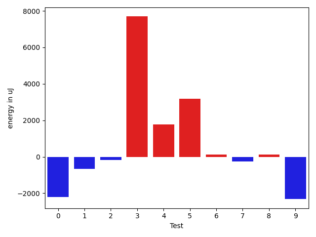

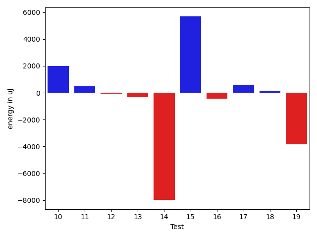

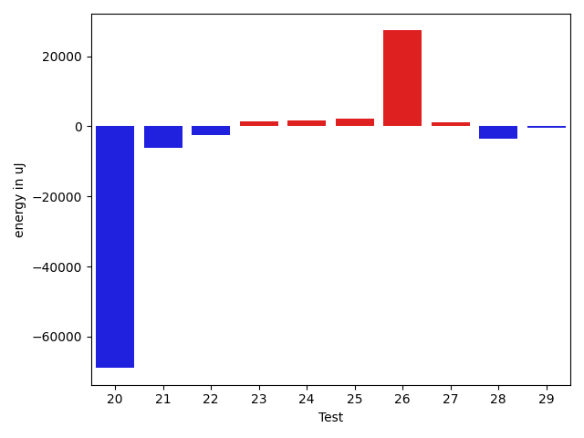

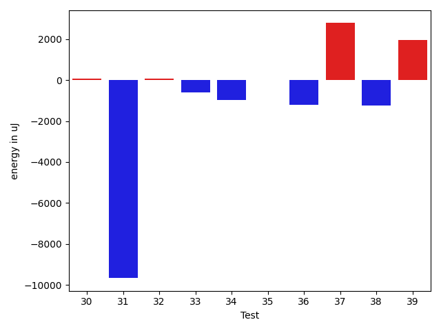

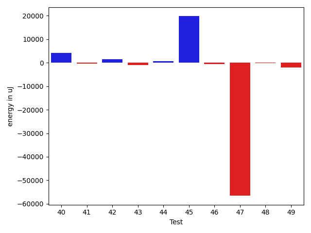

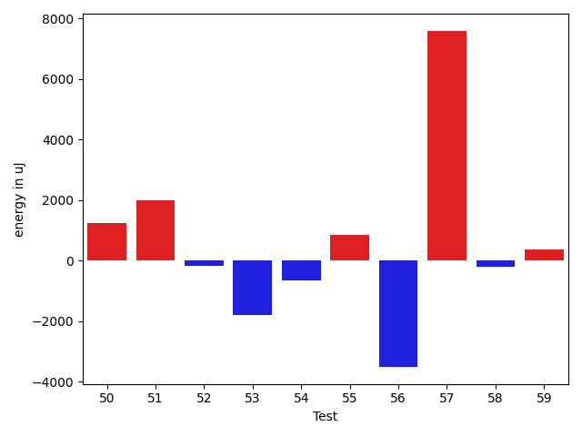

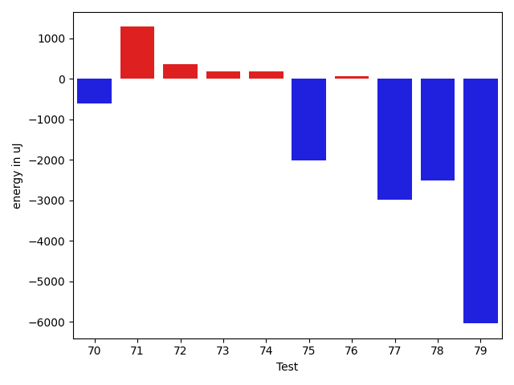

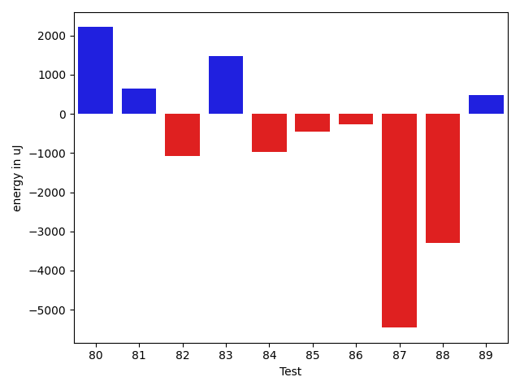

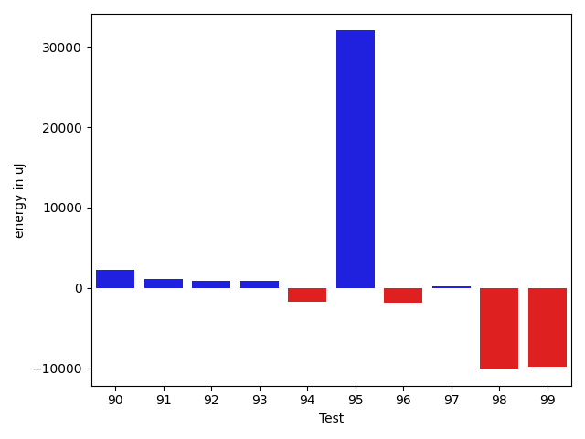

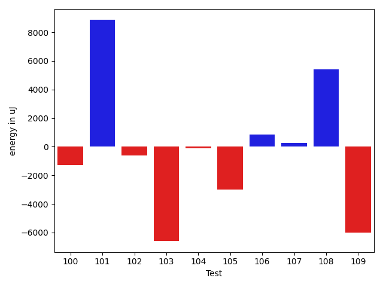

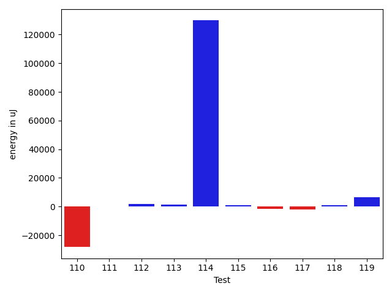

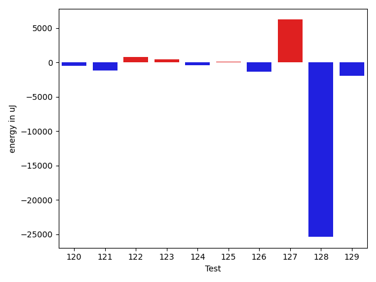

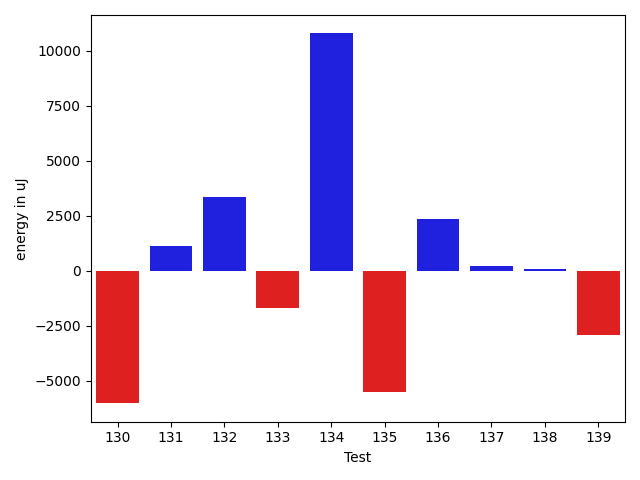

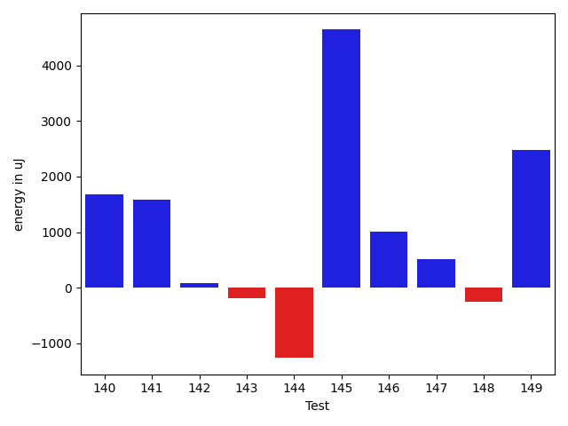

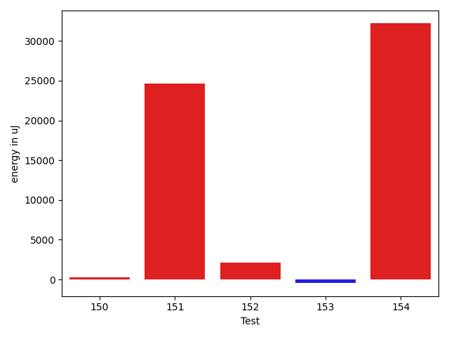

| ID | EnergyV1 | EnergyV2 | DeltaEnergy | σV1 | σV2 |
| --- | --- | --- | --- | --- | --- |
| 0 | 43213 | 41015 | -2198 | 47555.22655204402 | 87902.2013264784 |
| 1 | 41015 | 40344 | -671 | 4486.312926302299 | 5427.939599085445 |
| 2 | 38635 | 38452 | -183 | 4357.14372521459 | 4130.552912756278 |
| 3 | 68359 | 76049 | 7690 | 43468.24516185201 | 45765.39428172974 |
| 4 | 42907 | 44677 | 1770 | 63547.101472431474 | 95345.3682280078 |
| 5 | 38452 | 41626 | 3174 | 4244.236007756969 | 4435.8524141364305 |
| 6 | 41321 | 41442 | 121 | 10224.096400640987 | 10109.443934052426 |
| 7 | 41382 | 41138 | -244 | 4675.750467878907 | 3862.031900437903 |
| 8 | 40955 | 41077 | 122 | 3464.260985957859 | 6909.53457640033 |
| 9 | 41016 | 38697 | -2319 | 5520.055468939175 | 4168.177806858992 |
| 10 | 41931 | 43091 | 1160 | 16528.61936104471 | 17914.935208707044 |
| 11 | 40344 | 38758 | -1586 | 4995.230019149756 | 3938.228670671626 |
| 12 | 39306 | 39978 | 672 | 7794.072367612649 | 7196.875156725978 |
| 13 | 41138 | 39672 | -1466 | 4724.088888166952 | 4541.6101400314865 |
| 14 | 82519 | 86182 | 3663 | 149553.57500654625 | 116039.87683432245 |
| 15 | 39246 | 40344 | 1098 | 4369.6893747782515 | 28770.805664072628 |
| 16 | 41870 | 41931 | 61 | 22686.424782821374 | 22998.016936775977 |
| 17 | 40222 | 40893 | 671 | 5233.988423984141 | 5006.800283858843 |
| 18 | 39001 | 39307 | 306 | 4813.878456422625 | 4356.248567012677 |
| 19 | 43213 | 42480 | -733 | 14352.907361882471 | 11214.084439608427 |
| 20 | 43396 | 41626 | -1770 | 150087.27979772858 | 52662.48221012435 |
| 21 | 126770 | 127685 | 915 | 96445.76232964513 | 67585.08370463648 |
| 22 | 41137 | 41687 | 550 | 24841.04104172937 | 4393.120837053935 |
| 23 | 39428 | 41320 | 1892 | 3956.8731565280623 | 5520.262783104357 |
| 24 | 41016 | 40833 | -183 | 5292.019003726504 | 8174.498272330031 |
| 25 | 39551 | 42541 | 2990 | 4654.746752442049 | 3833.3722379706032 |
| 26 | 42786 | 43029 | 243 | 43999.67715307646 | 104296.72336565047 |
| 27 | 40527 | 39124 | -1403 | 7808.999086791776 | 11473.264771411637 |
| 28 | 41138 | 37963 | -3175 | 9521.653924100488 | 6959.618803399863 |
| 29 | 41320 | 40039 | -1281 | 4671.233680016016 | 7743.080308715775 |
| 30 | 40771 | 41931 | 1160 | 6275.996130788358 | 5815.459368456876 |
| 31 | 81177 | 74402 | -6775 | 38494.66319027152 | 32349.91620421 |
| 32 | 41137 | 40649 | -488 | 12959.188457753207 | 12899.600994710123 |
| 33 | 41626 | 40344 | -1282 | 4058.405359532699 | 3797.95620874878 |
| 34 | 40405 | 40771 | 366 | 4021.7359793759692 | 4240.86081459336 |
| 35 | 41443 | 42297 | 854 | 4048.8834200610845 | 4639.450304701616 |
| 36 | 40710 | 41198 | 488 | 13816.588795871212 | 8227.886861842817 |
| 37 | 42846 | 42175 | -671 | 7287.905187447522 | 22155.846588704797 |
| 38 | 41504 | 39001 | -2503 | 4604.272415224798 | 5228.259980288624 |
| 39 | 38208 | 41748 | 3540 | 4784.4398793572145 | 5105.134772842818 |
| 40 | 39367 | 41993 | 2626 | 6898.433494914674 | 17768.118889573634 |
| 41 | 41992 | 40527 | -1465 | 4737.41334529216 | 3769.598351229457 |
| 42 | 39795 | 42541 | 2746 | 4910.86116735994 | 4316.811400160319 |
| 43 | 42419 | 38391 | -4028 | 4259.61324453941 | 4424.754185493338 |
| 44 | 39734 | 41382 | 1648 | 4003.3802265907552 | 5409.011676788306 |
| 45 | 43030 | 43335 | 305 | 493302.1228354906 | 525589.0846330718 |
| 46 | 84411 | 83679 | -732 | 23508.765641312715 | 24670.825867340456 |
| 47 | 85388 | 83008 | -2380 | 349734.925800644 | 252063.43756344955 |
| 48 | 39368 | 39307 | -61 | 4531.991640635093 | 4607.929401555782 |
| 49 | 40710 | 39063 | -1647 | 13571.71090024928 | 13175.910051342436 |
| 50 | 40222 | 41260 | 1038 | 4663.591417362083 | 4542.672659102249 |
| 51 | 38513 | 40772 | 2259 | 4235.840097705924 | 3836.8312866627393 |
| 52 | 39611 | 39245 | -366 | 5061.235977613941 | 4686.659181732152 |
| 53 | 39368 | 39489 | 121 | 4926.68506934033 | 4761.121725952318 |
| 54 | 39978 | 40649 | 671 | 4516.145723001038 | 4905.788595564937 |
| 55 | 40100 | 41565 | 1465 | 5899.788173365084 | 6923.480215175787 |
| 56 | 41626 | 41320 | -306 | 18426.08909180255 | 13395.712761310557 |
| 57 | 40589 | 43335 | 2746 | 33779.85031370485 | 46277.27796130015 |
| 58 | 41137 | 41199 | 62 | 4336.432709105903 | 4427.775983604822 |
| 59 | 40772 | 41382 | 610 | 4414.706920560463 | 5702.915575548279 |
| 60 | 43212 | 42969 | -243 | 533053.4615734932 | 241009.65911527644 |
| 61 | 41809 | 40711 | -1098 | 6253.576856442487 | 4162.020330858287 |
| 62 | 164245 | 168029 | 3784 | 334470.57423635427 | 184200.1570472634 |
| 63 | 43090 | 41565 | -1525 | 9625.512548945328 | 8014.763024682525 |
| 64 | 41626 | 40283 | -1343 | 9830.188533970588 | 8886.04754850651 |
| 65 | 42907 | 39856 | -3051 | 8958.496947428928 | 11350.366205771214 |
| 66 | 89722 | 83496 | -6226 | 96281.29372458425 | 80783.30850688549 |
| 67 | 40771 | 39916 | -855 | 13521.78174768346 | 12698.1350588339 |
| 68 | 40955 | 41870 | 915 | 12859.86212415445 | 10568.96787039523 |
| 69 | 85022 | 85876 | 854 | 387310.43020891264 | 621632.064286248 |
| 70 | 43030 | 42419 | -611 | 24882.845260981827 | 23782.82519347163 |
| 71 | 40588 | 41870 | 1282 | 4515.819322594846 | 6195.63545595809 |
| 72 | 40283 | 40649 | 366 | 9794.555521995391 | 4877.147467119007 |
| 73 | 41504 | 41687 | 183 | 12356.09708266098 | 9577.698146330475 |
| 74 | 40771 | 40954 | 183 | 10055.119386888815 | 5330.99486577586 |
| 75 | 76477 | 74463 | -2014 | 88324.7296074535 | 105174.45292063458 |
| 76 | 40954 | 41016 | 62 | 12947.288790364277 | 13631.345552631812 |
| 77 | 79651 | 76660 | -2991 | 38253.855876903086 | 39236.04100823109 |
| 78 | 71960 | 69458 | -2502 | 30706.351506087907 | 33475.75326158574 |
| 79 | 82397 | 76355 | -6042 | 42473.62565406458 | 38075.97076718713 |
| 80 | 40466 | 39612 | -854 | 11980.850984744222 | 15126.498804033457 |
| 81 | 40039 | 39428 | -611 | 12654.41809930819 | 13430.16283171578 |
| 82 | 40649 | 39733 | -916 | 14243.54121001799 | 14563.295569473168 |
| 83 | 41138 | 39611 | -1527 | 12597.0205126078 | 15929.53382806512 |
| 84 | 40344 | 38147 | -2197 | 4681.456248064028 | 4515.533280945515 |
| 85 | 39733 | 39978 | 245 | 4930.298810401866 | 3329.1309224724 |
| 86 | 42602 | 41931 | -671 | 384064.6284762536 | 374772.6241842782 |
| 87 | 44312 | 43884 | -428 | 78352.99113068066 | 76040.54113252192 |
| 88 | 342223 | 370604 | 28381 | 171293.6258074498 | 158244.1025320426 |
| 89 | 39734 | 36926 | -2808 | 4719.555430027344 | 5805.7084632282385 |
| 90 | 40161 | 40161 | 0 | 10419.40970571319 | 11912.01993339495 |
| 91 | 41504 | 40893 | -611 | 11756.235336195 | 13252.15233616874 |
| 92 | 39551 | 41443 | 1892 | 3808.591910404684 | 4734.1205621703875 |
| 93 | 41748 | 40222 | -1526 | 8931.477387109733 | 14866.555160446736 |
| 94 | 41809 | 38208 | -3601 | 3628.172506924113 | 4827.999819891211 |
| 95 | 41138 | 43152 | 2014 | 4228.033655681182 | 86791.59927985864 |
| 96 | 39856 | 35462 | -4394 | 5405.747527709126 | 3755.849014295146 |
| 97 | 40100 | 40527 | 427 | 3010.982891386502 | 5276.999957888531 |
| 98 | 42114 | 39612 | -2502 | 38891.45352937455 | 3594.385923408893 |
| 99 | 40405 | 38330 | -2075 | 36408.45017611767 | 2722.7763381335603 |
| 100 | 40954 | 39428 | -1526 | 4645.110665679378 | 4560.613704316558 |
| 101 | 39917 | 41260 | 1343 | 5006.646153374929 | 19990.593065683886 |
| 102 | 39856 | 39184 | -672 | 4445.137656936582 | 3951.0916571811786 |
| 103 | 48340 | 45410 | -2930 | 82809.90266139634 | 79515.51069212171 |
| 104 | 41259 | 40649 | -610 | 11702.774330353344 | 11715.17785063712 |
| 105 | 40467 | 39856 | -611 | 19831.20275946995 | 11348.360058264356 |
| 106 | 41504 | 41504 | 0 | 4811.869434271813 | 3616.4909045376953 |
| 107 | 41137 | 42480 | 1343 | 18548.644786674366 | 13274.153091672384 |
| 108 | 38635 | 41931 | 3296 | 4407.041928882135 | 8390.95145644253 |
| 109 | 42297 | 42358 | 61 | 52263.29373333321 | 44321.86932064164 |
| 110 | 42237 | 43029 | 792 | 120499.3347145042 | 74870.58408074344 |
| 111 | 40466 | 39612 | -854 | 9430.009225322605 | 9697.234675773585 |
| 112 | 37231 | 39307 | 2076 | 3917.4939131455594 | 5967.078402059632 |
| 113 | 40649 | 42603 | 1954 | 23284.881430815367 | 21724.067262434863 |
| 114 | 43823 | 43640 | -183 | 20234.851938349937 | 570564.1704561049 |
| 115 | 40405 | 42236 | 1831 | 4141.296585583229 | 4670.421817653701 |
| 116 | 41138 | 39489 | -1649 | 3716.5837159344437 | 4132.517733461118 |
| 117 | 42237 | 41687 | -550 | 25642.320562268058 | 24659.64425649831 |
| 118 | 39306 | 40283 | 977 | 4539.2567670952985 | 3843.653969793089 |
| 119 | 38208 | 41321 | 3113 | 4209.2064315418575 | 25699.631338990057 |
| 120 | 40954 | 40161 | -793 | 3643.5503844253553 | 3578.912189899356 |
| 121 | 40345 | 37964 | -2381 | 4156.444059302644 | 5128.3927936104465 |
| 122 | 39246 | 41259 | 2013 | 4478.233014146772 | 3956.781322110421 |
| 123 | 40100 | 40894 | 794 | 4319.7240095517745 | 5126.39217253876 |
| 124 | 41016 | 39612 | -1404 | 4156.005345532987 | 5901.664862302737 |
| 125 | 40954 | 41198 | 244 | 20375.272583662772 | 20125.200974963103 |
| 126 | 39917 | 38330 | -1587 | 8237.284369121768 | 8174.049212986876 |
| 127 | 42114 | 42725 | 611 | 25375.01919382345 | 36943.98235686437 |
| 128 | 113159 | 90454 | -22705 | 493731.9864726427 | 432805.381553312 |
| 129 | 44311 | 43457 | -854 | 40681.27223023625 | 35287.64230561996 |
| 130 | 41626 | 42114 | 488 | 62757.66962090537 | 46161.63202672986 |
| 131 | 39124 | 39368 | 244 | 4484.252735721537 | 5139.19316921981 |
| 132 | 39978 | 42664 | 2686 | 15356.967133533455 | 17593.930781732648 |
| 133 | 39673 | 41320 | 1647 | 14468.723451291375 | 8298.615198736852 |
| 134 | 43091 | 42664 | -427 | 26298.7921475185 | 54091.60444127298 |
| 135 | 44434 | 43456 | -978 | 71201.11837620434 | 53014.90810961707 |
| 136 | 41076 | 38513 | -2563 | 4523.4501325947 | 16335.963662720216 |
| 137 | 39978 | 39550 | -428 | 3644.702376268029 | 4067.579923931959 |
| 138 | 38879 | 39551 | 672 | 4240.23188629251 | 3606.7240815712444 |
| 139 | 40527 | 40893 | 366 | 24751.694511539918 | 14596.923749953452 |
| 140 | 39977 | 41565 | 1588 | 4691.204648436021 | 5941.867423438608 |
| 141 | 39978 | 40161 | 183 | 4594.574215888359 | 7789.194336055835 |
| 142 | 41137 | 38879 | -2258 | 13859.825342837139 | 14042.638919276336 |
| 143 | 39611 | 39307 | -304 | 4568.485525633067 | 3744.6589741612574 |
| 144 | 39001 | 38757 | -244 | 5209.558949304729 | 4309.525417295279 |
| 145 | 41565 | 43457 | 1892 | 21432.50836074427 | 26051.273197871 |
| 146 | 43945 | 45105 | 1160 | 23365.936940047304 | 22038.535099497585 |
| 147 | 40161 | 41442 | 1281 | 5079.422359037218 | 5124.543440416455 |
| 148 | 39673 | 40955 | 1282 | 4706.876259643968 | 4932.9334791745305 |
| 149 | 38147 | 40589 | 2442 | 4826.5668820555165 | 9027.057869074857 |
| 150 | 39856 | 40650 | 794 | 4213.884223570583 | 4806.360886515761 |
| 151 | 42724 | 41443 | -1281 | 518108.22697709384 | 560122.5076977652 |
| 152 | 40283 | 43945 | 3662 | 6231.966611463832 | 4695.692320827898 |
| 153 | 41992 | 41320 | -672 | 4583.72758071483 | 4853.1745785587755 |
| 154 | 41503 | 42725 | 1222 | 358822.4780847268 | 420795.9582193793 |

## Delta Duration per test method

| ID | DurationV1 | DurationsV2 | DeltaDuration |
| --- | --- | --- | --- |
| 0 | 972339.0625 | 1591725.0425531915 | 619385.9800531915 |
| 1 | 831918.5961538461 | 936882.5 | 104963.90384615387 |
| 2 | 449594.95238095237 | 526737.7142857143 | 77142.76190476195 |
| 3 | 2153204.3131313133 | 2241239.9693877553 | 88035.65625644196 |
| 4 | 1524665.6 | 2285492.48 | 760826.8799999999 |
| 5 | 518471.85714285716 | 529851.96 | 11380.102857142803 |
| 6 | 873146.92 | 1010956.1698113207 | 137809.24981132068 |
| 7 | 489005.8076923077 | 506444.16 | 17438.352307692287 |
| 8 | 759584.7692307692 | 844787.7234042553 | 85202.9541734861 |
| 9 | 540518.6818181818 | 584071.5357142857 | 43552.853896103916 |
| 10 | 1168782.231707317 | 1314784.7142857143 | 146002.48257839726 |
| 11 | 485532.45454545453 | 508730.625 | 23198.17045454547 |
| 12 | 1086660.6323529412 | 1012869.5901639344 | -73791.04218900681 |
| 13 | 737937.4444444445 | 719162.0 | -18775.444444444496 |
| 14 | 3898092.212121212 | 3533205.3434343436 | -364886.86868686834 |
| 15 | 718182.1935483871 | 817261.1612903225 | 99078.9677419354 |
| 16 | 1209038.2222222222 | 1160593.4642857143 | -48444.75793650793 |
| 17 | 580962.72 | 563892.5714285715 | -17070.148571428494 |
| 18 | 506097.6666666667 | 524105.84 | 18008.17333333334 |
| 19 | 1168349.68852459 | 1118045.4328358208 | -50304.25568876928 |
| 20 | 3589246.3488372094 | 1205815.108695652 | -2383431.2401415575 |
| 21 | 3940946.8383838385 | 3744939.242424242 | -196007.59595959634 |
| 22 | 780632.3414634146 | 711043.425925926 | -69588.91553748865 |
| 23 | 697387.5581395349 | 736453.4390243902 | 39065.88088485529 |
| 24 | 774480.1296296297 | 866947.7209302326 | 92467.59130060289 |
| 25 | 587200.8965517242 | 637663.65625 | 50462.759698275826 |
| 26 | 1567584.494736842 | 2423105.2346938774 | 855520.7399570353 |
| 27 | 998030.323076923 | 1052763.3442622952 | 54733.02118537214 |
| 28 | 865451.8867924528 | 913859.4761904762 | 48407.58939802344 |
| 29 | 863550.5208333334 | 947475.0612244898 | 83924.54039115645 |
| 30 | 951716.4634146341 | 847673.8222222222 | -104042.64119241189 |
| 31 | 2269554.775510204 | 2118708.1530612246 | -150846.6224489794 |
| 32 | 1190394.0735294118 | 1168313.463768116 | -22080.60976129584 |
| 33 | 523701.70588235295 | 595898.6315789474 | 72196.92569659447 |
| 34 | 813616.0869565217 | 765522.5614035088 | -48093.525553012965 |
| 35 | 528187.9629629629 | 506746.7428571429 | -21441.220105820044 |
| 36 | 1199581.0731707318 | 1176575.1486486488 | -23005.92452208302 |
| 37 | 845033.6 | 890674.6666666666 | 45641.06666666665 |
| 38 | 799432.76 | 794309.0 | -5123.760000000009 |
| 39 | 468875.78571428574 | 466420.86666666664 | -2454.9190476190997 |
| 40 | 872303.282051282 | 1035605.78125 | 163302.499198718 |
| 41 | 573595.7647058824 | 537887.75 | -35708.01470588241 |
| 42 | 782864.7906976744 | 727666.7659574468 | -55198.024740227615 |
| 43 | 564261.5833333334 | 544759.0 | -19502.583333333372 |
| 44 | 757031.5434782609 | 731006.3720930233 | -26025.171385237598 |
| 45 | 4348905.767123288 | 4988396.17721519 | 639490.4100919021 |
| 46 | 2716093.878787879 | 2485634.4444444445 | -230459.4343434344 |
| 47 | 5402810.767676768 | 3398881.8383838385 | -2003928.9292929294 |
| 48 | 925587.6865671641 | 886372.4 | -39215.28656716412 |
| 49 | 1185399.4444444445 | 1084130.9466666668 | -101268.49777777772 |
| 50 | 618275.5925925926 | 601250.9642857143 | -17024.628306878265 |
| 51 | 684315.2777777778 | 603822.0909090909 | -80493.18686868681 |
| 52 | 630382.78125 | 576171.0357142857 | -54211.74553571432 |
| 53 | 684845.4375 | 673728.9210526316 | -11116.516447368427 |
| 54 | 785956.7567567568 | 650626.5 | -135330.2567567568 |
| 55 | 884475.6727272727 | 832774.75 | -51700.92272727273 |
| 56 | 1338439.1927710844 | 1253603.6233766233 | -84835.56939446111 |
| 57 | 1172486.282051282 | 1334535.0487804879 | 162048.76672920585 |
| 58 | 787757.7592592592 | 782078.3555555556 | -5679.403703703661 |
| 59 | 639233.0555555555 | 729659.2068965518 | 90426.15134099626 |
| 60 | 5001889.0875 | 2064846.1898734176 | -2937042.8976265825 |
| 61 | 776558.5714285715 | 719106.972972973 | -57451.59845559846 |
| 62 | 6886021.838383839 | 5310863.070707071 | -1575158.767676768 |
| 63 | 1015049.8148148148 | 873549.4545454546 | -141500.36026936024 |
| 64 | 1113660.0151515151 | 1026813.1690140845 | -86846.84613743064 |
| 65 | 1015564.6176470588 | 730680.7567567568 | -284883.860890302 |
| 66 | 3462404.131313131 | 3134794.8282828284 | -327609.30303030275 |
| 67 | 1174980.3333333333 | 1195698.8205128205 | 20718.487179487245 |
| 68 | 1008819.754385965 | 987153.3898305085 | -21666.364555456443 |
| 69 | 4432453.96969697 | 7191090.373737373 | 2758636.4040404037 |
| 70 | 1634590.887755102 | 1614331.268041237 | -20259.619713864988 |
| 71 | 1028935.7222222222 | 1036988.0625 | 8052.340277777752 |
| 72 | 947759.25 | 706091.1489361703 | -241668.10106382973 |
| 73 | 872770.2972972973 | 769767.8 | -103002.49729729723 |
| 74 | 830646.027027027 | 660267.5357142857 | -170378.4913127413 |
| 75 | 2630461.232323232 | 2830193.585858586 | 199732.35353535367 |
| 76 | 1216965.8837209302 | 1325454.5952380951 | 108488.71151716495 |
| 77 | 2367295.232323232 | 2430601.6565656564 | 63306.42424242431 |
| 78 | 2010309.1515151516 | 2157785.5656565656 | 147476.414141414 |
| 79 | 2461351.0 | 2472079.3434343436 | 10728.34343434358 |
| 80 | 1310807.7528089888 | 1307551.3595505618 | -3256.393258427037 |
| 81 | 1149735.2777777778 | 1218256.6666666667 | 68521.38888888899 |
| 82 | 1324361.8313253012 | 1330892.5862068965 | 6530.754881595261 |
| 83 | 1287498.177777778 | 1368411.7582417582 | 80913.58046398032 |
| 84 | 826601.5370370371 | 904052.8596491228 | 77451.32261208573 |
| 85 | 610263.3673469388 | 647995.9117647059 | 37732.54441776709 |
| 86 | 2925103.970588235 | 3125964.09375 | 200860.12316176482 |
| 87 | 2079810.7419354839 | 1982397.7045454546 | -97413.03739002929 |
| 88 | 9956555.848484848 | 9915291.232323233 | -41264.61616161466 |
| 89 | 420635.42307692306 | 438710.5 | 18075.076923076937 |
| 90 | 1003508.6571428571 | 1144346.205882353 | 140837.54873949592 |
| 91 | 713061.8 | 984443.0 | 271381.19999999995 |
| 92 | 403517.35 | 415527.17391304346 | 12009.823913043481 |
| 93 | 894069.873015873 | 1155790.2686567164 | 261720.39564084343 |
| 94 | 368341.05 | 404424.39130434784 | 36083.34130434785 |
| 95 | 562298.304347826 | 1728868.1666666667 | 1166569.8623188408 |
| 96 | 383379.3333333333 | 425363.0 | 41983.666666666686 |
| 97 | 424368.5 | 388224.55555555556 | -36143.94444444444 |
| 98 | 639746.55 | 525855.12 | -113891.43000000005 |
| 99 | 653049.8695652174 | 454344.25 | -198705.6195652174 |
| 100 | 480867.60869565216 | 484107.0 | 3239.3913043478387 |
| 101 | 561755.4782608695 | 1073051.2272727273 | 511295.7490118578 |
| 102 | 437033.09523809527 | 504993.3333333333 | 67960.23809523805 |
| 103 | 2338597.7395833335 | 2205260.010526316 | -133337.7290570177 |
| 104 | 1246685.295774648 | 1225613.4657534247 | -21071.830021223286 |
| 105 | 1215480.8115942029 | 1145642.8904109588 | -69837.92118324409 |
| 106 | 756140.5 | 803839.0 | 47698.5 |
| 107 | 1286398.5733333332 | 1259542.36 | -26856.213333333144 |
| 108 | 731185.119047619 | 800365.875 | 69180.75595238095 |
| 109 | 1592248.8833333333 | 1345274.1739130435 | -246974.70942028984 |
| 110 | 2444203.861111111 | 1502323.6756756757 | -941880.1854354353 |
| 111 | 1298029.2840909092 | 1314978.3258426967 | 16949.041751787532 |
| 112 | 818777.2702702703 | 797534.8285714285 | -21242.44169884175 |
| 113 | 1219898.4107142857 | 1301993.0147058824 | 82094.60399159673 |
| 114 | 1253590.6229508198 | 4932610.135593221 | 3679019.512642401 |
| 115 | 580314.8846153846 | 627597.275862069 | 47282.39124668436 |
| 116 | 777824.3902439025 | 711663.9268292683 | -66160.46341463411 |
| 117 | 1244342.84375 | 1245773.205882353 | 1430.3621323530097 |
| 118 | 773869.268292683 | 715636.6111111111 | -58232.65718157182 |
| 119 | 604757.9 | 785934.52 | 181176.62 |
| 120 | 516269.5 | 559472.4285714285 | 43202.92857142852 |
| 121 | 711317.8928571428 | 557852.7333333333 | -153465.15952380956 |
| 122 | 587270.1153846154 | 615931.304347826 | 28661.188963210676 |
| 123 | 762107.3421052631 | 533107.2 | -229000.1421052632 |
| 124 | 666101.4444444445 | 654134.9714285714 | -11966.47301587311 |
| 125 | 1174567.4929577464 | 1259845.8529411764 | 85278.35998343001 |
| 126 | 990425.9682539683 | 1121366.476923077 | 130940.50866910862 |
| 127 | 1321551.4807692308 | 1602358.2459016393 | 280806.7651324086 |
| 128 | 5889047.7272727275 | 5520146.656565657 | -368901.07070707064 |
| 129 | 1916650.9278350514 | 1796325.0714285714 | -120325.85640648007 |
| 130 | 1470261.6721311475 | 1271920.0303030303 | -198341.6418281172 |
| 131 | 854864.4782608695 | 822909.6458333334 | -31954.832427536137 |
| 132 | 1303094.4457831325 | 1296781.858974359 | -6312.586808773456 |
| 133 | 1099496.0357142857 | 958715.6896551724 | -140780.34605911328 |
| 134 | 1113156.0 | 1426871.137254902 | 313715.1372549019 |
| 135 | 1932311.3506493506 | 1744602.0649350649 | -187709.28571428568 |
| 136 | 579267.6538461539 | 631140.5151515151 | 51872.861305361264 |
| 137 | 745367.2093023256 | 758916.9137931034 | 13549.704490777804 |
| 138 | 595731.2903225806 | 613331.53125 | 17600.240927419392 |
| 139 | 1130714.0188679246 | 1071316.7777777778 | -59397.241090146825 |
| 140 | 604994.3103448276 | 722550.2972972973 | 117555.98695246968 |
| 141 | 650118.8571428572 | 714671.3529411765 | 64552.495798319345 |
| 142 | 873668.7777777778 | 952670.3157894737 | 79001.53801169596 |
| 143 | 640982.6774193548 | 740362.1666666666 | 99379.48924731184 |
| 144 | 448624.63636363635 | 430044.63636363635 | -18580.0 |
| 145 | 1371853.8505747127 | 1463341.1282051282 | 91487.27763041551 |
| 146 | 1554476.5081967213 | 1578301.3125 | 23824.80430327868 |
| 147 | 673569.1951219512 | 699138.0512820513 | 25568.856160100084 |
| 148 | 670356.52 | 700093.0625 | 29736.54249999998 |
| 149 | 778782.023255814 | 824691.6470588235 | 45909.62380300951 |
| 150 | 622720.8888888889 | 638700.8857142857 | 15979.996825396782 |
| 151 | 4247561.061538462 | 5618636.784313725 | 1371075.7227752637 |
| 152 | 832851.44 | 692186.9523809524 | -140664.48761904752 |
| 153 | 768594.2926829269 | 912252.1388888889 | 143657.846205962 |
| 154 | 3318468.906976744 | 4477950.826086956 | 1159481.919110212 |

## Misc.

| ID | Test Class | Test Method |
| --- | --- | --- |
| 0 | com.google.gson.functional.InterfaceTest | testSerializingObjectImplementingInterface |
| 1 | com.google.gson.functional.InterfaceTest | testSerializingInterfaceObjectField |
| 2 | com.google.gson.functional.InheritanceTest | testBaseSerializedAsBaseWhenSpecifiedWithExplicitType |
| 3 | com.google.gson.functional.InheritanceTest | testSubInterfacesOfCollectionSerialization |
| 4 | com.google.gson.functional.InheritanceTest | testBaseSerializedAsBaseWhenSpecifiedWithExplicitTypeForToJsonMethod |
| 5 | com.google.gson.functional.InheritanceTest | testBaseSerializedAsSubForToJsonMethod |
| 6 | com.google.gson.functional.InheritanceTest | testClassWithBaseArrayFieldSerialization |
| 7 | com.google.gson.functional.InheritanceTest | testBaseSerializedAsSubWhenSpecifiedWithExplicitTypeForToJsonMethod |
| 8 | com.google.gson.functional.InheritanceTest | testClassWithBaseFieldSerialization |
| 9 | com.google.gson.functional.InheritanceTest | testBaseSerializedAsSub |
| 10 | com.google.gson.functional.InheritanceTest | testSubClassSerialization |
| 11 | com.google.gson.functional.InheritanceTest | testBaseSerializedAsSubWhenSpecifiedWithExplicitType |
| 12 | com.google.gson.functional.PrettyPrintingTest | testEmptyMapField |
| 13 | com.google.gson.functional.PrettyPrintingTest | testPrettyPrintListOfPrimitiveArrays |
| 14 | com.google.gson.functional.PrettyPrintingTest | testPrettyPrintList |
| 15 | com.google.gson.functional.PrettyPrintingTest | testPrettyPrintArrayOfPrimitiveArrays |
| 16 | com.google.gson.functional.PrettyPrintingTest | testPrettyPrintArrayOfObjects |
| 17 | com.google.gson.functional.PrettyPrintingTest | testMultipleArrays |
| 18 | com.google.gson.functional.PrettyPrintingTest | testPrettyPrintArrayOfPrimitives |
| 19 | com.google.gson.functional.ReadersWritersTest | testReadWriteTwoObjects |
| 20 | com.google.gson.functional.ReadersWritersTest | testWriterForSerialization |
| 21 | com.google.gson.functional.ExposeFieldsTest | testNullExposeFieldSerialization |
| 22 | com.google.gson.functional.ExposeFieldsTest | testNoExposedFieldSerialization |
| 23 | com.google.gson.functional.ExposeFieldsTest | testExposedInterfaceFieldSerialization |
| 24 | com.google.gson.functional.ExposeFieldsTest | testArrayWithOneNullExposeFieldObjectSerialization |
| 25 | com.google.gson.functional.ExposeFieldsTest | testExposeAnnotationSerialization |
| 26 | com.google.gson.functional.MoreSpecificTypeSerializationTest | testSubclassFields |
| 27 | com.google.gson.functional.MoreSpecificTypeSerializationTest | testListOfParameterizedSubclassFields |
| 28 | com.google.gson.functional.MoreSpecificTypeSerializationTest | testMapOfParameterizedSubclassFields |
| 29 | com.google.gson.functional.MoreSpecificTypeSerializationTest | testParameterizedSubclassFields |
| 30 | com.google.gson.functional.ObjectTest | testNestedSerialization |
| 31 | com.google.gson.functional.ObjectTest | testSingletonLists |
| 32 | com.google.gson.functional.ObjectTest | testArrayOfObjectsAsFields |
| 33 | com.google.gson.functional.ObjectTest | testStringFieldWithEmptyValueSerialization |
| 34 | com.google.gson.functional.ObjectTest | testInnerClassSerialization |
| 35 | com.google.gson.functional.ObjectTest | testClassWithObjectFieldSerialization |
| 36 | com.google.gson.functional.ObjectTest | testArrayOfArraysSerialization |
| 37 | com.google.gson.functional.ObjectTest | testBagOfPrimitivesSerialization |
| 38 | com.google.gson.functional.ObjectTest | testArrayOfObjectsSerialization |
| 39 | com.google.gson.functional.ObjectTest | testClassWithNoFieldsSerialization |
| 40 | com.google.gson.functional.ObjectTest | testClassWithTransientFieldsSerialization |
| 41 | com.google.gson.functional.ObjectTest | testPrimitiveArrayFieldSerialization |
| 42 | com.google.gson.functional.ObjectTest | testBagOfPrimitiveWrappersSerialization |
| 43 | com.google.gson.functional.ObjectTest | testEmptyCollectionInAnObjectSerialization |
| 44 | com.google.gson.functional.ObjectTest | testNullFieldsSerialization |
| 45 | com.google.gson.JsonParserTest | testReadWriteTwoObjects |
| 46 | com.google.gson.functional.NamingPolicyTest | testGsonWithNonDefaultFieldNamingPolicySerialization |
| 47 | com.google.gson.functional.NamingPolicyTest | testGsonDuplicateNameUsingSerializedNameFieldNamingPolicySerialization |
| 48 | com.google.gson.functional.NamingPolicyTest | testGsonWithSerializedNameFieldNamingPolicySerialization |
| 49 | com.google.gson.functional.NamingPolicyTest | testComplexFieldNameStrategy |
| 50 | com.google.gson.functional.NamingPolicyTest | testGsonWithUpperCamelCaseSpacesPolicySerialiation |
| 51 | com.google.gson.functional.NamingPolicyTest | testGsonWithLowerCaseDashPolicySerialization |
| 52 | com.google.gson.functional.NamingPolicyTest | testGsonWithLowerCaseUnderscorePolicySerialization |
| 53 | com.google.gson.functional.NullObjectAndFieldTest | testExplicitSerializationOfNullStringMembers |
| 54 | com.google.gson.functional.NullObjectAndFieldTest | testExplicitSerializationOfNullCollectionMembers |
| 55 | com.google.gson.functional.NullObjectAndFieldTest | testPrintPrintingObjectWithNulls |
| 56 | com.google.gson.functional.NullObjectAndFieldTest | testExplicitSerializationOfNullArrayMembers |
| 57 | com.google.gson.functional.NullObjectAndFieldTest | testExplicitSerializationOfNulls |
| 58 | com.google.gson.functional.NullObjectAndFieldTest | testNullWrappedPrimitiveMemberSerialization |
| 59 | com.google.gson.functional.NullObjectAndFieldTest | testPrintPrintingArraysWithNulls |
| 60 | com.google.gson.functional.FieldExclusionTest | testDefaultInnerClassExclusion |
| 61 | com.google.gson.functional.FieldExclusionTest | testDefaultNestedStaticClassIncluded |
| 62 | com.google.gson.functional.VersioningTest | testVersionedUntilSerialization |
| 63 | com.google.gson.functional.VersioningTest | testVersionedClassesSerialization |
| 64 | com.google.gson.functional.VersioningTest | testVersionedGsonMixingSinceAndUntilSerialization |
| 65 | com.google.gson.functional.VersioningTest | testVersionedGsonWithUnversionedClassesSerialization |
| 66 | com.google.gson.functional.MapAsArrayTypeAdapterTest | testMultipleEnableComplexKeyRegistrationHasNoEffect |
| 67 | com.google.gson.functional.MapAsArrayTypeAdapterTest | testMapWithTypeVariableSerialization |
| 68 | com.google.gson.functional.EnumTest | testClassWithEnumFieldSerialization |
| 69 | com.google.gson.functional.TypeVariableTest | testAdvancedTypeVariables |
| 70 | com.google.gson.functional.TypeVariableTest | testTypeVariablesViaTypeParameter |
| 71 | com.google.gson.functional.TypeVariableTest | testBasicTypeVariables |
| 72 | com.google.gson.functional.UncategorizedTest | testGsonInstanceReusableForSerializationAndDeserialization |
| 73 | com.google.gson.functional.UncategorizedTest | testObjectEqualButNotSameSerialization |
| 74 | com.google.gson.functional.UncategorizedTest | testStaticFieldsAreNotSerialized |
| 75 | com.google.gson.functional.ParameterizedTypesTest | testParameterizedTypesSerialization |
| 76 | com.google.gson.functional.ParameterizedTypesTest | testVariableTypeDeserialization |
| 77 | com.google.gson.functional.ParameterizedTypesTest | testVariableTypeFieldsAndGenericArraysSerialization |
| 78 | com.google.gson.functional.ParameterizedTypesTest | testVariableTypeFieldsAndGenericArraysDeserialization |
| 79 | com.google.gson.functional.ParameterizedTypesTest | testTypesWithMultipleParametersSerialization |
| 80 | com.google.gson.functional.ParameterizedTypesTest | testParameterizedTypeWithVariableTypeDeserialization |
| 81 | com.google.gson.functional.ParameterizedTypesTest | testParameterizedTypeGenericArraysSerialization |
| 82 | com.google.gson.functional.ParameterizedTypesTest | testVariableTypeArrayDeserialization |
| 83 | com.google.gson.functional.ParameterizedTypesTest | testParameterizedTypeGenericArraysDeserialization |
| 84 | com.google.gson.functional.ParameterizedTypesTest | testParameterizedTypesWithWriterSerialization |
| 85 | com.google.gson.functional.ParameterizedTypesTest | testDeepParameterizedTypeSerialization |
| 86 | com.google.gson.FunctionWithInternalDependenciesTest | testAnonymousLocalClassesSerialization |
| 87 | com.google.gson.functional.ConcurrencyTest | testSingleThreadSerialization |
| 88 | com.google.gson.functional.ConcurrencyTest | testMultiThreadSerialization |
| 89 | com.google.gson.functional.ArrayTest | testMixingTypesInObjectArraySerialization |
| 90 | com.google.gson.functional.ArrayTest | testArrayOfCollectionSerialization |
| 91 | com.google.gson.functional.ArrayTest | testArrayOfPrimitivesAsObjectsSerialization |
| 92 | com.google.gson.functional.ArrayTest | testEmptyArraySerialization |
| 93 | com.google.gson.functional.ArrayTest | testObjectArrayWithNonPrimitivesSerialization |
| 94 | com.google.gson.functional.ArrayTest | testArrayOfNullSerialization |
| 95 | com.google.gson.functional.ArrayTest | testTopLevelArrayOfIntsSerialization |
| 96 | com.google.gson.functional.ArrayTest | testSingleStringArraySerialization |
| 97 | com.google.gson.functional.ArrayTest | testArrayOfStringsSerialization |
| 98 | com.google.gson.functional.ArrayTest | testNullsInArrayWithSerializeNullPropertySetSerialization |
| 99 | com.google.gson.functional.ArrayTest | testMultiDimenstionalObjectArraysSerialization |
| 100 | com.google.gson.functional.ArrayTest | testNullsInArraySerialization |
| 101 | com.google.gson.functional.ArrayTest | testSingleNullInArraySerialization |
| 102 | com.google.gson.functional.ArrayTest | testMultidimenstionalArraysSerialization |
| 103 | com.google.gson.functional.RawSerializationTest | testThreeLevelParameterizedObject |
| 104 | com.google.gson.functional.RawSerializationTest | testTwoLevelParameterizedObject |
| 105 | com.google.gson.functional.RawSerializationTest | testParameterizedObject |
| 106 | com.google.gson.functional.RawSerializationTest | testCollectionOfObjects |
| 107 | com.google.gson.functional.EscapingTest | testGsonAcceptsEscapedAndNonEscapedJsonDeserialization |
| 108 | com.google.gson.functional.EscapingTest | testGsonDoubleDeserialization |
| 109 | com.google.gson.functional.EscapingTest | testEscapingObjectFields |
| 110 | com.google.gson.functional.EscapingTest | testEscapingQuotesInStringArray |
| 111 | com.google.gson.functional.CustomTypeAdaptersTest | testCustomTypeAdapterDoesNotAppliesToSubClasses |
| 112 | com.google.gson.functional.CustomTypeAdaptersTest | testEnsureCustomSerializerNotInvokedForNullValues |
| 113 | com.google.gson.functional.CustomTypeAdaptersTest | testCustomNestedSerializers |
| 114 | com.google.gson.functional.CustomSerializerTest | testSubClassSerializerInvokedForBaseClassFieldsHoldingSubClassInstances |
| 115 | com.google.gson.functional.CustomSerializerTest | testBaseClassSerializerInvokedForBaseClassFields |
| 116 | com.google.gson.functional.CustomSerializerTest | testSubClassSerializerInvokedForBaseClassFieldsHoldingArrayOfSubClassInstances |
| 117 | com.google.gson.functional.JsonTreeTest | testJsonTreeToString |
| 118 | com.google.gson.functional.PrimitiveTest | testBigIntegerInASingleElementArraySerialization |
| 119 | com.google.gson.functional.PrimitiveTest | testMoreSpecificSerialization |
| 120 | com.google.gson.functional.PrimitiveTest | testPrimitiveBooleanAutoboxedInASingleElementArraySerialization |
| 121 | com.google.gson.functional.PrimitiveTest | testBigDecimalInASingleElementArraySerialization |
| 122 | com.google.gson.functional.PrimitiveTest | testPrimitiveLongAutoboxedInASingleElementArraySerialization |
| 123 | com.google.gson.functional.PrimitiveTest | testPrimitiveDoubleAutoboxedInASingleElementArraySerialization |
| 124 | com.google.gson.functional.PrimitiveTest | testPrimitiveIntegerAutoboxedInASingleElementArraySerialization |
| 125 | com.google.gson.functional.DefaultTypeAdaptersTest | testUrlNullSerialization |
| 126 | com.google.gson.functional.DefaultTypeAdaptersTest | testBigIntegerFieldSerialization |
| 127 | com.google.gson.functional.DefaultTypeAdaptersTest | testBigDecimalFieldSerialization |
| 128 | com.google.gson.functional.TypeHierarchyAdapterTest | testTypeHierarchy |
| 129 | com.google.gson.functional.CollectionTest | testWildcardCollectionField |
| 130 | com.google.gson.functional.CollectionTest | testSetSerialization |
| 131 | com.google.gson.functional.CollectionTest | testRawCollectionSerialization |
| 132 | com.google.gson.functional.CollectionTest | testFieldIsArrayList |
| 133 | com.google.gson.functional.CollectionTest | testCollectionOfBagOfPrimitivesSerialization |
| 134 | com.google.gson.functional.CircularReferenceTest | testDirectedAcyclicGraphSerialization |
| 135 | com.google.gson.functional.PrintFormattingTest | testCompactFormattingLeavesNoWhiteSpace |
| 136 | com.google.gson.internal.bind.MiniGsonTest | testSerialize2dArray |
| 137 | com.google.gson.internal.bind.MiniGsonTest | testSerializeRecursive |
| 138 | com.google.gson.internal.bind.MiniGsonTest | testDeserialize2dArray |
| 139 | com.google.gson.internal.bind.MiniGsonTest | testSerializeWithCustomTypeAdapter |
| 140 | com.google.gson.internal.bind.MiniGsonTest | testDeserialize1dArray |
| 141 | com.google.gson.internal.bind.MiniGsonTest | testSerialize1dArray |
| 142 | com.google.gson.internal.bind.MiniGsonTest | testSerialize |
| 143 | com.google.gson.internal.bind.MiniGsonTest | testDeserializeWithCustomTypeAdapter |
| 144 | com.google.gson.internal.bind.MiniGsonTest | testSerializeNullObject |
| 145 | com.google.gson.functional.MapTest | testSerializeMaps |
| 146 | com.google.gson.functional.MapTest | testMapSerializationWithNullValues |
| 147 | com.google.gson.functional.MapTest | testMapSerializationWithNullValuesSerialized |
| 148 | com.google.gson.MixedStreamTest | testWriteInvalidState |
| 149 | com.google.gson.MixedStreamTest | testWriteDoesNotMutateState |
| 150 | com.google.gson.MixedStreamTest | testWriteClosed |
| 151 | com.google.gson.MixedStreamTest | testWriteMixedStreamed |
| 152 | com.google.gson.functional.StringTest | testStringValueAsSingleElementArraySerialization |
| 153 | com.google.gson.functional.ExclusionStrategyFunctionalTest | testExclusionStrategyWithMode |
| 154 | com.google.gson.functional.SecurityTest | testNonExecutableJsonSerialization |

| Test | IterationV1 | IterationV2 | DeltaIteration |
| --- | --- | --- | --- |
| 0 | 48 | 47 | -1 |
| 1 | 52 | 58 | 6 |
| 2 | 21 | 21 | 0 |
| 3 | 99 | 98 | -1 |
| 4 | 40 | 50 | 10 |
| 5 | 28 | 25 | -3 |
| 6 | 50 | 53 | 3 |
| 7 | 26 | 25 | -1 |
| 8 | 39 | 47 | 8 |
| 9 | 22 | 28 | 6 |
| 10 | 82 | 84 | 2 |
| 11 | 22 | 16 | -6 |
| 12 | 68 | 61 | -7 |
| 13 | 36 | 39 | 3 |
| 14 | 99 | 99 | 0 |
| 15 | 31 | 31 | 0 |
| 16 | 54 | 56 | 2 |
| 17 | 25 | 35 | 10 |
| 18 | 18 | 25 | 7 |
| 19 | 61 | 67 | 6 |
| 20 | 43 | 46 | 3 |
| 21 | 99 | 99 | 0 |
| 22 | 41 | 54 | 13 |
| 23 | 43 | 41 | -2 |
| 24 | 54 | 43 | -11 |
| 25 | 29 | 32 | 3 |
| 26 | 95 | 98 | 3 |
| 27 | 65 | 61 | -4 |
| 28 | 53 | 63 | 10 |
| 29 | 48 | 49 | 1 |
| 30 | 41 | 45 | 4 |
| 31 | 98 | 98 | 0 |
| 32 | 68 | 69 | 1 |
| 33 | 34 | 38 | 4 |
| 34 | 46 | 57 | 11 |
| 35 | 27 | 35 | 8 |
| 36 | 82 | 74 | -8 |
| 37 | 35 | 30 | -5 |
| 38 | 50 | 44 | -6 |
| 39 | 14 | 15 | 1 |
| 40 | 39 | 32 | -7 |
| 41 | 17 | 28 | 11 |
| 42 | 43 | 47 | 4 |
| 43 | 24 | 28 | 4 |
| 44 | 46 | 43 | -3 |
| 45 | 73 | 79 | 6 |
| 46 | 99 | 99 | 0 |
| 47 | 99 | 99 | 0 |
| 48 | 67 | 60 | -7 |
| 49 | 81 | 75 | -6 |
| 50 | 27 | 28 | 1 |
| 51 | 36 | 22 | -14 |
| 52 | 32 | 28 | -4 |
| 53 | 32 | 38 | 6 |
| 54 | 37 | 40 | 3 |
| 55 | 55 | 48 | -7 |
| 56 | 83 | 77 | -6 |
| 57 | 39 | 41 | 2 |
| 58 | 54 | 45 | -9 |
| 59 | 36 | 29 | -7 |
| 60 | 80 | 79 | -1 |
| 61 | 42 | 37 | -5 |
| 62 | 99 | 99 | 0 |
| 63 | 54 | 55 | 1 |
| 64 | 66 | 71 | 5 |
| 65 | 34 | 37 | 3 |
| 66 | 99 | 99 | 0 |
| 67 | 78 | 78 | 0 |
| 68 | 57 | 59 | 2 |
| 69 | 99 | 99 | 0 |
| 70 | 98 | 97 | -1 |
| 71 | 72 | 64 | -8 |
| 72 | 44 | 47 | 3 |
| 73 | 37 | 30 | -7 |
| 74 | 37 | 28 | -9 |
| 75 | 99 | 99 | 0 |
| 76 | 86 | 84 | -2 |
| 77 | 99 | 99 | 0 |
| 78 | 99 | 99 | 0 |
| 79 | 99 | 99 | 0 |
| 80 | 89 | 89 | 0 |
| 81 | 72 | 75 | 3 |
| 82 | 83 | 87 | 4 |
| 83 | 90 | 91 | 1 |
| 84 | 54 | 57 | 3 |
| 85 | 49 | 34 | -15 |
| 86 | 68 | 64 | -4 |
| 87 | 93 | 88 | -5 |
| 88 | 99 | 99 | 0 |
| 89 | 26 | 10 | -16 |
| 90 | 70 | 68 | -2 |
| 91 | 25 | 29 | 4 |
| 92 | 20 | 23 | 3 |
| 93 | 63 | 67 | 4 |
| 94 | 20 | 23 | 3 |
| 95 | 23 | 24 | 1 |
| 96 | 12 | 11 | -1 |
| 97 | 24 | 18 | -6 |
| 98 | 20 | 25 | 5 |
| 99 | 23 | 20 | -3 |
| 100 | 23 | 15 | -8 |
| 101 | 23 | 22 | -1 |
| 102 | 21 | 21 | 0 |
| 103 | 96 | 95 | -1 |
| 104 | 71 | 73 | 2 |
| 105 | 69 | 73 | 4 |
| 106 | 44 | 38 | -6 |
| 107 | 75 | 75 | 0 |
| 108 | 42 | 40 | -2 |
| 109 | 60 | 69 | 9 |
| 110 | 36 | 37 | 1 |
| 111 | 88 | 89 | 1 |
| 112 | 37 | 35 | -2 |
| 113 | 56 | 68 | 12 |
| 114 | 61 | 59 | -2 |
| 115 | 26 | 29 | 3 |
| 116 | 41 | 41 | 0 |
| 117 | 64 | 68 | 4 |
| 118 | 41 | 36 | -5 |
| 119 | 30 | 25 | -5 |
| 120 | 26 | 28 | 2 |
| 121 | 28 | 30 | 2 |
| 122 | 26 | 23 | -3 |
| 123 | 38 | 30 | -8 |
| 124 | 18 | 35 | 17 |
| 125 | 71 | 68 | -3 |
| 126 | 63 | 65 | 2 |
| 127 | 52 | 61 | 9 |
| 128 | 99 | 99 | 0 |
| 129 | 97 | 98 | 1 |
| 130 | 61 | 66 | 5 |
| 131 | 46 | 48 | 2 |
| 132 | 83 | 78 | -5 |
| 133 | 56 | 58 | 2 |
| 134 | 54 | 51 | -3 |
| 135 | 77 | 77 | 0 |
| 136 | 26 | 33 | 7 |
| 137 | 43 | 58 | 15 |
| 138 | 31 | 32 | 1 |
| 139 | 53 | 63 | 10 |
| 140 | 29 | 37 | 8 |
| 141 | 35 | 34 | -1 |
| 142 | 18 | 19 | 1 |
| 143 | 31 | 42 | 11 |
| 144 | 11 | 11 | 0 |
| 145 | 87 | 78 | -9 |
| 146 | 61 | 64 | 3 |
| 147 | 41 | 39 | -2 |
| 148 | 50 | 32 | -18 |
| 149 | 43 | 34 | -9 |
| 150 | 27 | 35 | 8 |
| 151 | 65 | 51 | -14 |
| 152 | 25 | 21 | -4 |
| 153 | 41 | 36 | -5 |
| 154 | 43 | 46 | 3 |

| Time Label | Time (s) |
| --- | --- |
| Selection | 29.13391613960266 |
| Injection | 15.786972045898438 |
| Total | 1251.6062786579132 |

