# gson 1885ba

https://github.com/google/gson/commit/1885ba

## Delta Energy per test method

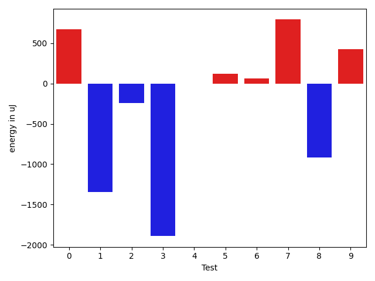

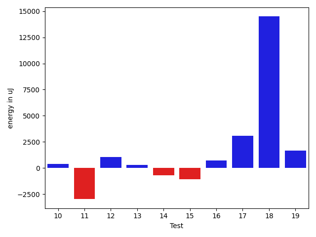

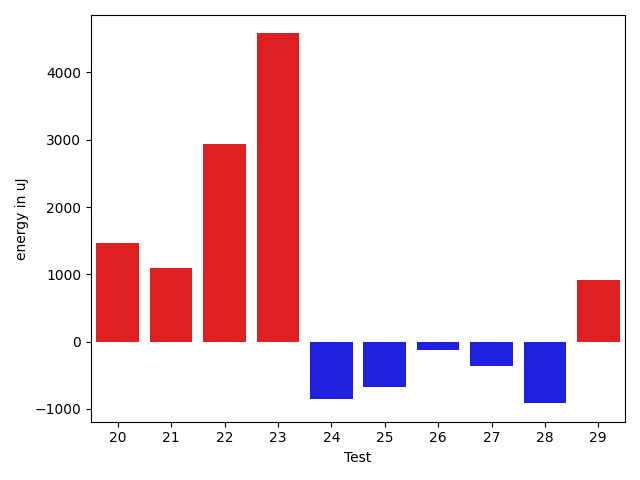

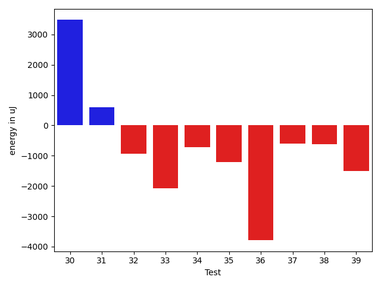

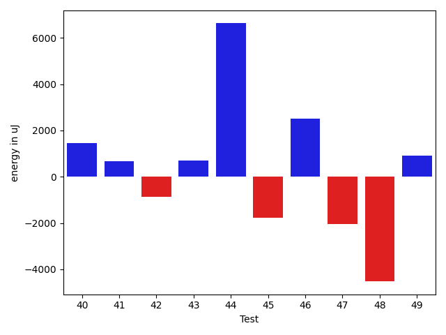

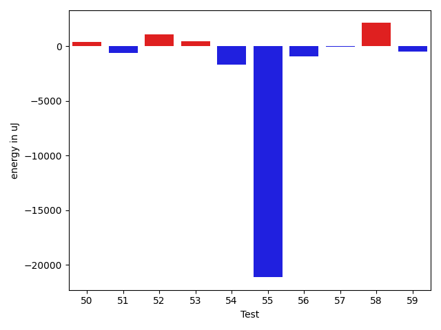

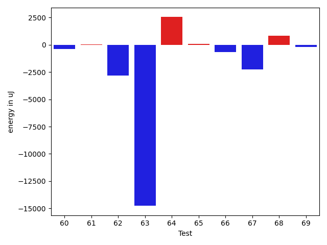

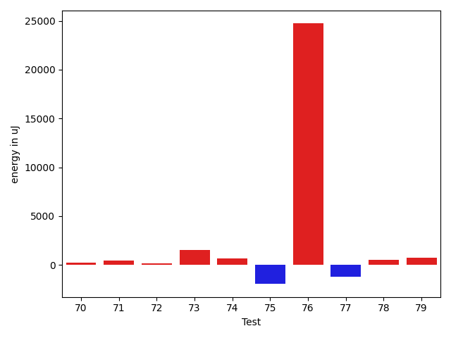

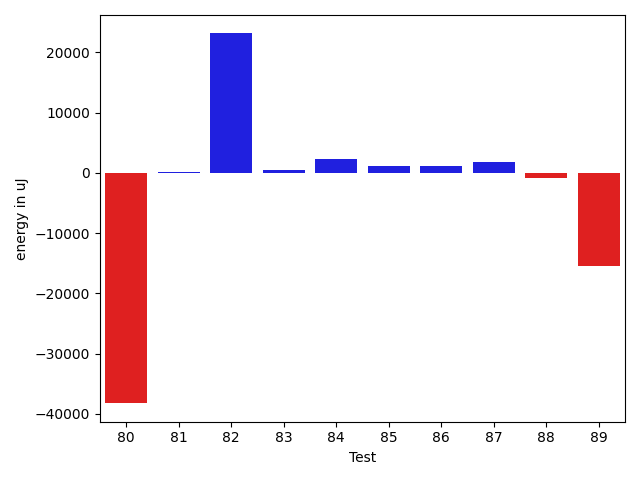

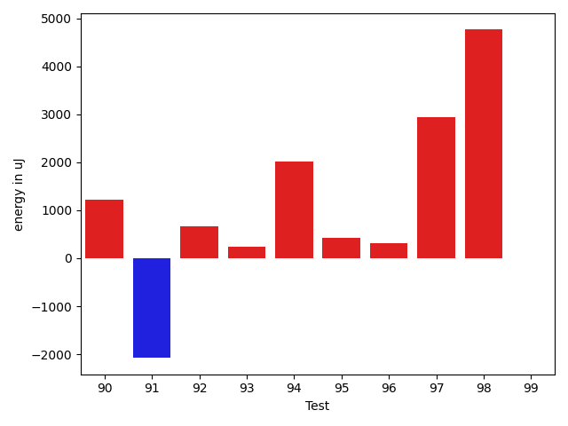

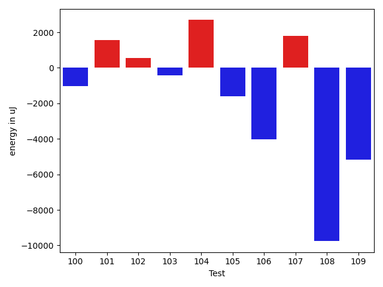

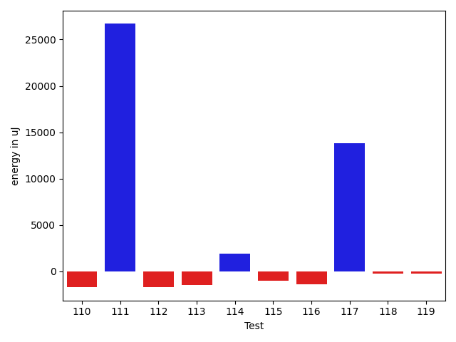

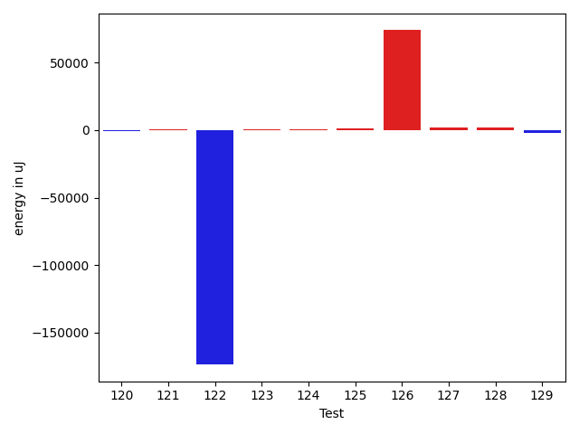

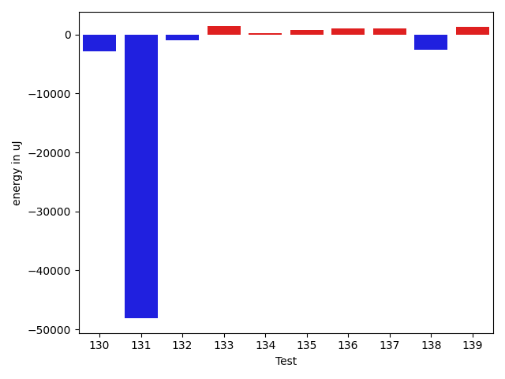

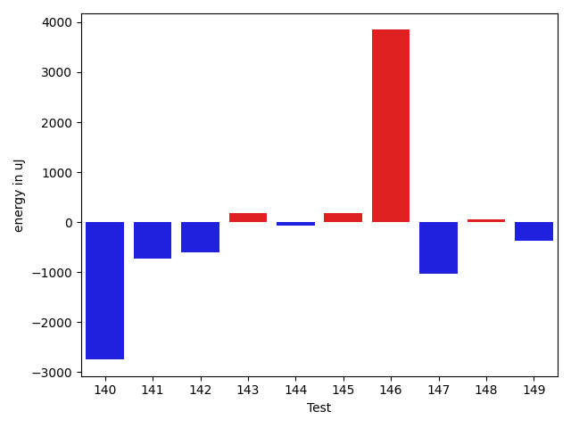

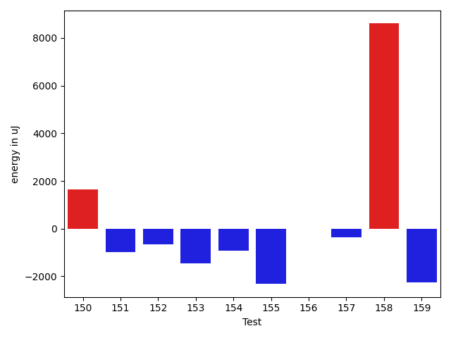

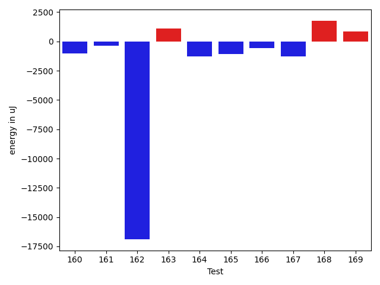

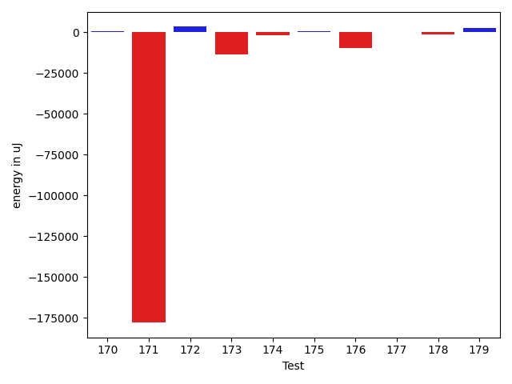

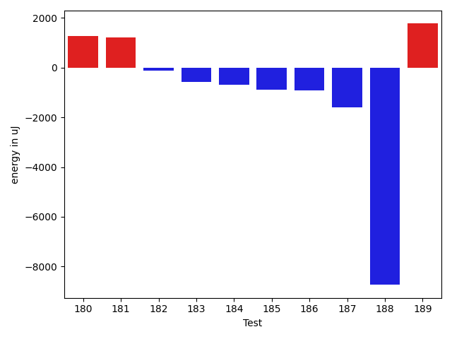

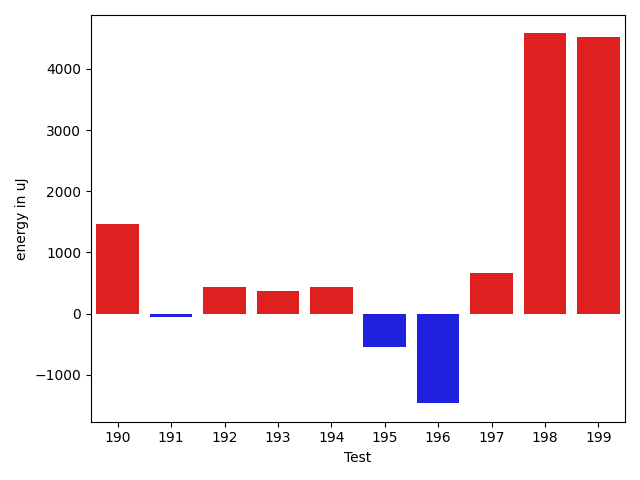

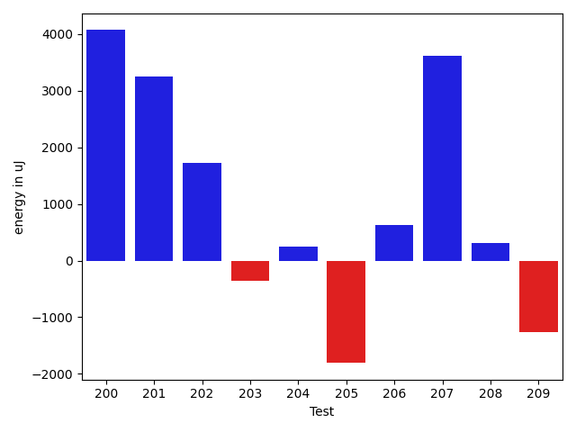

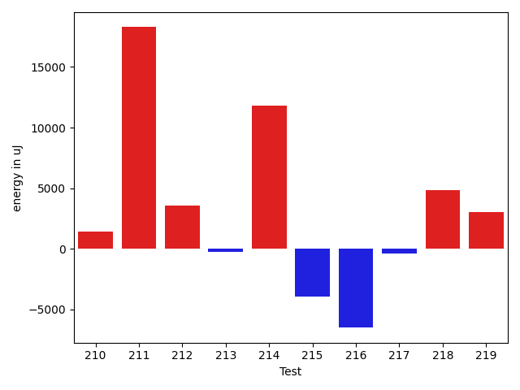

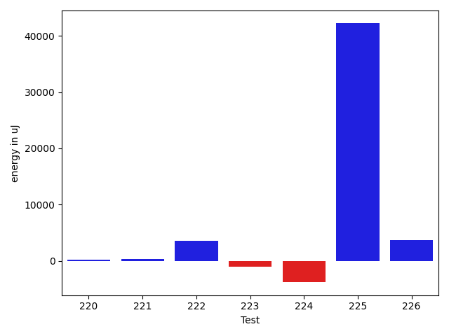

| ID | EnergyV1 | EnergyV2 | DeltaEnergy | σV1 | σV2 |
| --- | --- | --- | --- | --- | --- |
| 0 | 39984.469696969696 | 39645.15625 | -339.3134469696961 | 8501.815161302939 | 6319.516348727641 |
| 1 | 39680.545454545456 | 39532.85365853659 | -147.69179600886855 | 4485.415597723082 | 5235.111066732319 |
| 2 | 39129.52 | 42032.75925925926 | 2903.239259259266 | 5521.738531440981 | 17754.452869669152 |
| 3 | 128094.55172413793 | 74345.93103448275 | -53748.620689655174 | 367213.64575276943 | 238271.65664511806 |
| 4 | 43859.48314606742 | 45860.964705882354 | 2001.4815598149362 | 12093.937970858555 | 15990.63366470367 |
| 5 | 45051.52112676056 | 44730.44594594595 | -321.07518081461603 | 17741.540604189846 | 17935.697232615497 |
| 6 | 49705.43396226415 | 47164.25925925926 | -2541.1747030048864 | 28997.124848697014 | 24410.0429469824 |
| 7 | 39063.813953488374 | 39498.357142857145 | 434.543189368771 | 4566.447024821702 | 4495.8245168972835 |
| 8 | 128252.37373737374 | 116221.75757575757 | -12030.61616161617 | 83539.92424838543 | 74685.68616962759 |
| 9 | 38031.0 | 38603.83783783784 | 572.8378378378402 | 4862.814959808087 | 4041.7520853770066 |
| 10 | 39294.28 | 39662.425531914894 | 368.1455319148954 | 4373.410504583352 | 4556.914039523177 |
| 11 | 48122.89655172414 | 45148.567164179105 | -2974.3293875450327 | 27422.675975895454 | 19229.99013685133 |
| 12 | 39510.6724137931 | 40551.53333333333 | 1040.8609195402314 | 5490.946989451195 | 4253.8129345590905 |
| 13 | 39423.57142857143 | 39730.40740740741 | 306.8359788359812 | 4059.7059861371176 | 4720.380754096943 |
| 14 | 40651.87755102041 | 39939.444444444445 | -712.4331065759616 | 4390.664003675242 | 4321.807837890797 |
| 15 | 39284.36363636364 | 38207.933333333334 | -1076.4303030303054 | 5005.088951579496 | 3463.0515342525428 |
| 16 | 38068.333333333336 | 38789.36842105263 | 721.0350877192977 | 4402.1156097119765 | 5125.830522800813 |
| 17 | 82985.40404040404 | 86045.16161616161 | 3059.7575757575687 | 20086.92830740056 | 19681.176120573477 |
| 18 | 112842.63636363637 | 127332.57575757576 | 14489.939393939392 | 51814.67177762804 | 72268.83497894481 |
| 19 | 72125.48484848485 | 73791.90909090909 | 1666.4242424242402 | 15879.94572120309 | 18888.64883975917 |
| 20 | 77804.82828282828 | 81415.72727272728 | 3610.8989898989967 | 31561.846718204597 | 23803.752300258973 |
| 21 | 40106.0 | 41247.10256410256 | 1141.1025641025626 | 3379.8910485398787 | 4114.123645941623 |
| 22 | 87555.59595959596 | 91425.51515151515 | 3869.9191919191944 | 20602.635725233078 | 22043.175750305614 |
| 23 | 95642.43434343435 | 106805.80808080808 | 11163.373737373739 | 23482.861228521797 | 37516.55179839899 |
| 24 | 38881.95652173913 | 37847.42857142857 | -1034.5279503105558 | 3604.595635263658 | 4026.7451652482728 |
| 25 | 38484.0 | 38083.30434782609 | -400.6956521739121 | 3728.245559560281 | 4258.660908485126 |
| 26 | 38440.16129032258 | 38399.05263157895 | -41.108658743636624 | 3925.478011547985 | 4001.4318420664877 |
| 27 | 41205.545454545456 | 40102.767441860466 | -1102.7780126849902 | 6856.802135154636 | 6797.128586078399 |
| 28 | 39928.34375 | 38093.46875 | -1834.875 | 4635.651771928726 | 4944.9253721894975 |
| 29 | 39635.69565217391 | 39843.083333333336 | 207.38768115942366 | 4202.8513658021 | 4518.483151795031 |
| 30 | 39994.04081632653 | 43474.06 | 3480.0191836734666 | 4359.257112142228 | 34616.722007960256 |
| 31 | 38831.54054054054 | 39424.0 | 592.45945945946 | 4674.0485639417775 | 4890.027224506041 |
| 32 | 39889.045454545456 | 38944.825 | -944.2204545454588 | 5209.0787004061285 | 4745.400741178241 |
| 33 | 44871.10638297872 | 42792.13513513513 | -2078.9712478435904 | 11561.218796152609 | 9828.344517501992 |
| 34 | 40289.55319148936 | 39575.40540540541 | -714.1477860839514 | 4175.389031733402 | 5695.830710642224 |
| 35 | 54325.56565656565 | 53115.28282828283 | -1210.2828282828268 | 33268.20568407032 | 29758.886267120317 |
| 36 | 40389.066666666666 | 36598.63636363636 | -3790.4303030303054 | 3824.6258286123743 | 3050.4330623320675 |
| 37 | 41310.875 | 40716.627118644064 | -594.2478813559355 | 7941.336002350747 | 5001.980580266808 |
| 38 | 40197.357142857145 | 39581.765957446805 | -615.5911854103397 | 4825.408627263398 | 4937.480230879965 |
| 39 | 40022.0 | 38510.96666666667 | -1511.0333333333328 | 4914.031844170044 | 4484.623376853649 |
| 40 | 39524.967741935485 | 40988.206896551725 | 1463.2391546162398 | 4488.357961716936 | 5637.425362327603 |
| 41 | 39819.62962962963 | 40476.925 | 657.2953703703752 | 4442.809322674179 | 6511.345235001368 |
| 42 | 39590.0 | 38725.413043478264 | -864.5869565217363 | 4713.658770000221 | 5132.917034778258 |
| 43 | 38328.16129032258 | 39024.48275862069 | 696.3214682981052 | 4784.794181684539 | 4170.799333136149 |
| 44 | 238392.56666666668 | 245024.06896551725 | 6631.502298850566 | 506364.0732420158 | 511378.42299422866 |
| 45 | 40915.934782608696 | 39132.34146341463 | -1783.593319194064 | 7881.933045847632 | 4854.149894726769 |
| 46 | 39475.58974358974 | 41974.89743589744 | 2499.307692307695 | 5066.861121696692 | 10288.773958991624 |
| 47 | 48012.20731707317 | 45972.42857142857 | -2039.778745644595 | 23954.759926068065 | 17570.664934626064 |
| 48 | 65826.22222222222 | 61300.28571428572 | -4525.936507936502 | 53223.0057922486 | 46507.90259861704 |
| 49 | 39444.20338983051 | 40357.515625 | 913.312235169491 | 4329.294567265895 | 5858.695689934395 |
| 50 | 44725.642857142855 | 43772.794117647056 | -952.8487394957992 | 10620.85193386201 | 10264.476101296308 |
| 51 | 39754.166666666664 | 38920.32692307692 | -833.8397435897423 | 3649.607342980407 | 4723.31413848514 |
| 52 | 39727.666666666664 | 39326.916666666664 | -400.75 | 4576.443534254762 | 4029.6687820533784 |
| 53 | 48111.565217391304 | 48933.055555555555 | 821.4903381642507 | 13902.410703765785 | 14987.838553204181 |
| 54 | 39988.11111111111 | 39774.28571428572 | -213.8253968253921 | 5134.104919164358 | 4864.749356269008 |
| 55 | 77916.74193548386 | 74080.44210526315 | -3836.2998302207125 | 51967.74358472996 | 48292.19142518435 |
| 56 | 103785.3111111111 | 64366.90909090909 | -39418.40202020202 | 133725.22047788432 | 66364.99336411485 |
| 57 | 40383.85 | 40649.25 | 265.40000000000146 | 4928.500606421795 | 4821.312690803201 |
| 58 | 38327.93939393939 | 40120.97142857143 | 1793.0320346320368 | 4586.100852208762 | 4901.727762363647 |
| 59 | 49025.166666666664 | 47194.52112676056 | -1830.6455399061015 | 20106.8846714296 | 16660.22657291374 |
| 60 | 40613.181818181816 | 40217.48148148148 | -395.70033670033445 | 4529.766355969082 | 4209.555218612289 |
| 61 | 39292.23529411765 | 39315.333333333336 | 23.098039215685276 | 3981.950978062827 | 4679.443539703181 |
| 62 | 45034.38461538462 | 42219.16 | -2815.2246153846136 | 13590.898658265778 | 9575.476565393496 |
| 63 | 53992.61538461538 | 39226.82608695652 | -14765.789297658863 | 50146.15691776691 | 5636.460010326971 |
| 64 | 43981.48101265823 | 46522.53333333333 | 2541.0523206751022 | 16682.801667889773 | 23760.090918082693 |
| 65 | 51836.51612903226 | 51923.31428571429 | 86.79815668203082 | 21615.56090527701 | 21531.555491910574 |
| 66 | 38593.72 | 37933.28125 | -660.4387500000012 | 5822.818798623222 | 4776.4085307004925 |
| 67 | 39777.833333333336 | 37498.92307692308 | -2278.9102564102577 | 4964.821360219206 | 3452.599254108049 |
| 68 | 41400.98245614035 | 42225.11666666667 | 824.1342105263175 | 7864.009678768356 | 23634.448827993765 |
| 69 | 41043.94117647059 | 40861.608695652176 | -182.33248081841157 | 4367.903016465187 | 3914.3166957601934 |
| 70 | 40929.438356164384 | 40316.633802816905 | -612.8045533474797 | 7554.846723350735 | 5984.878530164936 |
| 71 | 40033.40909090909 | 39535.84444444445 | -497.56464646464156 | 3855.0728051029887 | 4384.755500369968 |
| 72 | 41337.84905660377 | 40782.45901639344 | -555.3900402103318 | 7807.367626814749 | 5885.24133960278 |
| 73 | 37809.294117647056 | 39043.3125 | 1234.0183823529442 | 4222.264499262227 | 3907.0830986611672 |
| 74 | 40772.94594594595 | 52536.705882352944 | 11763.759936406997 | 4772.117910155774 | 52497.53703496027 |
| 75 | 40783.32608695652 | 39170.0 | -1613.3260869565202 | 3500.5461068012246 | 3958.271438722804 |
| 76 | 141574.60606060605 | 174216.08080808082 | 32641.47474747477 | 99608.4434192221 | 125858.93032622736 |
| 77 | 40630.72727272727 | 40069.5 | -561.2272727272721 | 3912.6604703095395 | 4512.753836758268 |
| 78 | 41288.84782608696 | 41897.08196721312 | 608.2341411261586 | 5738.483267900459 | 6911.22476226847 |
| 79 | 39901.7 | 40844.305555555555 | 942.6055555555577 | 4035.340315264625 | 4163.144997204266 |
| 80 | 112295.2125 | 74044.18181818182 | -38251.03068181817 | 409694.2556471135 | 265251.1229057214 |
| 81 | 39998.25 | 40206.833333333336 | 208.58333333333576 | 4412.698118781751 | 4525.8336862456135 |
| 82 | 59194.882352941175 | 82340.19354838709 | 23145.311195445916 | 36799.58220492112 | 53443.19909382197 |
| 83 | 40661.666666666664 | 41217.46153846154 | 555.7948717948748 | 4475.05151801506 | 3958.599317462304 |
| 84 | 39245.666666666664 | 41484.454545454544 | 2238.78787878788 | 4985.80810345168 | 5545.042943741183 |
| 85 | 40015.8125 | 41189.857142857145 | 1174.044642857145 | 5156.988767909404 | 5897.68998188689 |
| 86 | 40698.26666666667 | 41908.1875 | 1209.92083333333 | 2979.1790696245316 | 4953.764190223809 |
| 87 | 38096.25 | 39880.15 | 1783.9000000000015 | 5388.219172803448 | 3561.1426013991636 |
| 88 | 40390.82352941176 | 39563.92857142857 | -826.8949579831897 | 3188.6896116502726 | 4485.484341808837 |
| 89 | 81882.375 | 66336.21428571429 | -15546.16071428571 | 84269.15662986888 | 70949.49062202992 |
| 90 | 38628.607142857145 | 41030.524590163935 | 2401.9174473067906 | 4046.2189081667493 | 7128.954547331599 |
| 91 | 40734.03703703704 | 43771.84210526316 | 3037.8050682261237 | 4642.411773281463 | 26647.879359219012 |
| 92 | 72791.51578947369 | 74584.65957446808 | 1793.1437849943904 | 68601.56471191773 | 77792.50159628184 |
| 93 | 46812.30864197531 | 52048.14666666667 | 5235.838024691358 | 29939.431476760772 | 41755.719085076504 |
| 94 | 39305.4 | 40706.16071428572 | 1400.760714285716 | 4310.647374287828 | 3972.8081503101707 |
| 95 | 49188.53125 | 47775.75 | -1412.78125 | 17522.658148899387 | 15700.459869857315 |
| 96 | 54109.46808510638 | 59137.40909090909 | 5027.941005802706 | 27625.33041439144 | 33400.86039468701 |
| 97 | 43950.3125 | 44504.06896551724 | 553.7564655172391 | 23706.916454869814 | 10318.053757374564 |
| 98 | 81280.14141414141 | 85744.92929292929 | 4464.787878787873 | 41273.180992168825 | 44609.8574510509 |
| 99 | 45531.17647058824 | 45400.29268292683 | -130.88378766140522 | 13617.692744174417 | 14337.496057785667 |
| 100 | 40818.41025641026 | 39785.21052631579 | -1033.1997300944713 | 4628.7155260863965 | 4518.286460000742 |
| 101 | 43239.833333333336 | 44795.59210526316 | 1555.7587719298244 | 10373.021947982823 | 13198.56594699993 |
| 102 | 39399.83018867925 | 39938.83606557377 | 539.0058768945237 | 4716.082183321593 | 3825.3601445381037 |
| 103 | 40696.833333333336 | 40278.86046511628 | -417.9728682170535 | 6413.590797413463 | 4861.498369755426 |
| 104 | 38904.77419354839 | 41599.5 | 2694.7258064516136 | 3954.8145399987648 | 2702.70033793365 |
| 105 | 42430.75 | 40844.333333333336 | -1586.4166666666642 | 7865.54079911229 | 5600.418183790683 |
| 106 | 44899.5 | 40878.82 | -4020.6800000000003 | 29547.734685719857 | 4410.618408749503 |
| 107 | 38561.15789473684 | 40355.625 | 1794.4671052631602 | 4083.8375046692217 | 4018.4603064326766 |
| 108 | 123651.51470588235 | 113892.96202531646 | -9758.552680565888 | 422517.2026592002 | 423526.50060864986 |
| 109 | 91942.79797979798 | 86757.79797979798 | -5185.0 | 22437.948849332202 | 24103.647906983588 |
| 110 | 39868.379310344826 | 38162.142857142855 | -1706.236453201971 | 3582.849361301537 | 4234.00046152138 |
| 111 | 88436.61616161616 | 115128.68686868687 | 26692.070707070714 | 51493.27037500409 | 264589.6879511249 |
| 112 | 40250.46666666667 | 38512.15 | -1738.3166666666657 | 3971.420956730167 | 3928.0883808157873 |
| 113 | 39764.42307692308 | 38237.2 | -1527.223076923081 | 3150.862277256289 | 4483.0793167197035 |
| 114 | 40736.913043478264 | 42657.92207792208 | 1921.009034443814 | 9661.02974188559 | 11979.835453812448 |
| 115 | 40144.11111111111 | 39100.96666666667 | -1043.1444444444423 | 4439.172469039307 | 2681.6616550605745 |
| 116 | 40993.75 | 39543.71428571428 | -1450.0357142857174 | 3950.521661981581 | 4141.305698665086 |
| 117 | 41777.36 | 55578.28125 | 13800.92125 | 9036.783909688225 | 39197.11403457719 |
| 118 | 39301.72 | 39079.206896551725 | -222.51310344827652 | 3101.0354337865924 | 3527.6916979541315 |
| 119 | 39035.0 | 38754.88461538462 | -280.11538461538294 | 3967.1442086737648 | 3621.5670676031846 |
| 120 | 38915.96666666667 | 38339.903225806454 | -576.0634408602127 | 3220.403075013368 | 3795.234901607105 |
| 121 | 39405.62295081967 | 40022.62222222222 | 616.9992714025502 | 4305.423880671931 | 4110.212918458327 |
| 122 | 296251.868852459 | 122368.39682539682 | -173883.4720270622 | 722276.2866055283 | 388971.6524272092 |
| 123 | 39538.0 | 40041.32 | 503.3199999999997 | 4877.665693822164 | 4884.692290984151 |
| 124 | 39896.1914893617 | 40607.94117647059 | 711.7496871088879 | 5758.007315029009 | 9738.657094103877 |
| 125 | 40754.228070175435 | 41971.80701754386 | 1217.5789473684272 | 4004.734417536517 | 17699.660104218467 |
| 126 | 105721.29292929293 | 179796.74747474748 | 74075.45454545454 | 46447.8055636848 | 418055.5185689412 |
| 127 | 39977.890625 | 41725.15714285714 | 1747.2665178571406 | 4480.324824709935 | 7458.707127791202 |
| 128 | 101565.31313131313 | 103210.18181818182 | 1644.8686868686927 | 52296.33410808422 | 49706.122398820626 |
| 129 | 57189.12903225807 | 55052.36842105263 | -2136.7606112054345 | 23953.902917324303 | 24841.692912501007 |
| 130 | 45631.0 | 42746.68831168831 | -2884.311688311689 | 25708.446807236454 | 11523.786737005907 |
| 131 | 259726.67676767678 | 211585.57575757575 | -48141.10101010103 | 360166.7275410555 | 191249.76886340242 |
| 132 | 40446.30612244898 | 39426.91891891892 | -1019.3872035300592 | 4048.67345976927 | 4034.844907286808 |
| 133 | 41449.51111111111 | 42816.1 | 1366.5888888888876 | 8039.5400189652155 | 10295.53567118616 |
| 134 | 40671.57692307692 | 40927.836363636365 | 256.25944055944274 | 6718.716135789158 | 4618.913377776743 |
| 135 | 40284.885714285716 | 41084.92424242424 | 800.0385281385243 | 7291.329674038214 | 7762.0008653474615 |
| 136 | 39154.967741935485 | 40199.48148148148 | 1044.513739545997 | 4874.007740101807 | 4218.411649216996 |
| 137 | 48138.325 | 49109.32142857143 | 970.9964285714304 | 19048.5071664258 | 26614.015692667293 |
| 138 | 49226.21951219512 | 46603.320512820515 | -2622.8989993746072 | 24939.214064339245 | 17991.095493714052 |
| 139 | 39047.125 | 40302.19607843137 | 1255.0710784313706 | 4423.7586235434455 | 3829.0810601859575 |
| 140 | 112190.35353535354 | 116312.33333333333 | 4121.979797979788 | 70806.0352354508 | 89358.14957368089 |
| 141 | 49464.45714285714 | 47139.444444444445 | -2325.0126984126982 | 19752.260220531516 | 23092.751151539167 |
| 142 | 44797.3625 | 43238.8 | -1558.5625 | 12549.066275268997 | 12332.230584326586 |
| 143 | 44269.818181818184 | 46826.17721518988 | 2556.359033371693 | 12280.922625565392 | 15754.538154119511 |
| 144 | 44552.12962962963 | 47321.51666666667 | 2769.3870370370423 | 13439.717433987154 | 17431.85418851713 |
| 145 | 40173.26666666667 | 39880.25 | -293.01666666667006 | 4141.744535284081 | 4158.892038452069 |
| 146 | 45862.0 | 50425.75 | 4563.75 | 14508.535193445941 | 17479.367996144563 |
| 147 | 41454.0 | 39965.666666666664 | -1488.3333333333358 | 3801.936582556024 | 5581.29507870311 |
| 148 | 39483.0 | 39238.35294117647 | -244.64705882353155 | 4630.553038724905 | 4322.49716689155 |
| 149 | 40018.619047619046 | 38685.916666666664 | -1332.7023809523816 | 3519.216815959543 | 5384.047439091607 |
| 150 | 39262.181818181816 | 40268.76470588235 | 1006.5828877005333 | 3985.306006687836 | 4675.644548576877 |
| 151 | 40035.73684210526 | 39650.18518518518 | -385.5516569200772 | 4436.025578234183 | 4320.843496501812 |
| 152 | 40984.15789473684 | 39250.583333333336 | -1733.574561403504 | 8682.734540837246 | 3455.8786258184596 |
| 153 | 45684.988764044945 | 43399.12903225807 | -2285.859731786877 | 13437.737053247965 | 11570.753663825972 |
| 154 | 58505.73170731707 | 50565.28048780488 | -7940.451219512193 | 53090.89177270149 | 38860.83107055866 |
| 155 | 89660.36363636363 | 83418.78787878787 | -6241.57575757576 | 35475.481970787776 | 37050.9377417207 |
| 156 | 41484.15492957747 | 39529.28571428572 | -1954.8692152917502 | 10185.811429088728 | 4064.177461411826 |
| 157 | 41837.51111111111 | 43243.21428571428 | 1405.7031746031716 | 5591.689951753691 | 8471.518378930534 |
| 158 | 64035.606060606064 | 66221.75757575757 | 2186.151515151505 | 25257.000769990816 | 21795.264476899523 |
| 159 | 41841.32352941176 | 39508.333333333336 | -2332.9901960784264 | 6210.093196802748 | 4569.762332745301 |
| 160 | 310346.6538461539 | 273537.18644067796 | -36809.46740547591 | 742585.397445042 | 692816.7109296211 |
| 161 | 66398.46590909091 | 55086.47191011236 | -11311.993998978549 | 74280.10415633587 | 25896.651342279623 |
| 162 | 377688.8888888889 | 363511.56565656565 | -14177.323232323222 | 171455.05476562836 | 149168.61109741064 |
| 163 | 39273.09523809524 | 40313.76315789474 | 1040.6679197995036 | 4871.463595507851 | 4419.262527391995 |
| 164 | 46608.76388888889 | 43375.3 | -3233.4638888888876 | 15233.412597799848 | 13056.494398765695 |
| 165 | 56737.83050847457 | 51314.163265306124 | -5423.667243168449 | 52448.636983841614 | 35859.419833422726 |
| 166 | 65956.75 | 46093.68571428571 | -19863.06428571429 | 86071.54430645828 | 24811.122583886714 |
| 167 | 56518.377358490565 | 53507.395833333336 | -3010.981525157229 | 35395.24164546161 | 37032.054356518616 |
| 168 | 59057.415384615386 | 173611.83582089553 | 114554.42043628014 | 49826.02601603435 | 500812.2476881586 |
| 169 | 40213.546875 | 40514.49253731343 | 300.94566231343197 | 6178.3158049182575 | 8087.16755089277 |
| 170 | 40214.056603773584 | 40546.229166666664 | 332.1725628930799 | 3311.9679631978393 | 3984.1196813076085 |
| 171 | 222157.0487804878 | 44258.26315789474 | -177898.78562259304 | 551891.2301827966 | 11967.693902828587 |
| 172 | 51903.3870967742 | 55174.1282051282 | 3270.7411083540064 | 26045.352228158983 | 34625.32744651572 |
| 173 | 61136.666666666664 | 47430.41379310345 | -13706.252873563215 | 45753.14996229464 | 28975.368399689774 |
| 174 | 40879.63636363636 | 39192.63333333333 | -1687.003030303029 | 5049.174329850688 | 4115.164220970477 |
| 175 | 39451.625 | 39934.23809523809 | 482.6130952380918 | 5351.74648138733 | 4653.655060218917 |
| 176 | 86705.54411764706 | 76924.21052631579 | -9781.333591331277 | 276953.1559046973 | 250753.6862298347 |
| 177 | 40915.21428571428 | 40832.42857142857 | -82.78571428571013 | 4681.3112048804 | 3893.0008754592554 |
| 178 | 41210.23809523809 | 39665.0625 | -1545.1755952380918 | 3461.371306904684 | 3537.0992965414116 |
| 179 | 49580.708333333336 | 52004.875 | 2424.1666666666642 | 20491.217163253066 | 24984.54385734058 |
| 180 | 39271.71428571428 | 40539.02777777778 | 1267.3134920634984 | 3523.3509975165234 | 3986.664050208946 |
| 181 | 40768.35 | 41988.666666666664 | 1220.3166666666657 | 4158.63148493588 | 3416.878334906813 |
| 182 | 40922.294117647056 | 40796.59090909091 | -125.70320855614409 | 4051.8077267648423 | 4345.185252448872 |
| 183 | 39255.77777777778 | 38679.0 | -576.777777777781 | 3545.8267106174826 | 4622.236811637536 |
| 184 | 41665.65217391304 | 40969.75 | -695.9021739130403 | 3186.03483439424 | 3906.507820824971 |
| 185 | 40159.0 | 39259.34285714286 | -899.6571428571406 | 3801.324164024952 | 4593.722673032699 |
| 186 | 40662.851851851854 | 39754.333333333336 | -908.5185185185182 | 3919.6778562237287 | 1954.8922959817735 |
| 187 | 40719.692307692305 | 39120.380952380954 | -1599.3113553113508 | 2817.5568900028206 | 3226.916580387545 |
| 188 | 48408.0 | 39668.73333333333 | -8739.26666666667 | 30221.928320538464 | 3668.7394286805866 |
| 189 | 38909.9 | 40680.472727272725 | 1770.5727272727236 | 4162.68283562416 | 4816.962403290142 |
| 190 | 41455.86274509804 | 40646.8 | -809.0627450980392 | 9338.03899726781 | 4760.921167169227 |
| 191 | 40667.666666666664 | 42262.50769230769 | 1594.841025641028 | 7063.228224796051 | 9922.6431468219 |
| 192 | 178536.3606557377 | 178617.65217391305 | 81.29151817536331 | 517198.6153096609 | 517400.81097494543 |
| 193 | 458017.69696969696 | 42622.71428571428 | -415394.9826839827 | 810967.5619267912 | 5393.526606191971 |
| 194 | 39697.13333333333 | 39762.07692307692 | 64.94358974359056 | 3795.1245893763344 | 3397.364554645227 |
| 195 | 41934.05 | 41965.168831168834 | 31.118831168831093 | 9427.964812063097 | 8688.598931190252 |
| 196 | 59149.93023255814 | 42515.454545454544 | -16634.475687103593 | 58164.238964310854 | 7009.51867145738 |
| 197 | 43623.290322580644 | 41168.096774193546 | -2455.1935483870984 | 12885.370562332153 | 8749.573360492202 |
| 198 | 39348.88461538462 | 42713.82352941176 | 3364.938914027145 | 4470.985533473861 | 3609.934710755439 |
| 199 | 39855.95652173913 | 42047.72727272727 | 2191.770750988144 | 4063.5991594329803 | 4613.0180239466 |
| 200 | 52888.25 | 56953.425287356324 | 4065.1752873563237 | 36574.108219803034 | 39680.32088436026 |
| 201 | 44995.71153846154 | 48243.403846153844 | 3247.692307692305 | 19055.949916108915 | 22849.45526304024 |
| 202 | 37645.791666666664 | 39370.84210526316 | 1725.050438596496 | 4993.442399614107 | 3262.26111871018 |
| 203 | 39226.653846153844 | 38867.02857142857 | -359.6252747252729 | 4230.928639129746 | 4805.546179665529 |
| 204 | 39105.1 | 39357.7027027027 | 252.6027027027012 | 4414.642766596938 | 4986.58157222753 |
| 205 | 45923.729166666664 | 44117.914893617024 | -1805.8142730496402 | 23669.806483981847 | 15404.048507398591 |
| 206 | 38753.470588235294 | 39385.23809523809 | 631.7675070027981 | 4789.677934864011 | 3828.9214682436786 |
| 207 | 128009.94 | 131615.88 | 3605.9400000000023 | 392396.8305375267 | 431121.9545964988 |
| 208 | 39141.375 | 39456.5 | 315.125 | 4525.789395347697 | 4850.7762007744695 |
| 209 | 40834.3870967742 | 39573.46875 | -1260.9183467741968 | 5161.5576273522975 | 4970.066435574422 |
| 210 | 38268.9 | 39707.13043478261 | 1438.2304347826066 | 4494.728489019109 | 4959.849202689689 |
| 211 | 91193.12121212122 | 109477.04040404041 | 18283.919191919194 | 68112.19485974277 | 95833.15631750916 |
| 212 | 48432.583333333336 | 51979.545454545456 | 3546.96212121212 | 29679.849162095183 | 26319.681686261247 |
| 213 | 39854.26315789474 | 39580.48936170213 | -273.77379619261046 | 5175.125682095534 | 6988.964839408091 |
| 214 | 47684.75675675676 | 59490.125 | 11805.36824324324 | 19949.9262498202 | 45983.46593392972 |
| 215 | 120383.08 | 116441.60869565218 | -3941.471304347826 | 394528.9352719184 | 358515.5909457701 |
| 216 | 77429.62337662338 | 70938.73684210527 | -6490.886534518111 | 90209.60369239339 | 84010.06348730653 |
| 217 | 40255.318181818184 | 39892.4 | -362.91818181818235 | 5285.927633274492 | 5714.764845555765 |
| 218 | 52431.84848484849 | 57250.78378378379 | 4818.935298935299 | 30506.906750639188 | 31535.084760392547 |
| 219 | 39670.045454545456 | 42709.175 | 3039.129545454547 | 4658.432139457854 | 19394.816339537098 |
| 220 | 44733.0625 | 44930.54761904762 | 197.48511904761835 | 18232.431836800974 | 13872.619732686844 |
| 221 | 39184.54838709677 | 39456.95121951219 | 272.40283241542056 | 3621.0720729275895 | 4895.586294648697 |
| 222 | 40110.48275862069 | 43699.03333333333 | 3588.5505747126444 | 4413.916554846842 | 24910.622946156036 |
| 223 | 40093.181818181816 | 38987.0 | -1106.1818181818162 | 4201.560236565413 | 4940.517355974053 |
| 224 | 58969.179487179485 | 55156.06 | -3813.119487179487 | 76379.0727409194 | 65397.08329533053 |
| 225 | 40734.9 | 82946.45714285714 | 42211.557142857135 | 5342.251340961037 | 103765.9401136844 |
| 226 | 39700.11111111111 | 43398.63636363636 | 3698.525252525251 | 3736.6757937576444 | 5788.907916677254 |

## Delta Duration per test method

| ID | DurationV1 | DurationsV2 | DeltaDuration |
| --- | --- | --- | --- |
| 0 | 886110.8787878788 | 891503.765625 | 5392.886837121216 |
| 1 | 775230.2363636363 | 773714.4390243902 | -1515.7973392461427 |
| 2 | 845650.94 | 917449.4074074074 | 71798.46740740747 |
| 3 | 3602925.8620689656 | 1954283.1896551724 | -1648642.6724137932 |
| 4 | 1247444.5393258426 | 1221237.8705882353 | -26206.66873760731 |
| 5 | 1159158.718309859 | 1108543.445945946 | -50615.27236391301 |
| 6 | 1186893.6603773586 | 991543.9444444445 | -195349.71593291406 |
| 7 | 686607.1860465116 | 685725.380952381 | -881.8050941306865 |
| 8 | 3531285.9393939395 | 3158786.5454545454 | -372499.39393939404 |
| 9 | 628445.6666666666 | 593931.2162162162 | -34514.450450450415 |
| 10 | 790966.74 | 768652.1914893617 | -22314.5485106383 |
| 11 | 1286174.1724137932 | 1030491.8805970149 | -255682.29181677825 |
| 12 | 875490.3448275862 | 840060.5666666667 | -35429.77816091955 |
| 13 | 744277.7551020408 | 748630.9814814815 | 4353.226379440632 |
| 14 | 781511.306122449 | 751744.574074074 | -29766.73204837495 |
| 15 | 537296.2727272727 | 459207.0 | -78089.2727272727 |
| 16 | 422504.5714285714 | 462684.2631578947 | 40179.6917293233 |
| 17 | 2327111.1616161615 | 2444048.9595959596 | 116937.79797979817 |
| 18 | 3093654.6767676766 | 3515417.1717171716 | 421762.49494949495 |
| 19 | 1998820.7575757576 | 2124041.4242424243 | 125220.66666666674 |
| 20 | 2156538.595959596 | 2290770.7474747472 | 134232.15151515137 |
| 21 | 539388.45 | 609586.8717948718 | 70198.4217948718 |
| 22 | 2401325.9191919193 | 2555328.242424242 | 154002.32323232293 |
| 23 | 2727186.6767676766 | 3016310.8181818184 | 289124.14141414175 |
| 24 | 424691.347826087 | 445072.5714285714 | 20381.223602484446 |
| 25 | 495284.5714285714 | 624279.5652173914 | 128994.99378881993 |
| 26 | 666735.0 | 716996.2631578947 | 50261.26315789472 |
| 27 | 771869.7954545454 | 880246.1860465116 | 108376.39059196622 |
| 28 | 555163.09375 | 677214.15625 | 122051.0625 |
| 29 | 552224.5217391305 | 594840.9166666666 | 42616.39492753614 |
| 30 | 752498.0612244898 | 833513.3 | 81015.23877551022 |
| 31 | 800961.1621621621 | 717899.7435897436 | -83061.41857241851 |
| 32 | 737946.8181818182 | 747582.4 | 9635.581818181789 |
| 33 | 917368.6382978724 | 1007149.2972972973 | 89780.6589994249 |
| 34 | 745168.2340425532 | 694988.4324324324 | -50179.801610120805 |
| 35 | 1600012.2727272727 | 1602098.7676767677 | 2086.494949494954 |
| 36 | 388084.6666666667 | 375655.2727272727 | -12429.39393939398 |
| 37 | 964050.8928571428 | 911684.0 | -52366.89285714284 |
| 38 | 697395.2142857143 | 724162.9574468085 | 26767.743161094142 |
| 39 | 532619.1379310344 | 499200.76666666666 | -33418.37126436777 |
| 40 | 630729.3225806452 | 603189.5172413794 | -27539.805339265848 |
| 41 | 685106.6296296297 | 695313.375 | 10206.745370370336 |
| 42 | 819918.2083333334 | 967873.2608695652 | 147955.05253623181 |
| 43 | 727739.7419354839 | 731672.724137931 | 3932.982202447136 |
| 44 | 6959653.733333333 | 7230447.448275862 | 270793.71494252887 |
| 45 | 765166.4130434783 | 755239.1463414634 | -9927.266702014836 |
| 46 | 733870.8461538461 | 875188.2051282051 | 141317.358974359 |
| 47 | 1320181.8536585367 | 1271666.9047619049 | -48514.94889663183 |
| 48 | 1560654.0277777778 | 1320510.7346938776 | -240143.29308390012 |
| 49 | 885768.406779661 | 875905.6875 | -9862.71927966096 |
| 50 | 826583.5357142857 | 757739.4705882353 | -68844.06512605038 |
| 51 | 714679.6428571428 | 682273.9807692308 | -32405.66208791209 |
| 52 | 550043.9 | 512873.25 | -37170.65000000002 |
| 53 | 902851.9130434783 | 1001005.7777777778 | 98153.86473429948 |
| 54 | 786754.1111111111 | 553950.1904761905 | -232803.9206349206 |
| 55 | 2199548.193548387 | 2029662.7263157894 | -169885.46723259753 |
| 56 | 2830739.177777778 | 1681618.0454545454 | -1149121.1323232325 |
| 57 | 500687.75 | 569243.1875 | 68555.4375 |
| 58 | 862111.0303030303 | 798616.9714285714 | -63494.05887445889 |
| 59 | 1293806.217948718 | 1289453.8309859154 | -4352.386962802615 |
| 60 | 469219.9090909091 | 503821.51851851854 | 34601.60942760942 |
| 61 | 524994.4705882353 | 462096.09523809527 | -62898.375350140035 |
| 62 | 1054240.4871794872 | 936200.18 | -118040.3071794872 |
| 63 | 901630.4615384615 | 439292.9130434783 | -462337.54849498323 |
| 64 | 1141074.582278481 | 1267370.7866666666 | 126296.20438818564 |
| 65 | 1401219.3387096773 | 1413583.4714285715 | 12364.132718894165 |
| 66 | 635242.04 | 592124.75 | -43117.29000000004 |
| 67 | 411788.44444444444 | 527910.3076923077 | 116121.86324786331 |
| 68 | 866618.4561403509 | 993988.6166666667 | 127370.1605263158 |
| 69 | 422903.8823529412 | 425130.7826086957 | 2226.9002557544736 |
| 70 | 1031706.5342465753 | 1009595.3802816902 | -22111.15396488516 |
| 71 | 643929.6818181818 | 676069.5111111111 | 32139.829292929382 |
| 72 | 873749.8113207547 | 900515.9836065574 | 26766.172285802662 |
| 73 | 515573.9411764706 | 440131.875 | -75442.0661764706 |
| 74 | 692468.3243243244 | 1177583.5882352942 | 485115.26391096984 |
| 75 | 641910.1086956522 | 669900.2608695652 | 27990.152173912968 |
| 76 | 3816795.6868686867 | 4653675.191919192 | 836879.505050505 |
| 77 | 554425.2121212122 | 709727.5882352941 | 155302.37611408194 |
| 78 | 740829.6304347826 | 896565.524590164 | 155735.89415538136 |
| 79 | 757477.825 | 762663.5277777778 | 5185.7027777777985 |
| 80 | 3082815.6375 | 2079412.051948052 | -1003403.5855519483 |
| 81 | 700477.2916666666 | 650811.9166666666 | -49665.375 |
| 82 | 1267900.4117647058 | 1891445.9032258065 | 623545.4914611008 |
| 83 | 405752.06666666665 | 345843.1538461539 | -59908.91282051278 |
| 84 | 493583.77777777775 | 494449.7272727273 | 865.949494949542 |
| 85 | 400009.3125 | 487883.4285714286 | 87874.11607142858 |
| 86 | 391408.0 | 434798.9375 | 43390.9375 |
| 87 | 425020.6666666667 | 367040.75 | -57979.916666666686 |
| 88 | 413581.64705882355 | 488815.28571428574 | 75233.63865546219 |
| 89 | 1914395.25 | 1417679.0714285714 | -496716.17857142864 |
| 90 | 878111.1607142857 | 859918.5737704918 | -18192.586943793925 |
| 91 | 849616.3518518518 | 974588.0701754387 | 124971.71832358686 |
| 92 | 2058336.6736842105 | 2068960.9680851065 | 10624.294400895946 |
| 93 | 1301374.5432098766 | 1436836.4266666668 | 135461.88345679012 |
| 94 | 796173.3272727273 | 817406.0714285715 | 21232.744155844208 |
| 95 | 1400444.84375 | 1399901.5520833333 | -543.2916666667443 |
| 96 | 1352185.5531914893 | 1514291.7045454546 | 162106.15135396528 |
| 97 | 920373.3541666666 | 855400.4827586206 | -64972.87140804599 |
| 98 | 2271873.404040404 | 2346624.9191919193 | 74751.51515151514 |
| 99 | 1162995.8088235294 | 1155774.8048780488 | -7221.0039454805665 |
| 100 | 547309.1025641026 | 579583.052631579 | 32273.95006747637 |
| 101 | 1163196.138888889 | 1173176.3026315789 | 9980.163742689881 |
| 102 | 825606.0943396227 | 790464.6393442623 | -35141.45499536034 |
| 103 | 715641.1111111111 | 762704.6046511628 | 47063.493540051626 |
| 104 | 824361.8064516129 | 663044.4666666667 | -161317.33978494618 |
| 105 | 808379.25 | 835496.7222222222 | 27117.472222222248 |
| 106 | 873406.0192307692 | 828818.12 | -44587.89923076925 |
| 107 | 450073.6842105263 | 441429.25 | -8644.434210526291 |
| 108 | 3640865.117647059 | 3182392.088607595 | -458473.02903946396 |
| 109 | 2444794.525252525 | 2449315.9595959596 | 4521.434343434405 |
| 110 | 570280.0 | 544354.8928571428 | -25925.10714285716 |
| 111 | 2283546.242424242 | 3246101.1818181816 | 962554.9393939395 |
| 112 | 838850.75 | 835293.9833333333 | -3556.766666666721 |
| 113 | 509455.96153846156 | 499996.32 | -9459.641538461554 |
| 114 | 1017538.4202898551 | 1048206.012987013 | 30667.592697157874 |
| 115 | 597700.8888888889 | 561383.2 | -36317.68888888892 |
| 116 | 515787.5 | 546689.5428571429 | 30902.042857142864 |
| 117 | 604555.0 | 1158472.71875 | 553917.71875 |
| 118 | 550998.44 | 559348.8275862068 | 8350.387586206896 |
| 119 | 520826.3103448276 | 536780.9615384615 | 15954.651193633908 |
| 120 | 510833.9 | 492161.29032258067 | -18672.609677419357 |
| 121 | 782333.7540983607 | 740867.5111111111 | -41466.24298724951 |
| 122 | 8644995.31147541 | 3376292.634920635 | -5268702.676554775 |
| 123 | 623496.7586206896 | 639827.92 | 16331.161379310419 |
| 124 | 850542.9361702128 | 765325.1764705882 | -85217.75969962461 |
| 125 | 733357.350877193 | 876440.6315789474 | 143083.28070175438 |
| 126 | 2822831.767676768 | 5178533.444444444 | 2355701.676767676 |
| 127 | 938586.15625 | 992421.2571428572 | 53835.10089285718 |
| 128 | 2651097.585858586 | 2776027.414141414 | 124929.82828282844 |
| 129 | 1560489.8924731184 | 1585757.7263157894 | 25267.83384267101 |
| 130 | 1231888.253164557 | 1185380.3636363635 | -46507.88952819351 |
| 131 | 7279915.818181818 | 5517771.686868687 | -1762144.1313131312 |
| 132 | 724050.306122449 | 812141.9189189189 | 88091.61279646994 |
| 133 | 830986.1111111111 | 1025578.8333333334 | 194592.72222222225 |
| 134 | 944867.7307692308 | 969000.0 | 24132.26923076925 |
| 135 | 1054046.6142857142 | 1057182.2121212122 | 3135.5978354979306 |
| 136 | 581813.3870967742 | 643481.0 | 61667.61290322582 |
| 137 | 972608.2 | 986980.1071428572 | 14371.907142857206 |
| 138 | 1345738.987804878 | 1205759.423076923 | -139979.56472795503 |
| 139 | 843240.25 | 832010.5490196078 | -11229.700980392168 |
| 140 | 3033994.292929293 | 3129287.6868686867 | 95293.39393939357 |
| 141 | 1189326.0428571429 | 1044135.3194444445 | -145190.72341269837 |
| 142 | 1226976.25 | 1243853.4125 | 16877.162500000093 |
| 143 | 1196433.8636363635 | 1223863.6835443038 | 27429.819907940226 |
| 144 | 1081524.0740740742 | 1116212.6333333333 | 34688.55925925914 |
| 145 | 476207.9 | 460250.0 | -15957.900000000023 |
| 146 | 917576.4054054054 | 1183204.4285714286 | 265628.0231660232 |
| 147 | 451903.4074074074 | 500666.8 | 48763.39259259257 |
| 148 | 448186.8888888889 | 436635.4705882353 | -11551.418300653575 |
| 149 | 490239.09523809527 | 537543.8333333334 | 47304.738095238106 |
| 150 | 382666.54545454547 | 424453.0 | 41786.45454545453 |
| 151 | 437772.15789473685 | 429271.8888888889 | -8500.269005847978 |
| 152 | 933479.4736842106 | 871773.8333333334 | -61705.64035087719 |
| 153 | 1278683.7865168538 | 1184758.440860215 | -93925.34565663873 |
| 154 | 1681636.6463414633 | 1394548.5731707318 | -287088.07317073154 |
| 155 | 2569820.5757575757 | 2415064.242424242 | -154756.3333333335 |
| 156 | 1121912.8732394367 | 1020709.8051948051 | -101203.06804463151 |
| 157 | 815251.6222222223 | 910380.1904761905 | 95128.56825396826 |
| 158 | 1863601.383838384 | 1869494.5959595959 | 5893.212121211924 |
| 159 | 724946.1470588235 | 799449.5555555555 | 74503.40849673201 |
| 160 | 8799585.076923076 | 7795288.915254237 | -1004296.1616688389 |
| 161 | 1929366.875 | 1530269.595505618 | -399097.279494382 |
| 162 | 9565158.535353536 | 9152484.191919193 | -412674.3434343431 |
| 163 | 807247.619047619 | 665516.0263157894 | -141731.59273182962 |
| 164 | 1210351.2777777778 | 1071799.0875 | -138552.19027777785 |
| 165 | 1376675.1694915255 | 1070066.5102040817 | -306608.65928744385 |
| 166 | 1516246.3333333333 | 836643.2285714286 | -679603.1047619047 |
| 167 | 1281364.8867924528 | 1181017.2916666667 | -100347.59512578603 |
| 168 | 1489374.0461538462 | 4969273.985074627 | 3479899.938920781 |
| 169 | 915626.484375 | 962754.3582089553 | 47127.873833955266 |
| 170 | 792730.6037735849 | 839617.1875 | 46886.58372641506 |
| 171 | 6352230.8292682925 | 847786.1842105263 | -5504444.645057766 |
| 172 | 1098163.0967741935 | 1065119.3333333333 | -33043.7634408602 |
| 173 | 1527682.6666666667 | 791870.448275862 | -735812.2183908047 |
| 174 | 529420.9545454546 | 552679.6333333333 | 23258.678787878715 |
| 175 | 579530.4583333334 | 525620.2857142857 | -53910.17261904769 |
| 176 | 2270541.4852941176 | 2240175.3289473685 | -30366.15634674905 |
| 177 | 417213.0714285714 | 366891.21428571426 | -50321.85714285716 |
| 178 | 407571.8095238095 | 419795.375 | 12223.565476190473 |
| 179 | 1123257.2916666667 | 1179294.65 | 56037.35833333316 |
| 180 | 725561.1666666666 | 660935.0555555555 | -64626.111111111124 |
| 181 | 431428.45 | 430353.22222222225 | -1075.2277777777635 |
| 182 | 417338.9411764706 | 426547.0 | 9208.058823529398 |
| 183 | 455432.05555555556 | 830698.4285714285 | 375266.37301587296 |
| 184 | 456052.17391304346 | 474271.25 | 18219.076086956542 |
| 185 | 498793.63333333336 | 544993.8571428572 | 46200.2238095238 |
| 186 | 417472.5925925926 | 391073.6666666667 | -26398.925925925898 |
| 187 | 429270.0 | 421516.28571428574 | -7753.714285714261 |
| 188 | 688252.8235294118 | 329732.86666666664 | -358519.95686274517 |
| 189 | 857353.975 | 859199.2363636363 | 1845.261363636353 |
| 190 | 829933.274509804 | 969876.68 | 139943.40549019608 |
| 191 | 928974.5166666667 | 966268.4615384615 | 37293.94487179478 |
| 192 | 4948960.409836066 | 4987798.565217392 | 38838.15538132563 |
| 193 | 13465460.636363637 | 536912.7142857143 | -12928547.922077922 |
| 194 | 511194.5333333333 | 390767.46153846156 | -120427.07179487176 |
| 195 | 1131248.9625 | 1048371.0519480519 | -82877.910551948 |
| 196 | 1351076.1627906978 | 841712.696969697 | -509363.46582100075 |
| 197 | 1121544.7419354839 | 935552.1612903225 | -185992.58064516133 |
| 198 | 474765.07692307694 | 403984.5294117647 | -70780.54751131224 |
| 199 | 494846.17391304346 | 434114.7272727273 | -60731.446640316164 |
| 200 | 1526864.9204545454 | 1670941.3563218392 | 144076.43586729374 |
| 201 | 988327.2307692308 | 1118117.0 | 129789.76923076925 |
| 202 | 447730.125 | 455527.2631578947 | 7797.1381578947185 |
| 203 | 583663.5769230769 | 637190.8571428572 | 53527.28021978028 |
| 204 | 599261.7666666667 | 598559.2432432432 | -702.523423423525 |
| 205 | 946172.5208333334 | 1032528.2553191489 | 86355.73448581551 |
| 206 | 500800.0 | 438146.04761904763 | -62653.95238095237 |
| 207 | 3552206.3 | 3739695.52 | 187489.2200000002 |
| 208 | 532663.3333333334 | 594552.375 | 61889.04166666663 |
| 209 | 617733.8387096775 | 661278.46875 | 43544.63004032255 |
| 210 | 480574.3 | 557680.4347826086 | 77106.13478260866 |
| 211 | 2518779.0606060605 | 3081350.727272727 | 562571.6666666665 |
| 212 | 1035218.8958333334 | 1185415.709090909 | 150196.81325757562 |
| 213 | 808061.2105263158 | 804857.4468085107 | -3203.763717805152 |
| 214 | 1083646.9189189188 | 1275357.875 | 191710.95608108118 |
| 215 | 2868820.68 | 2882123.1739130435 | 13302.49391304329 |
| 216 | 2230506.74025974 | 2073835.644736842 | -156671.09552289802 |
| 217 | 487724.2272727273 | 487478.9 | -245.3272727272706 |
| 218 | 1399810.6515151516 | 1431064.0945945946 | 31253.44307944295 |
| 219 | 784358.3863636364 | 891579.125 | 107220.73863636365 |
| 220 | 953914.96875 | 914914.119047619 | -39000.84970238095 |
| 221 | 582489.4516129033 | 649559.8292682926 | 67070.37765538937 |
| 222 | 660369.724137931 | 893111.1333333333 | 232741.4091954023 |
| 223 | 752683.2272727273 | 781081.8510638297 | 28398.623791102436 |
| 224 | 1325894.564102564 | 1159409.54 | -166485.02410256397 |
| 225 | 477402.4 | 2012220.4 | 1534818.0 |
| 226 | 526986.1666666666 | 619071.5 | 92085.33333333337 |

## Misc.

| ID | Test Class | Test Method |
| --- | --- | --- |
| 0 | com.google.gson.functional.CustomTypeAdaptersTest | testCustomAdapterInvokedForCollectionElementDeserialization |
| 1 | com.google.gson.functional.CustomTypeAdaptersTest | testCustomTypeAdapterAppliesToSubClassesSerializedAsBaseClass |
| 2 | com.google.gson.functional.CustomTypeAdaptersTest | testCustomAdapterInvokedForMapElementDeserialization |
| 3 | com.google.gson.functional.CustomTypeAdaptersTest | testCustomSerializers |
| 4 | com.google.gson.functional.CustomTypeAdaptersTest | testCustomTypeAdapterDoesNotAppliesToSubClasses |
| 5 | com.google.gson.functional.CustomTypeAdaptersTest | testCustomAdapterInvokedForCollectionElementSerializationWithType |
| 6 | com.google.gson.functional.CustomTypeAdaptersTest | testCustomDeserializers |
| 7 | com.google.gson.functional.CustomTypeAdaptersTest | testEnsureCustomSerializerNotInvokedForNullValues |
| 8 | com.google.gson.functional.CustomTypeAdaptersTest | testCustomDeserializerForLong |
| 9 | com.google.gson.functional.CustomTypeAdaptersTest | testEnsureCustomDeserializerNotInvokedForNullValues |
| 10 | com.google.gson.functional.CustomTypeAdaptersTest | testCustomAdapterInvokedForMapElementSerializationWithType |
| 11 | com.google.gson.functional.CustomTypeAdaptersTest | testCustomNestedSerializers |
| 12 | com.google.gson.functional.CustomTypeAdaptersTest | testCustomNestedDeserializers |
| 13 | com.google.gson.functional.CustomTypeAdaptersTest | testCustomByteArraySerializer |
| 14 | com.google.gson.functional.CustomTypeAdaptersTest | testCustomByteArrayDeserializerAndInstanceCreator |
| 15 | com.google.gson.functional.CustomTypeAdaptersTest | testCustomAdapterInvokedForMapElementSerialization |
| 16 | com.google.gson.functional.CustomTypeAdaptersTest | testCustomAdapterInvokedForCollectionElementSerialization |
| 17 | com.google.gson.functional.DefaultTypeAdaptersTest | testDateSerializationWithPatternNotOverridenByTypeAdapter |
| 18 | com.google.gson.functional.DefaultTypeAdaptersTest | testDateSerializationWithPattern |
| 19 | com.google.gson.functional.DefaultTypeAdaptersTest | testSqlDateSerialization |
| 20 | com.google.gson.functional.DefaultTypeAdaptersTest | testTimestampSerialization |
| 21 | com.google.gson.functional.DefaultTypeAdaptersTest | testDefaultCalendarDeserialization |
| 22 | com.google.gson.functional.DefaultTypeAdaptersTest | testDateDeserializationWithPattern |
| 23 | com.google.gson.functional.DefaultTypeAdaptersTest | testDateSerializationInCollection |
| 24 | com.google.gson.functional.DefaultTypeAdaptersTest | testPropertiesSerialization |
| 25 | com.google.gson.functional.DefaultTypeAdaptersTest | testDefaultGregorianCalendarDeserialization |
| 26 | com.google.gson.functional.DefaultTypeAdaptersTest | testTreeSetSerialization |
| 27 | com.google.gson.functional.DefaultTypeAdaptersTest | testBitSetDeserialization |
| 28 | com.google.gson.functional.DefaultTypeAdaptersTest | testSetSerialization |
| 29 | com.google.gson.functional.DefaultTypeAdaptersTest | testBitSetSerialization |
| 30 | com.google.gson.functional.CollectionTest | testCollectionOfObjectSerialization |
| 31 | com.google.gson.functional.CollectionTest | testRawCollectionSerialization |
| 32 | com.google.gson.functional.CollectionTest | testNullsInListSerialization |
| 33 | com.google.gson.functional.CollectionTest | testCollectionOfBagOfPrimitivesSerialization |
| 34 | com.google.gson.functional.CollectionTest | testQueueSerialization |
| 35 | com.google.gson.functional.CollectionTest | testWildcardCollectionField |
| 36 | com.google.gson.functional.CollectionTest | testCollectionOfStringsSerialization |
| 37 | com.google.gson.functional.CollectionTest | testLinkedListSerialization |
| 38 | com.google.gson.functional.CollectionTest | testCollectionOfObjectWithNullSerialization |
| 39 | com.google.gson.functional.NullObjectAndFieldTest | testCustomTypeAdapterPassesNullSerialization |
| 40 | com.google.gson.functional.NullObjectAndFieldTest | testExplicitSerializationOfNullStringMembers |
| 41 | com.google.gson.functional.NullObjectAndFieldTest | testExplicitSerializationOfNullCollectionMembers |
| 42 | com.google.gson.functional.NullObjectAndFieldTest | testPrintPrintingObjectWithNulls |
| 43 | com.google.gson.functional.NullObjectAndFieldTest | testPrintPrintingArraysWithNulls |
| 44 | com.google.gson.functional.NullObjectAndFieldTest | testTopLevelNullObjectSerialization |
| 45 | com.google.gson.functional.NullObjectAndFieldTest | testNullWrappedPrimitiveMemberSerialization |
| 46 | com.google.gson.functional.NullObjectAndFieldTest | testExplicitNullSetsFieldToNullDuringDeserialization |
| 47 | com.google.gson.functional.NullObjectAndFieldTest | testExplicitSerializationOfNullArrayMembers |
| 48 | com.google.gson.functional.NullObjectAndFieldTest | testExplicitSerializationOfNulls |
| 49 | com.google.gson.functional.NullObjectAndFieldTest | testNullWrappedPrimitiveMemberDeserialization |
| 50 | com.google.gson.functional.NullObjectAndFieldTest | testExplicitDeserializationOfNulls |
| 51 | com.google.gson.functional.NullObjectAndFieldTest | testCustomTypeAdapterPassesNullDesrialization |
| 52 | com.google.gson.functional.NullObjectAndFieldTest | testCustomSerializationOfNulls |
| 53 | com.google.gson.functional.NullObjectAndFieldTest | testTopLevelNullObjectDeserialization |
| 54 | com.google.gson.functional.InheritanceTest | testBaseSerializedAsSubWhenSpecifiedWithExplicitType |
| 55 | com.google.gson.functional.InheritanceTest | testSubInterfacesOfCollectionSerialization |
| 56 | com.google.gson.functional.InheritanceTest | testBaseSerializedAsBaseWhenSpecifiedWithExplicitTypeForToJsonMethod |
| 57 | com.google.gson.functional.InheritanceTest | testBaseSerializedAsSub |
| 58 | com.google.gson.functional.InheritanceTest | testClassWithBaseFieldSerialization |
| 59 | com.google.gson.functional.InheritanceTest | testSubClassSerialization |
| 60 | com.google.gson.functional.InheritanceTest | testBaseSerializedAsSubWhenSpecifiedWithExplicitTypeForToJsonMethod |
| 61 | com.google.gson.functional.InheritanceTest | testBaseSerializedAsSubForToJsonMethod |
| 62 | com.google.gson.functional.InheritanceTest | testClassWithBaseArrayFieldSerialization |
| 63 | com.google.gson.functional.InheritanceTest | testBaseSerializedAsBaseWhenSpecifiedWithExplicitType |
| 64 | com.google.gson.functional.MapTest | testSerializeMaps |
| 65 | com.google.gson.functional.MapTest | testMapSerializationWithNullValues |
| 66 | com.google.gson.functional.MapTest | testMapSerializationWithNullValuesSerialized |
| 67 | com.google.gson.functional.MapTest | testMapWithQuotes |
| 68 | com.google.gson.functional.MapTest | testParameterizedMapSubclassSerialization |
| 69 | com.google.gson.functional.MapTest | testRawMapSerialization |
| 70 | com.google.gson.functional.MapTest | testMapSubclassDeserialization |
| 71 | com.google.gson.functional.MapTest | testMapSerializationWithIntegerKeys |
| 72 | com.google.gson.functional.MapTest | testCustomSerializerForSpecificMapType |
| 73 | com.google.gson.functional.MapTest | testMapOfMapSerialization |
| 74 | com.google.gson.functional.MapTest | testMapSubclassSerialization |
| 75 | com.google.gson.functional.MapTest | testMapSerializationWithNullValueButSerializeNulls |
| 76 | com.google.gson.functional.ExposeFieldsTest | testNullExposeFieldSerialization |
| 77 | com.google.gson.functional.ExposeFieldsTest | testExposeAnnotationSerialization |
| 78 | com.google.gson.functional.ExposeFieldsTest | testArrayWithOneNullExposeFieldObjectSerialization |
| 79 | com.google.gson.functional.FieldExclusionTest | testDefaultNestedStaticClassIncluded |
| 80 | com.google.gson.functional.FieldExclusionTest | testDefaultInnerClassExclusion |
| 81 | com.google.gson.functional.StringTest | testStringValueAsSingleElementArraySerialization |
| 82 | com.google.gson.functional.StringTest | testSingleQuoteInStringSerialization |
| 83 | com.google.gson.functional.StringTest | testJavascriptKeywordsInStringSerialization |
| 84 | com.google.gson.functional.StringTest | testAssignmentCharSerialization |
| 85 | com.google.gson.functional.StringTest | testEscapedCtrlRInStringSerialization |
| 86 | com.google.gson.functional.StringTest | testEscapedCtrlNInStringSerialization |
| 87 | com.google.gson.functional.StringTest | testEscapedBackslashInStringSerialization |
| 88 | com.google.gson.functional.StringTest | testEscapingQuotesInStringSerialization |
| 89 | com.google.gson.functional.StringTest | testStringValueSerialization |
| 90 | com.google.gson.functional.CustomDeserializerTest | testCustomDeserializerReturnsNullForArrayElementsForArrayField |
| 91 | com.google.gson.functional.CustomDeserializerTest | testCustomDeserializerReturnsNull |
| 92 | com.google.gson.functional.CustomDeserializerTest | testCustomDeserializerReturnsNullForTopLevelPrimitives |
| 93 | com.google.gson.functional.CustomDeserializerTest | testJsonTypeFieldBasedDeserialization |
| 94 | com.google.gson.functional.CustomDeserializerTest | testCustomDeserializerReturnsNullForArrayElements |
| 95 | com.google.gson.functional.CustomDeserializerTest | testCustomDeserializerReturnsNullForPrimitiveFields |
| 96 | com.google.gson.functional.CustomDeserializerTest | testCustomDeserializerReturnsNullForTopLevelObject |
| 97 | com.google.gson.functional.ObjectTest | testNestedSerialization |
| 98 | com.google.gson.functional.ObjectTest | testSingletonLists |
| 99 | com.google.gson.functional.ObjectTest | testArrayOfObjectsAsFields |
| 100 | com.google.gson.functional.ObjectTest | testStringFieldWithEmptyValueSerialization |
| 101 | com.google.gson.functional.ObjectTest | testArrayOfArraysSerialization |
| 102 | com.google.gson.functional.ObjectTest | testInnerClassDeserialization |
| 103 | com.google.gson.functional.ObjectTest | testNullFieldsSerialization |
| 104 | com.google.gson.functional.ObjectTest | testClassWithObjectFieldSerialization |
| 105 | com.google.gson.functional.ObjectTest | testBagOfPrimitivesSerialization |
| 106 | com.google.gson.functional.ObjectTest | testArrayOfObjectsSerialization |
| 107 | com.google.gson.functional.ObjectTest | testJsonObjectSerialization |
| 108 | com.google.gson.JsonParserTest | testReadWriteTwoObjects |
| 109 | com.google.gson.functional.NamingPolicyTest | testGsonWithNonDefaultFieldNamingPolicySerialization |
| 110 | com.google.gson.functional.NamingPolicyTest | testGsonWithLowerCaseDashPolicyDeserialiation |
| 111 | com.google.gson.functional.NamingPolicyTest | testGsonDuplicateNameUsingSerializedNameFieldNamingPolicySerialization |
| 112 | com.google.gson.functional.NamingPolicyTest | testGsonWithSerializedNameFieldNamingPolicySerialization |
| 113 | com.google.gson.functional.NamingPolicyTest | testGsonWithLowerCaseUnderscorePolicySerialization |
| 114 | com.google.gson.functional.NamingPolicyTest | testComplexFieldNameStrategy |
| 115 | com.google.gson.functional.NamingPolicyTest | testGsonWithLowerCaseDashPolicySerialization |
| 116 | com.google.gson.functional.NamingPolicyTest | testGsonWithLowerCaseUnderscorePolicyDeserialiation |
| 117 | com.google.gson.functional.NamingPolicyTest | testGsonWithNonDefaultFieldNamingPolicyDeserialiation |
| 118 | com.google.gson.functional.NamingPolicyTest | testGsonWithSerializedNameFieldNamingPolicyDeserialization |
| 119 | com.google.gson.functional.NamingPolicyTest | testGsonWithUpperCamelCaseSpacesPolicySerialiation |
| 120 | com.google.gson.functional.NamingPolicyTest | testGsonWithUpperCamelCaseSpacesPolicyDeserialiation |
| 121 | com.google.gson.functional.CustomSerializerTest | testSerializerReturnsNull |
| 122 | com.google.gson.functional.CustomSerializerTest | testSubClassSerializerInvokedForBaseClassFieldsHoldingSubClassInstances |
| 123 | com.google.gson.functional.CustomSerializerTest | testBaseClassSerializerInvokedForBaseClassFields |
| 124 | com.google.gson.functional.CustomSerializerTest | testSubClassSerializerInvokedForBaseClassFieldsHoldingArrayOfSubClassInstances |
| 125 | com.google.gson.functional.TypeHierarchyAdapterTest | testRegisterSuperTypeFirst |
| 126 | com.google.gson.functional.TypeHierarchyAdapterTest | testTypeHierarchy |
| 127 | com.google.gson.functional.TypeVariableTest | testBasicTypeVariables |
| 128 | com.google.gson.functional.TypeVariableTest | testAdvancedTypeVariables |
| 129 | com.google.gson.functional.TypeVariableTest | testTypeVariablesViaTypeParameter |
| 130 | com.google.gson.functional.EnumTest | testEnumSubclassWithRegisteredTypeAdapter |
| 131 | com.google.gson.functional.VersioningTest | testVersionedUntilSerialization |
| 132 | com.google.gson.functional.VersioningTest | testVersionedClassesDeserialization |
| 133 | com.google.gson.functional.VersioningTest | testVersionedGsonWithUnversionedClassesSerialization |
| 134 | com.google.gson.functional.VersioningTest | testVersionedClassesSerialization |
| 135 | com.google.gson.functional.VersioningTest | testVersionedGsonMixingSinceAndUntilSerialization |
| 136 | com.google.gson.functional.VersioningTest | testIgnoreLaterVersionClassDeserialization |
| 137 | com.google.gson.functional.VersioningTest | testVersionedGsonWithUnversionedClassesDeserialization |
| 138 | com.google.gson.functional.VersioningTest | testVersionedUntilDeserialization |
| 139 | com.google.gson.functional.VersioningTest | testVersionedGsonMixingSinceAndUntilDeserialization |
| 140 | com.google.gson.functional.MapAsArrayTypeAdapterTest | testMultipleEnableComplexKeyRegistrationHasNoEffect |
| 141 | com.google.gson.functional.MapAsArrayTypeAdapterTest | testTwoTypesCollapseToOneDeserialize |
| 142 | com.google.gson.functional.MapAsArrayTypeAdapterTest | testMapWithTypeVariableSerialization |
| 143 | com.google.gson.functional.MapAsArrayTypeAdapterTest | testMapWithTypeVariableDeserialization |
| 144 | com.google.gson.functional.ArrayTest | testObjectArrayWithNonPrimitivesSerialization |
| 145 | com.google.gson.functional.ArrayTest | testMultidimenstionalArraysSerialization |
| 146 | com.google.gson.functional.ArrayTest | testArrayOfPrimitivesAsObjectsSerialization |
| 147 | com.google.gson.functional.ArrayTest | testNullsInArraySerialization |
| 148 | com.google.gson.functional.ArrayTest | testSingleStringArraySerialization |
| 149 | com.google.gson.functional.ArrayTest | testNullsInArrayWithSerializeNullPropertySetSerialization |
| 150 | com.google.gson.functional.ArrayTest | testArrayOfStringsSerialization |
| 151 | com.google.gson.functional.ArrayTest | testMixingTypesInObjectArraySerialization |
| 152 | com.google.gson.functional.ParameterizedTypesTest | testParameterizedTypeWithReaderDeserialization |
| 153 | com.google.gson.functional.ParameterizedTypesTest | testParameterizedTypeWithCustomSerializer |
| 154 | com.google.gson.functional.ParameterizedTypesTest | testParameterizedTypeDeserialization |
| 155 | com.google.gson.functional.ParameterizedTypesTest | testTypesWithMultipleParametersSerialization |
| 156 | com.google.gson.functional.ParameterizedTypesTest | testParameterizedTypesWithCustomDeserializer |
| 157 | com.google.gson.functional.UncategorizedTest | testGsonInstanceReusableForSerializationAndDeserialization |
| 158 | com.google.gson.functional.UncategorizedTest | testReturningDerivedClassesDuringDeserialization |
| 159 | com.google.gson.functional.UncategorizedTest | testStaticFieldsAreNotSerialized |
| 160 | com.google.gson.FunctionWithInternalDependenciesTest | testAnonymousLocalClassesSerialization |
| 161 | com.google.gson.functional.ConcurrencyTest | testSingleThreadSerialization |
| 162 | com.google.gson.functional.ConcurrencyTest | testMultiThreadSerialization |
| 163 | com.google.gson.functional.EscapingTest | testGsonDoubleDeserialization |
| 164 | com.google.gson.functional.EscapingTest | testGsonAcceptsEscapedAndNonEscapedJsonDeserialization |
| 165 | com.google.gson.functional.EscapingTest | testEscapingObjectFields |
| 166 | com.google.gson.functional.EscapingTest | testEscapingQuotesInStringArray |
| 167 | com.google.gson.functional.EscapingTest | testEscapeAllHtmlCharacters |
| 168 | com.google.gson.functional.InstanceCreatorTest | testInstanceCreatorReturnsBaseType |
| 169 | com.google.gson.functional.InstanceCreatorTest | testInstanceCreatorReturnsSubTypeForField |
| 170 | com.google.gson.functional.InstanceCreatorTest | testInstanceCreatorReturnsSubTypeForTopLevelObject |
| 171 | com.google.gson.functional.SecurityTest | testNonExecutableJsonSerialization |
| 172 | com.google.gson.functional.SecurityTest | testJsonWithNonExectuableTokenSerialization |
| 173 | com.google.gson.functional.SecurityTest | testNonExecutableJsonDeserialization |
| 174 | com.google.gson.functional.SecurityTest | testJsonWithNonExectuableTokenWithRegularGsonDeserialization |
| 175 | com.google.gson.functional.SecurityTest | testJsonWithNonExectuableTokenWithConfiguredGsonDeserialization |
| 176 | com.google.gson.CommentsTest | testParseComments |
| 177 | com.google.gson.functional.PrimitiveTest | testNegativeInfinityFloatSerializationNotSupportedByDefault |
| 178 | com.google.gson.functional.PrimitiveTest | testDoubleInfinitySerialization |
| 179 | com.google.gson.functional.PrimitiveTest | testPrimitiveDoubleAutoboxedInASingleElementArraySerialization |
| 180 | com.google.gson.functional.PrimitiveTest | testHtmlCharacterSerialization |
| 181 | com.google.gson.functional.PrimitiveTest | testPrimitiveDoubleAutoboxedSerialization |
| 182 | com.google.gson.functional.PrimitiveTest | testQuotedStringSerializationAndDeserialization |
| 183 | com.google.gson.functional.PrimitiveTest | testDoubleNaNSerialization |
| 184 | com.google.gson.functional.PrimitiveTest | testLongAsStringDeserialization |
| 185 | com.google.gson.functional.PrimitiveTest | testLongAsStringSerialization |
| 186 | com.google.gson.functional.PrimitiveTest | testFloatNaNSerializationNotSupportedByDefault |
| 187 | com.google.gson.functional.PrimitiveTest | testNegativeInfinitySerialization |
| 188 | com.google.gson.functional.PrimitiveTest | testFloatInfinitySerializationNotSupportedByDefault |
| 189 | com.google.gson.functional.MoreSpecificTypeSerializationTest | testParameterizedSubclassFields |
| 190 | com.google.gson.functional.MoreSpecificTypeSerializationTest | testMapOfParameterizedSubclassFields |
| 191 | com.google.gson.functional.MoreSpecificTypeSerializationTest | testListOfParameterizedSubclassFields |
| 192 | com.google.gson.DefaultMapJsonSerializerTest | testNonEmptyMapSerialization |
| 193 | com.google.gson.JsonObjectTest | testPropertyWithQuotes |
| 194 | com.google.gson.JsonObjectTest | testWritePropertyWithEmptyStringName |
| 195 | com.google.gson.functional.ReadersWritersTest | testReadWriteTwoStrings |
| 196 | com.google.gson.functional.ReadersWritersTest | testWriterForSerialization |
| 197 | com.google.gson.functional.ReadersWritersTest | testReadWriteTwoObjects |
| 198 | com.google.gson.functional.ReadersWritersTest | testTopLevelNullObjectDeserializationWithReaderAndSerializeNulls |
| 199 | com.google.gson.functional.ReadersWritersTest | testTopLevelNullObjectSerializationWithWriterAndSerializeNulls |
| 200 | com.google.gson.MixedStreamTest | testWriteHtmlSafe |
| 201 | com.google.gson.MixedStreamTest | testWriteMixedStreamed |
| 202 | com.google.gson.MixedStreamTest | testWriteNulls |
| 203 | com.google.gson.MixedStreamTest | testReaderDoesNotMutateState |
| 204 | com.google.gson.MixedStreamTest | testWriteInvalidState |
| 205 | com.google.gson.MixedStreamTest | testReadMixedStreamed |
| 206 | com.google.gson.MixedStreamTest | testReadInvalidState |
| 207 | com.google.gson.MixedStreamTest | testReadClosed |
| 208 | com.google.gson.MixedStreamTest | testWriteClosed |
| 209 | com.google.gson.MixedStreamTest | testWriteDoesNotMutateState |
| 210 | com.google.gson.MixedStreamTest | testReadNulls |
| 211 | com.google.gson.functional.PrettyPrintingTest | testPrettyPrintList |
| 212 | com.google.gson.functional.PrettyPrintingTest | testPrettyPrintArrayOfObjects |
| 213 | com.google.gson.functional.ExclusionStrategyFunctionalTest | testExclusionStrategyWithMode |
| 214 | com.google.gson.functional.ExclusionStrategyFunctionalTest | testExclusionStrategyDeserialization |
| 215 | com.google.gson.GsonBuilderTest | testCreatingMoreThanOnce |
| 216 | com.google.gson.functional.PrintFormattingTest | testCompactFormattingLeavesNoWhiteSpace |
| 217 | com.google.gson.functional.PrintFormattingTest | testJsonObjectWithNullValuesSerialized |
| 218 | com.google.gson.functional.JsonTreeTest | testJsonTreeToString |
| 219 | com.google.gson.internal.bind.MiniGsonTest | testDeserialize |
| 220 | com.google.gson.internal.bind.MiniGsonTest | testSerialize |
| 221 | com.google.gson.internal.bind.MiniGsonTest | testSerializeWithCustomTypeAdapter |
| 222 | com.google.gson.internal.bind.MiniGsonTest | testDeserializeWithCustomTypeAdapter |
| 223 | com.google.gson.internal.bind.MiniGsonTest | testSerializeRecursive |
| 224 | com.google.gson.functional.InterfaceTest | testSerializingObjectImplementingInterface |
| 225 | com.google.gson.GsonTypeAdapterTest | testTypeAdapterDoesNotAffectNonAdaptedTypes |
| 226 | com.google.gson.functional.InternationalizationTest | testStringsWithUnicodeChineseCharactersSerialization |

| Test | IterationV1 | IterationV2 | DeltaIteration |
| --- | --- | --- | --- |
| 0 | 66 | 64 | -2 |
| 1 | 55 | 41 | -14 |
| 2 | 50 | 54 | 4 |
| 3 | 58 | 58 | 0 |
| 4 | 89 | 85 | -4 |
| 5 | 71 | 74 | 3 |
| 6 | 53 | 54 | 1 |
| 7 | 43 | 42 | -1 |
| 8 | 99 | 99 | 0 |
| 9 | 39 | 37 | -2 |
| 10 | 50 | 47 | -3 |
| 11 | 58 | 67 | 9 |
| 12 | 58 | 60 | 2 |
| 13 | 49 | 54 | 5 |
| 14 | 49 | 54 | 5 |
| 15 | 22 | 15 | -7 |
| 16 | 21 | 19 | -2 |
| 17 | 99 | 99 | 0 |
| 18 | 99 | 99 | 0 |
| 19 | 99 | 99 | 0 |
| 20 | 99 | 99 | 0 |
| 21 | 20 | 39 | 19 |
| 22 | 99 | 99 | 0 |
| 23 | 99 | 99 | 0 |
| 24 | 23 | 21 | -2 |
| 25 | 21 | 23 | 2 |
| 26 | 31 | 38 | 7 |
| 27 | 44 | 43 | -1 |
| 28 | 32 | 32 | 0 |
| 29 | 23 | 24 | 1 |
| 30 | 49 | 50 | 1 |
| 31 | 37 | 39 | 2 |
| 32 | 44 | 40 | -4 |
| 33 | 47 | 37 | -10 |
| 34 | 47 | 37 | -10 |
| 35 | 99 | 99 | 0 |
| 36 | 15 | 11 | -4 |
| 37 | 56 | 59 | 3 |
| 38 | 42 | 47 | 5 |
| 39 | 29 | 30 | 1 |
| 40 | 31 | 29 | -2 |
| 41 | 27 | 40 | 13 |
| 42 | 48 | 46 | -2 |
| 43 | 31 | 29 | -2 |
| 44 | 30 | 29 | -1 |
| 45 | 46 | 41 | -5 |
| 46 | 39 | 39 | 0 |
| 47 | 82 | 84 | 2 |
| 48 | 36 | 49 | 13 |
| 49 | 59 | 64 | 5 |
| 50 | 28 | 34 | 6 |
| 51 | 42 | 52 | 10 |
| 52 | 30 | 24 | -6 |
| 53 | 23 | 18 | -5 |
| 54 | 18 | 21 | 3 |
| 55 | 93 | 95 | 2 |
| 56 | 45 | 44 | -1 |
| 57 | 20 | 16 | -4 |
| 58 | 33 | 35 | 2 |
| 59 | 78 | 71 | -7 |
| 60 | 22 | 27 | 5 |
| 61 | 17 | 21 | 4 |
| 62 | 39 | 50 | 11 |
| 63 | 13 | 23 | 10 |
| 64 | 79 | 75 | -4 |
| 65 | 62 | 70 | 8 |
| 66 | 25 | 32 | 7 |
| 67 | 18 | 13 | -5 |
| 68 | 57 | 60 | 3 |
| 69 | 17 | 23 | 6 |
| 70 | 73 | 71 | -2 |
| 71 | 44 | 45 | 1 |
| 72 | 53 | 61 | 8 |
| 73 | 17 | 16 | -1 |
| 74 | 37 | 34 | -3 |
| 75 | 46 | 46 | 0 |
| 76 | 99 | 99 | 0 |
| 77 | 33 | 34 | 1 |
| 78 | 46 | 61 | 15 |
| 79 | 40 | 36 | -4 |
| 80 | 80 | 77 | -3 |
| 81 | 24 | 24 | 0 |
| 82 | 34 | 31 | -3 |
| 83 | 15 | 13 | -2 |
| 84 | 9 | 22 | 13 |
| 85 | 16 | 14 | -2 |
| 86 | 15 | 16 | 1 |
| 87 | 12 | 20 | 8 |
| 88 | 17 | 14 | -3 |
| 89 | 16 | 28 | 12 |
| 90 | 56 | 61 | 5 |
| 91 | 54 | 57 | 3 |
| 92 | 95 | 94 | -1 |
| 93 | 81 | 75 | -6 |
| 94 | 55 | 56 | 1 |
| 95 | 96 | 96 | 0 |
| 96 | 47 | 44 | -3 |
| 97 | 48 | 58 | 10 |
| 98 | 99 | 99 | 0 |
| 99 | 68 | 82 | 14 |
| 100 | 39 | 38 | -1 |
| 101 | 72 | 76 | 4 |
| 102 | 53 | 61 | 8 |
| 103 | 36 | 43 | 7 |
| 104 | 31 | 30 | -1 |
| 105 | 32 | 36 | 4 |
| 106 | 52 | 50 | -2 |
| 107 | 19 | 16 | -3 |
| 108 | 68 | 79 | 11 |
| 109 | 99 | 99 | 0 |
| 110 | 29 | 28 | -1 |
| 111 | 99 | 99 | 0 |
| 112 | 60 | 60 | 0 |
| 113 | 26 | 25 | -1 |
| 114 | 69 | 77 | 8 |
| 115 | 36 | 30 | -6 |
| 116 | 28 | 35 | 7 |
| 117 | 25 | 32 | 7 |
| 118 | 25 | 29 | 4 |
| 119 | 29 | 26 | -3 |
| 120 | 30 | 31 | 1 |
| 121 | 61 | 45 | -16 |
| 122 | 61 | 63 | 2 |
| 123 | 29 | 25 | -4 |
| 124 | 47 | 34 | -13 |
| 125 | 57 | 57 | 0 |
| 126 | 99 | 99 | 0 |
| 127 | 64 | 70 | 6 |
| 128 | 99 | 99 | 0 |
| 129 | 93 | 95 | 2 |
| 130 | 79 | 77 | -2 |
| 131 | 99 | 99 | 0 |
| 132 | 49 | 37 | -12 |
| 133 | 45 | 30 | -15 |
| 134 | 52 | 55 | 3 |
| 135 | 70 | 66 | -4 |
| 136 | 31 | 27 | -4 |
| 137 | 40 | 28 | -12 |
| 138 | 82 | 78 | -4 |
| 139 | 48 | 51 | 3 |
| 140 | 99 | 99 | 0 |
| 141 | 70 | 72 | 2 |
| 142 | 80 | 80 | 0 |
| 143 | 88 | 79 | -9 |
| 144 | 54 | 60 | 6 |
| 145 | 30 | 20 | -10 |
| 146 | 37 | 28 | -9 |
| 147 | 27 | 15 | -12 |
| 148 | 18 | 17 | -1 |
| 149 | 21 | 24 | 3 |
| 150 | 11 | 17 | 6 |
| 151 | 19 | 27 | 8 |
| 152 | 76 | 60 | -16 |
| 153 | 89 | 93 | 4 |
| 154 | 82 | 82 | 0 |
| 155 | 99 | 99 | 0 |
| 156 | 71 | 77 | 6 |
| 157 | 45 | 42 | -3 |
| 158 | 99 | 99 | 0 |
| 159 | 34 | 36 | 2 |
| 160 | 52 | 59 | 7 |
| 161 | 88 | 89 | 1 |
| 162 | 99 | 99 | 0 |
| 163 | 42 | 38 | -4 |
| 164 | 72 | 80 | 8 |
| 165 | 59 | 49 | -10 |
| 166 | 36 | 35 | -1 |
| 167 | 53 | 48 | -5 |
| 168 | 65 | 67 | 2 |
| 169 | 64 | 67 | 3 |
| 170 | 53 | 48 | -5 |
| 171 | 41 | 38 | -3 |
| 172 | 31 | 39 | 8 |
| 173 | 24 | 29 | 5 |
| 174 | 22 | 30 | 8 |
| 175 | 24 | 21 | -3 |
| 176 | 68 | 76 | 8 |
| 177 | 14 | 14 | 0 |
| 178 | 21 | 16 | -5 |
| 179 | 48 | 40 | -8 |
| 180 | 42 | 36 | -6 |
| 181 | 20 | 18 | -2 |
| 182 | 17 | 22 | 5 |
| 183 | 18 | 14 | -4 |
| 184 | 23 | 24 | 1 |
| 185 | 30 | 35 | 5 |
| 186 | 27 | 6 | -21 |
| 187 | 13 | 21 | 8 |
| 188 | 17 | 15 | -2 |
| 189 | 40 | 55 | 15 |
| 190 | 51 | 50 | -1 |
| 191 | 60 | 65 | 5 |
| 192 | 61 | 46 | -15 |
| 193 | 33 | 21 | -12 |
| 194 | 15 | 13 | -2 |
| 195 | 80 | 77 | -3 |
| 196 | 43 | 33 | -10 |
| 197 | 62 | 62 | 0 |
| 198 | 26 | 17 | -9 |
| 199 | 23 | 11 | -12 |
| 200 | 88 | 87 | -1 |
| 201 | 52 | 52 | 0 |
| 202 | 24 | 19 | -5 |
| 203 | 26 | 35 | 9 |
| 204 | 30 | 37 | 7 |
| 205 | 48 | 47 | -1 |
| 206 | 17 | 21 | 4 |
| 207 | 50 | 50 | 0 |
| 208 | 24 | 24 | 0 |
| 209 | 31 | 32 | 1 |
| 210 | 20 | 23 | 3 |
| 211 | 99 | 99 | 0 |
| 212 | 48 | 55 | 7 |
| 213 | 38 | 47 | 9 |
| 214 | 37 | 32 | -5 |
| 215 | 25 | 23 | -2 |
| 216 | 77 | 76 | -1 |
| 217 | 22 | 10 | -12 |
| 218 | 66 | 74 | 8 |
| 219 | 44 | 40 | -4 |
| 220 | 32 | 42 | 10 |
| 221 | 31 | 41 | 10 |
| 222 | 29 | 30 | 1 |
| 223 | 44 | 47 | 3 |
| 224 | 39 | 50 | 11 |
| 225 | 20 | 35 | 15 |
| 226 | 18 | 22 | 4 |

| Time Label | Time (s) |
| --- | --- |
| Selection | 29.23488473892212 |
| Injection | 16.361953258514404 |
| Total | 1267.5047733783722 |

