# gson 6e3bf0

https://github.com/google/gson/commit/6e3bf0

## Delta Energy per test method

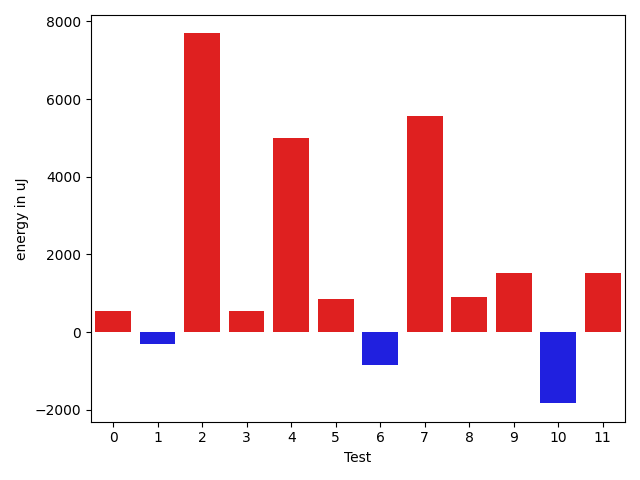

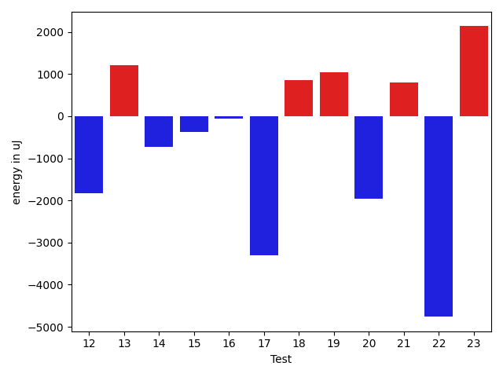

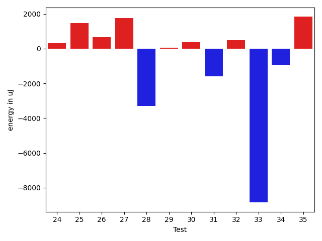

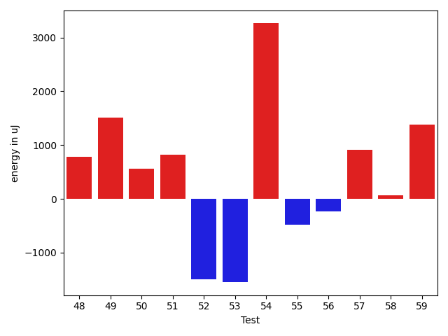

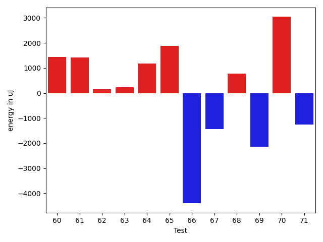

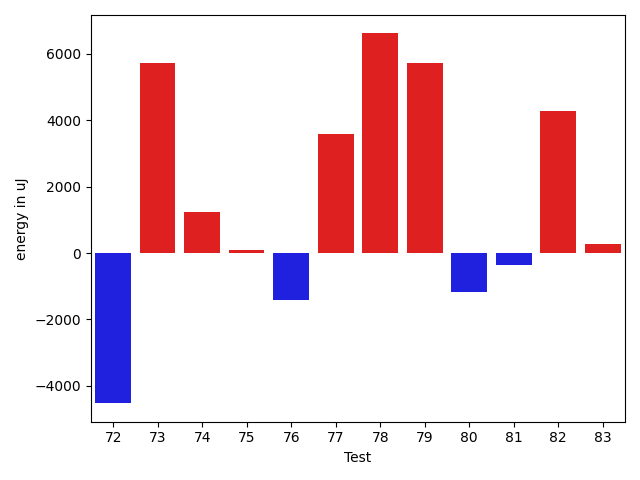

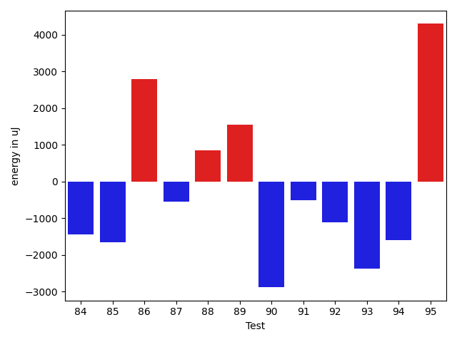

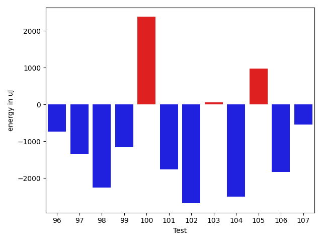

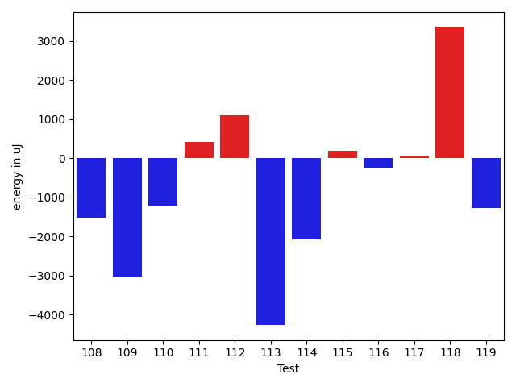

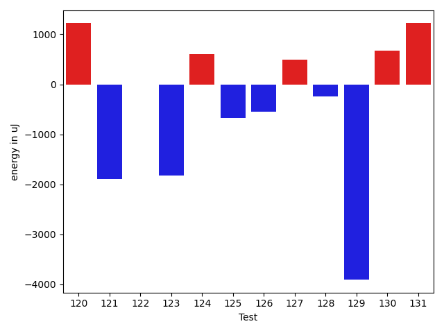

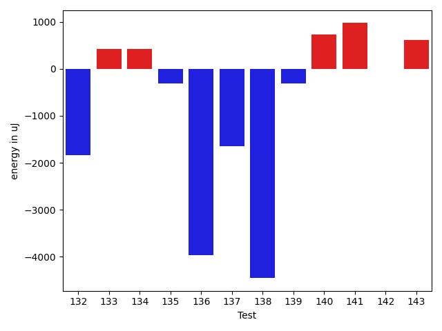

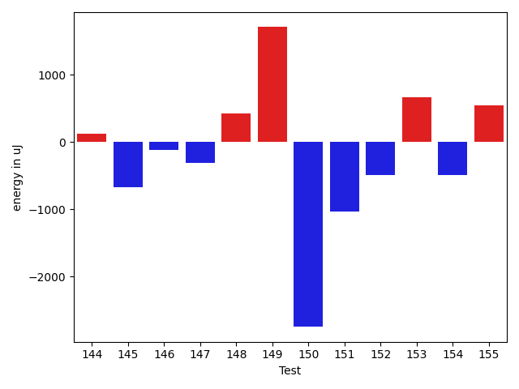

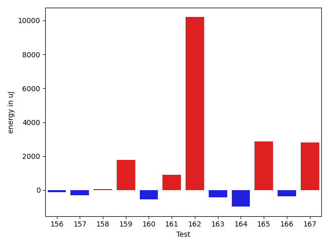

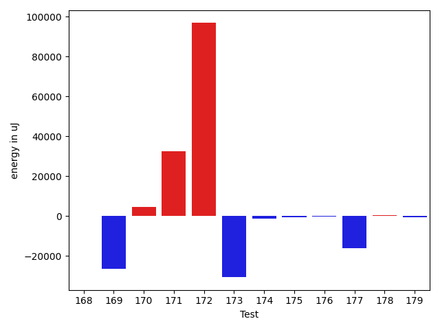

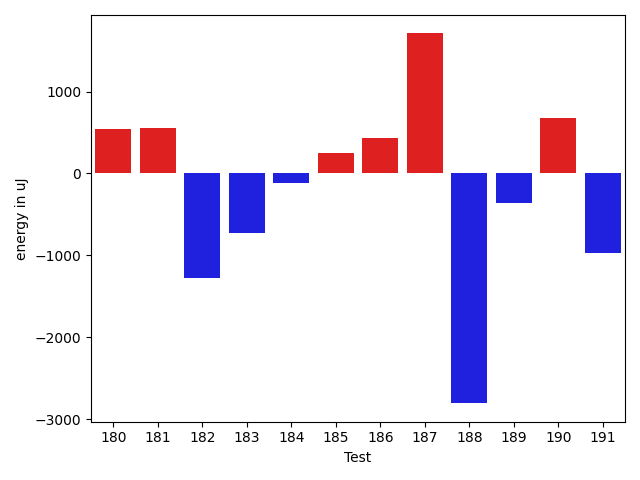

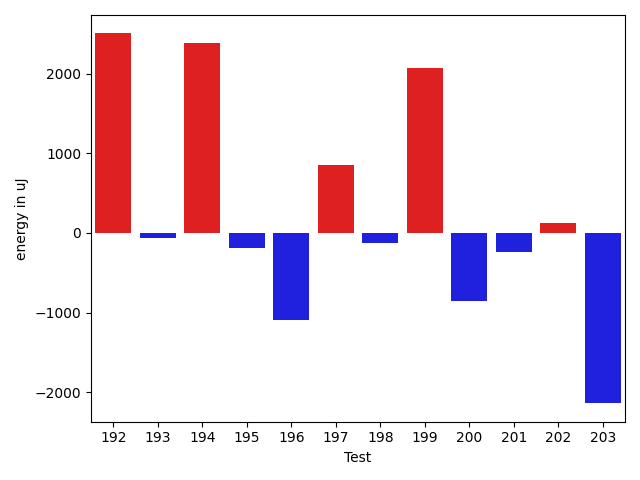

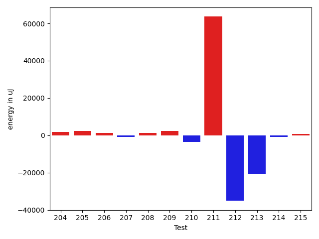

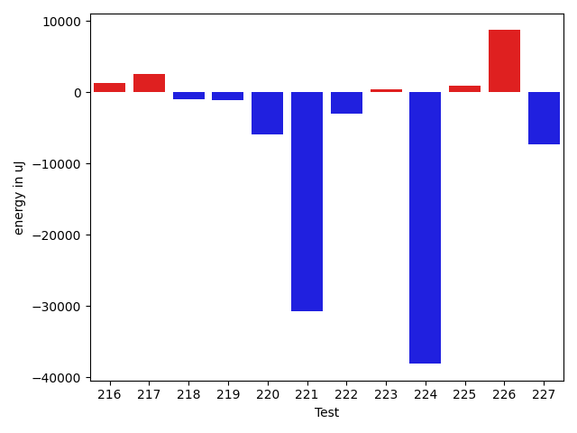

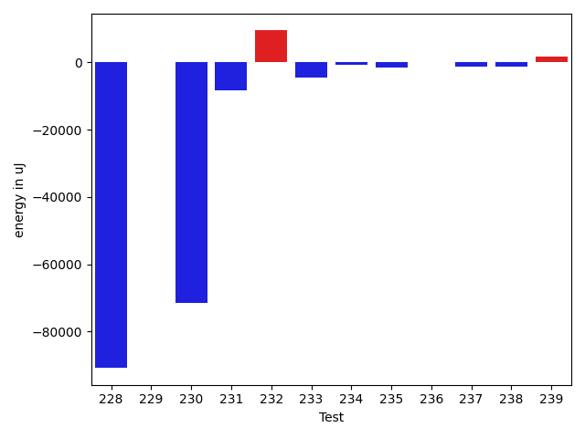

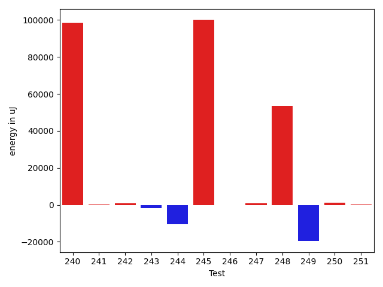

| ID | EnergyV1 | EnergyV2 | DeltaEnergy | σV1 | σV2 |
| --- | --- | --- | --- | --- | --- |
| 0 | 83923 | 84472 | 549 | 18939.027009073176 | 28415.71266407953 |
| 1 | 40344 | 40039 | -305 | 3524.9519518676816 | 4154.5502856974645 |
| 2 | 101318 | 109009 | 7691 | 58907.76073411105 | 64992.63629271326 |
| 3 | 41016 | 41565 | 549 | 25184.23016239539 | 42173.742999378104 |
| 4 | 76782 | 81787 | 5005 | 25046.581191685524 | 23984.81674038367 |
| 5 | 81604 | 82458 | 854 | 21446.623161750635 | 24539.721901795205 |
| 6 | 86486 | 85632 | -854 | 27962.899408955644 | 22760.77963954259 |
| 7 | 99914 | 105469 | 5555 | 34284.19332632656 | 31748.70048664921 |
| 8 | 39124 | 40039 | 915 | 4199.158895141895 | 4833.9122747522015 |
| 9 | 39245 | 40771 | 1526 | 4334.86249692928 | 4659.914806088197 |
| 10 | 40405 | 38574 | -1831 | 4389.724727875706 | 5788.263220709837 |
| 11 | 39733 | 41259 | 1526 | 4850.025796307898 | 4047.8058128928183 |
| 12 | 40039 | 38208 | -1831 | 4050.4349740848747 | 3438.892978206149 |
| 13 | 41077 | 42298 | 1221 | 20857.13391704527 | 17740.51341151993 |
| 14 | 40955 | 40223 | -732 | 9361.926875695885 | 12332.947451161212 |
| 15 | 39123 | 38757 | -366 | 4224.514654042785 | 4243.883558550657 |
| 16 | 39124 | 39062 | -62 | 4405.083640640952 | 4385.38672297258 |
| 17 | 40955 | 37658 | -3297 | 4284.815631972979 | 3953.0215174937503 |
| 18 | 39734 | 40588 | 854 | 3450.7201967912742 | 3354.1988195505614 |
| 19 | 40161 | 41198 | 1037 | 4371.44528039711 | 3405.5947511961845 |
| 20 | 40893 | 38940 | -1953 | 2597.775918179699 | 4927.330640267649 |
| 21 | 40039 | 40833 | 794 | 2844.666966230024 | 4856.360843167778 |
| 22 | 42480 | 37719 | -4761 | 3862.8646537684094 | 3815.775828906959 |
| 23 | 41016 | 43152 | 2136 | 3544.2187368051914 | 73625.67021005761 |
| 24 | 40283 | 40588 | 305 | 14080.314751176875 | 8905.320250776782 |
| 25 | 39185 | 40650 | 1465 | 4299.044795644217 | 4108.037720144034 |
| 26 | 41199 | 41870 | 671 | 14259.13528016467 | 14581.598233904788 |
| 27 | 39978 | 41747 | 1769 | 13181.973841768244 | 10484.452242984964 |
| 28 | 81055 | 77758 | -3297 | 108854.78460595012 | 105589.91307641052 |
| 29 | 40344 | 40406 | 62 | 4512.37181631626 | 3584.8508555703834 |
| 30 | 41077 | 41443 | 366 | 12307.864368941635 | 11384.402659560901 |
| 31 | 80993 | 79407 | -1586 | 39898.34906209309 | 36855.12480080137 |
| 32 | 40955 | 41443 | 488 | 15655.194946301017 | 14078.184656996054 |
| 33 | 76904 | 68054 | -8850 | 29937.528825692418 | 31851.27752259599 |
| 34 | 82214 | 81299 | -915 | 38695.69924345871 | 28791.53475412893 |
| 35 | 40222 | 42053 | 1831 | 13429.129376457624 | 20407.57515200606 |
| 36 | 40649 | 42725 | 2076 | 3567.58582922526 | 5327.016927838785 |
| 37 | 42175 | 40039 | -2136 | 4801.587291316178 | 4026.8722746477233 |
| 38 | 43030 | 45349 | 2319 | 31588.499499614085 | 36717.51510746733 |
| 39 | 39367 | 43457 | 4090 | 4729.8223457358545 | 5332.285598360176 |
| 40 | 44433 | 44372 | -61 | 99585.67671569776 | 70142.36127750001 |
| 41 | 41931 | 43395 | 1464 | 4328.685854563715 | 5551.4304389379995 |
| 42 | 42175 | 39978 | -2197 | 4972.863408980283 | 4564.044020655937 |
| 43 | 41382 | 40649 | -733 | 4293.774010122098 | 6131.199976146594 |
| 44 | 41748 | 40527 | -1221 | 4814.758748888671 | 45735.01372034341 |
| 45 | 40039 | 41320 | 1281 | 17920.53829896905 | 14562.273080199127 |
| 46 | 41687 | 41565 | -122 | 21613.09369587852 | 17406.847531803644 |
| 47 | 41381 | 41565 | 184 | 3629.7515534262134 | 4241.968727147663 |
| 48 | 39184 | 40832 | 1648 | 5161.636661709153 | 4080.3809606916607 |
| 49 | 40161 | 40222 | 61 | 4102.245893345187 | 9337.496168078598 |
| 50 | 40222 | 40283 | 61 | 3665.1475321054636 | 4490.999817813235 |
| 51 | 39673 | 40161 | 488 | 14003.387136081006 | 13547.33840897219 |
| 52 | 47180 | 45105 | -2075 | 23311.992728958212 | 23431.268666334472 |
| 53 | 41199 | 41748 | 549 | 63290.920614543036 | 53841.58752875447 |
| 54 | 40161 | 42114 | 1953 | 4186.457694459601 | 3207.460099517997 |
| 55 | 42358 | 39428 | -2930 | 4067.2904868377655 | 3634.395882311513 |
| 56 | 40954 | 41016 | 62 | 3512.292347101231 | 4687.298299723596 |
| 57 | 40405 | 42602 | 2197 | 3190.2894369254373 | 4749.338495042849 |
| 58 | 40161 | 39856 | -305 | 4099.324286379154 | 4513.650666689779 |
| 59 | 39184 | 39184 | 0 | 5520.932758437354 | 3489.5108981077115 |
| 60 | 40833 | 41687 | 854 | 4056.073782124983 | 4651.166003315728 |
| 61 | 37720 | 38513 | 793 | 3940.4405739290964 | 4981.696895637068 |
| 62 | 41442 | 41809 | 367 | 3727.9900067406465 | 3869.6801294447177 |
| 63 | 40405 | 40588 | 183 | 4349.585986479679 | 3567.1785698170393 |
| 64 | 41565 | 41931 | 366 | 4038.8108614293883 | 3619.7152834945477 |
| 65 | 42358 | 42664 | 306 | 26316.709797364063 | 27521.649730086243 |
| 66 | 84350 | 82763 | -1587 | 67808.15149806801 | 74016.001532459 |
| 67 | 41259 | 39489 | -1770 | 3421.349049483259 | 3552.991765596988 |
| 68 | 40405 | 40771 | 366 | 5143.52664342251 | 3201.7405151573416 |
| 69 | 41443 | 38574 | -2869 | 3354.1441962481213 | 3590.048954519266 |
| 70 | 42358 | 43091 | 733 | 9755.287540982896 | 13446.751734570276 |
| 71 | 42358 | 42175 | -183 | 11619.10604209049 | 8350.376651414359 |
| 72 | 41687 | 42236 | 549 | 77365.57495760801 | 84232.35872367014 |
| 73 | 124512 | 125000 | 488 | 83146.56078744034 | 107668.54365989003 |
| 74 | 40466 | 41870 | 1404 | 4204.367656761041 | 4825.404021172738 |
| 75 | 42053 | 42847 | 794 | 4233.224822618244 | 4196.27225785468 |
| 76 | 43029 | 41442 | -1587 | 6625.7282332265 | 5263.09104934448 |
| 77 | 72388 | 72876 | 488 | 49980.81567733625 | 55257.00511050955 |
| 78 | 39611 | 40284 | 673 | 5127.129532018402 | 30426.818836644074 |
| 79 | 44250 | 43151 | -1099 | 104072.2791273435 | 119261.07592097262 |
| 80 | 40650 | 37902 | -2748 | 4278.799417663467 | 4691.678220641486 |
| 81 | 40527 | 40039 | -488 | 3586.226252535526 | 4562.712255762891 |
| 82 | 43030 | 41443 | -1587 | 10289.355547239102 | 18842.44227782234 |
| 83 | 41260 | 39124 | -2136 | 4105.158830159112 | 9642.460913088538 |
| 84 | 40589 | 40832 | 243 | 4620.0340995803745 | 4755.718151425972 |
| 85 | 42481 | 39856 | -2625 | 4881.638767101591 | 4884.643375281975 |
| 86 | 43946 | 43396 | -550 | 85144.86877480969 | 89510.85309451314 |
| 87 | 39795 | 40161 | 366 | 3835.723087890675 | 4178.507022699661 |
| 88 | 40710 | 41076 | 366 | 8791.243106628863 | 10376.936682684207 |
| 89 | 40283 | 40345 | 62 | 4572.217845403101 | 8477.851669089105 |
| 90 | 40405 | 37414 | -2991 | 3808.022168624376 | 3842.5390240345946 |
| 91 | 38940 | 39368 | 428 | 3668.023116369664 | 3697.9138243533675 |
| 92 | 39734 | 40589 | 855 | 10687.0167311281 | 9123.954355661715 |
| 93 | 41504 | 40100 | -1404 | 10183.256941396317 | 4348.059724569231 |
| 94 | 40527 | 39734 | -793 | 3543.277251032187 | 4362.466779574666 |
| 95 | 40893 | 42602 | 1709 | 7132.630031245821 | 9229.400736704289 |
| 96 | 40466 | 39734 | -732 | 4457.732752195896 | 4387.008183894299 |
| 97 | 39794 | 38452 | -1342 | 4184.12394411282 | 4428.787809954322 |
| 98 | 41870 | 39612 | -2258 | 4304.870160880677 | 4881.672696593521 |
| 99 | 41564 | 40405 | -1159 | 4468.961448675975 | 2654.191377521996 |
| 100 | 39612 | 41992 | 2380 | 3967.6087301691286 | 3255.8604395480556 |
| 101 | 39795 | 38025 | -1770 | 3927.376427502944 | 3773.2341012407965 |
| 102 | 42176 | 39490 | -2686 | 5665.009595250984 | 4656.6026305230025 |
| 103 | 40100 | 40161 | 61 | 3316.232796412218 | 3357.073930275193 |
| 104 | 42358 | 39855 | -2503 | 4021.3131703010104 | 3476.208742613456 |
| 105 | 39733 | 40710 | 977 | 3975.0386469691034 | 6330.448099131883 |
| 106 | 41381 | 39551 | -1830 | 3978.059105756083 | 4179.207734427663 |
| 107 | 41870 | 41321 | -549 | 4436.638012523296 | 4691.914910743438 |
| 108 | 40589 | 39062 | -1527 | 4034.7269284951153 | 4981.513321593578 |
| 109 | 43640 | 40588 | -3052 | 4010.040816754963 | 4199.195185970348 |
| 110 | 42786 | 41564 | -1222 | 3954.582466503259 | 3283.599457668368 |
| 111 | 39612 | 40039 | 427 | 4749.044560504178 | 4142.395864714043 |
| 112 | 40161 | 41260 | 1099 | 4797.766954532077 | 3846.1938547565887 |
| 113 | 44434 | 40161 | -4273 | 3311.49531933838 | 4270.320624413829 |
| 114 | 42053 | 39978 | -2075 | 4048.908277821879 | 4349.377551730822 |
| 115 | 39124 | 39307 | 183 | 3119.0125661425445 | 3808.7575857408906 |
| 116 | 42602 | 42358 | -244 | 383681.769117918 | 37119.3927585534 |
| 117 | 85144 | 85204 | 60 | 25157.801651701047 | 33602.57236209547 |
| 118 | 79833 | 83191 | 3358 | 222464.17285202866 | 174635.7013623018 |
| 119 | 41198 | 39917 | -1281 | 7822.4823528538245 | 4579.233006025069 |
| 120 | 40222 | 41443 | 1221 | 4183.397988876188 | 2942.584430960874 |
| 121 | 41443 | 39550 | -1893 | 9493.738598110416 | 9773.652833744209 |
| 122 | 40833 | 40833 | 0 | 3989.117593590475 | 4572.027279514223 |
| 123 | 42358 | 40528 | -1830 | 3906.532772112219 | 4156.49024678245 |
| 124 | 40222 | 40832 | 610 | 4316.8593703411825 | 3974.9594915148095 |
| 125 | 42115 | 41442 | -673 | 3850.351049730933 | 4119.2305386576045 |
| 126 | 42602 | 42053 | -549 | 4599.624612382983 | 4590.678653702617 |
| 127 | 44494 | 44983 | 489 | 383308.0120013346 | 486776.1432554199 |
| 128 | 41320 | 41076 | -244 | 4340.461875185731 | 4367.464187530664 |
| 129 | 42664 | 38757 | -3907 | 18885.039921889693 | 10738.828013852866 |
| 130 | 41442 | 42114 | 672 | 25432.281576809622 | 15835.4332136747 |
| 131 | 40283 | 41504 | 1221 | 3908.5456034662047 | 3433.629413698759 |
| 132 | 43091 | 41260 | -1831 | 40539.08503581479 | 39755.37013093105 |
| 133 | 39307 | 39734 | 427 | 3391.7090249607204 | 4536.934325363809 |
| 134 | 40466 | 40893 | 427 | 4020.6371365900436 | 3904.07607630794 |
| 135 | 41870 | 41565 | -305 | 3538.6143926781856 | 4369.976766528628 |
| 136 | 43274 | 39306 | -3968 | 4779.326331379579 | 5404.310257380186 |
| 137 | 41870 | 40222 | -1648 | 4066.0970422537625 | 4071.065153540901 |
| 138 | 81970 | 77514 | -4456 | 36802.72071692448 | 34516.72449915543 |
| 139 | 41504 | 41198 | -306 | 9248.140454970979 | 6751.962685951543 |
| 140 | 40832 | 41565 | 733 | 4008.7028191723093 | 3625.9563652158004 |
| 141 | 40711 | 41687 | 976 | 4096.692356719016 | 3165.110704737297 |
| 142 | 40344 | 40344 | 0 | 2626.0018622463435 | 3561.9464743130347 |
| 143 | 41382 | 41992 | 610 | 4604.455392091037 | 16471.206167651595 |
| 144 | 41870 | 41992 | 122 | 12341.007673527029 | 8024.69912863942 |
| 145 | 40528 | 39856 | -672 | 4483.298296141845 | 4287.874396423731 |
| 146 | 40100 | 39978 | -122 | 3687.9147495247485 | 4433.120820011078 |
| 147 | 41198 | 40893 | -305 | 4527.103477814812 | 4580.042631812579 |
| 148 | 41138 | 41564 | 426 | 3932.88960871965 | 4583.857506305937 |
| 149 | 39123 | 40832 | 1709 | 3403.44376015991 | 4315.284632595799 |
| 150 | 41687 | 38941 | -2746 | 3789.91652364176 | 23770.523611083063 |
| 151 | 40710 | 39673 | -1037 | 4581.848443101927 | 4130.020800289858 |
| 152 | 41260 | 40771 | -489 | 18491.21855967665 | 25946.4942429638 |
| 153 | 41504 | 42175 | 671 | 14272.07464525575 | 13573.550646487582 |
| 154 | 40405 | 39917 | -488 | 4492.766286047124 | 3576.5766458166895 |
| 155 | 40832 | 41381 | 549 | 15153.13767998259 | 14070.149436683756 |
| 156 | 41382 | 41260 | -122 | 4124.59950615424 | 4733.491370605844 |
| 157 | 41259 | 40955 | -304 | 4215.440565000169 | 4092.187229343252 |
| 158 | 40405 | 40466 | 61 | 5655.197871371035 | 4708.601782979321 |
| 159 | 39428 | 41198 | 1770 | 3680.2337093939936 | 3641.648941850951 |
| 160 | 39856 | 39306 | -550 | 3777.5345437235837 | 3603.4477240553942 |
| 161 | 42053 | 42969 | 916 | 344682.50544901064 | 381617.2469890503 |
| 162 | 70861 | 81055 | 10194 | 36476.08996504354 | 33973.267021053 |
| 163 | 40894 | 40467 | -427 | 16016.603400900265 | 12458.41430827502 |
| 164 | 41748 | 40771 | -977 | 13074.210270773132 | 19284.911747578208 |
| 165 | 37597 | 40466 | 2869 | 4761.008151281469 | 4041.02758539418 |
| 166 | 41870 | 41504 | -366 | 77065.1495038758 | 3538.5694725908766 |
| 167 | 41016 | 43824 | 2808 | 22289.88224783213 | 14117.409814411976 |
| 168 | 40405 | 40954 | 549 | 6220.310006514823 | 3903.2214712234145 |
| 169 | 88134 | 85632 | -2502 | 428843.17239538644 | 405258.93205130025 |
| 170 | 43823 | 43457 | -366 | 19713.71951367136 | 27955.50446165029 |
| 171 | 42297 | 45654 | 3357 | 18691.007019057175 | 66822.73321637574 |
| 172 | 42175 | 42908 | 733 | 279924.74529759045 | 465363.2343724794 |
| 173 | 173522 | 166565 | -6957 | 257659.2874469754 | 205298.6685922583 |
| 174 | 40771 | 41016 | 245 | 10964.802697826872 | 6415.06143623815 |
| 175 | 39673 | 41504 | 1831 | 11061.865680807949 | 7842.748528315822 |
| 176 | 40771 | 41565 | 794 | 12773.28587662501 | 10424.565866983714 |
| 177 | 87097 | 86181 | -916 | 106266.61910138889 | 86778.99385210146 |
| 178 | 40955 | 41931 | 976 | 16712.960453847485 | 15984.95069693561 |
| 179 | 41809 | 41321 | -488 | 15254.845545266517 | 15307.306101725811 |
| 180 | 41932 | 42480 | 548 | 15104.990125482916 | 18695.017424659174 |
| 181 | 41138 | 41687 | 549 | 5000.995099843415 | 3918.708345191634 |
| 182 | 40588 | 39306 | -1282 | 5279.678086087099 | 4490.197993020901 |
| 183 | 42908 | 42175 | -733 | 35396.2705929659 | 39545.24932185302 |
| 184 | 41870 | 41748 | -122 | 21748.48574268103 | 27069.205437168708 |
| 185 | 41382 | 41626 | 244 | 9621.967056280102 | 5298.886900193316 |
| 186 | 40100 | 40527 | 427 | 4440.5237231851615 | 4308.975412424082 |
| 187 | 39794 | 41503 | 1709 | 5162.422130143555 | 5678.572552932617 |
| 188 | 42419 | 39612 | -2807 | 4947.278018257167 | 3354.449989093261 |
| 189 | 40528 | 40161 | -367 | 9026.965501173414 | 11279.010539218487 |
| 190 | 39429 | 40100 | 671 | 5361.108872109832 | 4271.379344623789 |
| 191 | 43152 | 42175 | -977 | 84537.19928128687 | 84801.16074786319 |
| 192 | 37658 | 40161 | 2503 | 4939.61369684396 | 3649.9997939854393 |
| 193 | 41077 | 41016 | -61 | 4909.12745910332 | 3532.8094798933735 |
| 194 | 38757 | 41138 | 2381 | 4023.969506270638 | 3865.332560796749 |
| 195 | 40832 | 40649 | -183 | 9764.342360838717 | 6615.995437150785 |
| 196 | 41076 | 39978 | -1098 | 7497.024698001801 | 4477.92157674741 |
| 197 | 41931 | 42785 | 854 | 28529.346918395033 | 25607.351994782497 |
| 198 | 42358 | 42237 | -121 | 26304.926906586225 | 5903.328570264814 |
| 199 | 39978 | 42053 | 2075 | 4691.717565847845 | 3754.9764123387135 |
| 200 | 40344 | 39490 | -854 | 4840.540978342216 | 4403.133244745942 |
| 201 | 39917 | 39672 | -245 | 4554.0387082764655 | 4682.864747465546 |
| 202 | 40955 | 41077 | 122 | 4001.172896476732 | 4104.130523529517 |
| 203 | 40528 | 38391 | -2137 | 5045.503204002275 | 5092.266595254851 |
| 204 | 40710 | 41809 | 1099 | 5590.187959119314 | 4477.214048952586 |
| 205 | 39185 | 41626 | 2441 | 5512.508395374443 | 2765.4339164213907 |
| 206 | 42480 | 42175 | -305 | 5158.892265787298 | 4523.02600214353 |
| 207 | 40894 | 41687 | 793 | 3727.1286217829415 | 4948.267620086853 |
| 208 | 39917 | 42786 | 2869 | 6600.851707876417 | 4887.37826919735 |
| 209 | 42419 | 43396 | 977 | 4964.059489933493 | 7515.173556053113 |
| 210 | 44677 | 43213 | -1464 | 17236.468249321744 | 12740.352403395995 |
| 211 | 41321 | 42542 | 1221 | 401170.56314771884 | 544641.6334584245 |
| 212 | 45715 | 44555 | -1160 | 127495.82103646864 | 78740.83400166252 |
| 213 | 375792 | 335998 | -39794 | 156839.53189404772 | 136985.89303413677 |
| 214 | 48095 | 46326 | -1769 | 86494.30717974776 | 87963.2095425978 |
| 215 | 41870 | 42114 | 244 | 18885.524909165277 | 14518.71594562207 |
| 216 | 42358 | 43091 | 733 | 4348.378838217889 | 3636.969657548789 |
| 217 | 41259 | 43274 | 2015 | 11113.194901417755 | 14268.221228247137 |
| 218 | 42480 | 40894 | -1586 | 4835.184561426332 | 4102.930323933805 |
| 219 | 42237 | 43212 | 975 | 18408.04415918311 | 16383.48267099927 |
| 220 | 42846 | 42847 | 1 | 54757.41548201231 | 44287.35034593395 |
| 221 | 42602 | 41016 | -1586 | 110707.86733988076 | 68452.10411056675 |
| 222 | 44067 | 43274 | -793 | 44141.81135659931 | 38703.35883608438 |
| 223 | 40894 | 41382 | 488 | 5599.3083089579395 | 4700.543040272093 |
| 224 | 93750 | 88806 | -4944 | 242384.30696294716 | 37609.295795451595 |
| 225 | 41870 | 42663 | 793 | 4064.313417910615 | 3843.042914487502 |
| 226 | 41137 | 41259 | 122 | 3722.0536757409823 | 49419.40760206782 |
| 227 | 42968 | 41809 | -1159 | 37542.11935684602 | 30241.677826842566 |
| 228 | 43152 | 41504 | -1648 | 437983.6322454984 | 8933.088991191913 |
| 229 | 42481 | 41321 | -1160 | 4539.264844442971 | 3315.228229195208 |
| 230 | 41809 | 39184 | -2625 | 382163.51363928476 | 3764.914702350683 |
| 231 | 180786 | 174744 | -6042 | 73551.56331471249 | 69966.16262960939 |
| 232 | 42908 | 42114 | -794 | 34159.63152962759 | 60404.39969301724 |
| 233 | 44128 | 45226 | 1098 | 94822.52479915359 | 78409.83087823994 |
| 234 | 41993 | 42358 | 365 | 22542.264088442058 | 26192.203901706784 |
| 235 | 40283 | 40771 | 488 | 9693.288970605658 | 3546.343744621677 |
| 236 | 40100 | 40161 | 61 | 3486.594619121348 | 3764.63134128728 |
| 237 | 39795 | 39368 | -427 | 4666.1761188149885 | 4778.693396258414 |
| 238 | 42480 | 41076 | -1404 | 3789.0553294983697 | 3893.373653388274 |
| 239 | 39612 | 41931 | 2319 | 4568.247817390575 | 4207.3219110525815 |
| 240 | 41138 | 43274 | 2136 | 361526.9249905219 | 496011.0491447544 |
| 241 | 41260 | 41199 | -61 | 4910.185100826139 | 3837.068825297251 |
| 242 | 41503 | 39124 | -2379 | 5184.276208157618 | 8708.565744452055 |
| 243 | 44006 | 43090 | -916 | 43270.29999779728 | 45818.67745186682 |
| 244 | 42724 | 42847 | 123 | 43531.05710741342 | 6492.238465981434 |
| 245 | 41992 | 43395 | 1403 | 272345.36013874656 | 557808.6211742982 |
| 246 | 40345 | 39428 | -917 | 4970.1991653135365 | 5757.114447820724 |
| 247 | 43457 | 43152 | -305 | 25650.858376922475 | 27822.047809976393 |
| 248 | 42969 | 42663 | -306 | 482417.43057899934 | 585651.0663574716 |
| 249 | 41504 | 44494 | 2990 | 68670.72933960466 | 16873.737015699873 |
| 250 | 40649 | 41992 | 1343 | 4643.918297197063 | 3950.142383114931 |
| 251 | 42236 | 41870 | -366 | 4785.960450891754 | 4320.805364743938 |

## Delta Duration per test method

| ID | DurationV1 | DurationsV2 | DeltaDuration |
| --- | --- | --- | --- |
| 0 | 2410354.0606060605 | 2433016.8181818184 | 22662.7575757578 |
| 1 | 345884.0 | 383514.75 | 37630.75 |
| 2 | 3394886.262626263 | 3372168.888888889 | -22717.373737373855 |
| 3 | 1116085.0869565217 | 1242479.9848484849 | 126394.89789196313 |
| 4 | 2082997.98989899 | 2229007.202020202 | 146009.21212121192 |
| 5 | 2197812.525252525 | 2232961.6868686867 | 35149.161616161466 |
| 6 | 2590183.292929293 | 2523206.8383838385 | -66976.45454545459 |
| 7 | 2873465.696969697 | 2937070.767676768 | 63605.07070707111 |
| 8 | 718099.4375 | 715116.98 | -2982.4575000000186 |
| 9 | 484382.6111111111 | 511387.4375 | 27004.826388888876 |
| 10 | 517455.78125 | 519284.7 | 1828.9187500000116 |
| 11 | 446266.26923076925 | 542951.0666666667 | 96684.7974358974 |
| 12 | 376363.0 | 386464.5333333333 | 10101.533333333326 |
| 13 | 1368410.6825396826 | 1164733.3870967743 | -203677.2954429083 |
| 14 | 1006878.5072463768 | 1000318.0303030303 | -6560.476943346555 |
| 15 | 709324.7555555556 | 765126.4146341464 | 55801.659078590805 |
| 16 | 1013174.2835820896 | 966525.3278688524 | -46648.95571323717 |
| 17 | 592033.5833333334 | 574239.5 | -17794.083333333372 |
| 18 | 456644.77777777775 | 463754.04545454547 | 7109.2676767677185 |
| 19 | 443783.6666666667 | 368924.5625 | -74859.10416666669 |
| 20 | 529952.3181818182 | 513567.39285714284 | -16384.925324675394 |
| 21 | 452109.63636363635 | 410021.23076923075 | -42088.4055944056 |
| 22 | 404692.8333333333 | 416556.1176470588 | 11863.284313725482 |
| 23 | 722808.911111111 | 1289026.8409090908 | 566217.9297979798 |
| 24 | 1140122.6710526317 | 1074191.4366197183 | -65931.23443291336 |
| 25 | 851616.8653846154 | 804679.754385965 | -46937.11099865043 |
| 26 | 1247211.2183908045 | 1229360.5180722892 | -17850.7003185153 |
| 27 | 1218948.511627907 | 1177960.2117647058 | -40988.2998632011 |
| 28 | 2944287.878787879 | 2714525.737373737 | -229762.14141414175 |
| 29 | 609717.487804878 | 560103.5945945946 | -49613.89321028348 |
| 30 | 1296506.4523809524 | 1196517.3176470587 | -99989.13473389368 |
| 31 | 2442534.111111111 | 2256345.7474747472 | -186188.36363636376 |
| 32 | 1306411.5 | 1254055.8023255814 | -52355.69767441857 |
| 33 | 2055580.0606060605 | 1967098.5918367347 | -88481.46876932587 |
| 34 | 2458880.494949495 | 2319780.505050505 | -139099.9898989899 |
| 35 | 1279480.4268292682 | 1263587.3647058823 | -15893.062123385957 |
| 36 | 718422.3333333334 | 432895.4705882353 | -285526.8627450981 |
| 37 | 622165.3548387097 | 637328.1071428572 | 15162.752304147463 |
| 38 | 1249812.0789473683 | 1202547.892857143 | -47264.186090225354 |
| 39 | 408224.0 | 363558.7272727273 | -44665.272727272706 |
| 40 | 2692763.0714285714 | 1664507.2222222222 | -1028255.8492063491 |
| 41 | 406999.6 | 393252.5 | -13747.099999999977 |
| 42 | 324247.875 | 341519.07692307694 | 17271.201923076937 |
| 43 | 473900.5625 | 475512.8 | 1612.2374999999884 |
| 44 | 354229.9 | 837759.3333333334 | 483529.43333333335 |
| 45 | 1204013.8873239437 | 1162403.5657894737 | -41610.32153446996 |
| 46 | 1385764.1785714286 | 1151820.8235294118 | -233943.35504201683 |
| 47 | 731731.12 | 726185.9722222222 | -5545.147777777747 |
| 48 | 797971.725 | 709315.65 | -88656.07499999995 |
| 49 | 848985.3076923077 | 814693.6779661017 | -34291.62972620607 |
| 50 | 777515.5185185185 | 742266.1020408163 | -35249.41647770221 |
| 51 | 1036312.75 | 1104181.5409836066 | 67868.7909836066 |
| 52 | 1702611.2222222222 | 1659249.8181818181 | -43361.40404040413 |
| 53 | 1313066.1 | 1181450.6 | -131615.5 |
| 54 | 465671.15 | 456013.4 | -9657.75 |
| 55 | 521273.44444444444 | 443436.84210526315 | -77836.60233918129 |
| 56 | 783061.2641509434 | 855795.6923076923 | 72734.42815674888 |
| 57 | 426772.0 | 358751.45454545453 | -68020.54545454547 |
| 58 | 756617.3142857143 | 654950.1363636364 | -101667.17792207794 |
| 59 | 609742.5862068966 | 586287.0 | -23455.58620689658 |
| 60 | 479962.5833333333 | 518704.88 | 38742.29666666669 |
| 61 | 454719.9166666667 | 411982.35 | -42737.56666666671 |
| 62 | 897080.3181818182 | 915352.262295082 | 18271.944113263744 |
| 63 | 684029.8717948718 | 657632.6176470588 | -26397.254147812957 |
| 64 | 451822.08 | 507864.1176470588 | 56042.03764705878 |
| 65 | 1040629.8181818182 | 1093986.463414634 | 53356.64523281588 |
| 66 | 2589797.757575758 | 2573664.878787879 | -16132.8787878789 |
| 67 | 573253.64 | 570851.84 | -2401.8000000000466 |
| 68 | 481916.75 | 455900.84 | -26015.909999999974 |
| 69 | 504660.47826086957 | 491625.0 | -13035.478260869568 |
| 70 | 1004040.8524590164 | 1020515.2115384615 | 16474.35907944513 |
| 71 | 1090295.95 | 1014994.3333333334 | -75301.61666666658 |
| 72 | 1445226.888888889 | 1443431.2631578948 | -1795.6257309941575 |
| 73 | 3962974.222222222 | 4228542.202020202 | 265567.9797979798 |
| 74 | 692198.5609756098 | 722595.8372093023 | 30397.276233692537 |
| 75 | 607699.7027027027 | 598477.4857142858 | -9222.21698841697 |
| 76 | 835280.7551020408 | 799467.3333333334 | -35813.421768707456 |
| 77 | 2260086.8282828284 | 2399582.1919191917 | 139495.3636363633 |
| 78 | 642326.8095238095 | 788685.5217391305 | 146358.71221532102 |
| 79 | 2220726.6842105263 | 2618416.3181818184 | 397689.63397129206 |
| 80 | 593362.1666666666 | 554882.5416666666 | -38479.625 |
| 81 | 482676.8125 | 549216.5666666667 | 66539.75416666665 |
| 82 | 1197438.275 | 1328904.0 | 131465.7250000001 |
| 83 | 767413.9722222222 | 883416.8780487805 | 116002.90582655824 |
| 84 | 481002.60869565216 | 524764.6296296297 | 43762.0209339775 |
| 85 | 507003.3333333333 | 574959.0 | 67955.66666666669 |
| 86 | 2058015.9278350514 | 2176810.1649484537 | 118794.23711340223 |
| 87 | 800808.8301886793 | 866658.4561403509 | 65849.62595167162 |
| 88 | 938053.262295082 | 1025952.6515151515 | 87899.38922006951 |
| 89 | 851723.8979591837 | 1001379.0961538461 | 149655.19819466246 |
| 90 | 373706.21428571426 | 424244.0 | 50537.78571428574 |
| 91 | 380961.6666666667 | 394601.4375 | 13639.770833333314 |
| 92 | 1065494.081632653 | 1033108.3137254902 | -32385.76790716278 |
| 93 | 890448.2075471698 | 888968.4035087719 | -1479.8040383978514 |
| 94 | 683898.5106382979 | 670337.7045454546 | -13560.806092843297 |
| 95 | 536035.2352941176 | 835404.5454545454 | 299369.3101604278 |
| 96 | 625906.825 | 604986.3333333334 | -20920.49166666658 |
| 97 | 455717.1111111111 | 595822.2 | 140105.08888888883 |
| 98 | 522689.2 | 754768.0 | 232078.8 |
| 99 | 330885.36363636365 | 344490.29411764705 | 13604.930481283402 |
| 100 | 385181.53571428574 | 416579.4285714286 | 31397.89285714284 |
| 101 | 423486.8181818182 | 448708.6666666667 | 25221.84848484851 |
| 102 | 410785.35714285716 | 399465.25 | -11320.10714285716 |
| 103 | 548247.4333333333 | 514072.7 | -34174.73333333334 |
| 104 | 420259.7727272727 | 458815.7083333333 | 38555.93560606061 |
| 105 | 383578.71428571426 | 909420.8888888889 | 525842.1746031747 |
| 106 | 395921.06666666665 | 360892.15 | -35028.91666666663 |
| 107 | 508359.25 | 571245.7419354839 | 62886.49193548388 |
| 108 | 520670.82608695654 | 545197.0714285715 | 24526.245341614936 |
| 109 | 451794.71428571426 | 401138.3333333333 | -50656.38095238095 |
| 110 | 481098.0 | 519051.4 | 37953.40000000002 |
| 111 | 476060.6666666667 | 412061.875 | -63998.791666666686 |
| 112 | 351423.5 | 343515.64285714284 | -7907.8571428571595 |
| 113 | 430332.125 | 448036.23529411765 | 17704.11029411765 |
| 114 | 386571.70588235295 | 413890.6 | 27318.894117647025 |
| 115 | 1155678.142857143 | 332942.21428571426 | -822735.9285714286 |
| 116 | 3244945.68 | 1312405.0273972603 | -1932540.6526027399 |
| 117 | 2512677.9595959596 | 2602722.0707070706 | 90044.11111111101 |
| 118 | 3159922.474747475 | 3037937.414141414 | -121985.06060606055 |
| 119 | 823357.7049180327 | 855411.6964285715 | 32053.991510538734 |
| 120 | 540375.6 | 467338.5333333333 | -73037.06666666665 |
| 121 | 995305.8194444445 | 1039819.7384615385 | 44513.919017093955 |
| 122 | 1002607.2297297297 | 1052771.28 | 50164.05027027032 |
| 123 | 467473.5909090909 | 522990.92307692306 | 55517.33216783218 |
| 124 | 590366.5277777778 | 552175.0714285715 | -38191.45634920627 |
| 125 | 765815.7346938775 | 763996.552631579 | -1819.1820622985251 |
| 126 | 597592.6363636364 | 539037.1290322581 | -58555.50733137829 |
| 127 | 2882816.3636363638 | 4096446.2033898304 | 1213629.8397534667 |
| 128 | 430829.6923076923 | 701031.7368421053 | 270202.04453441297 |
| 129 | 772737.5862068966 | 700036.0 | -72701.58620689658 |
| 130 | 1148088.1538461538 | 1144770.9682539683 | -3317.185592185473 |
| 131 | 465788.3125 | 407928.1666666667 | -57860.145833333314 |
| 132 | 923724.6551724138 | 857386.0689655172 | -66338.58620689658 |
| 133 | 379259.1 | 378531.82352941175 | -727.2764705882291 |
| 134 | 455082.61904761905 | 487138.04 | 32055.420952380926 |
| 135 | 419723.76470588235 | 407409.95 | -12313.814705882338 |
| 136 | 479241.36363636365 | 379989.8888888889 | -99251.47474747477 |
| 137 | 327362.0909090909 | 414676.125 | 87314.03409090912 |
| 138 | 2169023.0808080807 | 2114112.737373737 | -54910.34343434358 |
| 139 | 1151014.9431818181 | 1117170.8987341772 | -33844.04444764089 |
| 140 | 842669.1489361703 | 840210.3428571429 | -2458.8060790273594 |
| 141 | 507450.52 | 527651.8095238095 | 20201.28952380945 |
| 142 | 549171.6296296297 | 486457.55555555556 | -62714.0740740741 |
| 143 | 656912.6842105263 | 893473.0370370371 | 236560.3528265108 |
| 144 | 846255.5116279069 | 861470.7297297297 | 15215.218101822771 |
| 145 | 513079.5789473684 | 407183.1666666667 | -105896.41228070174 |
| 146 | 757368.5172413794 | 735569.4827586206 | -21799.034482758725 |
| 147 | 716570.0181818182 | 717824.0975609756 | 1254.079379157396 |
| 148 | 728779.75 | 689949.9722222222 | -38829.77777777775 |
| 149 | 520109.61904761905 | 483241.61904761905 | -36868.0 |
| 150 | 534122.3611111111 | 716111.3870967742 | 181989.02598566306 |
| 151 | 808097.8444444444 | 816192.1707317074 | 8094.326287262957 |
| 152 | 1111793.1643835616 | 1203475.0701754387 | 91681.90579187707 |
| 153 | 1247108.1363636365 | 1231853.3409090908 | -15254.795454545645 |
| 154 | 426303.4166666667 | 409521.4761904762 | -16781.940476190473 |
| 155 | 1087323.2054794522 | 1182111.5142857144 | 94788.30880626221 |
| 156 | 814780.7619047619 | 720918.3 | -93862.46190476185 |
| 157 | 783906.9459459459 | 744390.98 | -39515.965945945936 |
| 158 | 770812.9772727273 | 792019.6976744186 | 21206.720401691273 |
| 159 | 708899.1627906977 | 666407.0465116279 | -42492.1162790698 |
| 160 | 485912.90476190473 | 378212.125 | -107700.77976190473 |
| 161 | 3427769.7377049183 | 3328997.3731343285 | -98772.36457058974 |
| 162 | 2102768.347368421 | 2112662.0736842104 | 9893.72631578939 |
| 163 | 1159474.2352941176 | 1131916.2696629213 | -27557.965631196275 |
| 164 | 1020252.6481481482 | 943224.1176470588 | -77028.53050108941 |
| 165 | 826297.1914893617 | 751813.6046511628 | -74483.58683819894 |
| 166 | 1554261.3658536586 | 757517.8846153846 | -796743.481238274 |
| 167 | 1128865.8444444444 | 971092.125 | -157773.7194444444 |
| 168 | 934226.375 | 918455.7164179104 | -15770.658582089585 |
| 169 | 4987503.2727272725 | 4067722.616161616 | -919780.6565656564 |
| 170 | 1559907.7634408602 | 1528762.0 | -31145.763440860203 |
| 171 | 778063.8620689656 | 1825656.8157894737 | 1047592.9537205081 |
| 172 | 2409245.3125 | 5498368.021276596 | 3089122.708776596 |
| 173 | 6273396.232323232 | 5434836.7272727275 | -838559.5050505046 |
| 174 | 862462.2558139535 | 814544.25 | -47918.00581395347 |
| 175 | 1017512.8076923077 | 887390.6 | -130122.20769230777 |
| 176 | 1217637.671641791 | 1009192.7118644068 | -208444.95977738418 |
| 177 | 3521046.0606060605 | 3171358.3636363638 | -349687.6969696968 |
| 178 | 1209816.3037974683 | 1259908.9512195121 | 50092.64742204384 |
| 179 | 1301156.7631578948 | 1141609.5921052631 | -159547.1710526317 |
| 180 | 1286414.191780822 | 1212898.8289473683 | -73515.36283345358 |
| 181 | 565526.5652173914 | 494418.46153846156 | -71108.1036789298 |
| 182 | 788934.3125 | 761663.5909090909 | -27270.72159090906 |
| 183 | 1678232.2142857143 | 1658268.0206185568 | -19964.193667157553 |
| 184 | 1044008.22 | 1102186.358490566 | 58178.13849056605 |
| 185 | 998240.6363636364 | 878740.4035087719 | -119500.23285486444 |
| 186 | 750737.8510638297 | 711510.0476190476 | -39227.803444782156 |
| 187 | 759653.6285714286 | 697608.8157894737 | -62044.81278195488 |
| 188 | 737730.9166666666 | 698333.6097560975 | -39397.30691056908 |
| 189 | 938489.725 | 843634.6363636364 | -94855.08863636362 |
| 190 | 752338.914893617 | 726401.5581395349 | -25937.35675408214 |
| 191 | 1779183.4126984128 | 1582946.1746031747 | -196237.2380952381 |
| 192 | 375713.70588235295 | 410308.875 | 34595.16911764705 |
| 193 | 751926.8125 | 702682.7428571428 | -49244.06964285718 |
| 194 | 580947.3103448276 | 474294.0 | -106653.3103448276 |
| 195 | 936626.1363636364 | 931151.78 | -5474.356363636325 |
| 196 | 771805.5428571429 | 872562.55 | 100757.00714285718 |
| 197 | 1227656.7142857143 | 1017726.1555555556 | -209930.55873015872 |
| 198 | 776301.0930232558 | 691935.1481481482 | -84365.94487510761 |
| 199 | 763610.6976744186 | 711923.3488372093 | -51687.34883720928 |
| 200 | 565349.4285714285 | 528850.8965517242 | -36498.53201970435 |
| 201 | 545092.8620689656 | 558568.4722222222 | 13475.610153256683 |
| 202 | 428765.25 | 367894.1666666667 | -60871.083333333314 |
| 203 | 572651.875 | 559988.9375 | -12662.9375 |
| 204 | 455357.1052631579 | 378659.8823529412 | -76697.22291021672 |
| 205 | 482232.52173913043 | 463131.8125 | -19100.709239130432 |
| 206 | 417650.1 | 435064.2631578947 | 17414.16315789474 |
| 207 | 704026.3846153846 | 508707.7 | -195318.6846153846 |
| 208 | 809032.025 | 820334.3902439025 | 11302.36524390243 |
| 209 | 647475.1944444445 | 884229.32 | 236754.12555555545 |
| 210 | 847946.1111111111 | 812507.5151515151 | -35438.59595959599 |
| 211 | 3157293.309090909 | 5284884.979591837 | 2127591.670500928 |
| 212 | 3037417.8723404254 | 1839639.3333333333 | -1197778.5390070921 |
| 213 | 10019269.696969697 | 9260305.0 | -758964.6969696973 |
| 214 | 2367945.9032258065 | 2296048.3260869565 | -71897.57713885 |
| 215 | 1116587.7631578948 | 1118194.9342105263 | 1607.1710526314564 |
| 216 | 707414.5227272727 | 697625.5625 | -9788.960227272706 |
| 217 | 1122577.605263158 | 1126989.1780821919 | 4411.5728190338705 |
| 218 | 740191.7083333334 | 713460.4583333334 | -26731.25 |
| 219 | 1249565.1351351351 | 1158689.3466666667 | -90875.78846846847 |
| 220 | 1614222.4666666666 | 1394425.2586206896 | -219797.20804597693 |
| 221 | 2248661.8529411764 | 1061277.7906976745 | -1187384.062243502 |
| 222 | 1443397.0980392157 | 1194222.2 | -249174.8980392157 |
| 223 | 770330.4888888889 | 785614.9545454546 | 15284.465656565735 |
| 224 | 3855810.272727273 | 2753778.393939394 | -1102031.878787879 |
| 225 | 832446.1272727273 | 729179.5185185185 | -103266.60875420878 |
| 226 | 689944.2105263158 | 840806.023255814 | 150861.81272949814 |
| 227 | 1570371.0574712644 | 1334275.1477272727 | -236095.90974399168 |
| 228 | 3673845.16 | 858994.4814814815 | -2814850.678518519 |
| 229 | 683677.2727272727 | 577995.2068965518 | -105682.06583072094 |
| 230 | 2867031.064516129 | 542517.6153846154 | -2324513.4491315135 |
| 231 | 5312321.191919192 | 5196434.95959596 | -115886.2323232321 |
| 232 | 1093222.1276595744 | 1298885.5344827587 | 205663.40682318434 |
| 233 | 2194572.2125 | 2110479.3766233767 | -84092.83587662317 |
| 234 | 1331383.1643835616 | 1247320.719512195 | -84062.44487136649 |
| 235 | 843985.7272727273 | 812843.0588235294 | -31142.668449197896 |
| 236 | 537493.53125 | 516363.22222222225 | -21130.309027777752 |
| 237 | 623532.8529411765 | 597024.1153846154 | -26508.73755656113 |
| 238 | 652545.8333333334 | 612792.6 | -39753.233333333395 |
| 239 | 580659.90625 | 573205.1363636364 | -7454.769886363647 |
| 240 | 3432327.8421052634 | 6384631.56 | 2952303.717894736 |
| 241 | 768348.625 | 744793.3095238095 | -23555.31547619053 |
| 242 | 745743.0370370371 | 635878.7692307692 | -109864.26780626783 |
| 243 | 1470627.05 | 1176548.3333333333 | -294078.7166666668 |
| 244 | 1034372.3888888889 | 615195.6842105263 | -419176.7046783626 |
| 245 | 2063992.1666666667 | 5052234.166666667 | 2988242.0 |
| 246 | 633785.6363636364 | 844300.4642857143 | 210514.82792207797 |
| 247 | 1309621.119402985 | 1263403.8285714285 | -46217.290831556544 |
| 248 | 4694096.901960785 | 6355192.540983606 | 1661095.6390228216 |
| 249 | 1547975.105263158 | 853675.125 | -694299.980263158 |
| 250 | 537110.2083333334 | 576241.4782608695 | 39131.26992753614 |
| 251 | 446382.9375 | 504357.0909090909 | 57974.15340909088 |

## Misc.

| ID | Test Class | Test Method |
| --- | --- | --- |
| 0 | com.google.gson.functional.DefaultTypeAdaptersTest | testDateSerializationWithPatternNotOverridenByTypeAdapter |
| 1 | com.google.gson.functional.DefaultTypeAdaptersTest | testStringBuilderSerialization |
| 2 | com.google.gson.functional.DefaultTypeAdaptersTest | testDateSerializationWithPattern |
| 3 | com.google.gson.functional.DefaultTypeAdaptersTest | testUrlSerialization |
| 4 | com.google.gson.functional.DefaultTypeAdaptersTest | testSqlDateSerialization |
| 5 | com.google.gson.functional.DefaultTypeAdaptersTest | testTimestampSerialization |
| 6 | com.google.gson.functional.DefaultTypeAdaptersTest | testDateDeserializationWithPattern |
| 7 | com.google.gson.functional.DefaultTypeAdaptersTest | testDateSerializationInCollection |
| 8 | com.google.gson.functional.DefaultTypeAdaptersTest | testBitSetDeserialization |
| 9 | com.google.gson.functional.DefaultTypeAdaptersTest | testDefaultJavaSqlDateSerialization |
| 10 | com.google.gson.functional.DefaultTypeAdaptersTest | testUriSerialization |
| 11 | com.google.gson.functional.DefaultTypeAdaptersTest | testBitSetSerialization |
| 12 | com.google.gson.functional.DefaultTypeAdaptersTest | testStringBufferSerialization |
| 13 | com.google.gson.functional.DefaultTypeAdaptersTest | testBigDecimalFieldSerialization |
| 14 | com.google.gson.functional.DefaultTypeAdaptersTest | testUrlNullSerialization |
| 15 | com.google.gson.functional.DefaultTypeAdaptersTest | testTreeSetSerialization |
| 16 | com.google.gson.functional.DefaultTypeAdaptersTest | testBigIntegerFieldSerialization |
| 17 | com.google.gson.functional.DefaultTypeAdaptersTest | testSetSerialization |
| 18 | com.google.gson.functional.DefaultTypeAdaptersTest | testLocaleSerializationWithLanguageCountryVariant |
| 19 | com.google.gson.functional.DefaultTypeAdaptersTest | testLocaleSerializationWithLanguage |
| 20 | com.google.gson.functional.DefaultTypeAdaptersTest | testUuidSerialization |
| 21 | com.google.gson.functional.DefaultTypeAdaptersTest | testLocaleSerializationWithLanguageCountry |
| 22 | com.google.gson.functional.DefaultTypeAdaptersTest | testPropertiesSerialization |
| 23 | com.google.gson.functional.InterfaceTest | testSerializingObjectImplementingInterface |
| 24 | com.google.gson.functional.ParameterizedTypesTest | testParameterizedTypeGenericArraysSerialization |
| 25 | com.google.gson.functional.ParameterizedTypesTest | testParameterizedTypesWithWriterSerialization |
| 26 | com.google.gson.functional.ParameterizedTypesTest | testVariableTypeArrayDeserialization |
| 27 | com.google.gson.functional.ParameterizedTypesTest | testParameterizedTypeWithCustomSerializer |
| 28 | com.google.gson.functional.ParameterizedTypesTest | testParameterizedTypesSerialization |
| 29 | com.google.gson.functional.ParameterizedTypesTest | testDeepParameterizedTypeSerialization |
| 30 | com.google.gson.functional.ParameterizedTypesTest | testVariableTypeDeserialization |
| 31 | com.google.gson.functional.ParameterizedTypesTest | testVariableTypeFieldsAndGenericArraysSerialization |
| 32 | com.google.gson.functional.ParameterizedTypesTest | testParameterizedTypeGenericArraysDeserialization |
| 33 | com.google.gson.functional.ParameterizedTypesTest | testVariableTypeFieldsAndGenericArraysDeserialization |
| 34 | com.google.gson.functional.ParameterizedTypesTest | testTypesWithMultipleParametersSerialization |
| 35 | com.google.gson.functional.ParameterizedTypesTest | testParameterizedTypeWithVariableTypeDeserialization |
| 36 | com.google.gson.functional.StringTest | testEscapingQuotesInStringSerialization |
| 37 | com.google.gson.functional.StringTest | testStringValueAsSingleElementArraySerialization |
| 38 | com.google.gson.functional.StringTest | testSingleQuoteInStringSerialization |
| 39 | com.google.gson.functional.StringTest | testEscapedCtrlNInStringSerialization |
| 40 | com.google.gson.functional.StringTest | testStringValueSerialization |
| 41 | com.google.gson.functional.StringTest | testEscapedCtrlRInStringSerialization |
| 42 | com.google.gson.functional.StringTest | testJavascriptKeywordsInStringSerialization |
| 43 | com.google.gson.functional.StringTest | testAssignmentCharSerialization |
| 44 | com.google.gson.functional.StringTest | testEscapedBackslashInStringSerialization |
| 45 | com.google.gson.functional.MapTest | testSerializeMaps |
| 46 | com.google.gson.functional.MapTest | testMapSerializationWithNullValues |
| 47 | com.google.gson.functional.MapTest | testMapSerializationEmpty |
| 48 | com.google.gson.functional.MapTest | testMapSerializationWithIntegerKeys |
| 49 | com.google.gson.functional.MapTest | testCustomSerializerForSpecificMapType |
| 50 | com.google.gson.functional.MapTest | testMapSerializationWithNullValueButSerializeNulls |
| 51 | com.google.gson.functional.MapTest | testMapSerializationWithWildcardValues |
| 52 | com.google.gson.functional.MapTest | testParameterizedMapSubclassSerialization |
| 53 | com.google.gson.functional.MapTest | testMapSerialization |
| 54 | com.google.gson.functional.MapTest | testMapOfMapSerialization |
| 55 | com.google.gson.functional.MapTest | testMapSubclassSerialization |
| 56 | com.google.gson.functional.MapTest | testMapSerializationWithNullKey |
| 57 | com.google.gson.functional.MapTest | testWriteMapsWithEmptyStringKey |
| 58 | com.google.gson.functional.MapTest | testMapSerializationWithNullValue |
| 59 | com.google.gson.functional.MapTest | testMapSerializationWithNullValuesSerialized |
| 60 | com.google.gson.functional.MapTest | testRawMapSerialization |
| 61 | com.google.gson.functional.MapTest | testMapWithQuotes |
| 62 | com.google.gson.functional.PrettyPrintingTest | testEmptyMapField |
| 63 | com.google.gson.functional.PrettyPrintingTest | testPrettyPrintListOfPrimitiveArrays |
| 64 | com.google.gson.functional.PrettyPrintingTest | testMap |
| 65 | com.google.gson.functional.PrettyPrintingTest | testPrettyPrintArrayOfObjects |
| 66 | com.google.gson.functional.PrettyPrintingTest | testPrettyPrintList |
| 67 | com.google.gson.functional.PrettyPrintingTest | testPrettyPrintArrayOfPrimitiveArrays |
| 68 | com.google.gson.functional.PrettyPrintingTest | testPrettyPrintArrayOfPrimitives |
| 69 | com.google.gson.functional.PrettyPrintingTest | testMultipleArrays |
| 70 | com.google.gson.functional.ReadersWritersTest | testReadWriteTwoObjects |
| 71 | com.google.gson.functional.ReadersWritersTest | testReadWriteTwoStrings |
| 72 | com.google.gson.functional.ReadersWritersTest | testWriterForSerialization |
| 73 | com.google.gson.functional.ExposeFieldsTest | testNullExposeFieldSerialization |
| 74 | com.google.gson.functional.ExposeFieldsTest | testNoExposedFieldSerialization |
| 75 | com.google.gson.functional.ExposeFieldsTest | testExposeAnnotationSerialization |
| 76 | com.google.gson.functional.ExposeFieldsTest | testArrayWithOneNullExposeFieldObjectSerialization |
| 77 | com.google.gson.functional.InheritanceTest | testSubInterfacesOfCollectionSerialization |
| 78 | com.google.gson.functional.InheritanceTest | testBaseSerializedAsSubForToJsonMethod |
| 79 | com.google.gson.functional.InheritanceTest | testBaseSerializedAsBaseWhenSpecifiedWithExplicitTypeForToJsonMethod |
| 80 | com.google.gson.functional.InheritanceTest | testBaseSerializedAsSub |
| 81 | com.google.gson.functional.InheritanceTest | testBaseSerializedAsSubWhenSpecifiedWithExplicitTypeForToJsonMethod |
| 82 | com.google.gson.functional.InheritanceTest | testSubClassSerialization |
| 83 | com.google.gson.functional.InheritanceTest | testClassWithBaseFieldSerialization |
| 84 | com.google.gson.functional.InheritanceTest | testBaseSerializedAsSubWhenSpecifiedWithExplicitType |
| 85 | com.google.gson.functional.InheritanceTest | testBaseSerializedAsBaseWhenSpecifiedWithExplicitType |
| 86 | com.google.gson.functional.MoreSpecificTypeSerializationTest | testSubclassFields |
| 87 | com.google.gson.functional.MoreSpecificTypeSerializationTest | testParameterizedSubclassFields |
| 88 | com.google.gson.functional.MoreSpecificTypeSerializationTest | testListOfParameterizedSubclassFields |
| 89 | com.google.gson.functional.MoreSpecificTypeSerializationTest | testMapOfParameterizedSubclassFields |
| 90 | com.google.gson.functional.PrimitiveTest | testDoubleInfinitySerialization |
| 91 | com.google.gson.functional.PrimitiveTest | testQuotedStringSerializationAndDeserialization |
| 92 | com.google.gson.functional.PrimitiveTest | testBigDecimalSerialization |
| 93 | com.google.gson.functional.PrimitiveTest | testBigIntegerSerialization |
| 94 | com.google.gson.functional.PrimitiveTest | testHtmlCharacterSerialization |
| 95 | com.google.gson.functional.PrimitiveTest | testPrimitiveIntegerAutoboxedSerialization |
| 96 | com.google.gson.functional.PrimitiveTest | testBigIntegerInASingleElementArraySerialization |
| 97 | com.google.gson.functional.PrimitiveTest | testPrimitiveBooleanAutoboxedInASingleElementArraySerialization |
| 98 | com.google.gson.functional.PrimitiveTest | testPrimitiveIntegerAutoboxedInASingleElementArraySerialization |
| 99 | com.google.gson.functional.PrimitiveTest | testNegativeInfinityFloatSerializationNotSupportedByDefault |
| 100 | com.google.gson.functional.PrimitiveTest | testNumberSerialization |
| 101 | com.google.gson.functional.PrimitiveTest | testDoubleNaNSerialization |
| 102 | com.google.gson.functional.PrimitiveTest | testReallyLongValuesSerialization |
| 103 | com.google.gson.functional.PrimitiveTest | testLongAsStringSerialization |
| 104 | com.google.gson.functional.PrimitiveTest | testPrimitiveDoubleAutoboxedSerialization |
| 105 | com.google.gson.functional.PrimitiveTest | testSmallValueForBigIntegerSerialization |
| 106 | com.google.gson.functional.PrimitiveTest | testNegativeInfinitySerialization |
| 107 | com.google.gson.functional.PrimitiveTest | testBigDecimalInASingleElementArraySerialization |
| 108 | com.google.gson.functional.PrimitiveTest | testPrimitiveLongAutoboxedInASingleElementArraySerialization |
| 109 | com.google.gson.functional.PrimitiveTest | testPrimitiveBooleanAutoboxedSerialization |
| 110 | com.google.gson.functional.PrimitiveTest | testPrimitiveDoubleAutoboxedInASingleElementArraySerialization |
| 111 | com.google.gson.functional.PrimitiveTest | testSmallValueForBigDecimalSerialization |
| 112 | com.google.gson.functional.PrimitiveTest | testBigDecimalPreservePrecisionSerialization |
| 113 | com.google.gson.functional.PrimitiveTest | testPrimitiveLongAutoboxedSerialization |
| 114 | com.google.gson.functional.PrimitiveTest | testFloatNaNSerializationNotSupportedByDefault |
| 115 | com.google.gson.functional.PrimitiveTest | testFloatInfinitySerializationNotSupportedByDefault |
| 116 | com.google.gson.JsonParserTest | testReadWriteTwoObjects |
| 117 | com.google.gson.functional.NamingPolicyTest | testGsonWithNonDefaultFieldNamingPolicySerialization |
| 118 | com.google.gson.functional.NamingPolicyTest | testGsonDuplicateNameUsingSerializedNameFieldNamingPolicySerialization |
| 119 | com.google.gson.functional.NamingPolicyTest | testGsonWithSerializedNameFieldNamingPolicySerialization |
| 120 | com.google.gson.functional.NamingPolicyTest | testGsonWithLowerCaseUnderscorePolicySerialization |
| 121 | com.google.gson.functional.NamingPolicyTest | testComplexFieldNameStrategy |
| 122 | com.google.gson.functional.NamingPolicyTest | testDeprecatedNamingStrategy |
| 123 | com.google.gson.functional.NamingPolicyTest | testGsonWithUpperCamelCaseSpacesPolicySerialiation |
| 124 | com.google.gson.functional.NamingPolicyTest | testGsonWithLowerCaseDashPolicySerialization |
| 125 | com.google.gson.functional.CustomSerializerTest | testSerializerReturnsNull |
| 126 | com.google.gson.functional.CustomSerializerTest | testBaseClassSerializerInvokedForBaseClassFields |
| 127 | com.google.gson.functional.CustomSerializerTest | testSubClassSerializerInvokedForBaseClassFieldsHoldingSubClassInstances |
| 128 | com.google.gson.functional.ArrayTest | testEmptyArraySerialization |
| 129 | com.google.gson.functional.ArrayTest | testSingleNullInArraySerialization |
| 130 | com.google.gson.functional.ArrayTest | testArrayOfCollectionSerialization |
| 131 | com.google.gson.functional.ArrayTest | testNullsInArrayWithSerializeNullPropertySetSerialization |
| 132 | com.google.gson.functional.ArrayTest | testTopLevelArrayOfIntsSerialization |
| 133 | com.google.gson.functional.ArrayTest | testArrayOfNullSerialization |
| 134 | com.google.gson.functional.ArrayTest | testMultidimenstionalArraysSerialization |
| 135 | com.google.gson.functional.ArrayTest | testNullsInArraySerialization |
| 136 | com.google.gson.functional.ArrayTest | testSingleStringArraySerialization |
| 137 | com.google.gson.functional.ArrayTest | testArrayOfStringsSerialization |
| 138 | com.google.gson.functional.ObjectTest | testSingletonLists |
| 139 | com.google.gson.functional.ObjectTest | testArrayOfArraysSerialization |
| 140 | com.google.gson.functional.ObjectTest | testNestedSerialization |
| 141 | com.google.gson.functional.ObjectTest | testEmptyCollectionInAnObjectSerialization |
| 142 | com.google.gson.functional.ObjectTest | testClassWithObjectFieldSerialization |
| 143 | com.google.gson.functional.ObjectTest | testBagOfPrimitivesSerialization |
| 144 | com.google.gson.functional.ObjectTest | testClassWithTransientFieldsSerialization |
| 145 | com.google.gson.functional.ObjectTest | testClassWithNoFieldsSerialization |
| 146 | com.google.gson.functional.ObjectTest | testInnerClassSerialization |
| 147 | com.google.gson.functional.ObjectTest | testBagOfPrimitiveWrappersSerialization |
| 148 | com.google.gson.functional.ObjectTest | testNullFieldsSerialization |
| 149 | com.google.gson.functional.ObjectTest | testPrimitiveArrayFieldSerialization |
| 150 | com.google.gson.functional.ObjectTest | testStringFieldWithEmptyValueSerialization |
| 151 | com.google.gson.functional.ObjectTest | testArrayOfObjectsSerialization |
| 152 | com.google.gson.functional.CustomTypeAdaptersTest | testCustomNestedSerializers |
| 153 | com.google.gson.functional.CustomTypeAdaptersTest | testCustomTypeAdapterDoesNotAppliesToSubClasses |
| 154 | com.google.gson.functional.CustomTypeAdaptersTest | testCustomAdapterInvokedForCollectionElementSerialization |
| 155 | com.google.gson.functional.CustomTypeAdaptersTest | testCustomAdapterInvokedForCollectionElementSerializationWithType |
| 156 | com.google.gson.functional.CustomTypeAdaptersTest | testCustomByteArraySerializer |
| 157 | com.google.gson.functional.CustomTypeAdaptersTest | testCustomTypeAdapterAppliesToSubClassesSerializedAsBaseClass |
| 158 | com.google.gson.functional.CustomTypeAdaptersTest | testCustomAdapterInvokedForMapElementSerializationWithType |
| 159 | com.google.gson.functional.CustomTypeAdaptersTest | testEnsureCustomSerializerNotInvokedForNullValues |
| 160 | com.google.gson.functional.CustomTypeAdaptersTest | testCustomAdapterInvokedForMapElementSerialization |
| 161 | com.google.gson.functional.CustomTypeAdaptersTest | testCustomSerializers |
| 162 | com.google.gson.functional.EnumTest | testEnumSubclass |
| 163 | com.google.gson.functional.EnumTest | testEnumSubclassWithRegisteredTypeAdapter |
| 164 | com.google.gson.functional.EnumTest | testClassWithEnumFieldSerialization |
| 165 | com.google.gson.functional.EnumTest | testEnumSubclassAsParameterizedType |
| 166 | com.google.gson.functional.EnumTest | testTopLevelEnumSerialization |
| 167 | com.google.gson.functional.EnumTest | testCollectionOfEnumsSerialization |
| 168 | com.google.gson.functional.TypeVariableTest | testBasicTypeVariables |
| 169 | com.google.gson.functional.TypeVariableTest | testAdvancedTypeVariables |
| 170 | com.google.gson.functional.TypeVariableTest | testTypeVariablesViaTypeParameter |
| 171 | com.google.gson.functional.SecurityTest | testJsonWithNonExectuableTokenSerialization |
| 172 | com.google.gson.functional.SecurityTest | testNonExecutableJsonSerialization |
| 173 | com.google.gson.functional.VersioningTest | testVersionedUntilSerialization |
| 174 | com.google.gson.functional.VersioningTest | testVersionedGsonWithUnversionedClassesSerialization |
| 175 | com.google.gson.functional.VersioningTest | testVersionedClassesSerialization |
| 176 | com.google.gson.functional.VersioningTest | testVersionedGsonMixingSinceAndUntilSerialization |
| 177 | com.google.gson.functional.MapAsArrayTypeAdapterTest | testMultipleEnableComplexKeyRegistrationHasNoEffect |
| 178 | com.google.gson.functional.MapAsArrayTypeAdapterTest | testMapWithTypeVariableSerialization |
| 179 | com.google.gson.functional.CollectionTest | testFieldIsArrayList |
| 180 | com.google.gson.functional.CollectionTest | testWildcardPrimitiveCollectionSerilaization |
| 181 | com.google.gson.functional.CollectionTest | testRawCollectionOfIntegersSerialization |
| 182 | com.google.gson.functional.CollectionTest | testQueueSerialization |
| 183 | com.google.gson.functional.CollectionTest | testWildcardCollectionField |
| 184 | com.google.gson.functional.CollectionTest | testTopLevelCollectionOfIntegersSerialization |
| 185 | com.google.gson.functional.CollectionTest | testLinkedListSerialization |
| 186 | com.google.gson.functional.CollectionTest | testCollectionOfObjectSerialization |
| 187 | com.google.gson.functional.CollectionTest | testRawCollectionSerialization |
| 188 | com.google.gson.functional.CollectionTest | testNullsInListSerialization |
| 189 | com.google.gson.functional.CollectionTest | testCollectionOfBagOfPrimitivesSerialization |
| 190 | com.google.gson.functional.CollectionTest | testCollectionOfObjectWithNullSerialization |
| 191 | com.google.gson.functional.CollectionTest | testSetSerialization |
| 192 | com.google.gson.functional.CollectionTest | testCollectionOfStringsSerialization |
| 193 | com.google.gson.functional.ExclusionStrategyFunctionalTest | testExclusionStrategyWithMode |
| 194 | com.google.gson.internal.bind.MiniGsonTest | testDeserialize2dArray |
| 195 | com.google.gson.internal.bind.MiniGsonTest | testDeserialize |
| 196 | com.google.gson.internal.bind.MiniGsonTest | testSerialize1dArray |
| 197 | com.google.gson.internal.bind.MiniGsonTest | testSerialize |
| 198 | com.google.gson.internal.bind.MiniGsonTest | testSerializeWithCustomTypeAdapter |
| 199 | com.google.gson.internal.bind.MiniGsonTest | testSerializeRecursive |
| 200 | com.google.gson.internal.bind.MiniGsonTest | testSerialize2dArray |
| 201 | com.google.gson.internal.bind.MiniGsonTest | testDeserializeWithCustomTypeAdapter |
| 202 | com.google.gson.internal.bind.MiniGsonTest | testSerializeNullField |
| 203 | com.google.gson.internal.bind.MiniGsonTest | testDeserialize1dArray |
| 204 | com.google.gson.internal.bind.MiniGsonTest | testSerializeNullObject |
| 205 | com.google.gson.internal.bind.MiniGsonTest | testDeserializeNullField |
| 206 | com.google.gson.internal.bind.MiniGsonTest | testDeserializeMap |
| 207 | com.google.gson.internal.bind.MiniGsonTest | testDeserializeNullObject |
| 208 | com.google.gson.functional.UncategorizedTest | testGsonInstanceReusableForSerializationAndDeserialization |
| 209 | com.google.gson.functional.UncategorizedTest | testStaticFieldsAreNotSerialized |
| 210 | com.google.gson.functional.UncategorizedTest | testObjectEqualButNotSameSerialization |
| 211 | com.google.gson.FunctionWithInternalDependenciesTest | testAnonymousLocalClassesSerialization |
| 212 | com.google.gson.functional.ConcurrencyTest | testSingleThreadSerialization |
| 213 | com.google.gson.functional.ConcurrencyTest | testMultiThreadSerialization |
| 214 | com.google.gson.functional.RawSerializationTest | testThreeLevelParameterizedObject |
| 215 | com.google.gson.functional.RawSerializationTest | testParameterizedObject |
| 216 | com.google.gson.functional.RawSerializationTest | testCollectionOfObjects |
| 217 | com.google.gson.functional.RawSerializationTest | testTwoLevelParameterizedObject |
| 218 | com.google.gson.functional.RawSerializationTest | testCollectionOfPrimitives |
| 219 | com.google.gson.functional.EscapingTest | testGsonAcceptsEscapedAndNonEscapedJsonDeserialization |
| 220 | com.google.gson.functional.EscapingTest | testEscapingObjectFields |
| 221 | com.google.gson.functional.EscapingTest | testEscapingQuotesInStringArray |
| 222 | com.google.gson.functional.EscapingTest | testEscapeAllHtmlCharacters |
| 223 | com.google.gson.functional.EscapingTest | testGsonDoubleDeserialization |
| 224 | com.google.gson.functional.TypeHierarchyAdapterTest | testTypeHierarchy |
| 225 | com.google.gson.functional.TypeHierarchyAdapterTest | testRegisterSuperTypeFirst |
| 226 | com.google.gson.MixedStreamTest | testWriteDoesNotMutateState |
| 227 | com.google.gson.MixedStreamTest | testWriteHtmlSafe |
| 228 | com.google.gson.MixedStreamTest | testWriteMixedStreamed |
| 229 | com.google.gson.MixedStreamTest | testWriteInvalidState |
| 230 | com.google.gson.MixedStreamTest | testWriteClosed |
| 231 | com.google.gson.DefaultInetAddressTypeAdapterTest | testInetAddressSerializationAndDeserialization |
| 232 | com.google.gson.functional.CircularReferenceTest | testDirectedAcyclicGraphSerialization |
| 233 | com.google.gson.functional.PrintFormattingTest | testCompactFormattingLeavesNoWhiteSpace |
| 234 | com.google.gson.functional.NullObjectAndFieldTest | testExplicitSerializationOfNullArrayMembers |
| 235 | com.google.gson.functional.NullObjectAndFieldTest | testPrintPrintingObjectWithNulls |
| 236 | com.google.gson.functional.NullObjectAndFieldTest | testCustomTypeAdapterPassesNullSerialization |
| 237 | com.google.gson.functional.NullObjectAndFieldTest | testExplicitSerializationOfNullStringMembers |
| 238 | com.google.gson.functional.NullObjectAndFieldTest | testExplicitSerializationOfNullCollectionMembers |
| 239 | com.google.gson.functional.NullObjectAndFieldTest | testCustomSerializationOfNulls |
| 240 | com.google.gson.functional.NullObjectAndFieldTest | testTopLevelNullObjectSerialization |
| 241 | com.google.gson.functional.NullObjectAndFieldTest | testNullWrappedPrimitiveMemberSerialization |
| 242 | com.google.gson.functional.NullObjectAndFieldTest | testPrintPrintingArraysWithNulls |
| 243 | com.google.gson.functional.NullObjectAndFieldTest | testExplicitSerializationOfNulls |
| 244 | com.google.gson.functional.InternationalizationTest | testStringsWithUnicodeChineseCharactersSerialization |
| 245 | com.google.gson.functional.FieldExclusionTest | testDefaultInnerClassExclusion |
| 246 | com.google.gson.functional.FieldExclusionTest | testDefaultNestedStaticClassIncluded |
| 247 | com.google.gson.functional.JsonTreeTest | testJsonTreeToString |
| 248 | com.google.gson.DefaultMapJsonSerializerTest | testNonEmptyMapSerialization |
| 249 | com.google.gson.GsonTypeAdapterTest | testTypeAdapterDoesNotAffectNonAdaptedTypes |
| 250 | com.google.gson.GsonTypeAdapterTest | testTypeAdapterThrowsException |
| 251 | com.google.gson.GsonTypeAdapterTest | testTypeAdapterProperlyConvertsTypes |

| Test | IterationV1 | IterationV2 | DeltaIteration |
| --- | --- | --- | --- |
| 0 | 99 | 99 | 0 |
| 1 | 17 | 12 | -5 |
| 2 | 99 | 99 | 0 |
| 3 | 69 | 66 | -3 |
| 4 | 99 | 99 | 0 |
| 5 | 99 | 99 | 0 |
| 6 | 99 | 99 | 0 |
| 7 | 99 | 99 | 0 |
| 8 | 48 | 50 | 2 |
| 9 | 18 | 16 | -2 |
| 10 | 32 | 30 | -2 |
| 11 | 26 | 30 | 4 |
| 12 | 13 | 15 | 2 |
| 13 | 63 | 62 | -1 |
| 14 | 69 | 66 | -3 |
| 15 | 45 | 41 | -4 |
| 16 | 67 | 61 | -6 |
| 17 | 24 | 22 | -2 |
| 18 | 18 | 22 | 4 |
| 19 | 18 | 16 | -2 |
| 20 | 22 | 28 | 6 |
| 21 | 11 | 13 | 2 |
| 22 | 12 | 17 | 5 |
| 23 | 45 | 44 | -1 |
| 24 | 76 | 71 | -5 |
| 25 | 52 | 57 | 5 |
| 26 | 87 | 83 | -4 |
| 27 | 86 | 85 | -1 |
| 28 | 99 | 99 | 0 |
| 29 | 41 | 37 | -4 |
| 30 | 84 | 85 | 1 |
| 31 | 99 | 99 | 0 |
| 32 | 88 | 86 | -2 |
| 33 | 99 | 98 | -1 |
| 34 | 99 | 99 | 0 |
| 35 | 82 | 85 | 3 |
| 36 | 15 | 17 | 2 |
| 37 | 31 | 28 | -3 |
| 38 | 38 | 28 | -10 |
| 39 | 15 | 11 | -4 |
| 40 | 14 | 18 | 4 |
| 41 | 20 | 14 | -6 |
| 42 | 8 | 13 | 5 |
| 43 | 16 | 20 | 4 |
| 44 | 10 | 12 | 2 |
| 45 | 71 | 76 | 5 |
| 46 | 56 | 68 | 12 |
| 47 | 50 | 36 | -14 |
| 48 | 40 | 40 | 0 |
| 49 | 65 | 59 | -6 |
| 50 | 54 | 49 | -5 |
| 51 | 64 | 61 | -3 |
| 52 | 99 | 99 | 0 |
| 53 | 60 | 55 | -5 |
| 54 | 20 | 20 | 0 |
| 55 | 18 | 19 | 1 |
| 56 | 53 | 52 | -1 |
| 57 | 18 | 22 | 4 |
| 58 | 35 | 44 | 9 |
| 59 | 29 | 31 | 2 |
| 60 | 24 | 25 | 1 |
| 61 | 12 | 20 | 8 |
| 62 | 66 | 61 | -5 |
| 63 | 39 | 34 | -5 |
| 64 | 25 | 17 | -8 |
| 65 | 55 | 41 | -14 |
| 66 | 99 | 99 | 0 |
| 67 | 25 | 25 | 0 |
| 68 | 24 | 25 | 1 |
| 69 | 23 | 19 | -4 |
| 70 | 61 | 52 | -9 |
| 71 | 80 | 72 | -8 |
| 72 | 27 | 38 | 11 |
| 73 | 99 | 99 | 0 |
| 74 | 41 | 43 | 2 |
| 75 | 37 | 35 | -2 |
| 76 | 49 | 54 | 5 |
| 77 | 99 | 99 | 0 |
| 78 | 21 | 23 | 2 |
| 79 | 38 | 44 | 6 |
| 80 | 24 | 24 | 0 |
| 81 | 16 | 30 | 14 |
| 82 | 80 | 75 | -5 |
| 83 | 36 | 41 | 5 |
| 84 | 23 | 27 | 4 |
| 85 | 18 | 29 | 11 |
| 86 | 97 | 97 | 0 |
| 87 | 53 | 57 | 4 |
| 88 | 61 | 66 | 5 |
| 89 | 49 | 52 | 3 |
| 90 | 14 | 23 | 9 |
| 91 | 15 | 16 | 1 |
| 92 | 49 | 51 | 2 |
| 93 | 53 | 57 | 4 |
| 94 | 47 | 44 | -3 |
| 95 | 17 | 22 | 5 |
| 96 | 40 | 36 | -4 |
| 97 | 27 | 25 | -2 |
| 98 | 35 | 30 | -5 |
| 99 | 11 | 17 | 6 |
| 100 | 28 | 21 | -7 |
| 101 | 22 | 21 | -1 |
| 102 | 14 | 16 | 2 |
| 103 | 30 | 30 | 0 |
| 104 | 22 | 24 | 2 |
| 105 | 14 | 9 | -5 |
| 106 | 15 | 20 | 5 |
| 107 | 24 | 31 | 7 |
| 108 | 23 | 28 | 5 |
| 109 | 14 | 18 | 4 |
| 110 | 16 | 25 | 9 |
| 111 | 18 | 8 | -10 |
| 112 | 12 | 14 | 2 |
| 113 | 8 | 17 | 9 |
| 114 | 17 | 20 | 3 |
| 115 | 7 | 14 | 7 |
| 116 | 75 | 73 | -2 |
| 117 | 99 | 99 | 0 |
| 118 | 99 | 99 | 0 |
| 119 | 61 | 56 | -5 |
| 120 | 30 | 30 | 0 |
| 121 | 72 | 65 | -7 |
| 122 | 74 | 75 | 1 |
| 123 | 22 | 26 | 4 |
| 124 | 36 | 28 | -8 |
| 125 | 49 | 38 | -11 |
| 126 | 33 | 31 | -2 |
| 127 | 55 | 59 | 4 |
| 128 | 13 | 19 | 6 |
| 129 | 29 | 27 | -2 |
| 130 | 65 | 63 | -2 |
| 131 | 16 | 18 | 2 |
| 132 | 29 | 29 | 0 |
| 133 | 20 | 17 | -3 |
| 134 | 21 | 25 | 4 |
| 135 | 17 | 20 | 3 |
| 136 | 11 | 9 | -2 |
| 137 | 11 | 16 | 5 |
| 138 | 99 | 99 | 0 |
| 139 | 88 | 79 | -9 |
| 140 | 47 | 35 | -12 |
| 141 | 25 | 21 | -4 |
| 142 | 27 | 27 | 0 |
| 143 | 38 | 27 | -11 |
| 144 | 43 | 37 | -6 |
| 145 | 19 | 18 | -1 |
| 146 | 58 | 58 | 0 |
| 147 | 55 | 41 | -14 |
| 148 | 40 | 36 | -4 |
| 149 | 21 | 21 | 0 |
| 150 | 36 | 31 | -5 |
| 151 | 45 | 41 | -4 |
| 152 | 73 | 57 | -16 |
| 153 | 88 | 88 | 0 |
| 154 | 24 | 21 | -3 |
| 155 | 73 | 70 | -3 |
| 156 | 42 | 50 | 8 |
| 157 | 37 | 50 | 13 |
| 158 | 44 | 43 | -1 |
| 159 | 43 | 43 | 0 |
| 160 | 21 | 8 | -13 |
| 161 | 61 | 67 | 6 |
| 162 | 95 | 95 | 0 |
| 163 | 68 | 89 | 21 |
| 164 | 54 | 51 | -3 |
| 165 | 47 | 43 | -4 |
| 166 | 41 | 52 | 11 |
| 167 | 45 | 48 | 3 |
| 168 | 64 | 67 | 3 |
| 169 | 99 | 99 | 0 |
| 170 | 93 | 91 | -2 |
| 171 | 29 | 38 | 9 |
| 172 | 32 | 47 | 15 |
| 173 | 99 | 99 | 0 |
| 174 | 43 | 36 | -7 |
| 175 | 52 | 50 | -2 |
| 176 | 67 | 59 | -8 |
| 177 | 99 | 99 | 0 |
| 178 | 79 | 82 | 3 |
| 179 | 76 | 76 | 0 |
| 180 | 73 | 76 | 3 |
| 181 | 23 | 26 | 3 |
| 182 | 48 | 44 | -4 |
| 183 | 98 | 97 | -1 |
| 184 | 50 | 53 | 3 |
| 185 | 66 | 57 | -9 |
| 186 | 47 | 42 | -5 |
| 187 | 35 | 38 | 3 |
| 188 | 48 | 41 | -7 |
| 189 | 40 | 44 | 4 |
| 190 | 47 | 43 | -4 |
| 191 | 63 | 63 | 0 |
| 192 | 17 | 16 | -1 |
| 193 | 48 | 35 | -13 |
| 194 | 29 | 24 | -5 |
| 195 | 44 | 50 | 6 |
| 196 | 35 | 40 | 5 |
| 197 | 42 | 45 | 3 |
| 198 | 43 | 27 | -16 |
| 199 | 43 | 43 | 0 |
| 200 | 28 | 29 | 1 |
| 201 | 29 | 36 | 7 |
| 202 | 20 | 12 | -8 |
| 203 | 24 | 32 | 8 |
| 204 | 19 | 17 | -2 |
| 205 | 23 | 16 | -7 |
| 206 | 10 | 19 | 9 |
| 207 | 13 | 20 | 7 |
| 208 | 40 | 41 | 1 |
| 209 | 36 | 25 | -11 |
| 210 | 36 | 33 | -3 |
| 211 | 55 | 49 | -6 |
| 212 | 94 | 93 | -1 |
| 213 | 99 | 99 | 0 |
| 214 | 93 | 92 | -1 |
| 215 | 76 | 76 | 0 |
| 216 | 44 | 48 | 4 |
| 217 | 76 | 73 | -3 |
| 218 | 24 | 24 | 0 |
| 219 | 74 | 75 | 1 |
| 220 | 60 | 58 | -2 |
| 221 | 34 | 43 | 9 |
| 222 | 51 | 55 | 4 |
| 223 | 45 | 44 | -1 |
| 224 | 99 | 99 | 0 |
| 225 | 55 | 54 | -1 |
| 226 | 38 | 43 | 5 |
| 227 | 87 | 88 | 1 |
| 228 | 50 | 54 | 4 |
| 229 | 44 | 29 | -15 |
| 230 | 31 | 26 | -5 |
| 231 | 99 | 99 | 0 |
| 232 | 47 | 58 | 11 |
| 233 | 80 | 77 | -3 |
| 234 | 73 | 82 | 9 |
| 235 | 44 | 34 | -10 |
| 236 | 32 | 27 | -5 |
| 237 | 34 | 26 | -8 |
| 238 | 30 | 35 | 5 |
| 239 | 32 | 22 | -10 |
| 240 | 19 | 25 | 6 |
| 241 | 40 | 42 | 2 |
| 242 | 27 | 26 | -1 |
| 243 | 40 | 42 | 2 |
| 244 | 18 | 19 | 1 |
| 245 | 84 | 78 | -6 |
| 246 | 33 | 28 | -5 |
| 247 | 67 | 70 | 3 |
| 248 | 51 | 61 | 10 |
| 249 | 19 | 16 | -3 |
| 250 | 24 | 23 | -1 |
| 251 | 16 | 22 | 6 |

| Time Label | Time (s) |
| --- | --- |
| Selection | 29.76029920578003 |
| Injection | 16.094168424606323 |
| Total | 1274.5523619651794 |

