# gson aa0670

https://github.com/google/gson/commit/aa0670

## Delta Energy per test method

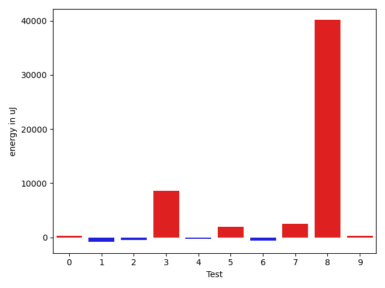

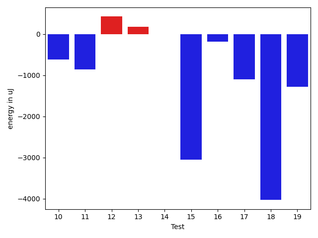

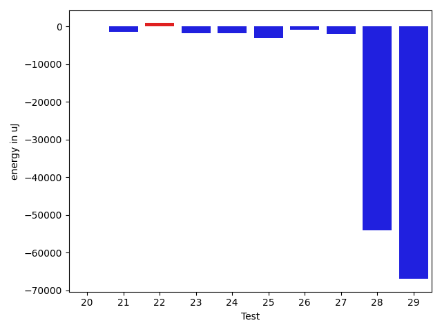

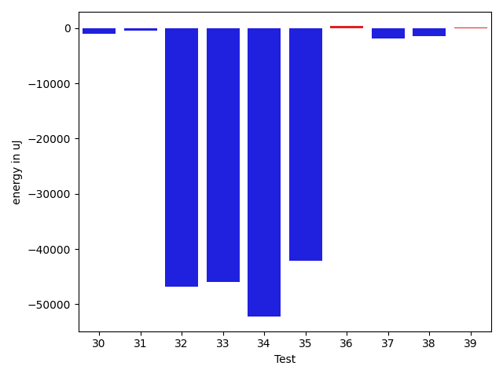

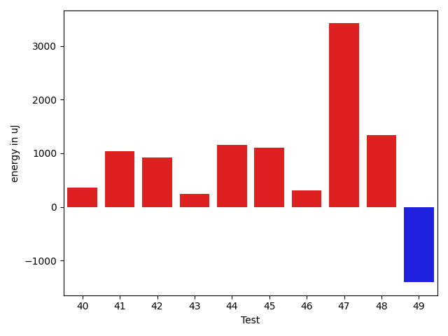

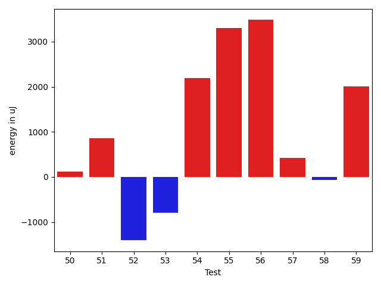

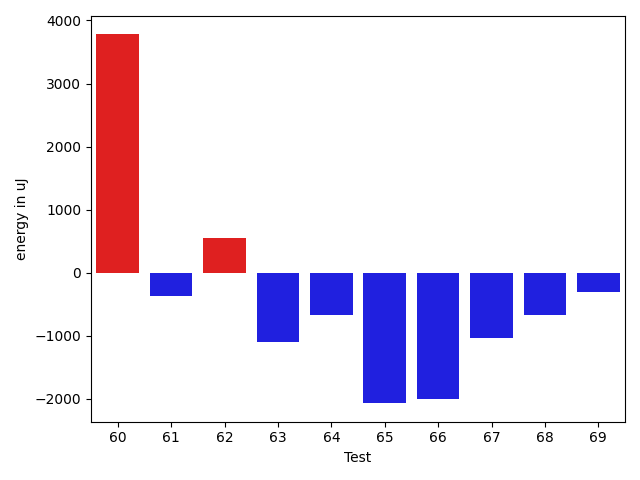

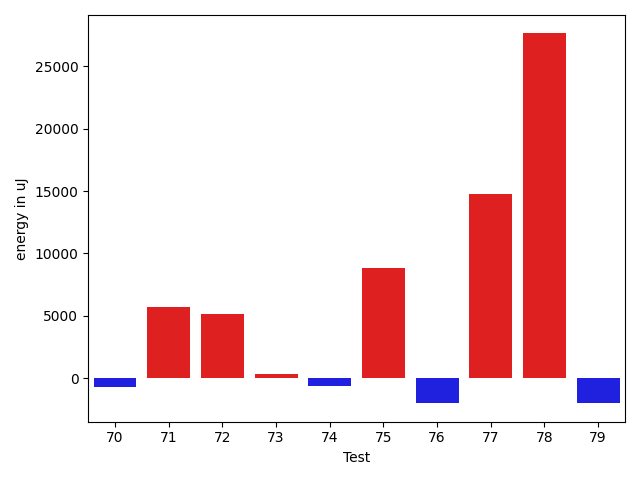

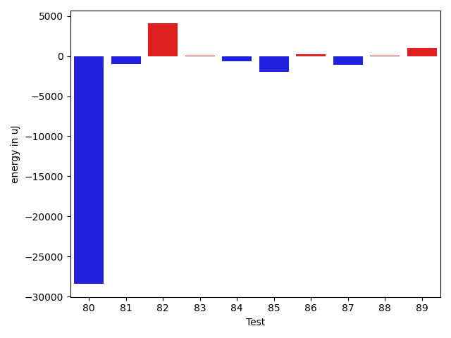

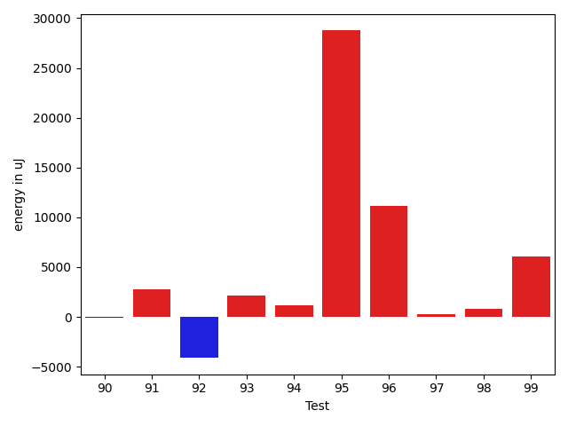

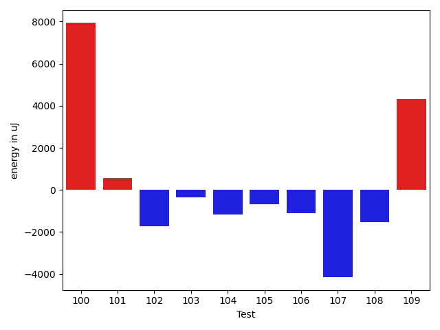

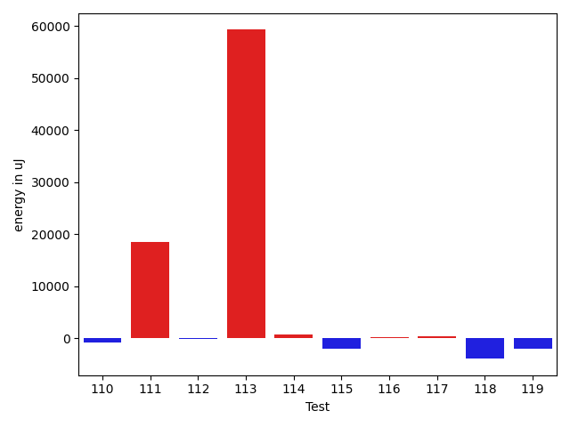

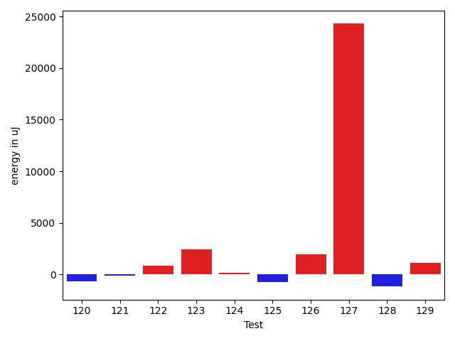

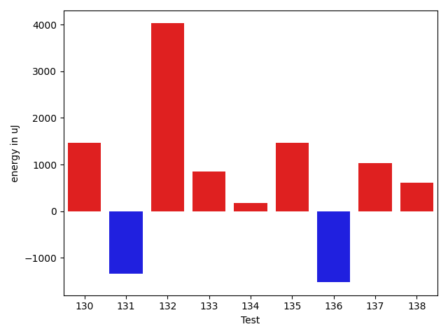

| ID | EnergyV1 | EnergyV2 | DeltaEnergy | σV1 | σV2 |
| --- | --- | --- | --- | --- | --- |
| 0 | 38025 | 39062 | 1037 | 4716.562667148195 | 4238.570676897527 |
| 1 | 39184 | 39124 | -60 | 8013.338574135794 | 4851.090699469784 |
| 2 | 38146 | 37964 | -182 | 4392.197160121316 | 4397.513954542886 |
| 3 | 39978 | 41016 | 1038 | 19677.143284186062 | 31193.65505960832 |
| 4 | 41259 | 40405 | -854 | 6569.615259279315 | 5698.576054879601 |
| 5 | 39612 | 39734 | 122 | 11819.769183186196 | 14727.47277029538 |
| 6 | 39124 | 38330 | -794 | 5891.58236165556 | 5129.726870245005 |
| 7 | 83130 | 86548 | 3418 | 80050.3243620406 | 63621.5321659174 |
| 8 | 40771 | 42053 | 1282 | 264344.2714970621 | 365758.21426876367 |
| 9 | 39368 | 39246 | -122 | 4646.898522145151 | 5244.711038421775 |
| 10 | 39978 | 39367 | -611 | 17959.526000439724 | 14198.048755582344 |
| 11 | 39734 | 38880 | -854 | 4737.2161542019985 | 5515.779943191614 |
| 12 | 37964 | 38391 | 427 | 3771.94326831343 | 4326.823800853966 |
| 13 | 37354 | 37536 | 182 | 4605.796863652195 | 4109.689206430386 |
| 14 | 38452 | 38452 | 0 | 3826.470495287159 | 4768.935323016274 |
| 15 | 39123 | 36072 | -3051 | 3084.575662312229 | 4869.031977713845 |
| 16 | 41138 | 40954 | -184 | 28416.921489170563 | 36432.64854883999 |
| 17 | 40649 | 39551 | -1098 | 4725.650051080109 | 5643.72866753242 |
| 18 | 40222 | 36193 | -4029 | 4917.529652335612 | 4840.338459025761 |
| 19 | 40955 | 39673 | -1282 | 42801.354872221826 | 29847.419947061073 |
| 20 | 40771 | 40833 | 62 | 269099.8182911588 | 473531.64007420867 |
| 21 | 39794 | 38452 | -1342 | 7576.948926110621 | 12889.527763683993 |
| 22 | 39429 | 40344 | 915 | 20735.46950097485 | 4717.409947978228 |
| 23 | 40344 | 38574 | -1770 | 3806.6049646076963 | 4666.448898769804 |
| 24 | 38208 | 36499 | -1709 | 16576.496695941587 | 5213.174868481432 |
| 25 | 42786 | 39673 | -3113 | 19002.36465306688 | 22551.315770112076 |
| 26 | 39673 | 38819 | -854 | 5269.591564747618 | 5446.523693574756 |
| 27 | 38208 | 36194 | -2014 | 4161.020167787546 | 4673.3418265198625 |
| 28 | 134765 | 80750 | -54015 | 30151.698653042942 | 20709.221987141937 |
| 29 | 165771 | 98815 | -66956 | 79102.48174976268 | 75399.69283634058 |
| 30 | 40344 | 38330 | -2014 | 7009.902431996685 | 6896.397482773162 |
| 31 | 40466 | 37842 | -2624 | 3545.27938257608 | 5102.414257876285 |
| 32 | 116882 | 74646 | -42236 | 23719.604316224868 | 17231.782524590963 |
| 33 | 119506 | 77392 | -42114 | 26084.14143744274 | 25769.00217641428 |
| 34 | 141113 | 84899 | -56214 | 32705.149885542676 | 22852.005322466448 |
| 35 | 148987 | 108887 | -40100 | 31978.300325674103 | 33030.812027440734 |
| 36 | 38879 | 39001 | 122 | 4209.716613080859 | 5033.118346754824 |
| 37 | 41077 | 38208 | -2869 | 5306.237104501049 | 5931.682395273705 |
| 38 | 40222 | 37598 | -2624 | 4352.5193350499285 | 4675.518928688584 |
| 39 | 39489 | 39185 | -304 | 4368.869576332075 | 5588.35184222504 |
| 40 | 39673 | 40039 | 366 | 4632.066549448368 | 4659.930384716064 |
| 41 | 38513 | 39550 | 1037 | 4286.627735418401 | 3399.467222392633 |
| 42 | 42297 | 43213 | 916 | 591498.7974621027 | 439299.03510874463 |
| 43 | 41626 | 41870 | 244 | 20921.07058182486 | 17629.890692670986 |
| 44 | 40405 | 41565 | 1160 | 4254.9863019161785 | 4553.58981176141 |
| 45 | 39002 | 40100 | 1098 | 4428.683129962531 | 4702.230211756918 |
| 46 | 37903 | 38208 | 305 | 4442.744646761381 | 5296.633940587733 |
| 47 | 40222 | 43640 | 3418 | 10024.020327279533 | 6155.753428894285 |
| 48 | 39733 | 41076 | 1343 | 4369.735650078875 | 4372.920653563684 |
| 49 | 39917 | 38513 | -1404 | 9515.083267156962 | 5161.902183323516 |
| 50 | 38635 | 38757 | 122 | 4638.620770031031 | 5201.999785667345 |
| 51 | 40710 | 41565 | 855 | 57198.223276135075 | 39526.94994867793 |
| 52 | 42175 | 40772 | -1403 | 13375.021886127886 | 8773.222150938744 |
| 53 | 40161 | 39367 | -794 | 4875.16095278459 | 7190.241687046685 |
| 54 | 39795 | 41992 | 2197 | 24441.086494320512 | 24481.395097191165 |
| 55 | 39551 | 42846 | 3295 | 17259.259401987078 | 14111.878987217984 |
| 56 | 38452 | 41931 | 3479 | 5142.284637887342 | 6701.750770152092 |
| 57 | 39124 | 39551 | 427 | 5390.5500868575255 | 4400.033310503977 |
| 58 | 40528 | 40466 | -62 | 4176.577441163098 | 4472.716387763532 |
| 59 | 39673 | 41686 | 2013 | 10919.598018728597 | 13866.178086676538 |
| 60 | 40039 | 43823 | 3784 | 8145.225384225626 | 6046.006102146282 |
| 61 | 40833 | 40466 | -367 | 8661.013303868029 | 10860.234095919795 |
| 62 | 40100 | 40649 | 549 | 4604.182694825933 | 5244.253600192238 |
| 63 | 39917 | 38818 | -1099 | 3628.80379480966 | 4730.41415293615 |
| 64 | 41565 | 40893 | -672 | 495139.7765991897 | 382129.98482237116 |
| 65 | 40527 | 38452 | -2075 | 4154.6278181409025 | 5279.02357751628 |
| 66 | 42175 | 40161 | -2014 | 3705.3156716623575 | 4326.591573596796 |
| 67 | 40466 | 39428 | -1038 | 4284.9169626323055 | 3919.505532290943 |
| 68 | 42846 | 42175 | -671 | 4559.861985350411 | 6153.552897841127 |
| 69 | 39185 | 38879 | -306 | 5120.009237973969 | 4197.273725363117 |
| 70 | 40039 | 37964 | -2075 | 4674.776961928828 | 8099.2938792573195 |
| 71 | 41809 | 41199 | -610 | 52616.66481148486 | 55698.513798196276 |
| 72 | 41320 | 41076 | -244 | 30742.044444529656 | 43704.25538728658 |
| 73 | 40588 | 40589 | 1 | 16359.522976995917 | 15837.989410792927 |
| 74 | 40649 | 38635 | -2014 | 4667.846348477682 | 8653.646938957714 |
| 75 | 41076 | 42236 | 1160 | 24948.587509821205 | 33303.9685268888 |
| 76 | 39795 | 39306 | -489 | 6306.925676249891 | 4927.723901698169 |
| 77 | 41992 | 42664 | 672 | 443716.56147073157 | 474655.03661276074 |
| 78 | 85266 | 87341 | 2075 | 23134.2845273677 | 220730.24780698912 |
| 79 | 39917 | 39429 | -488 | 3221.496795357307 | 5572.173829269305 |
| 80 | 83252 | 82703 | -549 | 357997.3210207933 | 269406.5140465437 |
| 81 | 42114 | 41992 | -122 | 47640.82667349379 | 42969.11688790255 |
| 82 | 37658 | 38818 | 1160 | 6053.848939488547 | 12680.241390248944 |
| 83 | 38879 | 39306 | 427 | 8695.048870585224 | 8626.870214238223 |
| 84 | 40100 | 38696 | -1404 | 4046.768005401449 | 4699.375537991647 |
| 85 | 41443 | 42297 | 854 | 46296.46046041842 | 46624.42611004838 |
| 86 | 40100 | 39673 | -427 | 3442.1930411853195 | 5250.206091192992 |
| 87 | 40283 | 39306 | -977 | 4295.805017608608 | 5040.402713628699 |
| 88 | 39306 | 39489 | 183 | 4385.581006257777 | 4680.173854205481 |
| 89 | 38147 | 40467 | 2320 | 4185.8850827424685 | 4531.411939689412 |
| 90 | 40954 | 39489 | -1465 | 3899.319575183378 | 4702.104755277961 |
| 91 | 85572 | 79712 | -5860 | 38142.01935849492 | 43573.72771124136 |
| 92 | 40649 | 39856 | -793 | 13251.527790088165 | 8830.149897604608 |
| 93 | 37353 | 39001 | 1648 | 3667.268917290958 | 3789.4936205250433 |
| 94 | 41931 | 41992 | 61 | 36517.66226217919 | 33017.859644401804 |
| 95 | 41931 | 41809 | -122 | 221643.55932073825 | 296483.7384183029 |
| 96 | 40222 | 42115 | 1893 | 40796.1022945044 | 55469.7049940676 |
| 97 | 38818 | 39429 | 611 | 4149.8216560888195 | 4171.832868640709 |
| 98 | 38696 | 38696 | 0 | 4742.923862428418 | 4750.907435937239 |
| 99 | 41748 | 41626 | -122 | 15600.74126864069 | 59002.069327164856 |
| 100 | 182495 | 190429 | 7934 | 350493.51415818924 | 361386.1973710539 |
| 101 | 38635 | 39184 | 549 | 4762.472958673757 | 4457.507381974443 |
| 102 | 41626 | 39917 | -1709 | 12392.466465778898 | 10599.935865011514 |
| 103 | 39307 | 38940 | -367 | 5592.738325443802 | 6980.826919599961 |
| 104 | 39733 | 38574 | -1159 | 8627.227554773031 | 7651.604966351422 |
| 105 | 39795 | 39124 | -671 | 4823.827173261911 | 4678.720291284962 |
| 106 | 42663 | 41565 | -1098 | 33783.03003755786 | 26004.098230905758 |
| 107 | 42175 | 38025 | -4150 | 21760.99985530259 | 14048.763138345565 |
| 108 | 39123 | 37598 | -1525 | 4785.122207304948 | 6185.029988131151 |
| 109 | 82458 | 86792 | 4334 | 80443.83969186564 | 75829.36945901893 |
| 110 | 39550 | 40100 | 550 | 14772.09011873815 | 11909.983004414074 |
| 111 | 40467 | 44129 | 3662 | 6715.748263652713 | 30018.494381491066 |
| 112 | 41381 | 43701 | 2320 | 17020.351789182074 | 15365.045553895186 |
| 113 | 85449 | 90881 | 5432 | 357561.77856660145 | 497621.81848982885 |
| 114 | 45410 | 46875 | 1465 | 25533.38020852567 | 24459.391147500155 |
| 115 | 41260 | 39551 | -1709 | 8655.510569436725 | 4853.807231009743 |
| 116 | 38941 | 39672 | 731 | 6285.901139401443 | 6652.004178492338 |
| 117 | 40955 | 39855 | -1100 | 13167.558002370917 | 15374.967404332565 |
| 118 | 40649 | 39550 | -1099 | 70148.51834341 | 60094.96188895261 |
| 119 | 39490 | 39246 | -244 | 11012.622881605042 | 7126.731199713548 |
| 120 | 44616 | 43945 | -671 | 409231.61810512014 | 271844.5925239443 |
| 121 | 39856 | 39734 | -122 | 10751.998901058692 | 10010.159577292707 |
| 122 | 39978 | 40833 | 855 | 4861.236173026309 | 6755.957677830804 |
| 123 | 42968 | 45410 | 2442 | 522594.119996726 | 598428.1285129018 |
| 124 | 40650 | 40832 | 182 | 3572.422680238299 | 4988.432756918338 |
| 125 | 40344 | 39612 | -732 | 4370.392081603066 | 5479.427328879248 |
| 126 | 77332 | 79285 | 1953 | 26790.838354100444 | 24110.091691237125 |
| 127 | 93994 | 118285 | 24291 | 366450.40611585334 | 358511.14266195084 |
| 128 | 41443 | 40283 | -1160 | 5944.483103138276 | 4497.215610783694 |
| 129 | 41321 | 42481 | 1160 | 747689.0810501879 | 707102.5839846979 |
| 130 | 42602 | 44068 | 1466 | 22695.890046797205 | 19030.302428279036 |
| 131 | 43946 | 42603 | -1343 | 590010.0322938941 | 267677.91387254006 |
| 132 | 38086 | 42114 | 4028 | 453421.62065199116 | 620873.0231825545 |
| 133 | 42602 | 43457 | 855 | 536361.0158600619 | 715792.1854840004 |
| 134 | 42237 | 42419 | 182 | 6264.790919259861 | 4517.291530817996 |
| 135 | 41564 | 43029 | 1465 | 17894.32837914002 | 11769.521500362707 |
| 136 | 44494 | 42968 | -1526 | 462222.18875460967 | 442151.2857212926 |
| 137 | 39977 | 41015 | 1038 | 5189.089132511401 | 6769.620716720924 |
| 138 | 41870 | 42481 | 611 | 23008.782588238268 | 39296.4819446859 |

## Delta Duration per test method

| ID | DurationV1 | DurationsV2 | DeltaDuration |
| --- | --- | --- | --- |
| 0 | 913916.1692307693 | 922711.8 | 8795.630769230775 |
| 1 | 859954.875 | 812248.2884615385 | -47706.5865384615 |
| 2 | 880117.0612244898 | 850372.2692307692 | -29744.791993720573 |
| 3 | 1085067.611111111 | 1352423.0158730159 | 267355.40476190485 |
| 4 | 868226.7884615385 | 896769.3684210526 | 28542.579959514085 |
| 5 | 1278397.4042553192 | 1318170.8817204302 | 39773.477465111064 |
| 6 | 863782.3392857143 | 831067.0576923077 | -32715.281593406573 |
| 7 | 3113208.373737374 | 3356033.5757575757 | 242825.20202020183 |
| 8 | 2609073.03125 | 4033245.915492958 | 1424172.884242958 |
| 9 | 514063.0303030303 | 546090.8518518518 | 32027.82154882152 |
| 10 | 1174242.2318840579 | 1228249.8421052631 | 54007.61022120528 |
| 11 | 833405.2222222222 | 848944.25 | 15539.027777777752 |
| 12 | 759704.575 | 712415.1272727273 | -47289.447727272636 |
| 13 | 647473.9166666666 | 633523.8863636364 | -13950.030303030275 |
| 14 | 893270.4814814815 | 819612.4561403509 | -73658.02534113056 |
| 15 | 502356.2727272727 | 509566.8 | 7210.527272727282 |
| 16 | 1112061.5531914893 | 1349522.3275862068 | 237460.77439471753 |
| 17 | 631654.03125 | 671038.2424242424 | 39384.21117424243 |
| 18 | 679532.76 | 571261.5882352941 | -108271.17176470591 |
| 19 | 1813723.1235955057 | 1479593.3804347827 | -334129.743160723 |
| 20 | 2131031.3846153845 | 3858347.2 | 1727315.8153846157 |
| 21 | 989732.4166666666 | 925822.2549019608 | -63910.16176470579 |
| 22 | 783732.5945945946 | 619739.4814814815 | -163993.1131131131 |
| 23 | 730611.7857142857 | 733526.1904761905 | 2914.4047619048506 |
| 24 | 719384.6296296297 | 519014.7878787879 | -200369.84175084176 |
| 25 | 1057113.6666666667 | 1079108.3818181818 | 21994.71515151509 |
| 26 | 541776.4074074074 | 499380.3333333333 | -42396.0740740741 |
| 27 | 533794.1428571428 | 401566.25 | -132227.89285714284 |
| 28 | 3869739.202020202 | 2550879.0505050505 | -1318860.1515151514 |
| 29 | 5252841.717171717 | 3574812.9393939395 | -1678028.777777778 |
| 30 | 891920.8235294118 | 870134.92 | -21785.903529411764 |
| 31 | 550436.5882352941 | 539092.304347826 | -11344.283887468046 |
| 32 | 3318706.6363636362 | 2194718.0505050505 | -1123988.5858585858 |
| 33 | 3484739.303030303 | 2319548.888888889 | -1165190.4141414142 |
| 34 | 4073557.3333333335 | 2684884.757575758 | -1388672.5757575757 |
| 35 | 4162576.090909091 | 3049994.9292929294 | -1112581.1616161615 |
| 36 | 577055.6857142857 | 653645.2127659575 | 76589.52705167176 |
| 37 | 714639.9285714285 | 687607.24 | -27032.68857142853 |
| 38 | 573212.0 | 622857.5151515151 | 49645.51515151514 |
| 39 | 570826.21875 | 571787.90625 | 961.6875 |
| 40 | 779532.4629629629 | 768515.6 | -11016.862962962943 |
| 41 | 791086.2195121951 | 736448.052631579 | -54638.1668806161 |
| 42 | 7968478.057142857 | 5124567.55882353 | -2843910.498319328 |
| 43 | 1429972.2826086956 | 1386269.6703296704 | -43702.61227902514 |
| 44 | 968439.223880597 | 988568.6290322581 | 20129.40515166102 |
| 45 | 736145.7692307692 | 651134.4545454546 | -85011.31468531466 |
| 46 | 657291.7272727273 | 587787.59375 | -69504.1335227273 |
| 47 | 912965.4390243902 | 715553.375 | -197412.0640243902 |
| 48 | 906976.7454545455 | 889687.7924528302 | -17288.953001715243 |
| 49 | 1001564.1960784313 | 871394.8245614035 | -130169.37151702784 |
| 50 | 761527.0857142857 | 756790.3157894737 | -4736.769924812019 |
| 51 | 1627134.8679245282 | 1174906.9803921569 | -452227.88753237133 |
| 52 | 983627.84 | 678278.75 | -305349.08999999997 |
| 53 | 602768.0333333333 | 733133.487804878 | 130365.45447154471 |
| 54 | 1439847.5862068965 | 1487776.78313253 | 47929.19692563359 |
| 55 | 1162460.1147540985 | 1091005.3768115942 | -71454.73794250423 |
| 56 | 1009910.0158730159 | 1065988.3559322034 | 56078.340059187496 |
| 57 | 739126.3157894737 | 711288.659574468 | -27837.65621500567 |
| 58 | 750116.7959183673 | 772121.9056603773 | 22005.109742010012 |
| 59 | 1170061.3582089553 | 1111499.9857142856 | -58561.37249466963 |
| 60 | 820713.6451612903 | 742256.9090909091 | -78456.73607038124 |
| 61 | 1160060.6543209876 | 1126141.4871794872 | -33919.167141500395 |
| 62 | 505381.26086956525 | 439832.6666666667 | -65548.59420289856 |
| 63 | 750360.5614035088 | 772947.8048780488 | 22587.243474540068 |
| 64 | 4398814.97752809 | 3266044.643678161 | -1132770.3338499288 |
| 65 | 589181.2592592592 | 502059.71428571426 | -87121.54497354495 |
| 66 | 532932.8333333334 | 544831.1481481482 | 11898.314814814832 |
| 67 | 823562.4565217391 | 753256.1224489796 | -70306.33407275949 |
| 68 | 608034.8846153846 | 554995.7727272727 | -53039.11188811192 |
| 69 | 570976.7142857143 | 546940.7619047619 | -24035.952380952425 |
| 70 | 893829.5084745763 | 900215.8405797102 | 6386.332105133915 |
| 71 | 1801629.4838709678 | 1916325.180851064 | 114695.69698009617 |
| 72 | 1304548.875 | 1480134.4268292682 | 175585.55182926822 |
| 73 | 1386503.829787234 | 1429823.6145833333 | 43319.78479609918 |
| 74 | 823235.8103448276 | 844529.7818181819 | 21293.971473354264 |
| 75 | 1199496.8727272728 | 1442115.04 | 242618.16727272724 |
| 76 | 812259.2553191489 | 829333.1034482758 | 17073.84812912694 |
| 77 | 3947894.2325581396 | 4361991.37037037 | 414097.13781223074 |
| 78 | 2594512.272727273 | 3262711.111111111 | 668198.8383838381 |
| 79 | 532449.6129032258 | 579692.59375 | 47242.98084677418 |
| 80 | 4978230.325581395 | 3981408.8735632184 | -996821.4520181767 |
| 81 | 1363520.8285714285 | 1342386.8205128205 | -21134.008058608044 |
| 82 | 1035506.1159420289 | 1151518.7160493827 | 116012.60010735376 |
| 83 | 1131084.4025974027 | 1174736.357142857 | 43651.954545454355 |
| 84 | 614302.6428571428 | 651688.2307692308 | 37385.58791208791 |
| 85 | 1479147.140625 | 1609219.723076923 | 130072.58245192305 |
| 86 | 555704.8518518518 | 630284.8055555555 | 74579.95370370371 |
| 87 | 556671.6060606061 | 582981.4666666667 | 26309.860606060596 |
| 88 | 596192.1142857143 | 657743.0 | 61550.88571428566 |
| 89 | 537338.7407407408 | 503088.92307692306 | -34249.817663817725 |
| 90 | 536061.6153846154 | 616001.8965517242 | 79940.2811671088 |
| 91 | 2550740.3232323234 | 2644033.0808080807 | 93292.75757575734 |
| 92 | 1121270.238095238 | 947415.1333333333 | -173855.1047619048 |
| 93 | 537381.3888888889 | 483965.6 | -53415.7888888889 |
| 94 | 1102816.1219512196 | 1148911.8409090908 | 46095.7189578712 |
| 95 | 1878328.0 | 2792921.679245283 | 914593.6792452829 |
| 96 | 997428.8918918918 | 1455809.3333333333 | 458380.4414414414 |
| 97 | 682246.40625 | 542439.0322580645 | -139807.3739919355 |
| 98 | 660977.9230769231 | 617537.375 | -43440.54807692312 |
| 99 | 1303834.1898734176 | 1533838.5487804879 | 230004.35890707024 |
| 100 | 7792348.626262627 | 7903536.242424242 | 111187.61616161559 |
| 101 | 837976.5 | 834558.5185185185 | -3417.98148148146 |
| 102 | 930868.8363636363 | 872906.6326530612 | -57962.20371057512 |
| 103 | 1040446.0163934426 | 1000645.7971014492 | -39800.21929199342 |
| 104 | 1184372.7662337662 | 1123902.225 | -60470.541233766126 |
| 105 | 681422.975 | 642979.2857142857 | -38443.689285714296 |
| 106 | 1526236.2307692308 | 1453972.5232558139 | -72263.70751341688 |
| 107 | 1118706.6818181819 | 895463.3396226416 | -223243.34219554032 |
| 108 | 979699.2363636363 | 944508.6428571428 | -35190.59350649349 |
| 109 | 3144210.272727273 | 3367679.717171717 | 223469.44444444403 |
| 110 | 1241334.3012048192 | 1198743.0333333334 | -42591.26787148579 |
| 111 | 951645.3846153846 | 1560912.1791044776 | 609266.794489093 |
| 112 | 1342674.1463414633 | 1347162.7564102565 | 4488.610068793176 |
| 113 | 4289935.303030303 | 5933365.414141414 | 1643430.111111111 |
| 114 | 1696138.894736842 | 1744053.9896907217 | 47915.094953879714 |
| 115 | 1000947.3636363636 | 1046881.2638888889 | 45933.90025252523 |
| 116 | 1008310.1194029851 | 991576.5151515151 | -16733.60425146995 |
| 117 | 1318538.0 | 1322463.046511628 | 3925.0465116279665 |
| 118 | 1798723.463414634 | 1763360.0574712644 | -35363.405943369726 |
| 119 | 1156312.5487804879 | 1146587.738095238 | -9724.810685249744 |
| 120 | 3474646.4520547944 | 2565001.1764705884 | -909645.275584206 |
| 121 | 1007510.3857142857 | 1020002.9420289855 | 12492.556314699817 |
| 122 | 895937.1698113207 | 886342.5483870967 | -9594.621424223995 |
| 123 | 5104691.015873016 | 6622967.457142857 | 1518276.441269841 |
| 124 | 827193.2 | 840768.6101694915 | 13575.410169491544 |
| 125 | 722508.4857142858 | 691090.731707317 | -31417.754006968695 |
| 126 | 2214621.494949495 | 1982176.7676767677 | -232444.7272727273 |
| 127 | 4607643.181818182 | 4743927.686868687 | 136284.5050505055 |
| 128 | 838695.7368421053 | 835906.5555555555 | -2789.1812865497777 |
| 129 | 9880310.423076924 | 8948703.92857143 | -931606.4945054948 |
| 130 | 1394453.1604938272 | 1392831.9166666667 | -1621.2438271604478 |
| 131 | 7394947.444444444 | 2064525.0 | -5330422.444444444 |
| 132 | 3769888.9411764704 | 7788389.9130434785 | 4018500.971867008 |
| 133 | 5233776.791666667 | 11557051.16 | 6323274.368333333 |
| 134 | 705973.7714285714 | 617371.28 | -88602.4914285714 |
| 135 | 1148760.5 | 861754.95 | -287005.55000000005 |
| 136 | 4499918.720588235 | 3949680.3076923075 | -550238.4128959277 |
| 137 | 837565.4807692308 | 870879.4255319149 | 33313.94476268417 |
| 138 | 904189.0434782609 | 1166524.261904762 | 262335.21842650103 |

## Misc.

| ID | Test Class | Test Method |
| --- | --- | --- |
| 0 | com.google.gson.functional.CustomTypeAdaptersTest | testCustomAdapterInvokedForCollectionElementDeserialization |
| 1 | com.google.gson.functional.CustomTypeAdaptersTest | testCustomTypeAdapterAppliesToSubClassesSerializedAsBaseClass |
| 2 | com.google.gson.functional.CustomTypeAdaptersTest | testCustomAdapterInvokedForMapElementSerializationWithType |
| 3 | com.google.gson.functional.CustomTypeAdaptersTest | testCustomNestedSerializers |
| 4 | com.google.gson.functional.CustomTypeAdaptersTest | testCustomNestedDeserializers |
| 5 | com.google.gson.functional.CustomTypeAdaptersTest | testCustomTypeAdapterDoesNotAppliesToSubClasses |
| 6 | com.google.gson.functional.CustomTypeAdaptersTest | testCustomByteArraySerializer |
| 7 | com.google.gson.functional.CustomTypeAdaptersTest | testCustomDeserializerForLong |
| 8 | com.google.gson.functional.CustomTypeAdaptersTest | testCustomSerializers |
| 9 | com.google.gson.functional.CustomTypeAdaptersTest | testCustomAdapterInvokedForCollectionElementSerialization |
| 10 | com.google.gson.functional.CustomTypeAdaptersTest | testCustomAdapterInvokedForCollectionElementSerializationWithType |
| 11 | com.google.gson.functional.CustomTypeAdaptersTest | testCustomByteArrayDeserializerAndInstanceCreator |
| 12 | com.google.gson.functional.CustomTypeAdaptersTest | testEnsureCustomSerializerNotInvokedForNullValues |
| 13 | com.google.gson.functional.CustomTypeAdaptersTest | testEnsureCustomDeserializerNotInvokedForNullValues |
| 14 | com.google.gson.functional.CustomTypeAdaptersTest | testCustomAdapterInvokedForMapElementDeserialization |
| 15 | com.google.gson.functional.CustomTypeAdaptersTest | testCustomAdapterInvokedForMapElementSerialization |
| 16 | com.google.gson.functional.CustomTypeAdaptersTest | testCustomDeserializers |
| 17 | com.google.gson.MixedStreamTest | testReaderDoesNotMutateState |
| 18 | com.google.gson.MixedStreamTest | testWriteClosed |
| 19 | com.google.gson.MixedStreamTest | testWriteHtmlSafe |
| 20 | com.google.gson.MixedStreamTest | testWriteMixedStreamed |
| 21 | com.google.gson.MixedStreamTest | testReadClosed |
| 22 | com.google.gson.MixedStreamTest | testWriteInvalidState |
| 23 | com.google.gson.MixedStreamTest | testWriteDoesNotMutateState |
| 24 | com.google.gson.MixedStreamTest | testReadNulls |
| 25 | com.google.gson.MixedStreamTest | testReadMixedStreamed |
| 26 | com.google.gson.MixedStreamTest | testReadInvalidState |
| 27 | com.google.gson.MixedStreamTest | testWriteNulls |
| 28 | com.google.gson.functional.DefaultTypeAdaptersTest | testDateSerializationWithPatternNotOverridenByTypeAdapter |
| 29 | com.google.gson.functional.DefaultTypeAdaptersTest | testDateSerializationWithPattern |
| 30 | com.google.gson.functional.DefaultTypeAdaptersTest | testBitSetDeserialization |
| 31 | com.google.gson.functional.DefaultTypeAdaptersTest | testDefaultGregorianCalendarDeserialization |
| 32 | com.google.gson.functional.DefaultTypeAdaptersTest | testSqlDateSerialization |
| 33 | com.google.gson.functional.DefaultTypeAdaptersTest | testTimestampSerialization |
| 34 | com.google.gson.functional.DefaultTypeAdaptersTest | testDateDeserializationWithPattern |
| 35 | com.google.gson.functional.DefaultTypeAdaptersTest | testDateSerializationInCollection |
| 36 | com.google.gson.functional.DefaultTypeAdaptersTest | testDefaultCalendarDeserialization |
| 37 | com.google.gson.functional.DefaultTypeAdaptersTest | testSetSerialization |
| 38 | com.google.gson.functional.DefaultTypeAdaptersTest | testBitSetSerialization |
| 39 | com.google.gson.functional.NullObjectAndFieldTest | testCustomTypeAdapterPassesNullSerialization |
| 40 | com.google.gson.functional.NullObjectAndFieldTest | testCustomTypeAdapterPassesNullDesrialization |
| 41 | com.google.gson.functional.NullObjectAndFieldTest | testExplicitSerializationOfNullCollectionMembers |
| 42 | com.google.gson.functional.NullObjectAndFieldTest | testTopLevelNullObjectSerialization |
| 43 | com.google.gson.functional.NullObjectAndFieldTest | testExplicitSerializationOfNullArrayMembers |
| 44 | com.google.gson.functional.NullObjectAndFieldTest | testNullWrappedPrimitiveMemberDeserialization |
| 45 | com.google.gson.functional.NullObjectAndFieldTest | testExplicitSerializationOfNullStringMembers |
| 46 | com.google.gson.functional.NullObjectAndFieldTest | testCustomSerializationOfNulls |
| 47 | com.google.gson.functional.NullObjectAndFieldTest | testExplicitDeserializationOfNulls |
| 48 | com.google.gson.functional.NullObjectAndFieldTest | testNullWrappedPrimitiveMemberSerialization |
| 49 | com.google.gson.functional.NullObjectAndFieldTest | testPrintPrintingObjectWithNulls |
| 50 | com.google.gson.functional.NullObjectAndFieldTest | testPrintPrintingArraysWithNulls |
| 51 | com.google.gson.functional.NullObjectAndFieldTest | testExplicitSerializationOfNulls |
| 52 | com.google.gson.functional.NullObjectAndFieldTest | testTopLevelNullObjectDeserialization |
| 53 | com.google.gson.functional.NullObjectAndFieldTest | testExplicitNullSetsFieldToNullDuringDeserialization |
| 54 | com.google.gson.functional.MapTest | testSerializeMaps |
| 55 | com.google.gson.functional.MapTest | testMapSubclassDeserialization |
| 56 | com.google.gson.functional.MapTest | testCustomSerializerForSpecificMapType |
| 57 | com.google.gson.functional.MapTest | testMapSerializationWithNullValuesSerialized |
| 58 | com.google.gson.functional.MapTest | testMapSerializationWithNullValueButSerializeNulls |
| 59 | com.google.gson.functional.ReadersWritersTest | testReadWriteTwoObjects |
| 60 | com.google.gson.functional.ReadersWritersTest | testTopLevelNullObjectSerializationWithWriterAndSerializeNulls |
| 61 | com.google.gson.functional.ReadersWritersTest | testReadWriteTwoStrings |
| 62 | com.google.gson.functional.ReadersWritersTest | testTopLevelNullObjectDeserializationWithReaderAndSerializeNulls |
| 63 | com.google.gson.functional.FieldExclusionTest | testDefaultNestedStaticClassIncluded |
| 64 | com.google.gson.functional.FieldExclusionTest | testDefaultInnerClassExclusion |
| 65 | com.google.gson.functional.PrimitiveTest | testDoubleInfinitySerialization |
| 66 | com.google.gson.functional.PrimitiveTest | testLongAsStringDeserialization |
| 67 | com.google.gson.functional.PrimitiveTest | testHtmlCharacterSerialization |
| 68 | com.google.gson.functional.PrimitiveTest | testDoubleNaNSerialization |
| 69 | com.google.gson.functional.PrimitiveTest | testNegativeInfinitySerialization |
| 70 | com.google.gson.functional.CustomDeserializerTest | testCustomDeserializerReturnsNullForArrayElementsForArrayField |
| 71 | com.google.gson.functional.CustomDeserializerTest | testCustomDeserializerReturnsNullForTopLevelPrimitives |
| 72 | com.google.gson.functional.CustomDeserializerTest | testJsonTypeFieldBasedDeserialization |
| 73 | com.google.gson.functional.CustomDeserializerTest | testCustomDeserializerReturnsNullForPrimitiveFields |
| 74 | com.google.gson.functional.CustomDeserializerTest | testCustomDeserializerReturnsNull |
| 75 | com.google.gson.functional.CustomDeserializerTest | testCustomDeserializerReturnsNullForTopLevelObject |
| 76 | com.google.gson.functional.CustomDeserializerTest | testCustomDeserializerReturnsNullForArrayElements |
| 77 | com.google.gson.JsonParserTest | testReadWriteTwoObjects |
| 78 | com.google.gson.functional.NamingPolicyTest | testGsonWithNonDefaultFieldNamingPolicySerialization |
| 79 | com.google.gson.functional.NamingPolicyTest | testGsonWithLowerCaseDashPolicyDeserialiation |
| 80 | com.google.gson.functional.NamingPolicyTest | testGsonDuplicateNameUsingSerializedNameFieldNamingPolicySerialization |
| 81 | com.google.gson.functional.NamingPolicyTest | testGsonWithNonDefaultFieldNamingPolicyDeserialiation |
| 82 | com.google.gson.functional.NamingPolicyTest | testComplexFieldNameStrategy |
| 83 | com.google.gson.functional.NamingPolicyTest | testDeprecatedNamingStrategy |
| 84 | com.google.gson.functional.NamingPolicyTest | testGsonWithLowerCaseDashPolicySerialization |
| 85 | com.google.gson.functional.NamingPolicyTest | testGsonWithSerializedNameFieldNamingPolicySerialization |
| 86 | com.google.gson.functional.NamingPolicyTest | testGsonWithLowerCaseUnderscorePolicySerialization |
| 87 | com.google.gson.functional.NamingPolicyTest | testGsonWithUpperCamelCaseSpacesPolicySerialiation |
| 88 | com.google.gson.functional.NamingPolicyTest | testGsonWithSerializedNameFieldNamingPolicyDeserialization |
| 89 | com.google.gson.functional.NamingPolicyTest | testGsonWithUpperCamelCaseSpacesPolicyDeserialiation |
| 90 | com.google.gson.functional.NamingPolicyTest | testGsonWithLowerCaseUnderscorePolicyDeserialiation |
| 91 | com.google.gson.functional.ObjectTest | testSingletonLists |
| 92 | com.google.gson.functional.ObjectTest | testInnerClassDeserialization |
| 93 | com.google.gson.functional.ObjectTest | testJsonObjectSerialization |
| 94 | com.google.gson.functional.SecurityTest | testJsonWithNonExectuableTokenSerialization |
| 95 | com.google.gson.functional.SecurityTest | testNonExecutableJsonSerialization |
| 96 | com.google.gson.functional.SecurityTest | testNonExecutableJsonDeserialization |
| 97 | com.google.gson.functional.SecurityTest | testJsonWithNonExectuableTokenWithConfiguredGsonDeserialization |
| 98 | com.google.gson.functional.SecurityTest | testJsonWithNonExectuableTokenWithRegularGsonDeserialization |
| 99 | com.google.gson.functional.EnumTest | testEnumSubclassWithRegisteredTypeAdapter |
| 100 | com.google.gson.functional.VersioningTest | testVersionedUntilSerialization |
| 101 | com.google.gson.functional.VersioningTest | testVersionedClassesDeserialization |
| 102 | com.google.gson.functional.VersioningTest | testVersionedGsonWithUnversionedClassesSerialization |
| 103 | com.google.gson.functional.VersioningTest | testVersionedClassesSerialization |
| 104 | com.google.gson.functional.VersioningTest | testVersionedGsonMixingSinceAndUntilSerialization |
| 105 | com.google.gson.functional.VersioningTest | testIgnoreLaterVersionClassDeserialization |
| 106 | com.google.gson.functional.VersioningTest | testVersionedUntilDeserialization |
| 107 | com.google.gson.functional.VersioningTest | testVersionedGsonWithUnversionedClassesDeserialization |
| 108 | com.google.gson.functional.VersioningTest | testVersionedGsonMixingSinceAndUntilDeserialization |
| 109 | com.google.gson.functional.MapAsArrayTypeAdapterTest | testMultipleEnableComplexKeyRegistrationHasNoEffect |
| 110 | com.google.gson.functional.MapAsArrayTypeAdapterTest | testMapWithTypeVariableDeserialization |
| 111 | com.google.gson.functional.MapAsArrayTypeAdapterTest | testTwoTypesCollapseToOneDeserialize |
| 112 | com.google.gson.functional.MapAsArrayTypeAdapterTest | testMapWithTypeVariableSerialization |
| 113 | com.google.gson.functional.TypeVariableTest | testAdvancedTypeVariables |
| 114 | com.google.gson.functional.TypeVariableTest | testTypeVariablesViaTypeParameter |
| 115 | com.google.gson.functional.TypeVariableTest | testBasicTypeVariables |
| 116 | com.google.gson.functional.ParameterizedTypesTest | testParameterizedTypeWithReaderDeserialization |
| 117 | com.google.gson.functional.ParameterizedTypesTest | testParameterizedTypeWithCustomSerializer |
| 118 | com.google.gson.functional.ParameterizedTypesTest | testParameterizedTypeDeserialization |
| 119 | com.google.gson.functional.ParameterizedTypesTest | testParameterizedTypesWithCustomDeserializer |
| 120 | com.google.gson.functional.InstanceCreatorTest | testInstanceCreatorReturnsBaseType |
| 121 | com.google.gson.functional.InstanceCreatorTest | testInstanceCreatorReturnsSubTypeForField |
| 122 | com.google.gson.functional.InstanceCreatorTest | testInstanceCreatorReturnsSubTypeForTopLevelObject |
| 123 | com.google.gson.functional.CustomSerializerTest | testSubClassSerializerInvokedForBaseClassFieldsHoldingSubClassInstances |
| 124 | com.google.gson.functional.CustomSerializerTest | testSerializerReturnsNull |
| 125 | com.google.gson.functional.CustomSerializerTest | testBaseClassSerializerInvokedForBaseClassFields |
| 126 | com.google.gson.functional.UncategorizedTest | testReturningDerivedClassesDuringDeserialization |
| 127 | com.google.gson.functional.TypeHierarchyAdapterTest | testTypeHierarchy |
| 128 | com.google.gson.functional.TypeHierarchyAdapterTest | testRegisterSuperTypeFirst |
| 129 | com.google.gson.GsonBuilderTest | testCreatingMoreThanOnce |
| 130 | com.google.gson.functional.EscapingTest | testGsonAcceptsEscapedAndNonEscapedJsonDeserialization |
| 131 | com.google.gson.DefaultMapJsonSerializerTest | testNonEmptyMapSerialization |
| 132 | com.google.gson.JsonObjectTest | testWritePropertyWithEmptyStringName |
| 133 | com.google.gson.JsonObjectTest | testPropertyWithQuotes |
| 134 | com.google.gson.functional.ArrayTest | testNullsInArrayWithSerializeNullPropertySetSerialization |
| 135 | com.google.gson.functional.PrintFormattingTest | testJsonObjectWithNullValuesSerialized |
| 136 | com.google.gson.CommentsTest | testParseComments |
| 137 | com.google.gson.functional.ExclusionStrategyFunctionalTest | testExclusionStrategyWithMode |
| 138 | com.google.gson.functional.ExclusionStrategyFunctionalTest | testExclusionStrategyDeserialization |

| Test | IterationV1 | IterationV2 | DeltaIteration |
| --- | --- | --- | --- |
| 0 | 65 | 60 | -5 |
| 1 | 48 | 52 | 4 |
| 2 | 49 | 52 | 3 |
| 3 | 72 | 63 | -9 |
| 4 | 52 | 57 | 5 |
| 5 | 94 | 93 | -1 |
| 6 | 56 | 52 | -4 |
| 7 | 99 | 99 | 0 |
| 8 | 64 | 71 | 7 |
| 9 | 33 | 27 | -6 |
| 10 | 69 | 76 | 7 |
| 11 | 54 | 44 | -10 |
| 12 | 40 | 55 | 15 |
| 13 | 36 | 44 | 8 |
| 14 | 54 | 57 | 3 |
| 15 | 22 | 25 | 3 |
| 16 | 47 | 58 | 11 |
| 17 | 32 | 33 | 1 |
| 18 | 25 | 34 | 9 |
| 19 | 89 | 92 | 3 |
| 20 | 65 | 60 | -5 |
| 21 | 60 | 51 | -9 |
| 22 | 37 | 27 | -10 |
| 23 | 42 | 42 | 0 |
| 24 | 27 | 33 | 6 |
| 25 | 57 | 55 | -2 |
| 26 | 27 | 21 | -6 |
| 27 | 14 | 20 | 6 |
| 28 | 99 | 99 | 0 |
| 29 | 99 | 99 | 0 |
| 30 | 51 | 50 | -1 |
| 31 | 34 | 23 | -11 |
| 32 | 99 | 99 | 0 |
| 33 | 99 | 99 | 0 |
| 34 | 99 | 99 | 0 |
| 35 | 99 | 99 | 0 |
| 36 | 35 | 47 | 12 |
| 37 | 28 | 25 | -3 |
| 38 | 22 | 33 | 11 |
| 39 | 32 | 32 | 0 |
| 40 | 54 | 50 | -4 |
| 41 | 41 | 38 | -3 |
| 42 | 35 | 34 | -1 |
| 43 | 92 | 91 | -1 |
| 44 | 67 | 62 | -5 |
| 45 | 39 | 44 | 5 |
| 46 | 33 | 32 | -1 |
| 47 | 41 | 32 | -9 |
| 48 | 55 | 53 | -2 |
| 49 | 51 | 57 | 6 |
| 50 | 35 | 38 | 3 |
| 51 | 53 | 51 | -2 |
| 52 | 25 | 24 | -1 |
| 53 | 30 | 41 | 11 |
| 54 | 87 | 83 | -4 |
| 55 | 61 | 69 | 8 |
| 56 | 63 | 59 | -4 |
| 57 | 38 | 47 | 9 |
| 58 | 49 | 53 | 4 |
| 59 | 67 | 70 | 3 |
| 60 | 31 | 22 | -9 |
| 61 | 81 | 78 | -3 |
| 62 | 23 | 21 | -2 |
| 63 | 57 | 41 | -16 |
| 64 | 89 | 87 | -2 |
| 65 | 27 | 21 | -6 |
| 66 | 30 | 27 | -3 |
| 67 | 46 | 49 | 3 |
| 68 | 26 | 22 | -4 |
| 69 | 28 | 21 | -7 |
| 70 | 59 | 69 | 10 |
| 71 | 93 | 94 | 1 |
| 72 | 72 | 82 | 10 |
| 73 | 94 | 96 | 2 |
| 74 | 58 | 55 | -3 |
| 75 | 55 | 50 | -5 |
| 76 | 47 | 58 | 11 |
| 77 | 86 | 81 | -5 |
| 78 | 99 | 99 | 0 |
| 79 | 31 | 32 | 1 |
| 80 | 86 | 87 | 1 |
| 81 | 35 | 39 | 4 |
| 82 | 69 | 81 | 12 |
| 83 | 77 | 84 | 7 |
| 84 | 28 | 39 | 11 |
| 85 | 64 | 65 | 1 |
| 86 | 27 | 36 | 9 |
| 87 | 33 | 30 | -3 |
| 88 | 35 | 29 | -6 |
| 89 | 27 | 26 | -1 |
| 90 | 26 | 29 | 3 |
| 91 | 99 | 99 | 0 |
| 92 | 63 | 60 | -3 |
| 93 | 18 | 20 | 2 |
| 94 | 41 | 44 | 3 |
| 95 | 55 | 53 | -2 |
| 96 | 37 | 30 | -7 |
| 97 | 32 | 31 | -1 |
| 98 | 26 | 32 | 6 |
| 99 | 79 | 82 | 3 |
| 100 | 99 | 99 | 0 |
| 101 | 54 | 54 | 0 |
| 102 | 55 | 49 | -6 |
| 103 | 61 | 69 | 8 |
| 104 | 77 | 80 | 3 |
| 105 | 40 | 35 | -5 |
| 106 | 91 | 86 | -5 |
| 107 | 44 | 53 | 9 |
| 108 | 55 | 56 | 1 |
| 109 | 99 | 99 | 0 |
| 110 | 83 | 90 | 7 |
| 111 | 52 | 67 | 15 |
| 112 | 82 | 78 | -4 |
| 113 | 99 | 99 | 0 |
| 114 | 95 | 97 | 2 |
| 115 | 66 | 72 | 6 |
| 116 | 67 | 66 | -1 |
| 117 | 90 | 86 | -4 |
| 118 | 82 | 87 | 5 |
| 119 | 82 | 84 | 2 |
| 120 | 73 | 68 | -5 |
| 121 | 70 | 69 | -1 |
| 122 | 53 | 62 | 9 |
| 123 | 63 | 70 | 7 |
| 124 | 55 | 59 | 4 |
| 125 | 35 | 41 | 6 |
| 126 | 99 | 99 | 0 |
| 127 | 99 | 99 | 0 |
| 128 | 57 | 45 | -12 |
| 129 | 26 | 28 | 2 |
| 130 | 81 | 84 | 3 |
| 131 | 54 | 52 | -2 |
| 132 | 17 | 23 | 6 |
| 133 | 24 | 25 | 1 |
| 134 | 35 | 25 | -10 |
| 135 | 22 | 20 | -2 |
| 136 | 68 | 78 | 10 |
| 137 | 52 | 47 | -5 |
| 138 | 46 | 42 | -4 |

| Time Label | Time (s) |
| --- | --- |
| Selection | 29.300684452056885 |
| Injection | 15.594814538955688 |
| Total | 1234.5629017353058 |

