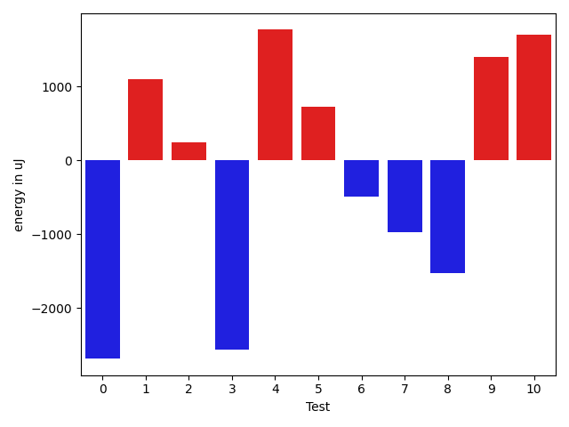
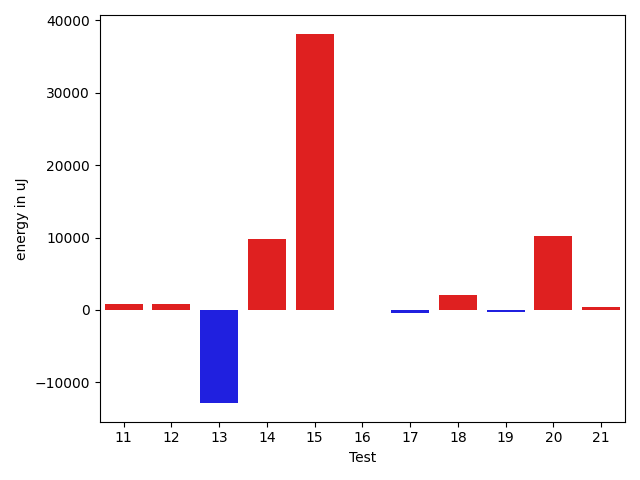
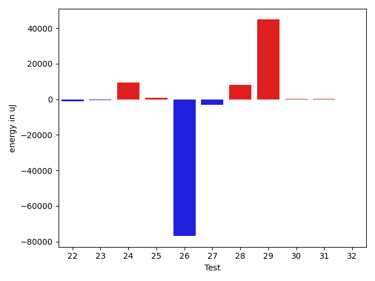
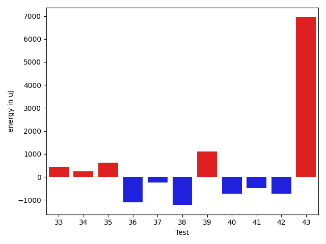
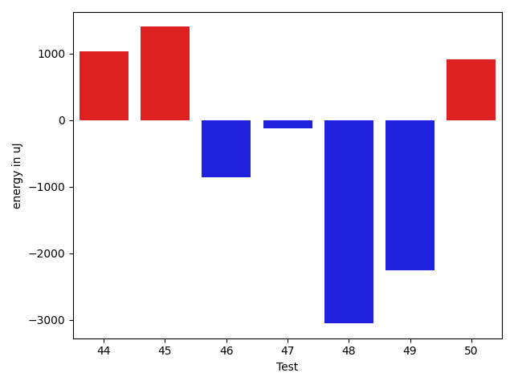

# gson befcfd

https://github.com/google/gson/commit/befcfd

## Delta Energy per test method

| ID | EnergyV1 | EnergyV2 | DeltaEnergy | σV1 | σV2 |
| --- | --- | --- | --- | --- | --- |
| 0 | 68298 | 65612 | -2686 | 74229.73476630899 | 65879.90252082383 |
| 1 | 36804 | 37903 | 1099 | 4512.9352854167055 | 5060.82067887826 |
| 2 | 37964 | 38208 | 244 | 3599.116656295167 | 4861.205689212756 |
| 3 | 44861 | 42298 | -2563 | 36050.946745511865 | 34138.011608209476 |
| 4 | 37781 | 39551 | 1770 | 9220.440791545636 | 8726.905315509366 |
| 5 | 38574 | 39306 | 732 | 8469.544615818642 | 8024.08228588742 |
| 6 | 37476 | 36987 | -489 | 4029.091727433321 | 6731.0871843754085 |
| 7 | 112427 | 111450 | -977 | 23886.884160856815 | 21359.66282753807 |
| 8 | 118041 | 116516 | -1525 | 25646.515453870532 | 22705.22170747589 |
| 9 | 114380 | 115783 | 1403 | 27066.425916222848 | 25929.281968734525 |
| 10 | 150818 | 152526 | 1708 | 30444.72450108465 | 27821.41325556971 |
| 11 | 152526 | 153747 | 1221 | 47146.26255918774 | 46706.052828100874 |
| 12 | 37232 | 37354 | 122 | 5699.210750920051 | 5138.932567052319 |
| 13 | 76171 | 72387 | -3784 | 69938.38352921366 | 24290.58308326122 |
| 14 | 39063 | 39367 | 304 | 24974.012890327114 | 66030.19734398171 |
| 15 | 38757 | 40100 | 1343 | 554630.6078738376 | 603859.4729864431 |
| 16 | 37597 | 39245 | 1648 | 4549.65701158636 | 4891.093589372422 |
| 17 | 37414 | 36682 | -732 | 5347.706816928376 | 5577.270356678608 |
| 18 | 35217 | 36682 | 1465 | 3457.1904868672204 | 5745.127002059028 |
| 19 | 36377 | 37048 | 671 | 10479.205161343758 | 8585.825904877376 |
| 20 | 71960 | 73181 | 1221 | 41317.16082118965 | 93541.75125947077 |
| 21 | 36010 | 36438 | 428 | 8123.971402993008 | 7003.394198398606 |
| 22 | 74646 | 73181 | -1465 | 34726.536258336804 | 27871.26501587145 |
| 23 | 38391 | 37597 | -794 | 5424.671156378448 | 5262.035016388254 |
| 24 | 107910 | 96618 | -11292 | 530087.4114175328 | 552904.5003922717 |
| 25 | 36499 | 37903 | 1404 | 6577.6591143835385 | 7623.410137893758 |
| 26 | 80200 | 83191 | 2991 | 483573.8142933623 | 233247.66311558563 |
| 27 | 39917 | 39856 | -61 | 21387.61498620585 | 19957.652737840897 |
| 28 | 75684 | 77820 | 2136 | 70731.9199230504 | 74438.51884988879 |
| 29 | 92529 | 111877 | 19348 | 524523.0515150486 | 594856.6663914688 |
| 30 | 37110 | 36682 | -428 | 7078.062073553484 | 7557.249052336429 |
| 31 | 38208 | 39184 | 976 | 14481.98131654966 | 15163.31770729256 |
| 32 | 41137 | 39612 | -1525 | 28241.62995545251 | 26590.351092644083 |
| 33 | 37964 | 38391 | 427 | 5123.9946736158545 | 4528.4282025349385 |
| 34 | 37659 | 37902 | 243 | 4129.05423311166 | 3967.4999306080645 |
| 35 | 38147 | 38758 | 611 | 10777.325732697362 | 12711.535582368531 |
| 36 | 40466 | 39368 | -1098 | 121640.95630330362 | 124866.65374777246 |
| 37 | 39672 | 39429 | -243 | 3479.5801500803705 | 3607.380997141359 |
| 38 | 73792 | 72571 | -1221 | 70780.28353270206 | 73380.0449043434 |
| 39 | 35889 | 36988 | 1099 | 4406.501076719536 | 4370.057488096718 |
| 40 | 38758 | 38025 | -733 | 15619.412396644393 | 15762.759430819196 |
| 41 | 39184 | 38697 | -487 | 59778.40634907115 | 59641.75276213444 |
| 42 | 39307 | 38574 | -733 | 140080.58643431077 | 76872.96372489729 |
| 43 | 69519 | 76476 | 6957 | 57501.49444235845 | 52302.65035776181 |
| 44 | 37781 | 38819 | 1038 | 4188.808418440599 | 3562.742453922311 |
| 45 | 39368 | 40771 | 1403 | 103018.648848865 | 97203.3512874657 |
| 46 | 37659 | 36804 | -855 | 6560.6166834945425 | 52355.79723151938 |
| 47 | 36804 | 36682 | -122 | 3232.011901121975 | 3997.919686715651 |
| 48 | 42603 | 39551 | -3052 | 109961.02111217297 | 102352.95999296966 |
| 49 | 149841 | 147583 | -2258 | 100815.90934560735 | 81080.42297892121 |
| 50 | 37597 | 38513 | 916 | 6548.84428706051 | 7580.08550377853 |

## Delta Duration per test method

| ID | DurationV1 | DurationsV2 | DeltaDuration |
| --- | --- | --- | --- |
| 0 | 2426570.0505050505 | 2239468.7474747472 | -187101.3030303032 |
| 1 | 920789.9347826086 | 828913.8478260869 | -91876.08695652173 |
| 2 | 575828.9615384615 | 567348.9523809524 | -8480.009157509077 |
| 3 | 1829293.380952381 | 1597131.9361702127 | -232161.44478216837 |
| 4 | 1194092.7605633803 | 1172435.2972972973 | -21657.46326608304 |
| 5 | 1241857.1923076923 | 1215296.2674418604 | -26560.924865831854 |
| 6 | 1103399.9848484849 | 1105679.4193548388 | 2279.434506353922 |
| 7 | 3476910.1919191917 | 3416253.1414141413 | -60657.05050505046 |
| 8 | 3712597.202020202 | 3650074.797979798 | -62522.404040403664 |
| 9 | 3549409.9494949495 | 3477694.6666666665 | -71715.28282828303 |
| 10 | 4559665.03030303 | 4390995.545454546 | -168669.4848484844 |
| 11 | 4769422.03030303 | 4740896.4949494945 | -28525.535353535786 |
| 12 | 980473.9677419355 | 967280.921875 | -13193.045866935514 |
| 13 | 2587602.129032258 | 2166243.3296703296 | -421358.79936192837 |
| 14 | 1479351.6344086023 | 1797236.172839506 | 317884.5384309038 |
| 15 | 6175667.674418605 | 7224006.0121951215 | 1048338.3377765166 |
| 16 | 585492.1538461539 | 555889.375 | -29602.778846153873 |
| 17 | 1177240.16 | 1115664.8764044943 | -61575.283595505636 |
| 18 | 1084901.4307692307 | 1058262.042253521 | -26639.388515709667 |
| 19 | 1273644.6516853932 | 1275489.8795180724 | 1845.2278326791711 |
| 20 | 2313512.515151515 | 2683812.595959596 | 370300.08080808073 |
| 21 | 1153801.2894736843 | 1156228.0857142857 | 2426.796240601456 |
| 22 | 2367120.5757575757 | 2377831.727272727 | 10711.151515151374 |
| 23 | 1031708.8676470588 | 959839.0135135135 | -71869.8541335453 |
| 24 | 6920175.454545454 | 7120442.404040404 | 200266.94949494954 |
| 25 | 1083549.7397260275 | 1070949.6865671643 | -12600.053158863215 |
| 26 | 5721789.141414141 | 3389240.373737374 | -2332548.7676767674 |
| 27 | 1717467.1041666667 | 1666565.3163265307 | -50901.787840136094 |
| 28 | 3249706.474747475 | 3569080.868686869 | 319374.39393939404 |
| 29 | 6617818.353535353 | 7977447.2727272725 | 1359628.9191919193 |
| 30 | 1044394.3623188406 | 1110061.704225352 | 65667.34190651146 |
| 31 | 1374917.2325581396 | 1394974.9759036144 | 20057.743345474824 |
| 32 | 1776814.2346938776 | 1723951.9191919193 | -52862.315501958365 |
| 33 | 951798.224489796 | 898344.914893617 | -53453.30959617894 |
| 34 | 824446.0238095238 | 754078.875 | -70367.14880952379 |
| 35 | 1026847.125 | 984155.6779661017 | -42691.44703389832 |
| 36 | 2312925.5555555555 | 2576102.0476190476 | 263176.49206349207 |
| 37 | 605125.7083333334 | 595473.4146341464 | -9652.293699186994 |
| 38 | 2849970.202020202 | 3074335.4545454546 | 224365.25252525276 |
| 39 | 895601.3260869565 | 842728.8113207547 | -52872.51476620184 |
| 40 | 1388563.4268292682 | 1321370.5617977527 | -67192.86503151548 |
| 41 | 1886760.4603174604 | 1738487.3076923077 | -148273.1526251526 |
| 42 | 3154960.6923076925 | 1360128.025 | -1794832.6673076926 |
| 43 | 2621020.8585858587 | 2517211.5353535353 | -103809.3232323234 |
| 44 | 700960.5675675676 | 677210.6341463415 | -23749.933421226102 |
| 45 | 2056132.1860465116 | 1858264.8181818181 | -197867.36786469352 |
| 46 | 828137.8611111111 | 1042824.1162790698 | 214686.25516795868 |
| 47 | 634702.6923076923 | 631489.8571428572 | -3212.8351648350945 |
| 48 | 2187008.9523809524 | 1955384.857142857 | -231624.09523809538 |
| 49 | 5185052.070707071 | 5003036.454545454 | -182015.61616161652 |
| 50 | 1145516.9054054054 | 1167588.8529411764 | 22071.947535770945 |

## Misc.

| ID | Test Class | Test Method |
| --- | --- | --- |
| 0 | com.google.gson.functional.CustomDeserializerTest | testDefaultConstructorNotCalledOnObject |
| 1 | com.google.gson.functional.CustomDeserializerTest | testDefaultConstructorNotCalledOnField |
| 2 | com.google.gson.functional.StringTest | testEscapingQuotesInStringSerialization |
| 3 | com.google.gson.functional.StringTest | testSingleQuoteInStringSerialization |
| 4 | com.google.gson.functional.ReadersWritersTest | testReadWriteTwoObjects |
| 5 | com.google.gson.functional.ReadersWritersTest | testReadWriteTwoStrings |
| 6 | com.google.gson.functional.DefaultTypeAdaptersTest | testBitSetDeserialization |
| 7 | com.google.gson.functional.DefaultTypeAdaptersTest | testSqlDateSerialization |
| 8 | com.google.gson.functional.DefaultTypeAdaptersTest | testTimestampSerialization |
| 9 | com.google.gson.functional.DefaultTypeAdaptersTest | testDefaultDateDeserializationUsingBuilder |
| 10 | com.google.gson.functional.DefaultTypeAdaptersTest | testDateDeserializationWithPattern |
| 11 | com.google.gson.functional.DefaultTypeAdaptersTest | testDateSerializationInCollection |
| 12 | com.google.gson.functional.EnumTest | testEnumSubclassAsParameterizedType |
| 13 | com.google.gson.functional.EnumTest | testEnumSubclass |
| 14 | com.google.gson.functional.EnumTest | testEnumSubclassWithRegisteredTypeAdapter |
| 15 | com.google.gson.JsonParserTest | testReadWriteTwoObjects |
| 16 | com.google.gson.JsonParserTest | testParseMixedArray |
| 17 | com.google.gson.functional.ParameterizedTypesTest | testVariableTypeArrayDeserialization |
| 18 | com.google.gson.functional.ParameterizedTypesTest | testVariableTypeDeserialization |
| 19 | com.google.gson.functional.ParameterizedTypesTest | testParameterizedTypeGenericArraysDeserialization |
| 20 | com.google.gson.functional.ParameterizedTypesTest | testVariableTypeFieldsAndGenericArraysDeserialization |
| 21 | com.google.gson.functional.ParameterizedTypesTest | testParameterizedTypeWithVariableTypeDeserialization |
| 22 | com.google.gson.functional.ObjectTest | testSingletonLists |
| 23 | com.google.gson.functional.TypeHierarchyAdapterTest | testRegisterSuperTypeFirst |
| 24 | com.google.gson.functional.TypeHierarchyAdapterTest | testTypeHierarchy |
| 25 | com.google.gson.functional.TypeVariableTest | testBasicTypeVariables |
| 26 | com.google.gson.functional.TypeVariableTest | testAdvancedTypeVariables |
| 27 | com.google.gson.functional.TypeVariableTest | testTypeVariablesViaTypeParameter |
| 28 | com.google.gson.functional.MapAsArrayTypeAdapterTest | testMultipleEnableComplexKeyRegistrationHasNoEffect |
| 29 | com.google.gson.functional.MapAsArrayTypeAdapterTest | testSerializeComplexMapWithTypeAdapter |
| 30 | com.google.gson.functional.MapAsArrayTypeAdapterTest | testTwoTypesCollapseToOneDeserialize |
| 31 | com.google.gson.functional.CollectionTest | testFieldIsArrayList |
| 32 | com.google.gson.functional.CollectionTest | testWildcardCollectionField |
| 33 | com.google.gson.functional.CollectionTest | testRawCollectionDeserializationNotAlllowed |
| 34 | com.google.gson.functional.CollectionTest | testRawCollectionOfBagOfPrimitivesNotAllowed |
| 35 | com.google.gson.functional.UncategorizedTest | testGsonInstanceReusableForSerializationAndDeserialization |
| 36 | com.google.gson.functional.UncategorizedTest | testInvalidJsonDeserializationFails |
| 37 | com.google.gson.functional.PrimitiveTest | testQuotedStringSerializationAndDeserialization |
| 38 | com.google.gson.functional.PrimitiveTest | testOverridingDefaultPrimitiveSerialization |
| 39 | com.google.gson.functional.EscapingTest | testGsonDoubleDeserialization |
| 40 | com.google.gson.functional.EscapingTest | testGsonAcceptsEscapedAndNonEscapedJsonDeserialization |
| 41 | com.google.gson.functional.EscapingTest | testEscapingObjectFields |
| 42 | com.google.gson.functional.EscapingTest | testEscapingQuotesInStringArray |
| 43 | com.google.gson.functional.ArrayTest | testArrayOfPrimitivesWithCustomTypeAdapter |
| 44 | com.google.gson.functional.ArrayTest | testArrayWithoutTypeInfoDeserialization |
| 45 | com.google.gson.functional.ArrayTest | testArrayOfObjectsWithoutTypeInfoDeserialization |
| 46 | com.google.gson.GsonTypeAdapterTest | testTypeAdapterThrowsException |
| 47 | com.google.gson.GsonTypeAdapterTest | testTypeAdapterProperlyConvertsTypes |
| 48 | com.google.gson.GsonTypeAdapterTest | testTypeAdapterDoesNotAffectNonAdaptedTypes |
| 49 | com.google.gson.DefaultInetAddressTypeAdapterTest | testInetAddressSerializationAndDeserialization |
| 50 | com.google.gson.functional.NamingPolicyTest | testComplexFieldNameStrategy |

| Test | IterationV1 | IterationV2 | DeltaIteration |
| --- | --- | --- | --- |
| 0 | 99 | 99 | 0 |
| 1 | 46 | 46 | 0 |
| 2 | 26 | 21 | -5 |
| 3 | 42 | 47 | 5 |
| 4 | 71 | 74 | 3 |
| 5 | 78 | 86 | 8 |
| 6 | 66 | 62 | -4 |
| 7 | 99 | 99 | 0 |
| 8 | 99 | 99 | 0 |
| 9 | 99 | 99 | 0 |
| 10 | 99 | 99 | 0 |
| 11 | 99 | 99 | 0 |
| 12 | 62 | 64 | 2 |
| 13 | 93 | 91 | -2 |
| 14 | 93 | 81 | -12 |
| 15 | 86 | 82 | -4 |
| 16 | 26 | 24 | -2 |
| 17 | 75 | 89 | 14 |
| 18 | 65 | 71 | 6 |
| 19 | 89 | 83 | -6 |
| 20 | 99 | 99 | 0 |
| 21 | 76 | 70 | -6 |
| 22 | 99 | 99 | 0 |
| 23 | 68 | 74 | 6 |
| 24 | 99 | 99 | 0 |
| 25 | 73 | 67 | -6 |
| 26 | 99 | 99 | 0 |
| 27 | 96 | 98 | 2 |
| 28 | 99 | 99 | 0 |
| 29 | 99 | 99 | 0 |
| 30 | 69 | 71 | 2 |
| 31 | 86 | 83 | -3 |
| 32 | 98 | 99 | 1 |
| 33 | 49 | 47 | -2 |
| 34 | 42 | 40 | -2 |
| 35 | 56 | 59 | 3 |
| 36 | 45 | 42 | -3 |
| 37 | 24 | 41 | 17 |
| 38 | 99 | 99 | 0 |
| 39 | 46 | 53 | 7 |
| 40 | 82 | 89 | 7 |
| 41 | 63 | 52 | -11 |
| 42 | 39 | 40 | 1 |
| 43 | 99 | 99 | 0 |
| 44 | 37 | 41 | 4 |
| 45 | 43 | 44 | 1 |
| 46 | 36 | 43 | 7 |
| 47 | 26 | 28 | 2 |
| 48 | 21 | 35 | 14 |
| 49 | 99 | 99 | 0 |
| 50 | 74 | 68 | -6 |

| Time Label | Time (s) |
| --- | --- |
| Selection | 28.010051250457764 |
| Injection | 12.875066041946411 |
| Total | 1148.9934067726135 |

