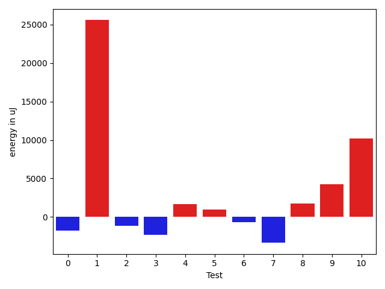
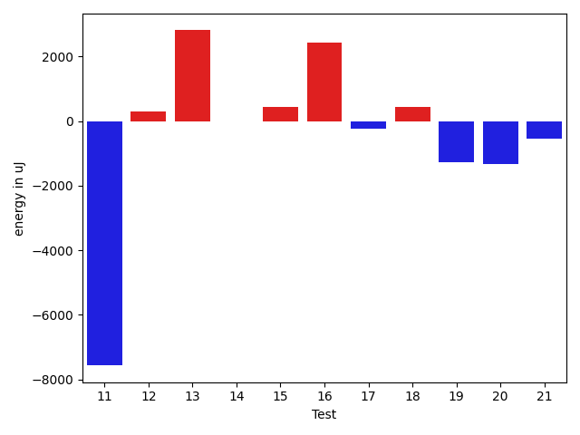
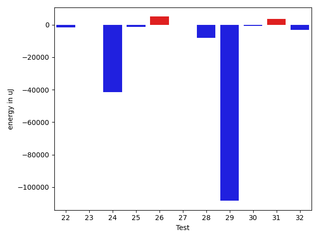
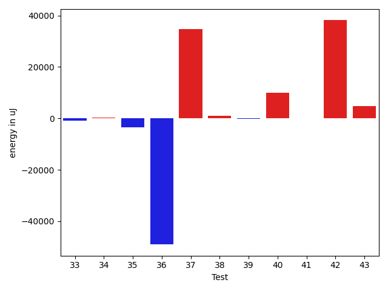
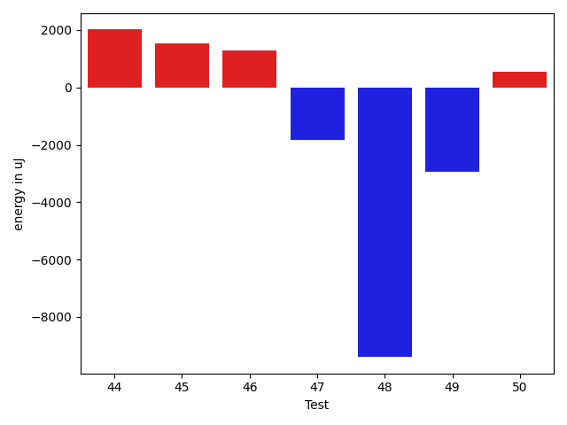

# gson 415437

https://github.com/google/gson/commit/415437

## Delta Energy per test method

| ID | EnergyV1 | EnergyV2 | DeltaEnergy | σV1 | σV2 |
| --- | --- | --- | --- | --- | --- |
| 0 | 38940 | 36010 | -2930 | 4258.454359699288 | 3488.140153912015 |
| 1 | 47485 | 70129 | 22644 | 68830.82311573024 | 108200.76895273372 |
| 2 | 39307 | 38879 | -428 | 4009.471570607554 | 3465.976918310895 |
| 3 | 42481 | 40955 | -1526 | 28820.53632022047 | 21558.712896519715 |
| 4 | 37841 | 39184 | 1343 | 7317.707417168649 | 8788.098963374601 |
| 5 | 39916 | 39794 | -122 | 8083.331344935086 | 10830.130472347466 |
| 6 | 37720 | 37293 | -427 | 6950.917742579025 | 3983.3877755764934 |
| 7 | 109986 | 109802 | -184 | 26143.037182625307 | 22747.41684968949 |
| 8 | 117859 | 115539 | -2320 | 25032.21749278845 | 29337.030543027737 |
| 9 | 112549 | 115905 | 3356 | 25877.49109819555 | 24852.669493221285 |
| 10 | 148376 | 154968 | 6592 | 29137.606739848572 | 30325.978425783283 |
| 11 | 159119 | 151550 | -7569 | 49521.677736061276 | 44451.45151107767 |
| 12 | 35461 | 35766 | 305 | 5970.905109788763 | 4347.242980420576 |
| 13 | 70679 | 73486 | 2807 | 62615.2747993486 | 24848.502047721013 |
| 14 | 38880 | 38879 | -1 | 31257.053614088316 | 75760.60861803466 |
| 15 | 40405 | 40833 | 428 | 499300.75343493087 | 592368.1033576985 |
| 16 | 37537 | 39978 | 2441 | 3990.968995207813 | 3434.2448289914546 |
| 17 | 36377 | 36133 | -244 | 9984.458117160171 | 3947.9292230033393 |
| 18 | 36621 | 37048 | 427 | 13068.775433316714 | 9034.820659928957 |
| 19 | 71961 | 70679 | -1282 | 34166.020065733865 | 51178.979558007195 |
| 20 | 36621 | 35279 | -1342 | 6596.851932622118 | 6348.573426148163 |
| 21 | 36865 | 36316 | -549 | 4130.09170660059 | 5755.503248652606 |
| 22 | 78125 | 77393 | -732 | 25525.626075232685 | 26248.05220828984 |
| 23 | 37781 | 37964 | 183 | 6559.0012322154025 | 5434.557104100077 |
| 24 | 92651 | 90759 | -1892 | 646416.6998773849 | 568750.6680024758 |
| 25 | 37902 | 36926 | -976 | 6931.59341559019 | 4481.523392895174 |
| 26 | 78918 | 83923 | 5005 | 560845.300078437 | 541348.4683175792 |
| 27 | 40405 | 40832 | 427 | 21179.507100516606 | 21062.87411411235 |
| 28 | 81787 | 76843 | -4944 | 63468.98358792518 | 63276.41210766504 |
| 29 | 104309 | 96863 | -7446 | 549856.8807477787 | 289828.4056895991 |
| 30 | 38391 | 37475 | -916 | 7258.661461897882 | 7502.0199174201225 |
| 31 | 36804 | 38330 | 1526 | 13228.173571612131 | 16079.401475841281 |
| 32 | 42664 | 39002 | -3662 | 24013.99857949387 | 22252.131213565903 |
| 33 | 38514 | 38269 | -245 | 4817.706877592286 | 4026.953249214245 |
| 34 | 36988 | 37414 | 426 | 4642.268501969162 | 4339.193772291151 |
| 35 | 39062 | 39184 | 122 | 12817.868603442774 | 10347.540809216454 |
| 36 | 41443 | 41320 | -123 | 173953.399533876 | 96911.50694615357 |
| 37 | 37597 | 38452 | 855 | 82763.85386749459 | 120981.18916838645 |
| 38 | 39124 | 39063 | -61 | 6448.170192166801 | 6298.16326970009 |
| 39 | 37842 | 36377 | -1465 | 3460.7643881085 | 6147.583232209124 |
| 40 | 72143 | 76477 | 4334 | 67991.12071087117 | 68864.62940844815 |
| 41 | 38452 | 38147 | -305 | 4477.2664896535925 | 3937.2225152225014 |
| 42 | 40406 | 39856 | -550 | 74393.91772438768 | 132769.67373282617 |
| 43 | 37903 | 39612 | 1709 | 12466.326932978161 | 15825.328391355933 |
| 44 | 40283 | 42297 | 2014 | 54121.074092062445 | 61949.109976535234 |
| 45 | 37109 | 38635 | 1526 | 4210.956142089594 | 4379.561675730769 |
| 46 | 39368 | 40650 | 1282 | 104178.65505986648 | 105586.80934532144 |
| 47 | 38330 | 36499 | -1831 | 6235.382419301208 | 4947.396309411879 |
| 48 | 156738 | 147339 | -9399 | 71248.11335957787 | 97113.01020797848 |
| 49 | 77270 | 74341 | -2929 | 78545.35889526976 | 61193.42124078142 |
| 50 | 38696 | 39245 | 549 | 3751.941090970563 | 3406.033379191297 |

## Delta Duration per test method

| ID | DurationV1 | DurationsV2 | DeltaDuration |
| --- | --- | --- | --- |
| 0 | 877761.716981132 | 871809.8444444444 | -5951.872536687646 |
| 1 | 2265541.1530612246 | 3014173.1414141413 | 748631.9883529167 |
| 2 | 546962.6428571428 | 583344.375 | 36381.73214285716 |
| 3 | 1359212.4761904762 | 1489202.4054054054 | 129989.92921492923 |
| 4 | 1110136.5492957747 | 1160365.689189189 | 50229.13989341445 |
| 5 | 1209220.1304347827 | 1198294.759493671 | -10925.370941111818 |
| 6 | 1077943.1290322582 | 1068454.6857142858 | -9488.443317972356 |
| 7 | 3454032.595959596 | 3385668.494949495 | -68364.10101010092 |
| 8 | 3636172.3232323234 | 3688631.1919191917 | 52458.86868686834 |
| 9 | 3474149.767676768 | 3453256.0303030303 | -20893.73737373762 |
| 10 | 4431429.909090909 | 4510879.898989899 | 79449.98989898991 |
| 11 | 4787931.808080808 | 4608307.232323232 | -179624.57575757615 |
| 12 | 953216.9298245613 | 952424.25 | -792.6798245613463 |
| 13 | 2311085.9787234045 | 2206638.304347826 | -104447.6743755783 |
| 14 | 1662074.7093023255 | 1731156.8452380951 | 69082.13593576965 |
| 15 | 5396480.51948052 | 6258959.301204819 | 862478.7817242993 |
| 16 | 535370.7692307692 | 566931.7272727273 | 31560.958041958045 |
| 17 | 1168539.3194444445 | 1112266.7375 | -56272.58194444445 |
| 18 | 1249936.3614457832 | 1270034.2926829269 | 20097.931237143697 |
| 19 | 2260268.1515151514 | 2448840.282828283 | 188572.13131313166 |
| 20 | 1122050.1538461538 | 1143054.082191781 | 21003.92834562715 |
| 21 | 1056293.6538461538 | 1062989.888888889 | 6696.235042735236 |
| 22 | 2270455.1616161615 | 2321414.878787879 | 50959.717171717435 |
| 23 | 964502.9508196721 | 976790.390625 | 12287.439805327915 |
| 24 | 8669237.828282828 | 7261949.121212121 | -1407288.7070707064 |
| 25 | 1098144.2615384615 | 1055262.44 | -42881.821538461605 |
| 26 | 6938410.686868687 | 7023043.919191919 | 84633.2323232321 |
| 27 | 1689841.0416666667 | 1699405.6262626264 | 9564.584595959634 |
| 28 | 3258951.777777778 | 2994751.0606060605 | -264200.71717171744 |
| 29 | 7807785.333333333 | 4428999.626262627 | -3378785.7070707064 |
| 30 | 1064688.956521739 | 1052221.7272727273 | -12467.229249011725 |
| 31 | 1358183.511627907 | 1336824.5595238095 | -21358.952104097465 |
| 32 | 1791968.2708333333 | 1722718.3195876288 | -69249.95124570443 |
| 33 | 900438.1 | 892135.431372549 | -8302.668627450941 |
| 34 | 817950.0 | 723942.2894736842 | -94007.71052631584 |
| 35 | 1166897.0227272727 | 944851.5 | -222045.5227272727 |
| 36 | 3681930.380952381 | 1945224.45 | -1736705.930952381 |
| 37 | 1400261.8 | 2638840.3448275863 | 1238578.5448275863 |
| 38 | 763654.96875 | 789796.5 | 26141.53125 |
| 39 | 634396.1 | 649446.8571428572 | 15050.757142857183 |
| 40 | 2773663.3131313133 | 3124823.6565656564 | 351160.3434343431 |
| 41 | 732068.875 | 779793.35 | 47724.47499999998 |
| 42 | 1523112.3421052631 | 2728843.1764705884 | 1205730.8343653253 |
| 43 | 1272952.8636363635 | 1448631.7764705883 | 175678.91283422476 |
| 44 | 1660523.3870967743 | 1944028.142857143 | 283504.75576036866 |
| 45 | 824488.9361702128 | 943158.350877193 | 118669.41470698023 |
| 46 | 2110874.303030303 | 2040168.6041666667 | -70705.69886363647 |
| 47 | 1135128.7916666667 | 1065830.7631578948 | -69298.02850877191 |
| 48 | 5019085.767676768 | 5382219.222222222 | 363133.4545454541 |
| 49 | 3168796.1919191917 | 2624447.1515151514 | -544349.0404040404 |
| 50 | 548385.8095238095 | 567228.7272727273 | 18842.917748917826 |

## Misc.

| ID | Test Class | Test Method |
| --- | --- | --- |
| 0 | com.google.gson.functional.CustomDeserializerTest | testDefaultConstructorNotCalledOnField |
| 1 | com.google.gson.functional.CustomDeserializerTest | testDefaultConstructorNotCalledOnObject |
| 2 | com.google.gson.functional.StringTest | testEscapingQuotesInStringSerialization |
| 3 | com.google.gson.functional.StringTest | testSingleQuoteInStringSerialization |
| 4 | com.google.gson.functional.ReadersWritersTest | testReadWriteTwoObjects |
| 5 | com.google.gson.functional.ReadersWritersTest | testReadWriteTwoStrings |
| 6 | com.google.gson.functional.DefaultTypeAdaptersTest | testBitSetDeserialization |
| 7 | com.google.gson.functional.DefaultTypeAdaptersTest | testSqlDateSerialization |
| 8 | com.google.gson.functional.DefaultTypeAdaptersTest | testTimestampSerialization |
| 9 | com.google.gson.functional.DefaultTypeAdaptersTest | testDefaultDateDeserializationUsingBuilder |
| 10 | com.google.gson.functional.DefaultTypeAdaptersTest | testDateDeserializationWithPattern |
| 11 | com.google.gson.functional.DefaultTypeAdaptersTest | testDateSerializationInCollection |
| 12 | com.google.gson.functional.EnumTest | testEnumSubclassAsParameterizedType |
| 13 | com.google.gson.functional.EnumTest | testEnumSubclass |
| 14 | com.google.gson.functional.EnumTest | testEnumSubclassWithRegisteredTypeAdapter |
| 15 | com.google.gson.JsonParserTest | testReadWriteTwoObjects |
| 16 | com.google.gson.JsonParserTest | testParseMixedArray |
| 17 | com.google.gson.functional.ParameterizedTypesTest | testVariableTypeArrayDeserialization |
| 18 | com.google.gson.functional.ParameterizedTypesTest | testParameterizedTypeGenericArraysDeserialization |
| 19 | com.google.gson.functional.ParameterizedTypesTest | testVariableTypeFieldsAndGenericArraysDeserialization |
| 20 | com.google.gson.functional.ParameterizedTypesTest | testParameterizedTypeWithVariableTypeDeserialization |
| 21 | com.google.gson.functional.ParameterizedTypesTest | testVariableTypeDeserialization |
| 22 | com.google.gson.functional.ObjectTest | testSingletonLists |
| 23 | com.google.gson.functional.TypeHierarchyAdapterTest | testRegisterSuperTypeFirst |
| 24 | com.google.gson.functional.TypeHierarchyAdapterTest | testTypeHierarchy |
| 25 | com.google.gson.functional.TypeVariableTest | testBasicTypeVariables |
| 26 | com.google.gson.functional.TypeVariableTest | testAdvancedTypeVariables |
| 27 | com.google.gson.functional.TypeVariableTest | testTypeVariablesViaTypeParameter |
| 28 | com.google.gson.functional.MapAsArrayTypeAdapterTest | testMultipleEnableComplexKeyRegistrationHasNoEffect |
| 29 | com.google.gson.functional.MapAsArrayTypeAdapterTest | testSerializeComplexMapWithTypeAdapter |
| 30 | com.google.gson.functional.MapAsArrayTypeAdapterTest | testTwoTypesCollapseToOneDeserialize |
| 31 | com.google.gson.functional.CollectionTest | testFieldIsArrayList |
| 32 | com.google.gson.functional.CollectionTest | testWildcardCollectionField |
| 33 | com.google.gson.functional.CollectionTest | testRawCollectionDeserializationNotAlllowed |
| 34 | com.google.gson.functional.CollectionTest | testRawCollectionOfBagOfPrimitivesNotAllowed |
| 35 | com.google.gson.functional.UncategorizedTest | testGsonInstanceReusableForSerializationAndDeserialization |
| 36 | com.google.gson.functional.UncategorizedTest | testInvalidJsonDeserializationFails |
| 37 | com.google.gson.GsonTypeAdapterTest | testTypeAdapterDoesNotAffectNonAdaptedTypes |
| 38 | com.google.gson.GsonTypeAdapterTest | testTypeAdapterThrowsException |
| 39 | com.google.gson.GsonTypeAdapterTest | testTypeAdapterProperlyConvertsTypes |
| 40 | com.google.gson.functional.ArrayTest | testArrayOfPrimitivesWithCustomTypeAdapter |
| 41 | com.google.gson.functional.ArrayTest | testArrayWithoutTypeInfoDeserialization |
| 42 | com.google.gson.functional.ArrayTest | testArrayOfObjectsWithoutTypeInfoDeserialization |
| 43 | com.google.gson.functional.EscapingTest | testGsonAcceptsEscapedAndNonEscapedJsonDeserialization |
| 44 | com.google.gson.functional.EscapingTest | testEscapingObjectFields |
| 45 | com.google.gson.functional.EscapingTest | testGsonDoubleDeserialization |
| 46 | com.google.gson.functional.EscapingTest | testEscapingQuotesInStringArray |
| 47 | com.google.gson.functional.NamingPolicyTest | testComplexFieldNameStrategy |
| 48 | com.google.gson.DefaultInetAddressTypeAdapterTest | testInetAddressSerializationAndDeserialization |
| 49 | com.google.gson.functional.PrimitiveTest | testOverridingDefaultPrimitiveSerialization |
| 50 | com.google.gson.functional.PrimitiveTest | testQuotedStringSerializationAndDeserialization |

| Test | IterationV1 | IterationV2 | DeltaIteration |
| --- | --- | --- | --- |
| 0 | 53 | 45 | -8 |
| 1 | 98 | 99 | 1 |
| 2 | 28 | 24 | -4 |
| 3 | 42 | 37 | -5 |
| 4 | 71 | 74 | 3 |
| 5 | 69 | 79 | 10 |
| 6 | 62 | 70 | 8 |
| 7 | 99 | 99 | 0 |
| 8 | 99 | 99 | 0 |
| 9 | 99 | 99 | 0 |
| 10 | 99 | 99 | 0 |
| 11 | 99 | 99 | 0 |
| 12 | 57 | 48 | -9 |
| 13 | 94 | 92 | -2 |
| 14 | 86 | 84 | -2 |
| 15 | 77 | 83 | 6 |
| 16 | 26 | 22 | -4 |
| 17 | 72 | 80 | 8 |
| 18 | 83 | 82 | -1 |
| 19 | 99 | 99 | 0 |
| 20 | 78 | 73 | -5 |
| 21 | 78 | 63 | -15 |
| 22 | 99 | 99 | 0 |
| 23 | 61 | 64 | 3 |
| 24 | 99 | 99 | 0 |
| 25 | 65 | 75 | 10 |
| 26 | 99 | 99 | 0 |
| 27 | 96 | 99 | 3 |
| 28 | 99 | 99 | 0 |
| 29 | 99 | 99 | 0 |
| 30 | 69 | 66 | -3 |
| 31 | 86 | 84 | -2 |
| 32 | 96 | 97 | 1 |
| 33 | 50 | 51 | 1 |
| 34 | 40 | 38 | -2 |
| 35 | 44 | 50 | 6 |
| 36 | 42 | 40 | -2 |
| 37 | 30 | 29 | -1 |
| 38 | 32 | 34 | 2 |
| 39 | 20 | 28 | 8 |
| 40 | 99 | 99 | 0 |
| 41 | 40 | 40 | 0 |
| 42 | 38 | 51 | 13 |
| 43 | 88 | 85 | -3 |
| 44 | 62 | 63 | 1 |
| 45 | 47 | 57 | 10 |
| 46 | 33 | 48 | 15 |
| 47 | 72 | 76 | 4 |
| 48 | 99 | 99 | 0 |
| 49 | 99 | 99 | 0 |
| 50 | 21 | 22 | 1 |

| Time Label | Time (s) |
| --- | --- |
| Selection | 28.22694420814514 |
| Injection | 12.94815993309021 |
| Total | 1147.7963681221008 |

