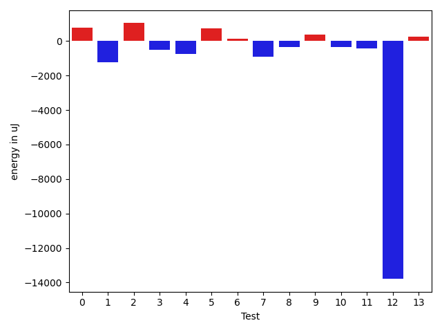
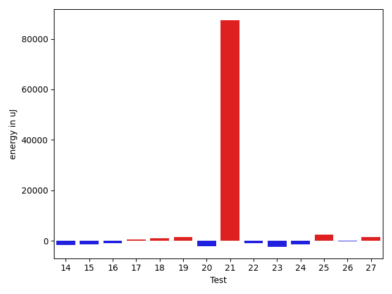
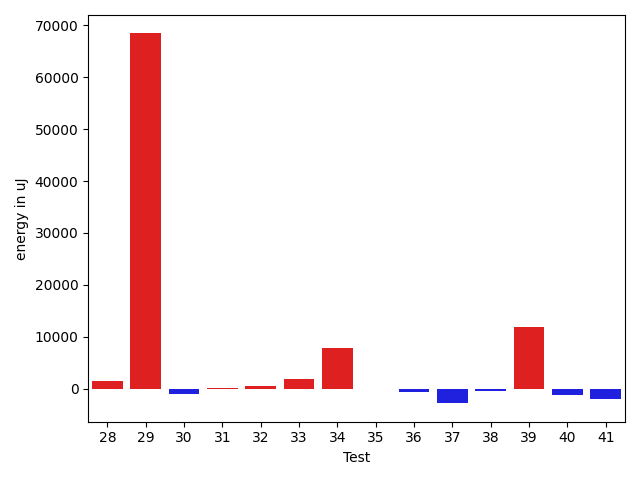
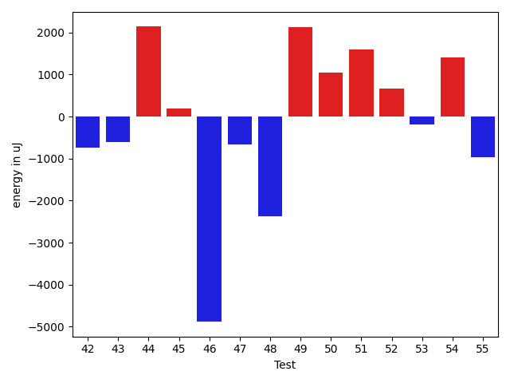
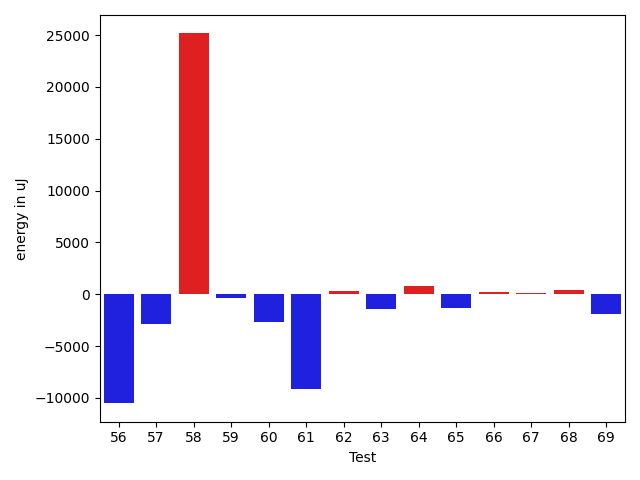
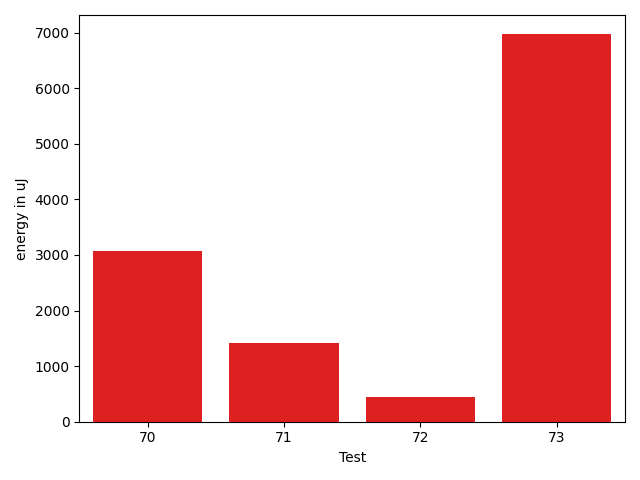

# gson 9cf579

https://github.com/google/gson/commit/9cf579

## Delta Energy per test method

| ID | EnergyV1 | EnergyV2 | DeltaEnergy | σV1 | σV2 |
| --- | --- | --- | --- | --- | --- |
| 0 | 35583 | 36377 | 794 | 4208.708748200789 | 4117.832072582525 |
| 1 | 39856 | 38635 | -1221 | 22098.361284538616 | 18055.784102018537 |
| 2 | 36255 | 37292 | 1037 | 4366.73963867563 | 4030.056235592851 |
| 3 | 38085 | 37597 | -488 | 29200.99867018537 | 29888.032435659734 |
| 4 | 36438 | 35706 | -732 | 4043.1666592678794 | 7182.4846107277435 |
| 5 | 36743 | 37475 | 732 | 4507.243439145741 | 3890.6074646894817 |
| 6 | 37293 | 37414 | 121 | 4081.4190468573515 | 4057.472569782433 |
| 7 | 37354 | 36438 | -916 | 17737.995931792968 | 17943.78220102561 |
| 8 | 36254 | 35888 | -366 | 3924.328994049755 | 3727.39702917731 |
| 9 | 36316 | 36682 | 366 | 6271.231501642607 | 4828.9166702058765 |
| 10 | 36743 | 36377 | -366 | 4913.102950249477 | 3970.512976266855 |
| 11 | 36927 | 36499 | -428 | 5937.542654626593 | 3403.052670234313 |
| 12 | 53650 | 39856 | -13794 | 22313.506076230024 | 23379.64743216888 |
| 13 | 38269 | 38513 | 244 | 16219.338314902529 | 23217.565266170543 |
| 14 | 37353 | 35950 | -1403 | 4765.623887094008 | 4245.090561642143 |
| 15 | 36743 | 36438 | -305 | 6807.201540090081 | 3429.806649586509 |
| 16 | 37536 | 36316 | -1220 | 4257.919819716633 | 4071.8642741650897 |
| 17 | 35400 | 35339 | -61 | 3687.2899740537823 | 3666.580830364988 |
| 18 | 35522 | 37353 | 1831 | 4165.248485761363 | 4256.15486675126 |
| 19 | 36987 | 36926 | -61 | 3553.286482538331 | 4530.177148043226 |
| 20 | 36926 | 36133 | -793 | 5116.690319272149 | 3826.4005714683526 |
| 21 | 41077 | 39551 | -1526 | 374267.4618128253 | 561449.2401877625 |
| 22 | 39612 | 38574 | -1038 | 5134.332546093752 | 5085.16299055719 |
| 23 | 39978 | 39185 | -793 | 7949.269617576958 | 5021.816458941036 |
| 24 | 37720 | 36255 | -1465 | 4284.141672606981 | 5239.396208833237 |
| 25 | 36743 | 38268 | 1525 | 3377.2386960355643 | 5231.103468012801 |
| 26 | 36316 | 36377 | 61 | 2957.03069182528 | 4739.975563211666 |
| 27 | 67016 | 64208 | -2808 | 356275.8422451532 | 351153.3882874181 |
| 28 | 39185 | 38574 | -611 | 17747.61092119396 | 18702.198254362927 |
| 29 | 39673 | 40466 | 793 | 381668.79036308604 | 526042.7851519951 |
| 30 | 38879 | 37171 | -1708 | 3899.640588695246 | 4246.295064608783 |
| 31 | 38879 | 39672 | 793 | 12750.682760632222 | 13650.99830654063 |
| 32 | 38086 | 37414 | -672 | 4803.508081484707 | 4017.241098058536 |
| 33 | 36438 | 38025 | 1587 | 8294.551927137687 | 8966.287503221285 |
| 34 | 38513 | 38757 | 244 | 61301.234699062254 | 77365.91365052343 |
| 35 | 37232 | 37475 | 243 | 7434.994457351969 | 6918.364772912639 |
| 36 | 76537 | 77942 | 1405 | 29506.073007239374 | 33088.9322777003 |
| 37 | 36316 | 38819 | 2503 | 18025.664906918282 | 11811.816661022132 |
| 38 | 38818 | 37475 | -1343 | 5139.2986301364335 | 4510.261325953859 |
| 39 | 40832 | 39978 | -854 | 125800.93789970106 | 142627.77047980792 |
| 40 | 37048 | 37719 | 671 | 37678.201534117215 | 36870.94793735156 |
| 41 | 39611 | 38696 | -915 | 20809.955101571628 | 20060.35889871862 |
| 42 | 39734 | 39001 | -733 | 442948.5804076647 | 240907.5759926033 |
| 43 | 40283 | 39673 | -610 | 23755.47353768094 | 20886.213694980637 |
| 44 | 38085 | 40222 | 2137 | 4575.511136474263 | 4971.806157638872 |
| 45 | 40527 | 40710 | 183 | 4050.482108714886 | 4424.806818903553 |
| 46 | 86547 | 81665 | -4882 | 648810.8236049473 | 306716.7842474188 |
| 47 | 37354 | 36682 | -672 | 4203.014964666421 | 4714.66597686078 |
| 48 | 39978 | 37598 | -2380 | 20713.278260655014 | 13342.579740310022 |
| 49 | 38879 | 41015 | 2136 | 19903.715404364022 | 18164.865481567995 |
| 50 | 37414 | 38452 | 1038 | 4314.886001553227 | 4194.923021518105 |
| 51 | 37841 | 39429 | 1588 | 39099.02966791272 | 56524.870045442956 |
| 52 | 37415 | 38086 | 671 | 19621.54766023458 | 18939.476076091552 |
| 53 | 38757 | 38574 | -183 | 3340.0356877184117 | 4098.016347188476 |
| 54 | 38391 | 39795 | 1404 | 109623.72439878008 | 15477.862045789387 |
| 55 | 38269 | 37293 | -976 | 8950.743426589599 | 9388.656064704744 |
| 56 | 49621 | 46570 | -3051 | 121354.67670393763 | 107368.30514427394 |
| 57 | 39551 | 39856 | 305 | 96361.7745784643 | 84111.44607861043 |
| 58 | 39734 | 41381 | 1647 | 93640.0081526684 | 124394.85856597933 |
| 59 | 40955 | 39795 | -1160 | 116739.28551828294 | 117246.65284931034 |
| 60 | 39184 | 38025 | -1159 | 14292.532021078483 | 11311.330396860432 |
| 61 | 40100 | 39856 | -244 | 66096.91715935672 | 47776.246916571035 |
| 62 | 36926 | 37171 | 245 | 5176.374290213711 | 5014.22921164247 |
| 63 | 37842 | 37963 | 121 | 22800.7376999566 | 23517.10772282274 |
| 64 | 36621 | 37476 | 855 | 3379.6102903556266 | 4786.537415042319 |
| 65 | 38757 | 38147 | -610 | 5104.745648069832 | 3862.6095550022224 |
| 66 | 38269 | 38635 | 366 | 3858.3453445097416 | 3773.8695711513974 |
| 67 | 37537 | 37963 | 426 | 4476.046053901143 | 3696.212599621025 |
| 68 | 36804 | 36682 | -122 | 3779.2972795427468 | 3788.9506539758436 |
| 69 | 40650 | 38513 | -2137 | 3905.1481841082227 | 5301.321659062033 |
| 70 | 39246 | 36682 | -2564 | 4479.007404843692 | 21553.062211533073 |
| 71 | 38818 | 38269 | -549 | 5449.147269057475 | 10017.338711374316 |
| 72 | 34973 | 37536 | 2563 | 4346.470579818122 | 4645.195361205147 |
| 73 | 38024 | 39429 | 1405 | 28203.237010030436 | 30671.52880010115 |

## Delta Duration per test method

| ID | DurationV1 | DurationsV2 | DeltaDuration |
| --- | --- | --- | --- |
| 0 | 860920.725490196 | 678801.6341463415 | -182119.09134385455 |
| 1 | 1633083.2142857143 | 1498739.4893617022 | -134343.7249240121 |
| 2 | 783218.0 | 762831.4857142858 | -20386.51428571425 |
| 3 | 1410743.1666666667 | 1110507.450980392 | -300235.7156862747 |
| 4 | 879953.6730769231 | 794682.8510638297 | -85270.82201309339 |
| 5 | 970153.1886792453 | 967271.7454545455 | -2881.4432246998185 |
| 6 | 871452.7804878049 | 869602.7391304348 | -1850.0413573700935 |
| 7 | 1360524.6904761905 | 1309081.8076923077 | -51442.882783882786 |
| 8 | 783854.0975609756 | 719577.4545454546 | -64276.643015521 |
| 9 | 1047714.9726027397 | 1031865.6753246753 | -15849.29727806442 |
| 10 | 816379.1632653062 | 804944.6382978724 | -11434.524967433768 |
| 11 | 987739.2857142857 | 985307.1 | -2432.1857142857043 |
| 12 | 1873005.6041666667 | 1816983.8105263158 | -56021.79364035092 |
| 13 | 893141.2702702703 | 1001406.1111111111 | 108264.84084084083 |
| 14 | 728280.8157894737 | 698578.3055555555 | -29702.510233918205 |
| 15 | 1002091.9245283019 | 940568.7966101695 | -61523.127918132464 |
| 16 | 840802.3333333334 | 871763.918367347 | 30961.58503401361 |
| 17 | 606040.5483870967 | 588641.36 | -17399.188387096743 |
| 18 | 661732.2972972973 | 647971.7878787878 | -13760.509418509435 |
| 19 | 671932.7647058824 | 696429.6857142857 | 24496.921008403297 |
| 20 | 637500.2333333333 | 661429.7777777778 | 23929.544444444473 |
| 21 | 3305959.153846154 | 5941430.780487805 | 2635471.6266416507 |
| 22 | 554016.4285714285 | 541835.8076923077 | -12180.620879120775 |
| 23 | 1037289.0833333334 | 834702.1515151515 | -202586.93181818188 |
| 24 | 649045.3225806452 | 575796.2692307692 | -73249.05334987596 |
| 25 | 458030.1 | 459682.0416666667 | 1651.9416666667094 |
| 26 | 501567.45454545453 | 432407.25 | -69160.20454545453 |
| 27 | 3356668.787878788 | 3407837.3571428573 | 51168.5692640692 |
| 28 | 1488689.8842105262 | 1526998.7659574468 | 38308.881746920524 |
| 29 | 3264187.6395348837 | 5186279.787234043 | 1922092.147699159 |
| 30 | 914303.512195122 | 880702.2641509434 | -33601.24804417859 |
| 31 | 1414364.4117647058 | 1400890.322580645 | -13474.089184060693 |
| 32 | 598659.2777777778 | 583820.875 | -14838.402777777752 |
| 33 | 1128545.2465753425 | 1155631.4347826086 | 27086.188207266154 |
| 34 | 1819663.054945055 | 2133943.888888889 | 314280.83394383406 |
| 35 | 1144531.4767441861 | 1195841.7349397591 | 51310.258195573 |
| 36 | 2610357.787878788 | 2621139.484848485 | 10781.696969696786 |
| 37 | 1103408.8529411764 | 923292.1 | -180116.7529411764 |
| 38 | 798981.125 | 760660.2777777778 | -38320.84722222225 |
| 39 | 2397377.511111111 | 2811550.205128205 | 414172.6940170941 |
| 40 | 1375337.7301587302 | 1283373.7666666666 | -91963.96349206357 |
| 41 | 1586312.6354166667 | 1551387.0520833333 | -34925.58333333349 |
| 42 | 5247315.066666666 | 2063219.8055555555 | -3184095.261111111 |
| 43 | 1242246.465116279 | 1110146.1515151516 | -132100.31360112736 |
| 44 | 531634.3 | 526932.8888888889 | -4701.411111111171 |
| 45 | 550410.6315789474 | 554198.2307692308 | 3787.599190283334 |
| 46 | 9079847.929292928 | 4065575.1515151514 | -5014272.777777777 |
| 47 | 1028766.5 | 930480.380952381 | -98286.11904761905 |
| 48 | 1417648.3243243243 | 1108141.6865671643 | -309506.63775716 |
| 49 | 1321776.011627907 | 1363832.7529411765 | 42056.741313269595 |
| 50 | 798363.76 | 893454.5952380953 | 95090.83523809526 |
| 51 | 1344179.737704918 | 1865901.018181818 | 521721.28047690005 |
| 52 | 1268650.657142857 | 1179158.486111111 | -89492.17103174608 |
| 53 | 872145.725490196 | 858377.6428571428 | -13768.082633053185 |
| 54 | 2501868.212121212 | 864706.9722222222 | -1637161.2398989897 |
| 55 | 1052146.9682539683 | 1070209.9622641508 | 18062.994010182563 |
| 56 | 3098455.0 | 2822851.0505050505 | -275603.94949494954 |
| 57 | 2139330.4032258065 | 2111572.1944444445 | -27758.208781362046 |
| 58 | 1888874.046511628 | 2887061.54 | 998187.4934883721 |
| 59 | 2333314.4 | 2391419.108108108 | 58104.708108108025 |
| 60 | 1129089.1636363636 | 1183656.517857143 | 54567.35422077938 |
| 61 | 1658352.322580645 | 1588901.810810811 | -69450.51176983421 |
| 62 | 745044.4146341464 | 679838.3225806452 | -65206.09205350117 |
| 63 | 1317812.8666666667 | 1271238.5 | -46574.3666666667 |
| 64 | 655826.1481481482 | 639075.64 | -16750.50814814819 |
| 65 | 499436.1176470588 | 513239.8823529412 | 13803.764705882408 |
| 66 | 630190.775 | 676443.1290322581 | 46252.35403225804 |
| 67 | 525680.0952380953 | 594859.5833333334 | 69179.4880952381 |
| 68 | 612914.7096774194 | 634724.1034482758 | 21809.393770856434 |
| 69 | 599875.90625 | 680835.8461538461 | 80959.93990384613 |
| 70 | 685360.2272727273 | 730796.9090909091 | 45436.681818181765 |
| 71 | 786166.4722222222 | 811175.8125 | 25009.340277777752 |
| 72 | 733400.6857142857 | 833915.4782608695 | 100514.7925465838 |
| 73 | 1000478.2222222222 | 1442802.6818181819 | 442324.45959595963 |

## Misc.

| ID | Test Class | Test Method |
| --- | --- | --- |
| 0 | com.google.gson.functional.CollectionTest | testRawCollectionOfBagOfPrimitivesNotAllowed |
| 1 | com.google.gson.functional.CollectionTest | testWildcardCollectionField |
| 2 | com.google.gson.functional.CollectionTest | testRawCollectionSerialization |
| 3 | com.google.gson.functional.CollectionTest | testCollectionOfBagOfPrimitivesSerialization |
| 4 | com.google.gson.functional.CollectionTest | testRawCollectionDeserializationNotAlllowed |
| 5 | com.google.gson.functional.DefaultTypeAdaptersTest | testBitSetDeserialization |
| 6 | com.google.gson.functional.ObjectTest | testNestedSerialization |
| 7 | com.google.gson.functional.ObjectTest | testArrayOfArraysDeserialization |
| 8 | com.google.gson.functional.ObjectTest | testStringFieldWithNumberValueDeserialization |
| 9 | com.google.gson.functional.ObjectTest | testArrayOfObjectsAsFields |
| 10 | com.google.gson.functional.ObjectTest | testBagOfPrimitiveWrappersSerialization |
| 11 | com.google.gson.functional.ObjectTest | testArrayOfObjectsDeserialization |
| 12 | com.google.gson.functional.ObjectTest | testArrayOfArraysSerialization |
| 13 | com.google.gson.functional.ObjectTest | testBagOfPrimitivesSerialization |
| 14 | com.google.gson.functional.ObjectTest | testNullFieldsDeserialization |
| 15 | com.google.gson.functional.ObjectTest | testArrayOfObjectsSerialization |
| 16 | com.google.gson.functional.ObjectTest | testNestedDeserialization |
| 17 | com.google.gson.functional.ObjectTest | testObjectFieldNamesWithoutQuotesDeserialization |
| 18 | com.google.gson.functional.ObjectTest | testBagOfPrimitiveWrappersDeserialization |
| 19 | com.google.gson.functional.ObjectTest | testBagOfPrimitivesDeserialization |
| 20 | com.google.gson.functional.ObjectTest | testNullFieldsSerialization |
| 21 | com.google.gson.JsonParserTest | testReadWriteTwoObjects |
| 22 | com.google.gson.JsonParserTest | testParseMixedArray |
| 23 | com.google.gson.JsonPrimitiveTest | testEquals |
| 24 | com.google.gson.JsonPrimitiveTest | testValidJsonOnToString |
| 25 | com.google.gson.JsonPrimitiveTest | testEqualsDoesNotEquateStringAndNonStringTypes |
| 26 | com.google.gson.JsonPrimitiveTest | testBoolean |
| 27 | com.google.gson.functional.TypeVariableTest | testAdvancedTypeVariables |
| 28 | com.google.gson.functional.TypeVariableTest | testTypeVariablesViaTypeParameter |
| 29 | com.google.gson.functional.TypeVariableTest | testBasicTypeVariables |
| 30 | com.google.gson.functional.MapTest | testReadMapsWithEmptyStringKey |
| 31 | com.google.gson.functional.MapTest | testInterfaceTypeMapWithSerializer |
| 32 | com.google.gson.functional.MapTest | testWriteMapsWithEmptyStringKey |
| 33 | com.google.gson.functional.ParameterizedTypesTest | testParameterizedTypeWithReaderDeserialization |
| 34 | com.google.gson.functional.ParameterizedTypesTest | testParameterizedTypeDeserialization |
| 35 | com.google.gson.functional.ParameterizedTypesTest | testTypesWithMultipleParametersDeserialization |
| 36 | com.google.gson.functional.ParameterizedTypesTest | testTypesWithMultipleParametersSerialization |
| 37 | com.google.gson.functional.UncategorizedTest | testGsonInstanceReusableForSerializationAndDeserialization |
| 38 | com.google.gson.functional.UncategorizedTest | testStaticFieldsAreNotSerialized |
| 39 | com.google.gson.functional.UncategorizedTest | testInvalidJsonDeserializationFails |
| 40 | com.google.gson.functional.InheritanceTest | testSubClassDeserialization |
| 41 | com.google.gson.functional.InheritanceTest | testSubClassSerialization |
| 42 | com.google.gson.functional.SecurityTest | testNonExecutableJsonSerialization |
| 43 | com.google.gson.JsonObjectTest | testReadPropertyWithEmptyStringName |
| 44 | com.google.gson.JsonObjectTest | testWritePropertyWithEmptyStringName |
| 45 | com.google.gson.JsonObjectTest | testAddingBooleanProperties |
| 46 | com.google.gson.functional.MapAsArrayTypeAdapterTest | testSerializeComplexMapWithTypeAdapter |
| 47 | com.google.gson.functional.MapAsArrayTypeAdapterTest | testTwoTypesCollapseToOneDeserialize |
| 48 | com.google.gson.functional.MapAsArrayTypeAdapterTest | testTwoTypesCollapseToOneSerialize |
| 49 | com.google.gson.functional.EscapingTest | testGsonAcceptsEscapedAndNonEscapedJsonDeserialization |
| 50 | com.google.gson.functional.EscapingTest | testGsonDoubleDeserialization |
| 51 | com.google.gson.functional.EscapingTest | testEscapingObjectFields |
| 52 | com.google.gson.functional.JsonTreeTest | testJsonTreeToString |
| 53 | com.google.gson.functional.JsonTreeTest | testToJsonTreeObjectType |
| 54 | com.google.gson.functional.JsonTreeTest | testToJsonTree |
| 55 | com.google.gson.functional.PrettyPrintingTest | testPrettyPrintArrayOfObjects |
| 56 | com.google.gson.functional.PrettyPrintingTest | testPrettyPrintList |
| 57 | com.google.gson.functional.PrintFormattingTest | testCompactFormattingLeavesNoWhiteSpace |
| 58 | com.google.gson.functional.JsonParserTest | testBadFieldTypeForDeserializingCustomTree |
| 59 | com.google.gson.functional.ReadersWritersTest | testWriterForSerialization |
| 60 | com.google.gson.functional.ReadersWritersTest | testReadWriteTwoObjects |
| 61 | com.google.gson.functional.ReadersWritersTest | testReaderForDeserialization |
| 62 | com.google.gson.functional.ArrayTest | testArrayOfObjectsWithoutTypeInfoDeserialization |
| 63 | com.google.gson.functional.ArrayTest | testObjectArrayWithNonPrimitivesSerialization |
| 64 | com.google.gson.functional.ArrayTest | testArrayWithoutTypeInfoDeserialization |
| 65 | com.google.gson.functional.PrimitiveTest | testPrimitiveBooleanAutoboxedSerialization |
| 66 | com.google.gson.functional.PrimitiveTest | testPrimitiveBooleanAutoboxedDeserialization |
| 67 | com.google.gson.functional.PrimitiveTest | testPrimitiveBooleanAutoboxedInASingleElementArraySerialization |
| 68 | com.google.gson.functional.PrimitiveTest | testPrimitiveBooleanAutoboxedInASingleElementArrayDeserialization |
| 69 | com.google.gson.MixedStreamTest | testReadNulls |
| 70 | com.google.gson.JsonDeserializerExceptionWrapperTest | testWrappedExceptionPropagation |
| 71 | com.google.gson.GsonTypeAdapterTest | testTypeAdapterThrowsException |
| 72 | com.google.gson.functional.VersioningTest | testVersionedGsonWithUnversionedClassesDeserialization |
| 73 | com.google.gson.functional.VersioningTest | testVersionedGsonWithUnversionedClassesSerialization |

| Test | IterationV1 | IterationV2 | DeltaIteration |
| --- | --- | --- | --- |
| 0 | 51 | 41 | -10 |
| 1 | 98 | 94 | -4 |
| 2 | 41 | 35 | -6 |
| 3 | 42 | 51 | 9 |
| 4 | 52 | 47 | -5 |
| 5 | 53 | 55 | 2 |
| 6 | 41 | 46 | 5 |
| 7 | 84 | 78 | -6 |
| 8 | 41 | 44 | 3 |
| 9 | 73 | 77 | 4 |
| 10 | 49 | 47 | -2 |
| 11 | 63 | 60 | -3 |
| 12 | 96 | 95 | -1 |
| 13 | 37 | 45 | 8 |
| 14 | 38 | 36 | -2 |
| 15 | 53 | 59 | 6 |
| 16 | 57 | 49 | -8 |
| 17 | 31 | 25 | -6 |
| 18 | 37 | 33 | -4 |
| 19 | 34 | 35 | 1 |
| 20 | 30 | 27 | -3 |
| 21 | 78 | 82 | 4 |
| 22 | 21 | 26 | 5 |
| 23 | 36 | 33 | -3 |
| 24 | 31 | 26 | -5 |
| 25 | 20 | 24 | 4 |
| 26 | 11 | 16 | 5 |
| 27 | 99 | 98 | -1 |
| 28 | 95 | 94 | -1 |
| 29 | 86 | 94 | 8 |
| 30 | 41 | 53 | 12 |
| 31 | 85 | 93 | 8 |
| 32 | 18 | 24 | 6 |
| 33 | 73 | 69 | -4 |
| 34 | 91 | 90 | -1 |
| 35 | 86 | 83 | -3 |
| 36 | 99 | 99 | 0 |
| 37 | 34 | 50 | 16 |
| 38 | 24 | 36 | 12 |
| 39 | 45 | 39 | -6 |
| 40 | 63 | 60 | -3 |
| 41 | 96 | 96 | 0 |
| 42 | 45 | 36 | -9 |
| 43 | 43 | 33 | -10 |
| 44 | 20 | 18 | -2 |
| 45 | 19 | 13 | -6 |
| 46 | 99 | 99 | 0 |
| 47 | 72 | 63 | -9 |
| 48 | 74 | 67 | -7 |
| 49 | 86 | 85 | -1 |
| 50 | 50 | 42 | -8 |
| 51 | 61 | 55 | -6 |
| 52 | 70 | 72 | 2 |
| 53 | 51 | 56 | 5 |
| 54 | 33 | 36 | 3 |
| 55 | 63 | 53 | -10 |
| 56 | 98 | 99 | 1 |
| 57 | 62 | 72 | 10 |
| 58 | 43 | 50 | 7 |
| 59 | 35 | 37 | 2 |
| 60 | 55 | 56 | 1 |
| 61 | 31 | 37 | 6 |
| 62 | 41 | 31 | -10 |
| 63 | 60 | 58 | -2 |
| 64 | 27 | 25 | -2 |
| 65 | 17 | 17 | 0 |
| 66 | 40 | 31 | -9 |
| 67 | 21 | 24 | 3 |
| 68 | 31 | 29 | -2 |
| 69 | 32 | 26 | -6 |
| 70 | 22 | 22 | 0 |
| 71 | 36 | 32 | -4 |
| 72 | 35 | 46 | 11 |
| 73 | 45 | 44 | -1 |

| Time Label | Time (s) |
| --- | --- |
| Selection | 27.809611082077026 |
| Injection | 13.104950428009033 |
| Total | 1163.5563397407532 |

