# gson d3a4b4

https://github.com/google/gson/commit/d3a4b4

## Delta Energy per test method

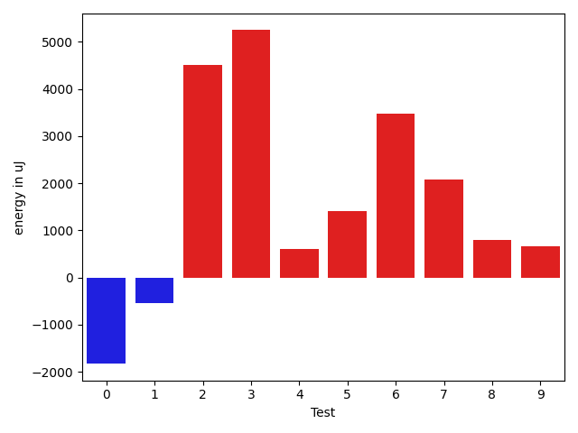

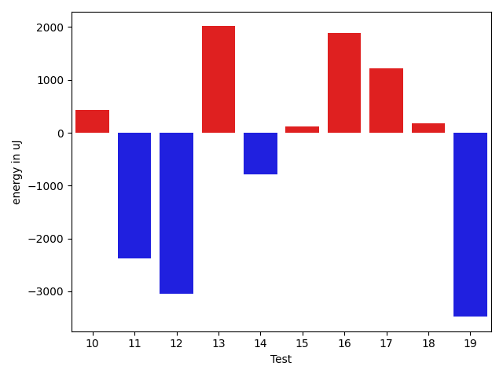

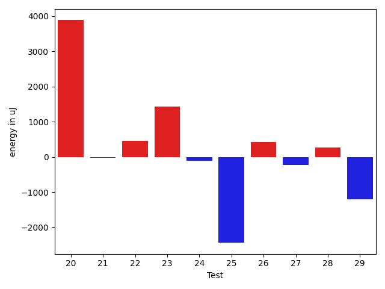

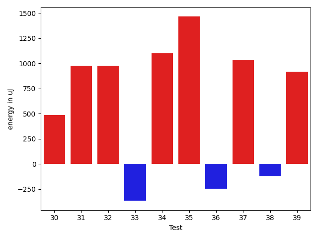

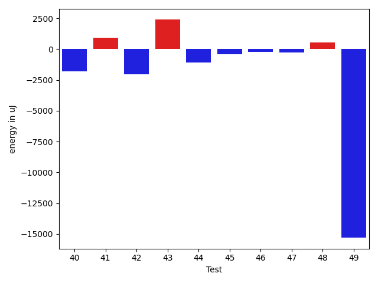

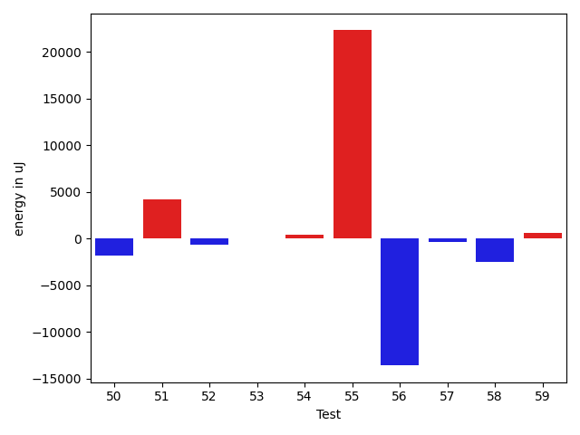

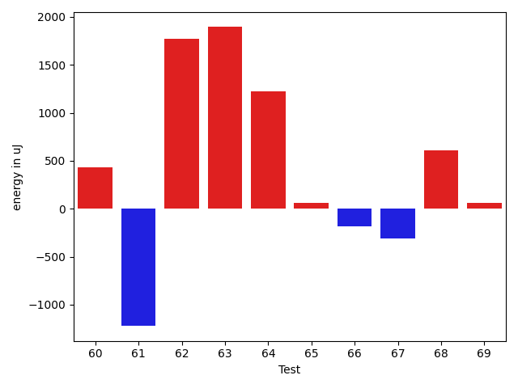

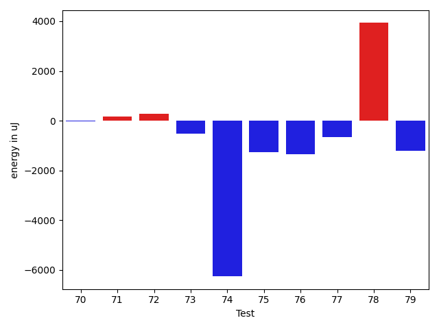

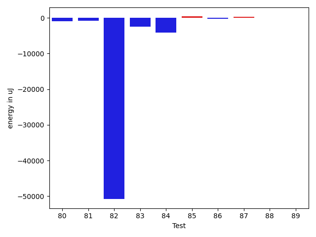

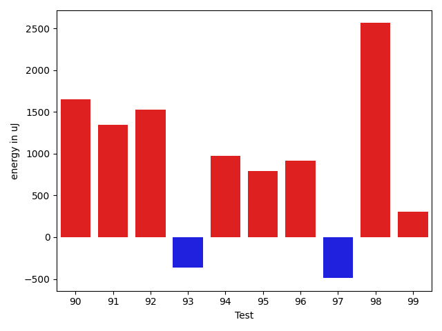

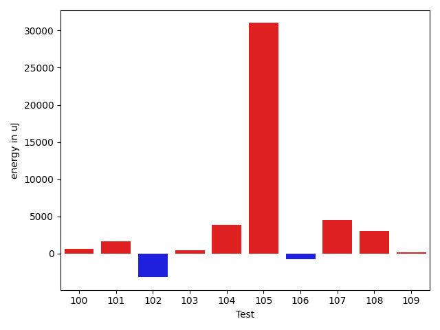

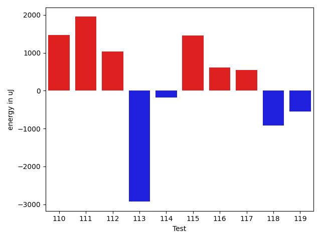

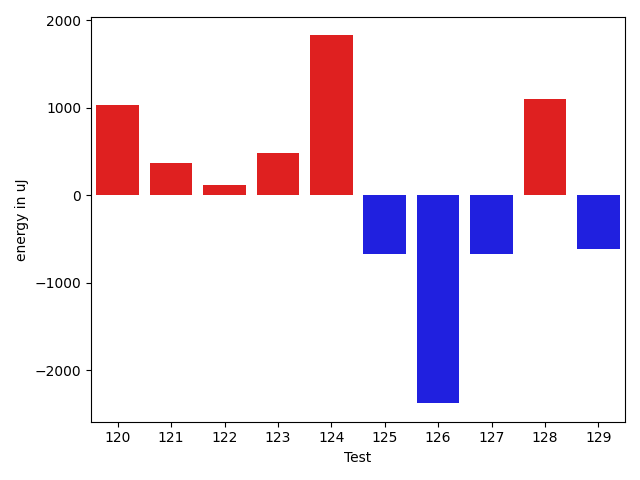

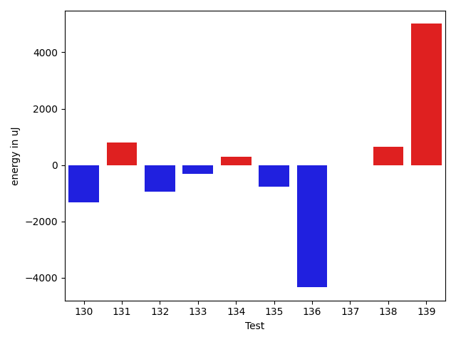

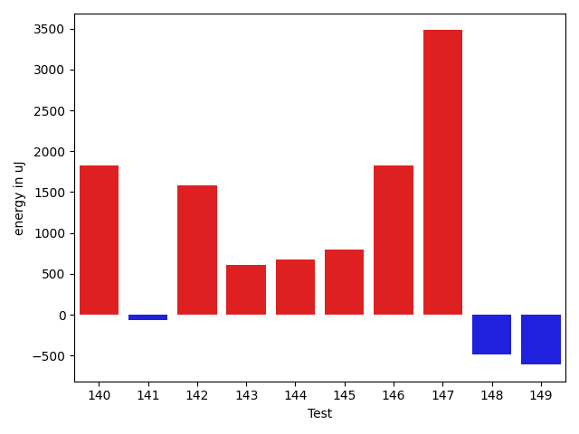

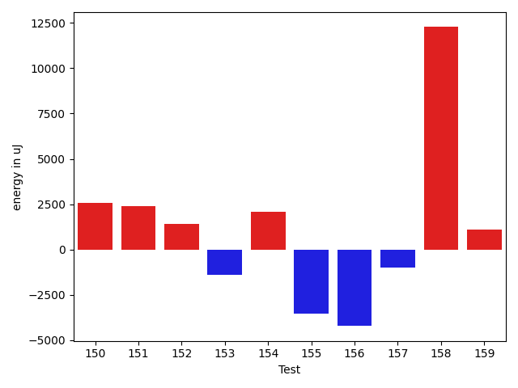

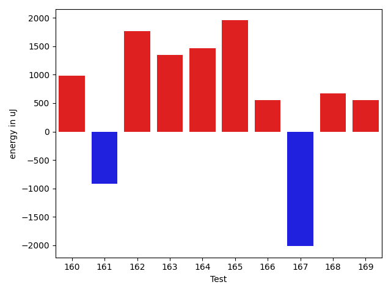

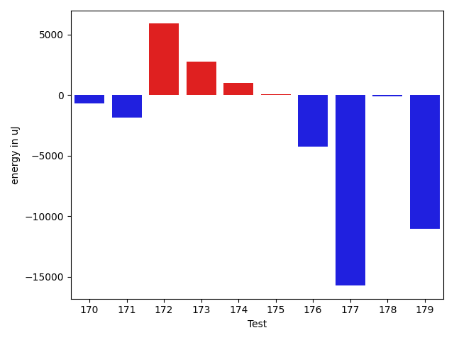

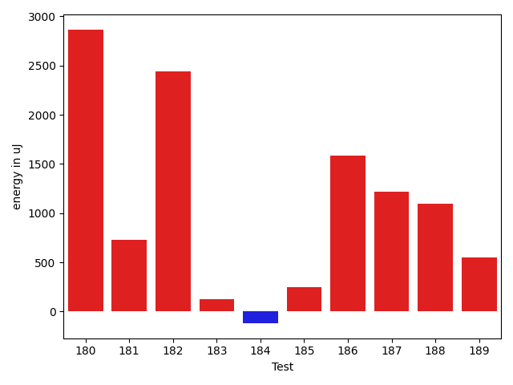

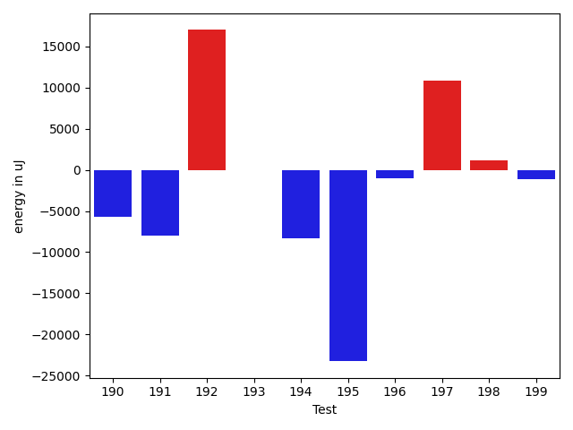

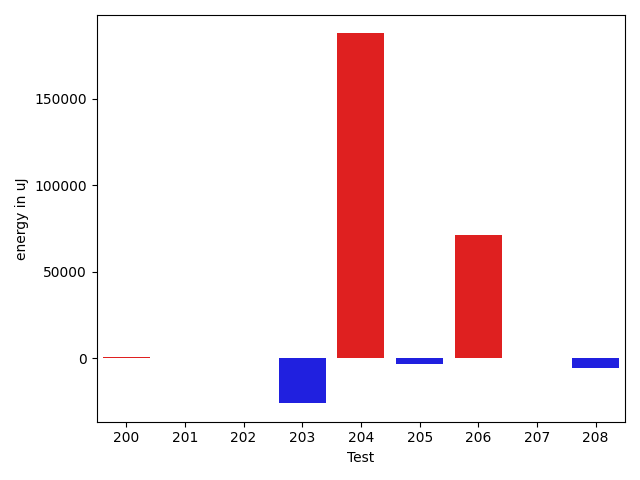

| ID | EnergyV1 | EnergyV2 | DeltaEnergy | σV1 | σV2 |
| --- | --- | --- | --- | --- | --- |
| 0 | 43823 | 41992 | -1831 | 101880.84024691496 | 72767.93645249205 |
| 1 | 37658 | 37110 | -548 | 4273.100396190774 | 3876.4519439133232 |
| 2 | 130431 | 134949 | 4518 | 28391.948472906082 | 36626.13354880396 |
| 3 | 159790 | 165039 | 5249 | 56416.89667048673 | 71789.64349618583 |
| 4 | 38147 | 38758 | 611 | 3238.038698804949 | 3584.1970470695696 |
| 5 | 38024 | 39429 | 1405 | 36027.44591586215 | 43136.21171607398 |
| 6 | 109253 | 112732 | 3479 | 23336.749216357104 | 33713.91786994828 |
| 7 | 37171 | 39245 | 2074 | 4609.85497541935 | 4849.474085437043 |
| 8 | 114990 | 115784 | 794 | 29456.088275032085 | 24764.45726689987 |
| 9 | 116210 | 116882 | 672 | 21481.990772796024 | 21806.876710930566 |
| 10 | 36194 | 36621 | 427 | 3920.1874357520937 | 3871.1950124618133 |
| 11 | 148316 | 145935 | -2381 | 29623.680380630383 | 26998.259188958087 |
| 12 | 149658 | 146606 | -3052 | 35946.69316370804 | 52454.79361708011 |
| 13 | 37292 | 39307 | 2015 | 29958.8896630032 | 3332.6476199998865 |
| 14 | 37414 | 36621 | -793 | 21886.92020077288 | 3092.7409708546184 |
| 15 | 36437 | 36560 | 123 | 4769.894297735564 | 37016.36433406132 |
| 16 | 34546 | 36438 | 1892 | 2923.5072691605315 | 4268.624708887563 |
| 17 | 38086 | 39307 | 1221 | 4113.3135446579645 | 3234.172156428128 |
| 18 | 36438 | 36621 | 183 | 3917.266299156328 | 8569.033907261755 |
| 19 | 39185 | 35705 | -3480 | 4402.0932591779565 | 4710.281363234401 |
| 20 | 37293 | 38940 | 1647 | 9502.46268896748 | 14851.21715072393 |
| 21 | 36926 | 37476 | 550 | 3134.273499943644 | 4549.106313057544 |
| 22 | 36621 | 36071 | -550 | 2930.024921395721 | 2483.417305912585 |
| 23 | 32287 | 33508 | 1221 | 213.5 | 0.0 |
| 24 | 35706 | 36682 | 976 | 305.0 | 2000.0887202544013 |
| 25 | 35095 | 31555 | -3540 | 1099.0 | 0.0 |
| 26 | 38147 | 38025 | -122 | 3730.2872753850756 | 3073.246596028376 |
| 27 | 38024 | 37659 | -365 | 4124.636948333217 | 2350.5526325890746 |
| 28 | 36926 | 37842 | 916 | 4481.528703192502 | 4086.729093710274 |
| 29 | 38269 | 36865 | -1404 | 3816.4449642213567 | 2895.5006808523867 |
| 30 | 37292 | 37780 | 488 | 10139.924654203118 | 11171.240542229129 |
| 31 | 36743 | 37720 | 977 | 3930.1399777740685 | 3526.6642723666287 |
| 32 | 38879 | 39856 | 977 | 15331.096348680376 | 16449.116396883666 |
| 33 | 38940 | 38574 | -366 | 38109.53882037738 | 82911.53261080614 |
| 34 | 37353 | 38452 | 1099 | 6544.083306834799 | 3801.6133671848684 |
| 35 | 37232 | 38696 | 1464 | 18430.53830160458 | 38187.95336995462 |
| 36 | 38574 | 38330 | -244 | 4129.264156131345 | 4659.3881576297335 |
| 37 | 36377 | 37414 | 1037 | 4063.2169726449433 | 4318.944733250565 |
| 38 | 36743 | 36621 | -122 | 2827.3602959395807 | 2327.4147664088496 |
| 39 | 36987 | 37903 | 916 | 4310.632827470219 | 4590.129121398559 |
| 40 | 38636 | 37781 | -855 | 25099.52357836343 | 14005.786337751637 |
| 41 | 36743 | 38086 | 1343 | 3586.105190227156 | 3264.180528513592 |
| 42 | 80506 | 80200 | -306 | 31162.799513821265 | 29301.853662973568 |
| 43 | 37598 | 37415 | -183 | 11985.982531504733 | 21423.00400270699 |
| 44 | 37719 | 36621 | -1098 | 4005.810755440152 | 4049.3765041633023 |
| 45 | 36377 | 35461 | -916 | 3270.932169036507 | 4023.5839033527322 |
| 46 | 36560 | 35705 | -855 | 4264.464984657736 | 4026.5828249390015 |
| 47 | 37109 | 36011 | -1098 | 5735.786222613066 | 5834.491679372213 |
| 48 | 36744 | 36804 | 60 | 4184.275102914534 | 3772.3857548771434 |
| 49 | 39184 | 40650 | 1466 | 185211.40367476866 | 33322.068639116434 |
| 50 | 37781 | 36011 | -1770 | 4037.1125573178556 | 3879.5966827819398 |
| 51 | 36743 | 34851 | -1892 | 4287.2094428959535 | 27871.40016219474 |
| 52 | 38269 | 37231 | -1038 | 3561.0681866773193 | 4105.297036712104 |
| 53 | 36682 | 35339 | -1343 | 3921.023547777063 | 3858.4274289990303 |
| 54 | 37475 | 37963 | 488 | 3002.7294969908235 | 3638.468041600845 |
| 55 | 41198 | 41626 | 428 | 61712.048601225346 | 84816.10198782012 |
| 56 | 39428 | 36010 | -3418 | 45795.3405902669 | 3487.084292388445 |
| 57 | 41138 | 40283 | -855 | 27326.43704758371 | 26919.73676566827 |
| 58 | 36743 | 34668 | -2075 | 5147.605582953527 | 5072.977229097539 |
| 59 | 37476 | 37476 | 0 | 8246.78820335999 | 10089.519336634865 |
| 60 | 38452 | 38880 | 428 | 16611.13884446983 | 15662.81086875458 |
| 61 | 39429 | 38208 | -1221 | 12475.118794468197 | 12583.834342182123 |
| 62 | 36255 | 38024 | 1769 | 3363.169797950105 | 4331.392003444158 |
| 63 | 39428 | 41321 | 1893 | 29638.98589700576 | 35102.38545870823 |
| 64 | 62988 | 64209 | 1221 | 19267.1012970021 | 21108.260241575546 |
| 65 | 40344 | 40405 | 61 | 64439.28624918205 | 96850.5316256426 |
| 66 | 37293 | 37109 | -184 | 3864.4504689827727 | 6024.297455353487 |
| 67 | 37903 | 37597 | -306 | 3937.9663535239006 | 4038.108211066588 |
| 68 | 38086 | 38696 | 610 | 4015.635095643918 | 3986.3819239630443 |
| 69 | 36438 | 36499 | 61 | 3549.7585670433305 | 2788.404446879075 |
| 70 | 36438 | 35644 | -794 | 3965.1970616351464 | 4720.926714904607 |
| 71 | 36804 | 37110 | 306 | 4334.784955372699 | 4322.762042213289 |
| 72 | 36987 | 36682 | -305 | 3897.1573008412174 | 4412.072364374417 |
| 73 | 37048 | 35767 | -1281 | 3504.970577265949 | 3698.6762553091744 |
| 74 | 124572 | 124450 | -122 | 102043.24246731953 | 91083.63271860893 |
| 75 | 38086 | 37353 | -733 | 4666.66993368638 | 4497.117804494341 |
| 76 | 38269 | 36865 | -1404 | 5580.978030616555 | 4265.53799042455 |
| 77 | 40161 | 38757 | -1404 | 4428.4194357305505 | 3408.132573797815 |
| 78 | 41626 | 40222 | -1404 | 35898.9801140103 | 45453.4324318855 |
| 79 | 38880 | 37597 | -1283 | 4594.414634104197 | 3479.1521307056696 |
| 80 | 37049 | 37170 | 121 | 4582.350198480891 | 3517.0554258471284 |
| 81 | 38574 | 38757 | 183 | 32710.918205026646 | 22871.639489647438 |
| 82 | 40161 | 41016 | 855 | 526931.3605497171 | 429544.4796190297 |
| 83 | 80261 | 80689 | 428 | 29068.844027999654 | 29045.285987339106 |
| 84 | 84534 | 78552 | -5982 | 215232.72597678885 | 255206.20286023853 |
| 85 | 38208 | 37781 | -427 | 3536.4792370506607 | 3864.4408071201633 |
| 86 | 37537 | 36866 | -671 | 6389.12174574784 | 4127.1573980720295 |
| 87 | 37841 | 37414 | -427 | 3894.5612183687504 | 5404.531413815282 |
| 88 | 38269 | 37598 | -671 | 4127.634082080866 | 4016.593378858974 |
| 89 | 35705 | 36316 | 611 | 3997.9416820044203 | 3795.1213102662723 |
| 90 | 36499 | 38147 | 1648 | 4387.290237504145 | 4247.58941074691 |
| 91 | 64514 | 65857 | 1343 | 22512.088633586725 | 23259.779847185502 |
| 92 | 36438 | 37963 | 1525 | 4011.62180162711 | 27205.905989208903 |
| 93 | 37719 | 37354 | -365 | 9132.71294326969 | 6050.690269389434 |
| 94 | 35889 | 36865 | 976 | 3711.5673921098137 | 1974.2503271284183 |
| 95 | 36193 | 36988 | 795 | 4061.913651198159 | 3679.548812356539 |
| 96 | 37171 | 38086 | 915 | 3621.010866226907 | 4191.586954311643 |
| 97 | 43396 | 42907 | -489 | 20149.017830528253 | 25412.16206896341 |
| 98 | 37415 | 39978 | 2563 | 13051.268349967826 | 17449.769989176202 |
| 99 | 37048 | 37353 | 305 | 4235.875352851871 | 6354.402788716553 |
| 100 | 35400 | 37293 | 1893 | 4001.0910584638864 | 3602.0121663006194 |
| 101 | 37353 | 38940 | 1587 | 3500.981573263613 | 4050.5467826079034 |
| 102 | 37964 | 35827 | -2137 | 3123.0946495423414 | 3262.6900114952864 |
| 103 | 37536 | 36743 | -793 | 4586.788001695225 | 6079.41470370298 |
| 104 | 38941 | 39612 | 671 | 25282.760530456875 | 24940.498773330495 |
| 105 | 39673 | 39672 | -1 | 220854.2185745612 | 342898.9172205468 |
| 106 | 38452 | 37353 | -1099 | 5181.798396435524 | 4026.297035942692 |
| 107 | 68604 | 70739 | 2135 | 22340.840747144142 | 23048.904681052092 |
| 108 | 36621 | 37842 | 1221 | 11257.474373649382 | 27262.691895361844 |
| 109 | 38024 | 37720 | -304 | 4401.084156250594 | 4342.68250564871 |
| 110 | 38879 | 40345 | 1466 | 9168.806471972865 | 11914.488611714934 |
| 111 | 39246 | 41199 | 1953 | 24024.167995416785 | 23129.227811066095 |
| 112 | 39733 | 40772 | 1039 | 40311.11904466143 | 36195.83457736174 |
| 113 | 170470 | 167541 | -2929 | 335903.02869173605 | 191084.04619462666 |
| 114 | 38819 | 38635 | -184 | 4209.547783305299 | 4270.346355256037 |
| 115 | 37232 | 38696 | 1464 | 4310.255570766113 | 4963.122442205767 |
| 116 | 40893 | 41503 | 610 | 32618.396426614643 | 42458.07855378397 |
| 117 | 79528 | 80078 | 550 | 56002.14104980113 | 64718.650253941254 |
| 118 | 81543 | 80627 | -916 | 222359.63083238722 | 220221.76404063997 |
| 119 | 38940 | 38391 | -549 | 11532.067035671455 | 9969.13896579619 |
| 120 | 76843 | 77881 | 1038 | 61843.185027334 | 403749.7322073863 |
| 121 | 40406 | 40772 | 366 | 16747.760684390978 | 20816.403589769976 |
| 122 | 38208 | 38329 | 121 | 26708.465309757037 | 4217.592050920394 |
| 123 | 37902 | 38391 | 489 | 11145.790401383787 | 12368.37696470471 |
| 124 | 73670 | 75500 | 1830 | 79033.62813051869 | 97615.70721144821 |
| 125 | 37048 | 36377 | -671 | 18598.726714850076 | 3745.3055291310798 |
| 126 | 75928 | 73547 | -2381 | 33624.350665370315 | 26863.84751750065 |
| 127 | 36315 | 35645 | -670 | 5854.246236347629 | 5204.917056348678 |
| 128 | 41626 | 42724 | 1098 | 22920.36835917863 | 20731.527029852165 |
| 129 | 75622 | 75012 | -610 | 27302.19307497839 | 34335.178798212095 |
| 130 | 37414 | 35766 | -1648 | 5214.198110032243 | 3732.008283207278 |
| 131 | 36194 | 36560 | 366 | 3935.502469516988 | 5580.743678804888 |
| 132 | 38208 | 36438 | -1770 | 3824.372415239846 | 3202.1486418811915 |
| 133 | 36987 | 36377 | -610 | 4038.0065174138 | 4469.16151313943 |
| 134 | 36011 | 36316 | 305 | 3804.921466154065 | 3845.824124591695 |
| 135 | 38208 | 37842 | -366 | 6857.4683352090715 | 5604.2918100791985 |
| 136 | 41443 | 40893 | -550 | 20640.57140778642 | 12032.436082022306 |
| 137 | 37842 | 38269 | 427 | 4606.027007476183 | 4181.361089804017 |
| 138 | 37720 | 38758 | 1038 | 4210.049290417198 | 4508.188046796382 |
| 139 | 37903 | 40955 | 3052 | 11186.266480445947 | 18302.938510591677 |
| 140 | 38818 | 40649 | 1831 | 47248.72689366769 | 29624.562818211634 |
| 141 | 38696 | 38635 | -61 | 81841.9166576047 | 57578.74013469094 |
| 142 | 38025 | 39612 | 1587 | 10521.91612563482 | 6483.561610999088 |
| 143 | 39978 | 40589 | 611 | 10502.689560654791 | 35267.35554297102 |
| 144 | 39124 | 39795 | 671 | 33199.35723174591 | 31700.89984257189 |
| 145 | 37964 | 38757 | 793 | 7033.1284863356595 | 7625.517871630335 |
| 146 | 40222 | 42053 | 1831 | 255249.93172417782 | 247850.2501809535 |
| 147 | 37781 | 41260 | 3479 | 31564.45178835317 | 36187.043341008946 |
| 148 | 41992 | 41504 | -488 | 22192.024960501018 | 25899.404785364455 |
| 149 | 36682 | 36072 | -610 | 3333.381781620704 | 3962.945288466017 |
| 150 | 36560 | 39123 | 2563 | 4639.0813763641745 | 3864.867015679697 |
| 151 | 34973 | 37353 | 2380 | 8294.94602978531 | 16375.842408612632 |
| 152 | 37170 | 38574 | 1404 | 3906.0313587075325 | 5020.440919993171 |
| 153 | 38147 | 36743 | -1404 | 3857.638673967391 | 4290.9339537629285 |
| 154 | 39673 | 41748 | 2075 | 3178.4269894751124 | 2981.43870985339 |
| 155 | 41687 | 38147 | -3540 | 3981.1968852204345 | 3549.5693743122633 |
| 156 | 40771 | 36560 | -4211 | 4005.774533017928 | 4773.586874667727 |
| 157 | 39184 | 38208 | -976 | 37414.932764947676 | 4098.8701557888635 |
| 158 | 227233 | 239501 | 12268 | 74005.9370788967 | 97343.82372672981 |
| 159 | 38818 | 39917 | 1099 | 40069.34073556081 | 53108.52589162444 |
| 160 | 37048 | 38025 | 977 | 4627.904561975696 | 3809.2587411405916 |
| 161 | 37353 | 36438 | -915 | 6637.3026784767235 | 4085.843320993822 |
| 162 | 38575 | 40344 | 1769 | 20148.71278787224 | 21007.727750927806 |
| 163 | 36743 | 38086 | 1343 | 4219.663514585794 | 4139.711732138678 |
| 164 | 37171 | 38635 | 1464 | 4081.7787892915926 | 4056.5610355056424 |
| 165 | 36377 | 38330 | 1953 | 4261.316045292795 | 4529.81266200209 |
| 166 | 42419 | 42968 | 549 | 54462.748010751835 | 69236.58001454362 |
| 167 | 38574 | 36560 | -2014 | 28473.030509851433 | 4781.1300388876125 |
| 168 | 40161 | 40832 | 671 | 10707.434899152962 | 13838.830127863092 |
| 169 | 39245 | 39795 | 550 | 23906.91072523145 | 16356.336530213604 |
| 170 | 38940 | 37903 | -1037 | 4880.2394299187135 | 3551.1519257840823 |
| 171 | 37109 | 34790 | -2319 | 3670.1707901416335 | 2904.433040931775 |
| 172 | 36316 | 36377 | 61 | 4355.412704016261 | 32834.72565674334 |
| 173 | 39673 | 41137 | 1464 | 5240.837231234865 | 4356.691921044907 |
| 174 | 36377 | 38330 | 1953 | 3733.9868380018684 | 4264.693289088912 |
| 175 | 37658 | 38452 | 794 | 3898.2163540593224 | 3928.6081490675124 |
| 176 | 38819 | 38147 | -672 | 30345.432908492217 | 3726.8778218597736 |
| 177 | 43518 | 39673 | -3845 | 70934.149105906 | 50610.89497252124 |
| 178 | 39429 | 38879 | -550 | 6109.356960893192 | 4810.259024689503 |
| 179 | 39917 | 39856 | -61 | 68608.7033664335 | 50838.47496296481 |
| 180 | 82336 | 85205 | 2869 | 560877.0084968999 | 426467.01364508946 |
| 181 | 38330 | 39062 | 732 | 4081.0743928124402 | 4262.040479287634 |
| 182 | 163635 | 166076 | 2441 | 69733.6786521154 | 56878.76863489124 |
| 183 | 39733 | 39856 | 123 | 6408.166805258477 | 6275.631155008877 |
| 184 | 38635 | 38513 | -122 | 8861.624234452607 | 8518.630645963145 |
| 185 | 40405 | 40650 | 245 | 119011.15157797051 | 98912.3603761952 |
| 186 | 36926 | 38513 | 1587 | 43910.77269151217 | 4875.530930324613 |
| 187 | 37354 | 38575 | 1221 | 5373.889905852334 | 3567.335353389937 |
| 188 | 39185 | 40283 | 1098 | 119774.97733557948 | 79967.92282387748 |
| 189 | 79162 | 79712 | 550 | 60265.25253658562 | 205345.43318487777 |
| 190 | 41321 | 39001 | -2320 | 17229.244154430104 | 10053.902943136065 |
| 191 | 39794 | 38819 | -975 | 57660.66959993443 | 40919.26023854972 |
| 192 | 38818 | 39795 | 977 | 4263.572798186058 | 60445.6747621926 |
| 193 | 37170 | 37780 | 610 | 3808.635776082044 | 4366.684503780363 |
| 194 | 43091 | 42725 | -366 | 52114.4634581371 | 40248.97310723039 |
| 195 | 42907 | 40650 | -2257 | 101596.91472381186 | 61575.715387614764 |
| 196 | 40771 | 40222 | -549 | 19109.353313255742 | 24968.210215669 |
| 197 | 38818 | 39002 | 184 | 4325.317891135286 | 39114.191896931734 |
| 198 | 37109 | 39856 | 2747 | 3966.3178433371927 | 4145.352125705819 |
| 199 | 39307 | 37964 | -1343 | 4253.737090300532 | 3280.4784020281013 |
| 200 | 37476 | 37781 | 305 | 3240.974590947756 | 2973.1727664515183 |
| 201 | 40222 | 39062 | -1160 | 3690.232401164346 | 3518.3614554734063 |
| 202 | 41687 | 39917 | -1770 | 4333.624072646885 | 3194.849819140785 |
| 203 | 39185 | 37170 | -2015 | 82166.93036780495 | 4286.307336186582 |
| 204 | 41565 | 40710 | -855 | 3849.3132992824912 | 511192.4731704628 |
| 205 | 40283 | 38941 | -1342 | 22433.151404635748 | 17795.488275558935 |
| 206 | 41809 | 39124 | -2685 | 417646.1923163946 | 549030.0953304922 |
| 207 | 39612 | 39062 | -550 | 4205.83722322487 | 3950.7970816338966 |
| 208 | 40161 | 39856 | -305 | 29119.216003284673 | 18034.95474181336 |

## Delta Duration per test method

| ID | DurationV1 | DurationsV2 | DeltaDuration |
| --- | --- | --- | --- |
| 0 | 2425960.414141414 | 2084211.393939394 | -341749.0202020202 |
| 1 | 781037.3191489362 | 719238.0535714285 | -61799.26557750767 |
| 2 | 3829027.0404040404 | 3888419.1515151514 | 59392.11111111101 |
| 3 | 4966961.454545454 | 5346479.666666667 | 379518.21212121285 |
| 4 | 463858.36842105264 | 454303.22222222225 | -9555.146198830393 |
| 5 | 1083983.1029411764 | 1337627.7878787878 | 253644.68493761146 |
| 6 | 3054294.0505050505 | 3208903.626262626 | 154609.5757575757 |
| 7 | 534016.0606060605 | 603575.8846153846 | 69559.82400932407 |
| 8 | 3330560.606060606 | 3390571.6565656564 | 60011.05050505046 |
| 9 | 3223679.777777778 | 3254380.111111111 | 30700.333333333023 |
| 10 | 679632.8285714285 | 717084.4146341464 | 37451.58606271783 |
| 11 | 4100764.6565656564 | 4047335.868686869 | -53428.78787878761 |
| 12 | 4202241.95959596 | 4433095.898989899 | 230853.93939393945 |
| 13 | 749871.32 | 514550.04545454547 | -235321.27454545448 |
| 14 | 690051.96875 | 568490.2941176471 | -121561.6746323529 |
| 15 | 478955.4090909091 | 697573.2258064516 | 218617.81671554252 |
| 16 | 571140.0476190476 | 549550.8461538461 | -21589.201465201448 |
| 17 | 522250.2 | 565716.9523809524 | 43466.752380952414 |
| 18 | 889929.5192307692 | 944262.7272727273 | 54333.208041958045 |
| 19 | 343851.5 | 355310.0833333333 | 11458.583333333314 |
| 20 | 1109067.465116279 | 1202481.5283018867 | 93414.06318560778 |
| 21 | 433288.64285714284 | 467718.1 | 34429.457142857136 |
| 22 | 417616.9 | 465624.4285714286 | 48007.52857142856 |
| 23 | 588673.0 | 620741.0 | 32068.0 |
| 24 | 991640.5 | 1071305.6666666667 | 79665.16666666674 |
| 25 | 769203.0 | 983310.0 | 214107.0 |
| 26 | 424709.52173913043 | 413389.15 | -11320.371739130409 |
| 27 | 353019.5333333333 | 371991.9285714286 | 18972.395238095254 |
| 28 | 740349.4821428572 | 705653.7446808511 | -34695.737462006044 |
| 29 | 637726.125 | 647105.0869565217 | 9378.961956521729 |
| 30 | 1180846.2337662338 | 1153938.4875 | -26907.746266233735 |
| 31 | 802493.9387755102 | 746363.4642857143 | -56130.47448979586 |
| 32 | 1362226.3789473684 | 1436056.8315789474 | 73830.45263157901 |
| 33 | 1066077.4259259258 | 1584502.6551724137 | 518425.22924648784 |
| 34 | 910440.3114754099 | 970784.6428571428 | 60344.33138173295 |
| 35 | 797199.4666666667 | 1392076.9189189188 | 594877.4522522521 |
| 36 | 770401.1777777778 | 711733.7941176471 | -58667.38366013067 |
| 37 | 736491.9423076923 | 734276.3829787234 | -2215.5593289688695 |
| 38 | 397261.5833333333 | 450514.28571428574 | 53252.702380952425 |
| 39 | 790043.3333333334 | 801679.9777777778 | 11636.64444444445 |
| 40 | 1084783.7903225806 | 1053643.6842105263 | -31140.106112054316 |
| 41 | 424570.0 | 512256.9090909091 | 87686.90909090912 |
| 42 | 2700994.4646464647 | 2651688.525252525 | -49305.93939393945 |
| 43 | 1047268.4057971014 | 1140684.638888889 | 93416.23309178755 |
| 44 | 753327.82 | 745372.7142857143 | -7955.10571428563 |
| 45 | 746431.1025641026 | 678671.8378378379 | -67759.26472626475 |
| 46 | 476675.1818181818 | 541077.125 | 64401.94318181818 |
| 47 | 967775.5178571428 | 960356.1929824562 | -7419.324874686659 |
| 48 | 801798.9607843137 | 848400.62 | 46601.65921568626 |
| 49 | 1664221.746031746 | 1209819.0 | -454402.74603174604 |
| 50 | 409516.71428571426 | 459814.94736842107 | 50298.23308270681 |
| 51 | 528906.9047619047 | 697859.0344827586 | 168952.12972085387 |
| 52 | 416018.86363636365 | 419677.95238095237 | 3659.08874458872 |
| 53 | 449797.8 | 385297.1538461539 | -64500.646153846115 |
| 54 | 364976.0 | 379794.8947368421 | 14818.894736842078 |
| 55 | 1405759.4 | 2206127.1764705884 | 800367.7764705885 |
| 56 | 694363.3529411765 | 398228.5333333333 | -296134.8196078432 |
| 57 | 1193721.1333333333 | 1213642.6470588236 | 19921.51372549031 |
| 58 | 401478.3333333333 | 425439.63636363635 | 23961.30303030304 |
| 59 | 945260.2898550725 | 992706.5483870967 | 47446.25853202422 |
| 60 | 1288421.2698412698 | 1316633.2121212122 | 28211.942279942334 |
| 61 | 1199741.8875 | 1176453.5443037974 | -23288.343196202535 |
| 62 | 435007.9375 | 396320.8333333333 | -38687.104166666686 |
| 63 | 1605437.3764705881 | 1786464.3658536586 | 181026.9893830705 |
| 64 | 1692361.01010101 | 1706309.616161616 | 13948.606060605962 |
| 65 | 1577205.6603773586 | 2114208.12 | 537002.4596226416 |
| 66 | 775880.6739130435 | 854692.0227272727 | 78811.34881422925 |
| 67 | 758173.3103448276 | 839360.0697674418 | 81186.75942261424 |
| 68 | 719377.0212765958 | 736347.8139534884 | 16970.792676892597 |
| 69 | 387159.7272727273 | 455705.1875 | 68545.4602272727 |
| 70 | 513007.84 | 505642.4 | -7365.440000000002 |
| 71 | 778328.8510638297 | 783095.76 | 4766.908936170279 |
| 72 | 415486.35 | 469692.3157894737 | 54205.96578947373 |
| 73 | 457726.2 | 471864.347826087 | 14138.147826086963 |
| 74 | 4772693.393939394 | 4481256.525252526 | -291436.8686868679 |
| 75 | 534249.8181818182 | 488205.65 | -46044.16818181821 |
| 76 | 883163.8983050848 | 855321.4 | -27842.498305084766 |
| 77 | 661720.5813953489 | 664440.5 | 2719.9186046511168 |
| 78 | 1520187.0337078653 | 1675328.4086021506 | 155141.37489428534 |
| 79 | 751831.3673469388 | 793846.8867924528 | 42015.51944551396 |
| 80 | 798819.5357142857 | 810004.3571428572 | 11184.821428571478 |
| 81 | 1058493.8596491227 | 1086600.26 | 28106.400350877317 |
| 82 | 5349548.633802817 | 3754866.2 | -1594682.433802817 |
| 83 | 2591935.5656565656 | 2549508.1919191917 | -42427.373737373855 |
| 84 | 4060675.525252525 | 4075294.8282828284 | 14619.303030303214 |
| 85 | 880258.679245283 | 869155.5272727272 | -11103.151972555788 |
| 86 | 832472.7966101695 | 858808.5970149253 | 26335.800404755864 |
| 87 | 965142.2763157894 | 946805.3037974683 | -18336.972518321127 |
| 88 | 559715.5333333333 | 596462.03125 | 36746.497916666674 |
| 89 | 525042.4583333334 | 698413.6666666666 | 173371.20833333326 |
| 90 | 536777.0909090909 | 531034.6774193548 | -5742.413489736151 |
| 91 | 1786418.202020202 | 1819331.7777777778 | 32913.57575757569 |
| 92 | 566242.6538461539 | 703557.5277777778 | 137314.87393162388 |
| 93 | 972254.1492537314 | 959543.5 | -12710.64925373136 |
| 94 | 572586.9166666666 | 567778.7916666666 | -4808.125 |
| 95 | 714548.1132075472 | 693088.725490196 | -21459.3877173512 |
| 96 | 476488.9 | 496419.5333333333 | 19930.633333333302 |
| 97 | 1805325.5858585858 | 1769481.051020408 | -35844.53483817773 |
| 98 | 936854.4318181818 | 1133908.3333333333 | 197053.9015151515 |
| 99 | 878028.2571428572 | 908664.8387096775 | 30636.58156682027 |
| 100 | 682598.1282051282 | 720268.7727272727 | 37670.64452214446 |
| 101 | 433746.53846153844 | 419790.85714285716 | -13955.68131868128 |
| 102 | 427178.75 | 466821.77777777775 | 39643.02777777775 |
| 103 | 880127.695652174 | 863256.0 | -16871.69565217395 |
| 104 | 970883.3103448276 | 1306730.625 | 335847.3146551724 |
| 105 | 1878374.3684210526 | 2705767.5454545454 | 827393.1770334928 |
| 106 | 543955.6153846154 | 692726.0689655172 | 148770.45358090184 |
| 107 | 1981044.2525252525 | 2002547.7373737374 | 21503.484848484863 |
| 108 | 1039428.9736842106 | 1173570.3 | 134141.32631578948 |
| 109 | 746177.58 | 738240.0980392157 | -7937.481960784295 |
| 110 | 1167485.448275862 | 1194172.880952381 | 26687.432676519034 |
| 111 | 1058988.0476190476 | 1229841.3265306123 | 170853.27891156473 |
| 112 | 1109183.2340425532 | 1068909.3272727274 | -40273.906769825844 |
| 113 | 7055293.97979798 | 5568606.090909091 | -1486687.888888889 |
| 114 | 872569.0 | 752485.6078431372 | -120083.39215686277 |
| 115 | 966860.8983050848 | 888083.6857142857 | -78777.21259079908 |
| 116 | 1033917.0769230769 | 1121927.1923076923 | 88010.11538461538 |
| 117 | 2808018.01010101 | 2866653.797979798 | 58635.787878788076 |
| 118 | 3204739.4242424243 | 3295062.6565656564 | 90323.2323232321 |
| 119 | 1067135.6794871795 | 1113717.7894736843 | 46582.10998650477 |
| 120 | 2527668.393939394 | 4436089.626262627 | 1908421.2323232326 |
| 121 | 1369218.3409090908 | 1403026.4421052632 | 33808.101196172414 |
| 122 | 963240.9552238806 | 907470.4920634921 | -55770.46316038852 |
| 123 | 1210715.2105263157 | 1244599.3058823529 | 33884.09535603714 |
| 124 | 2599104.898989899 | 2741431.1717171716 | 142326.27272727247 |
| 125 | 928242.3731343284 | 865871.224137931 | -62371.14899639739 |
| 126 | 2342260.393939394 | 2256887.101010101 | -85373.29292929312 |
| 127 | 1072542.8674698796 | 1043075.6285714286 | -29467.238898450974 |
| 128 | 1747736.3232323232 | 1721167.2121212122 | -26569.111111111008 |
| 129 | 2420859.0 | 2411310.404040404 | -9548.59595959587 |
| 130 | 971079.1967213114 | 919542.03125 | -51537.165471311426 |
| 131 | 997178.3448275862 | 940365.9846153846 | -56812.3602122016 |
| 132 | 525492.9677419355 | 563602.2121212122 | 38109.24437927664 |
| 133 | 785794.1063829787 | 815863.8039215687 | 30069.697538589942 |
| 134 | 836432.26 | 814096.1403508772 | -22336.11964912282 |
| 135 | 698216.2888888889 | 771568.1578947369 | 73351.86900584796 |
| 136 | 861253.5 | 742835.6666666666 | -118417.83333333337 |
| 137 | 675968.52 | 636576.0434782609 | -39392.476521739154 |
| 138 | 669958.25 | 759403.8333333334 | 89445.58333333337 |
| 139 | 1111013.9864864864 | 1249579.0125 | 138565.02601351356 |
| 140 | 1318881.7272727273 | 1192581.4716981133 | -126300.25557461404 |
| 141 | 1433926.1176470588 | 1060170.9117647058 | -373755.205882353 |
| 142 | 1017580.7162162162 | 1047378.9275362319 | 29798.21132001572 |
| 143 | 1052311.8513513512 | 1223023.2608695652 | 170711.40951821394 |
| 144 | 1317359.638888889 | 1299981.0263157894 | -17378.612573099555 |
| 145 | 951106.1428571428 | 992855.6764705882 | 41749.533613445354 |
| 146 | 2593906.4545454546 | 2362400.7352941176 | -231505.719251337 |
| 147 | 1150867.7419354839 | 1194198.148148148 | 43330.40621266421 |
| 148 | 1206744.35 | 982704.9411764706 | -224039.4088235295 |
| 149 | 433137.28571428574 | 392287.0625 | -40850.22321428574 |
| 150 | 398013.9090909091 | 344851.4 | -53162.509090909094 |
| 151 | 805264.4782608695 | 753725.7692307692 | -51538.70903010026 |
| 152 | 385145.1818181818 | 365864.1176470588 | -19281.064171123027 |
| 153 | 436148.8333333333 | 358032.0 | -78116.83333333331 |
| 154 | 466480.84210526315 | 506026.78571428574 | 39545.94360902259 |
| 155 | 391200.5 | 395967.3333333333 | 4766.833333333314 |
| 156 | 366498.375 | 365431.8 | -1066.5750000000116 |
| 157 | 753018.5 | 394742.2631578947 | -358276.2368421053 |
| 158 | 6898314.777777778 | 7421853.555555556 | 523538.777777778 |
| 159 | 1281455.2222222222 | 1629429.4691358025 | 347974.2469135802 |
| 160 | 645320.0322580645 | 614927.8275862068 | -30392.204671857646 |
| 161 | 706056.6571428571 | 725951.7272727273 | 19895.070129870204 |
| 162 | 1401688.0 | 1370945.4545454546 | -30742.545454545412 |
| 163 | 593725.8285714285 | 566729.6363636364 | -26996.19220779219 |
| 164 | 915434.75 | 776491.195652174 | -138943.55434782605 |
| 165 | 494195.26923076925 | 616928.2857142857 | 122733.01648351643 |
| 166 | 1634701.642857143 | 2104186.7741935486 | 469485.13133640564 |
| 167 | 732769.4583333334 | 608464.2105263158 | -124305.24780701753 |
| 168 | 846574.9444444445 | 1061216.9545454546 | 214642.0101010101 |
| 169 | 1149609.0384615385 | 1058859.9 | -90749.13846153859 |
| 170 | 488747.4666666667 | 538563.8 | 49816.33333333337 |
| 171 | 430848.4210526316 | 426828.1818181818 | -4020.2392344497493 |
| 172 | 544044.6521739131 | 754604.28 | 210559.62782608694 |
| 173 | 487538.0 | 547326.4285714285 | 59788.42857142852 |
| 174 | 427139.2631578947 | 379505.55 | -47633.71315789473 |
| 175 | 418561.6666666667 | 390010.7894736842 | -28550.877192982472 |
| 176 | 1061960.7872340425 | 803163.9772727273 | -258796.80996131524 |
| 177 | 2190482.8085106383 | 1807072.043956044 | -383410.7645545944 |
| 178 | 923076.5283018867 | 866792.4925373135 | -56284.03576457326 |
| 179 | 1479070.4166666667 | 1005306.6666666666 | -473763.7500000001 |
| 180 | 6715406.747474748 | 5412957.02020202 | -1302449.7272727275 |
| 181 | 831790.0545454546 | 911092.4354838709 | 79302.38093841635 |
| 182 | 4971773.333333333 | 4947543.636363637 | -24229.69696969632 |
| 183 | 1182184.6184210526 | 1081562.310810811 | -100622.3076102417 |
| 184 | 1002627.6842105263 | 981611.3275862068 | -21016.35662431945 |
| 185 | 2908753.4516129033 | 2148200.911764706 | -760552.5398481973 |
| 186 | 785382.1052631579 | 474620.1304347826 | -310761.97482837527 |
| 187 | 481712.0 | 530154.2631578947 | 48442.26315789472 |
| 188 | 2504297.0 | 1824395.640625 | -679901.359375 |
| 189 | 2805197.8585858587 | 3346892.9292929294 | 541695.0707070706 |
| 190 | 776336.7368421053 | 701826.9 | -74509.83684210526 |
| 191 | 1183196.0882352942 | 913764.2727272727 | -269431.8155080215 |
| 192 | 700327.0666666667 | 1359131.4680851065 | 658804.4014184398 |
| 193 | 534934.7692307692 | 624341.4545454546 | 89406.68531468534 |
| 194 | 2111883.644444444 | 1803505.5869565217 | -308378.0574879225 |
| 195 | 2332196.55 | 1670694.5789473683 | -661501.9710526315 |
| 196 | 1359015.4302325582 | 1405404.3977272727 | 46388.96749471454 |
| 197 | 573494.5 | 857673.3125 | 284178.8125 |
| 198 | 563051.6875 | 440502.3125 | -122549.375 |
| 199 | 700288.59375 | 797877.3555555556 | 97588.76180555555 |
| 200 | 432742.7894736842 | 429938.3157894737 | -2804.473684210505 |
| 201 | 573845.8095238095 | 581387.2692307692 | 7541.45970695978 |
| 202 | 778409.1739130435 | 576680.3076923077 | -201728.8662207357 |
| 203 | 1415813.2083333333 | 466912.27777777775 | -948900.9305555555 |
| 204 | 496663.2727272727 | 6430150.8 | 5933487.527272727 |
| 205 | 982529.9523809524 | 832925.1333333333 | -149604.81904761912 |
| 206 | 3643537.8372093025 | 5711364.041666667 | 2067826.2044573645 |
| 207 | 652549.9583333334 | 605169.5925925926 | -47380.36574074079 |
| 208 | 1271263.0 | 1109363.2424242424 | -161899.75757575757 |

## Misc.

| ID | Test Class | Test Method |
| --- | --- | --- |
| 0 | com.google.gson.functional.CustomDeserializerTest | testDefaultConstructorNotCalledOnObject |
| 1 | com.google.gson.functional.CustomDeserializerTest | testDefaultConstructorNotCalledOnField |
| 2 | com.google.gson.functional.DefaultTypeAdaptersTest | testDateSerializationWithPatternNotOverridenByTypeAdapter |
| 3 | com.google.gson.functional.DefaultTypeAdaptersTest | testDateSerializationWithPattern |
| 4 | com.google.gson.functional.DefaultTypeAdaptersTest | testLocaleSerializationWithLanguageCountryVariant |
| 5 | com.google.gson.functional.DefaultTypeAdaptersTest | testUrlSerialization |
| 6 | com.google.gson.functional.DefaultTypeAdaptersTest | testSqlDateSerialization |
| 7 | com.google.gson.functional.DefaultTypeAdaptersTest | testUuidSerialization |
| 8 | com.google.gson.functional.DefaultTypeAdaptersTest | testTimestampSerialization |
| 9 | com.google.gson.functional.DefaultTypeAdaptersTest | testDefaultDateDeserializationUsingBuilder |
| 10 | com.google.gson.functional.DefaultTypeAdaptersTest | testTreeSetSerialization |
| 11 | com.google.gson.functional.DefaultTypeAdaptersTest | testDateDeserializationWithPattern |
| 12 | com.google.gson.functional.DefaultTypeAdaptersTest | testDateSerializationInCollection |
| 13 | com.google.gson.functional.DefaultTypeAdaptersTest | testDefaultJavaSqlDateSerialization |
| 14 | com.google.gson.functional.DefaultTypeAdaptersTest | testDefaultCalendarSerialization |
| 15 | com.google.gson.functional.DefaultTypeAdaptersTest | testDefaultGregorianCalendarSerialization |
| 16 | com.google.gson.functional.DefaultTypeAdaptersTest | testSetSerialization |
| 17 | com.google.gson.functional.DefaultTypeAdaptersTest | testUriSerialization |
| 18 | com.google.gson.functional.DefaultTypeAdaptersTest | testBigIntegerFieldSerialization |
| 19 | com.google.gson.functional.DefaultTypeAdaptersTest | testStringBufferSerialization |
| 20 | com.google.gson.functional.DefaultTypeAdaptersTest | testBigDecimalFieldSerialization |
| 21 | com.google.gson.functional.DefaultTypeAdaptersTest | testLocaleSerializationWithLanguage |
| 22 | com.google.gson.functional.DefaultTypeAdaptersTest | testLocaleSerializationWithLanguageCountry |
| 23 | com.google.gson.functional.DefaultTypeAdaptersTest | testDefaultJavaSqlTimeSerialization |
| 24 | com.google.gson.functional.DefaultTypeAdaptersTest | testDefaultDateSerialization |
| 25 | com.google.gson.functional.DefaultTypeAdaptersTest | testDefaultDateSerializationUsingBuilder |
| 26 | com.google.gson.functional.DefaultTypeAdaptersTest | testPropertiesSerialization |
| 27 | com.google.gson.functional.DefaultTypeAdaptersTest | testStringBuilderSerialization |
| 28 | com.google.gson.functional.CollectionTest | testCollectionOfObjectSerialization |
| 29 | com.google.gson.functional.CollectionTest | testRawCollectionSerialization |
| 30 | com.google.gson.functional.CollectionTest | testFieldIsArrayList |
| 31 | com.google.gson.functional.CollectionTest | testQueueSerialization |
| 32 | com.google.gson.functional.CollectionTest | testWildcardCollectionField |
| 33 | com.google.gson.functional.CollectionTest | testSetSerialization |
| 34 | com.google.gson.functional.CollectionTest | testLinkedListSerialization |
| 35 | com.google.gson.functional.CollectionTest | testCollectionOfBagOfPrimitivesSerialization |
| 36 | com.google.gson.functional.CollectionTest | testNullsInListSerialization |
| 37 | com.google.gson.functional.CollectionTest | testCollectionOfObjectWithNullSerialization |
| 38 | com.google.gson.functional.CollectionTest | testCollectionOfStringsSerialization |
| 39 | com.google.gson.functional.CustomTypeAdaptersTest | testCustomTypeAdapterAppliesToSubClassesSerializedAsBaseClass |
| 40 | com.google.gson.functional.CustomTypeAdaptersTest | testCustomNestedSerializers |
| 41 | com.google.gson.functional.CustomTypeAdaptersTest | testCustomAdapterInvokedForMapElementSerialization |
| 42 | com.google.gson.functional.CustomTypeAdaptersTest | testCustomTypeAdapterDoesNotAppliesToSubClasses |
| 43 | com.google.gson.functional.CustomTypeAdaptersTest | testCustomAdapterInvokedForCollectionElementSerializationWithType |
| 44 | com.google.gson.functional.CustomTypeAdaptersTest | testCustomByteArraySerializer |
| 45 | com.google.gson.functional.CustomTypeAdaptersTest | testEnsureCustomSerializerNotInvokedForNullValues |
| 46 | com.google.gson.functional.CustomTypeAdaptersTest | testCustomAdapterInvokedForCollectionElementSerialization |
| 47 | com.google.gson.functional.CustomTypeAdaptersTest | testCustomSerializerForLong |
| 48 | com.google.gson.functional.CustomTypeAdaptersTest | testCustomAdapterInvokedForMapElementSerializationWithType |
| 49 | com.google.gson.functional.CustomTypeAdaptersTest | testCustomSerializers |
| 50 | com.google.gson.functional.StringTest | testEscapingQuotesInStringSerialization |
| 51 | com.google.gson.functional.StringTest | testStringValueAsSingleElementArraySerialization |
| 52 | com.google.gson.functional.StringTest | testAssignmentCharSerialization |
| 53 | com.google.gson.functional.StringTest | testEscapedCtrlRInStringSerialization |
| 54 | com.google.gson.functional.StringTest | testJavascriptKeywordsInStringSerialization |
| 55 | com.google.gson.functional.StringTest | testStringValueSerialization |
| 56 | com.google.gson.functional.StringTest | testEscapedCtrlNInStringSerialization |
| 57 | com.google.gson.functional.StringTest | testSingleQuoteInStringSerialization |
| 58 | com.google.gson.functional.StringTest | testEscapedBackslashInStringSerialization |
| 59 | com.google.gson.functional.MapTest | testSerializeMaps |
| 60 | com.google.gson.functional.MapTest | testMapSerializationWithNullValues |
| 61 | com.google.gson.functional.MapTest | testInterfaceTypeMapWithSerializer |
| 62 | com.google.gson.functional.MapTest | testMapWithQuotes |
| 63 | com.google.gson.functional.MapTest | testInterfaceTypeMap |
| 64 | com.google.gson.functional.MapTest | testParameterizedMapSubclassSerialization |
| 65 | com.google.gson.functional.MapTest | testMapSerialization |
| 66 | com.google.gson.functional.MapTest | testGeneralMapField |
| 67 | com.google.gson.functional.MapTest | testMapSerializationWithNullValueButSerializeNulls |
| 68 | com.google.gson.functional.MapTest | testMapSerializationWithIntegerKeys |
| 69 | com.google.gson.functional.MapTest | testMapOfMapSerialization |
| 70 | com.google.gson.functional.MapTest | testMapSerializationWithNullValuesSerialized |
| 71 | com.google.gson.functional.MapTest | testMapSerializationWithNullKey |
| 72 | com.google.gson.functional.MapTest | testRawMapSerialization |
| 73 | com.google.gson.functional.MapTest | testMapSubclassSerialization |
| 74 | com.google.gson.functional.ExposeFieldsTest | testNullExposeFieldSerialization |
| 75 | com.google.gson.functional.ExposeFieldsTest | testExposeAnnotationSerialization |
| 76 | com.google.gson.functional.ExposeFieldsTest | testArrayWithOneNullExposeFieldObjectSerialization |
| 77 | com.google.gson.functional.ExposeFieldsTest | testExposedInterfaceFieldSerialization |
| 78 | com.google.gson.functional.MoreSpecificTypeSerializationTest | testSubclassFields |
| 79 | com.google.gson.functional.MoreSpecificTypeSerializationTest | testParameterizedSubclassFields |
| 80 | com.google.gson.functional.MoreSpecificTypeSerializationTest | testListOfParameterizedSubclassFields |
| 81 | com.google.gson.functional.MoreSpecificTypeSerializationTest | testListOfSubclassFields |
| 82 | com.google.gson.JsonParserTest | testReadWriteTwoObjects |
| 83 | com.google.gson.functional.NamingPolicyTest | testGsonWithNonDefaultFieldNamingPolicySerialization |
| 84 | com.google.gson.functional.NamingPolicyTest | testGsonDuplicateNameUsingSerializedNameFieldNamingPolicySerialization |
| 85 | com.google.gson.functional.NamingPolicyTest | testGsonWithSerializedNameFieldNamingPolicySerialization |
| 86 | com.google.gson.functional.NamingPolicyTest | testComplexFieldNameStrategy |
| 87 | com.google.gson.functional.NamingPolicyTest | testDeprecatedNamingStrategy |
| 88 | com.google.gson.functional.NamingPolicyTest | testGsonWithLowerCaseDashPolicySerialization |
| 89 | com.google.gson.functional.NamingPolicyTest | testGsonWithUpperCamelCaseSpacesPolicySerialiation |
| 90 | com.google.gson.functional.NamingPolicyTest | testGsonWithLowerCaseUnderscorePolicySerialization |
| 91 | com.google.gson.functional.ObjectTest | testSingletonLists |
| 92 | com.google.gson.functional.ObjectTest | testNullFieldsSerialization |
| 93 | com.google.gson.functional.ObjectTest | testArrayOfObjectsAsFields |
| 94 | com.google.gson.functional.ObjectTest | testStringFieldWithEmptyValueSerialization |
| 95 | com.google.gson.functional.ObjectTest | testInnerClassSerialization |
| 96 | com.google.gson.functional.ObjectTest | testClassWithObjectFieldSerialization |
| 97 | com.google.gson.functional.ObjectTest | testArrayOfArraysSerialization |
| 98 | com.google.gson.functional.ObjectTest | testClassWithTransientFieldsSerialization |
| 99 | com.google.gson.functional.ObjectTest | testNestedSerialization |
| 100 | com.google.gson.functional.ObjectTest | testBagOfPrimitiveWrappersSerialization |
| 101 | com.google.gson.functional.ObjectTest | testEmptyCollectionInAnObjectSerialization |
| 102 | com.google.gson.functional.ObjectTest | testPrimitiveArrayFieldSerialization |
| 103 | com.google.gson.functional.ObjectTest | testArrayOfObjectsSerialization |
| 104 | com.google.gson.functional.ObjectTest | testBagOfPrimitivesSerialization |
| 105 | com.google.gson.functional.FieldExclusionTest | testDefaultInnerClassExclusion |
| 106 | com.google.gson.functional.FieldExclusionTest | testDefaultNestedStaticClassIncluded |
| 107 | com.google.gson.functional.EnumTest | testEnumSubclass |
| 108 | com.google.gson.functional.EnumTest | testEnumSubclassWithRegisteredTypeAdapter |
| 109 | com.google.gson.functional.EnumTest | testEnumSubclassAsParameterizedType |
| 110 | com.google.gson.functional.EnumTest | testClassWithEnumFieldSerialization |
| 111 | com.google.gson.functional.EnumTest | testCollectionOfEnumsSerialization |
| 112 | com.google.gson.functional.EnumTest | testTopLevelEnumSerialization |
| 113 | com.google.gson.functional.VersioningTest | testVersionedUntilSerialization |
| 114 | com.google.gson.functional.VersioningTest | testVersionedClassesSerialization |
| 115 | com.google.gson.functional.VersioningTest | testVersionedGsonMixingSinceAndUntilSerialization |
| 116 | com.google.gson.functional.VersioningTest | testVersionedGsonWithUnversionedClassesSerialization |
| 117 | com.google.gson.functional.MapAsArrayTypeAdapterTest | testMultipleEnableComplexKeyRegistrationHasNoEffect |
| 118 | com.google.gson.functional.MapAsArrayTypeAdapterTest | testSerializeComplexMapWithTypeAdapter |
| 119 | com.google.gson.functional.MapAsArrayTypeAdapterTest | testMapWithTypeVariableSerialization |
| 120 | com.google.gson.functional.TypeVariableTest | testAdvancedTypeVariables |
| 121 | com.google.gson.functional.TypeVariableTest | testTypeVariablesViaTypeParameter |
| 122 | com.google.gson.functional.TypeVariableTest | testBasicTypeVariables |
| 123 | com.google.gson.functional.ParameterizedTypesTest | testParameterizedTypeWithCustomSerializer |
| 124 | com.google.gson.functional.ParameterizedTypesTest | testParameterizedTypesSerialization |
| 125 | com.google.gson.functional.ParameterizedTypesTest | testVariableTypeDeserialization |
| 126 | com.google.gson.functional.ParameterizedTypesTest | testVariableTypeFieldsAndGenericArraysSerialization |
| 127 | com.google.gson.functional.ParameterizedTypesTest | testParameterizedTypeGenericArraysDeserialization |
| 128 | com.google.gson.functional.ParameterizedTypesTest | testVariableTypeFieldsAndGenericArraysDeserialization |
| 129 | com.google.gson.functional.ParameterizedTypesTest | testTypesWithMultipleParametersSerialization |
| 130 | com.google.gson.functional.ParameterizedTypesTest | testParameterizedTypeWithVariableTypeDeserialization |
| 131 | com.google.gson.functional.ParameterizedTypesTest | testVariableTypeArrayDeserialization |
| 132 | com.google.gson.functional.ParameterizedTypesTest | testDeepParameterizedTypeSerialization |
| 133 | com.google.gson.functional.ParameterizedTypesTest | testParameterizedTypesWithWriterSerialization |
| 134 | com.google.gson.functional.ParameterizedTypesTest | testParameterizedTypeGenericArraysSerialization |
| 135 | com.google.gson.functional.UncategorizedTest | testGsonInstanceReusableForSerializationAndDeserialization |
| 136 | com.google.gson.functional.UncategorizedTest | testObjectEqualButNotSameSerialization |
| 137 | com.google.gson.functional.UncategorizedTest | testStaticFieldsAreNotSerialized |
| 138 | com.google.gson.functional.EscapingTest | testGsonDoubleDeserialization |
| 139 | com.google.gson.functional.EscapingTest | testGsonAcceptsEscapedAndNonEscapedJsonDeserialization |
| 140 | com.google.gson.functional.EscapingTest | testEscapingObjectFields |
| 141 | com.google.gson.functional.EscapingTest | testEscapingQuotesInStringArray |
| 142 | com.google.gson.functional.RawSerializationTest | testThreeLevelParameterizedObject |
| 143 | com.google.gson.functional.RawSerializationTest | testCollectionOfObjects |
| 144 | com.google.gson.functional.RawSerializationTest | testParameterizedObject |
| 145 | com.google.gson.functional.RawSerializationTest | testTwoLevelParameterizedObject |
| 146 | com.google.gson.functional.SecurityTest | testNonExecutableJsonSerialization |
| 147 | com.google.gson.functional.SecurityTest | testJsonWithNonExectuableTokenSerialization |
| 148 | com.google.gson.stream.JsonWriterTest | testStrings |
| 149 | com.google.gson.stream.JsonWriterTest | testDeepNestingObjects |
| 150 | com.google.gson.stream.JsonWriterTest | testPrettyPrintArray |
| 151 | com.google.gson.stream.JsonWriterTest | testPrettyPrintObject |
| 152 | com.google.gson.stream.JsonWriterTest | testObjectsInArrays |
| 153 | com.google.gson.stream.JsonWriterTest | testArraysInObjects |
| 154 | com.google.gson.stream.JsonWriterTest | testNameWithoutValue |
| 155 | com.google.gson.stream.JsonWriterTest | testNullStringValue |
| 156 | com.google.gson.stream.JsonWriterTest | testRepeatedName |
| 157 | com.google.gson.stream.JsonWriterTest | testTwoNames |
| 158 | com.google.gson.functional.ConcurrencyTest | testMultiThreadSerialization |
| 159 | com.google.gson.functional.ConcurrencyTest | testSingleThreadSerialization |
| 160 | com.google.gson.functional.NullObjectAndFieldTest | testPrintPrintingObjectWithNulls |
| 161 | com.google.gson.functional.NullObjectAndFieldTest | testPrintPrintingArraysWithNulls |
| 162 | com.google.gson.functional.NullObjectAndFieldTest | testExplicitSerializationOfNullArrayMembers |
| 163 | com.google.gson.functional.NullObjectAndFieldTest | testCustomSerializationOfNulls |
| 164 | com.google.gson.functional.NullObjectAndFieldTest | testNullWrappedPrimitiveMemberSerialization |
| 165 | com.google.gson.functional.NullObjectAndFieldTest | testExplicitSerializationOfNullStringMembers |
| 166 | com.google.gson.functional.NullObjectAndFieldTest | testExplicitSerializationOfNulls |
| 167 | com.google.gson.functional.NullObjectAndFieldTest | testExplicitSerializationOfNullCollectionMembers |
| 168 | com.google.gson.functional.ArrayTest | testArrayOfPrimitivesAsObjectsSerialization |
| 169 | com.google.gson.functional.ArrayTest | testObjectArrayWithNonPrimitivesSerialization |
| 170 | com.google.gson.functional.ArrayTest | testNullsInArrayWithSerializeNullPropertySetSerialization |
| 171 | com.google.gson.functional.ArrayTest | testMixingTypesInObjectArraySerialization |
| 172 | com.google.gson.functional.ArrayTest | testMultidimenstionalArraysSerialization |
| 173 | com.google.gson.functional.ArrayTest | testNullsInArraySerialization |
| 174 | com.google.gson.functional.ArrayTest | testSingleStringArraySerialization |
| 175 | com.google.gson.functional.ArrayTest | testArrayOfStringsSerialization |
| 176 | com.google.gson.functional.PrettyPrintingTest | testPrettyPrintArrayOfObjects |
| 177 | com.google.gson.functional.PrettyPrintingTest | testPrettyPrintList |
| 178 | com.google.gson.functional.PrettyPrintingTest | testEmptyMapField |
| 179 | com.google.gson.functional.PrettyPrintingTest | testMap |
| 180 | com.google.gson.functional.TypeHierarchyAdapterTest | testTypeHierarchy |
| 181 | com.google.gson.functional.TypeHierarchyAdapterTest | testRegisterSuperTypeFirst |
| 182 | com.google.gson.DefaultInetAddressTypeAdapterTest | testInetAddressSerializationAndDeserialization |
| 183 | com.google.gson.functional.ReadersWritersTest | testReadWriteTwoStrings |
| 184 | com.google.gson.functional.ReadersWritersTest | testReadWriteTwoObjects |
| 185 | com.google.gson.functional.ReadersWritersTest | testWriterForSerialization |
| 186 | com.google.gson.functional.PrintFormattingTest | testJsonObjectWithNullValuesSerialized |
| 187 | com.google.gson.functional.PrintFormattingTest | testJsonObjectWithNullValues |
| 188 | com.google.gson.functional.PrintFormattingTest | testCompactFormattingLeavesNoWhiteSpace |
| 189 | com.google.gson.functional.ExclusionStrategyFunctionalTest | testExclusionStrategySerialization |
| 190 | com.google.gson.functional.InternationalizationTest | testStringsWithUnicodeChineseCharactersSerialization |
| 191 | com.google.gson.functional.SystemOnlyTypeAdaptersTest | testSerializeDefault |
| 192 | com.google.gson.functional.InterfaceTest | testSerializingObjectImplementingInterface |
| 193 | com.google.gson.functional.InterfaceTest | testSerializingInterfaceObjectField |
| 194 | com.google.gson.functional.InheritanceTest | testSubInterfacesOfCollectionSerialization |
| 195 | com.google.gson.functional.InheritanceTest | testBaseSerializedAsBaseWhenSpecifiedWithExplicitTypeForToJsonMethod |
| 196 | com.google.gson.functional.InheritanceTest | testSubClassSerialization |
| 197 | com.google.gson.functional.InheritanceTest | testBaseSerializedAsSubForToJsonMethod |
| 198 | com.google.gson.functional.InheritanceTest | testBaseSerializedAsSubWhenSpecifiedWithExplicitTypeForToJsonMethod |
| 199 | com.google.gson.functional.PrimitiveTest | testHtmlCharacterSerialization |
| 200 | com.google.gson.functional.PrimitiveTest | testQuotedStringSerializationAndDeserialization |
| 201 | com.google.gson.functional.PrimitiveTest | testMoreSpecificSerialization |
| 202 | com.google.gson.functional.PrimitiveTest | testLongAsStringSerialization |
| 203 | com.google.gson.GsonTypeAdapterTest | testTypeAdapterDoesNotAffectNonAdaptedTypes |
| 204 | com.google.gson.JsonObjectTest | testPropertyWithQuotes |
| 205 | com.google.gson.functional.CircularReferenceTest | testDirectedAcyclicGraphSerialization |
| 206 | com.google.gson.MixedStreamTest | testWriteMixedStreamed |
| 207 | com.google.gson.MixedStreamTest | testWriteDoesNotMutateState |
| 208 | com.google.gson.functional.JsonTreeTest | testJsonTreeToString |

| Test | IterationV1 | IterationV2 | DeltaIteration |
| --- | --- | --- | --- |
| 0 | 99 | 99 | 0 |
| 1 | 47 | 56 | 9 |
| 2 | 99 | 99 | 0 |
| 3 | 99 | 99 | 0 |
| 4 | 19 | 18 | -1 |
| 5 | 68 | 66 | -2 |
| 6 | 99 | 99 | 0 |
| 7 | 33 | 26 | -7 |
| 8 | 99 | 99 | 0 |
| 9 | 99 | 99 | 0 |
| 10 | 35 | 41 | 6 |
| 11 | 99 | 99 | 0 |
| 12 | 99 | 99 | 0 |
| 13 | 25 | 22 | -3 |
| 14 | 32 | 34 | 2 |
| 15 | 22 | 31 | 9 |
| 16 | 21 | 26 | 5 |
| 17 | 30 | 21 | -9 |
| 18 | 52 | 55 | 3 |
| 19 | 16 | 12 | -4 |
| 20 | 43 | 53 | 10 |
| 21 | 14 | 20 | 6 |
| 22 | 10 | 14 | 4 |
| 23 | 2 | 1 | -1 |
| 24 | 2 | 3 | 1 |
| 25 | 2 | 1 | -1 |
| 26 | 23 | 20 | -3 |
| 27 | 15 | 14 | -1 |
| 28 | 56 | 47 | -9 |
| 29 | 24 | 23 | -1 |
| 30 | 77 | 80 | 3 |
| 31 | 49 | 56 | 7 |
| 32 | 95 | 95 | 0 |
| 33 | 54 | 58 | 4 |
| 34 | 61 | 56 | -5 |
| 35 | 45 | 37 | -8 |
| 36 | 45 | 34 | -11 |
| 37 | 52 | 47 | -5 |
| 38 | 12 | 14 | 2 |
| 39 | 48 | 45 | -3 |
| 40 | 62 | 57 | -5 |
| 41 | 21 | 22 | 1 |
| 42 | 99 | 99 | 0 |
| 43 | 69 | 72 | 3 |
| 44 | 50 | 49 | -1 |
| 45 | 39 | 37 | -2 |
| 46 | 22 | 16 | -6 |
| 47 | 56 | 57 | 1 |
| 48 | 51 | 50 | -1 |
| 49 | 63 | 56 | -7 |
| 50 | 21 | 19 | -2 |
| 51 | 21 | 29 | 8 |
| 52 | 22 | 21 | -1 |
| 53 | 15 | 13 | -2 |
| 54 | 18 | 19 | 1 |
| 55 | 15 | 17 | 2 |
| 56 | 17 | 15 | -2 |
| 57 | 30 | 34 | 4 |
| 58 | 18 | 11 | -7 |
| 59 | 69 | 62 | -7 |
| 60 | 63 | 66 | 3 |
| 61 | 80 | 79 | -1 |
| 62 | 16 | 12 | -4 |
| 63 | 85 | 82 | -3 |
| 64 | 99 | 99 | 0 |
| 65 | 53 | 50 | -3 |
| 66 | 46 | 44 | -2 |
| 67 | 58 | 43 | -15 |
| 68 | 47 | 43 | -4 |
| 69 | 22 | 16 | -6 |
| 70 | 25 | 20 | -5 |
| 71 | 47 | 50 | 3 |
| 72 | 20 | 19 | -1 |
| 73 | 20 | 23 | 3 |
| 74 | 99 | 99 | 0 |
| 75 | 33 | 20 | -13 |
| 76 | 59 | 35 | -24 |
| 77 | 43 | 38 | -5 |
| 78 | 89 | 93 | 4 |
| 79 | 49 | 53 | 4 |
| 80 | 56 | 42 | -14 |
| 81 | 57 | 50 | -7 |
| 82 | 71 | 75 | 4 |
| 83 | 99 | 99 | 0 |
| 84 | 99 | 99 | 0 |
| 85 | 53 | 55 | 2 |
| 86 | 59 | 67 | 8 |
| 87 | 76 | 79 | 3 |
| 88 | 30 | 32 | 2 |
| 89 | 24 | 21 | -3 |
| 90 | 22 | 31 | 9 |
| 91 | 99 | 99 | 0 |
| 92 | 26 | 36 | 10 |
| 93 | 67 | 64 | -3 |
| 94 | 36 | 24 | -12 |
| 95 | 53 | 51 | -2 |
| 96 | 30 | 30 | 0 |
| 97 | 99 | 98 | -1 |
| 98 | 44 | 36 | -8 |
| 99 | 35 | 31 | -4 |
| 100 | 39 | 44 | 5 |
| 101 | 13 | 21 | 8 |
| 102 | 20 | 18 | -2 |
| 103 | 46 | 50 | 4 |
| 104 | 29 | 32 | 3 |
| 105 | 76 | 77 | 1 |
| 106 | 26 | 29 | 3 |
| 107 | 99 | 99 | 0 |
| 108 | 76 | 70 | -6 |
| 109 | 50 | 51 | 1 |
| 110 | 87 | 84 | -3 |
| 111 | 63 | 49 | -14 |
| 112 | 47 | 55 | 8 |
| 113 | 99 | 99 | 0 |
| 114 | 48 | 51 | 3 |
| 115 | 59 | 70 | 11 |
| 116 | 39 | 26 | -13 |
| 117 | 99 | 99 | 0 |
| 118 | 99 | 99 | 0 |
| 119 | 78 | 76 | -2 |
| 120 | 99 | 99 | 0 |
| 121 | 88 | 95 | 7 |
| 122 | 67 | 63 | -4 |
| 123 | 95 | 85 | -10 |
| 124 | 99 | 99 | 0 |
| 125 | 67 | 58 | -9 |
| 126 | 99 | 99 | 0 |
| 127 | 83 | 70 | -13 |
| 128 | 99 | 99 | 0 |
| 129 | 99 | 99 | 0 |
| 130 | 61 | 64 | 3 |
| 131 | 58 | 65 | 7 |
| 132 | 31 | 33 | 2 |
| 133 | 47 | 51 | 4 |
| 134 | 50 | 57 | 7 |
| 135 | 45 | 38 | -7 |
| 136 | 24 | 33 | 9 |
| 137 | 25 | 23 | -2 |
| 138 | 56 | 36 | -20 |
| 139 | 74 | 80 | 6 |
| 140 | 55 | 53 | -2 |
| 141 | 34 | 34 | 0 |
| 142 | 74 | 69 | -5 |
| 143 | 74 | 69 | -5 |
| 144 | 72 | 76 | 4 |
| 145 | 70 | 68 | -2 |
| 146 | 33 | 34 | 1 |
| 147 | 31 | 27 | -4 |
| 148 | 40 | 34 | -6 |
| 149 | 14 | 16 | 2 |
| 150 | 22 | 15 | -7 |
| 151 | 23 | 26 | 3 |
| 152 | 11 | 17 | 6 |
| 153 | 6 | 15 | 9 |
| 154 | 19 | 14 | -5 |
| 155 | 12 | 12 | 0 |
| 156 | 8 | 10 | 2 |
| 157 | 18 | 19 | 1 |
| 158 | 99 | 99 | 0 |
| 159 | 81 | 81 | 0 |
| 160 | 31 | 29 | -2 |
| 161 | 35 | 33 | -2 |
| 162 | 85 | 88 | 3 |
| 163 | 35 | 22 | -13 |
| 164 | 44 | 46 | 2 |
| 165 | 26 | 21 | -5 |
| 166 | 28 | 31 | 3 |
| 167 | 24 | 19 | -5 |
| 168 | 36 | 22 | -14 |
| 169 | 52 | 50 | -2 |
| 170 | 30 | 25 | -5 |
| 171 | 19 | 11 | -8 |
| 172 | 23 | 25 | 2 |
| 173 | 22 | 28 | 6 |
| 174 | 19 | 20 | 1 |
| 175 | 12 | 19 | 7 |
| 176 | 47 | 44 | -3 |
| 177 | 94 | 91 | -3 |
| 178 | 53 | 67 | 14 |
| 179 | 24 | 15 | -9 |
| 180 | 99 | 99 | 0 |
| 181 | 55 | 62 | 7 |
| 182 | 99 | 99 | 0 |
| 183 | 76 | 74 | -2 |
| 184 | 57 | 58 | 1 |
| 185 | 31 | 34 | 3 |
| 186 | 19 | 23 | 4 |
| 187 | 19 | 19 | 0 |
| 188 | 59 | 64 | 5 |
| 189 | 99 | 99 | 0 |
| 190 | 19 | 20 | 1 |
| 191 | 34 | 33 | -1 |
| 192 | 45 | 47 | 2 |
| 193 | 26 | 33 | 7 |
| 194 | 90 | 92 | 2 |
| 195 | 40 | 38 | -2 |
| 196 | 86 | 88 | 2 |
| 197 | 16 | 16 | 0 |
| 198 | 16 | 16 | 0 |
| 199 | 32 | 45 | 13 |
| 200 | 19 | 19 | 0 |
| 201 | 21 | 26 | 5 |
| 202 | 23 | 26 | 3 |
| 203 | 24 | 18 | -6 |
| 204 | 22 | 25 | 3 |
| 205 | 42 | 30 | -12 |
| 206 | 43 | 48 | 5 |
| 207 | 24 | 27 | 3 |
| 208 | 55 | 66 | 11 |

| Time Label | Time (s) |
| --- | --- |
| Selection | 28.021193027496338 |
| Injection | 15.151569604873657 |
| Total | 1218.494465827942 |

