# gson d34712

https://github.com/google/gson/commit/d34712

## Delta Energy per test method

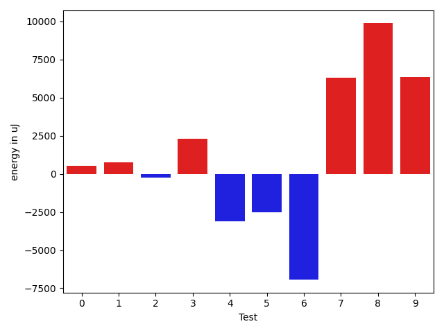

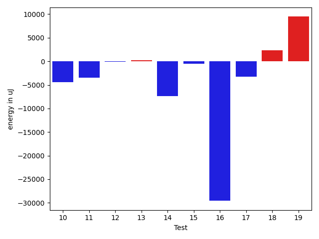

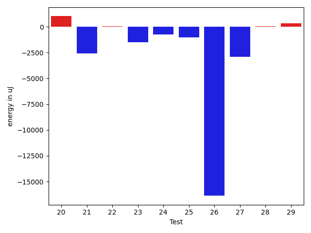

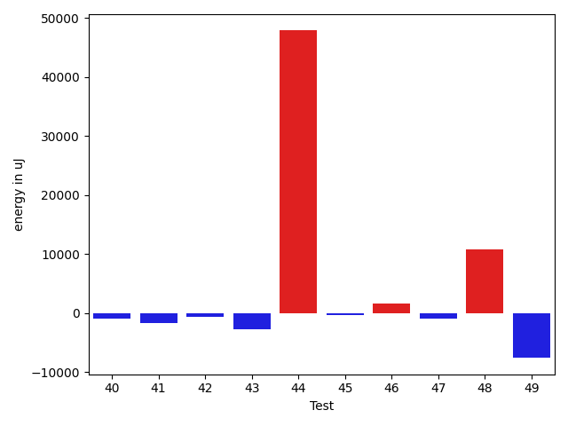

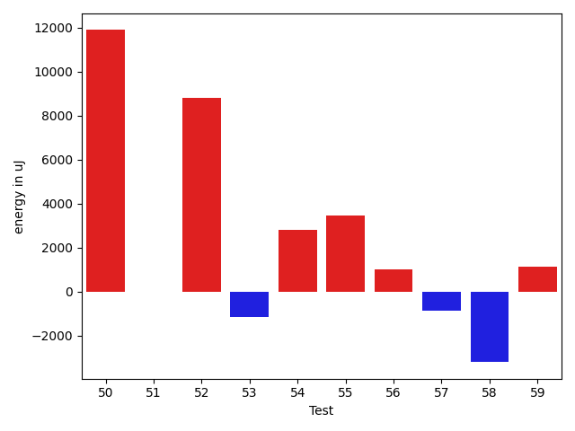

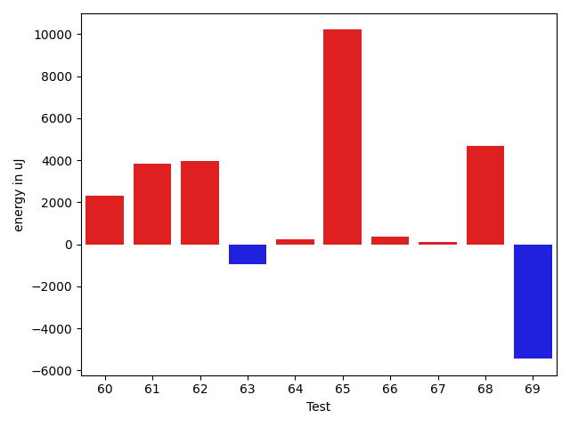

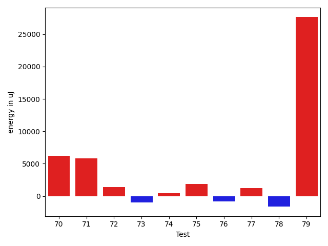

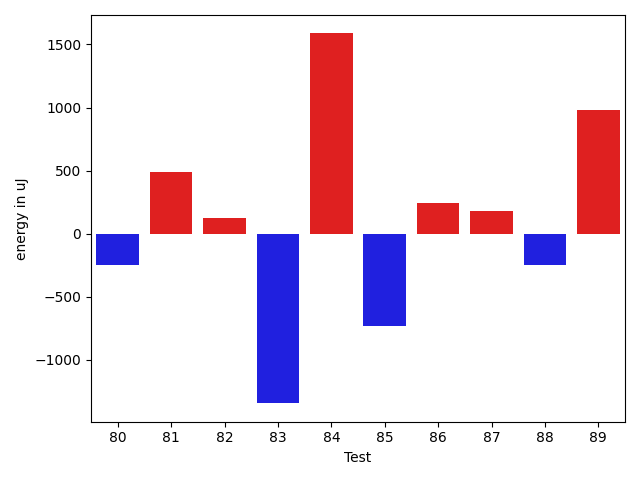

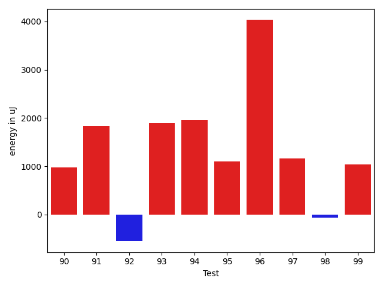

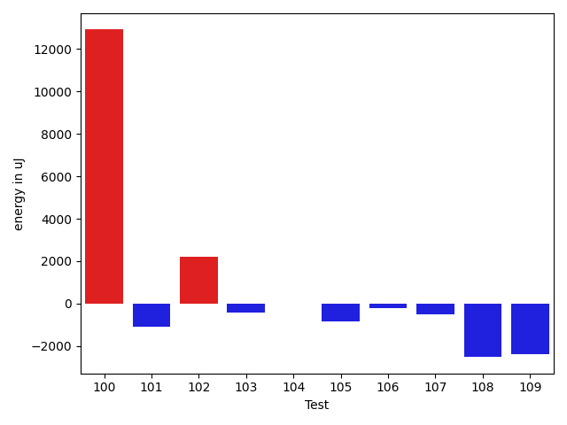

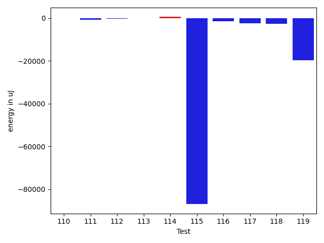

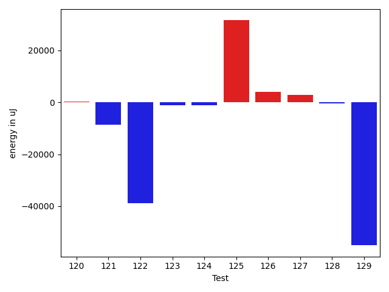

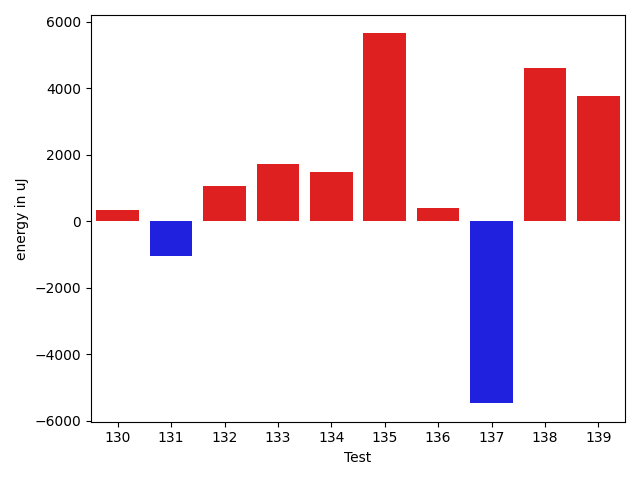

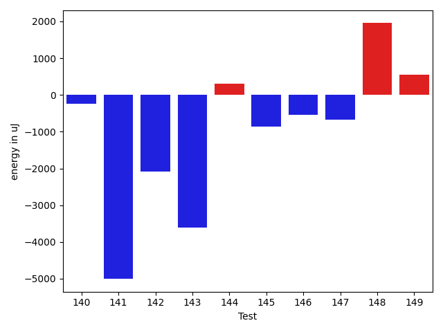

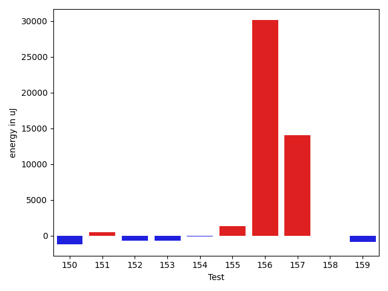

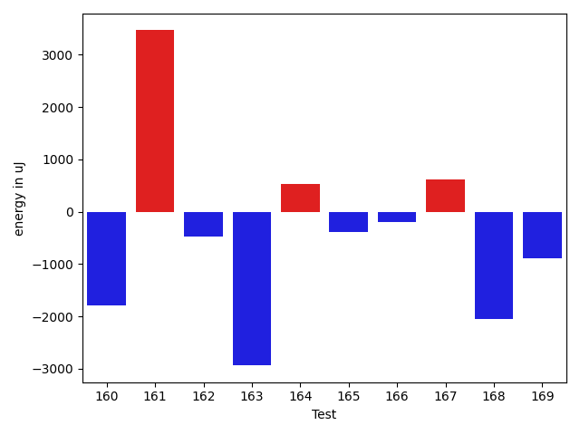

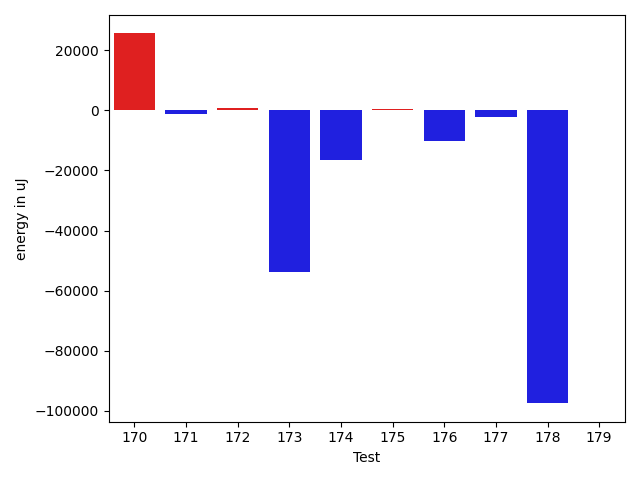

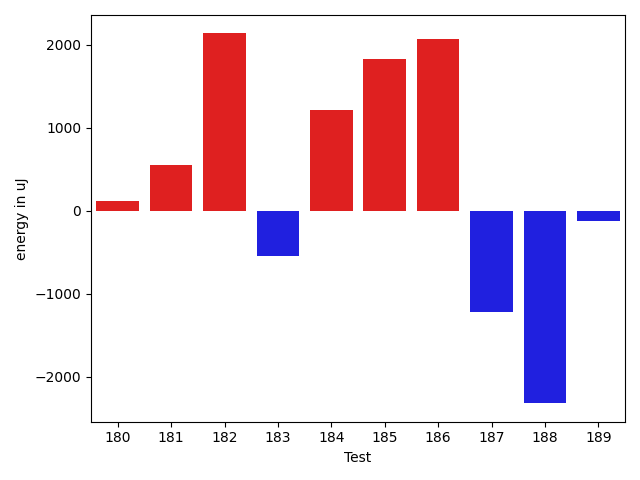

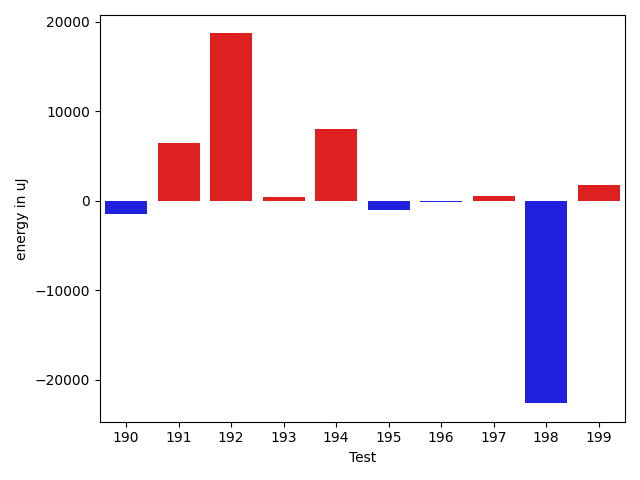

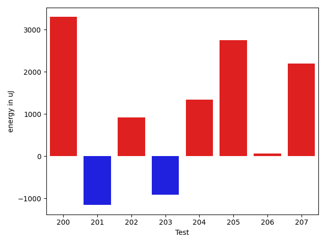

| ID | EnergyV1 | EnergyV2 | DeltaEnergy | σV1 | σV2 |
| --- | --- | --- | --- | --- | --- |
| 0 | 39550 | 40893 | 1343 | 10027.907166814033 | 10102.30095584794 |
| 1 | 37354 | 38513 | 1159 | 4371.1154048821145 | 3749.1583962633676 |
| 2 | 36743 | 35522 | -1221 | 3802.0520721294274 | 4829.900216967981 |
| 3 | 35034 | 37597 | 2563 | 2982.144305696825 | 4001.162176467819 |
| 4 | 36926 | 36621 | -305 | 16091.610577604983 | 7077.491052091848 |
| 5 | 37232 | 36743 | -489 | 13009.453305182093 | 19268.297441796865 |
| 6 | 66101 | 40649 | -25452 | 25788.025898241904 | 28766.238164691258 |
| 7 | 37232 | 36743 | -489 | 3646.8878464090058 | 34158.69300888509 |
| 8 | 37476 | 37719 | 243 | 3375.435604458893 | 45004.31824531534 |
| 9 | 36132 | 37597 | 1465 | 2832.12966826316 | 26566.59427121715 |
| 10 | 37475 | 36804 | -671 | 32021.335890354727 | 6106.820722282771 |
| 11 | 40894 | 39245 | -1649 | 20453.442179330945 | 19621.58134649631 |
| 12 | 36560 | 36315 | -245 | 3480.3723781848053 | 3968.5727173267233 |
| 13 | 37353 | 37964 | 611 | 4420.050318856618 | 3705.234358379916 |
| 14 | 35828 | 36866 | 1038 | 57176.674887023546 | 4951.056692066407 |
| 15 | 37354 | 36560 | -794 | 14118.08871003349 | 15236.49692424382 |
| 16 | 36987 | 37292 | 305 | 98292.70851538275 | 3954.362053479676 |
| 17 | 36132 | 36316 | 184 | 21099.75303729783 | 4343.432072320103 |
| 18 | 35400 | 38269 | 2869 | 3735.107703384228 | 4387.765356361391 |
| 19 | 35339 | 38208 | 2869 | 11912.130893276373 | 55995.16997272792 |
| 20 | 35828 | 35462 | -366 | 3050.8306153438966 | 5577.975488508353 |
| 21 | 37109 | 37293 | 184 | 29223.999159203773 | 11759.075599995094 |
| 22 | 36560 | 36743 | 183 | 5726.233786250538 | 3394.5756629218995 |
| 23 | 38758 | 36743 | -2015 | 3935.3006007035883 | 4581.323465865392 |
| 24 | 37232 | 36865 | -367 | 7212.533568340267 | 5577.648473693349 |
| 25 | 36072 | 35949 | -123 | 3423.5996667549252 | 3917.4329190369453 |
| 26 | 37780 | 36621 | -1159 | 44362.119848824645 | 11490.456279222592 |
| 27 | 38940 | 40283 | 1343 | 97684.8835403492 | 94115.47616971383 |
| 28 | 35767 | 35584 | -183 | 3785.701716987222 | 3376.997185370459 |
| 29 | 36621 | 37232 | 611 | 3741.77319209673 | 3710.2755760975406 |
| 30 | 36438 | 36133 | -305 | 29981.721433655977 | 4549.061089842986 |
| 31 | 36987 | 36499 | -488 | 5697.855412248444 | 9446.753808349773 |
| 32 | 37720 | 36926 | -794 | 4134.769293479322 | 4798.902873079103 |
| 33 | 37536 | 34912 | -2624 | 2686.8253474128164 | 37929.08805679904 |
| 34 | 37476 | 36865 | -611 | 3995.222321464601 | 3824.1598190098744 |
| 35 | 36804 | 36010 | -794 | 4304.105763435595 | 4053.738125475122 |
| 36 | 35522 | 36316 | 794 | 3601.2941780594942 | 4814.915007855484 |
| 37 | 38757 | 38452 | -305 | 4173.141941023413 | 3746.025537928546 |
| 38 | 38574 | 37170 | -1404 | 5798.468766832374 | 7675.242452868671 |
| 39 | 45593 | 43212 | -2381 | 63108.20065177057 | 99045.0394034851 |
| 40 | 37841 | 36621 | -1220 | 3950.317285133326 | 4165.438241061793 |
| 41 | 39917 | 38696 | -1221 | 15577.239141599726 | 14092.755338975076 |
| 42 | 38513 | 37780 | -733 | 13034.372239923372 | 8393.726212379997 |
| 43 | 37170 | 36865 | -305 | 17883.527435150598 | 4247.0643452002105 |
| 44 | 39611 | 38025 | -1586 | 4865.010632193729 | 291894.7278007703 |
| 45 | 38697 | 37476 | -1221 | 4360.108730876069 | 4028.5885894308967 |
| 46 | 38513 | 39062 | 549 | 290119.6363937782 | 295755.7912435488 |
| 47 | 39368 | 38696 | -672 | 6207.813787818921 | 4635.52630224071 |
| 48 | 36743 | 40649 | 3906 | 6424.178433126117 | 37027.293285714615 |
| 49 | 38940 | 37658 | -1282 | 34157.19938072263 | 3143.271069527559 |
| 50 | 40039 | 39550 | -489 | 36150.44200787955 | 67751.35261418133 |
| 51 | 39795 | 38269 | -1526 | 4036.4711707734436 | 5054.731933383545 |
| 52 | 42297 | 43274 | 977 | 66512.23487552907 | 62610.304079700174 |
| 53 | 40344 | 38269 | -2075 | 13322.682026717277 | 15298.764646595208 |
| 54 | 38452 | 37964 | -488 | 8035.904188269587 | 25888.979235154566 |
| 55 | 38513 | 38635 | 122 | 30038.13646156055 | 36365.56826783693 |
| 56 | 37659 | 38818 | 1159 | 3951.764146272977 | 3141.8259608697394 |
| 57 | 39062 | 39856 | 794 | 8999.106217965327 | 6080.861206695082 |
| 58 | 42724 | 44250 | 1526 | 73408.58247888372 | 62028.47889752732 |
| 59 | 38941 | 39856 | 915 | 8207.499966487767 | 8575.192904778683 |
| 60 | 39551 | 40344 | 793 | 18848.259844529577 | 21362.84333522121 |
| 61 | 38940 | 40100 | 1160 | 12010.802029522742 | 14477.519394679442 |
| 62 | 39734 | 41320 | 1586 | 39794.36801169367 | 38589.65328577599 |
| 63 | 38757 | 35523 | -3234 | 4641.848433692935 | 4141.295875368452 |
| 64 | 37536 | 37109 | -427 | 3978.465023339764 | 4969.251872068038 |
| 65 | 122375 | 128906 | 6531 | 83172.41567393392 | 97948.4466624196 |
| 66 | 37964 | 38513 | 549 | 3295.1062017613986 | 4292.771161879456 |
| 67 | 38941 | 38330 | -611 | 3592.8360062303555 | 3983.618799220126 |
| 68 | 37903 | 39246 | 1343 | 20892.265773566825 | 35470.095238857415 |
| 69 | 38880 | 38879 | -1 | 43215.59513776376 | 25501.522865715062 |
| 70 | 37170 | 39184 | 2014 | 7012.886013858688 | 23704.718035367154 |
| 71 | 37292 | 40344 | 3052 | 3914.897690177383 | 26535.51662246144 |
| 72 | 36194 | 37353 | 1159 | 3010.300962162709 | 3915.786640989455 |
| 73 | 42236 | 40893 | -1343 | 47807.538578935135 | 46347.51475042944 |
| 74 | 38513 | 37720 | -793 | 57949.62500475774 | 57081.254252297724 |
| 75 | 40283 | 40100 | -183 | 19927.112419431323 | 19651.851699224382 |
| 76 | 38269 | 37842 | -427 | 3804.219565167079 | 3187.0887345783344 |
| 77 | 38330 | 37354 | -976 | 9921.25301496433 | 18342.154646416162 |
| 78 | 39612 | 36315 | -3297 | 3465.833434408198 | 3981.552255950424 |
| 79 | 41259 | 40283 | -976 | 103341.41345388172 | 129487.29536893746 |
| 80 | 35827 | 35583 | -244 | 2708.473602315125 | 4212.696124811283 |
| 81 | 37292 | 37781 | 489 | 3746.643523206642 | 3914.3191672606595 |
| 82 | 35828 | 35950 | 122 | 3745.156047975636 | 3999.130899254862 |
| 83 | 38757 | 37414 | -1343 | 3864.058938373531 | 4619.808411197681 |
| 84 | 36011 | 37598 | 1587 | 2502.021689583724 | 4392.983054078578 |
| 85 | 40222 | 39490 | -732 | 44197.68283559019 | 40560.013877989426 |
| 86 | 37964 | 38208 | 244 | 3249.2997215400123 | 4627.302423294283 |
| 87 | 38574 | 38757 | 183 | 5745.379635697195 | 4551.189779919038 |
| 88 | 38696 | 38452 | -244 | 20662.696306051028 | 17484.806105207288 |
| 89 | 37597 | 38574 | 977 | 3728.2749147351983 | 3789.4341890596656 |
| 90 | 37232 | 38208 | 976 | 3291.3137519888487 | 4284.581411927253 |
| 91 | 37597 | 39428 | 1831 | 5800.5255190887665 | 10547.661677883574 |
| 92 | 39673 | 39123 | -550 | 16229.368778811056 | 31025.78182264804 |
| 93 | 37719 | 39611 | 1892 | 3660.584218703652 | 4165.54900041424 |
| 94 | 38269 | 40223 | 1954 | 46366.75372237611 | 53308.223936030336 |
| 95 | 37293 | 38391 | 1098 | 6056.047053881956 | 3819.2467522939382 |
| 96 | 36010 | 40039 | 4029 | 4612.747476661465 | 3936.4943900430285 |
| 97 | 36438 | 37598 | 1160 | 30046.481328608173 | 4202.1385215381715 |
| 98 | 38697 | 38635 | -62 | 3641.0880002449826 | 3887.8315240471775 |
| 99 | 37659 | 38696 | 1037 | 3989.6586874462955 | 5294.311362440741 |
| 100 | 40466 | 41992 | 1526 | 80930.6854670043 | 240688.76472363534 |
| 101 | 80566 | 81482 | 916 | 35497.53239524422 | 37068.16888467805 |
| 102 | 82031 | 80261 | -1770 | 278776.13811333076 | 329625.34775892127 |
| 103 | 37231 | 36804 | -427 | 4271.751854925468 | 3818.22378945518 |
| 104 | 36499 | 35157 | -1342 | 4026.356005422019 | 3739.3488106516515 |
| 105 | 38635 | 36866 | -1769 | 3347.401892826549 | 5423.387235419035 |
| 106 | 35584 | 37476 | 1892 | 4066.5608630051574 | 3732.152250591826 |
| 107 | 36926 | 36621 | -305 | 3881.7342696011433 | 4074.300588544329 |
| 108 | 37598 | 38635 | 1037 | 52798.12625799578 | 51284.24428857045 |
| 109 | 38635 | 36316 | -2319 | 3798.791054014036 | 5283.040891590962 |
| 110 | 38330 | 37598 | -732 | 3671.913925626695 | 4056.4974047368355 |
| 111 | 35584 | 35583 | -1 | 4080.6055624951878 | 3702.729074014943 |
| 112 | 35156 | 35584 | 428 | 3976.591607825349 | 4549.105238876652 |
| 113 | 37475 | 37597 | 122 | 3795.310083080807 | 4742.195639857807 |
| 114 | 36560 | 37598 | 1038 | 3981.5051353074177 | 4224.741800861991 |
| 115 | 163818 | 153748 | -10070 | 334790.56927085016 | 59496.322276875486 |
| 116 | 38330 | 37049 | -1281 | 4215.058651346243 | 4172.751929696988 |
| 117 | 39306 | 37048 | -2258 | 7462.185104298605 | 3882.8121861109944 |
| 118 | 38391 | 36743 | -1648 | 8820.300340722295 | 4379.438392570504 |
| 119 | 41076 | 37415 | -3661 | 50689.53748189605 | 4607.189790813192 |
| 120 | 36377 | 37964 | 1587 | 5040.204193583767 | 3652.8874023674753 |
| 121 | 39733 | 37902 | -1831 | 32111.926007063583 | 24008.250803280484 |
| 122 | 40161 | 38940 | -1221 | 374732.47329554264 | 209172.42723053767 |
| 123 | 37964 | 38147 | 183 | 4308.926167366355 | 4842.358949768181 |
| 124 | 38330 | 37537 | -793 | 6098.802205554738 | 3346.79186874462 |
| 125 | 78552 | 77087 | -1465 | 329480.2877010504 | 380244.41918372293 |
| 126 | 40161 | 40954 | 793 | 20999.04766523804 | 22586.377304730555 |
| 127 | 79162 | 81970 | 2808 | 61681.365513467346 | 60685.119237257175 |
| 128 | 39490 | 39550 | 60 | 13899.38097519432 | 13330.019466577227 |
| 129 | 82214 | 85266 | 3052 | 441091.6593016771 | 253901.15253625705 |
| 130 | 39368 | 38879 | -489 | 8558.417682387595 | 10388.533374632738 |
| 131 | 38268 | 37842 | -426 | 14900.891965619838 | 15040.717329011528 |
| 132 | 39306 | 40161 | 855 | 16543.056081738516 | 19346.159467913087 |
| 133 | 36316 | 37964 | 1648 | 3181.017948708036 | 6728.941848217029 |
| 134 | 39673 | 39795 | 122 | 18795.816110083502 | 19430.44713763211 |
| 135 | 38940 | 39063 | 123 | 56137.06395287926 | 65974.05644701257 |
| 136 | 37659 | 37231 | -428 | 3841.082804785823 | 4280.252246225666 |
| 137 | 39551 | 38208 | -1343 | 24459.611482210366 | 18592.961363758994 |
| 138 | 38086 | 39246 | 1160 | 3619.9378836659616 | 12657.113550746595 |
| 139 | 38208 | 38696 | 488 | 8325.574863408112 | 16068.409486950206 |
| 140 | 36438 | 36194 | -244 | 3636.317907020192 | 3711.043860290045 |
| 141 | 70740 | 65735 | -5005 | 93093.4967431137 | 38673.67806240794 |
| 142 | 37964 | 35889 | -2075 | 3698.170030756954 | 3429.800649614165 |
| 143 | 78552 | 74951 | -3601 | 27647.06209437007 | 26159.329592395898 |
| 144 | 36743 | 37048 | 305 | 3828.8270579904756 | 8207.211494412717 |
| 145 | 39245 | 38391 | -854 | 66331.17167258587 | 23916.88200806398 |
| 146 | 44678 | 44129 | -549 | 20567.450863109603 | 21171.709901080176 |
| 147 | 39612 | 38940 | -672 | 21724.14691914333 | 29862.932710804907 |
| 148 | 71961 | 73913 | 1952 | 36200.29179177513 | 24080.55847014904 |
| 149 | 36072 | 36621 | 549 | 3220.0578491871893 | 6026.573257960122 |
| 150 | 38269 | 37048 | -1221 | 3545.6049190055815 | 13426.10967294066 |
| 151 | 36010 | 36499 | 489 | 2841.561049393244 | 4161.324915535688 |
| 152 | 37109 | 36438 | -671 | 8598.331143534631 | 6134.422112735192 |
| 153 | 36621 | 35889 | -732 | 3884.914300336662 | 4118.58958495592 |
| 154 | 37353 | 37292 | -61 | 4462.216902992306 | 3837.6057155242015 |
| 155 | 40344 | 41687 | 1343 | 37063.97819796705 | 55460.16475842906 |
| 156 | 231322 | 261413 | 30091 | 84309.93442946847 | 92194.91622081204 |
| 157 | 385009 | 399047 | 14038 | 137395.52592623112 | 136910.47894878354 |
| 158 | 41077 | 41076 | -1 | 34367.2938110065 | 50536.098296701806 |
| 159 | 38879 | 38024 | -855 | 4533.637137406658 | 4101.890802779031 |
| 160 | 40405 | 39063 | -1342 | 11627.595894146601 | 9778.561751221308 |
| 161 | 39551 | 41260 | 1709 | 44075.57874443687 | 49753.981069636444 |
| 162 | 37842 | 36988 | -854 | 7403.61474123866 | 5966.265854724895 |
| 163 | 38513 | 38452 | -61 | 25314.32498550429 | 7379.494896427948 |
| 164 | 36255 | 36683 | 428 | 4499.538237373234 | 4616.3002448953 |
| 165 | 36499 | 36560 | 61 | 4171.836938915273 | 3565.8764096581076 |
| 166 | 38941 | 39246 | 305 | 14163.69711497827 | 13228.031697583981 |
| 167 | 36377 | 37476 | 1099 | 5743.696038105175 | 6766.70402632015 |
| 168 | 39489 | 40283 | 794 | 22413.867003881 | 17865.63109586669 |
| 169 | 38635 | 38635 | 0 | 27865.7741775639 | 19307.43527717755 |
| 170 | 39368 | 41320 | 1952 | 65656.15595793995 | 81489.86830795376 |
| 171 | 40466 | 37414 | -3052 | 3925.638695434392 | 3905.3088635363933 |
| 172 | 39795 | 40100 | 305 | 5023.561391071229 | 4994.489771090678 |
| 173 | 40527 | 40039 | -488 | 436838.0347742513 | 348344.6805851928 |
| 174 | 38818 | 41809 | 2991 | 74852.71191271476 | 67597.92737632756 |
| 175 | 37414 | 37841 | 427 | 5263.979389723339 | 4590.394900732895 |
| 176 | 37414 | 37293 | -121 | 52323.30106724281 | 3673.837860582628 |
| 177 | 39062 | 39123 | 61 | 9872.552996396964 | 4717.443350116964 |
| 178 | 41870 | 43274 | 1404 | 534843.41750539 | 249637.60393010674 |
| 179 | 39368 | 39917 | 549 | 5540.51449015534 | 4721.916829677829 |
| 180 | 79833 | 79956 | 123 | 21637.756977332494 | 27729.33153787141 |
| 181 | 37842 | 38391 | 549 | 5628.319781944916 | 9220.491342515978 |
| 182 | 40405 | 42542 | 2137 | 50945.5890679924 | 63803.87744122435 |
| 183 | 39672 | 39124 | -548 | 14647.773155645507 | 11071.065210251832 |
| 184 | 37232 | 38452 | 1220 | 3484.5920975632143 | 6021.462715926249 |
| 185 | 35766 | 37597 | 1831 | 4001.3582897668557 | 3624.722020945272 |
| 186 | 37171 | 39245 | 2074 | 3916.7122740442933 | 4354.524223947106 |
| 187 | 39551 | 38330 | -1221 | 30065.59684897312 | 10506.365688996826 |
| 188 | 40832 | 38513 | -2319 | 4381.443450514816 | 3552.8668383808786 |
| 189 | 38575 | 38452 | -123 | 4028.4179206371646 | 4594.822829037798 |
| 190 | 38024 | 38269 | 245 | 3474.1807413445563 | 3688.560838094789 |
| 191 | 39734 | 39550 | -184 | 20122.01319825661 | 31588.43541248296 |
| 192 | 40039 | 40344 | 305 | 61378.71543259335 | 94616.91340817061 |
| 193 | 36255 | 36071 | -184 | 4034.2104330564885 | 4072.359148225523 |
| 194 | 39612 | 39673 | 61 | 102398.4806687462 | 106017.90415755258 |
| 195 | 39062 | 36011 | -3051 | 4881.965928689885 | 3850.028661175324 |
| 196 | 38086 | 39185 | 1099 | 4312.95279195124 | 3515.6048546270877 |
| 197 | 39001 | 38513 | -488 | 9665.757573997496 | 11554.339032031221 |
| 198 | 79651 | 80688 | 1037 | 243668.79273029213 | 53069.878641784824 |
| 199 | 40344 | 39612 | -732 | 6093.689062938471 | 13094.844650073175 |
| 200 | 80261 | 83557 | 3296 | 365032.5696686755 | 189432.26698251674 |
| 201 | 37597 | 36438 | -1159 | 4576.731776559052 | 4004.8408762546105 |
| 202 | 38757 | 39673 | 916 | 16022.890503034158 | 15784.919515506577 |
| 203 | 38086 | 37170 | -916 | 401491.1036430444 | 352383.3590853141 |
| 204 | 38696 | 40039 | 1343 | 55437.80013154657 | 62465.91102864868 |
| 205 | 38879 | 41626 | 2747 | 73486.17165435024 | 65985.60200866213 |
| 206 | 38391 | 38452 | 61 | 4032.413284200987 | 4784.851645704907 |
| 207 | 39429 | 41626 | 2197 | 57610.717586248385 | 106127.76020604362 |

## Delta Duration per test method

| ID | DurationV1 | DurationsV2 | DeltaDuration |
| --- | --- | --- | --- |
| 0 | 1051240.9375 | 996823.7049180327 | -54417.232581967255 |
| 1 | 693202.8260869565 | 580750.3333333334 | -112452.49275362317 |
| 2 | 924825.5714285715 | 578749.25 | -346076.3214285715 |
| 3 | 454277.85 | 421235.7727272727 | -33042.07727272727 |
| 4 | 1227778.6944444445 | 1092533.950617284 | -135244.74382716045 |
| 5 | 1132732.7662337662 | 1155281.2916666667 | 22548.525432900526 |
| 6 | 1922677.7171717172 | 1833023.606060606 | -89654.11111111124 |
| 7 | 580877.8928571428 | 764189.3214285715 | 183311.42857142864 |
| 8 | 508014.5652173913 | 779054.7619047619 | 271040.1966873706 |
| 9 | 549689.3225806452 | 767103.1851851852 | 217413.86260453996 |
| 10 | 960178.7735849057 | 975517.9411764706 | 15339.16759156494 |
| 11 | 1610610.7790697673 | 1563694.9139784947 | -46915.86509127263 |
| 12 | 746672.9565217391 | 737405.2972972973 | -9267.659224441857 |
| 13 | 528118.7142857143 | 583343.4411764706 | 55224.72689075628 |
| 14 | 1030169.3 | 757738.7291666666 | -272430.5708333334 |
| 15 | 895218.6 | 796761.0882352941 | -98457.51176470588 |
| 16 | 1464394.35 | 499739.1666666667 | -964655.1833333333 |
| 17 | 919542.3018867924 | 792372.7647058824 | -127169.53718091 |
| 18 | 572576.2702702703 | 822124.8076923077 | 249548.53742203745 |
| 19 | 672281.5172413794 | 1022344.3055555555 | 350062.78831417614 |
| 20 | 493142.9655172414 | 491720.44 | -1422.525517241389 |
| 21 | 735773.4642857143 | 606785.16 | -128988.30428571429 |
| 22 | 791171.1395348837 | 742800.0454545454 | -48371.094080338255 |
| 23 | 607197.8387096775 | 558830.1333333333 | -48367.70537634415 |
| 24 | 948884.8965517242 | 903129.578125 | -45755.318426724174 |
| 25 | 665746.0 | 611611.5 | -54134.5 |
| 26 | 1356276.3333333333 | 777875.0 | -578401.3333333333 |
| 27 | 1723326.4782608696 | 1521506.2121212122 | -201820.26613965747 |
| 28 | 415865.9 | 412056.35 | -3809.5500000000466 |
| 29 | 763542.65625 | 575614.75 | -187927.90625 |
| 30 | 821463.3684210526 | 642865.5945945946 | -178597.77382645803 |
| 31 | 749296.5666666667 | 656850.6470588235 | -92445.91960784316 |
| 32 | 700644.8108108108 | 810442.6585365854 | 109797.84772577463 |
| 33 | 487795.2 | 630967.6521739131 | 143172.45217391307 |
| 34 | 570481.7307692308 | 580385.947368421 | 9904.216599190258 |
| 35 | 599584.6944444445 | 594763.5833333334 | -4821.111111111124 |
| 36 | 776722.5 | 691872.4705882353 | -84850.0294117647 |
| 37 | 513843.2413793103 | 553206.3913043478 | 39363.14992503746 |
| 38 | 729337.3958333334 | 763792.380952381 | 34454.985119047575 |
| 39 | 1985515.797979798 | 2543210.97979798 | 557695.1818181819 |
| 40 | 872956.6181818182 | 853468.1764705882 | -19488.44171122997 |
| 41 | 1387535.573033708 | 1425799.5263157894 | 38263.95328208152 |
| 42 | 1096449.25 | 1128789.938271605 | 32340.688271604944 |
| 43 | 970800.5737704918 | 904826.0983606557 | -65974.47540983604 |
| 44 | 760703.9777777778 | 2327908.75 | 1567204.7722222223 |
| 45 | 631704.4722222222 | 685370.2258064516 | 53665.75358422939 |
| 46 | 2116311.3396226414 | 1959091.08 | -157220.25962264137 |
| 47 | 657499.3928571428 | 627429.7407407408 | -30069.652116402052 |
| 48 | 535291.7391304348 | 883840.0 | 348548.2608695652 |
| 49 | 877245.25 | 541386.8636363636 | -335858.38636363635 |
| 50 | 915976.3488372093 | 1427132.1818181819 | 511155.8329809726 |
| 51 | 531538.2413793104 | 642398.5714285715 | 110860.3300492611 |
| 52 | 2020156.9591836734 | 2123197.5102040814 | 103040.55102040805 |
| 53 | 891208.3225806452 | 878984.1842105263 | -12224.138370118919 |
| 54 | 722831.7575757576 | 843253.0769230769 | 120421.31934731931 |
| 55 | 1050804.6041666667 | 1163886.9166666667 | 113082.3125 |
| 56 | 671458.9545454546 | 686165.6666666666 | 14706.71212121204 |
| 57 | 934916.55 | 904108.8703703703 | -30807.67962962971 |
| 58 | 2201090.815217391 | 2023212.2978723405 | -177878.51734505058 |
| 59 | 934938.4318181818 | 941879.5416666666 | 6941.109848484863 |
| 60 | 1291026.8813559322 | 1438849.2535211267 | 147822.37216519448 |
| 61 | 1183905.5294117648 | 1337393.9268292682 | 153488.3974175034 |
| 62 | 1707097.1267605633 | 1813963.7294117648 | 106866.60265120142 |
| 63 | 596590.3214285715 | 629867.5 | 33277.17857142852 |
| 64 | 833282.8653846154 | 923485.8421052631 | 90202.97672064777 |
| 65 | 4073698.1616161615 | 4414953.818181818 | 341255.6565656569 |
| 66 | 631945.1052631579 | 652445.8958333334 | 20500.790570175508 |
| 67 | 762331.5454545454 | 829701.6 | 67370.05454545456 |
| 68 | 921043.1212121212 | 993322.9318181818 | 72279.81060606055 |
| 69 | 1020560.5 | 907163.2647058824 | -113397.23529411759 |
| 70 | 668630.4186046511 | 858311.8297872341 | 189681.41118258296 |
| 71 | 483998.42307692306 | 664212.0344827586 | 180213.61140583555 |
| 72 | 520338.73913043475 | 486262.6153846154 | -34076.12374581938 |
| 73 | 1948775.0760869565 | 2070881.8736842105 | 122106.79759725393 |
| 74 | 1399789.3703703703 | 1532920.3103448276 | 133130.93997445726 |
| 75 | 1369537.7608695652 | 1433662.5274725275 | 64124.76660296228 |
| 76 | 423619.5416666667 | 465918.4705882353 | 42298.928921568615 |
| 77 | 1065974.5142857144 | 1138148.5675675676 | 72174.05328185321 |
| 78 | 455044.8333333333 | 428216.6923076923 | -26828.141025641 |
| 79 | 2066495.0789473683 | 3171321.742857143 | 1104826.6639097745 |
| 80 | 516517.1538461539 | 901549.1333333333 | 385031.97948717943 |
| 81 | 619634.5555555555 | 603647.7419354839 | -15986.813620071625 |
| 82 | 724942.1627906977 | 736877.35 | 11935.187209302327 |
| 83 | 409852.36842105264 | 458580.55555555556 | 48728.18713450292 |
| 84 | 511319.90476190473 | 478288.17391304346 | -33031.730848861276 |
| 85 | 1563498.6382978724 | 1518693.1020408163 | -44805.536257056054 |
| 86 | 810233.64 | 814395.6981132076 | 4162.058113207575 |
| 87 | 814803.9230769231 | 773569.8444444444 | -41234.07863247872 |
| 88 | 1079939.1346153845 | 997331.2222222222 | -82607.91239316226 |
| 89 | 621765.28125 | 583610.6071428572 | -38154.67410714284 |
| 90 | 517317.8965517241 | 501100.64705882355 | -16217.249492900562 |
| 91 | 768551.48 | 816080.3125 | 47528.83250000002 |
| 92 | 1241101.4597701149 | 1417320.8131868131 | 176219.3534166983 |
| 93 | 598505.6 | 622446.6538461539 | 23941.053846153896 |
| 94 | 1193139.0384615385 | 1509529.7575757576 | 316390.7191142191 |
| 95 | 713059.8867924528 | 939264.1463414634 | 226204.25954901066 |
| 96 | 460764.3333333333 | 600639.0 | 139874.6666666667 |
| 97 | 689766.16 | 597667.3333333334 | -92098.82666666666 |
| 98 | 564341.0 | 573059.3 | 8718.300000000047 |
| 99 | 705324.8979591837 | 789763.1481481482 | 84438.25018896454 |
| 100 | 1544298.1285714286 | 2101420.5362318843 | 557122.4076604557 |
| 101 | 2743286.737373737 | 2638135.111111111 | -105151.62626262615 |
| 102 | 4691253.05050505 | 4744115.414141414 | 52862.3636363633 |
| 103 | 851366.676923077 | 825667.7586206896 | -25698.91830238735 |
| 104 | 834747.1964285715 | 806477.7118644068 | -28269.484564164653 |
| 105 | 573381.2962962963 | 558702.4857142858 | -14678.810582010541 |
| 106 | 522761.1818181818 | 509440.0 | -13321.181818181823 |
| 107 | 951287.7714285714 | 981304.1363636364 | 30016.36493506492 |
| 108 | 1469432.2105263157 | 1357298.5757575757 | -112133.63476874004 |
| 109 | 546958.7586206896 | 489511.7 | -57447.05862068961 |
| 110 | 562680.3548387097 | 501904.76470588235 | -60775.59013282735 |
| 111 | 529230.5666666667 | 500731.43333333335 | -28499.133333333302 |
| 112 | 671738.3333333334 | 594866.75 | -76871.58333333337 |
| 113 | 559006.2162162162 | 569990.7307692308 | 10984.514553014538 |
| 114 | 899729.7272727273 | 827400.6666666666 | -72329.06060606067 |
| 115 | 7328500.303030303 | 4634662.02020202 | -2693838.2828282826 |
| 116 | 774822.9302325582 | 704365.1923076923 | -70457.73792486591 |
| 117 | 857976.1875 | 757125.3191489362 | -100850.86835106381 |
| 118 | 982748.4915254237 | 909734.2173913043 | -73014.27413411939 |
| 119 | 1388527.7608695652 | 756709.7948717949 | -631817.9659977703 |
| 120 | 703014.0263157894 | 613244.0 | -89770.02631578944 |
| 121 | 1185788.7837837837 | 739241.2352941176 | -446547.5484896661 |
| 122 | 2804167.730769231 | 1895220.9512195121 | -908946.7795497188 |
| 123 | 635088.0344827586 | 597500.24 | -37587.79448275862 |
| 124 | 902793.3090909091 | 940408.3225806452 | 37615.01348973613 |
| 125 | 3742868.202020202 | 4673943.03030303 | 931074.8282828284 |
| 126 | 1434155.75 | 1553565.5913978494 | 119409.84139784938 |
| 127 | 2857313.707070707 | 2895822.3232323234 | 38508.61616161652 |
| 128 | 1200824.925 | 1229578.8902439023 | 28753.96524390229 |
| 129 | 5433386.181818182 | 3691225.525252525 | -1742160.6565656564 |
| 130 | 1129889.5853658537 | 1130798.0 | 908.414634146262 |
| 131 | 1231462.9189189188 | 1204180.5930232557 | -27282.325895663118 |
| 132 | 939137.947368421 | 979069.9302325582 | 39931.98286413716 |
| 133 | 902995.0491803279 | 938275.3692307692 | 35280.32005044131 |
| 134 | 1368786.8924731184 | 1417163.3958333333 | 48376.503360214876 |
| 135 | 1216024.462962963 | 1445280.66 | 229256.197037037 |
| 136 | 582325.7297297297 | 664073.0344827586 | 81747.3047530289 |
| 137 | 1256480.7083333333 | 1073935.5 | -182545.20833333326 |
| 138 | 1078517.0266666666 | 1271245.3614457832 | 192728.33477911656 |
| 139 | 875880.1153846154 | 875057.5294117647 | -822.5859728506766 |
| 140 | 840428.6612903225 | 835071.1206896552 | -5357.540600667358 |
| 141 | 2700251.0425531915 | 1997264.197802198 | -702986.8447509937 |
| 142 | 540890.6666666666 | 510425.78125 | -30464.885416666628 |
| 143 | 2425053.5757575757 | 2303040.8282828284 | -122012.74747474724 |
| 144 | 1082358.12 | 1018741.7468354431 | -63616.37316455704 |
| 145 | 1854108.4268292682 | 1256671.1604938272 | -597437.266335441 |
| 146 | 1750324.0909090908 | 1730048.7777777778 | -20275.313131313073 |
| 147 | 1280513.3417721519 | 1355071.0704225353 | 74557.72865038342 |
| 148 | 2304076.224489796 | 2142075.1458333335 | -162001.0786564625 |
| 149 | 941899.8333333334 | 920700.0 | -21199.833333333372 |
| 150 | 827603.6206896552 | 944041.2807017544 | 116437.6600120992 |
| 151 | 938424.8333333334 | 892014.3492063492 | -46410.48412698414 |
| 152 | 1036427.8142857143 | 974613.1388888889 | -61814.67539682542 |
| 153 | 790987.3859649122 | 790639.0212765958 | -348.36468831647653 |
| 154 | 858608.9803921569 | 822174.6896551724 | -36434.29073698446 |
| 155 | 1496421.4705882352 | 1835746.5666666667 | 339325.09607843147 |
| 156 | 7112564.95959596 | 7557235.757575758 | 444670.79797979817 |
| 157 | 10970506.212121213 | 11575254.575757576 | 604748.3636363633 |
| 158 | 1486460.5909090908 | 1850335.595505618 | 363875.0045965272 |
| 159 | 675154.6111111111 | 739575.0465116279 | 64420.435400516726 |
| 160 | 1108600.527027027 | 1150314.6962025317 | 41714.16917550471 |
| 161 | 1358133.9803921569 | 1550166.3214285714 | 192032.3410364145 |
| 162 | 819818.1730769231 | 773606.3818181818 | -46211.79125874129 |
| 163 | 1237175.962962963 | 1126691.0675675676 | -110484.89539539535 |
| 164 | 671386.3793103448 | 651640.4285714285 | -19745.95073891629 |
| 165 | 640990.9142857143 | 565962.5581395349 | -75028.35614617937 |
| 166 | 1182339.78125 | 1176734.0 | -5605.78125 |
| 167 | 985492.0151515151 | 935763.0597014925 | -49728.95545002259 |
| 168 | 1120386.4090909092 | 1078178.5957446808 | -42207.81334622833 |
| 169 | 1047219.6428571428 | 990393.36 | -56826.282857142854 |
| 170 | 1116979.4333333333 | 1926789.3684210526 | 809809.9350877192 |
| 171 | 587140.4642857143 | 592910.4444444445 | 5769.980158730177 |
| 172 | 759222.2894736842 | 787017.8235294118 | 27795.53405572765 |
| 173 | 5239415.794117647 | 3731573.638888889 | -1507842.1552287582 |
| 174 | 2119300.0384615385 | 1362276.0 | -757024.0384615385 |
| 175 | 895865.9722222222 | 571751.7307692308 | -324114.2414529915 |
| 176 | 1006273.8 | 664149.7142857143 | -342124.0857142857 |
| 177 | 1138777.641025641 | 945195.2881355932 | -193582.35289004783 |
| 178 | 5488966.212121212 | 2433845.171875 | -3055121.040246212 |
| 179 | 860619.0153846154 | 841683.3559322034 | -18935.659452412045 |
| 180 | 2618079.1717171716 | 2718470.1515151514 | 100390.97979797982 |
| 181 | 932494.0447761194 | 1022476.71875 | 89982.67397388059 |
| 182 | 1995878.0606060605 | 2256297.7346938774 | 260419.67408781685 |
| 183 | 1067200.6666666667 | 1052827.953125 | -14372.713541666744 |
| 184 | 890861.04 | 912886.1230769231 | 22025.083076923038 |
| 185 | 666262.46875 | 579283.3846153846 | -86979.08413461538 |
| 186 | 604659.0606060605 | 660769.2727272727 | 56110.21212121216 |
| 187 | 1156148.2083333333 | 822094.2142857143 | -334053.99404761894 |
| 188 | 596669.6538461539 | 487052.4347826087 | -109617.21906354517 |
| 189 | 465776.85714285716 | 471712.6666666667 | 5935.809523809527 |
| 190 | 755460.2647058824 | 631080.6571428571 | -124379.60756302532 |
| 191 | 1130227.537313433 | 1292006.1470588236 | 161778.6097453907 |
| 192 | 1481366.5625 | 2107619.4 | 626252.8374999999 |
| 193 | 526196.0 | 537397.6521739131 | 11201.652173913084 |
| 194 | 2026006.8205128205 | 2174099.425 | 148092.6044871793 |
| 195 | 649353.7 | 814895.1304347826 | 165541.43043478264 |
| 196 | 625497.64 | 656997.2857142857 | 31499.645714285667 |
| 197 | 752039.4871794871 | 865365.2857142857 | 113325.79853479855 |
| 198 | 3467759.98989899 | 2722299.8282828284 | -745460.1616161615 |
| 199 | 1057765.4848484849 | 1172585.3181818181 | 114819.83333333326 |
| 200 | 4691605.01010101 | 3603814.111111111 | -1087790.898989899 |
| 201 | 690567.972972973 | 716941.1081081082 | 26373.135135135148 |
| 202 | 817492.9666666667 | 725356.8285714285 | -92136.13809523813 |
| 203 | 3170873.6603773586 | 2720750.873015873 | -450122.7873614854 |
| 204 | 1159113.0 | 1279909.7692307692 | 120796.76923076925 |
| 205 | 1382903.8823529412 | 1354511.7 | -28392.18235294125 |
| 206 | 913559.0384615385 | 929317.8727272727 | 15758.834265734185 |
| 207 | 1422136.7592592593 | 2302848.701754386 | 880711.9424951267 |

## Misc.

| ID | Test Class | Test Method |
| --- | --- | --- |
| 0 | com.google.gson.functional.PrimitiveTest | testDeserializePrimitiveWrapperAsObjectField |
| 1 | com.google.gson.functional.PrimitiveTest | testMoreSpecificSerialization |
| 2 | com.google.gson.functional.ObjectTest | testStringFieldWithEmptyValueDeserialization |
| 3 | com.google.gson.functional.ObjectTest | testNullObjectFieldsDeserialization |
| 4 | com.google.gson.functional.ObjectTest | testEmptyCollectionInAnObjectDeserialization |
| 5 | com.google.gson.functional.ObjectTest | testArrayOfArraysDeserialization |
| 6 | com.google.gson.functional.ObjectTest | testSingletonLists |
| 7 | com.google.gson.functional.ObjectTest | testNullFieldsSerialization |
| 8 | com.google.gson.functional.ObjectTest | testNullArraysDeserialization |
| 9 | com.google.gson.functional.ObjectTest | testObjectFieldNamesWithoutQuotesDeserialization |
| 10 | com.google.gson.functional.ObjectTest | testArrayOfObjectsDeserialization |
| 11 | com.google.gson.functional.ObjectTest | testArrayOfArraysSerialization |
| 12 | com.google.gson.functional.ObjectTest | testNestedDeserialization |
| 13 | com.google.gson.functional.ObjectTest | testNullFieldsDeserialization |
| 14 | com.google.gson.functional.ObjectTest | testArrayOfObjectsSerialization |
| 15 | com.google.gson.functional.ObjectTest | testClassWithTransientFieldsSerialization |
| 16 | com.google.gson.functional.ObjectTest | testNullPrimitiveFieldsDeserialization |
| 17 | com.google.gson.functional.ObjectTest | testInnerClassDeserialization |
| 18 | com.google.gson.functional.ObjectTest | testClassWithTransientFieldsDeserialization |
| 19 | com.google.gson.functional.ObjectTest | testPrivateNoArgConstructorDeserialization |
| 20 | com.google.gson.functional.ObjectTest | testClassWithTransientFieldsDeserializationTransientFieldsPassedInJsonAreIgnored |
| 21 | com.google.gson.functional.ObjectTest | testPrimitiveArrayFieldSerialization |
| 22 | com.google.gson.functional.ObjectTest | testInnerClassSerialization |
| 23 | com.google.gson.functional.ObjectTest | testBagOfPrimitiveWrappersDeserialization |
| 24 | com.google.gson.functional.ObjectTest | testArrayOfObjectsAsFields |
| 25 | com.google.gson.functional.ObjectTest | testPrimitiveArrayInAnObjectDeserialization |
| 26 | com.google.gson.functional.ObjectTest | testEmptyCollectionInAnObjectSerialization |
| 27 | com.google.gson.functional.ObjectTest | testJsonInSingleQuotesDeserialization |
| 28 | com.google.gson.functional.ObjectTest | testClassWithNoFieldsSerialization |
| 29 | com.google.gson.functional.ObjectTest | testStringFieldWithEmptyValueSerialization |
| 30 | com.google.gson.functional.ObjectTest | testStringFieldWithNumberValueDeserialization |
| 31 | com.google.gson.functional.ObjectTest | testClassWithObjectFieldSerialization |
| 32 | com.google.gson.functional.ObjectTest | testBagOfPrimitiveWrappersSerialization |
| 33 | com.google.gson.functional.ObjectTest | testClassWithNoFieldsDeserialization |
| 34 | com.google.gson.functional.ObjectTest | testBagOfPrimitivesSerialization |
| 35 | com.google.gson.functional.ObjectTest | testBagOfPrimitivesDeserialization |
| 36 | com.google.gson.functional.ObjectTest | testNestedSerialization |
| 37 | com.google.gson.functional.ObjectTest | testJsonInMixedQuotesDeserialization |
| 38 | com.google.gson.functional.CustomDeserializerTest | testDefaultConstructorNotCalledOnField |
| 39 | com.google.gson.functional.CustomDeserializerTest | testDefaultConstructorNotCalledOnObject |
| 40 | com.google.gson.functional.CustomDeserializerTest | testCustomDeserializerReturnsNull |
| 41 | com.google.gson.functional.CustomDeserializerTest | testCustomDeserializerReturnsNullForPrimitiveFields |
| 42 | com.google.gson.functional.CustomDeserializerTest | testJsonTypeFieldBasedDeserialization |
| 43 | com.google.gson.functional.CustomDeserializerTest | testCustomDeserializerReturnsNullForArrayElementsForArrayField |
| 44 | com.google.gson.MixedStreamTest | testReaderDoesNotMutateState |
| 45 | com.google.gson.MixedStreamTest | testWriteMixedStreamed |
| 46 | com.google.gson.MixedStreamTest | testReadMixedStreamed |
| 47 | com.google.gson.MixedStreamTest | testWriteDoesNotMutateState |
| 48 | com.google.gson.MixedStreamTest | testWriteClosed |
| 49 | com.google.gson.MixedStreamTest | testWriteInvalidState |
| 50 | com.google.gson.functional.InterfaceTest | testSerializingObjectImplementingInterface |
| 51 | com.google.gson.functional.InterfaceTest | testSerializingInterfaceObjectField |
| 52 | com.google.gson.functional.CircularReferenceTest | testCircularSerialization |
| 53 | com.google.gson.functional.CircularReferenceTest | testSelfReferenceSerialization |
| 54 | com.google.gson.functional.CircularReferenceTest | testDirectedAcyclicGraphSerialization |
| 55 | com.google.gson.functional.CircularReferenceTest | testDirectedAcyclicGraphDeserialization |
| 56 | com.google.gson.functional.CircularReferenceTest | testSelfReferenceArrayFieldSerialization |
| 57 | com.google.gson.functional.PrettyPrintingTest | testEmptyMapField |
| 58 | com.google.gson.functional.PrettyPrintingTest | testPrettyPrintList |
| 59 | com.google.gson.functional.PrettyPrintingTest | testPrettyPrintArrayOfObjects |
| 60 | com.google.gson.functional.MapTest | testMapSerializationWithNullValues |
| 61 | com.google.gson.functional.MapTest | testInterfaceTypeMapWithSerializer |
| 62 | com.google.gson.functional.MapTest | testInterfaceTypeMap |
| 63 | com.google.gson.functional.MapTest | testMapSerializationWithNullValuesSerialized |
| 64 | com.google.gson.functional.MapTest | testGeneralMapField |
| 65 | com.google.gson.functional.ExposeFieldsTest | testNullExposeFieldSerialization |
| 66 | com.google.gson.functional.ExposeFieldsTest | testNoExposedFieldDeserialization |
| 67 | com.google.gson.functional.ExposeFieldsTest | testArrayWithOneNullExposeFieldObjectSerialization |
| 68 | com.google.gson.functional.ExposeFieldsTest | testExposeAnnotationDeserialization |
| 69 | com.google.gson.functional.ExposeFieldsTest | testExposedInterfaceFieldDeserialization |
| 70 | com.google.gson.functional.ExposeFieldsTest | testExposedInterfaceFieldSerialization |
| 71 | com.google.gson.functional.ExposeFieldsTest | testNoExposedFieldSerialization |
| 72 | com.google.gson.functional.ExposeFieldsTest | testExposeAnnotationSerialization |
| 73 | com.google.gson.functional.InheritanceTest | testSubInterfacesOfCollectionSerialization |
| 74 | com.google.gson.functional.InheritanceTest | testSubClassDeserialization |
| 75 | com.google.gson.functional.InheritanceTest | testSubClassSerialization |
| 76 | com.google.gson.functional.InheritanceTest | testBaseSerializedAsBaseWhenSpecifiedWithExplicitType |
| 77 | com.google.gson.functional.InheritanceTest | testSubInterfacesOfCollectionDeserialization |
| 78 | com.google.gson.functional.InheritanceTest | testBaseSerializedAsSubWhenSpecifiedWithExplicitType |
| 79 | com.google.gson.functional.InheritanceTest | testBaseSerializedAsBaseWhenSpecifiedWithExplicitTypeForToJsonMethod |
| 80 | com.google.gson.functional.InheritanceTest | testBaseSerializedAsSubWhenSpecifiedWithExplicitTypeForToJsonMethod |
| 81 | com.google.gson.functional.InheritanceTest | testClassWithBaseFieldSerialization |
| 82 | com.google.gson.functional.InheritanceTest | testClassWithBaseArrayFieldSerialization |
| 83 | com.google.gson.functional.InheritanceTest | testBaseSerializedAsSub |
| 84 | com.google.gson.functional.InheritanceTest | testBaseSerializedAsSubForToJsonMethod |
| 85 | com.google.gson.functional.MoreSpecificTypeSerializationTest | testSubclassFields |
| 86 | com.google.gson.functional.MoreSpecificTypeSerializationTest | testParameterizedSubclassFields |
| 87 | com.google.gson.functional.MoreSpecificTypeSerializationTest | testListOfParameterizedSubclassFields |
| 88 | com.google.gson.functional.MoreSpecificTypeSerializationTest | testListOfSubclassFields |
| 89 | com.google.gson.functional.MoreSpecificTypeSerializationTest | testMapOfSubclassFields |
| 90 | com.google.gson.functional.MoreSpecificTypeSerializationTest | testMapOfParameterizedSubclassFields |
| 91 | com.google.gson.functional.NullObjectAndFieldTest | testExplicitDeserializationOfNulls |
| 92 | com.google.gson.functional.NullObjectAndFieldTest | testExplicitSerializationOfNullArrayMembers |
| 93 | com.google.gson.functional.NullObjectAndFieldTest | testPrintPrintingObjectWithNulls |
| 94 | com.google.gson.functional.NullObjectAndFieldTest | testExplicitSerializationOfNulls |
| 95 | com.google.gson.functional.NullObjectAndFieldTest | testNullWrappedPrimitiveMemberDeserialization |
| 96 | com.google.gson.functional.NullObjectAndFieldTest | testExplicitSerializationOfNullStringMembers |
| 97 | com.google.gson.functional.NullObjectAndFieldTest | testExplicitSerializationOfNullCollectionMembers |
| 98 | com.google.gson.functional.NullObjectAndFieldTest | testExplicitNullSetsFieldToNullDuringDeserialization |
| 99 | com.google.gson.functional.NullObjectAndFieldTest | testNullWrappedPrimitiveMemberSerialization |
| 100 | com.google.gson.JsonParserTest | testReadWriteTwoObjects |
| 101 | com.google.gson.functional.NamingPolicyTest | testGsonWithNonDefaultFieldNamingPolicySerialization |
| 102 | com.google.gson.functional.NamingPolicyTest | testGsonDuplicateNameUsingSerializedNameFieldNamingPolicySerialization |
| 103 | com.google.gson.functional.NamingPolicyTest | testGsonWithSerializedNameFieldNamingPolicySerialization |
| 104 | com.google.gson.functional.NamingPolicyTest | testComplexFieldNameStrategy |
| 105 | com.google.gson.functional.NamingPolicyTest | testGsonWithLowerCaseDashPolicyDeserialiation |
| 106 | com.google.gson.functional.NamingPolicyTest | testGsonWithUpperCamelCaseSpacesPolicyDeserialiation |
| 107 | com.google.gson.functional.NamingPolicyTest | testDeprecatedNamingStrategy |
| 108 | com.google.gson.functional.NamingPolicyTest | testGsonWithNonDefaultFieldNamingPolicyDeserialiation |
| 109 | com.google.gson.functional.NamingPolicyTest | testGsonWithLowerCaseUnderscorePolicySerialization |
| 110 | com.google.gson.functional.NamingPolicyTest | testGsonWithLowerCaseDashPolicySerialization |
| 111 | com.google.gson.functional.NamingPolicyTest | testGsonWithUpperCamelCaseSpacesPolicySerialiation |
| 112 | com.google.gson.functional.NamingPolicyTest | testGsonWithSerializedNameFieldNamingPolicyDeserialization |
| 113 | com.google.gson.functional.NamingPolicyTest | testGsonWithLowerCaseUnderscorePolicyDeserialiation |
| 114 | com.google.gson.functional.VersioningTest | testVersionedGsonMixingSinceAndUntilDeserialization |
| 115 | com.google.gson.functional.VersioningTest | testVersionedUntilSerialization |
| 116 | com.google.gson.functional.VersioningTest | testVersionedClassesDeserialization |
| 117 | com.google.gson.functional.VersioningTest | testVersionedClassesSerialization |
| 118 | com.google.gson.functional.VersioningTest | testVersionedGsonMixingSinceAndUntilSerialization |
| 119 | com.google.gson.functional.VersioningTest | testVersionedUntilDeserialization |
| 120 | com.google.gson.functional.VersioningTest | testVersionedGsonWithUnversionedClassesDeserialization |
| 121 | com.google.gson.functional.VersioningTest | testVersionedGsonWithUnversionedClassesSerialization |
| 122 | com.google.gson.functional.FieldExclusionTest | testDefaultInnerClassExclusion |
| 123 | com.google.gson.functional.FieldExclusionTest | testDefaultNestedStaticClassIncluded |
| 124 | com.google.gson.functional.TypeVariableTest | testBasicTypeVariables |
| 125 | com.google.gson.functional.TypeVariableTest | testAdvancedTypeVariables |
| 126 | com.google.gson.functional.TypeVariableTest | testTypeVariablesViaTypeParameter |
| 127 | com.google.gson.functional.MapAsArrayTypeAdapterTest | testMultipleEnableComplexKeyRegistrationHasNoEffect |
| 128 | com.google.gson.functional.MapAsArrayTypeAdapterTest | testMapWithTypeVariableDeserialization |
| 129 | com.google.gson.functional.MapAsArrayTypeAdapterTest | testSerializeComplexMapWithTypeAdapter |
| 130 | com.google.gson.functional.MapAsArrayTypeAdapterTest | testMapWithTypeVariableSerialization |
| 131 | com.google.gson.functional.CollectionTest | testFieldIsArrayList |
| 132 | com.google.gson.functional.CollectionTest | testCollectionOfBagOfPrimitivesSerialization |
| 133 | com.google.gson.functional.CollectionTest | testSetDeserialization |
| 134 | com.google.gson.functional.CollectionTest | testWildcardCollectionField |
| 135 | com.google.gson.functional.CollectionTest | testSetSerialization |
| 136 | com.google.gson.functional.CollectionTest | testRawCollectionSerialization |
| 137 | com.google.gson.functional.ArrayTest | testObjectArrayWithNonPrimitivesSerialization |
| 138 | com.google.gson.functional.EnumTest | testClassWithEnumFieldSerialization |
| 139 | com.google.gson.functional.EnumTest | testClassWithEnumFieldDeserialization |
| 140 | com.google.gson.functional.ParameterizedTypesTest | testDeepParameterizedTypeDeserialization |
| 141 | com.google.gson.functional.ParameterizedTypesTest | testParameterizedTypesSerialization |
| 142 | com.google.gson.functional.ParameterizedTypesTest | testDeepParameterizedTypeSerialization |
| 143 | com.google.gson.functional.ParameterizedTypesTest | testVariableTypeFieldsAndGenericArraysSerialization |
| 144 | com.google.gson.functional.ParameterizedTypesTest | testParameterizedTypeGenericArraysDeserialization |
| 145 | com.google.gson.functional.ParameterizedTypesTest | testParameterizedTypeDeserialization |
| 146 | com.google.gson.functional.ParameterizedTypesTest | testVariableTypeFieldsAndGenericArraysDeserialization |
| 147 | com.google.gson.functional.ParameterizedTypesTest | testTypesWithMultipleParametersDeserialization |
| 148 | com.google.gson.functional.ParameterizedTypesTest | testTypesWithMultipleParametersSerialization |
| 149 | com.google.gson.functional.ParameterizedTypesTest | testParameterizedTypeWithVariableTypeDeserialization |
| 150 | com.google.gson.functional.ParameterizedTypesTest | testParameterizedTypesWithWriterSerialization |
| 151 | com.google.gson.functional.ParameterizedTypesTest | testVariableTypeArrayDeserialization |
| 152 | com.google.gson.functional.ParameterizedTypesTest | testParameterizedTypeWithReaderDeserialization |
| 153 | com.google.gson.functional.ParameterizedTypesTest | testParameterizedTypeGenericArraysSerialization |
| 154 | com.google.gson.functional.ParameterizedTypesTest | testVariableTypeDeserialization |
| 155 | com.google.gson.functional.ConcurrencyTest | testSingleThreadSerialization |
| 156 | com.google.gson.functional.ConcurrencyTest | testMultiThreadSerialization |
| 157 | com.google.gson.functional.ConcurrencyTest | testMultiThreadDeserialization |
| 158 | com.google.gson.functional.ConcurrencyTest | testSingleThreadDeserialization |
| 159 | com.google.gson.functional.EscapingTest | testGsonDoubleDeserialization |
| 160 | com.google.gson.functional.EscapingTest | testGsonAcceptsEscapedAndNonEscapedJsonDeserialization |
| 161 | com.google.gson.functional.EscapingTest | testEscapingObjectFields |
| 162 | com.google.gson.functional.DefaultTypeAdaptersTest | testUrlNullDeserialization |
| 163 | com.google.gson.functional.DefaultTypeAdaptersTest | testUrlNullSerialization |
| 164 | com.google.gson.functional.DefaultTypeAdaptersTest | testBadValueForBigDecimalDeserialization |
| 165 | com.google.gson.functional.DefaultTypeAdaptersTest | testBigIntegerFieldDeserialization |
| 166 | com.google.gson.functional.DefaultTypeAdaptersTest | testBigDecimalFieldSerialization |
| 167 | com.google.gson.functional.DefaultTypeAdaptersTest | testBigIntegerFieldSerialization |
| 168 | com.google.gson.functional.DefaultTypeAdaptersTest | testBigDecimalFieldDeserialization |
| 169 | com.google.gson.functional.JsonParserTest | testChangingCustomTreeAndDeserializing |
| 170 | com.google.gson.functional.JsonParserTest | testDeserializingCustomTree |
| 171 | com.google.gson.functional.JsonParserTest | testBadFieldTypeForCustomDeserializerCustomTree |
| 172 | com.google.gson.functional.JsonParserTest | testBadFieldTypeForDeserializingCustomTree |
| 173 | com.google.gson.functional.SecurityTest | testNonExecutableJsonSerialization |
| 174 | com.google.gson.functional.SecurityTest | testNonExecutableJsonDeserialization |
| 175 | com.google.gson.functional.SecurityTest | testJsonWithNonExectuableTokenWithConfiguredGsonDeserialization |
| 176 | com.google.gson.functional.SecurityTest | testJsonWithNonExectuableTokenWithRegularGsonDeserialization |
| 177 | com.google.gson.functional.InstanceCreatorTest | testInstanceCreatorReturnsSubTypeForField |
| 178 | com.google.gson.functional.InstanceCreatorTest | testInstanceCreatorReturnsBaseType |
| 179 | com.google.gson.functional.InstanceCreatorTest | testInstanceCreatorReturnsSubTypeForTopLevelObject |
| 180 | com.google.gson.functional.CustomTypeAdaptersTest | testCustomTypeAdapterDoesNotAppliesToSubClasses |
| 181 | com.google.gson.functional.CustomTypeAdaptersTest | testCustomSerializerForLong |
| 182 | com.google.gson.functional.CustomTypeAdaptersTest | testCustomDeserializerForLong |
| 183 | com.google.gson.functional.CustomTypeAdaptersTest | testCustomNestedSerializers |
| 184 | com.google.gson.functional.CustomTypeAdaptersTest | testCustomNestedDeserializers |
| 185 | com.google.gson.functional.CustomTypeAdaptersTest | testEnsureCustomDeserializerNotInvokedForNullValues |
| 186 | com.google.gson.functional.CustomTypeAdaptersTest | testEnsureCustomSerializerNotInvokedForNullValues |
| 187 | com.google.gson.functional.CustomSerializerTest | testSubClassSerializerInvokedForBaseClassFieldsHoldingSubClassInstances |
| 188 | com.google.gson.functional.CustomSerializerTest | testBaseClassSerializerInvokedForBaseClassFields |
| 189 | com.google.gson.functional.CustomSerializerTest | testBaseClassSerializerInvokedForBaseClassFieldsHoldingSubClassInstances |
| 190 | com.google.gson.functional.CustomSerializerTest | testSubClassSerializerInvokedForBaseClassFieldsHoldingArrayOfSubClassInstances |
| 191 | com.google.gson.functional.JsonTreeTest | testJsonTreeToString |
| 192 | com.google.gson.functional.JsonTreeTest | testToJsonTreeObjectType |
| 193 | com.google.gson.functional.JsonTreeTest | testToJsonTree |
| 194 | com.google.gson.functional.UncategorizedTest | testInvalidJsonDeserializationFails |
| 195 | com.google.gson.functional.UncategorizedTest | testStaticFieldsAreNotSerialized |
| 196 | com.google.gson.functional.UncategorizedTest | testObjectEqualButNotSameSerialization |
| 197 | com.google.gson.functional.UncategorizedTest | testGsonInstanceReusableForSerializationAndDeserialization |
| 198 | com.google.gson.functional.TypeHierarchyAdapterTest | testTypeHierarchy |
| 199 | com.google.gson.functional.RawSerializationTest | testCollectionOfObjects |
| 200 | com.google.gson.functional.ExclusionStrategyFunctionalTest | testExclusionStrategySerialization |
| 201 | com.google.gson.functional.ExclusionStrategyFunctionalTest | testExclusionStrategyWithMode |
| 202 | com.google.gson.functional.ExclusionStrategyFunctionalTest | testExclusionStrategyDeserialization |
| 203 | com.google.gson.FunctionWithInternalDependenciesTest | testAnonymousLocalClassesSerialization |
| 204 | com.google.gson.functional.ReadersWritersTest | testReaderForDeserialization |
| 205 | com.google.gson.functional.ReadersWritersTest | testWriterForSerialization |
| 206 | com.google.gson.functional.ReadersWritersTest | testReadWriteTwoObjects |
| 207 | com.google.gson.functional.PrintFormattingTest | testCompactFormattingLeavesNoWhiteSpace |

| Test | IterationV1 | IterationV2 | DeltaIteration |
| --- | --- | --- | --- |
| 0 | 64 | 61 | -3 |
| 1 | 23 | 21 | -2 |
| 2 | 28 | 28 | 0 |
| 3 | 20 | 22 | 2 |
| 4 | 72 | 81 | 9 |
| 5 | 77 | 72 | -5 |
| 6 | 99 | 99 | 0 |
| 7 | 28 | 28 | 0 |
| 8 | 23 | 21 | -2 |
| 9 | 31 | 27 | -4 |
| 10 | 53 | 51 | -2 |
| 11 | 86 | 93 | 7 |
| 12 | 46 | 37 | -9 |
| 13 | 35 | 34 | -1 |
| 14 | 60 | 48 | -12 |
| 15 | 40 | 34 | -6 |
| 16 | 20 | 18 | -2 |
| 17 | 53 | 51 | -2 |
| 18 | 37 | 26 | -11 |
| 19 | 29 | 36 | 7 |
| 20 | 29 | 25 | -4 |
| 21 | 28 | 25 | -3 |
| 22 | 43 | 44 | 1 |
| 23 | 31 | 30 | -1 |
| 24 | 58 | 64 | 6 |
| 25 | 43 | 36 | -7 |
| 26 | 27 | 23 | -4 |
| 27 | 46 | 33 | -13 |
| 28 | 20 | 20 | 0 |
| 29 | 32 | 32 | 0 |
| 30 | 38 | 37 | -1 |
| 31 | 30 | 34 | 4 |
| 32 | 37 | 41 | 4 |
| 33 | 20 | 23 | 3 |
| 34 | 26 | 19 | -7 |
| 35 | 36 | 24 | -12 |
| 36 | 38 | 34 | -4 |
| 37 | 29 | 23 | -6 |
| 38 | 48 | 42 | -6 |
| 39 | 99 | 99 | 0 |
| 40 | 55 | 51 | -4 |
| 41 | 89 | 95 | 6 |
| 42 | 76 | 81 | 5 |
| 43 | 61 | 61 | 0 |
| 44 | 45 | 36 | -9 |
| 45 | 36 | 31 | -5 |
| 46 | 53 | 50 | -3 |
| 47 | 28 | 27 | -1 |
| 48 | 23 | 14 | -9 |
| 49 | 28 | 22 | -6 |
| 50 | 43 | 44 | 1 |
| 51 | 29 | 28 | -1 |
| 52 | 98 | 98 | 0 |
| 53 | 31 | 38 | 7 |
| 54 | 33 | 39 | 6 |
| 55 | 48 | 48 | 0 |
| 56 | 44 | 45 | 1 |
| 57 | 60 | 54 | -6 |
| 58 | 92 | 94 | 2 |
| 59 | 44 | 48 | 4 |
| 60 | 59 | 71 | 12 |
| 61 | 85 | 82 | -3 |
| 62 | 71 | 85 | 14 |
| 63 | 28 | 32 | 4 |
| 64 | 52 | 57 | 5 |
| 65 | 99 | 99 | 0 |
| 66 | 38 | 48 | 10 |
| 67 | 44 | 40 | -4 |
| 68 | 33 | 44 | 11 |
| 69 | 36 | 34 | -2 |
| 70 | 43 | 47 | 4 |
| 71 | 26 | 29 | 3 |
| 72 | 23 | 26 | 3 |
| 73 | 92 | 95 | 3 |
| 74 | 54 | 58 | 4 |
| 75 | 92 | 91 | -1 |
| 76 | 24 | 17 | -7 |
| 77 | 70 | 74 | 4 |
| 78 | 18 | 13 | -5 |
| 79 | 38 | 35 | -3 |
| 80 | 13 | 15 | 2 |
| 81 | 27 | 31 | 4 |
| 82 | 43 | 40 | -3 |
| 83 | 19 | 18 | -1 |
| 84 | 21 | 23 | 2 |
| 85 | 94 | 98 | 4 |
| 86 | 50 | 53 | 3 |
| 87 | 52 | 45 | -7 |
| 88 | 52 | 54 | 2 |
| 89 | 32 | 28 | -4 |
| 90 | 29 | 17 | -12 |
| 91 | 25 | 32 | 7 |
| 92 | 87 | 91 | 4 |
| 93 | 30 | 26 | -4 |
| 94 | 26 | 33 | 7 |
| 95 | 53 | 41 | -12 |
| 96 | 21 | 13 | -8 |
| 97 | 25 | 21 | -4 |
| 98 | 33 | 40 | 7 |
| 99 | 49 | 54 | 5 |
| 100 | 70 | 69 | -1 |
| 101 | 99 | 99 | 0 |
| 102 | 99 | 99 | 0 |
| 103 | 65 | 58 | -7 |
| 104 | 56 | 59 | 3 |
| 105 | 27 | 35 | 8 |
| 106 | 33 | 26 | -7 |
| 107 | 70 | 66 | -4 |
| 108 | 38 | 33 | -5 |
| 109 | 29 | 30 | 1 |
| 110 | 31 | 34 | 3 |
| 111 | 30 | 30 | 0 |
| 112 | 33 | 40 | 7 |
| 113 | 37 | 26 | -11 |
| 114 | 55 | 54 | -1 |
| 115 | 99 | 99 | 0 |
| 116 | 43 | 52 | 9 |
| 117 | 48 | 47 | -1 |
| 118 | 59 | 69 | 10 |
| 119 | 46 | 39 | -7 |
| 120 | 38 | 40 | 2 |
| 121 | 37 | 34 | -3 |
| 122 | 78 | 82 | 4 |
| 123 | 29 | 25 | -4 |
| 124 | 55 | 62 | 7 |
| 125 | 99 | 99 | 0 |
| 126 | 84 | 93 | 9 |
| 127 | 99 | 99 | 0 |
| 128 | 80 | 82 | 2 |
| 129 | 99 | 99 | 0 |
| 130 | 82 | 74 | -8 |
| 131 | 74 | 86 | 12 |
| 132 | 38 | 43 | 5 |
| 133 | 61 | 65 | 4 |
| 134 | 93 | 96 | 3 |
| 135 | 54 | 50 | -4 |
| 136 | 37 | 29 | -8 |
| 137 | 48 | 56 | 8 |
| 138 | 75 | 83 | 8 |
| 139 | 26 | 34 | 8 |
| 140 | 62 | 58 | -4 |
| 141 | 94 | 91 | -3 |
| 142 | 36 | 32 | -4 |
| 143 | 99 | 99 | 0 |
| 144 | 75 | 79 | 4 |
| 145 | 82 | 81 | -1 |
| 146 | 99 | 99 | 0 |
| 147 | 79 | 71 | -8 |
| 148 | 98 | 96 | -2 |
| 149 | 66 | 63 | -3 |
| 150 | 58 | 57 | -1 |
| 151 | 66 | 63 | -3 |
| 152 | 70 | 72 | 2 |
| 153 | 57 | 47 | -10 |
| 154 | 51 | 58 | 7 |
| 155 | 85 | 90 | 5 |
| 156 | 99 | 99 | 0 |
| 157 | 99 | 99 | 0 |
| 158 | 88 | 89 | 1 |
| 159 | 36 | 43 | 7 |
| 160 | 74 | 79 | 5 |
| 161 | 51 | 56 | 5 |
| 162 | 52 | 55 | 3 |
| 163 | 81 | 74 | -7 |
| 164 | 29 | 35 | 6 |
| 165 | 35 | 43 | 8 |
| 166 | 64 | 66 | 2 |
| 167 | 66 | 67 | 1 |
| 168 | 44 | 47 | 3 |
| 169 | 56 | 50 | -6 |
| 170 | 30 | 19 | -11 |
| 171 | 28 | 27 | -1 |
| 172 | 38 | 34 | -4 |
| 173 | 34 | 36 | 2 |
| 174 | 26 | 28 | 2 |
| 175 | 36 | 26 | -10 |
| 176 | 30 | 21 | -9 |
| 177 | 78 | 59 | -19 |
| 178 | 66 | 64 | -2 |
| 179 | 65 | 59 | -6 |
| 180 | 99 | 99 | 0 |
| 181 | 67 | 64 | -3 |
| 182 | 99 | 98 | -1 |
| 183 | 63 | 64 | 1 |
| 184 | 50 | 65 | 15 |
| 185 | 32 | 39 | 7 |
| 186 | 33 | 44 | 11 |
| 187 | 48 | 42 | -6 |
| 188 | 26 | 23 | -3 |
| 189 | 21 | 18 | -3 |
| 190 | 34 | 35 | 1 |
| 191 | 67 | 68 | 1 |
| 192 | 64 | 55 | -9 |
| 193 | 22 | 23 | 1 |
| 194 | 39 | 40 | 1 |
| 195 | 30 | 23 | -7 |
| 196 | 25 | 35 | 10 |
| 197 | 39 | 42 | 3 |
| 198 | 99 | 99 | 0 |
| 199 | 66 | 66 | 0 |
| 200 | 99 | 99 | 0 |
| 201 | 37 | 37 | 0 |
| 202 | 30 | 35 | 5 |
| 203 | 53 | 63 | 10 |
| 204 | 35 | 26 | -9 |
| 205 | 34 | 30 | -4 |
| 206 | 52 | 55 | 3 |
| 207 | 54 | 57 | 3 |

| Time Label | Time (s) |
| --- | --- |
| Selection | 27.910988807678223 |
| Injection | 15.412323236465454 |
| Total | 1212.330439567566 |

