# gson f74dff

https://github.com/google/gson/commit/f74dff

## Delta Energy per test method

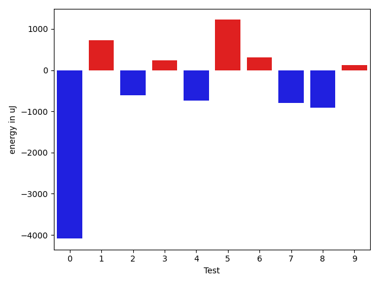

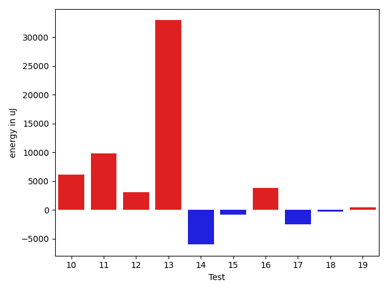

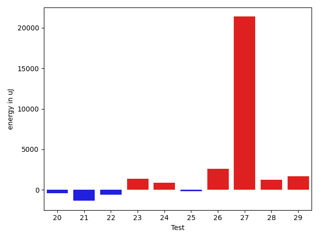

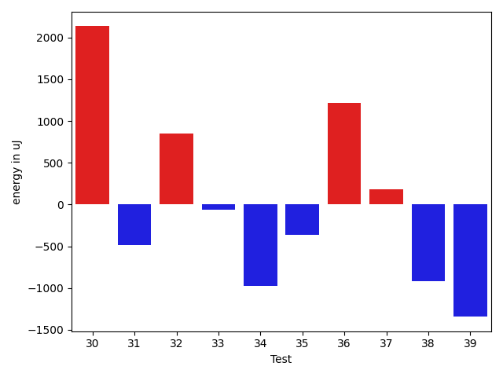

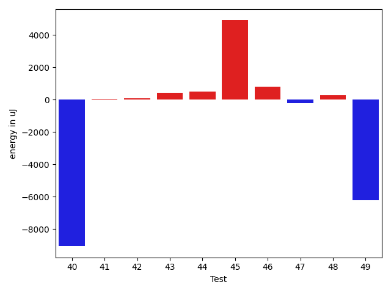

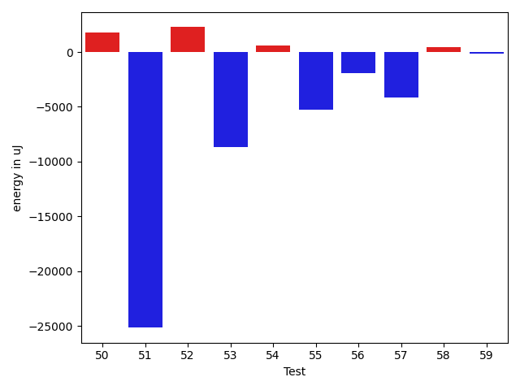

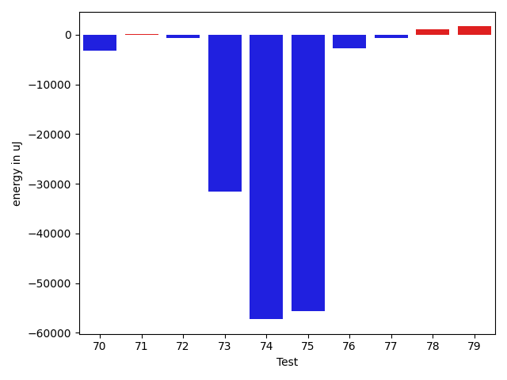

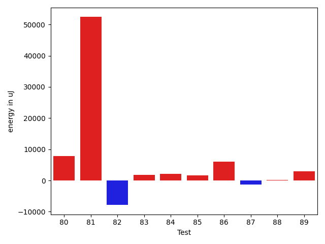

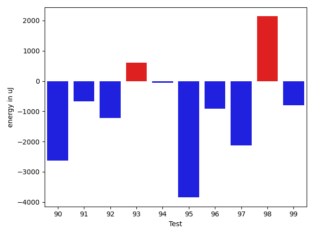

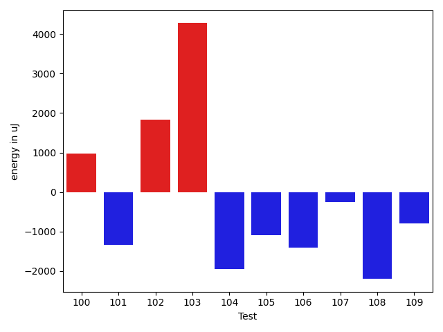

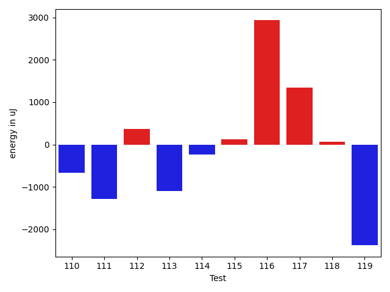

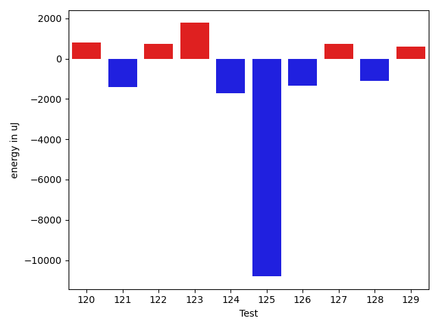

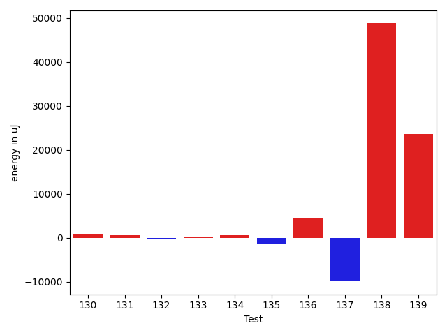

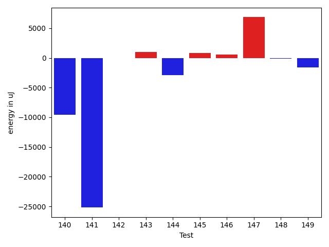

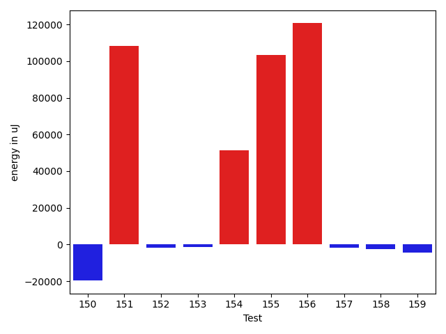

| ID | EnergyV1 | EnergyV2 | DeltaEnergy | σV1 | σV2 |
| --- | --- | --- | --- | --- | --- |
| 0 | 46630 | 42542 | -4088 | 98250.00495410721 | 68426.14675815044 |
| 1 | 36987 | 37719 | 732 | 4713.771052564018 | 4146.585809558636 |
| 2 | 38086 | 37475 | -611 | 4376.815541485098 | 4210.532483612442 |
| 3 | 36499 | 36743 | 244 | 3489.2623151470466 | 3973.9028942009923 |
| 4 | 38940 | 38208 | -732 | 21850.468539883677 | 23144.84026373197 |
| 5 | 38818 | 40039 | 1221 | 277342.6116312813 | 321150.2855131536 |
| 6 | 81116 | 81421 | 305 | 22879.085524578455 | 35555.15617459064 |
| 7 | 38147 | 37353 | -794 | 26277.716740983695 | 3856.282988398947 |
| 8 | 37170 | 36255 | -915 | 5346.569021996499 | 7551.059954861914 |
| 9 | 37659 | 37780 | 121 | 3138.72946543237 | 4272.577179662509 |
| 10 | 37841 | 36560 | -1281 | 3688.167003761237 | 31491.136417120866 |
| 11 | 77087 | 77515 | 428 | 25090.592791110495 | 43259.86480569063 |
| 12 | 117065 | 119629 | 2564 | 28726.652808790233 | 36984.40945156998 |
| 13 | 186828 | 180481 | -6347 | 261971.08156379106 | 339950.8013476307 |
| 14 | 78003 | 74951 | -3052 | 30276.646554579987 | 27211.67519365193 |
| 15 | 36377 | 36682 | 305 | 9624.298682279185 | 7838.508583553077 |
| 16 | 37476 | 38025 | 549 | 18010.68781323254 | 21363.874863891146 |
| 17 | 74340 | 74463 | 123 | 47817.27176468192 | 28809.43979473393 |
| 18 | 36377 | 35828 | -549 | 3888.6046391601117 | 4030.8457811501316 |
| 19 | 36987 | 37842 | 855 | 3440.2860288063252 | 4591.611272679243 |
| 20 | 36132 | 35705 | -427 | 3854.9362668004965 | 4071.113345922016 |
| 21 | 37048 | 35705 | -1343 | 3198.3325860390087 | 4246.800024251473 |
| 22 | 35949 | 35339 | -610 | 4038.155498541382 | 4098.380753574214 |
| 23 | 35278 | 36621 | 1343 | 4446.701041653931 | 3740.311486443484 |
| 24 | 35827 | 36682 | 855 | 2948.117900801254 | 3887.839869653971 |
| 25 | 36316 | 36133 | -183 | 3668.9093172392527 | 5197.543658188478 |
| 26 | 64942 | 67566 | 2624 | 18317.695109596898 | 19595.74335723657 |
| 27 | 125793 | 147156 | 21363 | 76391.92550418209 | 88155.48434942865 |
| 28 | 37537 | 38757 | 1220 | 39143.30700379348 | 38392.46658262317 |
| 29 | 40100 | 41809 | 1709 | 17844.653906328047 | 19683.603137480422 |
| 30 | 38941 | 41076 | 2135 | 61050.59352336213 | 75103.47587439592 |
| 31 | 35400 | 34912 | -488 | 3261.2201140404823 | 4578.966088835812 |
| 32 | 34729 | 35583 | 854 | 4302.283963128747 | 4665.307199331275 |
| 33 | 37536 | 37475 | -61 | 4434.978410475641 | 4519.757209079371 |
| 34 | 37963 | 36987 | -976 | 3884.594048775465 | 4339.483373067618 |
| 35 | 38147 | 37781 | -366 | 4904.563359196719 | 6624.651392161347 |
| 36 | 36011 | 37231 | 1220 | 4151.367051059619 | 4420.235081975283 |
| 37 | 35095 | 35278 | 183 | 4237.550606865549 | 3825.50915406135 |
| 38 | 36743 | 35828 | -915 | 4159.191397375215 | 4410.186865770553 |
| 39 | 36438 | 35095 | -1343 | 7665.537777794466 | 10190.205805705124 |
| 40 | 34790 | 35766 | 976 | 41897.83787891089 | 3922.3760350073526 |
| 41 | 35522 | 35583 | 61 | 4468.386979839594 | 4020.962203254341 |
| 42 | 36438 | 35828 | -610 | 3492.4690808675705 | 4333.942563253739 |
| 43 | 35584 | 37903 | 2319 | 4040.356238419248 | 3358.7799585563803 |
| 44 | 36621 | 36743 | 122 | 4367.892210208489 | 3684.1456338816606 |
| 45 | 126708 | 127868 | 1160 | 86605.90418326734 | 90241.64534787094 |
| 46 | 38452 | 39734 | 1282 | 7693.393411995517 | 9184.119888403351 |
| 47 | 39490 | 39490 | 0 | 4182.7948457574 | 3976.0636772407097 |
| 48 | 39063 | 38879 | -184 | 4238.460504477436 | 3557.3194987980664 |
| 49 | 38208 | 38452 | 244 | 35733.99949118693 | 3335.901052006079 |
| 50 | 38391 | 40832 | 2441 | 4138.774632672707 | 4631.384640980312 |
| 51 | 39184 | 40467 | 1283 | 525678.2025589377 | 435187.39796142274 |
| 52 | 61096 | 63049 | 1953 | 41523.406189897876 | 52515.894891768905 |
| 53 | 39550 | 41870 | 2320 | 98242.21771595554 | 69666.4121790073 |
| 54 | 37719 | 37719 | 0 | 3971.0849125463255 | 4900.862740712678 |
| 55 | 38757 | 38818 | 61 | 17826.055202661253 | 7695.708773982459 |
| 56 | 39489 | 39673 | 184 | 3620.2008572610416 | 4041.394793261356 |
| 57 | 39795 | 40100 | 305 | 59496.06929072064 | 41540.09553072055 |
| 58 | 38879 | 38330 | -549 | 4190.058587881146 | 4971.094172980834 |
| 59 | 37598 | 37475 | -123 | 3859.655167239187 | 3763.725081590833 |
| 60 | 40466 | 38818 | -1648 | 15233.416677495881 | 28011.98550703856 |
| 61 | 37658 | 37231 | -427 | 3672.1231051804343 | 3742.5301146354673 |
| 62 | 38391 | 36926 | -1465 | 9887.0804248775 | 9081.201327898836 |
| 63 | 73914 | 69458 | -4456 | 67082.87543429247 | 46844.187636311835 |
| 64 | 36376 | 36011 | -365 | 3043.335823109823 | 3731.6770358647063 |
| 65 | 38085 | 36804 | -1281 | 4193.0424597109195 | 4956.1449110642325 |
| 66 | 77698 | 74829 | -2869 | 27875.598097089907 | 28236.076055141504 |
| 67 | 36377 | 36010 | -367 | 5838.36387801931 | 5023.792016002567 |
| 68 | 61584 | 42786 | -18798 | 22466.014962745292 | 35890.55029194947 |
| 69 | 73181 | 71594 | -1587 | 27643.772147029533 | 30056.727513516056 |
| 70 | 36621 | 36194 | -427 | 26790.872605912373 | 3601.244700207031 |
| 71 | 36377 | 36499 | 122 | 3545.7491508059584 | 3721.4921333907037 |
| 72 | 36621 | 36743 | 122 | 4096.762742043782 | 4382.969098802346 |
| 73 | 40406 | 41076 | 670 | 413523.59804668237 | 328440.27711264556 |
| 74 | 80871 | 36133 | -44738 | 32840.25869650454 | 4760.985205108696 |
| 75 | 85816 | 86243 | 427 | 291654.97522278206 | 54986.948876023474 |
| 76 | 39123 | 39490 | 367 | 30521.246054789834 | 4348.306253020729 |
| 77 | 37598 | 36744 | -854 | 3759.452504353694 | 5278.389887984154 |
| 78 | 37719 | 37903 | 184 | 4271.979957937585 | 6222.164199606428 |
| 79 | 36438 | 37536 | 1098 | 3419.043841904772 | 4111.567410446376 |
| 80 | 39429 | 39306 | -123 | 4442.513371043819 | 25926.346468168245 |
| 81 | 38879 | 82702 | 43823 | 4022.720342629424 | 29796.03381908374 |
| 82 | 41138 | 39185 | -1953 | 33064.891331801475 | 25076.054577392897 |
| 83 | 42663 | 38513 | -4150 | 19074.159997231858 | 28647.652157792025 |
| 84 | 65185 | 65796 | 611 | 32133.70340889673 | 27600.287530335034 |
| 85 | 38086 | 38146 | 60 | 4566.532432317788 | 9261.746804942253 |
| 86 | 59326 | 67810 | 8484 | 20474.78114332494 | 24752.35128252959 |
| 87 | 40345 | 36621 | -3724 | 15072.76502915582 | 19264.85787543632 |
| 88 | 37232 | 38757 | 1525 | 4257.600751839502 | 3866.6942978336688 |
| 89 | 40589 | 38330 | -2259 | 17028.743828564046 | 18908.879379052374 |
| 90 | 39795 | 37171 | -2624 | 3806.9425505690697 | 18052.521368642832 |
| 91 | 36560 | 35889 | -671 | 4056.571819655327 | 3973.272196956697 |
| 92 | 38757 | 37536 | -1221 | 4082.995489281719 | 3295.0405689491 |
| 93 | 37475 | 38086 | 611 | 2822.5106414336005 | 3407.374095008256 |
| 94 | 36377 | 36316 | -61 | 3826.434265363193 | 30651.099268790596 |
| 95 | 39368 | 35522 | -3846 | 61481.74954693499 | 3673.648207276582 |
| 96 | 37232 | 36315 | -917 | 3837.2651068176147 | 3475.6540031066515 |
| 97 | 39367 | 37232 | -2135 | 3755.2794254932687 | 3836.049137010447 |
| 98 | 37231 | 39368 | 2137 | 3249.019900462292 | 5242.8313661966085 |
| 99 | 38940 | 38147 | -793 | 3618.9508617614233 | 3695.6544058529066 |
| 100 | 38025 | 39001 | 976 | 3950.8069220743 | 4043.9677115005443 |
| 101 | 80017 | 78674 | -1343 | 323126.8682617477 | 311917.884866351 |
| 102 | 40039 | 41870 | 1831 | 18756.328814755776 | 20550.828330952365 |
| 103 | 163391 | 167664 | 4273 | 300812.53044037684 | 384389.32910452393 |
| 104 | 39734 | 37781 | -1953 | 4038.8971291667817 | 3960.254706309049 |
| 105 | 37659 | 36560 | -1099 | 6985.169234055991 | 6261.29642811475 |
| 106 | 42176 | 40771 | -1405 | 34508.812670240084 | 50863.443720399584 |
| 107 | 38269 | 38025 | -244 | 14655.538378463878 | 14336.591248912546 |
| 108 | 40528 | 38330 | -2198 | 16211.346230557368 | 18122.2500229434 |
| 109 | 39551 | 38757 | -794 | 47795.76266298816 | 35156.111573848226 |
| 110 | 39428 | 38757 | -671 | 19882.730707821225 | 18079.122232841044 |
| 111 | 39794 | 38513 | -1281 | 4017.150648573356 | 3932.4697063900367 |
| 112 | 40710 | 41076 | 366 | 19441.403284233573 | 23074.592149302458 |
| 113 | 39917 | 38819 | -1098 | 16835.459144599157 | 15884.604584893368 |
| 114 | 38818 | 38575 | -243 | 3719.623840489684 | 3476.1770988000912 |
| 115 | 39307 | 39429 | 122 | 19427.053099732813 | 19088.718222810072 |
| 116 | 36804 | 39734 | 2930 | 3858.3201930397304 | 3868.5196275634353 |
| 117 | 36071 | 37414 | 1343 | 3955.814524266779 | 3079.604221819847 |
| 118 | 38208 | 38269 | 61 | 42815.06889080719 | 3882.723191261797 |
| 119 | 40466 | 38086 | -2380 | 52535.95390959832 | 23165.13680205345 |
| 120 | 36194 | 36987 | 793 | 4216.581520519159 | 3468.3466006212266 |
| 121 | 41016 | 39612 | -1404 | 22326.48827035725 | 3026.1124249048094 |
| 122 | 39917 | 40650 | 733 | 56457.558483646935 | 128725.27762213339 |
| 123 | 37414 | 39185 | 1771 | 3804.449205864102 | 4430.157600532463 |
| 124 | 39734 | 38024 | -1710 | 58503.452386631245 | 62852.421895903404 |
| 125 | 244628 | 233825 | -10803 | 84166.17925043385 | 102559.42530983829 |
| 126 | 38696 | 37354 | -1342 | 30967.884339223103 | 4058.6034523232097 |
| 127 | 39429 | 40161 | 732 | 10938.237644863553 | 12215.687861613327 |
| 128 | 41199 | 40100 | -1099 | 53596.43113317358 | 50882.20261241593 |
| 129 | 36621 | 37231 | 610 | 3135.430130342441 | 40755.66722812706 |
| 130 | 36499 | 38208 | 1709 | 3301.394312241111 | 3295.972205110277 |
| 131 | 37964 | 37476 | -488 | 3790.6133950976523 | 8612.141801242353 |
| 132 | 37842 | 37720 | -122 | 8703.775160662275 | 7442.189786032506 |
| 133 | 39246 | 38696 | -550 | 11762.320862494778 | 12082.888330643525 |
| 134 | 37597 | 36133 | -1464 | 3589.4107256537277 | 4226.395347120911 |
| 135 | 39428 | 36987 | -2441 | 3982.967020415093 | 2558.3484286783155 |
| 136 | 38697 | 40283 | 1586 | 32052.051340941667 | 32036.515810330493 |
| 137 | 40344 | 39062 | -1282 | 46939.26081121848 | 4499.852969902861 |
| 138 | 39185 | 41016 | 1831 | 6020.2323576535155 | 98630.20530202525 |
| 139 | 82885 | 82763 | -122 | 326436.92800705525 | 408520.12854623847 |
| 140 | 81725 | 83984 | 2259 | 507023.4670283218 | 475154.4273684469 |
| 141 | 43640 | 43334 | -306 | 132322.47281740553 | 77470.01025904436 |
| 142 | 38330 | 38696 | 366 | 7840.340362509781 | 5861.948702980976 |
| 143 | 37414 | 40283 | 2869 | 3582.4413427717136 | 4794.174982204968 |
| 144 | 38696 | 37964 | -732 | 13331.590506751138 | 6724.466340772465 |
| 145 | 40589 | 38636 | -1953 | 465678.75841403793 | 505593.6981007686 |
| 146 | 37781 | 38391 | 610 | 4261.512798897814 | 3726.9143142223647 |
| 147 | 38513 | 38757 | 244 | 62137.24068848202 | 71469.32154691781 |
| 148 | 38635 | 38025 | -610 | 4633.993717352338 | 4264.242330467307 |
| 149 | 38147 | 38941 | 794 | 10748.829561682971 | 8966.950929731844 |
| 150 | 42358 | 41198 | -1160 | 129201.58791398241 | 115005.17692562511 |
| 151 | 40283 | 39978 | -305 | 299344.2044656853 | 541926.3191189457 |
| 152 | 40344 | 39490 | -854 | 5595.825832528317 | 4260.723041907764 |
| 153 | 40650 | 39489 | -1161 | 4464.6391200434355 | 5042.659317304492 |
| 154 | 40344 | 40650 | 306 | 237347.2881596147 | 348412.52564684313 |
| 155 | 40589 | 38941 | -1648 | 392888.2576524572 | 545359.7811898977 |
| 156 | 41198 | 42358 | 1160 | 307296.310185297 | 572407.5662972233 |
| 157 | 39978 | 38818 | -1160 | 15704.125289533798 | 14931.70306178299 |
| 158 | 38941 | 36621 | -2320 | 8657.672756321736 | 5291.77117891543 |
| 159 | 40649 | 37537 | -3112 | 9245.12795644979 | 4309.199630016628 |

## Delta Duration per test method

| ID | DurationV1 | DurationsV2 | DeltaDuration |
| --- | --- | --- | --- |
| 0 | 2529599.585858586 | 2054985.3333333333 | -474614.2525252525 |
| 1 | 833473.0731707317 | 707698.9772727273 | -125774.09589800437 |
| 2 | 860117.7931034482 | 803053.3333333334 | -57064.45977011486 |
| 3 | 851179.1230769231 | 862463.5806451613 | 11284.457568238256 |
| 4 | 1084404.7936507936 | 1121401.6101694915 | 36996.81651869789 |
| 5 | 2847927.4383561644 | 3503188.192982456 | 655260.7546262918 |
| 6 | 2680901.1717171716 | 2749041.292929293 | 68140.12121212156 |
| 7 | 784047.35 | 655991.487804878 | -128055.86219512194 |
| 8 | 968103.671641791 | 971255.9393939395 | 3152.267752148444 |
| 9 | 831775.8679245283 | 850231.7222222222 | 18455.854297693935 |
| 10 | 480314.26923076925 | 698788.6538461539 | 218474.38461538462 |
| 11 | 2314683.0505050505 | 2548746.8181818184 | 234063.7676767679 |
| 12 | 3391237.9393939395 | 3495895.2525252528 | 104657.3131313133 |
| 13 | 6309546.97979798 | 7389679.98989899 | 1080133.01010101 |
| 14 | 2350274.272727273 | 2292659.272727273 | -57615.0 |
| 15 | 923003.7843137255 | 952448.8208955224 | 29445.036581796827 |
| 16 | 1187347.7580645161 | 1348566.0142857144 | 161218.25622119824 |
| 17 | 2446807.8585858587 | 2417024.4343434344 | -29783.424242424313 |
| 18 | 748503.6739130435 | 802122.7857142857 | 53619.11180124222 |
| 19 | 739083.125 | 773443.2826086957 | 34360.15760869568 |
| 20 | 876312.390625 | 869140.1363636364 | -7172.254261363647 |
| 21 | 746285.9361702128 | 781881.0980392157 | 35595.161869002855 |
| 22 | 720980.02 | 775499.1276595745 | 54519.10765957448 |
| 23 | 873877.7115384615 | 878028.8253968254 | 4151.11385836394 |
| 24 | 402048.0 | 380508.1538461539 | -21539.846153846127 |
| 25 | 827018.53125 | 875852.9137931034 | 48834.38254310342 |
| 26 | 1845100.191919192 | 1931735.7575757576 | 86635.5656565656 |
| 27 | 4165567.696969697 | 4641227.636363637 | 475659.9393939399 |
| 28 | 1152729.4098360655 | 1229996.6956521738 | 77267.28581610834 |
| 29 | 1668808.797979798 | 1765917.9797979798 | 97109.18181818188 |
| 30 | 1347416.9019607843 | 1705069.406779661 | 357652.50481887674 |
| 31 | 473073.1 | 494976.0416666667 | 21902.94166666671 |
| 32 | 729147.9056603773 | 797718.3272727273 | 68570.42161234992 |
| 33 | 489644.36842105264 | 509572.14285714284 | 19927.7744360902 |
| 34 | 742815.2448979592 | 805356.8888888889 | 62541.643990929704 |
| 35 | 714007.6 | 766807.3409090909 | 52799.740909090964 |
| 36 | 764576.2926829269 | 785673.0612244898 | 21096.768541562953 |
| 37 | 746503.9024390244 | 827994.0434782609 | 81490.14103923645 |
| 38 | 735513.3 | 766061.7037037037 | 30548.40370370366 |
| 39 | 977358.6911764706 | 1038545.9577464788 | 61187.26657000824 |
| 40 | 917983.35 | 442454.5 | -475528.85 |
| 41 | 490707.64 | 491099.12 | 391.4799999999814 |
| 42 | 696407.5833333334 | 723029.8048780488 | 26622.22154471546 |
| 43 | 374816.2 | 447883.8 | 73067.59999999998 |
| 44 | 753649.9333333333 | 832988.3958333334 | 79338.46250000002 |
| 45 | 4387195.303030303 | 4394445.111111111 | 7249.80808080826 |
| 46 | 925360.0344827586 | 862381.8333333334 | -62978.20114942524 |
| 47 | 728580.9189189189 | 662850.6060606061 | -65730.31285831286 |
| 48 | 506550.82608695654 | 540666.2727272727 | 34115.446640316164 |
| 49 | 725566.0689655172 | 517361.4482758621 | -208204.62068965513 |
| 50 | 626275.6363636364 | 685987.375 | 59711.73863636365 |
| 51 | 4570018.532467533 | 4341070.738095238 | -228947.79437229503 |
| 52 | 2114291.510638298 | 2210476.887755102 | 96185.37711680401 |
| 53 | 2157949.0212765955 | 1711300.8679245282 | -446648.15335206734 |
| 54 | 524152.5714285714 | 566475.5454545454 | 42322.97402597399 |
| 55 | 1359843.125 | 1026659.2222222222 | -333183.90277777775 |
| 56 | 782823.5 | 549686.5 | -233137.0 |
| 57 | 1704715.5463917525 | 1640934.84375 | -63780.70264175255 |
| 58 | 910669.9555555555 | 906927.4523809524 | -3742.503174603102 |
| 59 | 837548.274509804 | 871234.0892857143 | 33685.814775910345 |
| 60 | 959533.593220339 | 1157907.2033898304 | 198373.61016949138 |
| 61 | 815365.78 | 799582.1886792453 | -15783.591320754727 |
| 62 | 1238959.2272727273 | 1222016.680851064 | -16942.54642166337 |
| 63 | 2391378.373737374 | 2288076.9696969697 | -103301.40404040413 |
| 64 | 531212.9655172414 | 547849.25 | 16636.28448275861 |
| 65 | 881753.0806451613 | 862834.3278688524 | -18918.752776308917 |
| 66 | 2391563.4242424243 | 2286627.505050505 | -104935.91919191927 |
| 67 | 1068374.7105263157 | 1084222.2972972973 | 15847.58677098155 |
| 68 | 1729622.4343434344 | 1805488.1515151516 | 75865.7171717172 |
| 69 | 2366349.0 | 2352095.98989899 | -14253.010101010092 |
| 70 | 1056850.2575757576 | 941624.6461538462 | -115225.6114219114 |
| 71 | 959575.2205882353 | 959323.1 | -252.12058823532425 |
| 72 | 840058.6326530612 | 847910.4074074074 | 7851.774754346232 |
| 73 | 3836739.9375 | 2826926.189873418 | -1009813.7476265822 |
| 74 | 2664811.1414141413 | 473705.875 | -2191105.2664141413 |
| 75 | 4893116.676767677 | 2993028.212121212 | -1900088.4646464651 |
| 76 | 1049509.5588235294 | 877534.7538461538 | -171974.80497737555 |
| 77 | 863333.3114754099 | 885239.8870967742 | 21906.57562136429 |
| 78 | 1001798.7 | 1015684.2153846154 | 13885.515384615399 |
| 79 | 511762.25925925927 | 587294.925925926 | 75532.66666666669 |
| 80 | 582711.6764705882 | 880583.96875 | 297872.2922794118 |
| 81 | 504192.6666666667 | 2667281.8541666665 | 2163089.1875 |
| 82 | 1273178.7142857143 | 951180.5849056604 | -321998.12938005396 |
| 83 | 1250605.7 | 1127424.1538461538 | -123181.5461538462 |
| 84 | 1784930.6464646466 | 1969150.5252525252 | 184219.87878787867 |
| 85 | 947131.4827586206 | 1035624.4305555555 | 88492.94779693487 |
| 86 | 1740317.4141414142 | 1963013.642857143 | 222696.22871572874 |
| 87 | 882910.4444444445 | 1002350.2413793104 | 119439.79693486588 |
| 88 | 811325.5957446808 | 901105.9807692308 | 89780.3850245499 |
| 89 | 933356.8333333334 | 1117575.0232558139 | 184218.1899224805 |
| 90 | 465999.8333333333 | 644614.9285714285 | 178615.0952380952 |
| 91 | 851681.1702127659 | 774590.8723404255 | -77090.29787234042 |
| 92 | 712618.4186046511 | 737887.4857142858 | 25269.067109634634 |
| 93 | 565363.0384615385 | 629849.4 | 64486.361538461526 |
| 94 | 532437.7826086957 | 810652.2068965518 | 278214.4242878561 |
| 95 | 969399.2857142857 | 537114.3181818182 | -432284.96753246745 |
| 96 | 561282.75 | 576444.7272727273 | 15161.977272727294 |
| 97 | 705547.5227272727 | 858492.6341463415 | 152945.11141906877 |
| 98 | 435181.8 | 515075.5 | 79893.70000000001 |
| 99 | 439783.4375 | 455064.2 | 15280.762500000012 |
| 100 | 934580.0428571429 | 973415.9166666666 | 38835.873809523764 |
| 101 | 4093661.393939394 | 3874931.757575758 | -218729.63636363624 |
| 102 | 1513882.2365591398 | 1524537.857142857 | 10655.620583717246 |
| 103 | 6698233.2727272725 | 8545422.090909092 | 1847188.8181818193 |
| 104 | 866715.5510204082 | 907836.8727272727 | 41121.32170686452 |
| 105 | 1023256.2 | 1027670.9275362319 | 4414.727536231978 |
| 106 | 1227767.75 | 1839965.1515151516 | 612197.4015151516 |
| 107 | 1251390.3333333333 | 1236419.0256410257 | -14971.307692307513 |
| 108 | 1414033.430107527 | 1445140.6315789474 | 31107.20147142047 |
| 109 | 1209833.6296296297 | 1051436.3103448276 | -158397.31928480207 |
| 110 | 1025051.3333333334 | 850608.4054054054 | -174442.92792792793 |
| 111 | 675678.7777777778 | 662460.1935483871 | -13218.584229390603 |
| 112 | 1296399.6956521738 | 1201673.93220339 | -94725.7634487839 |
| 113 | 1372829.6538461538 | 1295200.488372093 | -77629.16547406069 |
| 114 | 520618.1904761905 | 531203.0 | 10584.809523809527 |
| 115 | 1374658.2527472528 | 1378982.0379746836 | 4323.785227430752 |
| 116 | 609460.2857142857 | 455142.38095238095 | -154317.90476190473 |
| 117 | 662974.04 | 609373.3076923077 | -53600.73230769229 |
| 118 | 1032634.2083333334 | 772310.1739130435 | -260324.0344202899 |
| 119 | 1481445.0344827587 | 764571.2424242424 | -716873.7920585163 |
| 120 | 575787.9142857143 | 549740.7142857143 | -26047.199999999953 |
| 121 | 762462.72 | 491755.35714285716 | -270707.3628571428 |
| 122 | 1585113.8333333333 | 2871228.212121212 | 1286114.3787878787 |
| 123 | 482658.32 | 558781.9333333333 | 76123.61333333334 |
| 124 | 1714419.0340909092 | 1606603.058139535 | -107815.97595137428 |
| 125 | 7213272.464646464 | 7196654.060606061 | -16618.404040403664 |
| 126 | 819195.475 | 791401.8222222222 | -27793.652777777752 |
| 127 | 1186915.7402597403 | 1281464.9420289856 | 94549.20176924532 |
| 128 | 1547968.8076923077 | 1537138.5161290322 | -10830.291563275503 |
| 129 | 481465.6896551724 | 775652.1739130435 | 294186.48425787105 |
| 130 | 657639.8 | 779345.0454545454 | 121705.24545454537 |
| 131 | 1047470.3 | 1083399.7882352942 | 35929.48823529412 |
| 132 | 918335.8382352941 | 994676.5263157894 | 76340.68808049534 |
| 133 | 1112090.450980392 | 1044631.2711864407 | -67459.17979395133 |
| 134 | 437070.5909090909 | 465081.8181818182 | 28011.227272727294 |
| 135 | 562878.2857142857 | 530299.551724138 | -32578.73399014771 |
| 136 | 1179590.4347826086 | 1389598.2833333334 | 210007.8485507248 |
| 137 | 1176266.1355932204 | 782181.1951219512 | -394084.9404712692 |
| 138 | 522191.4705882353 | 2246920.6486486485 | 1724729.1780604133 |
| 139 | 4207485.191919192 | 4892789.555555556 | 685304.3636363642 |
| 140 | 6758625.212121212 | 6544645.96969697 | -213979.2424242422 |
| 141 | 2944238.168421053 | 2151765.4787234045 | -792472.6896976484 |
| 142 | 981862.724137931 | 957254.6101694915 | -24608.113968439517 |
| 143 | 484729.4 | 425545.75 | -59183.65000000002 |
| 144 | 951300.5348837209 | 853015.5227272727 | -98285.01215644821 |
| 145 | 4658368.84 | 4588336.87755102 | -70031.96244897973 |
| 146 | 644344.4545454546 | 622784.5 | -21559.954545454588 |
| 147 | 1387531.9268292682 | 1597692.8421052631 | 210160.91527599492 |
| 148 | 600734.25 | 617820.3703703703 | 17086.120370370336 |
| 149 | 1066735.4642857143 | 995412.9655172414 | -71322.49876847293 |
| 150 | 3062862.810810811 | 2490300.4375 | -572562.3733108109 |
| 151 | 2152164.1458333335 | 5338420.518518519 | 3186256.372685185 |
| 152 | 690321.6486486486 | 685935.0625 | -4386.586148648639 |
| 153 | 624417.5833333334 | 704960.8888888889 | 80543.3055555555 |
| 154 | 1980552.054054054 | 3566003.9024390243 | 1585451.8483849703 |
| 155 | 3547850.3125 | 6836006.625 | 3288156.3125 |
| 156 | 2447639.8333333335 | 5680556.9 | 3232917.066666667 |
| 157 | 787351.15625 | 759428.9705882353 | -27922.1856617647 |
| 158 | 634071.6666666666 | 853683.9 | 219612.2333333334 |
| 159 | 865985.2727272727 | 771632.2340425532 | -94353.03868471947 |

## Misc.

| ID | Test Class | Test Method |
| --- | --- | --- |
| 0 | com.google.gson.functional.CustomDeserializerTest | testDefaultConstructorNotCalledOnObject |
| 1 | com.google.gson.functional.CustomDeserializerTest | testDefaultConstructorNotCalledOnField |
| 2 | com.google.gson.functional.CustomTypeAdaptersTest | testCustomTypeAdapterAppliesToSubClassesSerializedAsBaseClass |
| 3 | com.google.gson.functional.CustomTypeAdaptersTest | testCustomAdapterInvokedForMapElementDeserialization |
| 4 | com.google.gson.functional.CustomTypeAdaptersTest | testCustomNestedSerializers |
| 5 | com.google.gson.functional.CustomTypeAdaptersTest | testCustomSerializers |
| 6 | com.google.gson.functional.CustomTypeAdaptersTest | testCustomTypeAdapterDoesNotAppliesToSubClasses |
| 7 | com.google.gson.functional.CustomTypeAdaptersTest | testEnsureCustomSerializerNotInvokedForNullValues |
| 8 | com.google.gson.functional.CustomTypeAdaptersTest | testCustomSerializerForLong |
| 9 | com.google.gson.functional.CustomTypeAdaptersTest | testCustomAdapterInvokedForMapElementSerializationWithType |
| 10 | com.google.gson.functional.CustomTypeAdaptersTest | testCustomAdapterInvokedForMapElementSerialization |
| 11 | com.google.gson.functional.MapAsArrayTypeAdapterTest | testTwoTypesCollapseToOneSerialize |
| 12 | com.google.gson.functional.MapAsArrayTypeAdapterTest | testMultipleEnableComplexKeyRegistrationHasNoEffect |
| 13 | com.google.gson.functional.MapAsArrayTypeAdapterTest | testSerializeComplexMapWithTypeAdapter |
| 14 | com.google.gson.functional.MapAsArrayTypeAdapterTest | testMapWithTypeVariableSerialization |
| 15 | com.google.gson.functional.MapTest | testSerializeMaps |
| 16 | com.google.gson.functional.MapTest | testMapSerializationWithNullValues |
| 17 | com.google.gson.functional.MapTest | testInterfaceTypeMapWithSerializer |
| 18 | com.google.gson.functional.MapTest | testMapDeserializationWithIntegerKeys |
| 19 | com.google.gson.functional.MapTest | testMapSerializationEmpty |
| 20 | com.google.gson.functional.MapTest | testMapOfMapDeserialization |
| 21 | com.google.gson.functional.MapTest | testMapStandardSubclassDeserialization |
| 22 | com.google.gson.functional.MapTest | testReadMapsWithEmptyStringKey |
| 23 | com.google.gson.functional.MapTest | testMapSubclassDeserialization |
| 24 | com.google.gson.functional.MapTest | testMapWithQuotes |
| 25 | com.google.gson.functional.MapTest | testParameterizedMapSubclassDeserialization |
| 26 | com.google.gson.functional.MapTest | testGeneralMapField |
| 27 | com.google.gson.functional.MapTest | testInterfaceTypeMap |
| 28 | com.google.gson.functional.MapTest | testMapDeserialization |
| 29 | com.google.gson.functional.MapTest | testParameterizedMapSubclassSerialization |
| 30 | com.google.gson.functional.MapTest | testMapSerialization |
| 31 | com.google.gson.functional.MapTest | testMapSubclassSerialization |
| 32 | com.google.gson.functional.MapTest | testMapDeserializationWithWildcardValues |
| 33 | com.google.gson.functional.MapTest | testRawMapSerialization |
| 34 | com.google.gson.functional.MapTest | testMapDeserializationEmpty |
| 35 | com.google.gson.functional.MapTest | testMapSerializationWithNullValue |
| 36 | com.google.gson.functional.MapTest | testMapSerializationWithNullValueButSerializeNulls |
| 37 | com.google.gson.functional.MapTest | testMapDeserializationWithNullValue |
| 38 | com.google.gson.functional.MapTest | testMapSerializationWithNullKey |
| 39 | com.google.gson.functional.MapTest | testMapSerializationWithWildcardValues |
| 40 | com.google.gson.functional.MapTest | testMapOfMapSerialization |
| 41 | com.google.gson.functional.MapTest | testMapSerializationWithNullValuesSerialized |
| 42 | com.google.gson.functional.MapTest | testMapSerializationWithIntegerKeys |
| 43 | com.google.gson.functional.MapTest | testWriteMapsWithEmptyStringKey |
| 44 | com.google.gson.functional.MapTest | testMapDeserializationWithNullKey |
| 45 | com.google.gson.functional.ExposeFieldsTest | testNullExposeFieldSerialization |
| 46 | com.google.gson.functional.ExposeFieldsTest | testArrayWithOneNullExposeFieldObjectSerialization |
| 47 | com.google.gson.functional.ExposeFieldsTest | testExposedInterfaceFieldSerialization |
| 48 | com.google.gson.functional.ExposeFieldsTest | testExposeAnnotationSerialization |
| 49 | com.google.gson.functional.ExposeFieldsTest | testNoExposedFieldSerialization |
| 50 | com.google.gson.functional.FieldExclusionTest | testDefaultNestedStaticClassIncluded |
| 51 | com.google.gson.functional.FieldExclusionTest | testDefaultInnerClassExclusion |
| 52 | com.google.gson.functional.InheritanceTest | testSubInterfacesOfCollectionSerialization |
| 53 | com.google.gson.functional.InheritanceTest | testBaseSerializedAsBaseWhenSpecifiedWithExplicitTypeForToJsonMethod |
| 54 | com.google.gson.functional.InheritanceTest | testBaseSerializedAsSubForToJsonMethod |
| 55 | com.google.gson.functional.InheritanceTest | testSubClassSerialization |
| 56 | com.google.gson.functional.InheritanceTest | testBaseSerializedAsSubWhenSpecifiedWithExplicitTypeForToJsonMethod |
| 57 | com.google.gson.functional.MoreSpecificTypeSerializationTest | testSubclassFields |
| 58 | com.google.gson.functional.MoreSpecificTypeSerializationTest | testParameterizedSubclassFields |
| 59 | com.google.gson.functional.MoreSpecificTypeSerializationTest | testListOfParameterizedSubclassFields |
| 60 | com.google.gson.functional.MoreSpecificTypeSerializationTest | testListOfSubclassFields |
| 61 | com.google.gson.functional.ParameterizedTypesTest | testParameterizedTypesWithWriterSerialization |
| 62 | com.google.gson.functional.ParameterizedTypesTest | testParameterizedTypeWithCustomSerializer |
| 63 | com.google.gson.functional.ParameterizedTypesTest | testParameterizedTypesSerialization |
| 64 | com.google.gson.functional.ParameterizedTypesTest | testDeepParameterizedTypeSerialization |
| 65 | com.google.gson.functional.ParameterizedTypesTest | testVariableTypeDeserialization |
| 66 | com.google.gson.functional.ParameterizedTypesTest | testVariableTypeFieldsAndGenericArraysSerialization |
| 67 | com.google.gson.functional.ParameterizedTypesTest | testParameterizedTypeGenericArraysDeserialization |
| 68 | com.google.gson.functional.ParameterizedTypesTest | testVariableTypeFieldsAndGenericArraysDeserialization |
| 69 | com.google.gson.functional.ParameterizedTypesTest | testTypesWithMultipleParametersSerialization |
| 70 | com.google.gson.functional.ParameterizedTypesTest | testVariableTypeArrayDeserialization |
| 71 | com.google.gson.functional.ParameterizedTypesTest | testParameterizedTypeWithVariableTypeDeserialization |
| 72 | com.google.gson.functional.ParameterizedTypesTest | testParameterizedTypeGenericArraysSerialization |
| 73 | com.google.gson.JsonParserTest | testReadWriteTwoObjects |
| 74 | com.google.gson.functional.NamingPolicyTest | testGsonWithNonDefaultFieldNamingPolicySerialization |
| 75 | com.google.gson.functional.NamingPolicyTest | testGsonDuplicateNameUsingSerializedNameFieldNamingPolicySerialization |
| 76 | com.google.gson.functional.NamingPolicyTest | testGsonWithSerializedNameFieldNamingPolicySerialization |
| 77 | com.google.gson.functional.NamingPolicyTest | testComplexFieldNameStrategy |
| 78 | com.google.gson.functional.NamingPolicyTest | testDeprecatedNamingStrategy |
| 79 | com.google.gson.functional.NamingPolicyTest | testGsonWithUpperCamelCaseSpacesPolicySerialiation |
| 80 | com.google.gson.functional.NamingPolicyTest | testGsonWithLowerCaseDashPolicySerialization |
| 81 | com.google.gson.functional.NamingPolicyTest | testGsonWithLowerCaseUnderscorePolicySerialization |
| 82 | com.google.gson.DefaultMapJsonSerializerTest | testEmptyMapSerialization |
| 83 | com.google.gson.DefaultMapJsonSerializerTest | testEmptyMapNoTypeSerialization |
| 84 | com.google.gson.functional.ObjectTest | testSingletonLists |
| 85 | com.google.gson.functional.ObjectTest | testArrayOfObjectsAsFields |
| 86 | com.google.gson.functional.ObjectTest | testArrayOfArraysSerialization |
| 87 | com.google.gson.functional.ObjectTest | testBagOfPrimitivesSerialization |
| 88 | com.google.gson.functional.ObjectTest | testArrayOfObjectsSerialization |
| 89 | com.google.gson.functional.ObjectTest | testClassWithTransientFieldsSerialization |
| 90 | com.google.gson.functional.ObjectTest | testPrimitiveArrayFieldSerialization |
| 91 | com.google.gson.functional.ObjectTest | testInnerClassSerialization |
| 92 | com.google.gson.functional.ObjectTest | testBagOfPrimitiveWrappersSerialization |
| 93 | com.google.gson.functional.ObjectTest | testStringFieldWithEmptyValueSerialization |
| 94 | com.google.gson.functional.ObjectTest | testClassWithObjectFieldSerialization |
| 95 | com.google.gson.functional.ObjectTest | testEmptyCollectionInAnObjectSerialization |
| 96 | com.google.gson.functional.ObjectTest | testNullFieldsSerialization |
| 97 | com.google.gson.functional.ObjectTest | testNestedSerialization |
| 98 | com.google.gson.functional.ObjectTest | testClassWithNoFieldsSerialization |
| 99 | com.google.gson.functional.ObjectTest | testJsonObjectSerialization |
| 100 | com.google.gson.functional.TypeVariableTest | testBasicTypeVariables |
| 101 | com.google.gson.functional.TypeVariableTest | testAdvancedTypeVariables |
| 102 | com.google.gson.functional.TypeVariableTest | testTypeVariablesViaTypeParameter |
| 103 | com.google.gson.functional.VersioningTest | testVersionedUntilSerialization |
| 104 | com.google.gson.functional.VersioningTest | testVersionedClassesSerialization |
| 105 | com.google.gson.functional.VersioningTest | testVersionedGsonMixingSinceAndUntilSerialization |
| 106 | com.google.gson.functional.VersioningTest | testVersionedGsonWithUnversionedClassesSerialization |
| 107 | com.google.gson.functional.CollectionTest | testFieldIsArrayList |
| 108 | com.google.gson.functional.CollectionTest | testWildcardCollectionField |
| 109 | com.google.gson.functional.CollectionTest | testSetSerialization |
| 110 | com.google.gson.functional.CollectionTest | testCollectionOfBagOfPrimitivesSerialization |
| 111 | com.google.gson.functional.CollectionTest | testRawCollectionSerialization |
| 112 | com.google.gson.functional.ArrayTest | testObjectArrayWithNonPrimitivesSerialization |
| 113 | com.google.gson.functional.EnumTest | testClassWithEnumFieldSerialization |
| 114 | com.google.gson.functional.NullObjectAndFieldTest | testExplicitSerializationOfNullCollectionMembers |
| 115 | com.google.gson.functional.NullObjectAndFieldTest | testExplicitSerializationOfNullArrayMembers |
| 116 | com.google.gson.functional.NullObjectAndFieldTest | testExplicitSerializationOfNullStringMembers |
| 117 | com.google.gson.functional.NullObjectAndFieldTest | testPrintPrintingObjectWithNulls |
| 118 | com.google.gson.functional.NullObjectAndFieldTest | testNullWrappedPrimitiveMemberSerialization |
| 119 | com.google.gson.functional.NullObjectAndFieldTest | testExplicitSerializationOfNulls |
| 120 | com.google.gson.functional.NullObjectAndFieldTest | testCustomSerializationOfNulls |
| 121 | com.google.gson.functional.PrintFormattingTest | testJsonObjectWithNullValues |
| 122 | com.google.gson.functional.PrintFormattingTest | testCompactFormattingLeavesNoWhiteSpace |
| 123 | com.google.gson.functional.PrintFormattingTest | testJsonObjectWithNullValuesSerialized |
| 124 | com.google.gson.functional.ConcurrencyTest | testSingleThreadSerialization |
| 125 | com.google.gson.functional.ConcurrencyTest | testMultiThreadSerialization |
| 126 | com.google.gson.functional.EscapingTest | testGsonDoubleDeserialization |
| 127 | com.google.gson.functional.EscapingTest | testGsonAcceptsEscapedAndNonEscapedJsonDeserialization |
| 128 | com.google.gson.functional.EscapingTest | testEscapingObjectFields |
| 129 | com.google.gson.functional.DefaultTypeAdaptersTest | testPropertiesDeserialization |
| 130 | com.google.gson.functional.DefaultTypeAdaptersTest | testDefaultCalendarSerialization |
| 131 | com.google.gson.functional.DefaultTypeAdaptersTest | testUrlNullSerialization |
| 132 | com.google.gson.functional.DefaultTypeAdaptersTest | testBigIntegerFieldSerialization |
| 133 | com.google.gson.functional.DefaultTypeAdaptersTest | testBigDecimalFieldSerialization |
| 134 | com.google.gson.functional.DefaultTypeAdaptersTest | testPropertiesSerialization |
| 135 | com.google.gson.functional.DefaultTypeAdaptersTest | testDefaultGregorianCalendarSerialization |
| 136 | com.google.gson.functional.JsonTreeTest | testJsonTreeToString |
| 137 | com.google.gson.functional.JsonTreeTest | testToJsonTreeObjectType |
| 138 | com.google.gson.functional.JsonTreeTest | testToJsonTree |
| 139 | com.google.gson.functional.TypeHierarchyAdapterTest | testTypeHierarchy |
| 140 | com.google.gson.functional.ExclusionStrategyFunctionalTest | testExclusionStrategySerialization |
| 141 | com.google.gson.functional.PrettyPrintingTest | testPrettyPrintList |
| 142 | com.google.gson.functional.PrettyPrintingTest | testEmptyMapField |
| 143 | com.google.gson.functional.PrettyPrintingTest | testMap |
| 144 | com.google.gson.functional.PrettyPrintingTest | testPrettyPrintArrayOfObjects |
| 145 | com.google.gson.MixedStreamTest | testWriteMixedStreamed |
| 146 | com.google.gson.MixedStreamTest | testWriteDoesNotMutateState |
| 147 | com.google.gson.functional.InterfaceTest | testSerializingObjectImplementingInterface |
| 148 | com.google.gson.functional.InterfaceTest | testSerializingInterfaceObjectField |
| 149 | com.google.gson.functional.ReadersWritersTest | testReadWriteTwoObjects |
| 150 | com.google.gson.functional.ReadersWritersTest | testWriterForSerialization |
| 151 | com.google.gson.FunctionWithInternalDependenciesTest | testAnonymousLocalClassesSerialization |
| 152 | com.google.gson.functional.CircularReferenceTest | testDirectedAcyclicGraphSerialization |
| 153 | com.google.gson.functional.PrimitiveTest | testMoreSpecificSerialization |
| 154 | com.google.gson.functional.SecurityTest | testNonExecutableJsonSerialization |
| 155 | com.google.gson.JsonObjectTest | testPropertyWithQuotes |
| 156 | com.google.gson.JsonObjectTest | testWritePropertyWithEmptyStringName |
| 157 | com.google.gson.functional.UncategorizedTest | testObjectEqualButNotSameSerialization |
| 158 | com.google.gson.functional.UncategorizedTest | testStaticFieldsAreNotSerialized |
| 159 | com.google.gson.functional.UncategorizedTest | testGsonInstanceReusableForSerializationAndDeserialization |

| Test | IterationV1 | IterationV2 | DeltaIteration |
| --- | --- | --- | --- |
| 0 | 99 | 99 | 0 |
| 1 | 41 | 44 | 3 |
| 2 | 58 | 45 | -13 |
| 3 | 65 | 62 | -3 |
| 4 | 63 | 59 | -4 |
| 5 | 73 | 57 | -16 |
| 6 | 99 | 99 | 0 |
| 7 | 40 | 41 | 1 |
| 8 | 67 | 66 | -1 |
| 9 | 53 | 54 | 1 |
| 10 | 26 | 26 | 0 |
| 11 | 99 | 99 | 0 |
| 12 | 99 | 99 | 0 |
| 13 | 99 | 99 | 0 |
| 14 | 99 | 99 | 0 |
| 15 | 51 | 67 | 16 |
| 16 | 62 | 70 | 8 |
| 17 | 99 | 99 | 0 |
| 18 | 46 | 56 | 10 |
| 19 | 40 | 46 | 6 |
| 20 | 64 | 66 | 2 |
| 21 | 47 | 51 | 4 |
| 22 | 50 | 47 | -3 |
| 23 | 52 | 63 | 11 |
| 24 | 11 | 13 | 2 |
| 25 | 64 | 58 | -6 |
| 26 | 99 | 99 | 0 |
| 27 | 99 | 99 | 0 |
| 28 | 61 | 69 | 8 |
| 29 | 99 | 99 | 0 |
| 30 | 51 | 59 | 8 |
| 31 | 30 | 24 | -6 |
| 32 | 53 | 55 | 2 |
| 33 | 19 | 21 | 2 |
| 34 | 49 | 54 | 5 |
| 35 | 40 | 44 | 4 |
| 36 | 41 | 49 | 8 |
| 37 | 41 | 46 | 5 |
| 38 | 50 | 54 | 4 |
| 39 | 68 | 71 | 3 |
| 40 | 20 | 10 | -10 |
| 41 | 25 | 25 | 0 |
| 42 | 48 | 41 | -7 |
| 43 | 15 | 10 | -5 |
| 44 | 60 | 48 | -12 |
| 45 | 99 | 99 | 0 |
| 46 | 58 | 48 | -10 |
| 47 | 37 | 33 | -4 |
| 48 | 23 | 22 | -1 |
| 49 | 29 | 29 | 0 |
| 50 | 33 | 24 | -9 |
| 51 | 77 | 84 | 7 |
| 52 | 94 | 98 | 4 |
| 53 | 47 | 53 | 6 |
| 54 | 28 | 22 | -6 |
| 55 | 88 | 54 | -34 |
| 56 | 18 | 16 | -2 |
| 57 | 97 | 96 | -1 |
| 58 | 45 | 42 | -3 |
| 59 | 51 | 56 | 5 |
| 60 | 59 | 59 | 0 |
| 61 | 50 | 53 | 3 |
| 62 | 88 | 94 | 6 |
| 63 | 99 | 99 | 0 |
| 64 | 29 | 32 | 3 |
| 65 | 62 | 61 | -1 |
| 66 | 99 | 99 | 0 |
| 67 | 76 | 74 | -2 |
| 68 | 99 | 99 | 0 |
| 69 | 99 | 99 | 0 |
| 70 | 66 | 65 | -1 |
| 71 | 68 | 60 | -8 |
| 72 | 49 | 54 | 5 |
| 73 | 64 | 79 | 15 |
| 74 | 99 | 24 | -75 |
| 75 | 99 | 99 | 0 |
| 76 | 68 | 65 | -3 |
| 77 | 61 | 62 | 1 |
| 78 | 70 | 65 | -5 |
| 79 | 27 | 27 | 0 |
| 80 | 34 | 32 | -2 |
| 81 | 33 | 96 | 63 |
| 82 | 49 | 53 | 4 |
| 83 | 20 | 13 | -7 |
| 84 | 99 | 99 | 0 |
| 85 | 58 | 72 | 14 |
| 86 | 99 | 98 | -1 |
| 87 | 27 | 29 | 2 |
| 88 | 47 | 52 | 5 |
| 89 | 36 | 43 | 7 |
| 90 | 18 | 28 | 10 |
| 91 | 47 | 47 | 0 |
| 92 | 43 | 35 | -8 |
| 93 | 26 | 30 | 4 |
| 94 | 23 | 29 | 6 |
| 95 | 14 | 22 | 8 |
| 96 | 24 | 33 | 9 |
| 97 | 44 | 41 | -3 |
| 98 | 25 | 16 | -9 |
| 99 | 16 | 20 | 4 |
| 100 | 70 | 72 | 2 |
| 101 | 99 | 99 | 0 |
| 102 | 93 | 91 | -2 |
| 103 | 99 | 99 | 0 |
| 104 | 49 | 55 | 6 |
| 105 | 65 | 69 | 4 |
| 106 | 36 | 33 | -3 |
| 107 | 81 | 78 | -3 |
| 108 | 93 | 95 | 2 |
| 109 | 54 | 58 | 4 |
| 110 | 39 | 37 | -2 |
| 111 | 27 | 31 | 4 |
| 112 | 46 | 59 | 13 |
| 113 | 78 | 86 | 8 |
| 114 | 21 | 30 | 9 |
| 115 | 91 | 79 | -12 |
| 116 | 21 | 21 | 0 |
| 117 | 25 | 39 | 14 |
| 118 | 48 | 46 | -2 |
| 119 | 29 | 33 | 4 |
| 120 | 35 | 35 | 0 |
| 121 | 25 | 14 | -11 |
| 122 | 72 | 66 | -6 |
| 123 | 25 | 30 | 5 |
| 124 | 88 | 86 | -2 |
| 125 | 99 | 99 | 0 |
| 126 | 40 | 45 | 5 |
| 127 | 77 | 69 | -8 |
| 128 | 52 | 62 | 10 |
| 129 | 29 | 23 | -6 |
| 130 | 35 | 22 | -13 |
| 131 | 80 | 85 | 5 |
| 132 | 68 | 57 | -11 |
| 133 | 51 | 59 | 8 |
| 134 | 22 | 22 | 0 |
| 135 | 14 | 29 | 15 |
| 136 | 69 | 60 | -9 |
| 137 | 59 | 41 | -18 |
| 138 | 17 | 37 | 20 |
| 139 | 99 | 99 | 0 |
| 140 | 99 | 99 | 0 |
| 141 | 95 | 94 | -1 |
| 142 | 58 | 59 | 1 |
| 143 | 25 | 20 | -5 |
| 144 | 43 | 44 | 1 |
| 145 | 50 | 49 | -1 |
| 146 | 33 | 24 | -9 |
| 147 | 41 | 38 | -3 |
| 148 | 32 | 27 | -5 |
| 149 | 56 | 58 | 2 |
| 150 | 37 | 32 | -5 |
| 151 | 48 | 54 | 6 |
| 152 | 37 | 32 | -5 |
| 153 | 24 | 27 | 3 |
| 154 | 37 | 41 | 4 |
| 155 | 16 | 24 | 8 |
| 156 | 24 | 20 | -4 |
| 157 | 32 | 34 | 2 |
| 158 | 30 | 30 | 0 |
| 159 | 33 | 47 | 14 |

| Time Label | Time (s) |
| --- | --- |
| Selection | 27.78834319114685 |
| Injection | 15.699485301971436 |
| Total | 1196.081754207611 |

