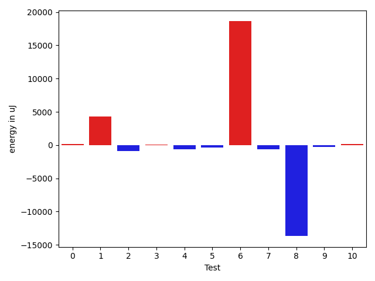
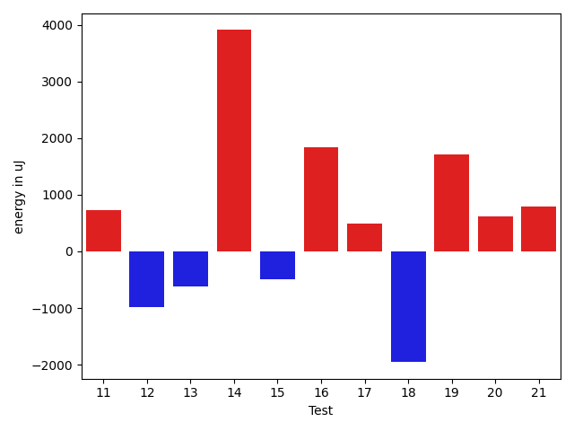
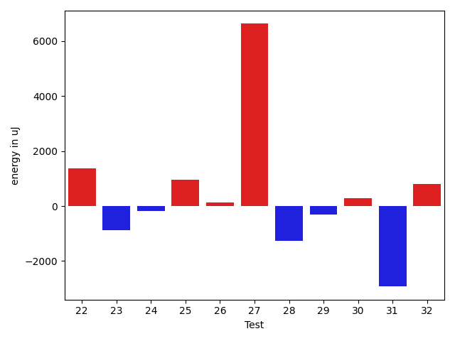
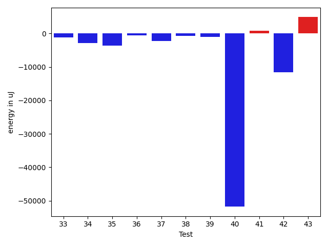
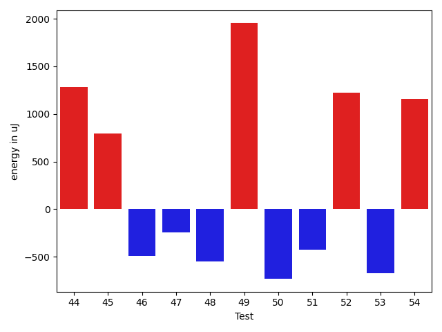
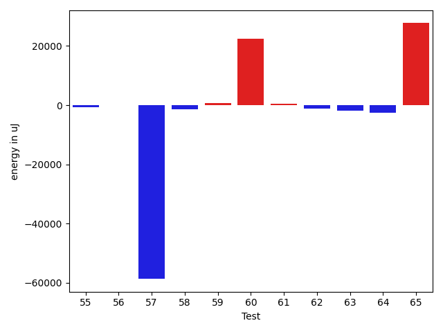
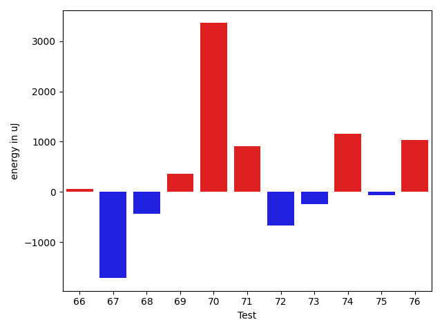
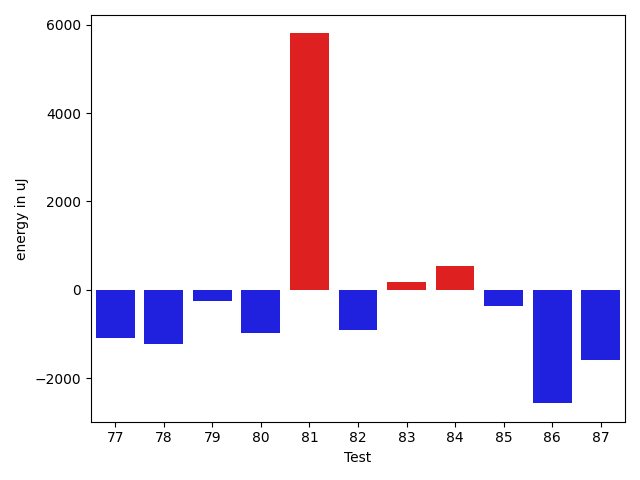
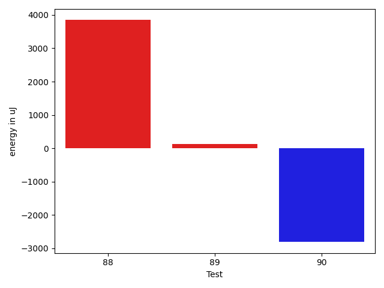

# gson aa8977

https://github.com/google/gson/commit/aa8977

## Delta Energy per test method

| ID | EnergyV1 | EnergyV2 | DeltaEnergy | σV1 | σV2 |
| --- | --- | --- | --- | --- | --- |
| 0 | 37415 | 37415 | 0 | 3757.9254640306367 | 4140.964454242918 |
| 1 | 64880 | 42846 | -22034 | 69948.31093354778 | 91633.53701995726 |
| 2 | 37170 | 35217 | -1953 | 4050.4790677682686 | 4308.035127010776 |
| 3 | 36987 | 37170 | 183 | 6259.788992967668 | 6780.796610861224 |
| 4 | 36255 | 35400 | -855 | 4589.12402828021 | 4400.820529908131 |
| 5 | 36438 | 35888 | -550 | 3598.709202404299 | 4291.895248284669 |
| 6 | 39001 | 38391 | -610 | 3698.0551656783055 | 73251.19296783778 |
| 7 | 37964 | 36255 | -1709 | 4476.532005552366 | 3178.4310142004906 |
| 8 | 102112 | 107788 | 5676 | 122976.85382627032 | 85466.78593942577 |
| 9 | 38940 | 38818 | -122 | 3699.460282443583 | 4077.3396153742638 |
| 10 | 38818 | 38941 | 123 | 4372.049964134546 | 4839.40983685102 |
| 11 | 42297 | 43030 | 733 | 37250.66351833082 | 46283.099781946265 |
| 12 | 38940 | 37964 | -976 | 3928.3922122496742 | 3681.859197377852 |
| 13 | 40405 | 39794 | -611 | 18773.895403116527 | 19718.38817691792 |
| 14 | 38452 | 42358 | 3906 | 40303.496481639944 | 51001.69075118838 |
| 15 | 38330 | 37841 | -489 | 4121.059917265885 | 4076.8803897332286 |
| 16 | 36194 | 38025 | 1831 | 4264.188639082601 | 5569.707835465786 |
| 17 | 36926 | 37415 | 489 | 4218.882389158735 | 4702.517675651162 |
| 18 | 37841 | 35888 | -1953 | 4512.331453639016 | 4246.446136468771 |
| 19 | 37903 | 39612 | 1709 | 13172.068944030278 | 23618.37824291201 |
| 20 | 73853 | 74463 | 610 | 93250.24933337387 | 63095.71106339429 |
| 21 | 37902 | 38696 | 794 | 4254.736414771622 | 4780.481509171812 |
| 22 | 43762 | 64636 | 20874 | 24133.737275908203 | 20486.448864945105 |
| 23 | 38025 | 37781 | -244 | 9896.074363685717 | 7805.71116179479 |
| 24 | 36560 | 36316 | -244 | 3335.9331992588454 | 3373.150900211848 |
| 25 | 36011 | 37659 | 1648 | 3622.4550551706366 | 3465.1981372805003 |
| 26 | 35766 | 36072 | 306 | 3232.9176528477365 | 3647.3330504401883 |
| 27 | 41016 | 69213 | 28197 | 24517.67585956011 | 23243.58944956652 |
| 28 | 37597 | 37109 | -488 | 15032.417760049924 | 8743.799819927724 |
| 29 | 36682 | 37049 | 367 | 4269.494684767511 | 3056.6314474524984 |
| 30 | 37171 | 37719 | 548 | 3391.6277235391517 | 3579.393196841661 |
| 31 | 38940 | 38147 | -793 | 7757.082450415121 | 3630.3449902067355 |
| 32 | 38452 | 38024 | -428 | 11140.911905862233 | 13371.599543331464 |
| 33 | 37536 | 36133 | -1403 | 3690.000439775291 | 3477.5160586500315 |
| 34 | 37354 | 37353 | -1 | 14176.977969397329 | 10185.05803017572 |
| 35 | 37476 | 38391 | 915 | 25018.63406045157 | 19742.804470448653 |
| 36 | 82825 | 82946 | 121 | 26060.244744692045 | 24530.368256117483 |
| 37 | 36987 | 36560 | -427 | 9645.927629476791 | 4571.115022466863 |
| 38 | 38147 | 36682 | -1465 | 3747.1293077208434 | 3963.111695081569 |
| 39 | 37353 | 36743 | -610 | 6591.224846926519 | 4849.520948977597 |
| 40 | 78491 | 79956 | 1465 | 529824.8424684887 | 370829.41848232545 |
| 41 | 39367 | 40222 | 855 | 22132.738354501213 | 21847.16139801786 |
| 42 | 44433 | 41687 | -2746 | 220375.05139524787 | 237217.48570961753 |
| 43 | 37720 | 38514 | 794 | 21128.7350680772 | 38202.18280429125 |
| 44 | 36743 | 38025 | 1282 | 3954.2644911249276 | 4403.196725107794 |
| 45 | 36316 | 37110 | 794 | 3761.917345154157 | 3447.958295069251 |
| 46 | 39429 | 38941 | -488 | 11992.147701663813 | 13429.70314865664 |
| 47 | 35583 | 35339 | -244 | 7072.051448506217 | 3341.2809654377947 |
| 48 | 74768 | 74219 | -549 | 80153.2092213339 | 83629.0882800866 |
| 49 | 34729 | 36682 | 1953 | 3331.6804519766065 | 3267.220758050167 |
| 50 | 76294 | 75562 | -732 | 25503.784703094912 | 25101.40923538528 |
| 51 | 38697 | 38269 | -428 | 67816.78879499342 | 52908.81738627145 |
| 52 | 73547 | 74768 | 1221 | 28361.150117726258 | 27040.338945654665 |
| 53 | 39245 | 38575 | -670 | 63693.01701186498 | 50595.544961816646 |
| 54 | 40832 | 41992 | 1160 | 443619.67189064645 | 566968.8835813393 |
| 55 | 38025 | 37292 | -733 | 8462.108146701865 | 11459.834352372949 |
| 56 | 70862 | 70801 | -61 | 22910.468145550873 | 19348.885903887618 |
| 57 | 170593 | 111938 | -58655 | 85343.79993621144 | 92093.59413897994 |
| 58 | 39734 | 38391 | -1343 | 18167.824746574606 | 18559.48214912555 |
| 59 | 39367 | 40161 | 794 | 220774.8092063263 | 531150.639286224 |
| 60 | 167480 | 190002 | 22522 | 298050.3505780601 | 320056.27226718364 |
| 61 | 74340 | 74768 | 428 | 21515.92735784717 | 18902.04584995888 |
| 62 | 41931 | 40771 | -1160 | 33127.7004482179 | 28438.27692426776 |
| 63 | 40771 | 38879 | -1892 | 3887.2513225686544 | 58157.03640236171 |
| 64 | 39063 | 36621 | -2442 | 15636.02128389444 | 85213.91372421727 |
| 65 | 43579 | 71288 | 27709 | 64673.61881928043 | 57220.38870740851 |
| 66 | 37354 | 37414 | 60 | 3516.7996459849687 | 27485.958211238165 |
| 67 | 37415 | 35705 | -1710 | 4616.652837042155 | 4870.9373855963295 |
| 68 | 37598 | 37170 | -428 | 7840.943747217111 | 7659.971522188643 |
| 69 | 38574 | 38940 | 366 | 5881.085391286851 | 8069.75030244441 |
| 70 | 80383 | 83740 | 3357 | 417538.80405363464 | 52582.124034760505 |
| 71 | 38819 | 39734 | 915 | 4823.499274787708 | 3865.177836355605 |
| 72 | 40588 | 39917 | -671 | 14877.188295372509 | 24507.212826125025 |
| 73 | 37963 | 37720 | -243 | 4712.5519618414355 | 4159.189152972961 |
| 74 | 38879 | 40039 | 1160 | 19969.651568398294 | 19402.862416658118 |
| 75 | 37964 | 37902 | -62 | 15130.701949879713 | 15006.886622708824 |
| 76 | 39062 | 40100 | 1038 | 67136.79810094397 | 60420.03652365594 |
| 77 | 39795 | 38697 | -1098 | 13702.719528778767 | 18735.52254872485 |
| 78 | 37171 | 35950 | -1221 | 6244.082714323271 | 6080.176467270699 |
| 79 | 38635 | 38391 | -244 | 14264.739240291281 | 16282.654750331896 |
| 80 | 36988 | 36011 | -977 | 3549.0774071493383 | 8103.844696432315 |
| 81 | 76233 | 82031 | 5798 | 363551.0799545925 | 342162.47915235645 |
| 82 | 39306 | 38391 | -915 | 635054.85954914 | 599948.7497799617 |
| 83 | 38513 | 38696 | 183 | 8118.625393637906 | 9077.998754810114 |
| 84 | 38269 | 38819 | 550 | 3344.3767465761625 | 3314.610421908348 |
| 85 | 39428 | 39062 | -366 | 559619.398553754 | 391136.4140463565 |
| 86 | 76904 | 74341 | -2563 | 85053.2538470566 | 84265.34071445516 |
| 87 | 38330 | 36743 | -1587 | 92883.19054295802 | 24551.76272587164 |
| 88 | 34424 | 38269 | 3845 | 92857.00099190086 | 3033.6898624971836 |
| 89 | 39856 | 39978 | 122 | 18656.249004280635 | 21291.61645271542 |
| 90 | 41015 | 38208 | -2807 | 60429.85942496563 | 52506.26440582273 |

## Delta Duration per test method

| ID | DurationV1 | DurationsV2 | DeltaDuration |
| --- | --- | --- | --- |
| 0 | 764737.7037037037 | 830153.7450980392 | 65416.04139433545 |
| 1 | 2143102.757575758 | 2460191.787878788 | 317089.0303030303 |
| 2 | 938179.9275362319 | 946855.3559322034 | 8675.428395971423 |
| 3 | 1131049.7558139535 | 1182513.3513513512 | 51463.59553739778 |
| 4 | 902011.1964285715 | 883085.5890410959 | -18925.607387475553 |
| 5 | 891763.1428571428 | 922546.3692307692 | 30783.226373626385 |
| 6 | 802487.18 | 1471950.6382978724 | 669463.4582978723 |
| 7 | 664879.8285714285 | 695876.0512820513 | 30996.222710622707 |
| 8 | 4114236.212121212 | 3569689.4545454546 | -544546.7575757573 |
| 9 | 560296.8928571428 | 669006.2941176471 | 108709.40126050427 |
| 10 | 789847.3777777777 | 753525.9583333334 | -36321.41944444436 |
| 11 | 1940967.9139784947 | 2035647.252631579 | 94679.33865308436 |
| 12 | 781175.5625 | 727341.0243902439 | -53834.538109756075 |
| 13 | 1430790.6956521738 | 1443153.2637362638 | 12362.568084090017 |
| 14 | 1660906.2551020407 | 1833534.0212765958 | 172627.76617455506 |
| 15 | 604271.5294117647 | 740136.4444444445 | 135864.9150326798 |
| 16 | 847958.2857142857 | 915028.5535714285 | 67070.26785714284 |
| 17 | 839131.7090909091 | 932514.9607843137 | 93383.25169340463 |
| 18 | 599868.35 | 687464.375 | 87596.02500000002 |
| 19 | 1003605.3773584906 | 1297893.6911764706 | 294288.31381798 |
| 20 | 2674396.5217391304 | 2398898.7283950616 | -275497.7933440688 |
| 21 | 425047.1904761905 | 467280.9259259259 | 42233.735449735424 |
| 22 | 1872383.7272727273 | 1813037.6363636365 | -59346.090909090824 |
| 23 | 1032757.8461538461 | 1099497.4328358208 | 66739.5866819747 |
| 24 | 734918.8181818182 | 766858.12 | 31939.30181818176 |
| 25 | 617937.7368421053 | 574277.6285714286 | -43660.10827067669 |
| 26 | 774488.7826086957 | 769067.95 | -5420.832608695724 |
| 27 | 1800135.1734693877 | 1887646.25 | 87511.0765306123 |
| 28 | 1228194.811764706 | 1222946.4302325582 | -5248.38153214776 |
| 29 | 562129.3793103448 | 567782.9166666666 | 5653.537356321816 |
| 30 | 776606.7619047619 | 751589.380952381 | -25017.380952380947 |
| 31 | 906670.2142857143 | 957188.2413793104 | 50518.02709359606 |
| 32 | 924161.6315789474 | 1010811.8125 | 86650.18092105258 |
| 33 | 554786.5185185185 | 558363.448275862 | 3576.9297573434887 |
| 34 | 930882.1621621621 | 835142.9607843137 | -95739.2013778484 |
| 35 | 1356337.3768115942 | 1155623.857142857 | -200713.5196687372 |
| 36 | 2844674.212121212 | 2765233.757575758 | -79440.45454545412 |
| 37 | 1117742.878787879 | 1020452.4666666667 | -97290.41212121223 |
| 38 | 758234.3658536585 | 724462.9230769231 | -33771.44277673541 |
| 39 | 969512.7605633803 | 1008924.1739130435 | 39411.41334966314 |
| 40 | 6061850.292929293 | 4796884.929292929 | -1264965.3636363633 |
| 41 | 1523177.9574468085 | 1644277.2395833333 | 121099.2821365248 |
| 42 | 3314071.112359551 | 3069725.1739130435 | -244345.93844650732 |
| 43 | 1125468.0327868853 | 1157705.935483871 | 32237.90269698575 |
| 44 | 950126.015625 | 980772.42 | 30646.404375000042 |
| 45 | 536740.4137931034 | 554658.1739130435 | 17917.760119940038 |
| 46 | 1255559.3846153845 | 1276360.6823529413 | 20801.297737556743 |
| 47 | 931261.8305084746 | 899747.4035087719 | -31514.4269997027 |
| 48 | 2981645.878787879 | 2724696.232323232 | -256949.6464646468 |
| 49 | 618485.9117647059 | 596576.6470588235 | -21909.264705882408 |
| 50 | 2606258.111111111 | 2447653.8181818184 | -158604.29292929266 |
| 51 | 2029540.8295454546 | 1662013.313253012 | -367527.51629244257 |
| 52 | 2512400.242424242 | 2397379.090909091 | -115021.15151515137 |
| 53 | 1860359.5057471264 | 1511888.1444444444 | -348471.36130268197 |
| 54 | 4535378.079365079 | 6587996.865671642 | 2052618.7863065628 |
| 55 | 1051635.0895522388 | 1091353.0746268656 | 39717.98507462675 |
| 56 | 2076603.9090909092 | 1988613.5555555555 | -87990.35353535367 |
| 57 | 4932093.838383839 | 4233285.05050505 | -698808.7878787881 |
| 58 | 1524017.0923076924 | 1291782.2272727273 | -232234.8650349651 |
| 59 | 2211535.465116279 | 6969405.348837209 | 4757869.88372093 |
| 60 | 6194417.02020202 | 7371975.424242424 | 1177558.4040404037 |
| 61 | 2203534.0606060605 | 2218262.5454545454 | 14728.484848484863 |
| 62 | 1530310.9552238807 | 1357964.0 | -172346.9552238807 |
| 63 | 746745.1212121212 | 1481739.8148148148 | 734994.6936026936 |
| 64 | 854078.72 | 1083466.0454545454 | 229387.32545454544 |
| 65 | 2182742.076923077 | 2560074.0576923075 | 377331.9807692305 |
| 66 | 544002.59375 | 677956.5416666666 | 133953.94791666663 |
| 67 | 563246.6521739131 | 537549.2 | -25697.45217391313 |
| 68 | 1107335.7012987013 | 1050588.5921052631 | -56747.1091934382 |
| 69 | 935824.4655172414 | 841252.2363636363 | -94572.22915360506 |
| 70 | 5038179.595959596 | 2991801.525252525 | -2046378.070707071 |
| 71 | 665111.6857142857 | 680327.7021276596 | 15216.016413373873 |
| 72 | 1400023.652173913 | 1545905.1573033708 | 145881.50512945768 |
| 73 | 851478.6041666666 | 886037.7173913043 | 34559.113224637695 |
| 74 | 1599818.391304348 | 1567419.1397849463 | -32399.251519401558 |
| 75 | 1332071.425 | 1271687.21686747 | -60384.2081325301 |
| 76 | 1492752.2592592593 | 1408984.9310344828 | -83767.32822477655 |
| 77 | 893382.625 | 993571.0645161291 | 100188.43951612909 |
| 78 | 1078222.1746031747 | 1067206.0 | -11016.174603174673 |
| 79 | 1344260.90625 | 1342596.21875 | -1664.6875 |
| 80 | 861616.4423076923 | 972676.804347826 | 111060.3620401338 |
| 81 | 4489121.444444444 | 4656155.181818182 | 167033.73737373762 |
| 82 | 7879046.2558139535 | 6992833.346938776 | -886212.9088751776 |
| 83 | 1161657.8166666667 | 1104876.609375 | -56781.20729166665 |
| 84 | 928724.7627118644 | 934477.984375 | 5753.2216631355695 |
| 85 | 5728767.012345679 | 3577553.891566265 | -2151213.120779414 |
| 86 | 3100787.8767123288 | 2535000.2098765434 | -565787.6668357854 |
| 87 | 1204755.5294117648 | 685971.4 | -518784.1294117648 |
| 88 | 1117354.7222222222 | 441162.0909090909 | -676192.6313131314 |
| 89 | 979118.3333333334 | 978510.8292682926 | -607.5040650407318 |
| 90 | 1470822.1764705882 | 1269301.6666666667 | -201520.50980392145 |

## Misc.

| ID | Test Class | Test Method |
| --- | --- | --- |
| 0 | com.google.gson.functional.CustomDeserializerTest | testDefaultConstructorNotCalledOnField |
| 1 | com.google.gson.functional.CustomDeserializerTest | testDefaultConstructorNotCalledOnObject |
| 2 | com.google.gson.functional.CustomDeserializerTest | testCustomDeserializerReturnsNullForArrayElementsForArrayField |
| 3 | com.google.gson.functional.CustomDeserializerTest | testJsonTypeFieldBasedDeserialization |
| 4 | com.google.gson.functional.CustomDeserializerTest | testCustomDeserializerReturnsNullForPrimitiveFields |
| 5 | com.google.gson.functional.CustomDeserializerTest | testCustomDeserializerReturnsNull |
| 6 | com.google.gson.functional.InterfaceTest | testSerializingObjectImplementingInterface |
| 7 | com.google.gson.functional.InterfaceTest | testSerializingInterfaceObjectField |
| 8 | com.google.gson.functional.ExposeFieldsTest | testNullExposeFieldSerialization |
| 9 | com.google.gson.functional.ExposeFieldsTest | testNoExposedFieldSerialization |
| 10 | com.google.gson.functional.ExposeFieldsTest | testExposedInterfaceFieldSerialization |
| 11 | com.google.gson.functional.InheritanceTest | testSubInterfacesOfCollectionSerialization |
| 12 | com.google.gson.functional.InheritanceTest | testClassWithBaseArrayFieldSerialization |
| 13 | com.google.gson.functional.InheritanceTest | testSubClassSerialization |
| 14 | com.google.gson.functional.MoreSpecificTypeSerializationTest | testSubclassFields |
| 15 | com.google.gson.functional.MoreSpecificTypeSerializationTest | testMapOfSubclassFields |
| 16 | com.google.gson.functional.MoreSpecificTypeSerializationTest | testParameterizedSubclassFields |
| 17 | com.google.gson.functional.MoreSpecificTypeSerializationTest | testListOfParameterizedSubclassFields |
| 18 | com.google.gson.functional.MoreSpecificTypeSerializationTest | testMapOfParameterizedSubclassFields |
| 19 | com.google.gson.functional.MoreSpecificTypeSerializationTest | testListOfSubclassFields |
| 20 | com.google.gson.SerializedNameAnnotationInterceptingNamingPolicyTest | testFieldWithAnnotation |
| 21 | com.google.gson.SerializedNameAnnotationInterceptingNamingPolicyTest | testFieldWithoutAnnotation |
| 22 | com.google.gson.functional.ObjectTest | testSingletonLists |
| 23 | com.google.gson.functional.ObjectTest | testArrayOfObjectsAsFields |
| 24 | com.google.gson.functional.ObjectTest | testPrimitiveArrayInAnObjectDeserialization |
| 25 | com.google.gson.functional.ObjectTest | testStringFieldWithEmptyValueSerialization |
| 26 | com.google.gson.functional.ObjectTest | testInnerClassSerialization |
| 27 | com.google.gson.functional.ObjectTest | testArrayOfArraysSerialization |
| 28 | com.google.gson.functional.ObjectTest | testEmptyCollectionInAnObjectDeserialization |
| 29 | com.google.gson.functional.ObjectTest | testPrivateNoArgConstructorDeserialization |
| 30 | com.google.gson.functional.ObjectTest | testBagOfPrimitiveWrappersSerialization |
| 31 | com.google.gson.functional.ObjectTest | testArrayOfObjectsSerialization |
| 32 | com.google.gson.functional.ObjectTest | testNestedSerialization |
| 33 | com.google.gson.functional.ObjectTest | testClassWithObjectFieldSerialization |
| 34 | com.google.gson.functional.ObjectTest | testClassWithTransientFieldsSerialization |
| 35 | com.google.gson.functional.CustomTypeAdaptersTest | testCustomNestedSerializers |
| 36 | com.google.gson.functional.CustomTypeAdaptersTest | testCustomTypeAdapterDoesNotAppliesToSubClasses |
| 37 | com.google.gson.functional.CustomTypeAdaptersTest | testCustomSerializerForLong |
| 38 | com.google.gson.functional.CustomTypeAdaptersTest | testEnsureCustomSerializerNotInvokedForNullValues |
| 39 | com.google.gson.functional.TypeVariableTest | testBasicTypeVariables |
| 40 | com.google.gson.functional.TypeVariableTest | testAdvancedTypeVariables |
| 41 | com.google.gson.functional.TypeVariableTest | testTypeVariablesViaTypeParameter |
| 42 | com.google.gson.functional.NamingPolicyTest | testGsonDuplicateNameUsingSerializedNameFieldNamingPolicySerialization |
| 43 | com.google.gson.functional.NamingPolicyTest | testGsonWithSerializedNameFieldNamingPolicySerialization |
| 44 | com.google.gson.functional.NamingPolicyTest | testComplexFieldNameStrategy |
| 45 | com.google.gson.functional.NamingPolicyTest | testGsonWithNonDefaultFieldNamingPolicySerialization |
| 46 | com.google.gson.functional.EnumTest | testClassWithEnumFieldSerialization |
| 47 | com.google.gson.functional.ParameterizedTypesTest | testDeepParameterizedTypeDeserialization |
| 48 | com.google.gson.functional.ParameterizedTypesTest | testParameterizedTypesSerialization |
| 49 | com.google.gson.functional.ParameterizedTypesTest | testDeepParameterizedTypeSerialization |
| 50 | com.google.gson.functional.ParameterizedTypesTest | testVariableTypeFieldsAndGenericArraysSerialization |
| 51 | com.google.gson.functional.ParameterizedTypesTest | testParameterizedTypeDeserialization |
| 52 | com.google.gson.functional.ParameterizedTypesTest | testTypesWithMultipleParametersSerialization |
| 53 | com.google.gson.functional.ConcurrencyTest | testSingleThreadSerialization |
| 54 | com.google.gson.functional.InstanceCreatorTest | testInstanceCreatorReturnsBaseType |
| 55 | com.google.gson.functional.InstanceCreatorTest | testInstanceCreatorReturnsSubTypeForField |
| 56 | com.google.gson.functional.MapTest | testGeneralMapField |
| 57 | com.google.gson.functional.MapTest | testInterfaceTypeMap |
| 58 | com.google.gson.functional.MapTest | testMapSerializationWithNullValues |
| 59 | com.google.gson.functional.SecurityTest | testNonExecutableJsonSerialization |
| 60 | com.google.gson.functional.MapAsArrayTypeAdapterTest | testSerializeComplexMapWithTypeAdapter |
| 61 | com.google.gson.functional.MapAsArrayTypeAdapterTest | testMapWithTypeVariableSerialization |
| 62 | com.google.gson.functional.JsonTreeTest | testJsonTreeToString |
| 63 | com.google.gson.ExposeAnnotationExclusionStrategyTest | testSkipNonAnnotatedFields |
| 64 | com.google.gson.ExposeAnnotationExclusionStrategyTest | testNeverSkipExplicitlyExposedAnnotatedFields |
| 65 | com.google.gson.ExposeAnnotationExclusionStrategyTest | testSkipExplicitlySkippedFields |
| 66 | com.google.gson.ExposeAnnotationExclusionStrategyTest | testDifferentSerializeAndDeserializeField |
| 67 | com.google.gson.ExposeAnnotationExclusionStrategyTest | testNeverSkipExposedAnnotatedFields |
| 68 | com.google.gson.functional.VersioningTest | testVersionedGsonMixingSinceAndUntilSerialization |
| 69 | com.google.gson.functional.VersioningTest | testVersionedClassesDeserialization |
| 70 | com.google.gson.functional.TypeHierarchyAdapterTest | testTypeHierarchy |
| 71 | com.google.gson.functional.NullObjectAndFieldTest | testExplicitNullSetsFieldToNullDuringDeserialization |
| 72 | com.google.gson.functional.NullObjectAndFieldTest | testExplicitSerializationOfNullArrayMembers |
| 73 | com.google.gson.functional.NullObjectAndFieldTest | testNullWrappedPrimitiveMemberSerialization |
| 74 | com.google.gson.functional.CollectionTest | testWildcardCollectionField |
| 75 | com.google.gson.functional.CollectionTest | testFieldIsArrayList |
| 76 | com.google.gson.functional.CollectionTest | testSetSerialization |
| 77 | com.google.gson.functional.CircularReferenceTest | testDirectedAcyclicGraphSerialization |
| 78 | com.google.gson.functional.DefaultTypeAdaptersTest | testBigIntegerFieldSerialization |
| 79 | com.google.gson.functional.DefaultTypeAdaptersTest | testBigDecimalFieldSerialization |
| 80 | com.google.gson.functional.DefaultTypeAdaptersTest | testUrlNullDeserialization |
| 81 | com.google.gson.functional.ExclusionStrategyFunctionalTest | testExclusionStrategySerialization |
| 82 | com.google.gson.MixedStreamTest | testWriteMixedStreamed |
| 83 | com.google.gson.functional.PrimitiveTest | testDeserializePrimitiveWrapperAsObjectField |
| 84 | com.google.gson.functional.PrettyPrintingTest | testEmptyMapField |
| 85 | com.google.gson.functional.FieldExclusionTest | testDefaultInnerClassExclusion |
| 86 | com.google.gson.VersionExclusionStrategyTest | testClassAndFieldAreAtSameVersion |
| 87 | com.google.gson.VersionExclusionStrategyTest | testClassAndFieldAreAheadInVersion |
| 88 | com.google.gson.VersionExclusionStrategyTest | testClassAndFieldAreBehindInVersion |
| 89 | com.google.gson.functional.UncategorizedTest | testObjectEqualButNotSameSerialization |
| 90 | com.google.gson.JavaFieldNamingPolicyTest | testFieldNamingPolicy |

| Test | IterationV1 | IterationV2 | DeltaIteration |
| --- | --- | --- | --- |
| 0 | 54 | 51 | -3 |
| 1 | 99 | 99 | 0 |
| 2 | 69 | 59 | -10 |
| 3 | 86 | 74 | -12 |
| 4 | 56 | 73 | 17 |
| 5 | 56 | 65 | 9 |
| 6 | 50 | 47 | -3 |
| 7 | 35 | 39 | 4 |
| 8 | 99 | 99 | 0 |
| 9 | 28 | 34 | 6 |
| 10 | 45 | 48 | 3 |
| 11 | 93 | 95 | 2 |
| 12 | 48 | 41 | -7 |
| 13 | 92 | 91 | -1 |
| 14 | 98 | 94 | -4 |
| 15 | 34 | 36 | 2 |
| 16 | 56 | 56 | 0 |
| 17 | 55 | 51 | -4 |
| 18 | 20 | 24 | 4 |
| 19 | 53 | 68 | 15 |
| 20 | 69 | 81 | 12 |
| 21 | 21 | 27 | 6 |
| 22 | 99 | 99 | 0 |
| 23 | 65 | 67 | 2 |
| 24 | 44 | 50 | 6 |
| 25 | 38 | 35 | -3 |
| 26 | 46 | 60 | 14 |
| 27 | 98 | 96 | -2 |
| 28 | 85 | 86 | 1 |
| 29 | 29 | 24 | -5 |
| 30 | 42 | 42 | 0 |
| 31 | 56 | 58 | 2 |
| 32 | 38 | 48 | 10 |
| 33 | 27 | 29 | 2 |
| 34 | 37 | 51 | 14 |
| 35 | 69 | 70 | 1 |
| 36 | 99 | 99 | 0 |
| 37 | 66 | 75 | 9 |
| 38 | 41 | 39 | -2 |
| 39 | 71 | 69 | -2 |
| 40 | 99 | 99 | 0 |
| 41 | 94 | 96 | 2 |
| 42 | 89 | 92 | 3 |
| 43 | 61 | 62 | 1 |
| 44 | 64 | 50 | -14 |
| 45 | 29 | 23 | -6 |
| 46 | 78 | 85 | 7 |
| 47 | 59 | 57 | -2 |
| 48 | 99 | 99 | 0 |
| 49 | 34 | 34 | 0 |
| 50 | 99 | 99 | 0 |
| 51 | 88 | 83 | -5 |
| 52 | 99 | 99 | 0 |
| 53 | 87 | 90 | 3 |
| 54 | 63 | 67 | 4 |
| 55 | 67 | 67 | 0 |
| 56 | 99 | 99 | 0 |
| 57 | 99 | 99 | 0 |
| 58 | 65 | 66 | 1 |
| 59 | 43 | 43 | 0 |
| 60 | 99 | 99 | 0 |
| 61 | 99 | 99 | 0 |
| 62 | 67 | 69 | 2 |
| 63 | 33 | 27 | -6 |
| 64 | 25 | 22 | -3 |
| 65 | 52 | 52 | 0 |
| 66 | 32 | 24 | -8 |
| 67 | 23 | 25 | 2 |
| 68 | 77 | 76 | -1 |
| 69 | 58 | 55 | -3 |
| 70 | 99 | 99 | 0 |
| 71 | 35 | 47 | 12 |
| 72 | 92 | 89 | -3 |
| 73 | 48 | 46 | -2 |
| 74 | 92 | 93 | 1 |
| 75 | 80 | 83 | 3 |
| 76 | 54 | 58 | 4 |
| 77 | 32 | 31 | -1 |
| 78 | 63 | 61 | -2 |
| 79 | 64 | 64 | 0 |
| 80 | 52 | 46 | -6 |
| 81 | 99 | 99 | 0 |
| 82 | 43 | 49 | 6 |
| 83 | 60 | 64 | 4 |
| 84 | 59 | 64 | 5 |
| 85 | 81 | 83 | 2 |
| 86 | 73 | 81 | 8 |
| 87 | 17 | 20 | 3 |
| 88 | 18 | 11 | -7 |
| 89 | 36 | 41 | 5 |
| 90 | 34 | 36 | 2 |

| Time Label | Time (s) |
| --- | --- |
| Selection | 27.212225198745728 |
| Injection | 14.450070858001709 |
| Total | 1173.7437582015991 |

