# gson 61b9a2

https://github.com/google/gson/commit/61b9a2

## Delta Energy per test method

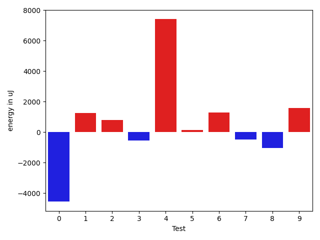

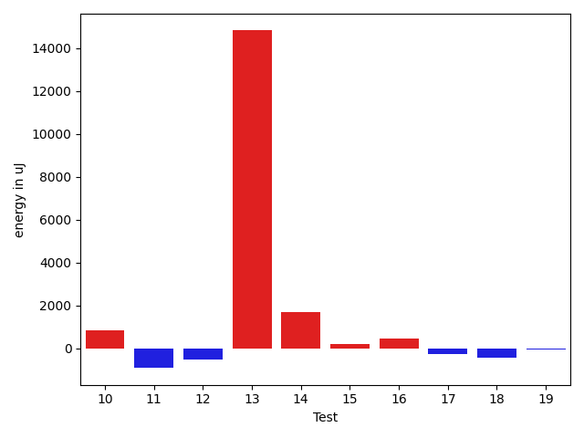

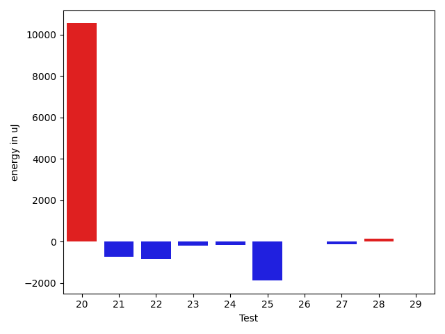

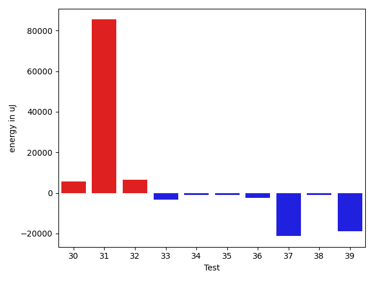

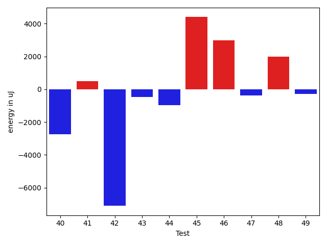

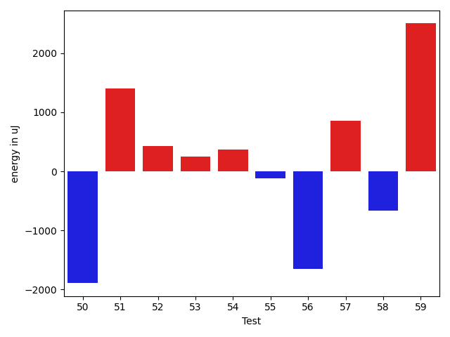

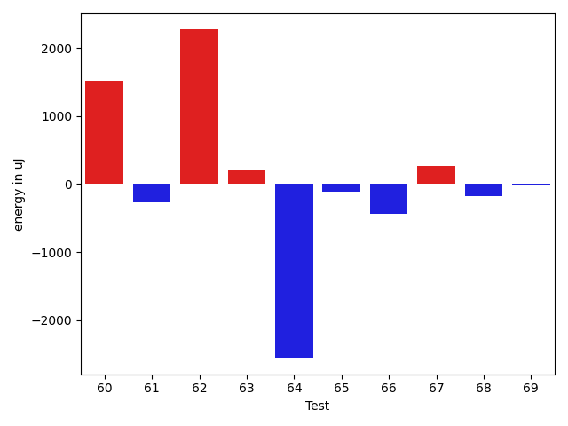

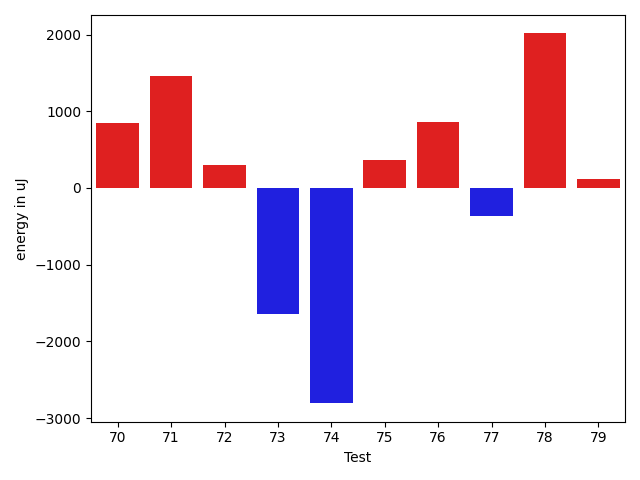

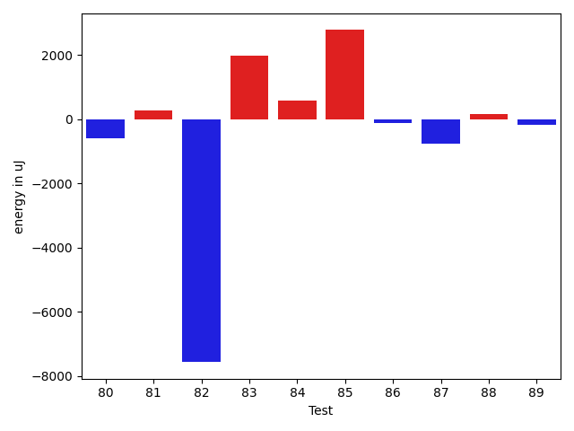

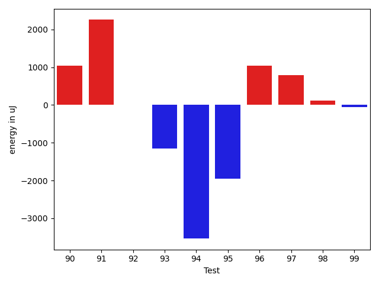

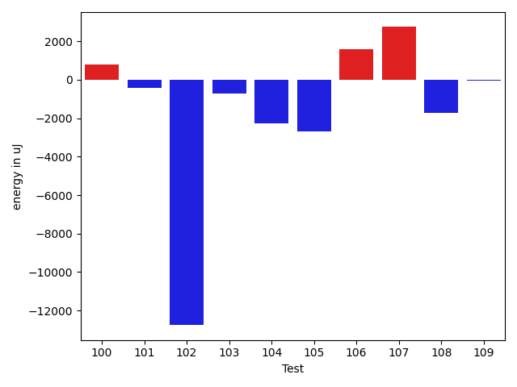

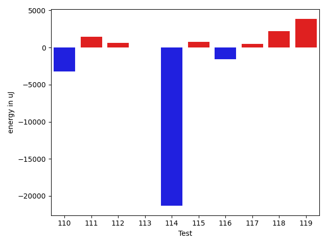

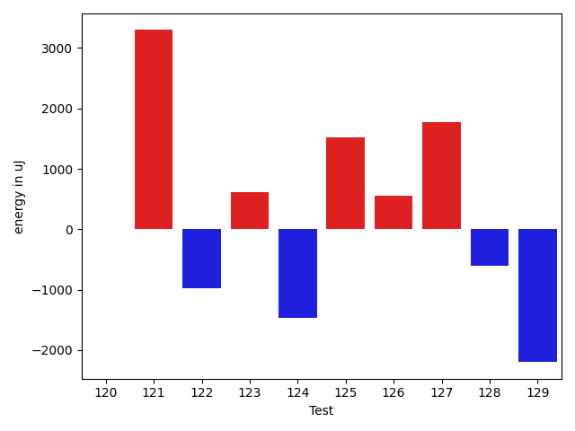

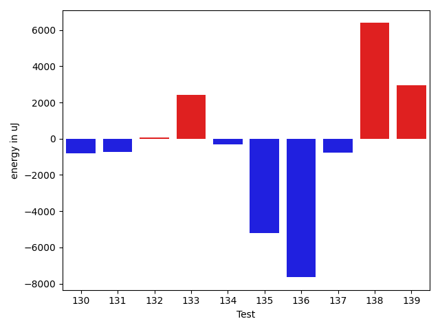

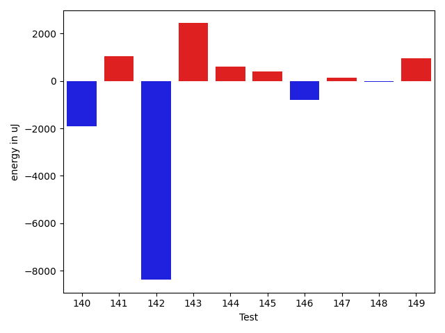

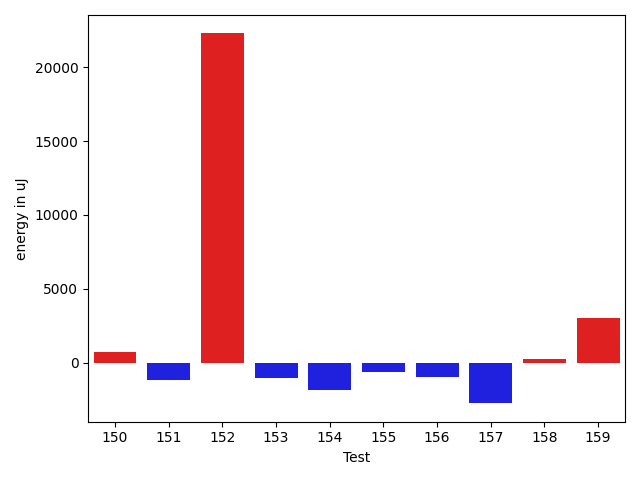

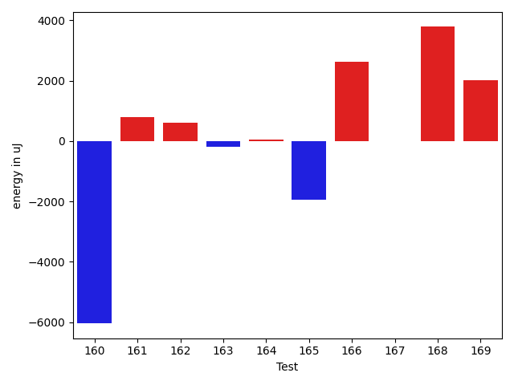

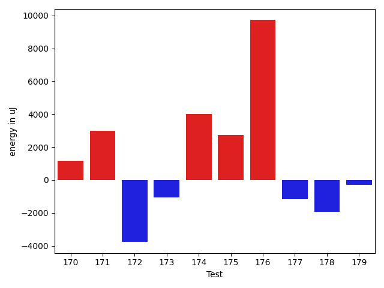

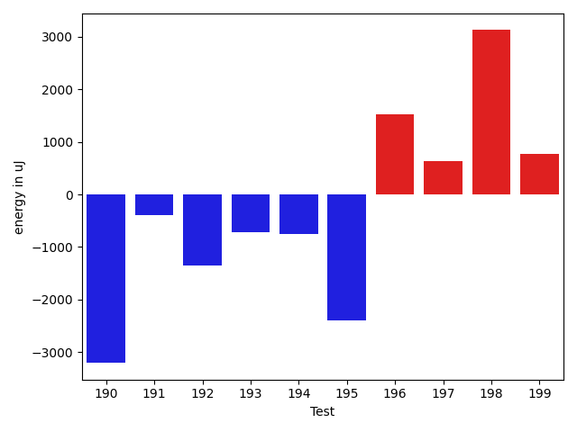

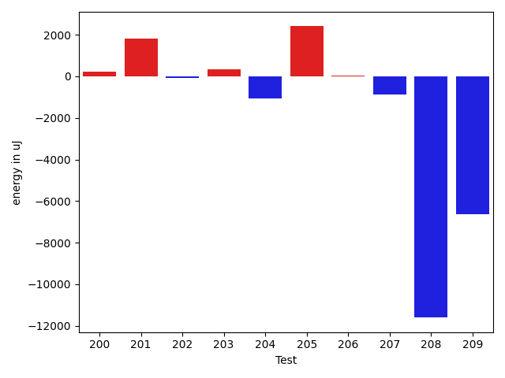

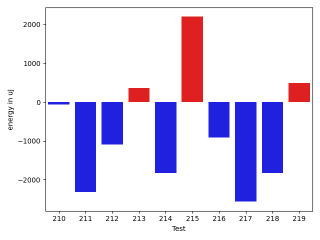

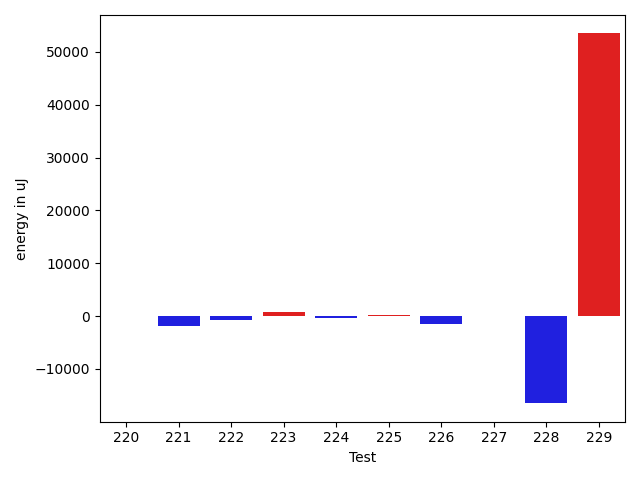

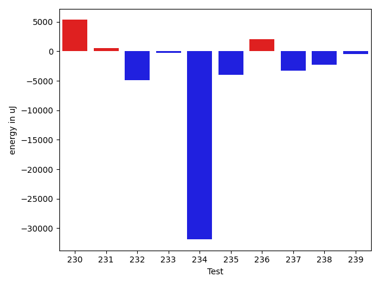

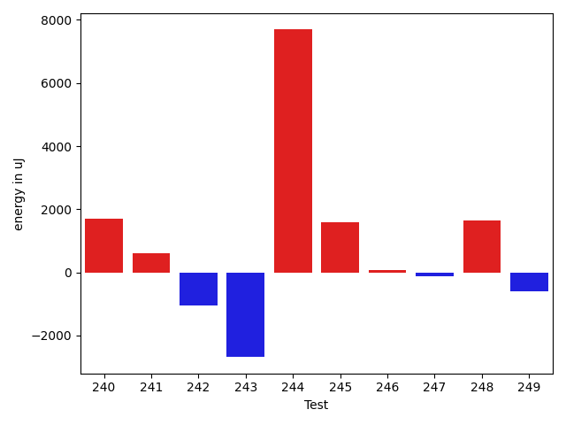

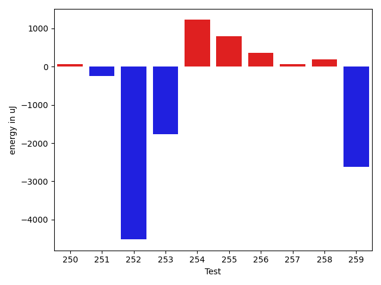

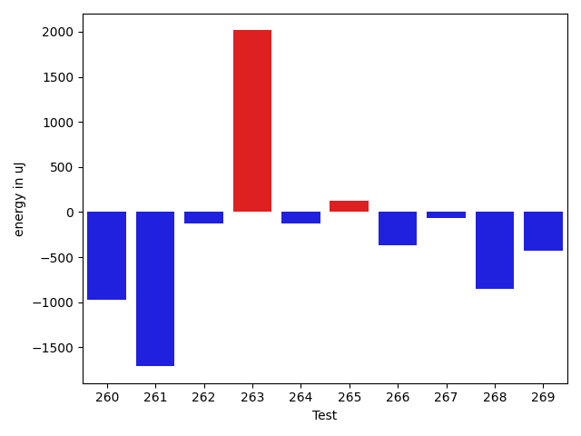

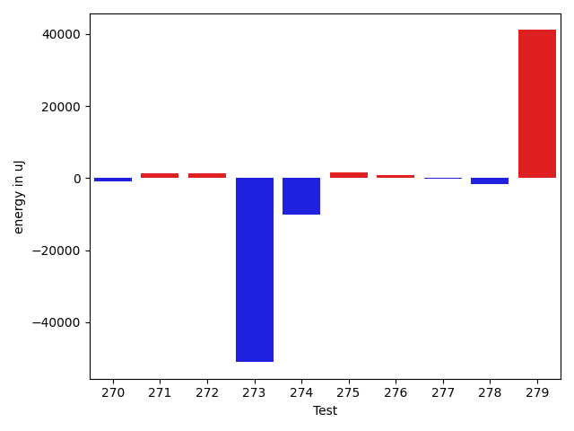

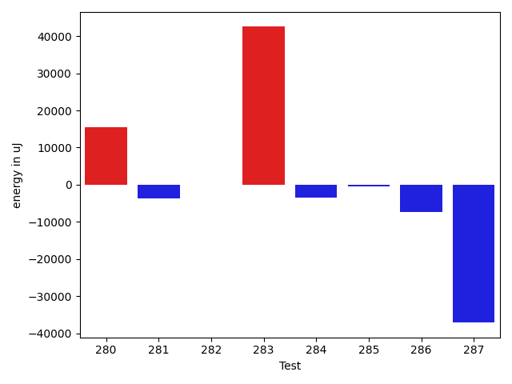

| ID | EnergyV1 | EnergyV2 | DeltaEnergy | σV1 | σV2 |
| --- | --- | --- | --- | --- | --- |
| 0 | 39306 | 38513 | -793 | 31868.854834810456 | 8595.730120299288 |
| 1 | 39062 | 40405 | 1343 | 3186.113519634854 | 3038.1631129009047 |
| 2 | 38269 | 38941 | 672 | 2762.25516378262 | 3329.5418599606032 |
| 3 | 39184 | 37537 | -1647 | 2767.6741749785097 | 3039.618511986775 |
| 4 | 39306 | 40589 | 1283 | 3591.8333439498633 | 38464.24187404686 |
| 5 | 38513 | 36011 | -2502 | 3447.2617356276996 | 4625.542101029356 |
| 6 | 36743 | 38391 | 1648 | 3440.3110612773244 | 3911.024149208441 |
| 7 | 40589 | 38513 | -2076 | 3909.0373799254367 | 3618.517764568802 |
| 8 | 38818 | 37048 | -1770 | 3282.685583043114 | 2890.0971239393443 |
| 9 | 38086 | 39063 | 977 | 3589.6120740416036 | 2632.713766923156 |
| 10 | 37353 | 37597 | 244 | 3717.3497193952694 | 3170.664587372785 |
| 11 | 38147 | 38025 | -122 | 3007.000666098556 | 3628.0065118464163 |
| 12 | 39489 | 38513 | -976 | 4197.632105127842 | 4309.315817822977 |
| 13 | 41504 | 46143 | 4639 | 50329.6814172196 | 84337.78842722173 |
| 14 | 38025 | 38696 | 671 | 7061.568870554207 | 10090.454723929548 |
| 15 | 37475 | 37597 | 122 | 7272.047967999724 | 5760.584891971962 |
| 16 | 37110 | 36988 | -122 | 4184.853302677473 | 4285.674931396454 |
| 17 | 38208 | 38391 | 183 | 24371.263933167585 | 21948.2329925061 |
| 18 | 38696 | 38575 | -121 | 6300.176959579142 | 4581.970228182121 |
| 19 | 39978 | 38818 | -1160 | 34141.048858339134 | 38170.84202336313 |
| 20 | 38696 | 40161 | 1465 | 42659.68597937361 | 63049.39846193696 |
| 21 | 40100 | 39307 | -793 | 4365.932544608542 | 4693.331326820072 |
| 22 | 38025 | 35767 | -2258 | 4235.278512872232 | 4096.605149830248 |
| 23 | 36987 | 36438 | -549 | 3733.94192327499 | 3380.7004206376223 |
| 24 | 36621 | 36437 | -184 | 5324.437160029105 | 6675.722216069485 |
| 25 | 79894 | 79346 | -548 | 21773.632537057063 | 24198.8267099829 |
| 26 | 37720 | 35827 | -1893 | 4169.502808450635 | 6677.577237538057 |
| 27 | 37598 | 38269 | 671 | 4264.259854768187 | 3628.4120225734505 |
| 28 | 36072 | 36804 | 732 | 6438.029216075869 | 3714.471788482933 |
| 29 | 36621 | 37353 | 732 | 4266.492089292002 | 3416.5183249682345 |
| 30 | 37353 | 37842 | 489 | 9641.229317551235 | 22640.54587218261 |
| 31 | 39795 | 40222 | 427 | 172715.90620016638 | 368882.1129466882 |
| 32 | 38391 | 38025 | -366 | 39650.750626315974 | 49536.649256728306 |
| 33 | 38025 | 37170 | -855 | 23714.640424669255 | 4446.883611445834 |
| 34 | 37537 | 37048 | -489 | 3282.0141674824554 | 4135.22250470696 |
| 35 | 78308 | 74402 | -3906 | 28189.85506129282 | 31350.910593371427 |
| 36 | 112182 | 109741 | -2441 | 32210.44849917663 | 32194.22155125508 |
| 37 | 189087 | 186584 | -2503 | 512127.26675623475 | 441992.4430670758 |
| 38 | 38024 | 35827 | -2197 | 4401.87723981201 | 4202.300609776811 |
| 39 | 65308 | 42114 | -23194 | 48519.676907696776 | 36594.39706144296 |
| 40 | 42541 | 42541 | 0 | 96016.85175145038 | 94550.75114544126 |
| 41 | 36743 | 38452 | 1709 | 5186.159221256611 | 4517.041485941245 |
| 42 | 42541 | 40894 | -1647 | 54829.330260381095 | 40113.02865483865 |
| 43 | 37232 | 37476 | 244 | 3934.239273560482 | 4436.8921780279925 |
| 44 | 37048 | 37537 | 489 | 7028.933765831843 | 4080.451432222009 |
| 45 | 34729 | 36682 | 1953 | 4986.723144502921 | 25521.231892761367 |
| 46 | 38513 | 42359 | 3846 | 4297.941440387479 | 4060.617419357417 |
| 47 | 38941 | 36865 | -2076 | 5853.234832124883 | 4905.517373788972 |
| 48 | 36377 | 38879 | 2502 | 5715.192509637993 | 4178.637151565621 |
| 49 | 36010 | 36499 | 489 | 5716.500835787182 | 4297.916635967038 |
| 50 | 42480 | 40588 | -1892 | 53638.48091024002 | 65578.46030453182 |
| 51 | 37292 | 38696 | 1404 | 4991.756282366089 | 4646.505303968787 |
| 52 | 37903 | 38330 | 427 | 4315.307416603819 | 8399.996326076323 |
| 53 | 37964 | 38208 | 244 | 8006.959068163818 | 10284.960722934995 |
| 54 | 37842 | 38208 | 366 | 4879.709096046691 | 6256.272219013681 |
| 55 | 37292 | 37170 | -122 | 34492.452558727 | 23433.080003763873 |
| 56 | 38147 | 36499 | -1648 | 4149.373305723036 | 4343.718240103551 |
| 57 | 37170 | 38025 | 855 | 12161.002045805775 | 15815.212183332607 |
| 58 | 37231 | 36560 | -671 | 10090.999552429284 | 9366.948146867697 |
| 59 | 41260 | 43762 | 2502 | 29931.833466291548 | 17941.282933635623 |
| 60 | 34729 | 37292 | 2563 | 4022.9328079772845 | 5229.271125543011 |
| 61 | 38208 | 36682 | -1526 | 3726.4340388037936 | 3664.0370235574856 |
| 62 | 34424 | 38696 | 4272 | 4668.938562664865 | 4025.3899364644876 |
| 63 | 35522 | 35949 | 427 | 3959.2946100973986 | 6339.5080803328265 |
| 64 | 42297 | 40222 | -2075 | 18928.503729473956 | 18285.523212509823 |
| 65 | 35766 | 34851 | -915 | 3480.1882354898776 | 4260.874409734781 |
| 66 | 36804 | 36255 | -549 | 4939.713195555612 | 3692.8685539868316 |
| 67 | 38024 | 36865 | -1159 | 3686.2775202902485 | 4642.147507805516 |
| 68 | 34790 | 34424 | -366 | 4391.39033220641 | 4533.9488304600345 |
| 69 | 35828 | 35522 | -306 | 3430.25682513185 | 3425.7428949385885 |
| 70 | 35401 | 36254 | 853 | 4036.3355239898265 | 4514.873335081939 |
| 71 | 35889 | 37354 | 1465 | 4501.665957904866 | 4222.617453632548 |
| 72 | 35461 | 35766 | 305 | 3191.9504312497643 | 3817.5616787287718 |
| 73 | 38086 | 36438 | -1648 | 3956.055978654751 | 3382.987130132869 |
| 74 | 38452 | 35645 | -2807 | 4687.033668062942 | 3982.6064692471055 |
| 75 | 35766 | 36132 | 366 | 4666.512687221583 | 33040.713027202306 |
| 76 | 39307 | 40161 | 854 | 111201.49903746344 | 117773.12435601717 |
| 77 | 38513 | 38147 | -366 | 4854.051230099749 | 4034.866280238824 |
| 78 | 34912 | 36926 | 2014 | 3980.60764217616 | 4491.709404991477 |
| 79 | 34851 | 34973 | 122 | 4662.6167474491995 | 3643.509212103739 |
| 80 | 36926 | 35950 | -976 | 4635.484312339864 | 4047.1297244840966 |
| 81 | 37353 | 37658 | 305 | 4775.2557389291715 | 3909.6375902321843 |
| 82 | 35462 | 32593 | -2869 | 29719.417567063963 | 3146.398345890172 |
| 83 | 35950 | 38330 | 2380 | 4176.354862311201 | 4164.017928482947 |
| 84 | 36987 | 38086 | 1099 | 4255.61753269131 | 3795.3876545552575 |
| 85 | 37171 | 37476 | 305 | 10442.238658246684 | 20191.90805826605 |
| 86 | 34851 | 34668 | -183 | 4192.24419560163 | 3368.461116096999 |
| 87 | 38330 | 35461 | -2869 | 3673.800511731686 | 5294.584945305492 |
| 88 | 35034 | 35583 | 549 | 3754.1328099851316 | 4188.685015519824 |
| 89 | 36377 | 36987 | 610 | 4065.4409081320296 | 3726.264720889543 |
| 90 | 36072 | 37109 | 1037 | 4773.725588303997 | 4470.621693559306 |
| 91 | 33753 | 36011 | 2258 | 4333.125492360495 | 3344.9354505531714 |
| 92 | 35644 | 35644 | 0 | 3922.851174847193 | 2849.4429653912625 |
| 93 | 36438 | 35279 | -1159 | 29113.50582280744 | 3866.0620635585624 |
| 94 | 77637 | 74097 | -3540 | 23861.178503497216 | 24259.35423261072 |
| 95 | 36682 | 34729 | -1953 | 9594.38703955033 | 4444.768222314243 |
| 96 | 35583 | 36621 | 1038 | 4303.289066984049 | 3854.6649697332823 |
| 97 | 35035 | 35828 | 793 | 32672.313020288806 | 4237.497502024876 |
| 98 | 36377 | 36499 | 122 | 5591.173284991811 | 5877.771099223497 |
| 99 | 36743 | 36682 | -61 | 4004.0764311003427 | 3888.516290975207 |
| 100 | 36926 | 37719 | 793 | 4035.266219094862 | 6010.053925829665 |
| 101 | 69763 | 69336 | -427 | 17261.617468931174 | 18334.442652845228 |
| 102 | 120361 | 107604 | -12757 | 85108.92660885808 | 74933.55228660359 |
| 103 | 36682 | 35949 | -733 | 9930.590375534917 | 9266.132357908322 |
| 104 | 37231 | 34973 | -2258 | 3948.265337244204 | 5113.883288381744 |
| 105 | 44067 | 41382 | -2685 | 19439.60812416285 | 19105.687518130697 |
| 106 | 36865 | 38452 | 1587 | 3458.435257427976 | 4289.385230372397 |
| 107 | 37048 | 39794 | 2746 | 4199.977827322426 | 4449.870301062829 |
| 108 | 38391 | 36682 | -1709 | 20788.22244701712 | 12644.379727914837 |
| 109 | 37292 | 37231 | -61 | 5325.053824929847 | 4461.065031168371 |
| 110 | 35767 | 37537 | 1770 | 31206.75602703314 | 4535.277343970785 |
| 111 | 34729 | 36743 | 2014 | 4236.302037552631 | 3847.4116821469 |
| 112 | 37415 | 36865 | -550 | 3719.526050194107 | 4866.336937355431 |
| 113 | 37476 | 36743 | -733 | 4910.886215674186 | 5146.399206133629 |
| 114 | 40283 | 38635 | -1648 | 91055.12403453335 | 56055.96553648503 |
| 115 | 36682 | 37109 | 427 | 3586.111298337654 | 4623.910419958146 |
| 116 | 37292 | 37781 | 489 | 9313.123261396708 | 5213.044643654106 |
| 117 | 35339 | 36377 | 1038 | 5035.505556464383 | 3593.469988125065 |
| 118 | 36072 | 37293 | 1221 | 4011.75686216242 | 4120.0642599567345 |
| 119 | 35950 | 35950 | 0 | 4670.512564728196 | 22687.231318099206 |
| 120 | 36743 | 36743 | 0 | 3554.539043885821 | 3700.039340772459 |
| 121 | 34973 | 38269 | 3296 | 4097.95022541758 | 3570.235513422297 |
| 122 | 39002 | 38025 | -977 | 70345.20733485953 | 4066.926904052564 |
| 123 | 125305 | 125916 | 611 | 89140.59943364903 | 83554.53799156558 |
| 124 | 39551 | 38086 | -1465 | 3833.9748856185433 | 3775.2277626654527 |
| 125 | 36926 | 38452 | 1526 | 4263.7395858468135 | 4388.4548888218615 |
| 126 | 38575 | 39124 | 549 | 5894.11285039811 | 4026.0611355751407 |
| 127 | 38635 | 40406 | 1771 | 33260.340467199836 | 41813.616744122664 |
| 128 | 38208 | 37598 | -610 | 3965.4932435865476 | 3564.6545335152264 |
| 129 | 40405 | 38208 | -2197 | 4076.7429678114363 | 2428.0444378265593 |
| 130 | 39001 | 37049 | -1952 | 4466.492549964557 | 3614.796169969664 |
| 131 | 37964 | 37536 | -428 | 4454.997005105692 | 3591.5934288313724 |
| 132 | 37414 | 37109 | -305 | 3848.7190543055176 | 4483.665060213127 |
| 133 | 38025 | 38452 | 427 | 13025.120553645287 | 13194.700375978871 |
| 134 | 38513 | 36743 | -1770 | 4764.471545829653 | 9088.774557713861 |
| 135 | 38147 | 39185 | 1038 | 36824.35700497829 | 31570.160610737745 |
| 136 | 40039 | 38147 | -1892 | 64983.49151966497 | 51216.32014855233 |
| 137 | 38635 | 37170 | -1465 | 4253.980639362791 | 4105.8809953850205 |
| 138 | 40161 | 40832 | 671 | 518893.32413443533 | 559369.0655637201 |
| 139 | 38452 | 41748 | 3296 | 4038.927539284411 | 4416.68012812414 |
| 140 | 38513 | 37597 | -916 | 3385.0090645172436 | 3736.4882221646303 |
| 141 | 39062 | 40100 | 1038 | 3541.5424898059023 | 4712.987501309546 |
| 142 | 81909 | 77881 | -4028 | 29776.194409191703 | 28942.01788060476 |
| 143 | 82031 | 83190 | 1159 | 265849.4801016356 | 273635.55168414867 |
| 144 | 35888 | 35766 | -122 | 3504.22109510779 | 4662.078554083409 |
| 145 | 36499 | 37659 | 1160 | 4083.5394332924516 | 4082.8483857912265 |
| 146 | 37598 | 36011 | -1587 | 4330.95164207862 | 4880.539045449232 |
| 147 | 36438 | 37415 | 977 | 3591.791379446945 | 4597.764056404738 |
| 148 | 36743 | 36133 | -610 | 3547.5018484955526 | 4401.008526462997 |
| 149 | 35583 | 36255 | 672 | 3966.104424822139 | 4114.439855642855 |
| 150 | 35583 | 36316 | 733 | 3576.647838100009 | 4348.371099203573 |
| 151 | 38452 | 37293 | -1159 | 4625.296551303494 | 4931.580495033421 |
| 152 | 42053 | 64331 | 22278 | 31471.453010899455 | 61038.704833996846 |
| 153 | 37293 | 36255 | -1038 | 4711.18877430016 | 4229.647005357606 |
| 154 | 39428 | 37597 | -1831 | 32174.94489357085 | 30939.84322311007 |
| 155 | 39612 | 39001 | -611 | 47669.41032235016 | 24157.32356364007 |
| 156 | 39001 | 38025 | -976 | 4003.090287139373 | 4248.964495964419 |
| 157 | 41748 | 39001 | -2747 | 19996.826025661965 | 18072.98256265576 |
| 158 | 35949 | 36194 | 245 | 4636.5143933826375 | 5244.3827900816195 |
| 159 | 166930 | 169982 | 3052 | 344475.16021011875 | 164180.08184550604 |
| 160 | 42237 | 36194 | -6043 | 49932.84296997791 | 24180.404485088748 |
| 161 | 36499 | 37292 | 793 | 3816.353066394302 | 4015.1761418244837 |
| 162 | 38208 | 38818 | 610 | 52585.72337187108 | 21115.838158958442 |
| 163 | 36438 | 36255 | -183 | 5031.577183647747 | 4581.856983083922 |
| 164 | 36865 | 36926 | 61 | 4309.9047328682345 | 4558.86877830182 |
| 165 | 37720 | 35767 | -1953 | 7223.868568429144 | 5305.934588132234 |
| 166 | 37232 | 39856 | 2624 | 4154.841473220132 | 4661.4323277224275 |
| 167 | 39794 | 39795 | 1 | 461966.9523609356 | 527725.3366819103 |
| 168 | 35706 | 39489 | 3783 | 3328.118022120159 | 4509.2686312274 |
| 169 | 38635 | 40649 | 2014 | 17434.853213689512 | 23524.507545753273 |
| 170 | 37475 | 38940 | 1465 | 3654.887534744725 | 4840.603188395017 |
| 171 | 40039 | 39856 | -183 | 8576.69013182148 | 32061.633925409078 |
| 172 | 40039 | 38086 | -1953 | 39325.218687193024 | 28150.67572638092 |
| 173 | 39733 | 38940 | -793 | 5063.564469866645 | 5274.335410615127 |
| 174 | 39306 | 37170 | -2136 | 4480.692908189536 | 19413.738118229703 |
| 175 | 37780 | 39002 | 1222 | 3791.9990308543065 | 4357.271344449528 |
| 176 | 36743 | 38574 | 1831 | 3460.5956943855776 | 38762.16405216459 |
| 177 | 36987 | 35339 | -1648 | 4806.227130244679 | 4167.898831961902 |
| 178 | 36926 | 34729 | -2197 | 3936.5891632223957 | 4408.556319347828 |
| 179 | 36865 | 36499 | -366 | 3887.825604241281 | 3527.5800122825785 |
| 180 | 36133 | 39550 | 3417 | 4293.655155193064 | 4510.017621238031 |
| 181 | 38818 | 37415 | -1403 | 4397.573740424274 | 5269.534241850323 |
| 182 | 40466 | 37720 | -2746 | 5125.741344562848 | 3863.9771490218814 |
| 183 | 37354 | 37293 | -61 | 5209.096317623719 | 3419.8384438813073 |
| 184 | 74768 | 78247 | 3479 | 318206.35877872613 | 384044.51523684716 |
| 185 | 40528 | 40649 | 121 | 16284.342728365567 | 18419.253681691567 |
| 186 | 37292 | 39002 | 1710 | 7095.74985965258 | 4747.750983607265 |
| 187 | 36926 | 38269 | 1343 | 9394.611256124723 | 8721.126774622493 |
| 188 | 68847 | 68970 | 123 | 106015.49316329029 | 72055.64629014285 |
| 189 | 35278 | 36194 | 916 | 3711.103411468379 | 3948.8663828170424 |
| 190 | 74402 | 74463 | 61 | 30161.97358073017 | 35508.377356766956 |
| 191 | 35828 | 35950 | 122 | 5823.50236709631 | 4907.471264290173 |
| 192 | 36804 | 37842 | 1038 | 67671.96341320942 | 53511.038199558745 |
| 193 | 42908 | 41870 | -1038 | 20425.55762397474 | 21170.24563150585 |
| 194 | 38757 | 37048 | -1709 | 8937.823803466981 | 9033.301568764782 |
| 195 | 74035 | 74707 | 672 | 27451.967417013835 | 29996.159666471573 |
| 196 | 36194 | 37659 | 1465 | 6710.770794342108 | 7027.821883295541 |
| 197 | 36194 | 37414 | 1220 | 3647.78636094086 | 4315.804713885928 |
| 198 | 35889 | 37048 | 1159 | 3643.357698054959 | 18873.556653796015 |
| 199 | 37415 | 36621 | -794 | 4714.40323787363 | 8461.155416111085 |
| 200 | 35278 | 36560 | 1282 | 4012.6749131192637 | 3972.016945681628 |
| 201 | 37536 | 35888 | -1648 | 3988.987583867809 | 22348.02871123616 |
| 202 | 35645 | 36804 | 1159 | 3960.358815191921 | 3863.0111600475093 |
| 203 | 36804 | 36438 | -366 | 3670.245630145209 | 3275.5223793054297 |
| 204 | 39367 | 36438 | -2929 | 4358.3501532797645 | 4251.181245358569 |
| 205 | 38635 | 39185 | 550 | 8998.641113933621 | 12832.518870663505 |
| 206 | 39429 | 41015 | 1586 | 46039.121893943986 | 39903.71770004811 |
| 207 | 38268 | 35523 | -2745 | 4698.661702608048 | 3920.9836994646844 |
| 208 | 44677 | 40711 | -3966 | 45345.71733085491 | 41912.891867353224 |
| 209 | 37109 | 38025 | 916 | 32941.492417531415 | 22991.81439054724 |
| 210 | 36743 | 36682 | -61 | 4410.981237033902 | 3469.3944877114523 |
| 211 | 41565 | 39245 | -2320 | 73569.3490198865 | 66724.4263219027 |
| 212 | 36804 | 35706 | -1098 | 3931.404699249338 | 4370.724144540125 |
| 213 | 37415 | 37781 | 366 | 3454.4124009751763 | 3371.901671164211 |
| 214 | 37659 | 35828 | -1831 | 4728.8356698303805 | 5651.570325303343 |
| 215 | 37598 | 39794 | 2196 | 10414.594888420255 | 11692.43810154238 |
| 216 | 37597 | 36682 | -915 | 5212.103162963828 | 3870.6090991743295 |
| 217 | 37841 | 35278 | -2563 | 3758.177029771964 | 3199.3404569340537 |
| 218 | 38330 | 36499 | -1831 | 6477.539499037519 | 6241.348852446392 |
| 219 | 37659 | 38147 | 488 | 4598.165469211588 | 8627.743069673721 |
| 220 | 36193 | 36133 | -60 | 3609.2286265161492 | 3243.0642688784515 |
| 221 | 39184 | 37232 | -1952 | 11182.75393774817 | 16091.328398893163 |
| 222 | 36560 | 35767 | -793 | 4570.490455461012 | 4145.011549125317 |
| 223 | 35705 | 36560 | 855 | 3254.980135438428 | 3145.4978622647777 |
| 224 | 36926 | 36499 | -427 | 4110.132599765405 | 3747.5540232129824 |
| 225 | 40344 | 40527 | 183 | 249002.24602002895 | 357131.19261366886 |
| 226 | 39489 | 38025 | -1464 | 16805.42723337752 | 13138.354164165905 |
| 227 | 38574 | 38635 | 61 | 4477.47910546622 | 5631.143505245332 |
| 228 | 236327 | 219848 | -16479 | 132044.02096120405 | 126774.4901980634 |
| 229 | 360350 | 413817 | 53467 | 165306.96869654916 | 143331.78120544073 |
| 230 | 39611 | 37659 | -1952 | 34824.683639074654 | 59927.93347256871 |
| 231 | 38208 | 37963 | -245 | 30008.946036624664 | 38860.368438314894 |
| 232 | 39917 | 39978 | 61 | 22850.051898715792 | 15859.766928745537 |
| 233 | 38940 | 39062 | 122 | 4146.627893327885 | 4588.988656730369 |
| 234 | 42542 | 40100 | -2442 | 99265.43842649745 | 52869.776459095934 |
| 235 | 40588 | 38696 | -1892 | 110144.28177919376 | 118039.20535651714 |
| 236 | 69152 | 68237 | -915 | 21595.30837658041 | 22694.768977033596 |
| 237 | 38635 | 37475 | -1160 | 10146.932258247327 | 7918.973736184191 |
| 238 | 40100 | 37536 | -2564 | 4028.2985780095482 | 4459.133606788059 |
| 239 | 38086 | 37719 | -367 | 4878.641802113917 | 3838.1472878598315 |
| 240 | 78552 | 80261 | 1709 | 444722.4118440977 | 360601.185184605 |
| 241 | 41016 | 41625 | 609 | 74831.84909462104 | 85960.22141607048 |
| 242 | 37964 | 36926 | -1038 | 3446.583906163061 | 3764.1355498799217 |
| 243 | 42907 | 40223 | -2684 | 4598.5561766409055 | 4201.708142140336 |
| 244 | 77209 | 84900 | 7691 | 455084.2612659396 | 345128.54266072897 |
| 245 | 39184 | 40771 | 1587 | 26286.601678343635 | 17009.251123440838 |
| 246 | 38269 | 38330 | 61 | 3998.0847420856353 | 4030.43662026833 |
| 247 | 41076 | 40955 | -121 | 95880.67012262742 | 86756.24088874433 |
| 248 | 38024 | 39673 | 1649 | 3760.5047877063225 | 4703.396076158918 |
| 249 | 39368 | 38757 | -611 | 5972.681477804597 | 26525.973188718486 |
| 250 | 41016 | 41077 | 61 | 63661.37188100509 | 42890.33190164888 |
| 251 | 39062 | 38818 | -244 | 17253.88902425328 | 13134.593987840863 |
| 252 | 38208 | 33691 | -4517 | 4372.71428856644 | 4149.0591004088055 |
| 253 | 37415 | 35644 | -1771 | 3763.1643592212426 | 4450.735916810819 |
| 254 | 36682 | 37903 | 1221 | 4010.96923144766 | 27353.65042141961 |
| 255 | 36621 | 37414 | 793 | 4122.464648435448 | 4237.9979815452525 |
| 256 | 36133 | 36498 | 365 | 3767.7280421337423 | 4033.1575922706475 |
| 257 | 37354 | 37414 | 60 | 4268.874827156514 | 4250.377910762468 |
| 258 | 37048 | 37231 | 183 | 3542.573735607551 | 5330.906712520864 |
| 259 | 40344 | 37719 | -2625 | 59706.808833058094 | 35777.04766739246 |
| 260 | 37293 | 36316 | -977 | 4015.7204116604685 | 4622.587140171695 |
| 261 | 39978 | 38268 | -1710 | 9873.20303819735 | 11624.601104525485 |
| 262 | 38635 | 38513 | -122 | 4905.803400150006 | 11536.486316095095 |
| 263 | 38147 | 40161 | 2014 | 55370.681051964384 | 52896.4921518489 |
| 264 | 40772 | 40649 | -123 | 81459.26887515832 | 92840.19848000354 |
| 265 | 39245 | 39368 | 123 | 34207.02262677987 | 34915.281346822405 |
| 266 | 37415 | 37048 | -367 | 4739.2767412209405 | 4395.11893335631 |
| 267 | 39001 | 38940 | -61 | 5114.582268242053 | 3286.6347885945584 |
| 268 | 39429 | 38575 | -854 | 22214.81799321053 | 20430.35180446521 |
| 269 | 39490 | 39063 | -427 | 22595.748285363454 | 3778.2410642957334 |
| 270 | 38574 | 37110 | -1464 | 3890.1002124432734 | 3677.289086179292 |
| 271 | 38575 | 40650 | 2075 | 5012.73537142938 | 4649.852354976115 |
| 272 | 38575 | 40833 | 2258 | 4514.784471784525 | 3805.756685682531 |
| 273 | 39673 | 40344 | 671 | 244830.31357614993 | 10187.472758486178 |
| 274 | 39611 | 37963 | -1648 | 41992.6347078846 | 6599.125136207604 |
| 275 | 36254 | 38025 | 1771 | 3636.8102256350894 | 4360.012234111276 |
| 276 | 36559 | 39001 | 2442 | 4452.118533630927 | 4569.157893898502 |
| 277 | 37720 | 38513 | 793 | 4551.930622210096 | 3213.581433152115 |
| 278 | 37719 | 36499 | -1220 | 4489.045029519211 | 3739.284635006704 |
| 279 | 39734 | 39551 | -183 | 336997.64466080355 | 433704.30690912437 |
| 280 | 38636 | 39123 | 487 | 23257.78263323782 | 62500.87902925647 |
| 281 | 40772 | 38819 | -1953 | 6286.883445379143 | 5059.6475455626905 |
| 282 | 38452 | 38208 | -244 | 5225.721855266768 | 3050.822127611013 |
| 283 | 41198 | 39856 | -1342 | 369262.0707681513 | 445253.4192513621 |
| 284 | 40283 | 36011 | -4272 | 4452.679097951971 | 3674.001383553306 |
| 285 | 40039 | 40589 | 550 | 5093.342089714488 | 4575.57663142035 |
| 286 | 40222 | 39428 | -794 | 15594.755483609633 | 3916.6076334203644 |
| 287 | 39001 | 38269 | -732 | 269756.3011202672 | 4016.1458709065837 |

## Delta Duration per test method

| ID | DurationV1 | DurationsV2 | DeltaDuration |
| --- | --- | --- | --- |
| 0 | 1031970.0833333334 | 894875.9464285715 | -137094.1369047619 |
| 1 | 400276.7 | 342830.6153846154 | -57446.084615384636 |
| 2 | 326264.4375 | 344863.1052631579 | 18598.667763157922 |
| 3 | 410169.36363636365 | 417745.8095238095 | 7576.44588744588 |
| 4 | 532170.4615384615 | 781823.3478260869 | 249652.8862876254 |
| 5 | 417364.4285714286 | 438769.55555555556 | 21405.126984126982 |
| 6 | 384009.2727272727 | 363085.90476190473 | -20923.367965367972 |
| 7 | 415118.05555555556 | 405370.4375 | -9747.618055555562 |
| 8 | 371085.05263157893 | 392773.1666666667 | 21688.114035087754 |
| 9 | 411915.5789473684 | 378439.4117647059 | -33476.167182662524 |
| 10 | 423550.1052631579 | 389450.95454545453 | -34099.15071770339 |
| 11 | 430243.92307692306 | 385545.6875 | -44698.23557692306 |
| 12 | 668364.275 | 718794.4186046511 | 50430.14360465109 |
| 13 | 1830966.2525252525 | 2311997.222222222 | 481030.9696969695 |
| 14 | 1065053.986111111 | 1077130.3896103897 | 12076.403499278706 |
| 15 | 844077.8333333334 | 860327.3559322034 | 16249.522598869982 |
| 16 | 823945.5416666666 | 884769.38 | 60823.83833333338 |
| 17 | 922392.274509804 | 902696.5 | -19695.774509803974 |
| 18 | 832371.4418604651 | 826212.0188679246 | -6159.422992540523 |
| 19 | 1336085.975 | 1278653.0615384616 | -57432.9134615385 |
| 20 | 911254.0222222222 | 1366674.7826086956 | 455420.7603864734 |
| 21 | 554327.0 | 632817.8095238095 | 78490.80952380947 |
| 22 | 698343.8541666666 | 732775.0909090909 | 34431.23674242431 |
| 23 | 772178.5846153846 | 837995.7457627119 | 65817.16114732728 |
| 24 | 819809.8070175438 | 859167.9827586206 | 39358.17574107682 |
| 25 | 2523811.3232323234 | 2550174.484848485 | 26363.161616161466 |
| 26 | 864605.21875 | 939084.2372881356 | 74479.01853813557 |
| 27 | 576578.0 | 661720.7222222222 | 85142.72222222225 |
| 28 | 837541.0491803279 | 874192.6666666666 | 36651.61748633871 |
| 29 | 565867.6756756756 | 604372.0625 | 38504.38682432438 |
| 30 | 911011.1384615385 | 1137551.7627118644 | 226540.62425032596 |
| 31 | 1702005.5283018867 | 4577571.359375 | 2875565.8310731133 |
| 32 | 1088014.2156862745 | 1421911.7608695652 | 333897.5451832907 |
| 33 | 861630.3333333334 | 800924.5344827586 | -60705.79885057476 |
| 34 | 405351.8 | 466860.4210526316 | 61508.621052631584 |
| 35 | 2363157.3333333335 | 2397833.202020202 | 34675.86868686834 |
| 36 | 3309736.3636363638 | 3336279.585858586 | 26543.222222222015 |
| 37 | 8514340.464646464 | 7852912.141414141 | -661428.3232323229 |
| 38 | 395280.75 | 363815.2916666667 | -31465.458333333314 |
| 39 | 2413905.1666666665 | 1816709.1538461538 | -597196.0128205128 |
| 40 | 2159177.25 | 2124086.230769231 | -35091.019230769016 |
| 41 | 756497.3783783783 | 690363.0 | -66134.37837837834 |
| 42 | 1812599.5376344086 | 1620804.5056179776 | -191795.03201643098 |
| 43 | 503394.82608695654 | 442715.94736842107 | -60678.878718535474 |
| 44 | 1095217.9871794872 | 986482.5443037974 | -108735.44287568983 |
| 45 | 719534.9230769231 | 722533.6578947369 | 2998.7348178137327 |
| 46 | 608929.03125 | 500634.5 | -108294.53125 |
| 47 | 501060.64705882355 | 456054.04545454547 | -45006.60160427808 |
| 48 | 462692.3333333333 | 461792.94444444444 | -899.388888888876 |
| 49 | 474400.5 | 409195.8333333333 | -65204.666666666686 |
| 50 | 1945033.448979592 | 2128411.673469388 | 183378.22448979598 |
| 51 | 659900.3409090909 | 684279.6486486486 | 24379.3077395577 |
| 52 | 980925.6714285715 | 982258.0806451613 | 1332.4092165898765 |
| 53 | 727934.9677419355 | 711353.2972972973 | -16581.670444638235 |
| 54 | 618286.1428571428 | 658303.8076923077 | 40017.664835164906 |
| 55 | 1069109.8727272728 | 959126.3773584906 | -109983.4953687822 |
| 56 | 394732.0 | 405615.3076923077 | 10883.307692307688 |
| 57 | 1209244.5057471264 | 1186203.7108433736 | -23040.79490375286 |
| 58 | 1013928.0882352941 | 1056166.1935483871 | 42238.10531309305 |
| 59 | 1747044.4040404041 | 1628500.696969697 | -118543.70707070711 |
| 60 | 537717.125 | 615186.8846153846 | 77469.75961538462 |
| 61 | 586040.7333333333 | 553690.275 | -32350.458333333256 |
| 62 | 474545.4736842105 | 436653.8095238095 | -37891.66416040098 |
| 63 | 751497.9782608695 | 818762.5094339623 | 67264.53117309278 |
| 64 | 1582919.6082474226 | 1589607.1157894738 | 6687.507542051142 |
| 65 | 689457.3409090909 | 675395.023255814 | -14062.317653276958 |
| 66 | 549091.3243243244 | 533454.9090909091 | -15636.415233415319 |
| 67 | 402479.1666666667 | 573268.1111111111 | 170788.94444444444 |
| 68 | 653042.8571428572 | 731431.447368421 | 78388.59022556385 |
| 69 | 404892.3181818182 | 425383.06666666665 | 20490.748484848475 |
| 70 | 639432.8333333334 | 684103.3823529412 | 44670.54901960783 |
| 71 | 741344.7872340425 | 716461.8333333334 | -24882.953900709166 |
| 72 | 545680.4583333334 | 483696.46875 | -61983.98958333337 |
| 73 | 816696.203125 | 866969.9818181818 | 50273.77869318181 |
| 74 | 499025.6 | 492105.5333333333 | -6920.066666666651 |
| 75 | 440769.65 | 712014.1304347826 | 271244.48043478257 |
| 76 | 2311801.0322580645 | 2716753.620689655 | 404952.5884315907 |
| 77 | 447517.67741935485 | 587271.0 | 139753.32258064515 |
| 78 | 546485.7586206896 | 496095.86666666664 | -50389.89195402298 |
| 79 | 379796.25 | 415992.7619047619 | 36196.511904761894 |
| 80 | 519353.3214285714 | 505152.0 | -14201.32142857142 |
| 81 | 464796.8965517241 | 500810.26086956525 | 36013.36431784113 |
| 82 | 656502.7857142857 | 492105.21428571426 | -164397.57142857142 |
| 83 | 733754.0909090909 | 690185.0784313725 | -43569.01247771841 |
| 84 | 628470.3396226416 | 651643.6976744186 | 23173.358051777002 |
| 85 | 845603.0 | 939750.6857142857 | 94147.6857142857 |
| 86 | 359406.93333333335 | 360797.1176470588 | 1390.1843137254473 |
| 87 | 393916.2 | 382915.0833333333 | -11001.116666666698 |
| 88 | 609783.5925925926 | 604764.7027027027 | -5018.889889889862 |
| 89 | 748282.0 | 742000.3953488372 | -6281.60465116275 |
| 90 | 554989.1162790698 | 535362.3461538461 | -19626.770125223673 |
| 91 | 438653.46153846156 | 455330.9285714286 | 16677.46703296702 |
| 92 | 443150.45 | 443495.92307692306 | 345.47307692305185 |
| 93 | 1018674.4642857143 | 842725.2962962963 | -175949.16798941803 |
| 94 | 2278093.9696969697 | 2287016.393939394 | 8922.424242424313 |
| 95 | 689142.8666666667 | 640062.9130434783 | -49079.95362318843 |
| 96 | 788390.2340425532 | 702217.9333333333 | -86172.30070921988 |
| 97 | 699138.2903225806 | 466199.8620689655 | -232938.4282536151 |
| 98 | 894380.2857142857 | 803282.0327868853 | -91098.2529274004 |
| 99 | 661409.914893617 | 698876.3260869565 | 37466.4111933395 |
| 100 | 998719.7894736842 | 943373.1891891892 | -55346.600284494925 |
| 101 | 1922719.5656565656 | 1886391.5757575757 | -36327.98989898991 |
| 102 | 4125492.414141414 | 3934788.6666666665 | -190703.7474747477 |
| 103 | 1025836.5666666667 | 1017035.7301587302 | -8800.836507936474 |
| 104 | 747176.3157894737 | 780975.0681818182 | 33798.752392344526 |
| 105 | 1675581.4444444445 | 1636221.4747474748 | -39359.969696969725 |
| 106 | 744141.4285714285 | 712936.2826086957 | -31205.145962732844 |
| 107 | 455852.3333333333 | 452115.0 | -3737.333333333314 |
| 108 | 1300170.65 | 1132824.3148148148 | -167346.33518518507 |
| 109 | 715394.66 | 714542.8510638297 | -851.8089361703023 |
| 110 | 890008.9807692308 | 738597.9285714285 | -151411.05219780223 |
| 111 | 757792.4680851063 | 763064.6666666666 | 5272.198581560282 |
| 112 | 765610.1951219512 | 732920.25 | -32689.94512195117 |
| 113 | 876189.568627451 | 751091.358490566 | -125098.21013688494 |
| 114 | 2014511.156862745 | 1265488.6 | -749022.556862745 |
| 115 | 693987.081632653 | 731997.7727272727 | 38010.69109461969 |
| 116 | 846167.9215686275 | 789993.7115384615 | -56174.21003016597 |
| 117 | 375908.0714285714 | 364692.25 | -11215.82142857142 |
| 118 | 386287.23529411765 | 351849.72222222225 | -34437.5130718954 |
| 119 | 720921.4814814815 | 819170.1914893617 | 98248.71000788023 |
| 120 | 505916.8787878788 | 485505.0416666667 | -20411.8371212121 |
| 121 | 383825.3 | 342638.76923076925 | -41186.53076923074 |
| 122 | 1370590.125 | 349983.0 | -1020607.125 |
| 123 | 4424836.585858586 | 4384426.464646464 | -40410.12121212203 |
| 124 | 640086.5681818182 | 669820.0 | 29733.431818181765 |
| 125 | 478731.96153846156 | 478189.71428571426 | -542.2472527473001 |
| 126 | 814852.3076923077 | 826473.5510204082 | 11621.24332810042 |
| 127 | 983267.3170731707 | 1154675.425 | 171408.10792682937 |
| 128 | 638787.3958333334 | 650614.4285714285 | 11827.03273809515 |
| 129 | 497654.32 | 532265.3478260869 | 34611.02782608691 |
| 130 | 565678.7666666667 | 520052.9487179487 | -45625.81794871803 |
| 131 | 646975.1481481482 | 498200.74074074073 | -148774.40740740747 |
| 132 | 776009.2307692308 | 698595.8275862068 | -77413.40318302391 |
| 133 | 1260083.1627906978 | 1174307.0379746836 | -85776.1248160142 |
| 134 | 907104.5142857142 | 874058.3846153846 | -33046.129670329625 |
| 135 | 1767608.5824175824 | 1467841.0212765958 | -299767.5611409866 |
| 136 | 1386604.8548387096 | 1216139.690909091 | -170465.16392961866 |
| 137 | 650830.9393939395 | 676133.5833333334 | 25302.64393939392 |
| 138 | 5161470.057971015 | 5156645.898550725 | -4824.1594202900305 |
| 139 | 445721.4210526316 | 370961.75 | -74759.67105263157 |
| 140 | 570230.0 | 461602.4375 | -108627.5625 |
| 141 | 404333.76923076925 | 425917.9166666667 | 21584.147435897437 |
| 142 | 2510871.011764706 | 2252716.0588235296 | -258154.95294117648 |
| 143 | 4389682.757575758 | 4510784.777777778 | 121102.02020202018 |
| 144 | 617101.59375 | 652849.2962962963 | 35747.70254629629 |
| 145 | 495359.57692307694 | 830435.6111111111 | 335076.0341880342 |
| 146 | 831936.6226415094 | 816676.7924528302 | -15259.83018867916 |
| 147 | 985546.3714285714 | 920385.6857142857 | -65160.685714285704 |
| 148 | 446016.38095238095 | 494804.2 | 48787.819047619065 |
| 149 | 683813.65625 | 505031.03225806454 | -178782.62399193546 |
| 150 | 845119.0392156863 | 805246.05 | -39872.98921568622 |
| 151 | 543064.6666666666 | 554801.1923076923 | 11736.525641025626 |
| 152 | 1373133.5 | 2067767.1627906978 | 694633.6627906978 |
| 153 | 487731.21428571426 | 531310.2083333334 | 43578.99404761911 |
| 154 | 903552.25 | 883067.1724137932 | -20485.07758620684 |
| 155 | 1146192.1764705882 | 969130.68 | -177061.49647058814 |
| 156 | 721331.9787234042 | 710525.4705882353 | -10806.50813516893 |
| 157 | 929655.7692307692 | 623457.3076923077 | -306198.4615384615 |
| 158 | 794827.9615384615 | 815817.1372549019 | 20989.175716440426 |
| 159 | 7536920.515151516 | 5684613.777777778 | -1852306.7373737376 |
| 160 | 1666436.037037037 | 896692.25 | -769743.7870370371 |
| 161 | 801192.0508474576 | 812773.7777777778 | 11581.726930320146 |
| 162 | 1375264.220338983 | 894913.2884615385 | -480350.9318774445 |
| 163 | 640949.5151515151 | 602711.7368421053 | -38237.778309409856 |
| 164 | 759059.06 | 729063.756097561 | -29995.303902439075 |
| 165 | 933912.9322033898 | 929771.4354838709 | -4141.496719518909 |
| 166 | 488729.05263157893 | 527698.0869565217 | 38969.0343249428 |
| 167 | 4441305.410958904 | 5016874.88 | 575569.469041096 |
| 168 | 682165.2380952381 | 668579.7142857143 | -13585.523809523787 |
| 169 | 1003516.4166666666 | 1231501.6603773586 | 227985.24371069192 |
| 170 | 609812.8888888889 | 656326.5 | 46513.611111111124 |
| 171 | 1128440.611111111 | 1269247.5844155843 | 140806.97330447333 |
| 172 | 1227761.2666666666 | 897635.8888888889 | -330125.3777777777 |
| 173 | 392539.36363636365 | 355104.07692307694 | -37435.28671328671 |
| 174 | 743683.4375 | 1004141.4516129033 | 260458.01411290327 |
| 175 | 405247.6 | 348694.85714285716 | -56552.74285714282 |
| 176 | 445960.0 | 795231.4117647059 | 349271.4117647059 |
| 177 | 458973.8 | 374891.64285714284 | -84082.15714285715 |
| 178 | 477637.8 | 433517.04761904763 | -44120.752380952355 |
| 179 | 472065.23076923075 | 398915.25 | -73149.98076923075 |
| 180 | 315952.6153846154 | 357138.5 | 41185.884615384624 |
| 181 | 544004.8888888889 | 485986.86363636365 | -58018.02525252523 |
| 182 | 343971.3846153846 | 387227.21428571426 | 43255.82967032964 |
| 183 | 367280.8181818182 | 371362.3076923077 | 4081.4895104895113 |
| 184 | 3706533.212121212 | 4412568.343434343 | 706035.1313131312 |
| 185 | 1411482.7826086956 | 1427256.8023255814 | 15774.019716885872 |
| 186 | 852786.3709677419 | 898670.375 | 45884.00403225806 |
| 187 | 1188668.5056179776 | 1144332.8255813953 | -44335.680036582286 |
| 188 | 2739073.0808080807 | 2503158.4646464647 | -235914.61616161605 |
| 189 | 834861.2698412698 | 843564.7843137255 | 8703.514472455718 |
| 190 | 2317146.1616161615 | 2282401.585858586 | -34744.57575757569 |
| 191 | 1051299.1351351351 | 998197.6315789474 | -53101.50355618773 |
| 192 | 1680312.8823529412 | 1631852.938271605 | -48459.94408133626 |
| 193 | 1710451.612244898 | 1637300.448979592 | -73151.16326530604 |
| 194 | 1074614.4722222222 | 1014287.5064935065 | -60326.96572871576 |
| 195 | 2284653.0808080807 | 2232041.303030303 | -52611.77777777752 |
| 196 | 1098476.511904762 | 1109642.7023809524 | 11166.190476190532 |
| 197 | 766615.5869565217 | 759483.8 | -7131.786956521682 |
| 198 | 896549.2461538462 | 997276.0645161291 | 100726.81836228294 |
| 199 | 967326.2647058824 | 927562.78125 | -39763.48345588241 |
| 200 | 808826.3064516129 | 806847.1617647059 | -1979.1446869069478 |
| 201 | 893932.8611111111 | 973464.0 | 79531.13888888888 |
| 202 | 874112.75 | 771356.551724138 | -102756.19827586203 |
| 203 | 497714.88 | 537393.2564102564 | 39678.37641025637 |
| 204 | 622179.03125 | 737334.5 | 115155.46875 |
| 205 | 1095636.7916666667 | 1125650.8734177216 | 30014.08175105485 |
| 206 | 1283707.6296296297 | 1341040.3461538462 | 57332.71652421658 |
| 207 | 534937.8666666667 | 573938.8148148148 | 39000.948148148134 |
| 208 | 1601707.142857143 | 1304236.3333333333 | -297470.8095238097 |
| 209 | 1275566.6153846155 | 991245.475 | -284321.1403846155 |
| 210 | 759792.0322580645 | 746921.5744680851 | -12870.45778997941 |
| 211 | 1625095.5925925926 | 1377166.9411764706 | -247928.65141612198 |
| 212 | 575176.6578947369 | 600396.5641025641 | 25219.90620782727 |
| 213 | 537843.7105263158 | 657265.04 | 119421.32947368419 |
| 214 | 791302.9016393443 | 957154.126984127 | 165851.2253447827 |
| 215 | 958411.2142857143 | 1166447.7 | 208036.48571428563 |
| 216 | 527015.25 | 628686.9722222222 | 101671.72222222225 |
| 217 | 526969.5185185185 | 569172.5625 | 42203.04398148146 |
| 218 | 632835.4814814815 | 760537.9318181818 | 127702.4503367003 |
| 219 | 969498.2837837838 | 1119397.7532467532 | 149899.46946296946 |
| 220 | 513975.14814814815 | 567610.3823529412 | 53635.23420479306 |
| 221 | 720429.1 | 1029923.3846153846 | 309494.28461538465 |
| 222 | 409385.8823529412 | 509746.63157894736 | 100360.74922600616 |
| 223 | 433870.5 | 464758.3043478261 | 30887.80434782611 |
| 224 | 437341.8888888889 | 449206.3043478261 | 11864.415458937234 |
| 225 | 2133291.1486486485 | 3304387.086956522 | 1171095.9383078734 |
| 226 | 1054989.349206349 | 1073070.95 | 18081.60079365084 |
| 227 | 970173.304347826 | 834981.8833333333 | -135191.42101449275 |
| 228 | 7897811.333333333 | 7793977.4949494945 | -103833.83838383853 |
| 229 | 11037186.343434343 | 11655225.626262626 | 618039.2828282826 |
| 230 | 1392479.1184210526 | 1683776.4133333333 | 291297.29491228075 |
| 231 | 1416262.4342105263 | 1501807.7701149425 | 85545.33590441616 |
| 232 | 1229700.0735294118 | 1047701.0327868853 | -181999.04074252653 |
| 233 | 758663.2692307692 | 736285.52 | -22377.74923076923 |
| 234 | 2142132.1707317075 | 1051761.1764705882 | -1090370.9942611193 |
| 235 | 2080407.605263158 | 1843107.0666666667 | -237300.53859649133 |
| 236 | 1894625.0505050505 | 1906971.7575757576 | 12346.70707070711 |
| 237 | 791602.4411764706 | 830127.55 | 38525.108823529445 |
| 238 | 588106.6875 | 626366.9310344828 | 38260.24353448278 |
| 239 | 609162.7083333334 | 707416.6363636364 | 98253.92803030298 |
| 240 | 5341692.696969697 | 3941863.4343434344 | -1399829.2626262628 |
| 241 | 1723351.3870967743 | 1809473.148148148 | 86121.76105137379 |
| 242 | 481620.0 | 441729.1538461539 | -39890.84615384613 |
| 243 | 400195.8333333333 | 400928.55555555556 | 732.7222222222481 |
| 244 | 5618262.646464647 | 4840052.666666667 | -778209.9797979798 |
| 245 | 949897.21875 | 900850.21875 | -49047.0 |
| 246 | 725003.8285714285 | 734353.2 | 9349.371428571409 |
| 247 | 2259929.9263157896 | 2157732.4270833335 | -102197.49923245609 |
| 248 | 873444.6078431372 | 903176.2413793104 | 29731.633536173147 |
| 249 | 864796.2765957447 | 939523.6666666666 | 74727.39007092197 |
| 250 | 1372916.8823529412 | 847894.88 | -525022.0023529412 |
| 251 | 1330491.5760869565 | 1182214.0217391304 | -148277.55434782617 |
| 252 | 472978.4761904762 | 427672.4705882353 | -45306.00560224091 |
| 253 | 715151.4444444445 | 691116.6046511628 | -24034.839793281746 |
| 254 | 528742.8636363636 | 642642.7777777778 | 113899.9141414141 |
| 255 | 521988.04 | 505450.4285714286 | -16537.6114285714 |
| 256 | 678354.4705882353 | 546178.2413793104 | -132176.22920892492 |
| 257 | 760599.8958333334 | 703864.75 | -56735.14583333337 |
| 258 | 600509.3548387097 | 565520.96 | -34988.39483870973 |
| 259 | 1474904.8125 | 833860.5384615385 | -641044.2740384615 |
| 260 | 718169.2340425532 | 699729.9285714285 | -18439.30547112471 |
| 261 | 768747.7428571428 | 622489.552631579 | -146258.19022556383 |
| 262 | 909842.4210526316 | 1030451.1224489796 | 120608.70139634807 |
| 263 | 1196828.9428571428 | 1261083.8857142858 | 64254.942857143 |
| 264 | 1499673.7096774194 | 1805636.2580645161 | 305962.54838709673 |
| 265 | 1436452.9157894736 | 1440546.0543478262 | 4093.138558352599 |
| 266 | 779428.3617021276 | 751761.0 | -27667.361702127615 |
| 267 | 770777.8709677419 | 750721.76 | -20056.11096774193 |
| 268 | 1023868.1224489796 | 1025196.3454545455 | 1328.2230055658147 |
| 269 | 706890.8620689656 | 515268.0 | -191622.86206896557 |
| 270 | 492872.2580645161 | 525408.9333333333 | 32536.675268817227 |
| 271 | 598624.6470588235 | 591208.0769230769 | -7416.570135746617 |
| 272 | 647516.8 | 572760.8888888889 | -74755.91111111117 |
| 273 | 2422866.5 | 635638.1428571428 | -1787228.3571428573 |
| 274 | 1006507.2105263158 | 604417.0869565217 | -402090.1235697941 |
| 275 | 507155.3333333333 | 539141.2 | 31985.86666666664 |
| 276 | 534466.6 | 573537.9166666666 | 39071.31666666665 |
| 277 | 441764.652173913 | 475864.1 | 34099.44782608695 |
| 278 | 563751.3793103448 | 543044.8333333334 | -20706.54597701144 |
| 279 | 2169555.8048780486 | 3711076.6222222224 | 1541520.8173441738 |
| 280 | 793923.6808510638 | 1315370.5 | 521446.8191489362 |
| 281 | 616732.7619047619 | 615802.6842105263 | -930.0776942356024 |
| 282 | 704407.8205128205 | 699568.7777777778 | -4839.042735042749 |
| 283 | 2494175.7333333334 | 3896536.511111111 | 1402360.7777777775 |
| 284 | 444823.5652173913 | 485966.0869565217 | 41142.52173913043 |
| 285 | 565094.9642857143 | 516355.1 | -48739.86428571434 |
| 286 | 778449.1304347826 | 722192.9583333334 | -56256.17210144922 |
| 287 | 1836964.8679245282 | 787477.96 | -1049486.9079245282 |

## Misc.

| ID | Test Class | Test Method |
| --- | --- | --- |
| 0 | com.google.gson.functional.PrimitiveTest | testDeserializePrimitiveWrapperAsObjectField |
| 1 | com.google.gson.functional.PrimitiveTest | testDeserializeJsonObjectAsBigInteger |
| 2 | com.google.gson.functional.PrimitiveTest | testDeserializeJsonObjectAsBooleanPrimitive |
| 3 | com.google.gson.functional.PrimitiveTest | testDeserializeJsonObjectAsBytePrimitive |
| 4 | com.google.gson.functional.PrimitiveTest | testMoreSpecificSerialization |
| 5 | com.google.gson.functional.PrimitiveTest | testDeserializeJsonObjectAsFloatPrimitive |
| 6 | com.google.gson.functional.PrimitiveTest | testDeserializeJsonObjectAsDoubleWrapper |
| 7 | com.google.gson.functional.PrimitiveTest | testDeserializeJsonObjectAsLongPrimitive |
| 8 | com.google.gson.functional.PrimitiveTest | testDeserializeJsonObjectAsBigDecimal |
| 9 | com.google.gson.functional.PrimitiveTest | testDeserializeJsonObjectAsInteger |
| 10 | com.google.gson.functional.PrimitiveTest | testDeserializeJsonObjectAsShortPrimitive |
| 11 | com.google.gson.functional.PrimitiveTest | testDeserializeJsonObjectAsNumber |
| 12 | com.google.gson.functional.CustomDeserializerTest | testDefaultConstructorNotCalledOnField |
| 13 | com.google.gson.functional.CustomDeserializerTest | testDefaultConstructorNotCalledOnObject |
| 14 | com.google.gson.functional.CustomDeserializerTest | testJsonTypeFieldBasedDeserialization |
| 15 | com.google.gson.functional.CustomDeserializerTest | testCustomDeserializerReturnsNullForArrayElementsForArrayField |
| 16 | com.google.gson.functional.CustomDeserializerTest | testCustomDeserializerReturnsNull |
| 17 | com.google.gson.functional.CustomDeserializerTest | testCustomDeserializerReturnsNullForPrimitiveFields |
| 18 | com.google.gson.functional.CustomDeserializerTest | testCustomDeserializerReturnsNullForArrayElements |
| 19 | com.google.gson.functional.CustomDeserializerTest | testCustomDeserializerReturnsNullForTopLevelObject |
| 20 | com.google.gson.functional.InterfaceTest | testSerializingObjectImplementingInterface |
| 21 | com.google.gson.functional.InterfaceTest | testSerializingInterfaceObjectField |
| 22 | com.google.gson.functional.CustomTypeAdaptersTest | testCustomTypeAdapterAppliesToSubClassesSerializedAsBaseClass |
| 23 | com.google.gson.functional.CustomTypeAdaptersTest | testCustomAdapterInvokedForMapElementDeserialization |
| 24 | com.google.gson.functional.CustomTypeAdaptersTest | testCustomNestedDeserializers |
| 25 | com.google.gson.functional.CustomTypeAdaptersTest | testCustomTypeAdapterDoesNotAppliesToSubClasses |
| 26 | com.google.gson.functional.CustomTypeAdaptersTest | testCustomSerializerForLong |
| 27 | com.google.gson.functional.CustomTypeAdaptersTest | testEnsureCustomSerializerNotInvokedForNullValues |
| 28 | com.google.gson.functional.CustomTypeAdaptersTest | testCustomDeserializerForLong |
| 29 | com.google.gson.functional.CustomTypeAdaptersTest | testEnsureCustomDeserializerNotInvokedForNullValues |
| 30 | com.google.gson.functional.CustomTypeAdaptersTest | testCustomNestedSerializers |
| 31 | com.google.gson.functional.CustomTypeAdaptersTest | testCustomSerializers |
| 32 | com.google.gson.functional.CustomTypeAdaptersTest | testCustomDeserializers |
| 33 | com.google.gson.functional.CustomTypeAdaptersTest | testCustomAdapterInvokedForMapElementSerializationWithType |
| 34 | com.google.gson.functional.CustomTypeAdaptersTest | testCustomAdapterInvokedForMapElementSerialization |
| 35 | com.google.gson.functional.MapAsArrayTypeAdapterTest | testTwoTypesCollapseToOneSerialize |
| 36 | com.google.gson.functional.MapAsArrayTypeAdapterTest | testMultipleEnableComplexKeyRegistrationHasNoEffect |
| 37 | com.google.gson.functional.MapAsArrayTypeAdapterTest | testSerializeComplexMapWithTypeAdapter |
| 38 | com.google.gson.functional.InheritanceTest | testBaseSerializedAsBaseWhenSpecifiedWithExplicitType |
| 39 | com.google.gson.functional.InheritanceTest | testSubInterfacesOfCollectionSerialization |
| 40 | com.google.gson.functional.InheritanceTest | testBaseSerializedAsBaseWhenSpecifiedWithExplicitTypeForToJsonMethod |
| 41 | com.google.gson.functional.InheritanceTest | testClassWithBaseArrayFieldSerialization |
| 42 | com.google.gson.functional.InheritanceTest | testSubClassDeserialization |
| 43 | com.google.gson.functional.InheritanceTest | testBaseSerializedAsSubWhenSpecifiedWithExplicitTypeForToJsonMethod |
| 44 | com.google.gson.functional.InheritanceTest | testSubInterfacesOfCollectionDeserialization |
| 45 | com.google.gson.functional.InheritanceTest | testSubClassSerialization |
| 46 | com.google.gson.functional.InheritanceTest | testClassWithBaseFieldSerialization |
| 47 | com.google.gson.functional.InheritanceTest | testBaseSerializedAsSubForToJsonMethod |
| 48 | com.google.gson.functional.InheritanceTest | testBaseSerializedAsSub |
| 49 | com.google.gson.functional.InheritanceTest | testBaseSerializedAsSubWhenSpecifiedWithExplicitType |
| 50 | com.google.gson.functional.CircularReferenceTest | testCircularSerialization |
| 51 | com.google.gson.functional.CircularReferenceTest | testSelfReferenceArrayFieldSerialization |
| 52 | com.google.gson.functional.CircularReferenceTest | testSelfReferenceCustomHandlerSerialization |
| 53 | com.google.gson.functional.CircularReferenceTest | testSelfReferenceSerialization |
| 54 | com.google.gson.functional.CircularReferenceTest | testDirectedAcyclicGraphSerialization |
| 55 | com.google.gson.functional.CircularReferenceTest | testDirectedAcyclicGraphDeserialization |
| 56 | com.google.gson.functional.ObjectTest | testNullObjectFieldsDeserialization |
| 57 | com.google.gson.functional.ObjectTest | testEmptyCollectionInAnObjectDeserialization |
| 58 | com.google.gson.functional.ObjectTest | testArrayOfArraysDeserialization |
| 59 | com.google.gson.functional.ObjectTest | testSingletonLists |
| 60 | com.google.gson.functional.ObjectTest | testClassWithTransientFieldsDeserialization |
| 61 | com.google.gson.functional.ObjectTest | testStringFieldWithNumberValueDeserialization |
| 62 | com.google.gson.functional.ObjectTest | testObjectFieldNamesWithoutQuotesDeserialization |
| 63 | com.google.gson.functional.ObjectTest | testArrayOfObjectsDeserialization |
| 64 | com.google.gson.functional.ObjectTest | testArrayOfArraysSerialization |
| 65 | com.google.gson.functional.ObjectTest | testNestedDeserialization |
| 66 | com.google.gson.functional.ObjectTest | testJsonInMixedQuotesDeserialization |
| 67 | com.google.gson.functional.ObjectTest | testNullPrimitiveFieldsDeserialization |
| 68 | com.google.gson.functional.ObjectTest | testNestedSerialization |
| 69 | com.google.gson.functional.ObjectTest | testClassWithNoFieldsDeserialization |
| 70 | com.google.gson.functional.ObjectTest | testPrimitiveArrayInAnObjectDeserialization |
| 71 | com.google.gson.functional.ObjectTest | testInnerClassDeserialization |
| 72 | com.google.gson.functional.ObjectTest | testNullFieldsSerialization |
| 73 | com.google.gson.functional.ObjectTest | testArrayOfObjectsAsFields |
| 74 | com.google.gson.functional.ObjectTest | testStringFieldWithEmptyValueSerialization |
| 75 | com.google.gson.functional.ObjectTest | testClassWithObjectFieldSerialization |
| 76 | com.google.gson.functional.ObjectTest | testJsonInSingleQuotesDeserialization |
| 77 | com.google.gson.functional.ObjectTest | testBagOfPrimitivesSerialization |
| 78 | com.google.gson.functional.ObjectTest | testBagOfPrimitivesDeserialization |
| 79 | com.google.gson.functional.ObjectTest | testClassWithNoFieldsSerialization |
| 80 | com.google.gson.functional.ObjectTest | testPrivateNoArgConstructorDeserialization |
| 81 | com.google.gson.functional.ObjectTest | testClassWithTransientFieldsDeserializationTransientFieldsPassedInJsonAreIgnored |
| 82 | com.google.gson.functional.ObjectTest | testNullArraysDeserialization |
| 83 | com.google.gson.functional.ObjectTest | testInnerClassSerialization |
| 84 | com.google.gson.functional.ObjectTest | testBagOfPrimitiveWrappersSerialization |
| 85 | com.google.gson.functional.ObjectTest | testClassWithTransientFieldsSerialization |
| 86 | com.google.gson.functional.ObjectTest | testJsonObjectSerialization |
| 87 | com.google.gson.functional.ObjectTest | testEmptyCollectionInAnObjectSerialization |
| 88 | com.google.gson.functional.ObjectTest | testNullFieldsDeserialization |
| 89 | com.google.gson.functional.ObjectTest | testArrayOfObjectsSerialization |
| 90 | com.google.gson.functional.ObjectTest | testBagOfPrimitiveWrappersDeserialization |
| 91 | com.google.gson.functional.ObjectTest | testPrimitiveArrayFieldSerialization |
| 92 | com.google.gson.functional.ObjectTest | testStringFieldWithEmptyValueDeserialization |
| 93 | com.google.gson.functional.MapTest | testSerializeMaps |
| 94 | com.google.gson.functional.MapTest | testInterfaceTypeMapWithSerializer |
| 95 | com.google.gson.functional.MapTest | testMapSerializationEmpty |
| 96 | com.google.gson.functional.MapTest | testMapOfMapDeserialization |
| 97 | com.google.gson.functional.MapTest | testMapSerializationWithNullValuesSerialized |
| 98 | com.google.gson.functional.MapTest | testMapSubclassDeserialization |
| 99 | com.google.gson.functional.MapTest | testMapSerializationWithIntegerKeys |
| 100 | com.google.gson.functional.MapTest | testParameterizedMapSubclassDeserialization |
| 101 | com.google.gson.functional.MapTest | testGeneralMapField |
| 102 | com.google.gson.functional.MapTest | testInterfaceTypeMap |
| 103 | com.google.gson.functional.MapTest | testMapSerializationWithWildcardValues |
| 104 | com.google.gson.functional.MapTest | testMapDeserialization |
| 105 | com.google.gson.functional.MapTest | testParameterizedMapSubclassSerialization |
| 106 | com.google.gson.functional.MapTest | testMapDeserializationWithNullValue |
| 107 | com.google.gson.functional.MapTest | testMapSubclassSerialization |
| 108 | com.google.gson.functional.MapTest | testMapSerializationWithNullValues |
| 109 | com.google.gson.functional.MapTest | testMapDeserializationWithIntegerKeys |
| 110 | com.google.gson.functional.MapTest | testMapStandardSubclassDeserialization |
| 111 | com.google.gson.functional.MapTest | testReadMapsWithEmptyStringKey |
| 112 | com.google.gson.functional.MapTest | testMapSerializationWithNullValueButSerializeNulls |
| 113 | com.google.gson.functional.MapTest | testMapSerializationWithNullKey |
| 114 | com.google.gson.functional.MapTest | testMapDeserializationEmpty |
| 115 | com.google.gson.functional.MapTest | testMapSerializationWithNullValue |
| 116 | com.google.gson.functional.MapTest | testMapDeserializationWithNullKey |
| 117 | com.google.gson.functional.MapTest | testMapWithQuotes |
| 118 | com.google.gson.functional.MapTest | testMapOfMapSerialization |
| 119 | com.google.gson.functional.MapTest | testMapDeserializationWithWildcardValues |
| 120 | com.google.gson.functional.MapTest | testMapSerialization |
| 121 | com.google.gson.functional.MapTest | testWriteMapsWithEmptyStringKey |
| 122 | com.google.gson.functional.MapTest | testRawMapSerialization |
| 123 | com.google.gson.functional.ExposeFieldsTest | testNullExposeFieldSerialization |
| 124 | com.google.gson.functional.ExposeFieldsTest | testNoExposedFieldDeserialization |
| 125 | com.google.gson.functional.ExposeFieldsTest | testNoExposedFieldSerialization |
| 126 | com.google.gson.functional.ExposeFieldsTest | testArrayWithOneNullExposeFieldObjectSerialization |
| 127 | com.google.gson.functional.ExposeFieldsTest | testExposeAnnotationDeserialization |
| 128 | com.google.gson.functional.ExposeFieldsTest | testExposedInterfaceFieldSerialization |
| 129 | com.google.gson.functional.ExposeFieldsTest | testExposeAnnotationSerialization |
| 130 | com.google.gson.functional.ExposeFieldsTest | testExposedInterfaceFieldDeserialization |
| 131 | com.google.gson.functional.CollectionTest | testRawCollectionSerialization |
| 132 | com.google.gson.functional.CollectionTest | testRawCollectionOfBagOfPrimitivesNotAllowed |
| 133 | com.google.gson.functional.CollectionTest | testFieldIsArrayList |
| 134 | com.google.gson.functional.CollectionTest | testSetDeserialization |
| 135 | com.google.gson.functional.CollectionTest | testWildcardCollectionField |
| 136 | com.google.gson.functional.CollectionTest | testSetSerialization |
| 137 | com.google.gson.functional.CollectionTest | testCollectionOfBagOfPrimitivesSerialization |
| 138 | com.google.gson.JsonParserTest | testReadWriteTwoObjects |
| 139 | com.google.gson.JsonParserTest | testParseReader |
| 140 | com.google.gson.JsonParserTest | testParseMixedArray |
| 141 | com.google.gson.JsonParserTest | testParseString |
| 142 | com.google.gson.functional.NamingPolicyTest | testGsonWithNonDefaultFieldNamingPolicySerialization |
| 143 | com.google.gson.functional.NamingPolicyTest | testGsonDuplicateNameUsingSerializedNameFieldNamingPolicySerialization |
| 144 | com.google.gson.functional.NamingPolicyTest | testGsonWithSerializedNameFieldNamingPolicyDeserialization |
| 145 | com.google.gson.functional.NamingPolicyTest | testGsonWithUpperCamelCaseSpacesPolicyDeserialiation |
| 146 | com.google.gson.functional.NamingPolicyTest | testGsonWithSerializedNameFieldNamingPolicySerialization |
| 147 | com.google.gson.functional.NamingPolicyTest | testDeprecatedNamingStrategy |
| 148 | com.google.gson.functional.NamingPolicyTest | testGsonWithUpperCamelCaseSpacesPolicySerialiation |
| 149 | com.google.gson.functional.NamingPolicyTest | testGsonWithLowerCaseDashPolicySerialization |
| 150 | com.google.gson.functional.NamingPolicyTest | testComplexFieldNameStrategy |
| 151 | com.google.gson.functional.NamingPolicyTest | testGsonWithLowerCaseUnderscorePolicyDeserialiation |
| 152 | com.google.gson.functional.NamingPolicyTest | testGsonWithLowerCaseDashPolicyDeserialiation |
| 153 | com.google.gson.functional.NamingPolicyTest | testGsonWithLowerCaseUnderscorePolicySerialization |
| 154 | com.google.gson.functional.NamingPolicyTest | testGsonWithNonDefaultFieldNamingPolicyDeserialiation |
| 155 | com.google.gson.DefaultMapJsonSerializerTest | testEmptyMapSerialization |
| 156 | com.google.gson.DefaultMapJsonSerializerTest | testNonEmptyMapSerialization |
| 157 | com.google.gson.DefaultMapJsonSerializerTest | testEmptyMapNoTypeSerialization |
| 158 | com.google.gson.functional.VersioningTest | testVersionedGsonMixingSinceAndUntilDeserialization |
| 159 | com.google.gson.functional.VersioningTest | testVersionedUntilSerialization |
| 160 | com.google.gson.functional.VersioningTest | testVersionedGsonWithUnversionedClassesSerialization |
| 161 | com.google.gson.functional.VersioningTest | testVersionedClassesSerialization |
| 162 | com.google.gson.functional.VersioningTest | testVersionedUntilDeserialization |
| 163 | com.google.gson.functional.VersioningTest | testVersionedGsonWithUnversionedClassesDeserialization |
| 164 | com.google.gson.functional.VersioningTest | testVersionedClassesDeserialization |
| 165 | com.google.gson.functional.VersioningTest | testVersionedGsonMixingSinceAndUntilSerialization |
| 166 | com.google.gson.functional.VersioningTest | testIgnoreLaterVersionClassDeserialization |
| 167 | com.google.gson.functional.FieldExclusionTest | testDefaultInnerClassExclusion |
| 168 | com.google.gson.functional.FieldExclusionTest | testDefaultNestedStaticClassIncluded |
| 169 | com.google.gson.functional.ArrayTest | testObjectArrayWithNonPrimitivesSerialization |
| 170 | com.google.gson.functional.ArrayTest | testArrayOfObjectsWithoutTypeInfoDeserialization |
| 171 | com.google.gson.functional.EnumTest | testClassWithEnumFieldSerialization |
| 172 | com.google.gson.functional.EnumTest | testClassWithEnumFieldDeserialization |
| 173 | com.google.gson.JsonObjectTest | testAddingNullPropertyValue |
| 174 | com.google.gson.JsonObjectTest | testReadPropertyWithEmptyStringName |
| 175 | com.google.gson.JsonObjectTest | testAddingNullOrEmptyPropertyName |
| 176 | com.google.gson.JsonObjectTest | testAddingAndRemovingObjectProperties |
| 177 | com.google.gson.JsonObjectTest | testPropertyWithQuotes |
| 178 | com.google.gson.JsonObjectTest | testEqualsNonEmptyObject |
| 179 | com.google.gson.JsonObjectTest | testWritePropertyWithEmptyStringName |
| 180 | com.google.gson.JsonObjectTest | testAddingCharacterProperties |
| 181 | com.google.gson.JsonObjectTest | testEqualsOnEmptyObject |
| 182 | com.google.gson.JsonObjectTest | testAddingBooleanProperties |
| 183 | com.google.gson.JsonObjectTest | testAddingStringProperties |
| 184 | com.google.gson.functional.TypeVariableTest | testAdvancedTypeVariables |
| 185 | com.google.gson.functional.TypeVariableTest | testTypeVariablesViaTypeParameter |
| 186 | com.google.gson.functional.TypeVariableTest | testBasicTypeVariables |
| 187 | com.google.gson.functional.ParameterizedTypesTest | testParameterizedTypeWithCustomSerializer |
| 188 | com.google.gson.functional.ParameterizedTypesTest | testParameterizedTypesSerialization |
| 189 | com.google.gson.functional.ParameterizedTypesTest | testVariableTypeDeserialization |
| 190 | com.google.gson.functional.ParameterizedTypesTest | testVariableTypeFieldsAndGenericArraysSerialization |
| 191 | com.google.gson.functional.ParameterizedTypesTest | testParameterizedTypeGenericArraysDeserialization |
| 192 | com.google.gson.functional.ParameterizedTypesTest | testParameterizedTypeDeserialization |
| 193 | com.google.gson.functional.ParameterizedTypesTest | testVariableTypeFieldsAndGenericArraysDeserialization |
| 194 | com.google.gson.functional.ParameterizedTypesTest | testTypesWithMultipleParametersDeserialization |
| 195 | com.google.gson.functional.ParameterizedTypesTest | testTypesWithMultipleParametersSerialization |
| 196 | com.google.gson.functional.ParameterizedTypesTest | testParameterizedTypesWithCustomDeserializer |
| 197 | com.google.gson.functional.ParameterizedTypesTest | testParameterizedTypesWithWriterSerialization |
| 198 | com.google.gson.functional.ParameterizedTypesTest | testVariableTypeArrayDeserialization |
| 199 | com.google.gson.functional.ParameterizedTypesTest | testParameterizedTypeWithReaderDeserialization |
| 200 | com.google.gson.functional.ParameterizedTypesTest | testDeepParameterizedTypeDeserialization |
| 201 | com.google.gson.functional.ParameterizedTypesTest | testParameterizedTypeWithVariableTypeDeserialization |
| 202 | com.google.gson.functional.ParameterizedTypesTest | testParameterizedTypeGenericArraysSerialization |
| 203 | com.google.gson.functional.ParameterizedTypesTest | testDeepParameterizedTypeSerialization |
| 204 | com.google.gson.functional.EscapingTest | testGsonDoubleDeserialization |
| 205 | com.google.gson.functional.EscapingTest | testGsonAcceptsEscapedAndNonEscapedJsonDeserialization |
| 206 | com.google.gson.functional.EscapingTest | testEscapingObjectFields |
| 207 | com.google.gson.functional.JsonParserTest | testBadFieldTypeForCustomDeserializerCustomTree |
| 208 | com.google.gson.functional.JsonParserTest | testBadTypeForDeserializingCustomTree |
| 209 | com.google.gson.functional.JsonParserTest | testChangingCustomTreeAndDeserializing |
| 210 | com.google.gson.functional.JsonParserTest | testBadFieldTypeForDeserializingCustomTree |
| 211 | com.google.gson.functional.JsonParserTest | testDeserializingCustomTree |
| 212 | com.google.gson.functional.DefaultTypeAdaptersTest | testBigIntegerFieldDeserialization |
| 213 | com.google.gson.functional.DefaultTypeAdaptersTest | testDefaultCalendarSerialization |
| 214 | com.google.gson.functional.DefaultTypeAdaptersTest | testBigIntegerFieldSerialization |
| 215 | com.google.gson.functional.DefaultTypeAdaptersTest | testBigDecimalFieldSerialization |
| 216 | com.google.gson.functional.DefaultTypeAdaptersTest | testBadValueForBigDecimalDeserialization |
| 217 | com.google.gson.functional.DefaultTypeAdaptersTest | testDefaultGregorianCalendarDeserialization |
| 218 | com.google.gson.functional.DefaultTypeAdaptersTest | testUrlNullDeserialization |
| 219 | com.google.gson.functional.DefaultTypeAdaptersTest | testUrlNullSerialization |
| 220 | com.google.gson.functional.DefaultTypeAdaptersTest | testDefaultCalendarDeserialization |
| 221 | com.google.gson.functional.DefaultTypeAdaptersTest | testBigDecimalFieldDeserialization |
| 222 | com.google.gson.functional.DefaultTypeAdaptersTest | testPropertiesDeserialization |
| 223 | com.google.gson.functional.DefaultTypeAdaptersTest | testDefaultGregorianCalendarSerialization |
| 224 | com.google.gson.functional.DefaultTypeAdaptersTest | testPropertiesSerialization |
| 225 | com.google.gson.functional.InstanceCreatorTest | testInstanceCreatorReturnsBaseType |
| 226 | com.google.gson.functional.InstanceCreatorTest | testInstanceCreatorReturnsSubTypeForField |
| 227 | com.google.gson.functional.InstanceCreatorTest | testInstanceCreatorReturnsSubTypeForTopLevelObject |
| 228 | com.google.gson.functional.ConcurrencyTest | testMultiThreadSerialization |
| 229 | com.google.gson.functional.ConcurrencyTest | testMultiThreadDeserialization |
| 230 | com.google.gson.functional.ConcurrencyTest | testSingleThreadSerialization |
| 231 | com.google.gson.functional.ConcurrencyTest | testSingleThreadDeserialization |
| 232 | com.google.gson.functional.JsonTreeTest | testJsonTreeToString |
| 233 | com.google.gson.functional.JsonTreeTest | testToJsonTreeObjectType |
| 234 | com.google.gson.functional.JsonTreeTest | testToJsonTree |
| 235 | com.google.gson.functional.UncategorizedTest | testInvalidJsonDeserializationFails |
| 236 | com.google.gson.functional.UncategorizedTest | testReturningDerivedClassesDuringDeserialization |
| 237 | com.google.gson.functional.UncategorizedTest | testGsonInstanceReusableForSerializationAndDeserialization |
| 238 | com.google.gson.functional.UncategorizedTest | testObjectEqualButNotSameSerialization |
| 239 | com.google.gson.functional.UncategorizedTest | testStaticFieldsAreNotSerialized |
| 240 | com.google.gson.functional.TypeHierarchyAdapterTest | testTypeHierarchy |
| 241 | com.google.gson.functional.PrintFormattingTest | testCompactFormattingLeavesNoWhiteSpace |
| 242 | com.google.gson.functional.PrintFormattingTest | testJsonObjectWithNullValuesSerialized |
| 243 | com.google.gson.functional.PrintFormattingTest | testJsonObjectWithNullValues |
| 244 | com.google.gson.functional.ExclusionStrategyFunctionalTest | testExclusionStrategySerialization |
| 245 | com.google.gson.functional.ExclusionStrategyFunctionalTest | testExclusionStrategyDeserialization |
| 246 | com.google.gson.functional.ExclusionStrategyFunctionalTest | testExclusionStrategyWithMode |
| 247 | com.google.gson.functional.PrettyPrintingTest | testPrettyPrintList |
| 248 | com.google.gson.functional.PrettyPrintingTest | testEmptyMapField |
| 249 | com.google.gson.functional.PrettyPrintingTest | testPrettyPrintArrayOfObjects |
| 250 | com.google.gson.functional.PrettyPrintingTest | testMap |
| 251 | com.google.gson.functional.NullObjectAndFieldTest | testExplicitSerializationOfNullArrayMembers |
| 252 | com.google.gson.functional.NullObjectAndFieldTest | testExplicitSerializationOfNullStringMembers |
| 253 | com.google.gson.functional.NullObjectAndFieldTest | testCustomTypeAdapterPassesNullDesrialization |
| 254 | com.google.gson.functional.NullObjectAndFieldTest | testExplicitSerializationOfNullCollectionMembers |
| 255 | com.google.gson.functional.NullObjectAndFieldTest | testCustomSerializationOfNulls |
| 256 | com.google.gson.functional.NullObjectAndFieldTest | testPrintPrintingObjectWithNulls |
| 257 | com.google.gson.functional.NullObjectAndFieldTest | testNullWrappedPrimitiveMemberSerialization |
| 258 | com.google.gson.functional.NullObjectAndFieldTest | testExplicitNullSetsFieldToNullDuringDeserialization |
| 259 | com.google.gson.functional.NullObjectAndFieldTest | testExplicitSerializationOfNulls |
| 260 | com.google.gson.functional.NullObjectAndFieldTest | testNullWrappedPrimitiveMemberDeserialization |
| 261 | com.google.gson.functional.NullObjectAndFieldTest | testExplicitDeserializationOfNulls |
| 262 | com.google.gson.functional.ReadersWritersTest | testReadWriteTwoObjects |
| 263 | com.google.gson.functional.ReadersWritersTest | testReaderForDeserialization |
| 264 | com.google.gson.functional.ReadersWritersTest | testWriterForSerialization |
| 265 | com.google.gson.functional.MoreSpecificTypeSerializationTest | testSubclassFields |
| 266 | com.google.gson.functional.MoreSpecificTypeSerializationTest | testParameterizedSubclassFields |
| 267 | com.google.gson.functional.MoreSpecificTypeSerializationTest | testListOfParameterizedSubclassFields |
| 268 | com.google.gson.functional.MoreSpecificTypeSerializationTest | testListOfSubclassFields |
| 269 | com.google.gson.functional.MoreSpecificTypeSerializationTest | testMapOfSubclassFields |
| 270 | com.google.gson.functional.MoreSpecificTypeSerializationTest | testMapOfParameterizedSubclassFields |
| 271 | com.google.gson.functional.SecurityTest | testJsonWithNonExectuableTokenWithConfiguredGsonDeserialization |
| 272 | com.google.gson.functional.SecurityTest | testJsonWithNonExectuableTokenWithRegularGsonDeserialization |
| 273 | com.google.gson.functional.SecurityTest | testNonExecutableJsonSerialization |
| 274 | com.google.gson.functional.SecurityTest | testNonExecutableJsonDeserialization |
| 275 | com.google.gson.MixedStreamTest | testWriteDoesNotMutateState |
| 276 | com.google.gson.MixedStreamTest | testReaderDoesNotMutateState |
| 277 | com.google.gson.MixedStreamTest | testWriteClosed |
| 278 | com.google.gson.MixedStreamTest | testWriteInvalidState |
| 279 | com.google.gson.MixedStreamTest | testWriteMixedStreamed |
| 280 | com.google.gson.MixedStreamTest | testReadMixedStreamed |
| 281 | com.google.gson.GsonTypeAdapterTest | testDefaultTypeAdapterThrowsParseException |
| 282 | com.google.gson.functional.CustomSerializerTest | testSubClassSerializerInvokedForBaseClassFieldsHoldingArrayOfSubClassInstances |
| 283 | com.google.gson.functional.CustomSerializerTest | testSubClassSerializerInvokedForBaseClassFieldsHoldingSubClassInstances |
| 284 | com.google.gson.functional.CustomSerializerTest | testBaseClassSerializerInvokedForBaseClassFieldsHoldingSubClassInstances |
| 285 | com.google.gson.functional.CustomSerializerTest | testBaseClassSerializerInvokedForBaseClassFields |
| 286 | com.google.gson.JsonArrayTest | testEqualsNonEmptyArray |
| 287 | com.google.gson.FunctionWithInternalDependenciesTest | testAnonymousLocalClassesSerialization |

| Test | IterationV1 | IterationV2 | DeltaIteration |
| --- | --- | --- | --- |
| 0 | 60 | 56 | -4 |
| 1 | 10 | 13 | 3 |
| 2 | 16 | 19 | 3 |
| 3 | 22 | 21 | -1 |
| 4 | 26 | 23 | -3 |
| 5 | 21 | 9 | -12 |
| 6 | 11 | 21 | 10 |
| 7 | 18 | 16 | -2 |
| 8 | 19 | 18 | -1 |
| 9 | 19 | 17 | -2 |
| 10 | 19 | 22 | 3 |
| 11 | 13 | 16 | 3 |
| 12 | 40 | 43 | 3 |
| 13 | 99 | 99 | 0 |
| 14 | 72 | 77 | 5 |
| 15 | 60 | 59 | -1 |
| 16 | 48 | 50 | 2 |
| 17 | 51 | 60 | 9 |
| 18 | 43 | 53 | 10 |
| 19 | 40 | 65 | 25 |
| 20 | 45 | 46 | 1 |
| 21 | 38 | 21 | -17 |
| 22 | 48 | 44 | -4 |
| 23 | 65 | 59 | -6 |
| 24 | 57 | 58 | 1 |
| 25 | 99 | 99 | 0 |
| 26 | 64 | 59 | -5 |
| 27 | 44 | 36 | -8 |
| 28 | 61 | 51 | -10 |
| 29 | 37 | 32 | -5 |
| 30 | 65 | 59 | -6 |
| 31 | 53 | 64 | 11 |
| 32 | 51 | 46 | -5 |
| 33 | 51 | 58 | 7 |
| 34 | 15 | 19 | 4 |
| 35 | 99 | 99 | 0 |
| 36 | 99 | 99 | 0 |
| 37 | 99 | 99 | 0 |
| 38 | 24 | 24 | 0 |
| 39 | 90 | 91 | 1 |
| 40 | 40 | 26 | -14 |
| 41 | 37 | 28 | -9 |
| 42 | 93 | 89 | -4 |
| 43 | 23 | 19 | -4 |
| 44 | 78 | 79 | 1 |
| 45 | 39 | 38 | -1 |
| 46 | 32 | 24 | -8 |
| 47 | 17 | 22 | 5 |
| 48 | 15 | 18 | 3 |
| 49 | 12 | 12 | 0 |
| 50 | 98 | 98 | 0 |
| 51 | 44 | 37 | -7 |
| 52 | 70 | 62 | -8 |
| 53 | 31 | 37 | 6 |
| 54 | 35 | 26 | -9 |
| 55 | 55 | 53 | -2 |
| 56 | 18 | 26 | 8 |
| 57 | 87 | 83 | -4 |
| 58 | 68 | 62 | -6 |
| 59 | 99 | 99 | 0 |
| 60 | 40 | 26 | -14 |
| 61 | 30 | 40 | 10 |
| 62 | 19 | 21 | 2 |
| 63 | 46 | 53 | 7 |
| 64 | 97 | 95 | -2 |
| 65 | 44 | 43 | -1 |
| 66 | 37 | 22 | -15 |
| 67 | 24 | 27 | 3 |
| 68 | 35 | 38 | 3 |
| 69 | 22 | 15 | -7 |
| 70 | 30 | 34 | 4 |
| 71 | 47 | 48 | 1 |
| 72 | 24 | 32 | 8 |
| 73 | 64 | 55 | -9 |
| 74 | 30 | 30 | 0 |
| 75 | 20 | 23 | 3 |
| 76 | 31 | 29 | -2 |
| 77 | 31 | 26 | -5 |
| 78 | 29 | 30 | 1 |
| 79 | 16 | 21 | 5 |
| 80 | 28 | 21 | -7 |
| 81 | 29 | 23 | -6 |
| 82 | 28 | 14 | -14 |
| 83 | 44 | 51 | 7 |
| 84 | 53 | 43 | -10 |
| 85 | 43 | 35 | -8 |
| 86 | 15 | 17 | 2 |
| 87 | 10 | 12 | 2 |
| 88 | 27 | 37 | 10 |
| 89 | 41 | 43 | 2 |
| 90 | 43 | 26 | -17 |
| 91 | 13 | 14 | 1 |
| 92 | 20 | 26 | 6 |
| 93 | 56 | 54 | -2 |
| 94 | 99 | 99 | 0 |
| 95 | 45 | 46 | 1 |
| 96 | 47 | 60 | 13 |
| 97 | 31 | 29 | -2 |
| 98 | 56 | 61 | 5 |
| 99 | 47 | 46 | -1 |
| 100 | 76 | 74 | -2 |
| 101 | 99 | 99 | 0 |
| 102 | 99 | 99 | 0 |
| 103 | 60 | 63 | 3 |
| 104 | 57 | 44 | -13 |
| 105 | 99 | 99 | 0 |
| 106 | 49 | 46 | -3 |
| 107 | 24 | 22 | -2 |
| 108 | 60 | 54 | -6 |
| 109 | 50 | 47 | -3 |
| 110 | 52 | 56 | 4 |
| 111 | 47 | 54 | 7 |
| 112 | 41 | 52 | 11 |
| 113 | 51 | 53 | 2 |
| 114 | 51 | 50 | -1 |
| 115 | 49 | 44 | -5 |
| 116 | 51 | 52 | 1 |
| 117 | 14 | 12 | -2 |
| 118 | 17 | 18 | 1 |
| 119 | 54 | 47 | -7 |
| 120 | 33 | 24 | -9 |
| 121 | 10 | 13 | 3 |
| 122 | 8 | 17 | 9 |
| 123 | 99 | 99 | 0 |
| 124 | 44 | 40 | -4 |
| 125 | 26 | 28 | 2 |
| 126 | 39 | 49 | 10 |
| 127 | 41 | 40 | -1 |
| 128 | 48 | 42 | -6 |
| 129 | 25 | 23 | -2 |
| 130 | 30 | 39 | 9 |
| 131 | 27 | 27 | 0 |
| 132 | 39 | 58 | 19 |
| 133 | 86 | 79 | -7 |
| 134 | 70 | 65 | -5 |
| 135 | 91 | 94 | 3 |
| 136 | 62 | 55 | -7 |
| 137 | 33 | 24 | -9 |
| 138 | 69 | 69 | 0 |
| 139 | 19 | 12 | -7 |
| 140 | 13 | 16 | 3 |
| 141 | 13 | 12 | -1 |
| 142 | 85 | 85 | 0 |
| 143 | 99 | 99 | 0 |
| 144 | 32 | 27 | -5 |
| 145 | 26 | 18 | -8 |
| 146 | 53 | 53 | 0 |
| 147 | 70 | 70 | 0 |
| 148 | 21 | 20 | -1 |
| 149 | 32 | 31 | -1 |
| 150 | 51 | 60 | 9 |
| 151 | 24 | 26 | 2 |
| 152 | 44 | 43 | -1 |
| 153 | 28 | 24 | -4 |
| 154 | 36 | 29 | -7 |
| 155 | 51 | 50 | -1 |
| 156 | 47 | 51 | 4 |
| 157 | 13 | 13 | 0 |
| 158 | 52 | 51 | -1 |
| 159 | 99 | 99 | 0 |
| 160 | 27 | 32 | 5 |
| 161 | 59 | 45 | -14 |
| 162 | 59 | 52 | -7 |
| 163 | 33 | 38 | 5 |
| 164 | 50 | 41 | -9 |
| 165 | 59 | 62 | 3 |
| 166 | 19 | 23 | 4 |
| 167 | 73 | 75 | 2 |
| 168 | 21 | 35 | 14 |
| 169 | 48 | 53 | 5 |
| 170 | 27 | 20 | -7 |
| 171 | 72 | 77 | 5 |
| 172 | 30 | 27 | -3 |
| 173 | 11 | 13 | 2 |
| 174 | 32 | 31 | -1 |
| 175 | 10 | 21 | 11 |
| 176 | 15 | 17 | 2 |
| 177 | 20 | 14 | -6 |
| 178 | 15 | 21 | 6 |
| 179 | 13 | 12 | -1 |
| 180 | 13 | 14 | 1 |
| 181 | 18 | 22 | 4 |
| 182 | 13 | 14 | 1 |
| 183 | 11 | 13 | 2 |
| 184 | 99 | 99 | 0 |
| 185 | 92 | 86 | -6 |
| 186 | 62 | 64 | 2 |
| 187 | 89 | 86 | -3 |
| 188 | 99 | 99 | 0 |
| 189 | 63 | 51 | -12 |
| 190 | 99 | 99 | 0 |
| 191 | 74 | 76 | 2 |
| 192 | 85 | 81 | -4 |
| 193 | 98 | 98 | 0 |
| 194 | 72 | 77 | 5 |
| 195 | 99 | 99 | 0 |
| 196 | 84 | 84 | 0 |
| 197 | 46 | 50 | 4 |
| 198 | 65 | 62 | -3 |
| 199 | 68 | 64 | -4 |
| 200 | 62 | 68 | 6 |
| 201 | 72 | 67 | -5 |
| 202 | 64 | 58 | -6 |
| 203 | 25 | 39 | 14 |
| 204 | 32 | 44 | 12 |
| 205 | 72 | 79 | 7 |
| 206 | 54 | 52 | -2 |
| 207 | 30 | 27 | -3 |
| 208 | 35 | 45 | 10 |
| 209 | 39 | 40 | 1 |
| 210 | 31 | 47 | 16 |
| 211 | 27 | 34 | 7 |
| 212 | 38 | 39 | 1 |
| 213 | 38 | 25 | -13 |
| 214 | 61 | 63 | 2 |
| 215 | 42 | 50 | 8 |
| 216 | 28 | 36 | 8 |
| 217 | 27 | 32 | 5 |
| 218 | 27 | 44 | 17 |
| 219 | 74 | 77 | 3 |
| 220 | 27 | 34 | 7 |
| 221 | 30 | 39 | 9 |
| 222 | 17 | 19 | 2 |
| 223 | 18 | 23 | 5 |
| 224 | 18 | 23 | 5 |
| 225 | 74 | 69 | -5 |
| 226 | 63 | 60 | -3 |
| 227 | 46 | 60 | 14 |
| 228 | 99 | 99 | 0 |
| 229 | 99 | 99 | 0 |
| 230 | 76 | 75 | -1 |
| 231 | 76 | 87 | 11 |
| 232 | 68 | 61 | -7 |
| 233 | 52 | 50 | -2 |
| 234 | 41 | 34 | -7 |
| 235 | 38 | 45 | 7 |
| 236 | 99 | 99 | 0 |
| 237 | 34 | 40 | 6 |
| 238 | 32 | 29 | -3 |
| 239 | 24 | 22 | -2 |
| 240 | 99 | 99 | 0 |
| 241 | 62 | 54 | -8 |
| 242 | 15 | 13 | -2 |
| 243 | 12 | 18 | 6 |
| 244 | 99 | 99 | 0 |
| 245 | 32 | 32 | 0 |
| 246 | 35 | 40 | 5 |
| 247 | 95 | 96 | 1 |
| 248 | 51 | 58 | 7 |
| 249 | 47 | 51 | 4 |
| 250 | 17 | 25 | 8 |
| 251 | 92 | 92 | 0 |
| 252 | 21 | 17 | -4 |
| 253 | 54 | 43 | -11 |
| 254 | 22 | 27 | 5 |
| 255 | 25 | 28 | 3 |
| 256 | 34 | 29 | -5 |
| 257 | 48 | 44 | -4 |
| 258 | 31 | 25 | -6 |
| 259 | 32 | 39 | 7 |
| 260 | 47 | 42 | -5 |
| 261 | 35 | 38 | 3 |
| 262 | 57 | 49 | -8 |
| 263 | 35 | 35 | 0 |
| 264 | 31 | 31 | 0 |
| 265 | 95 | 92 | -3 |
| 266 | 47 | 55 | 8 |
| 267 | 62 | 50 | -12 |
| 268 | 49 | 55 | 6 |
| 269 | 29 | 24 | -5 |
| 270 | 31 | 30 | -1 |
| 271 | 34 | 26 | -8 |
| 272 | 30 | 18 | -12 |
| 273 | 32 | 35 | 3 |
| 274 | 38 | 23 | -15 |
| 275 | 27 | 25 | -2 |
| 276 | 40 | 24 | -16 |
| 277 | 23 | 20 | -3 |
| 278 | 29 | 24 | -5 |
| 279 | 41 | 45 | 4 |
| 280 | 47 | 44 | -3 |
| 281 | 21 | 19 | -2 |
| 282 | 39 | 27 | -12 |
| 283 | 45 | 45 | 0 |
| 284 | 23 | 23 | 0 |
| 285 | 28 | 20 | -8 |
| 286 | 23 | 24 | 1 |
| 287 | 53 | 50 | -3 |

| Time Label | Time (s) |
| --- | --- |
| Selection | 27.296128749847412 |
| Injection | 16.117194890975952 |
| Total | 1218.2196745872498 |

