# gson 5d3155

https://github.com/google/gson/commit/5d3155

## Delta Energy per test method

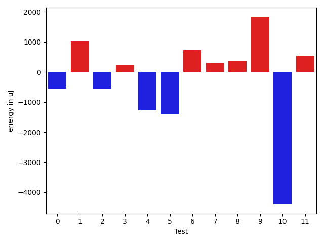

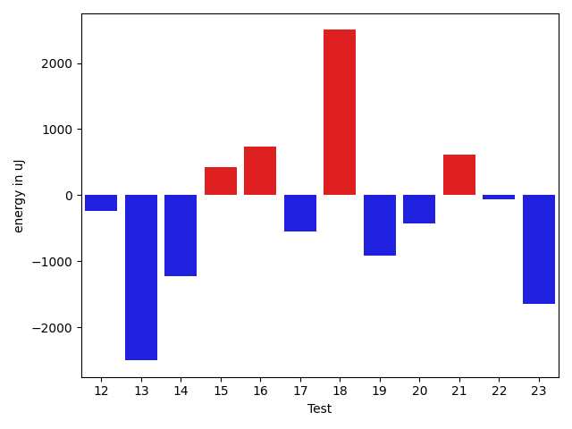

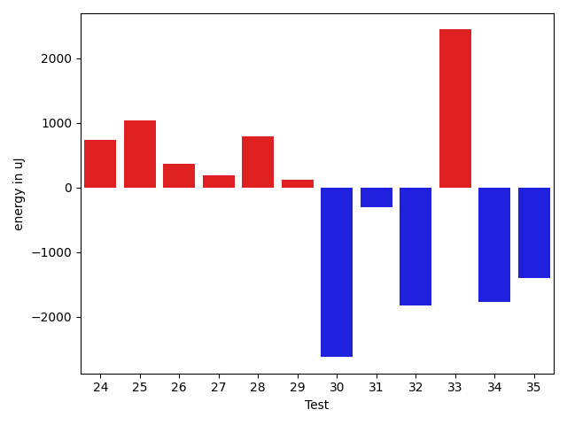

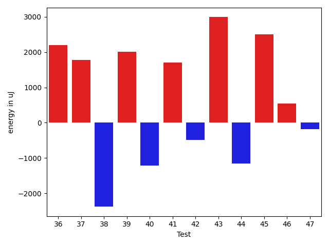

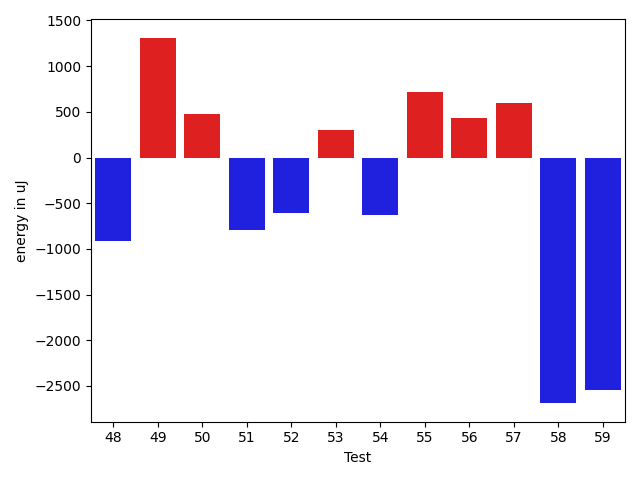

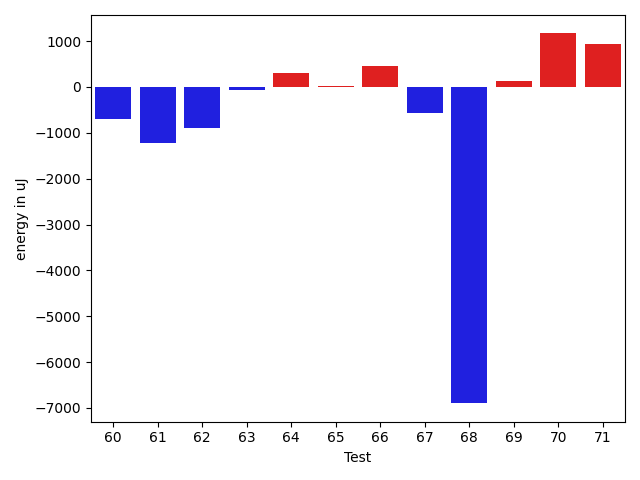

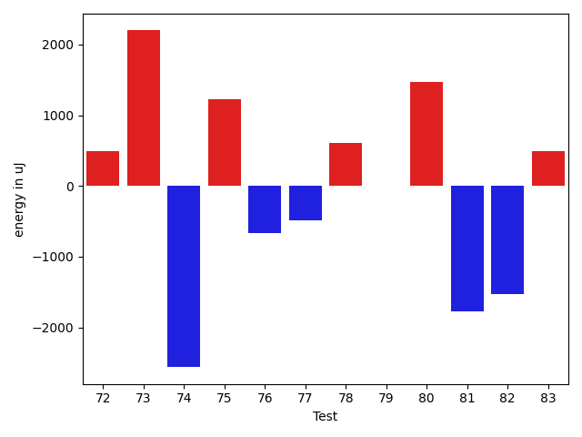

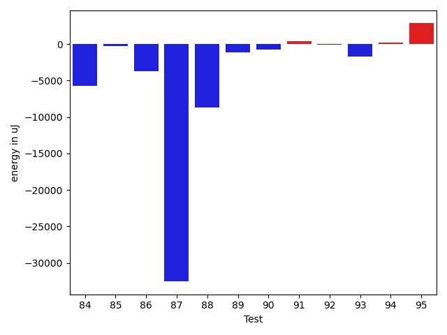

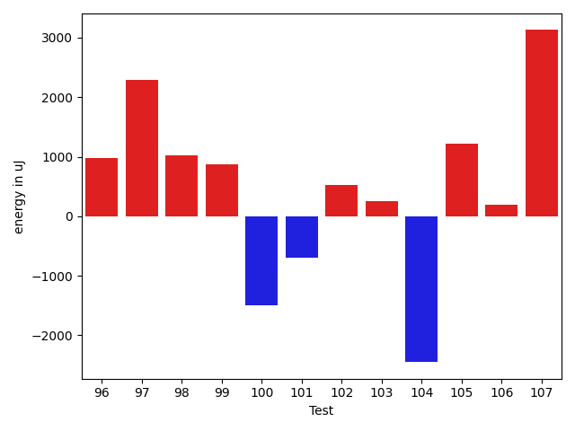

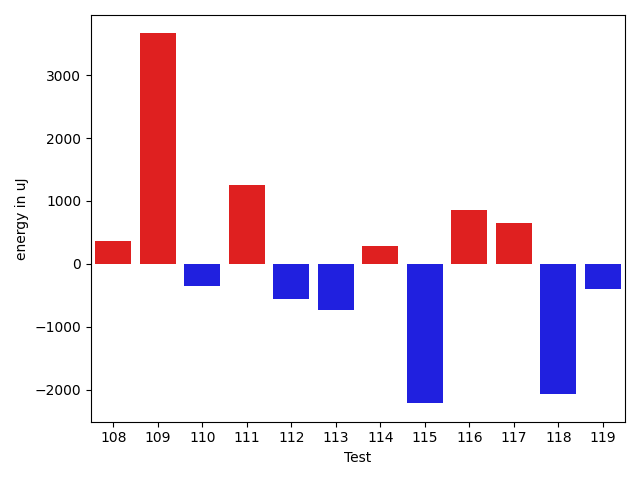

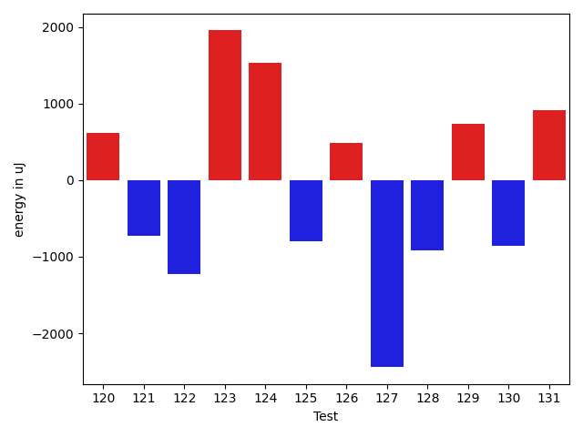

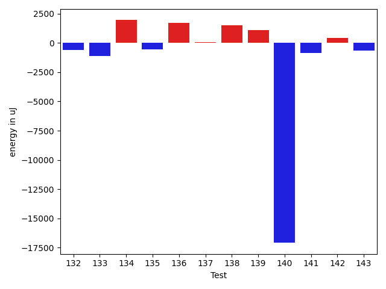

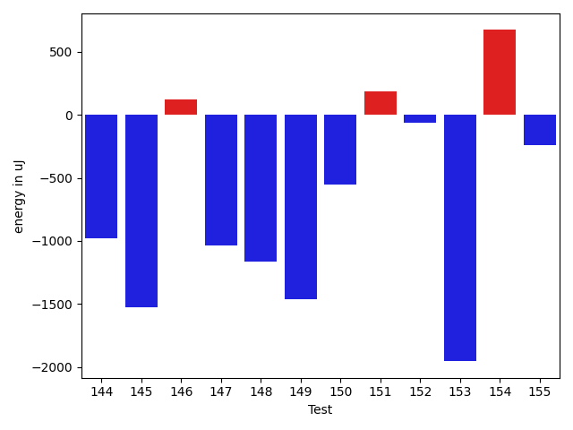

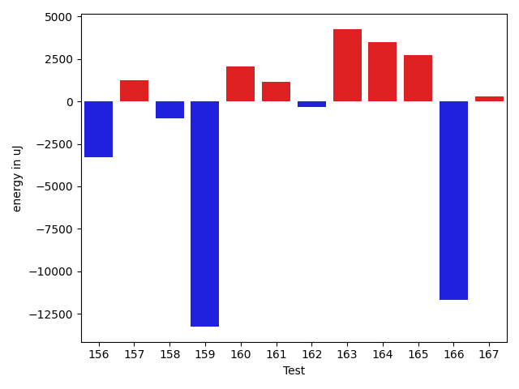

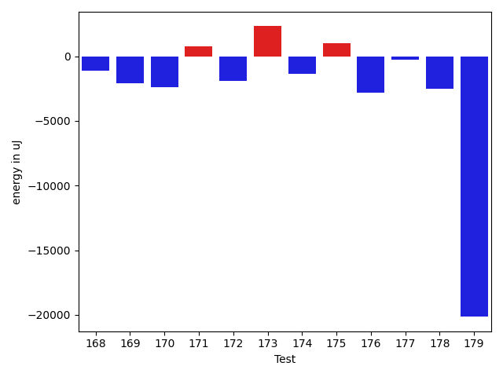

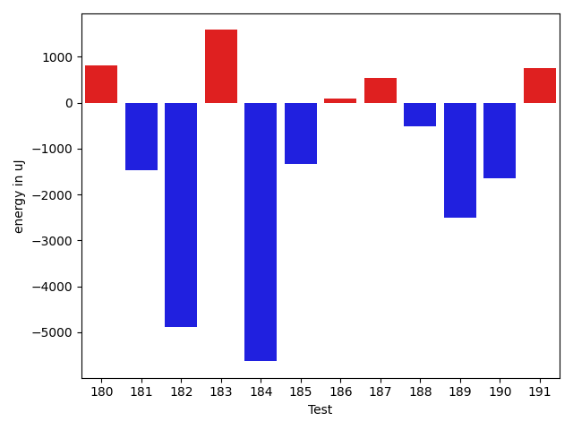

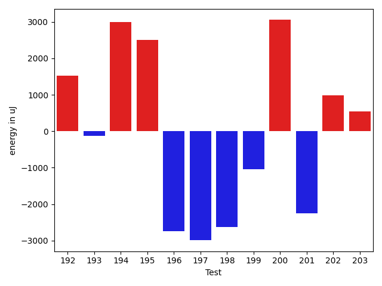

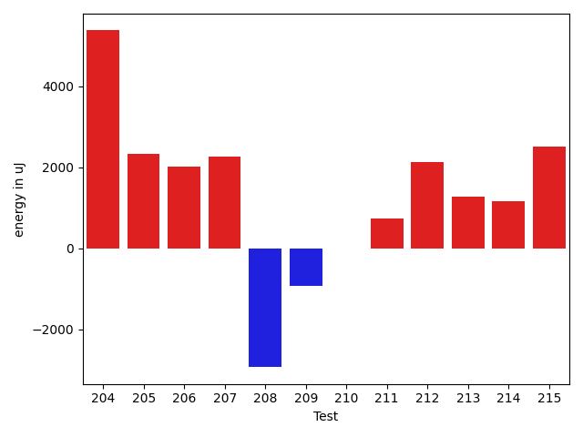

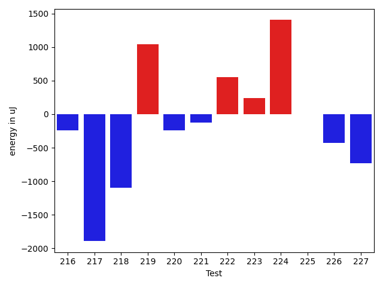

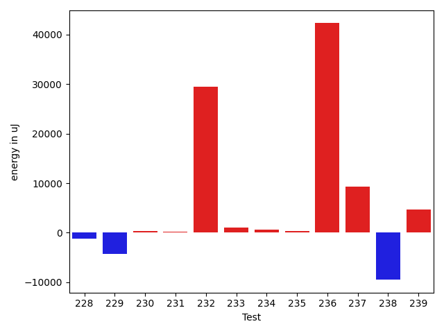

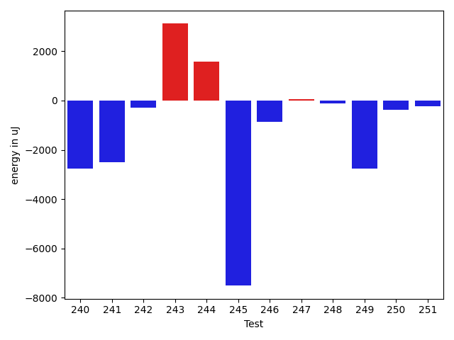

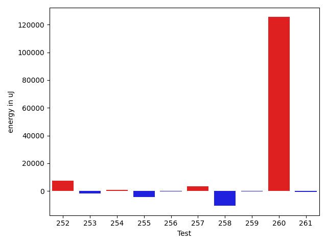

| ID | EnergyV1 | EnergyV2 | DeltaEnergy | σV1 | σV2 |
| --- | --- | --- | --- | --- | --- |
| 0 | 36804 | 36255 | -549 | 9525.566786277215 | 7641.769522309525 |
| 1 | 35461 | 36499 | 1038 | 4184.085314011959 | 3477.2312313119296 |
| 2 | 38452 | 37903 | -549 | 4947.030467017562 | 3354.7944073476297 |
| 3 | 37231 | 37475 | 244 | 3520.595180284216 | 3915.3685357617787 |
| 4 | 37109 | 35827 | -1282 | 4325.536213537697 | 4475.313733628069 |
| 5 | 36255 | 34851 | -1404 | 2787.0537149045604 | 3471.505159957907 |
| 6 | 35949 | 36682 | 733 | 31830.818031938787 | 4346.5346335888835 |
| 7 | 37292 | 37597 | 305 | 4273.057165535064 | 4738.436112263201 |
| 8 | 36072 | 36438 | 366 | 2481.6901892773712 | 2381.99030341342 |
| 9 | 38269 | 40100 | 1831 | 14108.73235378086 | 13684.421793532323 |
| 10 | 37964 | 33569 | -4395 | 4014.565896000878 | 2925.9510087415265 |
| 11 | 36560 | 37109 | 549 | 4230.688588577278 | 3576.2611292983847 |
| 12 | 38574 | 38330 | -244 | 4058.7919166563197 | 4644.065848265351 |
| 13 | 36621 | 34119 | -2502 | 3532.0805696963434 | 3069.1520620792467 |
| 14 | 36316 | 35095 | -1221 | 4509.891340633496 | 2257.1264049726346 |
| 15 | 35706 | 36132 | 426 | 3551.1828881805172 | 4084.6497262427133 |
| 16 | 39917 | 40649 | 732 | 101246.94962062551 | 54739.12830747673 |
| 17 | 36133 | 35584 | -549 | 4883.148064287164 | 4315.048965511278 |
| 18 | 35583 | 38085 | 2502 | 3423.176463548398 | 4060.1950225443297 |
| 19 | 34485 | 33569 | -916 | 4451.564576244019 | 3987.8447556310225 |
| 20 | 36316 | 35889 | -427 | 4545.195454262834 | 4165.245797735778 |
| 21 | 34912 | 35522 | 610 | 4175.6729730401275 | 3436.339574471287 |
| 22 | 36255 | 36194 | -61 | 42150.03602508016 | 4282.625169110687 |
| 23 | 36682 | 35034 | -1648 | 3358.584373995267 | 3903.9854420016663 |
| 24 | 37231 | 37964 | 733 | 4440.263177443533 | 4389.283780076291 |
| 25 | 36255 | 37293 | 1038 | 3084.9501192232005 | 3861.0921534306776 |
| 26 | 36010 | 36377 | 367 | 3930.246246559336 | 3973.926205866111 |
| 27 | 37903 | 38086 | 183 | 4547.921679933076 | 4208.014050297361 |
| 28 | 34118 | 34912 | 794 | 3887.0846430483375 | 5513.771376820746 |
| 29 | 37109 | 37232 | 123 | 4037.1630799826503 | 2611.4785717249365 |
| 30 | 37659 | 35034 | -2625 | 3705.4752257826376 | 3967.2999992375944 |
| 31 | 37720 | 37415 | -305 | 3826.4728615266567 | 3871.9151995491843 |
| 32 | 38330 | 36499 | -1831 | 3504.3811728812116 | 3812.1499502322254 |
| 33 | 35522 | 37964 | 2442 | 4068.7444615425698 | 4758.537048243523 |
| 34 | 35157 | 33386 | -1771 | 3698.511956362724 | 2905.1241497153806 |
| 35 | 37476 | 36071 | -1405 | 4490.07172225633 | 4959.5895054149605 |
| 36 | 34729 | 36926 | 2197 | 4821.070467101001 | 4646.503067421301 |
| 37 | 34729 | 36499 | 1770 | 3825.498090463307 | 2587.0233229465457 |
| 38 | 36804 | 34424 | -2380 | 3745.3706200168554 | 2974.7329198122775 |
| 39 | 35034 | 37048 | 2014 | 2769.4595140568495 | 3703.187127910361 |
| 40 | 36926 | 35706 | -1220 | 4485.182566222221 | 4072.476020345373 |
| 41 | 35461 | 37170 | 1709 | 3201.403872608946 | 2772.8016445465405 |
| 42 | 36865 | 36377 | -488 | 3860.9020008283037 | 2893.3235101274204 |
| 43 | 34851 | 37841 | 2990 | 4282.622427905593 | 4739.807982983652 |
| 44 | 36743 | 35584 | -1159 | 3729.9550207878633 | 3991.496124435731 |
| 45 | 32898 | 35400 | 2502 | 4125.3973444990725 | 3925.312234573052 |
| 46 | 36560 | 37109 | 549 | 4765.925767011764 | 3636.1433911832573 |
| 47 | 36804 | 36621 | -183 | 3794.3355356405677 | 4039.8027078518753 |
| 48 | 38147 | 37536 | -611 | 4290.937830456618 | 4392.310660688745 |
| 49 | 35767 | 36133 | 366 | 3070.016261990951 | 4590.35022411748 |
| 50 | 36254 | 36560 | 306 | 4069.5891251451912 | 4036.157645574632 |
| 51 | 37110 | 36865 | -245 | 3539.089485658705 | 4185.951784528818 |
| 52 | 35583 | 35217 | -366 | 3839.2854771697575 | 3171.5997775192777 |
| 53 | 36865 | 36865 | 0 | 4915.520818141273 | 3517.7010425844887 |
| 54 | 36499 | 34973 | -1526 | 4000.153390653955 | 4288.9056659752205 |
| 55 | 35278 | 36437 | 1159 | 3061.4555071577047 | 4164.644491430211 |
| 56 | 36621 | 35522 | -1099 | 3682.089231207734 | 3169.7395594906534 |
| 57 | 35156 | 37476 | 2320 | 3279.550200072092 | 4153.3325667468525 |
| 58 | 38330 | 35034 | -3296 | 3896.7595590727033 | 3481.674050734152 |
| 59 | 36133 | 34546 | -1587 | 3045.5661279965666 | 3709.765002321438 |
| 60 | 39246 | 37903 | -1343 | 3513.668882770754 | 4689.889435103433 |
| 61 | 36621 | 35400 | -1221 | 3195.5511911891203 | 3920.040203875466 |
| 62 | 35766 | 34485 | -1281 | 4561.760194967387 | 3823.7279979712384 |
| 63 | 36560 | 35889 | -671 | 3931.4644357255734 | 3760.3515636643524 |
| 64 | 36255 | 36865 | 610 | 4730.607154213929 | 4307.2326160858465 |
| 65 | 38513 | 38025 | -488 | 3589.833061539522 | 4223.899706300907 |
| 66 | 36682 | 35095 | -1587 | 3776.2580051609225 | 5077.30201933621 |
| 67 | 37842 | 36376 | -1466 | 4659.2288763396455 | 4713.708476878584 |
| 68 | 43640 | 42846 | -794 | 78371.26212877638 | 62905.64750065437 |
| 69 | 38574 | 39001 | 427 | 4198.460961572573 | 5106.755825233984 |
| 70 | 36865 | 38086 | 1221 | 4081.5359856920236 | 3719.989584525635 |
| 71 | 38696 | 39734 | 1038 | 7509.652112092015 | 8890.158327687874 |
| 72 | 38696 | 39185 | 489 | 12110.775814603316 | 9695.742076958968 |
| 73 | 36499 | 38697 | 2198 | 6293.8970776073975 | 6831.267215164932 |
| 74 | 38574 | 36011 | -2563 | 4515.589186245477 | 4538.391949142846 |
| 75 | 40467 | 41687 | 1220 | 36811.55914658423 | 32858.22897473537 |
| 76 | 41443 | 40772 | -671 | 44221.632241443775 | 33882.998326194116 |
| 77 | 39490 | 39001 | -489 | 3931.64804571466 | 3824.299214679526 |
| 78 | 38330 | 38940 | 610 | 11868.260922624679 | 4611.947342560509 |
| 79 | 37903 | 37903 | 0 | 4519.720046503482 | 4787.994486619006 |
| 80 | 38574 | 40039 | 1465 | 59993.52853185207 | 29344.257458864566 |
| 81 | 40161 | 38391 | -1770 | 7444.065711217571 | 6728.192276394758 |
| 82 | 40039 | 38514 | -1525 | 10018.542217794076 | 7867.079578383723 |
| 83 | 39856 | 40345 | 489 | 35455.509833747805 | 32369.745115037593 |
| 84 | 38146 | 35889 | -2257 | 24086.30037041622 | 6563.06853823256 |
| 85 | 38513 | 37964 | -549 | 14368.894636795598 | 13733.48248232194 |
| 86 | 44067 | 42053 | -2014 | 20689.600659255 | 20602.36987094828 |
| 87 | 39612 | 39795 | 183 | 122310.14906057253 | 75851.81703851515 |
| 88 | 38147 | 36743 | -1404 | 36134.48352505402 | 3832.552647306844 |
| 89 | 39245 | 36499 | -2746 | 4496.322699735091 | 4061.571312878797 |
| 90 | 37597 | 36804 | -793 | 4576.500231964889 | 3473.92025539706 |
| 91 | 36621 | 36743 | 122 | 3778.391867248959 | 3617.5694331329682 |
| 92 | 36072 | 35583 | -489 | 3525.3499237254086 | 3247.6400797148444 |
| 93 | 38391 | 35462 | -2929 | 4200.83879102783 | 3947.826838122672 |
| 94 | 39428 | 37048 | -2380 | 4102.787262458006 | 3709.9964863715018 |
| 95 | 38330 | 37170 | -1160 | 3047.2017889175427 | 19050.8111408219 |
| 96 | 35889 | 36438 | 549 | 3832.1482240349123 | 3374.5321923176352 |
| 97 | 37231 | 37720 | 489 | 12151.479486549431 | 25456.216513370946 |
| 98 | 36071 | 37048 | 977 | 2745.102553156029 | 3496.4322998593866 |
| 99 | 37110 | 38146 | 1036 | 3949.5011585847215 | 3520.6648320132663 |
| 100 | 38024 | 36926 | -1098 | 7208.223871419325 | 3601.552457487189 |
| 101 | 38086 | 35706 | -2380 | 3049.0075142941555 | 3720.417287570145 |
| 102 | 37109 | 37841 | 732 | 2046.3718628393053 | 4117.916840542575 |
| 103 | 37658 | 38269 | 611 | 3815.127995886901 | 3478.837450043697 |
| 104 | 38147 | 35583 | -2564 | 5111.111275165136 | 3662.7072822108894 |
| 105 | 39307 | 37902 | -1405 | 4585.394432740353 | 4145.534433221394 |
| 106 | 37293 | 37597 | 304 | 3940.4076662686675 | 4621.268003974208 |
| 107 | 37780 | 40466 | 2686 | 11298.278293505608 | 13053.353389257632 |
| 108 | 37475 | 37780 | 305 | 3763.207137427287 | 3553.32101936578 |
| 109 | 39185 | 39123 | -62 | 19371.391212497176 | 32774.9135944108 |
| 110 | 39245 | 38940 | -305 | 4723.326880611768 | 3601.327086844049 |
| 111 | 39428 | 41015 | 1587 | 17112.664069195936 | 16868.384035789823 |
| 112 | 38269 | 38574 | 305 | 7781.386745500801 | 6478.330470314297 |
| 113 | 38818 | 37476 | -1342 | 5141.671706991739 | 4205.750195342241 |
| 114 | 36743 | 37231 | 488 | 4386.58206902827 | 3894.952517390587 |
| 115 | 38635 | 36438 | -2197 | 4489.800184237045 | 4137.36748772048 |
| 116 | 36621 | 37780 | 1159 | 3743.0813015245185 | 4849.896290077176 |
| 117 | 37414 | 37780 | 366 | 3917.8996025802444 | 6265.601949049209 |
| 118 | 38940 | 38879 | -61 | 28907.811262768173 | 23465.872292869866 |
| 119 | 38269 | 37049 | -1220 | 3854.948395997341 | 4614.73963774625 |
| 120 | 113586 | 114196 | 610 | 20485.326859126573 | 23989.195234959807 |
| 121 | 38208 | 37476 | -732 | 3679.611289668456 | 4253.652263512955 |
| 122 | 39429 | 38208 | -1221 | 22604.117898614848 | 29964.089347466714 |
| 123 | 35401 | 37354 | 1953 | 3922.077506823276 | 3513.003027404262 |
| 124 | 38757 | 40283 | 1526 | 16738.54402457011 | 30450.46286162987 |
| 125 | 37964 | 37170 | -794 | 3681.9236680843883 | 3153.9455405237723 |
| 126 | 35034 | 35522 | 488 | 3627.71101102998 | 3587.1536032367344 |
| 127 | 39002 | 36560 | -2442 | 8100.675326293652 | 3516.176367068199 |
| 128 | 37476 | 36560 | -916 | 3733.862360904257 | 4646.101536167177 |
| 129 | 36010 | 36743 | 733 | 3991.3757778288377 | 7136.696352747177 |
| 130 | 37659 | 36804 | -855 | 4139.201805030342 | 4299.573872514241 |
| 131 | 38086 | 39002 | 916 | 3978.314147427438 | 3723.108073572402 |
| 132 | 37720 | 37109 | -611 | 4102.505731164982 | 4105.312892930971 |
| 133 | 36865 | 35767 | -1098 | 3894.7939526493246 | 2875.798996542024 |
| 134 | 36682 | 38635 | 1953 | 3877.6521327065607 | 4044.4357763504463 |
| 135 | 37171 | 36621 | -550 | 3262.1257311321224 | 3369.317538236696 |
| 136 | 37658 | 39368 | 1710 | 4698.184677650094 | 4428.525089809741 |
| 137 | 37109 | 37171 | 62 | 2865.762194060873 | 3399.802948696497 |
| 138 | 35889 | 37414 | 1525 | 3301.622950196336 | 4291.163793006822 |
| 139 | 31861 | 32958 | 1097 | 0.0 | 0.0 |
| 140 | 108887 | 91797 | -17090 | 8881.0 | 12238.0 |
| 141 | 36804 | 35950 | -854 | 2923.0973584811986 | 31282.854984127043 |
| 142 | 40405 | 40832 | 427 | 481064.6408421216 | 651875.2356537067 |
| 143 | 39063 | 38391 | -672 | 5176.290955338893 | 3979.162261388378 |
| 144 | 38513 | 37536 | -977 | 4759.333929121688 | 4797.788552844801 |
| 145 | 38696 | 37170 | -1526 | 5799.57495187785 | 7464.715183555231 |
| 146 | 37231 | 37354 | 123 | 4452.753702367852 | 4694.263233272348 |
| 147 | 40710 | 39672 | -1038 | 37063.540557193606 | 44403.252024508765 |
| 148 | 37415 | 36255 | -1160 | 4781.2136143184025 | 3599.2448071745252 |
| 149 | 38452 | 36988 | -1464 | 5767.531253902247 | 4446.037388341011 |
| 150 | 38330 | 37780 | -550 | 4915.464612768054 | 4025.3041619620626 |
| 151 | 37902 | 38086 | 184 | 4247.4777167533075 | 5038.900218715059 |
| 152 | 38147 | 38086 | -61 | 4036.4512663334317 | 4625.614959505384 |
| 153 | 38879 | 36926 | -1953 | 4271.135408604946 | 4657.80365680279 |
| 154 | 36682 | 37354 | 672 | 4139.152205825097 | 6396.313477120997 |
| 155 | 38024 | 37781 | -243 | 5543.623189228939 | 7061.8866450689075 |
| 156 | 37475 | 36682 | -793 | 20591.056962827104 | 3185.3661669082803 |
| 157 | 37719 | 36865 | -854 | 4392.50219634829 | 6883.5713283648765 |
| 158 | 37537 | 37781 | 244 | 7480.238685702149 | 6100.6852110148875 |
| 159 | 38696 | 39246 | 550 | 83404.06891292946 | 54072.791084004486 |
| 160 | 40649 | 41260 | 611 | 20287.51725362397 | 23716.190565558045 |
| 161 | 38025 | 38818 | 793 | 4151.16078015106 | 7761.10605539384 |
| 162 | 37231 | 37353 | 122 | 7723.377475160866 | 6922.295997356354 |
| 163 | 36438 | 37963 | 1525 | 3823.1748328410426 | 20202.992263642205 |
| 164 | 69397 | 72082 | 2685 | 21157.67570619784 | 30283.3105138872 |
| 165 | 38208 | 37659 | -549 | 11723.404415317356 | 19438.568653738213 |
| 166 | 38269 | 36498 | -1771 | 62525.34299474084 | 9062.842792662468 |
| 167 | 37536 | 38391 | 855 | 13040.31491011642 | 10953.927246353243 |
| 168 | 38391 | 37293 | -1098 | 16584.468943157124 | 3819.1153417838173 |
| 169 | 40955 | 38879 | -2076 | 29104.5310709788 | 14411.987193583482 |
| 170 | 38635 | 36254 | -2381 | 74158.67086891046 | 3395.6412565600326 |
| 171 | 38086 | 38879 | 793 | 4153.0502913186865 | 4477.255759681369 |
| 172 | 39002 | 37109 | -1893 | 5303.072564112896 | 5071.086129183767 |
| 173 | 37597 | 39917 | 2320 | 3623.8995958238474 | 4138.53912429656 |
| 174 | 41077 | 39734 | -1343 | 7853.514917945976 | 8193.293234665682 |
| 175 | 36560 | 37598 | 1038 | 4363.68931695523 | 4847.502865056606 |
| 176 | 80688 | 77881 | -2807 | 289320.5352190572 | 448766.5469036374 |
| 177 | 40283 | 40039 | -244 | 22276.687600460413 | 22346.10819169067 |
| 178 | 120300 | 117798 | -2502 | 31153.748241506248 | 28587.26984923029 |
| 179 | 207580 | 187439 | -20141 | 346297.97731437266 | 504527.0528659538 |
| 180 | 75134 | 75805 | 671 | 22402.81534558154 | 21992.20628111958 |
| 181 | 37048 | 36437 | -611 | 4256.777335907999 | 5375.85664295055 |
| 182 | 40405 | 39855 | -550 | 25444.576817553378 | 15452.00111132892 |
| 183 | 35339 | 37293 | 1954 | 3792.7204204238415 | 3855.4731590394276 |
| 184 | 38757 | 38880 | 123 | 56177.478656894986 | 43248.461510341 |
| 185 | 36804 | 35034 | -1770 | 3598.3192327206193 | 2813.563201577913 |
| 186 | 37109 | 36804 | -305 | 7141.029707262112 | 6083.836350344886 |
| 187 | 37048 | 37414 | 366 | 7607.895751122328 | 5036.43613235539 |
| 188 | 35705 | 36926 | 1221 | 4563.8382934771325 | 4731.225657024517 |
| 189 | 38330 | 35828 | -2502 | 5280.830073511751 | 3237.5688519328696 |
| 190 | 39428 | 37902 | -1526 | 4936.537733410779 | 4319.961057694849 |
| 191 | 37902 | 39123 | 1221 | 4667.990797591614 | 4316.2964860548145 |
| 192 | 36804 | 38330 | 1526 | 2827.1822544717556 | 4386.82784143588 |
| 193 | 36621 | 36499 | -122 | 4351.761813639742 | 3548.293355036818 |
| 194 | 36072 | 39062 | 2990 | 3902.819793465316 | 3981.767788198579 |
| 195 | 36499 | 39001 | 2502 | 4503.091819794484 | 4853.661322736442 |
| 196 | 38940 | 36194 | -2746 | 4590.728829663107 | 4423.412717688224 |
| 197 | 39490 | 36498 | -2992 | 4195.832552664609 | 4754.357270175343 |
| 198 | 37415 | 34790 | -2625 | 4793.838807840284 | 4430.725509801964 |
| 199 | 38513 | 37476 | -1037 | 3400.1552192205727 | 4116.964794900362 |
| 200 | 41503 | 44555 | 3052 | 39125.32447491965 | 36044.50460600318 |
| 201 | 37841 | 35584 | -2257 | 5011.558572120984 | 5636.105838054452 |
| 202 | 35827 | 36805 | 978 | 2848.5522638701927 | 40662.20814455525 |
| 203 | 37658 | 38208 | 550 | 4194.33806933153 | 4337.638164675038 |
| 204 | 40467 | 45838 | 5371 | 39512.876271383415 | 48596.58327614767 |
| 205 | 38879 | 41198 | 2319 | 4860.345902042364 | 4846.978040227641 |
| 206 | 35766 | 37781 | 2015 | 4516.005696286143 | 4737.506992782878 |
| 207 | 36926 | 39185 | 2259 | 4704.554200157781 | 4568.515330924139 |
| 208 | 40466 | 37537 | -2929 | 5219.303983297888 | 4058.218246411867 |
| 209 | 38269 | 37353 | -916 | 3525.7452387692347 | 4625.111588681535 |
| 210 | 40039 | 40039 | 0 | 4914.020012534926 | 21915.54841281356 |
| 211 | 38452 | 39184 | 732 | 3725.031917974738 | 4783.24993025838 |
| 212 | 36926 | 39063 | 2137 | 9084.67979317687 | 4171.129506263825 |
| 213 | 38208 | 39490 | 1282 | 32287.628309813237 | 48518.06892390902 |
| 214 | 39551 | 40710 | 1159 | 41327.51432978484 | 47842.872462036445 |
| 215 | 37475 | 39977 | 2502 | 8217.700052835871 | 6495.46863583552 |
| 216 | 39246 | 39001 | -245 | 3752.6549281275516 | 3780.6377483077185 |
| 217 | 40161 | 38269 | -1892 | 9997.58978254555 | 6068.888600242148 |
| 218 | 39429 | 38330 | -1099 | 4690.808493318359 | 3196.4268854132224 |
| 219 | 39612 | 40650 | 1038 | 21239.697781792296 | 33287.051196897155 |
| 220 | 39123 | 38879 | -244 | 3742.4142801639427 | 3486.3679006795724 |
| 221 | 40100 | 39978 | -122 | 44521.930901465894 | 38082.17525739037 |
| 222 | 39489 | 40039 | 550 | 88134.46229637698 | 99307.34018484059 |
| 223 | 66956 | 67200 | 244 | 22347.37295165184 | 22741.632615701717 |
| 224 | 38880 | 40283 | 1403 | 8733.088965358076 | 12093.375032501666 |
| 225 | 37109 | 37109 | 0 | 3988.49877098009 | 6034.559043109986 |
| 226 | 39429 | 39001 | -428 | 46270.008837176596 | 34033.90444674232 |
| 227 | 37536 | 36804 | -732 | 4039.2516561633274 | 4114.854927260097 |
| 228 | 36743 | 38330 | 1587 | 15754.794793501724 | 3856.3851467593954 |
| 229 | 36316 | 38635 | 2319 | 30892.923990811247 | 4517.390012755568 |
| 230 | 37903 | 38330 | 427 | 3998.1537760292294 | 4236.191589583116 |
| 231 | 36316 | 37963 | 1647 | 4304.481822658797 | 4342.5618222490975 |
| 232 | 41198 | 40832 | -366 | 267117.7467982427 | 328768.58068702894 |
| 233 | 37903 | 38513 | 610 | 9752.136393818859 | 10743.260313803105 |
| 234 | 39795 | 39551 | -244 | 5158.107302182497 | 9083.839031077832 |
| 235 | 38636 | 38757 | 121 | 3764.233690862117 | 4277.20445636998 |
| 236 | 39673 | 40527 | 854 | 16698.403487185034 | 130850.29340167467 |
| 237 | 383666 | 390258 | 6592 | 113620.44432712252 | 130462.80614596733 |
| 238 | 40284 | 40100 | -184 | 47183.84440289434 | 19233.207714381708 |
| 239 | 39550 | 38513 | -1037 | 7057.9380432159505 | 24550.256893479378 |
| 240 | 41443 | 38696 | -2747 | 79744.0100401748 | 107826.3032395138 |
| 241 | 40467 | 37963 | -2504 | 4077.661567908744 | 5170.962136922645 |
| 242 | 38574 | 38269 | -305 | 3821.6258237179545 | 9138.86486500342 |
| 243 | 78125 | 81238 | 3113 | 465248.5677775029 | 414435.8102192191 |
| 244 | 37781 | 39367 | 1586 | 4015.938161417146 | 4303.15845262144 |
| 245 | 170715 | 163208 | -7507 | 55677.85978493968 | 33317.17819264005 |
| 246 | 40710 | 39856 | -854 | 37101.48506113329 | 27707.942963947873 |
| 247 | 39063 | 39123 | 60 | 4582.592432553059 | 4061.1477386590377 |
| 248 | 38513 | 38391 | -122 | 4468.11746328903 | 3606.1866118223406 |
| 249 | 40589 | 37841 | -2748 | 3718.6045994555316 | 4256.944873935088 |
| 250 | 39612 | 39245 | -367 | 22205.389505353072 | 36408.446307993785 |
| 251 | 39001 | 38758 | -243 | 3530.1931119143333 | 5190.555824263226 |
| 252 | 39551 | 40038 | 487 | 18571.410377653738 | 37490.11312172358 |
| 253 | 39612 | 39978 | 366 | 109414.25382828328 | 94806.1161499199 |
| 254 | 37902 | 40344 | 2442 | 3661.415621319275 | 4989.181546105533 |
| 255 | 39307 | 40405 | 1098 | 20842.893895462308 | 3608.3046611254986 |
| 256 | 38391 | 39367 | 976 | 4062.624638425388 | 4826.874337478249 |
| 257 | 38635 | 38635 | 0 | 4403.107429026694 | 22323.927315884583 |
| 258 | 39917 | 40405 | 488 | 57611.31729117719 | 43671.10874852749 |
| 259 | 38513 | 37780 | -733 | 4006.212913712899 | 5993.513455179272 |
| 260 | 40894 | 41016 | 122 | 35582.55914793635 | 503740.1310871385 |
| 261 | 38818 | 38941 | 123 | 4513.806615060427 | 4691.880502001487 |

## Delta Duration per test method

| ID | DurationV1 | DurationsV2 | DeltaDuration |
| --- | --- | --- | --- |
| 0 | 938653.4915254237 | 862785.1666666666 | -75868.32485875709 |
| 1 | 384100.7916666667 | 357837.2105263158 | -26263.5811403509 |
| 2 | 432019.2 | 429481.9411764706 | -2537.2588235294097 |
| 3 | 464421.8695652174 | 481685.4583333333 | 17263.588768115907 |
| 4 | 644939.9736842106 | 520597.08 | -124342.89368421055 |
| 5 | 410214.5 | 385913.7826086957 | -24300.717391304323 |
| 6 | 565794.36 | 357905.6111111111 | -207888.74888888886 |
| 7 | 500021.6666666667 | 474076.35 | -25945.31666666671 |
| 8 | 432439.0 | 389384.8333333333 | -43054.166666666686 |
| 9 | 977154.8823529412 | 889454.6666666666 | -87700.21568627458 |
| 10 | 374772.05555555556 | 415091.25 | 40319.19444444444 |
| 11 | 545889.5263157894 | 560128.4166666666 | 14238.890350877191 |
| 12 | 497460.15789473685 | 528097.5217391305 | 30637.363844393636 |
| 13 | 342980.95454545453 | 392258.0909090909 | 49277.13636363635 |
| 14 | 383804.8333333333 | 379105.8333333333 | -4699.0 |
| 15 | 484310.4 | 511525.92307692306 | 27215.52307692304 |
| 16 | 2335100.962962963 | 939546.72 | -1395554.2429629632 |
| 17 | 455094.23076923075 | 456377.7037037037 | 1283.4729344729567 |
| 18 | 361739.07692307694 | 343890.75 | -17848.326923076937 |
| 19 | 379291.64705882355 | 376421.7368421053 | -2869.910216718272 |
| 20 | 476885.8947368421 | 435867.27777777775 | -41018.616959064326 |
| 21 | 362486.55555555556 | 357293.04347826086 | -5193.5120772946975 |
| 22 | 794254.8 | 477492.23529411765 | -316762.5647058824 |
| 23 | 629037.9696969697 | 556849.5384615385 | -72188.43123543123 |
| 24 | 562972.625 | 576225.5 | 13252.875 |
| 25 | 433282.5238095238 | 411430.51851851854 | -21852.005291005247 |
| 26 | 413471.875 | 398993.95454545453 | -14477.92045454547 |
| 27 | 466922.04347826086 | 406521.15 | -60400.89347826084 |
| 28 | 380470.6666666667 | 334029.9411764706 | -46440.725490196084 |
| 29 | 465318.90625 | 470403.2272727273 | 5084.321022727294 |
| 30 | 375549.0 | 408701.55555555556 | 33152.55555555556 |
| 31 | 351960.86666666664 | 355101.3125 | 3140.4458333333605 |
| 32 | 385751.64705882355 | 405648.5 | 19896.852941176447 |
| 33 | 623139.0333333333 | 385246.6296296296 | -237892.40370370372 |
| 34 | 383484.8888888889 | 392693.29411764705 | 9208.405228758173 |
| 35 | 362009.3076923077 | 380508.8 | 18499.4923076923 |
| 36 | 376519.5263157895 | 335031.0 | -41488.526315789495 |
| 37 | 355901.5882352941 | 355804.64285714284 | -96.94537815125659 |
| 38 | 458497.6956521739 | 478097.86363636365 | 19600.167984189757 |
| 39 | 465526.375 | 383633.44444444444 | -81892.93055555556 |
| 40 | 360837.5625 | 366157.7894736842 | 5320.226973684214 |
| 41 | 378808.8 | 354556.5333333333 | -24252.266666666663 |
| 42 | 429782.75 | 452416.9411764706 | 22634.191176470602 |
| 43 | 416943.9 | 429276.6666666667 | 12332.766666666663 |
| 44 | 476187.1538461539 | 430949.7037037037 | -45237.450142450165 |
| 45 | 387179.5 | 319374.8333333333 | -67804.66666666669 |
| 46 | 424593.9583333333 | 387361.64705882355 | -37232.31127450976 |
| 47 | 346699.1818181818 | 350387.04761904763 | 3687.8658008658094 |
| 48 | 455442.375 | 442367.2 | -13075.174999999988 |
| 49 | 380622.4 | 338166.8947368421 | -42455.505263157946 |
| 50 | 427579.95 | 485851.0416666667 | 58271.091666666674 |
| 51 | 447877.6 | 448262.64 | 385.04000000003725 |
| 52 | 343300.0909090909 | 343176.6818181818 | -123.40909090905916 |
| 53 | 417735.77777777775 | 387307.9375 | -30427.840277777752 |
| 54 | 417627.63636363635 | 353697.84210526315 | -63929.79425837321 |
| 55 | 477310.2173913043 | 403492.65 | -73817.5673913043 |
| 56 | 361028.61904761905 | 341388.0625 | -19640.556547619053 |
| 57 | 384337.76923076925 | 355428.0 | -28909.76923076925 |
| 58 | 333966.0 | 356160.5333333333 | 22194.533333333326 |
| 59 | 409314.7 | 399719.85714285716 | -9594.842857142852 |
| 60 | 454020.53846153844 | 427750.64705882355 | -26269.891402714886 |
| 61 | 694470.2571428572 | 510351.0 | -184119.25714285718 |
| 62 | 348166.6666666667 | 362104.6666666667 | 13938.0 |
| 63 | 463140.875 | 420700.23529411765 | -42440.63970588235 |
| 64 | 465679.85 | 399526.7826086957 | -66153.0673913043 |
| 65 | 350978.6666666667 | 316861.8 | -34116.8666666667 |
| 66 | 389124.7619047619 | 382703.5333333333 | -6421.228571428568 |
| 67 | 767946.1521739131 | 763553.7073170731 | -4392.444856839953 |
| 68 | 2231444.3636363638 | 1963419.9696969697 | -268024.39393939404 |
| 69 | 846580.3389830509 | 882645.948275862 | 36065.60929281113 |
| 70 | 887344.387755102 | 853234.4782608695 | -34109.9094942325 |
| 71 | 806155.1836734693 | 841013.2222222222 | 34858.0385487529 |
| 72 | 1117094.5802469135 | 1087720.2051282052 | -29374.375118708238 |
| 73 | 801349.2280701754 | 824205.0357142857 | 22855.80764411029 |
| 74 | 789512.2542372881 | 833501.8039215687 | 43989.54968428053 |
| 75 | 1497052.2777777778 | 1393312.0 | -103740.27777777775 |
| 76 | 1420263.625 | 1206502.9512195121 | -213760.67378048785 |
| 77 | 605862.2272727273 | 583588.0625 | -22274.164772727294 |
| 78 | 1002586.45 | 904443.5789473684 | -98142.87105263153 |
| 79 | 797401.9333333333 | 813286.7906976744 | 15884.857364341035 |
| 80 | 1147156.6875 | 993334.2068965518 | -153822.48060344823 |
| 81 | 960481.0714285715 | 949260.253968254 | -11220.817460317514 |
| 82 | 1042182.5666666667 | 1073506.0666666667 | 31323.5 |
| 83 | 982796.6111111111 | 989368.0625 | 6571.451388888876 |
| 84 | 1300958.3086419753 | 1168342.2409638555 | -132616.06767811975 |
| 85 | 1122142.5833333333 | 1078077.9295774647 | -44064.65375586855 |
| 86 | 1751824.7575757576 | 1710592.191919192 | -41232.565656565595 |
| 87 | 2439580.212121212 | 1231581.25 | -1207998.962121212 |
| 88 | 795390.64 | 579504.3461538461 | -215886.2938461539 |
| 89 | 570302.2857142857 | 557745.04 | -12557.245714285644 |
| 90 | 708207.7906976744 | 732765.2857142857 | 24557.495016611298 |
| 91 | 602988.6578947369 | 597499.4516129033 | -5489.2062818335835 |
| 92 | 677279.1818181818 | 685769.3823529412 | 8490.200534759439 |
| 93 | 560980.3478260869 | 530908.1363636364 | -30072.211462450563 |
| 94 | 450477.0 | 469177.6 | 18700.599999999977 |
| 95 | 534372.7894736842 | 695380.5833333334 | 161007.79385964922 |
| 96 | 509678.51851851854 | 514390.7272727273 | 4712.208754208754 |
| 97 | 820600.1025641026 | 778320.25 | -42279.85256410262 |
| 98 | 474074.9375 | 459347.65 | -14727.287499999977 |
| 99 | 519742.1052631579 | 504527.125 | -15214.980263157922 |
| 100 | 851669.9310344828 | 814640.3333333334 | -37029.59770114941 |
| 101 | 438673.26666666666 | 797622.2380952381 | 358948.97142857144 |
| 102 | 631586.2142857143 | 572979.4444444445 | -58606.76984126982 |
| 103 | 541712.96875 | 605179.8214285715 | 63466.85267857148 |
| 104 | 502514.3333333333 | 577144.1739130435 | 74629.84057971014 |
| 105 | 412034.23529411765 | 434487.5294117647 | 22453.29411764705 |
| 106 | 713762.0833333334 | 749811.9782608695 | 36049.89492753614 |
| 107 | 1107057.5625 | 1156728.775 | 49671.21249999991 |
| 108 | 697625.8367346938 | 714974.6444444444 | 17348.807709750603 |
| 109 | 1164088.1694915255 | 1286955.46875 | 122867.2992584745 |
| 110 | 772693.2678571428 | 800397.0487804879 | 27703.78092334501 |
| 111 | 1363195.935483871 | 1419412.6555555556 | 56216.72007168457 |
| 112 | 948905.4666666667 | 951194.2816901408 | 2288.8150234741624 |
| 113 | 744737.3090909091 | 761389.8846153846 | 16652.575524475542 |
| 114 | 771163.344262295 | 849349.509090909 | 78186.16482861398 |
| 115 | 759385.4 | 772243.9795918367 | 12858.579591836664 |
| 116 | 894341.5538461539 | 908839.3432835821 | 14497.789437428233 |
| 117 | 724312.65625 | 780967.3529411765 | 56654.696691176505 |
| 118 | 783921.5714285715 | 776750.6944444445 | -7170.876984126982 |
| 119 | 709865.1481481482 | 742093.0769230769 | 32227.928774928674 |
| 120 | 3167930.393939394 | 3229817.757575758 | 61887.36363636376 |
| 121 | 768719.0208333334 | 822980.9333333333 | 54261.91249999998 |
| 122 | 1303480.3804347827 | 1469949.0 | 166468.6195652173 |
| 123 | 564304.6842105263 | 789067.8387096775 | 224763.15449915116 |
| 124 | 835299.2340425532 | 1499595.2 | 664295.9659574467 |
| 125 | 475725.64 | 540941.7391304348 | 65216.0991304348 |
| 126 | 591530.0689655172 | 591456.7142857143 | -73.35467980289832 |
| 127 | 687901.3953488372 | 754084.804347826 | 66183.4089989888 |
| 128 | 410764.6153846154 | 487953.625 | 77189.00961538462 |
| 129 | 903970.6721311476 | 960265.2647058824 | 56294.59257473482 |
| 130 | 779522.2142857143 | 805368.9230769231 | 25846.708791208803 |
| 131 | 437222.26923076925 | 480802.35 | 43580.08076923073 |
| 132 | 723255.487804878 | 763721.1186440678 | 40465.63083918975 |
| 133 | 369914.1875 | 374838.8823529412 | 4924.694852941204 |
| 134 | 430126.4117647059 | 429548.3125 | -578.0992647059029 |
| 135 | 364127.5 | 364889.85714285716 | 762.3571428571595 |
| 136 | 373193.64285714284 | 508728.4090909091 | 135534.76623376628 |
| 137 | 389287.4210526316 | 399704.70588235295 | 10417.284829721379 |
| 138 | 387767.3157894737 | 456797.5238095238 | 69030.20802005008 |
| 139 | 905684.0 | 869097.0 | -36587.0 |
| 140 | 2937434.0 | 2640856.0 | -296578.0 |
| 141 | 542131.8076923077 | 746107.358974359 | 203975.55128205125 |
| 142 | 4707079.635135135 | 6569810.432432433 | 1862730.797297298 |
| 143 | 727187.0638297872 | 769604.7173913043 | 42417.65356151713 |
| 144 | 719503.3111111111 | 730863.4054054054 | 11360.094294294366 |
| 145 | 883352.4285714285 | 1012323.88 | 128971.45142857148 |
| 146 | 930319.3518518518 | 906196.6607142857 | -24122.691137566115 |
| 147 | 1339964.3469387756 | 1557190.5357142857 | 217226.18877551006 |
| 148 | 717482.5348837209 | 764103.9285714285 | 46621.393687707605 |
| 149 | 738525.3333333334 | 762133.7924528302 | 23608.459119496867 |
| 150 | 706464.5208333334 | 758895.2941176471 | 52430.773284313735 |
| 151 | 834540.3484848485 | 885673.3666666667 | 51133.01818181819 |
| 152 | 734726.9736842106 | 785733.02 | 51006.046315789456 |
| 153 | 731944.7826086957 | 746767.3076923077 | 14822.525083612069 |
| 154 | 887409.1449275363 | 920011.8169014085 | 32602.67197387223 |
| 155 | 932514.4776119404 | 1083506.0684931506 | 150991.5908812103 |
| 156 | 894733.676923077 | 813451.9444444445 | -81281.73247863248 |
| 157 | 831694.3888888889 | 852538.245614035 | 20843.85672514618 |
| 158 | 1098157.3896103897 | 1024130.0370370371 | -74027.35257335263 |
| 159 | 1968480.9473684211 | 1487839.9411764706 | -480641.0061919505 |
| 160 | 1710562.101010101 | 1694310.2164948455 | -16251.884515255457 |
| 161 | 1041069.8823529412 | 1097743.1764705882 | 56673.29411764699 |
| 162 | 1110667.8533333333 | 1113566.9213483145 | 2899.068014981225 |
| 163 | 921590.3650793651 | 1033728.5806451613 | 112138.21556579624 |
| 164 | 2077147.6956521738 | 1939247.4042553192 | -137900.29139685468 |
| 165 | 1157315.0632911392 | 1232997.65 | 75682.5867088607 |
| 166 | 1338563.448275862 | 953922.5471698113 | -384640.9011060507 |
| 167 | 947091.0909090909 | 827370.52 | -119720.57090909092 |
| 168 | 926891.0925925926 | 819059.6862745098 | -107831.40631808282 |
| 169 | 936793.7727272727 | 675221.1724137932 | -261572.60031347955 |
| 170 | 1275475.8181818181 | 636935.3529411765 | -638540.4652406416 |
| 171 | 678599.1875 | 803260.0 | 124660.8125 |
| 172 | 777752.7777777778 | 822433.74 | 44680.96222222224 |
| 173 | 664712.4285714285 | 632153.5833333334 | -32558.84523809515 |
| 174 | 795127.0 | 825978.3783783783 | 30851.378378378344 |
| 175 | 908650.4035087719 | 891019.6567164179 | -17630.74679235404 |
| 176 | 3221971.272727273 | 5270657.838383839 | 2048686.5656565656 |
| 177 | 1428770.5773195876 | 1477875.0760869565 | 49104.49876736896 |
| 178 | 3457557.2525252528 | 3352759.5454545454 | -104797.70707070734 |
| 179 | 7947963.585858586 | 9164560.989898989 | 1216597.4040404027 |
| 180 | 2277931.6666666665 | 2256554.414141414 | -21377.25252525229 |
| 181 | 770992.075 | 751065.3 | -19926.774999999907 |
| 182 | 1042792.925 | 806835.3333333334 | -235957.59166666667 |
| 183 | 538890.4285714285 | 548491.0909090909 | 9600.66233766242 |
| 184 | 1501284.717948718 | 1300623.9677419355 | -200660.75020678248 |
| 185 | 373726.47826086957 | 374720.5882352941 | 994.1099744245294 |
| 186 | 1017633.72 | 991694.0666666667 | -25939.65333333332 |
| 187 | 884306.2407407408 | 877795.3333333334 | -6510.907407407416 |
| 188 | 492741.6818181818 | 446286.4285714286 | -46455.253246753244 |
| 189 | 435422.5 | 402405.46153846156 | -33017.03846153844 |
| 190 | 494466.1818181818 | 465847.55 | -28618.631818181835 |
| 191 | 480231.96 | 489698.3103448276 | 9466.350344827573 |
| 192 | 433736.6875 | 408928.0869565217 | -24808.60054347827 |
| 193 | 584151.75 | 600591.15625 | 16439.40625 |
| 194 | 514692.7826086957 | 490756.94444444444 | -23935.83816425124 |
| 195 | 509294.0 | 461536.38095238095 | -47757.61904761905 |
| 196 | 371240.2 | 429495.07692307694 | 58254.876923076925 |
| 197 | 411949.9 | 403600.77777777775 | -8349.122222222271 |
| 198 | 383215.13333333336 | 423007.6666666667 | 39792.533333333326 |
| 199 | 502010.6153846154 | 417422.28571428574 | -84588.32967032964 |
| 200 | 1516627.8333333333 | 1675232.945945946 | 158605.11261261278 |
| 201 | 430953.4705882353 | 374441.53846153844 | -56511.93212669686 |
| 202 | 492129.125 | 760712.5789473684 | 268583.4539473684 |
| 203 | 478954.9375 | 363654.3157894737 | -115300.62171052629 |
| 204 | 1453106.2777777778 | 2252686.6 | 799580.3222222223 |
| 205 | 403023.9 | 474053.28571428574 | 71029.38571428572 |
| 206 | 469746.6666666667 | 361517.93333333335 | -108228.73333333334 |
| 207 | 470296.1111111111 | 465041.6666666667 | -5254.444444444438 |
| 208 | 617630.5588235294 | 614715.1142857143 | -2915.444537815056 |
| 209 | 611534.3448275862 | 485349.3157894737 | -126185.0290381125 |
| 210 | 536610.6875 | 709738.90625 | 173128.21875 |
| 211 | 591076.5833333334 | 599539.9696969697 | 8463.386363636353 |
| 212 | 919735.6610169491 | 802063.8888888889 | -117671.77212806023 |
| 213 | 925263.4 | 1225750.2702702703 | 300486.8702702703 |
| 214 | 1386756.875 | 1558652.9019607843 | 171896.02696078434 |
| 215 | 1147370.3150684931 | 1113881.5324675324 | -33488.782600960694 |
| 216 | 775811.5 | 781353.274509804 | 5541.774509803974 |
| 217 | 940779.25 | 977158.0 | 36378.75 |
| 218 | 613201.2592592592 | 609753.2121212122 | -3448.0471380470553 |
| 219 | 975233.5471698113 | 1156995.843137255 | 181762.2959674436 |
| 220 | 768412.325 | 738526.0833333334 | -29886.24166666658 |
| 221 | 1535211.303030303 | 1342758.5820895522 | -192452.7209407508 |
| 222 | 1927792.488372093 | 1748861.5777777778 | -178930.91059431527 |
| 223 | 1874908.101010101 | 1939876.4141414142 | 64968.313131313305 |
| 224 | 803836.1707317074 | 834527.4 | 30691.229268292664 |
| 225 | 924438.6785714285 | 900158.0144927537 | -24280.66407867486 |
| 226 | 1453056.08 | 1134247.732142857 | -318808.34785714303 |
| 227 | 787509.6545454545 | 806211.5272727272 | 18701.872727272683 |
| 228 | 998686.3559322034 | 937575.421875 | -61110.934057203354 |
| 229 | 800702.3714285714 | 619637.28125 | -181065.0901785714 |
| 230 | 898794.9152542372 | 884081.1515151515 | -14713.763739085756 |
| 231 | 849286.44 | 848357.5438596491 | -928.8961403508438 |
| 232 | 2219251.2535211267 | 3211172.4 | 991921.1464788732 |
| 233 | 1041313.1594202898 | 1117659.6707317072 | 76346.51131141745 |
| 234 | 534175.0 | 762091.0 | 227916.0 |
| 235 | 728106.4358974359 | 806154.8518518518 | 78048.41595441592 |
| 236 | 889709.875 | 2397066.3260869565 | 1507356.4510869565 |
| 237 | 10811199.555555556 | 11133063.93939394 | 321864.3838383835 |
| 238 | 1862589.0689655172 | 1379275.3095238095 | -483313.75944170775 |
| 239 | 617310.8125 | 878438.5641025641 | 261127.75160256412 |
| 240 | 1148729.5 | 1726145.0 | 577415.5 |
| 241 | 562910.0 | 543985.0 | -18925.0 |
| 242 | 448602.5238095238 | 541060.0 | 92457.47619047621 |
| 243 | 5486000.686868687 | 4828038.686868687 | -657962.0 |
| 244 | 880978.5178571428 | 825552.2857142857 | -55426.23214285716 |
| 245 | 4994086.2727272725 | 4680457.909090909 | -313628.3636363633 |
| 246 | 1259511.6904761905 | 975135.3181818182 | -284376.3722943723 |
| 247 | 683663.2727272727 | 687224.5952380953 | 3561.3225108225597 |
| 248 | 574539.9696969697 | 585043.925925926 | 10503.956228956231 |
| 249 | 523916.25 | 546345.6666666666 | 22429.416666666628 |
| 250 | 941799.0 | 1132284.6666666667 | 190485.66666666674 |
| 251 | 593745.7037037037 | 655806.7692307692 | 62061.06552706554 |
| 252 | 947300.0 | 1219476.1666666667 | 272176.16666666674 |
| 253 | 2032221.16 | 2294958.037037037 | 262736.87703703693 |
| 254 | 472233.21428571426 | 409365.6875 | -62867.52678571426 |
| 255 | 702369.125 | 435896.5 | -266472.625 |
| 256 | 637676.304347826 | 579265.2631578947 | -58411.04118993133 |
| 257 | 656229.7407407408 | 901202.8 | 244973.05925925926 |
| 258 | 1683575.2222222222 | 1169151.9714285715 | -514423.25079365075 |
| 259 | 887304.45 | 981430.6031746032 | 94126.15317460324 |
| 260 | 1372225.5 | 5300877.71875 | 3928652.21875 |
| 261 | 797223.0714285715 | 856934.2962962963 | 59711.22486772481 |

## Misc.

| ID | Test Class | Test Method |
| --- | --- | --- |
| 0 | com.google.gson.functional.PrimitiveTest | testDeserializePrimitiveWrapperAsObjectField |
| 1 | com.google.gson.functional.PrimitiveTest | testDeserializeJsonArrayAsNumber |
| 2 | com.google.gson.functional.PrimitiveTest | testDoubleNoFractAsStringRepresentationDeserialization |
| 3 | com.google.gson.functional.PrimitiveTest | testDoubleAsStringRepresentationDeserialization |
| 4 | com.google.gson.functional.PrimitiveTest | testDeserializingBigIntegerAsBigDecimal |
| 5 | com.google.gson.functional.PrimitiveTest | testDeserializeJsonArrayAsLongWrapper |
| 6 | com.google.gson.functional.PrimitiveTest | testDeserializeJsonArrayAsInt |
| 7 | com.google.gson.functional.PrimitiveTest | testPrimitiveLongAutoboxedInASingleElementArrayDeserialization |
| 8 | com.google.gson.functional.PrimitiveTest | testBigDecimalAsStringRepresentationDeserialization |
| 9 | com.google.gson.functional.PrimitiveTest | testNumberDeserialization |
| 10 | com.google.gson.functional.PrimitiveTest | testDeserializeJsonObjectAsLongPrimitive |
| 11 | com.google.gson.functional.PrimitiveTest | testPrimitiveBooleanAutoboxedInASingleElementArrayDeserialization |
| 12 | com.google.gson.functional.PrimitiveTest | testPrimitiveIntegerAutoboxedDeserialization |
| 13 | com.google.gson.functional.PrimitiveTest | testDeserializeJsonObjectAsBooleanPrimitive |
| 14 | com.google.gson.functional.PrimitiveTest | testDeserializeJsonArrayAsByteWrapper |
| 15 | com.google.gson.functional.PrimitiveTest | testUnquotedStringDeserializationFails |
| 16 | com.google.gson.functional.PrimitiveTest | testPrimitiveIntegerAutoboxedInASingleElementArrayDeserialization |
| 17 | com.google.gson.functional.PrimitiveTest | testPrimitiveLongAutoboxedDeserialization |
| 18 | com.google.gson.functional.PrimitiveTest | testDeserializeJsonArrayAsBooleanWrapper |
| 19 | com.google.gson.functional.PrimitiveTest | testDeserializeJsonObjectAsBytePrimitive |
| 20 | com.google.gson.functional.PrimitiveTest | testBigDecimalNaNDeserializationNotSupported |
| 21 | com.google.gson.functional.PrimitiveTest | testDeserializeJsonArrayAsFloatWrapper |
| 22 | com.google.gson.functional.PrimitiveTest | testBigDecimalInASingleElementArrayDeserialization |
| 23 | com.google.gson.functional.PrimitiveTest | testOverridingDefaultPrimitiveSerialization |
| 24 | com.google.gson.functional.PrimitiveTest | testPrimitiveBooleanAutoboxedDeserialization |
| 25 | com.google.gson.functional.PrimitiveTest | testFloatNaNDeserialization |
| 26 | com.google.gson.functional.PrimitiveTest | testNegativeInfinityDeserialization |
| 27 | com.google.gson.functional.PrimitiveTest | testReallyLongValuesDeserialization |
| 28 | com.google.gson.functional.PrimitiveTest | testDeserializeJsonArrayAsDoublePrimitive |
| 29 | com.google.gson.functional.PrimitiveTest | testPrimitiveDoubleAutoboxedDeserialization |
| 30 | com.google.gson.functional.PrimitiveTest | testBigDecimalNoFractAsStringRepresentationDeserialization |
| 31 | com.google.gson.functional.PrimitiveTest | testDeserializeJsonObjectAsDoubleWrapper |
| 32 | com.google.gson.functional.PrimitiveTest | testSmallValueForBigDecimalDeserialization |
| 33 | com.google.gson.functional.PrimitiveTest | testDeserializingDecimalPointValuesAsIntegerFails |
| 34 | com.google.gson.functional.PrimitiveTest | testQuotedStringSerializationAndDeserialization |
| 35 | com.google.gson.functional.PrimitiveTest | testFloatInfinityDeserialization |
| 36 | com.google.gson.functional.PrimitiveTest | testDeserializingBigDecimalAsLongFails |
| 37 | com.google.gson.functional.PrimitiveTest | testDeserializeJsonObjectAsInteger |
| 38 | com.google.gson.functional.PrimitiveTest | testBigIntegerDeserialization |
| 39 | com.google.gson.functional.PrimitiveTest | testPrimitiveClassLiteral |
| 40 | com.google.gson.functional.PrimitiveTest | testDeserializeJsonArrayAsBigInteger |
| 41 | com.google.gson.functional.PrimitiveTest | testSmallValueForBigIntegerDeserialization |
| 42 | com.google.gson.functional.PrimitiveTest | testDoubleInfinityDeserialization |
| 43 | com.google.gson.functional.PrimitiveTest | testBigDecimalDeserialization |
| 44 | com.google.gson.functional.PrimitiveTest | testBadValueForBigIntegerDeserialization |
| 45 | com.google.gson.functional.PrimitiveTest | testDeserializeJsonArrayAsBigDecimal |
| 46 | com.google.gson.functional.PrimitiveTest | testDeserializingBigDecimalAsIntegerFails |
| 47 | com.google.gson.functional.PrimitiveTest | testDeserializingBigDecimalAsFloat |
| 48 | com.google.gson.functional.PrimitiveTest | testLargeDoubleDeserialization |
| 49 | com.google.gson.functional.PrimitiveTest | testBigDecimalNegativeInfinityDeserializationNotSupported |
| 50 | com.google.gson.functional.PrimitiveTest | testPrimitiveDoubleAutoboxedInASingleElementArrayDeserialization |
| 51 | com.google.gson.functional.PrimitiveTest | testDoubleNaNDeserialization |
| 52 | com.google.gson.functional.PrimitiveTest | testDeserializeJsonObjectAsFloatPrimitive |
| 53 | com.google.gson.functional.PrimitiveTest | testBigDecimalPreservePrecisionDeserialization |
| 54 | com.google.gson.functional.PrimitiveTest | testDeserializingBigDecimalAsBigIntegerFails |
| 55 | com.google.gson.functional.PrimitiveTest | testLongAsStringDeserialization |
| 56 | com.google.gson.functional.PrimitiveTest | testDeserializeJsonObjectAsBigInteger |
| 57 | com.google.gson.functional.PrimitiveTest | testDeserializingBigDecimalAsDouble |
| 58 | com.google.gson.functional.PrimitiveTest | testDeserializeJsonArrayAsShortWrapper |
| 59 | com.google.gson.functional.PrimitiveTest | testBigDecimalInfinityDeserializationNotSupported |
| 60 | com.google.gson.functional.PrimitiveTest | testNegativeInfinityFloatDeserialization |
| 61 | com.google.gson.functional.PrimitiveTest | testDeserializingBigIntegerAsInteger |
| 62 | com.google.gson.functional.PrimitiveTest | testDeserializeJsonObjectAsNumber |
| 63 | com.google.gson.functional.PrimitiveTest | testBigIntegerInASingleElementArrayDeserialization |
| 64 | com.google.gson.functional.PrimitiveTest | testDeserializingBigIntegerAsLong |
| 65 | com.google.gson.functional.PrimitiveTest | testDeserializeJsonObjectAsBigDecimal |
| 66 | com.google.gson.functional.PrimitiveTest | testDeserializeJsonObjectAsShortPrimitive |
| 67 | com.google.gson.functional.CustomDeserializerTest | testDefaultConstructorNotCalledOnField |
| 68 | com.google.gson.functional.CustomDeserializerTest | testDefaultConstructorNotCalledOnObject |
| 69 | com.google.gson.functional.CustomDeserializerTest | testCustomDeserializerReturnsNullForArrayElementsForArrayField |
| 70 | com.google.gson.functional.CustomDeserializerTest | testCustomDeserializerReturnsNull |
| 71 | com.google.gson.functional.CustomDeserializerTest | testCustomDeserializerReturnsNullForTopLevelPrimitives |
| 72 | com.google.gson.functional.CustomDeserializerTest | testJsonTypeFieldBasedDeserialization |
| 73 | com.google.gson.functional.CustomDeserializerTest | testCustomDeserializerReturnsNullForArrayElements |
| 74 | com.google.gson.functional.CustomDeserializerTest | testCustomDeserializerReturnsNullForPrimitiveFields |
| 75 | com.google.gson.functional.CustomDeserializerTest | testCustomDeserializerReturnsNullForTopLevelObject |
| 76 | com.google.gson.functional.JsonParserTest | testBadTypeForDeserializingCustomTree |
| 77 | com.google.gson.functional.JsonParserTest | testBadFieldTypeForCustomDeserializerCustomTree |
| 78 | com.google.gson.functional.JsonParserTest | testChangingCustomTreeAndDeserializing |
| 79 | com.google.gson.functional.JsonParserTest | testBadFieldTypeForDeserializingCustomTree |
| 80 | com.google.gson.functional.JsonParserTest | testDeserializingCustomTree |
| 81 | com.google.gson.functional.ReadersWritersTest | testReadWriteTwoObjects |
| 82 | com.google.gson.functional.ReadersWritersTest | testReadWriteTwoStrings |
| 83 | com.google.gson.functional.ReadersWritersTest | testReaderForDeserialization |
| 84 | com.google.gson.functional.ObjectTest | testEmptyCollectionInAnObjectDeserialization |
| 85 | com.google.gson.functional.ObjectTest | testArrayOfArraysDeserialization |
| 86 | com.google.gson.functional.ObjectTest | testSingletonLists |
| 87 | com.google.gson.functional.ObjectTest | testJsonInSingleQuotesDeserialization |
| 88 | com.google.gson.functional.ObjectTest | testBagOfPrimitiveWrappersDeserialization |
| 89 | com.google.gson.functional.ObjectTest | testBagOfPrimitivesDeserialization |
| 90 | com.google.gson.functional.ObjectTest | testInnerClassDeserialization |
| 91 | com.google.gson.functional.ObjectTest | testStringFieldWithNumberValueDeserialization |
| 92 | com.google.gson.functional.ObjectTest | testPrimitiveArrayInAnObjectDeserialization |
| 93 | com.google.gson.functional.ObjectTest | testJsonInMixedQuotesDeserialization |
| 94 | com.google.gson.functional.ObjectTest | testStringFieldWithEmptyValueDeserialization |
| 95 | com.google.gson.functional.ObjectTest | testClassWithTransientFieldsDeserializationTransientFieldsPassedInJsonAreIgnored |
| 96 | com.google.gson.functional.ObjectTest | testPrivateNoArgConstructorDeserialization |
| 97 | com.google.gson.functional.ObjectTest | testNestedDeserialization |
| 98 | com.google.gson.functional.ObjectTest | testNullObjectFieldsDeserialization |
| 99 | com.google.gson.functional.ObjectTest | testNullArraysDeserialization |
| 100 | com.google.gson.functional.ObjectTest | testArrayOfObjectsDeserialization |
| 101 | com.google.gson.functional.ObjectTest | testObjectFieldNamesWithoutQuotesDeserialization |
| 102 | com.google.gson.functional.ObjectTest | testClassWithTransientFieldsDeserialization |
| 103 | com.google.gson.functional.ObjectTest | testNullFieldsDeserialization |
| 104 | com.google.gson.functional.ObjectTest | testNullPrimitiveFieldsDeserialization |
| 105 | com.google.gson.functional.ObjectTest | testClassWithNoFieldsDeserialization |
| 106 | com.google.gson.functional.CollectionTest | testRawCollectionOfBagOfPrimitivesNotAllowed |
| 107 | com.google.gson.functional.CollectionTest | testFieldIsArrayList |
| 108 | com.google.gson.functional.CollectionTest | testCollectionOfStringsDeserialization |
| 109 | com.google.gson.functional.CollectionTest | testTopLevelCollectionOfIntegersDeserialization |
| 110 | com.google.gson.functional.CollectionTest | testLinkedListDeserialization |
| 111 | com.google.gson.functional.CollectionTest | testWildcardCollectionField |
| 112 | com.google.gson.functional.CollectionTest | testTopLevelListOfIntegerCollectionsDeserialization |
| 113 | com.google.gson.functional.CollectionTest | testNullsInListDeserialization |
| 114 | com.google.gson.functional.CollectionTest | testWildcardPrimitiveCollectionDeserilaization |
| 115 | com.google.gson.functional.CollectionTest | testQueueDeserialization |
| 116 | com.google.gson.functional.CollectionTest | testSetDeserialization |
| 117 | com.google.gson.functional.CollectionTest | testRawCollectionDeserializationNotAlllowed |
| 118 | com.google.gson.functional.DefaultTypeAdaptersTest | testUrlDeserialization |
| 119 | com.google.gson.functional.DefaultTypeAdaptersTest | testTimestampSerialization |
| 120 | com.google.gson.functional.DefaultTypeAdaptersTest | testDefaultDateDeserializationUsingBuilder |
| 121 | com.google.gson.functional.DefaultTypeAdaptersTest | testDateDeserializationWithPattern |
| 122 | com.google.gson.functional.DefaultTypeAdaptersTest | testDateSerializationInCollection |
| 123 | com.google.gson.functional.DefaultTypeAdaptersTest | testBadValueForBigDecimalDeserialization |
| 124 | com.google.gson.functional.DefaultTypeAdaptersTest | testBigDecimalFieldDeserialization |
| 125 | com.google.gson.functional.DefaultTypeAdaptersTest | testDefaultGregorianCalendarDeserialization |
| 126 | com.google.gson.functional.DefaultTypeAdaptersTest | testBigIntegerFieldDeserialization |
| 127 | com.google.gson.functional.DefaultTypeAdaptersTest | testUrlNullDeserialization |
| 128 | com.google.gson.functional.DefaultTypeAdaptersTest | testUriDeserialization |
| 129 | com.google.gson.functional.DefaultTypeAdaptersTest | testTreeSetDeserialization |
| 130 | com.google.gson.functional.DefaultTypeAdaptersTest | testBitSetDeserialization |
| 131 | com.google.gson.functional.DefaultTypeAdaptersTest | testUuidDeserialization |
| 132 | com.google.gson.functional.DefaultTypeAdaptersTest | testSqlDateSerialization |
| 133 | com.google.gson.functional.DefaultTypeAdaptersTest | testStringBuilderDeserialization |
| 134 | com.google.gson.functional.DefaultTypeAdaptersTest | testPropertiesDeserialization |
| 135 | com.google.gson.functional.DefaultTypeAdaptersTest | testStringBufferDeserialization |
| 136 | com.google.gson.functional.DefaultTypeAdaptersTest | testLocaleDeserializationWithLanguage |
| 137 | com.google.gson.functional.DefaultTypeAdaptersTest | testLocaleDeserializationWithLanguageCountryVariant |
| 138 | com.google.gson.functional.DefaultTypeAdaptersTest | testLocaleDeserializationWithLanguageCountry |
| 139 | com.google.gson.functional.DefaultTypeAdaptersTest | testDefaultJavaSqlDateDeserialization |
| 140 | com.google.gson.functional.DefaultTypeAdaptersTest | testDefaultDateDeserialization |
| 141 | com.google.gson.functional.DefaultTypeAdaptersTest | testDefaultCalendarDeserialization |
| 142 | com.google.gson.JsonParserTest | testReadWriteTwoObjects |
| 143 | com.google.gson.functional.MapTest | testMapDeserializationWithIntegerKeys |
| 144 | com.google.gson.functional.MapTest | testMapDeserializationWithNullKey |
| 145 | com.google.gson.functional.MapTest | testMapSubclassDeserialization |
| 146 | com.google.gson.functional.MapTest | testParameterizedMapSubclassDeserialization |
| 147 | com.google.gson.functional.MapTest | testMapDeserialization |
| 148 | com.google.gson.functional.MapTest | testMapDeserializationWithNullValue |
| 149 | com.google.gson.functional.MapTest | testReadMapsWithEmptyStringKey |
| 150 | com.google.gson.functional.MapTest | testMapDeserializationEmpty |
| 151 | com.google.gson.functional.MapTest | testMapOfMapDeserialization |
| 152 | com.google.gson.functional.MapTest | testMapStandardSubclassDeserialization |
| 153 | com.google.gson.functional.MapTest | testMapDeserializationWithWildcardValues |
| 154 | com.google.gson.functional.ParameterizedTypesTest | testVariableTypeArrayDeserialization |
| 155 | com.google.gson.functional.ParameterizedTypesTest | testParameterizedTypeWithReaderDeserialization |
| 156 | com.google.gson.functional.ParameterizedTypesTest | testDeepParameterizedTypeDeserialization |
| 157 | com.google.gson.functional.ParameterizedTypesTest | testVariableTypeDeserialization |
| 158 | com.google.gson.functional.ParameterizedTypesTest | testParameterizedTypeGenericArraysDeserialization |
| 159 | com.google.gson.functional.ParameterizedTypesTest | testParameterizedTypeDeserialization |
| 160 | com.google.gson.functional.ParameterizedTypesTest | testVariableTypeFieldsAndGenericArraysDeserialization |
| 161 | com.google.gson.functional.ParameterizedTypesTest | testTypesWithMultipleParametersDeserialization |
| 162 | com.google.gson.functional.ParameterizedTypesTest | testParameterizedTypesWithCustomDeserializer |
| 163 | com.google.gson.functional.ParameterizedTypesTest | testParameterizedTypeWithVariableTypeDeserialization |
| 164 | com.google.gson.functional.EnumTest | testEnumSubclass |
| 165 | com.google.gson.functional.EnumTest | testEnumSubclassWithRegisteredTypeAdapter |
| 166 | com.google.gson.functional.EnumTest | testCollectionOfEnumsDeserialization |
| 167 | com.google.gson.functional.EnumTest | testClassWithEnumFieldDeserialization |
| 168 | com.google.gson.functional.EnumTest | testEnumSubclassAsParameterizedType |
| 169 | com.google.gson.functional.EnumTest | testTopLevelEnumDeserialization |
| 170 | com.google.gson.functional.EnumTest | testTopLevelEnumInASingleElementArrayDeserialization |
| 171 | com.google.gson.functional.NullObjectAndFieldTest | testCustomTypeAdapterPassesNullDesrialization |
| 172 | com.google.gson.functional.NullObjectAndFieldTest | testNullWrappedPrimitiveMemberDeserialization |
| 173 | com.google.gson.functional.NullObjectAndFieldTest | testExplicitNullSetsFieldToNullDuringDeserialization |
| 174 | com.google.gson.functional.NullObjectAndFieldTest | testExplicitDeserializationOfNulls |
| 175 | com.google.gson.functional.TypeVariableTest | testBasicTypeVariables |
| 176 | com.google.gson.functional.TypeVariableTest | testAdvancedTypeVariables |
| 177 | com.google.gson.functional.TypeVariableTest | testTypeVariablesViaTypeParameter |
| 178 | com.google.gson.functional.MapAsArrayTypeAdapterTest | testMultipleEnableComplexKeyRegistrationHasNoEffect |
| 179 | com.google.gson.functional.MapAsArrayTypeAdapterTest | testSerializeComplexMapWithTypeAdapter |
| 180 | com.google.gson.functional.MapAsArrayTypeAdapterTest | testTwoTypesCollapseToOneDeserialize |
| 181 | com.google.gson.functional.ExclusionStrategyFunctionalTest | testExclusionStrategyWithMode |
| 182 | com.google.gson.functional.ExclusionStrategyFunctionalTest | testExclusionStrategyDeserialization |
| 183 | com.google.gson.functional.ArrayTest | testArrayOfObjectsWithoutTypeInfoDeserialization |
| 184 | com.google.gson.functional.ArrayTest | testTopLevelArrayOfIntsDeserialization |
| 185 | com.google.gson.functional.ArrayTest | testArrayOfNullDeserialization |
| 186 | com.google.gson.functional.ArrayTest | testArrayOfPrimitivesAsObjectsDeserialization |
| 187 | com.google.gson.functional.ArrayTest | testArrayOfCollectionDeserialization |
| 188 | com.google.gson.functional.ArrayTest | testArrayWithoutTypeInfoDeserialization |
| 189 | com.google.gson.functional.ArrayTest | testSingleNullInArrayDeserialization |
| 190 | com.google.gson.functional.ArrayTest | testSingleStringArrayDeserialization |
| 191 | com.google.gson.functional.ArrayTest | testEmptyArrayDeserialization |
| 192 | com.google.gson.functional.ArrayTest | testArrayOfStringsDeserialization |
| 193 | com.google.gson.functional.ArrayTest | testArrayOfPrimitivesWithCustomTypeAdapter |
| 194 | com.google.gson.functional.ArrayTest | testMultidimenstionalArraysDeserialization |
| 195 | com.google.gson.functional.ArrayTest | testNullsInArrayDeserialization |
| 196 | com.google.gson.functional.StringTest | testStringWithEscapedSlashDeserialization |
| 197 | com.google.gson.functional.StringTest | testEscapingQuotesInStringDeserialization |
| 198 | com.google.gson.functional.StringTest | testJavascriptKeywordsInStringDeserialization |
| 199 | com.google.gson.functional.StringTest | testStringValueAsSingleElementArrayDeserialization |
| 200 | com.google.gson.functional.StringTest | testSingleQuoteInStringSerialization |
| 201 | com.google.gson.functional.StringTest | testEscapingQuotesInStringSerialization |
| 202 | com.google.gson.functional.StringTest | testAssignmentCharDeserialization |
| 203 | com.google.gson.functional.StringTest | testSingleQuoteInStringDeserialization |
| 204 | com.google.gson.functional.StringTest | testStringValueDeserialization |
| 205 | com.google.gson.functional.StringTest | testEscapedBackslashInStringDeserialization |
| 206 | com.google.gson.functional.StringTest | testEscapedCtrlNInStringDeserialization |
| 207 | com.google.gson.functional.StringTest | testEscapedCtrlRInStringDeserialization |
| 208 | com.google.gson.functional.NamingPolicyTest | testGsonWithSerializedNameFieldNamingPolicyDeserialization |
| 209 | com.google.gson.functional.NamingPolicyTest | testGsonWithUpperCamelCaseSpacesPolicyDeserialiation |
| 210 | com.google.gson.functional.NamingPolicyTest | testGsonWithLowerCaseUnderscorePolicyDeserialiation |
| 211 | com.google.gson.functional.NamingPolicyTest | testGsonWithLowerCaseDashPolicyDeserialiation |
| 212 | com.google.gson.functional.NamingPolicyTest | testComplexFieldNameStrategy |
| 213 | com.google.gson.functional.NamingPolicyTest | testGsonWithNonDefaultFieldNamingPolicyDeserialiation |
| 214 | com.google.gson.functional.InheritanceTest | testSubClassDeserialization |
| 215 | com.google.gson.functional.InheritanceTest | testSubInterfacesOfCollectionDeserialization |
| 216 | com.google.gson.functional.VersioningTest | testVersionedClassesDeserialization |
| 217 | com.google.gson.functional.VersioningTest | testVersionedGsonMixingSinceAndUntilDeserialization |
| 218 | com.google.gson.functional.VersioningTest | testIgnoreLaterVersionClassDeserialization |
| 219 | com.google.gson.functional.VersioningTest | testVersionedUntilDeserialization |
| 220 | com.google.gson.functional.VersioningTest | testVersionedGsonWithUnversionedClassesDeserialization |
| 221 | com.google.gson.functional.UncategorizedTest | testTrailingWhitespace |
| 222 | com.google.gson.functional.UncategorizedTest | testInvalidJsonDeserializationFails |
| 223 | com.google.gson.functional.UncategorizedTest | testReturningDerivedClassesDuringDeserialization |
| 224 | com.google.gson.functional.UncategorizedTest | testGsonInstanceReusableForSerializationAndDeserialization |
| 225 | com.google.gson.functional.CustomTypeAdaptersTest | testCustomNestedDeserializers |
| 226 | com.google.gson.functional.CustomTypeAdaptersTest | testCustomDeserializers |
| 227 | com.google.gson.functional.CustomTypeAdaptersTest | testCustomByteArrayDeserializerAndInstanceCreator |
| 228 | com.google.gson.functional.CustomTypeAdaptersTest | testCustomDeserializerForLong |
| 229 | com.google.gson.functional.CustomTypeAdaptersTest | testEnsureCustomDeserializerNotInvokedForNullValues |
| 230 | com.google.gson.functional.CustomTypeAdaptersTest | testCustomAdapterInvokedForCollectionElementDeserialization |
| 231 | com.google.gson.functional.CustomTypeAdaptersTest | testCustomAdapterInvokedForMapElementDeserialization |
| 232 | com.google.gson.CommentsTest | testParseComments |
| 233 | com.google.gson.functional.EscapingTest | testGsonAcceptsEscapedAndNonEscapedJsonDeserialization |
| 234 | com.google.gson.functional.EscapingTest | testEscapingQuotesInStringArray |
| 235 | com.google.gson.functional.EscapingTest | testEscapingObjectFields |
| 236 | com.google.gson.functional.EscapingTest | testGsonDoubleDeserialization |
| 237 | com.google.gson.functional.ConcurrencyTest | testMultiThreadDeserialization |
| 238 | com.google.gson.functional.ConcurrencyTest | testSingleThreadDeserialization |
| 239 | com.google.gson.GsonTypeAdapterTest | testTypeAdapterThrowsException |
| 240 | com.google.gson.GsonTypeAdapterTest | testTypeAdapterDoesNotAffectNonAdaptedTypes |
| 241 | com.google.gson.GsonTypeAdapterTest | testTypeAdapterProperlyConvertsTypes |
| 242 | com.google.gson.GsonTypeAdapterTest | testDefaultTypeAdapterThrowsParseException |
| 243 | com.google.gson.functional.TypeHierarchyAdapterTest | testTypeHierarchy |
| 244 | com.google.gson.functional.TypeHierarchyAdapterTest | testRegisterSuperTypeFirst |
| 245 | com.google.gson.DefaultInetAddressTypeAdapterTest | testInetAddressSerializationAndDeserialization |
| 246 | com.google.gson.functional.ExposeFieldsTest | testExposeAnnotationDeserialization |
| 247 | com.google.gson.functional.ExposeFieldsTest | testNoExposedFieldDeserialization |
| 248 | com.google.gson.functional.ExposeFieldsTest | testExposedInterfaceFieldDeserialization |
| 249 | com.google.gson.MixedStreamTest | testReadNulls |
| 250 | com.google.gson.MixedStreamTest | testReadMixedStreamed |
| 251 | com.google.gson.MixedStreamTest | testReaderDoesNotMutateState |
| 252 | com.google.gson.functional.CircularReferenceTest | testDirectedAcyclicGraphDeserialization |
| 253 | com.google.gson.functional.InternationalizationTest | testStringsWithRawChineseCharactersDeserialization |
| 254 | com.google.gson.functional.InternationalizationTest | testStringsWithUnicodeChineseCharactersEscapedDeserialization |
| 255 | com.google.gson.functional.InternationalizationTest | testStringsWithUnicodeChineseCharactersDeserialization |
| 256 | com.google.gson.functional.SecurityTest | testJsonWithNonExectuableTokenWithConfiguredGsonDeserialization |
| 257 | com.google.gson.functional.SecurityTest | testJsonWithNonExectuableTokenWithRegularGsonDeserialization |
| 258 | com.google.gson.functional.SecurityTest | testNonExecutableJsonDeserialization |
| 259 | com.google.gson.functional.InstanceCreatorTest | testInstanceCreatorReturnsSubTypeForField |
| 260 | com.google.gson.functional.InstanceCreatorTest | testInstanceCreatorReturnsBaseType |
| 261 | com.google.gson.functional.InstanceCreatorTest | testInstanceCreatorReturnsSubTypeForTopLevelObject |

| Test | IterationV1 | IterationV2 | DeltaIteration |
| --- | --- | --- | --- |
| 0 | 59 | 54 | -5 |
| 1 | 24 | 19 | -5 |
| 2 | 25 | 17 | -8 |
| 3 | 23 | 24 | 1 |
| 4 | 38 | 25 | -13 |
| 5 | 26 | 23 | -3 |
| 6 | 25 | 18 | -7 |
| 7 | 24 | 20 | -4 |
| 8 | 15 | 18 | 3 |
| 9 | 34 | 36 | 2 |
| 10 | 18 | 12 | -6 |
| 11 | 19 | 24 | 5 |
| 12 | 19 | 23 | 4 |
| 13 | 22 | 11 | -11 |
| 14 | 18 | 18 | 0 |
| 15 | 35 | 26 | -9 |
| 16 | 27 | 25 | -2 |
| 17 | 13 | 27 | 14 |
| 18 | 13 | 16 | 3 |
| 19 | 17 | 19 | 2 |
| 20 | 19 | 18 | -1 |
| 21 | 18 | 23 | 5 |
| 22 | 15 | 17 | 2 |
| 23 | 33 | 26 | -7 |
| 24 | 32 | 28 | -4 |
| 25 | 21 | 27 | 6 |
| 26 | 16 | 22 | 6 |
| 27 | 23 | 20 | -3 |
| 28 | 15 | 17 | 2 |
| 29 | 32 | 22 | -10 |
| 30 | 15 | 18 | 3 |
| 31 | 15 | 16 | 1 |
| 32 | 17 | 12 | -5 |
| 33 | 30 | 27 | -3 |
| 34 | 18 | 17 | -1 |
| 35 | 13 | 15 | 2 |
| 36 | 19 | 15 | -4 |
| 37 | 17 | 14 | -3 |
| 38 | 23 | 22 | -1 |
| 39 | 16 | 18 | 2 |
| 40 | 16 | 19 | 3 |
| 41 | 15 | 15 | 0 |
| 42 | 20 | 17 | -3 |
| 43 | 20 | 15 | -5 |
| 44 | 26 | 27 | 1 |
| 45 | 8 | 12 | 4 |
| 46 | 24 | 17 | -7 |
| 47 | 22 | 21 | -1 |
| 48 | 16 | 20 | 4 |
| 49 | 15 | 19 | 4 |
| 50 | 20 | 24 | 4 |
| 51 | 20 | 25 | 5 |
| 52 | 11 | 22 | 11 |
| 53 | 18 | 16 | -2 |
| 54 | 22 | 19 | -3 |
| 55 | 23 | 20 | -3 |
| 56 | 21 | 16 | -5 |
| 57 | 13 | 10 | -3 |
| 58 | 7 | 15 | 8 |
| 59 | 10 | 14 | 4 |
| 60 | 13 | 17 | 4 |
| 61 | 35 | 25 | -10 |
| 62 | 12 | 9 | -3 |
| 63 | 16 | 17 | 1 |
| 64 | 20 | 23 | 3 |
| 65 | 12 | 15 | 3 |
| 66 | 21 | 15 | -6 |
| 67 | 46 | 41 | -5 |
| 68 | 99 | 99 | 0 |
| 69 | 59 | 58 | -1 |
| 70 | 49 | 46 | -3 |
| 71 | 49 | 45 | -4 |
| 72 | 81 | 78 | -3 |
| 73 | 57 | 56 | -1 |
| 74 | 59 | 51 | -8 |
| 75 | 54 | 52 | -2 |
| 76 | 40 | 41 | 1 |
| 77 | 22 | 32 | 10 |
| 78 | 60 | 57 | -3 |
| 79 | 45 | 43 | -2 |
| 80 | 32 | 29 | -3 |
| 81 | 42 | 63 | 21 |
| 82 | 60 | 75 | 15 |
| 83 | 36 | 32 | -4 |
| 84 | 81 | 83 | 2 |
| 85 | 72 | 71 | -1 |
| 86 | 99 | 99 | 0 |
| 87 | 33 | 40 | 7 |
| 88 | 25 | 26 | 1 |
| 89 | 28 | 25 | -3 |
| 90 | 43 | 49 | 6 |
| 91 | 38 | 31 | -7 |
| 92 | 44 | 34 | -10 |
| 93 | 23 | 22 | -1 |
| 94 | 18 | 15 | -3 |
| 95 | 19 | 24 | 5 |
| 96 | 27 | 33 | 6 |
| 97 | 39 | 44 | 5 |
| 98 | 16 | 20 | 4 |
| 99 | 19 | 16 | -3 |
| 100 | 58 | 57 | -1 |
| 101 | 30 | 21 | -9 |
| 102 | 14 | 27 | 13 |
| 103 | 32 | 28 | -4 |
| 104 | 21 | 23 | 2 |
| 105 | 17 | 17 | 0 |
| 106 | 36 | 46 | 10 |
| 107 | 80 | 80 | 0 |
| 108 | 49 | 45 | -4 |
| 109 | 59 | 64 | 5 |
| 110 | 56 | 41 | -15 |
| 111 | 93 | 90 | -3 |
| 112 | 60 | 71 | 11 |
| 113 | 55 | 52 | -3 |
| 114 | 61 | 55 | -6 |
| 115 | 40 | 49 | 9 |
| 116 | 65 | 67 | 2 |
| 117 | 32 | 51 | 19 |
| 118 | 28 | 36 | 8 |
| 119 | 54 | 52 | -2 |
| 120 | 99 | 99 | 0 |
| 121 | 48 | 60 | 12 |
| 122 | 92 | 92 | 0 |
| 123 | 38 | 31 | -7 |
| 124 | 47 | 40 | -7 |
| 125 | 25 | 23 | -2 |
| 126 | 29 | 28 | -1 |
| 127 | 43 | 46 | 3 |
| 128 | 13 | 24 | 11 |
| 129 | 61 | 68 | 7 |
| 130 | 42 | 52 | 10 |
| 131 | 26 | 20 | -6 |
| 132 | 41 | 59 | 18 |
| 133 | 16 | 17 | 1 |
| 134 | 17 | 32 | 15 |
| 135 | 14 | 14 | 0 |
| 136 | 14 | 22 | 8 |
| 137 | 19 | 17 | -2 |
| 138 | 19 | 21 | 2 |
| 139 | 1 | 1 | 0 |
| 140 | 2 | 2 | 0 |
| 141 | 26 | 39 | 13 |
| 142 | 74 | 74 | 0 |
| 143 | 47 | 46 | -1 |
| 144 | 45 | 37 | -8 |
| 145 | 56 | 50 | -6 |
| 146 | 54 | 56 | 2 |
| 147 | 49 | 56 | 7 |
| 148 | 43 | 42 | -1 |
| 149 | 42 | 53 | 11 |
| 150 | 48 | 51 | 3 |
| 151 | 66 | 60 | -6 |
| 152 | 38 | 50 | 12 |
| 153 | 46 | 52 | 6 |
| 154 | 69 | 71 | 2 |
| 155 | 67 | 73 | 6 |
| 156 | 65 | 54 | -11 |
| 157 | 54 | 57 | 3 |
| 158 | 77 | 81 | 4 |
| 159 | 76 | 85 | 9 |
| 160 | 99 | 97 | -2 |
| 161 | 68 | 68 | 0 |
| 162 | 75 | 89 | 14 |
| 163 | 63 | 62 | -1 |
| 164 | 92 | 94 | 2 |
| 165 | 79 | 80 | 1 |
| 166 | 58 | 53 | -5 |
| 167 | 33 | 25 | -8 |
| 168 | 54 | 51 | -3 |
| 169 | 22 | 29 | 7 |
| 170 | 22 | 17 | -5 |
| 171 | 48 | 50 | 2 |
| 172 | 45 | 50 | 5 |
| 173 | 28 | 36 | 8 |
| 174 | 25 | 37 | 12 |
| 175 | 57 | 67 | 10 |
| 176 | 99 | 99 | 0 |
| 177 | 97 | 92 | -5 |
| 178 | 99 | 99 | 0 |
| 179 | 99 | 99 | 0 |
| 180 | 99 | 99 | 0 |
| 181 | 40 | 30 | -10 |
| 182 | 40 | 39 | -1 |
| 183 | 28 | 33 | 5 |
| 184 | 39 | 31 | -8 |
| 185 | 23 | 17 | -6 |
| 186 | 50 | 45 | -5 |
| 187 | 54 | 54 | 0 |
| 188 | 22 | 21 | -1 |
| 189 | 14 | 13 | -1 |
| 190 | 11 | 20 | 9 |
| 191 | 25 | 29 | 4 |
| 192 | 16 | 23 | 7 |
| 193 | 28 | 32 | 4 |
| 194 | 23 | 18 | -5 |
| 195 | 16 | 21 | 5 |
| 196 | 20 | 13 | -7 |
| 197 | 20 | 18 | -2 |
| 198 | 15 | 9 | -6 |
| 199 | 13 | 14 | 1 |
| 200 | 36 | 37 | 1 |
| 201 | 17 | 13 | -4 |
| 202 | 8 | 19 | 11 |
| 203 | 16 | 19 | 3 |
| 204 | 18 | 15 | -3 |
| 205 | 20 | 14 | -6 |
| 206 | 15 | 15 | 0 |
| 207 | 18 | 15 | -3 |
| 208 | 34 | 35 | 1 |
| 209 | 29 | 19 | -10 |
| 210 | 32 | 32 | 0 |
| 211 | 24 | 33 | 9 |
| 212 | 59 | 54 | -5 |
| 213 | 35 | 37 | 2 |
| 214 | 56 | 51 | -5 |
| 215 | 73 | 77 | 4 |
| 216 | 50 | 51 | 1 |
| 217 | 52 | 49 | -3 |
| 218 | 27 | 33 | 6 |
| 219 | 53 | 51 | -2 |
| 220 | 40 | 36 | -4 |
| 221 | 66 | 67 | 1 |
| 222 | 43 | 45 | 2 |
| 223 | 99 | 99 | 0 |
| 224 | 41 | 35 | -6 |
| 225 | 56 | 69 | 13 |
| 226 | 50 | 56 | 6 |
| 227 | 55 | 55 | 0 |
| 228 | 59 | 64 | 5 |
| 229 | 35 | 32 | -3 |
| 230 | 59 | 66 | 7 |
| 231 | 50 | 57 | 7 |
| 232 | 71 | 70 | -1 |
| 233 | 69 | 82 | 13 |
| 234 | 26 | 23 | -3 |
| 235 | 39 | 54 | 15 |
| 236 | 48 | 46 | -2 |
| 237 | 99 | 99 | 0 |
| 238 | 87 | 84 | -3 |
| 239 | 32 | 39 | 7 |
| 240 | 20 | 22 | 2 |
| 241 | 25 | 22 | -3 |
| 242 | 21 | 23 | 2 |
| 243 | 99 | 99 | 0 |
| 244 | 56 | 56 | 0 |
| 245 | 99 | 99 | 0 |
| 246 | 42 | 44 | 2 |
| 247 | 44 | 42 | -2 |
| 248 | 33 | 27 | -6 |
| 249 | 28 | 24 | -4 |
| 250 | 45 | 48 | 3 |
| 251 | 27 | 26 | -1 |
| 252 | 34 | 54 | 20 |
| 253 | 25 | 27 | 2 |
| 254 | 14 | 16 | 2 |
| 255 | 16 | 20 | 4 |
| 256 | 23 | 38 | 15 |
| 257 | 27 | 35 | 8 |
| 258 | 27 | 35 | 8 |
| 259 | 60 | 63 | 3 |
| 260 | 60 | 64 | 4 |
| 261 | 56 | 54 | -2 |

| Time Label | Time (s) |
| --- | --- |
| Selection | 27.31926941871643 |
| Injection | 15.044222831726074 |
| Total | 1211.163141489029 |

