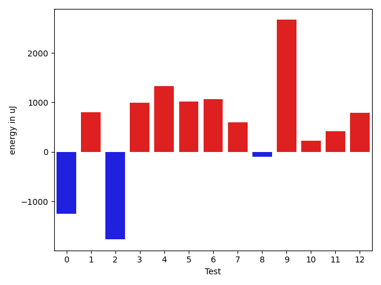
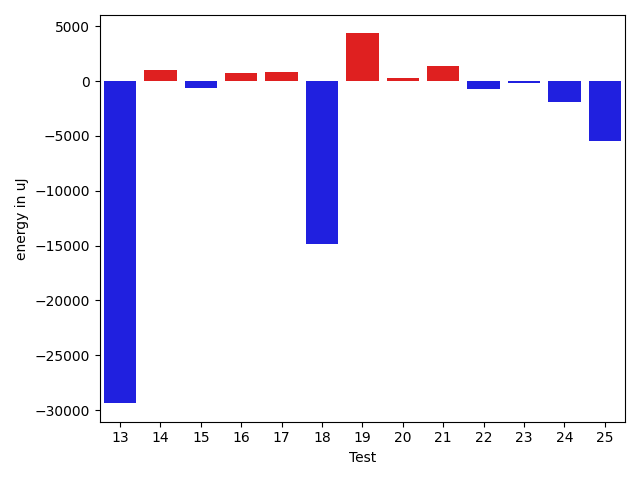
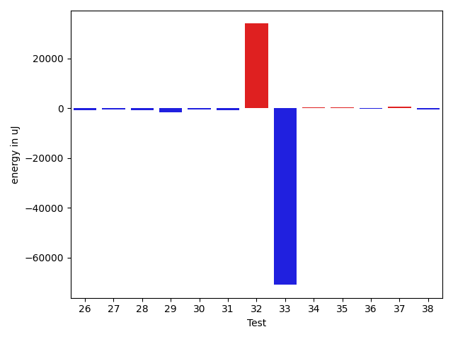
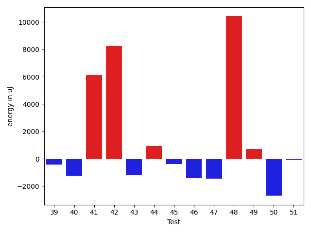
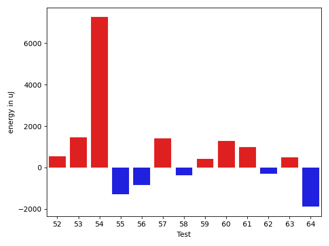
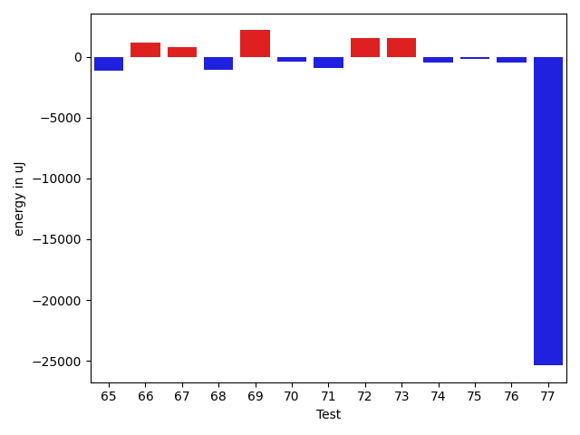
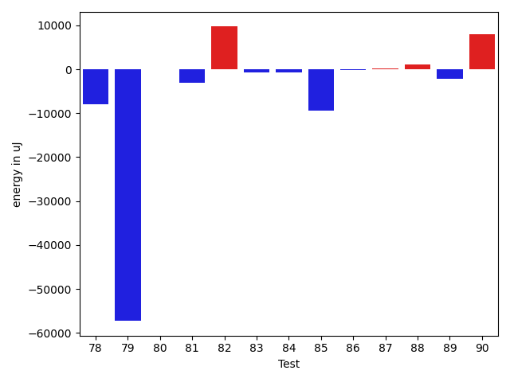
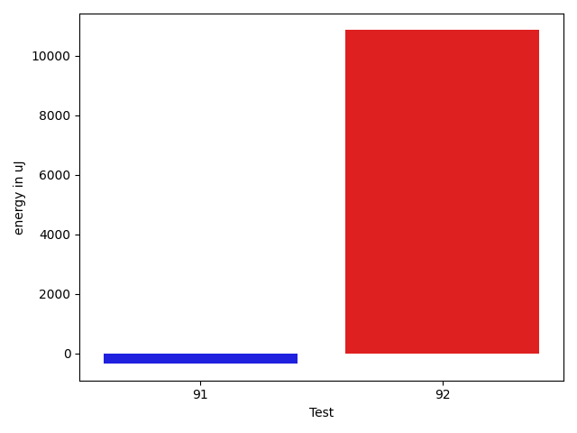

# gson 0bcd1b

https://github.com/google/gson/commit/0bcd1b

## Delta Energy per test method

| ID | EnergyV1 | EnergyV2 | DeltaEnergy | σV1 | σV2 |
| --- | --- | --- | --- | --- | --- |
| 0 | 38452 | 38452 | 0 | 14211.883422583098 | 11590.445506561186 |
| 1 | 36621 | 37537 | 916 | 2741.814345524774 | 3616.273200626613 |
| 2 | 37902 | 40588 | 2686 | 16508.64623218575 | 9449.23380509771 |
| 3 | 35339 | 37597 | 2258 | 4821.303661874037 | 3517.2900846043676 |
| 4 | 36072 | 37903 | 1831 | 3856.722387520263 | 3430.350026681761 |
| 5 | 36377 | 37354 | 977 | 3723.9260711423008 | 4591.085264436442 |
| 6 | 37780 | 39062 | 1282 | 4007.502324153933 | 3343.184546165859 |
| 7 | 36865 | 37536 | 671 | 3090.145093512914 | 3601.58760447768 |
| 8 | 38330 | 38025 | -305 | 3097.236654857645 | 3953.269244636423 |
| 9 | 36804 | 38940 | 2136 | 3042.486600137812 | 3674.6117612154985 |
| 10 | 38391 | 38391 | 0 | 2607.3313140759356 | 3084.622503023533 |
| 11 | 36621 | 37597 | 976 | 3223.9975086762106 | 3787.8905162804053 |
| 12 | 38757 | 39551 | 794 | 4110.964811776288 | 3081.608289894053 |
| 13 | 39551 | 38635 | -916 | 139328.38145174517 | 107910.60324830272 |
| 14 | 37964 | 39917 | 1953 | 3393.9269237446497 | 2843.173603368055 |
| 15 | 35889 | 36377 | 488 | 4056.378446644248 | 3796.4942945945395 |
| 16 | 37902 | 38269 | 367 | 4068.2131730100664 | 2719.2323535499117 |
| 17 | 38085 | 38086 | 1 | 5559.74607133559 | 7164.820939070234 |
| 18 | 41016 | 38452 | -2564 | 49440.632145635034 | 32673.457323513427 |
| 19 | 39306 | 40710 | 1404 | 18483.27575427564 | 23677.51738874352 |
| 20 | 37231 | 37170 | -61 | 7284.905232160952 | 6074.234134988793 |
| 21 | 38636 | 38879 | 243 | 3657.6386492864935 | 8950.319050475582 |
| 22 | 38330 | 37353 | -977 | 6715.371818570443 | 7964.032952384531 |
| 23 | 37353 | 36926 | -427 | 3560.747838530552 | 3449.892251779596 |
| 24 | 37658 | 35766 | -1892 | 2958.2209952262224 | 2529.307233532534 |
| 25 | 38818 | 37903 | -915 | 88471.7397839251 | 85750.9426093254 |
| 26 | 36621 | 37476 | 855 | 5927.422560804373 | 3995.395781747551 |
| 27 | 37658 | 37536 | -122 | 4347.26189816598 | 3431.5613256702754 |
| 28 | 37292 | 35949 | -1343 | 3959.6294461320977 | 3440.382197240001 |
| 29 | 37963 | 35889 | -2074 | 4168.438143259873 | 2925.144823512232 |
| 30 | 37842 | 38330 | 488 | 4536.9331305155065 | 4170.266319978636 |
| 31 | 38208 | 36621 | -1587 | 3385.3175331126627 | 4212.553393074819 |
| 32 | 39368 | 38757 | -611 | 12475.808093833954 | 116134.35366871399 |
| 33 | 41565 | 39490 | -2075 | 640078.9075974429 | 517608.71152094024 |
| 34 | 37842 | 38330 | 488 | 4352.943237121292 | 3629.86343483547 |
| 35 | 36865 | 36865 | 0 | 4067.6241502257803 | 4856.343322823851 |
| 36 | 38513 | 38452 | -61 | 4316.411531549707 | 4310.640141266725 |
| 37 | 35583 | 36438 | 855 | 5701.299749164439 | 4934.043224167736 |
| 38 | 36804 | 36072 | -732 | 3761.1979185159244 | 4115.686141648157 |
| 39 | 36316 | 36377 | 61 | 3855.005126007221 | 3857.857546281973 |
| 40 | 36804 | 36255 | -549 | 6692.205930424668 | 4732.04007686024 |
| 41 | 38086 | 37353 | -733 | 64741.668968383616 | 111839.95865638717 |
| 42 | 66589 | 69092 | 2503 | 25947.398792073363 | 42069.430679178884 |
| 43 | 38025 | 36621 | -1404 | 7296.101459937081 | 8623.373194240075 |
| 44 | 36133 | 36683 | 550 | 3657.0136860817233 | 4678.0456926312345 |
| 45 | 36927 | 36621 | -306 | 8101.06872409437 | 7065.63625496671 |
| 46 | 36804 | 36194 | -610 | 8497.975542665752 | 4946.095331884391 |
| 47 | 38208 | 36988 | -1220 | 5981.061690271429 | 3860.484924762486 |
| 48 | 38086 | 38086 | 0 | 15729.958061614954 | 40898.89293078837 |
| 49 | 37659 | 37658 | -1 | 3414.6969387327777 | 4206.909257891383 |
| 50 | 39368 | 37537 | -1831 | 5509.569451990411 | 6728.148327249436 |
| 51 | 36865 | 37231 | 366 | 3126.2353631044307 | 4194.513119585692 |
| 52 | 35888 | 36438 | 550 | 4462.396551672095 | 3988.3534415062813 |
| 53 | 118835 | 120300 | 1465 | 25854.59850091874 | 28807.101956580485 |
| 54 | 198608 | 205871 | 7263 | 445535.3745004572 | 546625.6493102456 |
| 55 | 39124 | 37842 | -1282 | 17104.16174983643 | 12482.217730909593 |
| 56 | 38025 | 37170 | -855 | 4711.228509642508 | 4140.248984626036 |
| 57 | 36560 | 37963 | 1403 | 5273.768902348125 | 7282.493337576849 |
| 58 | 41564 | 41198 | -366 | 32398.60093847478 | 36547.59392556867 |
| 59 | 36743 | 37170 | 427 | 4461.944332425353 | 3892.8050962309144 |
| 60 | 36194 | 37476 | 1282 | 5446.0307931691395 | 4276.487686341277 |
| 61 | 79102 | 80077 | 975 | 331516.61750841746 | 503613.49766378704 |
| 62 | 40589 | 40283 | -306 | 19981.464551311343 | 20150.9174908102 |
| 63 | 39429 | 39917 | 488 | 9437.986484563742 | 7690.6709529834725 |
| 64 | 40222 | 38330 | -1892 | 39753.72962578129 | 28778.19434833633 |
| 65 | 38269 | 37170 | -1099 | 4227.335947793858 | 3906.0757563709294 |
| 66 | 38330 | 39551 | 1221 | 36713.56325335133 | 38891.34017854175 |
| 67 | 37414 | 38208 | 794 | 5510.834419160461 | 3778.3368597441827 |
| 68 | 38574 | 37536 | -1038 | 4236.990458555582 | 3755.2376563764046 |
| 69 | 38086 | 40283 | 2197 | 38111.75107813436 | 49903.976575637025 |
| 70 | 38880 | 38513 | -367 | 6417.4481479302385 | 10159.327885552655 |
| 71 | 40161 | 39246 | -915 | 39168.267430689135 | 28826.511226995357 |
| 72 | 39184 | 40710 | 1526 | 13137.689197862845 | 12002.264431341478 |
| 73 | 39612 | 41198 | 1586 | 15933.662250781628 | 60256.11209882041 |
| 74 | 38025 | 37537 | -488 | 3803.6384962296297 | 4713.168848165181 |
| 75 | 38269 | 38147 | -122 | 5569.211983070036 | 4660.715775662688 |
| 76 | 38086 | 37597 | -489 | 4119.636777907075 | 4826.053738563217 |
| 77 | 346373 | 320984 | -25389 | 85526.2676404499 | 101486.80390767138 |
| 78 | 40771 | 41199 | 428 | 49557.90788652227 | 36361.21511455798 |
| 79 | 39489 | 39489 | 0 | 249728.26080541898 | 29286.15083430649 |
| 80 | 39185 | 39551 | 366 | 3900.944896440914 | 4058.184814209744 |
| 81 | 84961 | 82885 | -2076 | 328613.5386186057 | 309656.71957739774 |
| 82 | 38147 | 40222 | 2075 | 12724.273881481962 | 36568.47936965374 |
| 83 | 37964 | 36865 | -1099 | 10152.71994396531 | 11293.722550150613 |
| 84 | 38391 | 38330 | -61 | 6213.71424349494 | 3783.25707876476 |
| 85 | 40345 | 39245 | -1100 | 42875.08149373032 | 25732.589305315098 |
| 86 | 38574 | 37964 | -610 | 4173.286366473179 | 3814.585900217225 |
| 87 | 37536 | 37476 | -60 | 5778.981948838994 | 4145.316128075982 |
| 88 | 37048 | 38513 | 1465 | 4170.980578830529 | 3654.7978000047897 |
| 89 | 39063 | 40283 | 1220 | 36931.16023561529 | 31957.194946842934 |
| 90 | 39673 | 40161 | 488 | 40162.43149634467 | 49577.85528829062 |
| 91 | 37353 | 37780 | 427 | 4138.091816803673 | 4150.388951951291 |
| 92 | 37902 | 38025 | 123 | 4760.380082937039 | 60733.19230024788 |

## Delta Duration per test method

| ID | DurationV1 | DurationsV2 | DeltaDuration |
| --- | --- | --- | --- |
| 0 | 1071133.0655737706 | 1038726.3333333334 | -32406.73224043718 |
| 1 | 540398.9615384615 | 513669.5 | -26729.461538461503 |
| 2 | 1064210.7692307692 | 902153.6666666666 | -162057.10256410262 |
| 3 | 511471.35 | 517072.2727272727 | 5600.922727272729 |
| 4 | 570998.4 | 539153.8333333334 | -31844.56666666665 |
| 5 | 635134.2666666667 | 564415.8846153846 | -70718.3820512821 |
| 6 | 534178.7272727273 | 494878.5 | -39300.227272727294 |
| 7 | 543816.4705882353 | 497620.63636363635 | -46195.83422459895 |
| 8 | 735042.2941176471 | 748442.3823529412 | 13400.088235294097 |
| 9 | 478949.6666666667 | 508768.1785714286 | 29818.511904761894 |
| 10 | 499212.3461538461 | 533280.6470588235 | 34068.30090497737 |
| 11 | 588937.8636363636 | 526836.5652173914 | -62101.29841897229 |
| 12 | 510188.12903225806 | 503399.6875 | -6788.441532258061 |
| 13 | 3167200.3928571427 | 2107752.4827586208 | -1059447.910098522 |
| 14 | 503589.09523809527 | 505917.3333333333 | 2328.238095238048 |
| 15 | 522677.8 | 484583.4 | -38094.399999999965 |
| 16 | 474909.2105263158 | 500952.81481481483 | 26043.604288499046 |
| 17 | 1026028.6290322581 | 971034.2698412698 | -54994.35919098824 |
| 18 | 1678170.6857142858 | 936165.5588235294 | -742005.1268907564 |
| 19 | 1526803.4875 | 1537713.4305555555 | 10909.943055555457 |
| 20 | 792246.4285714285 | 786096.2325581395 | -6150.196013289038 |
| 21 | 640273.5882352941 | 719859.2285714286 | 79585.64033613447 |
| 22 | 865131.1639344263 | 879974.9666666667 | 14843.802732240409 |
| 23 | 812981.52 | 785638.6833333333 | -27342.83666666667 |
| 24 | 561237.75 | 540489.68 | -20748.06999999995 |
| 25 | 1777235.0158730159 | 1671246.559322034 | -105988.45655098185 |
| 26 | 638352.3076923077 | 651995.2142857143 | 13642.906593406573 |
| 27 | 561401.6470588235 | 638649.4375 | 77247.7904411765 |
| 28 | 593890.2258064516 | 619008.59375 | 25118.367943548365 |
| 29 | 542985.925925926 | 527261.9642857143 | -15723.961640211637 |
| 30 | 624521.5384615385 | 643433.6896551724 | 18912.15119363391 |
| 31 | 638264.44 | 617290.1666666666 | -20974.273333333316 |
| 32 | 662680.6774193548 | 1856632.6551724137 | 1193951.977753059 |
| 33 | 7534370.454545454 | 5521623.148148148 | -2012747.3063973058 |
| 34 | 565061.08 | 566746.3333333334 | 1685.253333333414 |
| 35 | 535396.5 | 516593.77777777775 | -18802.722222222248 |
| 36 | 527684.3684210526 | 491054.2 | -36630.16842105257 |
| 37 | 1004458.8461538461 | 1028660.8533333334 | 24202.007179487264 |
| 38 | 900125.3076923077 | 883466.131147541 | -16659.176544766757 |
| 39 | 941589.4920634921 | 965201.4925373135 | 23612.00047382142 |
| 40 | 1125789.6419753085 | 1147455.2650602409 | 21665.623084932333 |
| 41 | 1783160.9550561798 | 1895955.3636363635 | 112794.40858018375 |
| 42 | 1970199.8585858585 | 2152770.1616161615 | 182570.30303030298 |
| 43 | 1157663.875 | 1130999.917808219 | -26663.957191780908 |
| 44 | 1011688.4057971014 | 1028917.8219178083 | 17229.416120706825 |
| 45 | 1226437.7875 | 1200202.5217391304 | -26235.26576086972 |
| 46 | 1123696.014084507 | 1043062.8356164383 | -80633.17846806871 |
| 47 | 979096.0508474576 | 964525.8709677419 | -14570.179879715666 |
| 48 | 996347.5636363636 | 1354428.813559322 | 358081.2499229583 |
| 49 | 792751.6078431372 | 844275.3333333334 | 51523.72549019614 |
| 50 | 731880.1935483871 | 789888.4857142858 | 58008.2921658986 |
| 51 | 633141.5277777778 | 623781.7878787878 | -9359.739898989908 |
| 52 | 784541.1875 | 767061.8 | -17479.387499999953 |
| 53 | 3572805.717171717 | 3626340.1818181816 | 53534.46464646468 |
| 54 | 8175376.515151516 | 9616335.646464646 | 1440959.1313131303 |
| 55 | 1393746.9176470588 | 1304845.2298850575 | -88901.6877620013 |
| 56 | 1055617.75 | 989577.1694915254 | -66040.58050847461 |
| 57 | 1107161.6666666667 | 1064960.2686567164 | -42201.398009950295 |
| 58 | 1808926.4845360825 | 1771336.1041666667 | -37590.38036941574 |
| 59 | 983250.7014925373 | 1021128.4137931034 | 37877.71230056614 |
| 60 | 1023683.21875 | 1023689.0714285715 | 5.852678571478464 |
| 61 | 3905596.262626263 | 5440046.818181818 | 1534450.5555555555 |
| 62 | 1594270.2608695652 | 1504554.2947368422 | -89715.96613272303 |
| 63 | 1008614.7073170731 | 897717.6842105263 | -110897.02310654684 |
| 64 | 1721777.0833333333 | 1448060.5972222222 | -273716.486111111 |
| 65 | 901995.6285714286 | 971255.3636363636 | 69259.73506493506 |
| 66 | 1209517.0508474577 | 1435727.8166666667 | 226210.76581920893 |
| 67 | 852994.7627118644 | 878541.3035714285 | 25546.54085956409 |
| 68 | 854524.350877193 | 901041.0535714285 | 46516.702694235486 |
| 69 | 1311007.9193548388 | 1616866.1296296297 | 305858.2102747909 |
| 70 | 1213720.5135135136 | 1211514.107142857 | -2206.406370656565 |
| 71 | 1505070.0909090908 | 1149791.9107142857 | -355278.18019480514 |
| 72 | 1287504.6351351351 | 1317913.8181818181 | 30409.18304668297 |
| 73 | 1039383.6727272727 | 1801751.5909090908 | 762367.9181818181 |
| 74 | 803961.35 | 895127.3170731707 | 91165.9670731707 |
| 75 | 949405.253968254 | 944724.0 | -4681.253968253965 |
| 76 | 731060.4594594594 | 717680.6944444445 | -13379.765015014913 |
| 77 | 9877587.262626262 | 9655930.585858585 | -221656.67676767707 |
| 78 | 1894487.6451612904 | 1669291.7826086956 | -225195.86255259486 |
| 79 | 2822292.675 | 956269.1578947369 | -1866023.517105263 |
| 80 | 717312.6341463415 | 697683.2222222222 | -19629.411924119224 |
| 81 | 4291106.929292929 | 4104353.767676768 | -186753.16161616147 |
| 82 | 879723.2826086957 | 1117763.7826086956 | 238040.49999999988 |
| 83 | 1091344.4150943395 | 1171858.7222222222 | 80514.30712788273 |
| 84 | 1019395.6721311476 | 1014646.1384615385 | -4749.533669609111 |
| 85 | 1555975.9487179487 | 1194653.6078431373 | -361322.3408748114 |
| 86 | 800600.7954545454 | 782533.9047619047 | -18066.890692640678 |
| 87 | 979507.0845070423 | 983661.0294117647 | 4153.94490472239 |
| 88 | 962151.4918032787 | 922128.3220338983 | -40023.16976938036 |
| 89 | 1368828.0689655172 | 1175737.0151515151 | -193091.05381400208 |
| 90 | 1384400.6470588236 | 1659764.076923077 | 275363.4298642534 |
| 91 | 756563.0909090909 | 666097.5 | -90465.59090909094 |
| 92 | 632367.7307692308 | 1108502.2666666666 | 476134.53589743585 |

## Misc.

| ID | Test Class | Test Method |
| --- | --- | --- |
| 0 | com.google.gson.functional.PrimitiveTest | testDeserializePrimitiveWrapperAsObjectField |
| 1 | com.google.gson.functional.PrimitiveTest | testDoubleNaNDeserialization |
| 2 | com.google.gson.functional.PrimitiveTest | testNumberDeserialization |
| 3 | com.google.gson.functional.PrimitiveTest | testDoubleNoFractAsStringRepresentationDeserialization |
| 4 | com.google.gson.functional.PrimitiveTest | testDoubleAsStringRepresentationDeserialization |
| 5 | com.google.gson.functional.PrimitiveTest | testPrimitiveIntegerAutoboxedDeserialization |
| 6 | com.google.gson.functional.PrimitiveTest | testReallyLongValuesDeserialization |
| 7 | com.google.gson.functional.PrimitiveTest | testLargeDoubleDeserialization |
| 8 | com.google.gson.functional.PrimitiveTest | testOverridingDefaultPrimitiveSerialization |
| 9 | com.google.gson.functional.PrimitiveTest | testDoubleInfinityDeserialization |
| 10 | com.google.gson.functional.PrimitiveTest | testPrimitiveClassLiteral |
| 11 | com.google.gson.functional.PrimitiveTest | testPrimitiveDoubleAutoboxedDeserialization |
| 12 | com.google.gson.functional.PrimitiveTest | testPrimitiveLongAutoboxedInASingleElementArrayDeserialization |
| 13 | com.google.gson.functional.PrimitiveTest | testPrimitiveIntegerAutoboxedInASingleElementArrayDeserialization |
| 14 | com.google.gson.functional.PrimitiveTest | testNegativeInfinityDeserialization |
| 15 | com.google.gson.functional.PrimitiveTest | testPrimitiveDoubleAutoboxedInASingleElementArrayDeserialization |
| 16 | com.google.gson.functional.PrimitiveTest | testPrimitiveLongAutoboxedDeserialization |
| 17 | com.google.gson.functional.ReadersWritersTest | testReadWriteTwoObjects |
| 18 | com.google.gson.functional.ReadersWritersTest | testReaderForDeserialization |
| 19 | com.google.gson.functional.ObjectTest | testArrayOfArraysDeserialization |
| 20 | com.google.gson.functional.ObjectTest | testNestedDeserialization |
| 21 | com.google.gson.functional.ObjectTest | testNullFieldsDeserialization |
| 22 | com.google.gson.functional.ObjectTest | testInnerClassDeserialization |
| 23 | com.google.gson.functional.ObjectTest | testPrimitiveArrayInAnObjectDeserialization |
| 24 | com.google.gson.functional.ObjectTest | testObjectFieldNamesWithoutQuotesDeserialization |
| 25 | com.google.gson.functional.ObjectTest | testArrayOfObjectsDeserialization |
| 26 | com.google.gson.functional.ObjectTest | testJsonInMixedQuotesDeserialization |
| 27 | com.google.gson.functional.ObjectTest | testBagOfPrimitivesDeserialization |
| 28 | com.google.gson.functional.ObjectTest | testClassWithTransientFieldsDeserialization |
| 29 | com.google.gson.functional.ObjectTest | testClassWithTransientFieldsDeserializationTransientFieldsPassedInJsonAreIgnored |
| 30 | com.google.gson.functional.ObjectTest | testPrivateNoArgConstructorDeserialization |
| 31 | com.google.gson.functional.ObjectTest | testBagOfPrimitiveWrappersDeserialization |
| 32 | com.google.gson.functional.ObjectTest | testJsonInSingleQuotesDeserialization |
| 33 | com.google.gson.JsonParserTest | testReadWriteTwoObjects |
| 34 | com.google.gson.JsonParserTest | testParseMixedArray |
| 35 | com.google.gson.JsonParserTest | testParseString |
| 36 | com.google.gson.JsonParserTest | testParseReader |
| 37 | com.google.gson.functional.ParameterizedTypesTest | testVariableTypeArrayDeserialization |
| 38 | com.google.gson.functional.ParameterizedTypesTest | testDeepParameterizedTypeDeserialization |
| 39 | com.google.gson.functional.ParameterizedTypesTest | testVariableTypeDeserialization |
| 40 | com.google.gson.functional.ParameterizedTypesTest | testParameterizedTypeGenericArraysDeserialization |
| 41 | com.google.gson.functional.ParameterizedTypesTest | testParameterizedTypeDeserialization |
| 42 | com.google.gson.functional.ParameterizedTypesTest | testVariableTypeFieldsAndGenericArraysDeserialization |
| 43 | com.google.gson.functional.ParameterizedTypesTest | testTypesWithMultipleParametersDeserialization |
| 44 | com.google.gson.functional.ParameterizedTypesTest | testParameterizedTypeWithVariableTypeDeserialization |
| 45 | com.google.gson.functional.ParameterizedTypesTest | testParameterizedTypesWithCustomDeserializer |
| 46 | com.google.gson.functional.ParameterizedTypesTest | testParameterizedTypeWithReaderDeserialization |
| 47 | com.google.gson.functional.VersioningTest | testVersionedGsonMixingSinceAndUntilDeserialization |
| 48 | com.google.gson.functional.VersioningTest | testVersionedUntilDeserialization |
| 49 | com.google.gson.functional.VersioningTest | testVersionedClassesDeserialization |
| 50 | com.google.gson.functional.VersioningTest | testVersionedGsonWithUnversionedClassesDeserialization |
| 51 | com.google.gson.functional.DefaultTypeAdaptersTest | testDefaultGregorianCalendarDeserialization |
| 52 | com.google.gson.functional.DefaultTypeAdaptersTest | testDefaultCalendarDeserialization |
| 53 | com.google.gson.functional.MapAsArrayTypeAdapterTest | testMultipleEnableComplexKeyRegistrationHasNoEffect |
| 54 | com.google.gson.functional.MapAsArrayTypeAdapterTest | testSerializeComplexMapWithTypeAdapter |
| 55 | com.google.gson.functional.CollectionTest | testFieldIsArrayList |
| 56 | com.google.gson.functional.CollectionTest | testWildcardPrimitiveCollectionDeserilaization |
| 57 | com.google.gson.functional.CollectionTest | testTopLevelCollectionOfIntegersDeserialization |
| 58 | com.google.gson.functional.CollectionTest | testWildcardCollectionField |
| 59 | com.google.gson.functional.CollectionTest | testTopLevelListOfIntegerCollectionsDeserialization |
| 60 | com.google.gson.functional.CollectionTest | testSetDeserialization |
| 61 | com.google.gson.functional.TypeVariableTest | testAdvancedTypeVariables |
| 62 | com.google.gson.functional.TypeVariableTest | testTypeVariablesViaTypeParameter |
| 63 | com.google.gson.functional.UncategorizedTest | testGsonInstanceReusableForSerializationAndDeserialization |
| 64 | com.google.gson.functional.UncategorizedTest | testTrailingWhitespace |
| 65 | com.google.gson.functional.MapTest | testParameterizedMapSubclassDeserialization |
| 66 | com.google.gson.functional.MapTest | testMapDeserialization |
| 67 | com.google.gson.functional.MapTest | testMapDeserializationWithWildcardValues |
| 68 | com.google.gson.functional.MapTest | testMapDeserializationWithNullKey |
| 69 | com.google.gson.functional.InheritanceTest | testSubClassDeserialization |
| 70 | com.google.gson.functional.InheritanceTest | testSubInterfacesOfCollectionDeserialization |
| 71 | com.google.gson.functional.JsonParserTest | testChangingCustomTreeAndDeserializing |
| 72 | com.google.gson.functional.EscapingTest | testGsonAcceptsEscapedAndNonEscapedJsonDeserialization |
| 73 | com.google.gson.functional.EscapingTest | testEscapingObjectFields |
| 74 | com.google.gson.functional.EscapingTest | testGsonDoubleDeserialization |
| 75 | com.google.gson.functional.NamingPolicyTest | testComplexFieldNameStrategy |
| 76 | com.google.gson.functional.NamingPolicyTest | testGsonWithSerializedNameFieldNamingPolicyDeserialization |
| 77 | com.google.gson.functional.ConcurrencyTest | testMultiThreadDeserialization |
| 78 | com.google.gson.functional.ConcurrencyTest | testSingleThreadDeserialization |
| 79 | com.google.gson.functional.SecurityTest | testNonExecutableJsonDeserialization |
| 80 | com.google.gson.functional.SecurityTest | testJsonWithNonExectuableTokenWithConfiguredGsonDeserialization |
| 81 | com.google.gson.functional.TypeHierarchyAdapterTest | testTypeHierarchy |
| 82 | com.google.gson.functional.ExposeFieldsTest | testExposeAnnotationDeserialization |
| 83 | com.google.gson.functional.ArrayTest | testArrayOfPrimitivesAsObjectsDeserialization |
| 84 | com.google.gson.functional.ArrayTest | testArrayOfCollectionDeserialization |
| 85 | com.google.gson.functional.ArrayTest | testTopLevelArrayOfIntsDeserialization |
| 86 | com.google.gson.functional.ArrayTest | testArrayOfPrimitivesWithCustomTypeAdapter |
| 87 | com.google.gson.functional.CustomTypeAdaptersTest | testCustomDeserializerForLong |
| 88 | com.google.gson.functional.CustomTypeAdaptersTest | testCustomNestedDeserializers |
| 89 | com.google.gson.functional.CustomTypeAdaptersTest | testCustomDeserializers |
| 90 | com.google.gson.MixedStreamTest | testReadMixedStreamed |
| 91 | com.google.gson.MixedStreamTest | testReaderDoesNotMutateState |
| 92 | com.google.gson.GsonTypeAdapterTest | testTypeAdapterProperlyConvertsTypes |

| Test | IterationV1 | IterationV2 | DeltaIteration |
| --- | --- | --- | --- |
| 0 | 61 | 63 | 2 |
| 1 | 26 | 22 | -4 |
| 2 | 39 | 42 | 3 |
| 3 | 20 | 22 | 2 |
| 4 | 25 | 24 | -1 |
| 5 | 30 | 26 | -4 |
| 6 | 22 | 12 | -10 |
| 7 | 17 | 22 | 5 |
| 8 | 34 | 34 | 0 |
| 9 | 21 | 28 | 7 |
| 10 | 26 | 17 | -9 |
| 11 | 22 | 23 | 1 |
| 12 | 31 | 16 | -15 |
| 13 | 28 | 29 | 1 |
| 14 | 21 | 12 | -9 |
| 15 | 25 | 30 | 5 |
| 16 | 19 | 27 | 8 |
| 17 | 62 | 63 | 1 |
| 18 | 35 | 34 | -1 |
| 19 | 80 | 72 | -8 |
| 20 | 49 | 43 | -6 |
| 21 | 34 | 35 | 1 |
| 22 | 61 | 60 | -1 |
| 23 | 50 | 60 | 10 |
| 24 | 24 | 25 | 1 |
| 25 | 63 | 59 | -4 |
| 26 | 39 | 28 | -11 |
| 27 | 34 | 32 | -2 |
| 28 | 31 | 32 | 1 |
| 29 | 27 | 28 | 1 |
| 30 | 26 | 29 | 3 |
| 31 | 25 | 36 | 11 |
| 32 | 31 | 29 | -2 |
| 33 | 77 | 81 | 4 |
| 34 | 25 | 18 | -7 |
| 35 | 20 | 18 | -2 |
| 36 | 19 | 20 | 1 |
| 37 | 65 | 75 | 10 |
| 38 | 65 | 61 | -4 |
| 39 | 63 | 67 | 4 |
| 40 | 81 | 83 | 2 |
| 41 | 89 | 88 | -1 |
| 42 | 99 | 99 | 0 |
| 43 | 72 | 73 | 1 |
| 44 | 69 | 73 | 4 |
| 45 | 80 | 92 | 12 |
| 46 | 71 | 73 | 2 |
| 47 | 59 | 62 | 3 |
| 48 | 55 | 59 | 4 |
| 49 | 51 | 33 | -18 |
| 50 | 31 | 35 | 4 |
| 51 | 36 | 33 | -3 |
| 52 | 32 | 40 | 8 |
| 53 | 99 | 99 | 0 |
| 54 | 99 | 99 | 0 |
| 55 | 85 | 87 | 2 |
| 56 | 64 | 59 | -5 |
| 57 | 63 | 67 | 4 |
| 58 | 97 | 96 | -1 |
| 59 | 67 | 58 | -9 |
| 60 | 64 | 70 | 6 |
| 61 | 99 | 99 | 0 |
| 62 | 92 | 95 | 3 |
| 63 | 41 | 38 | -3 |
| 64 | 72 | 72 | 0 |
| 65 | 70 | 66 | -4 |
| 66 | 59 | 60 | 1 |
| 67 | 59 | 56 | -3 |
| 68 | 57 | 56 | -1 |
| 69 | 62 | 54 | -8 |
| 70 | 74 | 84 | 10 |
| 71 | 55 | 56 | 1 |
| 72 | 74 | 77 | 3 |
| 73 | 55 | 66 | 11 |
| 74 | 40 | 41 | 1 |
| 75 | 63 | 59 | -4 |
| 76 | 37 | 36 | -1 |
| 77 | 99 | 99 | 0 |
| 78 | 93 | 92 | -1 |
| 79 | 40 | 38 | -2 |
| 80 | 41 | 27 | -14 |
| 81 | 99 | 99 | 0 |
| 82 | 46 | 46 | 0 |
| 83 | 53 | 54 | 1 |
| 84 | 61 | 65 | 4 |
| 85 | 39 | 51 | 12 |
| 86 | 44 | 42 | -2 |
| 87 | 71 | 68 | -3 |
| 88 | 61 | 59 | -2 |
| 89 | 58 | 66 | 8 |
| 90 | 51 | 52 | 1 |
| 91 | 33 | 44 | 11 |
| 92 | 26 | 30 | 4 |

| Time Label | Time (s) |
| --- | --- |
| Selection | 28.142046689987183 |
| Injection | 13.931070327758789 |
| Total | 1167.6538648605347 |

