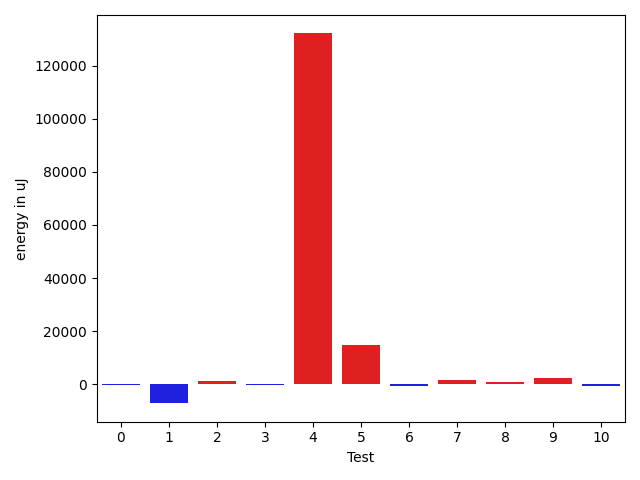
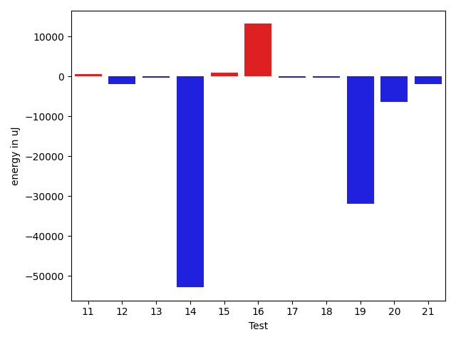
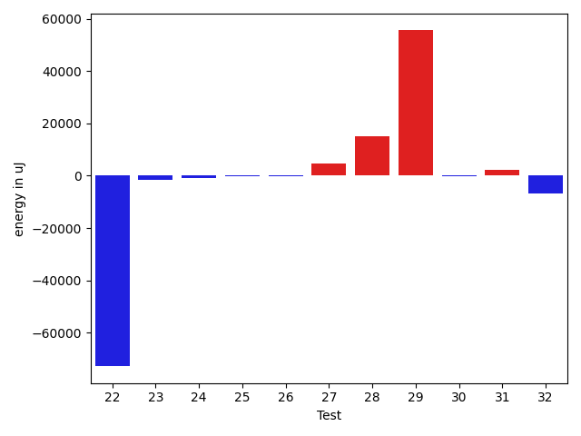
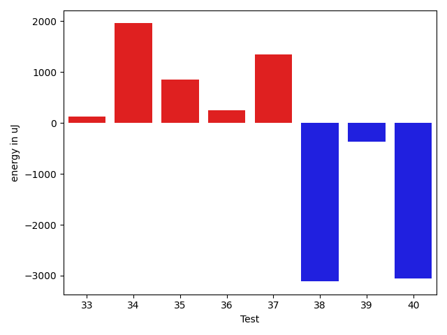

# gson ce79e1

https://github.com/google/gson/commit/ce79e1

## Delta Energy per test method

| ID | EnergyV1 | EnergyV2 | DeltaEnergy | σV1 | σV2 |
| --- | --- | --- | --- | --- | --- |
| 0 | 38147 | 38879 | 732 | 8771.010388492385 | 12617.621008520118 |
| 1 | 68420 | 71533 | 3113 | 78775.39208936522 | 61225.84163093772 |
| 2 | 37536 | 38208 | 672 | 10639.472348279116 | 12443.9492916254 |
| 3 | 39062 | 38757 | -305 | 7601.43463296399 | 7878.965350523903 |
| 4 | 41870 | 41626 | -244 | 31851.67623236606 | 547857.0088693866 |
| 5 | 43884 | 87342 | 43458 | 34871.028866799104 | 39990.29803000655 |
| 6 | 39123 | 38758 | -365 | 4027.7000526709676 | 3837.685414413224 |
| 7 | 35888 | 37231 | 1343 | 3800.8990179133934 | 6456.897656948011 |
| 8 | 36560 | 37780 | 1220 | 6787.845098299666 | 6897.918059975065 |
| 9 | 71411 | 72876 | 1465 | 43684.78007323995 | 49324.374785898646 |
| 10 | 35767 | 36560 | 793 | 6364.143131642349 | 4881.814335842984 |
| 11 | 36194 | 36133 | -61 | 9760.938386292679 | 10697.327433055418 |
| 12 | 78186 | 76782 | -1404 | 28234.260725364977 | 23250.265054633313 |
| 13 | 38452 | 38818 | 366 | 4167.179017712195 | 3486.936255827726 |
| 14 | 116210 | 111939 | -4271 | 504214.94747515727 | 393782.54748012 |
| 15 | 74462 | 73181 | -1281 | 61552.674308151036 | 62582.98991454812 |
| 16 | 37842 | 38086 | 244 | 12565.175078312594 | 64589.56076054394 |
| 17 | 38452 | 37476 | -976 | 6883.727999945924 | 8336.446741211397 |
| 18 | 37963 | 36072 | -1891 | 5096.140413130265 | 7385.736468014767 |
| 19 | 87280 | 86608 | -672 | 623334.9683617455 | 569073.5736176928 |
| 20 | 43335 | 40466 | -2869 | 23770.578279483343 | 22488.155548847255 |
| 21 | 121460 | 116028 | -5432 | 25760.94633747418 | 28542.06338033286 |
| 22 | 262695 | 243164 | -19531 | 588490.8563263294 | 471244.7124763506 |
| 23 | 38758 | 38330 | -428 | 17005.856974464114 | 14999.455494281896 |
| 24 | 43762 | 42663 | -1099 | 21721.546872721156 | 22616.45617547749 |
| 25 | 38391 | 38208 | -183 | 9522.793160764504 | 10240.697209830434 |
| 26 | 36743 | 35645 | -1098 | 4056.480142460664 | 3873.5039590064907 |
| 27 | 38391 | 40100 | 1709 | 11786.099480027233 | 15769.655489014802 |
| 28 | 41321 | 39856 | -1465 | 43609.26794736291 | 67101.45234862446 |
| 29 | 39368 | 40283 | 915 | 86257.66512622136 | 156301.91297390356 |
| 30 | 38208 | 38879 | 671 | 4754.777114278079 | 4120.818489480292 |
| 31 | 34484 | 37292 | 2808 | 4187.469520696856 | 3636.6006250892588 |
| 32 | 119446 | 112915 | -6531 | 27984.281391999863 | 26312.835601048777 |
| 33 | 37353 | 37475 | 122 | 7378.156576791749 | 6506.486048003925 |
| 34 | 36315 | 38269 | 1954 | 28055.52316408512 | 37453.46557335418 |
| 35 | 36010 | 36865 | 855 | 4303.935743639508 | 3946.3644814561426 |
| 36 | 36621 | 36865 | 244 | 4499.507675449457 | 6874.452635664894 |
| 37 | 161681 | 163024 | 1343 | 90363.94970543786 | 96272.04109899822 |
| 38 | 42908 | 39795 | -3113 | 144163.79688453022 | 155170.36341685356 |
| 39 | 36988 | 36621 | -367 | 8419.534772682062 | 5094.951588081868 |
| 40 | 41015 | 37964 | -3051 | 3467.7699471562414 | 4329.320288748672 |

## Delta Duration per test method

| ID | DurationV1 | DurationsV2 | DeltaDuration |
| --- | --- | --- | --- |
| 0 | 1001963.509090909 | 949845.0392156863 | -52118.46987522277 |
| 1 | 2489790.3333333335 | 2255868.3229166665 | -233922.01041666698 |
| 2 | 1198024.8 | 1107543.7692307692 | -90481.0307692308 |
| 3 | 1229288.7631578948 | 1192377.107142857 | -36911.65601503779 |
| 4 | 1589486.6923076923 | 5628070.353658536 | 4038583.6613508444 |
| 5 | 1857943.4666666666 | 2362381.659574468 | 504438.1929078016 |
| 6 | 566624.7142857143 | 614651.1 | 48026.38571428566 |
| 7 | 1164202.525 | 1153103.8554216868 | -11098.669578313129 |
| 8 | 1094593.8333333333 | 1096104.8461538462 | 1511.0128205129877 |
| 9 | 2414008.222222222 | 2420828.3232323234 | 6820.101010101382 |
| 10 | 1165764.024691358 | 1147462.527027027 | -18301.497664330993 |
| 11 | 1294188.75 | 1285759.9888888889 | -8428.761111111147 |
| 12 | 2397185.727272727 | 2435948.97979798 | 38763.252525252756 |
| 13 | 1017444.6451612903 | 975423.2058823529 | -42021.43927893741 |
| 14 | 6623131.313131313 | 5241748.7272727275 | -1381382.5858585853 |
| 15 | 2484876.9081632653 | 2473876.6736842105 | -11000.234479054809 |
| 16 | 1302484.953488372 | 1646497.177777778 | 344012.22428940586 |
| 17 | 991192.0980392157 | 1048649.2727272727 | 57457.17468805704 |
| 18 | 1144651.75 | 1099847.4492753623 | -44804.300724637695 |
| 19 | 8583178.353535354 | 7540340.131313131 | -1042838.222222223 |
| 20 | 1803645.2142857143 | 1711390.71875 | -92254.49553571432 |
| 21 | 3802554.222222222 | 3755632.272727273 | -46921.949494949076 |
| 22 | 12672803.070707072 | 10241761.1010101 | -2431041.9696969707 |
| 23 | 1386018.0898876404 | 1369446.2978723405 | -16571.7920152999 |
| 24 | 1767387.6666666667 | 1834923.175257732 | 67535.50859106518 |
| 25 | 1064013.6956521738 | 1176940.0232558139 | 112926.32760364003 |
| 26 | 875878.7045454546 | 945632.2222222222 | 69753.51767676766 |
| 27 | 1381400.2183908045 | 1448425.9411764706 | 67025.72278566612 |
| 28 | 1562992.3684210526 | 2041787.3731343283 | 478795.0047132757 |
| 29 | 1479397.65625 | 3434047.0444444446 | 1954649.3881944446 |
| 30 | 866247.2142857143 | 928137.2619047619 | 61890.047619047575 |
| 31 | 922034.0701754387 | 909814.0806451613 | -12219.989530277322 |
| 32 | 3635276.3535353537 | 3478124.2525252528 | -157152.10101010092 |
| 33 | 1063022.9523809524 | 1070973.0634920634 | 7950.111111111008 |
| 34 | 1650155.8775510204 | 1838311.7291666667 | 188155.8516156464 |
| 35 | 916358.7118644068 | 912401.4912280702 | -3957.2206363365985 |
| 36 | 997665.0714285715 | 1081057.2461538462 | 83392.17472527467 |
| 37 | 5329961.878787879 | 5478111.909090909 | 148150.03030303027 |
| 38 | 3518543.206896552 | 3795982.32 | 277439.11310344795 |
| 39 | 1201795.9538461538 | 1120262.6 | -81533.35384615371 |
| 40 | 636144.36 | 646472.0434782609 | 10327.683478260878 |

## Misc.

| ID | Test Class | Test Method |
| --- | --- | --- |
| 0 | com.google.gson.functional.CustomDeserializerTest | testDefaultConstructorNotCalledOnField |
| 1 | com.google.gson.functional.CustomDeserializerTest | testDefaultConstructorNotCalledOnObject |
| 2 | com.google.gson.functional.ReadersWritersTest | testReadWriteTwoObjects |
| 3 | com.google.gson.functional.ReadersWritersTest | testReadWriteTwoStrings |
| 4 | com.google.gson.JsonParserTest | testReadWriteTwoObjects |
| 5 | com.google.gson.functional.StringTest | testSingleQuoteInStringSerialization |
| 6 | com.google.gson.functional.StringTest | testEscapingQuotesInStringSerialization |
| 7 | com.google.gson.functional.ParameterizedTypesTest | testVariableTypeArrayDeserialization |
| 8 | com.google.gson.functional.ParameterizedTypesTest | testVariableTypeDeserialization |
| 9 | com.google.gson.functional.ParameterizedTypesTest | testVariableTypeFieldsAndGenericArraysDeserialization |
| 10 | com.google.gson.functional.ParameterizedTypesTest | testParameterizedTypeWithVariableTypeDeserialization |
| 11 | com.google.gson.functional.ParameterizedTypesTest | testParameterizedTypeGenericArraysDeserialization |
| 12 | com.google.gson.functional.ObjectTest | testSingletonLists |
| 13 | com.google.gson.functional.TypeHierarchyAdapterTest | testRegisterSuperTypeFirst |
| 14 | com.google.gson.functional.TypeHierarchyAdapterTest | testTypeHierarchy |
| 15 | com.google.gson.functional.EnumTest | testEnumSubclass |
| 16 | com.google.gson.functional.EnumTest | testEnumSubclassWithRegisteredTypeAdapter |
| 17 | com.google.gson.functional.EnumTest | testEnumSubclassAsParameterizedType |
| 18 | com.google.gson.functional.TypeVariableTest | testBasicTypeVariables |
| 19 | com.google.gson.functional.TypeVariableTest | testAdvancedTypeVariables |
| 20 | com.google.gson.functional.TypeVariableTest | testTypeVariablesViaTypeParameter |
| 21 | com.google.gson.functional.MapAsArrayTypeAdapterTest | testMultipleEnableComplexKeyRegistrationHasNoEffect |
| 22 | com.google.gson.functional.MapAsArrayTypeAdapterTest | testSerializeComplexMapWithTypeAdapter |
| 23 | com.google.gson.functional.CollectionTest | testFieldIsArrayList |
| 24 | com.google.gson.functional.CollectionTest | testWildcardCollectionField |
| 25 | com.google.gson.functional.UncategorizedTest | testGsonInstanceReusableForSerializationAndDeserialization |
| 26 | com.google.gson.functional.EscapingTest | testGsonDoubleDeserialization |
| 27 | com.google.gson.functional.EscapingTest | testGsonAcceptsEscapedAndNonEscapedJsonDeserialization |
| 28 | com.google.gson.functional.EscapingTest | testEscapingObjectFields |
| 29 | com.google.gson.functional.EscapingTest | testEscapingQuotesInStringArray |
| 30 | com.google.gson.functional.ArrayTest | testArrayOfPrimitivesWithCustomTypeAdapter |
| 31 | com.google.gson.functional.DefaultTypeAdaptersTest | testTimestampSerialization |
| 32 | com.google.gson.functional.DefaultTypeAdaptersTest | testDefaultDateDeserializationUsingBuilder |
| 33 | com.google.gson.functional.DefaultTypeAdaptersTest | testDateDeserializationWithPattern |
| 34 | com.google.gson.functional.DefaultTypeAdaptersTest | testDateSerializationInCollection |
| 35 | com.google.gson.functional.DefaultTypeAdaptersTest | testSqlDateSerialization |
| 36 | com.google.gson.functional.DefaultTypeAdaptersTest | testBitSetDeserialization |
| 37 | com.google.gson.DefaultInetAddressTypeAdapterTest | testInetAddressSerializationAndDeserialization |
| 38 | com.google.gson.GsonTypeAdapterTest | testTypeAdapterDoesNotAffectNonAdaptedTypes |
| 39 | com.google.gson.functional.NamingPolicyTest | testComplexFieldNameStrategy |
| 40 | com.google.gson.functional.PrimitiveTest | testQuotedStringSerializationAndDeserialization |

| Test | IterationV1 | IterationV2 | DeltaIteration |
| --- | --- | --- | --- |
| 0 | 55 | 51 | -4 |
| 1 | 96 | 96 | 0 |
| 2 | 70 | 65 | -5 |
| 3 | 76 | 84 | 8 |
| 4 | 78 | 82 | 4 |
| 5 | 45 | 47 | 2 |
| 6 | 21 | 20 | -1 |
| 7 | 80 | 83 | 3 |
| 8 | 72 | 65 | -7 |
| 9 | 99 | 99 | 0 |
| 10 | 81 | 74 | -7 |
| 11 | 92 | 90 | -2 |
| 12 | 99 | 99 | 0 |
| 13 | 62 | 68 | 6 |
| 14 | 99 | 99 | 0 |
| 15 | 98 | 95 | -3 |
| 16 | 86 | 90 | 4 |
| 17 | 51 | 66 | 15 |
| 18 | 72 | 69 | -3 |
| 19 | 99 | 99 | 0 |
| 20 | 98 | 96 | -2 |
| 21 | 99 | 99 | 0 |
| 22 | 99 | 99 | 0 |
| 23 | 89 | 94 | 5 |
| 24 | 99 | 97 | -2 |
| 25 | 46 | 43 | -3 |
| 26 | 44 | 54 | 10 |
| 27 | 87 | 85 | -2 |
| 28 | 57 | 67 | 10 |
| 29 | 32 | 45 | 13 |
| 30 | 42 | 42 | 0 |
| 31 | 57 | 62 | 5 |
| 32 | 99 | 99 | 0 |
| 33 | 63 | 63 | 0 |
| 34 | 98 | 96 | -2 |
| 35 | 59 | 57 | -2 |
| 36 | 56 | 65 | 9 |
| 37 | 99 | 99 | 0 |
| 38 | 29 | 25 | -4 |
| 39 | 65 | 70 | 5 |
| 40 | 25 | 23 | -2 |

| Time Label | Time (s) |
| --- | --- |
| Selection | 27.269782781600952 |
| Injection | 12.65205693244934 |
| Total | 1138.8509373664856 |

