# gson 824635

https://github.com/google/gson/commit/824635

## Delta Energy per test method

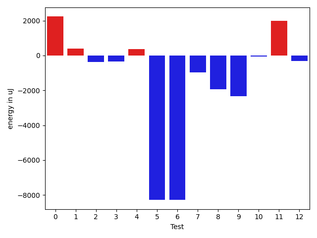

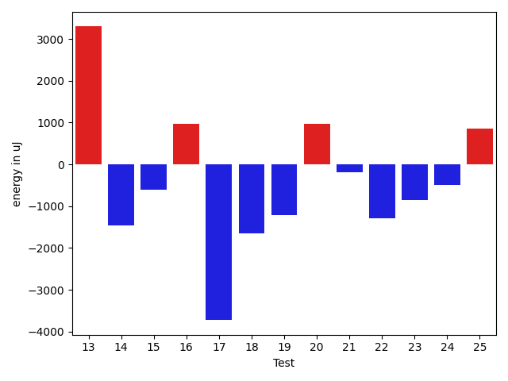

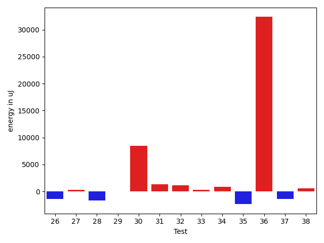

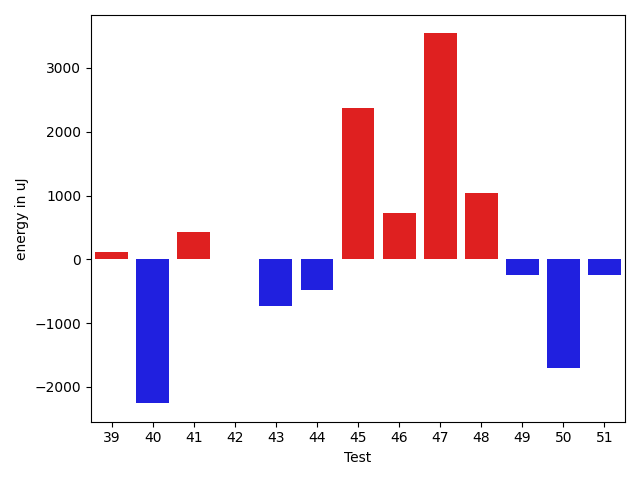

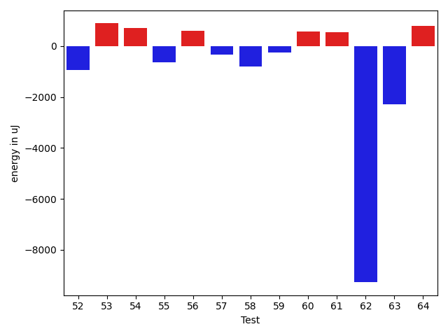

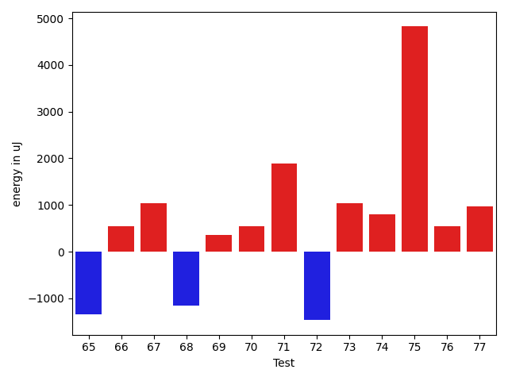

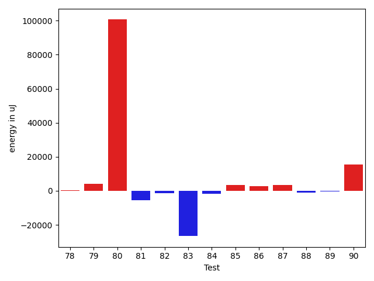

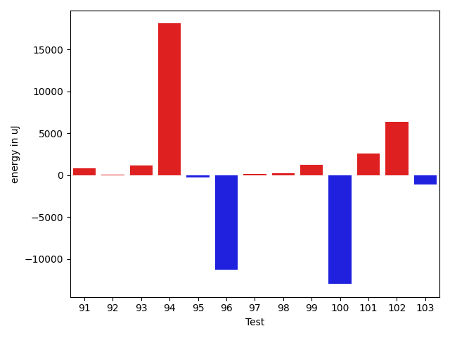

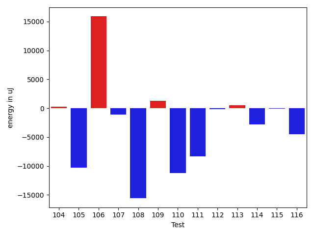

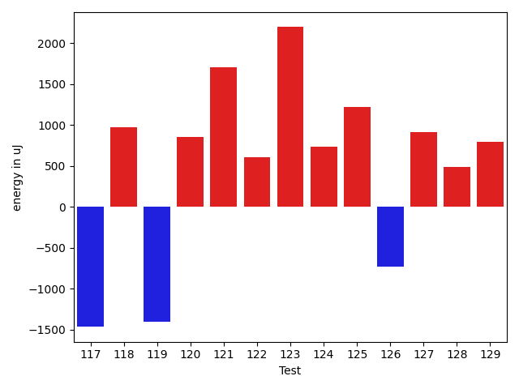

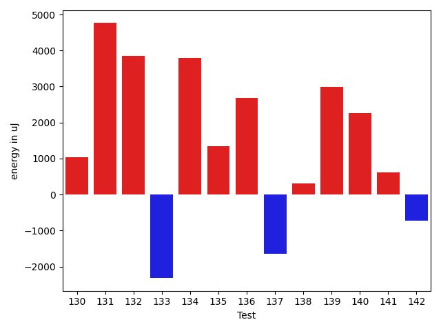

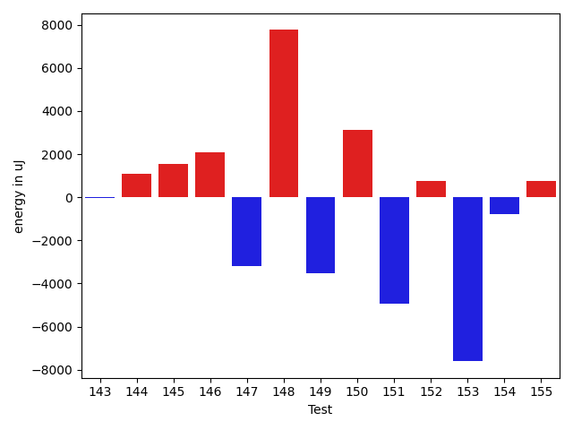

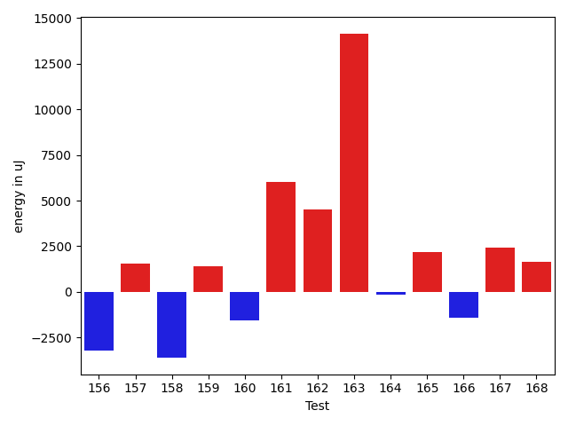

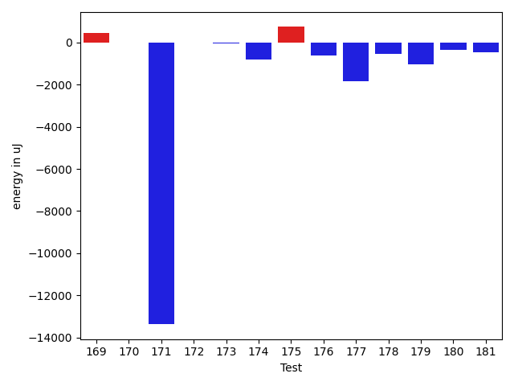

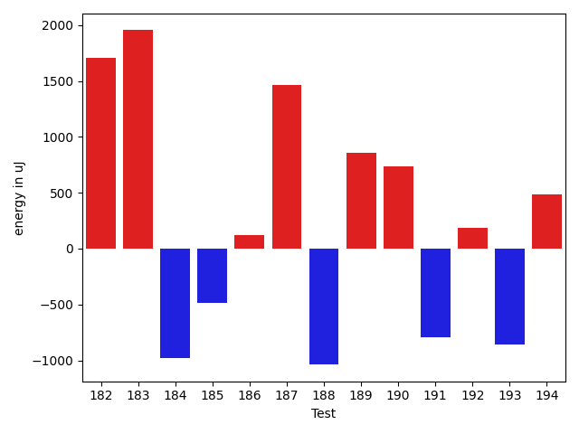

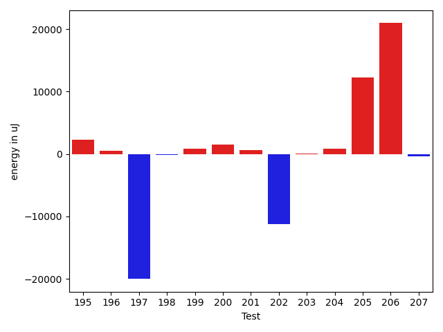

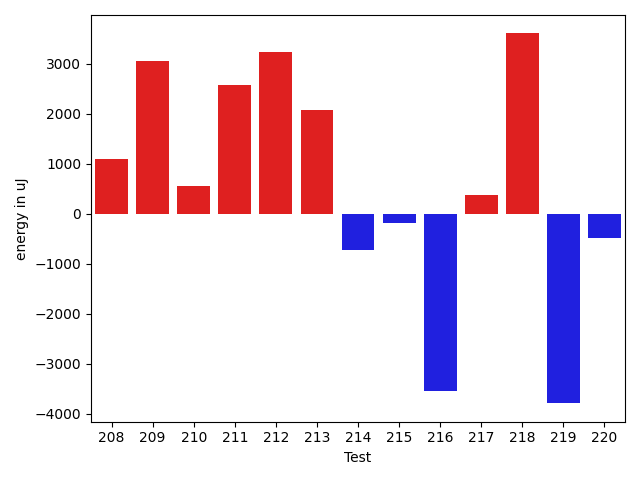

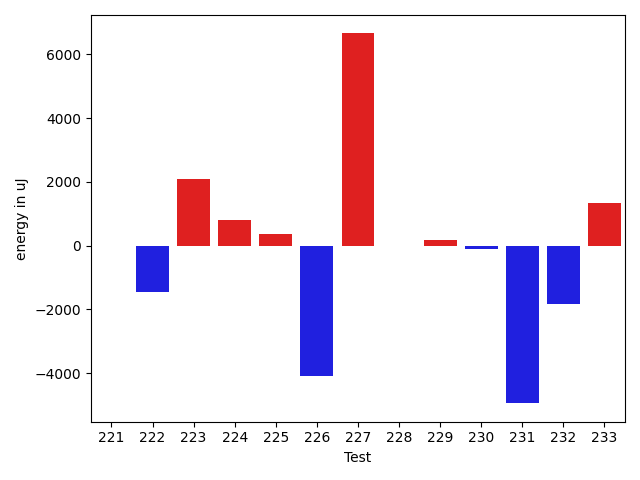

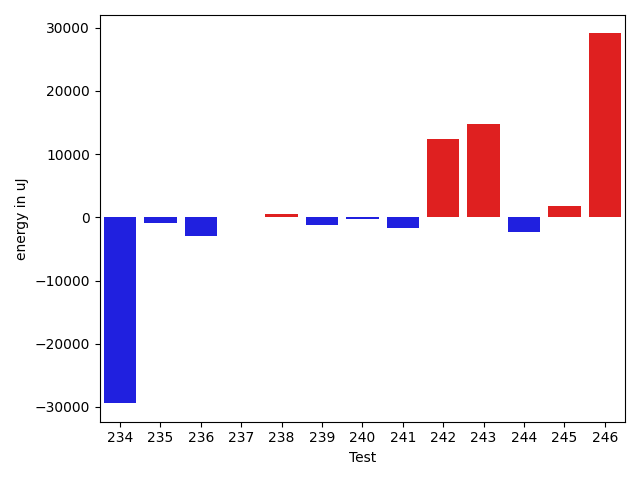

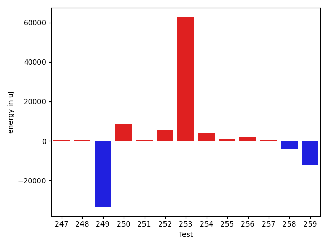

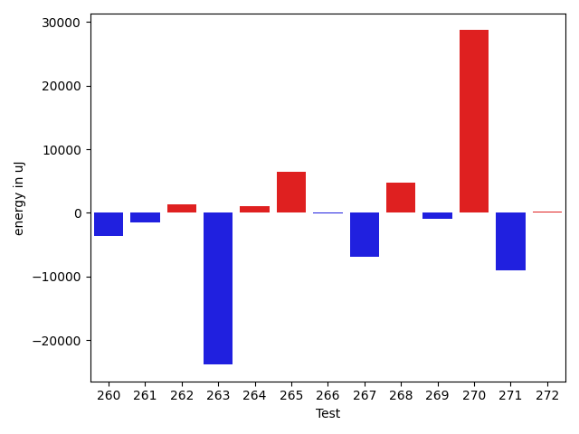

| ID | EnergyV1 | EnergyV2 | DeltaEnergy | σV1 | σV2 |
| --- | --- | --- | --- | --- | --- |
| 0 | 36865 | 36499 | -366 | 6988.134215221468 | 11142.682044027712 |
| 1 | 33874 | 34729 | 855 | 4555.491167278006 | 3088.7963495330814 |
| 2 | 36804 | 35766 | -1038 | 4278.27754611596 | 4015.81929435513 |
| 3 | 35766 | 35400 | -366 | 3954.246566632159 | 4835.516760402766 |
| 4 | 34668 | 34851 | 183 | 4422.040428071638 | 3475.1625983125946 |
| 5 | 37292 | 35644 | -1648 | 32817.60787704166 | 4318.542035996254 |
| 6 | 38208 | 36499 | -1709 | 33289.89574388981 | 3931.52083239496 |
| 7 | 37781 | 36560 | -1221 | 4542.374348314063 | 4592.590913313764 |
| 8 | 37354 | 36072 | -1282 | 3362.6015478421127 | 2899.074714825458 |
| 9 | 35034 | 34729 | -305 | 5511.264861962109 | 4106.525886850709 |
| 10 | 36255 | 36499 | 244 | 3576.581652857828 | 4640.788369178237 |
| 11 | 33935 | 34424 | 489 | 3316.6837547298487 | 4479.211759028838 |
| 12 | 37353 | 36438 | -915 | 5121.408529642993 | 4020.248116263937 |
| 13 | 35523 | 38818 | 3295 | 4889.676765502373 | 3677.9007301193224 |
| 14 | 37048 | 35583 | -1465 | 3875.421506161041 | 3936.672670523135 |
| 15 | 35827 | 35217 | -610 | 4099.787038058395 | 3080.161802307642 |
| 16 | 35523 | 36499 | 976 | 3640.9650527617123 | 4309.330904916976 |
| 17 | 38574 | 34851 | -3723 | 3887.0646603149517 | 3324.550445799652 |
| 18 | 37536 | 35889 | -1647 | 34205.31401754044 | 2724.7496707341925 |
| 19 | 36377 | 35157 | -1220 | 32525.590494675784 | 3793.579299598698 |
| 20 | 34180 | 35156 | 976 | 4859.025151065296 | 39403.26233876454 |
| 21 | 35828 | 35644 | -184 | 4633.233588707604 | 4191.055757337417 |
| 22 | 35339 | 34057 | -1282 | 3665.9031974819145 | 3757.4205012919983 |
| 23 | 36071 | 35217 | -854 | 4061.9804360065546 | 38655.44570600112 |
| 24 | 36316 | 35828 | -488 | 4269.914786847023 | 4071.8711865320934 |
| 25 | 36010 | 36865 | 855 | 3584.2243194619145 | 4563.730106434319 |
| 26 | 38513 | 36804 | -1709 | 3627.737116647236 | 3605.248334796863 |
| 27 | 37475 | 35644 | -1831 | 3838.9328940092037 | 4642.728282521544 |
| 28 | 36316 | 33813 | -2503 | 2664.4352440151692 | 3911.7278458241335 |
| 29 | 35217 | 34424 | -793 | 3186.773173487448 | 3979.6667512333697 |
| 30 | 36438 | 36255 | -183 | 3479.9448009415323 | 40720.50235222024 |
| 31 | 33814 | 36133 | 2319 | 4097.326409583043 | 3782.3711795644804 |
| 32 | 35461 | 36072 | 611 | 3530.212165933931 | 3714.219442126732 |
| 33 | 36193 | 35278 | -915 | 4090.115341249669 | 7523.847595741865 |
| 34 | 36194 | 35034 | -1160 | 4336.009766192966 | 2707.8738794016167 |
| 35 | 35156 | 32410 | -2746 | 3830.63129125033 | 4910.753854703737 |
| 36 | 40649 | 41077 | 428 | 73244.69644961483 | 112218.17485507425 |
| 37 | 36377 | 34485 | -1892 | 4751.5927500477965 | 3999.523616244791 |
| 38 | 38452 | 37963 | -489 | 14947.070598317063 | 14998.050219377317 |
| 39 | 36011 | 36132 | 121 | 4756.077870951627 | 3769.128633294569 |
| 40 | 37597 | 35339 | -2258 | 5044.322097522493 | 46992.8459630316 |
| 41 | 35767 | 36193 | 426 | 4718.445808473379 | 2681.5913585779617 |
| 42 | 36316 | 36316 | 0 | 4543.130580242638 | 3683.321148582316 |
| 43 | 36376 | 35644 | -732 | 4229.195322772317 | 3891.0259785248877 |
| 44 | 36560 | 36072 | -488 | 3482.1606670504334 | 3963.529112484252 |
| 45 | 35095 | 37475 | 2380 | 3795.654152771373 | 4334.075993168067 |
| 46 | 35400 | 36132 | 732 | 3676.1038938375714 | 3928.0784355146925 |
| 47 | 35278 | 38819 | 3541 | 4131.002598912547 | 4628.059919904044 |
| 48 | 34790 | 35827 | 1037 | 5704.450710805512 | 3412.6258702584355 |
| 49 | 36804 | 36560 | -244 | 4418.07430222716 | 3169.6716592134862 |
| 50 | 36377 | 34668 | -1709 | 3985.929557028542 | 4623.87552696749 |
| 51 | 36499 | 36254 | -245 | 5086.928012993205 | 4011.743895531385 |
| 52 | 36805 | 36804 | -1 | 2806.2689036803504 | 2435.92422141987 |
| 53 | 35767 | 38025 | 2258 | 3508.063445905143 | 4358.781068651204 |
| 54 | 36316 | 37231 | 915 | 3077.1218536961337 | 4079.4850789891716 |
| 55 | 36011 | 34423 | -1588 | 4555.516031311259 | 5089.173379723753 |
| 56 | 37964 | 38330 | 366 | 4160.249192055688 | 4252.844963553653 |
| 57 | 34851 | 35461 | 610 | 4935.358968944787 | 3572.6878566190658 |
| 58 | 35828 | 36072 | 244 | 2979.1107081762248 | 3018.8776788733926 |
| 59 | 35583 | 34057 | -1526 | 3520.640012663242 | 3290.037307444248 |
| 60 | 34729 | 35522 | 793 | 3941.262129504886 | 2993.034553677283 |
| 61 | 34912 | 34789 | -123 | 4368.93040762458 | 3300.461040571818 |
| 62 | 37597 | 34851 | -2746 | 37522.57578213933 | 3434.0777510126354 |
| 63 | 37048 | 36316 | -732 | 3680.561132209855 | 3801.517476278253 |
| 64 | 35583 | 36499 | 916 | 3876.3704879335546 | 4011.6896600919777 |
| 65 | 37597 | 36254 | -1343 | 47498.493829001236 | 3443.953147684607 |
| 66 | 34607 | 35156 | 549 | 4360.262289630637 | 3483.8174655589137 |
| 67 | 36438 | 37475 | 1037 | 3887.6901998286526 | 3114.9765624118268 |
| 68 | 36194 | 35034 | -1160 | 3825.6088857773707 | 5100.767487824136 |
| 69 | 34973 | 35339 | 366 | 3110.3796838614053 | 4434.606493879198 |
| 70 | 34546 | 35095 | 549 | 3781.887392467877 | 4470.281315911609 |
| 71 | 34546 | 36437 | 1891 | 4460.867281893362 | 3562.2291590515647 |
| 72 | 37232 | 35766 | -1466 | 3392.5880024203743 | 4798.465518542842 |
| 73 | 37110 | 38147 | 1037 | 4121.266122365556 | 3524.4598612525365 |
| 74 | 36926 | 37719 | 793 | 3750.5883972309975 | 25729.102347016615 |
| 75 | 77514 | 82337 | 4823 | 22572.201707640645 | 21391.64709721728 |
| 76 | 38757 | 39306 | 549 | 32095.106245488896 | 49087.38892954749 |
| 77 | 37963 | 38941 | 978 | 6741.53345060371 | 6177.772533718554 |
| 78 | 36926 | 37048 | 122 | 4218.473389984206 | 4237.5951713665245 |
| 79 | 39062 | 39123 | 61 | 15497.934294717761 | 19926.66489468684 |
| 80 | 38941 | 41320 | 2379 | 189160.4028717884 | 406524.8096104012 |
| 81 | 79712 | 78308 | -1404 | 26743.479135104513 | 28728.925678886662 |
| 82 | 116211 | 116455 | 244 | 33352.89294121895 | 28366.279463229974 |
| 83 | 206238 | 174011 | -32227 | 454093.1263682304 | 455084.2440942954 |
| 84 | 77515 | 75317 | -2198 | 19012.2705698773 | 19788.548011164545 |
| 85 | 36865 | 39551 | 2686 | 10268.426683886793 | 12102.023194894453 |
| 86 | 77515 | 78736 | 1221 | 21826.72213824778 | 22366.78889005119 |
| 87 | 37171 | 37232 | 61 | 4435.567155369866 | 21229.46792399194 |
| 88 | 37720 | 37903 | 183 | 8394.59032843308 | 6219.453379798767 |
| 89 | 69885 | 68481 | -1404 | 20558.494922588412 | 21139.030507752075 |
| 90 | 37964 | 38940 | 976 | 20599.154699129715 | 48687.63733278089 |
| 91 | 36133 | 37353 | 1220 | 4409.111130783618 | 4230.738126300578 |
| 92 | 36499 | 37537 | 1038 | 4716.70041904762 | 3621.8815094324564 |
| 93 | 36804 | 37475 | 671 | 4094.8183610786496 | 5452.160530755216 |
| 94 | 39001 | 39672 | 671 | 39311.00963187975 | 79274.30775304465 |
| 95 | 37171 | 36865 | -306 | 3882.4114060759266 | 3806.7283761781587 |
| 96 | 37536 | 38696 | 1160 | 42360.954582865554 | 3560.668347421929 |
| 97 | 38025 | 38269 | 244 | 6232.442778351989 | 3960.412783984793 |
| 98 | 37658 | 38269 | 611 | 4129.275477212232 | 3195.708631011436 |
| 99 | 37293 | 38574 | 1281 | 3582.5596614415626 | 3296.244347243495 |
| 100 | 40466 | 38513 | -1953 | 47582.3144617194 | 3486.7462683611716 |
| 101 | 38940 | 40100 | 1160 | 8526.039531320115 | 11588.529477203327 |
| 102 | 41565 | 42115 | 550 | 58522.78055874831 | 62402.033073302606 |
| 103 | 37476 | 37353 | -123 | 3758.3950644280944 | 3900.747355564966 |
| 104 | 37475 | 38269 | 794 | 3660.5741187541516 | 3648.2963544646427 |
| 105 | 124206 | 122559 | -1647 | 107951.63801476618 | 82743.22525604497 |
| 106 | 42786 | 41931 | -855 | 39417.343392076655 | 80769.08228835731 |
| 107 | 38513 | 37964 | -549 | 14732.702172714871 | 6336.770545346817 |
| 108 | 41137 | 40649 | -488 | 99760.22691061597 | 44212.517708201965 |
| 109 | 38024 | 39367 | 1343 | 4181.601923538729 | 3490.784829735091 |
| 110 | 41321 | 40954 | -367 | 53389.42493837048 | 13435.057661956644 |
| 111 | 38758 | 38635 | -123 | 27827.781806212417 | 11984.897641385274 |
| 112 | 38513 | 37354 | -1159 | 3889.0267824078705 | 4141.279359715679 |
| 113 | 36560 | 37659 | 1099 | 3461.8244186491543 | 3131.447965452964 |
| 114 | 36743 | 37415 | 672 | 25299.542684794393 | 11322.296571571866 |
| 115 | 37109 | 38453 | 1344 | 4155.940540484388 | 3054.824397668664 |
| 116 | 36377 | 36682 | 305 | 16742.869306016433 | 4112.486555308118 |
| 117 | 38330 | 36865 | -1465 | 4313.496628914592 | 3496.2787616105343 |
| 118 | 37231 | 38208 | 977 | 4331.4588678679775 | 4044.0572216189516 |
| 119 | 37475 | 36072 | -1403 | 3873.082199941023 | 3221.7728599246016 |
| 120 | 36132 | 36988 | 856 | 4690.261742129448 | 3623.298311779927 |
| 121 | 43396 | 45105 | 1709 | 47428.374409241456 | 37431.65701931983 |
| 122 | 36499 | 37109 | 610 | 5977.041555758749 | 3536.542227333682 |
| 123 | 36377 | 38574 | 2197 | 3675.8666835183235 | 3649.240624964171 |
| 124 | 36072 | 36804 | 732 | 3847.1910139313877 | 6716.361417040483 |
| 125 | 35095 | 36316 | 1221 | 7672.955785103138 | 6450.018424520141 |
| 126 | 37720 | 36987 | -733 | 3396.638132530475 | 4468.883831713771 |
| 127 | 36926 | 37842 | 916 | 6319.943627209181 | 5183.289583064802 |
| 128 | 36133 | 36621 | 488 | 3685.9027388144686 | 3269.366584278979 |
| 129 | 35950 | 36743 | 793 | 4142.787961051916 | 4112.030401962839 |
| 130 | 36377 | 37415 | 1038 | 4413.756774957215 | 3304.3309209348226 |
| 131 | 37964 | 42725 | 4761 | 84216.32509784684 | 113465.88817050253 |
| 132 | 34668 | 38513 | 3845 | 3929.344702205664 | 3407.5899959130816 |
| 133 | 37719 | 35400 | -2319 | 3404.479945340382 | 3847.1743263826575 |
| 134 | 35644 | 39429 | 3785 | 3904.292130277748 | 2618.3486929964743 |
| 135 | 35400 | 36743 | 1343 | 4372.201161053312 | 3424.7766784971323 |
| 136 | 37414 | 40100 | 2686 | 3413.354102730014 | 3707.9544409410796 |
| 137 | 39612 | 37964 | -1648 | 15556.046026342989 | 14405.361869504291 |
| 138 | 40039 | 40344 | 305 | 68214.82604623241 | 353559.5900008534 |
| 139 | 35889 | 38879 | 2990 | 4700.434404376233 | 3069.5040904209773 |
| 140 | 35034 | 37293 | 2259 | 4430.663660471445 | 5897.750194385305 |
| 141 | 38391 | 39001 | 610 | 3930.495225760131 | 4406.338785896262 |
| 142 | 37109 | 36377 | -732 | 29629.757609448203 | 73209.329717228 |
| 143 | 36499 | 35828 | -671 | 5112.671621283717 | 5897.643056355434 |
| 144 | 35400 | 36316 | 916 | 3558.176762987846 | 3959.713582466845 |
| 145 | 37171 | 37964 | 793 | 10238.710711779257 | 12205.237623639543 |
| 146 | 78186 | 75744 | -2442 | 89178.08544722894 | 108349.85010415656 |
| 147 | 37842 | 37902 | 60 | 46327.07535572942 | 24523.450393575407 |
| 148 | 68237 | 72754 | 4517 | 27279.70797999233 | 29345.48868241129 |
| 149 | 38696 | 39001 | 305 | 66047.48874331704 | 65180.38217883852 |
| 150 | 39673 | 42969 | 3296 | 20592.877827486143 | 22057.26015262705 |
| 151 | 37170 | 36926 | -244 | 21889.561894413946 | 6704.945447355325 |
| 152 | 73913 | 75744 | 1831 | 27592.063061813275 | 31307.795200191154 |
| 153 | 37597 | 36988 | -609 | 67323.05786407409 | 16853.045655432597 |
| 154 | 36804 | 35339 | -1465 | 3945.4771320677332 | 3959.0291671686728 |
| 155 | 35705 | 36438 | 733 | 4315.253091844277 | 3723.650949782229 |
| 156 | 36804 | 36194 | -610 | 9830.168624924216 | 4584.690567646488 |
| 157 | 35095 | 37354 | 2259 | 4144.01171596691 | 4712.976720625829 |
| 158 | 40344 | 34912 | -5432 | 3111.898819901785 | 3707.552843417703 |
| 159 | 36499 | 38330 | 1831 | 3955.097258032915 | 3532.080611015034 |
| 160 | 39002 | 37842 | -1160 | 4327.491958732282 | 4063.7829477470864 |
| 161 | 39550 | 41015 | 1465 | 23218.818029651757 | 37958.938748972214 |
| 162 | 36804 | 37598 | 794 | 9923.384640461778 | 18994.89065302693 |
| 163 | 38818 | 38452 | -366 | 17994.897862459024 | 50458.401456288695 |
| 164 | 36804 | 36560 | -244 | 3565.507987027312 | 4533.019929771969 |
| 165 | 36072 | 38330 | 2258 | 4208.168293329372 | 5111.925075961944 |
| 166 | 37903 | 36560 | -1343 | 3889.012851506623 | 2879.112743537495 |
| 167 | 38574 | 38452 | -122 | 8355.918279275507 | 14549.914676927401 |
| 168 | 37109 | 38818 | 1709 | 3737.309279947721 | 3476.833777701861 |
| 169 | 39612 | 40039 | 427 | 3742.592094168604 | 88289.54068314057 |
| 170 | 36377 | 36377 | 0 | 5004.608646343443 | 3947.5406512545533 |
| 171 | 174255 | 160888 | -13367 | 338506.3804158184 | 60827.5918644421 |
| 172 | 38269 | 38269 | 0 | 36908.570173777436 | 30618.213182053107 |
| 173 | 37536 | 37475 | -61 | 6101.504213018917 | 26551.50699719739 |
| 174 | 37720 | 36926 | -794 | 5258.602264714601 | 4188.313507537946 |
| 175 | 35950 | 36682 | 732 | 4272.944298410136 | 4392.300702212402 |
| 176 | 37536 | 36926 | -610 | 4022.0607163989953 | 3576.555936983283 |
| 177 | 39733 | 37903 | -1830 | 42726.54672373746 | 25039.683230622744 |
| 178 | 36926 | 36377 | -549 | 4484.298138197543 | 4677.5516832393205 |
| 179 | 37415 | 36377 | -1038 | 3085.743652770308 | 3085.538433825091 |
| 180 | 36560 | 36193 | -367 | 3554.7845387860216 | 4086.780037004889 |
| 181 | 37476 | 36988 | -488 | 24605.751999137443 | 6821.289909101312 |
| 182 | 34973 | 36682 | 1709 | 3785.983675418126 | 2473.045356101123 |
| 183 | 36071 | 38025 | 1954 | 3749.7473040693017 | 4820.597366781835 |
| 184 | 37475 | 36499 | -976 | 3089.1415986203237 | 2878.2508353108738 |
| 185 | 39062 | 38574 | -488 | 14025.92239876796 | 21529.12344749278 |
| 186 | 39672 | 39795 | 123 | 14986.452803261185 | 13612.7397338289 |
| 187 | 36438 | 37903 | 1465 | 4654.613418305421 | 4723.990592062408 |
| 188 | 39368 | 38330 | -1038 | 3663.98234395037 | 4376.305237012153 |
| 189 | 38635 | 39490 | 855 | 13263.374633436251 | 14359.520752694994 |
| 190 | 37109 | 37842 | 733 | 10756.484952887962 | 8258.77418092192 |
| 191 | 39794 | 39001 | -793 | 84242.9050629305 | 51262.99791325888 |
| 192 | 37842 | 38025 | 183 | 4262.689840927402 | 4435.370423859114 |
| 193 | 39063 | 38208 | -855 | 14176.616815465311 | 14137.160551572646 |
| 194 | 37293 | 37781 | 488 | 6354.082367311469 | 5497.804241175653 |
| 195 | 38147 | 38818 | 671 | 12898.226158876449 | 14306.978616420363 |
| 196 | 36927 | 37048 | 121 | 3521.669448807861 | 3188.3659919992065 |
| 197 | 40100 | 38940 | -1160 | 75473.9527851389 | 32236.65367947604 |
| 198 | 36621 | 36804 | 183 | 3960.6129115305675 | 3396.024819441554 |
| 199 | 37536 | 37048 | -488 | 3551.2813251632874 | 2883.0069341311896 |
| 200 | 36011 | 36926 | 915 | 4443.856920388965 | 3556.0365940028673 |
| 201 | 37964 | 37597 | -367 | 4685.043430695173 | 2605.1222238160744 |
| 202 | 39733 | 38697 | -1036 | 35136.75175084114 | 22722.65845397643 |
| 203 | 39245 | 38819 | -426 | 7796.170461056778 | 6409.976856279348 |
| 204 | 36865 | 37964 | 1099 | 4704.584615953588 | 5505.034328537533 |
| 205 | 78674 | 80200 | 1526 | 251148.66089408027 | 311611.14330343774 |
| 206 | 40283 | 40161 | -122 | 27002.526703552514 | 242999.95879006432 |
| 207 | 36499 | 34301 | -2198 | 3825.7807019733677 | 5383.310225537351 |
| 208 | 37415 | 38514 | 1099 | 2958.5700785552167 | 2990.345198853219 |
| 209 | 34912 | 37964 | 3052 | 5245.209277691596 | 3012.6528177007053 |
| 210 | 36621 | 37170 | 549 | 3858.7499711491737 | 3884.7262130039485 |
| 211 | 34790 | 37353 | 2563 | 4440.457598885502 | 3405.3753056340533 |
| 212 | 37720 | 40954 | 3234 | 4860.594581827299 | 5492.249674768983 |
| 213 | 36621 | 38696 | 2075 | 2574.6794713449844 | 4498.5404299617 |
| 214 | 36377 | 35644 | -733 | 2833.9917238603734 | 3982.994649594476 |
| 215 | 38452 | 38269 | -183 | 4336.764177288381 | 7725.561292877044 |
| 216 | 39917 | 36377 | -3540 | 3927.7381134057296 | 2896.833680494788 |
| 217 | 39673 | 40039 | 366 | 3805.564247658362 | 4283.13109885747 |
| 218 | 33447 | 37048 | 3601 | 4311.86460763297 | 4761.245413638 |
| 219 | 41077 | 37292 | -3785 | 5065.125155397816 | 3933.8842750894337 |
| 220 | 37048 | 36559 | -489 | 4669.854144871658 | 2926.453677899052 |
| 221 | 37049 | 37049 | 0 | 1479.7127442701694 | 3123.705121726441 |
| 222 | 39185 | 37720 | -1465 | 4204.047432692278 | 35050.13100173456 |
| 223 | 35828 | 37903 | 2075 | 5119.4384473816 | 4732.12328946179 |
| 224 | 35889 | 36682 | 793 | 4244.860743814218 | 3715.033719522621 |
| 225 | 39307 | 39673 | 366 | 59586.396525668606 | 53290.552410170174 |
| 226 | 249817 | 245727 | -4090 | 137482.5166826323 | 127760.59311065653 |
| 227 | 352966 | 359618 | 6652 | 129321.12219411238 | 127598.24468785488 |
| 228 | 40588 | 40588 | 0 | 36822.05972597069 | 32098.544691821302 |
| 229 | 38635 | 38819 | 184 | 31806.347943834022 | 16659.949426768806 |
| 230 | 37780 | 37658 | -122 | 4207.244349433994 | 3678.3466309984683 |
| 231 | 44617 | 39673 | -4944 | 97070.0460394228 | 77803.40142389167 |
| 232 | 39734 | 37902 | -1832 | 26814.606230338082 | 5649.080202121404 |
| 233 | 37903 | 39245 | 1342 | 12253.87308793079 | 4217.017528359219 |
| 234 | 83435 | 82519 | -916 | 293839.8424263903 | 227716.41344162318 |
| 235 | 37780 | 37720 | -60 | 6443.337571721278 | 3840.14218715922 |
| 236 | 37109 | 38330 | 1221 | 25396.677109094286 | 3680.719598773166 |
| 237 | 38696 | 39795 | 1099 | 11684.49958623976 | 10855.236733059402 |
| 238 | 40283 | 40039 | -244 | 45973.933876926385 | 51092.13365068236 |
| 239 | 38452 | 36133 | -2319 | 4890.280228307382 | 4328.092597624002 |
| 240 | 40283 | 38758 | -1525 | 19808.022603214773 | 22930.64407555364 |
| 241 | 39734 | 38208 | -1526 | 4318.141689612586 | 3404.304833381394 |
| 242 | 41504 | 40222 | -1282 | 99411.7327712797 | 117906.4169421401 |
| 243 | 38391 | 38757 | 366 | 4471.285045984989 | 63433.00652552871 |
| 244 | 38147 | 36560 | -1587 | 6331.166771722099 | 3422.59741640647 |
| 245 | 36438 | 38330 | 1892 | 4077.554768442533 | 7065.954317817772 |
| 246 | 78796 | 82458 | 3662 | 399130.27732872753 | 482320.22395144484 |
| 247 | 35583 | 36254 | 671 | 4815.265103899611 | 4394.96837616609 |
| 248 | 38391 | 37781 | -610 | 14953.536357945937 | 11634.016124855098 |
| 249 | 40222 | 40711 | 489 | 556526.9734538184 | 506482.57729827974 |
| 250 | 39733 | 38391 | -1342 | 49704.55274771115 | 63081.043637565424 |
| 251 | 36804 | 38818 | 2014 | 4222.230986555157 | 3216.3444508737975 |
| 252 | 39429 | 40405 | 976 | 78175.82098725034 | 106297.01766224983 |
| 253 | 82764 | 83679 | 915 | 193599.19937287548 | 403257.261452446 |
| 254 | 39551 | 40771 | 1220 | 7168.751102745433 | 15703.539773334864 |
| 255 | 38147 | 38025 | -122 | 4635.372737569763 | 3514.6805705463157 |
| 256 | 38147 | 38513 | 366 | 4063.312348318795 | 3806.945333641308 |
| 257 | 41137 | 41503 | 366 | 17430.06050251363 | 16495.27836663314 |
| 258 | 45166 | 42786 | -2380 | 45888.38801223423 | 45792.48782373026 |
| 259 | 38696 | 38452 | -244 | 55512.756743382866 | 36144.995144309636 |
| 260 | 38879 | 37475 | -1404 | 12966.937962028418 | 8705.125080988762 |
| 261 | 38635 | 36926 | -1709 | 8756.185255020984 | 8003.985824603254 |
| 262 | 38757 | 39368 | 611 | 26499.481589211406 | 31082.344107694866 |
| 263 | 39612 | 40100 | 488 | 127956.29855329535 | 91573.8677210917 |
| 264 | 38879 | 39612 | 733 | 4529.243608187439 | 4312.83862935995 |
| 265 | 38330 | 39063 | 733 | 42957.7937838717 | 52118.759574178475 |
| 266 | 37231 | 38269 | 1038 | 7653.915269962959 | 6640.996816205656 |
| 267 | 37903 | 39368 | 1465 | 117647.69766951498 | 92163.40362636404 |
| 268 | 40405 | 42541 | 2136 | 61601.8810187482 | 64518.06051789401 |
| 269 | 38147 | 37353 | -794 | 4321.157291338043 | 3580.741585539303 |
| 270 | 41260 | 39367 | -1893 | 464030.1470486828 | 478313.5522825247 |
| 271 | 40771 | 38819 | -1952 | 86628.01175880378 | 64167.5090003933 |
| 272 | 36254 | 37903 | 1649 | 3577.412250239447 | 4390.907857436774 |

## Delta Duration per test method

| ID | DurationV1 | DurationsV2 | DeltaDuration |
| --- | --- | --- | --- |
| 0 | 899117.1428571428 | 1001157.6060606061 | 102040.46320346324 |
| 1 | 355682.1538461539 | 405461.0 | 49778.84615384613 |
| 2 | 506211.24 | 498245.6956521739 | -7965.5443478261 |
| 3 | 312855.4166666667 | 337781.90476190473 | 24926.488095238048 |
| 4 | 435931.9 | 390832.5 | -45099.40000000002 |
| 5 | 721406.8260869565 | 604860.0666666667 | -116546.75942028989 |
| 6 | 579700.6538461539 | 391253.0 | -188447.65384615387 |
| 7 | 401069.63157894736 | 443251.8095238095 | 42182.17794486217 |
| 8 | 383628.23529411765 | 391701.7586206897 | 8073.523326572031 |
| 9 | 372043.76923076925 | 485992.25 | 113948.48076923075 |
| 10 | 568073.2424242424 | 577373.5555555555 | 9300.313131313073 |
| 11 | 431250.0 | 401086.73333333334 | -30163.266666666663 |
| 12 | 431246.75 | 498607.962962963 | 67361.21296296298 |
| 13 | 397300.375 | 329116.9285714286 | -68183.44642857142 |
| 14 | 352296.8947368421 | 358252.5625 | 5955.667763157922 |
| 15 | 504087.3793103448 | 494860.8333333333 | -9226.545977011498 |
| 16 | 556545.75 | 504712.85714285716 | -51832.89285714284 |
| 17 | 358909.5 | 353898.8333333333 | -5010.666666666686 |
| 18 | 665160.1904761905 | 469559.4705882353 | -195600.71988795523 |
| 19 | 620931.84375 | 553540.4375 | -67391.40625 |
| 20 | 425761.76470588235 | 828106.875 | 402345.11029411765 |
| 21 | 381227.4285714286 | 357840.0 | -23387.42857142858 |
| 22 | 394649.6956521739 | 413495.35294117645 | 18845.657289002556 |
| 23 | 374843.4375 | 565904.72 | 191061.28249999997 |
| 24 | 834626.1509433963 | 844935.2127659575 | 10309.061822561198 |
| 25 | 348300.9166666667 | 343882.625 | -4418.291666666686 |
| 26 | 457489.8 | 529087.6666666666 | 71597.86666666664 |
| 27 | 352917.64705882355 | 378866.76923076925 | 25949.122171945695 |
| 28 | 416199.5882352941 | 421850.28571428574 | 5650.697478991642 |
| 29 | 475915.48148148146 | 534291.8787878788 | 58376.397306397324 |
| 30 | 447331.76 | 737206.8421052631 | 289875.08210526314 |
| 31 | 381960.4 | 378818.95 | -3141.4500000000116 |
| 32 | 414600.71428571426 | 462253.9130434783 | 47653.19875776401 |
| 33 | 446352.7826086957 | 1006851.5333333333 | 560498.7507246376 |
| 34 | 420749.36842105264 | 385432.53846153844 | -35316.8299595142 |
| 35 | 370408.6666666667 | 354063.0 | -16345.666666666686 |
| 36 | 1227617.1739130435 | 2400405.763157895 | 1172788.5892448514 |
| 37 | 495320.8275862069 | 427488.347826087 | -67832.47976011992 |
| 38 | 977740.0303030303 | 1084431.4210526317 | 106691.39074960141 |
| 39 | 427078.95652173914 | 487094.1111111111 | 60015.15458937199 |
| 40 | 388799.7727272727 | 714996.5238095238 | 326196.7510822511 |
| 41 | 362382.9 | 456412.6 | 94029.69999999995 |
| 42 | 374046.5 | 367469.3125 | -6577.1875 |
| 43 | 552818.7297297297 | 611178.8 | 58360.07027027034 |
| 44 | 652267.9130434783 | 381011.64285714284 | -271256.27018633543 |
| 45 | 465797.6129032258 | 407601.652173913 | -58195.96072931279 |
| 46 | 532600.275862069 | 461451.5333333333 | -71148.74252873566 |
| 47 | 336872.3333333333 | 360626.4 | 23754.06666666671 |
| 48 | 776407.1379310344 | 475787.75 | -300619.38793103443 |
| 49 | 350109.9 | 350817.60869565216 | 707.708695652138 |
| 50 | 364293.125 | 374805.6 | 10512.474999999977 |
| 51 | 325409.0 | 325070.5833333333 | -338.41666666668607 |
| 52 | 362213.92307692306 | 393260.375 | 31046.451923076937 |
| 53 | 398766.9090909091 | 409170.15789473685 | 10403.248803827737 |
| 54 | 407129.61904761905 | 451732.1052631579 | 44602.48621553887 |
| 55 | 431013.9655172414 | 437915.4666666667 | 6901.501149425283 |
| 56 | 353316.05 | 358856.3846153846 | 5540.334615384636 |
| 57 | 379129.9375 | 426263.6666666667 | 47133.729166666686 |
| 58 | 361147.0909090909 | 362981.1 | 1834.009090909094 |
| 59 | 374557.0 | 334443.125 | -40113.875 |
| 60 | 467539.14285714284 | 460072.6111111111 | -7466.5317460317165 |
| 61 | 463929.06666666665 | 420208.63157894736 | -43720.43508771929 |
| 62 | 697477.0833333334 | 459639.16 | -237837.9233333334 |
| 63 | 349731.8181818182 | 369250.4285714286 | 19518.610389610403 |
| 64 | 466040.1666666667 | 599264.0 | 133223.8333333333 |
| 65 | 851876.6153846154 | 344833.14285714284 | -507043.47252747254 |
| 66 | 750256.6875 | 359306.26666666666 | -390950.42083333334 |
| 67 | 384645.375 | 508244.125 | 123598.75 |
| 68 | 326115.4285714286 | 348636.25 | 22520.82142857142 |
| 69 | 347083.1111111111 | 359666.26666666666 | 12583.155555555539 |
| 70 | 371913.36842105264 | 411726.13636363635 | 39812.76794258371 |
| 71 | 457544.0 | 440153.5 | -17390.5 |
| 72 | 408527.6666666667 | 398738.63636363635 | -9789.030303030333 |
| 73 | 699856.5555555555 | 758975.5333333333 | 59118.97777777782 |
| 74 | 812702.9807692308 | 1016387.298245614 | 203684.3174763833 |
| 75 | 2604484.1717171716 | 2648880.3232323234 | 44396.15151515184 |
| 76 | 1067686.5849056605 | 1516826.4363636363 | 449139.8514579758 |
| 77 | 894211.9032258064 | 962104.4142857143 | 67892.51105990785 |
| 78 | 870624.6721311476 | 876395.4 | 5770.727868852438 |
| 79 | 1016736.2413793104 | 1208425.6984126985 | 191689.45703338808 |
| 80 | 1935516.4074074074 | 5006884.666666667 | 3071368.2592592593 |
| 81 | 2445197.3535353537 | 2333901.0606060605 | -111296.29292929312 |
| 82 | 3402371.3434343436 | 3358549.121212121 | -43822.22222222248 |
| 83 | 8783812.545454545 | 7993856.707070707 | -789955.8383838376 |
| 84 | 2247892.222222222 | 2168641.4545454546 | -79250.76767676743 |
| 85 | 919691.9682539683 | 1060635.3461538462 | 140943.37789987796 |
| 86 | 2396658.898989899 | 2370647.5555555555 | -26011.34343434358 |
| 87 | 779753.875 | 984373.8444444444 | 204619.9694444444 |
| 88 | 865331.1833333333 | 875833.7719298246 | 10502.58859649126 |
| 89 | 1913777.7878787878 | 1985012.4242424243 | 71234.63636363647 |
| 90 | 929559.3454545455 | 1395644.4 | 466085.05454545445 |
| 91 | 792590.24 | 763424.7777777778 | -29165.46222222224 |
| 92 | 867766.8448275862 | 872480.9672131147 | 4714.122385528521 |
| 93 | 867777.3137254902 | 851509.828125 | -16267.48560049024 |
| 94 | 1181138.4107142857 | 1830486.2931034483 | 649347.8823891627 |
| 95 | 755157.0 | 770463.84 | 15306.839999999967 |
| 96 | 850632.2307692308 | 468957.5263157895 | -381674.70445344126 |
| 97 | 867011.1935483871 | 892209.1617647059 | 25197.968216318754 |
| 98 | 519390.2068965517 | 523110.25925925927 | 3720.05236270756 |
| 99 | 581953.7391304348 | 506776.2571428571 | -75177.48198757769 |
| 100 | 904780.9444444445 | 481943.4583333333 | -422837.4861111112 |
| 101 | 824841.5957446808 | 879727.0 | 54885.404255319154 |
| 102 | 1912268.3723404256 | 1936425.042105263 | 24156.669764837483 |
| 103 | 457174.28571428574 | 442162.652173913 | -15011.633540372713 |
| 104 | 382143.4705882353 | 386617.2 | 4473.729411764711 |
| 105 | 4531892.866666666 | 4194544.431818182 | -337348.4348484846 |
| 106 | 1394356.6666666667 | 1885805.7297297297 | 491449.06306306296 |
| 107 | 855582.2045454546 | 728057.15 | -127525.05454545456 |
| 108 | 1656932.8292682928 | 1039397.3333333334 | -617535.4959349594 |
| 109 | 671489.5128205129 | 596157.0588235294 | -75332.45399698347 |
| 110 | 1757869.030612245 | 1357800.2604166667 | -400068.7701955782 |
| 111 | 1226867.95 | 925677.5192307692 | -301190.4307692307 |
| 112 | 657433.9714285714 | 556362.1538461539 | -101071.81758241751 |
| 113 | 729794.0833333334 | 651866.6388888889 | -77927.4444444445 |
| 114 | 1297561.12 | 1082058.1323529412 | -215502.9876470589 |
| 115 | 549613.0 | 542420.0 | -7193.0 |
| 116 | 979331.7272727273 | 718916.3157894737 | -260415.41148325359 |
| 117 | 576314.3103448276 | 495294.8 | -81019.5103448276 |
| 118 | 618477.6756756756 | 635760.3333333334 | 17282.65765765775 |
| 119 | 577381.05 | 436258.6153846154 | -141122.43461538467 |
| 120 | 840382.5660377359 | 796228.6666666666 | -44153.899371069274 |
| 121 | 1953745.1875 | 1747430.2857142857 | -206314.90178571432 |
| 122 | 752047.0204081633 | 673071.7428571428 | -78975.2775510205 |
| 123 | 555901.375 | 558497.0666666667 | 2595.691666666651 |
| 124 | 789231.2325581395 | 729933.6521739131 | -59297.5803842264 |
| 125 | 765312.6140350878 | 756407.4583333334 | -8905.155701754382 |
| 126 | 653625.0 | 515983.87096774194 | -137641.12903225806 |
| 127 | 973007.196969697 | 880160.4590163934 | -92846.73795330361 |
| 128 | 544786.8125 | 465940.08 | -78846.73249999998 |
| 129 | 729873.4423076923 | 694236.6444444444 | -35636.797863247804 |
| 130 | 693763.1904761905 | 685094.8139534884 | -8668.376522702165 |
| 131 | 1664257.2727272727 | 1988010.0740740742 | 323752.80134680145 |
| 132 | 597952.7407407408 | 566915.5185185185 | -31037.222222222248 |
| 133 | 486531.8846153846 | 444602.64705882355 | -41929.23755656107 |
| 134 | 671467.380952381 | 482545.5789473684 | -188921.80200501252 |
| 135 | 617483.2258064516 | 511687.0882352941 | -105796.13757115754 |
| 136 | 555691.2608695652 | 547712.6923076923 | -7978.568561872933 |
| 137 | 992217.0769230769 | 953443.9090909091 | -38773.16783216782 |
| 138 | 1584814.236111111 | 3230801.029411765 | 1645986.7933006538 |
| 139 | 480081.625 | 403577.5 | -76504.125 |
| 140 | 409762.1666666667 | 433082.0 | 23319.833333333314 |
| 141 | 469691.4705882353 | 415672.25 | -54019.2205882353 |
| 142 | 1107009.3134328357 | 1229176.3134328357 | 122167.0 |
| 143 | 974236.4285714285 | 944984.5416666666 | -29251.886904761894 |
| 144 | 832230.55 | 829673.1379310344 | -2557.412068965612 |
| 145 | 1199656.6091954024 | 1204070.8555555556 | 4414.246360153193 |
| 146 | 2839734.393939394 | 3042549.9183673467 | 202815.5244279527 |
| 147 | 1190901.3703703703 | 1142611.9384615384 | -48289.43190883193 |
| 148 | 2101063.7551020407 | 2215317.1052631577 | 114253.35016111704 |
| 149 | 1800027.325 | 1760016.8139534884 | -40010.51104651159 |
| 150 | 1655200.3711340206 | 1700408.8181818181 | 45208.4470477975 |
| 151 | 1264275.4366197183 | 1068348.1518987343 | -195927.28472098405 |
| 152 | 2286920.2653061226 | 2318306.0404040404 | 31385.775097917765 |
| 153 | 1270920.7384615385 | 977822.6666666666 | -293098.0717948718 |
| 154 | 794276.6909090909 | 781883.7931034482 | -12392.897805642686 |
| 155 | 761258.0384615385 | 779175.8245614035 | 17917.786099864985 |
| 156 | 1143306.3333333333 | 1040737.6933333334 | -102568.6399999999 |
| 157 | 579913.6538461539 | 516393.7619047619 | -63519.89194139198 |
| 158 | 348014.5714285714 | 408189.85714285716 | 60175.28571428574 |
| 159 | 554193.5161290322 | 537578.875 | -16614.641129032243 |
| 160 | 491437.86363636365 | 479549.52 | -11888.343636363628 |
| 161 | 1169651.7142857143 | 1331389.9014084507 | 161738.18712273636 |
| 162 | 896481.6976744186 | 1027716.8571428572 | 131235.1594684386 |
| 163 | 824662.0 | 1320299.923076923 | 495637.923076923 |
| 164 | 607081.1333333333 | 653069.275862069 | 45988.14252873568 |
| 165 | 821634.3333333334 | 912685.8461538461 | 91051.51282051275 |
| 166 | 493453.35714285716 | 467795.8 | -25657.55714285717 |
| 167 | 665769.8333333334 | 909979.7857142857 | 244209.9523809523 |
| 168 | 461347.2068965517 | 513125.36363636365 | 51778.15673981194 |
| 169 | 559325.3888888889 | 1859412.625 | 1300087.236111111 |
| 170 | 891119.8666666667 | 773454.3773584906 | -117665.4893081761 |
| 171 | 7784920.424242424 | 5001773.888888889 | -2783146.535353535 |
| 172 | 1395611.9142857143 | 985732.5945945946 | -409879.3196911197 |
| 173 | 865571.6363636364 | 977406.4222222222 | 111834.78585858585 |
| 174 | 1007018.5384615385 | 878648.4626865672 | -128370.07577497128 |
| 175 | 777876.7173913043 | 700735.487804878 | -77141.22958642629 |
| 176 | 626069.44 | 518248.18518518517 | -107821.25481481478 |
| 177 | 1247853.4545454546 | 1030496.6041666666 | -217356.85037878796 |
| 178 | 711752.7435897436 | 614218.775 | -97533.9685897436 |
| 179 | 517324.8 | 499631.55555555556 | -17693.244444444426 |
| 180 | 666314.5609756098 | 588956.8571428572 | -77357.70383275265 |
| 181 | 1047737.0833333334 | 957490.8947368421 | -90246.18859649124 |
| 182 | 512027.0 | 515410.25925925927 | 3383.25925925927 |
| 183 | 665311.95 | 587104.6590909091 | -78207.2909090909 |
| 184 | 619006.2857142857 | 648296.6451612903 | 29290.359447004623 |
| 185 | 1093383.2340425532 | 1216976.7659574468 | 123593.53191489354 |
| 186 | 980386.425 | 1094560.0869565217 | 114173.66195652168 |
| 187 | 820014.9122807018 | 908969.4130434783 | 88954.50076277647 |
| 188 | 470811.28571428574 | 480731.0 | 9919.71428571426 |
| 189 | 1197312.1392405063 | 1233082.2972972973 | 35770.15805679094 |
| 190 | 1030443.0350877193 | 1003842.6206896552 | -26600.41439806414 |
| 191 | 2066691.5616438356 | 1462994.4189189188 | -603697.1427249168 |
| 192 | 824310.6382978724 | 768429.717948718 | -55880.92034915439 |
| 193 | 1404020.2921348314 | 1356784.9684210527 | -47235.32371377875 |
| 194 | 959864.2727272727 | 908424.3898305085 | -51439.882896764204 |
| 195 | 1143077.638888889 | 1201636.06779661 | 58558.42890772107 |
| 196 | 813705.4888888889 | 872555.5254237289 | 58850.03653484001 |
| 197 | 1710494.5172413792 | 973995.3823529412 | -736499.134888438 |
| 198 | 717999.2083333334 | 756361.6428571428 | 38362.43452380947 |
| 199 | 681098.0952380953 | 697108.7692307692 | 16010.673992673983 |
| 200 | 650225.5 | 613739.7777777778 | -36485.72222222225 |
| 201 | 491409.15 | 536727.2857142857 | 45318.13571428566 |
| 202 | 1381009.8780487804 | 880310.6842105263 | -500699.1938382541 |
| 203 | 812802.8936170213 | 812635.5609756098 | -167.33264141145628 |
| 204 | 824357.1111111111 | 848611.3064516129 | 24254.195340501727 |
| 205 | 3259175.6363636362 | 3719291.6767676766 | 460116.04040404037 |
| 206 | 1506702.8631578947 | 2251646.0212765955 | 744943.1581187008 |
| 207 | 401437.5 | 362490.0625 | -38947.4375 |
| 208 | 328027.75 | 346816.4705882353 | 18788.7205882353 |
| 209 | 317917.70588235295 | 318970.0714285714 | 1052.3655462184688 |
| 210 | 342319.375 | 322989.125 | -19330.25 |
| 211 | 362904.25 | 332443.75 | -30460.5 |
| 212 | 329983.26666666666 | 350407.2 | 20423.93333333335 |
| 213 | 343319.9090909091 | 342391.1 | -928.8090909091407 |
| 214 | 336935.8181818182 | 369304.6923076923 | 32368.874125874136 |
| 215 | 706906.2058823529 | 799370.55 | 92464.34411764715 |
| 216 | 383737.9166666667 | 335458.21428571426 | -48279.702380952425 |
| 217 | 436799.5 | 385938.7 | -50860.79999999999 |
| 218 | 509604.90476190473 | 447285.4166666667 | -62319.48809523805 |
| 219 | 426337.1875 | 571276.1428571428 | 144938.95535714284 |
| 220 | 297801.875 | 327526.73333333334 | 29724.858333333337 |
| 221 | 312490.5 | 352730.75 | 40240.25 |
| 222 | 323512.78571428574 | 697898.1176470588 | 374385.33193277306 |
| 223 | 360958.0909090909 | 348281.5333333333 | -12676.557575757557 |
| 224 | 330050.875 | 337612.63636363635 | 7561.761363636353 |
| 225 | 1660967.4457831325 | 1674183.0625 | 13215.616716867546 |
| 226 | 8219204.797979798 | 7933189.818181818 | -286014.9797979798 |
| 227 | 10336701.262626262 | 10715761.383838383 | 379060.1212121211 |
| 228 | 1479472.011627907 | 1531119.0120481928 | 51647.000420285854 |
| 229 | 1362887.0892857143 | 1094781.8095238095 | -268105.27976190485 |
| 230 | 786581.8085106383 | 867369.4666666667 | 80787.65815602837 |
| 231 | 2729849.0 | 1675410.8620689656 | -1054438.1379310344 |
| 232 | 1218434.203125 | 833779.78 | -384654.423125 |
| 233 | 1116639.579710145 | 935307.3733333333 | -181332.20637681172 |
| 234 | 4770512.460674157 | 3936451.090909091 | -834061.3697650665 |
| 235 | 918376.1967213114 | 833727.02 | -84649.1767213114 |
| 236 | 841047.46875 | 563152.0 | -277895.46875 |
| 237 | 1098513.4507042253 | 1164825.2272727273 | 66311.77656850195 |
| 238 | 1473412.84 | 1534362.6129032257 | 60949.77290322562 |
| 239 | 629496.3333333334 | 667740.074074074 | 38243.74074074067 |
| 240 | 1232656.7846153846 | 1280594.5882352942 | 47937.803619909566 |
| 241 | 767105.9454545454 | 760206.1020408163 | -6899.843413729104 |
| 242 | 2006098.9318181819 | 2735922.8636363638 | 729823.9318181819 |
| 243 | 607045.6 | 1192381.0909090908 | 585335.4909090908 |
| 244 | 605738.1851851852 | 530615.2105263158 | -75122.97465886932 |
| 245 | 498356.5625 | 684824.9090909091 | 186468.34659090906 |
| 246 | 4652371.464646464 | 5517854.97979798 | 865483.5151515156 |
| 247 | 584559.375 | 537068.15 | -47491.22499999998 |
| 248 | 1003235.2816901408 | 1135731.8727272728 | 132496.59103713196 |
| 249 | 5642926.189189189 | 4589798.979166667 | -1053127.2100225221 |
| 250 | 1292924.15 | 1554572.8421052631 | 261648.69210526324 |
| 251 | 557923.5 | 612533.4333333333 | 54609.93333333335 |
| 252 | 1861465.232142857 | 1946447.3709677418 | 84982.13882488478 |
| 253 | 3370907.6868686867 | 5353517.767676768 | 1982610.0808080812 |
| 254 | 687064.8888888889 | 845958.6216216217 | 158893.73273273278 |
| 255 | 682467.1315789474 | 655615.7058823529 | -26851.425696594524 |
| 256 | 572245.85 | 519343.4666666667 | -52902.3833333333 |
| 257 | 1351498.1720430108 | 1380911.1904761905 | 29413.018433179706 |
| 258 | 2091670.4361702127 | 1882385.402173913 | -209285.0339962996 |
| 259 | 1498770.8 | 1085603.7037037036 | -413167.09629629645 |
| 260 | 1179858.9375 | 1069445.985915493 | -110412.95158450701 |
| 261 | 792450.6888888889 | 700065.0882352941 | -92385.60065359483 |
| 262 | 1406548.072463768 | 1287305.579710145 | -119242.49275362305 |
| 263 | 2617424.8181818184 | 1781499.4 | -835925.4181818184 |
| 264 | 537003.6206896552 | 656945.7692307692 | 119942.14854111406 |
| 265 | 1098433.4827586208 | 1329256.3142857142 | 230822.83152709343 |
| 266 | 933233.6603773584 | 983991.4626865672 | 50757.80230920878 |
| 267 | 1952369.2 | 1656159.5 | -296209.69999999995 |
| 268 | 1501566.4814814816 | 1725951.5161290322 | 224385.03464755067 |
| 269 | 624958.7391304348 | 591979.4054054054 | -32979.33372502937 |
| 270 | 5726400.933333334 | 7015115.775 | 1288714.8416666668 |
| 271 | 1912589.1904761905 | 1585100.9333333333 | -327488.2571428572 |
| 272 | 454603.28571428574 | 444033.125 | -10570.16071428574 |

## Misc.

| ID | Test Class | Test Method |
| --- | --- | --- |
| 0 | com.google.gson.functional.PrimitiveTest | testDeserializePrimitiveWrapperAsObjectField |
| 1 | com.google.gson.functional.PrimitiveTest | testDoubleInfinitySerialization |
| 2 | com.google.gson.functional.PrimitiveTest | testDoubleAsStringRepresentationDeserialization |
| 3 | com.google.gson.functional.PrimitiveTest | testDeserializeJsonObjectAsBooleanPrimitive |
| 4 | com.google.gson.functional.PrimitiveTest | testPrimitiveClassLiteral |
| 5 | com.google.gson.functional.PrimitiveTest | testPrimitiveIntegerAutoboxedInASingleElementArraySerialization |
| 6 | com.google.gson.functional.PrimitiveTest | testNegativeInfinityDeserialization |
| 7 | com.google.gson.functional.PrimitiveTest | testReallyLongValuesDeserialization |
| 8 | com.google.gson.functional.PrimitiveTest | testFloatInfinityDeserialization |
| 9 | com.google.gson.functional.PrimitiveTest | testPrimitiveLongAutoboxedSerialization |
| 10 | com.google.gson.functional.PrimitiveTest | testBigIntegerInASingleElementArraySerialization |
| 11 | com.google.gson.functional.PrimitiveTest | testFloatNaNSerialization |
| 12 | com.google.gson.functional.PrimitiveTest | testPrimitiveLongAutoboxedDeserialization |
| 13 | com.google.gson.functional.PrimitiveTest | testBigDecimalNegativeInfinityDeserializationNotSupported |
| 14 | com.google.gson.functional.PrimitiveTest | testDeserializeJsonArrayAsFloatWrapper |
| 15 | com.google.gson.functional.PrimitiveTest | testDoubleNoFractAsStringRepresentationDeserialization |
| 16 | com.google.gson.functional.PrimitiveTest | testBigIntegerDeserialization |
| 17 | com.google.gson.functional.PrimitiveTest | testDeserializeJsonArrayAsByteWrapper |
| 18 | com.google.gson.functional.PrimitiveTest | testPrimitiveLongAutoboxedInASingleElementArraySerialization |
| 19 | com.google.gson.functional.PrimitiveTest | testBigDecimalInASingleElementArraySerialization |
| 20 | com.google.gson.functional.PrimitiveTest | testReallyLongValuesSerialization |
| 21 | com.google.gson.functional.PrimitiveTest | testDeserializeJsonArrayAsInt |
| 22 | com.google.gson.functional.PrimitiveTest | testLongAsStringSerialization |
| 23 | com.google.gson.functional.PrimitiveTest | testDeserializeJsonObjectAsDoubleWrapper |
| 24 | com.google.gson.functional.PrimitiveTest | testBigIntegerSerialization |
| 25 | com.google.gson.functional.PrimitiveTest | testDeserializeJsonObjectAsFloatPrimitive |
| 26 | com.google.gson.functional.PrimitiveTest | testPrimitiveLongAutoboxedInASingleElementArrayDeserialization |
| 27 | com.google.gson.functional.PrimitiveTest | testSmallValueForBigIntegerSerialization |
| 28 | com.google.gson.functional.PrimitiveTest | testSmallValueForBigIntegerDeserialization |
| 29 | com.google.gson.functional.PrimitiveTest | testPrimitiveDoubleAutoboxedInASingleElementArraySerialization |
| 30 | com.google.gson.functional.PrimitiveTest | testDoubleInfinityDeserialization |
| 31 | com.google.gson.functional.PrimitiveTest | testDeserializeJsonArrayAsLongWrapper |
| 32 | com.google.gson.functional.PrimitiveTest | testPrimitiveIntegerAutoboxedSerialization |
| 33 | com.google.gson.functional.PrimitiveTest | testBigDecimalSerialization |
| 34 | com.google.gson.functional.PrimitiveTest | testBigDecimalDeserialization |
| 35 | com.google.gson.functional.PrimitiveTest | testDeserializeJsonObjectAsNumber |
| 36 | com.google.gson.functional.PrimitiveTest | testPrimitiveIntegerAutoboxedInASingleElementArrayDeserialization |
| 37 | com.google.gson.functional.PrimitiveTest | testBigIntegerInASingleElementArrayDeserialization |
| 38 | com.google.gson.functional.PrimitiveTest | testNumberDeserialization |
| 39 | com.google.gson.functional.PrimitiveTest | testBadValueForBigIntegerDeserialization |
| 40 | com.google.gson.functional.PrimitiveTest | testSmallValueForBigDecimalDeserialization |
| 41 | com.google.gson.functional.PrimitiveTest | testBigDecimalNaNDeserializationNotSupported |
| 42 | com.google.gson.functional.PrimitiveTest | testDeserializeJsonObjectAsLongPrimitive |
| 43 | com.google.gson.functional.PrimitiveTest | testOverridingDefaultPrimitiveSerialization |
| 44 | com.google.gson.functional.PrimitiveTest | testDeserializeJsonObjectAsShortPrimitive |
| 45 | com.google.gson.functional.PrimitiveTest | testFloatNaNDeserialization |
| 46 | com.google.gson.functional.PrimitiveTest | testDoubleNaNDeserialization |
| 47 | com.google.gson.functional.PrimitiveTest | testDeserializeJsonArrayAsDoublePrimitive |
| 48 | com.google.gson.functional.PrimitiveTest | testPrimitiveDoubleAutoboxedDeserialization |
| 49 | com.google.gson.functional.PrimitiveTest | testNegativeInfinityFloatSerialization |
| 50 | com.google.gson.functional.PrimitiveTest | testDeserializeJsonArrayAsBigInteger |
| 51 | com.google.gson.functional.PrimitiveTest | testDeserializeJsonArrayAsBigDecimal |
| 52 | com.google.gson.functional.PrimitiveTest | testNegativeInfinitySerialization |
| 53 | com.google.gson.functional.PrimitiveTest | testBigDecimalNoFractAsStringRepresentationDeserialization |
| 54 | com.google.gson.functional.PrimitiveTest | testNumberSerialization |
| 55 | com.google.gson.functional.PrimitiveTest | testBigDecimalInASingleElementArrayDeserialization |
| 56 | com.google.gson.functional.PrimitiveTest | testDeserializeJsonArrayAsNumber |
| 57 | com.google.gson.functional.PrimitiveTest | testBigDecimalPreservePrecisionDeserialization |
| 58 | com.google.gson.functional.PrimitiveTest | testDeserializeJsonObjectAsBytePrimitive |
| 59 | com.google.gson.functional.PrimitiveTest | testDeserializeJsonObjectAsBigInteger |
| 60 | com.google.gson.functional.PrimitiveTest | testPrimitiveDoubleAutoboxedInASingleElementArrayDeserialization |
| 61 | com.google.gson.functional.PrimitiveTest | testNegativeInfinityFloatDeserialization |
| 62 | com.google.gson.functional.PrimitiveTest | testLargeDoubleDeserialization |
| 63 | com.google.gson.functional.PrimitiveTest | testDeserializeJsonArrayAsBooleanWrapper |
| 64 | com.google.gson.functional.PrimitiveTest | testPrimitiveIntegerAutoboxedDeserialization |
| 65 | com.google.gson.functional.PrimitiveTest | testBigDecimalInfinityDeserializationNotSupported |
| 66 | com.google.gson.functional.PrimitiveTest | testFloatInfinitySerialization |
| 67 | com.google.gson.functional.PrimitiveTest | testBigDecimalAsStringRepresentationDeserialization |
| 68 | com.google.gson.functional.PrimitiveTest | testDeserializeJsonObjectAsBigDecimal |
| 69 | com.google.gson.functional.PrimitiveTest | testBigDecimalPreservePrecisionSerialization |
| 70 | com.google.gson.functional.PrimitiveTest | testSmallValueForBigDecimalSerialization |
| 71 | com.google.gson.functional.PrimitiveTest | testPrimitiveDoubleAutoboxedSerialization |
| 72 | com.google.gson.functional.PrimitiveTest | testDoubleNaNSerialization |
| 73 | com.google.gson.functional.CustomTypeAdaptersTest | testCustomTypeAdapterAppliesToSubClassesSerializedAsBaseClass |
| 74 | com.google.gson.functional.CustomTypeAdaptersTest | testCustomNestedDeserializers |
| 75 | com.google.gson.functional.CustomTypeAdaptersTest | testCustomTypeAdapterDoesNotAppliesToSubClasses |
| 76 | com.google.gson.functional.CustomTypeAdaptersTest | testCustomDeserializers |
| 77 | com.google.gson.functional.CustomTypeAdaptersTest | testCustomSerializerForLong |
| 78 | com.google.gson.functional.CustomTypeAdaptersTest | testCustomDeserializerForLong |
| 79 | com.google.gson.functional.CustomTypeAdaptersTest | testCustomNestedSerializers |
| 80 | com.google.gson.functional.CustomTypeAdaptersTest | testCustomSerializers |
| 81 | com.google.gson.functional.MapAsArrayTypeAdapterTest | testTwoTypesCollapseToOneSerialize |
| 82 | com.google.gson.functional.MapAsArrayTypeAdapterTest | testMultipleEnableComplexKeyRegistrationHasNoEffect |
| 83 | com.google.gson.functional.MapAsArrayTypeAdapterTest | testSerializeComplexMapWithTypeAdapter |
| 84 | com.google.gson.functional.MapAsArrayTypeAdapterTest | testTwoTypesCollapseToOneDeserialize |
| 85 | com.google.gson.functional.MapTest | testSerializeMaps |
| 86 | com.google.gson.functional.MapTest | testInterfaceTypeMapWithSerializer |
| 87 | com.google.gson.functional.MapTest | testMapDeserializationWithNullKey |
| 88 | com.google.gson.functional.MapTest | testCustomSerializerForSpecificMapType |
| 89 | com.google.gson.functional.MapTest | testGeneralMapField |
| 90 | com.google.gson.functional.MapTest | testMapDeserialization |
| 91 | com.google.gson.functional.MapTest | testMapDeserializationWithWildcardValues |
| 92 | com.google.gson.functional.MapTest | testMapSubclassDeserialization |
| 93 | com.google.gson.functional.MapTest | testParameterizedMapSubclassDeserialization |
| 94 | com.google.gson.functional.MapTest | testMapSerialization |
| 95 | com.google.gson.functional.MapTest | testMapSerializationWithNullKey |
| 96 | com.google.gson.functional.MapTest | testRawMapSerialization |
| 97 | com.google.gson.functional.PrettyPrintingTest | testEmptyMapField |
| 98 | com.google.gson.functional.PrettyPrintingTest | testPrettyPrintArrayOfPrimitiveArrays |
| 99 | com.google.gson.functional.PrettyPrintingTest | testPrettyPrintListOfPrimitiveArrays |
| 100 | com.google.gson.functional.PrettyPrintingTest | testMap |
| 101 | com.google.gson.functional.PrettyPrintingTest | testPrettyPrintArrayOfObjects |
| 102 | com.google.gson.functional.PrettyPrintingTest | testPrettyPrintList |
| 103 | com.google.gson.functional.PrettyPrintingTest | testMultipleArrays |
| 104 | com.google.gson.functional.PrettyPrintingTest | testPrettyPrintArrayOfPrimitives |
| 105 | com.google.gson.functional.ExposeFieldsTest | testNullExposeFieldSerialization |
| 106 | com.google.gson.functional.ExposeFieldsTest | testExposeAnnotationSerialization |
| 107 | com.google.gson.functional.ExposeFieldsTest | testArrayWithOneNullExposeFieldObjectSerialization |
| 108 | com.google.gson.functional.ExposeFieldsTest | testExposeAnnotationDeserialization |
| 109 | com.google.gson.functional.ExposeFieldsTest | testNoExposedFieldDeserialization |
| 110 | com.google.gson.functional.MoreSpecificTypeSerializationTest | testSubclassFields |
| 111 | com.google.gson.functional.MoreSpecificTypeSerializationTest | testListOfSubclassFields |
| 112 | com.google.gson.functional.MoreSpecificTypeSerializationTest | testMapOfSubclassFields |
| 113 | com.google.gson.functional.ObjectTest | testNestedSerialization |
| 114 | com.google.gson.functional.ObjectTest | testArrayOfArraysDeserialization |
| 115 | com.google.gson.functional.ObjectTest | testNullFieldsSerialization |
| 116 | com.google.gson.functional.ObjectTest | testStringFieldWithNumberValueDeserialization |
| 117 | com.google.gson.functional.ObjectTest | testPrivateNoArgConstructorDeserialization |
| 118 | com.google.gson.functional.ObjectTest | testPrimitiveArrayInAnObjectDeserialization |
| 119 | com.google.gson.functional.ObjectTest | testObjectFieldNamesWithoutQuotesDeserialization |
| 120 | com.google.gson.functional.ObjectTest | testArrayOfObjectsDeserialization |
| 121 | com.google.gson.functional.ObjectTest | testArrayOfArraysSerialization |
| 122 | com.google.gson.functional.ObjectTest | testNestedDeserialization |
| 123 | com.google.gson.functional.ObjectTest | testNullFieldsDeserialization |
| 124 | com.google.gson.functional.ObjectTest | testArrayOfObjectsSerialization |
| 125 | com.google.gson.functional.ObjectTest | testInnerClassDeserialization |
| 126 | com.google.gson.functional.ObjectTest | testClassWithTransientFieldsDeserialization |
| 127 | com.google.gson.functional.ObjectTest | testArrayOfObjectsAsFields |
| 128 | com.google.gson.functional.ObjectTest | testClassWithTransientFieldsDeserializationTransientFieldsPassedInJsonAreIgnored |
| 129 | com.google.gson.functional.ObjectTest | testInnerClassSerialization |
| 130 | com.google.gson.functional.ObjectTest | testBagOfPrimitiveWrappersSerialization |
| 131 | com.google.gson.functional.ObjectTest | testJsonInSingleQuotesDeserialization |
| 132 | com.google.gson.functional.ObjectTest | testBagOfPrimitivesDeserialization |
| 133 | com.google.gson.functional.ObjectTest | testPrimitiveArrayFieldSerialization |
| 134 | com.google.gson.functional.ObjectTest | testBagOfPrimitivesSerialization |
| 135 | com.google.gson.functional.ObjectTest | testBagOfPrimitiveWrappersDeserialization |
| 136 | com.google.gson.functional.ObjectTest | testJsonInMixedQuotesDeserialization |
| 137 | com.google.gson.functional.ObjectTest | testClassWithTransientFieldsSerialization |
| 138 | com.google.gson.JsonParserTest | testReadWriteTwoObjects |
| 139 | com.google.gson.JsonParserTest | testParseString |
| 140 | com.google.gson.JsonParserTest | testParseReader |
| 141 | com.google.gson.JsonParserTest | testParseMixedArray |
| 142 | com.google.gson.functional.ParameterizedTypesTest | testVariableTypeArrayDeserialization |
| 143 | com.google.gson.functional.ParameterizedTypesTest | testParameterizedTypeWithReaderDeserialization |
| 144 | com.google.gson.functional.ParameterizedTypesTest | testDeepParameterizedTypeDeserialization |
| 145 | com.google.gson.functional.ParameterizedTypesTest | testParameterizedTypeWithCustomSerializer |
| 146 | com.google.gson.functional.ParameterizedTypesTest | testParameterizedTypesSerialization |
| 147 | com.google.gson.functional.ParameterizedTypesTest | testVariableTypeDeserialization |
| 148 | com.google.gson.functional.ParameterizedTypesTest | testVariableTypeFieldsAndGenericArraysSerialization |
| 149 | com.google.gson.functional.ParameterizedTypesTest | testParameterizedTypeDeserialization |
| 150 | com.google.gson.functional.ParameterizedTypesTest | testVariableTypeFieldsAndGenericArraysDeserialization |
| 151 | com.google.gson.functional.ParameterizedTypesTest | testTypesWithMultipleParametersDeserialization |
| 152 | com.google.gson.functional.ParameterizedTypesTest | testTypesWithMultipleParametersSerialization |
| 153 | com.google.gson.functional.ParameterizedTypesTest | testParameterizedTypeWithVariableTypeDeserialization |
| 154 | com.google.gson.functional.ParameterizedTypesTest | testParameterizedTypeGenericArraysSerialization |
| 155 | com.google.gson.functional.ParameterizedTypesTest | testParameterizedTypesWithWriterSerialization |
| 156 | com.google.gson.functional.ParameterizedTypesTest | testParameterizedTypeGenericArraysDeserialization |
| 157 | com.google.gson.functional.ParameterizedTypesTest | testDeepParameterizedTypeSerialization |
| 158 | com.google.gson.functional.ArrayTest | testMultiDimenstionalObjectArraysSerialization |
| 159 | com.google.gson.functional.ArrayTest | testArrayOfObjectsWithoutTypeInfoDeserialization |
| 160 | com.google.gson.functional.ArrayTest | testArrayWithoutTypeInfoDeserialization |
| 161 | com.google.gson.functional.ArrayTest | testArrayOfCollectionSerialization |
| 162 | com.google.gson.functional.ArrayTest | testObjectArrayWithNonPrimitivesSerialization |
| 163 | com.google.gson.functional.ArrayTest | testTopLevelArrayOfIntsDeserialization |
| 164 | com.google.gson.functional.ArrayTest | testArrayOfPrimitivesWithCustomTypeAdapter |
| 165 | com.google.gson.functional.ArrayTest | testArrayOfCollectionDeserialization |
| 166 | com.google.gson.functional.ArrayTest | testMixingTypesInObjectArraySerialization |
| 167 | com.google.gson.functional.ArrayTest | testArrayOfPrimitivesAsObjectsSerialization |
| 168 | com.google.gson.functional.ArrayTest | testInvalidArrayDeserialization |
| 169 | com.google.gson.functional.ArrayTest | testTopLevelArrayOfIntsSerialization |
| 170 | com.google.gson.functional.VersioningTest | testVersionedGsonMixingSinceAndUntilDeserialization |
| 171 | com.google.gson.functional.VersioningTest | testVersionedUntilSerialization |
| 172 | com.google.gson.functional.VersioningTest | testVersionedGsonWithUnversionedClassesSerialization |
| 173 | com.google.gson.functional.VersioningTest | testVersionedClassesSerialization |
| 174 | com.google.gson.functional.VersioningTest | testVersionedGsonMixingSinceAndUntilSerialization |
| 175 | com.google.gson.functional.VersioningTest | testVersionedClassesDeserialization |
| 176 | com.google.gson.functional.VersioningTest | testIgnoreLaterVersionClassDeserialization |
| 177 | com.google.gson.functional.VersioningTest | testVersionedUntilDeserialization |
| 178 | com.google.gson.functional.VersioningTest | testVersionedGsonWithUnversionedClassesDeserialization |
| 179 | com.google.gson.functional.DefaultTypeAdaptersTest | testDefaultGregorianCalendarDeserialization |
| 180 | com.google.gson.functional.DefaultTypeAdaptersTest | testDefaultCalendarDeserialization |
| 181 | com.google.gson.functional.DefaultTypeAdaptersTest | testBigIntegerFieldSerialization |
| 182 | com.google.gson.functional.DefaultTypeAdaptersTest | testDefaultGregorianCalendarSerialization |
| 183 | com.google.gson.functional.DefaultTypeAdaptersTest | testBigIntegerFieldDeserialization |
| 184 | com.google.gson.functional.DefaultTypeAdaptersTest | testDefaultCalendarSerialization |
| 185 | com.google.gson.functional.DefaultTypeAdaptersTest | testBigDecimalFieldDeserialization |
| 186 | com.google.gson.functional.DefaultTypeAdaptersTest | testBigDecimalFieldSerialization |
| 187 | com.google.gson.functional.DefaultTypeAdaptersTest | testBitSetDeserialization |
| 188 | com.google.gson.functional.DefaultTypeAdaptersTest | testBitSetSerialization |
| 189 | com.google.gson.functional.CollectionTest | testFieldIsArrayList |
| 190 | com.google.gson.functional.CollectionTest | testTopLevelCollectionOfIntegersDeserialization |
| 191 | com.google.gson.functional.CollectionTest | testSetDeserialization |
| 192 | com.google.gson.functional.CollectionTest | testTopLevelCollectionOfIntegersSerialization |
| 193 | com.google.gson.functional.CollectionTest | testWildcardCollectionField |
| 194 | com.google.gson.functional.CollectionTest | testTopLevelListOfIntegerCollectionsDeserialization |
| 195 | com.google.gson.functional.CollectionTest | testWildcardPrimitiveCollectionSerilaization |
| 196 | com.google.gson.functional.CollectionTest | testWildcardPrimitiveCollectionDeserilaization |
| 197 | com.google.gson.functional.CollectionTest | testSetSerialization |
| 198 | com.google.gson.functional.CollectionTest | testRawCollectionOfBagOfPrimitivesNotAllowed |
| 199 | com.google.gson.functional.CollectionTest | testRawCollectionDeserializationNotAlllowed |
| 200 | com.google.gson.functional.CollectionTest | testRawCollectionSerialization |
| 201 | com.google.gson.functional.CollectionTest | testRawCollectionOfIntegersSerialization |
| 202 | com.google.gson.functional.CollectionTest | testCollectionOfBagOfPrimitivesSerialization |
| 203 | com.google.gson.functional.CustomDeserializerTest | testCustomDeserializerReturnsNullForTopLevelPrimitives |
| 204 | com.google.gson.functional.CustomDeserializerTest | testCustomDeserializerReturnsNullForPrimitiveFields |
| 205 | com.google.gson.functional.TypeVariableTest | testAdvancedTypeVariables |
| 206 | com.google.gson.functional.TypeVariableTest | testTypeVariablesViaTypeParameter |
| 207 | com.google.gson.JsonPrimitiveTest | testByteEqualsShort |
| 208 | com.google.gson.JsonPrimitiveTest | testShortEqualsBigInteger |
| 209 | com.google.gson.JsonPrimitiveTest | testLongEqualsBigInteger |
| 210 | com.google.gson.JsonPrimitiveTest | testDoubleEqualsBigDecimal |
| 211 | com.google.gson.JsonPrimitiveTest | testFloatEqualsDouble |
| 212 | com.google.gson.JsonPrimitiveTest | testIntegerEqualsBigInteger |
| 213 | com.google.gson.JsonPrimitiveTest | testByteEqualsInteger |
| 214 | com.google.gson.JsonPrimitiveTest | testByteEqualsBigInteger |
| 215 | com.google.gson.JsonPrimitiveTest | testEquals |
| 216 | com.google.gson.JsonPrimitiveTest | testByteEqualsLong |
| 217 | com.google.gson.JsonPrimitiveTest | testStringsAndChar |
| 218 | com.google.gson.JsonPrimitiveTest | testValidJsonOnToString |
| 219 | com.google.gson.JsonPrimitiveTest | testBoolean |
| 220 | com.google.gson.JsonPrimitiveTest | testIntegerEqualsLong |
| 221 | com.google.gson.JsonPrimitiveTest | testShortEqualsLong |
| 222 | com.google.gson.JsonPrimitiveTest | testFloatEqualsBigDecimal |
| 223 | com.google.gson.JsonPrimitiveTest | testEqualsAcrossTypes |
| 224 | com.google.gson.JsonPrimitiveTest | testShortEqualsInteger |
| 225 | com.google.gson.functional.ConcurrencyTest | testSingleThreadSerialization |
| 226 | com.google.gson.functional.ConcurrencyTest | testMultiThreadSerialization |
| 227 | com.google.gson.functional.ConcurrencyTest | testMultiThreadDeserialization |
| 228 | com.google.gson.functional.ConcurrencyTest | testSingleThreadDeserialization |
| 229 | com.google.gson.functional.JsonParserTest | testChangingCustomTreeAndDeserializing |
| 230 | com.google.gson.functional.JsonParserTest | testBadFieldTypeForDeserializingCustomTree |
| 231 | com.google.gson.functional.JsonParserTest | testDeserializingCustomTree |
| 232 | com.google.gson.functional.NamingPolicyTest | testGsonWithSerializedNameFieldNamingPolicySerialization |
| 233 | com.google.gson.functional.NamingPolicyTest | testDeprecatedNamingStrategy |
| 234 | com.google.gson.functional.NamingPolicyTest | testGsonDuplicateNameUsingSerializedNameFieldNamingPolicySerialization |
| 235 | com.google.gson.functional.NamingPolicyTest | testComplexFieldNameStrategy |
| 236 | com.google.gson.functional.NamingPolicyTest | testGsonWithSerializedNameFieldNamingPolicyDeserialization |
| 237 | com.google.gson.functional.EscapingTest | testGsonAcceptsEscapedAndNonEscapedJsonDeserialization |
| 238 | com.google.gson.functional.EscapingTest | testEscapingObjectFields |
| 239 | com.google.gson.functional.EscapingTest | testGsonDoubleDeserialization |
| 240 | com.google.gson.functional.JsonTreeTest | testJsonTreeToString |
| 241 | com.google.gson.functional.JsonTreeTest | testToJsonTreeObjectType |
| 242 | com.google.gson.functional.JsonTreeTest | testToJsonTree |
| 243 | com.google.gson.GsonTypeAdapterTest | testTypeAdapterThrowsException |
| 244 | com.google.gson.GsonTypeAdapterTest | testDefaultTypeAdapterThrowsParseException |
| 245 | com.google.gson.GsonTypeAdapterTest | testTypeAdapterProperlyConvertsTypes |
| 246 | com.google.gson.functional.TypeHierarchyAdapterTest | testTypeHierarchy |
| 247 | com.google.gson.MixedStreamTest | testWriteDoesNotMutateState |
| 248 | com.google.gson.MixedStreamTest | testWriteLenient |
| 249 | com.google.gson.MixedStreamTest | testWriteMixedStreamed |
| 250 | com.google.gson.MixedStreamTest | testReadMixedStreamed |
| 251 | com.google.gson.MixedStreamTest | testReaderDoesNotMutateState |
| 252 | com.google.gson.functional.PrintFormattingTest | testCompactFormattingLeavesNoWhiteSpace |
| 253 | com.google.gson.functional.ExclusionStrategyFunctionalTest | testExclusionStrategySerialization |
| 254 | com.google.gson.functional.ExclusionStrategyFunctionalTest | testExclusionStrategyDeserialization |
| 255 | com.google.gson.functional.ExclusionStrategyFunctionalTest | testExclusionStrategyWithMode |
| 256 | com.google.gson.JsonDeserializerExceptionWrapperTest | testWrappedExceptionPropagation |
| 257 | com.google.gson.functional.InheritanceTest | testSubClassSerialization |
| 258 | com.google.gson.functional.InheritanceTest | testSubInterfacesOfCollectionSerialization |
| 259 | com.google.gson.functional.InheritanceTest | testSubClassDeserialization |
| 260 | com.google.gson.functional.InheritanceTest | testSubInterfacesOfCollectionDeserialization |
| 261 | com.google.gson.functional.UncategorizedTest | testGsonInstanceReusableForSerializationAndDeserialization |
| 262 | com.google.gson.functional.UncategorizedTest | testTrailingWhitespace |
| 263 | com.google.gson.functional.UncategorizedTest | testInvalidJsonDeserializationFails |
| 264 | com.google.gson.functional.UncategorizedTest | testStaticFieldsAreNotSerialized |
| 265 | com.google.gson.functional.ReadersWritersTest | testReaderForDeserialization |
| 266 | com.google.gson.functional.ReadersWritersTest | testReadWriteTwoObjects |
| 267 | com.google.gson.functional.ReadersWritersTest | testWriterForSerialization |
| 268 | com.google.gson.functional.SecurityTest | testNonExecutableJsonDeserialization |
| 269 | com.google.gson.functional.SecurityTest | testJsonWithNonExectuableTokenWithConfiguredGsonDeserialization |
| 270 | com.google.gson.functional.SecurityTest | testNonExecutableJsonSerialization |
| 271 | com.google.gson.LongSerializationPolicyTest | testDefaultLongSerialization |
| 272 | com.google.gson.LongSerializationPolicyTest | testStringLongSerialization |

| Test | IterationV1 | IterationV2 | DeltaIteration |
| --- | --- | --- | --- |
| 0 | 56 | 66 | 10 |
| 1 | 13 | 15 | 2 |
| 2 | 25 | 23 | -2 |
| 3 | 12 | 21 | 9 |
| 4 | 20 | 22 | 2 |
| 5 | 23 | 30 | 7 |
| 6 | 26 | 24 | -2 |
| 7 | 19 | 21 | 2 |
| 8 | 17 | 29 | 12 |
| 9 | 13 | 8 | -5 |
| 10 | 33 | 36 | 3 |
| 11 | 15 | 15 | 0 |
| 12 | 20 | 27 | 7 |
| 13 | 16 | 14 | -2 |
| 14 | 19 | 16 | -3 |
| 15 | 29 | 18 | -11 |
| 16 | 36 | 21 | -15 |
| 17 | 14 | 12 | -2 |
| 18 | 21 | 17 | -4 |
| 19 | 32 | 16 | -16 |
| 20 | 17 | 16 | -1 |
| 21 | 21 | 18 | -3 |
| 22 | 23 | 17 | -6 |
| 23 | 16 | 25 | 9 |
| 24 | 53 | 47 | -6 |
| 25 | 24 | 16 | -8 |
| 26 | 20 | 18 | -2 |
| 27 | 17 | 13 | -4 |
| 28 | 17 | 14 | -3 |
| 29 | 27 | 33 | 6 |
| 30 | 25 | 19 | -6 |
| 31 | 15 | 20 | 5 |
| 32 | 21 | 23 | 2 |
| 33 | 23 | 45 | 22 |
| 34 | 19 | 13 | -6 |
| 35 | 18 | 11 | -7 |
| 36 | 23 | 38 | 15 |
| 37 | 29 | 23 | -6 |
| 38 | 33 | 38 | 5 |
| 39 | 23 | 18 | -5 |
| 40 | 22 | 21 | -1 |
| 41 | 20 | 25 | 5 |
| 42 | 18 | 16 | -2 |
| 43 | 37 | 30 | -7 |
| 44 | 23 | 14 | -9 |
| 45 | 31 | 23 | -8 |
| 46 | 29 | 15 | -14 |
| 47 | 12 | 15 | 3 |
| 48 | 29 | 28 | -1 |
| 49 | 20 | 23 | 3 |
| 50 | 16 | 15 | -1 |
| 51 | 16 | 12 | -4 |
| 52 | 13 | 16 | 3 |
| 53 | 11 | 19 | 8 |
| 54 | 21 | 19 | -2 |
| 55 | 29 | 15 | -14 |
| 56 | 20 | 13 | -7 |
| 57 | 16 | 12 | -4 |
| 58 | 11 | 10 | -1 |
| 59 | 9 | 16 | 7 |
| 60 | 28 | 18 | -10 |
| 61 | 15 | 19 | 4 |
| 62 | 24 | 25 | 1 |
| 63 | 11 | 14 | 3 |
| 64 | 24 | 30 | 6 |
| 65 | 13 | 21 | 8 |
| 66 | 16 | 15 | -1 |
| 67 | 16 | 16 | 0 |
| 68 | 14 | 16 | 2 |
| 69 | 9 | 15 | 6 |
| 70 | 19 | 22 | 3 |
| 71 | 15 | 24 | 9 |
| 72 | 12 | 22 | 10 |
| 73 | 45 | 45 | 0 |
| 74 | 52 | 57 | 5 |
| 75 | 99 | 99 | 0 |
| 76 | 53 | 55 | 2 |
| 77 | 62 | 70 | 8 |
| 78 | 61 | 60 | -1 |
| 79 | 58 | 63 | 5 |
| 80 | 54 | 69 | 15 |
| 81 | 99 | 99 | 0 |
| 82 | 99 | 99 | 0 |
| 83 | 99 | 99 | 0 |
| 84 | 99 | 99 | 0 |
| 85 | 63 | 52 | -11 |
| 86 | 99 | 99 | 0 |
| 87 | 56 | 45 | -11 |
| 88 | 60 | 57 | -3 |
| 89 | 99 | 99 | 0 |
| 90 | 55 | 50 | -5 |
| 91 | 50 | 45 | -5 |
| 92 | 58 | 61 | 3 |
| 93 | 51 | 64 | 13 |
| 94 | 56 | 58 | 2 |
| 95 | 51 | 50 | -1 |
| 96 | 13 | 19 | 6 |
| 97 | 62 | 68 | 6 |
| 98 | 29 | 27 | -2 |
| 99 | 23 | 35 | 12 |
| 100 | 18 | 24 | 6 |
| 101 | 47 | 48 | 1 |
| 102 | 94 | 95 | 1 |
| 103 | 21 | 23 | 2 |
| 104 | 17 | 20 | 3 |
| 105 | 90 | 88 | -2 |
| 106 | 30 | 37 | 7 |
| 107 | 44 | 40 | -4 |
| 108 | 41 | 42 | 1 |
| 109 | 39 | 34 | -5 |
| 110 | 98 | 96 | -2 |
| 111 | 60 | 52 | -8 |
| 112 | 35 | 26 | -9 |
| 113 | 36 | 36 | 0 |
| 114 | 75 | 68 | -7 |
| 115 | 24 | 26 | 2 |
| 116 | 55 | 38 | -17 |
| 117 | 29 | 30 | 1 |
| 118 | 37 | 36 | -1 |
| 119 | 20 | 26 | 6 |
| 120 | 53 | 39 | -14 |
| 121 | 96 | 98 | 2 |
| 122 | 49 | 35 | -14 |
| 123 | 32 | 30 | -2 |
| 124 | 43 | 46 | 3 |
| 125 | 57 | 48 | -9 |
| 126 | 37 | 31 | -6 |
| 127 | 66 | 61 | -5 |
| 128 | 16 | 25 | 9 |
| 129 | 52 | 45 | -7 |
| 130 | 42 | 43 | 1 |
| 131 | 33 | 27 | -6 |
| 132 | 27 | 27 | 0 |
| 133 | 26 | 17 | -9 |
| 134 | 21 | 19 | -2 |
| 135 | 31 | 34 | 3 |
| 136 | 23 | 26 | 3 |
| 137 | 39 | 33 | -6 |
| 138 | 72 | 68 | -4 |
| 139 | 16 | 18 | 2 |
| 140 | 12 | 11 | -1 |
| 141 | 17 | 16 | -1 |
| 142 | 67 | 67 | 0 |
| 143 | 63 | 72 | 9 |
| 144 | 60 | 58 | -2 |
| 145 | 87 | 90 | 3 |
| 146 | 99 | 98 | -1 |
| 147 | 54 | 65 | 11 |
| 148 | 98 | 95 | -3 |
| 149 | 80 | 86 | 6 |
| 150 | 97 | 99 | 2 |
| 151 | 71 | 79 | 8 |
| 152 | 98 | 99 | 1 |
| 153 | 65 | 66 | 1 |
| 154 | 55 | 58 | 3 |
| 155 | 52 | 57 | 5 |
| 156 | 72 | 75 | 3 |
| 157 | 26 | 21 | -5 |
| 158 | 14 | 14 | 0 |
| 159 | 31 | 24 | -7 |
| 160 | 22 | 25 | 3 |
| 161 | 70 | 71 | 1 |
| 162 | 43 | 49 | 6 |
| 163 | 38 | 39 | 1 |
| 164 | 30 | 29 | -1 |
| 165 | 48 | 52 | 4 |
| 166 | 14 | 20 | 6 |
| 167 | 24 | 28 | 4 |
| 168 | 29 | 22 | -7 |
| 169 | 18 | 24 | 6 |
| 170 | 60 | 53 | -7 |
| 171 | 99 | 99 | 0 |
| 172 | 35 | 37 | 2 |
| 173 | 55 | 45 | -10 |
| 174 | 65 | 67 | 2 |
| 175 | 46 | 41 | -5 |
| 176 | 25 | 27 | 2 |
| 177 | 66 | 48 | -18 |
| 178 | 39 | 40 | 1 |
| 179 | 35 | 27 | -8 |
| 180 | 41 | 42 | 1 |
| 181 | 60 | 57 | -3 |
| 182 | 26 | 27 | 1 |
| 183 | 40 | 44 | 4 |
| 184 | 28 | 31 | 3 |
| 185 | 47 | 47 | 0 |
| 186 | 40 | 46 | 6 |
| 187 | 57 | 46 | -11 |
| 188 | 21 | 20 | -1 |
| 189 | 79 | 74 | -5 |
| 190 | 57 | 58 | 1 |
| 191 | 73 | 74 | 1 |
| 192 | 47 | 39 | -8 |
| 193 | 89 | 95 | 6 |
| 194 | 55 | 59 | 4 |
| 195 | 72 | 59 | -13 |
| 196 | 45 | 59 | 14 |
| 197 | 58 | 68 | 10 |
| 198 | 48 | 42 | -6 |
| 199 | 42 | 39 | -3 |
| 200 | 30 | 27 | -3 |
| 201 | 20 | 14 | -6 |
| 202 | 41 | 38 | -3 |
| 203 | 47 | 41 | -6 |
| 204 | 63 | 62 | -1 |
| 205 | 99 | 99 | 0 |
| 206 | 95 | 94 | -1 |
| 207 | 14 | 16 | 2 |
| 208 | 12 | 17 | 5 |
| 209 | 17 | 14 | -3 |
| 210 | 16 | 8 | -8 |
| 211 | 12 | 12 | 0 |
| 212 | 15 | 10 | -5 |
| 213 | 11 | 10 | -1 |
| 214 | 11 | 13 | 2 |
| 215 | 34 | 40 | 6 |
| 216 | 12 | 14 | 2 |
| 217 | 12 | 20 | 8 |
| 218 | 21 | 24 | 3 |
| 219 | 16 | 14 | -2 |
| 220 | 8 | 15 | 7 |
| 221 | 6 | 12 | 6 |
| 222 | 14 | 17 | 3 |
| 223 | 11 | 15 | 4 |
| 224 | 8 | 11 | 3 |
| 225 | 83 | 80 | -3 |
| 226 | 99 | 99 | 0 |
| 227 | 99 | 99 | 0 |
| 228 | 86 | 83 | -3 |
| 229 | 56 | 63 | 7 |
| 230 | 47 | 45 | -2 |
| 231 | 28 | 29 | 1 |
| 232 | 64 | 50 | -14 |
| 233 | 69 | 75 | 6 |
| 234 | 89 | 99 | 10 |
| 235 | 61 | 50 | -11 |
| 236 | 32 | 26 | -6 |
| 237 | 71 | 66 | -5 |
| 238 | 50 | 62 | 12 |
| 239 | 39 | 27 | -12 |
| 240 | 65 | 68 | 3 |
| 241 | 55 | 49 | -6 |
| 242 | 44 | 44 | 0 |
| 243 | 35 | 22 | -13 |
| 244 | 27 | 19 | -8 |
| 245 | 32 | 22 | -10 |
| 246 | 99 | 99 | 0 |
| 247 | 24 | 20 | -4 |
| 248 | 71 | 55 | -16 |
| 249 | 37 | 48 | 11 |
| 250 | 40 | 38 | -2 |
| 251 | 28 | 30 | 2 |
| 252 | 56 | 62 | 6 |
| 253 | 99 | 99 | 0 |
| 254 | 27 | 37 | 10 |
| 255 | 38 | 34 | -4 |
| 256 | 20 | 15 | -5 |
| 257 | 93 | 84 | -9 |
| 258 | 94 | 92 | -2 |
| 259 | 50 | 54 | 4 |
| 260 | 80 | 71 | -9 |
| 261 | 45 | 34 | -11 |
| 262 | 69 | 69 | 0 |
| 263 | 33 | 40 | 7 |
| 264 | 29 | 26 | -3 |
| 265 | 29 | 35 | 6 |
| 266 | 53 | 67 | 14 |
| 267 | 25 | 32 | 7 |
| 268 | 27 | 31 | 4 |
| 269 | 23 | 37 | 14 |
| 270 | 30 | 40 | 10 |
| 271 | 21 | 15 | -6 |
| 272 | 14 | 16 | 2 |

| Time Label | Time (s) |
| --- | --- |
| Selection | 27.622841835021973 |
| Injection | 15.100200653076172 |
| Total | 1208.2794649600983 |

