# gson f291c4

https://github.com/google/gson/commit/f291c4

## Delta Energy per test method

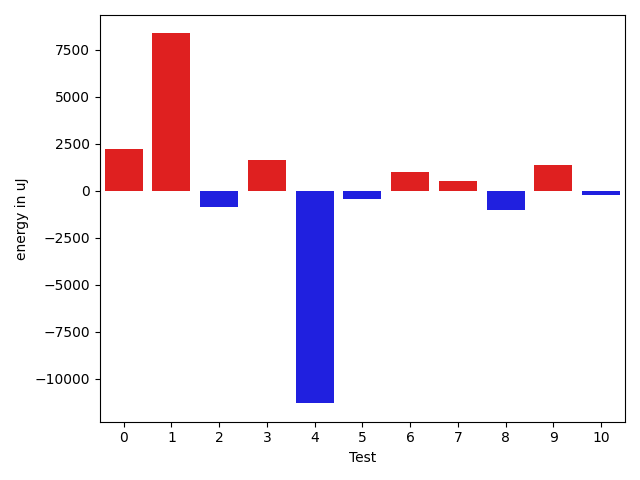

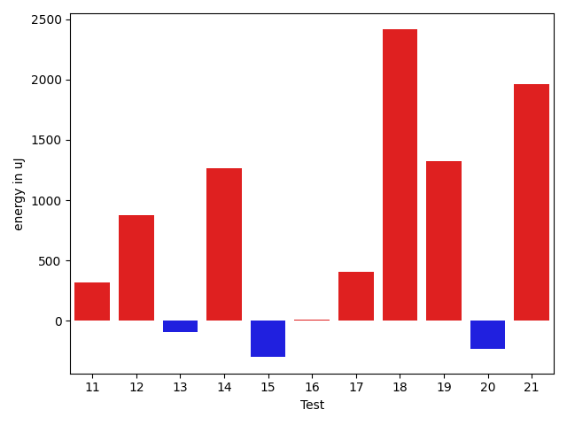

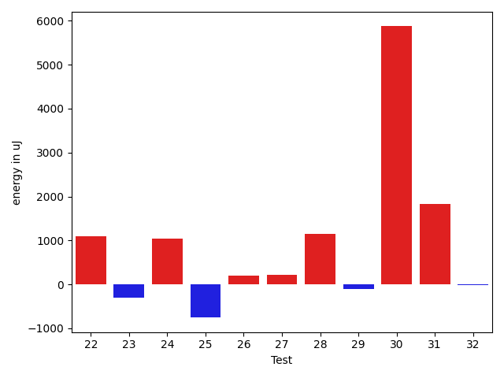

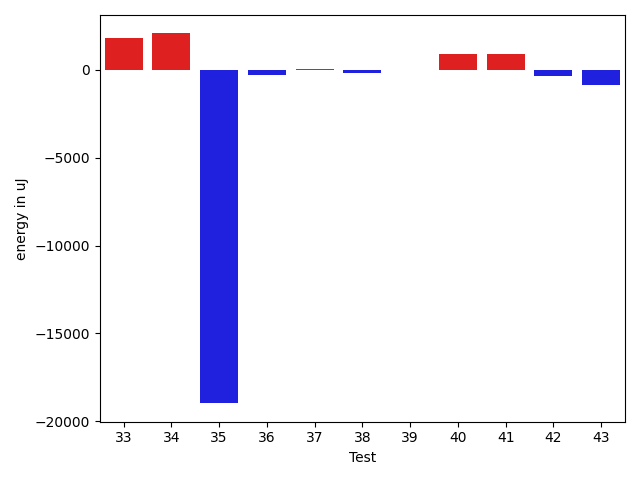

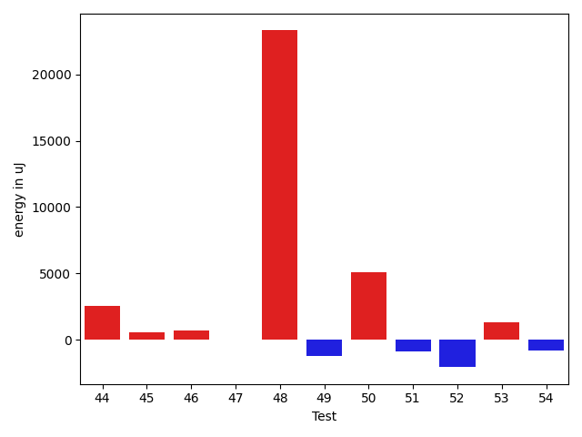

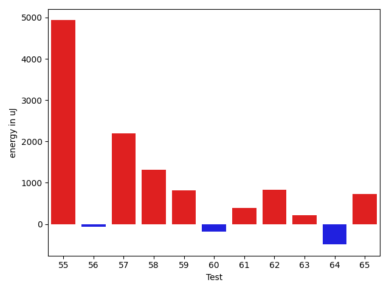

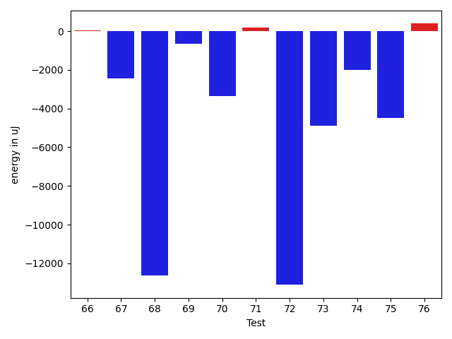

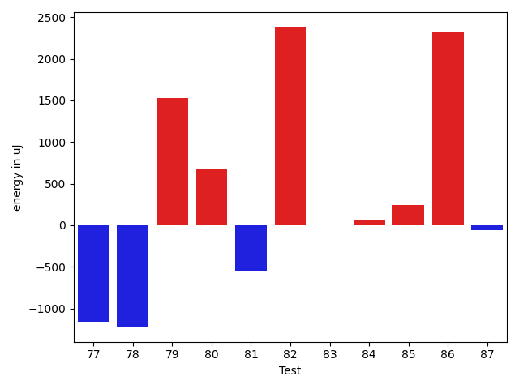

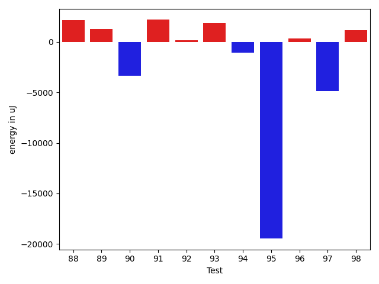

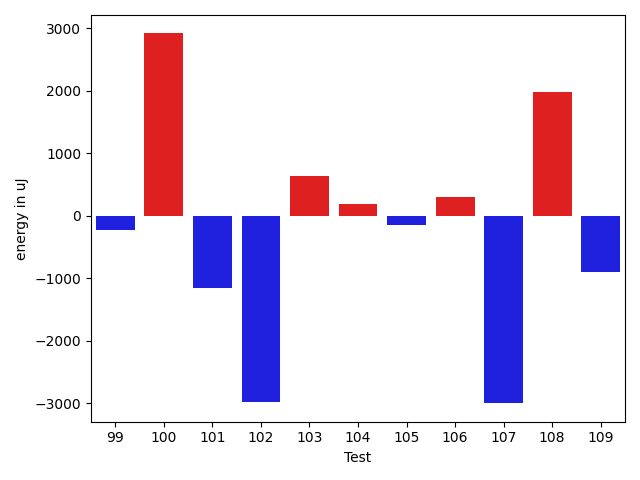

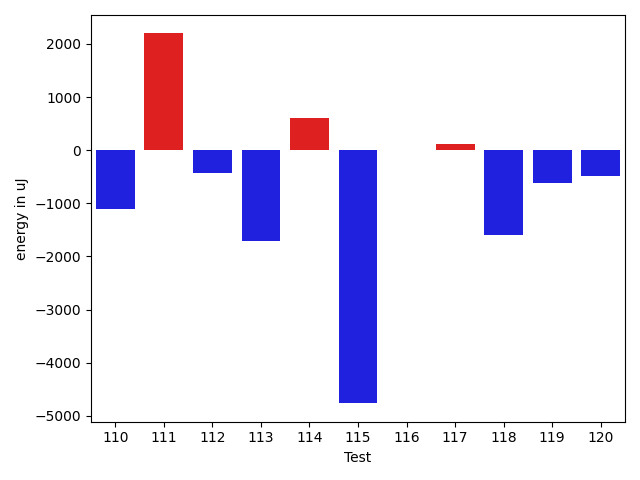

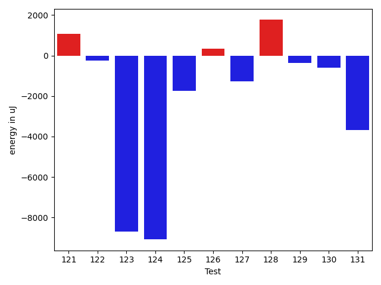

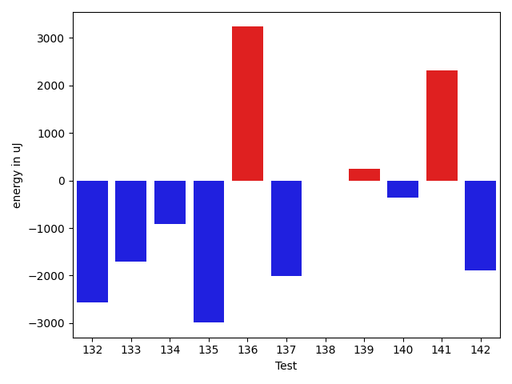

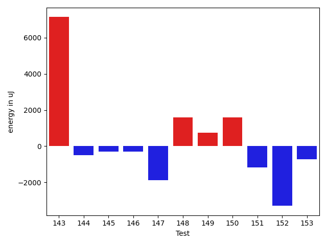

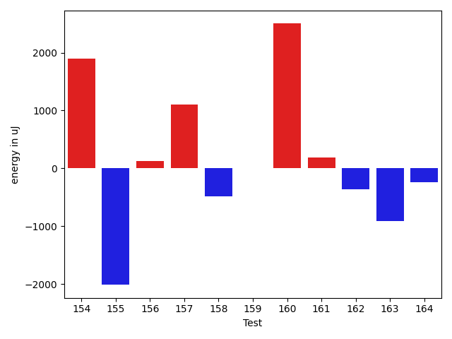

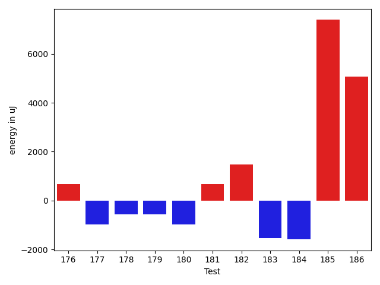

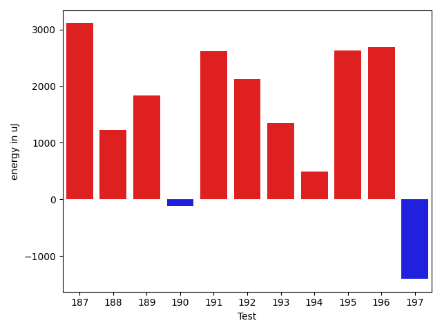

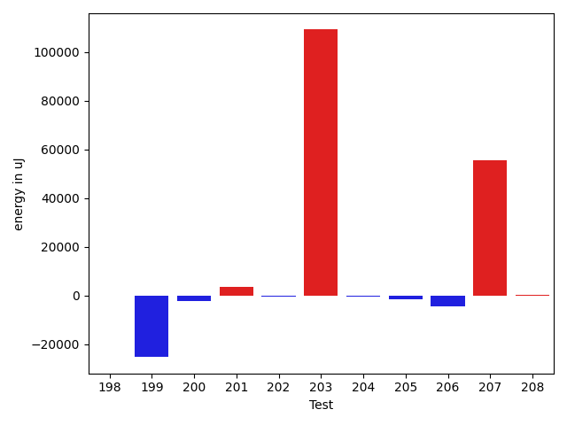

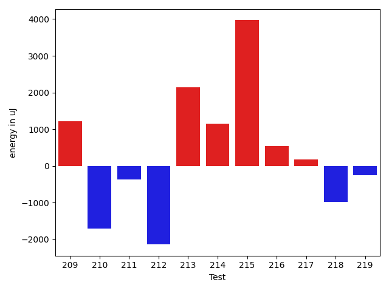

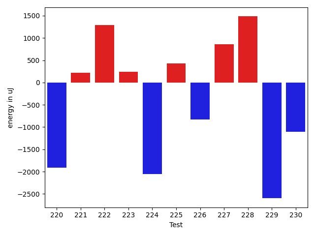

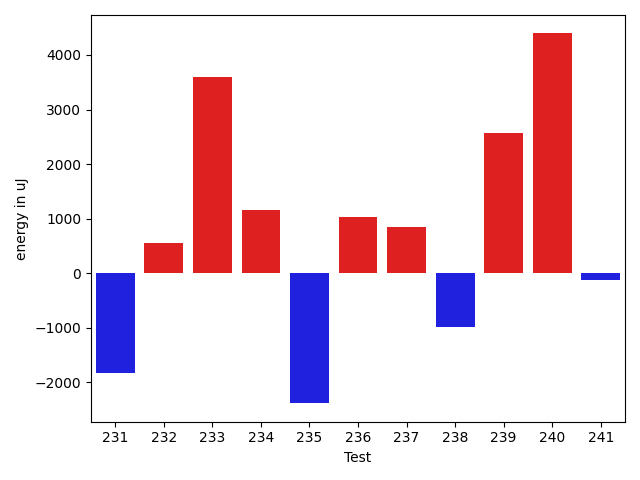

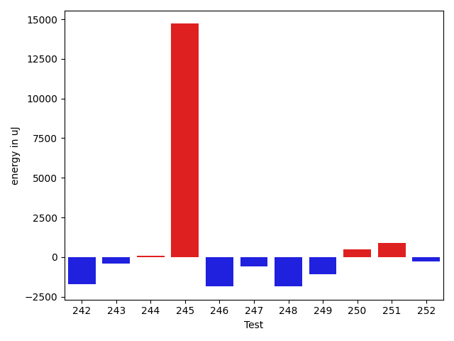

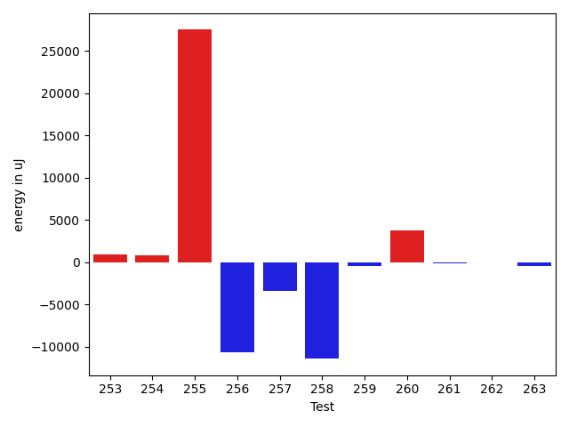

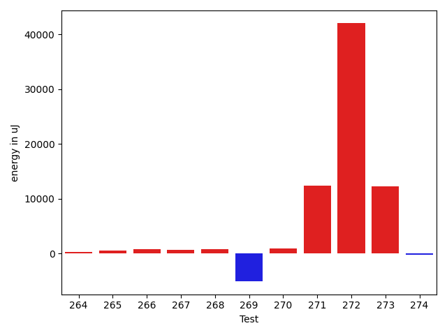

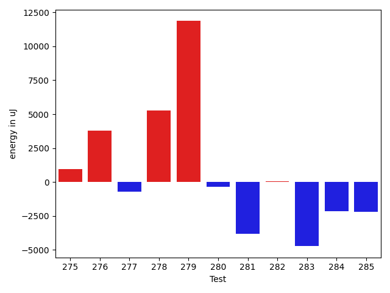

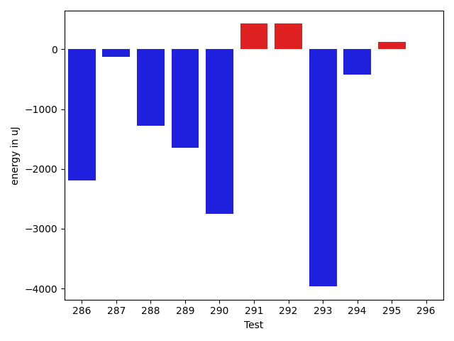

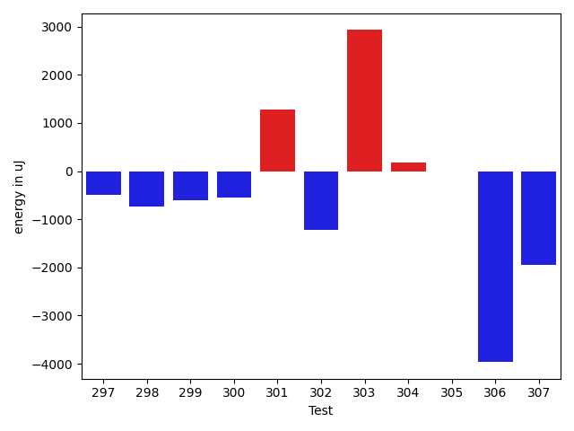

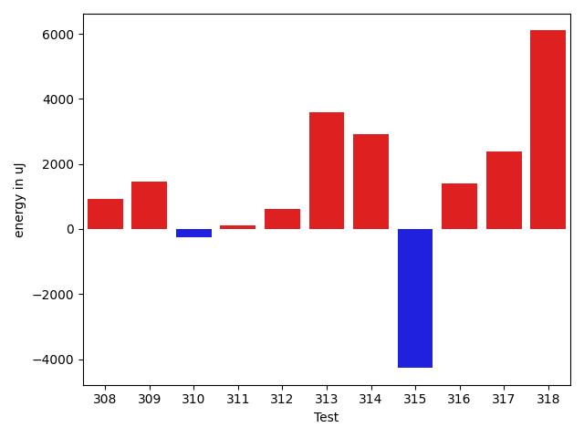

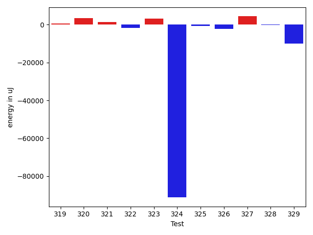

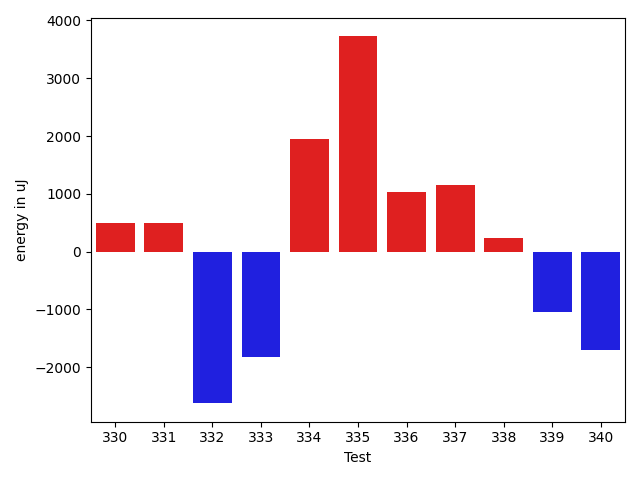

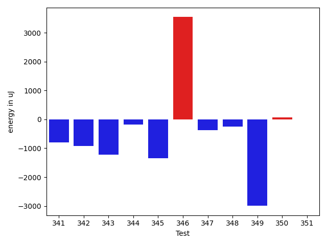

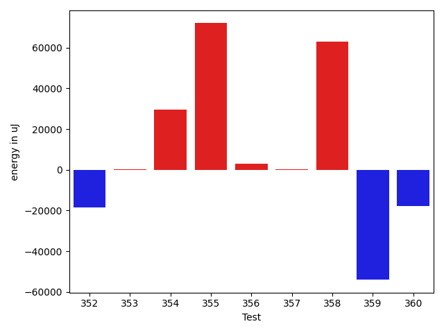

| ID | EnergyV1 | EnergyV2 | DeltaEnergy | σV1 | σV2 |
| --- | --- | --- | --- | --- | --- |
| 0 | 36499 | 37781 | 1282 | 7128.110630741527 | 10904.723845705863 |
| 1 | 37719 | 40161 | 2442 | 21218.71612238355 | 32667.337284765712 |
| 2 | 36254 | 35767 | -487 | 4013.845983869115 | 4867.796629550855 |
| 3 | 35462 | 36194 | 732 | 3747.861402631284 | 3959.1614008663046 |
| 4 | 36927 | 35462 | -1465 | 33744.819205384425 | 4063.726194434528 |
| 5 | 39673 | 38513 | -1160 | 3952.895750789413 | 4203.3126428251 |
| 6 | 37475 | 36621 | -854 | 4168.126517593566 | 3500.631512477368 |
| 7 | 35827 | 38757 | 2930 | 4367.193284409451 | 4245.385663705213 |
| 8 | 36682 | 36743 | 61 | 3435.162134742225 | 5403.843671560704 |
| 9 | 35766 | 35950 | 184 | 3662.566391807043 | 4566.193365831836 |
| 10 | 36865 | 38391 | 1526 | 2899.439068007967 | 4200.622867173655 |
| 11 | 35156 | 37720 | 2564 | 4853.364368794187 | 3650.0170218781172 |
| 12 | 35889 | 36804 | 915 | 3600.6578651308146 | 4187.927090525282 |
| 13 | 35217 | 34667 | -550 | 2697.8274098724987 | 4504.417095595583 |
| 14 | 36316 | 36316 | 0 | 4907.540795477891 | 3759.3159071785117 |
| 15 | 38696 | 37780 | -916 | 4192.862463491392 | 4670.498561181665 |
| 16 | 40528 | 41931 | 1403 | 70338.03999708718 | 62277.14172944973 |
| 17 | 36865 | 37476 | 611 | 4255.8716396554 | 2853.3769077669667 |
| 18 | 35889 | 37536 | 1647 | 4630.400896490737 | 4470.098875772624 |
| 19 | 36315 | 37659 | 1344 | 4465.823440307509 | 5558.819880266641 |
| 20 | 38086 | 35523 | -2563 | 4242.023567704679 | 4648.190375258789 |
| 21 | 36804 | 37049 | 245 | 4094.481922004427 | 7746.629939287129 |
| 22 | 37170 | 39428 | 2258 | 4316.638547172878 | 4776.452548701808 |
| 23 | 37170 | 38086 | 916 | 3616.0745627068522 | 4639.328432602671 |
| 24 | 38330 | 38391 | 61 | 4277.776258657738 | 3997.5879702949524 |
| 25 | 37171 | 37109 | -62 | 4866.332362188157 | 3295.194332281482 |
| 26 | 35156 | 35095 | -61 | 4571.162323099782 | 4425.54649941965 |
| 27 | 36560 | 36316 | -244 | 4276.91306997971 | 2505.3254443728906 |
| 28 | 36682 | 37293 | 611 | 4151.461700413482 | 2687.356853330584 |
| 29 | 36927 | 36438 | -489 | 5177.210010961503 | 4270.642343335644 |
| 30 | 34485 | 42663 | 8178 | 4104.472772939498 | 5185.444665615986 |
| 31 | 34423 | 36438 | 2015 | 3946.7675330579077 | 4982.109474542539 |
| 32 | 36621 | 35461 | -1160 | 3487.2081038238885 | 5140.746291128562 |
| 33 | 37232 | 39062 | 1830 | 3867.5015297533664 | 3888.575253225788 |
| 34 | 34851 | 36926 | 2075 | 4710.487635054358 | 4117.905242015923 |
| 35 | 62928 | 43945 | -18983 | 112937.30765407074 | 65319.37926709464 |
| 36 | 38635 | 38330 | -305 | 99079.42782219777 | 11643.66928180158 |
| 37 | 38208 | 38269 | 61 | 5437.166735370602 | 5107.3651912186715 |
| 38 | 38940 | 38757 | -183 | 11026.884269861639 | 10365.387750101561 |
| 39 | 38391 | 38391 | 0 | 7889.557253377467 | 3943.003484401501 |
| 40 | 37110 | 38025 | 915 | 3086.952983156952 | 4758.59876004713 |
| 41 | 37110 | 38025 | 915 | 3976.9329284194337 | 3910.952975022777 |
| 42 | 39795 | 39428 | -367 | 68642.2486065163 | 55659.005356288544 |
| 43 | 39246 | 38391 | -855 | 4305.043988385657 | 3916.7788698821832 |
| 44 | 33874 | 36438 | 2564 | 3915.9447209902282 | 3350.606872676189 |
| 45 | 37842 | 38391 | 549 | 16565.57269891399 | 16830.232029861738 |
| 46 | 75867 | 76538 | 671 | 21020.935702892006 | 22993.308107263285 |
| 47 | 36621 | 36621 | 0 | 4195.8606706530345 | 4628.805583247152 |
| 48 | 106079 | 129394 | 23315 | 76392.15394593304 | 78831.04848401599 |
| 49 | 37171 | 35950 | -1221 | 9229.80929669903 | 5820.613504560371 |
| 50 | 40406 | 45471 | 5065 | 25280.19064813799 | 31841.227491596735 |
| 51 | 36438 | 35522 | -916 | 3936.2338666503465 | 4055.86568935524 |
| 52 | 38391 | 36315 | -2076 | 4304.998880473901 | 4071.330199068082 |
| 53 | 36010 | 37293 | 1283 | 4414.4661044683535 | 3690.4608965288962 |
| 54 | 38514 | 37658 | -856 | 7635.405525933416 | 21121.65376115955 |
| 55 | 37354 | 36194 | -1160 | 5682.570092601648 | 35277.754580272274 |
| 56 | 36010 | 35705 | -305 | 3466.979562954017 | 4413.821843876625 |
| 57 | 35278 | 37048 | 1770 | 4528.067314721393 | 4404.838981629367 |
| 58 | 36316 | 38147 | 1831 | 4299.3501014600515 | 3731.341936837202 |
| 59 | 37231 | 36621 | -610 | 9260.060500135669 | 10877.666617358665 |
| 60 | 37598 | 37658 | 60 | 4545.58020339093 | 5093.7997712292345 |
| 61 | 38330 | 37719 | -611 | 5202.736127191506 | 4355.862458362619 |
| 62 | 35400 | 36682 | 1282 | 4507.8232404192495 | 3985.277440752797 |
| 63 | 37292 | 36926 | -366 | 4393.887571773819 | 4251.67420785198 |
| 64 | 37475 | 37597 | 122 | 4323.167899805066 | 3956.488575604495 |
| 65 | 36865 | 37598 | 733 | 3923.9579671452393 | 4772.498366027967 |
| 66 | 36438 | 36621 | 183 | 3811.9827060054317 | 3336.7286520864636 |
| 67 | 37354 | 37475 | 121 | 10091.552509138091 | 6658.08298558015 |
| 68 | 71289 | 70068 | -1221 | 86583.41763956026 | 49735.04769022858 |
| 69 | 37659 | 36743 | -916 | 4293.497086516642 | 3956.619587931091 |
| 70 | 73975 | 71411 | -2564 | 28490.261003116688 | 29114.958786515497 |
| 71 | 37537 | 37414 | -123 | 5531.884213057647 | 4640.781980860826 |
| 72 | 38818 | 37841 | -977 | 68484.73948043224 | 56407.2345715955 |
| 73 | 43274 | 39856 | -3418 | 19834.322637421184 | 20402.700731460693 |
| 74 | 39062 | 37598 | -1464 | 14294.787596795553 | 15622.38627866372 |
| 75 | 73974 | 72509 | -1465 | 29560.96830634361 | 31306.165429936285 |
| 76 | 37415 | 37537 | 122 | 4568.1485917893115 | 8064.588496350754 |
| 77 | 38269 | 37109 | -1160 | 3954.2076486393967 | 3209.49334413419 |
| 78 | 37415 | 36194 | -1221 | 4483.558252216693 | 4288.185021868694 |
| 79 | 35766 | 37293 | 1527 | 4437.073151401905 | 3704.6729949315363 |
| 80 | 38453 | 39124 | 671 | 189861.32180136335 | 288023.95963437634 |
| 81 | 80932 | 80383 | -549 | 23653.03099812852 | 32661.705570965027 |
| 82 | 35522 | 37903 | 2381 | 6960.744169242857 | 8777.270570829482 |
| 83 | 37048 | 37048 | 0 | 4473.751119522305 | 3818.8775553218934 |
| 84 | 36682 | 36743 | 61 | 7712.970908758505 | 3400.836868951897 |
| 85 | 37476 | 37719 | 243 | 7120.4505675207065 | 3680.1313121751614 |
| 86 | 36987 | 39307 | 2320 | 17254.000517161603 | 25751.738362034255 |
| 87 | 37353 | 37292 | -61 | 5001.002443665468 | 4337.497890812873 |
| 88 | 36499 | 38636 | 2137 | 32555.414094652144 | 31889.753624779474 |
| 89 | 37475 | 38757 | 1282 | 4923.87746378475 | 3641.46634548896 |
| 90 | 40100 | 36743 | -3357 | 4968.923581873643 | 3515.030425030328 |
| 91 | 36927 | 39123 | 2196 | 4610.797039110762 | 3862.741225101213 |
| 92 | 37109 | 37292 | 183 | 4550.797309361475 | 3408.753106312617 |
| 93 | 77942 | 79834 | 1892 | 26973.31729455742 | 33450.41174433468 |
| 94 | 116699 | 115661 | -1038 | 33445.560297329226 | 28762.50542529224 |
| 95 | 188171 | 168700 | -19471 | 310907.4549349188 | 292249.7009108027 |
| 96 | 42724 | 43090 | 366 | 67926.03966286521 | 51534.64405030775 |
| 97 | 40588 | 35705 | -4883 | 12640.33254873149 | 10575.548859357923 |
| 98 | 37231 | 38391 | 1160 | 18062.1111132605 | 20080.16337379139 |
| 99 | 37720 | 37781 | 61 | 7795.6587832709365 | 6013.348525246477 |
| 100 | 36743 | 36927 | 184 | 4695.55208007905 | 10131.370954591988 |
| 101 | 39001 | 36621 | -2380 | 4078.339037655259 | 3528.1435025201285 |
| 102 | 38269 | 34851 | -3418 | 5354.909224253946 | 3776.6498986201254 |
| 103 | 36743 | 34973 | -1770 | 6176.102861927356 | 18755.074925324756 |
| 104 | 41870 | 42419 | 549 | 17886.784481956754 | 17942.206677431506 |
| 105 | 34912 | 35522 | 610 | 3987.393772903428 | 4895.396798789655 |
| 106 | 36865 | 36377 | -488 | 4695.549333887133 | 4833.4291446181705 |
| 107 | 37475 | 36255 | -1220 | 4796.785568731162 | 3202.0801225314635 |
| 108 | 37537 | 36194 | -1343 | 4731.302252361815 | 24076.305881536482 |
| 109 | 37658 | 35705 | -1953 | 4973.982492400907 | 4388.318185028925 |
| 110 | 37232 | 36132 | -1100 | 4179.027256062537 | 4171.734477368113 |
| 111 | 44007 | 46203 | 2196 | 21502.154642328904 | 19982.698405279796 |
| 112 | 36438 | 36011 | -427 | 4164.785413431352 | 4894.824648418514 |
| 113 | 37109 | 35400 | -1709 | 4246.225863640324 | 4994.384463214662 |
| 114 | 36377 | 36987 | 610 | 4062.1282852755126 | 5215.762520349745 |
| 115 | 38879 | 34118 | -4761 | 4710.535706955509 | 5027.873001847905 |
| 116 | 36865 | 36865 | 0 | 4475.685219109534 | 4421.709787377161 |
| 117 | 37293 | 37415 | 122 | 19734.208902935316 | 12075.253208158978 |
| 118 | 36682 | 35095 | -1587 | 10038.786367840012 | 10568.141278033836 |
| 119 | 37232 | 36621 | -611 | 4416.073452717461 | 4808.440273266399 |
| 120 | 38391 | 37902 | -489 | 4449.146667899948 | 36663.223404758355 |
| 121 | 36682 | 36011 | -671 | 5025.395321345622 | 4381.461919902484 |
| 122 | 36133 | 35156 | -977 | 3906.0450054354897 | 5154.663433170122 |
| 123 | 38757 | 37781 | -976 | 43160.157010737224 | 23312.398538400616 |
| 124 | 38574 | 39246 | 672 | 86505.38392182917 | 73663.44296342027 |
| 125 | 38025 | 33753 | -4272 | 4233.878640229553 | 5044.070422882882 |
| 126 | 37720 | 38574 | 854 | 4879.504315361998 | 3949.9746049768723 |
| 127 | 36438 | 34484 | -1954 | 4292.660333380429 | 4909.944692433141 |
| 128 | 36071 | 38208 | 2137 | 8447.642932086126 | 16017.348239575242 |
| 129 | 35706 | 36133 | 427 | 4970.689246384347 | 4117.468529308238 |
| 130 | 37231 | 37902 | 671 | 3910.7810174527144 | 3816.2149460136143 |
| 131 | 37415 | 37964 | 549 | 27429.089867183724 | 3996.1017078366513 |
| 132 | 37597 | 35034 | -2563 | 5185.25084568489 | 5032.661840479378 |
| 133 | 36804 | 35096 | -1708 | 4194.6771031868475 | 4357.050228234467 |
| 134 | 36560 | 35645 | -915 | 4631.5419919648075 | 3909.5387405140577 |
| 135 | 39733 | 36743 | -2990 | 3820.360982943889 | 3450.541632201466 |
| 136 | 34546 | 37780 | 3234 | 4352.249870578482 | 4339.359913235732 |
| 137 | 37170 | 35156 | -2014 | 5081.288901003711 | 5026.276910422556 |
| 138 | 35583 | 35583 | 0 | 4666.057681812345 | 4775.60261726462 |
| 139 | 37842 | 38086 | 244 | 10457.683147929212 | 8305.688623664153 |
| 140 | 39490 | 39123 | -367 | 7195.718359792269 | 7256.827700376744 |
| 141 | 40406 | 42725 | 2319 | 101398.7257590361 | 97337.51563033115 |
| 142 | 40650 | 38758 | -1892 | 54118.85810694827 | 36813.57752387924 |
| 143 | 122070 | 129211 | 7141 | 68856.96493924804 | 94633.97490405661 |
| 144 | 38513 | 38025 | -488 | 4043.272318646747 | 4122.900943677953 |
| 145 | 37292 | 36987 | -305 | 3231.5870538446716 | 4294.148915287716 |
| 146 | 39368 | 39063 | -305 | 36433.928039114515 | 7624.471483322631 |
| 147 | 38757 | 36865 | -1892 | 4167.507690858061 | 4114.669117723454 |
| 148 | 38514 | 40100 | 1586 | 19021.769917386762 | 46100.78777497821 |
| 149 | 38207 | 38941 | 734 | 3981.765487200587 | 4419.390552377369 |
| 150 | 37903 | 39490 | 1587 | 4510.757710665776 | 4388.635424799632 |
| 151 | 42603 | 41443 | -1160 | 31600.065966311453 | 41873.89077266101 |
| 152 | 39367 | 36071 | -3296 | 4668.954323210094 | 4904.056345287552 |
| 153 | 37171 | 36438 | -733 | 3564.7955186579425 | 56684.65720257123 |
| 154 | 37415 | 39307 | 1892 | 4597.155669206078 | 4847.622396501554 |
| 155 | 40527 | 38513 | -2014 | 15860.088328345742 | 15478.81850389315 |
| 156 | 38513 | 38636 | 123 | 13704.58126370607 | 14228.834308943919 |
| 157 | 37658 | 38757 | 1099 | 3443.315697708074 | 4467.547021107049 |
| 158 | 40222 | 39734 | -488 | 84597.80199743668 | 69824.544471633 |
| 159 | 38453 | 38452 | -1 | 33259.62652122481 | 21606.654128313683 |
| 160 | 36804 | 39306 | 2502 | 4388.015649703271 | 3971.6274374065947 |
| 161 | 38330 | 38513 | 183 | 2238.951886714051 | 4865.280881837306 |
| 162 | 38330 | 37964 | -366 | 4110.705935633951 | 4369.968904334683 |
| 163 | 41321 | 40405 | -916 | 59882.031339921974 | 14110.067991016598 |
| 164 | 37475 | 37231 | -244 | 3973.119824470437 | 4006.218268358909 |
| 165 | 38025 | 36804 | -1221 | 4252.974050554665 | 3745.5578227214614 |
| 166 | 39428 | 38818 | -610 | 21702.81953354448 | 4205.751447926463 |
| 167 | 38574 | 38574 | 0 | 3366.454249810397 | 3858.7408217305733 |
| 168 | 38330 | 38208 | -122 | 4190.464784031211 | 4472.665551035801 |
| 169 | 72815 | 72022 | -793 | 21746.138935666844 | 23831.022761993518 |
| 170 | 38147 | 38269 | 122 | 3769.150964531119 | 21677.394751496115 |
| 171 | 38636 | 39977 | 1341 | 6798.5666313210995 | 22011.881345596572 |
| 172 | 38085 | 38452 | 367 | 3590.824830869141 | 4003.586531299155 |
| 173 | 39306 | 39856 | 550 | 31861.13184252582 | 79099.31047783623 |
| 174 | 38880 | 40649 | 1769 | 20763.252365457265 | 30162.350585922493 |
| 175 | 40710 | 42237 | 1527 | 47118.29579965806 | 244782.73559760815 |
| 176 | 40222 | 40894 | 672 | 41042.891170271425 | 33293.948977920576 |
| 177 | 39246 | 38269 | -977 | 3891.117351984334 | 4519.370793865998 |
| 178 | 39673 | 39123 | -550 | 4638.398636353091 | 4556.982983294386 |
| 179 | 38147 | 37597 | -550 | 3514.758242041691 | 4483.4780348805325 |
| 180 | 38696 | 37719 | -977 | 4847.984519913965 | 6265.102451458613 |
| 181 | 37781 | 38452 | 671 | 4395.632885015967 | 4206.131546128026 |
| 182 | 38757 | 40222 | 1465 | 4089.469471241107 | 4027.793990052601 |
| 183 | 42664 | 41137 | -1527 | 65538.11198295234 | 64217.386651825065 |
| 184 | 37964 | 36377 | -1587 | 5203.839754210347 | 3268.763572055954 |
| 185 | 77392 | 84778 | 7386 | 35530.93376066128 | 39863.500749258375 |
| 186 | 79285 | 84350 | 5065 | 235590.98053515272 | 346062.96480015275 |
| 187 | 34790 | 37903 | 3113 | 3556.3935140345006 | 3788.0008625182195 |
| 188 | 36926 | 38146 | 1220 | 4517.5846996621 | 4021.32021615207 |
| 189 | 36011 | 37842 | 1831 | 4336.080564285251 | 21739.025963051386 |
| 190 | 36804 | 36682 | -122 | 4276.711974330919 | 3934.9730600077514 |
| 191 | 36377 | 39001 | 2624 | 3988.739065969206 | 3996.5207022114864 |
| 192 | 36927 | 39062 | 2135 | 3287.7695575413795 | 4314.664299183476 |
| 193 | 38880 | 40222 | 1342 | 35365.937019993005 | 48146.449246339056 |
| 194 | 37049 | 37536 | 487 | 4663.586366132688 | 4256.1752488266375 |
| 195 | 33691 | 36316 | 2625 | 4831.026869471468 | 3064.94922711501 |
| 196 | 36133 | 38819 | 2686 | 4631.331789372329 | 3666.2319366873885 |
| 197 | 38758 | 37353 | -1405 | 4068.288686844405 | 3781.188588639443 |
| 198 | 38452 | 37842 | -610 | 4531.261090204813 | 4388.172448165894 |
| 199 | 39489 | 39611 | 122 | 445541.53040726227 | 349812.30136812024 |
| 200 | 39917 | 39062 | -855 | 6385.16302055388 | 4291.325965625613 |
| 201 | 36072 | 39368 | 3296 | 6126.4230354411275 | 4439.235143315601 |
| 202 | 37231 | 38757 | 1526 | 4240.127411898821 | 5208.4255367926735 |
| 203 | 39367 | 39856 | 489 | 312015.2603991305 | 551716.1904080486 |
| 204 | 39306 | 38025 | -1281 | 5365.545373680554 | 3944.8917001663895 |
| 205 | 38330 | 37720 | -610 | 4075.802371721835 | 4103.093603611791 |
| 206 | 38635 | 38086 | -549 | 25514.464726650647 | 4770.899333052065 |
| 207 | 80689 | 76782 | -3907 | 321146.1102959558 | 502394.8751907664 |
| 208 | 40405 | 39734 | -671 | 19473.158597702728 | 22719.34659625178 |
| 209 | 41016 | 42236 | 1220 | 27287.183850848367 | 32935.6004770252 |
| 210 | 36316 | 34607 | -1709 | 4549.522297877975 | 3554.485153813438 |
| 211 | 37231 | 36865 | -366 | 24095.82786034293 | 17027.203193550722 |
| 212 | 40283 | 38147 | -2136 | 56312.18453809054 | 68369.7881398139 |
| 213 | 35279 | 37414 | 2135 | 4077.004697112266 | 4536.818420654009 |
| 214 | 37658 | 38818 | 1160 | 35142.40655004757 | 23933.962988842628 |
| 215 | 34668 | 38635 | 3967 | 12738.412241022119 | 17582.662081701015 |
| 216 | 40344 | 40893 | 549 | 92980.49472518332 | 76650.85228134516 |
| 217 | 35950 | 36133 | 183 | 4120.840753841201 | 4355.357818582895 |
| 218 | 36071 | 35095 | -976 | 10752.666081273606 | 4418.871870109434 |
| 219 | 37048 | 36804 | -244 | 4949.067231056408 | 6516.579112554187 |
| 220 | 38391 | 36194 | -2197 | 3597.5074819714046 | 3815.3714250530197 |
| 221 | 36804 | 37659 | 855 | 3912.0948013021107 | 4041.1224344991383 |
| 222 | 35095 | 35339 | 244 | 3683.3023879943603 | 5937.618499346937 |
| 223 | 35156 | 35644 | 488 | 4822.948115763194 | 3734.650300951884 |
| 224 | 35095 | 35034 | -61 | 4352.980371602376 | 2762.4477508884925 |
| 225 | 38635 | 36316 | -2319 | 4159.049622209382 | 4692.6092546987065 |
| 226 | 39245 | 38880 | -365 | 4782.427007928903 | 4608.3053768474365 |
| 227 | 35828 | 37719 | 1891 | 4908.045429467444 | 4746.183901304289 |
| 228 | 35705 | 36438 | 733 | 4612.493639589663 | 4403.222626094381 |
| 229 | 38147 | 35827 | -2320 | 4923.759503508797 | 4295.834406270073 |
| 230 | 38575 | 37414 | -1161 | 2961.361567477591 | 3568.122683598071 |
| 231 | 39672 | 37842 | -1830 | 2579.3092817833517 | 3654.2806414946735 |
| 232 | 34790 | 35340 | 550 | 3504.0441278614057 | 3838.9817234480115 |
| 233 | 36865 | 40466 | 3601 | 5365.578136584717 | 3001.005173271116 |
| 234 | 37292 | 38452 | 1160 | 3331.6153364396678 | 3289.1732024257335 |
| 235 | 167846 | 165466 | -2380 | 282540.67739371146 | 479333.4681256683 |
| 236 | 36499 | 37536 | 1037 | 4447.74170115467 | 5090.595888498713 |
| 237 | 35828 | 36682 | 854 | 4363.087987881978 | 4086.6007955734863 |
| 238 | 38208 | 37231 | -977 | 9264.571046353814 | 5920.461699116875 |
| 239 | 38269 | 40832 | 2563 | 37580.18519005979 | 58168.09821280188 |
| 240 | 39063 | 43457 | 4394 | 33568.182950981914 | 44134.81341471487 |
| 241 | 36499 | 36377 | -122 | 4445.743877090723 | 3867.9428655057272 |
| 242 | 37720 | 36560 | -1160 | 8794.23999933892 | 4961.328715768903 |
| 243 | 37963 | 37232 | -731 | 4012.1595708207315 | 4044.7254942794416 |
| 244 | 38086 | 38880 | 794 | 15358.141136501501 | 13373.945345154563 |
| 245 | 37842 | 41321 | 3479 | 13442.85493836299 | 36050.84399580033 |
| 246 | 37719 | 38330 | 611 | 16985.320038490558 | 4292.792874298236 |
| 247 | 37537 | 36926 | -611 | 7550.361131677742 | 5772.303225533114 |
| 248 | 38757 | 38818 | 61 | 61293.90154780226 | 51149.07904486672 |
| 249 | 38452 | 36804 | -1648 | 3773.6208649119435 | 4769.306275615029 |
| 250 | 36682 | 37719 | 1037 | 4365.734968720823 | 6768.644794150081 |
| 251 | 37110 | 39245 | 2135 | 3238.85264891828 | 4691.787829295349 |
| 252 | 38879 | 39490 | 611 | 16524.399689304806 | 17365.73838166099 |
| 253 | 38208 | 39246 | 1038 | 3941.66557461152 | 4251.4937204369635 |
| 254 | 37415 | 37781 | 366 | 4481.20542965375 | 3909.077905655327 |
| 255 | 37049 | 39428 | 2379 | 4026.9778792832576 | 47381.27382563541 |
| 256 | 39429 | 38146 | -1283 | 28393.653033573497 | 4109.558585460729 |
| 257 | 39307 | 36682 | -2625 | 3329.3923481865672 | 2552.2268951971087 |
| 258 | 38025 | 37536 | -489 | 27997.641035743116 | 3781.1900384032197 |
| 259 | 39306 | 35949 | -3357 | 3872.8773241823824 | 4192.733712552587 |
| 260 | 41748 | 44433 | 2685 | 81512.18138791421 | 81051.99301670623 |
| 261 | 37781 | 36743 | -1038 | 4230.421525834266 | 4090.7283909058624 |
| 262 | 38391 | 38086 | -305 | 5887.22445456338 | 5539.102747581407 |
| 263 | 37658 | 35584 | -2074 | 4070.7129116869687 | 3379.9164294318416 |
| 264 | 37109 | 37293 | 184 | 4701.585566234918 | 4537.500859862666 |
| 265 | 37292 | 37170 | -122 | 4285.748244793607 | 3898.479494199119 |
| 266 | 39856 | 41199 | 1343 | 62390.921344105445 | 59014.483848763346 |
| 267 | 39368 | 36927 | -2441 | 5649.308109358534 | 13144.498667984755 |
| 268 | 39611 | 39551 | -60 | 4628.485548117851 | 7133.319599363725 |
| 269 | 38758 | 40344 | 1586 | 115264.3436538328 | 81162.07824332509 |
| 270 | 38757 | 39917 | 1160 | 3834.564880148621 | 3947.420384200295 |
| 271 | 38330 | 40405 | 2075 | 41213.35773997701 | 70445.9731516906 |
| 272 | 254943 | 275878 | 20935 | 130235.71005568637 | 178275.75892770465 |
| 273 | 354430 | 379393 | 24963 | 118854.81629622034 | 108205.2092430447 |
| 274 | 39551 | 39734 | 183 | 34336.848834166296 | 41350.72290098476 |
| 275 | 38147 | 37964 | -183 | 4935.650045928992 | 10772.66327000868 |
| 276 | 37598 | 39368 | 1770 | 5631.852610961798 | 11893.043090229321 |
| 277 | 38391 | 38696 | 305 | 41513.37114229248 | 36995.19310709483 |
| 278 | 39307 | 39123 | -184 | 77991.67813089317 | 87615.17089447474 |
| 279 | 39978 | 41687 | 1709 | 50274.721560376085 | 56260.64180536462 |
| 280 | 38025 | 37537 | -488 | 4004.155653559672 | 4043.5231893170067 |
| 281 | 39367 | 38208 | -1159 | 22492.576686562705 | 18446.34800940806 |
| 282 | 38818 | 37170 | -1648 | 4024.9812532038777 | 4023.28980683998 |
| 283 | 40711 | 36988 | -3723 | 9406.407962603396 | 3729.9778091293283 |
| 284 | 40100 | 36560 | -3540 | 4030.5773650547403 | 4084.172956670665 |
| 285 | 38147 | 37231 | -916 | 8926.084966732802 | 4241.892424095642 |
| 286 | 37720 | 35522 | -2198 | 4438.967648659062 | 4939.858147200464 |
| 287 | 38757 | 38635 | -122 | 3639.508684305891 | 3799.9467673131394 |
| 288 | 39734 | 38452 | -1282 | 33635.963076642816 | 9724.397331084641 |
| 289 | 38208 | 36560 | -1648 | 4926.475550645828 | 4610.25450083337 |
| 290 | 39307 | 36560 | -2747 | 4951.831571061687 | 4041.2377263589365 |
| 291 | 37659 | 38086 | 427 | 4624.1986060574745 | 4179.523592828518 |
| 292 | 37232 | 37659 | 427 | 5027.995743832726 | 3425.131678244445 |
| 293 | 114380 | 110413 | -3967 | 23117.399793270833 | 17871.99773562935 |
| 294 | 36865 | 36438 | -427 | 4817.310831117295 | 6609.58387401204 |
| 295 | 37781 | 37903 | 122 | 19586.21437948678 | 12177.776211151562 |
| 296 | 36682 | 36682 | 0 | 3693.3424114705836 | 3724.378757219718 |
| 297 | 36071 | 35584 | -487 | 5686.824337149866 | 3384.045065898802 |
| 298 | 37720 | 36987 | -733 | 3675.2637878116993 | 4177.421959724901 |
| 299 | 36743 | 36133 | -610 | 4436.109721813341 | 3825.527556190885 |
| 300 | 36804 | 36255 | -549 | 4224.221518202171 | 4041.81839255147 |
| 301 | 33630 | 34912 | 1282 | 3649.1554519457477 | 4011.1771487813976 |
| 302 | 38147 | 36926 | -1221 | 6775.978024709524 | 3607.2597155936232 |
| 303 | 34607 | 37537 | 2930 | 5107.450455516485 | 4075.437024418363 |
| 304 | 37048 | 37232 | 184 | 4434.565108484584 | 29102.595088214643 |
| 305 | 37659 | 37659 | 0 | 21245.195831439934 | 19540.03369660006 |
| 306 | 40588 | 36621 | -3967 | 13087.483506234175 | 9430.003532462153 |
| 307 | 36010 | 34057 | -1953 | 3885.283851667043 | 4058.147347767669 |
| 308 | 37598 | 38513 | 915 | 4558.842387686976 | 4594.666300153181 |
| 309 | 38574 | 40039 | 1465 | 37906.58979374571 | 30342.70657435767 |
| 310 | 34607 | 34363 | -244 | 3472.702500948223 | 3807.0539453829065 |
| 311 | 35889 | 36011 | 122 | 6022.30916239776 | 3305.9065717628027 |
| 312 | 35888 | 36499 | 611 | 4295.95771239274 | 4105.221595895075 |
| 313 | 33203 | 36805 | 3602 | 3983.140599897116 | 3595.726726002789 |
| 314 | 34362 | 37292 | 2930 | 4180.48897969783 | 3697.6271795575562 |
| 315 | 34485 | 30212 | -4273 | 1221.0 | 0.0 |
| 316 | 36133 | 37537 | 1404 | 4340.027310196841 | 4997.930907823256 |
| 317 | 35400 | 37781 | 2381 | 3277.0479795568235 | 3001.6412165812862 |
| 318 | 31372 | 37475 | 6103 | 0.0 | 0.0 |
| 319 | 37048 | 37231 | 183 | 4431.043000037555 | 4180.700269378597 |
| 320 | 34546 | 37658 | 3112 | 3369.208706143856 | 2920.5035610318987 |
| 321 | 36011 | 36866 | 855 | 3244.4632984015334 | 3475.188246259298 |
| 322 | 39856 | 37598 | -2258 | 3930.582360157474 | 3120.94915201569 |
| 323 | 36866 | 36621 | -245 | 4046.52597761339 | 31155.58279564843 |
| 324 | 41809 | 40466 | -1343 | 453873.1426700485 | 33167.909702941564 |
| 325 | 39185 | 38697 | -488 | 5927.395048702009 | 4665.063721745491 |
| 326 | 40161 | 37781 | -2380 | 8205.814293255766 | 5919.486492914471 |
| 327 | 38147 | 39062 | 915 | 21820.32529394699 | 29371.996757841112 |
| 328 | 37719 | 37781 | 62 | 6105.133297140015 | 4360.190929903813 |
| 329 | 40222 | 40161 | -61 | 47961.100750152014 | 37151.91830262253 |
| 330 | 38696 | 39185 | 489 | 102393.60354440389 | 114875.10052150983 |
| 331 | 38452 | 38940 | 488 | 3519.2876167855675 | 5148.272750074123 |
| 332 | 42664 | 40039 | -2625 | 26334.77807112133 | 19940.0674565961 |
| 333 | 40650 | 38819 | -1831 | 107812.37920019962 | 60887.133294647385 |
| 334 | 37353 | 39306 | 1953 | 4732.254766451524 | 4624.262324684879 |
| 335 | 79956 | 83679 | 3723 | 314000.26608318696 | 391713.5994994757 |
| 336 | 37537 | 38575 | 1038 | 4214.251407282409 | 4203.973700725171 |
| 337 | 39063 | 40222 | 1159 | 37461.897103638075 | 4349.5750283792095 |
| 338 | 39123 | 39368 | 245 | 4262.66937043165 | 5785.519356764784 |
| 339 | 41016 | 39978 | -1038 | 53522.07415779492 | 40500.23487555211 |
| 340 | 40100 | 38391 | -1709 | 21531.950946075773 | 15713.071476216906 |
| 341 | 40650 | 39856 | -794 | 531165.3881783366 | 303216.54711489036 |
| 342 | 40161 | 39245 | -916 | 50905.69309594193 | 45527.602101820536 |
| 343 | 38391 | 37171 | -1220 | 4328.297400827708 | 486387.26916340634 |
| 344 | 37537 | 37353 | -184 | 4825.1292222047205 | 5176.005367960991 |
| 345 | 178162 | 176818 | -1344 | 54361.57942025027 | 66491.8248173585 |
| 346 | 81848 | 85387 | 3539 | 229254.69844856163 | 364916.4845835583 |
| 347 | 38086 | 37720 | -366 | 7720.614048135902 | 4503.978889586167 |
| 348 | 39856 | 39611 | -245 | 19441.66457465172 | 22108.52686288426 |
| 349 | 43762 | 40771 | -2991 | 33443.44656865576 | 51592.95791584875 |
| 350 | 39062 | 39124 | 62 | 263424.3048116725 | 266657.8808242419 |
| 351 | 37964 | 37963 | -1 | 4819.329032275099 | 3848.295197745891 |
| 352 | 38330 | 37475 | -855 | 65307.08892286559 | 29808.172918792883 |
| 353 | 38330 | 38941 | 611 | 4301.904545909544 | 3698.1284726567233 |
| 354 | 40222 | 42053 | 1831 | 59262.80099312467 | 110858.57725867756 |
| 355 | 38635 | 39184 | 549 | 258493.60816960724 | 433513.2848825346 |
| 356 | 38940 | 38696 | -244 | 4606.861846773257 | 21119.070547193685 |
| 357 | 39063 | 38879 | -184 | 4489.046250597114 | 4548.200567960916 |
| 358 | 39672 | 38757 | -915 | 4144.899074519202 | 130391.22138046718 |
| 359 | 40527 | 39856 | -671 | 426177.37234050554 | 315198.30502360704 |
| 360 | 42785 | 37110 | -5675 | 38352.592734987884 | 3661.7313184504283 |

## Delta Duration per test method

| ID | DurationV1 | DurationsV2 | DeltaDuration |
| --- | --- | --- | --- |
| 0 | 861118.3965517242 | 910871.4745762711 | 49753.078024546965 |
| 1 | 1003728.1063829787 | 1353296.1666666667 | 349568.060283688 |
| 2 | 345394.6 | 404877.26666666666 | 59482.666666666686 |
| 3 | 407329.73333333334 | 417139.347826087 | 9809.614492753637 |
| 4 | 748515.5714285715 | 324797.6666666667 | -423717.9047619048 |
| 5 | 474813.0588235294 | 592951.1333333333 | 118138.0745098039 |
| 6 | 355269.94444444444 | 374199.5263157895 | 18929.581871345057 |
| 7 | 364561.23529411765 | 360754.0 | -3807.2352941176505 |
| 8 | 428144.7894736842 | 424624.06666666665 | -3520.7228070175624 |
| 9 | 425858.0 | 397869.75 | -27988.25 |
| 10 | 335419.63636363635 | 382108.3333333333 | 46688.69696969696 |
| 11 | 371145.5909090909 | 405154.0 | 34008.40909090912 |
| 12 | 342238.22222222225 | 304958.2 | -37280.02222222224 |
| 13 | 415499.60869565216 | 422255.375 | 6755.766304347839 |
| 14 | 353142.2105263158 | 367167.35294117645 | 14025.14241486066 |
| 15 | 429327.3214285714 | 724450.15 | 295122.8285714286 |
| 16 | 1611876.96875 | 1455902.111111111 | -155974.857638889 |
| 17 | 454077.04545454547 | 385089.77777777775 | -68987.26767676772 |
| 18 | 404246.13333333336 | 443710.85714285716 | 39464.7238095238 |
| 19 | 433774.9090909091 | 448631.26086956525 | 14856.351778656128 |
| 20 | 575987.5 | 581176.8125 | 5189.3125 |
| 21 | 926878.5737704918 | 960055.6610169491 | 33177.08724645735 |
| 22 | 318484.71428571426 | 410151.6 | 91666.88571428572 |
| 23 | 345147.1666666667 | 377816.25 | 32669.083333333314 |
| 24 | 363416.3333333333 | 346450.55555555556 | -16965.777777777752 |
| 25 | 325324.6842105263 | 359339.25 | 34014.56578947371 |
| 26 | 372372.5238095238 | 373966.04347826086 | 1593.5196687370772 |
| 27 | 463451.28571428574 | 431351.5333333333 | -32099.752380952414 |
| 28 | 352913.8888888889 | 392860.14285714284 | 39946.253968253965 |
| 29 | 546977.48 | 556004.4074074074 | 9026.927407407435 |
| 30 | 402737.0 | 313098.36363636365 | -89638.63636363635 |
| 31 | 318792.5 | 356251.5714285714 | 37459.07142857142 |
| 32 | 350084.9375 | 356451.63636363635 | 6366.698863636353 |
| 33 | 337462.0909090909 | 422235.8333333333 | 84773.74242424243 |
| 34 | 476451.4 | 449560.73333333334 | -26890.666666666686 |
| 35 | 2878799.230769231 | 2074981.7586206896 | -803817.4721485414 |
| 36 | 1870569.1842105263 | 950488.9069767442 | -920080.2772337821 |
| 37 | 924830.8870967742 | 831520.1643835617 | -93310.72271321248 |
| 38 | 1165492.9024390243 | 1056762.4133333333 | -108730.48910569097 |
| 39 | 1055826.0 | 784288.4310344828 | -271537.5689655172 |
| 40 | 895193.8070175438 | 833347.2592592592 | -61846.54775828461 |
| 41 | 925243.3333333334 | 789282.5925925926 | -135960.7407407408 |
| 42 | 1327139.3720930233 | 1069000.3777777778 | -258138.99431524542 |
| 43 | 619143.2258064516 | 518391.7 | -100751.52580645162 |
| 44 | 372611.0909090909 | 347293.35294117645 | -25317.737967914436 |
| 45 | 1184228.924528302 | 1216438.6393442622 | 32209.714815960266 |
| 46 | 2191776.373737374 | 2319128.5757575757 | 127352.20202020183 |
| 47 | 804685.1509433963 | 815824.0 | 11138.849056603736 |
| 48 | 3743058.292929293 | 4094303.777777778 | 351245.48484848486 |
| 49 | 967426.8771929825 | 1075863.8196721312 | 108436.94247914874 |
| 50 | 1637423.9494949495 | 1760736.7373737374 | 123312.78787878784 |
| 51 | 660579.8085106383 | 670444.8474576271 | 9865.03894698876 |
| 52 | 608685.6666666666 | 598903.59375 | -9782.072916666628 |
| 53 | 482108.95 | 501687.05263157893 | 19578.10263157892 |
| 54 | 709056.3636363636 | 987705.8823529412 | 278649.51871657756 |
| 55 | 625425.6666666666 | 848827.3793103448 | 223401.71264367818 |
| 56 | 630294.5128205129 | 612100.243902439 | -18194.268918073853 |
| 57 | 425602.2631578947 | 454333.5 | 28731.23684210528 |
| 58 | 479061.44444444444 | 525495.28 | 46433.83555555559 |
| 59 | 1000697.2 | 893501.9302325582 | -107195.26976744179 |
| 60 | 410414.962962963 | 408085.0 | -2329.962962962978 |
| 61 | 348286.71428571426 | 389698.77777777775 | 41412.06349206349 |
| 62 | 382666.3846153846 | 387255.04347826086 | 4588.65886287624 |
| 63 | 747753.7090909091 | 695581.701754386 | -52172.00733652315 |
| 64 | 744368.0 | 753167.8222222222 | 8799.822222222225 |
| 65 | 871089.6885245901 | 805302.5964912281 | -65787.09203336202 |
| 66 | 760544.3064516129 | 740779.5490196078 | -19764.75743200502 |
| 67 | 1155443.191011236 | 1144355.7272727273 | -11087.463738508755 |
| 68 | 2629302.737373737 | 2220894.5757575757 | -408408.16161616147 |
| 69 | 824851.524590164 | 792341.92 | -32509.604590163915 |
| 70 | 2261195.5353535353 | 2129354.414141414 | -131841.1212121211 |
| 71 | 1009264.1756756756 | 922331.2739726028 | -86932.90170307283 |
| 72 | 1705381.3372093022 | 1286157.5875 | -419223.7497093023 |
| 73 | 1633659.252631579 | 1572604.551020408 | -61054.70161117101 |
| 74 | 1197209.736111111 | 1126210.6790123456 | -70999.05709876539 |
| 75 | 2266975.1717171716 | 2176786.232323232 | -90188.93939393945 |
| 76 | 911370.3166666667 | 896067.4090909091 | -15302.907575757592 |
| 77 | 512082.48484848486 | 474045.8333333333 | -38036.65151515155 |
| 78 | 879298.9857142858 | 814095.7368421053 | -65203.24887218047 |
| 79 | 771807.2222222222 | 717846.225 | -53960.99722222227 |
| 80 | 1706522.2833333334 | 2984374.90625 | 1277852.6229166666 |
| 81 | 2561103.777777778 | 2614900.737373737 | 53796.95959595917 |
| 82 | 938271.21875 | 951191.4905660377 | 12920.271816037712 |
| 83 | 683388.8125 | 689311.9772727273 | 5923.164772727294 |
| 84 | 873712.4126984127 | 869533.328358209 | -4179.08434020367 |
| 85 | 799893.5098039216 | 758551.8461538461 | -41341.66365007544 |
| 86 | 966517.7647058824 | 1132482.6984126985 | 165964.93370681605 |
| 87 | 874593.5737704918 | 828895.1785714285 | -45698.395199063234 |
| 88 | 1300125.6666666667 | 1266228.9705882352 | -33896.69607843156 |
| 89 | 746851.1428571428 | 565445.6176470588 | -181405.52521008404 |
| 90 | 377935.125 | 431399.44444444444 | 53464.31944444444 |
| 91 | 580530.4210526316 | 606451.6756756756 | 25921.25462304405 |
| 92 | 476780.0740740741 | 464740.9285714286 | -12039.145502645522 |
| 93 | 2346122.8484848486 | 2285476.909090909 | -60645.93939393945 |
| 94 | 3401566.373737374 | 3214684.606060606 | -186881.7676767679 |
| 95 | 6705030.202020202 | 6028617.5050505055 | -676412.6969696963 |
| 96 | 2082227.9375 | 1847003.612244898 | -235224.325255102 |
| 97 | 749601.3421052631 | 681714.9333333333 | -67886.4087719298 |
| 98 | 871334.3863636364 | 824669.914893617 | -46664.471470019314 |
| 99 | 933398.7894736842 | 867934.28125 | -65464.508223684155 |
| 100 | 650253.4285714285 | 604679.0294117647 | -45574.39915966382 |
| 101 | 672507.5675675676 | 645418.1 | -27089.467567567597 |
| 102 | 390443.64 | 426387.5294117647 | 35943.889411764685 |
| 103 | 1072697.9764705882 | 1163180.168831169 | 90482.19236058067 |
| 104 | 1611753.202020202 | 1648243.4646464647 | 36490.262626262615 |
| 105 | 434912.8695652174 | 379896.84 | -55016.02956521738 |
| 106 | 860351.724137931 | 831475.1746031746 | -28876.549534756457 |
| 107 | 421151.9411764706 | 474195.3333333333 | 53043.39215686271 |
| 108 | 665463.7924528302 | 812423.0172413794 | 146959.22478854912 |
| 109 | 461236.5909090909 | 444149.625 | -17086.965909090883 |
| 110 | 730122.2666666667 | 762827.5471698113 | 32705.280503144604 |
| 111 | 1682373.9494949495 | 1656725.494949495 | -25648.454545454588 |
| 112 | 728816.3125 | 727720.9555555555 | -1095.356944444473 |
| 113 | 530272.9629629629 | 539509.4 | 9236.437037037103 |
| 114 | 553947.7741935484 | 527953.2941176471 | -25994.480075901258 |
| 115 | 531120.1304347826 | 508847.2068965517 | -22272.923538230883 |
| 116 | 678852.375 | 710430.3269230769 | 31577.95192307688 |
| 117 | 1103437.0694444445 | 1168287.9220779222 | 64850.852633477654 |
| 118 | 1006672.8260869565 | 903916.6458333334 | -102756.18025362317 |
| 119 | 469639.71428571426 | 514457.95454545453 | 44818.24025974027 |
| 120 | 438052.6923076923 | 712280.3913043478 | 274227.69899665547 |
| 121 | 408462.72222222225 | 420776.6666666667 | 12313.944444444438 |
| 122 | 573479.3947368421 | 659431.7419354839 | 85952.34719864174 |
| 123 | 1097563.4042553192 | 897505.509090909 | -200057.89516441012 |
| 124 | 1747857.322580645 | 1445184.4736842106 | -302672.84889643453 |
| 125 | 573552.3703703703 | 518347.652173913 | -55204.71819645731 |
| 126 | 492159.9090909091 | 500455.4347826087 | 8295.525691699586 |
| 127 | 746501.4666666667 | 733748.2127659575 | -12753.253900709213 |
| 128 | 806541.4722222222 | 780096.7931034482 | -26444.679118774016 |
| 129 | 622371.2173913043 | 533287.0 | -89084.21739130432 |
| 130 | 474230.8965517241 | 499161.3043478261 | 24930.407796101994 |
| 131 | 673156.8285714285 | 484887.4375 | -188269.39107142854 |
| 132 | 629724.3076923077 | 640669.1944444445 | 10944.88675213675 |
| 133 | 451140.95652173914 | 406931.55555555556 | -44209.40096618357 |
| 134 | 561111.4 | 515673.0 | -45438.40000000002 |
| 135 | 403520.4 | 354584.5 | -48935.90000000002 |
| 136 | 410789.7272727273 | 445484.5833333333 | 34694.85606060602 |
| 137 | 636950.5128205129 | 609129.1666666666 | -27821.346153846243 |
| 138 | 374912.0 | 365029.8888888889 | -9882.111111111124 |
| 139 | 841670.0416666666 | 888816.9019607843 | 47146.86029411771 |
| 140 | 1007913.2058823529 | 990881.4722222222 | -17031.733660130645 |
| 141 | 2418999.9615384615 | 1851197.75 | -567802.2115384615 |
| 142 | 1331274.1 | 1035011.0666666667 | -296263.03333333344 |
| 143 | 3974149.101010101 | 4389648.080808081 | 415498.9797979798 |
| 144 | 634908.9230769231 | 666971.3513513514 | 32062.42827442824 |
| 145 | 479575.3548387097 | 534580.2333333333 | 55004.87849462358 |
| 146 | 780002.9375 | 548649.4333333333 | -231353.50416666665 |
| 147 | 722697.1951219512 | 875301.0454545454 | 152603.85033259424 |
| 148 | 948326.225 | 1414619.9777777777 | 466293.7527777777 |
| 149 | 424142.55555555556 | 503590.0869565217 | 79447.53140096617 |
| 150 | 614990.7073170731 | 654445.6170212766 | 39454.909704203485 |
| 151 | 1878649.2947368422 | 1884336.0860215053 | 5686.791284663137 |
| 152 | 400827.6111111111 | 460364.5714285714 | 59536.960317460296 |
| 153 | 416780.1875 | 768240.8823529412 | 351460.6948529412 |
| 154 | 495027.77777777775 | 531757.2580645161 | 36729.48028673837 |
| 155 | 1271382.1818181819 | 1208438.5217391304 | -62943.66007905151 |
| 156 | 1206821.3670886075 | 1167691.594936709 | -39129.77215189859 |
| 157 | 415819.46153846156 | 395403.0 | -20416.46153846156 |
| 158 | 1854433.425 | 1454898.0263157894 | -399535.3986842106 |
| 159 | 955405.6346153846 | 840025.0204081633 | -115380.61420722131 |
| 160 | 648374.8285714285 | 616312.2903225806 | -32062.538248847937 |
| 161 | 388588.5714285714 | 433503.07692307694 | 44914.505494505516 |
| 162 | 418475.0 | 329558.76923076925 | -88916.23076923075 |
| 163 | 1706894.0416666667 | 1288010.322222222 | -418883.71944444464 |
| 164 | 758131.26 | 694585.3513513514 | -63545.90864864865 |
| 165 | 765113.6111111111 | 714836.2978723404 | -50277.3132387707 |
| 166 | 1065724.78 | 457115.4090909091 | -608609.3709090909 |
| 167 | 472680.1052631579 | 444552.8846153846 | -28127.220647773298 |
| 168 | 700341.775510204 | 732080.1162790698 | 31738.340768865775 |
| 169 | 1962620.8383838383 | 1973888.0612244897 | 11267.222840651404 |
| 170 | 951293.7837837838 | 1086928.0833333333 | 135634.29954954947 |
| 171 | 1138641.2857142857 | 1334699.12 | 196057.83428571443 |
| 172 | 488002.28571428574 | 548023.52 | 60021.23428571428 |
| 173 | 910337.0196078431 | 1686379.2444444445 | 776042.2248366014 |
| 174 | 901126.1041666666 | 1155736.5818181818 | 254610.47765151516 |
| 175 | 1183225.0704225353 | 2592744.8253968256 | 1409519.7549742903 |
| 176 | 1197064.6896551724 | 1279330.1282051282 | 82265.43854995584 |
| 177 | 411131.22222222225 | 389875.71428571426 | -21255.507936507987 |
| 178 | 389121.4166666667 | 351405.64705882355 | -37715.76960784313 |
| 179 | 753985.1875 | 323139.9090909091 | -430845.2784090909 |
| 180 | 370893.8461538461 | 372034.7272727273 | 1140.881118881167 |
| 181 | 464870.6842105263 | 389188.3333333333 | -75682.35087719298 |
| 182 | 512674.6153846154 | 491411.2380952381 | -21263.37728937727 |
| 183 | 1254449.4 | 1105302.9 | -149146.5 |
| 184 | 326740.1666666667 | 340302.7 | 13562.533333333326 |
| 185 | 2609595.5656565656 | 2749682.9292929294 | 140087.36363636376 |
| 186 | 4066689.414141414 | 5008684.181818182 | 941994.7676767674 |
| 187 | 550879.5333333333 | 581737.3214285715 | 30857.788095238153 |
| 188 | 834771.3157894737 | 827892.3833333333 | -6878.932456140406 |
| 189 | 935064.0921052631 | 1021577.5066666667 | 86513.41456140357 |
| 190 | 517188.8888888889 | 503474.17391304346 | -13714.714975845418 |
| 191 | 828856.1333333333 | 887510.5967741936 | 58654.46344086027 |
| 192 | 598161.5862068966 | 551612.65625 | -46548.92995689658 |
| 193 | 915599.7575757576 | 1168609.4242424243 | 253009.66666666674 |
| 194 | 538489.5769230769 | 575363.5357142857 | 36873.9587912088 |
| 195 | 471996.6896551724 | 528343.4615384615 | 56346.7718832891 |
| 196 | 568017.3636363636 | 486007.0 | -82010.36363636365 |
| 197 | 445195.8888888889 | 501567.8095238095 | 56371.92063492065 |
| 198 | 710270.7209302326 | 698458.1111111111 | -11812.609819121426 |
| 199 | 3699240.4166666665 | 2929445.030769231 | -769795.3858974357 |
| 200 | 599598.9655172414 | 714234.2352941176 | 114635.2697768762 |
| 201 | 957532.8571428572 | 514270.6129032258 | -443262.24423963134 |
| 202 | 328860.8888888889 | 485910.7727272727 | 157049.88383838383 |
| 203 | 2692059.4935064935 | 6214565.769230769 | 3522506.2757242755 |
| 204 | 580297.1363636364 | 745056.4583333334 | 164759.32196969702 |
| 205 | 481072.26666666666 | 544713.76 | 63641.49333333335 |
| 206 | 979282.8666666667 | 858826.9344262296 | -120455.93224043713 |
| 207 | 3855638.303030303 | 5623781.747474748 | 1768143.4444444445 |
| 208 | 1446376.6373626373 | 1427208.177777778 | -19168.459584859433 |
| 209 | 1359631.45 | 1149067.7333333334 | -210563.71666666656 |
| 210 | 515474.56666666665 | 508061.8620689655 | -7412.704597701144 |
| 211 | 1197124.4705882352 | 907514.1475409836 | -289610.32304725156 |
| 212 | 1675622.5454545454 | 1596655.7419354839 | -78966.80351906153 |
| 213 | 669214.9696969697 | 634630.0256410256 | -34584.9440559441 |
| 214 | 1440519.4683544303 | 1227422.6933333334 | -213096.77502109692 |
| 215 | 974667.3 | 926550.8888888889 | -48116.41111111117 |
| 216 | 2279068.96875 | 1559857.125 | -719211.84375 |
| 217 | 443600.22222222225 | 432691.85714285716 | -10908.365079365089 |
| 218 | 812912.4772727273 | 782115.1777777778 | -30797.29949494952 |
| 219 | 889110.5882352941 | 838962.8461538461 | -50147.74208144797 |
| 220 | 389421.23076923075 | 403641.44444444444 | 14220.213675213687 |
| 221 | 436663.625 | 439326.5714285714 | 2662.9464285714203 |
| 222 | 394476.7272727273 | 402720.8461538461 | 8244.118881118833 |
| 223 | 491774.5 | 440906.56 | -50867.94 |
| 224 | 342964.0 | 374321.4166666667 | 31357.416666666686 |
| 225 | 393674.15 | 407673.6666666667 | 13999.516666666663 |
| 226 | 451074.61904761905 | 453791.7272727273 | 2717.1082251082407 |
| 227 | 458718.82352941175 | 393300.875 | -65417.94852941175 |
| 228 | 456736.28571428574 | 463317.7878787879 | 6581.5021645021625 |
| 229 | 360393.4347826087 | 399238.0625 | 38844.6277173913 |
| 230 | 437420.5833333333 | 409553.46153846156 | -27867.121794871753 |
| 231 | 396331.625 | 357967.71428571426 | -38363.91071428574 |
| 232 | 461975.9090909091 | 433312.652173913 | -28663.25691699609 |
| 233 | 340231.0714285714 | 354345.5 | 14114.42857142858 |
| 234 | 334143.9166666667 | 378495.86666666664 | 44351.94999999995 |
| 235 | 6435835.787878788 | 10124629.989898989 | 3688794.202020201 |
| 236 | 519280.0689655172 | 602107.7222222222 | 82827.65325670503 |
| 237 | 692016.9 | 780526.0869565217 | 88509.1869565217 |
| 238 | 904843.9836065574 | 976097.8194444445 | 71253.83583788713 |
| 239 | 1121683.641509434 | 1828177.6166666667 | 706493.9751572327 |
| 240 | 1113363.1290322582 | 1949087.5853658537 | 835724.4563335956 |
| 241 | 557816.2413793104 | 687622.8372093023 | 129806.59582999197 |
| 242 | 770602.4146341464 | 905596.0980392157 | 134993.68340506929 |
| 243 | 721542.911111111 | 871236.7962962963 | 149693.88518518524 |
| 244 | 1223132.589041096 | 1241830.9268292682 | 18698.3377881723 |
| 245 | 1140091.4929577464 | 1482130.5 | 342039.0070422536 |
| 246 | 826794.8035714285 | 715405.8478260869 | -111388.9557453416 |
| 247 | 889741.203125 | 918919.45 | 29178.246874999953 |
| 248 | 1345408.1754385964 | 1229750.5294117648 | -115657.64602683159 |
| 249 | 665312.0 | 720607.5675675676 | 55295.567567567574 |
| 250 | 732117.4893617021 | 692470.5 | -39646.989361702115 |
| 251 | 516203.54545454547 | 534526.9545454546 | 18323.409090909117 |
| 252 | 1367200.574468085 | 1431288.3655913977 | 64087.791123312665 |
| 253 | 715040.6052631579 | 721263.0434782609 | 6222.438215103 |
| 254 | 740419.023255814 | 727576.3333333334 | -12842.689922480611 |
| 255 | 587053.2307692308 | 1557744.8125 | 970691.5817307692 |
| 256 | 1274247.3962264152 | 784916.6875 | -489330.7087264152 |
| 257 | 368060.5714285714 | 381233.70588235295 | 13173.134453781531 |
| 258 | 1078610.9285714286 | 574866.1818181818 | -503744.7467532469 |
| 259 | 403723.5882352941 | 439767.1875 | 36043.5992647059 |
| 260 | 2086415.3085106383 | 2172447.425531915 | 86032.11702127662 |
| 261 | 871303.2280701754 | 888442.7 | 17139.47192982456 |
| 262 | 814587.2954545454 | 886864.8333333334 | 72277.53787878796 |
| 263 | 427524.3125 | 432742.2173913043 | 5217.9048913043225 |
| 264 | 515829.12903225806 | 526278.2692307692 | 10449.140198511188 |
| 265 | 567138.3846153846 | 546802.9459459459 | -20335.438669438707 |
| 266 | 1271255.1304347827 | 1183280.7727272727 | -87974.35770751 |
| 267 | 797045.7096774194 | 788624.0 | -8421.709677419392 |
| 268 | 572908.7407407408 | 598524.8333333334 | 25616.092592592584 |
| 269 | 1861776.0810810812 | 1639287.2105263157 | -222488.87055476545 |
| 270 | 688955.8823529412 | 573305.96 | -115649.92235294124 |
| 271 | 1424325.7283950618 | 1783580.5135135136 | 359254.7851184518 |
| 272 | 7995748.686868687 | 9051289.757575758 | 1055541.0707070706 |
| 273 | 10178987.989898989 | 10461332.252525253 | 282344.26262626424 |
| 274 | 1468428.8148148148 | 1501059.7590361445 | 32630.944221329642 |
| 275 | 613044.1395348837 | 735938.9743589744 | 122894.8348240907 |
| 276 | 1021939.5972222222 | 1078972.1818181819 | 57032.58459595963 |
| 277 | 1342149.3396226414 | 1205070.5918367347 | -137078.74778590677 |
| 278 | 1331280.2222222222 | 1416024.2413793104 | 84744.01915708813 |
| 279 | 1535196.9591836734 | 1833143.1860465116 | 297946.22686283826 |
| 280 | 529814.9090909091 | 489038.23076923075 | -40776.67832167831 |
| 281 | 1355898.9318181819 | 1235813.0 | -120085.93181818188 |
| 282 | 483628.84210526315 | 410477.57692307694 | -73151.26518218621 |
| 283 | 693826.3571428572 | 574279.2083333334 | -119547.14880952379 |
| 284 | 509113.28571428574 | 434803.4 | -74309.88571428572 |
| 285 | 710104.0833333334 | 546467.92 | -163636.16333333333 |
| 286 | 759327.512195122 | 701258.1818181818 | -58069.3303769402 |
| 287 | 551344.2173913043 | 531187.9444444445 | -20156.272946859826 |
| 288 | 809766.1111111111 | 678678.6428571428 | -131087.46825396828 |
| 289 | 714116.6666666666 | 686685.3243243244 | -27431.34234234225 |
| 290 | 548894.7857142857 | 494958.57692307694 | -53936.208791208745 |
| 291 | 490948.2916666667 | 450293.5 | -40654.791666666686 |
| 292 | 456856.64 | 508332.3846153846 | 51475.74461538461 |
| 293 | 3166884.4343434344 | 3136006.6767676766 | -30877.7575757578 |
| 294 | 866799.7 | 837444.04 | -29355.659999999916 |
| 295 | 951458.0 | 775718.8666666667 | -175739.1333333333 |
| 296 | 823032.9642857143 | 835921.1206896552 | 12888.15640394087 |
| 297 | 761570.62 | 746994.195652174 | -14576.424347826047 |
| 298 | 426051.15 | 379303.71428571426 | -46747.43571428576 |
| 299 | 773389.2321428572 | 708729.5434782609 | -64659.688664596295 |
| 300 | 498635.7037037037 | 398372.4285714286 | -100263.27513227513 |
| 301 | 593949.2105263158 | 485446.0 | -108503.21052631584 |
| 302 | 1012246.1147540984 | 994325.7536231884 | -17920.361130909994 |
| 303 | 627549.4333333333 | 619942.85 | -7606.583333333372 |
| 304 | 779152.1875 | 879113.1228070175 | 99960.93530701753 |
| 305 | 1349410.8229166667 | 1365192.0 | 15781.177083333256 |
| 306 | 918593.1764705882 | 784975.243902439 | -133617.93256814918 |
| 307 | 349955.8888888889 | 371123.0 | 21167.111111111124 |
| 308 | 829067.703125 | 834801.3846153846 | 5733.681490384624 |
| 309 | 1117120.7205882352 | 1008975.171875 | -108145.54871323518 |
| 310 | 643225.358974359 | 580508.0 | -62717.358974359 |
| 311 | 718008.375 | 670774.2857142857 | -47234.08928571432 |
| 312 | 679687.1538461539 | 722023.5490196078 | 42336.39517345396 |
| 313 | 474832.09523809527 | 437758.17391304346 | -37073.92132505181 |
| 314 | 453449.0 | 425861.63157894736 | -27587.36842105264 |
| 315 | 1297255.0 | 1366174.0 | 68919.0 |
| 316 | 354395.07692307694 | 380005.0 | 25609.923076923063 |
| 317 | 495935.38095238095 | 403253.0 | -92682.38095238095 |
| 318 | 1210144.0 | 713723.0 | -496421.0 |
| 319 | 469736.95454545453 | 481496.84210526315 | 11759.887559808616 |
| 320 | 390023.25 | 339185.4 | -50837.84999999998 |
| 321 | 365463.92307692306 | 350529.71428571426 | -14934.208791208803 |
| 322 | 403609.8695652174 | 433854.07692307694 | 30244.20735785953 |
| 323 | 468796.95 | 744218.1379310344 | 275421.1879310344 |
| 324 | 4073947.0675675673 | 1317188.8307692308 | -2756758.2367983367 |
| 325 | 798711.3617021276 | 781660.4716981133 | -17050.890004014364 |
| 326 | 918048.4516129033 | 882354.2631578947 | -35694.18845500855 |
| 327 | 1130438.5967741935 | 1149732.2280701755 | 19293.63129598205 |
| 328 | 795164.0487804879 | 708652.0 | -86512.04878048785 |
| 329 | 1577210.9583333333 | 1425974.6363636365 | -151236.3219696968 |
| 330 | 1873660.1724137932 | 2710257.588235294 | 836597.4158215008 |
| 331 | 503589.7878787879 | 535605.8275862068 | 32016.03970741894 |
| 332 | 1400529.7962962964 | 1116227.1896551724 | -284302.606641124 |
| 333 | 2561682.3333333335 | 1409979.1886792453 | -1151703.1446540882 |
| 334 | 494167.85714285716 | 452642.7 | -41525.15714285715 |
| 335 | 3905463.383838384 | 4927924.919191919 | 1022461.5353535353 |
| 336 | 799524.1632653062 | 837313.5333333333 | 37789.37006802717 |
| 337 | 873161.5185185185 | 536297.8 | -336863.7185185185 |
| 338 | 585949.696969697 | 471353.65 | -114596.046969697 |
| 339 | 1845622.25 | 1668773.2409638555 | -176849.00903614447 |
| 340 | 1240901.5942028984 | 1063193.6129032257 | -177707.98129967274 |
| 341 | 5408840.076923077 | 1994797.6666666667 | -3414042.41025641 |
| 342 | 1483116.238095238 | 1218529.0 | -264587.2380952381 |
| 343 | 649550.448275862 | 4111823.4285714286 | 3462272.980295567 |
| 344 | 517551.2962962963 | 486721.04761904763 | -30830.24867724866 |
| 345 | 5184150.808080808 | 5342053.6161616165 | 157902.80808080826 |
| 346 | 3542560.6666666665 | 4905557.606060606 | 1362996.93939394 |
| 347 | 701297.59375 | 708207.7837837838 | 6910.190033783787 |
| 348 | 768162.9230769231 | 862418.0625 | 94255.13942307688 |
| 349 | 1372799.576923077 | 1582114.3793103448 | 209314.80238726782 |
| 350 | 2503970.3529411764 | 2013182.1470588236 | -490788.2058823528 |
| 351 | 565787.6315789474 | 543939.6153846154 | -21848.01619433204 |
| 352 | 1317157.103448276 | 707587.2121212122 | -609569.8913270638 |
| 353 | 539692.1739130435 | 481712.3333333333 | -57979.840579710144 |
| 354 | 1364050.8035714286 | 2335773.7818181817 | 971722.9782467531 |
| 355 | 1815102.52 | 4062429.529411765 | 2247327.009411765 |
| 356 | 501107.75 | 755707.5625 | 254599.8125 |
| 357 | 433699.6 | 531181.28 | 97481.68000000005 |
| 358 | 475101.6842105263 | 3041138.1 | 2566036.415789474 |
| 359 | 4425532.045454546 | 2609570.1666666665 | -1815961.8787878794 |
| 360 | 998920.5263157894 | 411589.0 | -587331.5263157894 |

## Misc.

| ID | Test Class | Test Method |
| --- | --- | --- |
| 0 | com.google.gson.functional.PrimitiveTest | testDeserializePrimitiveWrapperAsObjectField |
| 1 | com.google.gson.functional.PrimitiveTest | testHtmlCharacterSerialization |
| 2 | com.google.gson.functional.PrimitiveTest | testNegativeInfinitySerialization |
| 3 | com.google.gson.functional.PrimitiveTest | testLongAsStringSerialization |
| 4 | com.google.gson.functional.PrimitiveTest | testNegativeInfinityFloatSerializationNotSupportedByDefault |
| 5 | com.google.gson.functional.PrimitiveTest | testBigDecimalSerialization |
| 6 | com.google.gson.functional.PrimitiveTest | testDoubleInfinitySerializationNotSupportedByDefault |
| 7 | com.google.gson.functional.PrimitiveTest | testPrimitiveDoubleAutoboxedSerialization |
| 8 | com.google.gson.functional.PrimitiveTest | testDoubleInfinitySerialization |
| 9 | com.google.gson.functional.PrimitiveTest | testFloatNaNSerializationNotSupportedByDefault |
| 10 | com.google.gson.functional.PrimitiveTest | testReallyLongValuesSerialization |
| 11 | com.google.gson.functional.PrimitiveTest | testQuotedStringSerializationAndDeserialization |
| 12 | com.google.gson.functional.PrimitiveTest | testPrimitiveIntegerAutoboxedSerialization |
| 13 | com.google.gson.functional.PrimitiveTest | testPrimitiveIntegerAutoboxedInASingleElementArraySerialization |
| 14 | com.google.gson.functional.PrimitiveTest | testNegativeInfinityFloatSerialization |
| 15 | com.google.gson.functional.PrimitiveTest | testMoreSpecificSerialization |
| 16 | com.google.gson.functional.PrimitiveTest | testPrimitiveDoubleAutoboxedInASingleElementArraySerialization |
| 17 | com.google.gson.functional.PrimitiveTest | testDoubleNaNSerializationNotSupportedByDefault |
| 18 | com.google.gson.functional.PrimitiveTest | testSmallValueForBigDecimalSerialization |
| 19 | com.google.gson.functional.PrimitiveTest | testBigDecimalInASingleElementArraySerialization |
| 20 | com.google.gson.functional.PrimitiveTest | testOverridingDefaultPrimitiveSerialization |
| 21 | com.google.gson.functional.PrimitiveTest | testBigIntegerSerialization |
| 22 | com.google.gson.functional.PrimitiveTest | testFloatInfinitySerialization |
| 23 | com.google.gson.functional.PrimitiveTest | testPrimitiveBooleanAutoboxedSerialization |
| 24 | com.google.gson.functional.PrimitiveTest | testPrimitiveLongAutoboxedInASingleElementArraySerialization |
| 25 | com.google.gson.functional.PrimitiveTest | testNumberSerialization |
| 26 | com.google.gson.functional.PrimitiveTest | testPrimitiveBooleanAutoboxedInASingleElementArraySerialization |
| 27 | com.google.gson.functional.PrimitiveTest | testDoubleNaNSerialization |
| 28 | com.google.gson.functional.PrimitiveTest | testSmallValueForBigIntegerSerialization |
| 29 | com.google.gson.functional.PrimitiveTest | testBigIntegerInASingleElementArraySerialization |
| 30 | com.google.gson.functional.PrimitiveTest | testBigDecimalPreservePrecisionSerialization |
| 31 | com.google.gson.functional.PrimitiveTest | testPrimitiveLongAutoboxedSerialization |
| 32 | com.google.gson.functional.PrimitiveTest | testNegativeInfinitySerializationNotSupportedByDefault |
| 33 | com.google.gson.functional.PrimitiveTest | testFloatInfinitySerializationNotSupportedByDefault |
| 34 | com.google.gson.functional.PrimitiveTest | testFloatNaNSerialization |
| 35 | com.google.gson.functional.CustomDeserializerTest | testDefaultConstructorNotCalledOnField |
| 36 | com.google.gson.functional.CustomDeserializerTest | testDefaultConstructorNotCalledOnObject |
| 37 | com.google.gson.functional.CustomDeserializerTest | testCustomDeserializerReturnsNullForArrayElementsForArrayField |
| 38 | com.google.gson.functional.CustomDeserializerTest | testJsonTypeFieldBasedDeserialization |
| 39 | com.google.gson.functional.CustomDeserializerTest | testCustomDeserializerReturnsNullForArrayElements |
| 40 | com.google.gson.functional.CustomDeserializerTest | testCustomDeserializerReturnsNullForPrimitiveFields |
| 41 | com.google.gson.functional.CustomDeserializerTest | testCustomDeserializerReturnsNull |
| 42 | com.google.gson.functional.InterfaceTest | testSerializingObjectImplementingInterface |
| 43 | com.google.gson.functional.InterfaceTest | testSerializingInterfaceObjectField |
| 44 | com.google.gson.functional.MapTest | testWriteMapsWithEmptyStringKey |
| 45 | com.google.gson.functional.MapTest | testMapSerializationWithNullValues |
| 46 | com.google.gson.functional.MapTest | testInterfaceTypeMapWithSerializer |
| 47 | com.google.gson.functional.MapTest | testCustomSerializerForSpecificMapType |
| 48 | com.google.gson.functional.MapTest | testInterfaceTypeMap |
| 49 | com.google.gson.functional.MapTest | testMapSerializationWithWildcardValues |
| 50 | com.google.gson.functional.MapTest | testParameterizedMapSubclassSerialization |
| 51 | com.google.gson.functional.MapTest | testMapSerializationWithNullKey |
| 52 | com.google.gson.functional.MapTest | testMapSerializationWithNullValue |
| 53 | com.google.gson.functional.MapTest | testMapSerializationWithNullValuesSerialized |
| 54 | com.google.gson.functional.MapTest | testMapSerializationWithIntegerKeys |
| 55 | com.google.gson.functional.MapTest | testMapSerializationEmpty |
| 56 | com.google.gson.functional.MapTest | testMapSerializationWithNullValueButSerializeNulls |
| 57 | com.google.gson.functional.MapTest | testMapOfMapSerialization |
| 58 | com.google.gson.functional.MapTest | testMapSerialization |
| 59 | com.google.gson.functional.MapTest | testSerializeMaps |
| 60 | com.google.gson.functional.MapTest | testMapSubclassSerialization |
| 61 | com.google.gson.functional.MapTest | testMapWithQuotes |
| 62 | com.google.gson.functional.MapTest | testRawMapSerialization |
| 63 | com.google.gson.functional.ParameterizedTypesTest | testParameterizedTypeGenericArraysSerialization |
| 64 | com.google.gson.functional.ParameterizedTypesTest | testParameterizedTypesWithWriterSerialization |
| 65 | com.google.gson.functional.ParameterizedTypesTest | testVariableTypeArrayDeserialization |
| 66 | com.google.gson.functional.ParameterizedTypesTest | testDeepParameterizedTypeDeserialization |
| 67 | com.google.gson.functional.ParameterizedTypesTest | testParameterizedTypeWithCustomSerializer |
| 68 | com.google.gson.functional.ParameterizedTypesTest | testParameterizedTypesSerialization |
| 69 | com.google.gson.functional.ParameterizedTypesTest | testVariableTypeDeserialization |
| 70 | com.google.gson.functional.ParameterizedTypesTest | testVariableTypeFieldsAndGenericArraysSerialization |
| 71 | com.google.gson.functional.ParameterizedTypesTest | testParameterizedTypeGenericArraysDeserialization |
| 72 | com.google.gson.functional.ParameterizedTypesTest | testParameterizedTypeDeserialization |
| 73 | com.google.gson.functional.ParameterizedTypesTest | testVariableTypeFieldsAndGenericArraysDeserialization |
| 74 | com.google.gson.functional.ParameterizedTypesTest | testTypesWithMultipleParametersDeserialization |
| 75 | com.google.gson.functional.ParameterizedTypesTest | testTypesWithMultipleParametersSerialization |
| 76 | com.google.gson.functional.ParameterizedTypesTest | testParameterizedTypeWithReaderDeserialization |
| 77 | com.google.gson.functional.ParameterizedTypesTest | testDeepParameterizedTypeSerialization |
| 78 | com.google.gson.functional.ParameterizedTypesTest | testParameterizedTypeWithVariableTypeDeserialization |
| 79 | com.google.gson.functional.CustomTypeAdaptersTest | testCustomTypeAdapterAppliesToSubClassesSerializedAsBaseClass |
| 80 | com.google.gson.functional.CustomTypeAdaptersTest | testCustomSerializers |
| 81 | com.google.gson.functional.CustomTypeAdaptersTest | testCustomTypeAdapterDoesNotAppliesToSubClasses |
| 82 | com.google.gson.functional.CustomTypeAdaptersTest | testCustomSerializerForLong |
| 83 | com.google.gson.functional.CustomTypeAdaptersTest | testCustomByteArraySerializer |
| 84 | com.google.gson.functional.CustomTypeAdaptersTest | testCustomDeserializerForLong |
| 85 | com.google.gson.functional.CustomTypeAdaptersTest | testCustomAdapterInvokedForMapElementSerializationWithType |
| 86 | com.google.gson.functional.CustomTypeAdaptersTest | testCustomNestedSerializers |
| 87 | com.google.gson.functional.CustomTypeAdaptersTest | testCustomNestedDeserializers |
| 88 | com.google.gson.functional.CustomTypeAdaptersTest | testCustomAdapterInvokedForCollectionElementSerializationWithType |
| 89 | com.google.gson.functional.CustomTypeAdaptersTest | testEnsureCustomDeserializerNotInvokedForNullValues |
| 90 | com.google.gson.functional.CustomTypeAdaptersTest | testCustomAdapterInvokedForMapElementSerialization |
| 91 | com.google.gson.functional.CustomTypeAdaptersTest | testEnsureCustomSerializerNotInvokedForNullValues |
| 92 | com.google.gson.functional.CustomTypeAdaptersTest | testCustomAdapterInvokedForCollectionElementSerialization |
| 93 | com.google.gson.functional.MapAsArrayTypeAdapterTest | testTwoTypesCollapseToOneSerialize |
| 94 | com.google.gson.functional.MapAsArrayTypeAdapterTest | testMultipleEnableComplexKeyRegistrationHasNoEffect |
| 95 | com.google.gson.functional.MapAsArrayTypeAdapterTest | testSerializeComplexMapWithTypeAdapter |
| 96 | com.google.gson.functional.CircularReferenceTest | testCircularSerialization |
| 97 | com.google.gson.functional.CircularReferenceTest | testSelfReferenceSerialization |
| 98 | com.google.gson.functional.CircularReferenceTest | testDirectedAcyclicGraphDeserialization |
| 99 | com.google.gson.functional.CircularReferenceTest | testSelfReferenceCustomHandlerSerialization |
| 100 | com.google.gson.functional.CircularReferenceTest | testDirectedAcyclicGraphSerialization |
| 101 | com.google.gson.functional.CircularReferenceTest | testSelfReferenceArrayFieldSerialization |
| 102 | com.google.gson.functional.ObjectTest | testNullObjectFieldsDeserialization |
| 103 | com.google.gson.functional.ObjectTest | testEmptyCollectionInAnObjectDeserialization |
| 104 | com.google.gson.functional.ObjectTest | testSingletonLists |
| 105 | com.google.gson.functional.ObjectTest | testClassWithNoFieldsDeserialization |
| 106 | com.google.gson.functional.ObjectTest | testArrayOfObjectsAsFields |
| 107 | com.google.gson.functional.ObjectTest | testNullArraysDeserialization |
| 108 | com.google.gson.functional.ObjectTest | testInnerClassSerialization |
| 109 | com.google.gson.functional.ObjectTest | testClassWithObjectFieldSerialization |
| 110 | com.google.gson.functional.ObjectTest | testArrayOfObjectsDeserialization |
| 111 | com.google.gson.functional.ObjectTest | testArrayOfArraysSerialization |
| 112 | com.google.gson.functional.ObjectTest | testNestedDeserialization |
| 113 | com.google.gson.functional.ObjectTest | testBagOfPrimitiveWrappersDeserialization |
| 114 | com.google.gson.functional.ObjectTest | testNullFieldsDeserialization |
| 115 | com.google.gson.functional.ObjectTest | testBagOfPrimitivesDeserialization |
| 116 | com.google.gson.functional.ObjectTest | testInnerClassDeserialization |
| 117 | com.google.gson.functional.ObjectTest | testArrayOfArraysDeserialization |
| 118 | com.google.gson.functional.ObjectTest | testStringFieldWithNumberValueDeserialization |
| 119 | com.google.gson.functional.ObjectTest | testPrivateNoArgConstructorDeserialization |
| 120 | com.google.gson.functional.ObjectTest | testClassWithTransientFieldsDeserializationTransientFieldsPassedInJsonAreIgnored |
| 121 | com.google.gson.functional.ObjectTest | testPrimitiveArrayFieldSerialization |
| 122 | com.google.gson.functional.ObjectTest | testPrimitiveArrayInAnObjectDeserialization |
| 123 | com.google.gson.functional.ObjectTest | testAnonymousLocalClassesSerialization |
| 124 | com.google.gson.functional.ObjectTest | testJsonInSingleQuotesDeserialization |
| 125 | com.google.gson.functional.ObjectTest | testBagOfPrimitivesSerialization |
| 126 | com.google.gson.functional.ObjectTest | testJsonInMixedQuotesDeserialization |
| 127 | com.google.gson.functional.ObjectTest | testArrayOfObjectsSerialization |
| 128 | com.google.gson.functional.ObjectTest | testClassWithTransientFieldsSerialization |
| 129 | com.google.gson.functional.ObjectTest | testNullPrimitiveFieldsDeserialization |
| 130 | com.google.gson.functional.ObjectTest | testNullFieldsSerialization |
| 131 | com.google.gson.functional.ObjectTest | testStringFieldWithEmptyValueSerialization |
| 132 | com.google.gson.functional.ObjectTest | testBagOfPrimitiveWrappersSerialization |
| 133 | com.google.gson.functional.ObjectTest | testObjectFieldNamesWithoutQuotesDeserialization |
| 134 | com.google.gson.functional.ObjectTest | testClassWithTransientFieldsDeserialization |
| 135 | com.google.gson.functional.ObjectTest | testClassWithNoFieldsSerialization |
| 136 | com.google.gson.functional.ObjectTest | testStringFieldWithEmptyValueDeserialization |
| 137 | com.google.gson.functional.ObjectTest | testNestedSerialization |
| 138 | com.google.gson.functional.ObjectTest | testEmptyCollectionInAnObjectSerialization |
| 139 | com.google.gson.functional.ReadersWritersTest | testReadWriteTwoObjects |
| 140 | com.google.gson.functional.ReadersWritersTest | testReadWriteTwoStrings |
| 141 | com.google.gson.functional.ReadersWritersTest | testWriterForSerialization |
| 142 | com.google.gson.functional.ReadersWritersTest | testReaderForDeserialization |
| 143 | com.google.gson.functional.ExposeFieldsTest | testNullExposeFieldSerialization |
| 144 | com.google.gson.functional.ExposeFieldsTest | testExposedInterfaceFieldSerialization |
| 145 | com.google.gson.functional.ExposeFieldsTest | testExposedInterfaceFieldDeserialization |
| 146 | com.google.gson.functional.ExposeFieldsTest | testExposeAnnotationSerialization |
| 147 | com.google.gson.functional.ExposeFieldsTest | testArrayWithOneNullExposeFieldObjectSerialization |
| 148 | com.google.gson.functional.ExposeFieldsTest | testExposeAnnotationDeserialization |
| 149 | com.google.gson.functional.ExposeFieldsTest | testNoExposedFieldSerialization |
| 150 | com.google.gson.functional.ExposeFieldsTest | testNoExposedFieldDeserialization |
| 151 | com.google.gson.functional.InheritanceTest | testSubInterfacesOfCollectionSerialization |
| 152 | com.google.gson.functional.InheritanceTest | testBaseSerializedAsSubForToJsonMethod |
| 153 | com.google.gson.functional.InheritanceTest | testBaseSerializedAsSubWhenSpecifiedWithExplicitTypeForToJsonMethod |
| 154 | com.google.gson.functional.InheritanceTest | testClassWithBaseFieldSerialization |
| 155 | com.google.gson.functional.InheritanceTest | testSubClassSerialization |
| 156 | com.google.gson.functional.InheritanceTest | testSubInterfacesOfCollectionDeserialization |
| 157 | com.google.gson.functional.InheritanceTest | testBaseSerializedAsSubWhenSpecifiedWithExplicitType |
| 158 | com.google.gson.functional.InheritanceTest | testBaseSerializedAsBaseWhenSpecifiedWithExplicitTypeForToJsonMethod |
| 159 | com.google.gson.functional.InheritanceTest | testSubClassDeserialization |
| 160 | com.google.gson.functional.InheritanceTest | testClassWithBaseArrayFieldSerialization |
| 161 | com.google.gson.functional.InheritanceTest | testBaseSerializedAsSub |
| 162 | com.google.gson.functional.InheritanceTest | testBaseSerializedAsBaseWhenSpecifiedWithExplicitType |
| 163 | com.google.gson.functional.MoreSpecificTypeSerializationTest | testSubclassFields |
| 164 | com.google.gson.functional.MoreSpecificTypeSerializationTest | testParameterizedSubclassFields |
| 165 | com.google.gson.functional.MoreSpecificTypeSerializationTest | testListOfParameterizedSubclassFields |
| 166 | com.google.gson.functional.MoreSpecificTypeSerializationTest | testMapOfSubclassFields |
| 167 | com.google.gson.functional.MoreSpecificTypeSerializationTest | testMapOfParameterizedSubclassFields |
| 168 | com.google.gson.functional.EnumTest | testEnumSubclassAsParameterizedType |
| 169 | com.google.gson.functional.EnumTest | testEnumSubclass |
| 170 | com.google.gson.functional.EnumTest | testEnumSubclassWithRegisteredTypeAdapter |
| 171 | com.google.gson.functional.EnumTest | testClassWithEnumFieldSerialization |
| 172 | com.google.gson.functional.EnumTest | testClassWithEnumFieldDeserialization |
| 173 | com.google.gson.functional.EnumTest | testTopLevelEnumSerialization |
| 174 | com.google.gson.functional.EnumTest | testCollectionOfEnumsSerialization |
| 175 | com.google.gson.JsonParserTest | testReadWriteTwoObjects |
| 176 | com.google.gson.functional.StringTest | testSingleQuoteInStringSerialization |
| 177 | com.google.gson.functional.StringTest | testEscapingQuotesInStringSerialization |
| 178 | com.google.gson.functional.StringTest | testEscapedCtrlRInStringSerialization |
| 179 | com.google.gson.functional.StringTest | testEscapedCtrlNInStringSerialization |
| 180 | com.google.gson.functional.StringTest | testEscapedBackslashInStringSerialization |
| 181 | com.google.gson.functional.StringTest | testAssignmentCharSerialization |
| 182 | com.google.gson.functional.StringTest | testStringValueAsSingleElementArraySerialization |
| 183 | com.google.gson.functional.StringTest | testStringValueSerialization |
| 184 | com.google.gson.functional.StringTest | testJavascriptKeywordsInStringSerialization |
| 185 | com.google.gson.functional.NamingPolicyTest | testGsonWithNonDefaultFieldNamingPolicySerialization |
| 186 | com.google.gson.functional.NamingPolicyTest | testGsonDuplicateNameUsingSerializedNameFieldNamingPolicySerialization |
| 187 | com.google.gson.functional.NamingPolicyTest | testGsonWithSerializedNameFieldNamingPolicyDeserialization |
| 188 | com.google.gson.functional.NamingPolicyTest | testComplexFieldNameStrategy |
| 189 | com.google.gson.functional.NamingPolicyTest | testDeprecatedNamingStrategy |
| 190 | com.google.gson.functional.NamingPolicyTest | testGsonWithUpperCamelCaseSpacesPolicyDeserialiation |
| 191 | com.google.gson.functional.NamingPolicyTest | testGsonWithSerializedNameFieldNamingPolicySerialization |
| 192 | com.google.gson.functional.NamingPolicyTest | testGsonWithLowerCaseDashPolicyDeserialiation |
| 193 | com.google.gson.functional.NamingPolicyTest | testGsonWithNonDefaultFieldNamingPolicyDeserialiation |
| 194 | com.google.gson.functional.NamingPolicyTest | testGsonWithLowerCaseDashPolicySerialization |
| 195 | com.google.gson.functional.NamingPolicyTest | testGsonWithUpperCamelCaseSpacesPolicySerialiation |
| 196 | com.google.gson.functional.NamingPolicyTest | testGsonWithLowerCaseUnderscorePolicyDeserialiation |
| 197 | com.google.gson.functional.NamingPolicyTest | testGsonWithLowerCaseUnderscorePolicySerialization |
| 198 | com.google.gson.functional.CustomSerializerTest | testSerializerReturnsNull |
| 199 | com.google.gson.functional.CustomSerializerTest | testSubClassSerializerInvokedForBaseClassFieldsHoldingSubClassInstances |
| 200 | com.google.gson.functional.CustomSerializerTest | testSubClassSerializerInvokedForBaseClassFieldsHoldingArrayOfSubClassInstances |
| 201 | com.google.gson.functional.CustomSerializerTest | testBaseClassSerializerInvokedForBaseClassFields |
| 202 | com.google.gson.functional.CustomSerializerTest | testBaseClassSerializerInvokedForBaseClassFieldsHoldingSubClassInstances |
| 203 | com.google.gson.functional.FieldExclusionTest | testDefaultInnerClassExclusion |
| 204 | com.google.gson.functional.FieldExclusionTest | testDefaultNestedStaticClassIncluded |
| 205 | com.google.gson.functional.FieldExclusionTest | testInnerClassExclusion |
| 206 | com.google.gson.functional.TypeVariableTest | testBasicTypeVariables |
| 207 | com.google.gson.functional.TypeVariableTest | testAdvancedTypeVariables |
| 208 | com.google.gson.functional.TypeVariableTest | testTypeVariablesViaTypeParameter |
| 209 | com.google.gson.functional.ArrayTest | testSingleNullInArraySerialization |
| 210 | com.google.gson.functional.ArrayTest | testArrayOfObjectsWithoutTypeInfoDeserialization |
| 211 | com.google.gson.functional.ArrayTest | testObjectArrayWithNonPrimitivesSerialization |
| 212 | com.google.gson.functional.ArrayTest | testTopLevelArrayOfIntsDeserialization |
| 213 | com.google.gson.functional.ArrayTest | testArrayOfPrimitivesWithCustomTypeAdapter |
| 214 | com.google.gson.functional.ArrayTest | testArrayOfCollectionSerialization |
| 215 | com.google.gson.functional.ArrayTest | testArrayOfPrimitivesAsObjectsSerialization |
| 216 | com.google.gson.functional.ArrayTest | testTopLevelArrayOfIntsSerialization |
| 217 | com.google.gson.functional.ArrayTest | testMultidimenstionalArraysDeserialization |
| 218 | com.google.gson.functional.ArrayTest | testArrayOfPrimitivesAsObjectsDeserialization |
| 219 | com.google.gson.functional.ArrayTest | testArrayOfCollectionDeserialization |
| 220 | com.google.gson.functional.ArrayTest | testMultiDimenstionalObjectArraysSerialization |
| 221 | com.google.gson.functional.ArrayTest | testEmptyArraySerialization |
| 222 | com.google.gson.functional.ArrayTest | testArrayOfStringsDeserialization |
| 223 | com.google.gson.functional.ArrayTest | testEmptyArrayDeserialization |
| 224 | com.google.gson.functional.ArrayTest | testArrayOfNullSerialization |
| 225 | com.google.gson.functional.ArrayTest | testSingleStringArrayDeserialization |
| 226 | com.google.gson.functional.ArrayTest | testNullsInArraySerialization |
| 227 | com.google.gson.functional.ArrayTest | testNullsInArrayDeserialization |
| 228 | com.google.gson.functional.ArrayTest | testArrayWithoutTypeInfoDeserialization |
| 229 | com.google.gson.functional.ArrayTest | testSingleNullInArrayDeserialization |
| 230 | com.google.gson.functional.ArrayTest | testMultidimenstionalArraysSerialization |
| 231 | com.google.gson.functional.ArrayTest | testArrayOfNullDeserialization |
| 232 | com.google.gson.functional.ArrayTest | testNullsInArrayWithSerializeNullPropertySetSerialization |
| 233 | com.google.gson.functional.ArrayTest | testSingleStringArraySerialization |
| 234 | com.google.gson.functional.ArrayTest | testArrayOfStringsSerialization |
| 235 | com.google.gson.functional.VersioningTest | testVersionedUntilSerialization |
| 236 | com.google.gson.functional.VersioningTest | testIgnoreLaterVersionClassSerialization |
| 237 | com.google.gson.functional.VersioningTest | testVersionedClassesDeserialization |
| 238 | com.google.gson.functional.VersioningTest | testVersionedGsonMixingSinceAndUntilSerialization |
| 239 | com.google.gson.functional.VersioningTest | testVersionedUntilDeserialization |
| 240 | com.google.gson.functional.VersioningTest | testVersionedGsonWithUnversionedClassesSerialization |
| 241 | com.google.gson.functional.VersioningTest | testVersionedGsonWithUnversionedClassesDeserialization |
| 242 | com.google.gson.functional.VersioningTest | testVersionedGsonMixingSinceAndUntilDeserialization |
| 243 | com.google.gson.functional.VersioningTest | testVersionedClassesSerialization |
| 244 | com.google.gson.functional.CollectionTest | testFieldIsArrayList |
| 245 | com.google.gson.functional.CollectionTest | testWildcardPrimitiveCollectionSerilaization |
| 246 | com.google.gson.functional.CollectionTest | testQueueSerialization |
| 247 | com.google.gson.functional.CollectionTest | testSetDeserialization |
| 248 | com.google.gson.functional.CollectionTest | testSetSerialization |
| 249 | com.google.gson.functional.CollectionTest | testTopLevelCollectionOfIntegersSerialization |
| 250 | com.google.gson.functional.CollectionTest | testNullsInListSerialization |
| 251 | com.google.gson.functional.CollectionTest | testRawCollectionOfIntegersSerialization |
| 252 | com.google.gson.functional.CollectionTest | testWildcardCollectionField |
| 253 | com.google.gson.functional.CollectionTest | testCollectionOfObjectSerialization |
| 254 | com.google.gson.functional.CollectionTest | testCollectionOfObjectWithNullSerialization |
| 255 | com.google.gson.functional.CollectionTest | testRawCollectionSerialization |
| 256 | com.google.gson.functional.CollectionTest | testLinkedListSerialization |
| 257 | com.google.gson.functional.CollectionTest | testCollectionOfStringsSerialization |
| 258 | com.google.gson.functional.CollectionTest | testCollectionOfBagOfPrimitivesSerialization |
| 259 | com.google.gson.functional.PrettyPrintingTest | testPrettyPrintArrayOfPrimitives |
| 260 | com.google.gson.functional.PrettyPrintingTest | testPrettyPrintList |
| 261 | com.google.gson.functional.PrettyPrintingTest | testEmptyMapField |
| 262 | com.google.gson.functional.PrettyPrintingTest | testPrettyPrintArrayOfObjects |
| 263 | com.google.gson.functional.PrettyPrintingTest | testMultipleArrays |
| 264 | com.google.gson.functional.PrettyPrintingTest | testPrettyPrintArrayOfPrimitiveArrays |
| 265 | com.google.gson.functional.PrettyPrintingTest | testPrettyPrintListOfPrimitiveArrays |
| 266 | com.google.gson.functional.PrettyPrintingTest | testMap |
| 267 | com.google.gson.functional.UncategorizedTest | testGsonInstanceReusableForSerializationAndDeserialization |
| 268 | com.google.gson.functional.UncategorizedTest | testStaticFieldsAreNotSerialized |
| 269 | com.google.gson.functional.UncategorizedTest | testInvalidJsonDeserializationFails |
| 270 | com.google.gson.functional.UncategorizedTest | testObjectEqualButNotSameSerialization |
| 271 | com.google.gson.functional.ConcurrencyTest | testSingleThreadSerialization |
| 272 | com.google.gson.functional.ConcurrencyTest | testMultiThreadSerialization |
| 273 | com.google.gson.functional.ConcurrencyTest | testMultiThreadDeserialization |
| 274 | com.google.gson.functional.ConcurrencyTest | testSingleThreadDeserialization |
| 275 | com.google.gson.functional.EscapingTest | testGsonDoubleDeserialization |
| 276 | com.google.gson.functional.EscapingTest | testGsonAcceptsEscapedAndNonEscapedJsonDeserialization |
| 277 | com.google.gson.functional.EscapingTest | testEscapingObjectFields |
| 278 | com.google.gson.functional.EscapingTest | testEscapingQuotesInStringArray |
| 279 | com.google.gson.functional.EscapingTest | testEscapeAllHtmlCharacters |
| 280 | com.google.gson.functional.NullObjectAndFieldTest | testCustomSerializationOfNulls |
| 281 | com.google.gson.functional.NullObjectAndFieldTest | testExplicitSerializationOfNullArrayMembers |
| 282 | com.google.gson.functional.NullObjectAndFieldTest | testExplicitSerializationOfNullStringMembers |
| 283 | com.google.gson.functional.NullObjectAndFieldTest | testExplicitDeserializationOfNulls |
| 284 | com.google.gson.functional.NullObjectAndFieldTest | testExplicitSerializationOfNullCollectionMembers |
| 285 | com.google.gson.functional.NullObjectAndFieldTest | testPrintPrintingArraysWithNulls |
| 286 | com.google.gson.functional.NullObjectAndFieldTest | testNullWrappedPrimitiveMemberSerialization |
| 287 | com.google.gson.functional.NullObjectAndFieldTest | testExplicitNullSetsFieldToNullDuringDeserialization |
| 288 | com.google.gson.functional.NullObjectAndFieldTest | testExplicitSerializationOfNulls |
| 289 | com.google.gson.functional.NullObjectAndFieldTest | testNullWrappedPrimitiveMemberDeserialization |
| 290 | com.google.gson.functional.NullObjectAndFieldTest | testPrintPrintingObjectWithNulls |
| 291 | com.google.gson.functional.NullObjectAndFieldTest | testCustomTypeAdapterPassesNullSerialization |
| 292 | com.google.gson.functional.DefaultTypeAdaptersTest | testUuidSerialization |
| 293 | com.google.gson.functional.DefaultTypeAdaptersTest | testDefaultDateDeserializationUsingBuilder |
| 294 | com.google.gson.functional.DefaultTypeAdaptersTest | testBigIntegerFieldSerialization |
| 295 | com.google.gson.functional.DefaultTypeAdaptersTest | testBigDecimalFieldDeserialization |
| 296 | com.google.gson.functional.DefaultTypeAdaptersTest | testDateSerializationWithPattern |
| 297 | com.google.gson.functional.DefaultTypeAdaptersTest | testBitSetDeserialization |
| 298 | com.google.gson.functional.DefaultTypeAdaptersTest | testLocaleSerializationWithLanguageCountryVariant |
| 299 | com.google.gson.functional.DefaultTypeAdaptersTest | testSqlDateSerialization |
| 300 | com.google.gson.functional.DefaultTypeAdaptersTest | testUriSerialization |
| 301 | com.google.gson.functional.DefaultTypeAdaptersTest | testDefaultCalendarSerialization |
| 302 | com.google.gson.functional.DefaultTypeAdaptersTest | testUrlNullSerialization |
| 303 | com.google.gson.functional.DefaultTypeAdaptersTest | testTreeSetSerialization |
| 304 | com.google.gson.functional.DefaultTypeAdaptersTest | testDateDeserializationWithPattern |
| 305 | com.google.gson.functional.DefaultTypeAdaptersTest | testDateSerializationInCollection |
| 306 | com.google.gson.functional.DefaultTypeAdaptersTest | testBigDecimalFieldSerialization |
| 307 | com.google.gson.functional.DefaultTypeAdaptersTest | testPropertiesSerialization |
| 308 | com.google.gson.functional.DefaultTypeAdaptersTest | testDateSerializationWithPatternNotOverridenByTypeAdapter |
| 309 | com.google.gson.functional.DefaultTypeAdaptersTest | testUrlSerialization |
| 310 | com.google.gson.functional.DefaultTypeAdaptersTest | testBigIntegerFieldDeserialization |
| 311 | com.google.gson.functional.DefaultTypeAdaptersTest | testUrlNullDeserialization |
| 312 | com.google.gson.functional.DefaultTypeAdaptersTest | testTimestampSerialization |
| 313 | com.google.gson.functional.DefaultTypeAdaptersTest | testSetSerialization |
| 314 | com.google.gson.functional.DefaultTypeAdaptersTest | testBitSetSerialization |
| 315 | com.google.gson.functional.DefaultTypeAdaptersTest | testDefaultDateSerialization |
| 316 | com.google.gson.functional.DefaultTypeAdaptersTest | testStringBufferSerialization |
| 317 | com.google.gson.functional.DefaultTypeAdaptersTest | testDefaultGregorianCalendarSerialization |
| 318 | com.google.gson.functional.DefaultTypeAdaptersTest | testDefaultDateSerializationUsingBuilder |
| 319 | com.google.gson.functional.DefaultTypeAdaptersTest | testDefaultJavaSqlDateSerialization |
| 320 | com.google.gson.functional.DefaultTypeAdaptersTest | testLocaleSerializationWithLanguageCountry |
| 321 | com.google.gson.functional.DefaultTypeAdaptersTest | testStringBuilderSerialization |
| 322 | com.google.gson.functional.DefaultTypeAdaptersTest | testLocaleSerializationWithLanguage |
| 323 | com.google.gson.functional.DefaultTypeAdaptersTest | testBadValueForBigDecimalDeserialization |
| 324 | com.google.gson.functional.InstanceCreatorTest | testInstanceCreatorReturnsBaseType |
| 325 | com.google.gson.functional.InstanceCreatorTest | testInstanceCreatorReturnsSubTypeForTopLevelObject |
| 326 | com.google.gson.functional.InstanceCreatorTest | testInstanceCreatorReturnsSubTypeForField |
| 327 | com.google.gson.functional.JsonParserTest | testChangingCustomTreeAndDeserializing |
| 328 | com.google.gson.functional.JsonParserTest | testBadFieldTypeForDeserializingCustomTree |
| 329 | com.google.gson.functional.JsonParserTest | testBadTypeForDeserializingCustomTree |
| 330 | com.google.gson.functional.JsonParserTest | testDeserializingCustomTree |
| 331 | com.google.gson.functional.JsonParserTest | testBadFieldTypeForCustomDeserializerCustomTree |
| 332 | com.google.gson.functional.JsonTreeTest | testJsonTreeToString |
| 333 | com.google.gson.functional.JsonTreeTest | testToJsonTreeObjectType |
| 334 | com.google.gson.functional.JsonTreeTest | testToJsonTree |
| 335 | com.google.gson.functional.TypeHierarchyAdapterTest | testTypeHierarchy |
| 336 | com.google.gson.functional.TypeHierarchyAdapterTest | testRegisterSuperTypeFirst |
| 337 | com.google.gson.MixedStreamTest | testWriteDoesNotMutateState |
| 338 | com.google.gson.MixedStreamTest | testWriteInvalidState |
| 339 | com.google.gson.MixedStreamTest | testWriteHtmlSafe |
| 340 | com.google.gson.MixedStreamTest | testWriteLenient |
| 341 | com.google.gson.MixedStreamTest | testWriteMixedStreamed |
| 342 | com.google.gson.MixedStreamTest | testReadMixedStreamed |
| 343 | com.google.gson.MixedStreamTest | testReaderDoesNotMutateState |
| 344 | com.google.gson.MixedStreamTest | testWriteClosed |
| 345 | com.google.gson.DefaultInetAddressTypeAdapterTest | testInetAddressSerializationAndDeserialization |
| 346 | com.google.gson.functional.ExclusionStrategyFunctionalTest | testExclusionStrategySerialization |
| 347 | com.google.gson.functional.ExclusionStrategyFunctionalTest | testExclusionStrategyWithMode |
| 348 | com.google.gson.functional.ExclusionStrategyFunctionalTest | testExclusionStrategyDeserialization |
| 349 | com.google.gson.functional.SecurityTest | testJsonWithNonExectuableTokenSerialization |
| 350 | com.google.gson.functional.SecurityTest | testNonExecutableJsonSerialization |
| 351 | com.google.gson.functional.SecurityTest | testJsonWithNonExectuableTokenWithRegularGsonDeserialization |
| 352 | com.google.gson.functional.SecurityTest | testNonExecutableJsonDeserialization |
| 353 | com.google.gson.functional.SecurityTest | testJsonWithNonExectuableTokenWithConfiguredGsonDeserialization |
| 354 | com.google.gson.functional.PrintFormattingTest | testCompactFormattingLeavesNoWhiteSpace |
| 355 | com.google.gson.FunctionWithInternalDependenciesTest | testAnonymousLocalClassesSerialization |
| 356 | com.google.gson.GsonTypeAdapterTest | testTypeAdapterThrowsException |
| 357 | com.google.gson.GsonTypeAdapterTest | testTypeAdapterProperlyConvertsTypes |
| 358 | com.google.gson.GsonTypeAdapterTest | testTypeAdapterDoesNotAffectNonAdaptedTypes |
| 359 | com.google.gson.DefaultMapJsonSerializerTest | testNonEmptyMapSerialization |
| 360 | com.google.gson.functional.InternationalizationTest | testStringsWithUnicodeChineseCharactersSerialization |

| Test | IterationV1 | IterationV2 | DeltaIteration |
| --- | --- | --- | --- |
| 0 | 58 | 59 | 1 |
| 1 | 47 | 42 | -5 |
| 2 | 15 | 15 | 0 |
| 3 | 15 | 23 | 8 |
| 4 | 14 | 12 | -2 |
| 5 | 17 | 30 | 13 |
| 6 | 18 | 19 | 1 |
| 7 | 17 | 16 | -1 |
| 8 | 19 | 15 | -4 |
| 9 | 17 | 12 | -5 |
| 10 | 11 | 6 | -5 |
| 11 | 22 | 20 | -2 |
| 12 | 9 | 15 | 6 |
| 13 | 23 | 16 | -7 |
| 14 | 19 | 17 | -2 |
| 15 | 28 | 20 | -8 |
| 16 | 32 | 36 | 4 |
| 17 | 22 | 18 | -4 |
| 18 | 15 | 14 | -1 |
| 19 | 22 | 23 | 1 |
| 20 | 34 | 32 | -2 |
| 21 | 61 | 59 | -2 |
| 22 | 14 | 20 | 6 |
| 23 | 12 | 12 | 0 |
| 24 | 18 | 9 | -9 |
| 25 | 19 | 16 | -3 |
| 26 | 21 | 23 | 2 |
| 27 | 14 | 15 | 1 |
| 28 | 18 | 7 | -11 |
| 29 | 25 | 27 | 2 |
| 30 | 11 | 11 | 0 |
| 31 | 10 | 14 | 4 |
| 32 | 16 | 11 | -5 |
| 33 | 11 | 12 | 1 |
| 34 | 10 | 15 | 5 |
| 35 | 91 | 87 | -4 |
| 36 | 38 | 43 | 5 |
| 37 | 62 | 73 | 11 |
| 38 | 82 | 75 | -7 |
| 39 | 54 | 58 | 4 |
| 40 | 57 | 54 | -3 |
| 41 | 54 | 54 | 0 |
| 42 | 43 | 45 | 2 |
| 43 | 31 | 30 | -1 |
| 44 | 11 | 17 | 6 |
| 45 | 53 | 61 | 8 |
| 46 | 99 | 99 | 0 |
| 47 | 53 | 60 | 7 |
| 48 | 99 | 99 | 0 |
| 49 | 57 | 61 | 4 |
| 50 | 99 | 99 | 0 |
| 51 | 47 | 59 | 12 |
| 52 | 33 | 32 | -1 |
| 53 | 20 | 19 | -1 |
| 54 | 44 | 51 | 7 |
| 55 | 39 | 29 | -10 |
| 56 | 39 | 41 | 2 |
| 57 | 19 | 14 | -5 |
| 58 | 27 | 25 | -2 |
| 59 | 45 | 43 | -2 |
| 60 | 27 | 16 | -11 |
| 61 | 14 | 18 | 4 |
| 62 | 13 | 23 | 10 |
| 63 | 55 | 57 | 2 |
| 64 | 47 | 45 | -2 |
| 65 | 61 | 57 | -4 |
| 66 | 62 | 51 | -11 |
| 67 | 89 | 88 | -1 |
| 68 | 99 | 99 | 0 |
| 69 | 61 | 50 | -11 |
| 70 | 99 | 99 | 0 |
| 71 | 74 | 73 | -1 |
| 72 | 86 | 80 | -6 |
| 73 | 95 | 98 | 3 |
| 74 | 72 | 81 | 9 |
| 75 | 99 | 99 | 0 |
| 76 | 60 | 66 | 6 |
| 77 | 33 | 24 | -9 |
| 78 | 70 | 57 | -13 |
| 79 | 54 | 40 | -14 |
| 80 | 60 | 64 | 4 |
| 81 | 99 | 99 | 0 |
| 82 | 64 | 53 | -11 |
| 83 | 48 | 44 | -4 |
| 84 | 63 | 67 | 4 |
| 85 | 51 | 52 | 1 |
| 86 | 51 | 63 | 12 |
| 87 | 61 | 56 | -5 |
| 88 | 63 | 68 | 5 |
| 89 | 35 | 34 | -1 |
| 90 | 16 | 18 | 2 |
| 91 | 38 | 37 | -1 |
| 92 | 27 | 14 | -13 |
| 93 | 99 | 99 | 0 |
| 94 | 99 | 99 | 0 |
| 95 | 99 | 99 | 0 |
| 96 | 96 | 98 | 2 |
| 97 | 38 | 30 | -8 |
| 98 | 44 | 47 | 3 |
| 99 | 57 | 64 | 7 |
| 100 | 28 | 34 | 6 |
| 101 | 37 | 40 | 3 |
| 102 | 25 | 17 | -8 |
| 103 | 85 | 77 | -8 |
| 104 | 99 | 99 | 0 |
| 105 | 23 | 25 | 2 |
| 106 | 58 | 63 | 5 |
| 107 | 17 | 18 | 1 |
| 108 | 53 | 58 | 5 |
| 109 | 22 | 24 | 2 |
| 110 | 45 | 53 | 8 |
| 111 | 99 | 99 | 0 |
| 112 | 48 | 45 | -3 |
| 113 | 27 | 25 | -2 |
| 114 | 31 | 34 | 3 |
| 115 | 23 | 29 | 6 |
| 116 | 48 | 52 | 4 |
| 117 | 72 | 77 | 5 |
| 118 | 46 | 48 | 2 |
| 119 | 28 | 22 | -6 |
| 120 | 26 | 23 | -3 |
| 121 | 18 | 18 | 0 |
| 122 | 38 | 31 | -7 |
| 123 | 47 | 55 | 8 |
| 124 | 31 | 38 | 7 |
| 125 | 27 | 23 | -4 |
| 126 | 22 | 23 | 1 |
| 127 | 45 | 47 | 2 |
| 128 | 36 | 29 | -7 |
| 129 | 23 | 16 | -7 |
| 130 | 29 | 23 | -6 |
| 131 | 35 | 32 | -3 |
| 132 | 39 | 36 | -3 |
| 133 | 23 | 18 | -5 |
| 134 | 30 | 18 | -12 |
| 135 | 10 | 18 | 8 |
| 136 | 22 | 24 | 2 |
| 137 | 39 | 36 | -3 |
| 138 | 10 | 18 | 8 |
| 139 | 48 | 51 | 3 |
| 140 | 68 | 72 | 4 |
| 141 | 26 | 32 | 6 |
| 142 | 30 | 30 | 0 |
| 143 | 99 | 99 | 0 |
| 144 | 39 | 37 | -2 |
| 145 | 31 | 30 | -1 |
| 146 | 16 | 30 | 14 |
| 147 | 41 | 44 | 3 |
| 148 | 40 | 45 | 5 |
| 149 | 18 | 23 | 5 |
| 150 | 41 | 47 | 6 |
| 151 | 95 | 93 | -2 |
| 152 | 18 | 14 | -4 |
| 153 | 16 | 17 | 1 |
| 154 | 27 | 31 | 4 |
| 155 | 88 | 92 | 4 |
| 156 | 79 | 79 | 0 |
| 157 | 13 | 18 | 5 |
| 158 | 40 | 38 | -2 |
| 159 | 52 | 49 | -3 |
| 160 | 35 | 31 | -4 |
| 161 | 14 | 13 | -1 |
| 162 | 11 | 13 | 2 |
| 163 | 96 | 90 | -6 |
| 164 | 50 | 37 | -13 |
| 165 | 54 | 47 | -7 |
| 166 | 50 | 22 | -28 |
| 167 | 19 | 26 | 7 |
| 168 | 49 | 43 | -6 |
| 169 | 99 | 98 | -1 |
| 170 | 74 | 72 | -2 |
| 171 | 77 | 75 | -2 |
| 172 | 21 | 25 | 4 |
| 173 | 51 | 45 | -6 |
| 174 | 48 | 55 | 7 |
| 175 | 71 | 63 | -8 |
| 176 | 29 | 39 | 10 |
| 177 | 9 | 14 | 5 |
| 178 | 12 | 17 | 5 |
| 179 | 16 | 11 | -5 |
| 180 | 13 | 11 | -2 |
| 181 | 19 | 18 | -1 |
| 182 | 13 | 21 | 8 |
| 183 | 10 | 20 | 10 |
| 184 | 12 | 10 | -2 |
| 185 | 99 | 99 | 0 |
| 186 | 99 | 99 | 0 |
| 187 | 30 | 28 | -2 |
| 188 | 57 | 60 | 3 |
| 189 | 76 | 75 | -1 |
| 190 | 27 | 23 | -4 |
| 191 | 60 | 62 | 2 |
| 192 | 29 | 32 | 3 |
| 193 | 33 | 33 | 0 |
| 194 | 26 | 28 | 2 |
| 195 | 29 | 26 | -3 |
| 196 | 33 | 37 | 4 |
| 197 | 18 | 21 | 3 |
| 198 | 43 | 54 | 11 |
| 199 | 48 | 65 | 17 |
| 200 | 29 | 34 | 5 |
| 201 | 14 | 31 | 17 |
| 202 | 9 | 22 | 13 |
| 203 | 77 | 78 | 1 |
| 204 | 22 | 24 | 2 |
| 205 | 30 | 25 | -5 |
| 206 | 60 | 61 | 1 |
| 207 | 99 | 99 | 0 |
| 208 | 91 | 90 | -1 |
| 209 | 20 | 15 | -5 |
| 210 | 30 | 29 | -1 |
| 211 | 51 | 61 | 10 |
| 212 | 44 | 31 | -13 |
| 213 | 33 | 39 | 6 |
| 214 | 79 | 75 | -4 |
| 215 | 30 | 27 | -3 |
| 216 | 32 | 24 | -8 |
| 217 | 27 | 21 | -6 |
| 218 | 44 | 45 | 1 |
| 219 | 51 | 65 | 14 |
| 220 | 13 | 9 | -4 |
| 221 | 16 | 14 | -2 |
| 222 | 22 | 13 | -9 |
| 223 | 16 | 25 | 9 |
| 224 | 15 | 12 | -3 |
| 225 | 20 | 18 | -2 |
| 226 | 21 | 22 | 1 |
| 227 | 17 | 16 | -1 |
| 228 | 28 | 33 | 5 |
| 229 | 23 | 16 | -7 |
| 230 | 12 | 26 | 14 |
| 231 | 16 | 21 | 5 |
| 232 | 22 | 23 | 1 |
| 233 | 14 | 10 | -4 |
| 234 | 12 | 15 | 3 |
| 235 | 99 | 99 | 0 |
| 236 | 29 | 36 | 7 |
| 237 | 40 | 46 | 6 |
| 238 | 61 | 72 | 11 |
| 239 | 53 | 60 | 7 |
| 240 | 31 | 41 | 10 |
| 241 | 29 | 43 | 14 |
| 242 | 41 | 51 | 10 |
| 243 | 45 | 54 | 9 |
| 244 | 73 | 82 | 9 |
| 245 | 71 | 74 | 3 |
| 246 | 56 | 46 | -10 |
| 247 | 64 | 60 | -4 |
| 248 | 57 | 51 | -6 |
| 249 | 36 | 37 | 1 |
| 250 | 47 | 40 | -7 |
| 251 | 22 | 22 | 0 |
| 252 | 94 | 93 | -1 |
| 253 | 38 | 46 | 8 |
| 254 | 43 | 48 | 5 |
| 255 | 26 | 32 | 6 |
| 256 | 53 | 64 | 11 |
| 257 | 14 | 17 | 3 |
| 258 | 28 | 33 | 5 |
| 259 | 17 | 16 | -1 |
| 260 | 94 | 94 | 0 |
| 261 | 57 | 70 | 13 |
| 262 | 44 | 48 | 4 |
| 263 | 16 | 23 | 7 |
| 264 | 31 | 26 | -5 |
| 265 | 26 | 37 | 11 |
| 266 | 23 | 22 | -1 |
| 267 | 31 | 35 | 4 |
| 268 | 27 | 30 | 3 |
| 269 | 37 | 38 | 1 |
| 270 | 17 | 25 | 8 |
| 271 | 81 | 74 | -7 |
| 272 | 99 | 99 | 0 |
| 273 | 99 | 99 | 0 |
| 274 | 81 | 83 | 2 |
| 275 | 43 | 39 | -4 |
| 276 | 72 | 66 | -6 |
| 277 | 53 | 49 | -4 |
| 278 | 36 | 29 | -7 |
| 279 | 49 | 43 | -6 |
| 280 | 22 | 26 | 4 |
| 281 | 88 | 91 | 3 |
| 282 | 19 | 26 | 7 |
| 283 | 28 | 24 | -4 |
| 284 | 21 | 20 | -1 |
| 285 | 24 | 25 | 1 |
| 286 | 41 | 44 | 3 |
| 287 | 23 | 36 | 13 |
| 288 | 27 | 28 | 1 |
| 289 | 45 | 37 | -8 |
| 290 | 28 | 26 | -2 |
| 291 | 24 | 28 | 4 |
| 292 | 25 | 26 | 1 |
| 293 | 99 | 99 | 0 |
| 294 | 50 | 50 | 0 |
| 295 | 41 | 45 | 4 |
| 296 | 56 | 58 | 2 |
| 297 | 50 | 46 | -4 |
| 298 | 20 | 14 | -6 |
| 299 | 56 | 46 | -10 |
| 300 | 27 | 21 | -6 |
| 301 | 19 | 29 | 10 |
| 302 | 61 | 69 | 8 |
| 303 | 30 | 40 | 10 |
| 304 | 48 | 57 | 9 |
| 305 | 96 | 95 | -1 |
| 306 | 34 | 41 | 7 |
| 307 | 18 | 17 | -1 |
| 308 | 64 | 52 | -12 |
| 309 | 68 | 64 | -4 |
| 310 | 39 | 36 | -3 |
| 311 | 40 | 35 | -5 |
| 312 | 39 | 51 | 12 |
| 313 | 21 | 23 | 2 |
| 314 | 24 | 19 | -5 |
| 315 | 2 | 1 | -1 |
| 316 | 13 | 8 | -5 |
| 317 | 21 | 17 | -4 |
| 318 | 1 | 1 | 0 |
| 319 | 22 | 19 | -3 |
| 320 | 12 | 10 | -2 |
| 321 | 13 | 7 | -6 |
| 322 | 23 | 13 | -10 |
| 323 | 20 | 29 | 9 |
| 324 | 74 | 65 | -9 |
| 325 | 47 | 53 | 6 |
| 326 | 62 | 57 | -5 |
| 327 | 62 | 57 | -5 |
| 328 | 41 | 37 | -4 |
| 329 | 48 | 33 | -15 |
| 330 | 29 | 17 | -12 |
| 331 | 33 | 29 | -4 |
| 332 | 54 | 58 | 4 |
| 333 | 57 | 53 | -4 |
| 334 | 21 | 20 | -1 |
| 335 | 99 | 99 | 0 |
| 336 | 49 | 60 | 11 |
| 337 | 27 | 20 | -7 |
| 338 | 33 | 20 | -13 |
| 339 | 80 | 83 | 3 |
| 340 | 69 | 62 | -7 |
| 341 | 39 | 45 | 6 |
| 342 | 42 | 47 | 5 |
| 343 | 29 | 21 | -8 |
| 344 | 27 | 21 | -6 |
| 345 | 99 | 99 | 0 |
| 346 | 99 | 99 | 0 |
| 347 | 32 | 37 | 5 |
| 348 | 39 | 32 | -7 |
| 349 | 26 | 29 | 3 |
| 350 | 34 | 34 | 0 |
| 351 | 19 | 26 | 7 |
| 352 | 29 | 33 | 4 |
| 353 | 23 | 27 | 4 |
| 354 | 56 | 55 | -1 |
| 355 | 50 | 51 | 1 |
| 356 | 28 | 32 | 4 |
| 357 | 20 | 25 | 5 |
| 358 | 19 | 20 | 1 |
| 359 | 44 | 54 | 10 |
| 360 | 19 | 13 | -6 |

| Time Label | Time (s) |
| --- | --- |
| Selection | 28.691712141036987 |
| Injection | 15.213408470153809 |
| Total | 1231.812283039093 |

