# gson 844568

https://github.com/google/gson/commit/844568

## Delta Energy per test method

| ID | EnergyV1 | EnergyV2 | DeltaEnergy |
| --- | --- | --- | --- |
| 0 | 43374.626951515675 | 41345.623927891254 | -2029.0030236244202 |
| 1 | 43263.71670794487 | 40390.66976547241 | -2873.046942472458 |
| 2 | 43891.92660638741 | 40463.05467982939 | -3428.871926558022 |
| 3 | 42764.04160491815 | 41302.000867429306 | -1462.0407374888455 |
| 4 | 43382.229964080936 | 41440.52527267234 | -1941.704691408595 |
| 5 | 51680.38751861213 | 41687.504280708454 | -9992.883237903676 |
| 6 | 43585.98545248201 | 42656.06554508209 | -929.9199073999189 |
| 7 | 43786.2469329834 | 43484.311599731445 | -301.9353332519531 |
| 8 | 46473.29679088376 | 42198.48059776187 | -4274.816193121893 |
| 9 | 68427.27240206167 | 42001.77692413839 | -26425.495477923287 |
| 10 | 42018.127785496414 | 43225.49246813357 | 1207.364682637155 |
| 11 | 721472.7919589281 | 1265198.0650261554 | 543725.2730672273 |
| 12 | 41192.984521113336 | 41308.82753017703 | 115.84300906369754 |
| 13 | 42600.9795923233 | 43629.99996757507 | 1029.02037525177 |
| 14 | 41393.83080924844 | 41899.163658207006 | 505.33284895856923 |
| 15 | 43568.75783032179 | 42084.82572174072 | -1483.9321085810661 |
| 16 | 41948.26721241783 | 40721.95115682432 | -1226.31605559351 |
| 17 | 39968.061356544495 | 41952.94049158692 | 1984.879135042429 |
| 18 | 43693.270941221694 | 41369.16506621233 | -2324.1058750093653 |
| 19 | 43876.97427450417 | 41340.22622642981 | -2536.7480480743616 |
| 20 | 44529.98907812193 | 42615.3659322441 | -1914.6231458778275 |
| 21 | 42108.63260092914 | 41917.457797210096 | -191.17480371904094 |
| 22 | 45727.90868717432 | 43328.80839603406 | -2399.100291140261 |
| 23 | 41531.10222005844 | 42213.26274904609 | 682.1605289876461 |
| 24 | 43825.42587125301 | 42303.09684085287 | -1522.329030400142 |
| 25 | 51828.57957428694 | 49078.14122413215 | -2750.4383501547854 |
| 26 | 45354.510063648224 | 43087.52059853822 | -2266.989465110004 |
| 27 | 44665.09423971176 | 39397.91262716055 | -5267.181612551212 |
| 28 | 42087.39990833498 | 41739.764727910966 | -347.6351804240112 |
| 29 | 46402.871241778135 | 41343.4274012018 | -5059.443840576336 |
| 30 | 41404.24920940399 | 42393.220703125 | 988.9714937210083 |
| 31 | 42545.23835796118 | 41766.45443165302 | -778.7839263081551 |
| 32 | 42967.79588517359 | 43627.23190662607 | 659.4360214524786 |
| 33 | 44350.1094121933 | 42609.82583451271 | -1740.2835776805878 |
| 34 | 45447.90692901611 | 42680.78093960881 | -2767.125989407301 |
| 35 | 42619.195782516734 | 74766.60151690996 | 32147.40573439322 |
| 36 | 45050.880504608154 | 42670.94653129578 | -2379.933973312378 |
| 37 | 41381.93039894104 | 39635.32873535156 | -1746.6016635894775 |
| 38 | 62693.42032487212 | 102794.24808843383 | 40100.82776356171 |
| 39 | 73834.35749971858 | 78510.94931365477 | 4676.591813936189 |
| 40 | 46685.26936713072 | 53775.871912806244 | 7090.602545675523 |
| 41 | 41464.20164185358 | 36758.78012298222 | -4705.421518871357 |
| 42 | 735559.2398711782 | 64902.96844377906 | -670656.2714273991 |
| 43 | 60606.4187899154 | 40738.4619763681 | -19867.956813547302 |
| 44 | 44457.69785937649 | 40116.73173435798 | -4340.966125018509 |
| 45 | 42995.30618329695 | 41443.63795720084 | -1551.6682260961097 |
| 46 | 89124.6096543779 | 42761.955197303156 | -46362.65445707474 |
| 47 | 74639.16292963014 | 40040.048945095965 | -34599.113984534175 |
| 48 | 41732.65276845434 | 42830.85459236412 | 1098.2018239097815 |
| 49 | 41840.8721523036 | 43377.13965344371 | 1536.267501140108 |
| 50 | 40822.085343879226 | 42335.692778397024 | 1513.6074345177985 |
| 51 | 44807.77066036721 | 47835.31674518698 | 3027.546084819769 |
| 52 | 53970.793193940306 | 45091.688083648834 | -8879.105110291472 |
| 53 | 41897.79439243497 | 43101.14612802578 | 1203.3517355908116 |
| 54 | 45983.17086434312 | 44299.687450573496 | -1683.4834137696234 |
| 55 | 39908.05638298054 | 39275.2816339678 | -632.7747490127367 |
| 56 | 45138.071511387825 | 42878.55368804932 | -2259.5178233385086 |
| 57 | 40717.650565222306 | 40352.91826127027 | -364.7323039520343 |
| 58 | 677326.7327941135 | 336060.5598170516 | -341266.1729770619 |
| 59 | 48127.91962310141 | 40677.13487547099 | -7450.784747630416 |
| 60 | 71800.62317834204 | 56928.05644090259 | -14872.566737439447 |
| 61 | 42658.836987109404 | 39397.37472246762 | -3261.4622646417847 |
| 62 | 41507.97590023931 | 42334.145675400854 | 826.1697751615429 |
| 63 | 61012.582599838504 | 44781.78619901639 | -16230.796400822117 |
| 64 | 41273.29766733946 | 43615.11079002569 | 2341.8131226862315 |
| 65 | 41820.299407958984 | 41738.74864959717 | -81.5507583618164 |
| 66 | 139638.24202893017 | 39848.181564987775 | -99790.06046394238 |
| 67 | 43424.44849181175 | 42664.56674575806 | -759.8817460536957 |
| 68 | 43446.418275280856 | 39283.62554727122 | -4162.792728009634 |
| 69 | 38017.82323587593 | 37452.72345246433 | -565.0997834115988 |
| 70 | 45632.132419660324 | 41090.32889518961 | -4541.8035244707135 |
| 71 | 44266.52629917332 | 40827.01542095325 | -3439.5108782200696 |
| 72 | 44689.25773901522 | 39592.05933283143 | -5097.198406183794 |
| 73 | 49388.57256055385 | 47576.572377038916 | -1812.0001835149305 |
| 74 | 38335.071478122845 | 43003.18373183755 | 4668.112253714702 |
| 75 | 43355.26411363222 | 41578.397685982054 | -1776.8664276501659 |
| 76 | 42168.46089150042 | 42882.525551989376 | 714.0646604889553 |
| 77 | 42982.08308895778 | 41832.34160518593 | -1149.741483771846 |
| 78 | 39861.95737890511 | 41132.593621250926 | 1270.6362423458195 |
| 79 | 44142.39983837521 | 45376.88512374132 | 1234.4852853661068 |
| 80 | 43046.87082612736 | 74155.61651204008 | 31108.745685912727 |
| 81 | 43185.19299847608 | 45057.378021627796 | 1872.1850231517165 |
| 82 | 41242.43885465154 | 67598.59474115114 | 26356.155886499604 |
| 83 | 42521.38780068101 | 67898.6668294599 | 25377.27902877888 |
| 84 | 42267.239642952874 | 43280.59664990026 | 1013.3570069473863 |
| 85 | 43507.75808644626 | 44306.882275784264 | 799.1241893380065 |
| 86 | 41281.67672032747 | 41640.55724031461 | 358.8805199871349 |
| 87 | 43226.787736189326 | 41315.851559003655 | -1910.936177185671 |
| 88 | 41849.107151947566 | 46548.577525032524 | 4699.470373084958 |
| 89 | 42435.72611310007 | 43078.74970001643 | 643.0235869163589 |
| 90 | 42867.51733749664 | 41664.138418247036 | -1203.3789192496042 |
| 91 | 43326.57371520996 | 42926.16315817833 | -400.41055703163147 |
| 92 | 44653.32374885658 | 43681.26337744517 | -972.0603714114113 |
| 93 | 42452.1532027412 | 40854.09156329937 | -1598.061639441832 |
| 94 | 41619.08272980725 | 42429.21912670415 | 810.1363968969017 |
| 95 | 39550.88363938144 | 43949.23921164195 | 4398.355572260509 |
| 96 | 42523.63400410436 | 42400.13566268679 | -123.49834141756583 |
| 97 | 45484.39412252465 | 40518.961460290084 | -4965.432662234569 |
| 98 | 40191.1139233491 | 44338.79730783229 | 4147.683384483193 |
| 99 | 41865.43710757765 | 42609.06557717432 | 743.6284695966679 |
| 100 | 41643.972894723076 | 42296.7862594458 | 652.8133647227223 |
| 101 | 39823.91437279796 | 43579.190007912 | 3755.2756351140415 |
| 102 | 42874.8147210369 | 42470.320723093995 | -404.49399794290366 |
| 103 | 44521.58139038086 | 41167.79844665527 | -3353.782943725586 |
| 104 | 76529.33039283825 | 163302.7835794588 | 86773.45318662055 |
| 105 | 41131.13453944537 | 51618.88014850292 | 10487.74560905755 |
| 106 | 41844.14968215515 | 44530.23348241103 | 2686.083800255881 |
| 107 | 43085.06892527236 | 40864.32148616298 | -2220.7474391093783 |
| 108 | 44404.40709954805 | 42256.43011660229 | -2147.976982945758 |
| 109 | 41319.038960001824 | 41980.21184467379 | 661.1728846719634 |
| 110 | 79761.90993458571 | 48869.576576846266 | -30892.333357739444 |
| 111 | 44086.33063912163 | 41829.45020900876 | -2256.8804301128694 |
| 112 | 94853.94255627098 | 70657.53861992335 | -24196.403936347633 |
| 113 | 48008.665648548886 | 42828.07078648824 | -5180.594862060643 |
| 114 | 40959.0312343173 | 42715.64587687513 | 1756.6146425578336 |
| 115 | 80237.3516359547 | 58816.8975544365 | -21420.454081518204 |
| 116 | 42285.69341194391 | 43654.81901961791 | 1369.1256076740028 |
| 117 | 43569.3766309547 | 41707.2609927174 | -1862.115638237301 |
| 118 | 43172.19028549929 | 39882.826024556955 | -3289.364260942333 |
| 119 | 63769.517802764225 | 42399.45037338458 | -21370.067429379647 |
| 120 | 43896.484741552966 | 40235.178558502375 | -3661.3061830505903 |
| 121 | 43167.87024894357 | 44173.3008627072 | 1005.4306137636304 |
| 122 | 42058.43532174583 | 42187.698695030995 | 129.2633732851682 |
| 123 | 43557.27507448483 | 45356.125463958386 | 1798.850389473555 |
| 124 | 46824.467535035816 | 55345.20769362146 | 8520.740158585642 |
| 125 | 42542.87936760993 | 40997.7527082567 | -1545.1266593532273 |
| 126 | 44732.968288339995 | 41768.64986460786 | -2964.318423732133 |
| 127 | 46806.4237424177 | 44345.317611276616 | -2461.1061311410813 |
| 128 | 50732.897460714354 | 47720.12980982903 | -3012.7676508853256 |
| 129 | 43414.38395264257 | 43972.67629401214 | 558.292341369568 |
| 130 | 47461.51990205957 | 42835.98776924601 | -4625.5321328135615 |
| 131 | 39936.825927734375 | 41842.64739334583 | 1905.8214656114578 |
| 132 | 43241.456256866455 | 43288.27960205078 | 46.82334518432617 |
| 133 | 219744.8846258344 | 276535.5272757546 | 56790.64264992019 |
| 134 | 154867.27706471412 | 184841.89981266615 | 29974.62274795203 |
| 135 | 43056.435302734375 | 39859.496277052094 | -3196.9390256822808 |
| 136 | 41441.407160162926 | 39479.07357054949 | -1962.3335896134377 |
| 137 | 44390.377352149226 | 41851.92510408163 | -2538.452248067595 |
| 138 | 45428.22854153812 | 42668.19370794296 | -2760.0348335951567 |
| 139 | 79781.27072434317 | 79570.44235956152 | -210.82836478164245 |
| 140 | 53339.75523204604 | 93959.01014134474 | 40619.2549092987 |
| 141 | 41412.18265838513 | 38630.46187554218 | -2781.7207828429455 |
| 142 | 42519.299765134856 | 39031.156824431266 | -3488.1429407035903 |
| 143 | 45997.54061199856 | 40217.06196604621 | -5780.478645952346 |
| 144 | 40568.34792518616 | 38745.920654296875 | -1822.4272708892822 |
| 145 | 45989.47207370008 | 38681.100576604826 | -7308.371497095257 |
| 146 | 41782.10815862483 | 71138.59350725937 | 29356.48534863454 |
| 147 | 74104.66071887974 | 45122.61996818068 | -28982.040750699052 |
| 148 | 41781.553649902344 | 38816.082763671875 | -2965.4708862304688 |
| 149 | 42836.67325592041 | 41739.13336580992 | -1097.5398901104927 |
| 150 | 43584.17874908447 | 39472.16579055786 | -4112.012958526611 |
| 151 | 44925.67218033626 | 43842.28911895736 | -1083.3830613789032 |
| 152 | 43579.96001329255 | 45199.49332702479 | 1619.533313732245 |
| 153 | 42834.432544215146 | 43422.56625321359 | 588.1337089984445 |
| 154 | 40812.04283887175 | 65914.38031363433 | 25102.337474762586 |
| 155 | 39836.09172734923 | 44433.72749049224 | 4597.635763143007 |
| 156 | 40487.82145340694 | 42598.87372857821 | 2111.0522751712706 |
| 157 | 42529.7876050079 | 42623.76924466077 | 93.98163965286949 |
| 158 | 41556.8582341179 | 42886.80994862897 | 1329.951714511073 |
| 159 | 45597.81240564569 | 44708.469874077586 | -889.3425315681015 |
| 160 | 40683.183845306325 | 39644.81791738773 | -1038.3659279185958 |
| 161 | 41421.64115418871 | 43037.64949352207 | 1616.0083393333625 |
| 162 | 40767.508977232595 | 42800.13566865081 | 2032.6266914182124 |
| 163 | 40028.21576137269 | 41870.68131068652 | 1842.4655493138343 |
| 164 | 47084.85211582709 | 81504.19830947791 | 34419.346193650825 |
| 165 | 48582.49271322573 | 44735.165310370285 | -3847.3274028554442 |
| 166 | 44327.78032879492 | 50629.9410392985 | 6302.16071050358 |
| 167 | 41525.414095704735 | 43538.53673177622 | 2013.1226360714863 |
| 168 | 42800.82892158578 | 57133.44306952585 | 14332.614147940069 |
| 169 | 43850.29834742418 | 44508.435591429945 | 658.1372440057676 |
| 170 | 42319.62555513231 | 42405.762471470705 | 86.13691633839335 |
| 171 | 43396.918940468204 | 41100.31957503245 | -2296.5993654357517 |
| 172 | 160107.42802646258 | 136385.28687757166 | -23722.14114889092 |
| 173 | 45448.22804298778 | 43837.61339739874 | -1610.6146455890412 |
| 174 | 42206.33606052279 | 45300.523115043645 | 3094.1870545208512 |
| 175 | 43072.214502457166 | 42698.968803337506 | -373.24569911965955 |
| 176 | 43925.99824633131 | 44075.65424608689 | 149.65599975557416 |
| 177 | 41547.42026919755 | 43950.12796566957 | 2402.707696472018 |
| 178 | 42784.44254700472 | 42576.47480286442 | -207.9677441403037 |
| 179 | 44011.883556651235 | 40236.60970453918 | -3775.2738521120555 |
| 180 | 39996.7586464942 | 43754.228576664085 | 3757.4699301698856 |
| 181 | 42680.989636426195 | 63505.19566490571 | 20824.206028479515 |
| 182 | 41743.475622513724 | 47799.850463221854 | 6056.374840708129 |
| 183 | 42717.65350561276 | 43078.356993926325 | 360.70348831356387 |
| 184 | 44389.45632132329 | 43234.66604727583 | -1154.7902740474601 |
| 185 | 41702.554381212765 | 45410.39211251308 | 3707.8377313003148 |
| 186 | 43977.12569960207 | 44084.70982418208 | 107.58412458001112 |
| 187 | 40457.74282508463 | 41894.59924135283 | 1436.8564162682014 |
| 188 | 41653.31575008447 | 40750.92306028679 | -902.392689797678 |
| 189 | 43957.19981308471 | 42428.7950932397 | -1528.4047198450135 |
| 190 | 43846.956823195134 | 42088.170997684836 | -1758.7858255102983 |
| 191 | 42513.54587421997 | 43448.717800059414 | 935.1719258394442 |
| 192 | 40556.65386690582 | 45563.51594738777 | 5006.862080481951 |
| 193 | 42102.371415138245 | 42858.71792674065 | 756.3465116024017 |
| 194 | 40871.10067640188 | 41097.376080715214 | 226.27540431333182 |
| 195 | 40298.57962036133 | 42558.32965302467 | 2259.7500326633453 |
| 196 | 39658.37503051758 | 42856.79861021042 | 3198.4235796928406 |
| 197 | 40559.29441833496 | 43863.099290430546 | 3303.804872095585 |
| 198 | 41008.6927267275 | 56841.06017807306 | 15832.367451345555 |
| 199 | 42105.047017837074 | 41038.59928593994 | -1066.447731897133 |
| 200 | 37633.16685009003 | 41216.060763537884 | 3582.893913447857 |
| 201 | 45940.92576521421 | 39036.38919294432 | -6904.536572269892 |
| 202 | 86399.85860899757 | 51160.5657069165 | -35239.29290208107 |
| 203 | 98060.10343337804 | 109913.51723464756 | 11853.413801269518 |
| 204 | 65612.09725362808 | 51418.93402500852 | -14193.163228619553 |
| 205 | 39107.03926273737 | 64209.21316618862 | 25102.17390345125 |
| 206 | 41900.28034210637 | 40988.15113228469 | -912.12920982168 |
| 207 | 40023.49598256505 | 40658.26867967025 | 634.7726971051961 |
| 208 | 41929.93370727077 | 43035.94869032502 | 1106.0149830542505 |
| 209 | 44543.36795735359 | 42445.298803552985 | -2098.0691538006067 |
| 210 | 43464.86572265625 | 41101.68822669983 | -2363.177495956421 |
| 211 | 42800.77230530545 | 41630.708119751434 | -1170.0641855540161 |
| 212 | 40845.60997782531 | 41171.42535265697 | 325.8153748316545 |
| 213 | 43337.843570030105 | 40164.033407380244 | -3173.810162649861 |
| 214 | 40386.69580152475 | 43156.035975393286 | 2769.340173868535 |
| 215 | 44522.62938584619 | 40458.47716288569 | -4064.152222960496 |
| 216 | 55543.98228045728 | 42683.86340606434 | -12860.118874392945 |
| 217 | 43050.739619225205 | 46711.1529575215 | 3660.4133382962973 |
| 218 | 97974.58106015013 | 74679.60000060569 | -23294.981059544443 |
| 219 | 38425.78530747097 | 69653.9829467428 | 31228.197639271835 |
| 220 | 42015.08108207447 | 51536.25998693155 | 9521.178904857086 |
| 221 | 41623.091080306076 | 38818.90118686447 | -2804.1898934416095 |
| 222 | 46497.14157734615 | 41929.75594996679 | -4567.385627379357 |
| 223 | 42090.538812553394 | 40910.54005217862 | -1179.9987603747722 |
| 224 | 38140.17566680908 | 55912.596852942836 | 17772.421186133754 |
| 225 | 44033.35046904534 | 45727.65557861328 | 1694.3051095679402 |
| 226 | 42629.60276306333 | 42147.84153806331 | -481.76122500002384 |
| 227 | 40803.71467509754 | 43119.69885696206 | 2315.984181864522 |
| 228 | 44376.834005051176 | 42766.9982114248 | -1609.8357936263783 |
| 229 | 41690.215418813605 | 42783.19133292942 | 1092.9759141158138 |
| 230 | 42541.978640880785 | 42031.27491868386 | -510.7037221969222 |
| 231 | 42565.813285143246 | 44697.35237454109 | 2131.5390893978474 |
| 232 | 46771.73483181 | 41169.673194885254 | -5602.061636924744 |
| 233 | 43349.5065022707 | 42457.56851601601 | -891.9379862546921 |
| 234 | 45508.41205900727 | 41161.869171414524 | -4346.542887592746 |
| 235 | 43463.16300433582 | 44149.150330868506 | 685.9873265326896 |
| 236 | 53732.962090555106 | 41932.97881624709 | -11799.983274308019 |
| 237 | 40989.2208869808 | 42477.8830021868 | 1488.662115205996 |
| 238 | 43184.51221346855 | 43579.26482528448 | 394.7526118159294 |
| 239 | 52412.09314475488 | 44715.73070973158 | -7696.3624350233 |
| 240 | 40227.107101433976 | 43477.13193285186 | 3250.0248314178825 |
| 241 | 43229.47180625053 | 65983.43120147381 | 22753.959395223283 |
| 242 | 39996.73264614904 | 43403.52730520135 | 3406.7946590523134 |
| 243 | 43065.02963744545 | 40762.31546499759 | -2302.714172447857 |
| 244 | 43276.625277519226 | 42977.95872415602 | -298.666553363204 |
| 245 | 41087.38265571737 | 41623.9847469873 | 536.6020912699314 |
| 246 | 40794.964638099074 | 40854.76205787808 | 59.79741977900267 |
| 247 | 46349.91220653802 | 43075.03051137924 | -3274.8816951587796 |
| 248 | 44970.70463655535 | 42480.76533363314 | -2489.9393029222047 |
| 249 | 45214.86174123082 | 119787.54249202767 | 74572.68075079685 |
| 250 | 41931.10829663277 | 43766.104445910314 | 1834.9961492775474 |
| 251 | 43352.19926816225 | 39432.02590631973 | -3920.1733618425205 |
| 252 | 41033.013753175735 | 45530.08202338219 | 4497.068270206451 |
| 253 | 43131.991188406944 | 46118.84443461895 | 2986.8532462120056 |
| 254 | 45442.1498770046 | 44678.64845809646 | -763.5014189081412 |
| 255 | 41995.73139679432 | 39239.731091952686 | -2756.000304841633 |
| 256 | 135226.5432017467 | 124313.23989810239 | -10913.303303644323 |
| 257 | 43132.75961738876 | 41160.544141058155 | -1972.2154763306025 |
| 258 | 48903.109162684275 | 39637.12023451959 | -9265.988928164683 |
| 259 | 45557.233267198 | 42139.53553928691 | -3417.697727911087 |
| 260 | 44094.67918300629 | 42317.540017962456 | -1777.1391650438309 |
| 261 | 42363.56589794159 | 41592.9407864213 | -770.6251115202904 |
| 262 | 42566.31890413241 | 39641.027939177555 | -2925.290964954853 |
| 263 | 42189.83164960146 | 43054.50565581024 | 864.6740062087774 |
| 264 | 40786.00598992787 | 42759.788797702946 | 1973.7828077750746 |
| 265 | 77416.40924906897 | 92240.58551711784 | 14824.176268048875 |
| 266 | 40008.23846822147 | 42690.3130689373 | 2682.0746007158305 |
| 267 | 39092.572428688465 | 39941.815082619716 | 849.242653931251 |
| 268 | 42663.22396440654 | 42050.80707339237 | -612.4168910141743 |
| 269 | 113175.33683531127 | 164997.81537645851 | 51822.47854114724 |
| 270 | 42854.46943190608 | 54422.76576063561 | 11568.296328729528 |
| 271 | 46641.19164429666 | 45309.13756149914 | -1332.05408279752 |
| 272 | 108434.39555803892 | 98538.62234506791 | -9895.773212971006 |
| 273 | 43273.54648545757 | 41082.26466327906 | -2191.281822178513 |
| 274 | 42246.44800606447 | 42852.866511059685 | 606.4185049952139 |
| 275 | 46350.894938230515 | 44999.728397369385 | -1351.1665408611298 |
| 276 | 41921.58653140068 | 50966.53966218233 | 9044.95313078165 |
| 277 | 47222.15425595599 | 42922.245657638916 | -4299.9085983170735 |
| 278 | 43502.591050863266 | 40344.66876602173 | -3157.9222848415375 |
| 279 | 44046.666860119876 | 51864.173687701346 | 7817.50682758147 |
| 280 | 83296.17116226525 | 77767.97564885468 | -5528.1955134105665 |
| 281 | 46107.85667057788 | 69881.24802268716 | 23773.391352109276 |
| 282 | 42872.77823048808 | 43560.113520192295 | 687.3352897042132 |
| 283 | 42754.36941890183 | 41002.11300399726 | -1752.2564149045647 |
| 284 | 317581.43603159336 | 358693.70305914606 | 41112.267027552705 |
| 285 | 366233.1947531146 | 485130.6005331818 | 118897.4057800672 |
| 286 | 43180.79187515775 | 43534.29457445343 | 353.5026992956773 |
| 287 | 69588.66007542392 | 79961.33489508509 | 10372.674819661173 |
| 288 | 43288.86447623499 | 42314.04937928007 | -974.815096954917 |
| 289 | 45796.682028745825 | 44616.731401269244 | -1179.9506274765808 |
| 290 | 44339.07683124114 | 42993.70745814312 | -1345.3693730980158 |
| 291 | 41544.419898926804 | 44282.95124481604 | 2738.531345889234 |
| 292 | 42575.576446069594 | 42704.98620132157 | 129.40975525197427 |
| 293 | 44178.50717091267 | 43761.28562237065 | -417.2215485420238 |
| 294 | 43619.65599684679 | 40868.41851015386 | -2751.2374866929313 |
| 295 | 45554.109031870525 | 41582.80597646754 | -3971.303055402983 |
| 296 | 53135.002002090216 | 45586.17271800642 | -7548.829284083797 |
| 297 | 91129.83004753897 | 48817.162895127316 | -42312.667152411654 |
| 298 | 41011.41672875009 | 43822.831404610995 | 2811.414675860906 |
| 299 | 43769.78606441073 | 43393.40496078397 | -376.381103626758 |
| 300 | 370775.85907170933 | 411637.03744952014 | 40861.17837781081 |
| 301 | 437388.07361399406 | 559219.0827341415 | 121831.00912014744 |
| 302 | 50618.87802939517 | 69909.30437492553 | 19290.42634553036 |
| 303 | 62768.766818300166 | 46772.13645957171 | -15996.630358728456 |
| 304 | 41173.92493783658 | 39178.03103879436 | -1995.8938990422175 |
| 305 | 41275.28990865662 | 41094.335846362854 | -180.95406229376385 |
| 306 | 40976.7375358922 | 53266.30122805148 | 12289.563692159281 |
| 307 | 42204.650234401226 | 41792.074641834944 | -412.57559256628156 |
| 308 | 44872.43923928412 | 43539.035228079585 | -1333.4040112045332 |
| 309 | 40011.63759014785 | 55056.067486018765 | 15044.429895870911 |
| 310 | 41471.679747319555 | 43626.070053864365 | 2154.3903065448103 |
| 311 | 41130.551103392405 | 41257.38363845229 | 126.8325350598825 |
| 312 | 40014.80817680387 | 40173.54721360006 | 158.73903679619252 |
| 313 | 44104.55605330151 | 41875.33377090479 | -2229.2222823967168 |
| 314 | 43560.604205987955 | 41348.508979659135 | -2212.09522632882 |
| 315 | 44692.87765818322 | 42733.933805731125 | -1958.9438524520956 |
| 316 | 40741.18293902464 | 42918.616388069 | 2177.433449044358 |
| 317 | 40882.49346828461 | 42781.21449273662 | 1898.7210244520102 |
| 318 | 42704.88888179668 | 43774.130333682035 | 1069.2414518853548 |
| 319 | 64922.95178730803 | 45004.567360543304 | -19918.38442676473 |
| 320 | 40104.65830719471 | 43378.159601300955 | 3273.501294106245 |
| 321 | 44080.26850209325 | 43532.08565340375 | -548.1828486894956 |
| 322 | 37767.303979203105 | 39483.91579460818 | 1716.6118154050782 |
| 323 | 42004.31773557514 | 44049.75129954517 | 2045.4335639700294 |
| 324 | 42368.717129139375 | 43074.65329014668 | 705.9361610073029 |
| 325 | 71303.71913125389 | 55350.19993323363 | -15953.519198020265 |
| 326 | 110163.74167874506 | 109048.55456365769 | -1115.1871150873776 |
| 327 | 39453.83054885417 | 38943.61810904339 | -510.21243981077714 |
| 328 | 45992.9320012331 | 39392.492755651474 | -6600.439245581627 |
| 329 | 44692.22820317745 | 41526.79574346542 | -3165.4324597120285 |
| 330 | 81229.41666618641 | 43562.711050628684 | -37666.70561555773 |
| 331 | 43199.7293470912 | 38682.91868412495 | -4516.810662966251 |
| 332 | 43616.08126068115 | 509949.8480091095 | 466333.76674842834 |
| 333 | 44531.29888070436 | 43282.549522505884 | -1248.7493581984745 |
| 334 | 43356.83840502701 | 41023.69090069382 | -2333.1475043331884 |
| 335 | 42098.67212039291 | 38763.820101798345 | -3334.852018594567 |
| 336 | 41399.93150925328 | 44044.57753324509 | 2644.6460239918088 |
| 337 | 42948.641804333776 | 39352.931640625 | -3595.7101637087762 |
| 338 | 102242.1827740967 | 111317.25713040787 | 9075.074356311176 |
| 339 | 45034.519109459725 | 43132.16176011348 | -1902.3573493462463 |
| 340 | 45310.81383687274 | 43797.09726527109 | -1513.7165716016461 |
| 341 | 67430.66428671777 | 41775.92490160465 | -25654.73938511312 |
| 342 | 43563.50758016991 | 41811.95558981342 | -1751.5519903564928 |
| 343 | 46413.76110314427 | 42361.27634722156 | -4052.484755922713 |
| 344 | 42472.80779644847 | 39564.48230970651 | -2908.32548674196 |
| 345 | 105009.30950099183 | 92284.249060075 | -12725.06044091683 |
| 346 | 45238.62736967264 | 51100.17627112969 | 5861.5489014570485 |
| 347 | 54660.214897165155 | 70064.24815287435 | 15404.033255709197 |
| 348 | 41746.25355427024 | 46140.18598349693 | 4393.93242922669 |
| 349 | 113468.24349113589 | 153339.60538151316 | 39871.36189037727 |
| 350 | 46383.198292786714 | 45263.90638331027 | -1119.2919094764438 |
| 351 | 42871.61102041521 | 41231.22372517515 | -1640.3872952400561 |
| 352 | 41929.17627053098 | 45143.22169546304 | 3214.045424932061 |
| 353 | 44752.44212323427 | 41138.654568850994 | -3613.787554383278 |
| 354 | 43807.879703655635 | 39698.88990033527 | -4108.989803320364 |
| 355 | 43018.01342058182 | 36690.56532049179 | -6327.448100090027 |
| 356 | 40015.985434532166 | 40631.32479414344 | 615.3393596112728 |
| 357 | 43897.43914794922 | 44623.17639160156 | 725.7372436523438 |
| 358 | 39652.70615243912 | 40797.42469406128 | 1144.7185416221619 |
| 359 | 40789.234384108335 | 44179.414701934904 | 3390.180317826569 |
| 360 | 48170.65264164881 | 58439.46969964159 | 10268.817057992776 |
| 361 | 46315.26257853687 | 111807.93885330745 | 65492.67627477058 |
| 362 | 44109.85218224145 | 55257.53462819059 | 11147.68244594914 |
| 363 | 45656.44094431077 | 39951.36129743563 | -5705.079646875143 |
| 364 | 70074.66393162301 | 39830.22361874058 | -30244.440312882434 |
| 365 | 45110.13723566514 | 43226.16812830503 | -1883.9691073601134 |
| 366 | 101570.69556064559 | 43303.15591732995 | -58267.53964331564 |
| 367 | 44079.35819401602 | 38749.94913247207 | -5329.409061543949 |
| 368 | 46747.08480065642 | 44676.500007381226 | -2070.584793275193 |
| 369 | 50644.49723689982 | 43280.67742723268 | -7363.81980966714 |
| 370 | 76137.11524188519 | 45978.996926145395 | -30158.11831573979 |
| 371 | 45141.51308784092 | 705832.31687028 | 660690.8037824391 |
| 372 | 139858.6033593382 | 83950.83955155242 | -55907.76380778577 |
| 373 | 44058.461506547406 | 40224.56287813652 | -3833.8986284108832 |
| 374 | 46536.25789926015 | 40242.106507219374 | -6294.151392040774 |
| 375 | 45579.21992804201 | 40153.75417458179 | -5425.465753460223 |
| 376 | 38149.59693129615 | 43990.458743481766 | 5840.8618121856125 |
| 377 | 48675.08930910404 | 44190.31291388 | -4484.776395224042 |
| 378 | 43550.57613494317 | 60743.91868883262 | 17193.34255388945 |
| 379 | 42554.290753930014 | 42793.26121614814 | 238.97046221812343 |
| 380 | 286206.90519916854 | 42968.01664523258 | -243238.88855393598 |
| 381 | 40834.96315044591 | 44531.98613754027 | 3697.0229870943585 |

## Delta Duration per test method

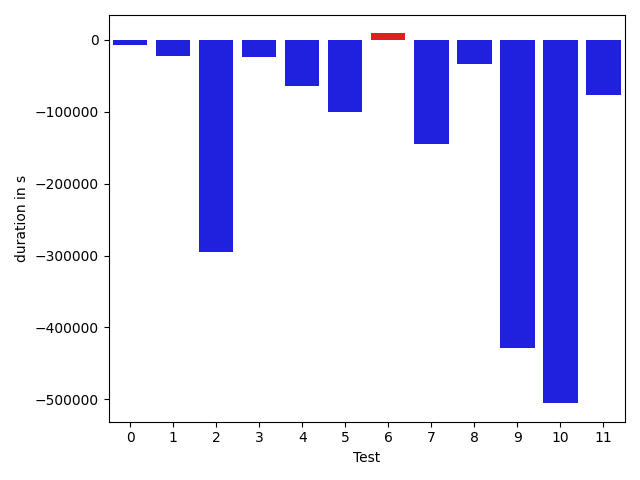

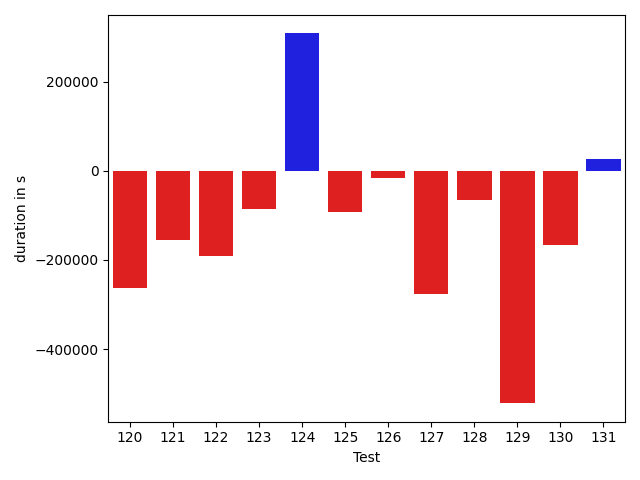

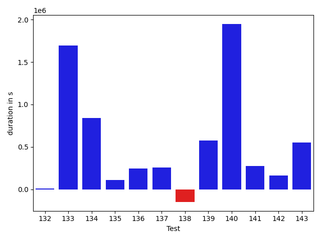

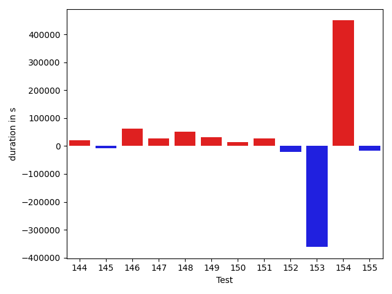

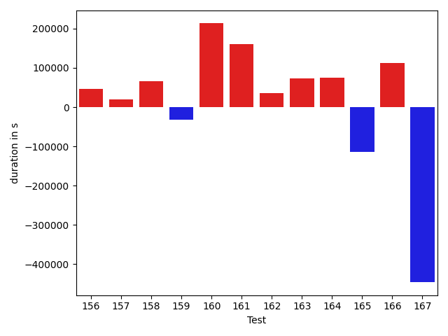

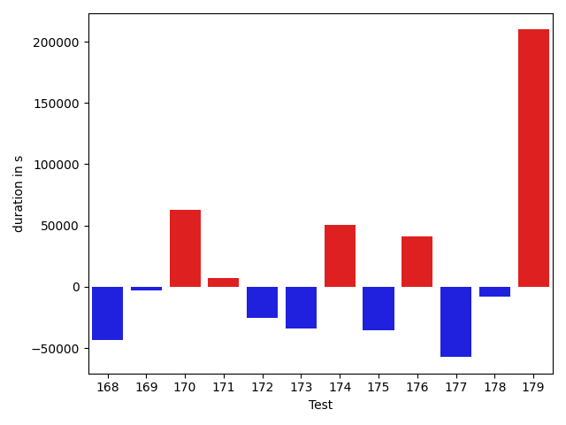

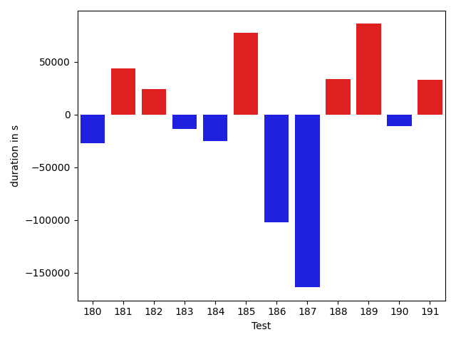

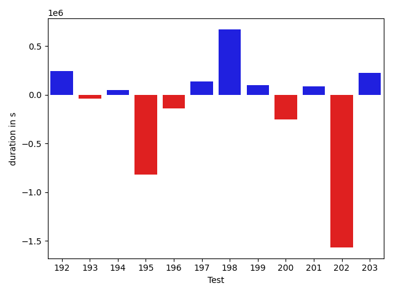

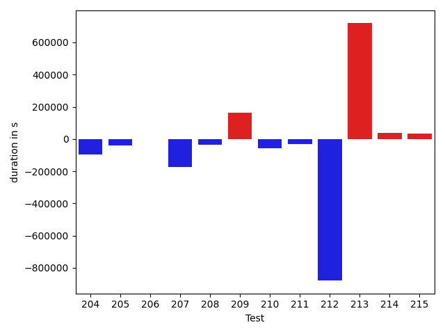

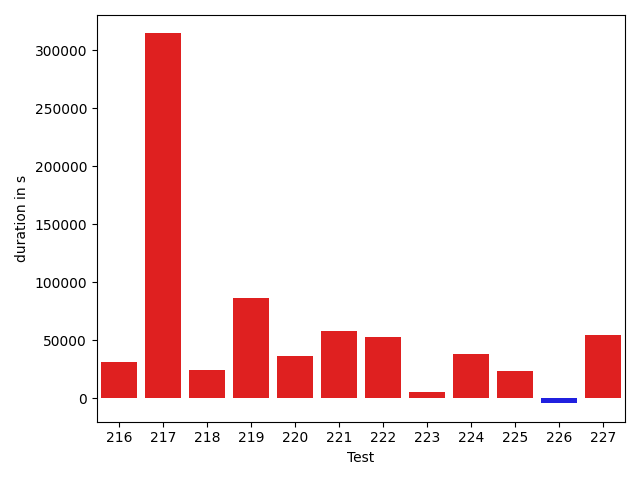

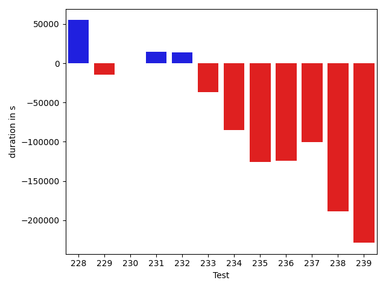

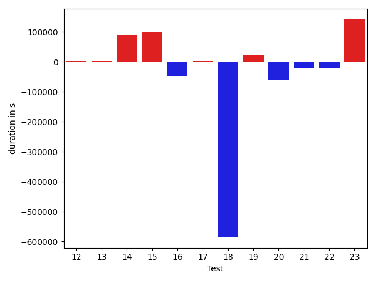

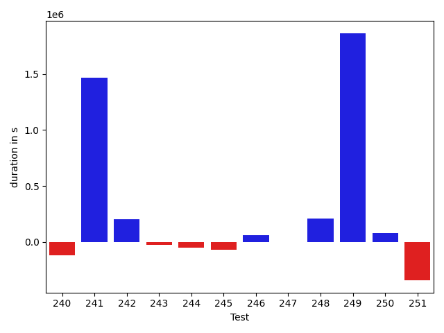

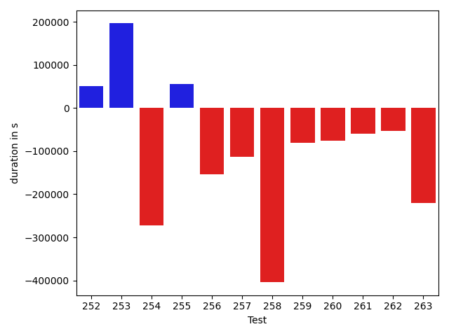

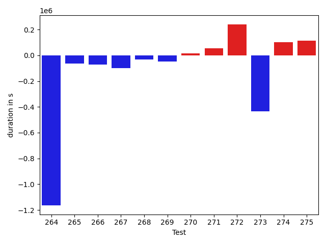

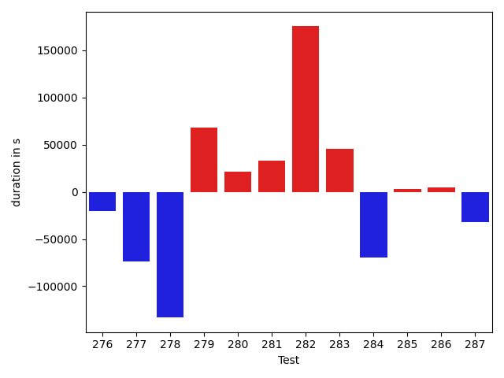

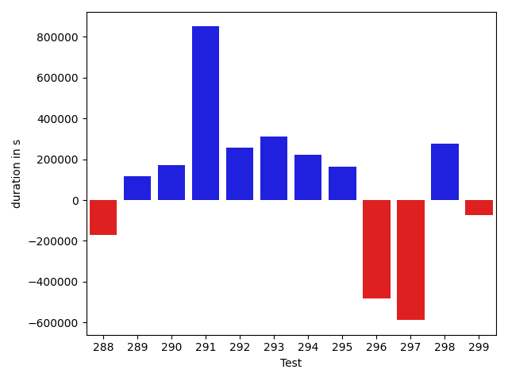

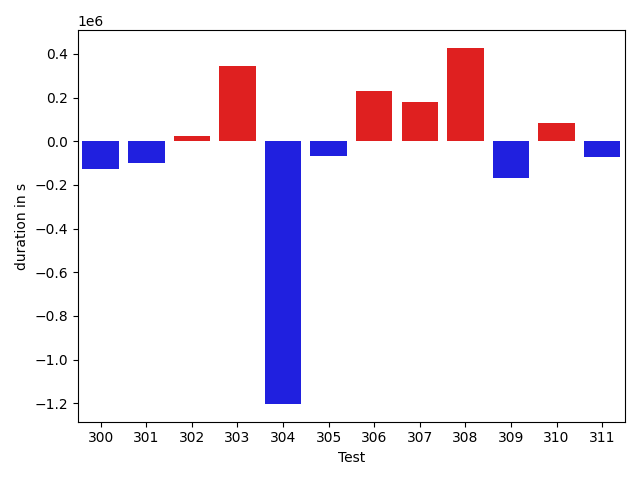

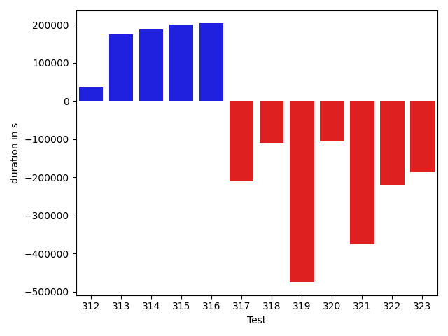

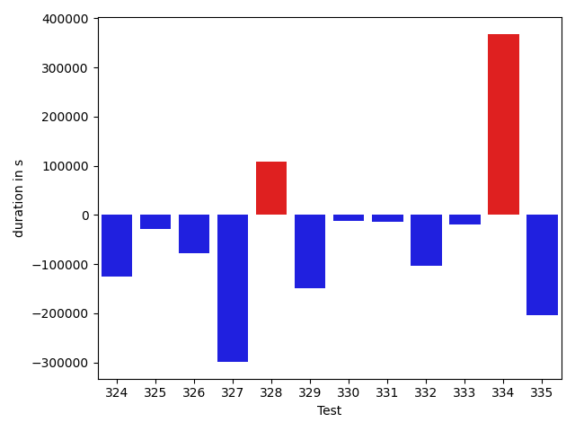

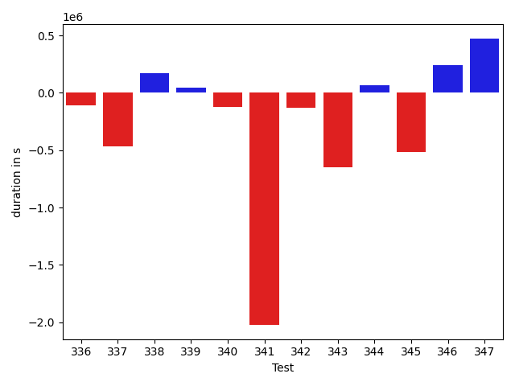

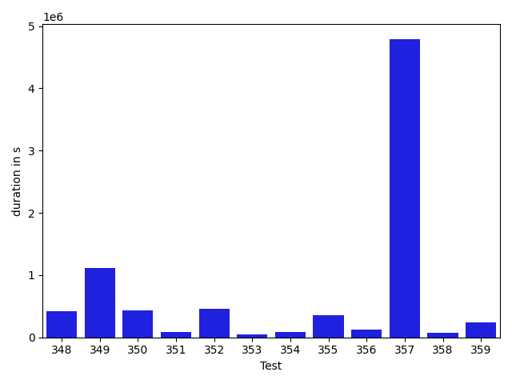

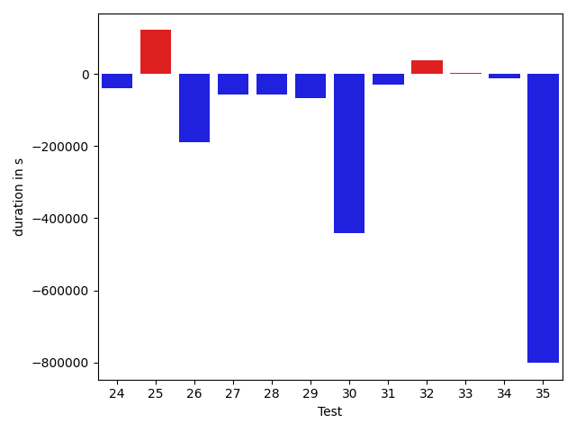

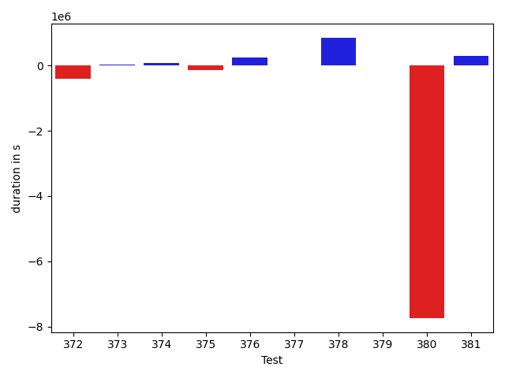

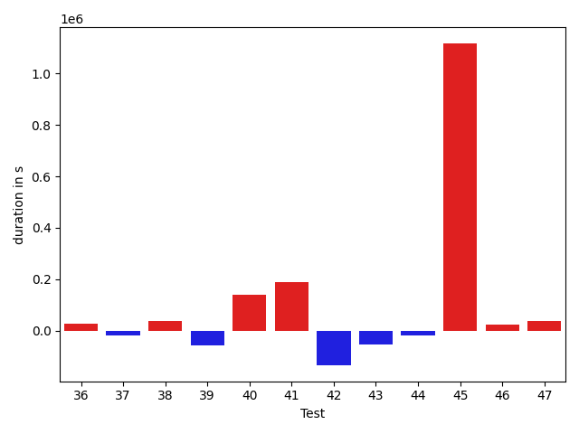

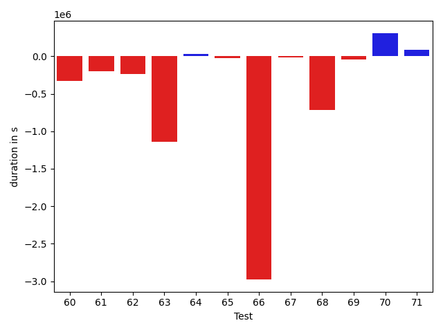

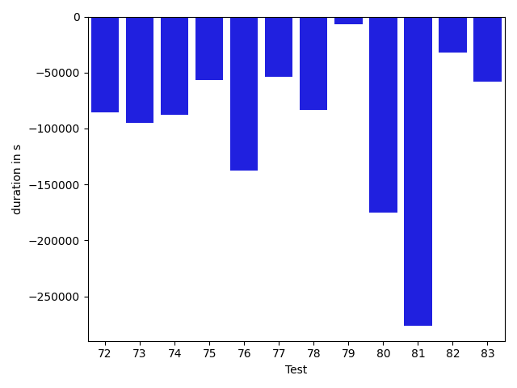

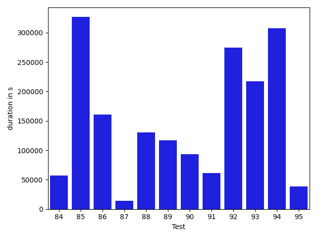

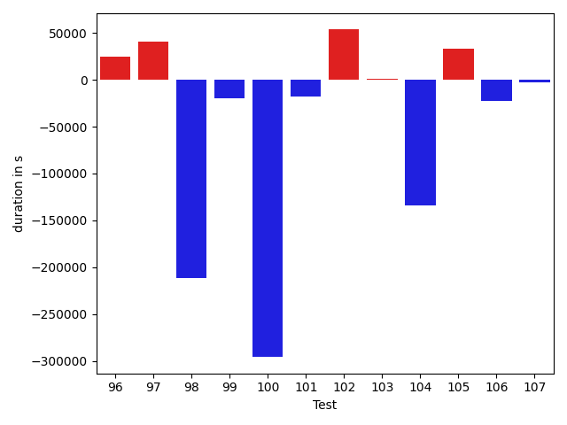

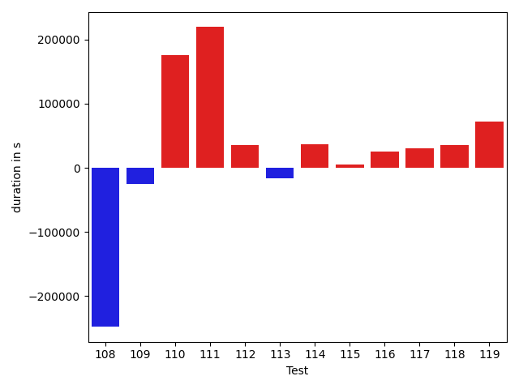

| ID | DurationV1 | DurationsV2 | DeltaDuration |
| --- | --- | --- | --- |
| 0 | 361321.58669030666 | 402580.483879447 | 41258.89718914032 |
| 1 | 392270.9720275402 | 399320.12593460083 | 7049.153907060623 |
| 2 | 815458.8317003876 | 879389.3593875436 | 63930.52768715599 |
| 3 | 735615.5588259778 | 439984.53873775626 | -295631.0200882216 |
| 4 | 669461.531673957 | 650024.6687710247 | -19436.862902932335 |
| 5 | 1121031.565422134 | 1137976.4606533092 | 16944.895231175236 |
| 6 | 391761.93741974584 | 777608.400090456 | 385846.46267071017 |
| 7 | 398007.33282470703 | 388841.9026184082 | -9165.430206298828 |
| 8 | 675668.3323733499 | 614729.8889027088 | -60938.443470641156 |
| 9 | 1428088.602705096 | 720169.2454232187 | -707919.3572818772 |
| 10 | 379448.19551382214 | 371041.83230881393 | -8406.363205008209 |
| 11 | 17348279.26166955 | 31198465.879949816 | 13850186.618280265 |
| 12 | 607541.6184559166 | 458414.84460352967 | -149126.77385238698 |
| 13 | 513394.2637486458 | 393078.30976104736 | -120315.95398759842 |
| 14 | 624036.7650365004 | 604021.3784655894 | -20015.38657091104 |
| 15 | 441260.0714800358 | 420480.31634521484 | -20779.755134820938 |
| 16 | 791914.3945845666 | 751298.0066632997 | -40616.38792126684 |
| 17 | 462941.9220819473 | 416351.24201351404 | -46590.680068433285 |
| 18 | 649306.4711273266 | 571176.1114071647 | -78130.35972016188 |
| 19 | 778350.1865573018 | 551329.2201161 | -227020.96644120174 |
| 20 | 870377.6799299204 | 747300.0115129589 | -123077.66841696145 |
| 21 | 930481.8487576945 | 922310.3230116705 | -8171.525746023981 |
| 22 | 522166.3801562488 | 480284.4947697994 | -41881.8853864494 |
| 23 | 635795.3649992943 | 408333.62698578835 | -227461.73801350594 |
| 24 | 755170.009048909 | 534378.0684416592 | -220791.94060724974 |
| 25 | 772835.6716013253 | 595137.5863664424 | -177698.0852348829 |
| 26 | 399828.6850514412 | 451180.54178882577 | 51351.85673738457 |
| 27 | 428298.1223679781 | 478723.26900970936 | 50425.14664173126 |
| 28 | 520123.79993685917 | 503598.7542949012 | -16525.045641957957 |
| 29 | 934848.7516998649 | 513301.5841168631 | -421547.1675830018 |
| 30 | 491442.63594293594 | 411534.6777038574 | -79907.95823907852 |
| 31 | 616883.1986823082 | 423328.6283323467 | -193554.57034996152 |
| 32 | 608756.8184001443 | 753193.3027794865 | 144436.48437934218 |
| 33 | 447458.0504684448 | 411090.55580163 | -36367.494666814804 |
| 34 | 531640.4700102806 | 410504.46797055006 | -121136.00203973055 |
| 35 | 541200.5255204057 | 1371854.0581202877 | 830653.532599882 |
| 36 | 468022.9792022705 | 356666.02857780457 | -111356.95062446594 |
| 37 | 433824.2289237976 | 425905.8759994507 | -7918.352924346924 |
| 38 | 2036741.2826872915 | 2828532.7665955555 | 791791.483908264 |
| 39 | 2534522.1110854894 | 3086409.417684517 | 551887.3065990275 |
| 40 | 1327838.0607442083 | 1910590.9916297803 | 582752.930885572 |
| 41 | 786632.2440123875 | 995837.5543113279 | 209205.3102989404 |
| 42 | 20396251.333159115 | 2095623.8853519978 | -18300627.44780712 |
| 43 | 1685112.4796339623 | 696682.787211283 | -988429.6924226793 |
| 44 | 726072.8742527257 | 655089.4446418568 | -70983.42961086892 |
| 45 | 1284411.5343365076 | 966828.7578821292 | -317582.7764543784 |
| 46 | 2650502.4666381436 | 782312.7779859974 | -1868189.6886521461 |
| 47 | 2143668.822475234 | 714705.0087216974 | -1428963.8137535367 |
| 48 | 909959.2233864677 | 840210.379559824 | -69748.84382664366 |
| 49 | 1006240.6588752382 | 1187583.4205964888 | 181342.7617212506 |
| 50 | 725878.2327980195 | 679770.2093485742 | -46108.023449445376 |
| 51 | 1399343.8904663294 | 1517041.0551378499 | 117697.16467152047 |
| 52 | 1278877.6292119029 | 620563.7556468346 | -658313.8735650682 |
| 53 | 802290.3572142676 | 860750.4258016729 | 58460.06858740526 |
| 54 | 882667.3827884833 | 1024765.7683985918 | 142098.3856101085 |
| 55 | 755737.2856427482 | 643958.7978384304 | -111778.48780431785 |
| 56 | 468926.02689003944 | 352464.50633239746 | -116461.52055764198 |
| 57 | 872067.3964123402 | 824128.0911586519 | -47939.30525368836 |
| 58 | 19533304.07832659 | 8119217.014862953 | -11414087.063463638 |
| 59 | 1517454.6950400656 | 958704.4613569828 | -558750.2336830827 |
| 60 | 1981200.5750222323 | 1654175.058416502 | -327025.51660573017 |
| 61 | 1463903.7979158917 | 1263030.83805252 | -200872.95986337168 |
| 62 | 739433.408715873 | 503393.49965249735 | -236039.90906337567 |
| 63 | 2194594.9183988497 | 1054568.398155887 | -1140026.5202429628 |
| 64 | 686656.6848297105 | 719528.4599246432 | 32871.775094932644 |
| 65 | 422795.8255004883 | 402155.125 | -20640.70050048828 |
| 66 | 3491999.011343494 | 517535.7469216949 | -2974463.264421799 |
| 67 | 388113.66396284103 | 371293.10216140747 | -16820.561801433563 |
| 68 | 1292682.3620330854 | 576481.1616115011 | -716201.2004215843 |
| 69 | 818845.7244124329 | 779116.6223944218 | -39729.102018011035 |
| 70 | 804239.6524783878 | 1111246.461789594 | 307006.8093112062 |
| 71 | 763306.6265891432 | 849563.0134611786 | 86256.38687203545 |
| 72 | 1051371.347242613 | 822174.8436895652 | -229196.5035530479 |
| 73 | 786977.2982604523 | 680458.9036407485 | -106518.39461970387 |
| 74 | 601725.9644975998 | 456612.37191059545 | -145113.5925870043 |
| 75 | 526866.2282816917 | 613094.4873993114 | 86228.25911761972 |
| 76 | 609304.7531157918 | 869701.2647519314 | 260396.5116361396 |
| 77 | 541109.8905131522 | 772558.6938188185 | 231448.8033056663 |
| 78 | 1227125.5895651144 | 1249202.1859194099 | 22076.5963542955 |
| 79 | 651911.6850161798 | 776027.1506771826 | 124115.46566100279 |
| 80 | 1174515.071542913 | 1702850.3606978287 | 528335.2891549156 |
| 81 | 603613.2574117476 | 695064.5129150902 | 91451.2555033426 |
| 82 | 968849.3760725502 | 1341037.5779573624 | 372188.2018848122 |
| 83 | 1153130.6347868154 | 1222290.52669849 | 69159.89191167452 |
| 84 | 642196.0226140905 | 698995.7068659414 | 56799.68425185094 |
| 85 | 614985.0015880924 | 941446.6515948875 | 326461.65000679507 |
| 86 | 745595.0637765932 | 906639.708400985 | 161044.6446243918 |
| 87 | 734870.328397491 | 748570.8439372331 | 13700.515539742075 |
| 88 | 846338.5734177702 | 976868.7431719339 | 130530.16975416371 |
| 89 | 667802.9288645757 | 784520.6827399874 | 116717.7538754117 |
| 90 | 628451.6831101091 | 721640.6344831642 | 93188.95137305511 |
| 91 | 389972.1206512451 | 451168.6980922222 | 61196.5774409771 |
| 92 | 940192.9562781552 | 1215020.8325436804 | 274827.87626552524 |
| 93 | 759158.3693177139 | 976108.0907682318 | 216949.72145051789 |
| 94 | 560706.244850769 | 867927.8699105516 | 307221.6250597825 |
| 95 | 479202.30172821705 | 517400.5444658147 | 38198.24273759767 |
| 96 | 674664.8550335178 | 866615.9571718883 | 191951.1021383705 |
| 97 | 723847.4249836692 | 634311.2184815817 | -89536.20650208753 |
| 98 | 601206.9962058639 | 848520.9033063106 | 247313.90710044676 |
| 99 | 875335.1001767379 | 691080.618916023 | -184254.48126071482 |
| 100 | 569171.4800676808 | 702584.4536862526 | 133412.97361857176 |
| 101 | 844376.0974284196 | 932820.0147226957 | 88443.91729427606 |
| 102 | 717885.8641739627 | 844163.686412503 | 126277.82223854028 |
| 103 | 435176.3305969238 | 740534.2275695801 | 305357.89697265625 |
| 104 | 1732346.3802266996 | 4221104.841207154 | 2488758.4609804545 |
| 105 | 1289259.879724553 | 1628217.2049081507 | 338957.3251835976 |
| 106 | 1374026.538175781 | 1236941.221291187 | -137085.31688459404 |
| 107 | 1170464.6359432423 | 860965.2516211406 | -309499.3843221017 |
| 108 | 895984.463522601 | 1234891.073280645 | 338906.609758044 |
| 109 | 1244829.3521957644 | 996860.2980890687 | -247969.0541066957 |
| 110 | 1944421.9452038915 | 1123232.8930211626 | -821189.0521827289 |
| 111 | 1365769.0507337807 | 964852.4509617497 | -400916.59977203107 |
| 112 | 2577363.3492347263 | 2043293.4848736378 | -534069.8643610885 |
| 113 | 1517463.124020455 | 861362.813225004 | -656100.3107954509 |
| 114 | 1245141.3290785071 | 1016803.9459683786 | -228337.38311012858 |
| 115 | 2358413.7516573137 | 1331824.48483533 | -1026589.2668219837 |
| 116 | 1013893.1528518698 | 912975.7380132241 | -100917.41483864572 |
| 117 | 749003.1401450294 | 786672.5139970237 | 37669.373851994285 |
| 118 | 1273072.749752775 | 976404.1720769602 | -296668.57767581486 |
| 119 | 1395949.9912621072 | 1224862.704441757 | -171087.28682035021 |
| 120 | 1197179.7908915572 | 933841.732154552 | -263338.0587370052 |
| 121 | 662016.9238189608 | 506335.6641249377 | -155681.25969402306 |
| 122 | 892601.9025808207 | 702264.6537839195 | -190337.2487969012 |
| 123 | 731736.342331262 | 646613.3818952292 | -85122.96043603274 |
| 124 | 981142.0868113365 | 1288894.1370071177 | 307752.0501957813 |
| 125 | 1125463.704425123 | 1033001.6561443717 | -92462.04828075133 |
| 126 | 1043659.6768493115 | 1027712.4609468079 | -15947.21590250358 |
| 127 | 1249685.6480399596 | 972694.8134087066 | -276990.83463125303 |
| 128 | 865798.8989045329 | 800903.1154032592 | -64895.78350127372 |
| 129 | 1285586.8742174574 | 764037.3712137026 | -521549.50300375477 |
| 130 | 919088.5168762959 | 752240.3223841279 | -166848.19449216803 |
| 131 | 434087.2835083008 | 461203.98724001646 | 27116.70373171568 |
| 132 | 383241.68283081055 | 391783.09941101074 | 8541.416580200195 |
| 133 | 5078508.246749684 | 6771214.0365128415 | 1692705.7897631573 |
| 134 | 4223479.264312262 | 5065634.870979381 | 842155.6066671191 |
| 135 | 508502.67122888565 | 617310.3946403802 | 108807.72341149452 |
| 136 | 431826.8224654645 | 678878.6314589977 | 247051.80899353325 |
| 137 | 427515.585183681 | 681991.4684503675 | 254475.88326668646 |
| 138 | 480127.9453861788 | 330587.11747312546 | -149540.82791305333 |
| 139 | 2321814.655188253 | 2897277.9271233403 | 575463.2719350872 |
| 140 | 928102.6295017261 | 2876268.634050867 | 1948166.004549141 |
| 141 | 733331.0823532229 | 1005683.452350347 | 272352.3699971241 |
| 142 | 986766.5996083082 | 1151467.746874454 | 164701.1472661458 |
| 143 | 926042.918716099 | 1479736.9113262454 | 553693.9926101464 |
| 144 | 345887.70063209534 | 353802.0538330078 | 7914.353200912476 |
| 145 | 690673.3645398915 | 790529.4811719891 | 99856.11663209763 |
| 146 | 533236.4169067148 | 1718695.2487641764 | 1185458.8318574615 |
| 147 | 1607399.048392099 | 785862.8925107804 | -821536.1558813187 |
| 148 | 328551.33793640137 | 431353.0075683594 | 102801.66963195801 |
| 149 | 367388.96562957764 | 355676.8835516274 | -11712.08207795024 |
| 150 | 392935.8778991699 | 531894.1688127518 | 138958.29091358185 |
| 151 | 755768.4251683512 | 1001440.1280403723 | 245671.70287202112 |
| 152 | 852447.4476525305 | 1074642.2429926302 | 222194.79534009972 |
| 153 | 1173962.516412525 | 1163814.2005284834 | -10148.3158840416 |
| 154 | 1243357.6335881096 | 1598329.1763610248 | 354971.5427729152 |
| 155 | 832492.7485767729 | 854641.2553102103 | 22148.506733437418 |
| 156 | 590778.1489140678 | 652617.6416140432 | 61839.49269997538 |
| 157 | 791024.3188031374 | 810100.205448718 | 19075.886645580642 |
| 158 | 654041.6734999396 | 900671.7374643129 | 246630.06396437332 |
| 159 | 859536.4763197657 | 678832.4297274733 | -180704.04659229238 |
| 160 | 751383.7547469209 | 887525.4024811215 | 136141.64773420058 |
| 161 | 630305.792148313 | 698753.587392268 | 68447.79524395498 |
| 162 | 631722.9543955566 | 838125.390211376 | 206402.43581581942 |
| 163 | 646414.9153799668 | 887539.172171404 | 241124.25679143716 |
| 164 | 1168206.1157992454 | 1785814.19055568 | 617608.0747564347 |
| 165 | 981606.3148445503 | 1142047.9185590465 | 160441.60371449613 |
| 166 | 624680.1081920104 | 1081631.1554644427 | 456951.04727243225 |
| 167 | 669741.4275470857 | 797255.5951423472 | 127514.16759526148 |
| 168 | 1430103.2662489316 | 1557607.1198523808 | 127503.85360344918 |
| 169 | 1037653.5510277587 | 980907.7915632911 | -56745.75946446764 |
| 170 | 689979.7970499545 | 792733.7683326424 | 102753.97128268785 |
| 171 | 656414.4299559512 | 725481.5790645285 | 69067.14910857729 |
| 172 | 3936826.1856690333 | 3811336.114944633 | -125490.07072440023 |
| 173 | 665044.2470012181 | 910189.6944085833 | 245145.4474073652 |
| 174 | 567016.8312174731 | 753264.7373316755 | 186247.90611420234 |
| 175 | 574823.1376471173 | 646238.3103608326 | 71415.17271371535 |
| 176 | 898365.0754455031 | 783618.7021949147 | -114746.37325058843 |
| 177 | 598642.7950649752 | 571126.2159059953 | -27516.579158979817 |
| 178 | 614186.5960815432 | 698344.7644823206 | 84158.16840077739 |
| 179 | 884391.2602115902 | 888237.3005747208 | 3846.0403631306253 |
| 180 | 672128.8479661527 | 728180.0159185324 | 56051.16795237968 |
| 181 | 715737.0821131339 | 1298896.5768523347 | 583159.4947392008 |
| 182 | 698383.9978525124 | 1221834.9696110645 | 523450.9717585521 |
| 183 | 863257.2432309415 | 950432.3138471994 | 87175.07061625796 |
| 184 | 612475.8343899325 | 791844.7663390562 | 179368.93194912374 |
| 185 | 759170.8805463513 | 690334.8145831582 | -68836.06596319308 |
| 186 | 539020.1420185845 | 473946.15934560075 | -65073.98267298378 |
| 187 | 729950.6196277103 | 829775.8617597264 | 99825.24213201611 |
| 188 | 598559.675441491 | 450567.72619952075 | -147991.9492419702 |
| 189 | 666412.6352602429 | 617156.4408218758 | -49256.194438367034 |
| 190 | 587358.509145258 | 637160.706551674 | 49802.19740641606 |
| 191 | 873405.4888756762 | 766018.468857918 | -107387.02001775813 |
| 192 | 587538.3173173768 | 828292.7618603255 | 240754.44454294862 |
| 193 | 410447.05075359344 | 372966.21726083755 | -37480.83349275589 |
| 194 | 630875.2174990417 | 679446.4901958588 | 48571.27269681706 |
| 195 | 1294221.0707511902 | 473993.4898080826 | -820227.5809431076 |
| 196 | 562641.3638000488 | 423443.95260477066 | -139197.41119527817 |
| 197 | 360352.3037414551 | 497481.4302663207 | 137129.12652486563 |
| 198 | 871662.905299542 | 1542445.0243328975 | 670782.1190333555 |
| 199 | 683376.7113597835 | 780839.9196916774 | 97463.2083318939 |
| 200 | 712675.2018020153 | 459584.93808460236 | -253090.26371741295 |
| 201 | 1163767.354489443 | 1249578.0741165332 | 85810.71962709026 |
| 202 | 3208469.2392511284 | 1641363.2288284588 | -1567106.0104226696 |
| 203 | 2502437.200309219 | 2724291.4721771786 | 221854.27186795976 |
| 204 | 1684688.8176402077 | 858276.0277435788 | -826412.7898966289 |
| 205 | 926734.4767846074 | 1274597.772039085 | 347863.29525447753 |
| 206 | 679960.4902679368 | 725560.9436958785 | 45600.453427941655 |
| 207 | 560059.0292287477 | 776788.0617420116 | 216729.03251326387 |
| 208 | 663526.1104296967 | 467903.52788053453 | -195622.5825491622 |
| 209 | 608665.6470081806 | 793699.2310808077 | 185033.58407262713 |
| 210 | 375652.96533203125 | 435975.95140743256 | 60322.986075401306 |
| 211 | 832962.1453045846 | 862247.1936228412 | 29285.048318256508 |
| 212 | 1243567.4787739827 | 1033093.2969469536 | -210474.1818270291 |
| 213 | 937415.9247425551 | 705222.1917097879 | -232193.7330327672 |
| 214 | 965988.050957626 | 832982.0773874947 | -133005.97357013123 |
| 215 | 1316258.0031694905 | 1122077.4486801017 | -194180.55448938883 |
| 216 | 1201797.1450019497 | 1001783.3732954786 | -200013.7717064711 |
| 217 | 1121087.421411457 | 1319663.1614983932 | 198575.74008693616 |
| 218 | 2558464.0833322946 | 2083166.4795388775 | -475297.6037934171 |
| 219 | 1253550.0148693977 | 1904962.5102381944 | 651412.4953687966 |
| 220 | 684292.4442899855 | 1107936.3380394622 | 423643.89374947676 |
| 221 | 921451.2148310661 | 866042.4039009179 | -55408.81093014823 |
| 222 | 1046389.647152813 | 1092989.1193043287 | 46599.472151515656 |
| 223 | 627978.1452986717 | 767679.5993749467 | 139701.454076275 |
| 224 | 1149262.4218654633 | 1838533.2060048445 | 689270.7841393813 |
| 225 | 481061.0202856362 | 454676.662651062 | -26384.357634574175 |
| 226 | 811660.4283633942 | 739118.6120719218 | -72541.81629147241 |
| 227 | 991669.0920567438 | 956311.7202474459 | -35357.37180929794 |
| 228 | 556855.6055187776 | 611817.998119398 | 54962.3926006204 |
| 229 | 625909.6675214974 | 611134.0497064475 | -14775.61781504983 |
| 230 | 624691.8729875507 | 624420.9924160308 | -270.8805715198396 |
| 231 | 583848.995042112 | 598426.2267821282 | 14577.231740016257 |
| 232 | 391284.04793024063 | 405078.27561950684 | 13794.227689266205 |
| 233 | 473044.1063361168 | 435935.25327420235 | -37108.853061914444 |
| 234 | 525525.3631143331 | 440359.84834253136 | -85165.51477180177 |
| 235 | 788864.4269341468 | 662968.7202210814 | -125895.70671306539 |
| 236 | 1335785.7711849776 | 1211458.7313124598 | -124327.03987251781 |
| 237 | 680975.7509803423 | 580822.5394457395 | -100153.2115346028 |
| 238 | 595939.2022674084 | 407478.4660884617 | -188460.73617894668 |
| 239 | 834471.5315924352 | 605673.762266539 | -228797.76932589617 |
| 240 | 676227.9221947058 | 556211.58330731 | -120016.3388873958 |
| 241 | 811458.7048697536 | 2279161.5349450195 | 1467702.8300752658 |
| 242 | 785512.2087731216 | 986393.4954877668 | 200881.28671464522 |
| 243 | 798519.7703216969 | 770006.6806434089 | -28513.08967828797 |
| 244 | 532671.4726629257 | 482620.83784142137 | -50050.634821504354 |
| 245 | 720782.4415715875 | 651485.7828846296 | -69296.6586869579 |
| 246 | 490699.29633785784 | 550213.0274330452 | 59513.731095187366 |
| 247 | 505781.6708689369 | 506669.4336037636 | 887.7627348266542 |
| 248 | 693157.7124280368 | 904076.5835971234 | 210918.87116908655 |
| 249 | 643817.3637092854 | 2506883.2196816574 | 1863065.855972372 |
| 250 | 503655.55798216164 | 584680.0748358585 | 81024.5168536969 |
| 251 | 788417.837498188 | 446678.8899308741 | -341738.9475673139 |
| 252 | 435974.4385845661 | 486933.3122639656 | 50958.87367939949 |
| 253 | 438456.07404232025 | 634590.1050926447 | 196134.03105032444 |
| 254 | 1185655.5005846636 | 912926.607850224 | -272728.8927344396 |
| 255 | 572329.5861626565 | 628701.818889442 | 56372.23272678547 |
| 256 | 3261844.8448617756 | 3108638.5924440846 | -153206.25241769105 |
| 257 | 795743.2716139578 | 682275.3453468126 | -113467.9262671452 |
| 258 | 1247396.2107900642 | 843223.3029386661 | -404172.9078513981 |
| 259 | 546367.18261705 | 466387.4141796257 | -79979.76843742433 |
| 260 | 462050.8078622818 | 386047.0179616213 | -76003.78990066051 |
| 261 | 463460.713377133 | 403811.80525660515 | -59648.90812052786 |
| 262 | 582228.3719900094 | 528735.0372441055 | -53493.334745903965 |
| 263 | 686854.7676525787 | 465816.7737872228 | -221037.99386535585 |
| 264 | 829107.8953761738 | 854682.2661207254 | 25574.37074455165 |
| 265 | 2045033.187033034 | 2374699.7507809615 | 329666.56374792755 |
| 266 | 644904.4311843619 | 817234.1753231406 | 172329.74413877865 |
| 267 | 1063221.7534793732 | 1066125.259282442 | 2903.505803068867 |
| 268 | 681012.4604665004 | 903641.106806179 | 222628.64633967867 |
| 269 | 2650565.8388531916 | 3721075.8168188836 | 1070509.977965692 |
| 270 | 643535.4635298667 | 757869.5526189794 | 114334.0890891127 |
| 271 | 1180826.7939487665 | 534094.4624747885 | -646732.331473978 |
| 272 | 2403921.408004949 | 2841355.169973608 | 437433.76196865924 |
| 273 | 577635.6104925778 | 384731.519421041 | -192904.09107153676 |
| 274 | 653551.6460170727 | 600211.5765518157 | -53340.069465256995 |
| 275 | 457964.1263961792 | 569466.8276945744 | 111502.70129839517 |
| 276 | 457132.92567789555 | 1041134.1603574157 | 584001.2346795201 |
| 277 | 1127962.9992273026 | 781502.1304459109 | -346460.86878139176 |
| 278 | 548535.1070101261 | 524873.9890060425 | -23661.118004083633 |
| 279 | 1255832.9295221553 | 1550142.3411721447 | 294309.41164998943 |
| 280 | 2185825.9886201145 | 1877140.2139704442 | -308685.77464967035 |
| 281 | 1551469.5011598421 | 1142139.660662512 | -409329.84049733006 |
| 282 | 1017871.0988453882 | 712835.9985600563 | -305035.10028533184 |
| 283 | 706013.8016997549 | 1357994.5350745646 | 651980.7333748097 |
| 284 | 7536851.736380971 | 8856884.425698407 | 1320032.689317436 |
| 285 | 9447252.584321687 | 12792767.317006668 | 3345514.732684981 |
| 286 | 807358.1889427748 | 774791.4641524355 | -32566.72479033924 |
| 287 | 1588127.1540367845 | 1857576.0917219543 | 269448.93768516975 |
| 288 | 687974.673923416 | 518319.9531073191 | -169654.72081609687 |
| 289 | 615039.7934622492 | 730582.6338118076 | 115542.84034955839 |
| 290 | 623601.5039056567 | 792755.8152303677 | 169154.31132471096 |
| 291 | 507601.31914227945 | 1356680.3462149624 | 849079.027072683 |
| 292 | 893007.976313432 | 1151197.5587988074 | 258189.58248537546 |
| 293 | 1091722.6929884544 | 1400892.8320317846 | 309170.1390433302 |
| 294 | 831819.576385915 | 1052469.3810512691 | 220649.80466535408 |
| 295 | 716473.1098482143 | 880760.6144529666 | 164287.5046047523 |
| 296 | 983468.2389202267 | 503258.01294014766 | -480210.22598007903 |
| 297 | 1739288.4146654727 | 1151742.5850836085 | -587545.8295818642 |
| 298 | 709405.2741055363 | 986919.1924930958 | 277513.9183875595 |
| 299 | 666408.6464828188 | 591097.2212400199 | -75311.42524279887 |
| 300 | 9162906.093075087 | 10017367.830944292 | 854461.737869205 |
| 301 | 11857622.715970768 | 14425886.423125893 | 2568263.707155125 |
| 302 | 1798880.8042162682 | 1911846.6011198524 | 112965.79690358415 |
| 303 | 1747559.0820250334 | 1275653.726440086 | -471905.3555849474 |
| 304 | 1158085.229317274 | 1135715.4973852725 | -22369.73193200142 |
| 305 | 892854.424696204 | 682112.7697654141 | -210741.65493078995 |
| 306 | 908715.9058911743 | 1265007.0900362835 | 356291.18414510915 |
| 307 | 517074.715995118 | 515115.8616045229 | -1958.8543905951083 |
| 308 | 816405.8919263189 | 815926.1852169543 | -479.70670936454553 |
| 309 | 1114392.983902329 | 1218618.9904945418 | 104226.00659221271 |
| 310 | 1166305.6514529465 | 1246372.4192400654 | 80066.76778711891 |
| 311 | 706287.1144275534 | 804784.1653319655 | 98497.05090441217 |
| 312 | 1052846.6438121218 | 1089054.313047199 | 36207.66923507722 |
| 313 | 689578.8778246768 | 864436.2243022082 | 174857.34647753136 |
| 314 | 635434.8503031835 | 822845.5518077116 | 187410.70150452806 |
| 315 | 463814.77575671626 | 664501.6690585171 | 200686.89330180082 |
| 316 | 559898.9133525137 | 763114.7653690849 | 203215.8520165712 |
| 317 | 691875.8896832466 | 481640.8470075319 | -210235.0426757147 |
| 318 | 701710.6524940466 | 591435.1545739465 | -110275.49792010011 |
| 319 | 1598340.5452377787 | 1123146.6954863283 | -475193.84975145035 |
| 320 | 554460.8214051723 | 448231.1779869646 | -106229.64341820776 |
| 321 | 1000431.487373092 | 624746.6373806642 | -375684.84999242774 |
| 322 | 723881.9654729292 | 503245.8814994469 | -220636.08397348225 |
| 323 | 640491.829537183 | 453171.7336062677 | -187320.09593091533 |
| 324 | 838742.8356362571 | 666047.3694918295 | -172695.46614442754 |
| 325 | 1613474.7215159782 | 1389608.1075979916 | -223866.61391798663 |
| 326 | 2771575.919627284 | 3571236.025511523 | 799660.1058842386 |
| 327 | 1024780.861269164 | 871562.4856211965 | -153218.37564796756 |
| 328 | 584369.5114868879 | 368389.3654150963 | -215980.14607179165 |
| 329 | 508530.91553115845 | 487326.97816991806 | -21203.937361240387 |
| 330 | 1859122.5018104594 | 563812.1313013937 | -1295310.3705090657 |
| 331 | 443350.7581787624 | 436523.40756958723 | -6827.350609175162 |
| 332 | 487049.81073760986 | 15779498.72356224 | 15292448.91282463 |
| 333 | 1183933.6279798457 | 1014784.4761337893 | -169149.15184605645 |
| 334 | 999382.6350651288 | 727800.3464314834 | -271582.2886336454 |
| 335 | 633166.2999542481 | 736890.0277652428 | 103723.72781099472 |
| 336 | 607850.6997727621 | 496732.753685534 | -111117.94608722813 |
| 337 | 874311.0899986383 | 406208.7894821167 | -468102.30051652156 |
| 338 | 2803411.7667941265 | 2977206.614352283 | 173794.8475581566 |
| 339 | 836405.5870283048 | 878571.6997252831 | 42166.11269697826 |
| 340 | 1084406.5647393551 | 964670.7936309943 | -119735.77110836084 |
| 341 | 2511374.6488484964 | 488702.42502498627 | -2022672.22382351 |
| 342 | 693386.5443530241 | 562572.8838939089 | -130813.66045911517 |
| 343 | 1334197.4465149061 | 684315.954283029 | -649881.4922318772 |
| 344 | 468100.33712774515 | 537763.9535186216 | 69663.61639087647 |
| 345 | 3029103.2615262554 | 2511176.0183857298 | -517927.24314052565 |
| 346 | 1172097.7855206714 | 1413890.3133859278 | 241792.52786525642 |
| 347 | 1329240.2940502665 | 1802395.1678215363 | 473154.8737712698 |
| 348 | 612922.209465568 | 1038526.6713061772 | 425604.4618406092 |
| 349 | 2989994.7584243403 | 4098711.5874344744 | 1108716.829010134 |
| 350 | 894424.0069232406 | 1323311.8542445737 | 428887.84732133313 |
| 351 | 563361.7569330992 | 655659.5635868612 | 92297.806653762 |
| 352 | 762877.8362026437 | 1225224.0499562898 | 462346.2137536461 |
| 353 | 609605.6167313904 | 658149.5399464369 | 48543.923215046525 |
| 354 | 919640.2405320441 | 1001839.887353952 | 82199.64682190795 |
| 355 | 449217.8268237114 | 810172.2744891047 | 360954.44766539335 |
| 356 | 440908.4276957512 | 566567.176793009 | 125658.74909725785 |
| 357 | 391464.2346801758 | 5184228.356933594 | 4792764.122253418 |
| 358 | 593886.4534182549 | 666597.5446929932 | 72711.09127473831 |
| 359 | 436607.59609941207 | 677144.1126983762 | 240536.5165989641 |
| 360 | 1108750.023781995 | 1942596.2684191663 | 833846.2446371713 |
| 361 | 522087.8833438521 | 3487145.4674842507 | 2965057.5841403985 |
| 362 | 1587843.4078433511 | 1375088.9674872414 | -212754.44035610976 |
| 363 | 1147808.0443092603 | 837434.0195685079 | -310374.0247407524 |
| 364 | 1981062.8525751722 | 1272051.0763302315 | -709011.7762449407 |
| 365 | 902582.7300146739 | 868798.8447904466 | -33783.88522422733 |
| 366 | 2134598.40075914 | 1260577.516622336 | -874020.8841368039 |
| 367 | 885957.253885621 | 732171.708448385 | -153785.54543723597 |
| 368 | 949366.0695671393 | 714592.6144696157 | -234773.45509752352 |
| 369 | 1164191.288057927 | 804269.9379157373 | -359921.35014218977 |
| 370 | 1857108.1661561728 | 554065.7638774584 | -1303042.4022787143 |
| 371 | 972975.1834857559 | 20659931.58025923 | 19686956.396773472 |
| 372 | 3258975.3977530454 | 2857384.302653675 | -401591.09509937046 |
| 373 | 565801.6141576581 | 589136.5237555355 | 23334.909597877413 |
| 374 | 484115.2762892293 | 574098.651542671 | 89983.37525344174 |
| 375 | 1016233.5926525731 | 889811.3938384377 | -126422.1988141354 |
| 376 | 641708.385717657 | 883193.8328717316 | 241485.44715407456 |
| 377 | 645501.4920921389 | 660961.4691280215 | 15459.97703588265 |
| 378 | 1289584.3907663494 | 2142966.794129014 | 853382.4033626646 |
| 379 | 598336.1293486463 | 611969.7269587937 | 13633.597610147437 |
| 380 | 8588428.137961797 | 846471.219637989 | -7741956.918323808 |
| 381 | 778116.2714031532 | 1077365.2091670618 | 299248.93776390865 |

## Misc.

| ID | Test Class | Test Method |
| --- | --- | --- |
| 0 | com.google.gson.functional.ObjectTest | testStringFieldWithEmptyValueDeserialization |
| 1 | com.google.gson.functional.ObjectTest | testNullObjectFieldsDeserialization |
| 2 | com.google.gson.functional.ObjectTest | testEmptyCollectionInAnObjectDeserialization |
| 3 | com.google.gson.functional.ObjectTest | testNestedSerialization |
| 4 | com.google.gson.functional.ObjectTest | testArrayOfArraysDeserialization |
| 5 | com.google.gson.functional.ObjectTest | testSingletonLists |
| 6 | com.google.gson.functional.ObjectTest | testNullFieldsSerialization |
| 7 | com.google.gson.functional.ObjectTest | testClassWithNoFieldsDeserialization |
| 8 | com.google.gson.functional.ObjectTest | testPrivateNoArgConstructorDeserialization |
| 9 | com.google.gson.functional.ObjectTest | testArrayOfObjectsAsFields |
| 10 | com.google.gson.functional.ObjectTest | testClassWithTransientFieldsDeserializationTransientFieldsPassedInJsonAreIgnored |
| 11 | com.google.gson.functional.ObjectTest | testDateAsMapObjectField |
| 12 | com.google.gson.functional.ObjectTest | testPrimitiveArrayInAnObjectDeserialization |
| 13 | com.google.gson.functional.ObjectTest | testClassWithNoFieldsSerialization |
| 14 | com.google.gson.functional.ObjectTest | testStringFieldWithEmptyValueSerialization |
| 15 | com.google.gson.functional.ObjectTest | testNullArraysDeserialization |
| 16 | com.google.gson.functional.ObjectTest | testInnerClassSerialization |
| 17 | com.google.gson.functional.ObjectTest | testEmptyCollectionInAnObjectSerialization |
| 18 | com.google.gson.functional.ObjectTest | testClassWithObjectFieldSerialization |
| 19 | com.google.gson.functional.ObjectTest | testBagOfPrimitiveWrappersSerialization |
| 20 | com.google.gson.functional.ObjectTest | testTruncatedDeserialization |
| 21 | com.google.gson.functional.ObjectTest | testArrayOfArraysSerialization |
| 22 | com.google.gson.functional.ObjectTest | testJsonInSingleQuotesDeserialization |
| 23 | com.google.gson.functional.ObjectTest | testBagOfPrimitivesSerialization |
| 24 | com.google.gson.functional.ObjectTest | testNestedDeserialization |
| 25 | com.google.gson.functional.ObjectTest | testBagOfPrimitiveWrappersDeserialization |
| 26 | com.google.gson.functional.ObjectTest | testJsonInMixedQuotesDeserialization |
| 27 | com.google.gson.functional.ObjectTest | testNullFieldsDeserialization |
| 28 | com.google.gson.functional.ObjectTest | testArrayOfObjectsSerialization |
| 29 | com.google.gson.functional.ObjectTest | testClassWithTransientFieldsSerialization |
| 30 | com.google.gson.functional.ObjectTest | testNullPrimitiveFieldsDeserialization |
| 31 | com.google.gson.functional.ObjectTest | testBagOfPrimitivesDeserialization |
| 32 | com.google.gson.functional.ObjectTest | testInnerClassDeserialization |
| 33 | com.google.gson.functional.ObjectTest | testStringFieldWithNumberValueDeserialization |
| 34 | com.google.gson.functional.ObjectTest | testClassWithTransientFieldsDeserialization |
| 35 | com.google.gson.functional.ObjectTest | testArrayOfObjectsDeserialization |
| 36 | com.google.gson.functional.ObjectTest | testPrimitiveArrayFieldSerialization |
| 37 | com.google.gson.functional.ObjectTest | testObjectFieldNamesWithoutQuotesDeserialization |
| 38 | com.google.gson.functional.StreamingTypeAdaptersTest | testNullSafe |
| 39 | com.google.gson.functional.StreamingTypeAdaptersTest | testSerializeWithCustomTypeAdapter |
| 40 | com.google.gson.functional.StreamingTypeAdaptersTest | testDeserializeWithCustomTypeAdapter |
| 41 | com.google.gson.functional.StreamingTypeAdaptersTest | testSerializeRecursive |
| 42 | com.google.gson.functional.JsonAdapterAnnotationOnClassesTest | testJsonAdapterInvoked |
| 43 | com.google.gson.functional.JsonAdapterAnnotationOnClassesTest | testRegisteredSerializerOverridesJsonAdapter |
| 44 | com.google.gson.functional.JsonAdapterAnnotationOnClassesTest | testIncorrectTypeAdapterFails |
| 45 | com.google.gson.functional.JsonAdapterAnnotationOnClassesTest | testJsonAdapterFactoryInvoked |
| 46 | com.google.gson.functional.JsonAdapterAnnotationOnClassesTest | testIncorrectJsonAdapterType |
| 47 | com.google.gson.functional.JsonAdapterAnnotationOnClassesTest | testSuperclassTypeAdapterNotInvoked |
| 48 | com.google.gson.functional.JsonAdapterAnnotationOnClassesTest | testNullSafeObjectFromJson |
| 49 | com.google.gson.functional.JsonAdapterAnnotationOnClassesTest | testRegisteredDeserializerOverridesJsonAdapter |
| 50 | com.google.gson.functional.CustomDeserializerTest | testDefaultConstructorNotCalledOnField |
| 51 | com.google.gson.functional.CustomDeserializerTest | testJsonTypeFieldBasedDeserialization |
| 52 | com.google.gson.functional.CustomDeserializerTest | testDefaultConstructorNotCalledOnObject |
| 53 | com.google.gson.functional.CustomDeserializerTest | testCustomDeserializerReturnsNullForArrayElementsForArrayField |
| 54 | com.google.gson.functional.CustomDeserializerTest | testCustomDeserializerReturnsNull |
| 55 | com.google.gson.functional.DefaultTypeAdaptersTest | testTreeSetDeserialization |
| 56 | com.google.gson.functional.DefaultTypeAdaptersTest | testPropertiesDeserialization |
| 57 | com.google.gson.functional.DefaultTypeAdaptersTest | testUrlNullSerialization |
| 58 | com.google.gson.functional.DefaultTypeAdaptersTest | testNullSerialization |
| 59 | com.google.gson.functional.DefaultTypeAdaptersTest | testTreeSetSerialization |
| 60 | com.google.gson.functional.DefaultTypeAdaptersTest | testDateSerializationInCollection |
| 61 | com.google.gson.functional.DefaultTypeAdaptersTest | testBigIntegerFieldSerialization |
| 62 | com.google.gson.functional.DefaultTypeAdaptersTest | testSetSerialization |
| 63 | com.google.gson.functional.DefaultTypeAdaptersTest | testBigDecimalFieldSerialization |
| 64 | com.google.gson.functional.DefaultTypeAdaptersTest | testBadValueForBigDecimalDeserialization |
| 65 | com.google.gson.functional.DefaultTypeAdaptersTest | testUrlNullDeserialization |
| 66 | com.google.gson.functional.DefaultTypeAdaptersTest | testBigDecimalFieldDeserialization |
| 67 | com.google.gson.functional.DefaultTypeAdaptersTest | testPropertiesSerialization |
| 68 | com.google.gson.functional.DefaultTypeAdaptersTest | testBigIntegerFieldDeserialization |
| 69 | com.google.gson.functional.JsonParserTest | testBadTypeForDeserializingCustomTree |
| 70 | com.google.gson.functional.JsonParserTest | testExtraCommasInArrays |
| 71 | com.google.gson.functional.JsonParserTest | testExtraCommasInMaps |
| 72 | com.google.gson.functional.JsonParserTest | testChangingCustomTreeAndDeserializing |
| 73 | com.google.gson.functional.JsonParserTest | testDeserializingCustomTree |
| 74 | com.google.gson.functional.JsonParserTest | testBadFieldTypeForCustomDeserializerCustomTree |
| 75 | com.google.gson.functional.JsonParserTest | testBadFieldTypeForDeserializingCustomTree |
| 76 | com.google.gson.functional.CollectionTest | testCollectionOfObjectSerialization |
| 77 | com.google.gson.functional.CollectionTest | testNullsInListDeserialization |
| 78 | com.google.gson.functional.CollectionTest | testStack |
| 79 | com.google.gson.functional.CollectionTest | testRawCollectionOfBagOfPrimitivesNotAllowed |
| 80 | com.google.gson.functional.CollectionTest | testPriorityQueue |
| 81 | com.google.gson.functional.CollectionTest | testNullsInListSerialization |
| 82 | com.google.gson.functional.CollectionTest | testIssue1107 |
| 83 | com.google.gson.functional.CollectionTest | testWildcardPrimitiveCollectionSerilaization |
| 84 | com.google.gson.functional.CollectionTest | testQueueDeserialization |
| 85 | com.google.gson.functional.CollectionTest | testCollectionOfBagOfPrimitivesSerialization |
| 86 | com.google.gson.functional.CollectionTest | testTopLevelCollectionOfIntegersDeserialization |
| 87 | com.google.gson.functional.CollectionTest | testQueueSerialization |
| 88 | com.google.gson.functional.CollectionTest | testSetDeserialization |
| 89 | com.google.gson.functional.CollectionTest | testVector |
| 90 | com.google.gson.functional.CollectionTest | testTopLevelListOfIntegerCollectionsDeserialization |
| 91 | com.google.gson.functional.CollectionTest | testRawCollectionOfIntegersSerialization |
| 92 | com.google.gson.functional.CollectionTest | testWildcardCollectionField |
| 93 | com.google.gson.functional.CollectionTest | testSetSerialization |
| 94 | com.google.gson.functional.CollectionTest | testCollectionOfObjectWithNullSerialization |
| 95 | com.google.gson.functional.CollectionTest | testRawCollectionSerialization |
| 96 | com.google.gson.functional.CollectionTest | testFieldIsArrayList |
| 97 | com.google.gson.functional.CollectionTest | testLinkedListDeserialization |
| 98 | com.google.gson.functional.CollectionTest | testTopLevelCollectionOfIntegersSerialization |
| 99 | com.google.gson.functional.CollectionTest | testCollectionOfStringsDeserialization |
| 100 | com.google.gson.functional.CollectionTest | testWildcardPrimitiveCollectionDeserilaization |
| 101 | com.google.gson.functional.CollectionTest | testLinkedListSerialization |
| 102 | com.google.gson.functional.CollectionTest | testRawCollectionDeserializationNotAlllowed |
| 103 | com.google.gson.functional.CollectionTest | testCollectionOfStringsSerialization |
| 104 | com.google.gson.functional.JsonAdapterSerializerDeserializerTest | testJsonSerializerDeserializerBasedJsonAdapterOnFields |
| 105 | com.google.gson.functional.JsonAdapterSerializerDeserializerTest | testDifferentJsonAdaptersForGenericFieldsOfSameRawType |
| 106 | com.google.gson.functional.JsonAdapterSerializerDeserializerTest | testJsonSerializerDeserializerBasedJsonAdapterOnClass |
| 107 | com.google.gson.functional.ParameterizedTypesTest | testParameterizedTypeGenericArraysSerialization |
| 108 | com.google.gson.functional.ParameterizedTypesTest | testParameterizedTypesWithWriterSerialization |
| 109 | com.google.gson.functional.ParameterizedTypesTest | testVariableTypeArrayDeserialization |
| 110 | com.google.gson.functional.ParameterizedTypesTest | testParameterizedTypesSerialization |
| 111 | com.google.gson.functional.ParameterizedTypesTest | testVariableTypeDeserialization |
| 112 | com.google.gson.functional.ParameterizedTypesTest | testVariableTypeFieldsAndGenericArraysSerialization |
| 113 | com.google.gson.functional.ParameterizedTypesTest | testParameterizedTypeDeserialization |
| 114 | com.google.gson.functional.ParameterizedTypesTest | testTypesWithMultipleParametersDeserialization |
| 115 | com.google.gson.functional.ParameterizedTypesTest | testTypesWithMultipleParametersSerialization |
| 116 | com.google.gson.functional.ParameterizedTypesTest | testParameterizedTypeWithReaderDeserialization |
| 117 | com.google.gson.functional.ParameterizedTypesTest | testDeepParameterizedTypeDeserialization |
| 118 | com.google.gson.functional.ParameterizedTypesTest | testParameterizedTypeGenericArraysDeserialization |
| 119 | com.google.gson.functional.ParameterizedTypesTest | testVariableTypeFieldsAndGenericArraysDeserialization |
| 120 | com.google.gson.functional.ParameterizedTypesTest | testParameterizedTypeWithVariableTypeDeserialization |
| 121 | com.google.gson.functional.ParameterizedTypesTest | testDeepParameterizedTypeSerialization |
| 122 | com.google.gson.functional.CustomTypeAdaptersTest | testCustomAdapterInvokedForMapElementDeserialization |
| 123 | com.google.gson.functional.CustomTypeAdaptersTest | testCustomAdapterInvokedForMapElementSerializationWithType |
| 124 | com.google.gson.functional.CustomTypeAdaptersTest | testCustomNestedSerializers |
| 125 | com.google.gson.functional.CustomTypeAdaptersTest | testCustomTypeAdapterDoesNotAppliesToSubClasses |
| 126 | com.google.gson.functional.CustomTypeAdaptersTest | testCustomAdapterInvokedForCollectionElementSerializationWithType |
| 127 | com.google.gson.functional.CustomTypeAdaptersTest | testEnsureCustomSerializerNotInvokedForNullValues |
| 128 | com.google.gson.functional.CustomTypeAdaptersTest | testEnsureCustomDeserializerNotInvokedForNullValues |
| 129 | com.google.gson.functional.CustomTypeAdaptersTest | testCustomAdapterInvokedForCollectionElementDeserialization |
| 130 | com.google.gson.functional.CustomTypeAdaptersTest | testCustomNestedDeserializers |
| 131 | com.google.gson.functional.CustomTypeAdaptersTest | testCustomAdapterInvokedForCollectionElementSerialization |
| 132 | com.google.gson.functional.CustomTypeAdaptersTest | testCustomAdapterInvokedForMapElementSerialization |
| 133 | com.google.gson.functional.CircularReferenceTest | testCircularSerialization |
| 134 | com.google.gson.functional.CircularReferenceTest | testSelfReferenceArrayFieldSerialization |
| 135 | com.google.gson.functional.CircularReferenceTest | testDirectedAcyclicGraphDeserialization |
| 136 | com.google.gson.functional.CircularReferenceTest | testDirectedAcyclicGraphSerialization |
| 137 | com.google.gson.functional.CircularReferenceTest | testSelfReferenceIgnoredInSerialization |
| 138 | com.google.gson.functional.InheritanceTest | testBaseSerializedAsSubWhenSpecifiedWithExplicitType |
| 139 | com.google.gson.functional.InheritanceTest | testSubInterfacesOfCollectionSerialization |
| 140 | com.google.gson.functional.InheritanceTest | testBaseSerializedAsBaseWhenSpecifiedWithExplicitTypeForToJsonMethod |
| 141 | com.google.gson.functional.InheritanceTest | testClassWithBaseArrayFieldSerialization |
| 142 | com.google.gson.functional.InheritanceTest | testSubInterfacesOfCollectionDeserialization |
| 143 | com.google.gson.functional.InheritanceTest | testSubClassSerialization |
| 144 | com.google.gson.functional.InheritanceTest | testBaseSerializedAsBaseWhenSpecifiedWithExplicitType |
| 145 | com.google.gson.functional.InheritanceTest | testClassWithBaseCollectionFieldSerialization |
| 146 | com.google.gson.functional.InheritanceTest | testClassWithBaseFieldSerialization |
| 147 | com.google.gson.functional.InheritanceTest | testSubClassDeserialization |
| 148 | com.google.gson.functional.InheritanceTest | testBaseSerializedAsSubWhenSpecifiedWithExplicitTypeForToJsonMethod |
| 149 | com.google.gson.functional.InheritanceTest | testBaseSerializedAsSub |
| 150 | com.google.gson.functional.InheritanceTest | testBaseSerializedAsSubForToJsonMethod |
| 151 | com.google.gson.functional.LeniencyTest | testLenientFromJson |
| 152 | com.google.gson.functional.MapTest | testSerializeMaps |
| 153 | com.google.gson.functional.MapTest | testMapSerializationWithNullValues |
| 154 | com.google.gson.functional.MapTest | testInterfaceTypeMapWithSerializer |
| 155 | com.google.gson.functional.MapTest | testComplexKeysSerialization |
| 156 | com.google.gson.functional.MapTest | testMapDeserializationWithDuplicateKeys |
| 157 | com.google.gson.functional.MapTest | testMapOfMapDeserialization |
| 158 | com.google.gson.functional.MapTest | testMapDeserializationWithNullKey |
| 159 | com.google.gson.functional.MapTest | testMapDeserializationWithUnquotedLongKeys |
| 160 | com.google.gson.functional.MapTest | testMapStandardSubclassDeserialization |
| 161 | com.google.gson.functional.MapTest | testReadMapsWithEmptyStringKey |
| 162 | com.google.gson.functional.MapTest | testStringKeyDeserialization |
| 163 | com.google.gson.functional.MapTest | testMapSerializationWithNullValueButSerializeNulls |
| 164 | com.google.gson.functional.MapTest | testInterfaceTypeMap |
| 165 | com.google.gson.functional.MapTest | testMapSerializationWithWildcardValues |
| 166 | com.google.gson.functional.MapTest | testMapDeserialization |
| 167 | com.google.gson.functional.MapTest | testSerializeMapOfMaps |
| 168 | com.google.gson.functional.MapTest | testParameterizedMapSubclassSerialization |
| 169 | com.google.gson.functional.MapTest | testConcurrentHashMap |
| 170 | com.google.gson.functional.MapTest | testMapDeserializationWithLongKeys |
| 171 | com.google.gson.functional.MapTest | testMapDeserializationWithWildcardValues |
| 172 | com.google.gson.functional.MapTest | testConcurrentNavigableMap |
| 173 | com.google.gson.functional.MapTest | testMapSerializationWithNullKey |
| 174 | com.google.gson.functional.MapTest | testMapDeserializationEmpty |
| 175 | com.google.gson.functional.MapTest | testMapSerializationWithNullValue |
| 176 | com.google.gson.functional.MapTest | testConcurrentSkipListMap |
| 177 | com.google.gson.functional.MapTest | testMapSerializationEmpty |
| 178 | com.google.gson.functional.MapTest | testMapDeserializationWithUnquotedIntegerKeys |
| 179 | com.google.gson.functional.MapTest | testSortedMap |
| 180 | com.google.gson.functional.MapTest | testMapSubclassSerialization |
| 181 | com.google.gson.functional.MapTest | testMapNamePromotionWithJsonElementReader |
| 182 | com.google.gson.functional.MapTest | testNumberKeyDeserialization |
| 183 | com.google.gson.functional.MapTest | testConcurrentMap |
| 184 | com.google.gson.functional.MapTest | testHashMapDeserialization |
| 185 | com.google.gson.functional.MapTest | testDeerializeMapOfMaps |
| 186 | com.google.gson.functional.MapTest | testMapSerialization |
| 187 | com.google.gson.functional.MapTest | testComplexKeysDeserialization |
| 188 | com.google.gson.functional.MapTest | testMapSerializationWithNullValuesSerialized |
| 189 | com.google.gson.functional.MapTest | testMapSerializationWithIntegerKeys |
| 190 | com.google.gson.functional.MapTest | testMapDeserializationWithIntegerKeys |
| 191 | com.google.gson.functional.MapTest | testGeneralMapField |
| 192 | com.google.gson.functional.MapTest | testMapDeserializationWithNullValue |
| 193 | com.google.gson.functional.MapTest | testMapWithQuotes |
| 194 | com.google.gson.functional.MapTest | testBooleanKeyDeserialization |
| 195 | com.google.gson.functional.MapTest | testMapOfMapSerialization |
| 196 | com.google.gson.functional.MapTest | testWriteMapsWithEmptyStringKey |
| 197 | com.google.gson.functional.MapTest | testRawMapSerialization |
| 198 | com.google.gson.functional.PrettyPrintingTest | testEmptyMapField |
| 199 | com.google.gson.functional.PrettyPrintingTest | testPrettyPrintListOfPrimitiveArrays |
| 200 | com.google.gson.functional.PrettyPrintingTest | testMap |
| 201 | com.google.gson.functional.PrettyPrintingTest | testPrettyPrintArrayOfObjects |
| 202 | com.google.gson.functional.PrettyPrintingTest | testPrettyPrintList |
| 203 | com.google.gson.functional.ExposeFieldsTest | testNullExposeFieldSerialization |
| 204 | com.google.gson.functional.ExposeFieldsTest | testExposeAnnotationDeserialization |
| 205 | com.google.gson.functional.ExposeFieldsTest | testExposedInterfaceFieldSerialization |
| 206 | com.google.gson.functional.ExposeFieldsTest | testNoExposedFieldSerialization |
| 207 | com.google.gson.functional.ExposeFieldsTest | testArrayWithOneNullExposeFieldObjectSerialization |
| 208 | com.google.gson.functional.ExposeFieldsTest | testExposeAnnotationSerialization |
| 209 | com.google.gson.functional.ExposeFieldsTest | testExposedInterfaceFieldDeserialization |
| 210 | com.google.gson.functional.ExposeFieldsTest | testNoExposedFieldDeserialization |
| 211 | com.google.gson.functional.MoreSpecificTypeSerializationTest | testSubclassFields |
| 212 | com.google.gson.functional.MoreSpecificTypeSerializationTest | testParameterizedSubclassFields |
| 213 | com.google.gson.functional.MoreSpecificTypeSerializationTest | testListOfParameterizedSubclassFields |
| 214 | com.google.gson.functional.MoreSpecificTypeSerializationTest | testMapOfParameterizedSubclassFields |
| 215 | com.google.gson.functional.MoreSpecificTypeSerializationTest | testListOfSubclassFields |
| 216 | com.google.gson.functional.MoreSpecificTypeSerializationTest | testMapOfSubclassFields |
| 217 | com.google.gson.functional.EnumTest | testEnumSubclassAsParameterizedType |
| 218 | com.google.gson.functional.EnumTest | testEnumSubclass |
| 219 | com.google.gson.functional.EnumTest | testEnumSubclassWithRegisteredTypeAdapter |
| 220 | com.google.gson.functional.EnumTest | testCollectionOfEnumsDeserialization |
| 221 | com.google.gson.functional.EnumTest | testEnumSet |
| 222 | com.google.gson.functional.EnumTest | testCollectionOfEnumsSerialization |
| 223 | com.google.gson.functional.EnumTest | testClassWithEnumFieldSerialization |
| 224 | com.google.gson.functional.EnumTest | testClassWithEnumFieldDeserialization |
| 225 | com.google.gson.functional.NullObjectAndFieldTest | testExplicitDeserializationOfNulls |
| 226 | com.google.gson.functional.NullObjectAndFieldTest | testAbsentJsonElementsAreSetToNull |
| 227 | com.google.gson.functional.NullObjectAndFieldTest | testExplicitSerializationOfNullArrayMembers |
| 228 | com.google.gson.functional.NullObjectAndFieldTest | testExplicitSerializationOfNulls |
| 229 | com.google.gson.functional.NullObjectAndFieldTest | testNullWrappedPrimitiveMemberSerialization |
| 230 | com.google.gson.functional.NullObjectAndFieldTest | testExplicitNullSetsFieldToNullDuringDeserialization |
| 231 | com.google.gson.functional.NullObjectAndFieldTest | testPrintPrintingObjectWithNulls |
| 232 | com.google.gson.functional.NullObjectAndFieldTest | testNullWrappedPrimitiveMemberDeserialization |
| 233 | com.google.gson.functional.NullObjectAndFieldTest | testExplicitSerializationOfNullStringMembers |
| 234 | com.google.gson.functional.NullObjectAndFieldTest | testExplicitSerializationOfNullCollectionMembers |
| 235 | com.google.gson.functional.ReadersWritersTest | testTypeMismatchThrowsJsonSyntaxExceptionForStrings |
| 236 | com.google.gson.functional.ReadersWritersTest | testReadWriteTwoObjects |
| 237 | com.google.gson.functional.ReadersWritersTest | testTypeMismatchThrowsJsonSyntaxExceptionForReaders |
| 238 | com.google.gson.functional.ReadersWritersTest | testReaderForDeserialization |
| 239 | com.google.gson.functional.ReadersWritersTest | testWriterForSerialization |
| 240 | com.google.gson.functional.NamingPolicyTest | testGsonWithNonDefaultFieldNamingPolicySerialization |
| 241 | com.google.gson.functional.NamingPolicyTest | testGsonDuplicateNameUsingSerializedNameFieldNamingPolicySerialization |
| 242 | com.google.gson.functional.NamingPolicyTest | testComplexFieldNameStrategy |
| 243 | com.google.gson.functional.NamingPolicyTest | testDeprecatedNamingStrategy |
| 244 | com.google.gson.functional.NamingPolicyTest | testGsonWithLowerCaseUnderscorePolicyDeserialiation |
| 245 | com.google.gson.functional.NamingPolicyTest | testAtSignInSerializedName |
| 246 | com.google.gson.functional.NamingPolicyTest | testGsonWithUpperCamelCaseSpacesPolicySerialiation |
| 247 | com.google.gson.functional.NamingPolicyTest | testGsonWithLowerCaseDashPolicySerialization |
| 248 | com.google.gson.functional.NamingPolicyTest | testGsonWithSerializedNameFieldNamingPolicySerialization |
| 249 | com.google.gson.functional.NamingPolicyTest | testGsonWithNonDefaultFieldNamingPolicyDeserialiation |
| 250 | com.google.gson.functional.NamingPolicyTest | testGsonWithSerializedNameFieldNamingPolicyDeserialization |
| 251 | com.google.gson.functional.NamingPolicyTest | testGsonWithUpperCamelCaseSpacesPolicyDeserialiation |
| 252 | com.google.gson.functional.NamingPolicyTest | testGsonWithLowerCaseUnderscorePolicySerialization |
| 253 | com.google.gson.functional.NamingPolicyTest | testGsonWithLowerCaseDashPolicyDeserialiation |
| 254 | com.google.gson.functional.FieldExclusionTest | testDefaultInnerClassExclusion |
| 255 | com.google.gson.functional.FieldExclusionTest | testDefaultNestedStaticClassIncluded |
| 256 | com.google.gson.functional.VersioningTest | testVersionedUntilSerialization |
| 257 | com.google.gson.functional.VersioningTest | testVersionedClassesSerialization |
| 258 | com.google.gson.functional.VersioningTest | testVersionedGsonMixingSinceAndUntilSerialization |
| 259 | com.google.gson.functional.VersioningTest | testVersionedGsonWithUnversionedClassesSerialization |
| 260 | com.google.gson.functional.VersioningTest | testVersionedGsonWithUnversionedClassesDeserialization |
| 261 | com.google.gson.functional.VersioningTest | testVersionedUntilDeserialization |
| 262 | com.google.gson.functional.VersioningTest | testVersionedGsonMixingSinceAndUntilDeserialization |
| 263 | com.google.gson.functional.VersioningTest | testVersionedClassesDeserialization |
| 264 | com.google.gson.functional.MapAsArrayTypeAdapterTest | testMultipleEnableComplexKeyRegistrationHasNoEffect |
| 265 | com.google.gson.functional.MapAsArrayTypeAdapterTest | testSerializeComplexMapWithTypeAdapter |
| 266 | com.google.gson.functional.MapAsArrayTypeAdapterTest | testTwoTypesCollapseToOneDeserialize |
| 267 | com.google.gson.functional.MapAsArrayTypeAdapterTest | testMapWithTypeVariableSerialization |
| 268 | com.google.gson.functional.MapAsArrayTypeAdapterTest | testMapWithTypeVariableDeserialization |
| 269 | com.google.gson.functional.RuntimeTypeAdapterFactoryFunctionalTest | testSubclassesAutomaticallySerialized |
| 270 | com.google.gson.functional.ExclusionStrategyFunctionalTest | testExclusionStrategyWithMode |
| 271 | com.google.gson.functional.ExclusionStrategyFunctionalTest | testExclusionStrategyDeserialization |
| 272 | com.google.gson.functional.ExclusionStrategyFunctionalTest | testExclusionStrategySerialization |
| 273 | com.google.gson.functional.ExclusionStrategyFunctionalTest | testExcludeTopLevelClassDeserializationDoesNotImpactSerialization |
| 274 | com.google.gson.functional.ExclusionStrategyFunctionalTest | testExclusionStrategySerializationDoesNotImpactDeserialization |
| 275 | com.google.gson.functional.ExclusionStrategyFunctionalTest | testExcludeTopLevelClassSerializationDoesNotImpactDeserialization |
| 276 | com.google.gson.functional.ExclusionStrategyFunctionalTest | testExclusionStrategySerializationDoesNotImpactSerialization |
| 277 | com.google.gson.functional.JavaUtilConcurrentAtomicTest | testAtomicLongWithStringSerializationPolicy |
| 278 | com.google.gson.ObjectTypeAdapterTest | testSerializeNullValue |
| 279 | com.google.gson.ObjectTypeAdapterTest | testSerialize |
| 280 | com.google.gson.functional.TypeVariableTest | testAdvancedTypeVariables |
| 281 | com.google.gson.functional.TypeVariableTest | testTypeVariablesViaTypeParameter |
| 282 | com.google.gson.functional.TypeVariableTest | testBasicTypeVariables |
| 283 | com.google.gson.functional.ConcurrencyTest | testSingleThreadSerialization |
| 284 | com.google.gson.functional.ConcurrencyTest | testMultiThreadSerialization |
| 285 | com.google.gson.functional.ConcurrencyTest | testMultiThreadDeserialization |
| 286 | com.google.gson.functional.ConcurrencyTest | testSingleThreadDeserialization |
| 287 | com.google.gson.functional.FieldNamingTest | testIdentity |
| 288 | com.google.gson.functional.FieldNamingTest | testLowerCaseWithUnderscores |
| 289 | com.google.gson.functional.FieldNamingTest | testUpperCamelCase |
| 290 | com.google.gson.functional.FieldNamingTest | testLowerCaseWithDashes |
| 291 | com.google.gson.functional.FieldNamingTest | testUpperCamelCaseWithSpaces |
| 292 | com.google.gson.functional.RawSerializationTest | testThreeLevelParameterizedObject |
| 293 | com.google.gson.functional.RawSerializationTest | testParameterizedObject |
| 294 | com.google.gson.functional.RawSerializationTest | testTwoLevelParameterizedObject |
| 295 | com.google.gson.functional.RawSerializationTest | testCollectionOfObjects |
| 296 | com.google.gson.functional.RawSerializationTest | testCollectionOfPrimitives |
| 297 | com.google.gson.functional.InstanceCreatorTest | testInstanceCreatorReturnsBaseType |
| 298 | com.google.gson.functional.InstanceCreatorTest | testInstanceCreatorReturnsSubTypeForField |
| 299 | com.google.gson.functional.InstanceCreatorTest | testInstanceCreatorReturnsSubTypeForTopLevelObject |
| 300 | com.google.gson.JavaSerializationTest | testMapIsSerializable |
| 301 | com.google.gson.JavaSerializationTest | testNumberIsSerializable |
| 302 | com.google.gson.JavaSerializationTest | testListIsSerializable |
| 303 | com.google.gson.functional.JsonAdapterAnnotationOnFieldsTest | testClassAnnotationAdapterTakesPrecedenceOverDefault |
| 304 | com.google.gson.functional.JsonAdapterAnnotationOnFieldsTest | testFieldAnnotationWorksForParameterizedType |
| 305 | com.google.gson.functional.JsonAdapterAnnotationOnFieldsTest | testRegisteredTypeAdapterTakesPrecedenceOverClassAnnotationAdapter |
| 306 | com.google.gson.functional.JsonAdapterAnnotationOnFieldsTest | testFieldAnnotationTakesPrecedenceOverClassAnnotation |
| 307 | com.google.gson.functional.JsonAdapterAnnotationOnFieldsTest | testNonPrimitiveFieldAnnotationTakesPrecedenceOverDefault |
| 308 | com.google.gson.functional.JsonAdapterAnnotationOnFieldsTest | testJsonAdapterInvokedOnlyForAnnotatedFields |
| 309 | com.google.gson.functional.JsonAdapterAnnotationOnFieldsTest | testPrimitiveFieldAnnotationTakesPrecedenceOverDefault |
| 310 | com.google.gson.functional.JsonAdapterAnnotationOnFieldsTest | testClassAnnotationAdapterFactoryTakesPrecedenceOverDefault |
| 311 | com.google.gson.functional.JsonAdapterAnnotationOnFieldsTest | testJsonAdapterWrappedInNullSafeAsRequested |
| 312 | com.google.gson.functional.JsonAdapterAnnotationOnFieldsTest | testFieldAnnotationTakesPrecedenceOverRegisteredTypeAdapter |
| 313 | com.google.gson.functional.UncategorizedTest | testTrailingWhitespace |
| 314 | com.google.gson.functional.UncategorizedTest | testInvalidJsonDeserializationFails |
| 315 | com.google.gson.functional.UncategorizedTest | testGsonInstanceReusableForSerializationAndDeserialization |
| 316 | com.google.gson.functional.UncategorizedTest | testObjectEqualButNotSameSerialization |
| 317 | com.google.gson.functional.UncategorizedTest | testStaticFieldsAreNotSerialized |
| 318 | com.google.gson.functional.SerializedNameTest | testMultipleNamesDeserializedCorrectly |
| 319 | com.google.gson.functional.SerializedNameTest | testFirstNameIsChosenForSerialization |
| 320 | com.google.gson.functional.SerializedNameTest | testMultipleNamesInTheSameString |
| 321 | com.google.gson.functional.EscapingTest | testEscapingObjectFields |
| 322 | com.google.gson.functional.EscapingTest | testGsonDoubleDeserialization |
| 323 | com.google.gson.functional.EscapingTest | testEscapeAllHtmlCharacters |
| 324 | com.google.gson.functional.EscapingTest | testGsonAcceptsEscapedAndNonEscapedJsonDeserialization |
| 325 | com.google.gson.functional.JsonTreeTest | testJsonTreeToString |
| 326 | com.google.gson.functional.JsonTreeTest | testToJsonTree |
| 327 | com.google.gson.functional.JsonTreeTest | testToJsonTreeObjectType |
| 328 | com.google.gson.functional.JsonTreeTest | testJsonTreeNull |
| 329 | com.google.gson.functional.SecurityTest | testJsonWithNonExectuableTokenWithConfiguredGsonDeserialization |
| 330 | com.google.gson.functional.SecurityTest | testNonExecutableJsonSerialization |
| 331 | com.google.gson.functional.SecurityTest | testNonExecutableJsonDeserialization |
| 332 | com.google.gson.functional.SecurityTest | testJsonWithNonExectuableTokenWithRegularGsonDeserialization |
| 333 | com.google.gson.functional.ArrayTest | testArrayOfCollectionSerialization |
| 334 | com.google.gson.functional.ArrayTest | testArrayOfCollectionDeserialization |
| 335 | com.google.gson.functional.ArrayTest | testObjectArrayWithNonPrimitivesSerialization |
| 336 | com.google.gson.functional.ArrayTest | testSingleNullInArraySerialization |
| 337 | com.google.gson.functional.ArrayTest | testSingleNullInArrayDeserialization |
| 338 | com.google.gson.functional.TypeHierarchyAdapterTest | testTypeHierarchy |
| 339 | com.google.gson.functional.TreeTypeAdaptersTest | testDeserializeId |
| 340 | com.google.gson.functional.TreeTypeAdaptersTest | testSerializeId |
| 341 | com.google.gson.DefaultMapJsonSerializerTest | testEmptyMapNoTypeSerialization |
| 342 | com.google.gson.DefaultMapJsonSerializerTest | testEmptyMapSerialization |
| 343 | com.google.gson.DefaultMapJsonSerializerTest | testNonEmptyMapSerialization |
| 344 | com.google.gson.functional.JavaUtilTest | testProperties |
| 345 | com.google.gson.functional.JavaUtilTest | testCurrency |
| 346 | com.google.gson.functional.PrintFormattingTest | testCompactFormattingLeavesNoWhiteSpace |
| 347 | com.google.gson.internal.bind.RecursiveTypesResolveTest | testRecursiveResolveSimple |
| 348 | com.google.gson.internal.bind.RecursiveTypesResolveTest | testRecursiveTypeVariablesResolve1 |
| 349 | com.google.gson.internal.bind.RecursiveTypesResolveTest | testIssue603PrintStream |
| 350 | com.google.gson.internal.bind.RecursiveTypesResolveTest | testIssue440WeakReference |
| 351 | com.google.gson.internal.bind.RecursiveTypesResolveTest | testRecursiveTypeVariablesResolve12 |
| 352 | com.google.gson.MixedStreamTest | testWriteLenient |
| 353 | com.google.gson.MixedStreamTest | testWriteMixedStreamed |
| 354 | com.google.gson.MixedStreamTest | testWriteHtmlSafe |
| 355 | com.google.gson.MixedStreamTest | testWriteDoesNotMutateState |
| 356 | com.google.gson.MixedStreamTest | testReaderDoesNotMutateState |
| 357 | com.google.gson.MixedStreamTest | testWriteClosed |
| 358 | com.google.gson.MixedStreamTest | testWriteInvalidState |
| 359 | com.google.gson.MixedStreamTest | testReadMixedStreamed |
| 360 | com.google.gson.regression.JsonAdapterNullSafeTest | testNullSafeBugSerialize |
| 361 | com.google.gson.regression.JsonAdapterNullSafeTest | testNullSafeBugDeserialize |
| 362 | com.google.gson.functional.DelegateTypeAdapterTest | testDelegateInvoked |
| 363 | com.google.gson.functional.ThrowableFunctionalTest | testExceptionWithCause |
| 364 | com.google.gson.functional.ThrowableFunctionalTest | testExceptionWithoutCause |
| 365 | com.google.gson.functional.ThrowableFunctionalTest | testErrornWithCause |
| 366 | com.google.gson.functional.ThrowableFunctionalTest | testSerializedNameOnExceptionFields |
| 367 | com.google.gson.functional.ThrowableFunctionalTest | testErrorWithoutCause |
| 368 | com.google.gson.functional.PrimitiveTest | testDeserializePrimitiveWrapperAsObjectField |
| 369 | com.google.gson.functional.PrimitiveTest | testStringsAsBooleans |
| 370 | com.google.gson.functional.PrimitiveTest | testMoreSpecificSerialization |
| 371 | com.google.gson.JsonParserTest | testReadWriteTwoObjects |
| 372 | com.google.gson.functional.CustomSerializerTest | testSubClassSerializerInvokedForBaseClassFieldsHoldingSubClassInstances |
| 373 | com.google.gson.functional.CustomSerializerTest | testBaseClassSerializerInvokedForBaseClassFieldsHoldingSubClassInstances |
| 374 | com.google.gson.functional.CustomSerializerTest | testBaseClassSerializerInvokedForBaseClassFields |
| 375 | com.google.gson.functional.CustomSerializerTest | testSubClassSerializerInvokedForBaseClassFieldsHoldingArrayOfSubClassInstances |
| 376 | com.google.gson.functional.InterfaceTest | testSerializingInterfaceObjectField |
| 377 | com.google.gson.functional.InterfaceTest | testSerializingObjectImplementingInterface |
| 378 | com.google.gson.GsonTypeAdapterTest | testDeserializerForAbstractClass |
| 379 | com.google.gson.GsonBuilderTest | testTransientFieldExclusion |
| 380 | com.google.gson.GsonBuilderTest | testExcludeFieldsWithModifiers |
| 381 | com.google.gson.CommentsTest | testParseComments |

| Test | IterationV1 | IterationV2 | DeltaIteration |
| --- | --- | --- | --- |
| 0 | 24 | 24 | 0 |
| 1 | 22 | 19 | -3 |
| 2 | 53 | 57 | 4 |
| 3 | 43 | 35 | -8 |
| 4 | 47 | 56 | 9 |
| 5 | 92 | 93 | 1 |
| 6 | 33 | 24 | -9 |
| 7 | 18 | 17 | -1 |
| 8 | 45 | 46 | 1 |
| 9 | 60 | 56 | -4 |
| 10 | 28 | 26 | -2 |
| 11 | 99 | 99 | 0 |
| 12 | 27 | 39 | 12 |
| 13 | 21 | 19 | -2 |
| 14 | 45 | 41 | -4 |
| 15 | 24 | 18 | -6 |
| 16 | 62 | 67 | 5 |
| 17 | 20 | 26 | 6 |
| 18 | 48 | 42 | -6 |
| 19 | 42 | 45 | 3 |
| 20 | 61 | 59 | -2 |
| 21 | 79 | 75 | -4 |
| 22 | 26 | 34 | 8 |
| 23 | 21 | 27 | 6 |
| 24 | 25 | 30 | 5 |
| 25 | 27 | 34 | 7 |
| 26 | 21 | 29 | 8 |
| 27 | 23 | 25 | 2 |
| 28 | 54 | 41 | -13 |
| 29 | 27 | 30 | 3 |
| 30 | 21 | 16 | -5 |
| 31 | 25 | 26 | 1 |
| 32 | 44 | 56 | 12 |
| 33 | 21 | 23 | 2 |
| 34 | 22 | 25 | 3 |
| 35 | 34 | 36 | 2 |
| 36 | 19 | 22 | 3 |
| 37 | 21 | 18 | -3 |
| 38 | 80 | 81 | 1 |
| 39 | 78 | 90 | 12 |
| 40 | 44 | 42 | -2 |
| 41 | 58 | 51 | -7 |
| 42 | 99 | 99 | 0 |
| 43 | 55 | 47 | -8 |
| 44 | 53 | 54 | 1 |
| 45 | 73 | 85 | 12 |
| 46 | 50 | 56 | 6 |
| 47 | 46 | 49 | 3 |
| 48 | 61 | 58 | -3 |
| 49 | 47 | 47 | 0 |
| 50 | 58 | 50 | -8 |
| 51 | 99 | 99 | 0 |
| 52 | 36 | 46 | 10 |
| 53 | 72 | 68 | -4 |
| 54 | 61 | 50 | -11 |
| 55 | 51 | 47 | -4 |
| 56 | 23 | 18 | -5 |
| 57 | 64 | 55 | -9 |
| 58 | 99 | 99 | 0 |
| 59 | 58 | 52 | -6 |
| 60 | 99 | 99 | 0 |
| 61 | 93 | 89 | -4 |
| 62 | 30 | 33 | 3 |
| 63 | 77 | 80 | 3 |
| 64 | 39 | 43 | 4 |
| 65 | 16 | 17 | 1 |
| 66 | 36 | 42 | 6 |
| 67 | 24 | 20 | -4 |
| 68 | 33 | 28 | -5 |
| 69 | 30 | 34 | 4 |
| 70 | 67 | 60 | -7 |
| 71 | 47 | 56 | 9 |
| 72 | 45 | 44 | -1 |
| 73 | 35 | 36 | 1 |
| 74 | 30 | 34 | 4 |
| 75 | 39 | 33 | -6 |
| 76 | 53 | 51 | -2 |
| 77 | 38 | 44 | 6 |
| 78 | 97 | 99 | 2 |
| 79 | 46 | 39 | -7 |
| 80 | 97 | 94 | -3 |
| 81 | 37 | 38 | 1 |
| 82 | 86 | 91 | 5 |
| 83 | 67 | 74 | 7 |
| 84 | 42 | 42 | 0 |
| 85 | 39 | 40 | 1 |
| 86 | 58 | 62 | 4 |
| 87 | 54 | 62 | 8 |
| 88 | 65 | 62 | -3 |
| 89 | 62 | 47 | -15 |
| 90 | 49 | 52 | 3 |
| 91 | 18 | 24 | 6 |
| 92 | 73 | 81 | 8 |
| 93 | 69 | 60 | -9 |
| 94 | 47 | 48 | 1 |
| 95 | 42 | 34 | -8 |
| 96 | 49 | 60 | 11 |
| 97 | 51 | 46 | -5 |
| 98 | 54 | 46 | -8 |
| 99 | 45 | 40 | -5 |
| 100 | 43 | 41 | -2 |
| 101 | 54 | 58 | 4 |
| 102 | 62 | 57 | -5 |
| 103 | 16 | 17 | 1 |
| 104 | 99 | 99 | 0 |
| 105 | 99 | 99 | 0 |
| 106 | 84 | 89 | 5 |
| 107 | 80 | 72 | -8 |
| 108 | 53 | 49 | -4 |
| 109 | 81 | 78 | -3 |
| 110 | 98 | 98 | 0 |
| 111 | 78 | 73 | -5 |
| 112 | 99 | 98 | -1 |
| 113 | 84 | 74 | -10 |
| 114 | 69 | 65 | -4 |
| 115 | 99 | 97 | -2 |
| 116 | 60 | 61 | 1 |
| 117 | 59 | 43 | -16 |
| 118 | 80 | 82 | 2 |
| 119 | 87 | 81 | -6 |
| 120 | 81 | 69 | -12 |
| 121 | 27 | 30 | 3 |
| 122 | 46 | 47 | 1 |
| 123 | 47 | 50 | 3 |
| 124 | 64 | 61 | -3 |
| 125 | 87 | 93 | 6 |
| 126 | 89 | 87 | -2 |
| 127 | 80 | 77 | -3 |
| 128 | 56 | 60 | 4 |
| 129 | 62 | 53 | -9 |
| 130 | 50 | 51 | 1 |
| 131 | 15 | 25 | 10 |
| 132 | 21 | 17 | -4 |
| 133 | 99 | 99 | 0 |
| 134 | 99 | 99 | 0 |
| 135 | 23 | 36 | 13 |
| 136 | 27 | 25 | -2 |
| 137 | 31 | 25 | -6 |
| 138 | 29 | 22 | -7 |
| 139 | 99 | 99 | 0 |
| 140 | 38 | 38 | 0 |
| 141 | 43 | 44 | 1 |
| 142 | 70 | 74 | 4 |
| 143 | 68 | 62 | -6 |
| 144 | 20 | 17 | -3 |
| 145 | 51 | 50 | -1 |
| 146 | 42 | 37 | -5 |
| 147 | 49 | 46 | -3 |
| 148 | 17 | 12 | -5 |
| 149 | 18 | 26 | 8 |
| 150 | 18 | 21 | 3 |
| 151 | 57 | 57 | 0 |
| 152 | 53 | 56 | 3 |
| 153 | 74 | 66 | -8 |
| 154 | 93 | 92 | -1 |
| 155 | 76 | 82 | 6 |
| 156 | 48 | 35 | -13 |
| 157 | 50 | 48 | -2 |
| 158 | 41 | 49 | 8 |
| 159 | 43 | 42 | -1 |
| 160 | 48 | 41 | -7 |
| 161 | 43 | 49 | 6 |
| 162 | 45 | 51 | 6 |
| 163 | 38 | 43 | 5 |
| 164 | 89 | 81 | -8 |
| 165 | 58 | 63 | 5 |
| 166 | 47 | 45 | -2 |
| 167 | 40 | 52 | 12 |
| 168 | 99 | 99 | 0 |
| 169 | 76 | 81 | 5 |
| 170 | 57 | 55 | -2 |
| 171 | 54 | 56 | 2 |
| 172 | 99 | 99 | 0 |
| 173 | 48 | 48 | 0 |
| 174 | 36 | 46 | 10 |
| 175 | 43 | 44 | 1 |
| 176 | 60 | 65 | 5 |
| 177 | 34 | 39 | 5 |
| 178 | 40 | 48 | 8 |
| 179 | 69 | 67 | -2 |
| 180 | 45 | 36 | -9 |
| 181 | 67 | 68 | 1 |
| 182 | 52 | 48 | -4 |
| 183 | 69 | 78 | 9 |
| 184 | 34 | 43 | 9 |
| 185 | 46 | 52 | 6 |
| 186 | 30 | 37 | 7 |
| 187 | 63 | 66 | 3 |
| 188 | 34 | 31 | -3 |
| 189 | 42 | 51 | 9 |
| 190 | 38 | 43 | 5 |
| 191 | 58 | 66 | 8 |
| 192 | 37 | 41 | 4 |
| 193 | 21 | 23 | 2 |
| 194 | 42 | 45 | 3 |
| 195 | 20 | 23 | 3 |
| 196 | 16 | 22 | 6 |
| 197 | 17 | 25 | 8 |
| 198 | 59 | 54 | -5 |
| 199 | 36 | 33 | -3 |
| 200 | 22 | 26 | 4 |
| 201 | 41 | 38 | -3 |
| 202 | 72 | 78 | 6 |
| 203 | 99 | 98 | -1 |
| 204 | 27 | 35 | 8 |
| 205 | 74 | 74 | 0 |
| 206 | 60 | 52 | -8 |
| 207 | 47 | 44 | -3 |
| 208 | 29 | 26 | -3 |
| 209 | 23 | 28 | 5 |
| 210 | 13 | 21 | 8 |
| 211 | 65 | 64 | -1 |
| 212 | 81 | 81 | 0 |
| 213 | 54 | 54 | 0 |
| 214 | 49 | 49 | 0 |
| 215 | 81 | 78 | -3 |
| 216 | 57 | 58 | 1 |
| 217 | 50 | 60 | 10 |
| 218 | 97 | 96 | -1 |
| 219 | 83 | 86 | 3 |
| 220 | 47 | 55 | 8 |
| 221 | 53 | 56 | 3 |
| 222 | 77 | 77 | 0 |
| 223 | 57 | 52 | -5 |
| 224 | 20 | 31 | 11 |
| 225 | 28 | 18 | -10 |
| 226 | 52 | 56 | 4 |
| 227 | 80 | 75 | -5 |
| 228 | 34 | 31 | -3 |
| 229 | 38 | 35 | -3 |
| 230 | 41 | 44 | 3 |
| 231 | 42 | 41 | -1 |
| 232 | 22 | 18 | -4 |
| 233 | 24 | 27 | 3 |
| 234 | 36 | 31 | -5 |
| 235 | 49 | 53 | 4 |
| 236 | 91 | 84 | -7 |
| 237 | 48 | 42 | -6 |
| 238 | 24 | 31 | 7 |
| 239 | 32 | 28 | -4 |
| 240 | 39 | 31 | -8 |
| 241 | 76 | 68 | -8 |
| 242 | 67 | 69 | 2 |
| 243 | 55 | 48 | -7 |
| 244 | 20 | 28 | 8 |
| 245 | 39 | 39 | 0 |
| 246 | 27 | 28 | 1 |
| 247 | 29 | 21 | -8 |
| 248 | 51 | 56 | 5 |
| 249 | 32 | 38 | 6 |
| 250 | 28 | 33 | 5 |
| 251 | 25 | 31 | 6 |
| 252 | 23 | 23 | 0 |
| 253 | 24 | 23 | -1 |
| 254 | 71 | 65 | -6 |
| 255 | 27 | 38 | 11 |
| 256 | 99 | 99 | 0 |
| 257 | 63 | 62 | -1 |
| 258 | 82 | 66 | -16 |
| 259 | 41 | 32 | -9 |
| 260 | 21 | 24 | 3 |
| 261 | 27 | 29 | 2 |
| 262 | 36 | 36 | 0 |
| 263 | 28 | 27 | -1 |
| 264 | 63 | 63 | 0 |
| 265 | 99 | 99 | 0 |
| 266 | 52 | 63 | 11 |
| 267 | 75 | 78 | 3 |
| 268 | 61 | 69 | 8 |
| 269 | 99 | 99 | 0 |
| 270 | 37 | 34 | -3 |
| 271 | 45 | 30 | -15 |
| 272 | 99 | 97 | -2 |
| 273 | 30 | 25 | -5 |
| 274 | 41 | 42 | 1 |
| 275 | 23 | 30 | 7 |
| 276 | 24 | 25 | 1 |
| 277 | 62 | 57 | -5 |
| 278 | 22 | 19 | -3 |
| 279 | 86 | 81 | -5 |
| 280 | 99 | 98 | -1 |
| 281 | 79 | 78 | -1 |
| 282 | 52 | 52 | 0 |
| 283 | 57 | 57 | 0 |
| 284 | 99 | 99 | 0 |
| 285 | 99 | 99 | 0 |
| 286 | 43 | 53 | 10 |
| 287 | 83 | 79 | -4 |
| 288 | 40 | 32 | -8 |
| 289 | 35 | 40 | 5 |
| 290 | 33 | 30 | -3 |
| 291 | 42 | 35 | -7 |
| 292 | 68 | 78 | 10 |
| 293 | 79 | 84 | 5 |
| 294 | 71 | 67 | -4 |
| 295 | 56 | 49 | -7 |
| 296 | 27 | 33 | 6 |
| 297 | 56 | 60 | 4 |
| 298 | 53 | 57 | 4 |
| 299 | 54 | 39 | -15 |
| 300 | 99 | 99 | 0 |
| 301 | 99 | 99 | 0 |
| 302 | 99 | 99 | 0 |
| 303 | 96 | 97 | 1 |
| 304 | 91 | 94 | 3 |
| 305 | 68 | 66 | -2 |
| 306 | 76 | 79 | 3 |
| 307 | 26 | 29 | 3 |
| 308 | 69 | 69 | 0 |
| 309 | 98 | 95 | -3 |
| 310 | 97 | 97 | 0 |
| 311 | 55 | 61 | 6 |
| 312 | 91 | 88 | -3 |
| 313 | 61 | 55 | -6 |
| 314 | 50 | 44 | -6 |
| 315 | 32 | 32 | 0 |
| 316 | 31 | 32 | 1 |
| 317 | 22 | 33 | 11 |
| 318 | 41 | 42 | 1 |
| 319 | 77 | 73 | -4 |
| 320 | 24 | 27 | 3 |
| 321 | 45 | 41 | -4 |
| 322 | 28 | 30 | 2 |
| 323 | 28 | 29 | 1 |
| 324 | 46 | 40 | -6 |
| 325 | 69 | 56 | -13 |
| 326 | 51 | 41 | -10 |
| 327 | 44 | 53 | 9 |
| 328 | 24 | 23 | -1 |
| 329 | 23 | 23 | 0 |
| 330 | 31 | 31 | 0 |
| 331 | 36 | 24 | -12 |
| 332 | 21 | 20 | -1 |
| 333 | 72 | 74 | 2 |
| 334 | 70 | 53 | -17 |
| 335 | 43 | 43 | 0 |
| 336 | 35 | 25 | -10 |
| 337 | 31 | 19 | -12 |
| 338 | 99 | 99 | 0 |
| 339 | 75 | 66 | -9 |
| 340 | 79 | 75 | -4 |
| 341 | 27 | 23 | -4 |
| 342 | 55 | 52 | -3 |
| 343 | 53 | 48 | -5 |
| 344 | 25 | 28 | 3 |
| 345 | 99 | 99 | 0 |
| 346 | 68 | 67 | -1 |
| 347 | 97 | 92 | -5 |
| 348 | 41 | 37 | -4 |
| 349 | 99 | 99 | 0 |
| 350 | 75 | 79 | 4 |
| 351 | 44 | 42 | -2 |
| 352 | 63 | 65 | 2 |
| 353 | 26 | 25 | -1 |
| 354 | 54 | 53 | -1 |
| 355 | 22 | 25 | 3 |
| 356 | 24 | 26 | 2 |
| 357 | 17 | 14 | -3 |
| 358 | 22 | 19 | -3 |
| 359 | 30 | 28 | -2 |
| 360 | 81 | 81 | 0 |
| 361 | 34 | 46 | 12 |
| 362 | 90 | 91 | 1 |
| 363 | 75 | 63 | -12 |
| 364 | 77 | 67 | -10 |
| 365 | 61 | 60 | -1 |
| 366 | 88 | 86 | -2 |
| 367 | 56 | 48 | -8 |
| 368 | 58 | 52 | -6 |
| 369 | 55 | 59 | 4 |
| 370 | 24 | 33 | 9 |
| 371 | 65 | 72 | 7 |
| 372 | 58 | 66 | 8 |
| 373 | 30 | 31 | 1 |
| 374 | 31 | 29 | -2 |
| 375 | 43 | 41 | -2 |
| 376 | 47 | 57 | 10 |
| 377 | 46 | 43 | -3 |
| 378 | 96 | 89 | -7 |
| 379 | 45 | 39 | -6 |
| 380 | 47 | 51 | 4 |
| 381 | 56 | 69 | 13 |

| Time Label | Time (s) |
| --- | --- |
| Selection | 35.53229856491089 |
| Injection | 21.729678869247437 |
| Total | 1637.9383323192596 |

