# gson 844568

https://github.com/google/gson/commit/844568

## Delta Energy per test method

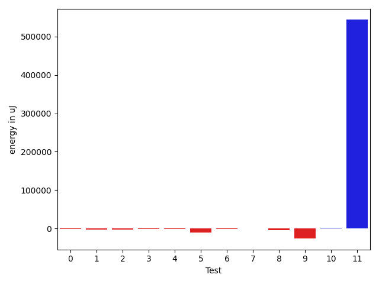

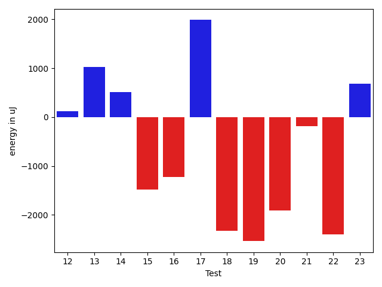

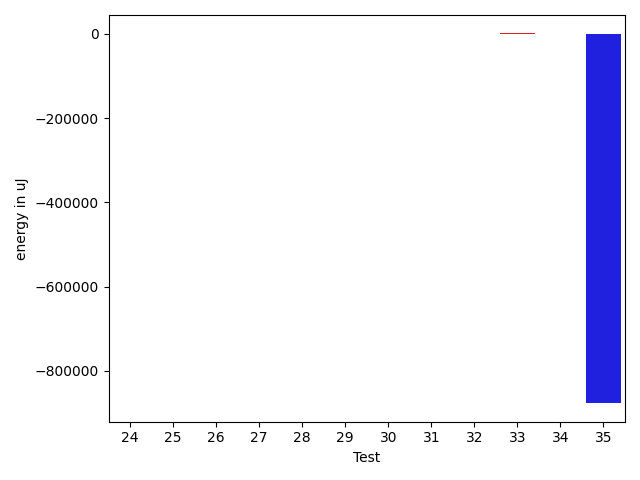

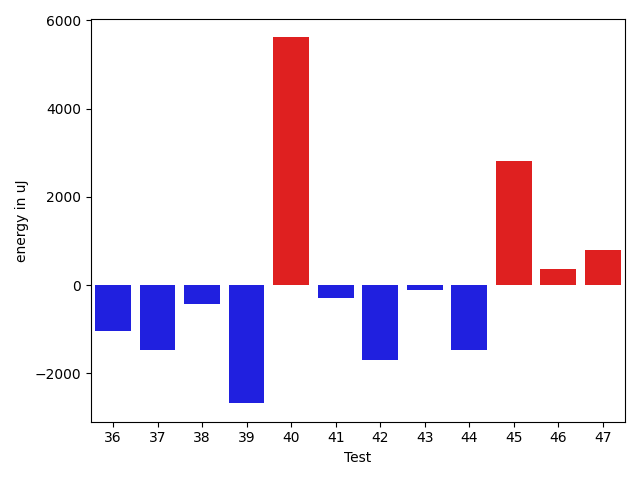

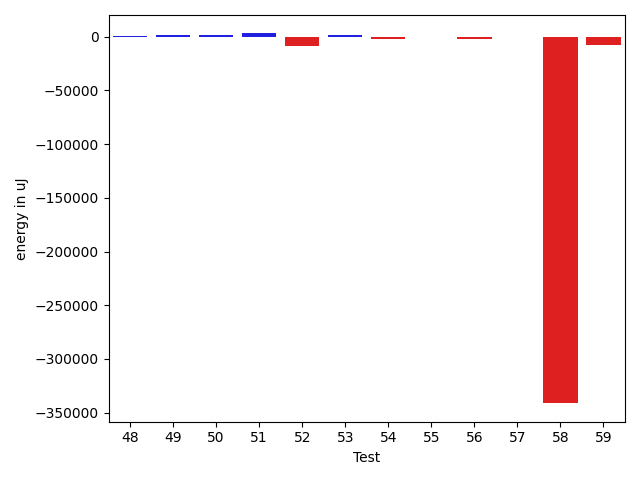

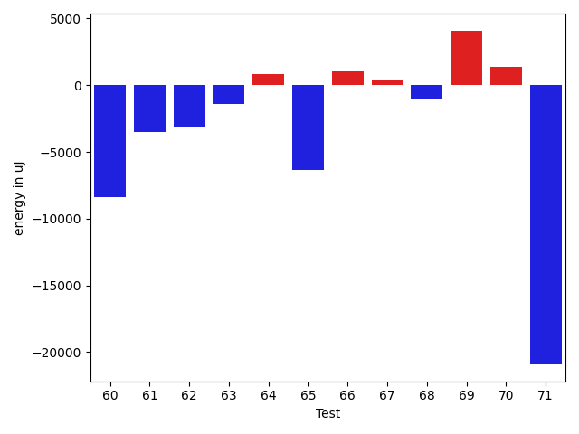

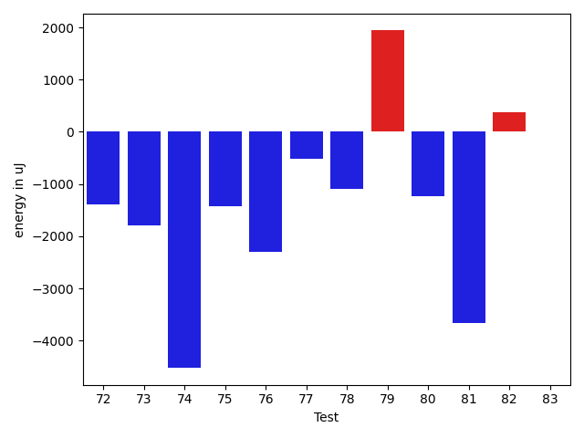

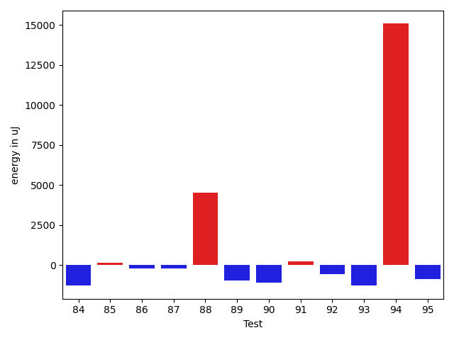

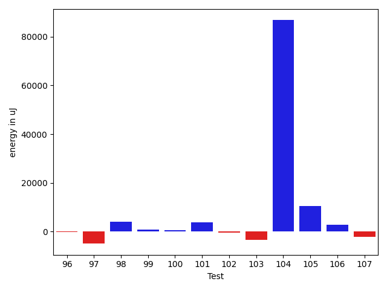

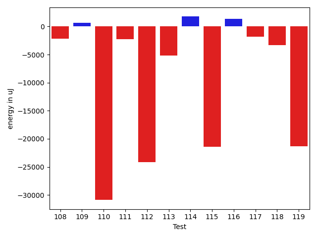

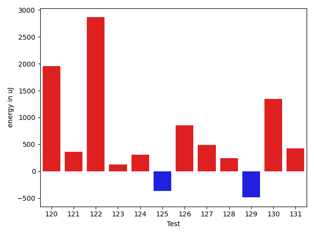

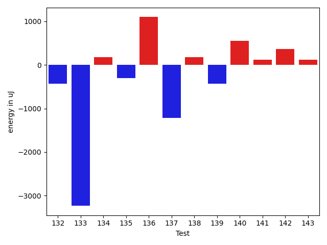

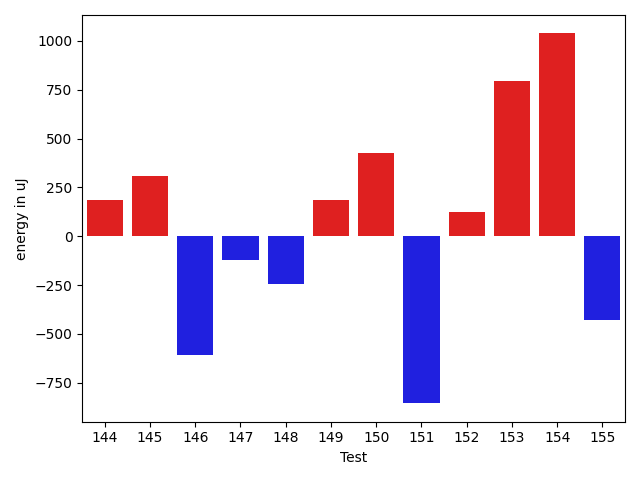

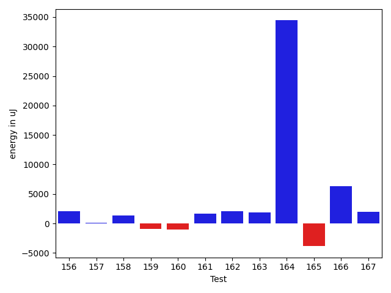

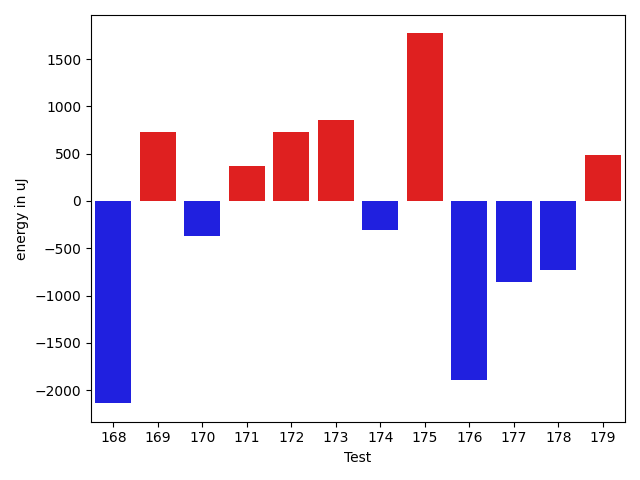

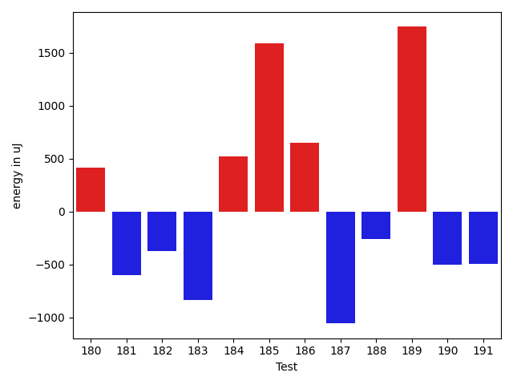

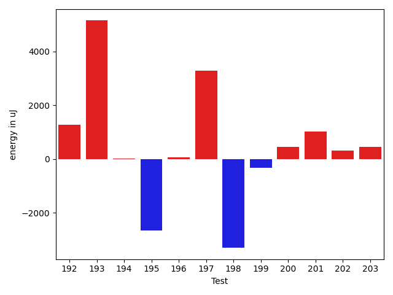

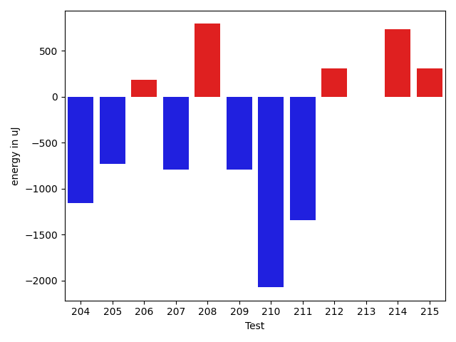

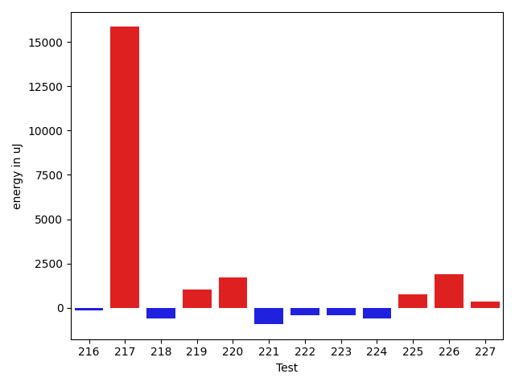

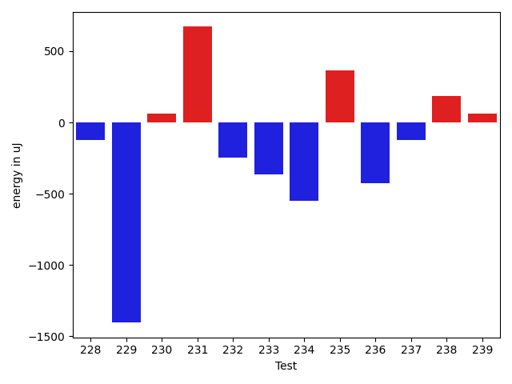

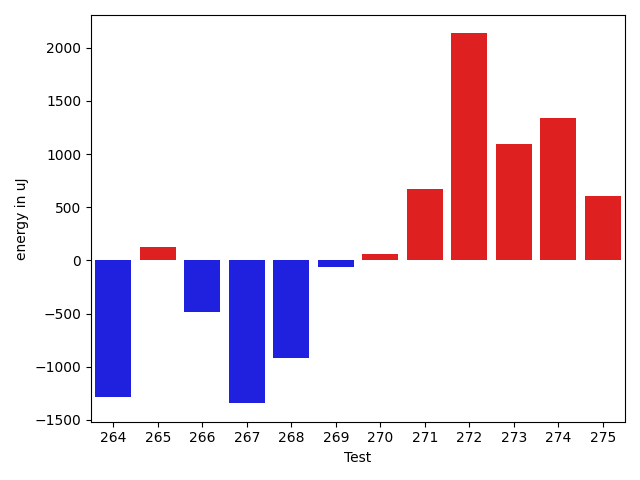

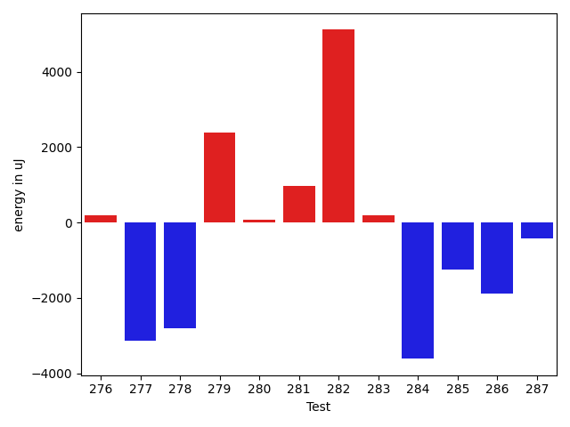

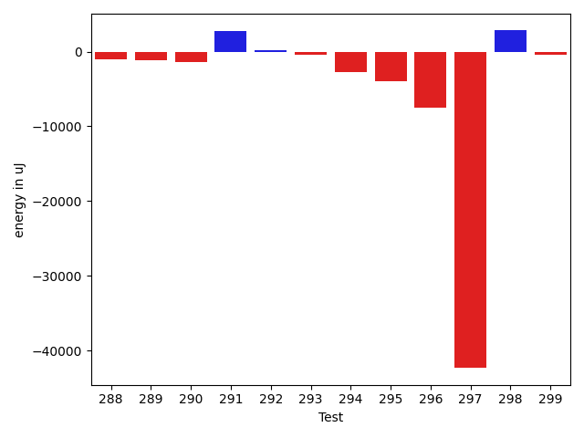

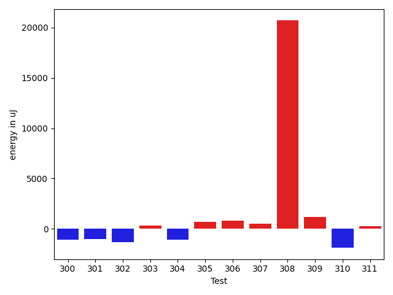

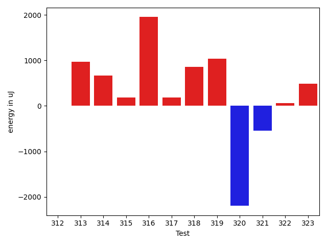

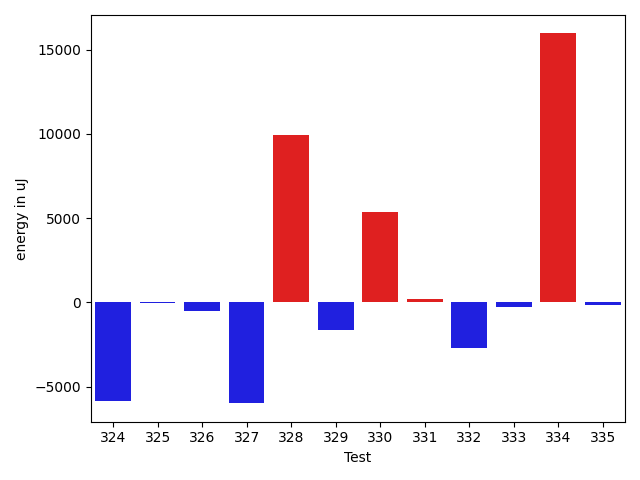

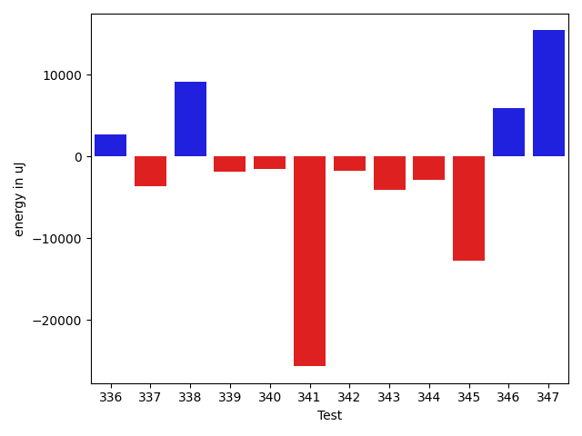

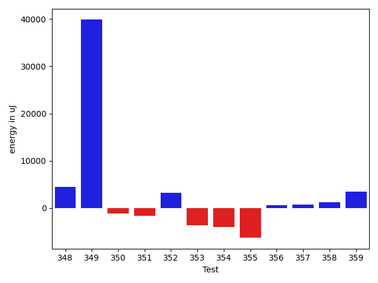

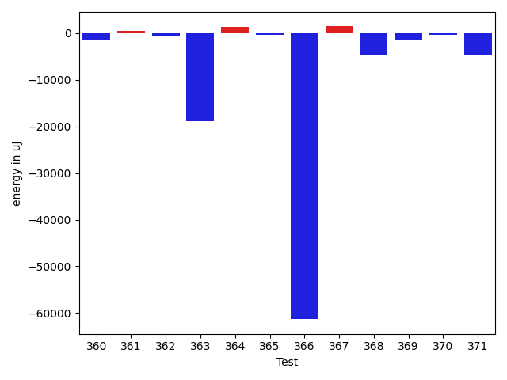

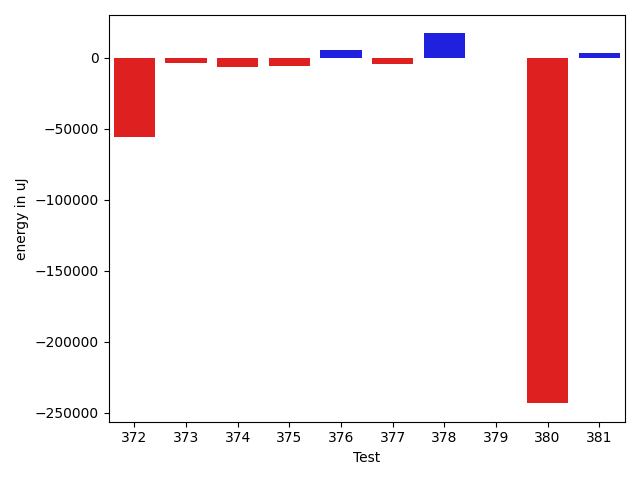

| ID | EnergyV1 | EnergyV2 | DeltaEnergy | σV1 | σV2 |
| --- | --- | --- | --- | --- | --- |
| 0 | 44226.120689655174 | 48889.07692307692 | 4662.956233421748 | 6920.00853616572 | 16150.14907867149 |
| 1 | 49594.89090909091 | 47206.94915254237 | -2387.9417565485346 | 15872.268594997238 | 11261.90672573297 |
| 2 | 63539.958333333336 | 56209.666666666664 | -7330.2916666666715 | 38999.395874037975 | 27564.321201747945 |
| 3 | 43784.62903225807 | 45222.32075471698 | 1437.6917224589124 | 8652.651902337695 | 10742.012837582015 |
| 4 | 42070.02127659575 | 42727.0 | 656.9787234042524 | 3526.559823827843 | 4311.078946157215 |
| 5 | 48468.7816091954 | 45374.602150537634 | -3094.179458657767 | 17219.94599389804 | 10885.520297787507 |
| 6 | 46470.2808988764 | 44373.16091954023 | -2097.119979336174 | 11774.122937338801 | 9916.973896378935 |
| 7 | 50166.2875 | 43305.545454545456 | -6860.742045454543 | 19943.378285908428 | 4930.35915697478 |
| 8 | 42387.45652173913 | 42451.85106382979 | 64.39454209066025 | 3509.4434323167798 | 3183.959932247648 |
| 9 | 61888.42857142857 | 49690.61666666667 | -12197.811904761904 | 44540.01329737804 | 32981.93762657154 |
| 10 | 80818.953125 | 64729.13114754098 | -16089.821977459018 | 172721.1636223097 | 128602.35711929442 |
| 11 | 45211.08 | 43454.39215686275 | -1756.6878431372534 | 8494.272639467137 | 6127.155464120941 |
| 12 | 42142.73333333333 | 42607.24 | 464.506666666668 | 2725.105416105749 | 1914.7147940098023 |
| 13 | 42672.19047619047 | 42627.470588235294 | -44.71988795517973 | 3407.747456256637 | 2959.193592809227 |
| 14 | 49589.45 | 52436.59259259259 | 2847.142592592594 | 17482.004864216808 | 22188.731240066336 |
| 15 | 44418.204545454544 | 44878.166666666664 | 459.9621212121201 | 10434.477250005792 | 10309.678820263225 |
| 16 | 49745.05128205128 | 47387.63333333333 | -2357.41794871795 | 19238.17013254255 | 13246.377973242346 |
| 17 | 42918.120689655174 | 41933.549019607846 | -984.5716700473276 | 3682.7512489029277 | 4090.893201829345 |
| 18 | 127679.63636363637 | 112135.48484848485 | -15544.15151515152 | 210816.3407242731 | 132953.5896088027 |
| 19 | 49210.87272727273 | 46322.89361702128 | -2887.97911025145 | 20848.392558969445 | 10681.154651572571 |
| 20 | 45605.217391304344 | 44873.142857142855 | -732.0745341614893 | 17060.445720148473 | 11583.939103036459 |
| 21 | 42091.04918032787 | 43117.10344827586 | 1026.0542679479913 | 3128.5670339799162 | 6762.908443117362 |
| 22 | 42673.75471698113 | 42405.7962962963 | -267.95842068483034 | 2892.031687146405 | 3985.533290119774 |
| 23 | 41923.31914893617 | 42810.21276595745 | 886.8936170212764 | 3302.497263396246 | 5916.9676856501865 |
| 24 | 43984.49315068493 | 42952.14117647059 | -1032.3519742143399 | 8647.03753233265 | 4305.500996066316 |
| 25 | 49514.0 | 58453.0 | 8939.0 | 27557.83753852976 | 46999.44764986986 |
| 26 | 54316.055555555555 | 50478.47826086957 | -3837.577294685987 | 43061.01030253112 | 20461.01086131667 |
| 27 | 43256.01388888889 | 42408.55882352941 | -847.4550653594779 | 8931.984822804341 | 3163.412883274835 |
| 28 | 55226.79797979798 | 55601.68686868687 | 374.8888888888905 | 21025.53838990694 | 22876.58308465714 |
| 29 | 42280.43103448276 | 42473.06 | 192.6289655172368 | 3541.4681453535763 | 2894.4112797596686 |
| 30 | 68475.26229508196 | 55251.32 | -13223.942295081964 | 61435.81551849869 | 42086.0913901208 |
| 31 | 42564.25490196078 | 41769.936170212764 | -794.3187317480188 | 2520.1087654954404 | 2579.133191055156 |
| 32 | 42762.02564102564 | 41633.0 | -1129.0256410256407 | 2683.2788637935123 | 3088.760878967788 |
| 33 | 41641.125 | 41992.23529411765 | 351.1102941176505 | 4588.863011070934 | 2867.7432719907906 |
| 34 | 43377.434782608696 | 42276.77777777778 | -1100.657004830915 | 2643.189687481313 | 2710.1617326801643 |
| 35 | 780889.8181818182 | 730641.303030303 | -50248.515151515254 | 688443.1060005937 | 646497.565147187 |
| 36 | 47383.120689655174 | 44405.36538461538 | -2977.755305039791 | 14951.834138530417 | 11928.385834491359 |
| 37 | 68696.49494949495 | 68938.68686868687 | 242.19191919191508 | 23953.78235980455 | 20756.012369619733 |
| 38 | 46469.279569892475 | 45082.93258426966 | -1386.3469856228112 | 12772.029398419765 | 11830.42571992049 |
| 39 | 67016.44444444444 | 59065.90476190476 | -7950.539682539675 | 44852.35114390106 | 40687.38994648829 |
| 40 | 65947.15584415584 | 67879.325 | 1932.1691558441526 | 24269.065486460375 | 23852.65909168986 |
| 41 | 42564.333333333336 | 48284.8 | 5720.466666666667 | 2757.860729905619 | 28447.62371376562 |
| 42 | 42197.36363636364 | 40873.892857142855 | -1323.4707792207846 | 2578.503404528009 | 3115.8558367907954 |
| 43 | 42110.1 | 41731.30303030303 | -378.7969696969667 | 3116.64001075945 | 3156.897618681877 |
| 44 | 45583.578125 | 41318.4 | -4265.1781249999985 | 27693.207850597526 | 7230.146334744423 |
| 45 | 102236.67676767676 | 137736.31313131313 | 35499.63636363637 | 158491.9145208404 | 239832.94557698755 |
| 46 | 51741.73737373737 | 57150.919191919194 | 5409.1818181818235 | 18455.525646827955 | 20604.06525920531 |
| 47 | 43827.46428571428 | 45351.76404494382 | 1524.299759229536 | 8045.479874773856 | 10701.368776278025 |
| 48 | 72083.96103896105 | 57465.80597014925 | -14618.155068811793 | 37594.540063802764 | 46221.47750864044 |
| 49 | 45331.95081967213 | 42522.05 | -2809.900819672126 | 9669.88227406635 | 4307.722013721405 |
| 50 | 62800.170454545456 | 60477.16279069767 | -2323.007663847784 | 30848.415677316243 | 32104.462831426248 |
| 51 | 43250.96428571428 | 44044.354166666664 | 793.3898809523816 | 4695.389181969164 | 4673.539043066397 |
| 52 | 46450.09333333333 | 46318.74603174603 | -131.34730158730235 | 11842.398127826793 | 11705.224276538727 |
| 53 | 45499.2625 | 42623.63888888889 | -2875.6236111111066 | 11091.676626804161 | 5499.821348880231 |
| 54 | 42080.811320754714 | 42597.5306122449 | 516.7192914901825 | 3940.8923999262365 | 3822.075673393258 |
| 55 | 44108.67901234568 | 42999.14102564102 | -1109.5379867046577 | 11306.220077469608 | 7196.084493960194 |
| 56 | 42055.2 | 42338.39344262295 | 283.19344262295635 | 4422.472727634018 | 3517.8138669605532 |
| 57 | 42361.35593220339 | 41462.62790697674 | -898.7280252266501 | 3302.2053635627776 | 3032.900131950274 |
| 58 | 72220.57142857143 | 61931.82653061225 | -10288.744897959186 | 49493.504481468495 | 24077.581604024934 |
| 59 | 44285.57692307692 | 43274.67123287671 | -1010.9056902002121 | 7873.542034380699 | 4999.536885551939 |
| 60 | 76156.28282828283 | 67735.72448979592 | -8420.55833848691 | 31864.793656772603 | 29517.353704385634 |
| 61 | 45889.8625 | 42361.256097560974 | -3528.606402439029 | 12353.227261270384 | 4350.380582765356 |
| 62 | 49649.77380952381 | 46451.7972972973 | -3197.976512226509 | 17864.55635459377 | 16415.218089272254 |
| 63 | 47263.5632183908 | 45862.20987654321 | -1401.3533418475927 | 14124.336317396403 | 11403.67388246789 |
| 64 | 43244.608695652176 | 44045.6 | 800.9913043478227 | 9865.943226343421 | 7494.323311783291 |
| 65 | 81974.29292929293 | 75602.8350515464 | -6371.457877746536 | 43785.10248752976 | 41861.36136232089 |
| 66 | 42287.48148148148 | 43343.65217391304 | 1056.1706924315586 | 5178.253683687198 | 6139.779859212929 |
| 67 | 42279.148148148146 | 42702.13333333333 | 422.9851851851854 | 4309.755528889414 | 2719.9484643810606 |
| 68 | 47508.84 | 46493.93670886076 | -1014.9032911392351 | 23221.17906282395 | 10454.530301808745 |
| 69 | 54580.41237113402 | 58687.80434782609 | 4107.391976692066 | 20619.846657540045 | 24435.232458676266 |
| 70 | 42757.26829268293 | 44143.18918918919 | 1385.9208965062571 | 3080.0617670745905 | 9771.325523065996 |
| 71 | 164604.62626262626 | 143658.51515151514 | -20946.111111111124 | 65655.51202284185 | 51096.87788963189 |
| 72 | 44063.15909090909 | 42670.69047619047 | -1392.4686147186148 | 6982.321400063233 | 3552.7748275993486 |
| 73 | 42379.45 | 40591.82352941176 | -1787.626470588235 | 3838.0975557559764 | 3381.5107350430035 |
| 74 | 103782.23232323233 | 99256.48484848485 | -4525.747474747477 | 57977.2829933368 | 53964.556465633985 |
| 75 | 44177.37254901961 | 42746.44 | -1430.932549019606 | 8693.007721920192 | 5766.26190234193 |
| 76 | 50357.48529411765 | 48057.25806451613 | -2300.2272296015217 | 21013.121636878568 | 19833.921492536774 |
| 77 | 53396.857142857145 | 52886.05405405405 | -510.80308880309167 | 23584.21382496132 | 27461.53259826783 |
| 78 | 48568.171428571426 | 47481.89189189189 | -1086.2795366795326 | 14484.250279894095 | 14725.097961925841 |
| 79 | 41562.55172413793 | 43504.045454545456 | 1941.4937304075283 | 3537.2062381860833 | 2402.675657702409 |
| 80 | 84812.84210526316 | 83577.81578947368 | -1235.0263157894806 | 41108.87119430314 | 49024.06003707463 |
| 81 | 65808.16326530612 | 62140.282608695656 | -3667.8806566104686 | 45256.55909767224 | 53393.99812129314 |
| 82 | 41608.05882352941 | 41986.916666666664 | 378.8578431372516 | 2132.98618264707 | 3666.754024527537 |
| 83 | 42726.0 | 42741.13636363636 | 15.136363636360329 | 5230.985122215242 | 3678.3709190032205 |
| 84 | 42693.944444444445 | 41407.46153846154 | -1286.4829059829062 | 2871.0522359159586 | 2833.1628863918854 |
| 85 | 41826.0 | 41977.619047619046 | 151.6190476190459 | 3987.975816264576 | 4256.9726161763465 |
| 86 | 42290.94871794872 | 42082.820512820515 | -208.12820512820326 | 3138.5068060670387 | 3950.0477236441593 |
| 87 | 42525.717948717946 | 42291.41935483871 | -234.29859387923352 | 3245.700722010169 | 3512.7382919899524 |
| 88 | 67269.3947368421 | 71794.16176470589 | 4524.767027863782 | 108568.3711062295 | 117148.83205847598 |
| 89 | 43784.850746268654 | 42816.463768115944 | -968.3869781527101 | 8203.157650588577 | 6482.649446244193 |
| 90 | 42728.87272727273 | 41625.895833333336 | -1102.9768939393907 | 3725.711778510104 | 3546.058975818456 |
| 91 | 41768.22222222222 | 42000.75 | 232.527777777781 | 3476.872874819315 | 3912.2132996279374 |
| 92 | 43520.137931034486 | 42948.28571428572 | -571.8522167487681 | 3150.8334171063916 | 2572.356694936842 |
| 93 | 43307.41176470588 | 42049.83928571428 | -1257.5724789915985 | 6789.523062681584 | 3464.478283629781 |
| 94 | 54525.09375 | 69608.76315789473 | 15083.669407894733 | 38308.816219604865 | 57277.05111649692 |
| 95 | 43331.8 | 42452.107142857145 | -879.692857142858 | 2206.613459580087 | 3416.20406862945 |
| 96 | 42646.0 | 42426.63636363636 | -219.36363636363967 | 2598.196104992847 | 3578.82260830402 |
| 97 | 41994.6 | 41990.22580645161 | -4.3741935483849375 | 3461.2150929984114 | 2500.711894895034 |
| 98 | 42607.565217391304 | 42766.82608695652 | 159.26086956521613 | 2948.1775479849143 | 3722.1357316112026 |
| 99 | 41882.666666666664 | 43531.34782608696 | 1648.6811594202954 | 3029.9319390962487 | 3873.2086979851024 |
| 100 | 257877.7373737374 | 248977.81818181818 | -8899.919191919209 | 82909.48776726349 | 72874.9832096401 |
| 101 | 190924.9292929293 | 187428.58585858587 | -3496.3434343434346 | 33740.88065894939 | 36257.70109155638 |
| 102 | 42806.782608695656 | 42361.75 | -445.03260869565565 | 4495.77159752237 | 3378.366143361479 |
| 103 | 42839.81481481482 | 42033.56 | -806.2548148148198 | 3209.323835985544 | 3274.562115214796 |
| 104 | 42348.48387096774 | 42944.32 | 595.8361290322573 | 3630.416832647749 | 2575.8034508867327 |
| 105 | 43017.30508474576 | 44770.2037037037 | 1752.8986189579373 | 6624.465036934481 | 8200.881170765939 |
| 106 | 42931.36111111111 | 43279.36363636364 | 348.0025252525302 | 3598.6739313312632 | 3758.0896002525237 |
| 107 | 41848.0 | 43123.57692307692 | 1275.576923076922 | 3736.175195425007 | 3350.166955346886 |
| 108 | 55403.63888888889 | 51052.692307692305 | -4350.946581196586 | 40009.92013214611 | 26091.815786931566 |
| 109 | 45503.829268292684 | 42767.86842105263 | -2735.9608472400505 | 9843.928144410347 | 5152.867889116407 |
| 110 | 48165.67567567567 | 50973.469696969696 | 2807.794021294023 | 16292.579787684239 | 19538.34973352887 |
| 111 | 53319.67741935484 | 64693.717391304344 | 11374.039971949504 | 25843.411589912408 | 37201.86390121441 |
| 112 | 42390.816666666666 | 42120.8 | -270.0166666666628 | 5203.961921753035 | 3687.048367962144 |
| 113 | 50774.57894736842 | 48651.634146341465 | -2122.9448010269552 | 25820.097619603854 | 18766.264968452066 |
| 114 | 41841.916666666664 | 42876.114285714284 | 1034.1976190476198 | 2613.261769587748 | 2698.0038311042226 |
| 115 | 42363.67647058824 | 43289.48717948718 | 925.8107088989418 | 3254.2556546646656 | 2836.2026696216485 |
| 116 | 41830.86 | 42204.458333333336 | 373.5983333333352 | 2692.609002510391 | 3337.9835976625004 |
| 117 | 42556.625 | 42601.1875 | 44.5625 | 2592.260390928157 | 2389.857297485302 |
| 118 | 41726.62790697674 | 42111.67346938775 | 385.0455624110109 | 2812.0483060396155 | 2659.5382934250238 |
| 119 | 42420.71111111111 | 42352.25490196078 | -68.45620915032487 | 2102.694331061113 | 2695.8880005474225 |
| 120 | 41450.81578947369 | 43662.767441860466 | 2211.9516523867787 | 2560.654520104116 | 2387.0974574780366 |
| 121 | 45173.014492753624 | 43842.298507462685 | -1330.715985290939 | 10760.422441323206 | 7880.126908241882 |
| 122 | 78976.55056179775 | 97371.90123456791 | 18395.35067277016 | 62040.95313092402 | 74189.26944881091 |
| 123 | 47814.637931034486 | 50399.47619047619 | 2584.8382594417053 | 13206.637440028187 | 15755.22653200613 |
| 124 | 42269.9 | 42753.807692307695 | 483.90769230769365 | 2082.2832996496895 | 3029.029954130159 |
| 125 | 60305.07070707071 | 59370.40404040404 | -934.6666666666642 | 22325.14068468461 | 22785.708224926842 |
| 126 | 45493.60526315789 | 52722.148148148146 | 7228.542884990253 | 15059.938882135495 | 34564.52099098259 |
| 127 | 42440.71929824561 | 42797.836363636365 | 357.11706539075385 | 2447.728426015091 | 2268.3624430904206 |
| 128 | 42559.08888888889 | 42665.166666666664 | 106.07777777777665 | 3119.3085118498243 | 3428.036516887052 |
| 129 | 47897.91044776119 | 51546.779411764706 | 3648.8689640035154 | 14807.149410457849 | 21853.744586821886 |
| 130 | 44008.57692307692 | 52083.270833333336 | 8074.693910256414 | 10990.776980209279 | 17730.931913771932 |
| 131 | 42544.02898550725 | 42529.692307692305 | -14.33667781494296 | 2738.2814401621777 | 2585.1809801631375 |
| 132 | 45221.31481481482 | 45173.55357142857 | -47.76124338624504 | 9847.063703768594 | 11355.765011531812 |
| 133 | 166232.202020202 | 163412.24242424243 | -2819.9595959595754 | 27698.83642379071 | 32540.55482075007 |
| 134 | 42404.041666666664 | 42519.6875 | 115.64583333333576 | 3010.8104456990577 | 2410.5918633212086 |
| 135 | 42456.5 | 42836.065217391304 | 379.56521739130403 | 2569.9721842420354 | 2257.446281340487 |
| 136 | 45709.43396226415 | 54897.69642857143 | 9188.262466307278 | 11310.294820422865 | 39743.61764256695 |
| 137 | 43668.67647058824 | 42383.86046511628 | -1284.8160054719556 | 2322.149824428524 | 2739.096325105131 |
| 138 | 42662.208333333336 | 42264.48780487805 | -397.7205284552838 | 2923.623244069572 | 4115.3278689994395 |
| 139 | 43092.02173913043 | 45478.17307692308 | 2386.151337792646 | 2780.7050598656074 | 16726.07159004854 |
| 140 | 43725.5 | 43023.08108108108 | -702.4189189189201 | 7321.8327339084535 | 2093.788747163902 |
| 141 | 59700.968253968254 | 68977.98484848485 | 9277.016594516594 | 51199.9838374132 | 61104.70950343983 |
| 142 | 42600.95348837209 | 42728.704545454544 | 127.75105708245246 | 2801.4229769013973 | 2716.711076245967 |
| 143 | 41417.67647058824 | 41868.032258064515 | 450.3557874762773 | 2884.6330046990915 | 3164.227067459491 |
| 144 | 42580.69047619047 | 42558.05882352941 | -22.631652661060798 | 2789.8995671298276 | 2547.4260320363874 |
| 145 | 43421.72340425532 | 43539.62222222222 | 117.89881796690315 | 6147.664786547012 | 6628.439800633124 |
| 146 | 42899.47368421053 | 42467.51162790698 | -431.9620563035496 | 2578.2783294369756 | 2812.5845382403195 |
| 147 | 42510.12195121951 | 42688.28571428572 | 178.16376306620805 | 2314.3918043737303 | 2763.685951915725 |
| 148 | 42780.293103448275 | 42795.69696969697 | 15.403866248692793 | 5466.869809821581 | 3263.82552067122 |
| 149 | 42363.21621621621 | 42918.04878048781 | 554.8325642715936 | 2066.8523808103373 | 2640.6817112366057 |
| 150 | 42724.48837209302 | 43142.97619047619 | 418.4878183831679 | 2536.38242084046 | 2011.085332281756 |
| 151 | 42634.47619047619 | 41907.260869565216 | -727.2153209109747 | 2480.8560469369404 | 2319.915276140232 |
| 152 | 42323.28571428572 | 42177.955555555556 | -145.3301587301612 | 3141.3331207482925 | 2353.6916153665743 |
| 153 | 41931.1 | 42238.82608695652 | 307.7260869565216 | 3411.6254762209755 | 3207.6522316671844 |
| 154 | 41934.8125 | 42253.0 | 318.1875 | 2845.7965101784334 | 2653.6604735894357 |
| 155 | 42329.58823529412 | 42888.0 | 558.4117647058811 | 2453.6819166503396 | 2868.5213752036084 |
| 156 | 51435.692307692305 | 51969.78571428572 | 534.0934065934125 | 22663.927665433603 | 29307.965425912156 |
| 157 | 42400.270833333336 | 41929.666666666664 | -470.6041666666715 | 3063.5253435896316 | 3082.7451717018057 |
| 158 | 43813.041666666664 | 44301.41935483871 | 488.3776881720478 | 5150.66877922313 | 7801.576134280831 |
| 159 | 44130.755102040814 | 44134.03773584906 | 3.2826338082450093 | 7735.790780602166 | 6097.476691105592 |
| 160 | 47977.25 | 53525.53571428572 | 5548.285714285717 | 19740.925255354676 | 28142.67984686267 |
| 161 | 113220.46464646465 | 122061.90816326531 | 8841.44351680066 | 43344.383781293545 | 53079.13252314823 |
| 162 | 42837.38333333333 | 42243.269230769234 | -594.1141025640973 | 3785.992389020641 | 3727.771112337282 |
| 163 | 43235.83783783784 | 44556.39189189189 | 1320.5540540540533 | 7621.590528880414 | 10308.59026566386 |
| 164 | 41601.1914893617 | 42141.88636363636 | 540.6948742746608 | 4377.419008513783 | 4059.5832926316525 |
| 165 | 58880.666666666664 | 61396.02857142857 | 2515.3619047619068 | 36954.298551148386 | 46940.376375924694 |
| 166 | 42284.51724137931 | 44743.269230769234 | 2458.7519893899225 | 3130.030523379755 | 8740.492322684084 |
| 167 | 60331.65217391304 | 43095.0 | -17236.65217391304 | 78691.375421358 | 2820.4974991758354 |
| 168 | 43133.0 | 41419.52380952381 | -1713.4761904761908 | 3316.088219110444 | 3000.9538899211875 |
| 169 | 43153.69072164949 | 43599.969696969696 | 446.2789753202087 | 8479.216293732183 | 9114.595149344565 |
| 170 | 53913.80434782609 | 55933.179487179485 | 2019.3751393533967 | 26894.20439152318 | 26601.911729906424 |
| 171 | 45722.051546391755 | 48143.62765957447 | 2421.5761131827167 | 13270.260820136746 | 15332.474869960108 |
| 172 | 42069.7027027027 | 43616.10526315789 | 1546.4025604551935 | 2919.3765149323654 | 2859.553956655641 |
| 173 | 47556.95348837209 | 50504.241758241755 | 2947.288269869663 | 14410.775510422405 | 17126.18151620986 |
| 174 | 41111.42857142857 | 42452.73809523809 | 1341.3095238095193 | 3529.182942962572 | 3698.316161634359 |
| 175 | 43201.92307692308 | 44415.225 | 1213.3019230769205 | 6216.051341175852 | 7801.537946095948 |
| 176 | 42836.333333333336 | 41592.791666666664 | -1243.5416666666715 | 2605.211273155745 | 3837.9904244622458 |
| 177 | 63168.71232876712 | 60244.50617283951 | -2924.2061559276117 | 56396.54254837255 | 52657.136399360206 |
| 178 | 42722.467741935485 | 41745.34042553192 | -977.1273164035665 | 3287.772408523702 | 3366.9633725651906 |
| 179 | 53121.739130434784 | 59989.26666666667 | 6867.527536231886 | 37815.72165833468 | 45939.73593773574 |
| 180 | 41970.97959183674 | 42385.25 | 414.2704081632619 | 3467.6024858082433 | 3700.2951435038885 |
| 181 | 43076.40425531915 | 42474.0625 | -602.3417553191466 | 3719.2126463699356 | 3623.175336210916 |
| 182 | 42564.43396226415 | 42193.13725490196 | -371.2967073621912 | 2828.5211250886887 | 3402.9858862395254 |
| 183 | 42798.57142857143 | 41965.08823529412 | -833.4831932773086 | 2855.5354526057695 | 2809.0868347482083 |
| 184 | 43279.95918367347 | 43800.816666666666 | 520.8574829931968 | 2684.9414842495603 | 8196.343423526669 |
| 185 | 42759.1724137931 | 44352.74193548387 | 1593.5695216907698 | 6004.470108229227 | 9663.17105825746 |
| 186 | 41833.944444444445 | 42486.25806451613 | 652.3136200716835 | 3913.6520853368825 | 3400.708322495921 |
| 187 | 43148.17647058824 | 42091.67391304348 | -1056.502557544758 | 7259.840668877353 | 3647.9564026186545 |
| 188 | 50454.32307692308 | 50197.37096774193 | -256.95210918114753 | 17408.927889145485 | 20294.811116775847 |
| 189 | 42179.61111111111 | 43925.34782608696 | 1745.7367149758502 | 4019.8864983823287 | 6827.944754805005 |
| 190 | 42849.78947368421 | 42347.27272727273 | -502.51674641148566 | 3065.6559885103215 | 3223.5731471010154 |
| 191 | 42884.6 | 42391.925 | -492.67499999999563 | 3172.974618380816 | 3255.9561835772606 |
| 192 | 48522.76119402985 | 49804.52702702703 | 1281.7658329971746 | 13894.909101107729 | 29518.488763330875 |
| 193 | 43885.58139534884 | 49036.29268292683 | 5150.711287577993 | 2729.4386358060174 | 42115.031168272704 |
| 194 | 41925.333333333336 | 41943.68965517241 | 18.35632183907728 | 3713.595327880955 | 3303.0158434840682 |
| 195 | 45620.62903225807 | 42960.0350877193 | -2660.5939445387703 | 9478.077185620325 | 2530.8285930086026 |
| 196 | 42034.25 | 42096.17647058824 | 61.92647058823786 | 4544.051406784479 | 3137.5008645003563 |
| 197 | 44773.446153846155 | 48066.015625 | 3292.5694711538454 | 13766.285177960928 | 26369.516393515463 |
| 198 | 45178.71604938272 | 41870.81481481482 | -3307.9012345679002 | 20193.41531428437 | 3469.362467178863 |
| 199 | 42465.666666666664 | 42137.944444444445 | -327.722222222219 | 3840.3473367218585 | 3719.058280924565 |
| 200 | 45796.58024691358 | 46238.730769230766 | 442.15052231718437 | 12610.968654960649 | 14074.384481393097 |
| 201 | 47622.228070175435 | 48638.51724137931 | 1016.2891712038763 | 19414.9217582201 | 19992.070869809762 |
| 202 | 41736.755102040814 | 42056.816326530614 | 320.0612244898002 | 3328.932380984608 | 3317.6535270349937 |
| 203 | 42558.75 | 43005.77777777778 | 447.027777777781 | 3236.3329405031423 | 3464.060247031181 |
| 204 | 43272.75 | 42154.517857142855 | -1118.232142857145 | 5309.128408385954 | 3106.544629551523 |
| 205 | 42167.15789473684 | 42288.514285714286 | 121.3563909774457 | 3735.6153479314257 | 3642.0283075029865 |
| 206 | 42556.21951219512 | 42258.40909090909 | -297.8104212860344 | 2804.9065417428724 | 3012.4907266411924 |
| 207 | 47681.275 | 43584.666666666664 | -4096.608333333337 | 26550.287102014074 | 10263.454798891493 |
| 208 | 41595.30952380953 | 41917.560975609755 | 322.2514518002281 | 3209.1495052509094 | 3090.9600690919647 |
| 209 | 70358.94117647059 | 80607.58064516129 | 10248.6394686907 | 146260.70411988182 | 198092.5046327166 |
| 210 | 42963.09090909091 | 42663.72222222222 | -299.36868686869275 | 4034.8008164095504 | 3755.459445269211 |
| 211 | 42661.041666666664 | 41971.74074074074 | -689.300925925927 | 3021.279385171766 | 3739.0123729906577 |
| 212 | 75774.97222222222 | 44443.25806451613 | -31331.71415770609 | 195674.3672142411 | 7972.084302549182 |
| 213 | 94809.03076923077 | 121208.75 | 26399.71923076923 | 195001.72377336482 | 294398.68462505954 |
| 214 | 45489.565217391304 | 46880.13978494624 | 1390.5745675549333 | 12391.973873635994 | 15462.160361507586 |
| 215 | 42399.142857142855 | 42875.82608695652 | 476.6832298136651 | 1981.440055585218 | 2478.444106116892 |
| 216 | 42712.37777777778 | 42560.02173913043 | -152.3560386473473 | 2449.529481248628 | 2935.114459579346 |
| 217 | 715793.7777777778 | 731651.1818181818 | 15857.404040404013 | 681816.2146583948 | 684927.8631993412 |
| 218 | 43897.0 | 43307.72222222222 | -589.277777777781 | 2391.168281405556 | 2992.0718166803485 |
| 219 | 42882.59016393442 | 43892.40677966102 | 1009.816615726595 | 2760.3931020664504 | 8748.393692982252 |
| 220 | 42350.620253164554 | 44062.44 | 1711.8197468354483 | 2568.097711496262 | 7954.631699397946 |
| 221 | 42276.95238095238 | 41338.92592592593 | -938.0264550264546 | 2955.2126259203574 | 3393.029127664497 |
| 222 | 42636.68 | 42207.833333333336 | -428.84666666666453 | 2571.6058908005325 | 2284.6526225130065 |
| 223 | 42334.391304347824 | 41901.76 | -432.63130434782215 | 2349.793196064754 | 2771.061042705483 |
| 224 | 43312.148148148146 | 42718.433333333334 | -593.7148148148117 | 2577.3893438718137 | 2698.8186141758806 |
| 225 | 42200.22727272727 | 42948.91071428572 | 748.6834415584453 | 2115.638146406168 | 2807.246243949917 |
| 226 | 41506.545454545456 | 43399.05263157895 | 1892.5071770334907 | 2614.977989256797 | 2736.4203754018 |
| 227 | 42747.6037735849 | 43081.10526315789 | 333.501489572991 | 2502.3082803278016 | 2644.0320862520175 |
| 228 | 42629.41860465116 | 42639.08571428571 | 9.667109634552617 | 2799.1658909816797 | 2868.9345595427535 |
| 229 | 43300.72222222222 | 42139.17647058824 | -1161.5457516339811 | 3522.835581452903 | 3062.8114772752047 |
| 230 | 44198.55 | 44796.41071428572 | 597.8607142857145 | 6851.921006610725 | 8558.334373114201 |
| 231 | 42093.48387096774 | 42396.55223880597 | 303.06836783822655 | 3052.537071408061 | 2880.164745928437 |
| 232 | 41659.45 | 41480.38461538462 | -179.06538461538003 | 2990.632817231162 | 2793.659071167626 |
| 233 | 42711.8125 | 42853.92857142857 | 142.11607142857247 | 2169.521708582428 | 3037.677068269179 |
| 234 | 44886.92857142857 | 42625.51111111111 | -2261.4174603174615 | 12266.347557429628 | 4494.8188326967565 |
| 235 | 53636.22222222222 | 71059.08823529411 | 17422.866013071893 | 34999.809049567295 | 56620.448384976116 |
| 236 | 42706.40740740741 | 43171.12195121951 | 464.7145438121006 | 2629.119938084609 | 5238.575514789521 |
| 237 | 42372.80952380953 | 42869.4375 | 496.6279761904734 | 3410.792333853118 | 3598.7218906291923 |
| 238 | 42696.0 | 43512.5 | 816.5 | 3031.839698507625 | 5756.796008693924 |
| 239 | 42460.09523809524 | 42037.0 | -423.0952380952367 | 2740.3667968733484 | 3235.6976958528385 |
| 240 | 42451.84444444445 | 42562.21951219512 | 110.37506775067595 | 2016.4073216772397 | 2179.0574323036576 |
| 241 | 43164.63636363636 | 43383.083333333336 | 218.44696969697543 | 2459.250524142644 | 6332.1995514767395 |
| 242 | 42715.71428571428 | 42556.137931034486 | -159.57635467979708 | 3227.1491641836383 | 3200.7903843306117 |
| 243 | 42424.2 | 41496.769230769234 | -927.430769230763 | 2819.6547164502254 | 2225.3706399624984 |
| 244 | 42078.458333333336 | 42544.0 | 465.54166666666424 | 2001.2965584666747 | 2486.5518963684094 |
| 245 | 42249.7037037037 | 42046.94871794872 | -202.75498575498204 | 2364.241399199749 | 2570.046671717471 |
| 246 | 43332.045454545456 | 42602.32 | -729.7254545454562 | 2367.058924589614 | 3046.562583896809 |
| 247 | 43450.32142857143 | 43323.07692307692 | -127.24450549450557 | 2120.5035630645352 | 2803.4074859970638 |
| 248 | 42997.41176470588 | 49794.36111111111 | 6796.949346405228 | 2931.6484332764353 | 41294.990300245576 |
| 249 | 42203.269230769234 | 45716.970588235294 | 3513.7013574660596 | 2621.7145675432785 | 13219.805481538795 |
| 250 | 42846.52631578947 | 42574.681818181816 | -271.8444976076571 | 2114.426819642446 | 3398.1018416217394 |
| 251 | 42224.71428571428 | 42466.77777777778 | 242.06349206349842 | 2296.2746671377918 | 3045.3349853241934 |
| 252 | 44654.380281690144 | 101238.26153846153 | 56583.88125677139 | 8100.194694871381 | 262036.87938111526 |
| 253 | 42190.851851851854 | 42782.42105263158 | 591.5692007797261 | 3731.3385712914987 | 3420.2165261679816 |
| 254 | 47254.82089552239 | 44591.2 | -2663.620895522392 | 14080.592481306958 | 8393.641742017187 |
| 255 | 42060.95744680851 | 42676.53571428572 | 615.5782674772054 | 5628.089967212703 | 3434.88586296279 |
| 256 | 41644.166666666664 | 42586.26470588235 | 942.0980392156853 | 3541.387139557354 | 2694.8153086209554 |
| 257 | 62963.65714285714 | 52057.72222222222 | -10905.934920634922 | 44138.044715540134 | 28438.248793180628 |
| 258 | 43235.933333333334 | 44293.431818181816 | 1057.498484848482 | 9055.779542860399 | 8212.237128483455 |
| 259 | 42192.35897435898 | 42308.393939393936 | 116.0349650349599 | 4450.954144249785 | 3307.3298388569556 |
| 260 | 42024.6 | 43302.58823529412 | 1277.9882352941204 | 3873.659153823423 | 3873.0954037978995 |
| 261 | 46740.948979591834 | 50734.8 | 3993.8510204081686 | 12962.174572989756 | 18704.23882248142 |
| 262 | 48479.45360824742 | 47063.0618556701 | -1416.3917525773213 | 14356.759209889062 | 14870.725207681015 |
| 263 | 41835.56363636364 | 44957.7868852459 | 3122.223248882263 | 3882.6665099862225 | 14267.552364115514 |
| 264 | 114651.75 | 74724.50515463918 | -39927.24484536082 | 220074.11259259155 | 153265.29291604712 |
| 265 | 48196.20879120879 | 48537.18085106383 | 340.97205985504115 | 14688.824686498643 | 14909.14862500914 |
| 266 | 43529.64705882353 | 42171.48484848485 | -1358.1622103386835 | 7096.778663932269 | 5684.078671225401 |
| 267 | 49516.21052631579 | 45036.15189873418 | -4480.0586275816095 | 51150.85130621401 | 15944.545094819236 |
| 268 | 41257.307692307695 | 40950.379310344826 | -306.928381962869 | 4003.3401704963894 | 3831.314300591478 |
| 269 | 45307.406593406595 | 45656.26136363636 | 348.85477022976556 | 13485.432166778775 | 12870.803267026782 |
| 270 | 44097.333333333336 | 43193.27536231884 | -904.0579710144957 | 9326.305206346853 | 8270.747664158034 |
| 271 | 59182.545454545456 | 59087.79452054795 | -94.75093399750767 | 44253.315397273145 | 33288.87851181256 |
| 272 | 54964.21951219512 | 65595.23809523809 | 10631.01858304297 | 38359.38360062772 | 55511.093638508966 |
| 273 | 57197.458333333336 | 42658.88888888889 | -14538.569444444445 | 74308.5207967314 | 2899.4984921832324 |
| 274 | 83493.97938144329 | 85110.77083333333 | 1616.7914518900361 | 28122.660984792212 | 26113.26563520891 |
| 275 | 48100.72289156626 | 53372.32558139535 | 5271.6026898290875 | 16392.218924985616 | 25515.22907782716 |
| 276 | 43441.27659574468 | 43629.0 | 187.7234042553173 | 6272.526803287721 | 6116.160786280587 |
| 277 | 48806.16981132075 | 45682.57142857143 | -3123.5983827493255 | 21536.21005159121 | 19004.98740167315 |
| 278 | 49993.155844155845 | 47193.493506493505 | -2799.6623376623393 | 32765.730584788333 | 14164.438743744224 |
| 279 | 41320.72 | 43697.933333333334 | 2377.213333333333 | 3902.4300533898113 | 8814.177972385678 |
| 280 | 42340.12280701754 | 42413.480769230766 | 73.3579622132238 | 5325.193096145362 | 3445.3090599917077 |
| 281 | 42117.25 | 43078.77419354839 | 961.5241935483864 | 3896.7930131712155 | 6312.683063891334 |
| 282 | 143735.64646464647 | 148846.9898989899 | 5111.343434343435 | 32653.901030216504 | 96699.40377193845 |
| 283 | 44781.87804878049 | 44984.71875 | 202.84070121950936 | 7409.834665201086 | 9246.084327413872 |
| 284 | 46007.64634146341 | 42396.15151515151 | -3611.4948263119004 | 10536.932149872806 | 3059.267684417619 |
| 285 | 43811.47619047619 | 42574.625 | -1236.8511904761908 | 2433.2531158150364 | 3158.3792232264213 |
| 286 | 43470.40740740741 | 41579.58620689655 | -1890.821200510858 | 3176.2535496708983 | 3518.044769639673 |
| 287 | 42493.944444444445 | 42076.833333333336 | -417.1111111111095 | 2089.273969381661 | 3822.4555988991624 |
| 288 | 43216.96428571428 | 42887.18518518518 | -329.7791005291001 | 2242.728893910638 | 4754.582016422856 |
| 289 | 43019.06349206349 | 42685.1129032258 | -333.950588837688 | 2661.293914162068 | 6203.323630756179 |
| 290 | 41984.380952380954 | 46697.57142857143 | 4713.190476190473 | 3887.009077576356 | 30493.189499689026 |
| 291 | 42944.72131147541 | 42157.536231884056 | -787.185079591356 | 6616.474525896771 | 3837.6495734612427 |
| 292 | 104123.25252525252 | 122420.11111111111 | 18296.858585858587 | 129197.20517267847 | 219434.94318453892 |
| 293 | 50643.75 | 56648.22222222222 | 6004.472222222219 | 19299.40077275717 | 28068.448789956787 |
| 294 | 43717.32 | 44362.243589743586 | 644.9235897435865 | 8166.069861991958 | 11150.159843842064 |
| 295 | 153853.8686868687 | 141890.27272727274 | -11963.595959595958 | 91601.03015946757 | 85025.70176483337 |
| 296 | 45049.558139534885 | 43349.023255813954 | -1700.5348837209312 | 9407.062152427989 | 7062.640119995883 |
| 297 | 42262.328571428574 | 43057.339622641506 | 795.0110512129322 | 3760.5043762066525 | 7139.890784385874 |
| 298 | 47061.62857142857 | 49775.08 | 2713.451428571432 | 21126.032723478147 | 23236.689695255645 |
| 299 | 46676.48611111111 | 46995.32432432433 | 318.8382132132174 | 15652.461477523679 | 12750.987705365469 |
| 300 | 44902.096774193546 | 43723.63157894737 | -1178.465195246179 | 9001.896701053682 | 6162.763855442633 |
| 301 | 47529.51612903226 | 46430.56140350877 | -1098.9547255234866 | 22700.383380123312 | 22253.916485598307 |
| 302 | 42494.22727272727 | 41542.31578947369 | -951.9114832535852 | 3869.0665650400406 | 3699.09045794591 |
| 303 | 56150.11627906977 | 57506.96296296296 | 1356.8466838931927 | 41762.811139961115 | 37790.67147562842 |
| 304 | 101252.24242424243 | 63277.816326530614 | -37974.42609771182 | 209736.92118240066 | 37604.997954936174 |
| 305 | 47159.15189873418 | 49385.92307692308 | 2226.771178188901 | 13117.577279098805 | 15537.849022644452 |
| 306 | 42014.46153846154 | 42987.46153846154 | 973.0 | 3459.911534337805 | 2869.04880687189 |
| 307 | 46882.47368421053 | 46430.56140350877 | -451.91228070175566 | 19714.200956088145 | 19117.724795828522 |
| 308 | 332408.9191919192 | 345485.8484848485 | 13076.9292929293 | 136561.15769938202 | 142614.43472137116 |
| 309 | 407806.3333333333 | 395716.3939393939 | -12089.939393939392 | 149468.06578062757 | 144086.01274616225 |
| 310 | 45146.0 | 44405.84905660377 | -740.1509433962274 | 6727.0167927717075 | 9732.355795782782 |
| 311 | 41667.32142857143 | 42305.36666666667 | 638.0452380952411 | 3347.0526059032404 | 2994.618923818002 |
| 312 | 49835.142857142855 | 45222.724137931036 | -4612.418719211819 | 25131.456300129255 | 15255.260975845069 |
| 313 | 42350.32608695652 | 42712.15 | 361.8239130434813 | 4798.240325343683 | 5027.409116781725 |
| 314 | 61515.0 | 47605.78048780488 | -13909.219512195123 | 82719.37939107404 | 12619.308690647964 |
| 315 | 90652.48192771085 | 93433.03797468354 | 2780.5560469726915 | 184653.08674222152 | 169181.4432423235 |
| 316 | 41342.90909090909 | 45324.6 | 3981.6909090909103 | 3486.6595488973903 | 14929.907846556407 |
| 317 | 41952.4 | 41999.625 | 47.224999999998545 | 3576.766632029549 | 3448.861422176165 |
| 318 | 42159.37142857143 | 42581.0 | 421.62857142856956 | 4179.447236764445 | 3452.4350319738096 |
| 319 | 41586.59523809524 | 42719.2 | 1132.6047619047604 | 3262.308808917272 | 6844.170173220418 |
| 320 | 131104.14285714287 | 102464.48333333334 | -28639.659523809532 | 239133.20198743904 | 197765.00748409217 |
| 321 | 59247.698113207545 | 53648.61403508772 | -5599.084078119828 | 52546.6163510706 | 40305.39436917272 |
| 322 | 42007.851851851854 | 42367.5641025641 | 359.7122507122476 | 4290.246325516483 | 3151.2729523558946 |
| 323 | 45344.303797468354 | 45823.47619047619 | 479.17239300783694 | 10206.408860699132 | 11779.715365099719 |
| 324 | 49990.982142857145 | 44115.795918367345 | -5875.1862244898 | 22246.9957293524 | 9298.594543744926 |
| 325 | 43805.91549295775 | 43796.65671641791 | -9.258776539842074 | 8403.461992396187 | 5645.89767739807 |
| 326 | 43657.132352941175 | 43166.6282051282 | -490.5041478129715 | 7436.550654991023 | 5991.8695000273765 |
| 327 | 51857.25925925926 | 45874.27272727273 | -5982.986531986535 | 27635.416948107504 | 13067.241447483546 |
| 328 | 381252.9595959596 | 391203.55555555556 | 9950.595959595987 | 50033.14467731763 | 61339.806102492366 |
| 329 | 485522.2727272727 | 483878.68686868687 | -1643.5858585858368 | 78659.64928868263 | 72537.29891171162 |
| 330 | 66679.25252525252 | 72044.71717171717 | 5365.46464646465 | 28507.411874186575 | 23819.871702425444 |
| 331 | 44778.55737704918 | 44998.34545454545 | 219.78807749626867 | 11510.776998064333 | 9282.014182313082 |
| 332 | 47988.18 | 45278.204545454544 | -2709.975454545456 | 19641.45513315142 | 16525.648131395832 |
| 333 | 42159.875 | 41879.65625 | -280.21875 | 3405.8828586542727 | 3519.2277438503374 |
| 334 | 41572.74193548387 | 57536.96875 | 15964.226814516129 | 3749.7096659026806 | 84288.16881741336 |
| 335 | 42178.0 | 42040.09090909091 | -137.90909090908826 | 8716.167516851554 | 5429.585080211074 |
| 336 | 41678.7 | 42184.96 | 506.26000000000204 | 3998.213360573279 | 3159.2655029927446 |
| 337 | 50875.91111111111 | 54221.4 | 3345.488888888889 | 22663.698612364635 | 22791.502835632993 |
| 338 | 130698.74747474748 | 136240.78350515463 | 5542.036030407151 | 191128.60053242085 | 215969.9958882809 |
| 339 | 41497.24324324324 | 45144.35294117647 | 3647.1096979332287 | 4011.9803791213076 | 14183.044896019026 |
| 340 | 46142.41463414634 | 46389.59523809524 | 247.1806039488947 | 10188.30107423696 | 10701.673169270405 |
| 341 | 42108.95652173913 | 43192.433333333334 | 1083.476811594206 | 3424.301255010453 | 3797.414459719783 |
| 342 | 41381.791666666664 | 44274.72 | 2892.928333333337 | 4232.401829725515 | 12128.933376088764 |
| 343 | 132387.05172413794 | 174634.01515151514 | 42246.963427377195 | 245119.63356178315 | 330996.97221559857 |
| 344 | 42262.666666666664 | 41789.25806451613 | -473.40860215053544 | 3230.489336858358 | 4263.960539426907 |
| 345 | 42901.58064516129 | 40832.34482758621 | -2069.235817575078 | 3480.744245353409 | 5237.775496998321 |
| 346 | 42609.48837209302 | 41061.58536585366 | -1547.903006239365 | 3804.942247351298 | 4492.264212499949 |
| 347 | 59954.97101449275 | 56818.16071428572 | -3136.8103002070347 | 37408.623054193726 | 29036.076938118105 |
| 348 | 41903.295454545456 | 42139.45283018868 | 236.15737564322626 | 3779.657239026417 | 3648.9988007363067 |
| 349 | 66476.6862745098 | 60265.41463414634 | -6211.271640363462 | 49162.435398317415 | 43490.121971785295 |
| 350 | 46793.5 | 41978.739130434784 | -4814.760869565216 | 26194.01296257092 | 3217.455262584031 |
| 351 | 41747.936170212764 | 41812.245614035084 | 64.30944382231974 | 4179.297270687601 | 4053.903647323035 |
| 352 | 55957.19565217391 | 56370.767441860466 | 413.57178968655353 | 38337.228293146734 | 37967.02397695725 |
| 353 | 118910.95959595959 | 149721.29292929292 | 30810.33333333333 | 49332.02313102908 | 141728.68763290835 |
| 354 | 45711.16 | 43397.71212121212 | -2313.4478787878834 | 10039.295616778432 | 5892.547676013789 |
| 355 | 55230.443037974685 | 51301.933333333334 | -3928.5097046413503 | 28035.383934378737 | 30147.695146100672 |
| 356 | 53558.84375 | 65622.9213483146 | 12064.077598314601 | 24049.614790456333 | 70420.84190725355 |
| 357 | 43745.09259259259 | 42692.28301886792 | -1052.8095737246695 | 7807.082815240223 | 4810.51991611058 |
| 358 | 90153.42307692308 | 93925.6 | 3772.176923076928 | 224740.69023777553 | 249187.7805477628 |
| 359 | 41276.5 | 42075.24 | 798.739999999998 | 3723.1370539811282 | 3256.4113533765967 |
| 360 | 55188.22222222222 | 53822.50769230769 | -1365.7145299145268 | 25474.750124135175 | 24277.549910675196 |
| 361 | 42258.916666666664 | 42644.730769230766 | 385.81410256410163 | 3021.7043744199873 | 3916.2925222488784 |
| 362 | 43047.58823529412 | 42284.142857142855 | -763.4453781512639 | 2220.6471250469394 | 2773.1789097182536 |
| 363 | 61115.27272727273 | 42284.26315789474 | -18831.009569377988 | 90697.62334622056 | 2730.9907367898804 |
| 364 | 42087.666666666664 | 43424.21428571428 | 1336.5476190476184 | 3648.4646390258767 | 6153.698187484747 |
| 365 | 42729.91111111111 | 42359.794871794875 | -370.1162393162376 | 4364.894341713324 | 4086.391030020269 |
| 366 | 127125.5744680851 | 65805.3137254902 | -61320.26074259491 | 274794.785295821 | 161691.13600045387 |
| 367 | 62679.11111111111 | 64055.88888888889 | 1376.777777777781 | 53298.23067060748 | 58196.655292292155 |
| 368 | 75552.38235294117 | 70939.97826086957 | -4612.404092071607 | 57491.898056321916 | 58713.48099790057 |
| 369 | 113711.32323232324 | 112310.55555555556 | -1400.7676767676749 | 39676.70236705419 | 35528.26818701027 |
| 370 | 41804.04 | 41320.67857142857 | -483.3614285714284 | 2800.328630428936 | 4718.021930046316 |
| 371 | 60945.48888888889 | 56382.27472527473 | -4563.2141636141605 | 30116.61569419942 | 42348.475658715666 |
| 372 | 108482.80645161291 | 43732.67741935484 | -64750.12903225807 | 250813.14653129785 | 2998.2715922849648 |
| 373 | 44940.416666666664 | 44275.833333333336 | -664.5833333333285 | 8655.79568001502 | 6975.334565850986 |
| 374 | 41588.09523809524 | 88955.6 | 47367.50476190477 | 3870.5786192858245 | 203942.58592613757 |
| 375 | 42562.69565217391 | 41790.434782608696 | -772.2608695652161 | 3999.15909024779 | 2830.3293528751547 |
| 376 | 56601.01470588235 | 59372.46268656717 | 2771.4479806848176 | 26128.60094940625 | 34941.202938449635 |
| 377 | 44676.61818181818 | 45488.63461538462 | 812.0164335664376 | 9872.915547074703 | 15754.076311361021 |
| 378 | 47380.3962264151 | 41524.166666666664 | -5856.2295597484335 | 21712.325242745843 | 3544.2623194240136 |
| 379 | 51881.88888888889 | 55846.95652173913 | 3965.0676328502377 | 29101.831308461893 | 33948.905097895804 |
| 380 | 66886.71428571429 | 76720.98550724638 | 9834.271221532093 | 157873.03419528465 | 182509.59475167346 |
| 381 | 48096.649122807015 | 46673.57894736842 | -1423.0701754385955 | 15826.836836931443 | 9923.533266401706 |

## Delta Duration per test method

| ID | DurationV1 | DurationsV2 | DeltaDuration |
| --- | --- | --- | --- |
| 0 | 964287.9310344828 | 957448.7115384615 | -6839.21949602128 |
| 1 | 1025800.3090909091 | 1002555.0 | -23245.309090909082 |
| 2 | 1574217.4166666667 | 1278670.6666666667 | -295546.75 |
| 3 | 930211.9838709678 | 906644.7735849057 | -23567.210286062094 |
| 4 | 792552.2127659575 | 727768.52 | -64783.69276595744 |
| 5 | 1322230.3793103448 | 1221123.9569892474 | -101106.42232109746 |
| 6 | 1157479.0898876404 | 1166171.2413793104 | 8692.151491669938 |
| 7 | 1213664.4375 | 1068755.4675324676 | -144908.96996753244 |
| 8 | 756818.804347826 | 723207.7446808511 | -33611.059666974936 |
| 9 | 1341133.875 | 912090.85 | -429043.025 |
| 10 | 2089012.203125 | 1583693.9672131147 | -505318.2359118853 |
| 11 | 901079.06 | 823785.274509804 | -77293.78549019608 |
| 12 | 449972.5333333333 | 451834.44 | 1861.9066666666768 |
| 13 | 420552.61904761905 | 422680.64705882355 | 2128.0280112045 |
| 14 | 1270757.75 | 1360141.037037037 | 89383.28703703708 |
| 15 | 814982.0 | 913863.1904761905 | 98881.19047619053 |
| 16 | 1390551.0384615385 | 1341356.4555555556 | -49194.582905982854 |
| 17 | 806115.7413793104 | 809522.3725490196 | 3406.6311697092606 |
| 18 | 3463743.4444444445 | 2879400.616161616 | -584342.8282828284 |
| 19 | 958351.0363636364 | 979870.1702127659 | 21519.133849129546 |
| 20 | 903376.5 | 842146.387755102 | -61230.11224489799 |
| 21 | 926834.0163934426 | 908301.6896551724 | -18532.326738270232 |
| 22 | 727540.9433962264 | 708734.9074074074 | -18806.03598881897 |
| 23 | 720430.9361702128 | 861492.0425531915 | 141061.10638297873 |
| 24 | 1093418.904109589 | 1054805.7411764706 | -38613.16293311841 |
| 25 | 1108059.96 | 1229554.1964285714 | 121494.2364285714 |
| 26 | 1269677.5555555555 | 1080602.608695652 | -189074.9468599034 |
| 27 | 966969.7222222222 | 911027.7647058824 | -55941.95751633984 |
| 28 | 1571775.0808080807 | 1515528.8181818181 | -56246.262626262615 |
| 29 | 795456.3965517242 | 728860.34 | -66596.0565517242 |
| 30 | 1659218.2950819673 | 1217090.34 | -442127.9550819672 |
| 31 | 764082.6274509804 | 735350.914893617 | -28731.712557363324 |
| 32 | 679354.0769230769 | 716265.7441860465 | 36911.667262969655 |
| 33 | 455158.5 | 456977.0 | 1818.5 |
| 34 | 447623.5652173913 | 435096.1666666667 | -12527.39855072461 |
| 35 | 19064442.05050505 | 18263209.16161616 | -801232.8888888881 |
| 36 | 1110098.948275862 | 1136098.8846153845 | 25999.93633952248 |
| 37 | 1873875.9191919193 | 1855358.7878787878 | -18517.131313131424 |
| 38 | 1236011.7634408602 | 1274650.3258426967 | 38638.562401836505 |
| 39 | 1288049.0 | 1230464.8333333333 | -57584.166666666744 |
| 40 | 1673802.7532467532 | 1812228.9125 | 138426.15925324685 |
| 41 | 424150.25 | 612936.0 | 188785.75 |
| 42 | 746812.0303030303 | 612677.25 | -134134.78030303027 |
| 43 | 758007.0333333333 | 702799.4242424242 | -55207.60909090913 |
| 44 | 936129.953125 | 919458.7272727273 | -16671.225852272706 |
| 45 | 2653586.262626263 | 3770471.121212121 | 1116884.8585858583 |
| 46 | 1519781.4040404041 | 1543053.5858585858 | 23272.18181818165 |
| 47 | 1214720.8333333333 | 1251277.0 | 36556.166666666744 |
| 48 | 1753976.6103896103 | 1451747.014925373 | -302229.59546423727 |
| 49 | 979674.6229508197 | 906135.55 | -73539.07295081962 |
| 50 | 1595181.5454545454 | 1554646.2558139535 | -40535.289640591945 |
| 51 | 918211.0178571428 | 870451.8333333334 | -47759.18452380947 |
| 52 | 1027316.9866666667 | 1021555.0952380953 | -5761.891428571427 |
| 53 | 1106784.4 | 989847.4027777778 | -116936.99722222215 |
| 54 | 856857.5660377359 | 817570.9795918367 | -39286.586445899215 |
| 55 | 1254431.5185185184 | 1011827.8717948718 | -242603.64672364667 |
| 56 | 923400.1166666667 | 904329.7213114754 | -19070.395355191315 |
| 57 | 733469.2881355932 | 760579.5813953489 | 27110.29325975571 |
| 58 | 2119302.8673469387 | 1715492.0714285714 | -403810.79591836734 |
| 59 | 1101823.0512820513 | 1021300.095890411 | -80522.95539164031 |
| 60 | 2077314.0909090908 | 1888973.969387755 | -188340.1215213358 |
| 61 | 1169151.5125 | 1010160.2195121951 | -158991.29298780486 |
| 62 | 1263655.0833333333 | 1076811.810810811 | -186843.27252252237 |
| 63 | 1257623.287356322 | 1177117.12345679 | -80506.16389953182 |
| 64 | 1061832.7826086956 | 1001058.323076923 | -60774.45953177253 |
| 65 | 2273245.5555555555 | 2094530.8762886599 | -178714.67926689563 |
| 66 | 1073154.8148148148 | 1014092.6521739131 | -59062.16264090175 |
| 67 | 611388.1111111111 | 534098.0333333333 | -77290.0777777778 |
| 68 | 1149650.2 | 1100294.1265822784 | -49356.07341772155 |
| 69 | 1464951.8969072164 | 1531949.5217391304 | 66997.62483191397 |
| 70 | 689688.6829268293 | 756590.4594594594 | 66901.77653263009 |
| 71 | 4013439.595959596 | 3584127.595959596 | -429312.0 |
| 72 | 711931.1590909091 | 625999.0714285715 | -85932.08766233758 |
| 73 | 493793.6 | 398720.0588235294 | -95073.54117647058 |
| 74 | 2735332.242424242 | 2647895.4545454546 | -87436.78787878761 |
| 75 | 814894.0 | 758447.68 | -56446.31999999995 |
| 76 | 1309018.6176470588 | 1171228.9516129033 | -137789.66603415553 |
| 77 | 1055893.5714285714 | 1002117.5405405406 | -53776.03088803077 |
| 78 | 1197298.0 | 1113520.310810811 | -83777.68918918911 |
| 79 | 456369.275862069 | 449778.7727272727 | -6590.5031347962795 |
| 80 | 2115686.8157894737 | 1940227.8684210526 | -175458.94736842113 |
| 81 | 1472057.8163265307 | 1196037.108695652 | -276020.70763087855 |
| 82 | 434073.4117647059 | 401838.8333333333 | -32234.57843137259 |
| 83 | 867999.7209302326 | 809528.8409090909 | -58470.88002114161 |
| 84 | 442697.55555555556 | 423186.8461538461 | -19510.709401709435 |
| 85 | 463277.44444444444 | 421644.4761904762 | -41632.968253968225 |
| 86 | 682715.1794871795 | 751270.4358974359 | 68555.25641025638 |
| 87 | 677971.3846153846 | 654659.2903225806 | -23312.094292804017 |
| 88 | 1688101.0526315789 | 1931131.1911764706 | 243030.13854489173 |
| 89 | 913954.8059701492 | 914503.0869565217 | 548.2809863724979 |
| 90 | 759501.7090909091 | 820081.7708333334 | 60580.06174242427 |
| 91 | 473514.3703703704 | 547275.5357142857 | 73761.16534391529 |
| 92 | 505889.275862069 | 544235.6666666666 | 38346.39080459764 |
| 93 | 849915.1764705882 | 841266.3035714285 | -8648.872899159673 |
| 94 | 936009.125 | 1316814.2105263157 | 380805.0855263157 |
| 95 | 538370.9 | 516364.75 | -22006.150000000023 |
| 96 | 456428.3214285714 | 480965.0 | 24536.67857142858 |
| 97 | 497291.36 | 538268.7741935484 | 40977.41419354838 |
| 98 | 722844.2608695652 | 511000.0 | -211844.2608695652 |
| 99 | 552778.875 | 533250.4347826086 | -19528.440217391355 |
| 100 | 6236007.090909091 | 5940134.080808081 | -295873.0101010101 |
| 101 | 4651196.05050505 | 4633315.161616161 | -17880.888888888992 |
| 102 | 555926.8695652174 | 609405.4444444445 | 53478.57487922709 |
| 103 | 505431.2962962963 | 506351.44 | 920.1437037037103 |
| 104 | 669448.0645161291 | 535376.92 | -134071.14451612905 |
| 105 | 854078.220338983 | 887417.6296296297 | 33339.40929064667 |
| 106 | 608563.1944444445 | 585507.4848484849 | -23055.709595959634 |
| 107 | 477783.3181818182 | 475093.1153846154 | -2690.202797202801 |
| 108 | 1555766.375 | 1307875.0128205128 | -247891.36217948725 |
| 109 | 844364.1707317074 | 819315.5789473684 | -25048.591784338932 |
| 110 | 1156019.2297297297 | 1331331.6515151516 | 175312.4217854219 |
| 111 | 1527584.569892473 | 1746937.9130434783 | 219353.34315100522 |
| 112 | 910672.8166666667 | 946509.7076923077 | 35836.891025641 |
| 113 | 1203471.894736842 | 1187477.743902439 | -15994.150834403 |
| 114 | 683533.4583333334 | 720856.5428571429 | 37323.08452380949 |
| 115 | 667527.1176470588 | 672147.6923076923 | 4620.574660633458 |
| 116 | 767283.42 | 793020.4166666666 | 25736.996666666586 |
| 117 | 634666.275 | 665156.0416666666 | 30489.766666666605 |
| 118 | 726070.4651162791 | 761569.6734693878 | 35499.20835310873 |
| 119 | 674127.911111111 | 746085.7843137255 | 71957.87320261449 |
| 120 | 608840.9736842106 | 695009.3953488372 | 86168.42166462669 |
| 121 | 984392.2463768116 | 926325.6417910447 | -58066.60458576691 |
| 122 | 2019580.6629213484 | 2465963.2592592593 | 446382.596337911 |
| 123 | 1110452.6724137932 | 1189449.4603174604 | 78996.7879036672 |
| 124 | 742239.2 | 709911.5769230769 | -32327.623076923075 |
| 125 | 1652215.6767676768 | 1688668.9292929294 | 36453.25252525252 |
| 126 | 1183436.7894736843 | 1444129.4444444445 | 260692.65497076022 |
| 127 | 778855.7894736842 | 803333.3272727273 | 24477.537799043115 |
| 128 | 684683.6666666666 | 705582.8611111111 | 20899.194444444496 |
| 129 | 1021349.1940298508 | 1184949.205882353 | 163600.01185250224 |
| 130 | 886546.0961538461 | 1105931.5416666667 | 219385.44551282062 |
| 131 | 932540.3623188406 | 941593.5384615385 | 9053.176142697921 |
| 132 | 841091.2222222222 | 935995.7321428572 | 94904.50992063491 |
| 133 | 4165339.222222222 | 4187120.292929293 | 21781.070707071107 |
| 134 | 676286.75 | 692901.7291666666 | 16614.979166666628 |
| 135 | 664642.4166666666 | 659378.9347826086 | -5263.481884057983 |
| 136 | 952363.7924528302 | 1182994.25 | 230630.45754716976 |
| 137 | 679220.0294117647 | 657985.0 | -21235.0294117647 |
| 138 | 745631.7916666666 | 779534.6341463415 | 33902.842479674844 |
| 139 | 716364.0869565217 | 918938.0576923077 | 202573.97073578602 |
| 140 | 584536.2666666667 | 536477.1351351351 | -48059.13153153157 |
| 141 | 1246552.8095238095 | 1881367.303030303 | 634814.4935064935 |
| 142 | 642320.6976744186 | 649760.3409090909 | 7439.643234672374 |
| 143 | 566964.5588235294 | 572660.0 | 5695.441176470602 |
| 144 | 614085.119047619 | 634216.5294117647 | 20131.410364145646 |
| 145 | 717592.8510638297 | 710007.5333333333 | -7585.317730496405 |
| 146 | 631718.2631578947 | 693589.4418604651 | 61871.17870257038 |
| 147 | 693235.512195122 | 719699.9387755102 | 26464.426580388215 |
| 148 | 836430.5862068966 | 887707.0909090909 | 51276.50470219436 |
| 149 | 649719.0810810811 | 680819.9024390244 | 31100.82135794335 |
| 150 | 676609.976744186 | 689965.5 | 13355.523255813983 |
| 151 | 417742.38095238095 | 444205.8695652174 | 26463.48861283646 |
| 152 | 722474.4523809524 | 702061.1555555556 | -20413.29682539683 |
| 153 | 819693.25 | 457849.1304347826 | -361844.1195652174 |
| 154 | 454988.9375 | 905106.7272727273 | 450117.7897727273 |
| 155 | 402486.4117647059 | 386429.44 | -16056.9717647059 |
| 156 | 1354345.5384615385 | 1401244.2976190476 | 46898.75915750908 |
| 157 | 639972.0625 | 659934.2857142857 | 19962.22321428568 |
| 158 | 570335.75 | 636164.6451612903 | 65828.8951612903 |
| 159 | 821081.0408163265 | 789742.6037735849 | -31338.43704274157 |
| 160 | 826668.0625 | 1039884.9285714285 | 213216.86607142852 |
| 161 | 2915064.5353535353 | 3076294.836734694 | 161230.30138115864 |
| 162 | 737077.3833333333 | 772891.9038461539 | 35814.52051282057 |
| 163 | 1011509.7432432432 | 1084014.554054054 | 72504.81081081077 |
| 164 | 687417.0212765958 | 763272.0227272727 | 75855.00145067694 |
| 165 | 1297277.4074074074 | 1183309.1142857142 | -113968.29312169319 |
| 166 | 498367.6551724138 | 611110.5769230769 | 112742.92175066308 |
| 167 | 990948.695652174 | 544840.0 | -446108.69565217395 |
| 168 | 477683.3846153846 | 434460.5714285714 | -43222.813186813204 |
| 169 | 1278950.9175257732 | 1276026.878787879 | -2924.0387378942687 |
| 170 | 1062592.0 | 1125064.7948717948 | 62472.79487179476 |
| 171 | 1361826.6288659794 | 1368809.2872340425 | 6982.658368063159 |
| 172 | 691458.6756756756 | 666351.552631579 | -25107.123044096632 |
| 173 | 1290591.1046511629 | 1256574.5714285714 | -34016.533222591504 |
| 174 | 688083.2142857143 | 738897.0952380953 | 50813.88095238095 |
| 175 | 825571.8974358974 | 790354.9 | -35216.997435897356 |
| 176 | 462061.8888888889 | 503017.125 | 40955.236111111124 |
| 177 | 1525479.9452054794 | 1468150.2469135802 | -57329.69829189917 |
| 178 | 842198.7258064516 | 833882.2340425532 | -8316.491763898404 |
| 179 | 1333786.927536232 | 1543567.6666666667 | 209780.7391304348 |
| 180 | 771301.7551020408 | 743976.0961538461 | -27325.6589481947 |
| 181 | 729458.914893617 | 773024.0416666666 | 43565.12677304959 |
| 182 | 725149.0566037736 | 749283.1960784313 | 24134.139474657713 |
| 183 | 601469.2857142857 | 587701.3823529412 | -13767.903361344477 |
| 184 | 811258.8979591837 | 786180.9666666667 | -25077.931292516994 |
| 185 | 888580.3620689656 | 965866.5806451613 | 77286.21857619577 |
| 186 | 890019.2407407408 | 787844.5806451613 | -102174.66009557946 |
| 187 | 914008.274509804 | 750327.4347826086 | -163680.83972719533 |
| 188 | 1194513.5692307693 | 1227855.0322580645 | 33341.46302729519 |
| 189 | 792511.3888888889 | 878532.1521739131 | 86020.76328502421 |
| 190 | 670618.6052631579 | 660050.4545454546 | -10568.150717703276 |
| 191 | 690518.3555555556 | 723585.875 | 33067.51944444445 |
| 192 | 1127147.2537313432 | 1125310.554054054 | -1836.6996772892307 |
| 193 | 693851.7209302326 | 895716.5365853659 | 201864.81565513334 |
| 194 | 862782.7037037037 | 875840.3965517242 | 13057.692848020466 |
| 195 | 973339.9677419355 | 904813.6140350878 | -68526.35370684776 |
| 196 | 448521.125 | 722373.2352941176 | 273852.1102941176 |
| 197 | 936558.9076923077 | 1125582.28125 | 189023.37355769228 |
| 198 | 1104607.7654320989 | 1023424.6790123457 | -81183.08641975315 |
| 199 | 806776.2962962963 | 801640.9814814815 | -5135.314814814832 |
| 200 | 1118271.7530864198 | 1137820.858974359 | 19549.105887939222 |
| 201 | 1025414.5789473684 | 1069485.4310344828 | 44070.852087114356 |
| 202 | 756851.1224489796 | 720452.612244898 | -36398.51020408166 |
| 203 | 559911.6785714285 | 606046.1666666666 | 46134.488095238106 |
| 204 | 913720.2115384615 | 817129.0714285715 | -96591.14010989002 |
| 205 | 667765.6578947369 | 629950.1428571428 | -37815.515037594014 |
| 206 | 659805.8048780488 | 658030.3636363636 | -1775.4412416851847 |
| 207 | 1165594.9625 | 991512.5866666667 | -174082.37583333324 |
| 208 | 674848.3095238095 | 640187.5609756098 | -34660.748548199655 |
| 209 | 1577804.794117647 | 1741561.0 | 163756.205882353 |
| 210 | 489113.45454545453 | 430756.55555555556 | -58356.89898989897 |
| 211 | 516013.4583333333 | 485786.4074074074 | -30227.050925925898 |
| 212 | 1483958.388888889 | 604798.4193548387 | -879159.9695340503 |
| 213 | 2531805.7230769233 | 3250677.888888889 | 718872.1658119657 |
| 214 | 1183258.847826087 | 1220232.7096774194 | 36973.86185133248 |
| 215 | 448529.3333333333 | 481604.52173913043 | 33075.18840579712 |
| 216 | 675925.1555555556 | 707058.9565217391 | 31133.80096618354 |
| 217 | 16955429.979797978 | 17269950.70707071 | 314520.7272727303 |
| 218 | 447500.0833333333 | 471790.5 | 24290.416666666686 |
| 219 | 824019.4590163934 | 910825.8305084746 | 86806.3714920812 |
| 220 | 984752.1898734177 | 1021150.0933333334 | 36397.90345991566 |
| 221 | 497355.71428571426 | 555620.3333333334 | 58264.61904761911 |
| 222 | 567422.96 | 619976.9666666667 | 52554.00666666671 |
| 223 | 510519.26086956525 | 516300.4 | 5781.139130434778 |
| 224 | 657422.4814814815 | 696111.0 | 38688.51851851854 |
| 225 | 737338.6818181818 | 760900.2142857143 | 23561.532467532554 |
| 226 | 430604.5909090909 | 426427.94736842107 | -4176.643540669815 |
| 227 | 803722.9245283019 | 858675.298245614 | 54952.37371731212 |
| 228 | 703156.3255813953 | 673843.0 | -29313.3255813953 |
| 229 | 419422.22222222225 | 411056.35294117645 | -8365.869281045801 |
| 230 | 833251.6666666666 | 840697.0892857143 | 7445.422619047691 |
| 231 | 804437.9677419355 | 813494.8805970149 | 9056.912855079398 |
| 232 | 478223.05 | 478291.5 | 68.45000000001164 |
| 233 | 640915.9791666666 | 658478.880952381 | 17562.90178571432 |
| 234 | 760330.4047619047 | 762773.2 | 2442.7952380952192 |
| 235 | 795135.5185185185 | 1431041.4117647058 | 635905.8932461872 |
| 236 | 650651.2407407408 | 755601.3658536585 | 104950.12511291774 |
| 237 | 447493.09523809527 | 566215.1875 | 118722.09226190473 |
| 238 | 766092.8085106383 | 798589.6607142857 | 32496.852203647373 |
| 239 | 480257.61904761905 | 468084.1052631579 | -12173.51378446113 |
| 240 | 665317.1333333333 | 666059.2926829269 | 742.1593495935667 |
| 241 | 505851.8181818182 | 638055.6666666666 | 132203.84848484845 |
| 242 | 435113.0 | 526645.6206896552 | 91532.62068965519 |
| 243 | 548246.36 | 504948.76923076925 | -43297.59076923074 |
| 244 | 399950.125 | 423498.7083333333 | 23548.583333333314 |
| 245 | 566696.5925925926 | 559530.6923076923 | -7165.90028490033 |
| 246 | 466855.63636363635 | 480307.8 | 13452.163636363635 |
| 247 | 430072.46428571426 | 424270.96153846156 | -5801.5027472527 |
| 248 | 610823.9411764706 | 847487.6111111111 | 236663.66993464052 |
| 249 | 580485.1538461539 | 780680.5882352941 | 200195.43438914022 |
| 250 | 446316.4210526316 | 710436.6818181818 | 264120.2607655502 |
| 251 | 480152.7619047619 | 455667.77777777775 | -24484.98412698414 |
| 252 | 1024707.5774647887 | 2817993.707692308 | 1793286.1302275192 |
| 253 | 548664.5185185185 | 560642.7368421053 | 11978.218323586741 |
| 254 | 999649.776119403 | 911724.05 | -87925.72611940291 |
| 255 | 857243.0 | 807721.0 | -49522.0 |
| 256 | 549119.7333333333 | 522891.5588235294 | -26228.17450980388 |
| 257 | 1516592.0285714285 | 896727.2222222222 | -619864.8063492063 |
| 258 | 927553.5777777778 | 799313.3409090909 | -128240.23686868686 |
| 259 | 715379.8974358974 | 634767.9696969697 | -80611.92773892765 |
| 260 | 682039.7 | 621055.5882352941 | -60984.111764705856 |
| 261 | 1307065.7653061224 | 1323223.4842105263 | 16157.71890440397 |
| 262 | 1368174.0206185568 | 1349896.6701030927 | -18277.350515464088 |
| 263 | 852014.8727272727 | 977479.1475409836 | 125464.27481371094 |
| 264 | 3222082.4166666665 | 2058214.092783505 | -1163868.3238831614 |
| 265 | 1368079.6043956045 | 1303515.2978723405 | -64564.30652326392 |
| 266 | 987575.5294117647 | 916929.7575757576 | -70645.77183600713 |
| 267 | 1239297.7105263157 | 1139385.582278481 | -99912.12824783474 |
| 268 | 581731.1153846154 | 549903.7931034482 | -31827.322281167144 |
| 269 | 1263749.197802198 | 1213826.9545454546 | -49922.2432567433 |
| 270 | 969102.7391304348 | 984841.3478260869 | 15738.608695652103 |
| 271 | 1451093.87012987 | 1507352.1643835616 | 56258.294253691565 |
| 272 | 1031587.1707317074 | 1271640.880952381 | 240053.7102206737 |
| 273 | 954018.1666666666 | 520007.51851851854 | -434010.6481481481 |
| 274 | 2139439.93814433 | 2242845.6875 | 103405.74935567006 |
| 275 | 1284932.5662650603 | 1398861.5697674418 | 113929.0035023815 |
| 276 | 881528.2765957447 | 860954.1454545455 | -20574.13114119915 |
| 277 | 1045411.1886792453 | 971814.6785714285 | -73596.51010781678 |
| 278 | 1314947.2987012987 | 1181713.4675324676 | -133233.8311688311 |
| 279 | 750067.78 | 818490.8 | 68423.02000000002 |
| 280 | 740852.0 | 762629.4230769231 | 21777.42307692312 |
| 281 | 579500.15 | 612502.6774193548 | 33002.52741935477 |
| 282 | 3563608.292929293 | 3739061.6363636362 | 175453.3434343431 |
| 283 | 618789.1951219512 | 664768.625 | 45979.42987804883 |
| 284 | 1060840.8048780488 | 991407.6060606061 | -69433.19881744275 |
| 285 | 504335.5714285714 | 506992.9583333333 | 2657.3869047618937 |
| 286 | 519303.51851851854 | 523961.1724137931 | 4657.653895274561 |
| 287 | 655537.8611111111 | 623138.3055555555 | -32399.55555555562 |
| 288 | 586013.9642857143 | 554670.4074074074 | -31343.556878306903 |
| 289 | 908408.2698412698 | 829749.4193548387 | -78658.85048643115 |
| 290 | 1077319.7301587302 | 1016689.746031746 | -60629.98412698414 |
| 291 | 935868.393442623 | 926823.8985507246 | -9044.494891898357 |
| 292 | 2739682.5353535353 | 3497545.595959596 | 757863.0606060605 |
| 293 | 1188628.5961538462 | 1221550.380952381 | 32921.78479853482 |
| 294 | 1141858.84 | 1150097.7051282052 | 8238.865128205158 |
| 295 | 3956504.8585858587 | 3670868.727272727 | -285636.13131313166 |
| 296 | 899961.6511627907 | 733468.4651162791 | -166493.18604651163 |
| 297 | 888965.6857142857 | 869261.3773584906 | -19704.308355795103 |
| 298 | 837004.6285714286 | 800212.56 | -36792.068571428536 |
| 299 | 1161360.013888889 | 1076995.7027027027 | -84364.31118618627 |
| 300 | 693389.4516129033 | 565082.1578947369 | -128307.29371816642 |
| 301 | 1071454.564516129 | 973141.0877192982 | -98313.47679683077 |
| 302 | 537779.8181818182 | 561453.3157894737 | 23673.497607655474 |
| 303 | 1472232.7209302327 | 1817483.2345679011 | 345250.51363766845 |
| 304 | 2924607.6868686867 | 1721124.693877551 | -1203482.9929911357 |
| 305 | 1236111.253164557 | 1166404.3974358975 | -69706.85572865955 |
| 306 | 797621.75 | 1026174.6346153846 | 228552.88461538462 |
| 307 | 1040492.6842105263 | 1220163.596491228 | 179670.9122807018 |
| 308 | 8228751.636363637 | 8656122.858585859 | 427371.222222222 |
| 309 | 10423736.303030303 | 10253499.121212121 | -170237.18181818165 |
| 310 | 782536.0930232558 | 866864.4150943396 | 84328.32207108382 |
| 311 | 638078.5714285715 | 564117.2666666667 | -73961.30476190476 |
| 312 | 955897.6785714285 | 725712.6206896552 | -230185.05788177333 |
| 313 | 889307.9347826086 | 751932.6 | -137375.33478260867 |
| 314 | 1284165.6222222222 | 890358.0 | -393807.62222222215 |
| 315 | 2441015.1566265062 | 2516255.5316455695 | 75240.37501906324 |
| 316 | 626390.9393939395 | 753005.3 | 126614.3606060606 |
| 317 | 663229.6 | 639835.6875 | -23393.912499999977 |
| 318 | 654117.0285714286 | 604693.875 | -49423.153571428615 |
| 319 | 957526.8095238095 | 804878.0571428571 | -152648.75238095236 |
| 320 | 3529995.8928571427 | 2706924.5833333335 | -823071.3095238092 |
| 321 | 1324007.283018868 | 1141609.6666666667 | -182397.6163522012 |
| 322 | 706021.2777777778 | 807737.2564102564 | 101715.97863247863 |
| 323 | 1172282.329113924 | 1139367.130952381 | -32915.19816154288 |
| 324 | 1043135.8214285715 | 917816.3673469388 | -125319.45408163266 |
| 325 | 972892.9436619718 | 944450.2985074627 | -28442.64515450911 |
| 326 | 1088492.1764705882 | 1009959.5897435897 | -78532.58672699844 |
| 327 | 1064075.7407407407 | 764592.8787878788 | -299482.8619528619 |
| 328 | 9397554.02020202 | 9506743.050505051 | 109189.0303030312 |
| 329 | 12226321.323232323 | 12077466.02020202 | -148855.30303030275 |
| 330 | 1879629.7878787878 | 1868294.202020202 | -11335.585858585779 |
| 331 | 907843.3606557377 | 893420.6 | -14422.760655737715 |
| 332 | 954622.0 | 850997.8863636364 | -103624.11363636365 |
| 333 | 590014.46875 | 570042.9375 | -19971.53125 |
| 334 | 663593.0 | 1032292.75 | 368699.75 |
| 335 | 808193.7272727273 | 603807.3333333334 | -204386.39393939392 |
| 336 | 532487.2333333333 | 474354.2 | -58133.03333333327 |
| 337 | 989482.0222222222 | 1137299.9333333333 | 147817.91111111117 |
| 338 | 3644296.3333333335 | 3803689.556701031 | 159393.22336769756 |
| 339 | 675236.7567567568 | 759740.5 | 84503.7432432432 |
| 340 | 818509.8292682926 | 825278.4523809524 | 6768.623112659785 |
| 341 | 493830.347826087 | 545408.7 | 51578.35217391298 |
| 342 | 497962.375 | 671742.44 | 173780.06499999994 |
| 343 | 3326388.2413793104 | 4923871.424242424 | 1597483.1828631135 |
| 344 | 596778.7333333333 | 619416.0645161291 | 22637.33118279581 |
| 345 | 502267.67741935485 | 590582.0 | 88314.32258064515 |
| 346 | 769901.8837209302 | 874129.731707317 | 104227.84798638686 |
| 347 | 1454144.927536232 | 1382029.0 | -72115.92753623193 |
| 348 | 857012.6136363636 | 763363.679245283 | -93648.93439108063 |
| 349 | 1760696.9607843137 | 1308716.8780487804 | -451980.08273553336 |
| 350 | 724855.2083333334 | 432329.47826086957 | -292525.7300724638 |
| 351 | 812270.9787234042 | 804124.350877193 | -8146.627846211195 |
| 352 | 1243359.108695652 | 1231898.6976744186 | -11460.411021233536 |
| 353 | 3113135.4646464647 | 3861195.5454545454 | 748060.0808080807 |
| 354 | 1097658.0266666666 | 976650.8787878788 | -121007.14787878783 |
| 355 | 1461079.0759493671 | 1288528.28 | -172550.7959493671 |
| 356 | 1476438.8854166667 | 1849054.573033708 | 372615.68761704117 |
| 357 | 1042999.5555555555 | 880684.1698113207 | -162315.38574423478 |
| 358 | 1993142.8076923077 | 2033290.48 | 40147.672307692235 |
| 359 | 541229.4545454546 | 493028.2 | -48201.254545454576 |
| 360 | 1244319.2222222222 | 1187367.8307692308 | -56951.391452991404 |
| 361 | 513291.4166666667 | 516773.73076923075 | 3482.3141025640653 |
| 362 | 483137.1176470588 | 1133349.2142857143 | 650212.0966386555 |
| 363 | 991007.4090909091 | 531235.2105263158 | -459772.1985645932 |
| 364 | 647574.4333333333 | 573344.8928571428 | -74229.54047619051 |
| 365 | 661913.6 | 661021.8717948718 | -891.7282051282236 |
| 366 | 3382200.3191489363 | 1522177.3725490195 | -1860022.9465999168 |
| 367 | 1705770.6172839506 | 1725956.7654320989 | 20186.14814814832 |
| 368 | 1751608.5588235294 | 1638812.152173913 | -112796.40664961631 |
| 369 | 2989038.3636363638 | 2918786.02020202 | -70252.34343434358 |
| 370 | 518669.24 | 569092.8214285715 | 50423.58142857149 |
| 371 | 1593849.0444444444 | 1584288.054945055 | -9560.989499389427 |
| 372 | 2621191.580645161 | 636620.5806451613 | -1984571.0 |
| 373 | 683032.5833333334 | 530251.25 | -152781.33333333337 |
| 374 | 522668.5238095238 | 2021208.9 | 1498540.3761904761 |
| 375 | 532163.2173913043 | 468381.6956521739 | -63781.52173913043 |
| 376 | 1356820.9852941176 | 1386179.447761194 | 29358.46246707649 |
| 377 | 840704.0545454546 | 901528.5 | 60824.445454545435 |
| 378 | 977112.6981132076 | 740280.5 | -236832.1981132076 |
| 379 | 1097883.2222222222 | 1354888.8695652173 | 257005.64734299504 |
| 380 | 1610265.5535714286 | 1913971.0869565217 | 303705.5333850931 |
| 381 | 1031127.9649122807 | 960366.4035087719 | -70761.56140350876 |

## Misc.

| ID | Test Class | Test Method |
| --- | --- | --- |
| 0 | com.google.gson.functional.PrimitiveTest | testDeserializePrimitiveWrapperAsObjectField |
| 1 | com.google.gson.functional.PrimitiveTest | testStringsAsBooleans |
| 2 | com.google.gson.functional.PrimitiveTest | testMoreSpecificSerialization |
| 3 | com.google.gson.functional.CustomTypeAdaptersTest | testCustomAdapterInvokedForCollectionElementDeserialization |
| 4 | com.google.gson.functional.CustomTypeAdaptersTest | testCustomAdapterInvokedForMapElementSerializationWithType |
| 5 | com.google.gson.functional.CustomTypeAdaptersTest | testCustomTypeAdapterDoesNotAppliesToSubClasses |
| 6 | com.google.gson.functional.CustomTypeAdaptersTest | testCustomAdapterInvokedForCollectionElementSerializationWithType |
| 7 | com.google.gson.functional.CustomTypeAdaptersTest | testEnsureCustomSerializerNotInvokedForNullValues |
| 8 | com.google.gson.functional.CustomTypeAdaptersTest | testCustomAdapterInvokedForMapElementDeserialization |
| 9 | com.google.gson.functional.CustomTypeAdaptersTest | testEnsureCustomDeserializerNotInvokedForNullValues |
| 10 | com.google.gson.functional.CustomTypeAdaptersTest | testCustomNestedSerializers |
| 11 | com.google.gson.functional.CustomTypeAdaptersTest | testCustomNestedDeserializers |
| 12 | com.google.gson.functional.CustomTypeAdaptersTest | testCustomAdapterInvokedForCollectionElementSerialization |
| 13 | com.google.gson.functional.CustomTypeAdaptersTest | testCustomAdapterInvokedForMapElementSerialization |
| 14 | com.google.gson.functional.StreamingTypeAdaptersTest | testNullSafe |
| 15 | com.google.gson.functional.StreamingTypeAdaptersTest | testDeserializeWithCustomTypeAdapter |
| 16 | com.google.gson.functional.StreamingTypeAdaptersTest | testSerializeWithCustomTypeAdapter |
| 17 | com.google.gson.functional.StreamingTypeAdaptersTest | testSerializeRecursive |
| 18 | com.google.gson.functional.JsonAdapterAnnotationOnClassesTest | testJsonAdapterInvoked |
| 19 | com.google.gson.functional.JsonAdapterAnnotationOnClassesTest | testRegisteredSerializerOverridesJsonAdapter |
| 20 | com.google.gson.functional.JsonAdapterAnnotationOnClassesTest | testSuperclassTypeAdapterNotInvoked |
| 21 | com.google.gson.functional.JsonAdapterAnnotationOnClassesTest | testNullSafeObjectFromJson |
| 22 | com.google.gson.functional.JsonAdapterAnnotationOnClassesTest | testIncorrectTypeAdapterFails |
| 23 | com.google.gson.functional.JsonAdapterAnnotationOnClassesTest | testRegisteredDeserializerOverridesJsonAdapter |
| 24 | com.google.gson.functional.JsonAdapterAnnotationOnClassesTest | testJsonAdapterFactoryInvoked |
| 25 | com.google.gson.functional.JsonAdapterAnnotationOnClassesTest | testIncorrectJsonAdapterType |
| 26 | com.google.gson.functional.CustomDeserializerTest | testDefaultConstructorNotCalledOnObject |
| 27 | com.google.gson.functional.CustomDeserializerTest | testCustomDeserializerReturnsNullForArrayElementsForArrayField |
| 28 | com.google.gson.functional.CustomDeserializerTest | testJsonTypeFieldBasedDeserialization |
| 29 | com.google.gson.functional.CustomDeserializerTest | testDefaultConstructorNotCalledOnField |
| 30 | com.google.gson.functional.CustomDeserializerTest | testCustomDeserializerReturnsNull |
| 31 | com.google.gson.functional.DefaultTypeAdaptersTest | testTreeSetDeserialization |
| 32 | com.google.gson.functional.DefaultTypeAdaptersTest | testBadValueForBigDecimalDeserialization |
| 33 | com.google.gson.functional.DefaultTypeAdaptersTest | testUrlNullDeserialization |
| 34 | com.google.gson.functional.DefaultTypeAdaptersTest | testPropertiesDeserialization |
| 35 | com.google.gson.functional.DefaultTypeAdaptersTest | testNullSerialization |
| 36 | com.google.gson.functional.DefaultTypeAdaptersTest | testTreeSetSerialization |
| 37 | com.google.gson.functional.DefaultTypeAdaptersTest | testDateSerializationInCollection |
| 38 | com.google.gson.functional.DefaultTypeAdaptersTest | testBigIntegerFieldSerialization |
| 39 | com.google.gson.functional.DefaultTypeAdaptersTest | testBigDecimalFieldDeserialization |
| 40 | com.google.gson.functional.DefaultTypeAdaptersTest | testBigDecimalFieldSerialization |
| 41 | com.google.gson.functional.DefaultTypeAdaptersTest | testPropertiesSerialization |
| 42 | com.google.gson.functional.DefaultTypeAdaptersTest | testBigIntegerFieldDeserialization |
| 43 | com.google.gson.functional.DefaultTypeAdaptersTest | testSetSerialization |
| 44 | com.google.gson.functional.DefaultTypeAdaptersTest | testUrlNullSerialization |
| 45 | com.google.gson.functional.JsonAdapterSerializerDeserializerTest | testJsonSerializerDeserializerBasedJsonAdapterOnFields |
| 46 | com.google.gson.functional.JsonAdapterSerializerDeserializerTest | testDifferentJsonAdaptersForGenericFieldsOfSameRawType |
| 47 | com.google.gson.functional.JsonAdapterSerializerDeserializerTest | testJsonSerializerDeserializerBasedJsonAdapterOnClass |
| 48 | com.google.gson.functional.ThrowableFunctionalTest | testExceptionWithoutCause |
| 49 | com.google.gson.functional.ThrowableFunctionalTest | testErrornWithCause |
| 50 | com.google.gson.functional.ThrowableFunctionalTest | testSerializedNameOnExceptionFields |
| 51 | com.google.gson.functional.ThrowableFunctionalTest | testErrorWithoutCause |
| 52 | com.google.gson.functional.ThrowableFunctionalTest | testExceptionWithCause |
| 53 | com.google.gson.functional.ParameterizedTypesTest | testParameterizedTypeGenericArraysSerialization |
| 54 | com.google.gson.functional.ParameterizedTypesTest | testParameterizedTypesWithWriterSerialization |
| 55 | com.google.gson.functional.ParameterizedTypesTest | testVariableTypeArrayDeserialization |
| 56 | com.google.gson.functional.ParameterizedTypesTest | testParameterizedTypeWithReaderDeserialization |
| 57 | com.google.gson.functional.ParameterizedTypesTest | testDeepParameterizedTypeDeserialization |
| 58 | com.google.gson.functional.ParameterizedTypesTest | testParameterizedTypesSerialization |
| 59 | com.google.gson.functional.ParameterizedTypesTest | testVariableTypeDeserialization |
| 60 | com.google.gson.functional.ParameterizedTypesTest | testVariableTypeFieldsAndGenericArraysSerialization |
| 61 | com.google.gson.functional.ParameterizedTypesTest | testParameterizedTypeGenericArraysDeserialization |
| 62 | com.google.gson.functional.ParameterizedTypesTest | testParameterizedTypeDeserialization |
| 63 | com.google.gson.functional.ParameterizedTypesTest | testVariableTypeFieldsAndGenericArraysDeserialization |
| 64 | com.google.gson.functional.ParameterizedTypesTest | testTypesWithMultipleParametersDeserialization |
| 65 | com.google.gson.functional.ParameterizedTypesTest | testTypesWithMultipleParametersSerialization |
| 66 | com.google.gson.functional.ParameterizedTypesTest | testParameterizedTypeWithVariableTypeDeserialization |
| 67 | com.google.gson.functional.ParameterizedTypesTest | testDeepParameterizedTypeSerialization |
| 68 | com.google.gson.internal.bind.RecursiveTypesResolveTest | testIssue440WeakReference |
| 69 | com.google.gson.internal.bind.RecursiveTypesResolveTest | testRecursiveResolveSimple |
| 70 | com.google.gson.internal.bind.RecursiveTypesResolveTest | testRecursiveTypeVariablesResolve1 |
| 71 | com.google.gson.internal.bind.RecursiveTypesResolveTest | testIssue603PrintStream |
| 72 | com.google.gson.internal.bind.RecursiveTypesResolveTest | testRecursiveTypeVariablesResolve12 |
| 73 | com.google.gson.functional.InheritanceTest | testBaseSerializedAsBaseWhenSpecifiedWithExplicitType |
| 74 | com.google.gson.functional.InheritanceTest | testSubInterfacesOfCollectionSerialization |
| 75 | com.google.gson.functional.InheritanceTest | testClassWithBaseCollectionFieldSerialization |
| 76 | com.google.gson.functional.InheritanceTest | testSubClassSerialization |
| 77 | com.google.gson.functional.InheritanceTest | testClassWithBaseFieldSerialization |
| 78 | com.google.gson.functional.InheritanceTest | testSubInterfacesOfCollectionDeserialization |
| 79 | com.google.gson.functional.InheritanceTest | testBaseSerializedAsSubWhenSpecifiedWithExplicitType |
| 80 | com.google.gson.functional.InheritanceTest | testBaseSerializedAsBaseWhenSpecifiedWithExplicitTypeForToJsonMethod |
| 81 | com.google.gson.functional.InheritanceTest | testSubClassDeserialization |
| 82 | com.google.gson.functional.InheritanceTest | testBaseSerializedAsSubWhenSpecifiedWithExplicitTypeForToJsonMethod |
| 83 | com.google.gson.functional.InheritanceTest | testClassWithBaseArrayFieldSerialization |
| 84 | com.google.gson.functional.InheritanceTest | testBaseSerializedAsSub |
| 85 | com.google.gson.functional.InheritanceTest | testBaseSerializedAsSubForToJsonMethod |
| 86 | com.google.gson.functional.NamingPolicyTest | testAtSignInSerializedName |
| 87 | com.google.gson.functional.NamingPolicyTest | testGsonWithNonDefaultFieldNamingPolicySerialization |
| 88 | com.google.gson.functional.NamingPolicyTest | testGsonDuplicateNameUsingSerializedNameFieldNamingPolicySerialization |
| 89 | com.google.gson.functional.NamingPolicyTest | testComplexFieldNameStrategy |
| 90 | com.google.gson.functional.NamingPolicyTest | testDeprecatedNamingStrategy |
| 91 | com.google.gson.functional.NamingPolicyTest | testGsonWithUpperCamelCaseSpacesPolicySerialiation |
| 92 | com.google.gson.functional.NamingPolicyTest | testGsonWithLowerCaseDashPolicySerialization |
| 93 | com.google.gson.functional.NamingPolicyTest | testGsonWithSerializedNameFieldNamingPolicySerialization |
| 94 | com.google.gson.functional.NamingPolicyTest | testGsonWithNonDefaultFieldNamingPolicyDeserialiation |
| 95 | com.google.gson.functional.NamingPolicyTest | testGsonWithLowerCaseUnderscorePolicyDeserialiation |
| 96 | com.google.gson.functional.NamingPolicyTest | testGsonWithSerializedNameFieldNamingPolicyDeserialization |
| 97 | com.google.gson.functional.NamingPolicyTest | testGsonWithUpperCamelCaseSpacesPolicyDeserialiation |
| 98 | com.google.gson.functional.NamingPolicyTest | testGsonWithLowerCaseUnderscorePolicySerialization |
| 99 | com.google.gson.functional.NamingPolicyTest | testGsonWithLowerCaseDashPolicyDeserialiation |
| 100 | com.google.gson.functional.CircularReferenceTest | testCircularSerialization |
| 101 | com.google.gson.functional.CircularReferenceTest | testSelfReferenceArrayFieldSerialization |
| 102 | com.google.gson.functional.CircularReferenceTest | testDirectedAcyclicGraphDeserialization |
| 103 | com.google.gson.functional.CircularReferenceTest | testDirectedAcyclicGraphSerialization |
| 104 | com.google.gson.functional.CircularReferenceTest | testSelfReferenceIgnoredInSerialization |
| 105 | com.google.gson.functional.PrettyPrintingTest | testEmptyMapField |
| 106 | com.google.gson.functional.PrettyPrintingTest | testPrettyPrintListOfPrimitiveArrays |
| 107 | com.google.gson.functional.PrettyPrintingTest | testMap |
| 108 | com.google.gson.functional.PrettyPrintingTest | testPrettyPrintList |
| 109 | com.google.gson.functional.PrettyPrintingTest | testPrettyPrintArrayOfObjects |
| 110 | com.google.gson.functional.MapTest | testMapSerializationWithNullValues |
| 111 | com.google.gson.functional.MapTest | testInterfaceTypeMapWithSerializer |
| 112 | com.google.gson.functional.MapTest | testConcurrentSkipListMap |
| 113 | com.google.gson.functional.MapTest | testComplexKeysSerialization |
| 114 | com.google.gson.functional.MapTest | testMapDeserializationWithDuplicateKeys |
| 115 | com.google.gson.functional.MapTest | testMapSerializationEmpty |
| 116 | com.google.gson.functional.MapTest | testMapOfMapDeserialization |
| 117 | com.google.gson.functional.MapTest | testMapDeserializationWithUnquotedIntegerKeys |
| 118 | com.google.gson.functional.MapTest | testReadMapsWithEmptyStringKey |
| 119 | com.google.gson.functional.MapTest | testStringKeyDeserialization |
| 120 | com.google.gson.functional.MapTest | testMapSerializationWithNullValueButSerializeNulls |
| 121 | com.google.gson.functional.MapTest | testSortedMap |
| 122 | com.google.gson.functional.MapTest | testInterfaceTypeMap |
| 123 | com.google.gson.functional.MapTest | testMapSerializationWithWildcardValues |
| 124 | com.google.gson.functional.MapTest | testSerializeMapOfMaps |
| 125 | com.google.gson.functional.MapTest | testParameterizedMapSubclassSerialization |
| 126 | com.google.gson.functional.MapTest | testConcurrentHashMap |
| 127 | com.google.gson.functional.MapTest | testMapDeserializationWithLongKeys |
| 128 | com.google.gson.functional.MapTest | testMapSubclassSerialization |
| 129 | com.google.gson.functional.MapTest | testMapNamePromotionWithJsonElementReader |
| 130 | com.google.gson.functional.MapTest | testNumberKeyDeserialization |
| 131 | com.google.gson.functional.MapTest | testConcurrentMap |
| 132 | com.google.gson.functional.MapTest | testMapDeserializationWithWildcardValues |
| 133 | com.google.gson.functional.MapTest | testConcurrentNavigableMap |
| 134 | com.google.gson.functional.MapTest | testMapSerializationWithNullKey |
| 135 | com.google.gson.functional.MapTest | testMapDeserializationEmpty |
| 136 | com.google.gson.functional.MapTest | testSerializeMaps |
| 137 | com.google.gson.functional.MapTest | testHashMapDeserialization |
| 138 | com.google.gson.functional.MapTest | testMapStandardSubclassDeserialization |
| 139 | com.google.gson.functional.MapTest | testDeerializeMapOfMaps |
| 140 | com.google.gson.functional.MapTest | testMapSerialization |
| 141 | com.google.gson.functional.MapTest | testComplexKeysDeserialization |
| 142 | com.google.gson.functional.MapTest | testMapSerializationWithNullValue |
| 143 | com.google.gson.functional.MapTest | testMapSerializationWithNullValuesSerialized |
| 144 | com.google.gson.functional.MapTest | testMapSerializationWithIntegerKeys |
| 145 | com.google.gson.functional.MapTest | testMapDeserialization |
| 146 | com.google.gson.functional.MapTest | testMapDeserializationWithIntegerKeys |
| 147 | com.google.gson.functional.MapTest | testMapDeserializationWithNullKey |
| 148 | com.google.gson.functional.MapTest | testGeneralMapField |
| 149 | com.google.gson.functional.MapTest | testMapDeserializationWithNullValue |
| 150 | com.google.gson.functional.MapTest | testMapDeserializationWithUnquotedLongKeys |
| 151 | com.google.gson.functional.MapTest | testMapWithQuotes |
| 152 | com.google.gson.functional.MapTest | testBooleanKeyDeserialization |
| 153 | com.google.gson.functional.MapTest | testMapOfMapSerialization |
| 154 | com.google.gson.functional.MapTest | testWriteMapsWithEmptyStringKey |
| 155 | com.google.gson.functional.MapTest | testRawMapSerialization |
| 156 | com.google.gson.functional.ReadersWritersTest | testReadWriteTwoObjects |
| 157 | com.google.gson.functional.ReadersWritersTest | testTypeMismatchThrowsJsonSyntaxExceptionForReaders |
| 158 | com.google.gson.functional.ReadersWritersTest | testReaderForDeserialization |
| 159 | com.google.gson.functional.ReadersWritersTest | testTypeMismatchThrowsJsonSyntaxExceptionForStrings |
| 160 | com.google.gson.functional.ReadersWritersTest | testWriterForSerialization |
| 161 | com.google.gson.functional.ExposeFieldsTest | testNullExposeFieldSerialization |
| 162 | com.google.gson.functional.ExposeFieldsTest | testNoExposedFieldSerialization |
| 163 | com.google.gson.functional.ExposeFieldsTest | testExposedInterfaceFieldSerialization |
| 164 | com.google.gson.functional.ExposeFieldsTest | testArrayWithOneNullExposeFieldObjectSerialization |
| 165 | com.google.gson.functional.ExposeFieldsTest | testExposeAnnotationDeserialization |
| 166 | com.google.gson.functional.ExposeFieldsTest | testExposeAnnotationSerialization |
| 167 | com.google.gson.functional.ExposeFieldsTest | testExposedInterfaceFieldDeserialization |
| 168 | com.google.gson.functional.ExposeFieldsTest | testNoExposedFieldDeserialization |
| 169 | com.google.gson.functional.CollectionTest | testStack |
| 170 | com.google.gson.functional.CollectionTest | testRawCollectionOfBagOfPrimitivesNotAllowed |
| 171 | com.google.gson.functional.CollectionTest | testPriorityQueue |
| 172 | com.google.gson.functional.CollectionTest | testNullsInListSerialization |
| 173 | com.google.gson.functional.CollectionTest | testIssue1107 |
| 174 | com.google.gson.functional.CollectionTest | testQueueDeserialization |
| 175 | com.google.gson.functional.CollectionTest | testCollectionOfBagOfPrimitivesSerialization |
| 176 | com.google.gson.functional.CollectionTest | testRawCollectionOfIntegersSerialization |
| 177 | com.google.gson.functional.CollectionTest | testWildcardCollectionField |
| 178 | com.google.gson.functional.CollectionTest | testVector |
| 179 | com.google.gson.functional.CollectionTest | testSetSerialization |
| 180 | com.google.gson.functional.CollectionTest | testTopLevelListOfIntegerCollectionsDeserialization |
| 181 | com.google.gson.functional.CollectionTest | testCollectionOfObjectWithNullSerialization |
| 182 | com.google.gson.functional.CollectionTest | testCollectionOfObjectSerialization |
| 183 | com.google.gson.functional.CollectionTest | testRawCollectionSerialization |
| 184 | com.google.gson.functional.CollectionTest | testFieldIsArrayList |
| 185 | com.google.gson.functional.CollectionTest | testTopLevelCollectionOfIntegersDeserialization |
| 186 | com.google.gson.functional.CollectionTest | testQueueSerialization |
| 187 | com.google.gson.functional.CollectionTest | testLinkedListDeserialization |
| 188 | com.google.gson.functional.CollectionTest | testSetDeserialization |
| 189 | com.google.gson.functional.CollectionTest | testTopLevelCollectionOfIntegersSerialization |
| 190 | com.google.gson.functional.CollectionTest | testNullsInListDeserialization |
| 191 | com.google.gson.functional.CollectionTest | testCollectionOfStringsDeserialization |
| 192 | com.google.gson.functional.CollectionTest | testWildcardPrimitiveCollectionSerilaization |
| 193 | com.google.gson.functional.CollectionTest | testWildcardPrimitiveCollectionDeserilaization |
| 194 | com.google.gson.functional.CollectionTest | testLinkedListSerialization |
| 195 | com.google.gson.functional.CollectionTest | testRawCollectionDeserializationNotAlllowed |
| 196 | com.google.gson.functional.CollectionTest | testCollectionOfStringsSerialization |
| 197 | com.google.gson.functional.MoreSpecificTypeSerializationTest | testSubclassFields |
| 198 | com.google.gson.functional.MoreSpecificTypeSerializationTest | testParameterizedSubclassFields |
| 199 | com.google.gson.functional.MoreSpecificTypeSerializationTest | testListOfParameterizedSubclassFields |
| 200 | com.google.gson.functional.MoreSpecificTypeSerializationTest | testListOfSubclassFields |
| 201 | com.google.gson.functional.MoreSpecificTypeSerializationTest | testMapOfSubclassFields |
| 202 | com.google.gson.functional.MoreSpecificTypeSerializationTest | testMapOfParameterizedSubclassFields |
| 203 | com.google.gson.functional.NullObjectAndFieldTest | testExplicitDeserializationOfNulls |
| 204 | com.google.gson.functional.NullObjectAndFieldTest | testAbsentJsonElementsAreSetToNull |
| 205 | com.google.gson.functional.NullObjectAndFieldTest | testNullWrappedPrimitiveMemberSerialization |
| 206 | com.google.gson.functional.NullObjectAndFieldTest | testExplicitNullSetsFieldToNullDuringDeserialization |
| 207 | com.google.gson.functional.NullObjectAndFieldTest | testExplicitSerializationOfNullArrayMembers |
| 208 | com.google.gson.functional.NullObjectAndFieldTest | testPrintPrintingObjectWithNulls |
| 209 | com.google.gson.functional.NullObjectAndFieldTest | testExplicitSerializationOfNulls |
| 210 | com.google.gson.functional.NullObjectAndFieldTest | testNullWrappedPrimitiveMemberDeserialization |
| 211 | com.google.gson.functional.NullObjectAndFieldTest | testExplicitSerializationOfNullStringMembers |
| 212 | com.google.gson.functional.NullObjectAndFieldTest | testExplicitSerializationOfNullCollectionMembers |
| 213 | com.google.gson.JsonParserTest | testReadWriteTwoObjects |
| 214 | com.google.gson.functional.ObjectTest | testSingletonLists |
| 215 | com.google.gson.functional.ObjectTest | testStringFieldWithNumberValueDeserialization |
| 216 | com.google.gson.functional.ObjectTest | testPrivateNoArgConstructorDeserialization |
| 217 | com.google.gson.functional.ObjectTest | testDateAsMapObjectField |
| 218 | com.google.gson.functional.ObjectTest | testNullArraysDeserialization |
| 219 | com.google.gson.functional.ObjectTest | testTruncatedDeserialization |
| 220 | com.google.gson.functional.ObjectTest | testArrayOfArraysSerialization |
| 221 | com.google.gson.functional.ObjectTest | testBagOfPrimitivesSerialization |
| 222 | com.google.gson.functional.ObjectTest | testNestedDeserialization |
| 223 | com.google.gson.functional.ObjectTest | testNullFieldsDeserialization |
| 224 | com.google.gson.functional.ObjectTest | testClassWithTransientFieldsSerialization |
| 225 | com.google.gson.functional.ObjectTest | testInnerClassDeserialization |
| 226 | com.google.gson.functional.ObjectTest | testNullObjectFieldsDeserialization |
| 227 | com.google.gson.functional.ObjectTest | testEmptyCollectionInAnObjectDeserialization |
| 228 | com.google.gson.functional.ObjectTest | testNestedSerialization |
| 229 | com.google.gson.functional.ObjectTest | testClassWithNoFieldsDeserialization |
| 230 | com.google.gson.functional.ObjectTest | testArrayOfObjectsAsFields |
| 231 | com.google.gson.functional.ObjectTest | testInnerClassSerialization |
| 232 | com.google.gson.functional.ObjectTest | testEmptyCollectionInAnObjectSerialization |
| 233 | com.google.gson.functional.ObjectTest | testClassWithObjectFieldSerialization |
| 234 | com.google.gson.functional.ObjectTest | testBagOfPrimitiveWrappersSerialization |
| 235 | com.google.gson.functional.ObjectTest | testBagOfPrimitiveWrappersDeserialization |
| 236 | com.google.gson.functional.ObjectTest | testArrayOfObjectsSerialization |
| 237 | com.google.gson.functional.ObjectTest | testNullPrimitiveFieldsDeserialization |
| 238 | com.google.gson.functional.ObjectTest | testArrayOfArraysDeserialization |
| 239 | com.google.gson.functional.ObjectTest | testClassWithNoFieldsSerialization |
| 240 | com.google.gson.functional.ObjectTest | testStringFieldWithEmptyValueSerialization |
| 241 | com.google.gson.functional.ObjectTest | testNullFieldsSerialization |
| 242 | com.google.gson.functional.ObjectTest | testJsonInMixedQuotesDeserialization |
| 243 | com.google.gson.functional.ObjectTest | testBagOfPrimitivesDeserialization |
| 244 | com.google.gson.functional.ObjectTest | testStringFieldWithEmptyValueDeserialization |
| 245 | com.google.gson.functional.ObjectTest | testPrimitiveArrayInAnObjectDeserialization |
| 246 | com.google.gson.functional.ObjectTest | testClassWithTransientFieldsDeserialization |
| 247 | com.google.gson.functional.ObjectTest | testClassWithTransientFieldsDeserializationTransientFieldsPassedInJsonAreIgnored |
| 248 | com.google.gson.functional.ObjectTest | testArrayOfObjectsDeserialization |
| 249 | com.google.gson.functional.ObjectTest | testJsonInSingleQuotesDeserialization |
| 250 | com.google.gson.functional.ObjectTest | testPrimitiveArrayFieldSerialization |
| 251 | com.google.gson.functional.ObjectTest | testObjectFieldNamesWithoutQuotesDeserialization |
| 252 | com.google.gson.functional.FieldExclusionTest | testDefaultInnerClassExclusion |
| 253 | com.google.gson.functional.FieldExclusionTest | testDefaultNestedStaticClassIncluded |
| 254 | com.google.gson.functional.JsonParserTest | testExtraCommasInArrays |
| 255 | com.google.gson.functional.JsonParserTest | testExtraCommasInMaps |
| 256 | com.google.gson.functional.JsonParserTest | testBadFieldTypeForCustomDeserializerCustomTree |
| 257 | com.google.gson.functional.JsonParserTest | testDeserializingCustomTree |
| 258 | com.google.gson.functional.JsonParserTest | testChangingCustomTreeAndDeserializing |
| 259 | com.google.gson.functional.JsonParserTest | testBadFieldTypeForDeserializingCustomTree |
| 260 | com.google.gson.functional.JsonParserTest | testBadTypeForDeserializingCustomTree |
| 261 | com.google.gson.functional.JsonAdapterAnnotationOnFieldsTest | testPrimitiveFieldAnnotationTakesPrecedenceOverDefault |
| 262 | com.google.gson.functional.JsonAdapterAnnotationOnFieldsTest | testClassAnnotationAdapterFactoryTakesPrecedenceOverDefault |
| 263 | com.google.gson.functional.JsonAdapterAnnotationOnFieldsTest | testJsonAdapterWrappedInNullSafeAsRequested |
| 264 | com.google.gson.functional.JsonAdapterAnnotationOnFieldsTest | testClassAnnotationAdapterTakesPrecedenceOverDefault |
| 265 | com.google.gson.functional.JsonAdapterAnnotationOnFieldsTest | testFieldAnnotationWorksForParameterizedType |
| 266 | com.google.gson.functional.JsonAdapterAnnotationOnFieldsTest | testRegisteredTypeAdapterTakesPrecedenceOverClassAnnotationAdapter |
| 267 | com.google.gson.functional.JsonAdapterAnnotationOnFieldsTest | testFieldAnnotationTakesPrecedenceOverClassAnnotation |
| 268 | com.google.gson.functional.JsonAdapterAnnotationOnFieldsTest | testNonPrimitiveFieldAnnotationTakesPrecedenceOverDefault |
| 269 | com.google.gson.functional.JsonAdapterAnnotationOnFieldsTest | testFieldAnnotationTakesPrecedenceOverRegisteredTypeAdapter |
| 270 | com.google.gson.functional.JsonAdapterAnnotationOnFieldsTest | testJsonAdapterInvokedOnlyForAnnotatedFields |
| 271 | com.google.gson.functional.SerializedNameTest | testFirstNameIsChosenForSerialization |
| 272 | com.google.gson.functional.SerializedNameTest | testMultipleNamesDeserializedCorrectly |
| 273 | com.google.gson.functional.SerializedNameTest | testMultipleNamesInTheSameString |
| 274 | com.google.gson.functional.EnumTest | testEnumSubclass |
| 275 | com.google.gson.functional.EnumTest | testEnumSubclassWithRegisteredTypeAdapter |
| 276 | com.google.gson.functional.EnumTest | testCollectionOfEnumsDeserialization |
| 277 | com.google.gson.functional.EnumTest | testEnumSet |
| 278 | com.google.gson.functional.EnumTest | testCollectionOfEnumsSerialization |
| 279 | com.google.gson.functional.EnumTest | testEnumSubclassAsParameterizedType |
| 280 | com.google.gson.functional.EnumTest | testClassWithEnumFieldSerialization |
| 281 | com.google.gson.functional.EnumTest | testClassWithEnumFieldDeserialization |
| 282 | com.google.gson.functional.VersioningTest | testVersionedUntilSerialization |
| 283 | com.google.gson.functional.VersioningTest | testVersionedGsonWithUnversionedClassesSerialization |
| 284 | com.google.gson.functional.VersioningTest | testVersionedGsonMixingSinceAndUntilSerialization |
| 285 | com.google.gson.functional.VersioningTest | testVersionedGsonWithUnversionedClassesDeserialization |
| 286 | com.google.gson.functional.VersioningTest | testVersionedUntilDeserialization |
| 287 | com.google.gson.functional.VersioningTest | testVersionedGsonMixingSinceAndUntilDeserialization |
| 288 | com.google.gson.functional.VersioningTest | testVersionedClassesDeserialization |
| 289 | com.google.gson.functional.VersioningTest | testVersionedClassesSerialization |
| 290 | com.google.gson.functional.MapAsArrayTypeAdapterTest | testMultipleEnableComplexKeyRegistrationHasNoEffect |
| 291 | com.google.gson.functional.MapAsArrayTypeAdapterTest | testMapWithTypeVariableDeserialization |
| 292 | com.google.gson.functional.MapAsArrayTypeAdapterTest | testSerializeComplexMapWithTypeAdapter |
| 293 | com.google.gson.functional.MapAsArrayTypeAdapterTest | testTwoTypesCollapseToOneDeserialize |
| 294 | com.google.gson.functional.MapAsArrayTypeAdapterTest | testMapWithTypeVariableSerialization |
| 295 | com.google.gson.functional.RuntimeTypeAdapterFactoryFunctionalTest | testSubclassesAutomaticallySerialized |
| 296 | com.google.gson.functional.ArrayTest | testObjectArrayWithNonPrimitivesSerialization |
| 297 | com.google.gson.functional.ArrayTest | testArrayOfCollectionDeserialization |
| 298 | com.google.gson.functional.ArrayTest | testSingleNullInArraySerialization |
| 299 | com.google.gson.functional.ArrayTest | testArrayOfCollectionSerialization |
| 300 | com.google.gson.functional.ArrayTest | testSingleNullInArrayDeserialization |
| 301 | com.google.gson.functional.JavaUtilConcurrentAtomicTest | testAtomicLongWithStringSerializationPolicy |
| 302 | com.google.gson.ObjectTypeAdapterTest | testSerializeNullValue |
| 303 | com.google.gson.ObjectTypeAdapterTest | testSerialize |
| 304 | com.google.gson.functional.TypeVariableTest | testAdvancedTypeVariables |
| 305 | com.google.gson.functional.TypeVariableTest | testTypeVariablesViaTypeParameter |
| 306 | com.google.gson.functional.TypeVariableTest | testBasicTypeVariables |
| 307 | com.google.gson.functional.ConcurrencyTest | testSingleThreadSerialization |
| 308 | com.google.gson.functional.ConcurrencyTest | testMultiThreadSerialization |
| 309 | com.google.gson.functional.ConcurrencyTest | testMultiThreadDeserialization |
| 310 | com.google.gson.functional.ConcurrencyTest | testSingleThreadDeserialization |
| 311 | com.google.gson.functional.EscapingTest | testGsonDoubleDeserialization |
| 312 | com.google.gson.functional.EscapingTest | testEscapeAllHtmlCharacters |
| 313 | com.google.gson.functional.EscapingTest | testGsonAcceptsEscapedAndNonEscapedJsonDeserialization |
| 314 | com.google.gson.functional.EscapingTest | testEscapingObjectFields |
| 315 | com.google.gson.functional.FieldNamingTest | testIdentity |
| 316 | com.google.gson.functional.FieldNamingTest | testLowerCaseWithDashes |
| 317 | com.google.gson.functional.FieldNamingTest | testLowerCaseWithUnderscores |
| 318 | com.google.gson.functional.FieldNamingTest | testUpperCamelCase |
| 319 | com.google.gson.functional.FieldNamingTest | testUpperCamelCaseWithSpaces |
| 320 | com.google.gson.functional.InstanceCreatorTest | testInstanceCreatorReturnsBaseType |
| 321 | com.google.gson.functional.InstanceCreatorTest | testInstanceCreatorReturnsSubTypeForField |
| 322 | com.google.gson.functional.InstanceCreatorTest | testInstanceCreatorReturnsSubTypeForTopLevelObject |
| 323 | com.google.gson.functional.RawSerializationTest | testParameterizedObject |
| 324 | com.google.gson.functional.RawSerializationTest | testCollectionOfObjects |
| 325 | com.google.gson.functional.RawSerializationTest | testTwoLevelParameterizedObject |
| 326 | com.google.gson.functional.RawSerializationTest | testThreeLevelParameterizedObject |
| 327 | com.google.gson.functional.RawSerializationTest | testCollectionOfPrimitives |
| 328 | com.google.gson.JavaSerializationTest | testMapIsSerializable |
| 329 | com.google.gson.JavaSerializationTest | testNumberIsSerializable |
| 330 | com.google.gson.JavaSerializationTest | testListIsSerializable |
| 331 | com.google.gson.functional.UncategorizedTest | testTrailingWhitespace |
| 332 | com.google.gson.functional.UncategorizedTest | testInvalidJsonDeserializationFails |
| 333 | com.google.gson.functional.UncategorizedTest | testGsonInstanceReusableForSerializationAndDeserialization |
| 334 | com.google.gson.functional.UncategorizedTest | testObjectEqualButNotSameSerialization |
| 335 | com.google.gson.functional.UncategorizedTest | testStaticFieldsAreNotSerialized |
| 336 | com.google.gson.functional.ExclusionStrategyFunctionalTest | testExcludeTopLevelClassDeserializationDoesNotImpactSerialization |
| 337 | com.google.gson.functional.ExclusionStrategyFunctionalTest | testExclusionStrategyDeserialization |
| 338 | com.google.gson.functional.ExclusionStrategyFunctionalTest | testExclusionStrategySerialization |
| 339 | com.google.gson.functional.ExclusionStrategyFunctionalTest | testExclusionStrategyWithMode |
| 340 | com.google.gson.functional.ExclusionStrategyFunctionalTest | testExclusionStrategySerializationDoesNotImpactDeserialization |
| 341 | com.google.gson.functional.ExclusionStrategyFunctionalTest | testExcludeTopLevelClassSerializationDoesNotImpactDeserialization |
| 342 | com.google.gson.functional.ExclusionStrategyFunctionalTest | testExclusionStrategySerializationDoesNotImpactSerialization |
| 343 | com.google.gson.functional.CustomSerializerTest | testSubClassSerializerInvokedForBaseClassFieldsHoldingSubClassInstances |
| 344 | com.google.gson.functional.CustomSerializerTest | testBaseClassSerializerInvokedForBaseClassFieldsHoldingSubClassInstances |
| 345 | com.google.gson.functional.CustomSerializerTest | testBaseClassSerializerInvokedForBaseClassFields |
| 346 | com.google.gson.functional.CustomSerializerTest | testSubClassSerializerInvokedForBaseClassFieldsHoldingArrayOfSubClassInstances |
| 347 | com.google.gson.functional.JsonTreeTest | testJsonTreeToString |
| 348 | com.google.gson.functional.JsonTreeTest | testToJsonTreeObjectType |
| 349 | com.google.gson.functional.JsonTreeTest | testToJsonTree |
| 350 | com.google.gson.functional.JsonTreeTest | testJsonTreeNull |
| 351 | com.google.gson.functional.InterfaceTest | testSerializingInterfaceObjectField |
| 352 | com.google.gson.functional.InterfaceTest | testSerializingObjectImplementingInterface |
| 353 | com.google.gson.functional.TypeHierarchyAdapterTest | testTypeHierarchy |
| 354 | com.google.gson.functional.TreeTypeAdaptersTest | testDeserializeId |
| 355 | com.google.gson.functional.TreeTypeAdaptersTest | testSerializeId |
| 356 | com.google.gson.GsonTypeAdapterTest | testDeserializerForAbstractClass |
| 357 | com.google.gson.MixedStreamTest | testWriteHtmlSafe |
| 358 | com.google.gson.MixedStreamTest | testWriteMixedStreamed |
| 359 | com.google.gson.MixedStreamTest | testWriteDoesNotMutateState |
| 360 | com.google.gson.MixedStreamTest | testWriteLenient |
| 361 | com.google.gson.MixedStreamTest | testReaderDoesNotMutateState |
| 362 | com.google.gson.MixedStreamTest | testWriteClosed |
| 363 | com.google.gson.MixedStreamTest | testWriteInvalidState |
| 364 | com.google.gson.MixedStreamTest | testReadMixedStreamed |
| 365 | com.google.gson.GsonBuilderTest | testTransientFieldExclusion |
| 366 | com.google.gson.GsonBuilderTest | testExcludeFieldsWithModifiers |
| 367 | com.google.gson.regression.JsonAdapterNullSafeTest | testNullSafeBugSerialize |
| 368 | com.google.gson.regression.JsonAdapterNullSafeTest | testNullSafeBugDeserialize |
| 369 | com.google.gson.functional.JavaUtilTest | testCurrency |
| 370 | com.google.gson.functional.JavaUtilTest | testProperties |
| 371 | com.google.gson.functional.DelegateTypeAdapterTest | testDelegateInvoked |
| 372 | com.google.gson.functional.SecurityTest | testNonExecutableJsonSerialization |
| 373 | com.google.gson.functional.SecurityTest | testNonExecutableJsonDeserialization |
| 374 | com.google.gson.functional.SecurityTest | testJsonWithNonExectuableTokenWithRegularGsonDeserialization |
| 375 | com.google.gson.functional.SecurityTest | testJsonWithNonExectuableTokenWithConfiguredGsonDeserialization |
| 376 | com.google.gson.functional.PrintFormattingTest | testCompactFormattingLeavesNoWhiteSpace |
| 377 | com.google.gson.DefaultMapJsonSerializerTest | testEmptyMapSerialization |
| 378 | com.google.gson.DefaultMapJsonSerializerTest | testNonEmptyMapSerialization |
| 379 | com.google.gson.DefaultMapJsonSerializerTest | testEmptyMapNoTypeSerialization |
| 380 | com.google.gson.CommentsTest | testParseComments |
| 381 | com.google.gson.functional.LeniencyTest | testLenientFromJson |

| Test | IterationV1 | IterationV2 | DeltaIteration |
| --- | --- | --- | --- |
| 0 | 58 | 52 | -6 |
| 1 | 55 | 59 | 4 |
| 2 | 24 | 33 | 9 |
| 3 | 62 | 53 | -9 |
| 4 | 47 | 50 | 3 |
| 5 | 87 | 93 | 6 |
| 6 | 89 | 87 | -2 |
| 7 | 80 | 77 | -3 |
| 8 | 46 | 47 | 1 |
| 9 | 56 | 60 | 4 |
| 10 | 64 | 61 | -3 |
| 11 | 50 | 51 | 1 |
| 12 | 15 | 25 | 10 |
| 13 | 21 | 17 | -4 |
| 14 | 80 | 81 | 1 |
| 15 | 44 | 42 | -2 |
| 16 | 78 | 90 | 12 |
| 17 | 58 | 51 | -7 |
| 18 | 99 | 99 | 0 |
| 19 | 55 | 47 | -8 |
| 20 | 46 | 49 | 3 |
| 21 | 61 | 58 | -3 |
| 22 | 53 | 54 | 1 |
| 23 | 47 | 47 | 0 |
| 24 | 73 | 85 | 12 |
| 25 | 50 | 56 | 6 |
| 26 | 36 | 46 | 10 |
| 27 | 72 | 68 | -4 |
| 28 | 99 | 99 | 0 |
| 29 | 58 | 50 | -8 |
| 30 | 61 | 50 | -11 |
| 31 | 51 | 47 | -4 |
| 32 | 39 | 43 | 4 |
| 33 | 16 | 17 | 1 |
| 34 | 23 | 18 | -5 |
| 35 | 99 | 99 | 0 |
| 36 | 58 | 52 | -6 |
| 37 | 99 | 99 | 0 |
| 38 | 93 | 89 | -4 |
| 39 | 36 | 42 | 6 |
| 40 | 77 | 80 | 3 |
| 41 | 24 | 20 | -4 |
| 42 | 33 | 28 | -5 |
| 43 | 30 | 33 | 3 |
| 44 | 64 | 55 | -9 |
| 45 | 99 | 99 | 0 |
| 46 | 99 | 99 | 0 |
| 47 | 84 | 89 | 5 |
| 48 | 77 | 67 | -10 |
| 49 | 61 | 60 | -1 |
| 50 | 88 | 86 | -2 |
| 51 | 56 | 48 | -8 |
| 52 | 75 | 63 | -12 |
| 53 | 80 | 72 | -8 |
| 54 | 53 | 49 | -4 |
| 55 | 81 | 78 | -3 |
| 56 | 60 | 61 | 1 |
| 57 | 59 | 43 | -16 |
| 58 | 98 | 98 | 0 |
| 59 | 78 | 73 | -5 |
| 60 | 99 | 98 | -1 |
| 61 | 80 | 82 | 2 |
| 62 | 84 | 74 | -10 |
| 63 | 87 | 81 | -6 |
| 64 | 69 | 65 | -4 |
| 65 | 99 | 97 | -2 |
| 66 | 81 | 69 | -12 |
| 67 | 27 | 30 | 3 |
| 68 | 75 | 79 | 4 |
| 69 | 97 | 92 | -5 |
| 70 | 41 | 37 | -4 |
| 71 | 99 | 99 | 0 |
| 72 | 44 | 42 | -2 |
| 73 | 20 | 17 | -3 |
| 74 | 99 | 99 | 0 |
| 75 | 51 | 50 | -1 |
| 76 | 68 | 62 | -6 |
| 77 | 42 | 37 | -5 |
| 78 | 70 | 74 | 4 |
| 79 | 29 | 22 | -7 |
| 80 | 38 | 38 | 0 |
| 81 | 49 | 46 | -3 |
| 82 | 17 | 12 | -5 |
| 83 | 43 | 44 | 1 |
| 84 | 18 | 26 | 8 |
| 85 | 18 | 21 | 3 |
| 86 | 39 | 39 | 0 |
| 87 | 39 | 31 | -8 |
| 88 | 76 | 68 | -8 |
| 89 | 67 | 69 | 2 |
| 90 | 55 | 48 | -7 |
| 91 | 27 | 28 | 1 |
| 92 | 29 | 21 | -8 |
| 93 | 51 | 56 | 5 |
| 94 | 32 | 38 | 6 |
| 95 | 20 | 28 | 8 |
| 96 | 28 | 33 | 5 |
| 97 | 25 | 31 | 6 |
| 98 | 23 | 23 | 0 |
| 99 | 24 | 23 | -1 |
| 100 | 99 | 99 | 0 |
| 101 | 99 | 99 | 0 |
| 102 | 23 | 36 | 13 |
| 103 | 27 | 25 | -2 |
| 104 | 31 | 25 | -6 |
| 105 | 59 | 54 | -5 |
| 106 | 36 | 33 | -3 |
| 107 | 22 | 26 | 4 |
| 108 | 72 | 78 | 6 |
| 109 | 41 | 38 | -3 |
| 110 | 74 | 66 | -8 |
| 111 | 93 | 92 | -1 |
| 112 | 60 | 65 | 5 |
| 113 | 76 | 82 | 6 |
| 114 | 48 | 35 | -13 |
| 115 | 34 | 39 | 5 |
| 116 | 50 | 48 | -2 |
| 117 | 40 | 48 | 8 |
| 118 | 43 | 49 | 6 |
| 119 | 45 | 51 | 6 |
| 120 | 38 | 43 | 5 |
| 121 | 69 | 67 | -2 |
| 122 | 89 | 81 | -8 |
| 123 | 58 | 63 | 5 |
| 124 | 40 | 52 | 12 |
| 125 | 99 | 99 | 0 |
| 126 | 76 | 81 | 5 |
| 127 | 57 | 55 | -2 |
| 128 | 45 | 36 | -9 |
| 129 | 67 | 68 | 1 |
| 130 | 52 | 48 | -4 |
| 131 | 69 | 78 | 9 |
| 132 | 54 | 56 | 2 |
| 133 | 99 | 99 | 0 |
| 134 | 48 | 48 | 0 |
| 135 | 36 | 46 | 10 |
| 136 | 53 | 56 | 3 |
| 137 | 34 | 43 | 9 |
| 138 | 48 | 41 | -7 |
| 139 | 46 | 52 | 6 |
| 140 | 30 | 37 | 7 |
| 141 | 63 | 66 | 3 |
| 142 | 43 | 44 | 1 |
| 143 | 34 | 31 | -3 |
| 144 | 42 | 51 | 9 |
| 145 | 47 | 45 | -2 |
| 146 | 38 | 43 | 5 |
| 147 | 41 | 49 | 8 |
| 148 | 58 | 66 | 8 |
| 149 | 37 | 41 | 4 |
| 150 | 43 | 42 | -1 |
| 151 | 21 | 23 | 2 |
| 152 | 42 | 45 | 3 |
| 153 | 20 | 23 | 3 |
| 154 | 16 | 22 | 6 |
| 155 | 17 | 25 | 8 |
| 156 | 91 | 84 | -7 |
| 157 | 48 | 42 | -6 |
| 158 | 24 | 31 | 7 |
| 159 | 49 | 53 | 4 |
| 160 | 32 | 28 | -4 |
| 161 | 99 | 98 | -1 |
| 162 | 60 | 52 | -8 |
| 163 | 74 | 74 | 0 |
| 164 | 47 | 44 | -3 |
| 165 | 27 | 35 | 8 |
| 166 | 29 | 26 | -3 |
| 167 | 23 | 28 | 5 |
| 168 | 13 | 21 | 8 |
| 169 | 97 | 99 | 2 |
| 170 | 46 | 39 | -7 |
| 171 | 97 | 94 | -3 |
| 172 | 37 | 38 | 1 |
| 173 | 86 | 91 | 5 |
| 174 | 42 | 42 | 0 |
| 175 | 39 | 40 | 1 |
| 176 | 18 | 24 | 6 |
| 177 | 73 | 81 | 8 |
| 178 | 62 | 47 | -15 |
| 179 | 69 | 60 | -9 |
| 180 | 49 | 52 | 3 |
| 181 | 47 | 48 | 1 |
| 182 | 53 | 51 | -2 |
| 183 | 42 | 34 | -8 |
| 184 | 49 | 60 | 11 |
| 185 | 58 | 62 | 4 |
| 186 | 54 | 62 | 8 |
| 187 | 51 | 46 | -5 |
| 188 | 65 | 62 | -3 |
| 189 | 54 | 46 | -8 |
| 190 | 38 | 44 | 6 |
| 191 | 45 | 40 | -5 |
| 192 | 67 | 74 | 7 |
| 193 | 43 | 41 | -2 |
| 194 | 54 | 58 | 4 |
| 195 | 62 | 57 | -5 |
| 196 | 16 | 17 | 1 |
| 197 | 65 | 64 | -1 |
| 198 | 81 | 81 | 0 |
| 199 | 54 | 54 | 0 |
| 200 | 81 | 78 | -3 |
| 201 | 57 | 58 | 1 |
| 202 | 49 | 49 | 0 |
| 203 | 28 | 18 | -10 |
| 204 | 52 | 56 | 4 |
| 205 | 38 | 35 | -3 |
| 206 | 41 | 44 | 3 |
| 207 | 80 | 75 | -5 |
| 208 | 42 | 41 | -1 |
| 209 | 34 | 31 | -3 |
| 210 | 22 | 18 | -4 |
| 211 | 24 | 27 | 3 |
| 212 | 36 | 31 | -5 |
| 213 | 65 | 72 | 7 |
| 214 | 92 | 93 | 1 |
| 215 | 21 | 23 | 2 |
| 216 | 45 | 46 | 1 |
| 217 | 99 | 99 | 0 |
| 218 | 24 | 18 | -6 |
| 219 | 61 | 59 | -2 |
| 220 | 79 | 75 | -4 |
| 221 | 21 | 27 | 6 |
| 222 | 25 | 30 | 5 |
| 223 | 23 | 25 | 2 |
| 224 | 27 | 30 | 3 |
| 225 | 44 | 56 | 12 |
| 226 | 22 | 19 | -3 |
| 227 | 53 | 57 | 4 |
| 228 | 43 | 35 | -8 |
| 229 | 18 | 17 | -1 |
| 230 | 60 | 56 | -4 |
| 231 | 62 | 67 | 5 |
| 232 | 20 | 26 | 6 |
| 233 | 48 | 42 | -6 |
| 234 | 42 | 45 | 3 |
| 235 | 27 | 34 | 7 |
| 236 | 54 | 41 | -13 |
| 237 | 21 | 16 | -5 |
| 238 | 47 | 56 | 9 |
| 239 | 21 | 19 | -2 |
| 240 | 45 | 41 | -4 |
| 241 | 33 | 24 | -9 |
| 242 | 21 | 29 | 8 |
| 243 | 25 | 26 | 1 |
| 244 | 24 | 24 | 0 |
| 245 | 27 | 39 | 12 |
| 246 | 22 | 25 | 3 |
| 247 | 28 | 26 | -2 |
| 248 | 34 | 36 | 2 |
| 249 | 26 | 34 | 8 |
| 250 | 19 | 22 | 3 |
| 251 | 21 | 18 | -3 |
| 252 | 71 | 65 | -6 |
| 253 | 27 | 38 | 11 |
| 254 | 67 | 60 | -7 |
| 255 | 47 | 56 | 9 |
| 256 | 30 | 34 | 4 |
| 257 | 35 | 36 | 1 |
| 258 | 45 | 44 | -1 |
| 259 | 39 | 33 | -6 |
| 260 | 30 | 34 | 4 |
| 261 | 98 | 95 | -3 |
| 262 | 97 | 97 | 0 |
| 263 | 55 | 61 | 6 |
| 264 | 96 | 97 | 1 |
| 265 | 91 | 94 | 3 |
| 266 | 68 | 66 | -2 |
| 267 | 76 | 79 | 3 |
| 268 | 26 | 29 | 3 |
| 269 | 91 | 88 | -3 |
| 270 | 69 | 69 | 0 |
| 271 | 77 | 73 | -4 |
| 272 | 41 | 42 | 1 |
| 273 | 24 | 27 | 3 |
| 274 | 97 | 96 | -1 |
| 275 | 83 | 86 | 3 |
| 276 | 47 | 55 | 8 |
| 277 | 53 | 56 | 3 |
| 278 | 77 | 77 | 0 |
| 279 | 50 | 60 | 10 |
| 280 | 57 | 52 | -5 |
| 281 | 20 | 31 | 11 |
| 282 | 99 | 99 | 0 |
| 283 | 41 | 32 | -9 |
| 284 | 82 | 66 | -16 |
| 285 | 21 | 24 | 3 |
| 286 | 27 | 29 | 2 |
| 287 | 36 | 36 | 0 |
| 288 | 28 | 27 | -1 |
| 289 | 63 | 62 | -1 |
| 290 | 63 | 63 | 0 |
| 291 | 61 | 69 | 8 |
| 292 | 99 | 99 | 0 |
| 293 | 52 | 63 | 11 |
| 294 | 75 | 78 | 3 |
| 295 | 99 | 99 | 0 |
| 296 | 43 | 43 | 0 |
| 297 | 70 | 53 | -17 |
| 298 | 35 | 25 | -10 |
| 299 | 72 | 74 | 2 |
| 300 | 31 | 19 | -12 |
| 301 | 62 | 57 | -5 |
| 302 | 22 | 19 | -3 |
| 303 | 86 | 81 | -5 |
| 304 | 99 | 98 | -1 |
| 305 | 79 | 78 | -1 |
| 306 | 52 | 52 | 0 |
| 307 | 57 | 57 | 0 |
| 308 | 99 | 99 | 0 |
| 309 | 99 | 99 | 0 |
| 310 | 43 | 53 | 10 |
| 311 | 28 | 30 | 2 |
| 312 | 28 | 29 | 1 |
| 313 | 46 | 40 | -6 |
| 314 | 45 | 41 | -4 |
| 315 | 83 | 79 | -4 |
| 316 | 33 | 30 | -3 |
| 317 | 40 | 32 | -8 |
| 318 | 35 | 40 | 5 |
| 319 | 42 | 35 | -7 |
| 320 | 56 | 60 | 4 |
| 321 | 53 | 57 | 4 |
| 322 | 54 | 39 | -15 |
| 323 | 79 | 84 | 5 |
| 324 | 56 | 49 | -7 |
| 325 | 71 | 67 | -4 |
| 326 | 68 | 78 | 10 |
| 327 | 27 | 33 | 6 |
| 328 | 99 | 99 | 0 |
| 329 | 99 | 99 | 0 |
| 330 | 99 | 99 | 0 |
| 331 | 61 | 55 | -6 |
| 332 | 50 | 44 | -6 |
| 333 | 32 | 32 | 0 |
| 334 | 31 | 32 | 1 |
| 335 | 22 | 33 | 11 |
| 336 | 30 | 25 | -5 |
| 337 | 45 | 30 | -15 |
| 338 | 99 | 97 | -2 |
| 339 | 37 | 34 | -3 |
| 340 | 41 | 42 | 1 |
| 341 | 23 | 30 | 7 |
| 342 | 24 | 25 | 1 |
| 343 | 58 | 66 | 8 |
| 344 | 30 | 31 | 1 |
| 345 | 31 | 29 | -2 |
| 346 | 43 | 41 | -2 |
| 347 | 69 | 56 | -13 |
| 348 | 44 | 53 | 9 |
| 349 | 51 | 41 | -10 |
| 350 | 24 | 23 | -1 |
| 351 | 47 | 57 | 10 |
| 352 | 46 | 43 | -3 |
| 353 | 99 | 99 | 0 |
| 354 | 75 | 66 | -9 |
| 355 | 79 | 75 | -4 |
| 356 | 96 | 89 | -7 |
| 357 | 54 | 53 | -1 |
| 358 | 26 | 25 | -1 |
| 359 | 22 | 25 | 3 |
| 360 | 63 | 65 | 2 |
| 361 | 24 | 26 | 2 |
| 362 | 17 | 14 | -3 |
| 363 | 22 | 19 | -3 |
| 364 | 30 | 28 | -2 |
| 365 | 45 | 39 | -6 |
| 366 | 47 | 51 | 4 |
| 367 | 81 | 81 | 0 |
| 368 | 34 | 46 | 12 |
| 369 | 99 | 99 | 0 |
| 370 | 25 | 28 | 3 |
| 371 | 90 | 91 | 1 |
| 372 | 31 | 31 | 0 |
| 373 | 36 | 24 | -12 |
| 374 | 21 | 20 | -1 |
| 375 | 23 | 23 | 0 |
| 376 | 68 | 67 | -1 |
| 377 | 55 | 52 | -3 |
| 378 | 53 | 48 | -5 |
| 379 | 27 | 23 | -4 |
| 380 | 56 | 69 | 13 |
| 381 | 57 | 57 | 0 |

| Time Label | Time (s) |
| --- | --- |
| Selection | 35.53229856491089 |
| Injection | 21.729678869247437 |
| Total | 1637.9383323192596 |

