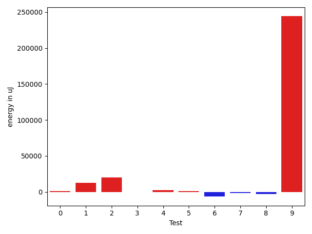
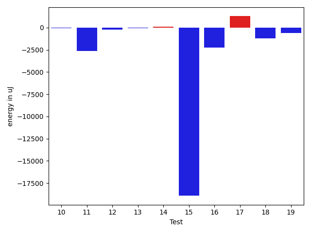
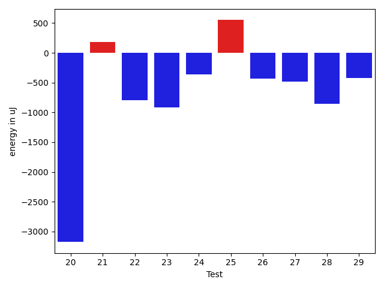
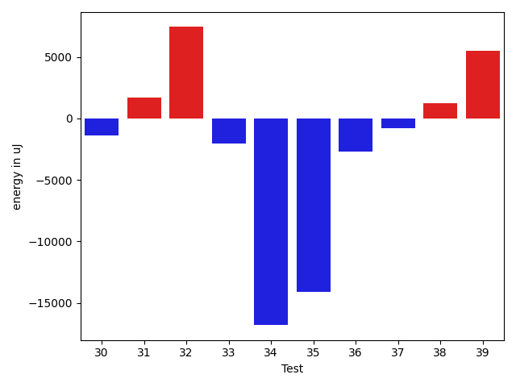
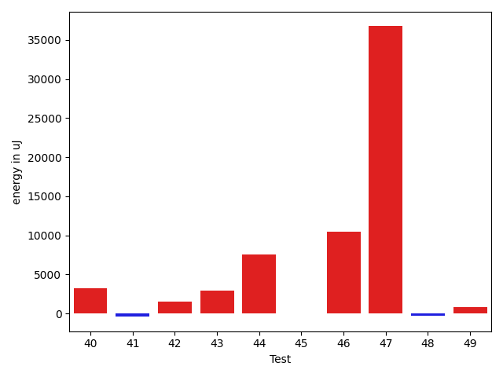
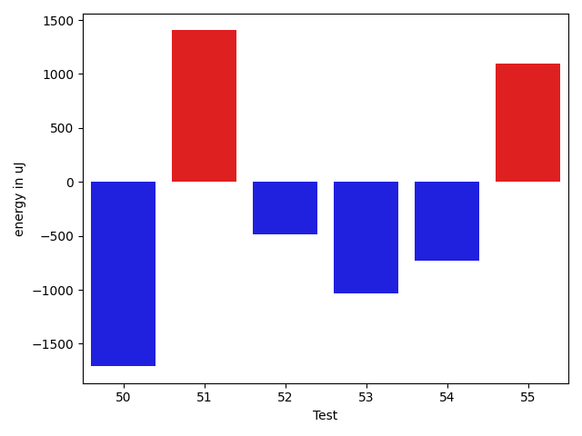

# gson c894fb

https://github.com/google/gson/commit/c894fb

## Delta Energy per test method

| ID | EnergyV1 | EnergyV2 | DeltaEnergy | σV1 | σV2 |
| --- | --- | --- | --- | --- | --- |
| 0 | 37903 | 38391 | 488 | 6564.136464459707 | 10367.18840255271 |
| 1 | 39184 | 40039 | 855 | 43029.60499211883 | 55499.655631363115 |
| 2 | 40893 | 40833 | -60 | 64292.10138187774 | 94699.57654947987 |
| 3 | 37658 | 36438 | -1220 | 4019.1638170516476 | 3918.035401675469 |
| 4 | 38147 | 39673 | 1526 | 30024.692586636695 | 29311.53940278731 |
| 5 | 40405 | 40771 | 366 | 22158.496322824663 | 21207.51112946296 |
| 6 | 40710 | 37781 | -2929 | 38897.85960432604 | 35263.45511144271 |
| 7 | 37476 | 35950 | -1526 | 4255.664808216785 | 5025.331313182867 |
| 8 | 37964 | 39185 | 1221 | 22213.529033876825 | 9597.773680920243 |
| 9 | 37475 | 38085 | 610 | 308572.18753343134 | 704704.7286398015 |
| 10 | 38818 | 38757 | -61 | 24165.64485145193 | 49490.57912981464 |
| 11 | 38330 | 35705 | -2625 | 4784.986250467159 | 3614.554448664542 |
| 12 | 36804 | 36559 | -245 | 12290.170993547024 | 76660.71095862464 |
| 13 | 37231 | 37170 | -61 | 4534.843232652794 | 3957.203663420986 |
| 14 | 35706 | 35828 | 122 | 8067.231320467942 | 14350.435798336734 |
| 15 | 59875 | 40955 | -18920 | 21447.721001605427 | 18309.72792634138 |
| 16 | 37841 | 35583 | -2258 | 4274.169103988805 | 4070.6103091759583 |
| 17 | 35584 | 36865 | 1281 | 3494.700367847032 | 5964.655225466108 |
| 18 | 36682 | 35461 | -1221 | 4364.385873178493 | 4190.889328068313 |
| 19 | 36255 | 35644 | -611 | 3847.5149152722765 | 3841.730118489687 |
| 20 | 37415 | 34241 | -3174 | 3733.410080382793 | 5300.682004027021 |
| 21 | 35889 | 36071 | 182 | 3705.961992608321 | 4215.726988798211 |
| 22 | 37537 | 36743 | -794 | 4285.584903071284 | 4463.205634821826 |
| 23 | 35889 | 34973 | -916 | 7528.851832100446 | 4006.6533814807 |
| 24 | 38513 | 38147 | -366 | 19275.52197469149 | 10201.513644547518 |
| 25 | 40223 | 40772 | 549 | 601060.9401583648 | 375232.0316466481 |
| 26 | 40589 | 40161 | -428 | 22637.84931225524 | 23030.984265973555 |
| 27 | 38330 | 37842 | -488 | 18911.94337741578 | 33277.63980476386 |
| 28 | 80872 | 80017 | -855 | 482314.654607589 | 529489.5262854381 |
| 29 | 37963 | 37536 | -427 | 6947.604032803745 | 5700.846505930141 |
| 30 | 38025 | 36927 | -1098 | 7447.229428709116 | 4445.237991596733 |
| 31 | 38940 | 40161 | 1221 | 3250.6145121495447 | 5357.534186882008 |
| 32 | 38025 | 42419 | 4394 | 7719.952245302334 | 16379.185022384352 |
| 33 | 38879 | 36194 | -2685 | 4112.107014806945 | 4971.663342892571 |
| 34 | 40832 | 42603 | 1771 | 70622.70589699288 | 37102.668133499916 |
| 35 | 41992 | 37720 | -4272 | 18842.957091701668 | 4026.410965281347 |
| 36 | 38452 | 37903 | -549 | 29104.207481887574 | 22246.07085405833 |
| 37 | 37964 | 36316 | -1648 | 3904.791949627604 | 4544.427084012212 |
| 38 | 183654 | 202270 | 18616 | 488816.01245191786 | 468846.39224520506 |
| 39 | 38635 | 40466 | 1831 | 12865.267109511187 | 17268.33829043742 |
| 40 | 39062 | 40955 | 1893 | 49292.78816786256 | 55011.93869243263 |
| 41 | 37292 | 36804 | -488 | 3954.9558370020263 | 4204.028256055878 |
| 42 | 38574 | 39551 | 977 | 68071.37365995153 | 66927.28010671705 |
| 43 | 37719 | 37841 | 122 | 11403.917123185205 | 14992.047393847914 |
| 44 | 76049 | 82397 | 6348 | 27340.719512090986 | 33108.83437843413 |
| 45 | 36621 | 36499 | -122 | 8585.18926447892 | 7116.1386671603395 |
| 46 | 40832 | 40405 | -427 | 64700.09064923783 | 88361.55859964009 |
| 47 | 70191 | 66955 | -3236 | 90978.60304722446 | 156171.14154835572 |
| 48 | 39062 | 38514 | -548 | 7343.420174702125 | 8890.484764998286 |
| 49 | 43273 | 40772 | -2501 | 55501.88787703469 | 54157.00296128586 |
| 50 | 40710 | 39001 | -1709 | 24866.258582966013 | 30360.06723732322 |
| 51 | 36682 | 38086 | 1404 | 4487.944012086303 | 4405.554351570413 |
| 52 | 37049 | 36560 | -489 | 5688.223678890779 | 4275.337743664237 |
| 53 | 37231 | 36194 | -1037 | 4590.60563412311 | 4483.012092728919 |
| 54 | 37719 | 36988 | -731 | 4820.653826223548 | 4112.572814755584 |
| 55 | 39612 | 40710 | 1098 | 471078.1393517535 | 650061.062160004 |

## Delta Duration per test method

| ID | DurationV1 | DurationsV2 | DeltaDuration |
| --- | --- | --- | --- |
| 0 | 1097426.7536231885 | 1138604.53125 | 41177.77762681153 |
| 1 | 1147380.4166666667 | 1658077.4772727273 | 510697.06060606055 |
| 2 | 1380379.894736842 | 2140918.5714285714 | 760538.6766917293 |
| 3 | 813586.8461538461 | 796876.659574468 | -16710.18657937809 |
| 4 | 1137376.1132075472 | 1239852.391304348 | 102476.27809680067 |
| 5 | 1653152.5108695652 | 1668381.2525252525 | 15228.741655687336 |
| 6 | 1413094.9310344828 | 1152822.3714285714 | -260272.55960591137 |
| 7 | 610402.1538461539 | 566442.1904761905 | -43959.96336996334 |
| 8 | 766918.0833333334 | 607244.6818181818 | -159673.4015151516 |
| 9 | 2475372.285714286 | 9639268.0 | 7163895.714285715 |
| 10 | 1213046.2352941176 | 1370430.177777778 | 157383.9424836603 |
| 11 | 854644.5 | 892807.8823529412 | 38163.382352941204 |
| 12 | 1206951.0128205128 | 1519073.5 | 312122.48717948725 |
| 13 | 672431.1578947369 | 702823.4545454546 | 30392.296650717733 |
| 14 | 1107698.12987013 | 1176175.7536231885 | 68477.62375305849 |
| 15 | 1793707.125 | 1692380.244680851 | -101326.880319149 |
| 16 | 832809.1851851852 | 909623.7868852459 | 76814.60170006077 |
| 17 | 937271.5 | 981546.1379310344 | 44274.637931034435 |
| 18 | 707076.8333333334 | 688779.1891891892 | -18297.644144144142 |
| 19 | 816900.8333333334 | 763478.0943396227 | -53422.73899371072 |
| 20 | 701803.5161290322 | 721736.027027027 | 19932.51089799474 |
| 21 | 675635.4117647059 | 720219.2 | 44583.78823529405 |
| 22 | 717411.2727272727 | 667060.2340425532 | -50351.038684719475 |
| 23 | 943272.8666666667 | 1032428.4150943396 | 89155.54842767294 |
| 24 | 964943.3421052631 | 783494.1315789474 | -181449.21052631573 |
| 25 | 6731673.328947368 | 3505729.0229885057 | -3225944.3059588624 |
| 26 | 1561527.96875 | 1582936.875 | 21408.90625 |
| 27 | 1548865.494949495 | 1583321.8924731184 | 34456.397523623426 |
| 28 | 5950143.0 | 6209897.535353536 | 259754.5353535358 |
| 29 | 1086082.109375 | 1064274.7763157894 | -21807.333059210563 |
| 30 | 981559.231884058 | 993491.9672131147 | 11932.73532905674 |
| 31 | 568491.6666666666 | 581007.5 | 12515.833333333372 |
| 32 | 879690.7115384615 | 1228730.6 | 349039.8884615386 |
| 33 | 766504.6857142857 | 973612.8518518518 | 207108.1661375661 |
| 34 | 2192877.222222222 | 1836397.686868687 | -356479.5353535351 |
| 35 | 1735413.0957446808 | 857193.9761904762 | -878219.1195542046 |
| 36 | 1141624.8636363635 | 1104443.5853658537 | -37181.27827050979 |
| 37 | 841984.0666666667 | 784099.6511627907 | -57884.415503875935 |
| 38 | 8568514.474747475 | 8831336.808080807 | 262822.3333333321 |
| 39 | 1387247.625 | 1555013.2413793104 | 167765.61637931038 |
| 40 | 1805735.4137931035 | 1890886.7236842106 | 85151.30989110703 |
| 41 | 869931.9591836735 | 980031.2631578947 | 110099.30397422123 |
| 42 | 1936956.7717391304 | 1972554.3372093022 | 35597.56547017186 |
| 43 | 1299370.5679012346 | 1389694.0476190476 | 90323.47971781297 |
| 44 | 2594017.505050505 | 2727158.9595959596 | 133141.4545454546 |
| 45 | 1096558.6746987952 | 1179431.6172839506 | 82872.94258515537 |
| 46 | 1927087.4 | 2206952.7808219176 | 279865.3808219177 |
| 47 | 2696685.7474747472 | 3902941.9081632653 | 1206256.160688518 |
| 48 | 1079869.1666666667 | 1149252.0666666667 | 69382.8999999999 |
| 49 | 1761913.5 | 1979741.0 | 217827.5 |
| 50 | 1456616.75 | 1435059.4193548388 | -21557.330645161215 |
| 51 | 732917.7692307692 | 674381.3225806452 | -58536.44665012404 |
| 52 | 607342.6875 | 542952.88 | -64389.807499999995 |
| 53 | 598979.9512195121 | 559822.3636363636 | -39157.5875831485 |
| 54 | 650277.7058823529 | 621327.0333333333 | -28950.672549019568 |
| 55 | 5726572.7 | 10543105.82857143 | 4816533.128571429 |

## Misc.

| ID | Test Class | Test Method |
| --- | --- | --- |
| 0 | com.google.gson.functional.ReadersWritersTest | testReadWriteTwoObjects |
| 1 | com.google.gson.functional.ReadersWritersTest | testReaderForDeserialization |
| 2 | com.google.gson.functional.ReadersWritersTest | testWriterForSerialization |
| 3 | com.google.gson.functional.CollectionTest | testRawCollectionSerialization |
| 4 | com.google.gson.functional.CollectionTest | testCollectionOfBagOfPrimitivesSerialization |
| 5 | com.google.gson.functional.CollectionTest | testWildcardCollectionField |
| 6 | com.google.gson.functional.DefaultTypeAdaptersTest | testUrlDeserialization |
| 7 | com.google.gson.functional.DefaultTypeAdaptersTest | testUriSerialization |
| 8 | com.google.gson.JsonObjectTest | testAddingBooleanProperties |
| 9 | com.google.gson.JsonObjectTest | testWritePropertyWithEmptyStringName |
| 10 | com.google.gson.JsonObjectTest | testReadPropertyWithEmptyStringName |
| 11 | com.google.gson.functional.ObjectTest | testNestedSerialization |
| 12 | com.google.gson.functional.ObjectTest | testArrayOfArraysDeserialization |
| 13 | com.google.gson.functional.ObjectTest | testNullFieldsSerialization |
| 14 | com.google.gson.functional.ObjectTest | testArrayOfObjectsAsFields |
| 15 | com.google.gson.functional.ObjectTest | testArrayOfArraysSerialization |
| 16 | com.google.gson.functional.ObjectTest | testNestedDeserialization |
| 17 | com.google.gson.functional.ObjectTest | testArrayOfObjectsSerialization |
| 18 | com.google.gson.functional.ObjectTest | testBagOfPrimitiveWrappersDeserialization |
| 19 | com.google.gson.functional.ObjectTest | testBagOfPrimitiveWrappersSerialization |
| 20 | com.google.gson.functional.ObjectTest | testObjectFieldNamesWithoutQuotesDeserialization |
| 21 | com.google.gson.functional.ObjectTest | testNullFieldsDeserialization |
| 22 | com.google.gson.functional.ObjectTest | testBagOfPrimitivesDeserialization |
| 23 | com.google.gson.functional.ObjectTest | testArrayOfObjectsDeserialization |
| 24 | com.google.gson.functional.ObjectTest | testBagOfPrimitivesSerialization |
| 25 | com.google.gson.JsonParserTest | testReadWriteTwoObjects |
| 26 | com.google.gson.functional.ArrayTest | testObjectArrayWithNonPrimitivesSerialization |
| 27 | com.google.gson.functional.TypeVariableTest | testAdvancedTypeVariables |
| 28 | com.google.gson.functional.TypeVariableTest | testTypeVariablesViaTypeParameter |
| 29 | com.google.gson.functional.TypeVariableTest | testBasicTypeVariables |
| 30 | com.google.gson.functional.MapTest | testReadMapsWithEmptyStringKey |
| 31 | com.google.gson.functional.MapTest | testWriteMapsWithEmptyStringKey |
| 32 | com.google.gson.functional.UncategorizedTest | testGsonInstanceReusableForSerializationAndDeserialization |
| 33 | com.google.gson.functional.UncategorizedTest | testStaticFieldsAreNotSerialized |
| 34 | com.google.gson.functional.InheritanceTest | testSubClassDeserialization |
| 35 | com.google.gson.functional.InheritanceTest | testSubClassSerialization |
| 36 | com.google.gson.functional.VersioningTest | testVersionedGsonWithUnversionedClassesSerialization |
| 37 | com.google.gson.functional.VersioningTest | testVersionedGsonWithUnversionedClassesDeserialization |
| 38 | com.google.gson.functional.MapAsArrayTypeAdapterTest | testSerializeComplexMapWithTypeAdapter |
| 39 | com.google.gson.functional.EscapingTest | testGsonAcceptsEscapedAndNonEscapedJsonDeserialization |
| 40 | com.google.gson.functional.EscapingTest | testEscapingObjectFields |
| 41 | com.google.gson.functional.EscapingTest | testGsonDoubleDeserialization |
| 42 | com.google.gson.functional.ParameterizedTypesTest | testParameterizedTypeDeserialization |
| 43 | com.google.gson.functional.ParameterizedTypesTest | testTypesWithMultipleParametersDeserialization |
| 44 | com.google.gson.functional.ParameterizedTypesTest | testTypesWithMultipleParametersSerialization |
| 45 | com.google.gson.functional.ParameterizedTypesTest | testParameterizedTypeWithReaderDeserialization |
| 46 | com.google.gson.functional.PrintFormattingTest | testCompactFormattingLeavesNoWhiteSpace |
| 47 | com.google.gson.functional.PrettyPrintingTest | testPrettyPrintList |
| 48 | com.google.gson.functional.PrettyPrintingTest | testPrettyPrintArrayOfObjects |
| 49 | com.google.gson.JsonPrimitiveTest | testParsingStringAsBoolean |
| 50 | com.google.gson.functional.JsonTreeTest | testJsonTreeToString |
| 51 | com.google.gson.functional.PrimitiveTest | testPrimitiveBooleanAutoboxedDeserialization |
| 52 | com.google.gson.functional.PrimitiveTest | testPrimitiveBooleanAutoboxedSerialization |
| 53 | com.google.gson.functional.PrimitiveTest | testPrimitiveBooleanAutoboxedInASingleElementArraySerialization |
| 54 | com.google.gson.functional.PrimitiveTest | testPrimitiveBooleanAutoboxedInASingleElementArrayDeserialization |
| 55 | com.google.gson.functional.SecurityTest | testNonExecutableJsonSerialization |

| Test | IterationV1 | IterationV2 | DeltaIteration |
| --- | --- | --- | --- |
| 0 | 69 | 64 | -5 |
| 1 | 36 | 44 | 8 |
| 2 | 38 | 42 | 4 |
| 3 | 39 | 47 | 8 |
| 4 | 53 | 46 | -7 |
| 5 | 92 | 99 | 7 |
| 6 | 29 | 35 | 6 |
| 7 | 39 | 21 | -18 |
| 8 | 12 | 22 | 10 |
| 9 | 28 | 19 | -9 |
| 10 | 34 | 45 | 11 |
| 11 | 52 | 51 | -1 |
| 12 | 78 | 78 | 0 |
| 13 | 38 | 33 | -5 |
| 14 | 77 | 69 | -8 |
| 15 | 88 | 94 | 6 |
| 16 | 54 | 61 | 7 |
| 17 | 62 | 58 | -4 |
| 18 | 30 | 37 | 7 |
| 19 | 42 | 53 | 11 |
| 20 | 31 | 37 | 6 |
| 21 | 34 | 35 | 1 |
| 22 | 33 | 47 | 14 |
| 23 | 60 | 53 | -7 |
| 24 | 38 | 38 | 0 |
| 25 | 76 | 87 | 11 |
| 26 | 64 | 64 | 0 |
| 27 | 99 | 93 | -6 |
| 28 | 99 | 99 | 0 |
| 29 | 64 | 76 | 12 |
| 30 | 69 | 61 | -8 |
| 31 | 24 | 26 | 2 |
| 32 | 52 | 40 | -12 |
| 33 | 35 | 27 | -8 |
| 34 | 63 | 99 | 36 |
| 35 | 94 | 42 | -52 |
| 36 | 44 | 41 | -3 |
| 37 | 45 | 43 | -2 |
| 38 | 99 | 99 | 0 |
| 39 | 88 | 87 | -1 |
| 40 | 58 | 76 | 18 |
| 41 | 49 | 57 | 8 |
| 42 | 92 | 86 | -6 |
| 43 | 81 | 84 | 3 |
| 44 | 99 | 99 | 0 |
| 45 | 83 | 81 | -2 |
| 46 | 70 | 73 | 3 |
| 47 | 99 | 98 | -1 |
| 48 | 60 | 60 | 0 |
| 49 | 24 | 28 | 4 |
| 50 | 72 | 62 | -10 |
| 51 | 39 | 31 | -8 |
| 52 | 16 | 25 | 9 |
| 53 | 41 | 22 | -19 |
| 54 | 34 | 30 | -4 |
| 55 | 40 | 35 | -5 |

| Time Label | Time (s) |
| --- | --- |
| Selection | 29.196082830429077 |
| Injection | 12.602813482284546 |
| Total | 1146.1517848968506 |

