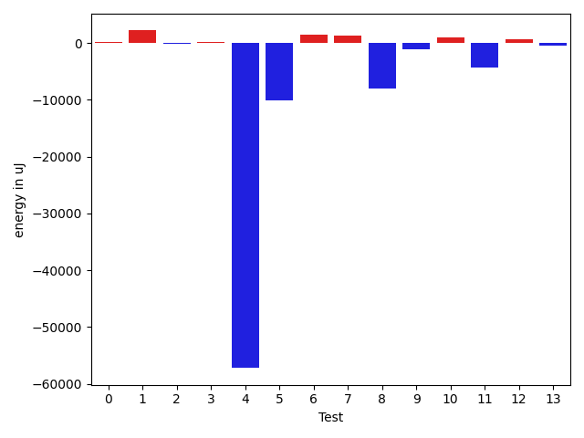

# gson 0aaf5f

https://github.com/google/gson/commit/0aaf5f

## Delta Energy per test method

| ID | EnergyV1 | EnergyV2 | DeltaEnergy | σV1 | σV2 |
| --- | --- | --- | --- | --- | --- |
| 0 | 87262.16161616161 | 98824.92929292929 | 11562.767676767675 | 17487.22580161034 | 106403.36342971787 |
| 1 | 49694.03571428572 | 53820.86885245902 | 4126.8331381733005 | 106430.03457474797 | 117682.87715588757 |
| 2 | 41628.81176470588 | 43566.234567901236 | 1937.4228031953535 | 7414.812947534174 | 23180.94773692428 |
| 3 | 42822.51515151515 | 79779.0294117647 | 36956.51426024955 | 10144.854607003748 | 173701.24472063847 |
| 4 | 206140.52525252526 | 118239.75510204081 | -87900.77015048444 | 122527.30669275597 | 140176.25700022487 |
| 5 | 740999.4545454546 | 667420.1818181818 | -73579.27272727282 | 504661.9503723675 | 481333.3949280025 |
| 6 | 75676.0202020202 | 75253.0505050505 | -422.9696969696961 | 15891.292443182312 | 18887.20733503609 |
| 7 | 40404.444444444445 | 40415.132352941175 | 10.687908496729506 | 10398.307817579538 | 5207.187526713922 |
| 8 | 265420.24242424243 | 314073.0909090909 | 48652.84848484845 | 235076.4360228689 | 403690.9972358244 |
| 9 | 62458.1 | 64315.10344827586 | 1857.0034482758638 | 174439.04691111066 | 189014.00594680346 |
| 10 | 40556.12727272727 | 41230.88888888889 | 674.761616161617 | 9704.802378306496 | 7222.894440511049 |
| 11 | 141767.40425531915 | 43641.5641025641 | -98125.84015275506 | 356471.301341515 | 35607.40383525477 |
| 12 | 38972.04 | 39118.730769230766 | 146.690769230765 | 4186.342455939313 | 3917.210934381485 |
| 13 | 40479.527272727275 | 93803.54 | 53324.01272727272 | 4440.359366515468 | 265066.2232419823 |

## Delta Duration per test method

| ID | DurationV1 | DurationsV2 | DeltaDuration |
| --- | --- | --- | --- |
| 0 | 2632620.1919191917 | 3940736.3535353537 | 1308116.161616162 |
| 1 | 1599559.4523809524 | 1510863.68852459 | -88695.76385636232 |
| 2 | 1292665.905882353 | 1169097.5802469135 | -123568.32563543948 |
| 3 | 1410250.9292929294 | 2215192.367647059 | 804941.4383541294 |
| 4 | 6219092.656565657 | 3775968.448979592 | -2443124.207586065 |
| 5 | 22376511.020202022 | 19673920.858585857 | -2702590.161616165 |
| 6 | 2407284.9696969697 | 2282809.303030303 | -124475.66666666651 |
| 7 | 1284644.6333333333 | 1199334.6764705882 | -85309.95686274511 |
| 8 | 7357825.464646464 | 9203701.767676767 | 1845876.3030303027 |
| 9 | 1701572.2833333334 | 1841558.7241379311 | 139986.4408045977 |
| 10 | 948466.9636363636 | 897769.6388888889 | -50697.32474747475 |
| 11 | 3931410.659574468 | 1114672.8717948718 | -2816737.7877795966 |
| 12 | 644721.68 | 632921.5384615385 | -11800.141538461554 |
| 13 | 912415.0545454546 | 2507026.14 | 1594611.0854545454 |

## Misc.

| ID | Test Class | Test Method |
| --- | --- | --- |
| 0 | com.google.gson.functional.DefaultTypeAdaptersTest | testDateSerializationWithPatternNotOverridenByTypeAdapter |
| 1 | com.google.gson.functional.DefaultTypeAdaptersTest | testDateSerializationWithPattern |
| 2 | com.google.gson.functional.DefaultTypeAdaptersTest | testSqlDateSerialization |
| 3 | com.google.gson.functional.DefaultTypeAdaptersTest | testTimestampSerialization |
| 4 | com.google.gson.functional.DefaultTypeAdaptersTest | testDefaultDateDeserializationUsingBuilder |
| 5 | com.google.gson.functional.DefaultTypeAdaptersTest | testNullSerialization |
| 6 | com.google.gson.functional.DefaultTypeAdaptersTest | testDateSerializationInCollection |
| 7 | com.google.gson.functional.DefaultTypeAdaptersTest | testDateDeserializationWithPattern |
| 8 | com.google.gson.DefaultDateTypeAdapterTest | testDateDeserializationISO8601 |
| 9 | com.google.gson.DefaultDateTypeAdapterTest | testDateSerialization |
| 10 | com.google.gson.DefaultDateTypeAdapterTest | testNullValue |
| 11 | com.google.gson.DefaultDateTypeAdapterTest | testDatePattern |
| 12 | com.google.gson.DefaultDateTypeAdapterTest | testInvalidDatePattern |
| 13 | com.google.gson.DefaultDateTypeAdapterTest | testUnexpectedToken |

| Test | IterationV1 | IterationV2 | DeltaIteration |
| --- | --- | --- | --- |
| 0 | 99 | 99 | 0 |
| 1 | 84 | 61 | -23 |
| 2 | 85 | 81 | -4 |
| 3 | 99 | 68 | -31 |
| 4 | 99 | 98 | -1 |
| 5 | 99 | 99 | 0 |
| 6 | 99 | 99 | 0 |
| 7 | 90 | 68 | -22 |
| 8 | 99 | 99 | 0 |
| 9 | 60 | 58 | -2 |
| 10 | 55 | 36 | -19 |
| 11 | 47 | 39 | -8 |
| 12 | 25 | 26 | 1 |
| 13 | 55 | 50 | -5 |

| Time Label | Time (s) |
| --- | --- |
| Selection | 36.02524662017822 |
| Injection | 13.859108686447144 |
| Total | 1415.3074929714203 |

