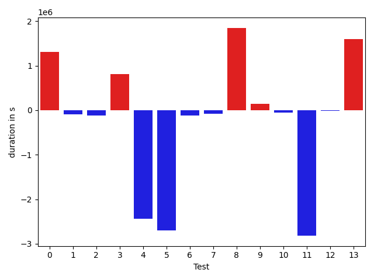

# gson 0aaf5f

https://github.com/google/gson/commit/0aaf5f

## Delta Energy per test method

| ID | EnergyV1 | EnergyV2 | DeltaEnergy |
| --- | --- | --- | --- |
| 0 | 88492.81873347519 | 82767.82619541697 | -5724.9925380582135 |
| 1 | 44603.63560707985 | 41082.087700652686 | -3521.547906427164 |
| 2 | 38919.24369025903 | 40973.03890991836 | 2053.7952196593324 |
| 3 | 48413.84563763182 | 41825.811472477086 | -6588.034165154735 |
| 4 | 175086.15915812313 | 77558.12581724269 | -97528.03334088044 |
| 5 | 1465432.0016186717 | 437584.6648883195 | -1027847.3367303521 |
| 6 | 45660.3038722392 | 42474.34241067291 | -3185.961461566294 |
| 7 | 85436.42808182022 | 79847.63395122024 | -5588.794130599985 |
| 8 | 224687.4096978358 | 182973.47204306867 | -41713.93765476713 |
| 9 | 37346.683115154505 | 40223.11305522919 | 2876.4299400746822 |
| 10 | 36397.15487058496 | 41502.486673061736 | 5105.33180247678 |
| 11 | 38830.021216247245 | 38667.68783762821 | -162.3333786190342 |
| 12 | 50861.05140489115 | 42406.457372839955 | -8454.594032051195 |
| 13 | 40597.1981585219 | 50653.637877329136 | 10056.43971880724 |

## Delta Duration per test method

| ID | DurationV1 | DurationsV2 | DeltaDuration |
| --- | --- | --- | --- |
| 0 | 2827604.689719726 | 4348991.876655506 | 1521387.18693578 |
| 1 | 1411172.646864695 | 899913.284307345 | -511259.36255734996 |
| 2 | 1251480.8962024038 | 1081172.5317496285 | -170308.36445277533 |
| 3 | 1723418.4861387017 | 919813.8403366901 | -803604.6458020116 |
| 4 | 5772245.047444168 | 1868287.9302544454 | -3903957.117189722 |
| 5 | 41169029.19912362 | 11415217.272432381 | -29753811.92669124 |
| 6 | 1373567.4905071687 | 1635895.2617968172 | 262327.7712896485 |
| 7 | 2469600.6701396485 | 2143589.439651042 | -326011.23048860626 |
| 8 | 6280663.886515921 | 5453412.664981188 | -827251.2215347327 |
| 9 | 694321.7526811063 | 734155.9142229855 | 39834.16154187918 |
| 10 | 1056027.3992493253 | 1223130.3771817305 | 167102.9779324052 |
| 11 | 874471.5142303905 | 906330.5245423294 | 31859.010311938822 |
| 12 | 1309309.1855180466 | 814043.4668208093 | -495265.7186972373 |
| 13 | 883364.4432677538 | 1139415.3481298739 | 256050.90486212005 |

## Misc.

| ID | Test Class | Test Method |
| --- | --- | --- |
| 0 | com.google.gson.functional.DefaultTypeAdaptersTest | testDateSerializationWithPatternNotOverridenByTypeAdapter |
| 1 | com.google.gson.functional.DefaultTypeAdaptersTest | testDateSerializationWithPattern |
| 2 | com.google.gson.functional.DefaultTypeAdaptersTest | testSqlDateSerialization |
| 3 | com.google.gson.functional.DefaultTypeAdaptersTest | testTimestampSerialization |
| 4 | com.google.gson.functional.DefaultTypeAdaptersTest | testDefaultDateDeserializationUsingBuilder |
| 5 | com.google.gson.functional.DefaultTypeAdaptersTest | testNullSerialization |
| 6 | com.google.gson.functional.DefaultTypeAdaptersTest | testDateDeserializationWithPattern |
| 7 | com.google.gson.functional.DefaultTypeAdaptersTest | testDateSerializationInCollection |
| 8 | com.google.gson.DefaultDateTypeAdapterTest | testDateDeserializationISO8601 |
| 9 | com.google.gson.DefaultDateTypeAdapterTest | testInvalidDatePattern |
| 10 | com.google.gson.DefaultDateTypeAdapterTest | testDateSerialization |
| 11 | com.google.gson.DefaultDateTypeAdapterTest | testNullValue |
| 12 | com.google.gson.DefaultDateTypeAdapterTest | testDatePattern |
| 13 | com.google.gson.DefaultDateTypeAdapterTest | testUnexpectedToken |

| Test | IterationV1 | IterationV2 | DeltaIteration |
| --- | --- | --- | --- |
| 0 | 99 | 99 | 0 |
| 1 | 84 | 61 | -23 |
| 2 | 85 | 81 | -4 |
| 3 | 99 | 68 | -31 |
| 4 | 99 | 98 | -1 |
| 5 | 99 | 99 | 0 |
| 6 | 90 | 68 | -22 |
| 7 | 99 | 99 | 0 |
| 8 | 99 | 99 | 0 |
| 9 | 25 | 26 | 1 |
| 10 | 60 | 58 | -2 |
| 11 | 55 | 36 | -19 |
| 12 | 47 | 39 | -8 |
| 13 | 55 | 50 | -5 |

| Time Label | Time (s) |
| --- | --- |
| Selection | 36.02524662017822 |
| Injection | 13.859108686447144 |
| Total | 1415.3074929714203 |

