# gson 4917fc

https://github.com/google/gson/commit/4917fc

## Delta Energy per test method

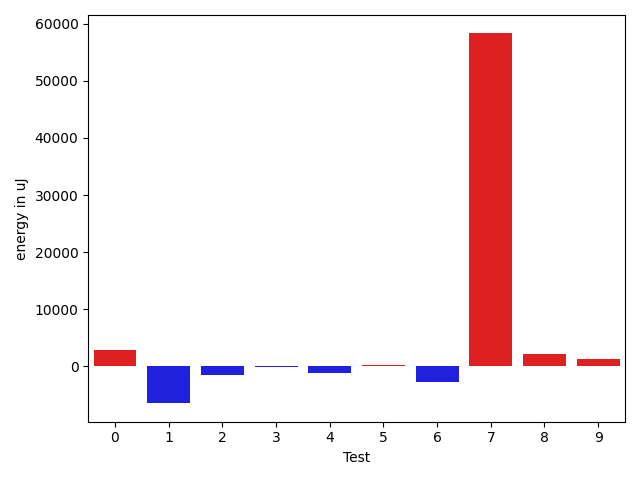

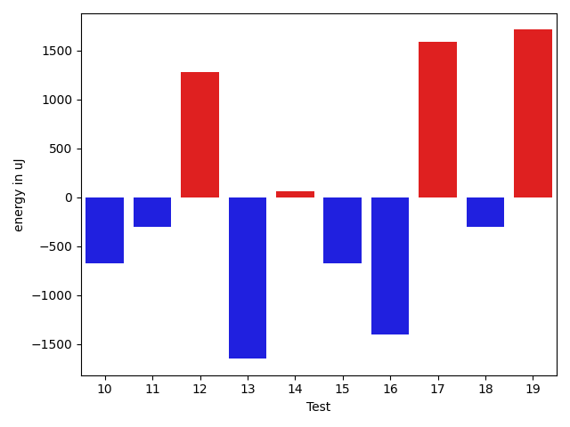

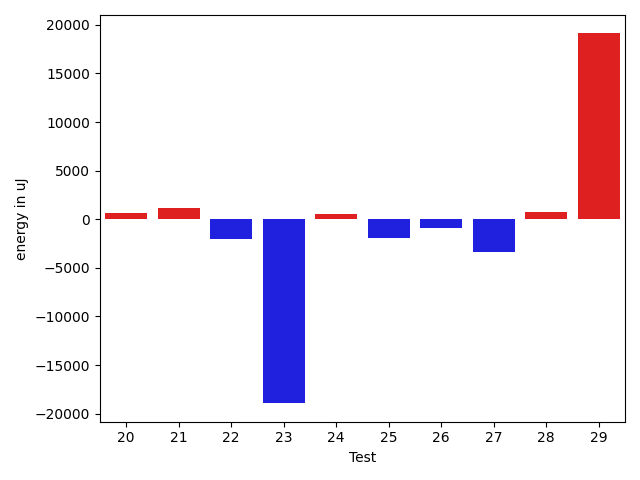

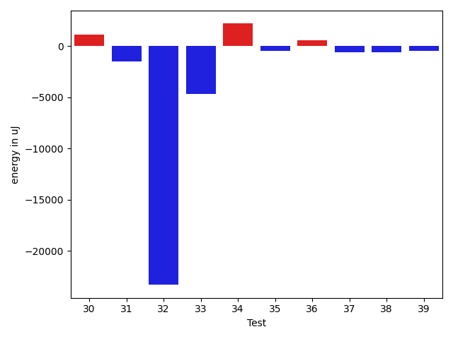

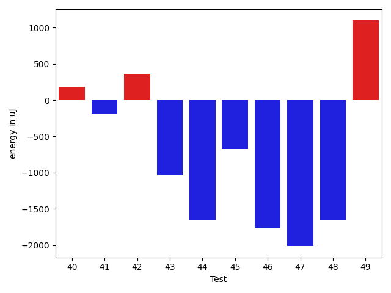

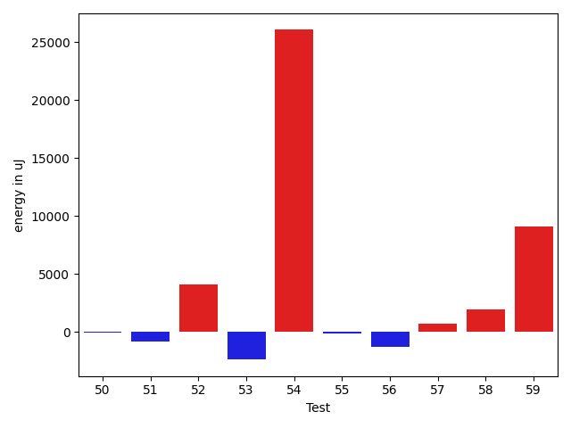

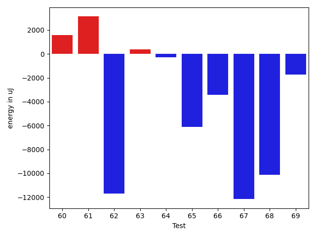

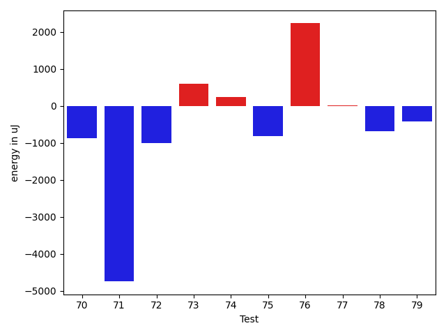

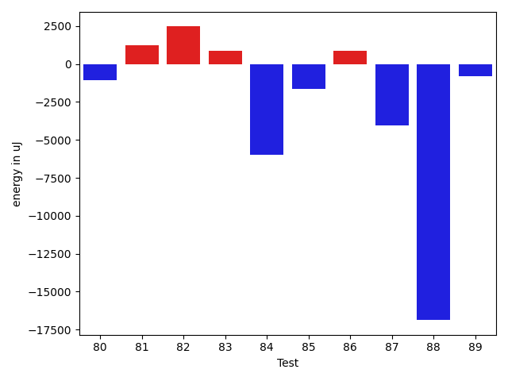

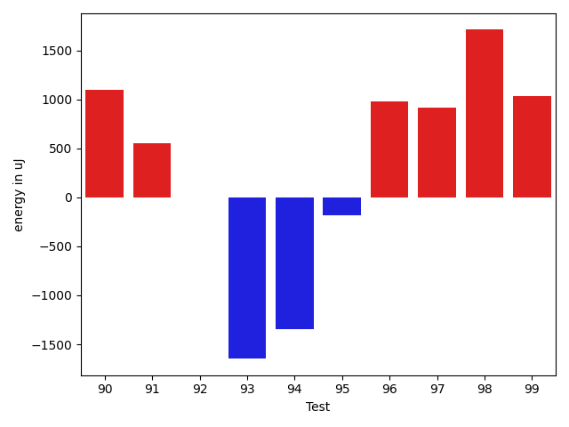

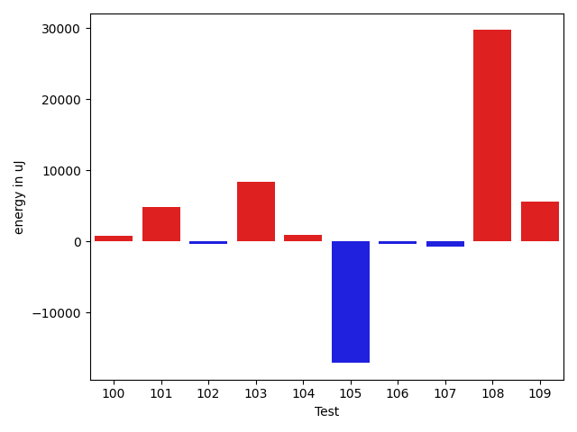

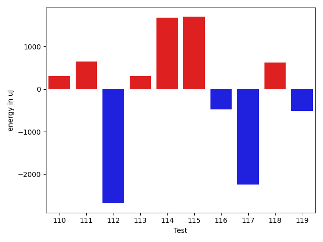

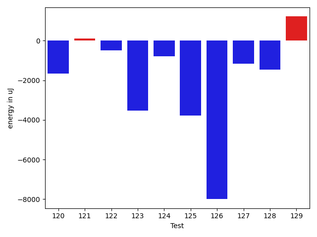

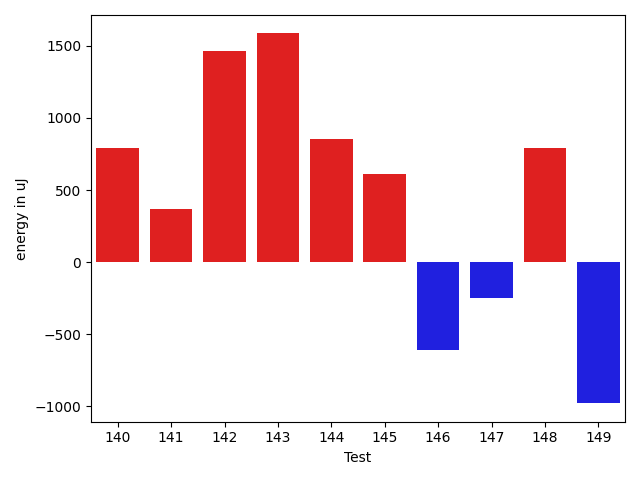

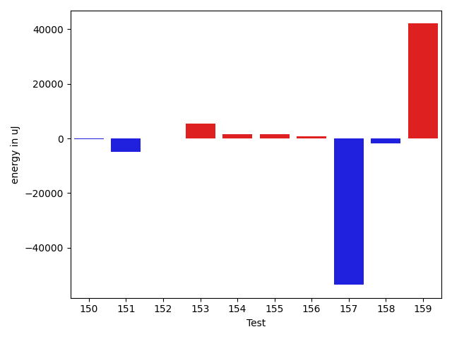

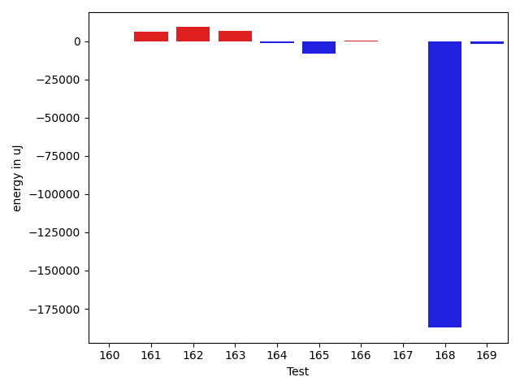

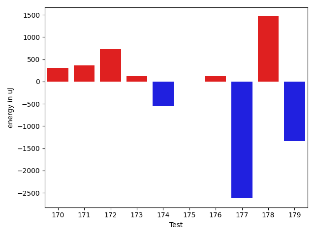

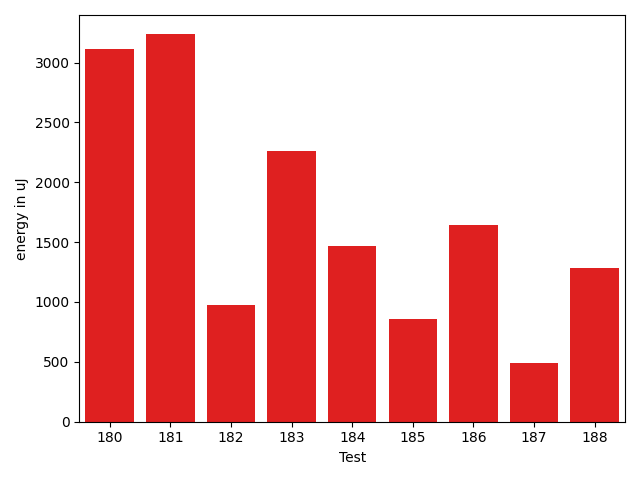

| ID | EnergyV1 | EnergyV2 | DeltaEnergy | σV1 | σV2 |
| --- | --- | --- | --- | --- | --- |
| 0 | 39978 | 40588 | 610 | 7147.965505011432 | 13312.341169836227 |
| 1 | 42908 | 41504 | -1404 | 60565.89986552008 | 45874.45948772583 |
| 2 | 37964 | 35888 | -2076 | 3933.8245662544614 | 4221.254024525295 |
| 3 | 38208 | 38086 | -122 | 4207.958390086278 | 4099.5074574729515 |
| 4 | 37841 | 37293 | -548 | 3750.6661651563945 | 4352.432436795962 |
| 5 | 37475 | 36072 | -1403 | 4295.850811311768 | 7233.596380024554 |
| 6 | 37903 | 37231 | -672 | 30318.2216316357 | 17045.95450673583 |
| 7 | 39672 | 39734 | 62 | 4242.688017178628 | 317948.88588149764 |
| 8 | 36499 | 37597 | 1098 | 4005.408246636318 | 2972.455107327841 |
| 9 | 38208 | 40283 | 2075 | 4345.531165167041 | 4119.173688374891 |
| 10 | 39673 | 39001 | -672 | 435797.8809619647 | 262059.93793741844 |
| 11 | 38574 | 38269 | -305 | 37476.647881177465 | 4625.575450659069 |
| 12 | 37537 | 38818 | 1281 | 29421.184293660004 | 4047.188220955986 |
| 13 | 37659 | 36011 | -1648 | 4011.7281361175615 | 4392.001354410409 |
| 14 | 37110 | 37170 | 60 | 3741.862523772674 | 4361.8854794049275 |
| 15 | 37475 | 36804 | -671 | 5869.69076404844 | 4352.942261869537 |
| 16 | 38574 | 37171 | -1403 | 18906.49102595299 | 16400.989664934616 |
| 17 | 38513 | 40100 | 1587 | 9511.871432804115 | 10406.470752022658 |
| 18 | 37292 | 36988 | -304 | 3886.0531449468717 | 3401.0695985291536 |
| 19 | 38208 | 39917 | 1709 | 7372.379959954141 | 5068.8552330203665 |
| 20 | 38818 | 39489 | 671 | 46168.30451426619 | 50245.52524626176 |
| 21 | 40161 | 41320 | 1159 | 75095.57565726264 | 73290.577087095 |
| 22 | 80872 | 78796 | -2076 | 26956.3687845823 | 24920.134926681345 |
| 23 | 109863 | 90942 | -18921 | 88380.34226804043 | 82972.8035758145 |
| 24 | 39001 | 39490 | 489 | 16936.48227263448 | 17360.731680171608 |
| 25 | 39001 | 37048 | -1953 | 3637.7715918120816 | 4640.191246981232 |
| 26 | 37353 | 36438 | -915 | 11656.453873777866 | 15225.088508282899 |
| 27 | 39001 | 35583 | -3418 | 3088.683624968312 | 3549.4182881503357 |
| 28 | 36132 | 36865 | 733 | 6811.470263400092 | 9695.886020664346 |
| 29 | 42663 | 61767 | 19104 | 25947.32848821117 | 19078.831024753454 |
| 30 | 35766 | 36927 | 1161 | 4331.39902025351 | 4139.6636169624335 |
| 31 | 37170 | 35706 | -1464 | 3305.2685556495567 | 3240.3995968981753 |
| 32 | 63843 | 40528 | -23315 | 29176.152050358516 | 30645.303622509353 |
| 33 | 39489 | 34851 | -4638 | 3464.803831491735 | 3807.4680690671717 |
| 34 | 36743 | 38940 | 2197 | 17727.83756106967 | 15675.497425873782 |
| 35 | 37048 | 36621 | -427 | 3884.425884007456 | 4781.802422155987 |
| 36 | 36255 | 36804 | 549 | 10066.4594725349 | 11974.256182368394 |
| 37 | 37048 | 36438 | -610 | 5767.192549442384 | 9236.509976797475 |
| 38 | 37781 | 37170 | -611 | 4238.389378131882 | 4289.775649525728 |
| 39 | 36560 | 36071 | -489 | 4648.4613388260395 | 3736.873968472236 |
| 40 | 36377 | 36560 | 183 | 3506.0169270424713 | 47344.06369189512 |
| 41 | 36804 | 36621 | -183 | 3398.1810199109227 | 3484.9571128497937 |
| 42 | 36560 | 36926 | 366 | 4381.343339422204 | 3702.0688089304617 |
| 43 | 37232 | 36193 | -1039 | 3767.894179031399 | 3883.6118423281514 |
| 44 | 37536 | 35889 | -1647 | 4123.899367651086 | 4192.17754812953 |
| 45 | 36376 | 35705 | -671 | 4160.497665454653 | 3883.3570518950637 |
| 46 | 37109 | 35339 | -1770 | 4099.213931614555 | 3727.4820820327227 |
| 47 | 38391 | 36377 | -2014 | 45968.99737010391 | 4521.898763519015 |
| 48 | 37658 | 36011 | -1647 | 3628.993742292376 | 4916.540003254321 |
| 49 | 35522 | 36621 | 1099 | 4268.988712819175 | 29329.617812381683 |
| 50 | 36133 | 36560 | 427 | 5402.087861188487 | 3668.1975995888815 |
| 51 | 37903 | 36621 | -1282 | 4103.001731610651 | 3415.585343469023 |
| 52 | 37598 | 37476 | -122 | 3655.441668999048 | 25204.41203303001 |
| 53 | 40344 | 37414 | -2930 | 3376.6939073303124 | 3515.112969792009 |
| 54 | 40954 | 36926 | -4028 | 122202.57216381046 | 163507.81221961707 |
| 55 | 37659 | 34912 | -2747 | 38820.54466368688 | 39416.453582101596 |
| 56 | 36865 | 36376 | -489 | 3948.1730991512613 | 3002.222882741107 |
| 57 | 37476 | 37842 | 366 | 3904.6730057283303 | 3939.1387169782715 |
| 58 | 37170 | 36377 | -793 | 11011.708810965716 | 9769.747557749639 |
| 59 | 38696 | 37414 | -1282 | 3436.2100569603654 | 57074.5165778534 |
| 60 | 36499 | 39367 | 2868 | 3261.6346611773633 | 4304.364858055564 |
| 61 | 38086 | 39673 | 1587 | 14015.308993182238 | 15484.296622157448 |
| 62 | 40832 | 40771 | -61 | 36810.00173929465 | 29011.997062784 |
| 63 | 37231 | 37903 | 672 | 4151.717076726389 | 4599.568890267691 |
| 64 | 38330 | 39672 | 1342 | 16928.880173523856 | 17064.603802940277 |
| 65 | 38879 | 39550 | 671 | 79643.66921475476 | 73290.01878879436 |
| 66 | 42297 | 43335 | 1038 | 45488.90151528725 | 40712.12090346963 |
| 67 | 42419 | 42359 | -60 | 106350.03945499672 | 79530.66266359622 |
| 68 | 38208 | 37902 | -306 | 52577.9794340449 | 28241.291453723767 |
| 69 | 37597 | 35400 | -2197 | 5139.677196089264 | 5975.109576401089 |
| 70 | 38818 | 37414 | -1404 | 12213.993385655805 | 11894.451626518714 |
| 71 | 39062 | 38697 | -365 | 41958.092630219064 | 17537.95253917628 |
| 72 | 36438 | 35645 | -793 | 4006.049546564431 | 3211.6017025535525 |
| 73 | 37537 | 37658 | 121 | 4553.597469038585 | 3262.0171368373294 |
| 74 | 38574 | 37781 | -793 | 4059.225862292961 | 3101.443093333531 |
| 75 | 38757 | 36438 | -2319 | 4523.073204674422 | 3911.5930021550976 |
| 76 | 38330 | 38391 | 61 | 4577.496131123415 | 3753.481062991618 |
| 77 | 36560 | 35950 | -610 | 3994.5626774873617 | 4610.064948927871 |
| 78 | 36682 | 37415 | 733 | 9956.378828419498 | 11295.539394825037 |
| 79 | 37353 | 36988 | -365 | 3911.270026328805 | 3952.7653811189743 |
| 80 | 36438 | 37170 | 732 | 5924.171811263168 | 3521.1565000922983 |
| 81 | 35278 | 36499 | 1221 | 16409.33716108523 | 20921.34487754564 |
| 82 | 70312 | 72998 | 2686 | 54022.78229302502 | 60328.62882977972 |
| 83 | 36316 | 37415 | 1099 | 3355.102460786038 | 3860.687750126813 |
| 84 | 73120 | 69702 | -3418 | 31948.755849321486 | 27661.223636356073 |
| 85 | 37658 | 37171 | -487 | 20549.84199565658 | 13864.783120618864 |
| 86 | 38086 | 38452 | 366 | 34346.02110542639 | 36209.44924620659 |
| 87 | 60058 | 42725 | -17333 | 23604.34532213793 | 20892.13205989071 |
| 88 | 37841 | 36865 | -976 | 74444.6938553033 | 10911.097891221681 |
| 89 | 71961 | 69640 | -2321 | 27820.140259942968 | 32155.84391450441 |
| 90 | 36132 | 37231 | 1099 | 4093.5156140079102 | 3913.8630523925312 |
| 91 | 36865 | 37415 | 550 | 3879.3337054085505 | 4096.309952043947 |
| 92 | 37109 | 37110 | 1 | 3870.8410600794105 | 4499.275044713074 |
| 93 | 80810 | 79163 | -1647 | 25708.728758325367 | 31575.097164930445 |
| 94 | 72632 | 71289 | -1343 | 181645.34605556424 | 358045.63890992623 |
| 95 | 36804 | 36621 | -183 | 3782.8204238867856 | 4210.048893795089 |
| 96 | 36682 | 37658 | 976 | 5578.273790009138 | 6687.12175825461 |
| 97 | 37658 | 38574 | 916 | 3942.0524193286283 | 4237.872955563911 |
| 98 | 36682 | 38391 | 1709 | 4189.5386111247 | 3855.789758501455 |
| 99 | 37415 | 38452 | 1037 | 3788.652123239537 | 4708.631945801286 |
| 100 | 37781 | 37658 | -123 | 4146.523636168751 | 3571.1300843563636 |
| 101 | 38513 | 38513 | 0 | 3699.394819088657 | 28641.144499328326 |
| 102 | 38147 | 38452 | 305 | 3990.9459959414107 | 3658.97598971807 |
| 103 | 38818 | 38514 | -304 | 23065.49739816954 | 39624.229438090864 |
| 104 | 37536 | 38024 | 488 | 4528.5390148995575 | 3293.937754926971 |
| 105 | 71105 | 44556 | -26549 | 94748.38800060672 | 71048.57130932072 |
| 106 | 39551 | 38941 | -610 | 4417.241784259655 | 5566.567101375645 |
| 107 | 37415 | 36682 | -733 | 4379.924431703685 | 4350.324459584901 |
| 108 | 166320 | 174621 | 8301 | 203998.4685866589 | 294166.9105037147 |
| 109 | 37048 | 40100 | 3052 | 31650.565492139667 | 36907.91877595442 |
| 110 | 37414 | 37292 | -122 | 3952.6799781774903 | 4068.511900970042 |
| 111 | 36376 | 37232 | 856 | 6215.433072595727 | 4167.6396783731525 |
| 112 | 38696 | 38636 | -60 | 42369.471170208715 | 37393.60950392298 |
| 113 | 36621 | 35828 | -793 | 4226.741222695845 | 4361.047915862623 |
| 114 | 35888 | 38635 | 2747 | 4092.6777068931287 | 4862.28957282472 |
| 115 | 39856 | 39916 | 60 | 16512.681623295895 | 21602.962316047404 |
| 116 | 37963 | 39245 | 1282 | 6558.109254821773 | 4754.738196804642 |
| 117 | 86426 | 81726 | -4700 | 23135.035889150604 | 26289.09138379126 |
| 118 | 38086 | 37170 | -916 | 5734.309026477239 | 8459.977617124378 |
| 119 | 36926 | 36438 | -488 | 3861.1311585991643 | 4217.8887895806165 |
| 120 | 38696 | 37049 | -1647 | 3802.7732662687686 | 3772.444516699874 |
| 121 | 37658 | 37781 | 123 | 4484.976010269744 | 3172.816279686077 |
| 122 | 38513 | 38025 | -488 | 4204.491280439991 | 4131.156437202427 |
| 123 | 81787 | 78247 | -3540 | 383576.9167090866 | 322342.49540633126 |
| 124 | 41137 | 40344 | -793 | 21842.054947944493 | 21349.501270724384 |
| 125 | 119629 | 115845 | -3784 | 36550.27403878073 | 28800.754677381916 |
| 126 | 207458 | 199462 | -7996 | 102395.41793307259 | 357229.4377592281 |
| 127 | 39917 | 38757 | -1160 | 20204.771844357496 | 16825.232230647118 |
| 128 | 40100 | 38636 | -1464 | 11990.528923989665 | 11757.903750821682 |
| 129 | 41076 | 42297 | 1221 | 40604.01609595716 | 24118.884133668078 |
| 130 | 39855 | 39184 | -671 | 37948.83003795805 | 65593.31091918309 |
| 131 | 229675 | 206604 | -23071 | 76264.35466750061 | 66193.66283292268 |
| 132 | 309386 | 326720 | 17334 | 126365.17001548143 | 139368.39153432538 |
| 133 | 38086 | 39001 | 915 | 47341.21741084945 | 34385.739597397056 |
| 134 | 36865 | 37537 | 672 | 4894.115467011832 | 3802.4814587013193 |
| 135 | 39734 | 39123 | -611 | 12260.567218151677 | 13086.077540154603 |
| 136 | 41138 | 39734 | -1404 | 85067.75393214122 | 92668.77777288965 |
| 137 | 39123 | 37536 | -1587 | 4550.408054845192 | 5284.175530244881 |
| 138 | 37903 | 36743 | -1160 | 4422.393218701382 | 3945.4050915095477 |
| 139 | 38757 | 38940 | 183 | 40192.54560759545 | 31478.98363115959 |
| 140 | 39429 | 40222 | 793 | 75241.95524928365 | 95440.71630535035 |
| 141 | 38819 | 39185 | 366 | 7359.78695623947 | 4154.948455471409 |
| 142 | 40466 | 41931 | 1465 | 336348.6917319518 | 506362.92852038663 |
| 143 | 36133 | 37719 | 1586 | 4168.674662265784 | 6419.947348974134 |
| 144 | 38269 | 39123 | 854 | 4301.417611930074 | 3840.64451896376 |
| 145 | 39245 | 39855 | 610 | 66189.70442678125 | 43945.02247001975 |
| 146 | 122375 | 121765 | -610 | 120940.75176264238 | 83183.65533314 |
| 147 | 37781 | 37536 | -245 | 3641.138694852526 | 3416.12333904823 |
| 148 | 37537 | 38330 | 793 | 4239.093499663447 | 3789.1098020784543 |
| 149 | 38697 | 37719 | -978 | 80453.21539856194 | 11699.407865520487 |
| 150 | 39367 | 40161 | 794 | 23120.315913466147 | 23664.29030436177 |
| 151 | 39795 | 39673 | -122 | 103165.42520967493 | 103810.71607260114 |
| 152 | 38391 | 39429 | 1038 | 4559.609847669311 | 3763.942209389153 |
| 153 | 38635 | 39001 | 366 | 89063.17057537276 | 90110.85154946586 |
| 154 | 39368 | 38513 | -855 | 4446.672259030964 | 8134.79323367442 |
| 155 | 37720 | 39672 | 1952 | 4367.764572223113 | 4331.784202443978 |
| 156 | 37109 | 39367 | 2258 | 4261.302302292509 | 3431.1148957008127 |
| 157 | 79650 | 81054 | 1404 | 462745.49987959705 | 349699.68616661703 |
| 158 | 40405 | 39734 | -671 | 65098.728329864905 | 73097.41592704665 |
| 159 | 79041 | 77636 | -1405 | 281789.9452936772 | 392622.47250560665 |
| 160 | 38635 | 37781 | -854 | 3721.534508191918 | 6657.193153754107 |
| 161 | 39672 | 41504 | 1832 | 11957.766145212649 | 18766.46224068729 |
| 162 | 42175 | 42419 | 244 | 81000.340942146 | 91492.83142412726 |
| 163 | 38758 | 38757 | -1 | 6490.247268780855 | 36596.0865158842 |
| 164 | 39185 | 39246 | 61 | 8713.582757784321 | 7088.524615335847 |
| 165 | 39490 | 37536 | -1954 | 49262.023040336724 | 4431.2196113987 |
| 166 | 39429 | 41626 | 2197 | 4187.097847274776 | 4900.711840130983 |
| 167 | 38269 | 37780 | -489 | 4998.879428885664 | 4582.018600532008 |
| 168 | 40283 | 40833 | 550 | 620823.9510428148 | 244236.17134176966 |
| 169 | 40771 | 38818 | -1953 | 8137.110300346186 | 6365.638893191987 |
| 170 | 38208 | 38513 | 305 | 4184.297125252694 | 3741.868671607216 |
| 171 | 38269 | 38636 | 367 | 13516.96565513277 | 12537.062325062161 |
| 172 | 40466 | 41198 | 732 | 55300.27483209825 | 39977.2530844396 |
| 173 | 37536 | 37658 | 122 | 35128.20245474033 | 4362.541452942188 |
| 174 | 37293 | 36743 | -550 | 5724.199735161649 | 4094.794900298451 |
| 175 | 37476 | 37475 | -1 | 27765.06567769745 | 4360.002322235147 |
| 176 | 37353 | 37475 | 122 | 3967.5530309315886 | 4058.1518237803857 |
| 177 | 39917 | 37293 | -2624 | 3288.856991204353 | 4144.551527119279 |
| 178 | 40650 | 42114 | 1464 | 668883.45944201 | 436759.9923719624 |
| 179 | 42419 | 41076 | -1343 | 549900.5275206227 | 330245.39655685285 |
| 180 | 37658 | 40771 | 3113 | 5203.342086707521 | 4728.05412170565 |
| 181 | 37170 | 40405 | 3235 | 3855.7076189793697 | 4777.963145532749 |
| 182 | 38086 | 39063 | 977 | 4671.190636229697 | 5350.431291662638 |
| 183 | 37048 | 39306 | 2258 | 274953.79742507247 | 49442.2480002695 |
| 184 | 38696 | 40161 | 1465 | 43780.093336758204 | 46251.817000886076 |
| 185 | 38025 | 38880 | 855 | 7533.591324556611 | 8392.872136934935 |
| 186 | 39246 | 40893 | 1647 | 330242.68615590694 | 384481.26622529665 |
| 187 | 40467 | 40955 | 488 | 5284.239857611547 | 19858.797373260604 |
| 188 | 38696 | 39978 | 1282 | 4230.084904536407 | 25331.972412288924 |

## Delta Duration per test method

| ID | DurationV1 | DurationsV2 | DeltaDuration |
| --- | --- | --- | --- |
| 0 | 975240.5666666667 | 1158273.0689655172 | 183032.50229885057 |
| 1 | 1977837.8369565217 | 1709658.404494382 | -268179.43246213975 |
| 2 | 829380.0877192982 | 816804.9615384615 | -12575.126180836698 |
| 3 | 855904.813559322 | 953312.1379310344 | 97407.3243717124 |
| 4 | 751822.4 | 705857.8108108108 | -45964.58918918925 |
| 5 | 907058.4745762711 | 894231.5614035088 | -12826.913172762375 |
| 6 | 1305428.582278481 | 1376546.857142857 | 71118.27486437606 |
| 7 | 715679.6944444445 | 2597680.378378378 | 1882000.6839339337 |
| 8 | 481235.2083333333 | 577919.7619047619 | 96684.55357142858 |
| 9 | 557735.1818181818 | 646178.59375 | 88443.41193181823 |
| 10 | 3307904.897959184 | 2142355.433962264 | -1165549.4639969198 |
| 11 | 884093.0384615385 | 620884.1935483871 | -263208.84491315135 |
| 12 | 830452.2424242424 | 719716.447368421 | -110735.79505582142 |
| 13 | 573374.8611111111 | 673184.3714285714 | 99809.51031746028 |
| 14 | 758834.2105263158 | 777059.387755102 | 18225.177228786168 |
| 15 | 944046.0833333334 | 992052.9242424242 | 48006.840909090824 |
| 16 | 910331.914893617 | 1177136.731707317 | 266804.8168137 |
| 17 | 843115.7857142857 | 1008517.0204081633 | 165401.23469387763 |
| 18 | 662380.8333333334 | 675528.4146341464 | 13147.581300813006 |
| 19 | 1025153.7741935484 | 1017297.5098039216 | -7856.264389626798 |
| 20 | 1105416.2558139535 | 1271193.696969697 | 165777.44115574355 |
| 21 | 1424265.5853658537 | 1503592.3333333333 | 79326.74796747952 |
| 22 | 2424904.5454545454 | 2451128.414141414 | 26223.86868686881 |
| 23 | 4016404.8484848486 | 4011953.262626263 | -4451.585858585779 |
| 24 | 1426538.037037037 | 1297454.649122807 | -129083.38791423012 |
| 25 | 510836.90476190473 | 539270.7931034482 | 28433.888341543498 |
| 26 | 1218622.9146341463 | 1187270.9012345679 | -31352.013399578398 |
| 27 | 727965.0952380953 | 758605.9705882353 | 30640.875350140035 |
| 28 | 1091670.7671232878 | 1106483.4714285715 | 14812.704305283725 |
| 29 | 1792071.6363636365 | 1739367.2121212122 | -52704.42424242431 |
| 30 | 652851.3428571429 | 605229.5806451613 | -47621.76221198158 |
| 31 | 533552.4814814815 | 563336.5 | 29784.01851851854 |
| 32 | 1862530.642857143 | 1779838.0918367347 | -82692.55102040828 |
| 33 | 789918.0487804879 | 824971.1707317074 | 35053.12195121951 |
| 34 | 909163.8648648649 | 1035356.0 | 126192.13513513515 |
| 35 | 449838.8181818182 | 422828.347826087 | -27010.470355731202 |
| 36 | 1002924.1568627451 | 1007401.5111111111 | 4477.354248366086 |
| 37 | 949944.015625 | 959709.8461538461 | 9765.830528846127 |
| 38 | 450642.0 | 486665.5833333333 | 36023.583333333314 |
| 39 | 680571.6097560975 | 648202.9189189189 | -32368.690837178612 |
| 40 | 605286.4166666666 | 941605.6333333333 | 336319.2166666667 |
| 41 | 503708.96153846156 | 503306.96153846156 | -402.0 |
| 42 | 745847.2291666666 | 721296.693877551 | -24550.53528911562 |
| 43 | 706895.3846153846 | 774405.1521739131 | 67509.76755852846 |
| 44 | 463233.14814814815 | 550636.5909090909 | 87403.4427609428 |
| 45 | 831502.4736842106 | 806099.918367347 | -25402.55531686358 |
| 46 | 609152.4285714285 | 603902.8125 | -5249.6160714285215 |
| 47 | 953302.1481481482 | 599390.3461538461 | -353911.8019943021 |
| 48 | 773904.2291666666 | 800816.68 | 26912.450833333423 |
| 49 | 744619.6923076923 | 911331.1764705882 | 166711.48416289594 |
| 50 | 492570.75 | 551503.9629629629 | 58933.21296296292 |
| 51 | 496937.4 | 607706.4642857143 | 110769.0642857143 |
| 52 | 577798.2272727273 | 768347.6842105263 | 190549.456937799 |
| 53 | 543494.7272727273 | 563920.4 | 20425.67272727273 |
| 54 | 1939622.8148148148 | 3111222.9 | 1171600.085185185 |
| 55 | 987277.6060606061 | 887204.8888888889 | -100072.7171717172 |
| 56 | 506543.85714285716 | 540517.5 | 33973.64285714284 |
| 57 | 471550.0869565217 | 476144.7083333333 | 4594.621376811585 |
| 58 | 500330.9375 | 582412.1739130435 | 82081.23641304346 |
| 59 | 601375.8888888889 | 1027527.7142857143 | 426151.82539682544 |
| 60 | 653390.5454545454 | 624880.8918918918 | -28509.653562653577 |
| 61 | 1269481.1875 | 1209247.024390244 | -60234.163109756075 |
| 62 | 1610772.75 | 1149828.638888889 | -460944.111111111 |
| 63 | 938401.6056338028 | 889981.25 | -48420.35563380283 |
| 64 | 1570992.505263158 | 1451304.1720430108 | -119688.33322014706 |
| 65 | 1803546.5 | 1546847.1206896552 | -256699.3793103448 |
| 66 | 2032048.2197802197 | 1851236.2424242424 | -180811.9773559773 |
| 67 | 2376063.595238095 | 2090062.4594594594 | -286001.13577863574 |
| 68 | 1351527.9491525423 | 1082933.642857143 | -268594.3062953993 |
| 69 | 453129.76 | 445274.7 | -7855.059999999998 |
| 70 | 1162685.4375 | 1167467.0 | 4781.5625 |
| 71 | 1598439.4835164836 | 1364635.875 | -233803.60851648357 |
| 72 | 409351.63157894736 | 436788.0 | 27436.36842105264 |
| 73 | 433810.0588235294 | 466160.78571428574 | 32350.72689075634 |
| 74 | 600062.7368421053 | 608373.0645161291 | 8310.327674023807 |
| 75 | 728009.53125 | 683104.0606060605 | -44905.47064393945 |
| 76 | 452008.8823529412 | 427187.1153846154 | -24821.76696832583 |
| 77 | 396692.25 | 511771.0 | 115078.75 |
| 78 | 871615.0833333334 | 860980.0384615385 | -10635.044871794875 |
| 79 | 1009076.8235294118 | 884295.196969697 | -124781.62655971479 |
| 80 | 976636.9402985075 | 962581.6438356164 | -14055.296462891041 |
| 81 | 929418.7333333333 | 897832.1186440678 | -31586.614689265494 |
| 82 | 2225100.4583333335 | 2369396.4105263157 | 144295.9521929822 |
| 83 | 560235.5483870967 | 538933.2352941176 | -21302.313092979137 |
| 84 | 2350881.5816326533 | 2247610.737373737 | -103270.8442589161 |
| 85 | 1126709.4337349397 | 1074429.082191781 | -52280.35154315876 |
| 86 | 1330215.9411764706 | 1481692.8395061728 | 151476.8983297022 |
| 87 | 1744020.663265306 | 1669171.6020408163 | -74849.0612244897 |
| 88 | 1678723.0394736843 | 1190767.2 | -487955.8394736843 |
| 89 | 2242568.6907216497 | 2238969.1134020616 | -3599.5773195880465 |
| 90 | 996652.8169014085 | 937102.1515151515 | -59550.665386256995 |
| 91 | 797139.3870967742 | 782170.1785714285 | -14969.20852534566 |
| 92 | 864074.5636363636 | 814132.7192982456 | -49941.84433811798 |
| 93 | 2594949.606060606 | 2703076.8484848486 | 108127.24242424266 |
| 94 | 3257361.773809524 | 4969512.888888889 | 1712151.1150793652 |
| 95 | 949633.734375 | 913556.1698113207 | -36077.564563679276 |
| 96 | 1025502.1818181818 | 999554.3055555555 | -25947.87626262626 |
| 97 | 612124.9428571429 | 562006.0833333334 | -50118.859523809515 |
| 98 | 567141.9090909091 | 579069.7352941176 | 11927.826203208533 |
| 99 | 496889.0909090909 | 509728.6785714286 | 12839.587662337697 |
| 100 | 580000.3571428572 | 545164.6086956522 | -34835.74844720494 |
| 101 | 621823.45 | 746705.6590909091 | 124882.2090909091 |
| 102 | 636492.5263157894 | 657027.2666666667 | 20534.740350877284 |
| 103 | 767474.4814814815 | 1042492.7906976744 | 275018.3092161929 |
| 104 | 729350.0769230769 | 542560.8333333334 | -186789.2435897435 |
| 105 | 2830152.858974359 | 2196445.337662338 | -633707.5213120212 |
| 106 | 430375.1052631579 | 376025.23529411765 | -54349.86996904027 |
| 107 | 874623.8148148148 | 813095.9122807018 | -61527.90253411303 |
| 108 | 6110003.373737373 | 7076079.919191919 | 966076.5454545459 |
| 109 | 1072656.4166666667 | 1134898.4642857143 | 62242.047619047575 |
| 110 | 839223.2321428572 | 816676.6666666666 | -22546.56547619053 |
| 111 | 970949.7580645161 | 934111.0746268657 | -36838.68343765044 |
| 112 | 1240540.5094339622 | 1308463.6538461538 | 67923.14441219158 |
| 113 | 742563.7727272727 | 738137.0731707317 | -4426.699556541047 |
| 114 | 695031.0 | 621354.6 | -73676.40000000002 |
| 115 | 1098394.359375 | 1128042.822580645 | 29648.463205645094 |
| 116 | 892492.1935483871 | 913876.7678571428 | 21384.57430875569 |
| 117 | 2706900.090909091 | 2791457.909090909 | 84557.81818181835 |
| 118 | 968160.328358209 | 1014560.7611940298 | 46400.43283582083 |
| 119 | 930075.0307692308 | 913602.8412698413 | -16472.189499389497 |
| 120 | 717807.125 | 817427.2368421053 | 99620.11184210528 |
| 121 | 659165.0 | 644384.3225806452 | -14780.67741935479 |
| 122 | 970941.7678571428 | 932013.7076923077 | -38928.06016483519 |
| 123 | 4590872.757575758 | 3830238.6363636362 | -760634.1212121216 |
| 124 | 1549694.925531915 | 1515031.4948453608 | -34663.43068655417 |
| 125 | 3464243.3232323234 | 3435628.626262626 | -28614.696969697252 |
| 126 | 5873600.070707071 | 7206954.525252526 | 1333354.454545455 |
| 127 | 1353516.0909090908 | 1242450.3636363635 | -111065.7272727273 |
| 128 | 1250498.5074626866 | 1157086.7297297297 | -93411.77773295692 |
| 129 | 1533355.5714285714 | 1258009.6818181819 | -275345.8896103895 |
| 130 | 1455866.9605263157 | 1671288.388235294 | 215421.4277089783 |
| 131 | 6804457.747474748 | 6450177.525252526 | -354280.222222222 |
| 132 | 9678798.383838383 | 10219819.313131314 | 541020.9292929303 |
| 133 | 1525874.8470588236 | 1470273.475 | -55601.37205882347 |
| 134 | 714271.2444444444 | 678160.3157894737 | -36110.92865497072 |
| 135 | 1199913.569620253 | 1217012.7428571428 | 17099.173236889765 |
| 136 | 1893135.2962962964 | 2024645.49122807 | 131510.1949317737 |
| 137 | 553589.44 | 753537.7857142857 | 199948.34571428574 |
| 138 | 738770.5416666666 | 836172.8048780488 | 97402.2632113822 |
| 139 | 1266041.9423076923 | 1471315.75 | 205273.80769230775 |
| 140 | 1404056.1538461538 | 2282682.4571428574 | 878626.3032967036 |
| 141 | 835103.625 | 887161.220338983 | 52057.595338982996 |
| 142 | 3096192.8 | 5805695.839506173 | 2709503.0395061728 |
| 143 | 804815.0204081633 | 958828.0 | 154012.9795918367 |
| 144 | 559460.9583333334 | 510427.5172413793 | -49033.44109195407 |
| 145 | 1999838.0943396227 | 1495559.6097560977 | -504278.484583525 |
| 146 | 4556064.9375 | 4136596.618556701 | -419468.3189432989 |
| 147 | 558832.3157894737 | 586347.2894736842 | 27514.973684210447 |
| 148 | 645310.0333333333 | 708114.243902439 | 62804.21056910569 |
| 149 | 1367182.4680851065 | 932565.5531914893 | -434616.91489361716 |
| 150 | 1225719.9696969697 | 1210381.596491228 | -15338.373205741635 |
| 151 | 2154546.9032258065 | 1852488.9189189188 | -302057.9843068877 |
| 152 | 786878.3518518518 | 813974.9615384615 | 27096.609686609707 |
| 153 | 1512029.5102040817 | 1680868.0666666667 | 168838.556462585 |
| 154 | 915427.5909090909 | 766189.6666666666 | -149237.9242424243 |
| 155 | 608902.8857142857 | 640472.9444444445 | 31570.05873015884 |
| 156 | 698460.5625 | 632563.75 | -65896.8125 |
| 157 | 5636811.232323232 | 4023290.272727273 | -1613520.9595959592 |
| 158 | 1553382.3666666667 | 1604510.9655172413 | 51128.59885057458 |
| 159 | 3790350.404040404 | 5122610.848484849 | 1332260.4444444445 |
| 160 | 695394.3571428572 | 742861.8205128205 | 47467.46336996334 |
| 161 | 684313.625 | 1040034.7058823529 | 355721.0808823529 |
| 162 | 2091876.0106382978 | 2405945.905263158 | 314069.89462486026 |
| 163 | 886778.4 | 1081262.0338983051 | 194483.63389830512 |
| 164 | 871780.8181818182 | 920503.5833333334 | 48722.76515151514 |
| 165 | 997197.7555555556 | 741404.1333333333 | -255793.62222222227 |
| 166 | 622957.5357142857 | 578930.8 | -44026.735714285634 |
| 167 | 790377.1515151515 | 614145.1538461539 | -176231.99766899762 |
| 168 | 7838099.410958904 | 1948265.8289473683 | -5889833.582011536 |
| 169 | 660058.1333333333 | 665061.0 | 5002.866666666698 |
| 170 | 552757.3928571428 | 572129.5 | 19372.10714285716 |
| 171 | 1230569.5697674418 | 1263235.0 | 32665.430232558167 |
| 172 | 1353392.88 | 1127647.1470588236 | -225745.73294117628 |
| 173 | 859220.7428571428 | 735275.0217391305 | -123945.72111801233 |
| 174 | 760302.1666666666 | 531408.7857142857 | -228893.38095238095 |
| 175 | 850094.9024390244 | 753468.0612244898 | -96626.8412145346 |
| 176 | 603147.2051282051 | 629370.2307692308 | 26223.025641025626 |
| 177 | 429157.75 | 447948.1538461539 | 18790.403846153873 |
| 178 | 7389810.271428571 | 4393557.583333333 | -2996252.688095238 |
| 179 | 5882165.214285715 | 2595218.6279069767 | -3286946.586378738 |
| 180 | 836235.5769230769 | 514400.51851851854 | -321835.05840455834 |
| 181 | 709291.4166666666 | 623197.8823529412 | -86093.53431372542 |
| 182 | 505299.95 | 458405.28571428574 | -46894.66428571427 |
| 183 | 2791133.78125 | 1069010.5 | -1722123.28125 |
| 184 | 1162388.8823529412 | 1135330.8064516129 | -27058.075901328353 |
| 185 | 748301.2702702703 | 661857.6857142857 | -86443.58455598459 |
| 186 | 3558642.447368421 | 4562299.891891892 | 1003657.444523471 |
| 187 | 577316.5172413794 | 871619.8333333334 | 294303.316091954 |
| 188 | 756482.9090909091 | 989681.8510638297 | 233198.94197292067 |

## Misc.

| ID | Test Class | Test Method |
| --- | --- | --- |
| 0 | com.google.gson.functional.PrimitiveTest | testDeserializePrimitiveWrapperAsObjectField |
| 1 | com.google.gson.functional.CustomDeserializerTest | testDefaultConstructorNotCalledOnObject |
| 2 | com.google.gson.functional.CustomDeserializerTest | testCustomDeserializerReturnsNull |
| 3 | com.google.gson.functional.CustomDeserializerTest | testCustomDeserializerReturnsNullForPrimitiveFields |
| 4 | com.google.gson.functional.CustomDeserializerTest | testDefaultConstructorNotCalledOnField |
| 5 | com.google.gson.functional.CustomDeserializerTest | testCustomDeserializerReturnsNullForArrayElementsForArrayField |
| 6 | com.google.gson.functional.CustomDeserializerTest | testJsonTypeFieldBasedDeserialization |
| 7 | com.google.gson.MixedStreamTest | testReaderDoesNotMutateState |
| 8 | com.google.gson.MixedStreamTest | testWriteClosed |
| 9 | com.google.gson.MixedStreamTest | testWriteDoesNotMutateState |
| 10 | com.google.gson.MixedStreamTest | testReadMixedStreamed |
| 11 | com.google.gson.MixedStreamTest | testWriteInvalidState |
| 12 | com.google.gson.MixedStreamTest | testWriteMixedStreamed |
| 13 | com.google.gson.functional.DefaultTypeAdaptersTest | testBadValueForBigDecimalDeserialization |
| 14 | com.google.gson.functional.DefaultTypeAdaptersTest | testUrlNullDeserialization |
| 15 | com.google.gson.functional.DefaultTypeAdaptersTest | testBigIntegerFieldSerialization |
| 16 | com.google.gson.functional.DefaultTypeAdaptersTest | testBigDecimalFieldDeserialization |
| 17 | com.google.gson.functional.DefaultTypeAdaptersTest | testBigDecimalFieldSerialization |
| 18 | com.google.gson.functional.DefaultTypeAdaptersTest | testBigIntegerFieldDeserialization |
| 19 | com.google.gson.functional.ReadersWritersTest | testReadWriteTwoObjects |
| 20 | com.google.gson.functional.ReadersWritersTest | testReaderForDeserialization |
| 21 | com.google.gson.functional.ReadersWritersTest | testWriterForSerialization |
| 22 | com.google.gson.functional.MapTest | testInterfaceTypeMapWithSerializer |
| 23 | com.google.gson.functional.MapTest | testInterfaceTypeMap |
| 24 | com.google.gson.functional.MapTest | testMapSerializationWithNullValues |
| 25 | com.google.gson.functional.MapTest | testMapSerializationWithNullValuesSerialized |
| 26 | com.google.gson.functional.ObjectTest | testEmptyCollectionInAnObjectDeserialization |
| 27 | com.google.gson.functional.ObjectTest | testNestedSerialization |
| 28 | com.google.gson.functional.ObjectTest | testArrayOfArraysDeserialization |
| 29 | com.google.gson.functional.ObjectTest | testSingletonLists |
| 30 | com.google.gson.functional.ObjectTest | testClassWithTransientFieldsDeserialization |
| 31 | com.google.gson.functional.ObjectTest | testPrivateNoArgConstructorDeserialization |
| 32 | com.google.gson.functional.ObjectTest | testArrayOfArraysSerialization |
| 33 | com.google.gson.functional.ObjectTest | testNestedDeserialization |
| 34 | com.google.gson.functional.ObjectTest | testClassWithTransientFieldsSerialization |
| 35 | com.google.gson.functional.ObjectTest | testNullObjectFieldsDeserialization |
| 36 | com.google.gson.functional.ObjectTest | testStringFieldWithNumberValueDeserialization |
| 37 | com.google.gson.functional.ObjectTest | testArrayOfObjectsAsFields |
| 38 | com.google.gson.functional.ObjectTest | testPrimitiveArrayFieldSerialization |
| 39 | com.google.gson.functional.ObjectTest | testPrimitiveArrayInAnObjectDeserialization |
| 40 | com.google.gson.functional.ObjectTest | testStringFieldWithEmptyValueSerialization |
| 41 | com.google.gson.functional.ObjectTest | testNullArraysDeserialization |
| 42 | com.google.gson.functional.ObjectTest | testInnerClassSerialization |
| 43 | com.google.gson.functional.ObjectTest | testBagOfPrimitiveWrappersSerialization |
| 44 | com.google.gson.functional.ObjectTest | testObjectFieldNamesWithoutQuotesDeserialization |
| 45 | com.google.gson.functional.ObjectTest | testArrayOfObjectsDeserialization |
| 46 | com.google.gson.functional.ObjectTest | testBagOfPrimitiveWrappersDeserialization |
| 47 | com.google.gson.functional.ObjectTest | testJsonInMixedQuotesDeserialization |
| 48 | com.google.gson.functional.ObjectTest | testArrayOfObjectsSerialization |
| 49 | com.google.gson.functional.ObjectTest | testInnerClassDeserialization |
| 50 | com.google.gson.functional.ObjectTest | testClassWithObjectFieldSerialization |
| 51 | com.google.gson.functional.ObjectTest | testNullPrimitiveFieldsDeserialization |
| 52 | com.google.gson.functional.ObjectTest | testBagOfPrimitivesDeserialization |
| 53 | com.google.gson.functional.ObjectTest | testNullFieldsSerialization |
| 54 | com.google.gson.functional.ObjectTest | testJsonInSingleQuotesDeserialization |
| 55 | com.google.gson.functional.ObjectTest | testNullFieldsDeserialization |
| 56 | com.google.gson.functional.ObjectTest | testStringFieldWithEmptyValueDeserialization |
| 57 | com.google.gson.functional.ObjectTest | testClassWithTransientFieldsDeserializationTransientFieldsPassedInJsonAreIgnored |
| 58 | com.google.gson.functional.ObjectTest | testEmptyCollectionInAnObjectSerialization |
| 59 | com.google.gson.functional.ObjectTest | testBagOfPrimitivesSerialization |
| 60 | com.google.gson.functional.CollectionTest | testRawCollectionSerialization |
| 61 | com.google.gson.functional.CollectionTest | testFieldIsArrayList |
| 62 | com.google.gson.functional.CollectionTest | testCollectionOfBagOfPrimitivesSerialization |
| 63 | com.google.gson.functional.CollectionTest | testSetDeserialization |
| 64 | com.google.gson.functional.CollectionTest | testWildcardCollectionField |
| 65 | com.google.gson.functional.CollectionTest | testSetSerialization |
| 66 | com.google.gson.functional.InheritanceTest | testSubInterfacesOfCollectionSerialization |
| 67 | com.google.gson.functional.InheritanceTest | testBaseSerializedAsBaseWhenSpecifiedWithExplicitTypeForToJsonMethod |
| 68 | com.google.gson.functional.InheritanceTest | testSubClassDeserialization |
| 69 | com.google.gson.functional.InheritanceTest | testBaseSerializedAsSubWhenSpecifiedWithExplicitTypeForToJsonMethod |
| 70 | com.google.gson.functional.InheritanceTest | testSubInterfacesOfCollectionDeserialization |
| 71 | com.google.gson.functional.InheritanceTest | testSubClassSerialization |
| 72 | com.google.gson.functional.InheritanceTest | testBaseSerializedAsBaseWhenSpecifiedWithExplicitType |
| 73 | com.google.gson.functional.InheritanceTest | testBaseSerializedAsSubWhenSpecifiedWithExplicitType |
| 74 | com.google.gson.functional.InheritanceTest | testClassWithBaseFieldSerialization |
| 75 | com.google.gson.functional.InheritanceTest | testClassWithBaseArrayFieldSerialization |
| 76 | com.google.gson.functional.InheritanceTest | testBaseSerializedAsSubForToJsonMethod |
| 77 | com.google.gson.functional.InheritanceTest | testBaseSerializedAsSub |
| 78 | com.google.gson.functional.ParameterizedTypesTest | testParameterizedTypesWithWriterSerialization |
| 79 | com.google.gson.functional.ParameterizedTypesTest | testVariableTypeArrayDeserialization |
| 80 | com.google.gson.functional.ParameterizedTypesTest | testParameterizedTypeWithReaderDeserialization |
| 81 | com.google.gson.functional.ParameterizedTypesTest | testDeepParameterizedTypeDeserialization |
| 82 | com.google.gson.functional.ParameterizedTypesTest | testParameterizedTypesSerialization |
| 83 | com.google.gson.functional.ParameterizedTypesTest | testDeepParameterizedTypeSerialization |
| 84 | com.google.gson.functional.ParameterizedTypesTest | testVariableTypeFieldsAndGenericArraysSerialization |
| 85 | com.google.gson.functional.ParameterizedTypesTest | testParameterizedTypeGenericArraysDeserialization |
| 86 | com.google.gson.functional.ParameterizedTypesTest | testParameterizedTypeDeserialization |
| 87 | com.google.gson.functional.ParameterizedTypesTest | testVariableTypeFieldsAndGenericArraysDeserialization |
| 88 | com.google.gson.functional.ParameterizedTypesTest | testTypesWithMultipleParametersDeserialization |
| 89 | com.google.gson.functional.ParameterizedTypesTest | testTypesWithMultipleParametersSerialization |
| 90 | com.google.gson.functional.ParameterizedTypesTest | testParameterizedTypeWithVariableTypeDeserialization |
| 91 | com.google.gson.functional.ParameterizedTypesTest | testParameterizedTypeGenericArraysSerialization |
| 92 | com.google.gson.functional.ParameterizedTypesTest | testVariableTypeDeserialization |
| 93 | com.google.gson.functional.NamingPolicyTest | testGsonWithNonDefaultFieldNamingPolicySerialization |
| 94 | com.google.gson.functional.NamingPolicyTest | testGsonDuplicateNameUsingSerializedNameFieldNamingPolicySerialization |
| 95 | com.google.gson.functional.NamingPolicyTest | testGsonWithSerializedNameFieldNamingPolicySerialization |
| 96 | com.google.gson.functional.NamingPolicyTest | testDeprecatedNamingStrategy |
| 97 | com.google.gson.functional.NamingPolicyTest | testGsonWithLowerCaseDashPolicySerialization |
| 98 | com.google.gson.functional.NamingPolicyTest | testGsonWithUpperCamelCaseSpacesPolicyDeserialiation |
| 99 | com.google.gson.functional.NamingPolicyTest | testGsonWithUpperCamelCaseSpacesPolicySerialiation |
| 100 | com.google.gson.functional.NamingPolicyTest | testGsonWithLowerCaseUnderscorePolicySerialization |
| 101 | com.google.gson.functional.NamingPolicyTest | testGsonWithLowerCaseDashPolicyDeserialiation |
| 102 | com.google.gson.functional.NamingPolicyTest | testGsonWithSerializedNameFieldNamingPolicyDeserialization |
| 103 | com.google.gson.functional.NamingPolicyTest | testGsonWithNonDefaultFieldNamingPolicyDeserialiation |
| 104 | com.google.gson.functional.NamingPolicyTest | testGsonWithLowerCaseUnderscorePolicyDeserialiation |
| 105 | com.google.gson.SerializedNameAnnotationInterceptingNamingPolicyTest | testFieldWithAnnotation |
| 106 | com.google.gson.SerializedNameAnnotationInterceptingNamingPolicyTest | testFieldWithoutAnnotation |
| 107 | com.google.gson.functional.VersioningTest | testVersionedGsonMixingSinceAndUntilDeserialization |
| 108 | com.google.gson.functional.VersioningTest | testVersionedUntilSerialization |
| 109 | com.google.gson.functional.VersioningTest | testVersionedGsonWithUnversionedClassesSerialization |
| 110 | com.google.gson.functional.VersioningTest | testVersionedClassesSerialization |
| 111 | com.google.gson.functional.VersioningTest | testVersionedGsonMixingSinceAndUntilSerialization |
| 112 | com.google.gson.functional.VersioningTest | testVersionedUntilDeserialization |
| 113 | com.google.gson.functional.VersioningTest | testVersionedClassesDeserialization |
| 114 | com.google.gson.functional.VersioningTest | testVersionedGsonWithUnversionedClassesDeserialization |
| 115 | com.google.gson.functional.CustomTypeAdaptersTest | testCustomNestedSerializers |
| 116 | com.google.gson.functional.CustomTypeAdaptersTest | testCustomNestedDeserializers |
| 117 | com.google.gson.functional.CustomTypeAdaptersTest | testCustomTypeAdapterDoesNotAppliesToSubClasses |
| 118 | com.google.gson.functional.CustomTypeAdaptersTest | testCustomSerializerForLong |
| 119 | com.google.gson.functional.CustomTypeAdaptersTest | testCustomDeserializerForLong |
| 120 | com.google.gson.functional.CustomTypeAdaptersTest | testEnsureCustomSerializerNotInvokedForNullValues |
| 121 | com.google.gson.functional.CustomTypeAdaptersTest | testEnsureCustomDeserializerNotInvokedForNullValues |
| 122 | com.google.gson.functional.TypeVariableTest | testBasicTypeVariables |
| 123 | com.google.gson.functional.TypeVariableTest | testAdvancedTypeVariables |
| 124 | com.google.gson.functional.TypeVariableTest | testTypeVariablesViaTypeParameter |
| 125 | com.google.gson.functional.MapAsArrayTypeAdapterTest | testMultipleEnableComplexKeyRegistrationHasNoEffect |
| 126 | com.google.gson.functional.MapAsArrayTypeAdapterTest | testSerializeComplexMapWithTypeAdapter |
| 127 | com.google.gson.functional.ArrayTest | testObjectArrayWithNonPrimitivesSerialization |
| 128 | com.google.gson.functional.EnumTest | testClassWithEnumFieldSerialization |
| 129 | com.google.gson.functional.EnumTest | testClassWithEnumFieldDeserialization |
| 130 | com.google.gson.functional.ConcurrencyTest | testSingleThreadSerialization |
| 131 | com.google.gson.functional.ConcurrencyTest | testMultiThreadSerialization |
| 132 | com.google.gson.functional.ConcurrencyTest | testMultiThreadDeserialization |
| 133 | com.google.gson.functional.ConcurrencyTest | testSingleThreadDeserialization |
| 134 | com.google.gson.functional.EscapingTest | testGsonDoubleDeserialization |
| 135 | com.google.gson.functional.EscapingTest | testGsonAcceptsEscapedAndNonEscapedJsonDeserialization |
| 136 | com.google.gson.functional.EscapingTest | testEscapingObjectFields |
| 137 | com.google.gson.functional.JsonParserTest | testBadFieldTypeForCustomDeserializerCustomTree |
| 138 | com.google.gson.functional.JsonParserTest | testBadFieldTypeForDeserializingCustomTree |
| 139 | com.google.gson.functional.JsonParserTest | testChangingCustomTreeAndDeserializing |
| 140 | com.google.gson.functional.JsonParserTest | testDeserializingCustomTree |
| 141 | com.google.gson.functional.InstanceCreatorTest | testInstanceCreatorReturnsBaseType |
| 142 | com.google.gson.functional.InstanceCreatorTest | testInstanceCreatorReturnsSubTypeForField |
| 143 | com.google.gson.functional.InstanceCreatorTest | testInstanceCreatorReturnsSubTypeForTopLevelObject |
| 144 | com.google.gson.functional.ExposeFieldsTest | testExposeAnnotationSerialization |
| 145 | com.google.gson.functional.ExposeFieldsTest | testExposeAnnotationDeserialization |
| 146 | com.google.gson.functional.ExposeFieldsTest | testNullExposeFieldSerialization |
| 147 | com.google.gson.functional.ExposeFieldsTest | testExposedInterfaceFieldDeserialization |
| 148 | com.google.gson.functional.ExposeFieldsTest | testExposedInterfaceFieldSerialization |
| 149 | com.google.gson.functional.ExposeFieldsTest | testArrayWithOneNullExposeFieldObjectSerialization |
| 150 | com.google.gson.functional.JsonTreeTest | testJsonTreeToString |
| 151 | com.google.gson.functional.JsonTreeTest | testToJsonTree |
| 152 | com.google.gson.functional.JsonTreeTest | testToJsonTreeObjectType |
| 153 | com.google.gson.functional.UncategorizedTest | testInvalidJsonDeserializationFails |
| 154 | com.google.gson.functional.UncategorizedTest | testGsonInstanceReusableForSerializationAndDeserialization |
| 155 | com.google.gson.functional.UncategorizedTest | testStaticFieldsAreNotSerialized |
| 156 | com.google.gson.functional.UncategorizedTest | testObjectEqualButNotSameSerialization |
| 157 | com.google.gson.functional.TypeHierarchyAdapterTest | testTypeHierarchy |
| 158 | com.google.gson.functional.PrintFormattingTest | testCompactFormattingLeavesNoWhiteSpace |
| 159 | com.google.gson.functional.ExclusionStrategyFunctionalTest | testExclusionStrategySerialization |
| 160 | com.google.gson.functional.ExclusionStrategyFunctionalTest | testExclusionStrategyWithMode |
| 161 | com.google.gson.functional.ExclusionStrategyFunctionalTest | testExclusionStrategyDeserialization |
| 162 | com.google.gson.functional.PrettyPrintingTest | testPrettyPrintList |
| 163 | com.google.gson.functional.PrettyPrintingTest | testEmptyMapField |
| 164 | com.google.gson.functional.PrettyPrintingTest | testPrettyPrintArrayOfObjects |
| 165 | com.google.gson.functional.InterfaceTest | testSerializingObjectImplementingInterface |
| 166 | com.google.gson.functional.InterfaceTest | testSerializingInterfaceObjectField |
| 167 | com.google.gson.functional.FieldExclusionTest | testDefaultNestedStaticClassIncluded |
| 168 | com.google.gson.functional.FieldExclusionTest | testDefaultInnerClassExclusion |
| 169 | com.google.gson.functional.NullObjectAndFieldTest | testExplicitDeserializationOfNulls |
| 170 | com.google.gson.functional.NullObjectAndFieldTest | testPrintPrintingObjectWithNulls |
| 171 | com.google.gson.functional.NullObjectAndFieldTest | testExplicitSerializationOfNullArrayMembers |
| 172 | com.google.gson.functional.NullObjectAndFieldTest | testExplicitSerializationOfNulls |
| 173 | com.google.gson.functional.NullObjectAndFieldTest | testNullWrappedPrimitiveMemberDeserialization |
| 174 | com.google.gson.functional.NullObjectAndFieldTest | testExplicitSerializationOfNullCollectionMembers |
| 175 | com.google.gson.functional.NullObjectAndFieldTest | testNullWrappedPrimitiveMemberSerialization |
| 176 | com.google.gson.functional.NullObjectAndFieldTest | testExplicitNullSetsFieldToNullDuringDeserialization |
| 177 | com.google.gson.functional.NullObjectAndFieldTest | testExplicitSerializationOfNullStringMembers |
| 178 | com.google.gson.JsonParserTest | testReadWriteTwoObjects |
| 179 | com.google.gson.functional.CustomSerializerTest | testSubClassSerializerInvokedForBaseClassFieldsHoldingSubClassInstances |
| 180 | com.google.gson.functional.CustomSerializerTest | testBaseClassSerializerInvokedForBaseClassFields |
| 181 | com.google.gson.functional.CustomSerializerTest | testSubClassSerializerInvokedForBaseClassFieldsHoldingArrayOfSubClassInstances |
| 182 | com.google.gson.functional.CustomSerializerTest | testBaseClassSerializerInvokedForBaseClassFieldsHoldingSubClassInstances |
| 183 | com.google.gson.functional.SecurityTest | testJsonWithNonExectuableTokenWithRegularGsonDeserialization |
| 184 | com.google.gson.functional.SecurityTest | testNonExecutableJsonDeserialization |
| 185 | com.google.gson.functional.SecurityTest | testJsonWithNonExectuableTokenWithConfiguredGsonDeserialization |
| 186 | com.google.gson.functional.SecurityTest | testNonExecutableJsonSerialization |
| 187 | com.google.gson.functional.CircularReferenceTest | testDirectedAcyclicGraphSerialization |
| 188 | com.google.gson.functional.CircularReferenceTest | testDirectedAcyclicGraphDeserialization |

| Test | IterationV1 | IterationV2 | DeltaIteration |
| --- | --- | --- | --- |
| 0 | 60 | 58 | -2 |
| 1 | 92 | 89 | -3 |
| 2 | 57 | 52 | -5 |
| 3 | 59 | 58 | -1 |
| 4 | 35 | 37 | 2 |
| 5 | 59 | 57 | -2 |
| 6 | 79 | 77 | -2 |
| 7 | 36 | 37 | 1 |
| 8 | 24 | 21 | -3 |
| 9 | 33 | 32 | -1 |
| 10 | 49 | 53 | 4 |
| 11 | 26 | 31 | 5 |
| 12 | 33 | 38 | 5 |
| 13 | 36 | 35 | -1 |
| 14 | 38 | 49 | 11 |
| 15 | 60 | 66 | 6 |
| 16 | 47 | 41 | -6 |
| 17 | 42 | 49 | 7 |
| 18 | 42 | 41 | -1 |
| 19 | 62 | 51 | -11 |
| 20 | 43 | 33 | -10 |
| 21 | 41 | 33 | -8 |
| 22 | 99 | 99 | 0 |
| 23 | 99 | 99 | 0 |
| 24 | 54 | 57 | 3 |
| 25 | 21 | 29 | 8 |
| 26 | 82 | 81 | -1 |
| 27 | 42 | 34 | -8 |
| 28 | 73 | 70 | -3 |
| 29 | 99 | 99 | 0 |
| 30 | 35 | 31 | -4 |
| 31 | 27 | 34 | 7 |
| 32 | 98 | 98 | 0 |
| 33 | 41 | 41 | 0 |
| 34 | 37 | 37 | 0 |
| 35 | 22 | 23 | 1 |
| 36 | 51 | 45 | -6 |
| 37 | 64 | 65 | 1 |
| 38 | 22 | 24 | 2 |
| 39 | 41 | 37 | -4 |
| 40 | 24 | 30 | 6 |
| 41 | 26 | 26 | 0 |
| 42 | 48 | 49 | 1 |
| 43 | 39 | 46 | 7 |
| 44 | 27 | 22 | -5 |
| 45 | 57 | 49 | -8 |
| 46 | 28 | 32 | 4 |
| 47 | 27 | 26 | -1 |
| 48 | 48 | 50 | 2 |
| 49 | 52 | 51 | -1 |
| 50 | 20 | 27 | 7 |
| 51 | 25 | 28 | 3 |
| 52 | 22 | 38 | 16 |
| 53 | 22 | 25 | 3 |
| 54 | 27 | 30 | 3 |
| 55 | 33 | 36 | 3 |
| 56 | 21 | 18 | -3 |
| 57 | 23 | 24 | 1 |
| 58 | 16 | 23 | 7 |
| 59 | 18 | 28 | 10 |
| 60 | 33 | 37 | 4 |
| 61 | 80 | 82 | 2 |
| 62 | 32 | 36 | 4 |
| 63 | 71 | 64 | -7 |
| 64 | 95 | 93 | -2 |
| 65 | 52 | 58 | 6 |
| 66 | 91 | 99 | 8 |
| 67 | 42 | 37 | -5 |
| 68 | 59 | 56 | -3 |
| 69 | 25 | 10 | -15 |
| 70 | 80 | 79 | -1 |
| 71 | 91 | 88 | -3 |
| 72 | 19 | 19 | 0 |
| 73 | 17 | 14 | -3 |
| 74 | 38 | 31 | -7 |
| 75 | 32 | 33 | 1 |
| 76 | 17 | 26 | 9 |
| 77 | 16 | 12 | -4 |
| 78 | 48 | 52 | 4 |
| 79 | 68 | 66 | -2 |
| 80 | 67 | 73 | 6 |
| 81 | 45 | 59 | 14 |
| 82 | 96 | 95 | -1 |
| 83 | 31 | 34 | 3 |
| 84 | 98 | 99 | 1 |
| 85 | 83 | 73 | -10 |
| 86 | 85 | 81 | -4 |
| 87 | 98 | 98 | 0 |
| 88 | 76 | 75 | -1 |
| 89 | 97 | 97 | 0 |
| 90 | 71 | 66 | -5 |
| 91 | 62 | 56 | -6 |
| 92 | 55 | 57 | 2 |
| 93 | 99 | 99 | 0 |
| 94 | 84 | 90 | 6 |
| 95 | 64 | 53 | -11 |
| 96 | 77 | 72 | -5 |
| 97 | 35 | 36 | 1 |
| 98 | 33 | 34 | 1 |
| 99 | 33 | 28 | -5 |
| 100 | 28 | 23 | -5 |
| 101 | 20 | 44 | 24 |
| 102 | 38 | 30 | -8 |
| 103 | 27 | 43 | 16 |
| 104 | 26 | 30 | 4 |
| 105 | 78 | 77 | -1 |
| 106 | 19 | 17 | -2 |
| 107 | 54 | 57 | 3 |
| 108 | 99 | 99 | 0 |
| 109 | 36 | 28 | -8 |
| 110 | 56 | 57 | 1 |
| 111 | 62 | 67 | 5 |
| 112 | 53 | 52 | -1 |
| 113 | 44 | 41 | -3 |
| 114 | 32 | 30 | -2 |
| 115 | 64 | 62 | -2 |
| 116 | 62 | 56 | -6 |
| 117 | 99 | 99 | 0 |
| 118 | 67 | 67 | 0 |
| 119 | 65 | 63 | -2 |
| 120 | 32 | 38 | 6 |
| 121 | 31 | 31 | 0 |
| 122 | 56 | 65 | 9 |
| 123 | 99 | 99 | 0 |
| 124 | 94 | 97 | 3 |
| 125 | 99 | 99 | 0 |
| 126 | 99 | 99 | 0 |
| 127 | 44 | 55 | 11 |
| 128 | 67 | 74 | 7 |
| 129 | 42 | 44 | 2 |
| 130 | 76 | 85 | 9 |
| 131 | 99 | 99 | 0 |
| 132 | 99 | 99 | 0 |
| 133 | 85 | 80 | -5 |
| 134 | 45 | 38 | -7 |
| 135 | 79 | 70 | -9 |
| 136 | 54 | 57 | 3 |
| 137 | 25 | 28 | 3 |
| 138 | 48 | 41 | -7 |
| 139 | 52 | 52 | 0 |
| 140 | 26 | 35 | 9 |
| 141 | 48 | 59 | 11 |
| 142 | 75 | 81 | 6 |
| 143 | 49 | 50 | 1 |
| 144 | 24 | 29 | 5 |
| 145 | 53 | 41 | -12 |
| 146 | 96 | 97 | 1 |
| 147 | 38 | 38 | 0 |
| 148 | 30 | 41 | 11 |
| 149 | 47 | 47 | 0 |
| 150 | 66 | 57 | -9 |
| 151 | 31 | 37 | 6 |
| 152 | 54 | 52 | -2 |
| 153 | 49 | 45 | -4 |
| 154 | 44 | 39 | -5 |
| 155 | 35 | 36 | 1 |
| 156 | 32 | 40 | 8 |
| 157 | 99 | 99 | 0 |
| 158 | 60 | 58 | -2 |
| 159 | 99 | 99 | 0 |
| 160 | 28 | 39 | 11 |
| 161 | 32 | 34 | 2 |
| 162 | 94 | 95 | 1 |
| 163 | 55 | 59 | 4 |
| 164 | 44 | 48 | 4 |
| 165 | 45 | 45 | 0 |
| 166 | 28 | 20 | -8 |
| 167 | 33 | 26 | -7 |
| 168 | 73 | 76 | 3 |
| 169 | 30 | 27 | -3 |
| 170 | 28 | 30 | 2 |
| 171 | 86 | 95 | 9 |
| 172 | 25 | 34 | 9 |
| 173 | 35 | 46 | 11 |
| 174 | 18 | 28 | 10 |
| 175 | 41 | 49 | 8 |
| 176 | 39 | 39 | 0 |
| 177 | 16 | 26 | 10 |
| 178 | 70 | 60 | -10 |
| 179 | 56 | 43 | -13 |
| 180 | 26 | 27 | 1 |
| 181 | 36 | 34 | -2 |
| 182 | 20 | 21 | 1 |
| 183 | 32 | 28 | -4 |
| 184 | 34 | 31 | -3 |
| 185 | 37 | 35 | -2 |
| 186 | 38 | 37 | -1 |
| 187 | 29 | 30 | 1 |
| 188 | 44 | 47 | 3 |

| Time Label | Time (s) |
| --- | --- |
| Selection | 27.536433219909668 |
| Injection | 14.75813627243042 |
| Total | 1194.2479360103607 |

