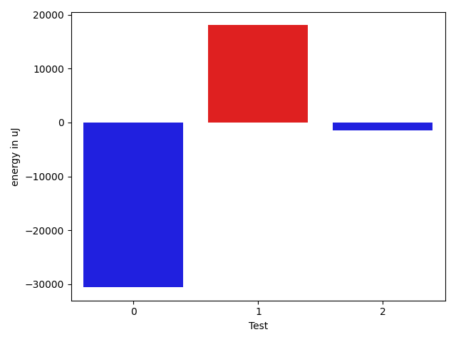

# gson 457b37

https://github.com/google/gson/commit/457b37

## Delta Energy per test method

| ID | EnergyV1 | EnergyV2 | DeltaEnergy | σV1 | σV2 |
| --- | --- | --- | --- | --- | --- |
| 0 | 68786 | 38208 | -30578 | 966550.188664228 | 1054275.3534861007 |
| 1 | 118163 | 136230 | 18067 | 1086709.4536146943 | 1057413.0910624384 |
| 2 | 36865 | 35339 | -1526 | 1091407.5484778231 | 1057789.3417675006 |

## Delta Duration per test method

| ID | DurationV1 | DurationsV2 | DeltaDuration |
| --- | --- | --- | --- |
| 0 | 20049941.24742268 | 23717281.175824177 | 3667339.9284014963 |
| 1 | 31643116.410256412 | 33263104.285714287 | 1619987.8754578754 |
| 2 | 29497829.65882353 | 24803940.56962025 | -4693889.089203279 |

## Misc.

| ID | Test Class | Test Method |
| --- | --- | --- |
| 0 | com.google.gson.functional.ExclusionStrategyFunctionalTest | testExclusionStrategyWithMode |
| 1 | com.google.gson.functional.ExclusionStrategyFunctionalTest | testExclusionStrategyDeserialization |
| 2 | com.google.gson.functional.ExclusionStrategyFunctionalTest | testExclusionStrategySerialization |

| Test | IterationV1 | IterationV2 | DeltaIteration |
| --- | --- | --- | --- |
| 0 | 97 | 91 | -6 |
| 1 | 78 | 84 | 6 |
| 2 | 85 | 79 | -6 |

| Time Label | Time (s) |
| --- | --- |
| Selection | 27.018691778182983 |
| Injection | 9.599541187286377 |
| Total | 1076.560744524002 |

