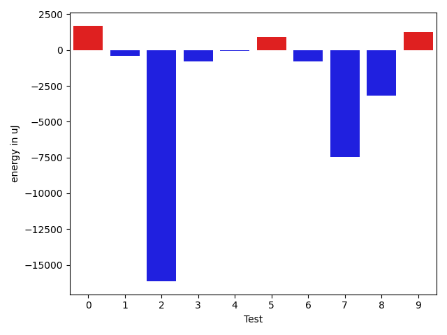
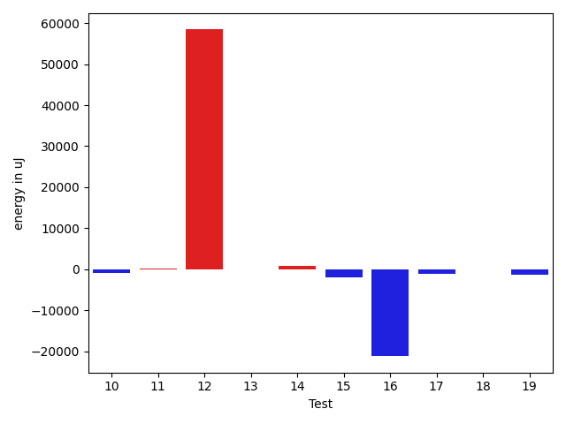
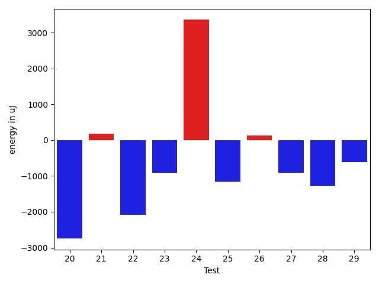
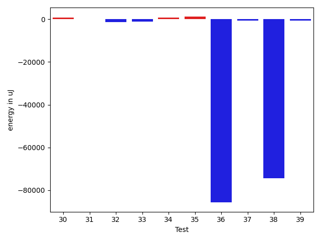
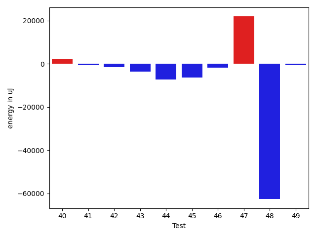
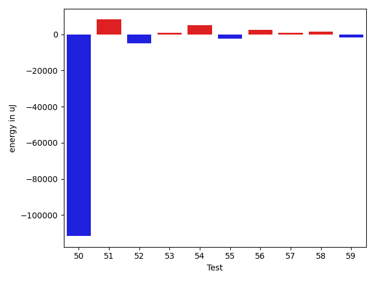
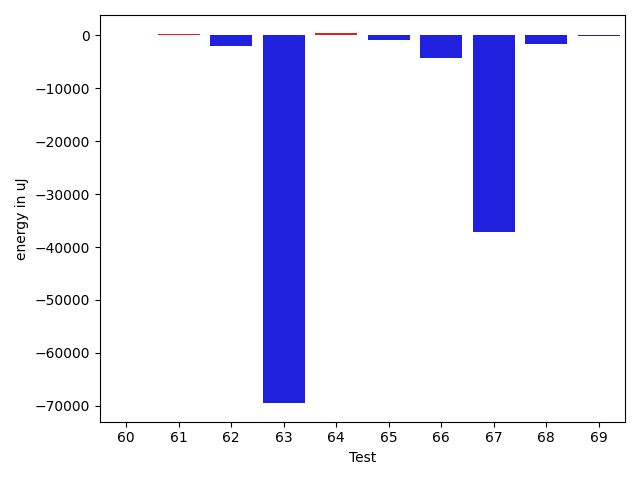
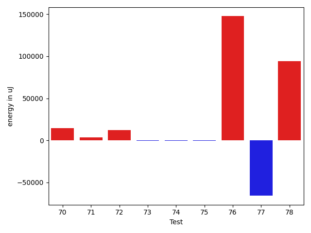

# gson 05ae10

https://github.com/google/gson/commit/05ae10

## Delta Energy per test method

| ID | EnergyV1 | EnergyV2 | DeltaEnergy | σV1 | σV2 |
| --- | --- | --- | --- | --- | --- |
| 0 | 38818 | 39185 | 367 | 5579.598621949519 | 10045.934321264136 |
| 1 | 37597 | 36682 | -915 | 3441.7773031450547 | 4604.737888332723 |
| 2 | 70007 | 49805 | -20202 | 97525.00403876195 | 75022.56297174406 |
| 3 | 36865 | 36560 | -305 | 4910.247883989385 | 3849.4384177222446 |
| 4 | 36011 | 36132 | 121 | 4581.734406369929 | 4293.350090453115 |
| 5 | 37049 | 37597 | 548 | 8754.095199062316 | 10171.51779969505 |
| 6 | 36438 | 36255 | -183 | 4358.895230416999 | 4235.460200337036 |
| 7 | 42480 | 42358 | -122 | 64531.17244936846 | 41648.19742525703 |
| 8 | 38940 | 37231 | -1709 | 13779.951911314314 | 10704.089103536173 |
| 9 | 36255 | 38391 | 2136 | 4393.98353224042 | 4546.313727259335 |
| 10 | 38208 | 37231 | -977 | 5383.98518090945 | 4404.75220611162 |
| 11 | 40527 | 40771 | 244 | 19644.54347723278 | 18835.348650094384 |
| 12 | 109802 | 168213 | 58411 | 84904.88834291947 | 85070.0039445827 |
| 13 | 87585 | 87463 | -122 | 112585.93001338656 | 93180.60536583567 |
| 14 | 37231 | 37964 | 733 | 4143.511861569591 | 4097.860958725265 |
| 15 | 38818 | 36744 | -2074 | 4496.126020871252 | 3050.4621859098675 |
| 16 | 61401 | 40222 | -21179 | 45963.6102550365 | 46145.44930229593 |
| 17 | 40710 | 39672 | -1038 | 22770.029178281115 | 17574.38438953442 |
| 18 | 36865 | 36865 | 0 | 3703.1047138313547 | 4210.1591305814745 |
| 19 | 80749 | 79407 | -1342 | 42863.77903805641 | 38675.310175288585 |
| 20 | 85510 | 82763 | -2747 | 305960.60018746293 | 276280.6803285378 |
| 21 | 38757 | 38940 | 183 | 8195.24449314779 | 4162.546688051573 |
| 22 | 70312 | 68237 | -2075 | 21197.36220022496 | 22440.996691890858 |
| 23 | 37048 | 36132 | -916 | 5593.563697783907 | 2830.9636155271514 |
| 24 | 66407 | 69763 | 3356 | 20517.27535807872 | 26568.743312968738 |
| 25 | 38635 | 37476 | -1159 | 11348.31505313276 | 6437.714797738149 |
| 26 | 37048 | 37171 | 123 | 11716.731195528024 | 13979.968265800491 |
| 27 | 37903 | 36987 | -916 | 8764.778293567704 | 4135.673856079118 |
| 28 | 37293 | 36011 | -1282 | 3235.121871075348 | 4043.2069350128418 |
| 29 | 37110 | 36499 | -611 | 3668.22216483832 | 3838.6548311090296 |
| 30 | 38086 | 36560 | -1526 | 6883.91771985817 | 10393.195606828964 |
| 31 | 37537 | 36683 | -854 | 4109.370652036145 | 4102.010031389374 |
| 32 | 37231 | 35766 | -1465 | 4273.779194534547 | 3479.2909775778453 |
| 33 | 36987 | 36438 | -549 | 2862.8886711385294 | 3086.0687394561446 |
| 34 | 35401 | 38025 | 2624 | 3652.949036381428 | 3624.789535355099 |
| 35 | 37415 | 37719 | 304 | 4141.2339538097185 | 6780.595117081806 |
| 36 | 86609 | 85083 | -1526 | 500267.8788804678 | 73829.9332262203 |
| 37 | 43701 | 42603 | -1098 | 20841.515968973625 | 22470.285833170226 |
| 38 | 170959 | 163513 | -7446 | 393173.614904956 | 236426.04271508093 |
| 39 | 36987 | 36621 | -366 | 4263.369519514893 | 3678.1178116032465 |
| 40 | 36621 | 38269 | 1648 | 7459.285253647892 | 8578.620902126402 |
| 41 | 37903 | 36683 | -1220 | 3407.2864389763513 | 3484.977437019402 |
| 42 | 73364 | 72083 | -1281 | 67346.63204171933 | 80073.8849942109 |
| 43 | 78613 | 75561 | -3052 | 27377.255771203243 | 26754.162682764545 |
| 44 | 74646 | 72998 | -1648 | 31674.683645682657 | 28312.296210875833 |
| 45 | 37476 | 37964 | 488 | 58710.78494537074 | 52432.95462322542 |
| 46 | 39611 | 37292 | -2319 | 4283.722043183076 | 3553.7243716232833 |
| 47 | 41077 | 40527 | -550 | 47310.55665884494 | 95101.29723464293 |
| 48 | 42297 | 40100 | -2197 | 618457.8384019292 | 455287.69441191416 |
| 49 | 38940 | 39001 | 61 | 7626.532399509712 | 9441.635333792898 |
| 50 | 41382 | 41016 | -366 | 495745.43255205965 | 323025.4421571311 |
| 51 | 204223 | 164428 | -39795 | 448998.3762271456 | 509669.8340821962 |
| 52 | 89295 | 81970 | -7325 | 28353.193896235727 | 23279.782710551768 |
| 53 | 37232 | 37292 | 60 | 5107.820976335222 | 6428.205153241786 |
| 54 | 38513 | 38818 | 305 | 15639.351582038422 | 23627.116640554304 |
| 55 | 39306 | 36804 | -2502 | 4595.852946912289 | 3242.3596903444027 |
| 56 | 40954 | 42053 | 1099 | 36389.14931983106 | 37397.33946334059 |
| 57 | 37293 | 37964 | 671 | 8620.975326709902 | 7360.869239524236 |
| 58 | 36865 | 37109 | 244 | 3328.0358284848103 | 6938.728462179681 |
| 59 | 38879 | 39063 | 184 | 12329.056970566005 | 10998.78104186612 |
| 60 | 37902 | 36987 | -915 | 4754.007809157176 | 4438.38333398122 |
| 61 | 40710 | 40710 | 0 | 20798.125352126342 | 23682.235641072915 |
| 62 | 40100 | 37719 | -2381 | 4541.62976572165 | 5008.792271679205 |
| 63 | 82519 | 80383 | -2136 | 519267.3850619291 | 343778.33512670954 |
| 64 | 38819 | 39733 | 914 | 24372.006287309247 | 22508.401800128126 |
| 65 | 38207 | 38086 | -121 | 16446.695805797488 | 15560.440732881325 |
| 66 | 40466 | 38635 | -1831 | 96201.81577643115 | 83902.05263627085 |
| 67 | 78369 | 83312 | 4943 | 409413.4363106852 | 287825.0941195519 |
| 68 | 38025 | 41016 | 2991 | 87496.1872763311 | 56321.710386620674 |
| 69 | 38636 | 40955 | 2319 | 39900.324375655655 | 35793.08222975737 |
| 70 | 39734 | 39856 | 122 | 61850.246899891186 | 78695.70607463807 |
| 71 | 38086 | 40283 | 2197 | 51517.70953237237 | 58164.37392274067 |
| 72 | 38696 | 41320 | 2624 | 49564.129599588894 | 54034.91597703191 |
| 73 | 38086 | 38635 | 549 | 34428.09241655326 | 32028.758457666718 |
| 74 | 39002 | 38574 | -428 | 4923.0100893501885 | 3917.2483004857745 |
| 75 | 39734 | 39184 | -550 | 15063.01585449971 | 15141.503902464237 |
| 76 | 38086 | 39245 | 1159 | 344940.3234489142 | 604867.0043789427 |
| 77 | 40283 | 39489 | -794 | 449711.4707353067 | 275401.65930425504 |
| 78 | 38697 | 40833 | 2136 | 258190.39982271788 | 485290.9341650235 |

## Delta Duration per test method

| ID | DurationV1 | DurationsV2 | DeltaDuration |
| --- | --- | --- | --- |
| 0 | 1023942.2063492064 | 1121208.9027777778 | 97266.69642857136 |
| 1 | 799138.3777777777 | 813466.0 | 14327.622222222271 |
| 2 | 2712207.8484848486 | 2262000.7474747472 | -450207.1010101014 |
| 3 | 947275.3666666667 | 955654.625 | 8379.258333333302 |
| 4 | 873282.0701754387 | 885024.393442623 | 11742.323267184314 |
| 5 | 1209848.1927710844 | 1155194.3953488371 | -54653.79742224724 |
| 6 | 938737.0363636364 | 911984.2307692308 | -26752.805594405625 |
| 7 | 2175412.285714286 | 1913046.0909090908 | -262366.1948051951 |
| 8 | 834569.3617021276 | 800239.5957446808 | -34329.76595744677 |
| 9 | 734190.9 | 746065.3111111111 | 11874.411111111054 |
| 10 | 1007258.7321428572 | 1007516.3333333334 | 257.60119047621265 |
| 11 | 1354381.05 | 1386630.857142857 | 32249.807142856997 |
| 12 | 4130197.1717171716 | 4712000.101010101 | 581802.9292929294 |
| 13 | 3749859.2653061226 | 3455019.9591836734 | -294839.3061224492 |
| 14 | 590314.6206896552 | 622624.7096774194 | 32310.088987764204 |
| 15 | 750251.5 | 791482.8717948718 | 41231.37179487175 |
| 16 | 2285773.8210526314 | 2070801.75 | -214972.07105263136 |
| 17 | 1682333.9239130435 | 1515263.9777777777 | -167069.94613526575 |
| 18 | 908839.38 | 829894.0243902439 | -78945.35560975608 |
| 19 | 2982674.414141414 | 2794517.202020202 | -188157.2121212124 |
| 20 | 4820397.868686869 | 4500736.565656566 | -319661.30303030275 |
| 21 | 1079316.0972222222 | 1049714.3174603174 | -29601.77976190485 |
| 22 | 1859996.9494949495 | 1919604.5454545454 | 59607.59595959587 |
| 23 | 791230.0243902439 | 780038.7608695652 | -11191.263520678738 |
| 24 | 1830096.2631578948 | 1902686.585106383 | 72590.32194848824 |
| 25 | 990790.1395348837 | 918247.6037735849 | -72542.53576129873 |
| 26 | 1239201.0361445784 | 1247147.0898876404 | 7946.053743062075 |
| 27 | 889474.4390243902 | 866989.7826086957 | -22484.65641569451 |
| 28 | 618910.4230769231 | 593453.75 | -25456.67307692312 |
| 29 | 914368.9574468085 | 909250.8545454545 | -5118.102901353966 |
| 30 | 1071599.6451612904 | 1106011.0597014925 | 34411.414540202124 |
| 31 | 769298.7708333334 | 781311.4761904762 | 12012.70535714284 |
| 32 | 775220.9818181818 | 839044.659574468 | 63823.677756286226 |
| 33 | 600745.7333333333 | 637842.0 | 37096.26666666672 |
| 34 | 535729.52 | 573913.3636363636 | 38183.84363636363 |
| 35 | 996514.1126760563 | 1049833.4078947369 | 53319.29521868052 |
| 36 | 5640454.303030303 | 3127102.1717171716 | -2513352.131313131 |
| 37 | 1712665.8958333333 | 1707651.5208333333 | -5014.375 |
| 38 | 8784552.373737374 | 6368348.323232323 | -2416204.0505050514 |
| 39 | 1015881.6551724138 | 987670.5454545454 | -28211.109717868385 |
| 40 | 1164915.36 | 1082046.2533333334 | -82869.10666666669 |
| 41 | 910302.0 | 932136.5964912281 | 21834.59649122809 |
| 42 | 2695850.9175257734 | 2661003.888888889 | -34847.02863688441 |
| 43 | 2589138.9191919193 | 2502454.5757575757 | -86684.34343434358 |
| 44 | 2445120.3333333335 | 2377262.272727273 | -67858.06060606055 |
| 45 | 1653790.5057471264 | 1611984.1505376345 | -41806.355209491914 |
| 46 | 618314.2352941176 | 615308.8387096775 | -3005.396584440139 |
| 47 | 1789660.2134831462 | 2370299.775280899 | 580639.5617977527 |
| 48 | 6445758.175675675 | 4707907.904761905 | -1737850.2709137704 |
| 49 | 1126967.5454545454 | 1088260.2428571428 | -38707.302597402595 |
| 50 | 7304292.179487179 | 3537199.575 | -3767092.604487179 |
| 51 | 8371814.262626262 | 9166329.848484848 | 794515.5858585853 |
| 52 | 2909463.8585858587 | 2778794.9696969697 | -130668.88888888899 |
| 53 | 1106273.2739726028 | 1114336.4225352113 | 8063.14856260852 |
| 54 | 1164487.6129032257 | 1360218.5967741935 | 195730.98387096776 |
| 55 | 750594.1914893617 | 763820.75 | 13226.558510638308 |
| 56 | 1562827.2318840579 | 1676418.1692307692 | 113590.93734671129 |
| 57 | 1164472.3636363635 | 1178489.6666666667 | 14017.303030303214 |
| 58 | 983981.524590164 | 1080336.1311475409 | 96354.60655737692 |
| 59 | 1029727.4390243902 | 1063278.4222222222 | 33550.983197832014 |
| 60 | 960702.7608695652 | 879796.220338983 | -80906.54053058219 |
| 61 | 1539902.2083333333 | 1540874.956043956 | 972.7477106228471 |
| 62 | 690176.9 | 719304.1944444445 | 29127.294444444473 |
| 63 | 6661674.222222222 | 4343659.94949495 | -2318014.2727272725 |
| 64 | 1649806.7604166667 | 1663183.2947368422 | 13376.534320175415 |
| 65 | 1370575.4457831325 | 1423655.8043478262 | 53080.35856469371 |
| 66 | 2004932.2142857143 | 2101030.9811320757 | 96098.76684636134 |
| 67 | 5395467.404040404 | 4248864.97979798 | -1146602.4242424238 |
| 68 | 1808390.641025641 | 1665535.85 | -142854.7910256409 |
| 69 | 1254243.9772727273 | 1460698.1944444445 | 206454.2171717172 |
| 70 | 1542165.625 | 1907404.5405405406 | 365238.9155405406 |
| 71 | 1485439.303030303 | 1679360.2647058824 | 193920.96167557943 |
| 72 | 1485030.6875 | 1891847.1142857142 | 406816.4267857142 |
| 73 | 982039.8571428572 | 970487.593220339 | -11552.26392251812 |
| 74 | 639897.75 | 654257.7419354839 | 14359.991935483878 |
| 75 | 1374102.9069767443 | 1374777.3023255814 | 674.3953488371335 |
| 76 | 2843955.3859649124 | 7374980.793650794 | 4531025.4076858815 |
| 77 | 4056688.9487179485 | 2132934.5576923075 | -1923754.391025641 |
| 78 | 2036920.6923076923 | 5248771.094117647 | 3211850.401809955 |

## Misc.

| ID | Test Class | Test Method |
| --- | --- | --- |
| 0 | com.google.gson.functional.PrimitiveTest | testDeserializePrimitiveWrapperAsObjectField |
| 1 | com.google.gson.functional.CustomDeserializerTest | testDefaultConstructorNotCalledOnField |
| 2 | com.google.gson.functional.CustomDeserializerTest | testDefaultConstructorNotCalledOnObject |
| 3 | com.google.gson.functional.CustomDeserializerTest | testCustomDeserializerReturnsNullForArrayElementsForArrayField |
| 4 | com.google.gson.functional.CustomDeserializerTest | testCustomDeserializerReturnsNull |
| 5 | com.google.gson.functional.CustomDeserializerTest | testJsonTypeFieldBasedDeserialization |
| 6 | com.google.gson.functional.CustomDeserializerTest | testCustomDeserializerReturnsNullForPrimitiveFields |
| 7 | com.google.gson.functional.CircularReferenceTest | testCircularSerialization |
| 8 | com.google.gson.functional.CircularReferenceTest | testSelfReferenceSerialization |
| 9 | com.google.gson.functional.CircularReferenceTest | testSelfReferenceArrayFieldSerialization |
| 10 | com.google.gson.functional.PrettyPrintingTest | testEmptyMapField |
| 11 | com.google.gson.functional.MapTest | testMapSerializationWithNullValues |
| 12 | com.google.gson.functional.MapTest | testInterfaceTypeMap |
| 13 | com.google.gson.functional.ExposeFieldsTest | testNullExposeFieldSerialization |
| 14 | com.google.gson.functional.ExposeFieldsTest | testNoExposedFieldSerialization |
| 15 | com.google.gson.functional.ExposeFieldsTest | testExposedInterfaceFieldSerialization |
| 16 | com.google.gson.functional.InheritanceTest | testSubInterfacesOfCollectionSerialization |
| 17 | com.google.gson.functional.InheritanceTest | testSubClassSerialization |
| 18 | com.google.gson.functional.InheritanceTest | testClassWithBaseArrayFieldSerialization |
| 19 | com.google.gson.functional.NamingPolicyTest | testGsonWithNonDefaultFieldNamingPolicySerialization |
| 20 | com.google.gson.functional.NamingPolicyTest | testGsonDuplicateNameUsingSerializedNameFieldNamingPolicySerialization |
| 21 | com.google.gson.functional.NamingPolicyTest | testGsonWithSerializedNameFieldNamingPolicySerialization |
| 22 | com.google.gson.functional.ObjectTest | testSingletonLists |
| 23 | com.google.gson.functional.ObjectTest | testPrimitiveArrayInAnObjectDeserialization |
| 24 | com.google.gson.functional.ObjectTest | testArrayOfArraysSerialization |
| 25 | com.google.gson.functional.ObjectTest | testClassWithTransientFieldsSerialization |
| 26 | com.google.gson.functional.ObjectTest | testEmptyCollectionInAnObjectDeserialization |
| 27 | com.google.gson.functional.ObjectTest | testNestedSerialization |
| 28 | com.google.gson.functional.ObjectTest | testPrivateNoArgConstructorDeserialization |
| 29 | com.google.gson.functional.ObjectTest | testArrayOfObjectsSerialization |
| 30 | com.google.gson.functional.ObjectTest | testArrayOfObjectsAsFields |
| 31 | com.google.gson.functional.ObjectTest | testBagOfPrimitiveWrappersSerialization |
| 32 | com.google.gson.functional.ObjectTest | testInnerClassSerialization |
| 33 | com.google.gson.functional.ObjectTest | testStringFieldWithEmptyValueSerialization |
| 34 | com.google.gson.functional.ObjectTest | testClassWithObjectFieldSerialization |
| 35 | com.google.gson.functional.TypeVariableTest | testBasicTypeVariables |
| 36 | com.google.gson.functional.TypeVariableTest | testAdvancedTypeVariables |
| 37 | com.google.gson.functional.TypeVariableTest | testTypeVariablesViaTypeParameter |
| 38 | com.google.gson.functional.VersioningTest | testVersionedUntilSerialization |
| 39 | com.google.gson.functional.VersioningTest | testVersionedClassesSerialization |
| 40 | com.google.gson.functional.VersioningTest | testVersionedGsonMixingSinceAndUntilSerialization |
| 41 | com.google.gson.functional.ParameterizedTypesTest | testDeepParameterizedTypeDeserialization |
| 42 | com.google.gson.functional.ParameterizedTypesTest | testParameterizedTypesSerialization |
| 43 | com.google.gson.functional.ParameterizedTypesTest | testVariableTypeFieldsAndGenericArraysSerialization |
| 44 | com.google.gson.functional.ParameterizedTypesTest | testTypesWithMultipleParametersSerialization |
| 45 | com.google.gson.functional.ParameterizedTypesTest | testParameterizedTypeDeserialization |
| 46 | com.google.gson.functional.ParameterizedTypesTest | testDeepParameterizedTypeSerialization |
| 47 | com.google.gson.functional.ConcurrencyTest | testSingleThreadSerialization |
| 48 | com.google.gson.functional.InstanceCreatorTest | testInstanceCreatorReturnsBaseType |
| 49 | com.google.gson.functional.InstanceCreatorTest | testInstanceCreatorReturnsSubTypeForField |
| 50 | com.google.gson.functional.SecurityTest | testNonExecutableJsonSerialization |
| 51 | com.google.gson.functional.MapAsArrayTypeAdapterTest | testSerializeComplexMapWithTypeAdapter |
| 52 | com.google.gson.functional.CustomTypeAdaptersTest | testCustomTypeAdapterDoesNotAppliesToSubClasses |
| 53 | com.google.gson.functional.CustomTypeAdaptersTest | testCustomSerializerForLong |
| 54 | com.google.gson.functional.CustomTypeAdaptersTest | testCustomNestedSerializers |
| 55 | com.google.gson.functional.CustomTypeAdaptersTest | testEnsureCustomSerializerNotInvokedForNullValues |
| 56 | com.google.gson.functional.JsonTreeTest | testJsonTreeToString |
| 57 | com.google.gson.functional.DefaultTypeAdaptersTest | testUrlNullSerialization |
| 58 | com.google.gson.functional.DefaultTypeAdaptersTest | testBigIntegerFieldSerialization |
| 59 | com.google.gson.functional.DefaultTypeAdaptersTest | testBigDecimalFieldSerialization |
| 60 | com.google.gson.functional.NullObjectAndFieldTest | testNullWrappedPrimitiveMemberSerialization |
| 61 | com.google.gson.functional.NullObjectAndFieldTest | testExplicitSerializationOfNullArrayMembers |
| 62 | com.google.gson.functional.NullObjectAndFieldTest | testExplicitNullSetsFieldToNullDuringDeserialization |
| 63 | com.google.gson.functional.TypeHierarchyAdapterTest | testTypeHierarchy |
| 64 | com.google.gson.functional.CollectionTest | testWildcardCollectionField |
| 65 | com.google.gson.functional.CollectionTest | testFieldIsArrayList |
| 66 | com.google.gson.functional.CollectionTest | testSetSerialization |
| 67 | com.google.gson.functional.ExclusionStrategyFunctionalTest | testExclusionStrategySerialization |
| 68 | com.google.gson.ExposeAnnotationExclusionStrategyTest | testSkipExplicitlySkippedFields |
| 69 | com.google.gson.ExposeAnnotationExclusionStrategyTest | testSkipNonAnnotatedFields |
| 70 | com.google.gson.ExposeAnnotationExclusionStrategyTest | testDifferentSerializeAndDeserializeField |
| 71 | com.google.gson.ExposeAnnotationExclusionStrategyTest | testNeverSkipExplicitlyExposedAnnotatedFields |
| 72 | com.google.gson.ExposeAnnotationExclusionStrategyTest | testNeverSkipExposedAnnotatedFields |
| 73 | com.google.gson.functional.InterfaceTest | testSerializingObjectImplementingInterface |
| 74 | com.google.gson.functional.InterfaceTest | testSerializingInterfaceObjectField |
| 75 | com.google.gson.functional.EnumTest | testClassWithEnumFieldSerialization |
| 76 | com.google.gson.FunctionWithInternalDependenciesTest | testAnonymousLocalClassesSerialization |
| 77 | com.google.gson.MixedStreamTest | testWriteMixedStreamed |
| 78 | com.google.gson.functional.FieldExclusionTest | testDefaultInnerClassExclusion |

| Test | IterationV1 | IterationV2 | DeltaIteration |
| --- | --- | --- | --- |
| 0 | 63 | 72 | 9 |
| 1 | 45 | 45 | 0 |
| 2 | 99 | 99 | 0 |
| 3 | 60 | 64 | 4 |
| 4 | 57 | 61 | 4 |
| 5 | 83 | 86 | 3 |
| 6 | 55 | 65 | 10 |
| 7 | 98 | 99 | 1 |
| 8 | 47 | 47 | 0 |
| 9 | 50 | 45 | -5 |
| 10 | 56 | 66 | 10 |
| 11 | 60 | 70 | 10 |
| 12 | 99 | 99 | 0 |
| 13 | 98 | 98 | 0 |
| 14 | 29 | 31 | 2 |
| 15 | 30 | 39 | 9 |
| 16 | 95 | 96 | 1 |
| 17 | 92 | 90 | -2 |
| 18 | 50 | 41 | -9 |
| 19 | 99 | 99 | 0 |
| 20 | 99 | 99 | 0 |
| 21 | 72 | 63 | -9 |
| 22 | 99 | 99 | 0 |
| 23 | 41 | 46 | 5 |
| 24 | 95 | 94 | -1 |
| 25 | 43 | 53 | 10 |
| 26 | 83 | 89 | 6 |
| 27 | 41 | 46 | 5 |
| 28 | 26 | 32 | 6 |
| 29 | 47 | 55 | 8 |
| 30 | 62 | 67 | 5 |
| 31 | 48 | 42 | -6 |
| 32 | 55 | 47 | -8 |
| 33 | 30 | 32 | 2 |
| 34 | 25 | 22 | -3 |
| 35 | 71 | 76 | 5 |
| 36 | 99 | 99 | 0 |
| 37 | 96 | 96 | 0 |
| 38 | 99 | 99 | 0 |
| 39 | 58 | 55 | -3 |
| 40 | 75 | 75 | 0 |
| 41 | 56 | 57 | 1 |
| 42 | 97 | 99 | 2 |
| 43 | 99 | 99 | 0 |
| 44 | 99 | 99 | 0 |
| 45 | 87 | 93 | 6 |
| 46 | 34 | 31 | -3 |
| 47 | 89 | 89 | 0 |
| 48 | 74 | 63 | -11 |
| 49 | 66 | 70 | 4 |
| 50 | 39 | 40 | 1 |
| 51 | 99 | 99 | 0 |
| 52 | 99 | 99 | 0 |
| 53 | 73 | 71 | -2 |
| 54 | 62 | 62 | 0 |
| 55 | 47 | 44 | -3 |
| 56 | 69 | 65 | -4 |
| 57 | 77 | 78 | 1 |
| 58 | 61 | 61 | 0 |
| 59 | 41 | 45 | 4 |
| 60 | 46 | 59 | 13 |
| 61 | 96 | 91 | -5 |
| 62 | 30 | 36 | 6 |
| 63 | 99 | 99 | 0 |
| 64 | 96 | 95 | -1 |
| 65 | 83 | 92 | 9 |
| 66 | 56 | 53 | -3 |
| 67 | 99 | 99 | 0 |
| 68 | 39 | 40 | 1 |
| 69 | 44 | 36 | -8 |
| 70 | 40 | 37 | -3 |
| 71 | 33 | 34 | 1 |
| 72 | 32 | 35 | 3 |
| 73 | 49 | 59 | 10 |
| 74 | 32 | 31 | -1 |
| 75 | 86 | 86 | 0 |
| 76 | 57 | 63 | 6 |
| 77 | 39 | 52 | 13 |
| 78 | 78 | 85 | 7 |

| Time Label | Time (s) |
| --- | --- |
| Selection | 27.631699562072754 |
| Injection | 14.533655643463135 |
| Total | 1168.2392058372498 |

