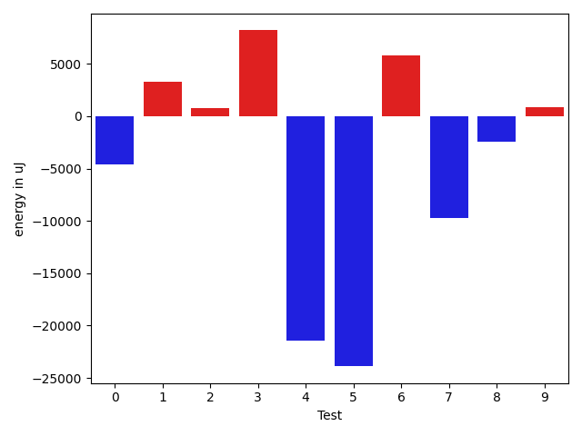
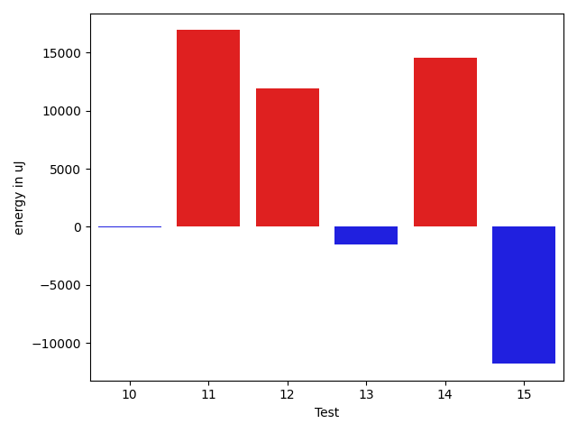

# gson 52bf14

https://github.com/google/gson/commit/52bf14

## Delta Energy per test method

| ID | EnergyV1 | EnergyV2 | DeltaEnergy | σV1 | σV2 |
| --- | --- | --- | --- | --- | --- |
| 0 | 41382 | 39124 | -2258 | 69546.78375828097 | 70525.54797423231 |
| 1 | 117920 | 118286 | 366 | 84453.71935454135 | 84999.47814534824 |
| 2 | 37110 | 38391 | 1281 | 3984.8762043050174 | 4287.763423225881 |
| 3 | 40832 | 40161 | -671 | 57245.267428424304 | 64618.38577578561 |
| 4 | 117615 | 117676 | 61 | 120736.32127401965 | 95958.89930482974 |
| 5 | 37842 | 38635 | 793 | 86673.36402230682 | 3609.62877563893 |
| 6 | 38207 | 37476 | -731 | 4354.5799467223815 | 19907.11662959084 |
| 7 | 39489 | 39551 | 62 | 49448.3366166924 | 39879.32437013884 |
| 8 | 37536 | 38574 | 1038 | 11388.447113145636 | 3724.003554722516 |
| 9 | 82031 | 84168 | 2137 | 56455.278186494426 | 58476.07702030205 |
| 10 | 37354 | 36804 | -550 | 4440.35094959346 | 3099.074991624265 |
| 11 | 37720 | 38940 | 1220 | 3692.5567882499813 | 82528.69810386078 |
| 12 | 40344 | 41443 | 1099 | 58576.42484896462 | 64971.9722145741 |
| 13 | 39185 | 38147 | -1038 | 4300.512886474669 | 3645.3561848310123 |
| 14 | 37659 | 39184 | 1525 | 24528.175269726904 | 47323.78471339756 |
| 15 | 41442 | 41077 | -365 | 41188.31411847828 | 29897.71770965804 |

## Delta Duration per test method

| ID | DurationV1 | DurationsV2 | DeltaDuration |
| --- | --- | --- | --- |
| 0 | 2475729.25 | 2426363.254901961 | -49365.99509803904 |
| 1 | 4297603.333333333 | 4459727.212121212 | 162123.8787878789 |
| 2 | 648460.3636363636 | 606826.6363636364 | -41633.727272727294 |
| 3 | 2011866.7362637362 | 2257622.5301204817 | 245755.7938567456 |
| 4 | 5068802.75257732 | 4454336.4845360825 | -614466.2680412373 |
| 5 | 1340797.9523809524 | 575078.3478260869 | -765719.6045548655 |
| 6 | 628843.1818181818 | 810219.0454545454 | 181375.86363636365 |
| 7 | 2095522.9682539683 | 1803279.796875 | -292243.1713789683 |
| 8 | 863242.9743589744 | 762637.875 | -100605.09935897437 |
| 9 | 3418673.46875 | 3361098.897959184 | -57574.5707908161 |
| 10 | 700223.0416666666 | 763822.875 | 63599.83333333337 |
| 11 | 672599.5384615385 | 1185587.4137931035 | 512987.87533156504 |
| 12 | 2016460.5 | 2453077.375 | 436616.875 |
| 13 | 750684.6785714285 | 856956.7142857143 | 106272.0357142858 |
| 14 | 942287.0 | 1547051.92 | 604764.9199999999 |
| 15 | 1601022.2631578948 | 1380468.84 | -220553.42315789475 |

## Misc.

| ID | Test Class | Test Method |
| --- | --- | --- |
| 0 | com.google.gson.JavaFieldNamingPolicyTest | testFieldNamingPolicy |
| 1 | com.google.gson.SerializedNameAnnotationInterceptingNamingPolicyTest | testFieldWithAnnotation |
| 2 | com.google.gson.SerializedNameAnnotationInterceptingNamingPolicyTest | testFieldWithoutAnnotation |
| 3 | com.google.gson.FieldNamingStrategy2AdapterTest | testSimpleAdapter |
| 4 | com.google.gson.VersionExclusionStrategyTest | testClassAndFieldAreAtSameVersion |
| 5 | com.google.gson.VersionExclusionStrategyTest | testClassAndFieldAreAheadInVersion |
| 6 | com.google.gson.VersionExclusionStrategyTest | testClassAndFieldAreBehindInVersion |
| 7 | com.google.gson.ExposeAnnotationExclusionStrategyTest | testSkipNonAnnotatedFields |
| 8 | com.google.gson.ExposeAnnotationExclusionStrategyTest | testNeverSkipExposedAnnotatedFields |
| 9 | com.google.gson.ExposeAnnotationExclusionStrategyTest | testSkipExplicitlySkippedFields |
| 10 | com.google.gson.ExposeAnnotationExclusionStrategyTest | testDifferentSerializeAndDeserializeField |
| 11 | com.google.gson.ExposeAnnotationExclusionStrategyTest | testNeverSkipExplicitlyExposedAnnotatedFields |
| 12 | com.google.gson.NullExclusionStrategyTest | testNeverSkipsField |
| 13 | com.google.gson.FieldAttributesTest | testNullField |
| 14 | com.google.gson.InnerClassExclusionStrategyTest | testExcludeInnerClassField |
| 15 | com.google.gson.InnerClassExclusionStrategyTest | testIncludeStaticNestedClassField |

| Test | IterationV1 | IterationV2 | DeltaIteration |
| --- | --- | --- | --- |
| 0 | 48 | 51 | 3 |
| 1 | 99 | 99 | 0 |
| 2 | 22 | 22 | 0 |
| 3 | 91 | 83 | -8 |
| 4 | 97 | 97 | 0 |
| 5 | 21 | 23 | 2 |
| 6 | 22 | 22 | 0 |
| 7 | 63 | 64 | 1 |
| 8 | 39 | 32 | -7 |
| 9 | 96 | 98 | 2 |
| 10 | 24 | 32 | 8 |
| 11 | 39 | 29 | -10 |
| 12 | 50 | 48 | -2 |
| 13 | 28 | 21 | -7 |
| 14 | 33 | 25 | -8 |
| 15 | 19 | 25 | 6 |

| Time Label | Time (s) |
| --- | --- |
| Selection | 27.20904517173767 |
| Injection | 9.693161725997925 |
| Total | 1081.576143503189 |

