# gson 2fb8c9

https://github.com/google/gson/commit/2fb8c9

## Delta Energy per test method

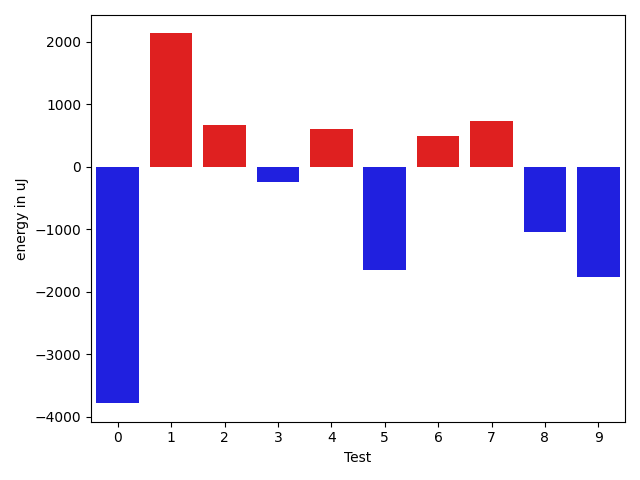

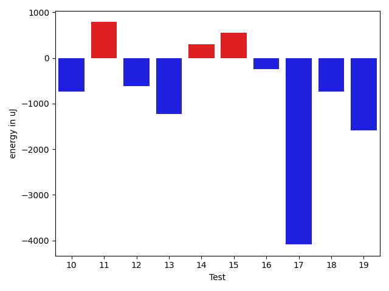

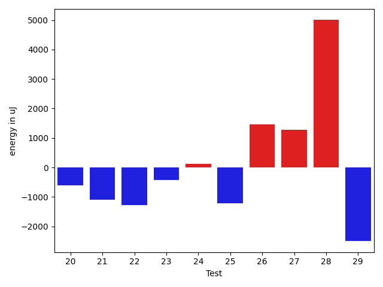

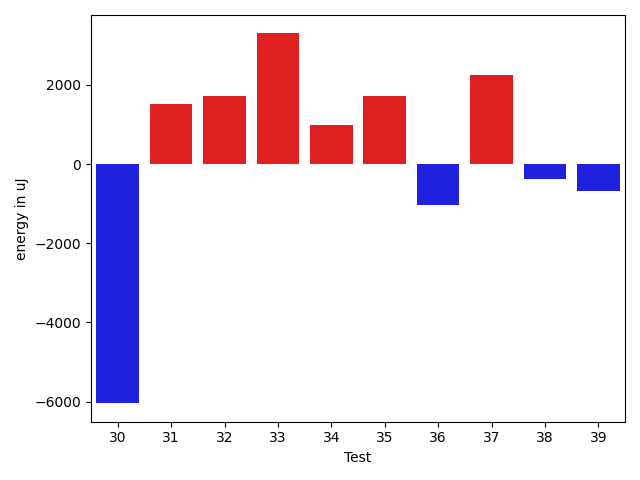

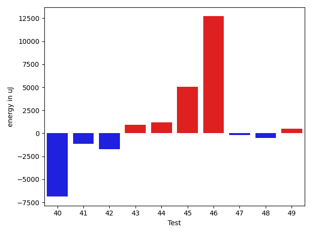

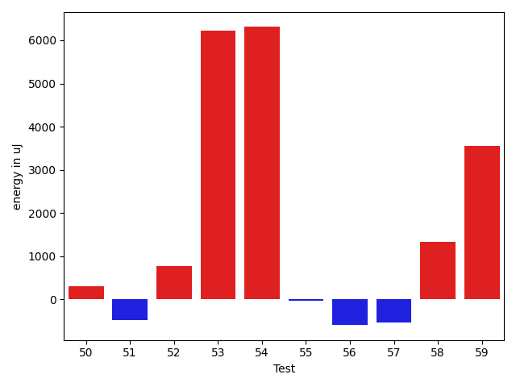

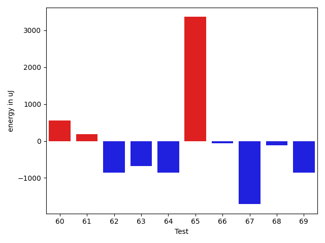

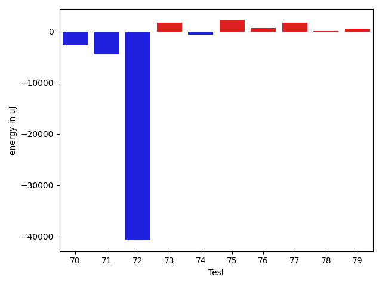

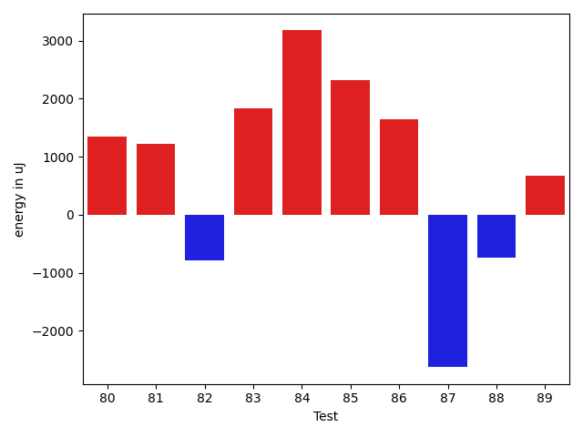

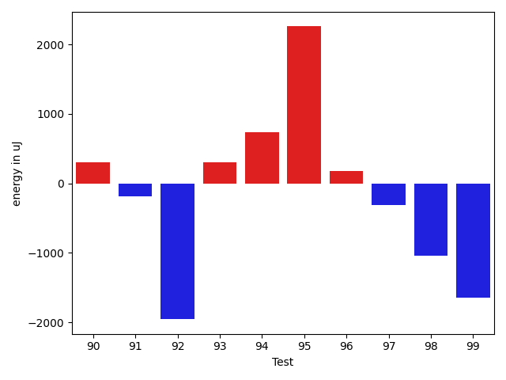

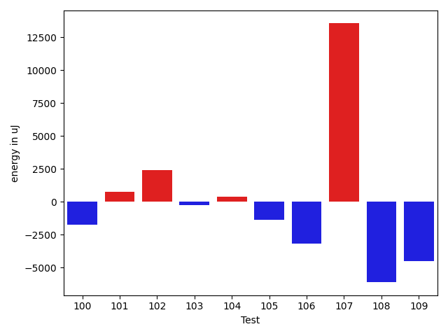

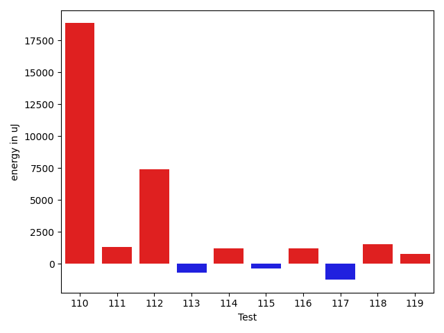

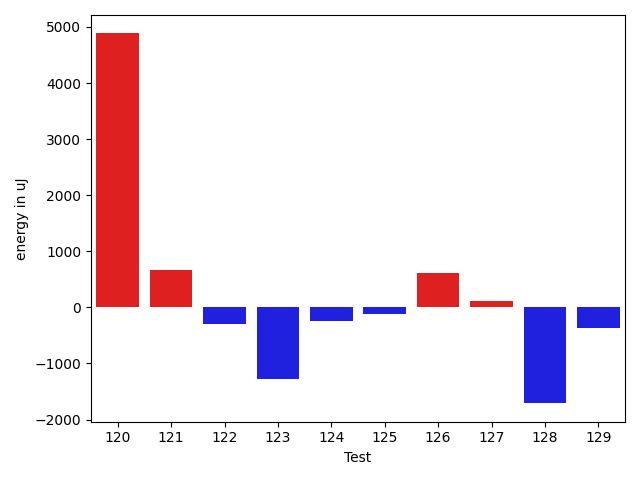

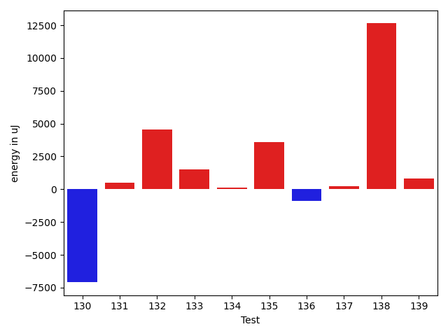

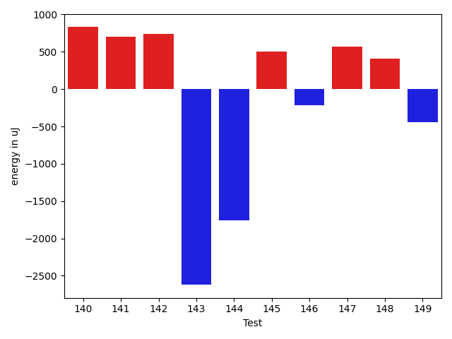

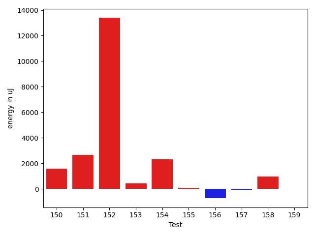

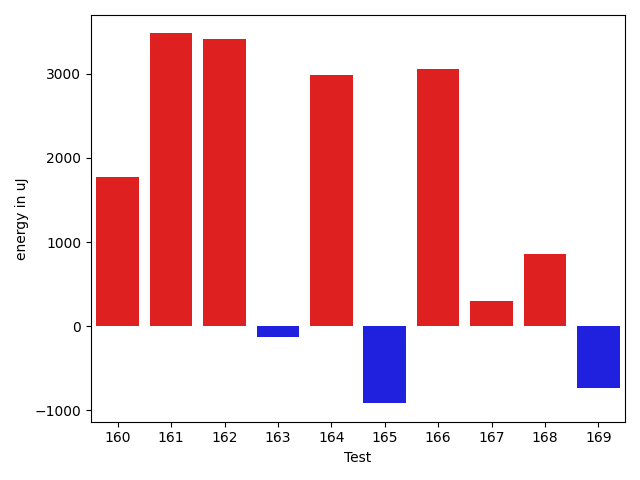

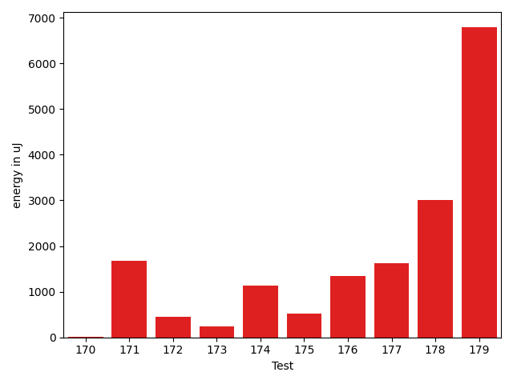

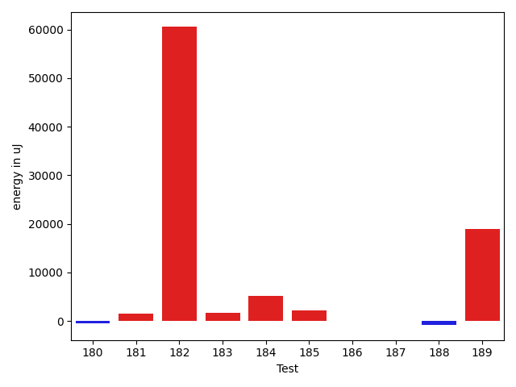

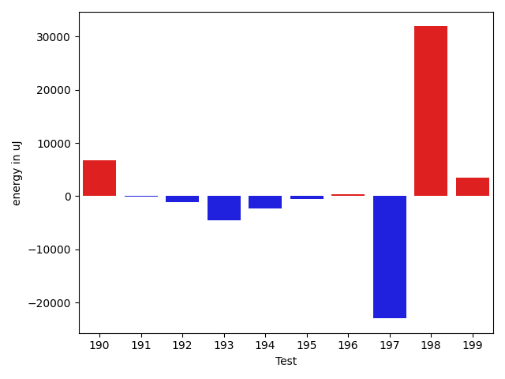

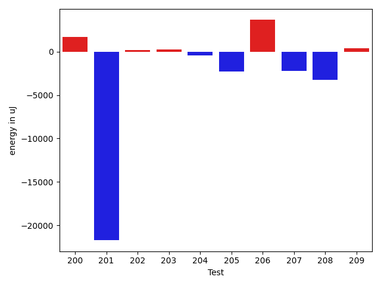

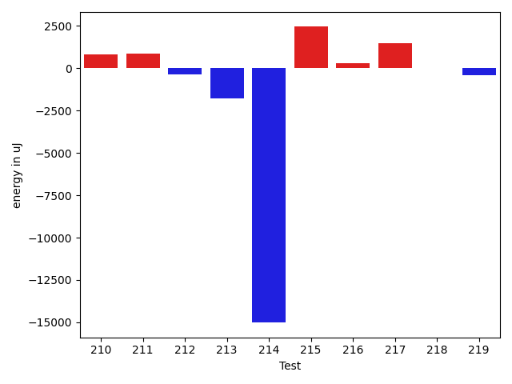

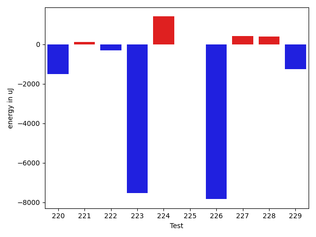

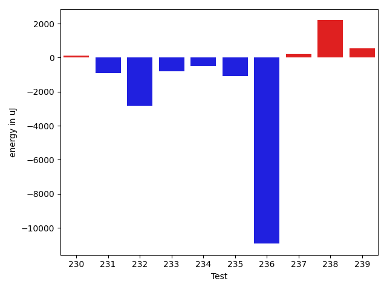

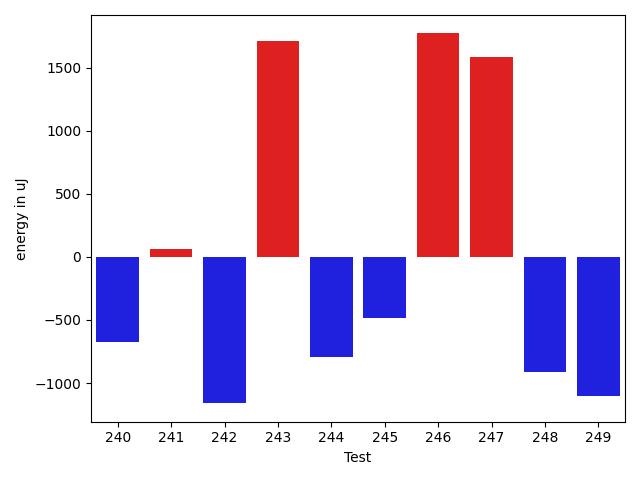

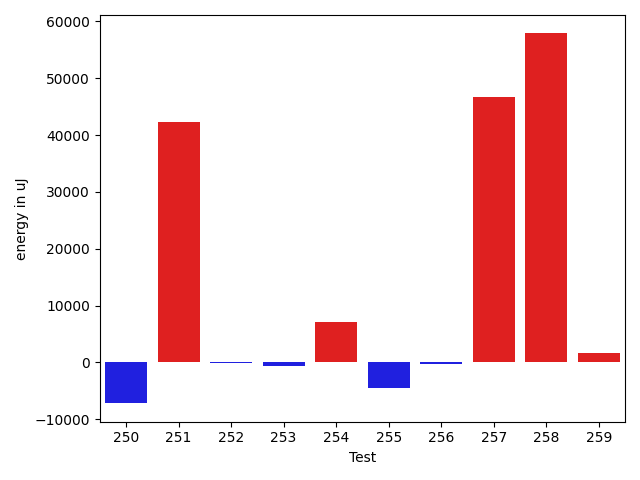

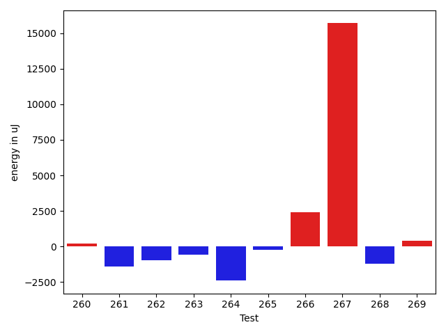

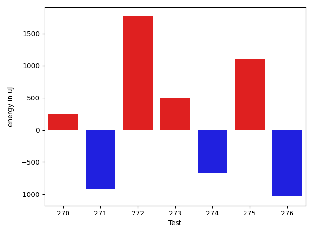

| ID | EnergyV1 | EnergyV2 | DeltaEnergy | σV1 | σV2 |
| --- | --- | --- | --- | --- | --- |
| 0 | 47425 | 43640 | -3785 | 76575.91377323083 | 37216.963498758894 |
| 1 | 37048 | 39184 | 2136 | 4328.260011544865 | 7570.978018902618 |
| 2 | 36927 | 37597 | 670 | 4156.999059044765 | 4226.823343086474 |
| 3 | 37109 | 36865 | -244 | 4207.6874314695415 | 4078.605402531844 |
| 4 | 35827 | 36438 | 611 | 3943.3261517263427 | 4183.050980674896 |
| 5 | 39184 | 37536 | -1648 | 50429.84305939348 | 26160.162537803546 |
| 6 | 36987 | 37475 | 488 | 3568.1937598593645 | 3399.5226099914967 |
| 7 | 35827 | 36560 | 733 | 3973.1613848277766 | 3572.3034056219503 |
| 8 | 112853 | 111816 | -1037 | 28437.744530396998 | 22138.128599600735 |
| 9 | 36743 | 34973 | -1770 | 4056.033881471582 | 3346.9577181288305 |
| 10 | 37414 | 36682 | -732 | 5517.054126508513 | 5020.901435359367 |
| 11 | 36560 | 37354 | 794 | 4143.682743210292 | 4313.449722637581 |
| 12 | 38025 | 37415 | -610 | 35860.599921133246 | 26411.82329941602 |
| 13 | 37476 | 36255 | -1221 | 5568.653661942595 | 7382.995873067272 |
| 14 | 36682 | 36988 | 306 | 3099.755485582694 | 3515.717226311669 |
| 15 | 35767 | 36316 | 549 | 4042.5001129118873 | 3598.499210164642 |
| 16 | 36071 | 35828 | -243 | 3847.464722695654 | 3280.396264762377 |
| 17 | 36865 | 32776 | -4089 | 2319.5 | 0.0 |
| 18 | 37780 | 37049 | -731 | 3314.9730556031673 | 4094.042719015517 |
| 19 | 36743 | 35156 | -1587 | 3913.8174948064534 | 2870.3524394495644 |
| 20 | 37232 | 36621 | -611 | 11628.888079622879 | 22260.69786443363 |
| 21 | 33813 | 32715 | -1098 | 2136.0 | 0.0 |
| 22 | 35095 | 33814 | -1281 | 3348.355673910444 | 3926.2610521971155 |
| 23 | 36865 | 36438 | -427 | 4626.37405352573 | 3178.867391813764 |
| 24 | 37659 | 37781 | 122 | 2368.4196110659177 | 3637.276782850286 |
| 25 | 37048 | 35828 | -1220 | 4213.186316957614 | 3655.438587890825 |
| 26 | 36377 | 37842 | 1465 | 3005.4931920568374 | 3519.1822163994607 |
| 27 | 36499 | 37781 | 1282 | 3930.0577208088034 | 4475.502707275507 |
| 28 | 34485 | 39490 | 5005 | 4994.59015929986 | 3641.666914636725 |
| 29 | 32775 | 30273 | -2502 | 0.0 | 0.0 |
| 30 | 36499 | 30457 | -6042 | 1923.0 | 0.0 |
| 31 | 38513 | 40039 | 1526 | 76996.41883908916 | 4333.3461224035045 |
| 32 | 37720 | 39428 | 1708 | 4221.059749691814 | 4308.512096347764 |
| 33 | 35583 | 38880 | 3297 | 3870.2935171755266 | 3952.0209617484024 |
| 34 | 39612 | 40589 | 977 | 222775.1058310277 | 237220.51644783348 |
| 35 | 36804 | 38513 | 1709 | 4407.324532773833 | 4323.548324706389 |
| 36 | 38513 | 37475 | -1038 | 3893.6938478161405 | 3868.153599939805 |
| 37 | 37720 | 39978 | 2258 | 4047.323004658377 | 4305.736695826986 |
| 38 | 40039 | 39673 | -366 | 24445.32946183007 | 16977.86729953729 |
| 39 | 39185 | 38513 | -672 | 3700.917527580608 | 3930.047034563015 |
| 40 | 42053 | 40039 | -2014 | 46475.20460245696 | 33781.62742004422 |
| 41 | 39306 | 37903 | -1403 | 4184.337361584932 | 4643.002957463817 |
| 42 | 41199 | 37720 | -3479 | 4705.093253857993 | 4414.145681849628 |
| 43 | 34790 | 36560 | 1770 | 3138.757409611149 | 4169.377358258132 |
| 44 | 34667 | 35766 | 1099 | 3398.2500039230836 | 3551.4685111952413 |
| 45 | 37964 | 38208 | 244 | 16624.250053829113 | 30021.578708533092 |
| 46 | 39978 | 39672 | -306 | 60639.80967624791 | 78943.946602915 |
| 47 | 36255 | 36071 | -184 | 3795.5816984689004 | 3654.918326887591 |
| 48 | 36866 | 36254 | -612 | 4544.74311854124 | 3639.764030864923 |
| 49 | 37232 | 37658 | 426 | 4534.3136851739255 | 4469.247099467054 |
| 50 | 37903 | 37232 | -671 | 5715.70000831636 | 7860.485942305581 |
| 51 | 37048 | 37719 | 671 | 4137.274085329961 | 3601.950899782567 |
| 52 | 36926 | 36377 | -549 | 8900.811250691642 | 10162.672046596144 |
| 53 | 36682 | 37354 | 672 | 10010.787578711683 | 49905.339633667325 |
| 54 | 39734 | 41625 | 1891 | 14827.224046842848 | 17509.59471174867 |
| 55 | 38208 | 37537 | -671 | 4727.990365925417 | 4145.588612333396 |
| 56 | 37598 | 36987 | -611 | 3794.5034419662543 | 3216.8189385129845 |
| 57 | 37537 | 36194 | -1343 | 4097.51793841966 | 4338.573391776115 |
| 58 | 36011 | 37353 | 1342 | 4090.7644051181705 | 4181.562873163839 |
| 59 | 39245 | 38941 | -304 | 27890.819437507755 | 29885.04154313728 |
| 60 | 37354 | 37903 | 549 | 4260.150454953789 | 3792.83775682087 |
| 61 | 36865 | 37048 | 183 | 5005.200147886196 | 4338.321651284054 |
| 62 | 36621 | 35767 | -854 | 7630.430698669991 | 6957.34019080656 |
| 63 | 37964 | 37292 | -672 | 11929.323273139247 | 7848.647183469067 |
| 64 | 35522 | 34667 | -855 | 4319.86246858624 | 3613.09368698484 |
| 65 | 35461 | 38818 | 3357 | 3519.3218721664684 | 4027.1140111721706 |
| 66 | 36499 | 36438 | -61 | 3569.6775756822803 | 3979.8576526609045 |
| 67 | 38269 | 36560 | -1709 | 4399.735820159801 | 3614.336910908494 |
| 68 | 37415 | 37292 | -123 | 38599.96426754333 | 3214.8579536617513 |
| 69 | 36560 | 35705 | -855 | 4307.0223988130765 | 3276.047989066501 |
| 70 | 79773 | 77209 | -2564 | 29803.503489409428 | 27282.23617130545 |
| 71 | 115723 | 111328 | -4395 | 28000.168019592224 | 23752.738030580662 |
| 72 | 227050 | 186279 | -40771 | 276020.5261300165 | 92172.79043893522 |
| 73 | 73547 | 75256 | 1709 | 20623.93057200676 | 20608.32632958144 |
| 74 | 42907 | 42358 | -549 | 54794.52952932591 | 61370.29382730664 |
| 75 | 36987 | 39245 | 2258 | 3643.7038000321663 | 4093.549552619425 |
| 76 | 37415 | 38147 | 732 | 7822.059052788219 | 4442.128183044615 |
| 77 | 38147 | 39856 | 1709 | 9543.010670854184 | 9073.910935621421 |
| 78 | 37232 | 37354 | 122 | 6119.884180774557 | 9072.804309671845 |
| 79 | 38391 | 39001 | 610 | 5229.001652791663 | 6912.025268739739 |
| 80 | 37415 | 38757 | 1342 | 4332.558204520229 | 4638.545563791351 |
| 81 | 41870 | 43091 | 1221 | 97681.32876747091 | 121527.55095565098 |
| 82 | 39612 | 38819 | -793 | 3870.9644045751184 | 3695.2856263082017 |
| 83 | 37476 | 39306 | 1830 | 3687.3155440019505 | 10687.250884241646 |
| 84 | 36316 | 39490 | 3174 | 3208.2942611809362 | 4113.695434460358 |
| 85 | 36560 | 38879 | 2319 | 3106.3112572095324 | 2766.5572188106235 |
| 86 | 37048 | 38696 | 1648 | 40976.76948458549 | 3834.2233093070195 |
| 87 | 124389 | 121765 | -2624 | 125824.93571268013 | 99072.77143214784 |
| 88 | 39429 | 38696 | -733 | 4586.725785579379 | 4219.78990252223 |
| 89 | 37842 | 38513 | 671 | 7091.458529210403 | 7589.5958500009465 |
| 90 | 39123 | 39428 | 305 | 4328.823979659487 | 5015.300889645838 |
| 91 | 39185 | 39001 | -184 | 3854.849753991761 | 4001.6538457724005 |
| 92 | 39368 | 37414 | -1954 | 4683.68224027275 | 3863.580404321546 |
| 93 | 39368 | 39673 | 305 | 262325.8776424323 | 229174.9071413834 |
| 94 | 36133 | 36865 | 732 | 4556.7761169764435 | 3623.171270994088 |
| 95 | 35584 | 37842 | 2258 | 4816.398397582439 | 4328.672539110653 |
| 96 | 37781 | 37964 | 183 | 15415.625221448636 | 11915.582105485133 |
| 97 | 38330 | 38024 | -306 | 13238.905565306393 | 10796.453867181814 |
| 98 | 37536 | 36499 | -1037 | 4531.062336328161 | 4768.6011534201525 |
| 99 | 40283 | 38635 | -1648 | 15124.234399831703 | 14794.004439967443 |
| 100 | 39123 | 37414 | -1709 | 24370.282847837447 | 24051.181047860875 |
| 101 | 37232 | 37109 | -123 | 4489.927565558907 | 5286.562287522381 |
| 102 | 34546 | 39002 | 4456 | 3771.119655436738 | 3735.1401391882205 |
| 103 | 37292 | 37048 | -244 | 3912.1862057694484 | 4207.900435268075 |
| 104 | 38269 | 39001 | 732 | 4029.506613844977 | 4164.254310965989 |
| 105 | 37293 | 36682 | -611 | 7067.319740752126 | 4239.740497312263 |
| 106 | 37415 | 38208 | 793 | 68735.4231898587 | 54089.99824818783 |
| 107 | 38391 | 37780 | -611 | 3445.69761112953 | 53315.97353012363 |
| 108 | 39978 | 39428 | -550 | 34835.09365093447 | 24182.60137409554 |
| 109 | 41626 | 41687 | 61 | 59146.96134395172 | 48562.657509649915 |
| 110 | 38208 | 39551 | 1343 | 89612.68090676227 | 118855.77647705522 |
| 111 | 39124 | 39551 | 427 | 20538.723631039957 | 21739.27652952435 |
| 112 | 37353 | 36926 | -427 | 2934.744537434221 | 38317.3464200557 |
| 113 | 38147 | 37354 | -793 | 4371.699351785299 | 5001.601767434109 |
| 114 | 36377 | 38086 | 1709 | 3736.171100176746 | 2909.3453528624314 |
| 115 | 37597 | 37598 | 1 | 3542.077456711323 | 3379.052302496989 |
| 116 | 37293 | 38819 | 1526 | 3946.984635052759 | 4303.582287401726 |
| 117 | 38391 | 36927 | -1464 | 3526.9008096326797 | 4031.850292635159 |
| 118 | 34973 | 39246 | 4273 | 5692.344177515456 | 3837.846213515303 |
| 119 | 36865 | 37476 | 611 | 3854.6735540440477 | 3915.1638548982273 |
| 120 | 67017 | 71900 | 4883 | 21203.632555614597 | 23784.72956891108 |
| 121 | 36560 | 37232 | 672 | 12379.18173476897 | 9155.303951757436 |
| 122 | 38269 | 37964 | -305 | 28741.615377767586 | 11510.931695043348 |
| 123 | 40893 | 39612 | -1281 | 61017.64170950833 | 3486.3029254966423 |
| 124 | 39612 | 39367 | -245 | 18548.51170209991 | 8663.63970732827 |
| 125 | 38452 | 38330 | -122 | 358060.55591154366 | 47762.29033204299 |
| 126 | 80811 | 81421 | 610 | 27761.08290629879 | 37851.83873815098 |
| 127 | 81970 | 82092 | 122 | 253944.69207574386 | 244348.59759551767 |
| 128 | 38879 | 37170 | -1709 | 3830.584202484723 | 4370.3343192419225 |
| 129 | 38635 | 38269 | -366 | 4232.045606055461 | 21353.65853080927 |
| 130 | 37597 | 38146 | 549 | 37200.92787896885 | 3798.8920879202756 |
| 131 | 36927 | 37354 | 427 | 3776.7252945663504 | 5166.73483957657 |
| 132 | 36804 | 40100 | 3296 | 4371.431700863221 | 9835.747128270426 |
| 133 | 64697 | 62989 | -1708 | 21879.40760361193 | 24469.023531853236 |
| 134 | 38025 | 39917 | 1892 | 3637.0214828119983 | 3552.637020928135 |
| 135 | 37293 | 39612 | 2319 | 2913.6471320322917 | 9186.609996894465 |
| 136 | 39978 | 38147 | -1831 | 4168.101329142563 | 3790.767881430678 |
| 137 | 41870 | 43396 | 1526 | 31046.211340518556 | 20274.864956371024 |
| 138 | 37964 | 40344 | 2380 | 20950.533608391124 | 49473.93739442616 |
| 139 | 37659 | 38391 | 732 | 3818.7206887763987 | 3313.4783284666273 |
| 140 | 39978 | 38940 | -1038 | 4236.967845936525 | 3315.2854838362227 |
| 141 | 37354 | 38330 | 976 | 4514.729157284672 | 4062.735972254032 |
| 142 | 36621 | 37231 | 610 | 3780.1642550892607 | 4003.6254066451693 |
| 143 | 37964 | 39917 | 1953 | 19120.825441664703 | 10899.076150757 |
| 144 | 38208 | 34912 | -3296 | 4335.656320476744 | 4188.572555706988 |
| 145 | 38025 | 37659 | -366 | 3874.7469672852867 | 5144.097396799315 |
| 146 | 37598 | 37354 | -244 | 3911.724363255014 | 4688.404778193383 |
| 147 | 37781 | 37292 | -489 | 4573.999610143594 | 4239.667201824009 |
| 148 | 36621 | 37902 | 1281 | 4369.348272369635 | 3804.333837546332 |
| 149 | 38697 | 38879 | 182 | 17237.86334123193 | 16247.036965242072 |
| 150 | 36926 | 37781 | 855 | 3557.000540005582 | 3621.1035331489666 |
| 151 | 36499 | 40405 | 3906 | 4319.481679367915 | 3032.2846275081474 |
| 152 | 37353 | 36560 | -793 | 3543.409919013981 | 49820.706056105715 |
| 153 | 37597 | 37964 | 367 | 3955.725358515652 | 3310.5678808607727 |
| 154 | 37964 | 39978 | 2014 | 3317.4521273537543 | 4313.515671055855 |
| 155 | 36316 | 36926 | 610 | 3629.362900014271 | 2724.393071745522 |
| 156 | 37353 | 36682 | -671 | 3174.5793558367996 | 4007.256636018409 |
| 157 | 37597 | 38147 | 550 | 3633.831626534174 | 4688.2328612293895 |
| 158 | 37658 | 38940 | 1282 | 3670.874470570304 | 3831.0998420819055 |
| 159 | 35644 | 34790 | -854 | 2941.6633855776977 | 2887.8994085810605 |
| 160 | 36987 | 38757 | 1770 | 4353.896332865971 | 3277.7423632738432 |
| 161 | 34973 | 38453 | 3480 | 4208.593662485956 | 2987.2910328328826 |
| 162 | 36194 | 39612 | 3418 | 3805.4040965382555 | 3680.9047201189205 |
| 163 | 36560 | 36438 | -122 | 3128.392746187729 | 4088.330507709063 |
| 164 | 37414 | 40405 | 2991 | 2633.5504551840277 | 4987.244203203035 |
| 165 | 38513 | 37598 | -915 | 3609.0884108074706 | 3484.2300600148537 |
| 166 | 36193 | 39245 | 3052 | 3453.426075387059 | 3307.5127497864614 |
| 167 | 38636 | 38940 | 304 | 4246.951521859526 | 3863.1021213527347 |
| 168 | 35949 | 36804 | 855 | 3768.858356133028 | 2474.810003619797 |
| 169 | 36438 | 35706 | -732 | 4569.724799820417 | 4136.787823287286 |
| 170 | 37841 | 36865 | -976 | 3392.229697565655 | 3918.9353766552467 |
| 171 | 35644 | 37109 | 1465 | 3491.2826310684154 | 4267.741908519355 |
| 172 | 36926 | 37719 | 793 | 3368.723336155042 | 3318.609454283401 |
| 173 | 38086 | 37720 | -366 | 3854.548192127334 | 3277.211205812039 |
| 174 | 37659 | 40344 | 2685 | 7778.117010902711 | 7561.898288275387 |
| 175 | 37536 | 38330 | 794 | 3398.2870067501526 | 4450.249906957473 |
| 176 | 35217 | 37964 | 2747 | 3886.6149894720584 | 3283.9353266457356 |
| 177 | 37170 | 39184 | 2014 | 3822.501963240726 | 3504.247771554466 |
| 178 | 37170 | 40710 | 3540 | 4271.070716615042 | 3270.2737832303815 |
| 179 | 37049 | 37780 | 731 | 2446.7528763148725 | 25429.778976036796 |
| 180 | 36499 | 36560 | 61 | 4241.363641384872 | 2411.898156874747 |
| 181 | 37232 | 38391 | 1159 | 4391.788662739052 | 3833.7416693747114 |
| 182 | 46082 | 65307 | 19225 | 390540.9889343981 | 516091.884522318 |
| 183 | 42114 | 41809 | -305 | 38396.0887090177 | 46610.58299379434 |
| 184 | 37293 | 39612 | 2319 | 16666.066667714706 | 23728.224562379102 |
| 185 | 79955 | 83801 | 3846 | 21700.273784987927 | 23127.953314442882 |
| 186 | 37476 | 37231 | -245 | 3942.268849545749 | 4138.889808346135 |
| 187 | 37720 | 36866 | -854 | 4051.8807781572245 | 4486.515573098384 |
| 188 | 36987 | 36316 | -671 | 3751.025773254977 | 4650.799392418513 |
| 189 | 38757 | 40710 | 1953 | 273155.6741103644 | 289022.35333603254 |
| 190 | 37842 | 36621 | -1221 | 15919.10633946073 | 26860.394888621864 |
| 191 | 36499 | 37414 | 915 | 5845.629895298088 | 5345.742492913132 |
| 192 | 37841 | 36621 | -1220 | 4161.9368224824075 | 4585.224220084707 |
| 193 | 37110 | 36804 | -306 | 27959.484843625323 | 4393.012114700949 |
| 194 | 40161 | 36865 | -3296 | 3180.6545597677577 | 4321.358049913887 |
| 195 | 37598 | 36255 | -1343 | 3450.281369524649 | 4579.003394116818 |
| 196 | 37536 | 38330 | 794 | 7444.098275214451 | 5556.530254705114 |
| 197 | 41626 | 41320 | -306 | 234272.57317551246 | 33634.24489701083 |
| 198 | 82520 | 79833 | -2687 | 441193.91571445984 | 516649.38553402293 |
| 199 | 41016 | 46021 | 5005 | 19626.562521998876 | 21359.039005678456 |
| 200 | 38696 | 40405 | 1709 | 267727.3621870366 | 3548.9609615968975 |
| 201 | 62927 | 41199 | -21728 | 38995.29741357711 | 32294.007778688174 |
| 202 | 38697 | 38879 | 182 | 28130.394421536723 | 17850.21057781672 |
| 203 | 37598 | 37842 | 244 | 4693.047983982498 | 3665.690649728712 |
| 204 | 38941 | 38513 | -428 | 19081.72731563541 | 27932.114491078337 |
| 205 | 41199 | 38940 | -2259 | 18698.18562401618 | 14293.355831888457 |
| 206 | 38146 | 41809 | 3663 | 33438.49918505202 | 58760.12035443519 |
| 207 | 38880 | 36682 | -2198 | 3457.1615002612893 | 4634.70658606226 |
| 208 | 39489 | 36254 | -3235 | 2380.6600182405255 | 4704.37381855347 |
| 209 | 37048 | 37414 | 366 | 4251.066201276232 | 3870.6603698708686 |
| 210 | 38147 | 38940 | 793 | 4148.113155098352 | 4128.831152699272 |
| 211 | 37598 | 38452 | 854 | 4021.4457819936842 | 2659.034735053723 |
| 212 | 38452 | 38086 | -366 | 3877.1836664767056 | 3377.256573569562 |
| 213 | 38391 | 36621 | -1770 | 4664.603586295834 | 3537.821303194005 |
| 214 | 171081 | 156066 | -15015 | 302696.5466716388 | 262031.15340303426 |
| 215 | 37231 | 39673 | 2442 | 27337.443506977103 | 4312.675334481222 |
| 216 | 38208 | 38513 | 305 | 6696.21347886061 | 9998.66261913867 |
| 217 | 37353 | 38818 | 1465 | 4509.9135439018555 | 4393.242120955017 |
| 218 | 39184 | 39184 | 0 | 46593.11481590562 | 41775.271634872144 |
| 219 | 38513 | 38086 | -427 | 8643.707129054756 | 6089.540094794985 |
| 220 | 75500 | 72937 | -2563 | 56788.54152472359 | 58383.52487313854 |
| 221 | 38391 | 37170 | -1221 | 3880.186623378897 | 3962.2216394534344 |
| 222 | 37414 | 37414 | 0 | 3200.010752028606 | 3878.0862463610674 |
| 223 | 76477 | 74951 | -1526 | 28086.844315045335 | 29785.265894099484 |
| 224 | 36743 | 36743 | 0 | 4098.874194572619 | 9199.692001665164 |
| 225 | 43152 | 43640 | 488 | 22100.534308130584 | 27105.20302915989 |
| 226 | 76782 | 73486 | -3296 | 28554.552414318867 | 27700.746149614508 |
| 227 | 36743 | 37720 | 977 | 4893.443223055128 | 5337.586792267386 |
| 228 | 37536 | 36926 | -610 | 3770.4545695216175 | 3351.787232782856 |
| 229 | 39795 | 37170 | -2625 | 4764.902274325598 | 3972.2838940649763 |
| 230 | 37048 | 37170 | 122 | 3516.4574350237745 | 6400.836834130301 |
| 231 | 38696 | 37781 | -915 | 7698.500167434945 | 9752.440037982518 |
| 232 | 41321 | 38513 | -2808 | 29139.53433458892 | 28787.215188857706 |
| 233 | 38452 | 37659 | -793 | 5045.827925127847 | 3621.1272070043988 |
| 234 | 39795 | 39307 | -488 | 472704.91314420116 | 371379.8169570384 |
| 235 | 40283 | 39184 | -1099 | 51198.88060647338 | 15968.876086239949 |
| 236 | 261230 | 250305 | -10925 | 125705.87861979786 | 140485.68607262516 |
| 237 | 39428 | 39673 | 245 | 7509.72132112688 | 38662.427462254636 |
| 238 | 40222 | 42420 | 2198 | 70646.86396396092 | 139627.56434933434 |
| 239 | 39490 | 40039 | 549 | 7548.31476195595 | 4060.410511266072 |
| 240 | 39245 | 38574 | -671 | 11200.312652032955 | 7465.0547212083275 |
| 241 | 38086 | 38147 | 61 | 39841.40549804077 | 16498.93974347338 |
| 242 | 41870 | 40710 | -1160 | 21137.29001603134 | 22671.57653011935 |
| 243 | 38086 | 39795 | 1709 | 4639.142306020608 | 4522.699498087398 |
| 244 | 40466 | 39673 | -793 | 105078.41489000418 | 3152.9446003525914 |
| 245 | 40161 | 39673 | -488 | 22454.28761565743 | 31611.947783370997 |
| 246 | 38208 | 39978 | 1770 | 4213.674598001048 | 4144.583103678714 |
| 247 | 39246 | 40832 | 1586 | 79909.77892245376 | 93597.29474230164 |
| 248 | 40100 | 39184 | -916 | 16559.200637834558 | 3322.8365651051813 |
| 249 | 40833 | 39734 | -1099 | 35669.256665570916 | 23428.716155679194 |
| 250 | 39002 | 38208 | -794 | 28290.194884342574 | 17837.226281057883 |
| 251 | 40649 | 40527 | -122 | 322729.25185786095 | 417239.64189819724 |
| 252 | 39612 | 37476 | -2136 | 4408.663243174281 | 4150.268645220452 |
| 253 | 38330 | 38513 | 183 | 4033.4498036296427 | 4287.347075209874 |
| 254 | 165710 | 177490 | 11780 | 87036.24864368358 | 82829.57635139136 |
| 255 | 39794 | 38513 | -1281 | 20554.54481292371 | 6885.200973070979 |
| 256 | 39001 | 37536 | -1465 | 9195.397888290348 | 8665.731829333921 |
| 257 | 41809 | 40161 | -1648 | 34366.96122875523 | 122838.08512415379 |
| 258 | 84899 | 82214 | -2685 | 52816.309075542464 | 350311.461849815 |
| 259 | 37781 | 39429 | 1648 | 3049.6840807947733 | 3761.456186155593 |
| 260 | 39184 | 39550 | 366 | 3753.409331456863 | 3984.0494065045664 |
| 261 | 38880 | 35888 | -2992 | 4388.440283810123 | 4316.113088828368 |
| 262 | 39856 | 37598 | -2258 | 2666.645380123374 | 3072.591780063466 |
| 263 | 38147 | 38452 | 305 | 3271.415521573635 | 3894.394768884756 |
| 264 | 39551 | 38513 | -1038 | 13967.646044609666 | 11745.997879171442 |
| 265 | 39672 | 38147 | -1525 | 3046.3442770877778 | 4531.278586392587 |
| 266 | 35400 | 38086 | 2686 | 2992.0867231211205 | 4030.8229851627398 |
| 267 | 38635 | 38574 | -61 | 39433.85307321617 | 63003.302786244516 |
| 268 | 38696 | 38086 | -610 | 3050.6661013985486 | 3798.0808637389487 |
| 269 | 39550 | 39551 | 1 | 4725.799266430729 | 4337.59627907169 |
| 270 | 42297 | 42541 | 244 | 250382.11516161292 | 627517.9887865938 |
| 271 | 38269 | 37353 | -916 | 5085.546190373436 | 4243.212559889307 |
| 272 | 37049 | 38818 | 1769 | 4256.108154758288 | 6535.040468690623 |
| 273 | 37475 | 37963 | 488 | 4418.722045161552 | 4309.571211114702 |
| 274 | 39856 | 39185 | -671 | 87618.30638451727 | 80741.86721738434 |
| 275 | 40283 | 41382 | 1099 | 300664.84944485966 | 366697.37004131504 |
| 276 | 40772 | 39734 | -1038 | 24747.384909972872 | 26253.665779217976 |

## Delta Duration per test method

| ID | DurationV1 | DurationsV2 | DeltaDuration |
| --- | --- | --- | --- |
| 0 | 2316013.4646464647 | 1771773.707070707 | -544239.7575757576 |
| 1 | 795540.8648648649 | 702183.2045454546 | -93357.66031941026 |
| 2 | 838255.5161290322 | 840187.7857142857 | 1932.269585253438 |
| 3 | 822133.8153846153 | 821959.3278688524 | -174.48751576291397 |
| 4 | 534349.6666666666 | 495166.8947368421 | -39182.77192982455 |
| 5 | 1356529.3709677418 | 973972.655737705 | -382556.7152300369 |
| 6 | 739932.3125 | 736939.8163265307 | -2992.4961734693497 |
| 7 | 715424.0869565217 | 727928.6181818182 | 12504.531225296436 |
| 8 | 3326356.878787879 | 3233245.8181818184 | -93111.06060606055 |
| 9 | 376913.63157894736 | 450943.0 | 74029.36842105264 |
| 10 | 1085891.652173913 | 1012116.9625 | -73774.68967391306 |
| 11 | 782625.3870967742 | 783022.7333333333 | 397.3462365590967 |
| 12 | 1549990.8865979381 | 1398826.1546391752 | -151164.73195876298 |
| 13 | 966501.2 | 964420.4074074074 | -2080.7925925925374 |
| 14 | 549755.24 | 566790.4615384615 | 17035.221538461512 |
| 15 | 521707.3783783784 | 534096.2 | 12388.821621621551 |
| 16 | 607880.0 | 628928.2093023256 | 21048.209302325617 |
| 17 | 591008.5 | 565618.0 | -25390.5 |
| 18 | 339267.4375 | 313425.0909090909 | -25842.346590909117 |
| 19 | 465460.71428571426 | 526521.7391304348 | 61061.02484472055 |
| 20 | 1015725.4222222222 | 1015682.62 | -42.80222222220618 |
| 21 | 702418.0 | 745504.0 | 43086.0 |
| 22 | 353539.63636363635 | 331624.6 | -21915.036363636376 |
| 23 | 503855.92307692306 | 510417.0 | 6561.0769230769365 |
| 24 | 446053.14285714284 | 466931.8888888889 | 20878.746031746035 |
| 25 | 494815.3043478261 | 473496.85714285716 | -21318.44720496895 |
| 26 | 385322.7 | 374405.05555555556 | -10917.64444444445 |
| 27 | 477975.1 | 500686.6129032258 | 22711.51290322584 |
| 28 | 534308.75 | 424779.92307692306 | -109528.82692307694 |
| 29 | 631174.0 | 623113.0 | -8061.0 |
| 30 | 1109802.5 | 1482766.0 | 372963.5 |
| 31 | 1587926.9555555556 | 690769.1627906977 | -897157.792764858 |
| 32 | 582717.0909090909 | 555223.3333333334 | -27493.75757575757 |
| 33 | 523710.5 | 458851.6111111111 | -64858.888888888876 |
| 34 | 2030867.6 | 2245271.090909091 | 214403.49090909073 |
| 35 | 534906.4545454546 | 529001.6428571428 | -5904.811688311747 |
| 36 | 603628.074074074 | 678541.9545454546 | 74913.88047138054 |
| 37 | 701838.0392156863 | 703519.7567567568 | 1681.7175410705386 |
| 38 | 1256516.9545454546 | 1281285.3372093022 | 24768.382663847646 |
| 39 | 521062.3703703704 | 557463.5 | 36401.129629629606 |
| 40 | 1163007.3461538462 | 1108524.357142857 | -54482.9890109892 |
| 41 | 487267.06666666665 | 476254.1923076923 | -11012.874358974339 |
| 42 | 421258.55 | 484392.07692307694 | 63133.52692307695 |
| 43 | 357932.5833333333 | 328661.1111111111 | -29271.47222222219 |
| 44 | 649717.2592592592 | 734474.2173913043 | 84756.95813204511 |
| 45 | 1207723.8709677418 | 1383328.262295082 | 175604.39132734016 |
| 46 | 1446040.0363636364 | 1806076.93220339 | 360036.89583975356 |
| 47 | 722311.1590909091 | 780681.4310344828 | 58370.27194357372 |
| 48 | 729629.4150943396 | 741927.8695652174 | 12298.454470877768 |
| 49 | 756203.4888888889 | 832768.8269230769 | 76565.33803418803 |
| 50 | 1001626.3064516129 | 1001556.8571428572 | -69.44930875569116 |
| 51 | 835458.0408163265 | 778007.4666666667 | -57450.574149659835 |
| 52 | 1007208.7777777778 | 1071401.5166666666 | 64192.73888888885 |
| 53 | 814732.8461538461 | 1034805.9387755102 | 220073.09262166405 |
| 54 | 1421873.5360824743 | 1588865.0808080807 | 166991.54472560645 |
| 55 | 808543.1739130435 | 801827.2291666666 | -6715.94474637683 |
| 56 | 439067.1875 | 457780.6956521739 | 18713.50815217389 |
| 57 | 713163.9411764706 | 715640.6603773584 | 2476.7192008878337 |
| 58 | 805211.0 | 742175.8888888889 | -63035.111111111124 |
| 59 | 1006039.052631579 | 1124469.9636363636 | 118430.91100478463 |
| 60 | 752185.7090909091 | 729143.25 | -23042.459090909106 |
| 61 | 755957.54 | 746389.4583333334 | -9568.081666666665 |
| 62 | 784952.9811320754 | 913117.3015873015 | 128164.32045522612 |
| 63 | 894847.4 | 863112.8846153846 | -31734.5153846154 |
| 64 | 502626.95 | 560321.0476190476 | 57694.09761904756 |
| 65 | 494423.4761904762 | 533410.3913043478 | 38986.91511387157 |
| 66 | 747984.6739130435 | 768798.387755102 | 20813.713842058554 |
| 67 | 352725.23529411765 | 378620.4166666667 | 25895.181372549036 |
| 68 | 739171.2307692308 | 361451.8 | -377719.43076923076 |
| 69 | 334943.35714285716 | 335042.93333333335 | 99.57619047618937 |
| 70 | 2405717.222222222 | 2313598.1616161615 | -92119.06060606055 |
| 71 | 3366197.8383838385 | 3189729.4242424243 | -176468.41414141422 |
| 72 | 7559432.777777778 | 5463546.97979798 | -2095885.7979797982 |
| 73 | 2210814.8383838385 | 2149823.9494949495 | -60990.88888888899 |
| 74 | 1919162.6979166667 | 2062514.2828282828 | 143351.58491161605 |
| 75 | 685189.3023255814 | 648094.1842105263 | -37095.11811505514 |
| 76 | 953579.1285714286 | 948586.6440677966 | -4992.484503631946 |
| 77 | 766664.1794871795 | 756283.1052631579 | -10381.074224021635 |
| 78 | 650535.9615384615 | 837011.2 | 186475.23846153845 |
| 79 | 843397.1142857143 | 908072.9206349206 | 64675.80634920625 |
| 80 | 452101.73333333334 | 510195.2105263158 | 58093.47719298245 |
| 81 | 2265003.340425532 | 2752818.315217391 | 487814.9747918593 |
| 82 | 418883.4090909091 | 443200.45 | 24317.040909090894 |
| 83 | 855521.0697674418 | 961133.5102040817 | 105612.44043663982 |
| 84 | 551697.3214285715 | 627377.55 | 75680.22857142857 |
| 85 | 587252.5333333333 | 541213.3548387097 | -46039.17849462363 |
| 86 | 739775.9285714285 | 447922.60869565216 | -291853.31987577636 |
| 87 | 5101154.98989899 | 4488547.636363637 | -612607.3535353532 |
| 88 | 594026.5555555555 | 484853.14285714284 | -109173.41269841266 |
| 89 | 920841.1960784313 | 800912.6739130435 | -119928.52216538787 |
| 90 | 737597.3125 | 613686.8292682926 | -123910.48323170736 |
| 91 | 557666.0 | 480930.2105263158 | -76735.78947368421 |
| 92 | 597943.9629629629 | 491399.3823529412 | -106544.58061002172 |
| 93 | 2017613.3636363635 | 1898298.7702702703 | -119314.59336609324 |
| 94 | 468107.1111111111 | 428400.2380952381 | -39706.87301587302 |
| 95 | 547092.6071428572 | 507570.17391304346 | -39522.4332298137 |
| 96 | 1304510.2142857143 | 1191363.064102564 | -113147.15018315031 |
| 97 | 1173817.6 | 1126556.0147058824 | -47261.585294117685 |
| 98 | 772025.2142857143 | 828297.4 | 56272.185714285704 |
| 99 | 1385019.0315789473 | 1313704.595505618 | -71314.4360733293 |
| 100 | 1097147.4 | 1049008.111111111 | -48139.2888888889 |
| 101 | 899195.7619047619 | 873036.4920634921 | -26159.269841269823 |
| 102 | 321482.0 | 438040.125 | 116558.125 |
| 103 | 826592.5128205129 | 720271.3333333334 | -106321.1794871795 |
| 104 | 710708.5102040817 | 728197.027027027 | 17488.516822945327 |
| 105 | 739064.3555555556 | 730846.1282051282 | -8218.227350427303 |
| 106 | 1396156.6785714286 | 1276845.693877551 | -119310.98469387763 |
| 107 | 418481.9375 | 838506.25 | 420024.3125 |
| 108 | 1214367.4 | 974038.6486486486 | -240328.75135135127 |
| 109 | 2187514.230769231 | 1987807.6 | -199706.6307692309 |
| 110 | 2154372.5490196077 | 2545681.8333333335 | 391309.2843137258 |
| 111 | 1425221.2209302327 | 1372696.8352941177 | -52524.38563611498 |
| 112 | 459359.9375 | 615156.5 | 155796.5625 |
| 113 | 411880.0 | 471394.0 | 59514.0 |
| 114 | 388424.3333333333 | 457233.06666666665 | 68808.73333333334 |
| 115 | 747231.9117647059 | 799991.1071428572 | 52759.19537815126 |
| 116 | 639670.9411764706 | 680755.8846153846 | 41084.94343891402 |
| 117 | 407588.0 | 455233.4 | 47645.40000000002 |
| 118 | 478367.5294117647 | 451136.625 | -27230.9044117647 |
| 119 | 747902.387755102 | 762981.6379310344 | 15079.250175932422 |
| 120 | 1901670.8163265307 | 2048973.3125 | 147302.49617346935 |
| 121 | 1104240.7631578948 | 1051822.3188405796 | -52418.44431731524 |
| 122 | 1356545.465116279 | 1139992.8333333333 | -216552.6317829457 |
| 123 | 1380766.875 | 764069.7954545454 | -616697.0795454546 |
| 124 | 1002951.3725490196 | 903630.4629629629 | -99320.90958605672 |
| 125 | 3155492.6612903224 | 1397326.6615384615 | -1758165.999751861 |
| 126 | 2587279.5757575757 | 2629522.8181818184 | 42243.242424242664 |
| 127 | 4544054.454545454 | 4321097.636363637 | -222956.81818181742 |
| 128 | 861189.8253968254 | 908110.3018867924 | 46920.47648996697 |
| 129 | 948746.84 | 1023993.1780821917 | 75246.33808219177 |
| 130 | 741728.8518518518 | 608932.75 | -132796.1018518518 |
| 131 | 440320.51851851854 | 556450.9523809524 | 116130.43386243389 |
| 132 | 443393.5652173913 | 652842.0645161291 | 209448.4992987378 |
| 133 | 1734552.4545454546 | 1672418.7575757576 | -62133.69696969702 |
| 134 | 593000.2941176471 | 471530.44444444444 | -121469.84967320267 |
| 135 | 880372.1 | 855940.3454545455 | -24431.754545454518 |
| 136 | 642178.55 | 634595.4736842106 | -7583.0763157894835 |
| 137 | 1733704.5454545454 | 1630250.7171717172 | -103453.82828282821 |
| 138 | 852599.2264150943 | 1226725.36 | 374126.13358490577 |
| 139 | 561539.3333333334 | 504138.23529411765 | -57401.09803921572 |
| 140 | 390016.55 | 469200.05263157893 | 79183.50263157894 |
| 141 | 580826.1363636364 | 607363.2592592592 | 26537.12289562286 |
| 142 | 746944.4090909091 | 783849.8 | 36905.39090909099 |
| 143 | 912815.4 | 763354.35 | -149461.05000000005 |
| 144 | 468847.6538461539 | 453192.8095238095 | -15654.844322344346 |
| 145 | 717350.7692307692 | 713375.7837837838 | -3974.9854469854617 |
| 146 | 710082.0192307692 | 711548.8867924528 | 1466.8675616835244 |
| 147 | 410501.0 | 383360.93333333335 | -27140.06666666665 |
| 148 | 505495.9411764706 | 429506.7 | -75989.24117647059 |
| 149 | 1030045.3148148148 | 1093366.6862745099 | 63321.371459695045 |
| 150 | 549034.88 | 496606.1052631579 | -52428.77473684208 |
| 151 | 369973.44444444444 | 361628.73333333334 | -8344.7111111111 |
| 152 | 350923.4166666667 | 742612.8 | 391689.38333333336 |
| 153 | 929885.4565217391 | 851108.9230769231 | -78776.53344481601 |
| 154 | 474233.48148148146 | 476745.0 | 2511.51851851854 |
| 155 | 381583.05 | 415787.8125 | 34204.76250000001 |
| 156 | 543319.6176470588 | 559755.7222222222 | 16436.104575163452 |
| 157 | 522580.75 | 528080.2777777778 | 5499.527777777752 |
| 158 | 564261.7142857143 | 549316.9565217391 | -14944.757763975183 |
| 159 | 368026.5882352941 | 399645.8461538461 | 31619.25791855203 |
| 160 | 419538.4375 | 413311.875 | -6226.5625 |
| 161 | 340365.29411764705 | 367578.4375 | 27213.14338235295 |
| 162 | 393303.2631578947 | 449512.6875 | 56209.42434210528 |
| 163 | 551014.92 | 553400.5652173914 | 2385.645217391313 |
| 164 | 452684.77777777775 | 416691.1052631579 | -35993.67251461983 |
| 165 | 397741.13636363635 | 416564.1666666667 | 18823.030303030333 |
| 166 | 410156.4285714286 | 414140.25 | 3983.8214285714203 |
| 167 | 464906.2380952381 | 459726.3333333333 | -5179.904761904792 |
| 168 | 373246.625 | 379780.84210526315 | 6534.217105263146 |
| 169 | 351993.0 | 361527.5 | 9534.5 |
| 170 | 427800.4827586207 | 402149.68 | -25650.802758620703 |
| 171 | 384034.35 | 602553.380952381 | 218519.03095238097 |
| 172 | 374752.26666666666 | 376207.6153846154 | 1455.3487179487129 |
| 173 | 339622.6111111111 | 354461.8 | 14839.188888888864 |
| 174 | 827462.8823529412 | 684057.9166666666 | -143404.96568627458 |
| 175 | 447296.94444444444 | 433257.125 | -14039.819444444438 |
| 176 | 382289.25 | 378321.35714285716 | -3967.8928571428405 |
| 177 | 474661.95652173914 | 458264.8333333333 | -16397.12318840582 |
| 178 | 334015.4285714286 | 324342.0 | -9673.42857142858 |
| 179 | 332605.0 | 568331.8421052631 | 235726.84210526315 |
| 180 | 424535.07692307694 | 379460.05555555556 | -45075.021367521374 |
| 181 | 385115.85714285716 | 365927.75 | -19188.10714285716 |
| 182 | 3828143.336956522 | 5894934.757575758 | 2066791.4206192358 |
| 183 | 1760243.0 | 1822729.9784946237 | 62486.978494623676 |
| 184 | 996040.0344827586 | 1079661.6515151516 | 83621.617032393 |
| 185 | 2587661.878787879 | 2642698.737373737 | 55036.85858585825 |
| 186 | 693172.0555555555 | 736819.2127659575 | 43647.15721040196 |
| 187 | 752184.02 | 786712.7037037037 | 34528.68370370369 |
| 188 | 821079.9491525424 | 838715.3392857143 | 17635.390133171924 |
| 189 | 2403611.9137931033 | 3222155.6842105263 | 818543.770417423 |
| 190 | 1040532.0735294118 | 1272153.042253521 | 231620.96872410923 |
| 191 | 917108.03125 | 957130.25 | 40022.21875 |
| 192 | 761529.5084745763 | 791753.7735849057 | 30224.265110329376 |
| 193 | 759244.447368421 | 642451.3095238095 | -116793.13784461154 |
| 194 | 444832.4285714286 | 500250.06666666665 | 55417.63809523807 |
| 195 | 422566.6666666667 | 458534.875 | 35968.208333333314 |
| 196 | 940652.8181818182 | 926207.1911764706 | -14445.627005347633 |
| 197 | 2353407.4534883723 | 1532550.677777778 | -820856.7757105944 |
| 198 | 5296967.707070707 | 6353376.676767677 | 1056408.9696969697 |
| 199 | 1112140.0588235294 | 1139431.1875 | 27291.128676470602 |
| 200 | 2839522.230769231 | 604595.7714285714 | -2234926.4593406594 |
| 201 | 1884321.4666666666 | 1341979.1578947369 | -542342.3087719297 |
| 202 | 1217260.5238095238 | 1073511.86 | -143748.66380952368 |
| 203 | 465570.3043478261 | 467601.8695652174 | 2031.5652173912968 |
| 204 | 1169258.6133333333 | 1327288.611111111 | 158029.99777777772 |
| 205 | 1014946.0909090909 | 930786.7931034482 | -84159.29780564271 |
| 206 | 885093.1785714285 | 1261050.0833333333 | 375956.90476190473 |
| 207 | 370740.8333333333 | 414776.0 | 44035.166666666686 |
| 208 | 297540.0714285714 | 363962.44444444444 | 66422.37301587302 |
| 209 | 628268.7692307692 | 616584.4 | -11684.369230769225 |
| 210 | 455356.65 | 536545.6666666666 | 81189.0166666666 |
| 211 | 407101.1538461539 | 462048.5 | 54947.34615384613 |
| 212 | 478890.875 | 466092.6666666667 | -12798.208333333314 |
| 213 | 332255.44444444444 | 440659.86666666664 | 108404.4222222222 |
| 214 | 7308488.686868687 | 6431345.363636363 | -877143.3232323239 |
| 215 | 966544.2608695652 | 949268.7391304348 | -17275.521739130374 |
| 216 | 968265.9677419355 | 949750.9076923077 | -18515.06004962779 |
| 217 | 507935.5714285714 | 535857.1388888889 | 27921.567460317456 |
| 218 | 1510965.5428571429 | 1255200.6296296297 | -255764.9132275132 |
| 219 | 1206066.4235294117 | 1160524.6704545454 | -45541.753074866254 |
| 220 | 2439024.202020202 | 2347538.595959596 | -91485.60606060596 |
| 221 | 478047.1538461539 | 496646.96428571426 | 18599.810439560388 |
| 222 | 870956.1791044776 | 851160.8 | -19795.379104477586 |
| 223 | 2375691.9595959596 | 2247013.494949495 | -128678.46464646468 |
| 224 | 1024827.44 | 1022483.0821917808 | -2344.3578082191525 |
| 225 | 1726285.6082474226 | 1710396.2040816327 | -15889.40416578995 |
| 226 | 2318715.868686869 | 2231456.737373737 | -87259.13131313166 |
| 227 | 935134.4918032787 | 907075.5 | -28058.99180327868 |
| 228 | 806297.1818181818 | 758442.3846153846 | -47854.79720279714 |
| 229 | 782569.6037735849 | 722065.1666666666 | -60504.43710691831 |
| 230 | 928955.0625 | 912393.3064516129 | -16561.75604838715 |
| 231 | 781169.9772727273 | 793894.75 | 12724.772727272706 |
| 232 | 1403872.076923077 | 1012831.52 | -391040.556923077 |
| 233 | 666779.9666666667 | 602930.6315789474 | -63849.33508771926 |
| 234 | 4978536.314814814 | 2923324.2545454544 | -2055212.06026936 |
| 235 | 1566552.1081081082 | 1288664.5180722892 | -277887.590035819 |
| 236 | 8301407.484848484 | 8011074.161616161 | -290333.32323232293 |
| 237 | 594564.7777777778 | 930430.0869565217 | 335865.309178744 |
| 238 | 1237504.52 | 3645997.5 | 2408492.98 |
| 239 | 719085.6538461539 | 635602.08 | -83483.57384615391 |
| 240 | 1149519.0657894737 | 1007712.1774193548 | -141806.88837011892 |
| 241 | 1254456.435483871 | 857402.6888888889 | -397053.7465949821 |
| 242 | 1273205.8363636364 | 965837.0217391305 | -307368.81462450593 |
| 243 | 712488.8 | 618744.3611111111 | -93744.43888888892 |
| 244 | 1876498.8823529412 | 575249.6666666666 | -1301249.2156862747 |
| 245 | 1165509.2833333334 | 1292638.8181818181 | 127129.53484848468 |
| 246 | 784167.8235294118 | 719568.976744186 | -64598.84678522579 |
| 247 | 1601809.8636363635 | 2105644.4482758623 | 503834.58463949873 |
| 248 | 671034.7777777778 | 515483.24 | -155551.53777777776 |
| 249 | 1650462.075 | 1288190.3636363635 | -362271.7113636364 |
| 250 | 1285749.9846153846 | 1059192.4385964912 | -226557.54601889336 |
| 251 | 2486756.0303030303 | 3809987.9210526315 | 1323231.8907496012 |
| 252 | 516473.1538461539 | 446357.9 | -70115.25384615385 |
| 253 | 546006.24 | 517500.6666666667 | -28505.573333333305 |
| 254 | 5427195.626262627 | 5499702.535353536 | 72506.90909090918 |
| 255 | 1086969.1466666667 | 1061751.9605263157 | -25217.186140350997 |
| 256 | 840179.109375 | 943183.8275862068 | 103004.71821120684 |
| 257 | 920465.4444444445 | 2695967.1470588236 | 1775501.702614379 |
| 258 | 2838252.5656565656 | 4773632.656565657 | 1935380.0909090913 |
| 259 | 645233.3428571429 | 759403.7948717949 | 114170.45201465196 |
| 260 | 503441.46153846156 | 490137.78571428574 | -13303.675824175822 |
| 261 | 397202.64705882355 | 382365.26666666666 | -14837.38039215689 |
| 262 | 412061.6666666667 | 337147.0 | -74914.66666666669 |
| 263 | 359470.0 | 364857.4117647059 | 5387.411764705903 |
| 264 | 1004536.025 | 812358.225 | -192177.80000000005 |
| 265 | 380836.36363636365 | 319173.45 | -61662.913636363635 |
| 266 | 410022.36363636365 | 349308.17647058825 | -60714.187165775395 |
| 267 | 782434.2 | 1445695.5909090908 | 663261.3909090909 |
| 268 | 401702.73333333334 | 392980.75 | -8721.983333333337 |
| 269 | 669387.9791666666 | 820827.0408163265 | 151439.06164965988 |
| 270 | 2500962.593220339 | 7578438.254237288 | 5077475.6610169485 |
| 271 | 417739.4285714286 | 527970.5769230769 | 110231.1483516483 |
| 272 | 651536.34375 | 828262.8292682926 | 176726.48551829264 |
| 273 | 506806.1818181818 | 527010.1538461539 | 20203.97202797205 |
| 274 | 1710855.6206896552 | 1782938.7 | 72083.07931034476 |
| 275 | 2660764.2352941176 | 3413210.9024390243 | 752446.6671449067 |
| 276 | 1103933.8823529412 | 992842.1304347826 | -111091.75191815861 |

## Misc.

| ID | Test Class | Test Method |
| --- | --- | --- |
| 0 | com.google.gson.functional.CustomDeserializerTest | testDefaultConstructorNotCalledOnObject |
| 1 | com.google.gson.functional.CustomDeserializerTest | testDefaultConstructorNotCalledOnField |
| 2 | com.google.gson.functional.DefaultTypeAdaptersTest | testDateSerializationWithPatternNotOverridenByTypeAdapter |
| 3 | com.google.gson.functional.DefaultTypeAdaptersTest | testDateSerializationWithPattern |
| 4 | com.google.gson.functional.DefaultTypeAdaptersTest | testLocaleSerializationWithLanguageCountryVariant |
| 5 | com.google.gson.functional.DefaultTypeAdaptersTest | testUrlSerialization |
| 6 | com.google.gson.functional.DefaultTypeAdaptersTest | testSqlDateSerialization |
| 7 | com.google.gson.functional.DefaultTypeAdaptersTest | testTimestampSerialization |
| 8 | com.google.gson.functional.DefaultTypeAdaptersTest | testDefaultDateDeserializationUsingBuilder |
| 9 | com.google.gson.functional.DefaultTypeAdaptersTest | testLocaleSerializationWithLanguageCountry |
| 10 | com.google.gson.functional.DefaultTypeAdaptersTest | testUrlNullSerialization |
| 11 | com.google.gson.functional.DefaultTypeAdaptersTest | testDateDeserializationWithPattern |
| 12 | com.google.gson.functional.DefaultTypeAdaptersTest | testDateSerializationInCollection |
| 13 | com.google.gson.functional.DefaultTypeAdaptersTest | testBigIntegerFieldSerialization |
| 14 | com.google.gson.functional.DefaultTypeAdaptersTest | testUuidSerialization |
| 15 | com.google.gson.functional.DefaultTypeAdaptersTest | testDefaultCalendarSerialization |
| 16 | com.google.gson.functional.DefaultTypeAdaptersTest | testTreeSetSerialization |
| 17 | com.google.gson.functional.DefaultTypeAdaptersTest | testDefaultJavaSqlTimeSerialization |
| 18 | com.google.gson.functional.DefaultTypeAdaptersTest | testStringBufferSerialization |
| 19 | com.google.gson.functional.DefaultTypeAdaptersTest | testDefaultGregorianCalendarSerialization |
| 20 | com.google.gson.functional.DefaultTypeAdaptersTest | testBigDecimalFieldSerialization |
| 21 | com.google.gson.functional.DefaultTypeAdaptersTest | testDefaultDateSerializationUsingBuilder |
| 22 | com.google.gson.functional.DefaultTypeAdaptersTest | testStringBuilderSerialization |
| 23 | com.google.gson.functional.DefaultTypeAdaptersTest | testUriSerialization |
| 24 | com.google.gson.functional.DefaultTypeAdaptersTest | testPropertiesDeserialization |
| 25 | com.google.gson.functional.DefaultTypeAdaptersTest | testSetSerialization |
| 26 | com.google.gson.functional.DefaultTypeAdaptersTest | testPropertiesSerialization |
| 27 | com.google.gson.functional.DefaultTypeAdaptersTest | testDefaultJavaSqlDateSerialization |
| 28 | com.google.gson.functional.DefaultTypeAdaptersTest | testLocaleSerializationWithLanguage |
| 29 | com.google.gson.functional.DefaultTypeAdaptersTest | testDefaultJavaSqlTimestampSerialization |
| 30 | com.google.gson.functional.DefaultTypeAdaptersTest | testDefaultDateSerialization |
| 31 | com.google.gson.functional.InterfaceTest | testSerializingObjectImplementingInterface |
| 32 | com.google.gson.functional.InterfaceTest | testSerializingInterfaceObjectField |
| 33 | com.google.gson.functional.NullObjectAndFieldTest | testCustomTypeAdapterPassesNullSerialization |
| 34 | com.google.gson.functional.NullObjectAndFieldTest | testTopLevelNullObjectSerialization |
| 35 | com.google.gson.functional.NullObjectAndFieldTest | testPrintPrintingObjectWithNulls |
| 36 | com.google.gson.functional.NullObjectAndFieldTest | testPrintPrintingArraysWithNulls |
| 37 | com.google.gson.functional.NullObjectAndFieldTest | testNullWrappedPrimitiveMemberSerialization |
| 38 | com.google.gson.functional.NullObjectAndFieldTest | testExplicitSerializationOfNullArrayMembers |
| 39 | com.google.gson.functional.NullObjectAndFieldTest | testCustomSerializationOfNulls |
| 40 | com.google.gson.functional.NullObjectAndFieldTest | testExplicitSerializationOfNulls |
| 41 | com.google.gson.functional.NullObjectAndFieldTest | testExplicitSerializationOfNullStringMembers |
| 42 | com.google.gson.functional.NullObjectAndFieldTest | testExplicitSerializationOfNullCollectionMembers |
| 43 | com.google.gson.functional.MapTest | testWriteMapsWithEmptyStringKey |
| 44 | com.google.gson.functional.MapTest | testSerializeMaps |
| 45 | com.google.gson.functional.MapTest | testMapSerializationWithNullValues |
| 46 | com.google.gson.functional.MapTest | testMapSerializationEmpty |
| 47 | com.google.gson.functional.MapTest | testMapOfMapDeserialization |
| 48 | com.google.gson.functional.MapTest | testMapStandardSubclassDeserialization |
| 49 | com.google.gson.functional.MapTest | testMapSerializationWithIntegerKeys |
| 50 | com.google.gson.functional.MapTest | testParameterizedMapSubclassDeserialization |
| 51 | com.google.gson.functional.MapTest | testMapSerializationWithNullValueButSerializeNulls |
| 52 | com.google.gson.functional.MapTest | testMapSerializationWithWildcardValues |
| 53 | com.google.gson.functional.MapTest | testMapDeserialization |
| 54 | com.google.gson.functional.MapTest | testParameterizedMapSubclassSerialization |
| 55 | com.google.gson.functional.MapTest | testMapDeserializationWithNullValue |
| 56 | com.google.gson.functional.MapTest | testMapSubclassSerialization |
| 57 | com.google.gson.functional.MapTest | testMapDeserializationWithWildcardValues |
| 58 | com.google.gson.functional.MapTest | testMapSerializationWithNullKey |
| 59 | com.google.gson.functional.MapTest | testMapDeserializationEmpty |
| 60 | com.google.gson.functional.MapTest | testMapSerializationWithNullValue |
| 61 | com.google.gson.functional.MapTest | testMapDeserializationWithIntegerKeys |
| 62 | com.google.gson.functional.MapTest | testMapSubclassDeserialization |
| 63 | com.google.gson.functional.MapTest | testMapDeserializationWithNullKey |
| 64 | com.google.gson.functional.MapTest | testMapSerializationWithNullValuesSerialized |
| 65 | com.google.gson.functional.MapTest | testMapSerialization |
| 66 | com.google.gson.functional.MapTest | testReadMapsWithEmptyStringKey |
| 67 | com.google.gson.functional.MapTest | testMapOfMapSerialization |
| 68 | com.google.gson.functional.MapTest | testRawMapSerialization |
| 69 | com.google.gson.functional.MapTest | testMapWithQuotes |
| 70 | com.google.gson.functional.MapAsArrayTypeAdapterTest | testTwoTypesCollapseToOneSerialize |
| 71 | com.google.gson.functional.MapAsArrayTypeAdapterTest | testMultipleEnableComplexKeyRegistrationHasNoEffect |
| 72 | com.google.gson.functional.MapAsArrayTypeAdapterTest | testSerializeComplexMapWithTypeAdapter |
| 73 | com.google.gson.functional.MapAsArrayTypeAdapterTest | testTwoTypesCollapseToOneDeserialize |
| 74 | com.google.gson.functional.CircularReferenceTest | testCircularSerialization |
| 75 | com.google.gson.functional.CircularReferenceTest | testSelfReferenceArrayFieldSerialization |
| 76 | com.google.gson.functional.CircularReferenceTest | testSelfReferenceCustomHandlerSerialization |
| 77 | com.google.gson.functional.CircularReferenceTest | testSelfReferenceSerialization |
| 78 | com.google.gson.functional.CircularReferenceTest | testDirectedAcyclicGraphSerialization |
| 79 | com.google.gson.functional.PrettyPrintingTest | testEmptyMapField |
| 80 | com.google.gson.functional.PrettyPrintingTest | testMap |
| 81 | com.google.gson.functional.PrettyPrintingTest | testPrettyPrintList |
| 82 | com.google.gson.functional.PrettyPrintingTest | testMultipleArrays |
| 83 | com.google.gson.functional.PrettyPrintingTest | testPrettyPrintArrayOfObjects |
| 84 | com.google.gson.functional.PrettyPrintingTest | testPrettyPrintArrayOfPrimitiveArrays |
| 85 | com.google.gson.functional.PrettyPrintingTest | testPrettyPrintListOfPrimitiveArrays |
| 86 | com.google.gson.functional.PrettyPrintingTest | testPrettyPrintArrayOfPrimitives |
| 87 | com.google.gson.functional.ExposeFieldsTest | testNullExposeFieldSerialization |
| 88 | com.google.gson.functional.ExposeFieldsTest | testNoExposedFieldSerialization |
| 89 | com.google.gson.functional.ExposeFieldsTest | testArrayWithOneNullExposeFieldObjectSerialization |
| 90 | com.google.gson.functional.ExposeFieldsTest | testExposedInterfaceFieldSerialization |
| 91 | com.google.gson.functional.ExposeFieldsTest | testExposeAnnotationSerialization |
| 92 | com.google.gson.functional.FieldExclusionTest | testDefaultNestedStaticClassIncluded |
| 93 | com.google.gson.functional.FieldExclusionTest | testDefaultInnerClassExclusion |
| 94 | com.google.gson.functional.FieldExclusionTest | testInnerClassExclusion |
| 95 | com.google.gson.functional.CollectionTest | testRawCollectionSerialization |
| 96 | com.google.gson.functional.CollectionTest | testFieldIsArrayList |
| 97 | com.google.gson.functional.CollectionTest | testWildcardPrimitiveCollectionSerilaization |
| 98 | com.google.gson.functional.CollectionTest | testQueueSerialization |
| 99 | com.google.gson.functional.CollectionTest | testWildcardCollectionField |
| 100 | com.google.gson.functional.CollectionTest | testTopLevelCollectionOfIntegersSerialization |
| 101 | com.google.gson.functional.CollectionTest | testLinkedListSerialization |
| 102 | com.google.gson.functional.CollectionTest | testCollectionOfStringsSerialization |
| 103 | com.google.gson.functional.CollectionTest | testNullsInListSerialization |
| 104 | com.google.gson.functional.CollectionTest | testCollectionOfObjectSerialization |
| 105 | com.google.gson.functional.CollectionTest | testCollectionOfObjectWithNullSerialization |
| 106 | com.google.gson.functional.CollectionTest | testSetSerialization |
| 107 | com.google.gson.functional.CollectionTest | testRawCollectionOfIntegersSerialization |
| 108 | com.google.gson.functional.CollectionTest | testCollectionOfBagOfPrimitivesSerialization |
| 109 | com.google.gson.functional.InheritanceTest | testSubInterfacesOfCollectionSerialization |
| 110 | com.google.gson.functional.InheritanceTest | testBaseSerializedAsBaseWhenSpecifiedWithExplicitTypeForToJsonMethod |
| 111 | com.google.gson.functional.InheritanceTest | testSubClassSerialization |
| 112 | com.google.gson.functional.InheritanceTest | testBaseSerializedAsSubWhenSpecifiedWithExplicitType |
| 113 | com.google.gson.functional.InheritanceTest | testBaseSerializedAsSubWhenSpecifiedWithExplicitTypeForToJsonMethod |
| 114 | com.google.gson.functional.InheritanceTest | testBaseSerializedAsBaseWhenSpecifiedWithExplicitType |
| 115 | com.google.gson.functional.InheritanceTest | testClassWithBaseArrayFieldSerialization |
| 116 | com.google.gson.functional.InheritanceTest | testClassWithBaseFieldSerialization |
| 117 | com.google.gson.functional.InheritanceTest | testBaseSerializedAsSub |
| 118 | com.google.gson.functional.InheritanceTest | testBaseSerializedAsSubForToJsonMethod |
| 119 | com.google.gson.functional.EnumTest | testEnumSubclassAsParameterizedType |
| 120 | com.google.gson.functional.EnumTest | testEnumSubclass |
| 121 | com.google.gson.functional.EnumTest | testEnumSubclassWithRegisteredTypeAdapter |
| 122 | com.google.gson.functional.EnumTest | testClassWithEnumFieldSerialization |
| 123 | com.google.gson.functional.EnumTest | testTopLevelEnumSerialization |
| 124 | com.google.gson.functional.EnumTest | testCollectionOfEnumsSerialization |
| 125 | com.google.gson.JsonParserTest | testReadWriteTwoObjects |
| 126 | com.google.gson.functional.NamingPolicyTest | testGsonWithNonDefaultFieldNamingPolicySerialization |
| 127 | com.google.gson.functional.NamingPolicyTest | testGsonDuplicateNameUsingSerializedNameFieldNamingPolicySerialization |
| 128 | com.google.gson.functional.NamingPolicyTest | testGsonWithSerializedNameFieldNamingPolicySerialization |
| 129 | com.google.gson.functional.NamingPolicyTest | testDeprecatedNamingStrategy |
| 130 | com.google.gson.functional.NamingPolicyTest | testGsonWithLowerCaseDashPolicySerialization |
| 131 | com.google.gson.functional.NamingPolicyTest | testGsonWithLowerCaseUnderscorePolicySerialization |
| 132 | com.google.gson.functional.NamingPolicyTest | testGsonWithUpperCamelCaseSpacesPolicySerialiation |
| 133 | com.google.gson.functional.ObjectTest | testSingletonLists |
| 134 | com.google.gson.functional.ObjectTest | testNullFieldsSerialization |
| 135 | com.google.gson.functional.ObjectTest | testArrayOfObjectsAsFields |
| 136 | com.google.gson.functional.ObjectTest | testBagOfPrimitiveWrappersSerialization |
| 137 | com.google.gson.functional.ObjectTest | testArrayOfArraysSerialization |
| 138 | com.google.gson.functional.ObjectTest | testAnonymousLocalClassesSerialization |
| 139 | com.google.gson.functional.ObjectTest | testStringFieldWithEmptyValueSerialization |
| 140 | com.google.gson.functional.ObjectTest | testEmptyCollectionInAnObjectSerialization |
| 141 | com.google.gson.functional.ObjectTest | testBagOfPrimitivesSerialization |
| 142 | com.google.gson.functional.ObjectTest | testArrayOfObjectsSerialization |
| 143 | com.google.gson.functional.ObjectTest | testClassWithTransientFieldsSerialization |
| 144 | com.google.gson.functional.ObjectTest | testClassWithObjectFieldSerialization |
| 145 | com.google.gson.functional.ObjectTest | testNestedSerialization |
| 146 | com.google.gson.functional.ObjectTest | testInnerClassSerialization |
| 147 | com.google.gson.functional.ObjectTest | testClassWithNoFieldsSerialization |
| 148 | com.google.gson.functional.ObjectTest | testPrimitiveArrayFieldSerialization |
| 149 | com.google.gson.functional.PrimitiveTest | testHtmlCharacterSerialization |
| 150 | com.google.gson.functional.PrimitiveTest | testPrimitiveIntegerAutoboxedInASingleElementArraySerialization |
| 151 | com.google.gson.functional.PrimitiveTest | testNegativeInfinityFloatSerializationNotSupportedByDefault |
| 152 | com.google.gson.functional.PrimitiveTest | testDoubleInfinitySerializationNotSupportedByDefault |
| 153 | com.google.gson.functional.PrimitiveTest | testBigIntegerSerialization |
| 154 | com.google.gson.functional.PrimitiveTest | testPrimitiveBooleanAutoboxedInASingleElementArraySerialization |
| 155 | com.google.gson.functional.PrimitiveTest | testDoubleNaNSerialization |
| 156 | com.google.gson.functional.PrimitiveTest | testOverridingDefaultPrimitiveSerialization |
| 157 | com.google.gson.functional.PrimitiveTest | testPrimitiveDoubleAutoboxedInASingleElementArraySerialization |
| 158 | com.google.gson.functional.PrimitiveTest | testBigDecimalSerialization |
| 159 | com.google.gson.functional.PrimitiveTest | testNegativeInfinitySerializationNotSupportedByDefault |
| 160 | com.google.gson.functional.PrimitiveTest | testNumberSerialization |
| 161 | com.google.gson.functional.PrimitiveTest | testFloatInfinitySerializationNotSupportedByDefault |
| 162 | com.google.gson.functional.PrimitiveTest | testPrimitiveLongAutoboxedSerialization |
| 163 | com.google.gson.functional.PrimitiveTest | testBigIntegerInASingleElementArraySerialization |
| 164 | com.google.gson.functional.PrimitiveTest | testPrimitiveDoubleAutoboxedSerialization |
| 165 | com.google.gson.functional.PrimitiveTest | testFloatNaNSerializationNotSupportedByDefault |
| 166 | com.google.gson.functional.PrimitiveTest | testSmallValueForBigDecimalSerialization |
| 167 | com.google.gson.functional.PrimitiveTest | testBigDecimalInASingleElementArraySerialization |
| 168 | com.google.gson.functional.PrimitiveTest | testDoubleInfinitySerialization |
| 169 | com.google.gson.functional.PrimitiveTest | testQuotedStringSerializationAndDeserialization |
| 170 | com.google.gson.functional.PrimitiveTest | testLongAsStringSerialization |
| 171 | com.google.gson.functional.PrimitiveTest | testFloatNaNSerialization |
| 172 | com.google.gson.functional.PrimitiveTest | testSmallValueForBigIntegerSerialization |
| 173 | com.google.gson.functional.PrimitiveTest | testNegativeInfinitySerialization |
| 174 | com.google.gson.functional.PrimitiveTest | testPrimitiveIntegerAutoboxedSerialization |
| 175 | com.google.gson.functional.PrimitiveTest | testPrimitiveBooleanAutoboxedSerialization |
| 176 | com.google.gson.functional.PrimitiveTest | testFloatInfinitySerialization |
| 177 | com.google.gson.functional.PrimitiveTest | testPrimitiveLongAutoboxedInASingleElementArraySerialization |
| 178 | com.google.gson.functional.PrimitiveTest | testReallyLongValuesSerialization |
| 179 | com.google.gson.functional.PrimitiveTest | testNegativeInfinityFloatSerialization |
| 180 | com.google.gson.functional.PrimitiveTest | testDoubleNaNSerializationNotSupportedByDefault |
| 181 | com.google.gson.functional.PrimitiveTest | testBigDecimalPreservePrecisionSerialization |
| 182 | com.google.gson.functional.TypeHierarchyAdapterTest | testRegisterSuperTypeFirst |
| 183 | com.google.gson.functional.TypeHierarchyAdapterTest | testTypeHierarchy |
| 184 | com.google.gson.functional.CustomTypeAdaptersTest | testCustomNestedSerializers |
| 185 | com.google.gson.functional.CustomTypeAdaptersTest | testCustomTypeAdapterDoesNotAppliesToSubClasses |
| 186 | com.google.gson.functional.CustomTypeAdaptersTest | testCustomByteArraySerializer |
| 187 | com.google.gson.functional.CustomTypeAdaptersTest | testCustomTypeAdapterAppliesToSubClassesSerializedAsBaseClass |
| 188 | com.google.gson.functional.CustomTypeAdaptersTest | testCustomAdapterInvokedForMapElementDeserialization |
| 189 | com.google.gson.functional.CustomTypeAdaptersTest | testCustomSerializers |
| 190 | com.google.gson.functional.CustomTypeAdaptersTest | testCustomAdapterInvokedForCollectionElementSerializationWithType |
| 191 | com.google.gson.functional.CustomTypeAdaptersTest | testCustomSerializerForLong |
| 192 | com.google.gson.functional.CustomTypeAdaptersTest | testCustomAdapterInvokedForMapElementSerializationWithType |
| 193 | com.google.gson.functional.CustomTypeAdaptersTest | testEnsureCustomSerializerNotInvokedForNullValues |
| 194 | com.google.gson.functional.CustomTypeAdaptersTest | testCustomAdapterInvokedForMapElementSerialization |
| 195 | com.google.gson.functional.CustomTypeAdaptersTest | testCustomAdapterInvokedForCollectionElementSerialization |
| 196 | com.google.gson.functional.TypeVariableTest | testBasicTypeVariables |
| 197 | com.google.gson.functional.TypeVariableTest | testAdvancedTypeVariables |
| 198 | com.google.gson.functional.TypeVariableTest | testTypeVariablesViaTypeParameter |
| 199 | com.google.gson.functional.SecurityTest | testJsonWithNonExectuableTokenSerialization |
| 200 | com.google.gson.functional.SecurityTest | testNonExecutableJsonSerialization |
| 201 | com.google.gson.functional.ArrayTest | testSingleNullInArraySerialization |
| 202 | com.google.gson.functional.ArrayTest | testObjectArrayWithNonPrimitivesSerialization |
| 203 | com.google.gson.functional.ArrayTest | testMultidimenstionalArraysSerialization |
| 204 | com.google.gson.functional.ArrayTest | testArrayOfCollectionSerialization |
| 205 | com.google.gson.functional.ArrayTest | testArrayOfPrimitivesAsObjectsSerialization |
| 206 | com.google.gson.functional.ArrayTest | testTopLevelArrayOfIntsSerialization |
| 207 | com.google.gson.functional.ArrayTest | testSingleStringArraySerialization |
| 208 | com.google.gson.functional.ArrayTest | testArrayOfNullSerialization |
| 209 | com.google.gson.functional.ArrayTest | testArrayOfPrimitivesWithCustomTypeAdapter |
| 210 | com.google.gson.functional.ArrayTest | testNullsInArraySerialization |
| 211 | com.google.gson.functional.ArrayTest | testArrayOfStringsSerialization |
| 212 | com.google.gson.functional.ArrayTest | testNullsInArrayWithSerializeNullPropertySetSerialization |
| 213 | com.google.gson.functional.ArrayTest | testEmptyArraySerialization |
| 214 | com.google.gson.functional.VersioningTest | testVersionedUntilSerialization |
| 215 | com.google.gson.functional.VersioningTest | testVersionedClassesSerialization |
| 216 | com.google.gson.functional.VersioningTest | testVersionedGsonMixingSinceAndUntilSerialization |
| 217 | com.google.gson.functional.VersioningTest | testIgnoreLaterVersionClassSerialization |
| 218 | com.google.gson.functional.VersioningTest | testVersionedGsonWithUnversionedClassesSerialization |
| 219 | com.google.gson.functional.ParameterizedTypesTest | testParameterizedTypeWithCustomSerializer |
| 220 | com.google.gson.functional.ParameterizedTypesTest | testParameterizedTypesSerialization |
| 221 | com.google.gson.functional.ParameterizedTypesTest | testDeepParameterizedTypeSerialization |
| 222 | com.google.gson.functional.ParameterizedTypesTest | testVariableTypeDeserialization |
| 223 | com.google.gson.functional.ParameterizedTypesTest | testVariableTypeFieldsAndGenericArraysSerialization |
| 224 | com.google.gson.functional.ParameterizedTypesTest | testParameterizedTypeGenericArraysDeserialization |
| 225 | com.google.gson.functional.ParameterizedTypesTest | testVariableTypeFieldsAndGenericArraysDeserialization |
| 226 | com.google.gson.functional.ParameterizedTypesTest | testTypesWithMultipleParametersSerialization |
| 227 | com.google.gson.functional.ParameterizedTypesTest | testParameterizedTypeWithVariableTypeDeserialization |
| 228 | com.google.gson.functional.ParameterizedTypesTest | testParameterizedTypeGenericArraysSerialization |
| 229 | com.google.gson.functional.ParameterizedTypesTest | testParameterizedTypesWithWriterSerialization |
| 230 | com.google.gson.functional.ParameterizedTypesTest | testVariableTypeArrayDeserialization |
| 231 | com.google.gson.functional.UncategorizedTest | testGsonInstanceReusableForSerializationAndDeserialization |
| 232 | com.google.gson.functional.UncategorizedTest | testObjectEqualButNotSameSerialization |
| 233 | com.google.gson.functional.UncategorizedTest | testStaticFieldsAreNotSerialized |
| 234 | com.google.gson.FunctionWithInternalDependenciesTest | testAnonymousLocalClassesSerialization |
| 235 | com.google.gson.functional.ConcurrencyTest | testSingleThreadSerialization |
| 236 | com.google.gson.functional.ConcurrencyTest | testMultiThreadSerialization |
| 237 | com.google.gson.GsonTypeAdapterTest | testTypeAdapterProperlyConvertsTypes |
| 238 | com.google.gson.GsonTypeAdapterTest | testTypeAdapterDoesNotAffectNonAdaptedTypes |
| 239 | com.google.gson.GsonTypeAdapterTest | testTypeAdapterThrowsException |
| 240 | com.google.gson.functional.EscapingTest | testGsonAcceptsEscapedAndNonEscapedJsonDeserialization |
| 241 | com.google.gson.functional.EscapingTest | testEscapingObjectFields |
| 242 | com.google.gson.functional.EscapingTest | testEscapeAllHtmlCharacters |
| 243 | com.google.gson.functional.EscapingTest | testGsonDoubleDeserialization |
| 244 | com.google.gson.functional.EscapingTest | testEscapingQuotesInStringArray |
| 245 | com.google.gson.functional.JsonTreeTest | testJsonTreeToString |
| 246 | com.google.gson.functional.JsonTreeTest | testToJsonTreeObjectType |
| 247 | com.google.gson.functional.JsonTreeTest | testToJsonTree |
| 248 | com.google.gson.MixedStreamTest | testWriteDoesNotMutateState |
| 249 | com.google.gson.MixedStreamTest | testWriteHtmlSafe |
| 250 | com.google.gson.MixedStreamTest | testWriteLenient |
| 251 | com.google.gson.MixedStreamTest | testWriteMixedStreamed |
| 252 | com.google.gson.MixedStreamTest | testWriteClosed |
| 253 | com.google.gson.MixedStreamTest | testWriteInvalidState |
| 254 | com.google.gson.DefaultInetAddressTypeAdapterTest | testInetAddressSerializationAndDeserialization |
| 255 | com.google.gson.functional.ReadersWritersTest | testReadWriteTwoStrings |
| 256 | com.google.gson.functional.ReadersWritersTest | testReadWriteTwoObjects |
| 257 | com.google.gson.functional.ReadersWritersTest | testWriterForSerialization |
| 258 | com.google.gson.functional.ExclusionStrategyFunctionalTest | testExclusionStrategySerialization |
| 259 | com.google.gson.functional.ExclusionStrategyFunctionalTest | testExclusionStrategyWithMode |
| 260 | com.google.gson.functional.StringTest | testStringValueAsSingleElementArraySerialization |
| 261 | com.google.gson.functional.StringTest | testEscapingQuotesInStringSerialization |
| 262 | com.google.gson.functional.StringTest | testEscapedBackslashInStringSerialization |
| 263 | com.google.gson.functional.StringTest | testEscapedCtrlRInStringSerialization |
| 264 | com.google.gson.functional.StringTest | testSingleQuoteInStringSerialization |
| 265 | com.google.gson.functional.StringTest | testJavascriptKeywordsInStringSerialization |
| 266 | com.google.gson.functional.StringTest | testEscapedCtrlNInStringSerialization |
| 267 | com.google.gson.functional.StringTest | testStringValueSerialization |
| 268 | com.google.gson.functional.StringTest | testAssignmentCharSerialization |
| 269 | com.google.gson.functional.CustomSerializerTest | testSerializerReturnsNull |
| 270 | com.google.gson.functional.CustomSerializerTest | testSubClassSerializerInvokedForBaseClassFieldsHoldingSubClassInstances |
| 271 | com.google.gson.functional.CustomSerializerTest | testBaseClassSerializerInvokedForBaseClassFieldsHoldingSubClassInstances |
| 272 | com.google.gson.functional.CustomSerializerTest | testSubClassSerializerInvokedForBaseClassFieldsHoldingArrayOfSubClassInstances |
| 273 | com.google.gson.functional.CustomSerializerTest | testBaseClassSerializerInvokedForBaseClassFields |
| 274 | com.google.gson.functional.PrintFormattingTest | testCompactFormattingLeavesNoWhiteSpace |
| 275 | com.google.gson.DefaultMapJsonSerializerTest | testNonEmptyMapSerialization |
| 276 | com.google.gson.functional.InternationalizationTest | testStringsWithUnicodeChineseCharactersSerialization |

| Test | IterationV1 | IterationV2 | DeltaIteration |
| --- | --- | --- | --- |
| 0 | 99 | 99 | 0 |
| 1 | 37 | 44 | 7 |
| 2 | 62 | 56 | -6 |
| 3 | 65 | 61 | -4 |
| 4 | 18 | 19 | 1 |
| 5 | 62 | 61 | -1 |
| 6 | 48 | 49 | 1 |
| 7 | 46 | 55 | 9 |
| 8 | 99 | 99 | 0 |
| 9 | 19 | 11 | -8 |
| 10 | 69 | 80 | 11 |
| 11 | 62 | 60 | -2 |
| 12 | 97 | 97 | 0 |
| 13 | 60 | 54 | -6 |
| 14 | 25 | 26 | 1 |
| 15 | 37 | 30 | -7 |
| 16 | 34 | 43 | 9 |
| 17 | 2 | 1 | -1 |
| 18 | 16 | 11 | -5 |
| 19 | 28 | 23 | -5 |
| 20 | 45 | 50 | 5 |
| 21 | 2 | 1 | -1 |
| 22 | 22 | 10 | -12 |
| 23 | 26 | 19 | -7 |
| 24 | 14 | 27 | 13 |
| 25 | 23 | 21 | -2 |
| 26 | 20 | 18 | -2 |
| 27 | 30 | 31 | 1 |
| 28 | 16 | 13 | -3 |
| 29 | 1 | 1 | 0 |
| 30 | 2 | 1 | -1 |
| 31 | 45 | 43 | -2 |
| 32 | 33 | 24 | -9 |
| 33 | 22 | 18 | -4 |
| 34 | 25 | 22 | -3 |
| 35 | 33 | 28 | -5 |
| 36 | 27 | 22 | -5 |
| 37 | 51 | 37 | -14 |
| 38 | 88 | 86 | -2 |
| 39 | 27 | 28 | 1 |
| 40 | 26 | 28 | 2 |
| 41 | 15 | 26 | 11 |
| 42 | 20 | 26 | 6 |
| 43 | 12 | 18 | 6 |
| 44 | 27 | 23 | -4 |
| 45 | 62 | 61 | -1 |
| 46 | 55 | 59 | 4 |
| 47 | 44 | 58 | 14 |
| 48 | 53 | 46 | -7 |
| 49 | 45 | 52 | 7 |
| 50 | 62 | 70 | 8 |
| 51 | 49 | 45 | -4 |
| 52 | 54 | 60 | 6 |
| 53 | 39 | 49 | 10 |
| 54 | 97 | 99 | 2 |
| 55 | 46 | 48 | 2 |
| 56 | 16 | 23 | 7 |
| 57 | 51 | 53 | 2 |
| 58 | 55 | 45 | -10 |
| 59 | 57 | 55 | -2 |
| 60 | 55 | 48 | -7 |
| 61 | 50 | 48 | -2 |
| 62 | 53 | 63 | 10 |
| 63 | 45 | 52 | 7 |
| 64 | 20 | 21 | 1 |
| 65 | 21 | 23 | 2 |
| 66 | 46 | 49 | 3 |
| 67 | 17 | 12 | -5 |
| 68 | 13 | 15 | 2 |
| 69 | 14 | 15 | 1 |
| 70 | 99 | 99 | 0 |
| 71 | 99 | 99 | 0 |
| 72 | 99 | 99 | 0 |
| 73 | 99 | 99 | 0 |
| 74 | 96 | 99 | 3 |
| 75 | 43 | 38 | -5 |
| 76 | 70 | 59 | -11 |
| 77 | 39 | 38 | -1 |
| 78 | 26 | 25 | -1 |
| 79 | 70 | 63 | -7 |
| 80 | 15 | 19 | 4 |
| 81 | 94 | 92 | -2 |
| 82 | 22 | 20 | -2 |
| 83 | 43 | 49 | 6 |
| 84 | 28 | 20 | -8 |
| 85 | 30 | 31 | 1 |
| 86 | 14 | 23 | 9 |
| 87 | 99 | 99 | 0 |
| 88 | 27 | 28 | 1 |
| 89 | 51 | 46 | -5 |
| 90 | 32 | 41 | 9 |
| 91 | 21 | 19 | -2 |
| 92 | 27 | 34 | 7 |
| 93 | 77 | 74 | -3 |
| 94 | 18 | 21 | 3 |
| 95 | 28 | 23 | -5 |
| 96 | 70 | 78 | 8 |
| 97 | 65 | 68 | 3 |
| 98 | 42 | 50 | 8 |
| 99 | 95 | 89 | -6 |
| 100 | 50 | 54 | 4 |
| 101 | 63 | 63 | 0 |
| 102 | 13 | 8 | -5 |
| 103 | 39 | 42 | 3 |
| 104 | 49 | 37 | -12 |
| 105 | 45 | 39 | -6 |
| 106 | 56 | 49 | -7 |
| 107 | 16 | 16 | 0 |
| 108 | 40 | 37 | -3 |
| 109 | 91 | 95 | 4 |
| 110 | 51 | 42 | -9 |
| 111 | 86 | 85 | -1 |
| 112 | 16 | 26 | 10 |
| 113 | 25 | 20 | -5 |
| 114 | 21 | 15 | -6 |
| 115 | 34 | 28 | -6 |
| 116 | 34 | 26 | -8 |
| 117 | 18 | 15 | -3 |
| 118 | 17 | 16 | -1 |
| 119 | 49 | 58 | 9 |
| 120 | 98 | 96 | -2 |
| 121 | 76 | 69 | -7 |
| 122 | 86 | 84 | -2 |
| 123 | 48 | 44 | -4 |
| 124 | 51 | 54 | 3 |
| 125 | 62 | 65 | 3 |
| 126 | 99 | 88 | -11 |
| 127 | 99 | 99 | 0 |
| 128 | 63 | 53 | -10 |
| 129 | 75 | 73 | -2 |
| 130 | 27 | 28 | 1 |
| 131 | 27 | 21 | -6 |
| 132 | 23 | 31 | 8 |
| 133 | 99 | 99 | 0 |
| 134 | 17 | 27 | 10 |
| 135 | 50 | 55 | 5 |
| 136 | 40 | 38 | -2 |
| 137 | 99 | 99 | 0 |
| 138 | 53 | 50 | -3 |
| 139 | 30 | 34 | 4 |
| 140 | 20 | 19 | -1 |
| 141 | 22 | 27 | 5 |
| 142 | 44 | 35 | -9 |
| 143 | 35 | 40 | 5 |
| 144 | 26 | 21 | -5 |
| 145 | 39 | 37 | -2 |
| 146 | 52 | 53 | 1 |
| 147 | 16 | 15 | -1 |
| 148 | 17 | 20 | 3 |
| 149 | 54 | 51 | -3 |
| 150 | 25 | 19 | -6 |
| 151 | 18 | 15 | -3 |
| 152 | 12 | 15 | 3 |
| 153 | 46 | 52 | 6 |
| 154 | 27 | 18 | -9 |
| 155 | 20 | 16 | -4 |
| 156 | 34 | 36 | 2 |
| 157 | 20 | 18 | -2 |
| 158 | 21 | 23 | 2 |
| 159 | 17 | 13 | -4 |
| 160 | 16 | 16 | 0 |
| 161 | 17 | 16 | -1 |
| 162 | 19 | 16 | -3 |
| 163 | 25 | 23 | -2 |
| 164 | 18 | 19 | 1 |
| 165 | 22 | 18 | -4 |
| 166 | 14 | 20 | 6 |
| 167 | 21 | 21 | 0 |
| 168 | 16 | 19 | 3 |
| 169 | 16 | 14 | -2 |
| 170 | 29 | 25 | -4 |
| 171 | 20 | 21 | 1 |
| 172 | 15 | 13 | -2 |
| 173 | 18 | 20 | 2 |
| 174 | 17 | 12 | -5 |
| 175 | 18 | 16 | -2 |
| 176 | 12 | 14 | 2 |
| 177 | 23 | 18 | -5 |
| 178 | 14 | 9 | -5 |
| 179 | 14 | 19 | 5 |
| 180 | 13 | 18 | 5 |
| 181 | 14 | 8 | -6 |
| 182 | 92 | 99 | 7 |
| 183 | 92 | 93 | 1 |
| 184 | 58 | 66 | 8 |
| 185 | 99 | 99 | 0 |
| 186 | 54 | 47 | -7 |
| 187 | 50 | 54 | 4 |
| 188 | 59 | 56 | -3 |
| 189 | 58 | 57 | -1 |
| 190 | 68 | 71 | 3 |
| 191 | 64 | 64 | 0 |
| 192 | 59 | 53 | -6 |
| 193 | 38 | 42 | 4 |
| 194 | 14 | 15 | 1 |
| 195 | 15 | 24 | 9 |
| 196 | 77 | 68 | -9 |
| 197 | 86 | 90 | 4 |
| 198 | 99 | 99 | 0 |
| 199 | 34 | 32 | -2 |
| 200 | 26 | 35 | 9 |
| 201 | 15 | 19 | 4 |
| 202 | 42 | 50 | 8 |
| 203 | 23 | 23 | 0 |
| 204 | 75 | 72 | -3 |
| 205 | 22 | 29 | 7 |
| 206 | 28 | 24 | -4 |
| 207 | 12 | 12 | 0 |
| 208 | 14 | 18 | 4 |
| 209 | 26 | 30 | 4 |
| 210 | 20 | 12 | -8 |
| 211 | 13 | 12 | -1 |
| 212 | 16 | 21 | 5 |
| 213 | 9 | 15 | 6 |
| 214 | 99 | 99 | 0 |
| 215 | 46 | 46 | 0 |
| 216 | 62 | 65 | 3 |
| 217 | 28 | 36 | 8 |
| 218 | 35 | 27 | -8 |
| 219 | 85 | 88 | 3 |
| 220 | 99 | 99 | 0 |
| 221 | 26 | 28 | 2 |
| 222 | 67 | 55 | -12 |
| 223 | 99 | 99 | 0 |
| 224 | 75 | 73 | -2 |
| 225 | 97 | 98 | 1 |
| 226 | 99 | 99 | 0 |
| 227 | 61 | 56 | -5 |
| 228 | 55 | 52 | -3 |
| 229 | 53 | 54 | 1 |
| 230 | 64 | 62 | -2 |
| 231 | 44 | 36 | -8 |
| 232 | 26 | 25 | -1 |
| 233 | 30 | 19 | -11 |
| 234 | 54 | 55 | 1 |
| 235 | 74 | 83 | 9 |
| 236 | 99 | 99 | 0 |
| 237 | 27 | 23 | -4 |
| 238 | 25 | 20 | -5 |
| 239 | 26 | 25 | -1 |
| 240 | 76 | 62 | -14 |
| 241 | 62 | 45 | -17 |
| 242 | 55 | 46 | -9 |
| 243 | 35 | 36 | 1 |
| 244 | 34 | 33 | -1 |
| 245 | 60 | 44 | -16 |
| 246 | 51 | 43 | -8 |
| 247 | 44 | 29 | -15 |
| 248 | 27 | 25 | -2 |
| 249 | 80 | 88 | 8 |
| 250 | 65 | 57 | -8 |
| 251 | 33 | 38 | 5 |
| 252 | 26 | 20 | -6 |
| 253 | 25 | 21 | -4 |
| 254 | 99 | 99 | 0 |
| 255 | 75 | 76 | 1 |
| 256 | 64 | 58 | -6 |
| 257 | 27 | 34 | 7 |
| 258 | 99 | 99 | 0 |
| 259 | 35 | 39 | 4 |
| 260 | 13 | 14 | 1 |
| 261 | 17 | 15 | -2 |
| 262 | 12 | 9 | -3 |
| 263 | 13 | 17 | 4 |
| 264 | 40 | 40 | 0 |
| 265 | 11 | 20 | 9 |
| 266 | 11 | 17 | 6 |
| 267 | 20 | 22 | 2 |
| 268 | 15 | 20 | 5 |
| 269 | 48 | 49 | 1 |
| 270 | 59 | 59 | 0 |
| 271 | 21 | 26 | 5 |
| 272 | 32 | 41 | 9 |
| 273 | 22 | 26 | 4 |
| 274 | 58 | 60 | 2 |
| 275 | 51 | 41 | -10 |
| 276 | 17 | 23 | 6 |

| Time Label | Time (s) |
| --- | --- |
| Selection | 27.464020013809204 |
| Injection | 14.75946593284607 |
| Total | 1209.9286210536957 |

