# gson bf4ab0

https://github.com/google/gson/commit/bf4ab0

## Delta Energy per test method

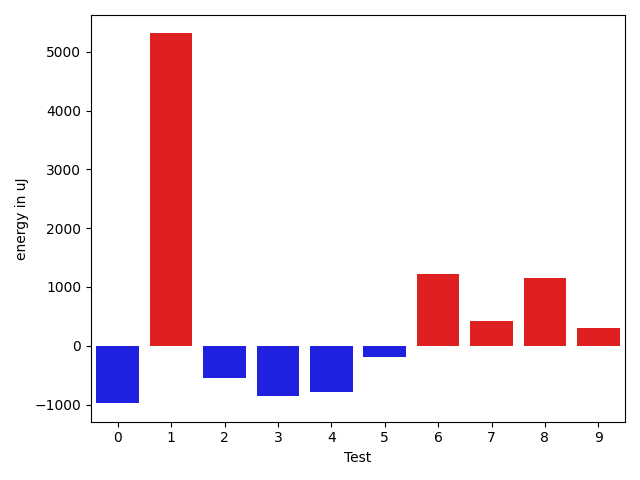

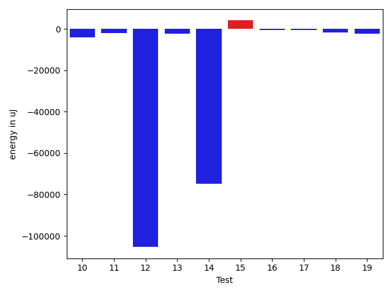

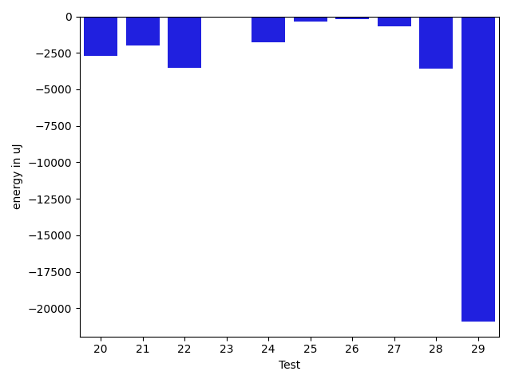

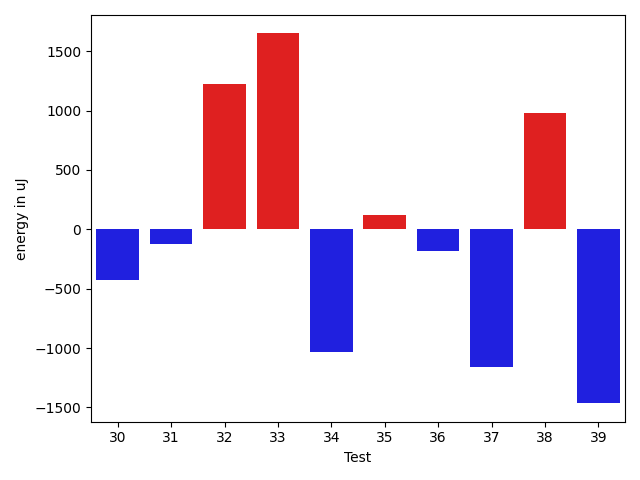

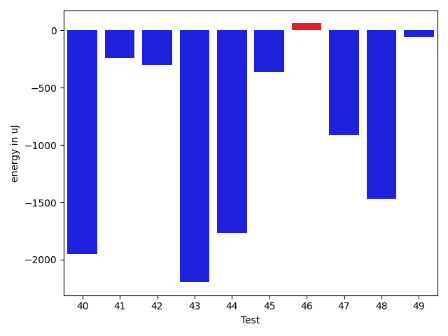

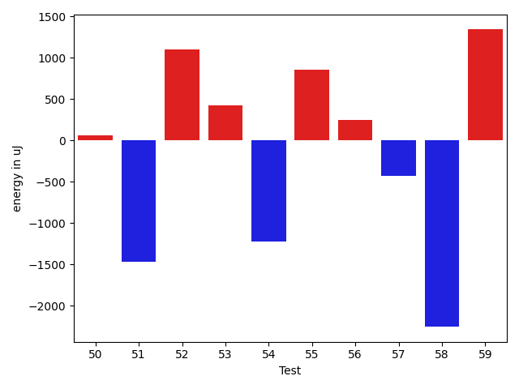

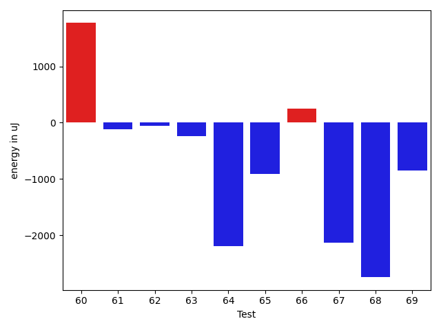

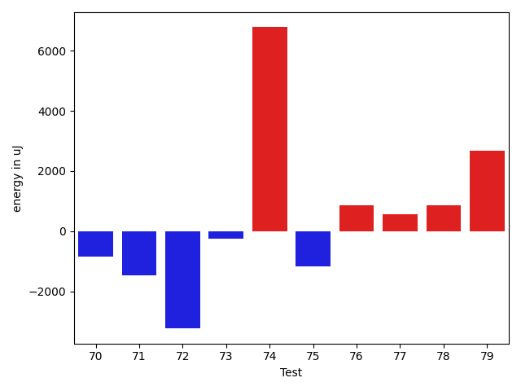

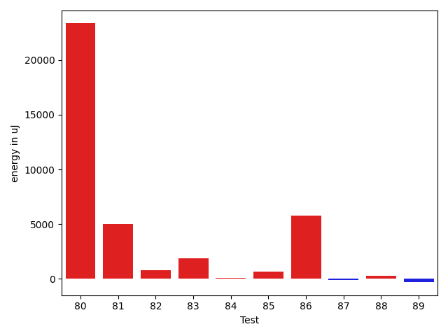

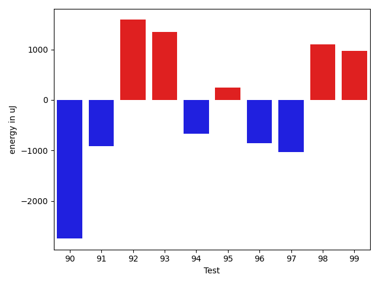

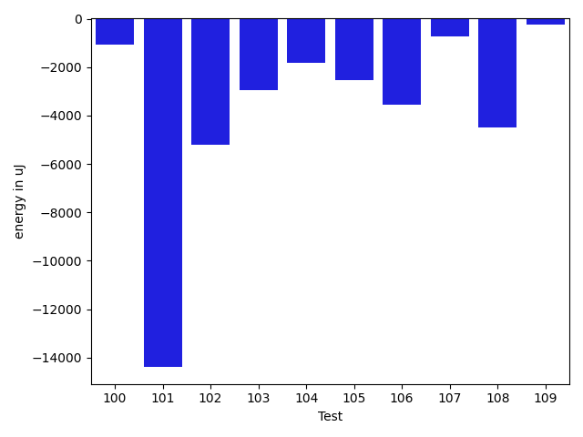

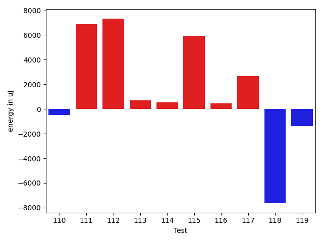

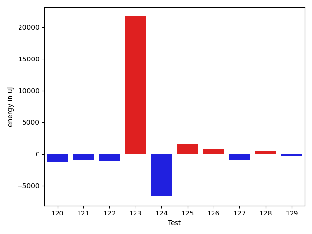

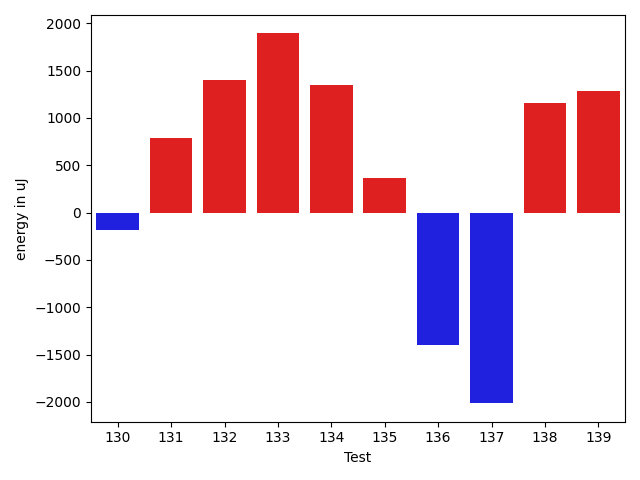

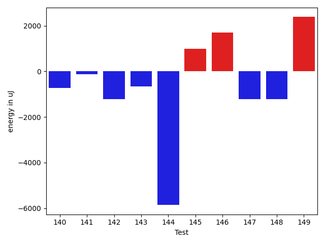

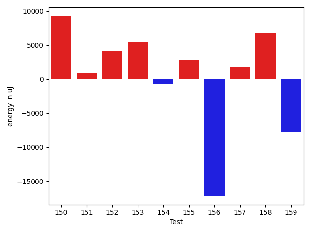

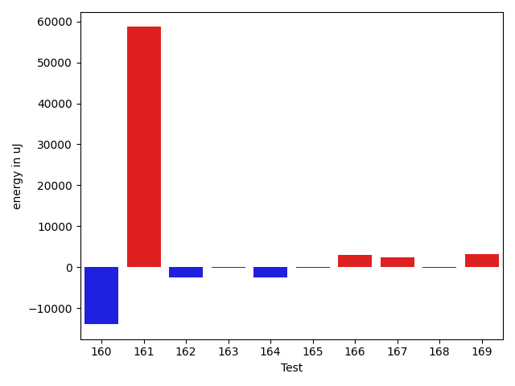

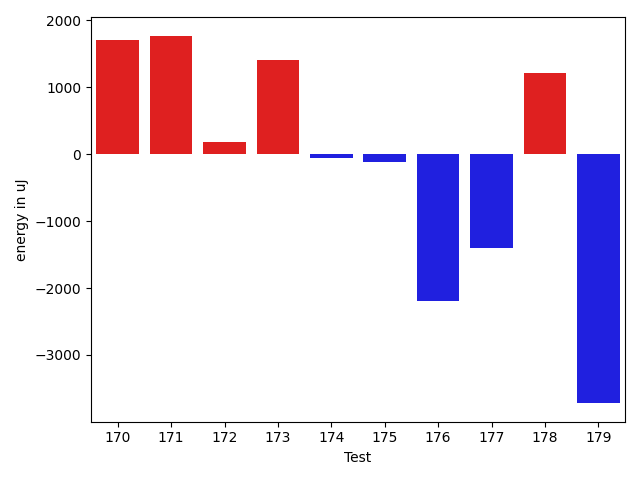

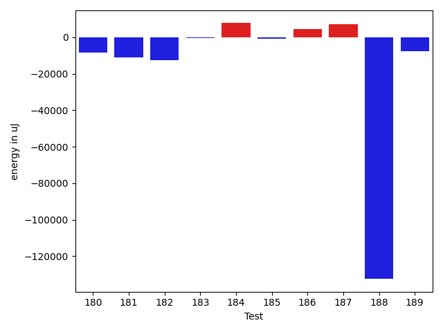

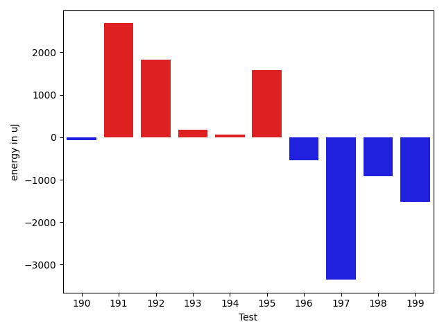

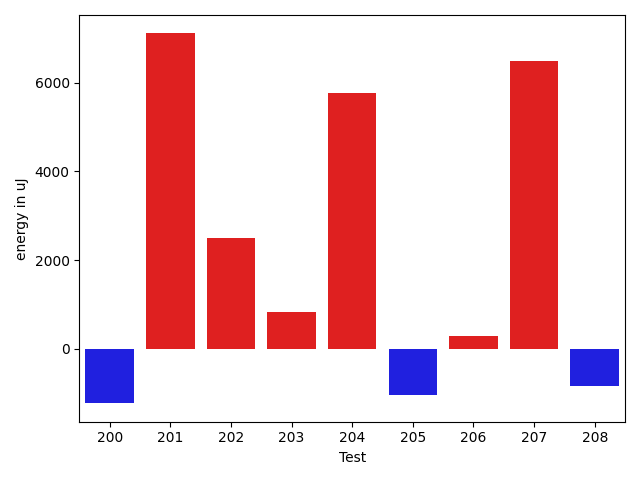

| ID | EnergyV1 | EnergyV2 | DeltaEnergy | σV1 | σV2 |
| --- | --- | --- | --- | --- | --- |
| 0 | 39124 | 38146 | -978 | 3792.2832472667437 | 29900.987822760297 |
| 1 | 37476 | 42786 | 5310 | 4367.075184678992 | 47572.68782482339 |
| 2 | 39307 | 38757 | -550 | 11823.678121047264 | 6136.038156767098 |
| 3 | 44251 | 43396 | -855 | 50744.686524415316 | 51174.16445344279 |
| 4 | 37719 | 36926 | -793 | 4144.696573069985 | 4363.3714991398765 |
| 5 | 38208 | 38024 | -184 | 9398.357312719963 | 11162.86732765974 |
| 6 | 37170 | 38391 | 1221 | 4184.675909328666 | 5325.444129741113 |
| 7 | 36804 | 37231 | 427 | 3610.891300479053 | 3634.9994886071936 |
| 8 | 36804 | 37963 | 1159 | 4776.854573349181 | 3267.3310889735726 |
| 9 | 36499 | 36805 | 306 | 3983.312860737159 | 4299.002609163404 |
| 10 | 37353 | 39063 | 1710 | 49301.17462727931 | 37132.13360773844 |
| 11 | 39307 | 36682 | -2625 | 4205.354463488215 | 4358.0765896708 |
| 12 | 39490 | 37719 | -1771 | 516589.3960380435 | 307224.3765948583 |
| 13 | 37964 | 34668 | -3296 | 4385.428547211747 | 4417.852980804138 |
| 14 | 38391 | 38391 | 0 | 391401.7747287203 | 35799.40787391669 |
| 15 | 41992 | 41809 | -183 | 37028.517319136416 | 40893.091315040925 |
| 16 | 39185 | 38635 | -550 | 4537.058713002892 | 4015.3099648188318 |
| 17 | 39794 | 37353 | -2441 | 3087.678547055859 | 7405.0282844563535 |
| 18 | 39306 | 36865 | -2441 | 7082.115229724809 | 4288.618835591252 |
| 19 | 39002 | 38574 | -428 | 39076.640974705115 | 34491.16776465936 |
| 20 | 36987 | 37780 | 793 | 13795.26637740474 | 3663.7857568140703 |
| 21 | 38147 | 37536 | -611 | 17901.532472851126 | 14687.834479019552 |
| 22 | 36866 | 35645 | -1221 | 15752.434523219807 | 12540.391607835343 |
| 23 | 43274 | 61890 | 18616 | 22859.54378259935 | 20551.635211251225 |
| 24 | 39001 | 37597 | -1404 | 3678.3892444375365 | 3625.102287789791 |
| 25 | 36377 | 35767 | -610 | 3438.992614784954 | 3986.743844240791 |
| 26 | 36377 | 37109 | 732 | 4449.118089379359 | 4372.4450211535195 |
| 27 | 36866 | 36682 | -184 | 6274.82126487406 | 4017.1235465316686 |
| 28 | 45410 | 40649 | -4761 | 23486.508445658284 | 20919.047283232485 |
| 29 | 38635 | 37781 | -854 | 96759.44992331356 | 58569.85716254055 |
| 30 | 37902 | 37475 | -427 | 3527.6009153690047 | 3979.1010643108825 |
| 31 | 36377 | 36254 | -123 | 3766.3733386906824 | 9951.920968002738 |
| 32 | 35644 | 36865 | 1221 | 36007.98545322968 | 4159.226945071914 |
| 33 | 35400 | 37049 | 1649 | 3994.5397479289068 | 3999.429731971642 |
| 34 | 34484 | 33447 | -1037 | 3964.5327440969654 | 2184.0006163097855 |
| 35 | 35827 | 35950 | 123 | 23344.808663980333 | 8229.200734313365 |
| 36 | 36499 | 36315 | -184 | 3854.934279487651 | 3985.4581740551307 |
| 37 | 37781 | 36621 | -1160 | 26937.316505949613 | 13683.835225090881 |
| 38 | 36194 | 37170 | 976 | 7282.037473508674 | 20787.660737072536 |
| 39 | 36316 | 34851 | -1465 | 34614.173629212084 | 3780.5685492469984 |
| 40 | 37354 | 35401 | -1953 | 5274.802147595775 | 3665.238637346559 |
| 41 | 36743 | 36499 | -244 | 4356.64758353551 | 3743.277162607623 |
| 42 | 35278 | 34973 | -305 | 4583.825101375488 | 4681.83350335889 |
| 43 | 38208 | 36011 | -2197 | 3609.39650352618 | 4258.067292791799 |
| 44 | 38086 | 36315 | -1771 | 3694.227539163108 | 4080.156805878131 |
| 45 | 35156 | 34790 | -366 | 4049.778178713791 | 4368.574279123822 |
| 46 | 37048 | 37109 | 61 | 3869.160750547882 | 4900.795158696189 |
| 47 | 38025 | 37109 | -916 | 4331.946081308887 | 4786.735143428487 |
| 48 | 37171 | 35705 | -1466 | 3768.0087884175423 | 3954.0819250266536 |
| 49 | 36560 | 36499 | -61 | 3841.668269511375 | 4187.701905580197 |
| 50 | 36926 | 36988 | 62 | 60152.68158802565 | 4356.122081762729 |
| 51 | 36438 | 34973 | -1465 | 4352.996476065205 | 34733.23397799111 |
| 52 | 36133 | 37231 | 1098 | 5032.899064963418 | 12594.501407890612 |
| 53 | 36865 | 37293 | 428 | 4264.7717972663695 | 3920.719737548743 |
| 54 | 37659 | 36438 | -1221 | 4120.920588423629 | 4109.604841176008 |
| 55 | 35339 | 36194 | 855 | 4153.346164372904 | 3624.0614139161517 |
| 56 | 39367 | 39612 | 245 | 7274.3472681262565 | 5345.225337252477 |
| 57 | 39123 | 38696 | -427 | 7025.784485997988 | 3744.8784561268194 |
| 58 | 43640 | 41382 | -2258 | 74132.86326673542 | 69922.70360122583 |
| 59 | 39123 | 40467 | 1344 | 18285.785638800022 | 19813.078610240147 |
| 60 | 36132 | 37903 | 1771 | 4488.885479368003 | 5234.011553004042 |
| 61 | 37964 | 37842 | -122 | 6379.142270920368 | 5903.762412921096 |
| 62 | 41443 | 41382 | -61 | 104158.27578017516 | 65715.40232183396 |
| 63 | 40894 | 40650 | -244 | 53557.680523278184 | 50924.28185758064 |
| 64 | 87341 | 85143 | -2198 | 116498.54130712141 | 118401.55201828972 |
| 65 | 38574 | 37658 | -916 | 4480.89247043457 | 3776.536955736136 |
| 66 | 37903 | 38147 | 244 | 4461.134173076712 | 4295.2689678497245 |
| 67 | 38452 | 36315 | -2137 | 4240.742726932755 | 4033.086944515504 |
| 68 | 40588 | 37841 | -2747 | 37317.95444439017 | 29808.703284462237 |
| 69 | 38636 | 37781 | -855 | 4346.743235918448 | 6921.5161189503815 |
| 70 | 38208 | 37353 | -855 | 3479.40285308139 | 4111.698987522778 |
| 71 | 39795 | 38330 | -1465 | 8013.855730918066 | 8536.857901596506 |
| 72 | 39734 | 36499 | -3235 | 4264.4691082841955 | 4126.745794453642 |
| 73 | 40588 | 40344 | -244 | 339404.2135544991 | 449750.29607150756 |
| 74 | 40954 | 47730 | 6776 | 36524.72848546877 | 49137.59723785269 |
| 75 | 38086 | 36926 | -1160 | 29703.540692689778 | 3957.4746932962244 |
| 76 | 39001 | 39855 | 854 | 4625.723282633755 | 5514.674701306007 |
| 77 | 38330 | 38879 | 549 | 12592.461163545968 | 12826.763401520813 |
| 78 | 41015 | 41870 | 855 | 19274.61292565414 | 19237.10319527334 |
| 79 | 38147 | 40833 | 2686 | 4107.086580000456 | 4376.248026894661 |
| 80 | 40283 | 43884 | 3601 | 48154.22576284621 | 97276.76609637252 |
| 81 | 39307 | 41748 | 2441 | 52784.162753324 | 50472.838731649266 |
| 82 | 37232 | 38208 | 976 | 3926.756013136492 | 4392.539241911851 |
| 83 | 35461 | 39672 | 4211 | 3516.767819734565 | 4258.6085754185315 |
| 84 | 39551 | 38391 | -1160 | 4340.891209187349 | 5074.477768943322 |
| 85 | 37232 | 37597 | 365 | 3646.134943655233 | 5280.024914907203 |
| 86 | 37597 | 41626 | 4029 | 8294.30617697924 | 14299.582377567518 |
| 87 | 37354 | 38147 | 793 | 4564.2168459295035 | 3348.441904453473 |
| 88 | 37170 | 37841 | 671 | 3615.6342871771626 | 3452.6139561664727 |
| 89 | 39917 | 40161 | 244 | 22388.33746730496 | 18311.56212110537 |
| 90 | 42237 | 39490 | -2747 | 66970.84928769797 | 60706.26387673106 |
| 91 | 39001 | 38085 | -916 | 3130.692365515973 | 4441.442205507673 |
| 92 | 36438 | 38025 | 1587 | 3795.1154301154083 | 4246.4376271300425 |
| 93 | 37171 | 38513 | 1342 | 3805.274841291834 | 4394.656705969994 |
| 94 | 37170 | 36499 | -671 | 2783.511009486141 | 3611.964885395944 |
| 95 | 39612 | 39856 | 244 | 436068.4499212638 | 403914.92883563315 |
| 96 | 38024 | 37171 | -853 | 6960.218543625505 | 4172.897861318894 |
| 97 | 36926 | 35888 | -1038 | 8707.456953309184 | 5526.0875805629385 |
| 98 | 73181 | 74279 | 1098 | 112153.5925294082 | 68896.57913103956 |
| 99 | 73303 | 74279 | 976 | 32138.434918205578 | 26747.7048345409 |
| 100 | 36804 | 36682 | -122 | 11455.346616270015 | 8961.701823253139 |
| 101 | 38330 | 37903 | -427 | 84996.31694204 | 48642.54801746888 |
| 102 | 64759 | 45410 | -19349 | 24569.255714220988 | 20362.34612641333 |
| 103 | 39246 | 37658 | -1588 | 15676.835571762658 | 12017.490069035837 |
| 104 | 76233 | 74157 | -2076 | 30351.365385531568 | 32773.50480184927 |
| 105 | 37537 | 36987 | -550 | 9538.661939065145 | 4157.267792645843 |
| 106 | 36193 | 36926 | 733 | 23952.876370756567 | 3748.6034365950295 |
| 107 | 36560 | 35706 | -854 | 3934.978054567847 | 3679.573327734357 |
| 108 | 37170 | 36499 | -671 | 27454.56624721841 | 4080.9129621419975 |
| 109 | 37903 | 37414 | -489 | 4270.956924148718 | 4147.789334976759 |
| 110 | 37598 | 37598 | 0 | 3968.1915126890676 | 3942.7517471938304 |
| 111 | 78369 | 82092 | 3723 | 24910.53224945889 | 34442.41227253263 |
| 112 | 71350 | 77271 | 5921 | 297201.11959702877 | 281406.1276131459 |
| 113 | 36194 | 36804 | 610 | 4383.270507224733 | 7319.947945336612 |
| 114 | 36682 | 37964 | 1282 | 3867.7552224497254 | 6623.147869192569 |
| 115 | 39123 | 37903 | -1220 | 27722.800027116493 | 40677.01416684858 |
| 116 | 35949 | 36743 | 794 | 4146.788573016813 | 4075.106875762756 |
| 117 | 36499 | 38025 | 1526 | 4013.978829527598 | 4665.887646462543 |
| 118 | 37293 | 36560 | -733 | 36970.27027677983 | 3766.3413187008987 |
| 119 | 37231 | 36254 | -977 | 4645.394616899857 | 3257.7522744732964 |
| 120 | 37536 | 36255 | -1281 | 4255.507005633994 | 4183.634536595032 |
| 121 | 37475 | 36438 | -1037 | 4730.934285093859 | 3179.2633590460605 |
| 122 | 37597 | 36438 | -1159 | 3666.4853740692715 | 3935.5017929673186 |
| 123 | 48096 | 69824 | 21728 | 61331.778232120945 | 81726.3668935079 |
| 124 | 43518 | 36804 | -6714 | 5265.231864156918 | 3685.5770541697025 |
| 125 | 38330 | 39917 | 1587 | 19872.901649057818 | 16458.71678789154 |
| 126 | 37598 | 38452 | 854 | 4900.196819802521 | 27754.915399836314 |
| 127 | 84900 | 83862 | -1038 | 23269.38498395865 | 31710.237893637677 |
| 128 | 37842 | 38391 | 549 | 7096.481819831747 | 6148.628464681079 |
| 129 | 37659 | 37415 | -244 | 4075.3721991400294 | 4341.6833354592245 |
| 130 | 37232 | 37048 | -184 | 7290.791380722509 | 4316.010682142405 |
| 131 | 37048 | 37841 | 793 | 2985.764017057536 | 3628.494610563572 |
| 132 | 37170 | 38575 | 1405 | 3683.030827550374 | 4582.299026314338 |
| 133 | 78125 | 80017 | 1892 | 61298.873569734285 | 369384.65100577165 |
| 134 | 39123 | 40466 | 1343 | 18659.13255575264 | 19040.667707558485 |
| 135 | 126159 | 126525 | 366 | 241687.30539798125 | 209910.10207515914 |
| 136 | 38268 | 36865 | -1403 | 4186.945202047423 | 4380.76236798351 |
| 137 | 39002 | 36988 | -2014 | 4657.726647650621 | 4285.215687530583 |
| 138 | 37475 | 38635 | 1160 | 9304.598695611134 | 4468.063294460563 |
| 139 | 39855 | 41138 | 1283 | 40107.480779461854 | 52196.122670508936 |
| 140 | 38025 | 37293 | -732 | 3555.7379612922828 | 4160.986850896472 |
| 141 | 37720 | 37597 | -123 | 4057.4734771470135 | 4151.984267164689 |
| 142 | 39124 | 37903 | -1221 | 38414.672835187375 | 32839.72236693696 |
| 143 | 118103 | 117431 | -672 | 27034.007281325623 | 26196.72777703464 |
| 144 | 241271 | 235412 | -5859 | 244213.16886706164 | 220596.24367354458 |
| 145 | 38574 | 39551 | 977 | 13282.461079420376 | 10173.345198319075 |
| 146 | 39001 | 40710 | 1709 | 16614.8726193696 | 18561.69288173487 |
| 147 | 39611 | 38391 | -1220 | 46296.60006623808 | 57162.77921105111 |
| 148 | 38757 | 37536 | -1221 | 6852.269705074661 | 3481.272384015971 |
| 149 | 37231 | 39611 | 2380 | 3464.696608628777 | 4278.075121226501 |
| 150 | 37842 | 41076 | 3234 | 14381.306217264802 | 26182.632458395477 |
| 151 | 37231 | 38147 | 916 | 4196.740125727617 | 4039.526900617553 |
| 152 | 76660 | 81909 | 5249 | 402133.84490917914 | 393603.29137643403 |
| 153 | 38086 | 38330 | 244 | 16905.698479322775 | 37068.284757488065 |
| 154 | 37842 | 39429 | 1587 | 13708.723786605302 | 9257.581207845566 |
| 155 | 35583 | 40955 | 5372 | 4180.335309384749 | 3893.2236178890225 |
| 156 | 38819 | 41626 | 2807 | 134307.24038870077 | 105817.84678720572 |
| 157 | 37232 | 38574 | 1342 | 3999.4829576084826 | 4235.781044288158 |
| 158 | 40405 | 39734 | -671 | 440521.53540024004 | 446451.5732311405 |
| 159 | 40344 | 38207 | -2137 | 54890.320466757286 | 38284.207137705045 |
| 160 | 236205 | 222289 | -13916 | 85442.00399684835 | 73283.54297313998 |
| 161 | 330322 | 388976 | 58654 | 124890.17439321212 | 147866.71818200866 |
| 162 | 40527 | 38086 | -2441 | 36542.363433942344 | 54460.54703662468 |
| 163 | 37964 | 37781 | -183 | 7482.137504160955 | 3926.2219627516797 |
| 164 | 41442 | 39001 | -2441 | 58930.016873562825 | 90893.03489666425 |
| 165 | 39672 | 39612 | -60 | 14379.618064340371 | 14022.838938348441 |
| 166 | 36804 | 39856 | 3052 | 4512.4069087564385 | 4141.078649794863 |
| 167 | 36499 | 39002 | 2503 | 5896.8846891520225 | 24049.23518551132 |
| 168 | 39428 | 39245 | -183 | 20617.09678562127 | 31086.710702611355 |
| 169 | 36133 | 39368 | 3235 | 4317.697552742202 | 2799.0375217225965 |
| 170 | 37048 | 38757 | 1709 | 4527.655442892799 | 27524.750202776715 |
| 171 | 36499 | 38269 | 1770 | 6907.551424823728 | 5829.6687215531865 |
| 172 | 39001 | 39185 | 184 | 7555.610670387216 | 3817.2735038210744 |
| 173 | 40650 | 42053 | 1403 | 367012.9077609291 | 534655.5637515143 |
| 174 | 37048 | 36988 | -60 | 4157.887977797298 | 4507.9781906333055 |
| 175 | 39124 | 39002 | -122 | 4466.61219576879 | 23235.77434630488 |
| 176 | 43273 | 41077 | -2196 | 638938.6226573786 | 341368.7665869664 |
| 177 | 37842 | 36438 | -1404 | 8452.518274652433 | 4052.088667018058 |
| 178 | 38086 | 39307 | 1221 | 5252.636080052918 | 4043.2807253806523 |
| 179 | 39368 | 35645 | -3723 | 4728.596328686709 | 3996.4998323185523 |
| 180 | 74035 | 75256 | 1221 | 81761.07076867006 | 81632.28284548337 |
| 181 | 40710 | 37537 | -3173 | 57308.424346349144 | 23315.293302028975 |
| 182 | 39123 | 37048 | -2075 | 25162.43403612262 | 4650.735217414554 |
| 183 | 39551 | 37292 | -2259 | 4846.880682201699 | 10109.801248749896 |
| 184 | 37048 | 38452 | 1404 | 3538.72585162361 | 33745.833009644215 |
| 185 | 38818 | 38818 | 0 | 3470.9691295678067 | 3432.0771541030335 |
| 186 | 63233 | 68420 | 5187 | 60708.6653729951 | 57414.39300535253 |
| 187 | 38574 | 39490 | 916 | 18273.871707814764 | 32395.395901502423 |
| 188 | 78919 | 79834 | 915 | 530903.7039066426 | 31467.841177461833 |
| 189 | 38574 | 39734 | 1160 | 66998.28300162088 | 41071.80014244313 |
| 190 | 38696 | 38635 | -61 | 22607.44255799443 | 13261.197752515185 |
| 191 | 38025 | 40711 | 2686 | 4252.419814458586 | 3285.6576282171422 |
| 192 | 38147 | 39978 | 1831 | 4504.491367090238 | 34315.375503298776 |
| 193 | 40650 | 40832 | 182 | 14557.509177978172 | 106793.69038348288 |
| 194 | 40100 | 40161 | 61 | 3979.374965438109 | 12519.564836438485 |
| 195 | 37781 | 39368 | 1587 | 13508.270068361675 | 48374.386770233294 |
| 196 | 38391 | 37842 | -549 | 4275.240335603301 | 8430.81391879416 |
| 197 | 41321 | 37964 | -3357 | 228925.44480528843 | 3210.2388578164546 |
| 198 | 40283 | 39367 | -916 | 71782.57087235659 | 57761.23298395862 |
| 199 | 39733 | 38208 | -1525 | 4221.861054232562 | 3137.8208265597063 |
| 200 | 39550 | 38086 | -1464 | 4485.116545838254 | 4436.126412110544 |
| 201 | 39428 | 40283 | 855 | 72455.75696423787 | 79281.38678821456 |
| 202 | 39794 | 39367 | -427 | 34140.49075895398 | 39103.66194657762 |
| 203 | 39428 | 40527 | 1099 | 27566.328359287163 | 20191.95376669439 |
| 204 | 39185 | 38940 | -245 | 11578.75886808062 | 40224.29550076055 |
| 205 | 38391 | 38879 | 488 | 28430.025754257676 | 12743.924668121103 |
| 206 | 39368 | 39856 | 488 | 10830.284987744852 | 6956.300800496599 |
| 207 | 38819 | 41260 | 2441 | 57077.33910724426 | 64996.68647693566 |
| 208 | 40039 | 37536 | -2503 | 4170.451212065935 | 4689.921983876038 |

## Delta Duration per test method

| ID | DurationV1 | DurationsV2 | DeltaDuration |
| --- | --- | --- | --- |
| 0 | 389221.6 | 944313.9090909091 | 555092.3090909091 |
| 1 | 402757.07692307694 | 1324753.0 | 921995.923076923 |
| 2 | 1018156.1147540984 | 926016.5846153846 | -92139.53013871377 |
| 3 | 1937910.3535353534 | 1756736.191919192 | -181174.16161616147 |
| 4 | 879185.4827586206 | 895363.4814814815 | 16177.998722860822 |
| 5 | 1112705.1704545454 | 1064159.8933333333 | -48545.2771212121 |
| 6 | 859090.3272727273 | 833668.5961538461 | -25421.731118881144 |
| 7 | 838571.262295082 | 811075.5769230769 | -27495.6853720051 |
| 8 | 736758.0 | 666765.5853658536 | -69992.41463414638 |
| 9 | 650663.5806451613 | 706590.71875 | 55927.13810483867 |
| 10 | 1268869.391304348 | 1139201.9512195121 | -129667.44008483575 |
| 11 | 548439.7222222222 | 611089.4782608695 | 62649.75603864726 |
| 12 | 5601000.555555556 | 2384336.3513513515 | -3216664.2042042045 |
| 13 | 524988.6363636364 | 586471.0 | 61482.36363636365 |
| 14 | 2985180.7586206896 | 748351.8181818182 | -2236828.9404388713 |
| 15 | 1736406.4848484849 | 1801517.5353535353 | 65111.05050505046 |
| 16 | 636846.4210526316 | 665974.0789473684 | 29127.657894736854 |
| 17 | 742865.7142857143 | 690262.9411764706 | -52602.77310924372 |
| 18 | 597135.3243243244 | 588974.5757575758 | -8160.748566748574 |
| 19 | 1043636.0425531915 | 929459.8444444444 | -114176.19810874714 |
| 20 | 580657.5454545454 | 483517.95652173914 | -97139.58893280628 |
| 21 | 1341264.9666666666 | 1222980.7073170731 | -118284.25934959343 |
| 22 | 1195166.2702702703 | 1101187.3243243243 | -93978.94594594603 |
| 23 | 1796135.6565656567 | 1736887.2525252525 | -59248.40404040413 |
| 24 | 719119.6875 | 422035.28571428574 | -297084.40178571426 |
| 25 | 726516.1136363636 | 771229.125 | 44713.01136363635 |
| 26 | 494945.3333333333 | 484482.6785714286 | -10462.654761904734 |
| 27 | 873366.490909091 | 834272.6363636364 | -39093.85454545461 |
| 28 | 1755017.6736842105 | 1679892.347368421 | -75125.32631578948 |
| 29 | 2016682.3333333333 | 1245547.7878787878 | -771134.5454545454 |
| 30 | 589325.7142857143 | 580374.8 | -8950.914285714272 |
| 31 | 838029.06 | 831153.2765957447 | -6875.783404255402 |
| 32 | 794373.24 | 524167.85714285716 | -270205.38285714283 |
| 33 | 767836.9210526316 | 758516.6666666666 | -9320.254385964945 |
| 34 | 484821.5652173913 | 437272.23529411765 | -47549.329923273646 |
| 35 | 858314.9318181818 | 762472.7857142857 | -95842.14610389608 |
| 36 | 438913.94736842107 | 472501.10714285716 | 33587.15977443609 |
| 37 | 1120345.894736842 | 1028435.9090909091 | -91909.98564593296 |
| 38 | 981565.220338983 | 984376.253968254 | 2811.033629270969 |
| 39 | 774271.3684210526 | 468314.5416666667 | -305956.8267543859 |
| 40 | 702383.75 | 680635.3157894737 | -21748.43421052629 |
| 41 | 755478.5454545454 | 847776.5714285715 | 92298.02597402607 |
| 42 | 516621.84 | 494526.3548387097 | -22095.48516129033 |
| 43 | 623449.1935483871 | 548952.5217391305 | -74496.67180925666 |
| 44 | 598472.9629629629 | 564444.8235294118 | -34028.139433551114 |
| 45 | 653989.695652174 | 535156.5666666667 | -118833.1289855073 |
| 46 | 550335.8148148148 | 530785.8055555555 | -19550.00925925933 |
| 47 | 577515.9655172414 | 576746.2962962963 | -769.6692209450994 |
| 48 | 525728.1785714285 | 491333.26923076925 | -34394.90934065927 |
| 49 | 543258.2857142857 | 692028.9722222222 | 148770.68650793657 |
| 50 | 912303.52 | 494001.14814814815 | -418302.3718518519 |
| 51 | 721294.6346153846 | 1004704.6666666666 | 283410.032051282 |
| 52 | 705074.0434782609 | 789601.5813953489 | 84527.53791708802 |
| 53 | 556142.4137931034 | 610882.1034482758 | 54739.689655172406 |
| 54 | 394185.5 | 420553.05555555556 | 26367.555555555562 |
| 55 | 674859.7222222222 | 614509.09375 | -60350.62847222225 |
| 56 | 924060.7142857143 | 904667.546875 | -19393.16741071432 |
| 57 | 930314.3518518518 | 924280.1627906977 | -6034.189061154146 |
| 58 | 2335163.3936170214 | 2124886.237113402 | -210277.15650361916 |
| 59 | 1359482.1818181819 | 1425513.3 | 66031.11818181816 |
| 60 | 538134.6521739131 | 514540.3103448276 | -23594.34182908549 |
| 61 | 986519.8709677419 | 858086.4509803922 | -128433.41998734977 |
| 62 | 1866927.875 | 1282870.3548387096 | -584057.5201612904 |
| 63 | 1225662.2051282052 | 933897.3095238095 | -291764.8956043958 |
| 64 | 3338746.0 | 3688583.757575758 | 349837.7575757578 |
| 65 | 657838.9791666666 | 649795.5897435897 | -8043.389423076878 |
| 66 | 474813.6060606061 | 505461.7037037037 | 30648.09764309763 |
| 67 | 657871.8181818182 | 544692.3793103448 | -113179.43887147342 |
| 68 | 1146094.1851851852 | 1211706.5192307692 | 65612.33404558408 |
| 69 | 705300.7105263158 | 733915.9756097561 | 28615.26508344023 |
| 70 | 568191.1379310344 | 534847.7419354839 | -33343.395995550556 |
| 71 | 821987.2448979592 | 859994.7659574468 | 38007.5210594876 |
| 72 | 652525.1428571428 | 677377.0714285715 | 24851.928571428638 |
| 73 | 2741417.632183908 | 4146197.7317073173 | 1404780.0995234093 |
| 74 | 1752911.112244898 | 2145858.1739130435 | 392947.06166814547 |
| 75 | 865033.4848484849 | 731459.6279069767 | -133573.85694150813 |
| 76 | 442900.6 | 462195.5238095238 | 19294.92380952381 |
| 77 | 1148308.2073170731 | 1236657.6875 | 88349.48018292687 |
| 78 | 1395518.7127659575 | 1426878.6 | 31359.88723404263 |
| 79 | 423738.7272727273 | 464439.53846153844 | 40700.811188811145 |
| 80 | 1502185.4523809524 | 2256604.1666666665 | 754418.7142857141 |
| 81 | 1262278.431372549 | 1461015.3818181818 | 198736.95044563292 |
| 82 | 419159.4736842105 | 448277.2727272727 | 29117.7990430622 |
| 83 | 627354.3478260869 | 633465.1481481482 | 6110.800322061288 |
| 84 | 465678.65 | 460852.45 | -4826.200000000012 |
| 85 | 384899.6875 | 466082.64285714284 | 81182.95535714284 |
| 86 | 858451.6666666666 | 895962.1851851852 | 37510.51851851854 |
| 87 | 564549.75 | 492530.9285714286 | -72018.82142857142 |
| 88 | 654931.8611111111 | 784058.8888888889 | 129127.02777777775 |
| 89 | 1430844.0898876404 | 1356059.8735632184 | -74784.21632442204 |
| 90 | 1687363.5666666667 | 1695193.2692307692 | 7829.7025641025975 |
| 91 | 607815.8214285715 | 587035.0540540541 | -20780.767374517396 |
| 92 | 783156.5853658536 | 745966.0344827586 | -37190.55088309501 |
| 93 | 824619.8409090909 | 788737.8478260869 | -35881.993083004025 |
| 94 | 586367.1666666666 | 475212.1666666667 | -111154.99999999994 |
| 95 | 4075872.1369863013 | 3845680.616438356 | -230191.52054794505 |
| 96 | 1113360.3095238095 | 911376.9154929577 | -201983.39403085178 |
| 97 | 995197.6575342466 | 979358.7792207792 | -15838.878313467372 |
| 98 | 3135899.404040404 | 2426181.4343434344 | -709717.9696969697 |
| 99 | 2350320.414141414 | 2288672.474747475 | -61647.93939393945 |
| 100 | 1194235.7333333334 | 1046812.9090909091 | -147422.82424242434 |
| 101 | 2045984.6987951808 | 1469294.0853658537 | -576690.613429327 |
| 102 | 1913374.7474747475 | 1686328.1515151516 | -227046.59595959587 |
| 103 | 1356091.8588235294 | 1188159.8 | -167932.0588235294 |
| 104 | 2425004.3434343436 | 2406236.02020202 | -18768.323232323397 |
| 105 | 1136732.3055555555 | 937436.5757575758 | -199295.7297979797 |
| 106 | 1100734.49122807 | 813699.4423076923 | -287035.04892037786 |
| 107 | 835348.6458333334 | 824204.1694915254 | -11144.476341807982 |
| 108 | 1119173.4415584416 | 832183.6612903225 | -286989.78026811907 |
| 109 | 832707.3454545455 | 802196.9387755102 | -30510.40667903528 |
| 110 | 507102.39285714284 | 513557.5 | 6455.1071428571595 |
| 111 | 2544020.7474747472 | 2699966.767676768 | 155946.02020202065 |
| 112 | 4143264.61627907 | 4356779.505747126 | 213514.88946805662 |
| 113 | 621412.5277777778 | 687759.5263157894 | 66346.99853801169 |
| 114 | 834158.779661017 | 1002552.7454545455 | 168393.96579352848 |
| 115 | 835927.2368421053 | 1096264.62 | 260337.38315789483 |
| 116 | 577334.9677419355 | 628225.4 | 50890.43225806451 |
| 117 | 536988.074074074 | 528068.5882352941 | -8919.485838779947 |
| 118 | 1070464.6438356165 | 965721.1379310344 | -104743.5059045821 |
| 119 | 556016.2903225806 | 600084.78125 | 44068.49092741939 |
| 120 | 570572.75 | 566630.1034482758 | -3942.646551724174 |
| 121 | 479937.6111111111 | 489733.25925925927 | 9795.648148148146 |
| 122 | 508448.9583333333 | 574893.0571428571 | 66444.0988095238 |
| 123 | 2200027.5492957747 | 2484270.434782609 | 284242.8854868342 |
| 124 | 352288.25 | 363783.22222222225 | 11494.972222222248 |
| 125 | 1104844.265625 | 1019334.283018868 | -85509.98260613205 |
| 126 | 875128.53125 | 920369.5 | 45240.96875 |
| 127 | 2651766.767676768 | 2646922.474747475 | -4844.292929293122 |
| 128 | 979949.5373134328 | 927091.1846153847 | -52858.35269804811 |
| 129 | 671567.0625 | 664422.358974359 | -7144.703525641002 |
| 130 | 957036.4385964912 | 870408.1857142857 | -86628.25288220553 |
| 131 | 616308.1333333333 | 636657.5555555555 | 20349.4222222222 |
| 132 | 914166.1692307693 | 842084.1016949152 | -72082.06753585406 |
| 133 | 2717993.727272727 | 4318445.303030303 | 1600451.5757575757 |
| 134 | 1413334.8387096773 | 1370041.9361702127 | -43292.902539464645 |
| 135 | 5042233.303030303 | 4473098.353535353 | -569134.9494949495 |
| 136 | 750773.7959183673 | 807962.9705882353 | 57189.17466986796 |
| 137 | 842579.1428571428 | 820927.1568627451 | -21651.98599439778 |
| 138 | 992644.6231884058 | 994574.2363636363 | 1929.6131752305664 |
| 139 | 1189654.0943396227 | 1305461.6792452831 | 115807.58490566048 |
| 140 | 659031.725 | 748644.7333333333 | 89613.0083333333 |
| 141 | 918761.5 | 834644.186440678 | -84117.31355932204 |
| 142 | 1437669.551724138 | 1044348.45 | -393321.101724138 |
| 143 | 3538781.6666666665 | 3370769.707070707 | -168011.95959595963 |
| 144 | 7696950.2727272725 | 7543473.01010101 | -153477.26262626238 |
| 145 | 1319966.2386363635 | 1194987.576923077 | -124978.66171328654 |
| 146 | 1434902.1979166667 | 1405157.2159090908 | -29744.98200757592 |
| 147 | 1140758.7450980393 | 1230317.267857143 | 89558.52275910368 |
| 148 | 946667.796875 | 946616.8793103448 | -50.91756465518847 |
| 149 | 662610.5625 | 568838.7714285714 | -93771.79107142857 |
| 150 | 820354.4761904762 | 1166549.5135135136 | 346195.0373230374 |
| 151 | 857710.195652174 | 788038.8260869565 | -69671.3695652174 |
| 152 | 5182414.414141414 | 5076826.03030303 | -105588.38383838348 |
| 153 | 879324.5675675676 | 970629.4666666667 | 91304.8990990991 |
| 154 | 884610.5 | 790097.4615384615 | -94513.0384615385 |
| 155 | 686720.9 | 613637.4166666666 | -73083.4833333334 |
| 156 | 2812969.9736842103 | 2139216.8048780486 | -673753.1688061617 |
| 157 | 676483.8823529412 | 614978.3225806452 | -61505.559772295994 |
| 158 | 4032268.9821428573 | 4280946.14 | 248677.1578571424 |
| 159 | 1753336.3146067415 | 1553903.9886363635 | -199432.325970378 |
| 160 | 7103375.070707071 | 6754083.888888889 | -349291.18181818165 |
| 161 | 9941330.050505051 | 11315139.808080807 | 1373809.757575756 |
| 162 | 1599070.1477272727 | 1646758.4318181819 | 47688.284090909176 |
| 163 | 727354.4634146341 | 755363.2142857143 | 28008.750871080207 |
| 164 | 1451585.52 | 1843464.5084745763 | 391878.98847457627 |
| 165 | 1197440.880952381 | 1153996.4102564103 | -43444.47069597081 |
| 166 | 736688.8787878788 | 675413.4761904762 | -61275.40259740257 |
| 167 | 1037002.1066666667 | 1119468.3513513512 | 82466.24468468456 |
| 168 | 904707.1304347826 | 970114.6590909091 | 65407.528656126466 |
| 169 | 560194.9310344828 | 571158.8518518518 | 10963.920817369013 |
| 170 | 648094.8947368421 | 783327.7674418605 | 135232.87270501838 |
| 171 | 956434.1016949152 | 943757.3166666667 | -12676.78502824856 |
| 172 | 845547.7333333333 | 810064.8780487805 | -35482.85528455279 |
| 173 | 3413759.734177215 | 6138236.620253164 | 2724476.8860759493 |
| 174 | 844119.7441860465 | 821281.7209302326 | -22838.023255813983 |
| 175 | 824614.868852459 | 1066184.92 | 241570.05114754091 |
| 176 | 6961034.543859649 | 3464741.8615384614 | -3496292.682321188 |
| 177 | 886787.3666666667 | 699460.1081081082 | -187327.25855855853 |
| 178 | 669367.7368421053 | 565498.5357142857 | -103869.2011278196 |
| 179 | 523213.2727272727 | 514745.625 | -8467.647727272706 |
| 180 | 2724660.7910447763 | 2477784.0875 | -246876.70354477642 |
| 181 | 989294.9285714285 | 566331.0476190476 | -422963.88095238095 |
| 182 | 1068744.1333333333 | 434539.875 | -634204.2583333333 |
| 183 | 516009.45 | 599949.6521739131 | 83940.20217391307 |
| 184 | 527874.6296296297 | 685185.6923076923 | 157311.0626780626 |
| 185 | 490645.8095238095 | 503473.57692307694 | 12827.76739926741 |
| 186 | 2334338.8484848486 | 2339239.2463768115 | 4900.397891962901 |
| 187 | 902317.75 | 1058417.738095238 | 156099.9880952381 |
| 188 | 6613698.454545454 | 2658948.292929293 | -3954750.161616161 |
| 189 | 1555872.9655172413 | 1155829.0317460317 | -400043.93377120956 |
| 190 | 1168599.6307692307 | 1016227.8214285715 | -152371.80934065918 |
| 191 | 574765.16 | 398087.94736842107 | -176677.21263157896 |
| 192 | 481561.5714285714 | 1290418.857142857 | 808857.2857142857 |
| 193 | 771045.2608695652 | 2546525.0967741935 | 1775479.8359046283 |
| 194 | 518277.06666666665 | 786323.6153846154 | 268046.5487179487 |
| 195 | 948701.0535714285 | 1667053.1403508773 | 718352.0867794488 |
| 196 | 733387.0227272727 | 865638.0277777778 | 132251.00505050505 |
| 197 | 2975899.947368421 | 654866.3571428572 | -2321033.590225564 |
| 198 | 1476234.2285714287 | 1114642.78125 | -361591.4473214287 |
| 199 | 677973.8823529412 | 597461.3714285714 | -80512.5109243698 |
| 200 | 638430.8636363636 | 501155.87096774194 | -137274.9926686217 |
| 201 | 1496186.8620689656 | 1876859.3636363635 | 380672.50156739797 |
| 202 | 1023963.3666666667 | 1139205.0333333334 | 115241.66666666674 |
| 203 | 1185260.7704918033 | 1256328.7407407407 | 71067.97024893737 |
| 204 | 1178805.7866666666 | 1355264.5945945946 | 176458.80792792793 |
| 205 | 825924.75 | 871987.6153846154 | 46062.865384615376 |
| 206 | 944918.875 | 1002864.0882352941 | 57945.2132352941 |
| 207 | 1198621.3170731708 | 1414003.6046511629 | 215382.28757799207 |
| 208 | 601427.0666666667 | 614029.21875 | 12602.152083333349 |

## Misc.

| ID | Test Class | Test Method |
| --- | --- | --- |
| 0 | com.google.gson.InnerClassExclusionStrategyTest | testExcludeInnerClassField |
| 1 | com.google.gson.InnerClassExclusionStrategyTest | testIncludeStaticNestedClassField |
| 2 | com.google.gson.functional.PrimitiveTest | testDeserializePrimitiveWrapperAsObjectField |
| 3 | com.google.gson.functional.CustomDeserializerTest | testDefaultConstructorNotCalledOnObject |
| 4 | com.google.gson.functional.CustomDeserializerTest | testCustomDeserializerReturnsNullForArrayElementsForArrayField |
| 5 | com.google.gson.functional.CustomDeserializerTest | testJsonTypeFieldBasedDeserialization |
| 6 | com.google.gson.functional.CustomDeserializerTest | testCustomDeserializerReturnsNull |
| 7 | com.google.gson.functional.CustomDeserializerTest | testCustomDeserializerReturnsNullForPrimitiveFields |
| 8 | com.google.gson.functional.CustomDeserializerTest | testDefaultConstructorNotCalledOnField |
| 9 | com.google.gson.MixedStreamTest | testReaderDoesNotMutateState |
| 10 | com.google.gson.MixedStreamTest | testReadMixedStreamed |
| 11 | com.google.gson.MixedStreamTest | testWriteClosed |
| 12 | com.google.gson.MixedStreamTest | testWriteMixedStreamed |
| 13 | com.google.gson.MixedStreamTest | testWriteInvalidState |
| 14 | com.google.gson.MixedStreamTest | testWriteDoesNotMutateState |
| 15 | com.google.gson.functional.CircularReferenceTest | testCircularSerialization |
| 16 | com.google.gson.functional.CircularReferenceTest | testSelfReferenceArrayFieldSerialization |
| 17 | com.google.gson.functional.CircularReferenceTest | testSelfReferenceSerialization |
| 18 | com.google.gson.functional.CircularReferenceTest | testDirectedAcyclicGraphSerialization |
| 19 | com.google.gson.functional.CircularReferenceTest | testDirectedAcyclicGraphDeserialization |
| 20 | com.google.gson.functional.ObjectTest | testNullObjectFieldsDeserialization |
| 21 | com.google.gson.functional.ObjectTest | testEmptyCollectionInAnObjectDeserialization |
| 22 | com.google.gson.functional.ObjectTest | testArrayOfArraysDeserialization |
| 23 | com.google.gson.functional.ObjectTest | testSingletonLists |
| 24 | com.google.gson.functional.ObjectTest | testClassWithNoFieldsSerialization |
| 25 | com.google.gson.functional.ObjectTest | testInnerClassSerialization |
| 26 | com.google.gson.functional.ObjectTest | testClassWithObjectFieldSerialization |
| 27 | com.google.gson.functional.ObjectTest | testArrayOfObjectsDeserialization |
| 28 | com.google.gson.functional.ObjectTest | testArrayOfArraysSerialization |
| 29 | com.google.gson.functional.ObjectTest | testJsonInSingleQuotesDeserialization |
| 30 | com.google.gson.functional.ObjectTest | testJsonInMixedQuotesDeserialization |
| 31 | com.google.gson.functional.ObjectTest | testArrayOfObjectsSerialization |
| 32 | com.google.gson.functional.ObjectTest | testNullPrimitiveFieldsDeserialization |
| 33 | com.google.gson.functional.ObjectTest | testInnerClassDeserialization |
| 34 | com.google.gson.functional.ObjectTest | testStringFieldWithEmptyValueDeserialization |
| 35 | com.google.gson.functional.ObjectTest | testNestedSerialization |
| 36 | com.google.gson.functional.ObjectTest | testClassWithNoFieldsDeserialization |
| 37 | com.google.gson.functional.ObjectTest | testStringFieldWithNumberValueDeserialization |
| 38 | com.google.gson.functional.ObjectTest | testArrayOfObjectsAsFields |
| 39 | com.google.gson.functional.ObjectTest | testPrimitiveArrayFieldSerialization |
| 40 | com.google.gson.functional.ObjectTest | testPrimitiveArrayInAnObjectDeserialization |
| 41 | com.google.gson.functional.ObjectTest | testBagOfPrimitiveWrappersSerialization |
| 42 | com.google.gson.functional.ObjectTest | testObjectFieldNamesWithoutQuotesDeserialization |
| 43 | com.google.gson.functional.ObjectTest | testBagOfPrimitivesSerialization |
| 44 | com.google.gson.functional.ObjectTest | testBagOfPrimitivesDeserialization |
| 45 | com.google.gson.functional.ObjectTest | testClassWithTransientFieldsDeserialization |
| 46 | com.google.gson.functional.ObjectTest | testPrivateNoArgConstructorDeserialization |
| 47 | com.google.gson.functional.ObjectTest | testNullFieldsSerialization |
| 48 | com.google.gson.functional.ObjectTest | testClassWithTransientFieldsDeserializationTransientFieldsPassedInJsonAreIgnored |
| 49 | com.google.gson.functional.ObjectTest | testStringFieldWithEmptyValueSerialization |
| 50 | com.google.gson.functional.ObjectTest | testNullArraysDeserialization |
| 51 | com.google.gson.functional.ObjectTest | testNestedDeserialization |
| 52 | com.google.gson.functional.ObjectTest | testClassWithTransientFieldsSerialization |
| 53 | com.google.gson.functional.ObjectTest | testNullFieldsDeserialization |
| 54 | com.google.gson.functional.ObjectTest | testEmptyCollectionInAnObjectSerialization |
| 55 | com.google.gson.functional.ObjectTest | testBagOfPrimitiveWrappersDeserialization |
| 56 | com.google.gson.functional.PrettyPrintingTest | testEmptyMapField |
| 57 | com.google.gson.functional.PrettyPrintingTest | testPrettyPrintArrayOfObjects |
| 58 | com.google.gson.functional.PrettyPrintingTest | testPrettyPrintList |
| 59 | com.google.gson.functional.MapTest | testMapSerializationWithNullValues |
| 60 | com.google.gson.functional.MapTest | testMapSerializationWithNullValuesSerialized |
| 61 | com.google.gson.functional.ReadersWritersTest | testReadWriteTwoObjects |
| 62 | com.google.gson.functional.ReadersWritersTest | testWriterForSerialization |
| 63 | com.google.gson.functional.ReadersWritersTest | testReaderForDeserialization |
| 64 | com.google.gson.functional.ExposeFieldsTest | testNullExposeFieldSerialization |
| 65 | com.google.gson.functional.ExposeFieldsTest | testNoExposedFieldDeserialization |
| 66 | com.google.gson.functional.ExposeFieldsTest | testNoExposedFieldSerialization |
| 67 | com.google.gson.functional.ExposeFieldsTest | testExposedInterfaceFieldDeserialization |
| 68 | com.google.gson.functional.ExposeFieldsTest | testExposeAnnotationDeserialization |
| 69 | com.google.gson.functional.ExposeFieldsTest | testExposedInterfaceFieldSerialization |
| 70 | com.google.gson.functional.ExposeFieldsTest | testExposeAnnotationSerialization |
| 71 | com.google.gson.functional.ExposeFieldsTest | testArrayWithOneNullExposeFieldObjectSerialization |
| 72 | com.google.gson.functional.FieldExclusionTest | testDefaultNestedStaticClassIncluded |
| 73 | com.google.gson.functional.FieldExclusionTest | testDefaultInnerClassExclusion |
| 74 | com.google.gson.functional.InheritanceTest | testSubInterfacesOfCollectionSerialization |
| 75 | com.google.gson.functional.InheritanceTest | testClassWithBaseArrayFieldSerialization |
| 76 | com.google.gson.functional.InheritanceTest | testBaseSerializedAsSub |
| 77 | com.google.gson.functional.InheritanceTest | testSubInterfacesOfCollectionDeserialization |
| 78 | com.google.gson.functional.InheritanceTest | testSubClassSerialization |
| 79 | com.google.gson.functional.InheritanceTest | testBaseSerializedAsBaseWhenSpecifiedWithExplicitType |
| 80 | com.google.gson.functional.InheritanceTest | testBaseSerializedAsBaseWhenSpecifiedWithExplicitTypeForToJsonMethod |
| 81 | com.google.gson.functional.InheritanceTest | testSubClassDeserialization |
| 82 | com.google.gson.functional.InheritanceTest | testBaseSerializedAsSubWhenSpecifiedWithExplicitTypeForToJsonMethod |
| 83 | com.google.gson.functional.InheritanceTest | testClassWithBaseFieldSerialization |
| 84 | com.google.gson.functional.InheritanceTest | testBaseSerializedAsSubForToJsonMethod |
| 85 | com.google.gson.functional.InheritanceTest | testBaseSerializedAsSubWhenSpecifiedWithExplicitType |
| 86 | com.google.gson.functional.NullObjectAndFieldTest | testExplicitDeserializationOfNulls |
| 87 | com.google.gson.functional.NullObjectAndFieldTest | testExplicitSerializationOfNullCollectionMembers |
| 88 | com.google.gson.functional.NullObjectAndFieldTest | testPrintPrintingObjectWithNulls |
| 89 | com.google.gson.functional.NullObjectAndFieldTest | testExplicitSerializationOfNullArrayMembers |
| 90 | com.google.gson.functional.NullObjectAndFieldTest | testExplicitSerializationOfNulls |
| 91 | com.google.gson.functional.NullObjectAndFieldTest | testExplicitNullSetsFieldToNullDuringDeserialization |
| 92 | com.google.gson.functional.NullObjectAndFieldTest | testNullWrappedPrimitiveMemberDeserialization |
| 93 | com.google.gson.functional.NullObjectAndFieldTest | testNullWrappedPrimitiveMemberSerialization |
| 94 | com.google.gson.functional.NullObjectAndFieldTest | testExplicitSerializationOfNullStringMembers |
| 95 | com.google.gson.JsonParserTest | testReadWriteTwoObjects |
| 96 | com.google.gson.functional.ParameterizedTypesTest | testVariableTypeArrayDeserialization |
| 97 | com.google.gson.functional.ParameterizedTypesTest | testParameterizedTypeWithReaderDeserialization |
| 98 | com.google.gson.functional.ParameterizedTypesTest | testParameterizedTypesSerialization |
| 99 | com.google.gson.functional.ParameterizedTypesTest | testVariableTypeFieldsAndGenericArraysSerialization |
| 100 | com.google.gson.functional.ParameterizedTypesTest | testParameterizedTypeGenericArraysDeserialization |
| 101 | com.google.gson.functional.ParameterizedTypesTest | testParameterizedTypeDeserialization |
| 102 | com.google.gson.functional.ParameterizedTypesTest | testVariableTypeFieldsAndGenericArraysDeserialization |
| 103 | com.google.gson.functional.ParameterizedTypesTest | testTypesWithMultipleParametersDeserialization |
| 104 | com.google.gson.functional.ParameterizedTypesTest | testTypesWithMultipleParametersSerialization |
| 105 | com.google.gson.functional.ParameterizedTypesTest | testParameterizedTypeWithVariableTypeDeserialization |
| 106 | com.google.gson.functional.ParameterizedTypesTest | testParameterizedTypeGenericArraysSerialization |
| 107 | com.google.gson.functional.ParameterizedTypesTest | testDeepParameterizedTypeDeserialization |
| 108 | com.google.gson.functional.ParameterizedTypesTest | testVariableTypeDeserialization |
| 109 | com.google.gson.functional.ParameterizedTypesTest | testParameterizedTypesWithWriterSerialization |
| 110 | com.google.gson.functional.ParameterizedTypesTest | testDeepParameterizedTypeSerialization |
| 111 | com.google.gson.functional.NamingPolicyTest | testGsonWithNonDefaultFieldNamingPolicySerialization |
| 112 | com.google.gson.functional.NamingPolicyTest | testGsonDuplicateNameUsingSerializedNameFieldNamingPolicySerialization |
| 113 | com.google.gson.functional.NamingPolicyTest | testGsonWithSerializedNameFieldNamingPolicyDeserialization |
| 114 | com.google.gson.functional.NamingPolicyTest | testGsonWithSerializedNameFieldNamingPolicySerialization |
| 115 | com.google.gson.functional.NamingPolicyTest | testGsonWithNonDefaultFieldNamingPolicyDeserialiation |
| 116 | com.google.gson.functional.NamingPolicyTest | testGsonWithLowerCaseDashPolicyDeserialiation |
| 117 | com.google.gson.functional.NamingPolicyTest | testGsonWithLowerCaseUnderscorePolicySerialization |
| 118 | com.google.gson.functional.NamingPolicyTest | testDeprecatedNamingStrategy |
| 119 | com.google.gson.functional.NamingPolicyTest | testGsonWithLowerCaseUnderscorePolicyDeserialiation |
| 120 | com.google.gson.functional.NamingPolicyTest | testGsonWithLowerCaseDashPolicySerialization |
| 121 | com.google.gson.functional.NamingPolicyTest | testGsonWithUpperCamelCaseSpacesPolicySerialiation |
| 122 | com.google.gson.functional.NamingPolicyTest | testGsonWithUpperCamelCaseSpacesPolicyDeserialiation |
| 123 | com.google.gson.SerializedNameAnnotationInterceptingNamingPolicyTest | testFieldWithAnnotation |
| 124 | com.google.gson.SerializedNameAnnotationInterceptingNamingPolicyTest | testFieldWithoutAnnotation |
| 125 | com.google.gson.functional.CustomTypeAdaptersTest | testCustomNestedSerializers |
| 126 | com.google.gson.functional.CustomTypeAdaptersTest | testCustomNestedDeserializers |
| 127 | com.google.gson.functional.CustomTypeAdaptersTest | testCustomTypeAdapterDoesNotAppliesToSubClasses |
| 128 | com.google.gson.functional.CustomTypeAdaptersTest | testCustomSerializerForLong |
| 129 | com.google.gson.functional.CustomTypeAdaptersTest | testEnsureCustomSerializerNotInvokedForNullValues |
| 130 | com.google.gson.functional.CustomTypeAdaptersTest | testCustomDeserializerForLong |
| 131 | com.google.gson.functional.CustomTypeAdaptersTest | testEnsureCustomDeserializerNotInvokedForNullValues |
| 132 | com.google.gson.functional.TypeVariableTest | testBasicTypeVariables |
| 133 | com.google.gson.functional.TypeVariableTest | testAdvancedTypeVariables |
| 134 | com.google.gson.functional.TypeVariableTest | testTypeVariablesViaTypeParameter |
| 135 | com.google.gson.functional.VersioningTest | testVersionedUntilSerialization |
| 136 | com.google.gson.functional.VersioningTest | testVersionedClassesDeserialization |
| 137 | com.google.gson.functional.VersioningTest | testVersionedClassesSerialization |
| 138 | com.google.gson.functional.VersioningTest | testVersionedGsonMixingSinceAndUntilSerialization |
| 139 | com.google.gson.functional.VersioningTest | testVersionedUntilDeserialization |
| 140 | com.google.gson.functional.VersioningTest | testVersionedGsonWithUnversionedClassesDeserialization |
| 141 | com.google.gson.functional.VersioningTest | testVersionedGsonMixingSinceAndUntilDeserialization |
| 142 | com.google.gson.functional.VersioningTest | testVersionedGsonWithUnversionedClassesSerialization |
| 143 | com.google.gson.functional.MapAsArrayTypeAdapterTest | testMultipleEnableComplexKeyRegistrationHasNoEffect |
| 144 | com.google.gson.functional.MapAsArrayTypeAdapterTest | testSerializeComplexMapWithTypeAdapter |
| 145 | com.google.gson.functional.CollectionTest | testFieldIsArrayList |
| 146 | com.google.gson.functional.CollectionTest | testWildcardCollectionField |
| 147 | com.google.gson.functional.CollectionTest | testSetSerialization |
| 148 | com.google.gson.functional.CollectionTest | testSetDeserialization |
| 149 | com.google.gson.functional.CollectionTest | testRawCollectionSerialization |
| 150 | com.google.gson.functional.CollectionTest | testCollectionOfBagOfPrimitivesSerialization |
| 151 | com.google.gson.functional.ExclusionStrategyFunctionalTest | testExclusionStrategyWithMode |
| 152 | com.google.gson.functional.ExclusionStrategyFunctionalTest | testExclusionStrategySerialization |
| 153 | com.google.gson.functional.ExclusionStrategyFunctionalTest | testExclusionStrategyDeserialization |
| 154 | com.google.gson.functional.UncategorizedTest | testGsonInstanceReusableForSerializationAndDeserialization |
| 155 | com.google.gson.functional.UncategorizedTest | testStaticFieldsAreNotSerialized |
| 156 | com.google.gson.functional.UncategorizedTest | testInvalidJsonDeserializationFails |
| 157 | com.google.gson.functional.UncategorizedTest | testObjectEqualButNotSameSerialization |
| 158 | com.google.gson.FunctionWithInternalDependenciesTest | testAnonymousLocalClassesSerialization |
| 159 | com.google.gson.functional.ConcurrencyTest | testSingleThreadSerialization |
| 160 | com.google.gson.functional.ConcurrencyTest | testMultiThreadSerialization |
| 161 | com.google.gson.functional.ConcurrencyTest | testMultiThreadDeserialization |
| 162 | com.google.gson.functional.ConcurrencyTest | testSingleThreadDeserialization |
| 163 | com.google.gson.functional.EscapingTest | testGsonDoubleDeserialization |
| 164 | com.google.gson.functional.EscapingTest | testEscapingObjectFields |
| 165 | com.google.gson.functional.EscapingTest | testGsonAcceptsEscapedAndNonEscapedJsonDeserialization |
| 166 | com.google.gson.functional.DefaultTypeAdaptersTest | testUrlNullDeserialization |
| 167 | com.google.gson.functional.DefaultTypeAdaptersTest | testUrlNullSerialization |
| 168 | com.google.gson.functional.DefaultTypeAdaptersTest | testBigDecimalFieldDeserialization |
| 169 | com.google.gson.functional.DefaultTypeAdaptersTest | testBadValueForBigDecimalDeserialization |
| 170 | com.google.gson.functional.DefaultTypeAdaptersTest | testBigIntegerFieldDeserialization |
| 171 | com.google.gson.functional.DefaultTypeAdaptersTest | testBigIntegerFieldSerialization |
| 172 | com.google.gson.functional.DefaultTypeAdaptersTest | testBigDecimalFieldSerialization |
| 173 | com.google.gson.functional.InstanceCreatorTest | testInstanceCreatorReturnsSubTypeForField |
| 174 | com.google.gson.functional.InstanceCreatorTest | testInstanceCreatorReturnsSubTypeForTopLevelObject |
| 175 | com.google.gson.functional.InstanceCreatorTest | testInstanceCreatorReturnsBaseType |
| 176 | com.google.gson.functional.CustomSerializerTest | testSubClassSerializerInvokedForBaseClassFieldsHoldingSubClassInstances |
| 177 | com.google.gson.functional.CustomSerializerTest | testSubClassSerializerInvokedForBaseClassFieldsHoldingArrayOfSubClassInstances |
| 178 | com.google.gson.functional.CustomSerializerTest | testBaseClassSerializerInvokedForBaseClassFields |
| 179 | com.google.gson.functional.CustomSerializerTest | testBaseClassSerializerInvokedForBaseClassFieldsHoldingSubClassInstances |
| 180 | com.google.gson.VersionExclusionStrategyTest | testClassAndFieldAreAtSameVersion |
| 181 | com.google.gson.VersionExclusionStrategyTest | testClassAndFieldAreBehindInVersion |
| 182 | com.google.gson.VersionExclusionStrategyTest | testClassAndFieldAreAheadInVersion |
| 183 | com.google.gson.ExposeAnnotationExclusionStrategyTest | testNeverSkipExplicitlyExposedAnnotatedFields |
| 184 | com.google.gson.ExposeAnnotationExclusionStrategyTest | testNeverSkipExposedAnnotatedFields |
| 185 | com.google.gson.ExposeAnnotationExclusionStrategyTest | testDifferentSerializeAndDeserializeField |
| 186 | com.google.gson.ExposeAnnotationExclusionStrategyTest | testSkipExplicitlySkippedFields |
| 187 | com.google.gson.ExposeAnnotationExclusionStrategyTest | testSkipNonAnnotatedFields |
| 188 | com.google.gson.functional.TypeHierarchyAdapterTest | testTypeHierarchy |
| 189 | com.google.gson.functional.JsonTreeTest | testToJsonTreeObjectType |
| 190 | com.google.gson.functional.JsonTreeTest | testJsonTreeToString |
| 191 | com.google.gson.functional.JsonTreeTest | testToJsonTree |
| 192 | com.google.gson.NullExclusionStrategyTest | testNeverSkipsField |
| 193 | com.google.gson.functional.JsonParserTest | testDeserializingCustomTree |
| 194 | com.google.gson.functional.JsonParserTest | testBadFieldTypeForCustomDeserializerCustomTree |
| 195 | com.google.gson.functional.JsonParserTest | testChangingCustomTreeAndDeserializing |
| 196 | com.google.gson.functional.JsonParserTest | testBadFieldTypeForDeserializingCustomTree |
| 197 | com.google.gson.functional.SecurityTest | testNonExecutableJsonSerialization |
| 198 | com.google.gson.functional.SecurityTest | testNonExecutableJsonDeserialization |
| 199 | com.google.gson.functional.SecurityTest | testJsonWithNonExectuableTokenWithRegularGsonDeserialization |
| 200 | com.google.gson.functional.SecurityTest | testJsonWithNonExectuableTokenWithConfiguredGsonDeserialization |
| 201 | com.google.gson.functional.PrintFormattingTest | testCompactFormattingLeavesNoWhiteSpace |
| 202 | com.google.gson.JavaFieldNamingPolicyTest | testFieldNamingPolicy |
| 203 | com.google.gson.functional.ArrayTest | testObjectArrayWithNonPrimitivesSerialization |
| 204 | com.google.gson.functional.EnumTest | testClassWithEnumFieldSerialization |
| 205 | com.google.gson.functional.EnumTest | testClassWithEnumFieldDeserialization |
| 206 | com.google.gson.FieldNamingStrategy2AdapterTest | testSimpleAdapter |
| 207 | com.google.gson.functional.InterfaceTest | testSerializingObjectImplementingInterface |
| 208 | com.google.gson.functional.InterfaceTest | testSerializingInterfaceObjectField |

| Test | IterationV1 | IterationV2 | DeltaIteration |
| --- | --- | --- | --- |
| 0 | 20 | 11 | -9 |
| 1 | 13 | 22 | 9 |
| 2 | 61 | 65 | 4 |
| 3 | 99 | 99 | 0 |
| 4 | 58 | 54 | -4 |
| 5 | 88 | 75 | -13 |
| 6 | 55 | 52 | -3 |
| 7 | 61 | 52 | -9 |
| 8 | 43 | 41 | -2 |
| 9 | 31 | 32 | 1 |
| 10 | 46 | 41 | -5 |
| 11 | 18 | 23 | 5 |
| 12 | 36 | 37 | 1 |
| 13 | 33 | 25 | -8 |
| 14 | 29 | 33 | 4 |
| 15 | 99 | 99 | 0 |
| 16 | 38 | 38 | 0 |
| 17 | 28 | 34 | 6 |
| 18 | 37 | 33 | -4 |
| 19 | 47 | 45 | -2 |
| 20 | 22 | 23 | 1 |
| 21 | 90 | 82 | -8 |
| 22 | 74 | 74 | 0 |
| 23 | 99 | 99 | 0 |
| 24 | 16 | 14 | -2 |
| 25 | 44 | 56 | 12 |
| 26 | 21 | 28 | 7 |
| 27 | 55 | 55 | 0 |
| 28 | 95 | 95 | 0 |
| 29 | 30 | 33 | 3 |
| 30 | 28 | 25 | -3 |
| 31 | 50 | 47 | -3 |
| 32 | 25 | 28 | 3 |
| 33 | 38 | 57 | 19 |
| 34 | 23 | 17 | -6 |
| 35 | 44 | 42 | -2 |
| 36 | 19 | 28 | 9 |
| 37 | 57 | 55 | -2 |
| 38 | 59 | 63 | 4 |
| 39 | 19 | 24 | 5 |
| 40 | 44 | 38 | -6 |
| 41 | 33 | 42 | 9 |
| 42 | 25 | 31 | 6 |
| 43 | 31 | 23 | -8 |
| 44 | 27 | 34 | 7 |
| 45 | 23 | 30 | 7 |
| 46 | 27 | 36 | 9 |
| 47 | 29 | 27 | -2 |
| 48 | 28 | 26 | -2 |
| 49 | 21 | 36 | 15 |
| 50 | 25 | 27 | 2 |
| 51 | 52 | 45 | -7 |
| 52 | 23 | 43 | 20 |
| 53 | 29 | 29 | 0 |
| 54 | 16 | 18 | 2 |
| 55 | 18 | 32 | 14 |
| 56 | 56 | 64 | 8 |
| 57 | 54 | 43 | -11 |
| 58 | 94 | 97 | 3 |
| 59 | 66 | 60 | -6 |
| 60 | 23 | 29 | 6 |
| 61 | 62 | 51 | -11 |
| 62 | 32 | 31 | -1 |
| 63 | 39 | 42 | 3 |
| 64 | 99 | 99 | 0 |
| 65 | 48 | 39 | -9 |
| 66 | 33 | 27 | -6 |
| 67 | 22 | 29 | 7 |
| 68 | 54 | 52 | -2 |
| 69 | 38 | 41 | 3 |
| 70 | 29 | 31 | 2 |
| 71 | 49 | 47 | -2 |
| 72 | 28 | 28 | 0 |
| 73 | 87 | 82 | -5 |
| 74 | 98 | 92 | -6 |
| 75 | 33 | 43 | 10 |
| 76 | 20 | 21 | 1 |
| 77 | 82 | 80 | -2 |
| 78 | 94 | 95 | 1 |
| 79 | 22 | 13 | -9 |
| 80 | 42 | 42 | 0 |
| 81 | 51 | 55 | 4 |
| 82 | 19 | 22 | 3 |
| 83 | 23 | 27 | 4 |
| 84 | 20 | 20 | 0 |
| 85 | 16 | 14 | -2 |
| 86 | 27 | 27 | 0 |
| 87 | 24 | 28 | 4 |
| 88 | 36 | 27 | -9 |
| 89 | 89 | 87 | -2 |
| 90 | 30 | 26 | -4 |
| 91 | 28 | 37 | 9 |
| 92 | 41 | 58 | 17 |
| 93 | 44 | 46 | 2 |
| 94 | 24 | 18 | -6 |
| 95 | 73 | 73 | 0 |
| 96 | 84 | 71 | -13 |
| 97 | 73 | 77 | 4 |
| 98 | 99 | 99 | 0 |
| 99 | 99 | 99 | 0 |
| 100 | 90 | 77 | -13 |
| 101 | 83 | 82 | -1 |
| 102 | 99 | 99 | 0 |
| 103 | 85 | 80 | -5 |
| 104 | 99 | 99 | 0 |
| 105 | 72 | 66 | -6 |
| 106 | 57 | 52 | -5 |
| 107 | 48 | 59 | 11 |
| 108 | 77 | 62 | -15 |
| 109 | 55 | 49 | -6 |
| 110 | 28 | 40 | 12 |
| 111 | 99 | 99 | 0 |
| 112 | 86 | 87 | 1 |
| 113 | 36 | 38 | 2 |
| 114 | 59 | 55 | -4 |
| 115 | 38 | 50 | 12 |
| 116 | 31 | 30 | -1 |
| 117 | 27 | 17 | -10 |
| 118 | 73 | 58 | -15 |
| 119 | 31 | 32 | 1 |
| 120 | 32 | 29 | -3 |
| 121 | 18 | 27 | 9 |
| 122 | 24 | 35 | 11 |
| 123 | 71 | 69 | -2 |
| 124 | 12 | 9 | -3 |
| 125 | 64 | 53 | -11 |
| 126 | 64 | 52 | -12 |
| 127 | 99 | 99 | 0 |
| 128 | 67 | 65 | -2 |
| 129 | 32 | 39 | 7 |
| 130 | 57 | 70 | 13 |
| 131 | 30 | 36 | 6 |
| 132 | 65 | 59 | -6 |
| 133 | 99 | 99 | 0 |
| 134 | 93 | 94 | 1 |
| 135 | 99 | 99 | 0 |
| 136 | 49 | 34 | -15 |
| 137 | 56 | 51 | -5 |
| 138 | 69 | 55 | -14 |
| 139 | 53 | 53 | 0 |
| 140 | 40 | 30 | -10 |
| 141 | 52 | 59 | 7 |
| 142 | 29 | 40 | 11 |
| 143 | 99 | 99 | 0 |
| 144 | 99 | 99 | 0 |
| 145 | 88 | 78 | -10 |
| 146 | 96 | 88 | -8 |
| 147 | 51 | 56 | 5 |
| 148 | 64 | 58 | -6 |
| 149 | 32 | 35 | 3 |
| 150 | 42 | 37 | -5 |
| 151 | 46 | 46 | 0 |
| 152 | 99 | 99 | 0 |
| 153 | 37 | 45 | 8 |
| 154 | 44 | 39 | -5 |
| 155 | 30 | 24 | -6 |
| 156 | 38 | 41 | 3 |
| 157 | 34 | 31 | -3 |
| 158 | 56 | 50 | -6 |
| 159 | 89 | 88 | -1 |
| 160 | 99 | 99 | 0 |
| 161 | 99 | 99 | 0 |
| 162 | 88 | 88 | 0 |
| 163 | 41 | 42 | 1 |
| 164 | 50 | 59 | 9 |
| 165 | 84 | 78 | -6 |
| 166 | 33 | 42 | 9 |
| 167 | 75 | 74 | -1 |
| 168 | 46 | 44 | -2 |
| 169 | 29 | 27 | -2 |
| 170 | 38 | 43 | 5 |
| 171 | 59 | 60 | 1 |
| 172 | 45 | 41 | -4 |
| 173 | 79 | 79 | 0 |
| 174 | 43 | 43 | 0 |
| 175 | 61 | 50 | -11 |
| 176 | 57 | 65 | 8 |
| 177 | 30 | 37 | 7 |
| 178 | 19 | 28 | 9 |
| 179 | 11 | 24 | 13 |
| 180 | 67 | 80 | 13 |
| 181 | 14 | 21 | 7 |
| 182 | 15 | 16 | 1 |
| 183 | 20 | 23 | 3 |
| 184 | 27 | 26 | -1 |
| 185 | 21 | 26 | 5 |
| 186 | 66 | 69 | 3 |
| 187 | 36 | 42 | 6 |
| 188 | 99 | 99 | 0 |
| 189 | 58 | 63 | 5 |
| 190 | 65 | 56 | -9 |
| 191 | 25 | 19 | -6 |
| 192 | 21 | 28 | 7 |
| 193 | 23 | 31 | 8 |
| 194 | 30 | 26 | -4 |
| 195 | 56 | 57 | 1 |
| 196 | 44 | 36 | -8 |
| 197 | 38 | 28 | -10 |
| 198 | 35 | 32 | -3 |
| 199 | 34 | 35 | 1 |
| 200 | 22 | 31 | 9 |
| 201 | 58 | 55 | -3 |
| 202 | 30 | 30 | 0 |
| 203 | 61 | 54 | -7 |
| 204 | 75 | 74 | -1 |
| 205 | 28 | 26 | -2 |
| 206 | 64 | 68 | 4 |
| 207 | 41 | 43 | 2 |
| 208 | 30 | 32 | 2 |

| Time Label | Time (s) |
| --- | --- |
| Selection | 27.72659468650818 |
| Injection | 15.119710922241211 |
| Total | 1198.4281468391418 |

