# gson 5bc80c

https://github.com/google/gson/commit/5bc80c

## Delta Energy per test method

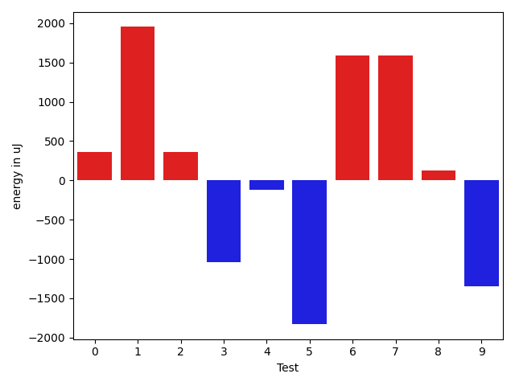

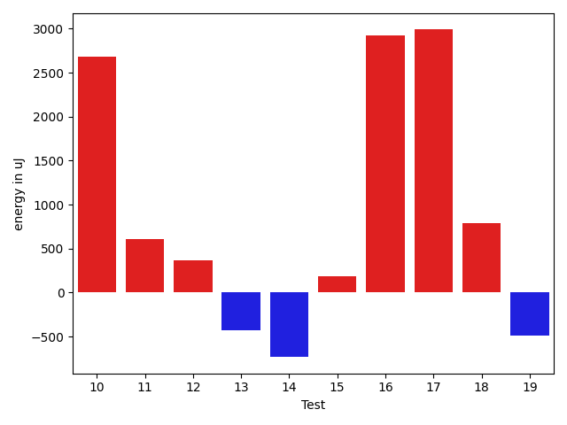

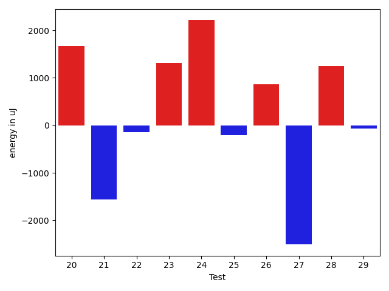

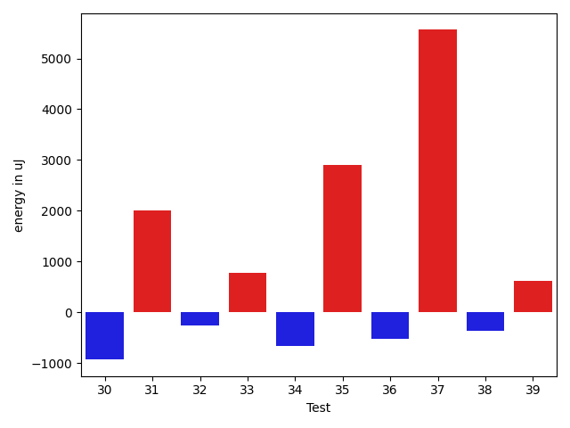

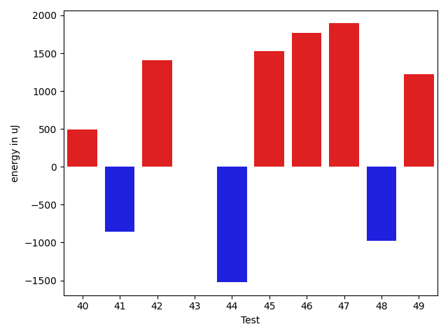

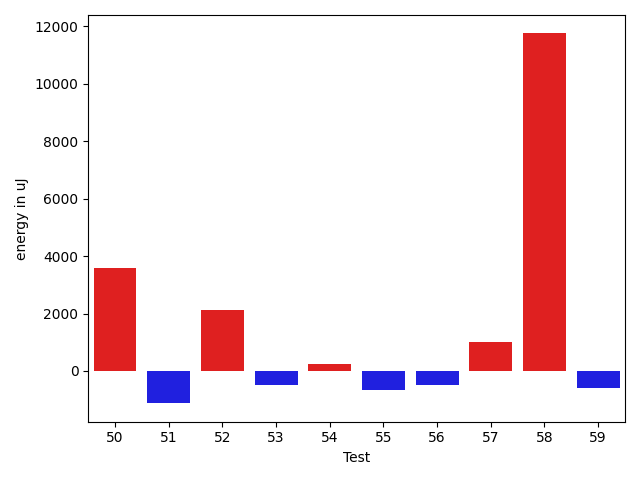

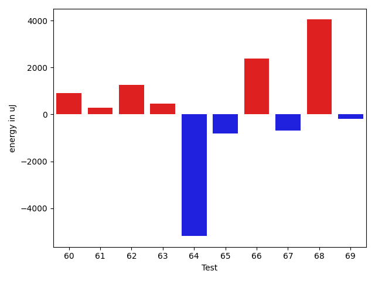

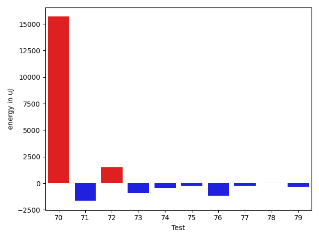

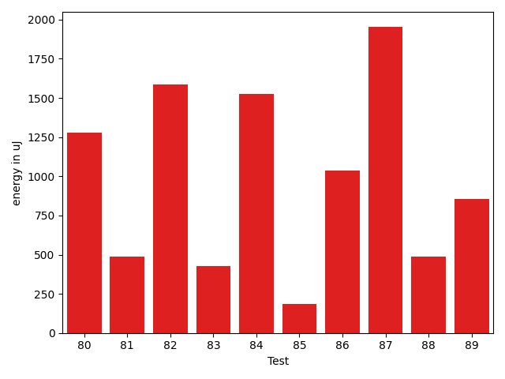

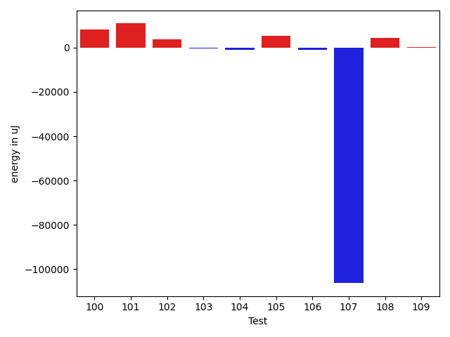

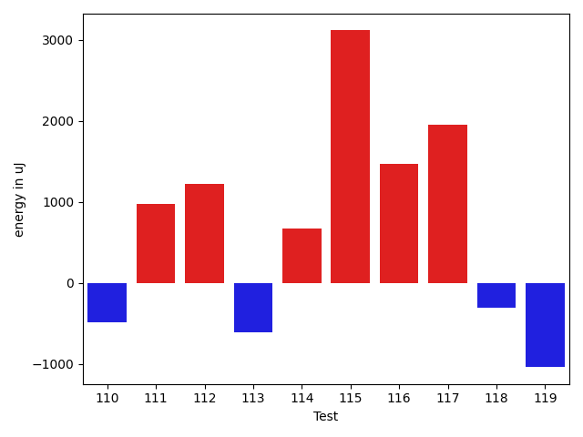

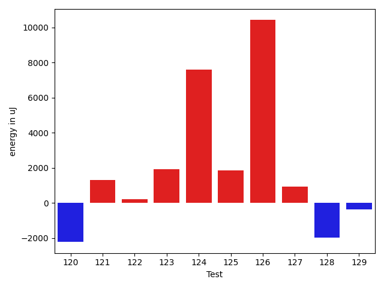

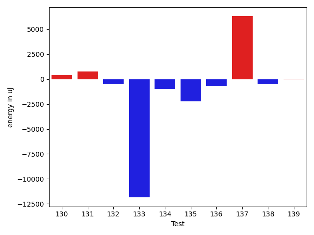

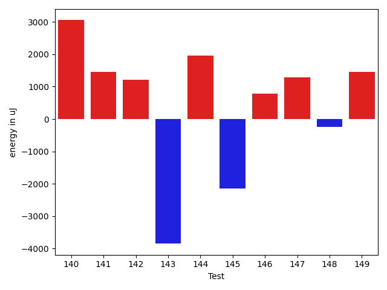

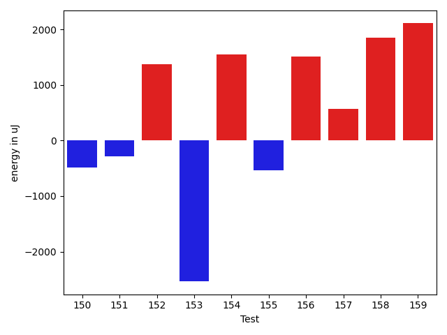

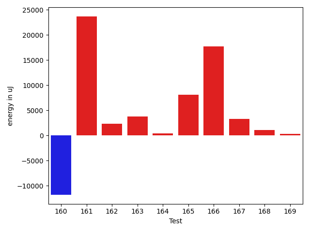

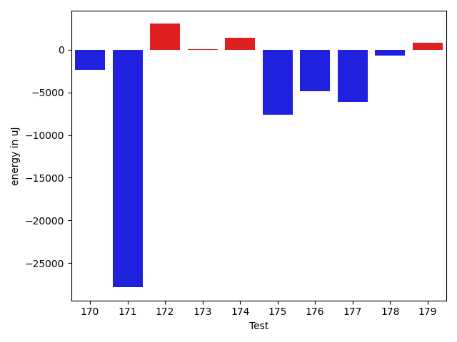

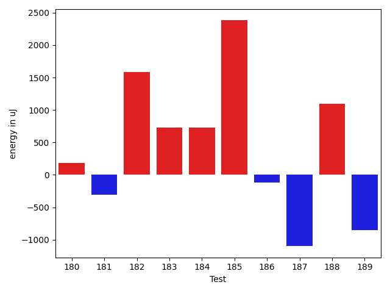

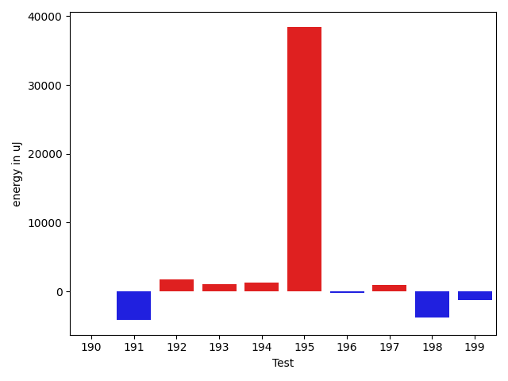

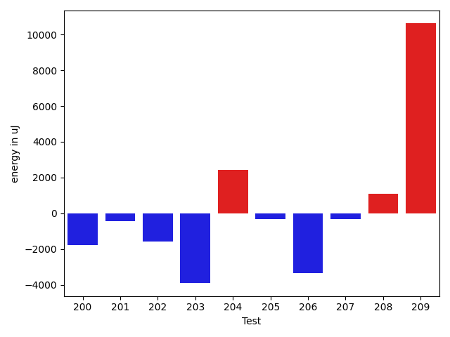

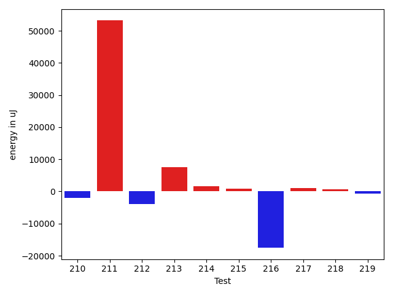

| ID | EnergyV1 | EnergyV2 | DeltaEnergy | σV1 | σV2 |
| --- | --- | --- | --- | --- | --- |
| 0 | 37231 | 37597 | 366 | 8073.019539672495 | 3950.8358410392398 |
| 1 | 36438 | 38391 | 1953 | 2675.3524878520316 | 3107.112844682638 |
| 2 | 35950 | 36316 | 366 | 3873.2635651426726 | 2983.024095808286 |
| 3 | 39062 | 38024 | -1038 | 4587.541270295742 | 4648.14990854577 |
| 4 | 38208 | 38085 | -123 | 3988.957249008014 | 4567.762030233597 |
| 5 | 38513 | 36682 | -1831 | 4593.580716877536 | 3732.362257231255 |
| 6 | 37048 | 38635 | 1587 | 3624.3424695708177 | 3129.034269077875 |
| 7 | 34057 | 35644 | 1587 | 4143.259954297931 | 3880.4098062527896 |
| 8 | 36560 | 36682 | 122 | 4298.27124580096 | 3463.031120739442 |
| 9 | 37964 | 36621 | -1343 | 4360.414288279509 | 3871.5483839013154 |
| 10 | 37293 | 39978 | 2685 | 3291.1667757945283 | 24913.694211899277 |
| 11 | 38208 | 38818 | 610 | 3946.194389535315 | 4294.623380413215 |
| 12 | 36927 | 37293 | 366 | 3665.0093239216844 | 4500.164907031318 |
| 13 | 34790 | 34362 | -428 | 2771.7390422620956 | 3273.387651827355 |
| 14 | 36865 | 36132 | -733 | 4072.436843758292 | 36795.04634870572 |
| 15 | 37537 | 37720 | 183 | 3563.5053888882785 | 4136.407779167276 |
| 16 | 34180 | 37109 | 2929 | 3589.28970139687 | 3622.2506277175244 |
| 17 | 34424 | 37414 | 2990 | 3833.1725896495736 | 3353.4456005063744 |
| 18 | 35095 | 35889 | 794 | 4758.768239319452 | 3711.8936893781956 |
| 19 | 39245 | 38757 | -488 | 34750.33090406049 | 16444.925806923697 |
| 20 | 36133 | 38391 | 2258 | 4072.345883116455 | 5112.382989526237 |
| 21 | 38025 | 35523 | -2502 | 3117.2536855268218 | 4548.79888844297 |
| 22 | 33325 | 33447 | 122 | 4525.219053744802 | 3961.6547579329313 |
| 23 | 35766 | 37964 | 2198 | 3153.9726690221614 | 3584.6491886313725 |
| 24 | 38879 | 40283 | 1404 | 3965.771494073994 | 3268.353776469626 |
| 25 | 38208 | 37780 | -428 | 4321.273495920295 | 4091.652399138019 |
| 26 | 35827 | 36865 | 1038 | 2612.754382800601 | 3661.0064784665637 |
| 27 | 37354 | 33935 | -3419 | 3212.287578937465 | 4974.77219746459 |
| 28 | 35400 | 37231 | 1831 | 3518.721687979929 | 3863.4437808126577 |
| 29 | 37110 | 37231 | 121 | 3947.488948191464 | 4228.506064360341 |
| 30 | 35584 | 35766 | 182 | 3449.024600188919 | 3698.807860881121 |
| 31 | 35462 | 38635 | 3173 | 3508.4733839315395 | 4831.518591058881 |
| 32 | 38330 | 37414 | -916 | 2816.860519709842 | 4336.808535255867 |
| 33 | 33996 | 35583 | 1587 | 3991.5873197028845 | 3492.7428863859996 |
| 34 | 38025 | 36133 | -1892 | 3398.7136001438057 | 5086.227078532769 |
| 35 | 34851 | 37842 | 2991 | 4539.183405516864 | 3604.1274013472084 |
| 36 | 36315 | 35827 | -488 | 3173.4399136919465 | 3901.515229989978 |
| 37 | 37414 | 36255 | -1159 | 3523.5520321785216 | 30369.385511184173 |
| 38 | 36743 | 35217 | -1526 | 4394.767039397937 | 4063.683853626192 |
| 39 | 37353 | 38757 | 1404 | 3745.0312794355427 | 4352.437120612874 |
| 40 | 36438 | 36927 | 489 | 3522.7872009037387 | 3342.2284174452675 |
| 41 | 36560 | 35705 | -855 | 4083.232871927651 | 2803.201847003052 |
| 42 | 36194 | 37598 | 1404 | 3414.2474371565654 | 4121.800976380214 |
| 43 | 38269 | 38269 | 0 | 3140.1307554941086 | 3204.472353193557 |
| 44 | 35583 | 34058 | -1525 | 4372.383908121518 | 4033.3995102611643 |
| 45 | 36194 | 37720 | 1526 | 3741.131985871961 | 3758.563266395818 |
| 46 | 35889 | 37658 | 1769 | 3629.2041553239205 | 4033.6365209737646 |
| 47 | 36071 | 37964 | 1893 | 3646.193117485688 | 4058.6153152699444 |
| 48 | 35705 | 34728 | -977 | 37171.17559568073 | 3299.695288437978 |
| 49 | 36316 | 37536 | 1220 | 3947.217373256195 | 3697.3499373938507 |
| 50 | 37109 | 41931 | 4822 | 3873.9339608895416 | 4388.6762522329645 |
| 51 | 37781 | 37475 | -306 | 3616.2432108474122 | 3671.122825210828 |
| 52 | 36254 | 37719 | 1465 | 2906.7035960956796 | 3480.914634477665 |
| 53 | 36438 | 36865 | 427 | 3522.4540293506866 | 4532.1867514479145 |
| 54 | 36743 | 36865 | 122 | 3885.9276999964886 | 3568.5670155370067 |
| 55 | 36621 | 36621 | 0 | 3633.7816268406423 | 3970.064731179361 |
| 56 | 38452 | 37353 | -1099 | 4210.730707312708 | 3867.679863606055 |
| 57 | 37048 | 37292 | 244 | 4393.065608370352 | 3140.6003100828207 |
| 58 | 42358 | 67443 | 25085 | 62338.271528297955 | 79128.09712158283 |
| 59 | 36927 | 37720 | 793 | 4217.293598937983 | 3681.766727458515 |
| 60 | 37841 | 38635 | 794 | 4633.231949840242 | 3875.5040521412516 |
| 61 | 39856 | 38575 | -1281 | 9718.93080962828 | 10783.336653979912 |
| 62 | 36926 | 37476 | 550 | 3849.263804160375 | 5256.401098070965 |
| 63 | 37964 | 38513 | 549 | 6030.389623353685 | 7631.905639760941 |
| 64 | 40466 | 41199 | 733 | 40588.92202105242 | 31348.51789384328 |
| 65 | 39917 | 39306 | -611 | 5085.2215958830675 | 4204.538999997308 |
| 66 | 37354 | 39184 | 1830 | 5096.746999642681 | 7154.0451523316515 |
| 67 | 39002 | 38819 | -183 | 4269.799238511113 | 3249.685366748163 |
| 68 | 40588 | 39489 | -1099 | 5759.505241338009 | 29039.505774726953 |
| 69 | 38147 | 38086 | -61 | 17376.33947157074 | 24076.405059952736 |
| 70 | 46631 | 62317 | 15686 | 20543.83549978287 | 25061.83510777461 |
| 71 | 38696 | 37048 | -1648 | 4663.775954841313 | 30441.141308888476 |
| 72 | 36560 | 38086 | 1526 | 3835.2703317964974 | 3738.6404056347315 |
| 73 | 38025 | 37109 | -916 | 3821.5631449379844 | 4151.009585794876 |
| 74 | 37231 | 36743 | -488 | 4468.024210920863 | 3884.6261264022673 |
| 75 | 36744 | 36499 | -245 | 3926.16473216958 | 4125.1566518550235 |
| 76 | 37719 | 36560 | -1159 | 4077.2129028977083 | 3797.7199687129378 |
| 77 | 37415 | 37171 | -244 | 3572.4781860775583 | 4392.335154090602 |
| 78 | 36743 | 36804 | 61 | 7543.131827457346 | 4161.584384300566 |
| 79 | 35889 | 35583 | -306 | 3163.12383675675 | 3769.2890374047997 |
| 80 | 37049 | 38330 | 1281 | 24725.524182839337 | 9942.115321110992 |
| 81 | 36743 | 37231 | 488 | 4084.056577471923 | 2805.172579371803 |
| 82 | 35766 | 37353 | 1587 | 8459.443271829585 | 15982.46123241347 |
| 83 | 36682 | 37110 | 428 | 5315.251624020878 | 9791.473120388164 |
| 84 | 38086 | 39612 | 1526 | 94947.96277223554 | 115554.65261414755 |
| 85 | 36315 | 36499 | 184 | 4962.361104225753 | 3860.2414807492987 |
| 86 | 35888 | 36926 | 1038 | 3873.6687817051607 | 4262.846228232442 |
| 87 | 35889 | 37841 | 1952 | 3253.826047401053 | 3731.0095677668983 |
| 88 | 37903 | 38391 | 488 | 4432.746495510449 | 3289.4086350539283 |
| 89 | 35523 | 36376 | 853 | 4471.78407738126 | 4005.065792910294 |
| 90 | 35766 | 35461 | -305 | 4667.70924793564 | 4037.2073374886972 |
| 91 | 36865 | 37231 | 366 | 4397.143058311283 | 3805.7061143165947 |
| 92 | 38269 | 37292 | -977 | 4291.072798649961 | 3168.4078940902377 |
| 93 | 36621 | 36560 | -61 | 3315.4090208006933 | 3652.258390295102 |
| 94 | 40222 | 41138 | 916 | 255666.79350810914 | 445915.98884339887 |
| 95 | 38086 | 38880 | 794 | 23230.92619508358 | 8517.013552580727 |
| 96 | 39734 | 39063 | -671 | 7715.266674255354 | 7894.371475483799 |
| 97 | 39612 | 36377 | -3235 | 3924.722354214301 | 4091.7493107066325 |
| 98 | 38147 | 38269 | 122 | 6199.112813104134 | 5848.023828511463 |
| 99 | 37537 | 39001 | 1464 | 6406.065732465253 | 7911.113121170738 |
| 100 | 37964 | 39367 | 1403 | 23651.186209442883 | 42273.90288782587 |
| 101 | 64453 | 74523 | 10070 | 36922.370344449286 | 51519.9317954254 |
| 102 | 39123 | 39307 | 184 | 12626.688298210958 | 19355.460483854957 |
| 103 | 38513 | 38330 | -183 | 7724.695901943327 | 7521.7200670368675 |
| 104 | 39368 | 38208 | -1160 | 3997.829420675369 | 3971.6818749184276 |
| 105 | 79101 | 79956 | 855 | 55806.145572456575 | 58553.15761544721 |
| 106 | 38513 | 38086 | -427 | 2946.6885300848026 | 3713.3576946774247 |
| 107 | 84412 | 76172 | -8240 | 368784.6641461823 | 57697.50889705828 |
| 108 | 37903 | 38575 | 672 | 4334.09084096877 | 23506.316681867127 |
| 109 | 38941 | 38635 | -306 | 4250.202123209488 | 3480.3546276574593 |
| 110 | 84961 | 84472 | -489 | 240164.29131141247 | 341208.96730737604 |
| 111 | 71716 | 72692 | 976 | 21522.862362252446 | 23279.06493510289 |
| 112 | 37170 | 38391 | 1221 | 24974.866720738177 | 12813.832892614288 |
| 113 | 39306 | 38696 | -610 | 4078.6892132420116 | 4275.549047888429 |
| 114 | 38574 | 39245 | 671 | 28162.80681828957 | 27841.764824801357 |
| 115 | 36071 | 39184 | 3113 | 4721.458282141229 | 4371.775710773155 |
| 116 | 41320 | 42786 | 1466 | 21827.930863409332 | 28180.485823034036 |
| 117 | 37414 | 39368 | 1954 | 4176.89019111576 | 4121.016222460464 |
| 118 | 38086 | 37781 | -305 | 3924.8706147705034 | 4246.339335839994 |
| 119 | 39917 | 38879 | -1038 | 3647.108644263194 | 3765.7684068026324 |
| 120 | 38635 | 39123 | 488 | 12979.606956327327 | 7568.389747111788 |
| 121 | 38513 | 38086 | -427 | 4445.649074247543 | 3874.8858650443085 |
| 122 | 36316 | 37048 | 732 | 3544.4990177144714 | 3876.0537045858036 |
| 123 | 36621 | 38269 | 1648 | 3544.75637085719 | 3853.3350721488714 |
| 124 | 111266 | 116028 | 4762 | 21356.777015718744 | 27253.02191950323 |
| 125 | 37536 | 38208 | 672 | 3129.2727293268517 | 4354.622256550524 |
| 126 | 36987 | 40589 | 3602 | 28370.92131979287 | 38613.90913159833 |
| 127 | 37537 | 38697 | 1160 | 3958.0744507935533 | 3721.2090275412315 |
| 128 | 39184 | 38330 | -854 | 3423.977963271744 | 3527.827772674113 |
| 129 | 36682 | 36437 | -245 | 3382.0323579764877 | 3582.7983735096964 |
| 130 | 35278 | 36194 | 916 | 3377.06756357803 | 4590.889947604975 |
| 131 | 36499 | 36926 | 427 | 5506.080055493199 | 7624.412724959067 |
| 132 | 37658 | 38269 | 611 | 3706.7703984992227 | 3641.964640746041 |
| 133 | 39002 | 36987 | -2015 | 45794.783347997196 | 3352.8633745790703 |
| 134 | 37903 | 36255 | -1648 | 2854.6241544238733 | 3259.608910503391 |
| 135 | 36743 | 36743 | 0 | 4248.490199479017 | 2427.0646075815534 |
| 136 | 36559 | 36927 | 368 | 3068.11209422255 | 3959.362344357112 |
| 137 | 37842 | 39856 | 2014 | 14109.86615226264 | 23022.18319721437 |
| 138 | 36133 | 36499 | 366 | 3545.3663241657578 | 3890.7396583283353 |
| 139 | 36987 | 35401 | -1586 | 3040.5804023888277 | 4835.665077948818 |
| 140 | 63355 | 66407 | 3052 | 16379.808593373598 | 14307.56591710212 |
| 141 | 31921 | 33386 | 1465 | 885.0 | 811.4562141606903 |
| 142 | 31738 | 32959 | 1221 | 0.0 | 1064.4250404169693 |
| 143 | 36194 | 32348 | -3846 | 0.0 | 806.6979332783466 |
| 144 | 116760 | 118713 | 1953 | 31405.060482755292 | 30299.163168246938 |
| 145 | 240783 | 238647 | -2136 | 544303.277934854 | 466386.96454959246 |
| 146 | 38513 | 39306 | 793 | 8547.278749557941 | 16974.150936617312 |
| 147 | 37475 | 38757 | 1282 | 4064.4163723419374 | 6698.405139949219 |
| 148 | 40893 | 40649 | -244 | 21248.270308130257 | 19128.372311110674 |
| 149 | 38635 | 40100 | 1465 | 4464.8997793564795 | 3627.7356144406094 |
| 150 | 38696 | 38269 | -427 | 3509.0239718299345 | 4094.57719123721 |
| 151 | 38269 | 38208 | -61 | 3749.4683283849895 | 3851.6750836486713 |
| 152 | 36621 | 37902 | 1281 | 4117.611053354069 | 4622.0911016923665 |
| 153 | 39306 | 36132 | -3174 | 4966.162586971623 | 3752.8050009293047 |
| 154 | 40161 | 40405 | 244 | 19430.35227016673 | 19419.456590502203 |
| 155 | 37292 | 35766 | -1526 | 4064.0091977015463 | 3034.982233846405 |
| 156 | 36010 | 37964 | 1954 | 3913.1480472887806 | 3778.2694821535897 |
| 157 | 38879 | 39001 | 122 | 4233.753223493077 | 2525.0350558439773 |
| 158 | 34851 | 39124 | 4273 | 5088.800163834106 | 3044.897352949685 |
| 159 | 36316 | 41077 | 4761 | 3466.5502777837173 | 4332.4224071043955 |
| 160 | 41748 | 39063 | -2685 | 48861.65175965136 | 4756.096534819359 |
| 161 | 40710 | 44067 | 3357 | 32553.838958186723 | 47528.33771523399 |
| 162 | 40405 | 41077 | 672 | 5024.347199449124 | 2937.7582200336024 |
| 163 | 39795 | 38330 | -1465 | 4410.707419395272 | 27471.604427895607 |
| 164 | 38086 | 37903 | -183 | 3562.238246022937 | 6019.126007647766 |
| 165 | 40405 | 38452 | -1953 | 4292.51296379856 | 55875.446446436305 |
| 166 | 39612 | 40161 | 549 | 92058.03380898845 | 121976.65210706726 |
| 167 | 81237 | 79040 | -2197 | 370595.48384009843 | 395861.8834478321 |
| 168 | 39917 | 42236 | 2319 | 18940.42094288696 | 22348.141480114176 |
| 169 | 38025 | 39062 | 1037 | 6064.139869817487 | 6191.899595056437 |
| 170 | 41442 | 40039 | -1403 | 12472.625673562752 | 8529.395351366788 |
| 171 | 39429 | 39917 | 488 | 129739.78565928251 | 95350.30245396218 |
| 172 | 69580 | 71960 | 2380 | 24698.738328863055 | 25736.35620531516 |
| 173 | 38513 | 38818 | 305 | 3839.034594959976 | 3976.5852122178567 |
| 174 | 39612 | 39307 | -305 | 12575.440670701913 | 16282.622236097888 |
| 175 | 40650 | 39550 | -1100 | 61645.968486670565 | 50276.71846601733 |
| 176 | 37964 | 39062 | 1098 | 121035.72808032432 | 106589.31816770736 |
| 177 | 38940 | 39612 | 672 | 35844.07024044445 | 18173.762335087762 |
| 178 | 36805 | 36987 | 182 | 4271.966444083451 | 3579.8690833581263 |
| 179 | 37232 | 37780 | 548 | 3825.5189986948176 | 4033.784939228963 |
| 180 | 36621 | 36804 | 183 | 4189.595702380873 | 3844.6279432995852 |
| 181 | 37353 | 37048 | -305 | 15885.247496182968 | 22698.733978845776 |
| 182 | 35461 | 37048 | 1587 | 26477.1468071918 | 4119.3593624607975 |
| 183 | 37658 | 38391 | 733 | 3891.777406187351 | 4000.3675733890036 |
| 184 | 36865 | 37597 | 732 | 3512.5819766464074 | 3700.0371413676376 |
| 185 | 36194 | 38574 | 2380 | 8137.524973502385 | 9949.46354700915 |
| 186 | 38391 | 38269 | -122 | 3835.3777291499614 | 3860.151991250546 |
| 187 | 37476 | 36377 | -1099 | 4616.926670242879 | 3632.3562730925164 |
| 188 | 36011 | 37109 | 1098 | 3648.3280132845794 | 3539.573135898593 |
| 189 | 39977 | 39123 | -854 | 3862.6814924997375 | 2951.320048334445 |
| 190 | 37720 | 36621 | -1099 | 2804.0903141660756 | 5124.117994855955 |
| 191 | 39855 | 39368 | -487 | 40166.26163116839 | 28161.48369873558 |
| 192 | 38574 | 38574 | 0 | 10784.142146218386 | 13809.083757774244 |
| 193 | 37353 | 38879 | 1526 | 4027.5246908784384 | 4445.2164576648 |
| 194 | 39306 | 39123 | -183 | 7323.76126936257 | 9568.248660843416 |
| 195 | 45532 | 45532 | 0 | 434018.3958043131 | 500511.31890845817 |
| 196 | 38574 | 37903 | -671 | 6322.929657555903 | 6245.825501461515 |
| 197 | 37537 | 37781 | 244 | 4123.017851939482 | 9232.143013583785 |
| 198 | 39733 | 40954 | 1221 | 47419.92161736692 | 38593.48217259489 |
| 199 | 37720 | 36865 | -855 | 4471.504348936702 | 4008.7183828081966 |
| 200 | 39123 | 37354 | -1769 | 3382.4459176895457 | 31497.34692752158 |
| 201 | 39733 | 39307 | -426 | 109139.01078439932 | 40522.4324512246 |
| 202 | 40222 | 38635 | -1587 | 19901.89403116642 | 4110.954634500413 |
| 203 | 40771 | 36865 | -3906 | 3982.112940067825 | 3769.1224713561155 |
| 204 | 418823 | 421263 | 2440 | 138779.8688083727 | 133596.12903490625 |
| 205 | 40344 | 40039 | -305 | 45336.97860045488 | 51841.94199115209 |
| 206 | 41992 | 38635 | -3357 | 52532.66338530324 | 45274.26443711481 |
| 207 | 39612 | 39306 | -306 | 3680.9968699615415 | 4313.591676057796 |
| 208 | 36987 | 38085 | 1098 | 3551.8054426582867 | 4087.4221169887724 |
| 209 | 157775 | 168395 | 10620 | 57374.28111123056 | 52984.54354300858 |
| 210 | 39184 | 36804 | -2380 | 6407.46452800811 | 6028.351469486351 |
| 211 | 39734 | 42785 | 3051 | 88600.66144821179 | 138304.32749037174 |
| 212 | 41992 | 36560 | -5432 | 4396.406915379361 | 4506.84923158289 |
| 213 | 40222 | 38940 | -1282 | 16751.69114542839 | 33937.19688026244 |
| 214 | 39551 | 40955 | 1404 | 26518.47696140183 | 26391.426791812526 |
| 215 | 39367 | 39734 | 367 | 10754.61736390783 | 11216.228839844305 |
| 216 | 43030 | 38879 | -4151 | 54626.73894342196 | 33072.954792338285 |
| 217 | 38696 | 38513 | -183 | 6218.321291956537 | 5587.420068009921 |
| 218 | 40039 | 39612 | -427 | 16028.91857999415 | 23955.259313259845 |
| 219 | 37109 | 37780 | 671 | 5602.407562229229 | 6482.390851749109 |
| 220 | 39490 | 39001 | -489 | 29314.991561253926 | 31446.33064212237 |
| 221 | 37903 | 38086 | 183 | 3913.8959006148348 | 4348.134584507503 |
| 222 | 36682 | 38757 | 2075 | 3639.418154571762 | 3632.7669272423755 |
| 223 | 37231 | 37231 | 0 | 4213.520521158471 | 4121.307526643294 |
| 224 | 38086 | 40222 | 2136 | 4021.7812090332977 | 3689.701224563205 |
| 225 | 39245 | 41321 | 2076 | 23473.1231660313 | 36088.56082257781 |
| 226 | 39429 | 38452 | -977 | 4526.338031150845 | 3766.97875563108 |

## Delta Duration per test method

| ID | DurationV1 | DurationsV2 | DeltaDuration |
| --- | --- | --- | --- |
| 0 | 921555.509090909 | 847121.4 | -74434.10909090901 |
| 1 | 369726.8823529412 | 371311.28571428574 | 1584.4033613445354 |
| 2 | 345278.1666666667 | 341435.55555555556 | -3842.611111111124 |
| 3 | 438537.4666666667 | 415353.86363636365 | -23183.603030303027 |
| 4 | 674708.8888888889 | 627873.1875 | -46835.701388888876 |
| 5 | 476257.3703703704 | 473254.2962962963 | -3003.074074074102 |
| 6 | 413166.5714285714 | 435110.8947368421 | 21944.323308270657 |
| 7 | 370499.6 | 341911.7272727273 | -28587.872727272683 |
| 8 | 356096.9090909091 | 378301.5 | 22204.590909090883 |
| 9 | 417473.1666666667 | 423720.44444444444 | 6247.277777777752 |
| 10 | 509854.0625 | 615715.8461538461 | 105861.78365384613 |
| 11 | 484303.0 | 404723.14285714284 | -79579.85714285716 |
| 12 | 511286.06451612903 | 503949.7619047619 | -7336.302611367137 |
| 13 | 418145.44 | 406254.5 | -11890.940000000002 |
| 14 | 419542.88 | 682489.0434782609 | 262946.16347826086 |
| 15 | 495893.6111111111 | 519793.63333333336 | 23900.022222222236 |
| 16 | 403779.64705882355 | 386381.3 | -17398.347058823565 |
| 17 | 364671.28571428574 | 343609.2 | -21062.085714285728 |
| 18 | 392584.4666666667 | 430481.82352941175 | 37897.35686274507 |
| 19 | 1352674.1707317072 | 999674.0606060605 | -353000.1101256467 |
| 20 | 452116.36363636365 | 800276.4166666666 | 348160.053030303 |
| 21 | 431991.2916666667 | 453081.1 | 21089.80833333329 |
| 22 | 389392.5 | 350417.3157894737 | -38975.18421052629 |
| 23 | 362606.71428571426 | 365270.3888888889 | 2663.674603174615 |
| 24 | 479005.44444444444 | 438098.5714285714 | -40906.87301587302 |
| 25 | 577625.0555555555 | 555159.1515151515 | -22465.904040404013 |
| 26 | 449987.0625 | 382163.4761904762 | -67823.58630952379 |
| 27 | 348089.21428571426 | 786442.5833333334 | 438353.3690476191 |
| 28 | 435985.38095238095 | 426103.65 | -9881.730952380924 |
| 29 | 398024.125 | 403992.8823529412 | 5968.757352941204 |
| 30 | 482375.0416666667 | 472135.3461538461 | -10239.695512820559 |
| 31 | 651066.5675675676 | 639411.1111111111 | -11655.45645645645 |
| 32 | 617698.5 | 391914.5789473684 | -225783.92105263157 |
| 33 | 440617.7826086957 | 470988.8 | 30371.01739130431 |
| 34 | 427153.3888888889 | 394201.12 | -32952.26888888888 |
| 35 | 439771.7894736842 | 423607.52173913043 | -16164.267734553781 |
| 36 | 420729.5294117647 | 417174.75 | -3554.779411764699 |
| 37 | 461204.0714285714 | 693004.6538461539 | 231800.58241758245 |
| 38 | 484183.6818181818 | 518180.13333333336 | 33996.45151515154 |
| 39 | 521003.55555555556 | 550724.5 | 29720.944444444438 |
| 40 | 464799.0967741936 | 475454.5 | 10655.403225806425 |
| 41 | 375954.0 | 344529.1818181818 | -31424.818181818177 |
| 42 | 357175.07692307694 | 352636.3333333333 | -4538.743589743623 |
| 43 | 498484.44 | 470046.0 | -28438.440000000002 |
| 44 | 389852.8 | 406665.4375 | 16812.63750000001 |
| 45 | 385186.0714285714 | 438012.05 | 52825.97857142857 |
| 46 | 361685.0714285714 | 360684.3888888889 | -1000.6825396825443 |
| 47 | 444159.1666666667 | 449027.1875 | 4868.020833333314 |
| 48 | 702052.7916666666 | 466477.1176470588 | -235575.67401960783 |
| 49 | 448145.7272727273 | 428981.60869565216 | -19164.118577075133 |
| 50 | 516792.77777777775 | 434863.77777777775 | -81929.0 |
| 51 | 385560.73333333334 | 380075.2631578947 | -5485.470175438619 |
| 52 | 410111.3333333333 | 391312.36842105264 | -18798.964912280673 |
| 53 | 348141.0833333333 | 372578.5 | 24437.416666666686 |
| 54 | 553853.64 | 540499.2692307692 | -13354.370769230765 |
| 55 | 479876.61904761905 | 436355.2173913043 | -43521.40165631473 |
| 56 | 396996.94444444444 | 360891.5625 | -36105.38194444444 |
| 57 | 395483.35294117645 | 351017.6153846154 | -44465.73755656107 |
| 58 | 2014022.1818181819 | 2200637.9696969697 | 186615.78787878784 |
| 59 | 901691.7931034482 | 924360.393442623 | 22668.600339174736 |
| 60 | 834699.9285714285 | 865531.0 | 30831.07142857148 |
| 61 | 1105321.3255813953 | 1177946.2666666666 | 72624.9410852713 |
| 62 | 859908.6111111111 | 879542.2363636363 | 19633.625252525206 |
| 63 | 860024.5652173914 | 895669.7272727273 | 35645.16205533594 |
| 64 | 1585617.8727272728 | 1442358.0714285714 | -143259.80129870144 |
| 65 | 743871.7954545454 | 788677.4102564103 | 44805.61480186484 |
| 66 | 754540.7209302326 | 838964.08 | 84423.35906976741 |
| 67 | 600188.3333333334 | 624164.0857142857 | 23975.752380952355 |
| 68 | 794252.625 | 1089591.34 | 295338.7150000001 |
| 69 | 1237296.6184210526 | 1234029.3194444445 | -3267.2989766080864 |
| 70 | 1852257.2222222222 | 1859678.4795918367 | 7421.257369614439 |
| 71 | 575105.0 | 794805.0 | 219700.0 |
| 72 | 526766.304347826 | 534776.6363636364 | 8010.3320158103015 |
| 73 | 512984.5238095238 | 545126.2307692308 | 32141.706959706964 |
| 74 | 699586.45 | 676852.1458333334 | -22734.30416666658 |
| 75 | 333652.8181818182 | 341015.25 | 7362.4318181818235 |
| 76 | 643802.8888888889 | 669184.8275862068 | 25381.938697317964 |
| 77 | 553180.2 | 496920.1304347826 | -56260.06956521736 |
| 78 | 862222.88 | 791988.8666666667 | -70234.0133333333 |
| 79 | 436866.8275862069 | 459201.3 | 22334.47241379309 |
| 80 | 1211344.4333333333 | 1146664.8352941177 | -64679.59803921566 |
| 81 | 873674.4516129033 | 903578.3620689656 | 29903.910456062295 |
| 82 | 933613.9677419355 | 1034849.0535714285 | 101235.08582949301 |
| 83 | 1020433.4285714285 | 1044611.0185185185 | 24177.58994709002 |
| 84 | 1494729.6304347827 | 2103232.3157894737 | 608502.685354691 |
| 85 | 768542.8541666666 | 766938.1739130435 | -1604.6802536231698 |
| 86 | 579650.3214285715 | 596801.1333333333 | 17150.811904761824 |
| 87 | 573466.0384615385 | 548002.3103448276 | -25463.728116710903 |
| 88 | 767100.1379310344 | 608462.2142857143 | -158637.92364532012 |
| 89 | 490788.0344827586 | 484021.1052631579 | -6766.929219600686 |
| 90 | 468246.1666666667 | 532565.1578947369 | 64318.99122807017 |
| 91 | 544008.5357142857 | 536750.4117647059 | -7258.123949579778 |
| 92 | 1037845.4615384615 | 456923.8333333333 | -580921.6282051282 |
| 93 | 414474.7272727273 | 390265.9411764706 | -24208.786096256692 |
| 94 | 2280234.2535211267 | 3996154.6125 | 1715920.3589788731 |
| 95 | 1128420.6419753085 | 1183668.2 | 55247.55802469142 |
| 96 | 997641.126984127 | 1026956.8205128205 | 29315.69352869352 |
| 97 | 808896.5862068966 | 973858.2807017544 | 164961.6944948578 |
| 98 | 992221.1571428571 | 1085842.8214285714 | 93621.66428571427 |
| 99 | 1140964.6179775281 | 1243009.2413793104 | 102044.62340178224 |
| 100 | 1218873.1025641025 | 1491150.8860759493 | 272277.7835118468 |
| 101 | 2089814.5151515151 | 2382388.1414141413 | 292573.62626262615 |
| 102 | 1202609.9487179487 | 1353484.5394736843 | 150874.59075573552 |
| 103 | 1069780.7875 | 1131586.892857143 | 61806.105357142864 |
| 104 | 673446.4074074074 | 608618.6 | -64827.80740740744 |
| 105 | 2437706.0545454547 | 2606470.338235294 | 168764.2836898393 |
| 106 | 609872.9666666667 | 595320.304347826 | -14552.662318840623 |
| 107 | 5763533.542857143 | 2318549.9838709678 | -3444983.5589861753 |
| 108 | 621113.4347826086 | 747938.8076923077 | 126825.3729096991 |
| 109 | 859528.425925926 | 831930.0701754387 | -27598.355750487302 |
| 110 | 3517771.3636363638 | 4225787.01010101 | 708015.6464646463 |
| 111 | 2031236.9090909092 | 2041719.8453608248 | 10482.936269915663 |
| 112 | 1210471.5569620254 | 1116203.775 | -94267.78196202544 |
| 113 | 551853.4814814815 | 692774.5294117647 | 140921.04793028324 |
| 114 | 1001090.2727272727 | 877743.3478260869 | -123346.92490118579 |
| 115 | 574395.35 | 557803.8571428572 | -16591.492857142817 |
| 116 | 992921.0555555555 | 983899.9583333334 | -9021.097222222132 |
| 117 | 744829.8205128205 | 745245.8333333334 | 416.01282051287126 |
| 118 | 737759.4042553192 | 730275.5510204082 | -7483.853234910988 |
| 119 | 595645.9032258064 | 635742.5277777778 | 40096.62455197133 |
| 120 | 768003.7037037037 | 703900.0 | -64103.70370370371 |
| 121 | 477964.8888888889 | 447434.04761904763 | -30530.841269841243 |
| 122 | 777841.2075471698 | 778015.9666666667 | 174.75911949691363 |
| 123 | 822711.1458333334 | 796729.0535714285 | -25982.09226190485 |
| 124 | 3278395.595959596 | 3302646.202020202 | 24250.606060605962 |
| 125 | 637146.5757575758 | 638559.1212121212 | 1412.5454545454122 |
| 126 | 951220.2 | 1330965.4333333333 | 379745.2333333334 |
| 127 | 783960.4629629629 | 810116.1929824562 | 26155.73001949326 |
| 128 | 392547.6666666667 | 471960.04761904763 | 79412.38095238095 |
| 129 | 564531.68 | 545718.7741935484 | -18812.905806451687 |
| 130 | 698792.0487804879 | 705854.8 | 7062.751219512196 |
| 131 | 782545.35 | 784776.0192307692 | 2230.669230769272 |
| 132 | 435758.7727272727 | 488501.44444444444 | 52742.67171717173 |
| 133 | 706175.7 | 456959.5 | -249216.19999999995 |
| 134 | 462503.724137931 | 510611.6666666667 | 48107.94252873567 |
| 135 | 510025.2105263158 | 474297.625 | -35727.58552631579 |
| 136 | 435074.0 | 445721.8695652174 | 10647.869565217406 |
| 137 | 1037967.8297872341 | 1194833.619047619 | 156865.78926038486 |
| 138 | 591172.7419354839 | 635460.7666666667 | 44288.02473118284 |
| 139 | 388333.29411764705 | 408764.0 | 20430.70588235295 |
| 140 | 2826031.3333333335 | 2767738.8333333335 | -58292.5 |
| 141 | 964480.0 | 902148.25 | -62331.75 |
| 142 | 1083198.0 | 950543.6666666666 | -132654.33333333337 |
| 143 | 721654.0 | 672154.0 | -49500.0 |
| 144 | 3555043.0606060605 | 3559123.3131313133 | 4080.2525252527557 |
| 145 | 10884398.373737374 | 9929690.121212121 | -954708.2525252532 |
| 146 | 1216171.8313253012 | 1263788.423076923 | 47616.5917516218 |
| 147 | 940951.6567164179 | 933860.8947368421 | -7090.761979575735 |
| 148 | 1604523.6382978724 | 1496045.6736842105 | -108477.96461366187 |
| 149 | 843180.6304347826 | 849524.3170731707 | 6343.686638388084 |
| 150 | 817909.4130434783 | 763587.4375 | -54321.97554347827 |
| 151 | 356647.76923076925 | 440022.25 | 83374.48076923075 |
| 152 | 449919.7368421053 | 500560.3125 | 50640.57565789472 |
| 153 | 363087.92307692306 | 443492.1875 | 80404.26442307694 |
| 154 | 977748.09375 | 1148864.1041666667 | 171116.01041666674 |
| 155 | 403093.3157894737 | 418068.6153846154 | 14975.299595141667 |
| 156 | 399274.4 | 461167.9130434783 | 61893.51304347825 |
| 157 | 419713.2272727273 | 439945.4736842105 | 20232.24641148321 |
| 158 | 376209.54545454547 | 427039.55 | 50830.00454545452 |
| 159 | 441222.0 | 465598.3333333333 | 24376.333333333314 |
| 160 | 786723.3157894737 | 428239.23076923075 | -358484.08502024296 |
| 161 | 754068.0666666667 | 1950795.7333333334 | 1196727.6666666667 |
| 162 | 390710.85714285716 | 420963.125 | 30252.26785714284 |
| 163 | 590903.0869565217 | 699306.4375 | 108403.35054347827 |
| 164 | 543414.0357142857 | 645281.1290322581 | 101867.09331797238 |
| 165 | 574235.9230769231 | 971925.0 | 397689.0769230769 |
| 166 | 1496632.5454545454 | 2347389.4137931033 | 850756.8683385579 |
| 167 | 4641743.808080808 | 4569435.292929293 | -72308.5151515156 |
| 168 | 1456742.7078651686 | 1490844.3483146068 | 34101.640449438244 |
| 169 | 951845.4615384615 | 962996.5614035088 | 11151.099865047261 |
| 170 | 926484.804347826 | 923183.9318181818 | -3300.8725296442863 |
| 171 | 2628312.274509804 | 1692542.0208333333 | -935770.2536764706 |
| 172 | 1910095.4545454546 | 2022172.6363636365 | 112077.18181818188 |
| 173 | 806375.8235294118 | 736228.756097561 | -70147.06743185082 |
| 174 | 1329294.0875 | 1221223.9285714286 | -108070.15892857127 |
| 175 | 1810138.6440677966 | 1425839.6923076923 | -384298.9517601044 |
| 176 | 1849976.0263157894 | 1768437.6764705882 | -81538.34984520124 |
| 177 | 1282508.8775510204 | 895332.0731707317 | -387176.8043802887 |
| 178 | 694933.575 | 608471.9310344828 | -86461.64396551717 |
| 179 | 507406.25 | 475691.6818181818 | -31714.568181818177 |
| 180 | 614003.6923076923 | 588721.12 | -25282.57230769226 |
| 181 | 1182816.357142857 | 1062926.0163934426 | -119890.3407494144 |
| 182 | 652771.8636363636 | 402295.23529411765 | -250476.628342246 |
| 183 | 493827.3793103448 | 516118.625 | 22291.24568965519 |
| 184 | 798898.9629629629 | 491205.8 | -307693.16296296293 |
| 185 | 945491.175 | 790985.5833333334 | -154505.59166666667 |
| 186 | 478683.4117647059 | 436664.3333333333 | -42019.07843137259 |
| 187 | 497577.36 | 494895.1153846154 | -2682.2446153846104 |
| 188 | 484676.90476190473 | 470204.2916666667 | -14472.613095238048 |
| 189 | 508837.375 | 473914.8947368421 | -34922.48026315792 |
| 190 | 455323.3 | 344623.04545454547 | -110700.25454545452 |
| 191 | 1286204.267857143 | 1134051.0344827587 | -152153.23337438423 |
| 192 | 1205224.4625 | 1256387.6710526317 | 51163.20855263178 |
| 193 | 871135.8679245283 | 843651.7192982456 | -27484.148626282695 |
| 194 | 1034350.46875 | 1046060.0298507463 | 11709.561100746272 |
| 195 | 4596440.783783784 | 5477700.094594595 | 881259.3108108109 |
| 196 | 786207.46 | 794476.9130434783 | 8269.453043478308 |
| 197 | 883890.5423728813 | 931973.375 | 48082.83262711868 |
| 198 | 1394620.5094339622 | 1326876.46 | -67744.04943396221 |
| 199 | 710484.0967741936 | 824801.1470588235 | 114317.05028462992 |
| 200 | 587056.4615384615 | 785110.0571428571 | 198053.5956043956 |
| 201 | 2444961.210526316 | 782595.4444444445 | -1662365.7660818715 |
| 202 | 632087.8888888889 | 468641.8823529412 | -163446.00653594767 |
| 203 | 536281.6153846154 | 471189.90476190473 | -65091.71062271064 |
| 204 | 11665389.414141415 | 11795911.747474747 | 130522.33333333209 |
| 205 | 1774051.1235955057 | 1945212.8588235294 | 171161.73522802372 |
| 206 | 1508733.177777778 | 1170426.8529411764 | -338306.3248366015 |
| 207 | 632882.5666666667 | 656794.1142857143 | 23911.54761904769 |
| 208 | 903422.3448275862 | 668647.8285714285 | -234774.51625615766 |
| 209 | 4903475.181818182 | 5087002.353535353 | 183527.17171717156 |
| 210 | 803388.659574468 | 890670.8867924528 | 87282.22721798474 |
| 211 | 1611517.448275862 | 3770366.193548387 | 2158848.7452725247 |
| 212 | 541281.2608695652 | 659882.5217391305 | 118601.2608695653 |
| 213 | 1082169.4642857143 | 1409191.619047619 | 327022.1547619046 |
| 214 | 1173045.44 | 1199833.98 | 26788.540000000037 |
| 215 | 997519.0169491526 | 1117583.8392857143 | 120064.82233656175 |
| 216 | 1632994.5 | 1099041.6363636365 | -533952.8636363635 |
| 217 | 820922.4333333333 | 805310.74 | -15611.693333333358 |
| 218 | 877806.0571428571 | 816230.3513513514 | -61575.70579150575 |
| 219 | 882930.4126984127 | 919087.7966101695 | 36157.3839117568 |
| 220 | 1081122.5 | 1202950.8679245282 | 121828.3679245282 |
| 221 | 930528.15625 | 967161.96875 | 36633.8125 |
| 222 | 674412.4285714285 | 701119.0256410256 | 26706.597069597105 |
| 223 | 806913.3793103448 | 864325.7083333334 | 57412.32902298856 |
| 224 | 553184.0 | 509824.52777777775 | -43359.47222222225 |
| 225 | 981527.641509434 | 1444607.857142857 | 463080.21563342307 |
| 226 | 685419.5945945946 | 695507.3255813953 | 10087.730986800743 |

## Misc.

| ID | Test Class | Test Method |
| --- | --- | --- |
| 0 | com.google.gson.functional.PrimitiveTest | testDeserializePrimitiveWrapperAsObjectField |
| 1 | com.google.gson.functional.PrimitiveTest | testDeserializeJsonArrayAsNumber |
| 2 | com.google.gson.functional.PrimitiveTest | testDeserializeJsonArrayAsBigDecimal |
| 3 | com.google.gson.functional.PrimitiveTest | testBigDecimalPreservePrecisionDeserialization |
| 4 | com.google.gson.functional.PrimitiveTest | testBigIntegerDeserialization |
| 5 | com.google.gson.functional.PrimitiveTest | testDoubleInfinityDeserialization |
| 6 | com.google.gson.functional.PrimitiveTest | testBigDecimalInfinityDeserializationNotSupported |
| 7 | com.google.gson.functional.PrimitiveTest | testDeserializeJsonArrayAsByteWrapper |
| 8 | com.google.gson.functional.PrimitiveTest | testDeserializeJsonArrayAsDoublePrimitive |
| 9 | com.google.gson.functional.PrimitiveTest | testLargeDoubleDeserialization |
| 10 | com.google.gson.functional.PrimitiveTest | testBigDecimalAsStringRepresentationDeserialization |
| 11 | com.google.gson.functional.PrimitiveTest | testSmallValueForBigDecimalDeserialization |
| 12 | com.google.gson.functional.PrimitiveTest | testFloatNaNDeserialization |
| 13 | com.google.gson.functional.PrimitiveTest | testDeserializeJsonArrayAsLongWrapper |
| 14 | com.google.gson.functional.PrimitiveTest | testQuotedStringSerializationAndDeserialization |
| 15 | com.google.gson.functional.PrimitiveTest | testUnquotedStringDeserializationFails |
| 16 | com.google.gson.functional.PrimitiveTest | testDeserializeJsonArrayAsBigInteger |
| 17 | com.google.gson.functional.PrimitiveTest | testDeserializeJsonObjectAsNumber |
| 18 | com.google.gson.functional.PrimitiveTest | testPrimitiveLongAutoboxedDeserialization |
| 19 | com.google.gson.functional.PrimitiveTest | testBigDecimalInASingleElementArrayDeserialization |
| 20 | com.google.gson.functional.PrimitiveTest | testLongAsStringDeserialization |
| 21 | com.google.gson.functional.PrimitiveTest | testPrimitiveDoubleAutoboxedInASingleElementArrayDeserialization |
| 22 | com.google.gson.functional.PrimitiveTest | testDeserializeJsonObjectAsBytePrimitive |
| 23 | com.google.gson.functional.PrimitiveTest | testDeserializeJsonObjectAsBigDecimal |
| 24 | com.google.gson.functional.PrimitiveTest | testSmallValueForBigIntegerDeserialization |
| 25 | com.google.gson.functional.PrimitiveTest | testDoubleNaNDeserialization |
| 26 | com.google.gson.functional.PrimitiveTest | testDeserializeJsonArrayAsInt |
| 27 | com.google.gson.functional.PrimitiveTest | testDeserializeJsonObjectAsInteger |
| 28 | com.google.gson.functional.PrimitiveTest | testPrimitiveLongAutoboxedInASingleElementArrayDeserialization |
| 29 | com.google.gson.functional.PrimitiveTest | testDeserializeJsonObjectAsLongPrimitive |
| 30 | com.google.gson.functional.PrimitiveTest | testPrimitiveBooleanAutoboxedInASingleElementArrayDeserialization |
| 31 | com.google.gson.functional.PrimitiveTest | testOverridingDefaultPrimitiveSerialization |
| 32 | com.google.gson.functional.PrimitiveTest | testDeserializeJsonObjectAsBooleanPrimitive |
| 33 | com.google.gson.functional.PrimitiveTest | testPrimitiveDoubleAutoboxedDeserialization |
| 34 | com.google.gson.functional.PrimitiveTest | testBigDecimalNoFractAsStringRepresentationDeserialization |
| 35 | com.google.gson.functional.PrimitiveTest | testBigDecimalNaNDeserializationNotSupported |
| 36 | com.google.gson.functional.PrimitiveTest | testPrimitiveIntegerAutoboxedDeserialization |
| 37 | com.google.gson.functional.PrimitiveTest | testNegativeInfinityDeserialization |
| 38 | com.google.gson.functional.PrimitiveTest | testFloatInfinityDeserialization |
| 39 | com.google.gson.functional.PrimitiveTest | testBigIntegerInASingleElementArrayDeserialization |
| 40 | com.google.gson.functional.PrimitiveTest | testNumberDeserialization |
| 41 | com.google.gson.functional.PrimitiveTest | testDeserializeJsonArrayAsBooleanWrapper |
| 42 | com.google.gson.functional.PrimitiveTest | testDeserializeJsonObjectAsBigInteger |
| 43 | com.google.gson.functional.PrimitiveTest | testNegativeInfinityFloatDeserialization |
| 44 | com.google.gson.functional.PrimitiveTest | testBigDecimalDeserialization |
| 45 | com.google.gson.functional.PrimitiveTest | testDeserializeJsonObjectAsShortPrimitive |
| 46 | com.google.gson.functional.PrimitiveTest | testDeserializeJsonObjectAsDoubleWrapper |
| 47 | com.google.gson.functional.PrimitiveTest | testDoubleNoFractAsStringRepresentationDeserialization |
| 48 | com.google.gson.functional.PrimitiveTest | testDoubleAsStringRepresentationDeserialization |
| 49 | com.google.gson.functional.PrimitiveTest | testPrimitiveIntegerAutoboxedInASingleElementArrayDeserialization |
| 50 | com.google.gson.functional.PrimitiveTest | testBadValueForBigIntegerDeserialization |
| 51 | com.google.gson.functional.PrimitiveTest | testDeserializeJsonObjectAsFloatPrimitive |
| 52 | com.google.gson.functional.PrimitiveTest | testBigDecimalNegativeInfinityDeserializationNotSupported |
| 53 | com.google.gson.functional.PrimitiveTest | testDeserializeJsonArrayAsFloatWrapper |
| 54 | com.google.gson.functional.PrimitiveTest | testPrimitiveBooleanAutoboxedDeserialization |
| 55 | com.google.gson.functional.PrimitiveTest | testPrimitiveClassLiteral |
| 56 | com.google.gson.functional.PrimitiveTest | testDeserializeJsonArrayAsShortWrapper |
| 57 | com.google.gson.functional.PrimitiveTest | testReallyLongValuesDeserialization |
| 58 | com.google.gson.functional.CustomDeserializerTest | testDefaultConstructorNotCalledOnObject |
| 59 | com.google.gson.functional.CustomDeserializerTest | testCustomDeserializerReturnsNullForArrayElementsForArrayField |
| 60 | com.google.gson.functional.CustomDeserializerTest | testCustomDeserializerReturnsNull |
| 61 | com.google.gson.functional.CustomDeserializerTest | testJsonTypeFieldBasedDeserialization |
| 62 | com.google.gson.functional.CustomDeserializerTest | testCustomDeserializerReturnsNullForPrimitiveFields |
| 63 | com.google.gson.functional.CustomDeserializerTest | testCustomDeserializerReturnsNullForArrayElements |
| 64 | com.google.gson.functional.CustomDeserializerTest | testCustomDeserializerReturnsNullForTopLevelObject |
| 65 | com.google.gson.functional.CustomDeserializerTest | testDefaultConstructorNotCalledOnField |
| 66 | com.google.gson.functional.CustomDeserializerTest | testCustomDeserializerReturnsNullForTopLevelPrimitives |
| 67 | com.google.gson.MixedStreamTest | testReaderDoesNotMutateState |
| 68 | com.google.gson.MixedStreamTest | testReadMixedStreamed |
| 69 | com.google.gson.functional.ObjectTest | testArrayOfArraysDeserialization |
| 70 | com.google.gson.functional.ObjectTest | testSingletonLists |
| 71 | com.google.gson.functional.ObjectTest | testClassWithTransientFieldsDeserialization |
| 72 | com.google.gson.functional.ObjectTest | testPrivateNoArgConstructorDeserialization |
| 73 | com.google.gson.functional.ObjectTest | testClassWithTransientFieldsDeserializationTransientFieldsPassedInJsonAreIgnored |
| 74 | com.google.gson.functional.ObjectTest | testPrimitiveArrayInAnObjectDeserialization |
| 75 | com.google.gson.functional.ObjectTest | testNullDeserialization |
| 76 | com.google.gson.functional.ObjectTest | testNullFieldsDeserialization |
| 77 | com.google.gson.functional.ObjectTest | testNullPrimitiveFieldsDeserialization |
| 78 | com.google.gson.functional.ObjectTest | testInnerClassDeserialization |
| 79 | com.google.gson.functional.ObjectTest | testNullObjectFieldsDeserialization |
| 80 | com.google.gson.functional.ObjectTest | testEmptyCollectionInAnObjectDeserialization |
| 81 | com.google.gson.functional.ObjectTest | testArrayOfObjectsDeserialization |
| 82 | com.google.gson.functional.ObjectTest | testStringFieldWithNumberValueDeserialization |
| 83 | com.google.gson.functional.ObjectTest | testArrayOfObjectsAsFields |
| 84 | com.google.gson.functional.ObjectTest | testJsonInSingleQuotesDeserialization |
| 85 | com.google.gson.functional.ObjectTest | testNestedDeserialization |
| 86 | com.google.gson.functional.ObjectTest | testBagOfPrimitiveWrappersDeserialization |
| 87 | com.google.gson.functional.ObjectTest | testJsonInMixedQuotesDeserialization |
| 88 | com.google.gson.functional.ObjectTest | testBagOfPrimitivesDeserialization |
| 89 | com.google.gson.functional.ObjectTest | testNullArraysDeserialization |
| 90 | com.google.gson.functional.ObjectTest | testObjectFieldNamesWithoutQuotesDeserialization |
| 91 | com.google.gson.functional.ObjectTest | testStringFieldWithEmptyValueDeserialization |
| 92 | com.google.gson.functional.ObjectTest | testClassWithNoFieldsDeserialization |
| 93 | com.google.gson.functional.ObjectTest | testEmptyStringDeserialization |
| 94 | com.google.gson.JsonParserTest | testReadWriteTwoObjects |
| 95 | com.google.gson.functional.ParameterizedTypesTest | testVariableTypeArrayDeserialization |
| 96 | com.google.gson.functional.ParameterizedTypesTest | testParameterizedTypeWithReaderDeserialization |
| 97 | com.google.gson.functional.ParameterizedTypesTest | testDeepParameterizedTypeDeserialization |
| 98 | com.google.gson.functional.ParameterizedTypesTest | testVariableTypeDeserialization |
| 99 | com.google.gson.functional.ParameterizedTypesTest | testParameterizedTypeGenericArraysDeserialization |
| 100 | com.google.gson.functional.ParameterizedTypesTest | testParameterizedTypeDeserialization |
| 101 | com.google.gson.functional.ParameterizedTypesTest | testVariableTypeFieldsAndGenericArraysDeserialization |
| 102 | com.google.gson.functional.ParameterizedTypesTest | testTypesWithMultipleParametersDeserialization |
| 103 | com.google.gson.functional.ParameterizedTypesTest | testParameterizedTypeWithVariableTypeDeserialization |
| 104 | com.google.gson.functional.NamingPolicyTest | testGsonWithLowerCaseDashPolicyDeserialiation |
| 105 | com.google.gson.functional.NamingPolicyTest | testGsonWithUpperCamelCaseSpacesPolicyDeserialiation |
| 106 | com.google.gson.functional.NamingPolicyTest | testGsonWithNonDefaultFieldNamingPolicyDeserialiation |
| 107 | com.google.gson.functional.NamingPolicyTest | testGsonWithSerializedNameFieldNamingPolicyDeserialization |
| 108 | com.google.gson.functional.NamingPolicyTest | testGsonWithLowerCaseUnderscorePolicyDeserialiation |
| 109 | com.google.gson.functional.TypeHierarchyAdapterTest | testRegisterSuperTypeFirst |
| 110 | com.google.gson.functional.TypeHierarchyAdapterTest | testTypeHierarchy |
| 111 | com.google.gson.functional.EnumTest | testEnumSubclass |
| 112 | com.google.gson.functional.EnumTest | testEnumSubclassWithRegisteredTypeAdapter |
| 113 | com.google.gson.functional.EnumTest | testTopLevelEnumInASingleElementArrayDeserialization |
| 114 | com.google.gson.functional.EnumTest | testTopLevelEnumDeserialization |
| 115 | com.google.gson.functional.EnumTest | testClassWithEnumFieldDeserialization |
| 116 | com.google.gson.functional.NullObjectAndFieldTest | testTopLevelNullObjectDeserialization |
| 117 | com.google.gson.functional.NullObjectAndFieldTest | testCustomTypeAdapterPassesNullDesrialization |
| 118 | com.google.gson.functional.NullObjectAndFieldTest | testNullWrappedPrimitiveMemberDeserialization |
| 119 | com.google.gson.functional.NullObjectAndFieldTest | testExplicitNullSetsFieldToNullDuringDeserialization |
| 120 | com.google.gson.functional.NullObjectAndFieldTest | testExplicitDeserializationOfNulls |
| 121 | com.google.gson.functional.DefaultTypeAdaptersTest | testUuidDeserialization |
| 122 | com.google.gson.functional.DefaultTypeAdaptersTest | testSqlDateSerialization |
| 123 | com.google.gson.functional.DefaultTypeAdaptersTest | testTimestampSerialization |
| 124 | com.google.gson.functional.DefaultTypeAdaptersTest | testDefaultDateDeserializationUsingBuilder |
| 125 | com.google.gson.functional.DefaultTypeAdaptersTest | testBadValueForBigDecimalDeserialization |
| 126 | com.google.gson.functional.DefaultTypeAdaptersTest | testUrlDeserialization |
| 127 | com.google.gson.functional.DefaultTypeAdaptersTest | testDateDeserializationWithPattern |
| 128 | com.google.gson.functional.DefaultTypeAdaptersTest | testLocaleDeserializationWithLanguageCountryVariant |
| 129 | com.google.gson.functional.DefaultTypeAdaptersTest | testDefaultGregorianCalendarDeserialization |
| 130 | com.google.gson.functional.DefaultTypeAdaptersTest | testBigIntegerFieldDeserialization |
| 131 | com.google.gson.functional.DefaultTypeAdaptersTest | testUrlNullDeserialization |
| 132 | com.google.gson.functional.DefaultTypeAdaptersTest | testLocaleDeserializationWithLanguageCountry |
| 133 | com.google.gson.functional.DefaultTypeAdaptersTest | testStringBuilderDeserialization |
| 134 | com.google.gson.functional.DefaultTypeAdaptersTest | testPropertiesDeserialization |
| 135 | com.google.gson.functional.DefaultTypeAdaptersTest | testUriDeserialization |
| 136 | com.google.gson.functional.DefaultTypeAdaptersTest | testLocaleDeserializationWithLanguage |
| 137 | com.google.gson.functional.DefaultTypeAdaptersTest | testBigDecimalFieldDeserialization |
| 138 | com.google.gson.functional.DefaultTypeAdaptersTest | testDefaultCalendarDeserialization |
| 139 | com.google.gson.functional.DefaultTypeAdaptersTest | testStringBufferDeserialization |
| 140 | com.google.gson.functional.DefaultTypeAdaptersTest | testDefaultDateDeserialization |
| 141 | com.google.gson.functional.DefaultTypeAdaptersTest | testDefaultJavaSqlTimestampDeserialization |
| 142 | com.google.gson.functional.DefaultTypeAdaptersTest | testDefaultJavaSqlDateDeserialization |
| 143 | com.google.gson.functional.DefaultTypeAdaptersTest | testDefaultJavaSqlTimeDeserialization |
| 144 | com.google.gson.functional.MapAsArrayTypeAdapterTest | testMultipleEnableComplexKeyRegistrationHasNoEffect |
| 145 | com.google.gson.functional.MapAsArrayTypeAdapterTest | testSerializeComplexMapWithTypeAdapter |
| 146 | com.google.gson.functional.CollectionTest | testFieldIsArrayList |
| 147 | com.google.gson.functional.CollectionTest | testSetDeserialization |
| 148 | com.google.gson.functional.CollectionTest | testWildcardCollectionField |
| 149 | com.google.gson.functional.CollectionTest | testRawCollectionDeserializationNotAlllowed |
| 150 | com.google.gson.functional.CollectionTest | testRawCollectionOfBagOfPrimitivesNotAllowed |
| 151 | com.google.gson.functional.StringTest | testStringWithEscapedSlashDeserialization |
| 152 | com.google.gson.functional.StringTest | testStringValueAsSingleElementArrayDeserialization |
| 153 | com.google.gson.functional.StringTest | testEscapingQuotesInStringDeserialization |
| 154 | com.google.gson.functional.StringTest | testSingleQuoteInStringSerialization |
| 155 | com.google.gson.functional.StringTest | testJavascriptKeywordsInStringDeserialization |
| 156 | com.google.gson.functional.StringTest | testAssignmentCharDeserialization |
| 157 | com.google.gson.functional.StringTest | testEscapingQuotesInStringSerialization |
| 158 | com.google.gson.functional.StringTest | testEscapedBackslashInStringDeserialization |
| 159 | com.google.gson.functional.StringTest | testEscapedCtrlRInStringDeserialization |
| 160 | com.google.gson.functional.StringTest | testEscapedCtrlNInStringDeserialization |
| 161 | com.google.gson.functional.StringTest | testStringValueDeserialization |
| 162 | com.google.gson.functional.StringTest | testSingleQuoteInStringDeserialization |
| 163 | com.google.gson.GsonTypeAdapterTest | testDefaultTypeAdapterThrowsParseException |
| 164 | com.google.gson.GsonTypeAdapterTest | testTypeAdapterProperlyConvertsTypes |
| 165 | com.google.gson.GsonTypeAdapterTest | testTypeAdapterThrowsException |
| 166 | com.google.gson.GsonTypeAdapterTest | testTypeAdapterDoesNotAffectNonAdaptedTypes |
| 167 | com.google.gson.functional.TypeVariableTest | testAdvancedTypeVariables |
| 168 | com.google.gson.functional.TypeVariableTest | testTypeVariablesViaTypeParameter |
| 169 | com.google.gson.functional.TypeVariableTest | testBasicTypeVariables |
| 170 | com.google.gson.functional.UncategorizedTest | testGsonInstanceReusableForSerializationAndDeserialization |
| 171 | com.google.gson.functional.UncategorizedTest | testInvalidJsonDeserializationFails |
| 172 | com.google.gson.functional.UncategorizedTest | testReturningDerivedClassesDuringDeserialization |
| 173 | com.google.gson.functional.EscapingTest | testGsonDoubleDeserialization |
| 174 | com.google.gson.functional.EscapingTest | testGsonAcceptsEscapedAndNonEscapedJsonDeserialization |
| 175 | com.google.gson.functional.EscapingTest | testEscapingObjectFields |
| 176 | com.google.gson.functional.EscapingTest | testEscapingQuotesInStringArray |
| 177 | com.google.gson.functional.ArrayTest | testTopLevelArrayOfIntsDeserialization |
| 178 | com.google.gson.functional.ArrayTest | testArrayOfPrimitivesWithCustomTypeAdapter |
| 179 | com.google.gson.functional.ArrayTest | testMultidimenstionalArraysDeserialization |
| 180 | com.google.gson.functional.ArrayTest | testArrayOfObjectsWithoutTypeInfoDeserialization |
| 181 | com.google.gson.functional.ArrayTest | testObjectArrayWithNonPrimitivesSerialization |
| 182 | com.google.gson.functional.ArrayTest | testSingleNullInArrayDeserialization |
| 183 | com.google.gson.functional.ArrayTest | testEmptyArrayDeserialization |
| 184 | com.google.gson.functional.ArrayTest | testInvalidArrayDeserialization |
| 185 | com.google.gson.functional.ArrayTest | testArrayOfPrimitivesAsObjectsDeserialization |
| 186 | com.google.gson.functional.ArrayTest | testArrayOfStringsDeserialization |
| 187 | com.google.gson.functional.ArrayTest | testArrayWithoutTypeInfoDeserialization |
| 188 | com.google.gson.functional.ArrayTest | testNullsInArrayDeserialization |
| 189 | com.google.gson.functional.ArrayTest | testSingleStringArrayDeserialization |
| 190 | com.google.gson.functional.ArrayTest | testArrayOfNullDeserialization |
| 191 | com.google.gson.functional.InheritanceTest | testSubClassDeserialization |
| 192 | com.google.gson.functional.InheritanceTest | testSubInterfacesOfCollectionDeserialization |
| 193 | com.google.gson.functional.InstanceCreatorTest | testInstanceCreatorReturnsBaseType |
| 194 | com.google.gson.functional.InstanceCreatorTest | testInstanceCreatorReturnsSubTypeForField |
| 195 | com.google.gson.functional.InstanceCreatorTest | testInstanceCreatorReturnsSubTypeForTopLevelObject |
| 196 | com.google.gson.functional.VersioningTest | testVersionedClassesDeserialization |
| 197 | com.google.gson.functional.VersioningTest | testVersionedGsonMixingSinceAndUntilDeserialization |
| 198 | com.google.gson.functional.VersioningTest | testVersionedUntilDeserialization |
| 199 | com.google.gson.functional.VersioningTest | testVersionedGsonWithUnversionedClassesDeserialization |
| 200 | com.google.gson.functional.VersioningTest | testIgnoreLaterVersionClassDeserialization |
| 201 | com.google.gson.functional.InternationalizationTest | testStringsWithRawChineseCharactersDeserialization |
| 202 | com.google.gson.functional.InternationalizationTest | testStringsWithUnicodeChineseCharactersDeserialization |
| 203 | com.google.gson.functional.InternationalizationTest | testStringsWithUnicodeChineseCharactersEscapedDeserialization |
| 204 | com.google.gson.functional.ConcurrencyTest | testMultiThreadDeserialization |
| 205 | com.google.gson.functional.ConcurrencyTest | testSingleThreadDeserialization |
| 206 | com.google.gson.functional.SecurityTest | testNonExecutableJsonDeserialization |
| 207 | com.google.gson.functional.SecurityTest | testJsonWithNonExectuableTokenWithRegularGsonDeserialization |
| 208 | com.google.gson.functional.SecurityTest | testJsonWithNonExectuableTokenWithConfiguredGsonDeserialization |
| 209 | com.google.gson.DefaultInetAddressTypeAdapterTest | testInetAddressSerializationAndDeserialization |
| 210 | com.google.gson.functional.JsonParserTest | testBadFieldTypeForDeserializingCustomTree |
| 211 | com.google.gson.functional.JsonParserTest | testDeserializingCustomTree |
| 212 | com.google.gson.functional.JsonParserTest | testBadFieldTypeForCustomDeserializerCustomTree |
| 213 | com.google.gson.functional.JsonParserTest | testChangingCustomTreeAndDeserializing |
| 214 | com.google.gson.functional.CircularReferenceTest | testDirectedAcyclicGraphDeserialization |
| 215 | com.google.gson.functional.ReadersWritersTest | testReadWriteTwoObjects |
| 216 | com.google.gson.functional.ReadersWritersTest | testReaderForDeserialization |
| 217 | com.google.gson.functional.ExclusionStrategyFunctionalTest | testExclusionStrategyWithMode |
| 218 | com.google.gson.functional.ExclusionStrategyFunctionalTest | testExclusionStrategyDeserialization |
| 219 | com.google.gson.functional.CustomTypeAdaptersTest | testCustomNestedDeserializers |
| 220 | com.google.gson.functional.CustomTypeAdaptersTest | testCustomDeserializers |
| 221 | com.google.gson.functional.CustomTypeAdaptersTest | testCustomDeserializerForLong |
| 222 | com.google.gson.functional.CustomTypeAdaptersTest | testEnsureCustomDeserializerNotInvokedForNullValues |
| 223 | com.google.gson.functional.CustomTypeAdaptersTest | testCustomByteArrayDeserializerAndInstanceCreator |
| 224 | com.google.gson.functional.ExposeFieldsTest | testExposedInterfaceFieldDeserialization |
| 225 | com.google.gson.functional.ExposeFieldsTest | testExposeAnnotationDeserialization |
| 226 | com.google.gson.functional.ExposeFieldsTest | testNoExposedFieldDeserialization |

| Test | IterationV1 | IterationV2 | DeltaIteration |
| --- | --- | --- | --- |
| 0 | 55 | 65 | 10 |
| 1 | 17 | 14 | -3 |
| 2 | 18 | 18 | 0 |
| 3 | 15 | 22 | 7 |
| 4 | 36 | 32 | -4 |
| 5 | 27 | 27 | 0 |
| 6 | 28 | 19 | -9 |
| 7 | 15 | 11 | -4 |
| 8 | 22 | 18 | -4 |
| 9 | 18 | 27 | 9 |
| 10 | 16 | 26 | 10 |
| 11 | 20 | 14 | -6 |
| 12 | 31 | 21 | -10 |
| 13 | 25 | 18 | -7 |
| 14 | 25 | 23 | -2 |
| 15 | 36 | 30 | -6 |
| 16 | 17 | 10 | -7 |
| 17 | 14 | 15 | 1 |
| 18 | 15 | 17 | 2 |
| 19 | 41 | 33 | -8 |
| 20 | 22 | 24 | 2 |
| 21 | 24 | 20 | -4 |
| 22 | 16 | 19 | 3 |
| 23 | 14 | 18 | 4 |
| 24 | 18 | 7 | -11 |
| 25 | 36 | 33 | -3 |
| 26 | 16 | 21 | 5 |
| 27 | 14 | 12 | -2 |
| 28 | 21 | 20 | -1 |
| 29 | 16 | 17 | 1 |
| 30 | 24 | 26 | 2 |
| 31 | 37 | 27 | -10 |
| 32 | 20 | 19 | -1 |
| 33 | 23 | 25 | 2 |
| 34 | 18 | 25 | 7 |
| 35 | 19 | 23 | 4 |
| 36 | 17 | 16 | -1 |
| 37 | 28 | 26 | -2 |
| 38 | 22 | 15 | -7 |
| 39 | 27 | 24 | -3 |
| 40 | 31 | 26 | -5 |
| 41 | 13 | 11 | -2 |
| 42 | 13 | 15 | 2 |
| 43 | 25 | 23 | -2 |
| 44 | 20 | 16 | -4 |
| 45 | 14 | 20 | 6 |
| 46 | 14 | 18 | 4 |
| 47 | 18 | 16 | -2 |
| 48 | 24 | 17 | -7 |
| 49 | 22 | 23 | 1 |
| 50 | 18 | 18 | 0 |
| 51 | 15 | 19 | 4 |
| 52 | 15 | 19 | 4 |
| 53 | 12 | 16 | 4 |
| 54 | 25 | 26 | 1 |
| 55 | 21 | 23 | 2 |
| 56 | 18 | 16 | -2 |
| 57 | 17 | 13 | -4 |
| 58 | 99 | 99 | 0 |
| 59 | 58 | 61 | 3 |
| 60 | 56 | 56 | 0 |
| 61 | 86 | 75 | -11 |
| 62 | 54 | 55 | 1 |
| 63 | 46 | 44 | -2 |
| 64 | 55 | 70 | 15 |
| 65 | 44 | 39 | -5 |
| 66 | 43 | 50 | 7 |
| 67 | 33 | 35 | 2 |
| 68 | 48 | 50 | 2 |
| 69 | 76 | 72 | -4 |
| 70 | 99 | 98 | -1 |
| 71 | 29 | 34 | 5 |
| 72 | 23 | 33 | 10 |
| 73 | 21 | 26 | 5 |
| 74 | 40 | 48 | 8 |
| 75 | 11 | 16 | 5 |
| 76 | 36 | 29 | -7 |
| 77 | 20 | 23 | 3 |
| 78 | 50 | 45 | -5 |
| 79 | 29 | 20 | -9 |
| 80 | 90 | 85 | -5 |
| 81 | 62 | 58 | -4 |
| 82 | 62 | 56 | -6 |
| 83 | 63 | 54 | -9 |
| 84 | 46 | 38 | -8 |
| 85 | 48 | 46 | -2 |
| 86 | 28 | 30 | 2 |
| 87 | 26 | 29 | 3 |
| 88 | 29 | 28 | -1 |
| 89 | 29 | 19 | -10 |
| 90 | 24 | 19 | -5 |
| 91 | 28 | 34 | 6 |
| 92 | 13 | 18 | 5 |
| 93 | 11 | 17 | 6 |
| 94 | 71 | 80 | 9 |
| 95 | 81 | 80 | -1 |
| 96 | 63 | 78 | 15 |
| 97 | 58 | 57 | -1 |
| 98 | 70 | 84 | 14 |
| 99 | 89 | 87 | -2 |
| 100 | 78 | 79 | 1 |
| 101 | 99 | 99 | 0 |
| 102 | 78 | 76 | -2 |
| 103 | 80 | 84 | 4 |
| 104 | 27 | 30 | 3 |
| 105 | 55 | 68 | 13 |
| 106 | 30 | 23 | -7 |
| 107 | 70 | 62 | -8 |
| 108 | 23 | 26 | 3 |
| 109 | 54 | 57 | 3 |
| 110 | 99 | 99 | 0 |
| 111 | 99 | 97 | -2 |
| 112 | 79 | 80 | 1 |
| 113 | 27 | 17 | -10 |
| 114 | 22 | 23 | 1 |
| 115 | 20 | 35 | 15 |
| 116 | 18 | 24 | 6 |
| 117 | 39 | 42 | 3 |
| 118 | 47 | 49 | 2 |
| 119 | 31 | 36 | 5 |
| 120 | 27 | 34 | 7 |
| 121 | 18 | 21 | 3 |
| 122 | 53 | 60 | 7 |
| 123 | 48 | 56 | 8 |
| 124 | 99 | 99 | 0 |
| 125 | 33 | 33 | 0 |
| 126 | 35 | 30 | -5 |
| 127 | 54 | 57 | 3 |
| 128 | 21 | 21 | 0 |
| 129 | 25 | 31 | 6 |
| 130 | 41 | 35 | -6 |
| 131 | 40 | 52 | 12 |
| 132 | 22 | 18 | -4 |
| 133 | 20 | 16 | -4 |
| 134 | 29 | 21 | -8 |
| 135 | 19 | 8 | -11 |
| 136 | 19 | 23 | 4 |
| 137 | 47 | 42 | -5 |
| 138 | 31 | 30 | -1 |
| 139 | 17 | 16 | -1 |
| 140 | 3 | 6 | 3 |
| 141 | 2 | 4 | 2 |
| 142 | 1 | 3 | 2 |
| 143 | 1 | 3 | 2 |
| 144 | 99 | 99 | 0 |
| 145 | 99 | 99 | 0 |
| 146 | 83 | 78 | -5 |
| 147 | 67 | 57 | -10 |
| 148 | 94 | 95 | 1 |
| 149 | 46 | 41 | -5 |
| 150 | 46 | 48 | 2 |
| 151 | 13 | 20 | 7 |
| 152 | 19 | 16 | -3 |
| 153 | 13 | 16 | 3 |
| 154 | 32 | 48 | 16 |
| 155 | 19 | 13 | -6 |
| 156 | 10 | 23 | 13 |
| 157 | 22 | 19 | -3 |
| 158 | 11 | 20 | 9 |
| 159 | 13 | 18 | 5 |
| 160 | 19 | 13 | -6 |
| 161 | 15 | 15 | 0 |
| 162 | 14 | 8 | -6 |
| 163 | 23 | 32 | 9 |
| 164 | 28 | 31 | 3 |
| 165 | 26 | 35 | 9 |
| 166 | 22 | 29 | 7 |
| 167 | 99 | 99 | 0 |
| 168 | 89 | 89 | 0 |
| 169 | 65 | 57 | -8 |
| 170 | 46 | 44 | -2 |
| 171 | 51 | 48 | -3 |
| 172 | 99 | 99 | 0 |
| 173 | 51 | 41 | -10 |
| 174 | 80 | 70 | -10 |
| 175 | 59 | 52 | -7 |
| 176 | 38 | 34 | -4 |
| 177 | 49 | 41 | -8 |
| 178 | 40 | 29 | -11 |
| 179 | 24 | 22 | -2 |
| 180 | 26 | 25 | -1 |
| 181 | 56 | 61 | 5 |
| 182 | 22 | 17 | -5 |
| 183 | 29 | 24 | -5 |
| 184 | 27 | 20 | -7 |
| 185 | 40 | 48 | 8 |
| 186 | 17 | 15 | -2 |
| 187 | 25 | 26 | 1 |
| 188 | 21 | 24 | 3 |
| 189 | 16 | 19 | 3 |
| 190 | 10 | 22 | 12 |
| 191 | 56 | 58 | 2 |
| 192 | 80 | 76 | -4 |
| 193 | 53 | 57 | 4 |
| 194 | 64 | 67 | 3 |
| 195 | 74 | 74 | 0 |
| 196 | 50 | 46 | -4 |
| 197 | 59 | 48 | -11 |
| 198 | 53 | 50 | -3 |
| 199 | 31 | 34 | 3 |
| 200 | 26 | 35 | 9 |
| 201 | 19 | 27 | 8 |
| 202 | 18 | 17 | -1 |
| 203 | 13 | 21 | 8 |
| 204 | 99 | 99 | 0 |
| 205 | 89 | 85 | -4 |
| 206 | 45 | 34 | -11 |
| 207 | 30 | 35 | 5 |
| 208 | 29 | 35 | 6 |
| 209 | 99 | 99 | 0 |
| 210 | 47 | 53 | 6 |
| 211 | 29 | 31 | 2 |
| 212 | 23 | 23 | 0 |
| 213 | 56 | 63 | 7 |
| 214 | 50 | 50 | 0 |
| 215 | 59 | 56 | -3 |
| 216 | 32 | 33 | 1 |
| 217 | 60 | 50 | -10 |
| 218 | 35 | 37 | 2 |
| 219 | 63 | 59 | -4 |
| 220 | 60 | 53 | -7 |
| 221 | 64 | 64 | 0 |
| 222 | 28 | 39 | 11 |
| 223 | 58 | 48 | -10 |
| 224 | 30 | 36 | 6 |
| 225 | 53 | 42 | -11 |
| 226 | 37 | 43 | 6 |

| Time Label | Time (s) |
| --- | --- |
| Selection | 28.303081274032593 |
| Injection | 14.863526105880737 |
| Total | 1194.309564590454 |

