# gson 523f48

https://github.com/google/gson/commit/523f48

## Delta Energy per test method

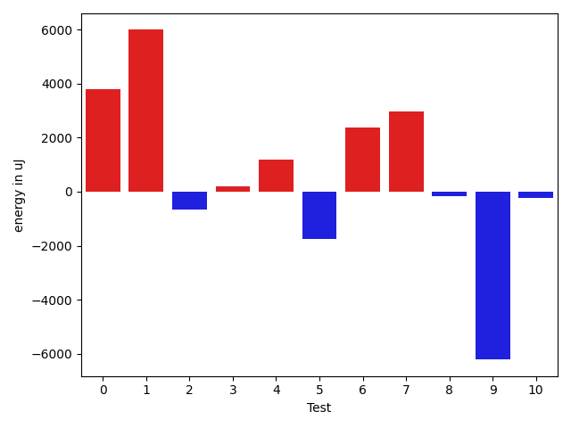

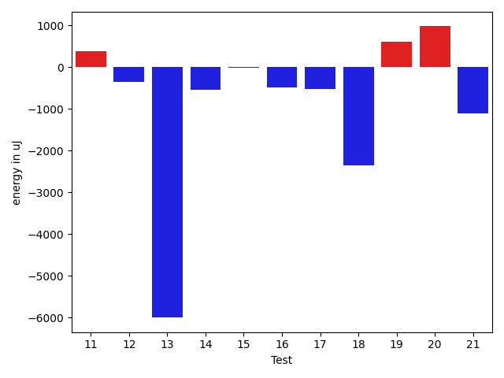

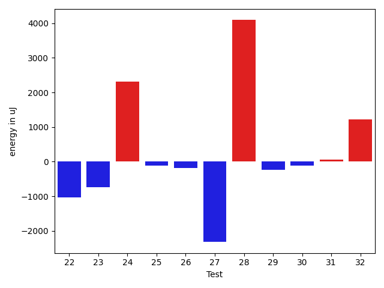

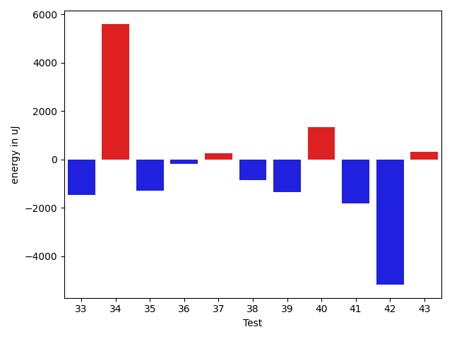

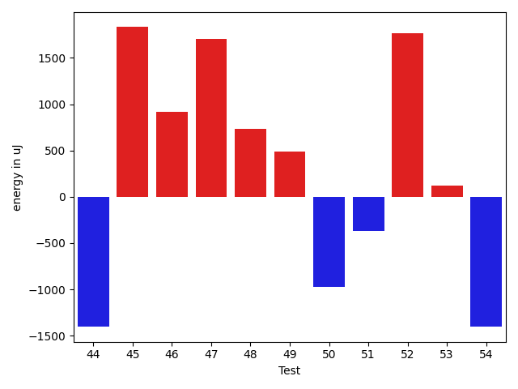

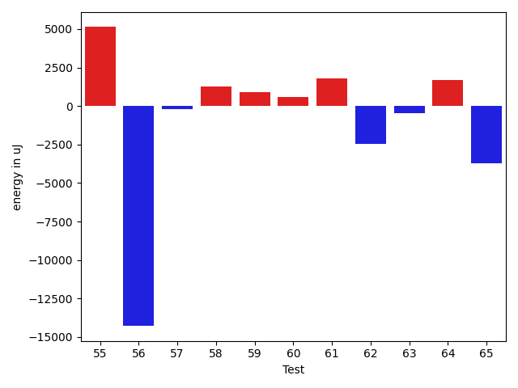

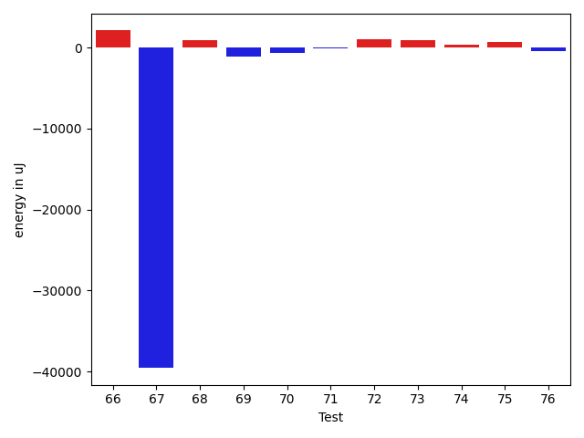

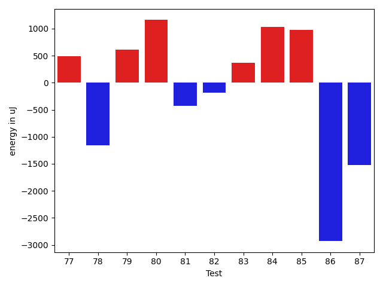

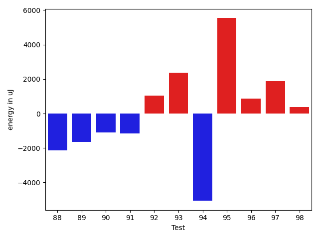

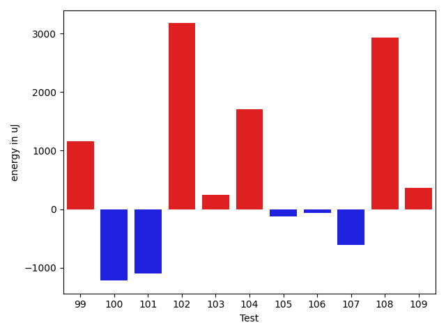

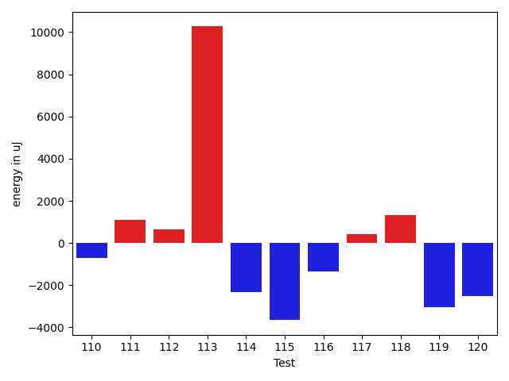

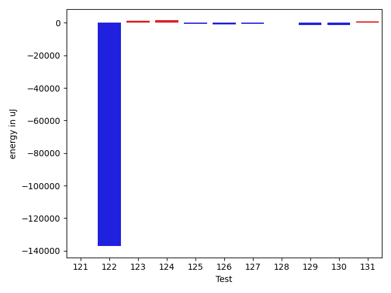

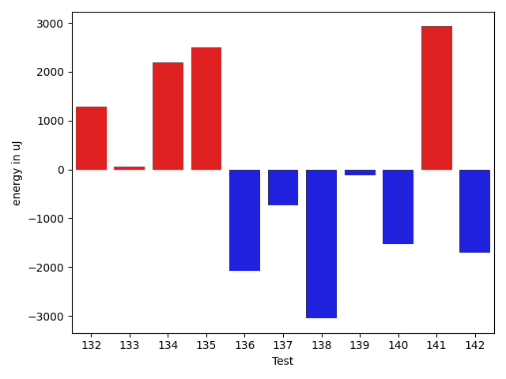

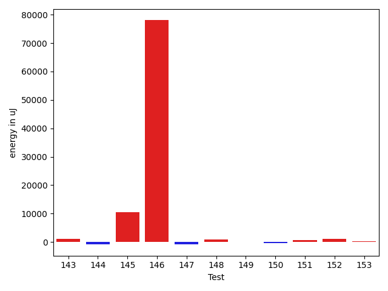

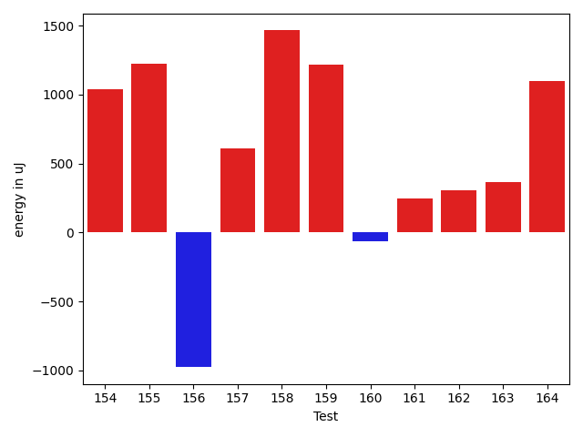

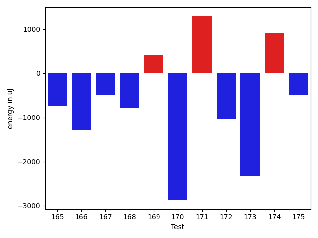

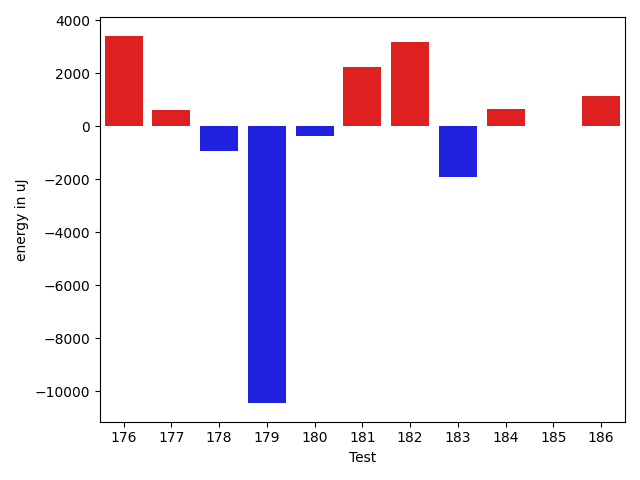

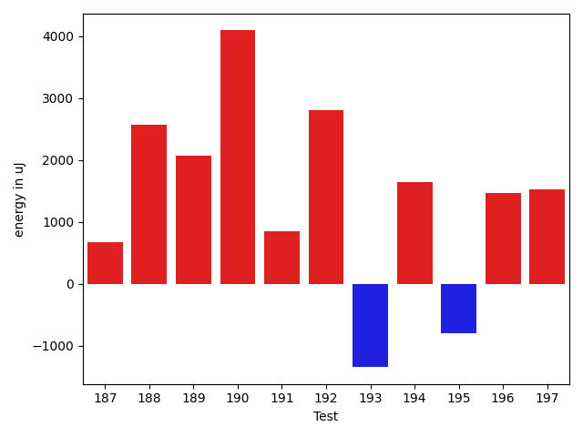

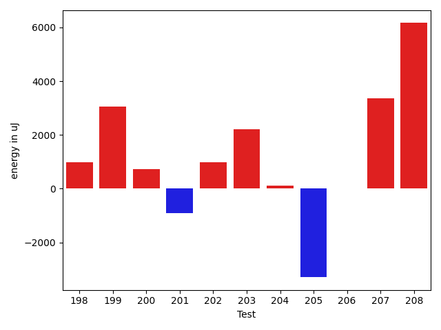

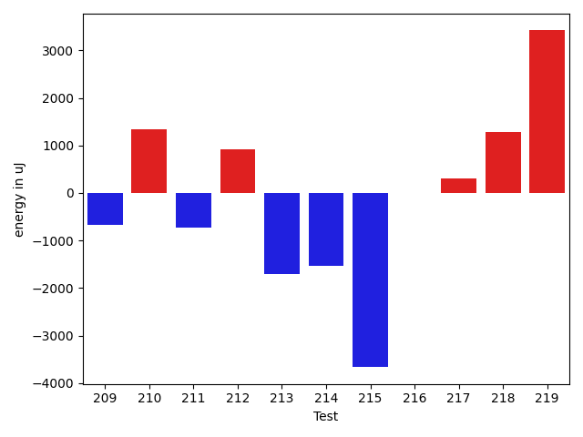

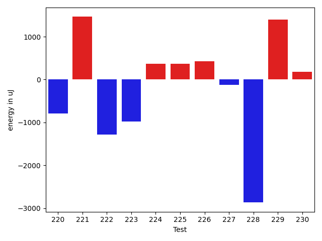

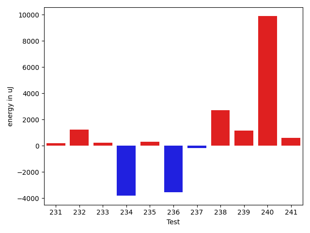

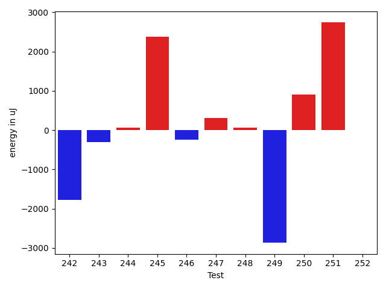

| ID | EnergyV1 | EnergyV2 | DeltaEnergy | σV1 | σV2 |
| --- | --- | --- | --- | --- | --- |
| 0 | 71777 | 67321 | -4456 | 51390.20681773031 | 76929.86309884657 |
| 1 | 42785 | 40649 | -2136 | 41625.86243438641 | 73795.58733783144 |
| 2 | 38085 | 36804 | -1281 | 3696.182432771214 | 3811.4427860405326 |
| 3 | 36682 | 36682 | 0 | 3317.391694137334 | 3743.1453560446025 |
| 4 | 37170 | 38696 | 1526 | 4156.746166017987 | 4702.566302087404 |
| 5 | 115844 | 114807 | -1037 | 23475.582012165687 | 23099.998826557552 |
| 6 | 35827 | 41321 | 5494 | 3758.6403994454895 | 5846.936585939684 |
| 7 | 38452 | 38391 | -61 | 5225.596543730641 | 20843.399925340163 |
| 8 | 37720 | 37354 | -366 | 3562.2510862901227 | 3712.738006840507 |
| 9 | 37719 | 37719 | 0 | 40749.06585945639 | 31399.25597241787 |
| 10 | 36621 | 37536 | 915 | 6980.290338846481 | 3721.047056060587 |
| 11 | 36743 | 37109 | 366 | 2859.2915508635188 | 3531.480661139177 |
| 12 | 37598 | 37109 | -489 | 2977.2476336470695 | 4123.032539404419 |
| 13 | 38757 | 39490 | 733 | 32271.489919848744 | 10778.771112872919 |
| 14 | 37781 | 37353 | -428 | 5765.00250458487 | 6447.194144150461 |
| 15 | 37537 | 36499 | -1038 | 3448.1726577297127 | 3378.2534588748663 |
| 16 | 36804 | 36438 | -366 | 2120.291628489758 | 3064.580721730136 |
| 17 | 37537 | 36621 | -916 | 4758.83282381734 | 4705.390060876994 |
| 18 | 39550 | 40711 | 1161 | 46359.35585389489 | 34619.36403480572 |
| 19 | 38086 | 39489 | 1403 | 5109.166976556544 | 3883.2003911312204 |
| 20 | 34485 | 37475 | 2990 | 4115.626701823227 | 4168.272203395551 |
| 21 | 37048 | 36010 | -1038 | 3789.669015788634 | 3582.5057741295072 |
| 22 | 36743 | 35706 | -1037 | 2792.2471009743977 | 3897.49160508761 |
| 23 | 38574 | 37842 | -732 | 26119.356331807416 | 33533.72294251912 |
| 24 | 34118 | 36438 | 2320 | 4308.323320821534 | 4121.380974358288 |
| 25 | 37475 | 37354 | -121 | 2956.2834104707513 | 3851.267673382561 |
| 26 | 29846 | 29663 | -183 | 854.5 | 0.0 |
| 27 | 34790 | 32470 | -2320 | 1403.5 | 213.5 |
| 28 | 31067 | 35157 | 4090 | 0.0 | 366.5 |
| 29 | 34240 | 33997 | -243 | 0.0 | 0.0 |
| 30 | 38452 | 38330 | -122 | 4919.116075561112 | 3420.1919404796895 |
| 31 | 39246 | 39306 | 60 | 19690.772490136682 | 22929.96620569177 |
| 32 | 37963 | 39185 | 1222 | 21869.993735531993 | 38505.708570972536 |
| 33 | 38635 | 37170 | -1465 | 5118.573084333147 | 3929.360841437475 |
| 34 | 34424 | 40039 | 5615 | 4716.066842176491 | 5160.6121593639455 |
| 35 | 40893 | 39612 | -1281 | 65030.12326653658 | 62254.50567772019 |
| 36 | 38574 | 38391 | -183 | 4369.07776977789 | 3735.8621545884075 |
| 37 | 38818 | 39063 | 245 | 10826.742417987949 | 18337.002143502687 |
| 38 | 39490 | 38635 | -855 | 3406.6098194865554 | 2997.336828631746 |
| 39 | 40222 | 38880 | -1342 | 5264.557909475611 | 3471.5133289947817 |
| 40 | 41077 | 42420 | 1343 | 26849.594046919497 | 24530.841703259186 |
| 41 | 39428 | 37598 | -1830 | 4482.208570953094 | 4379.627588292002 |
| 42 | 41992 | 36804 | -5188 | 5114.071304863131 | 2204.040278901546 |
| 43 | 38269 | 38574 | 305 | 4235.9177439717 | 3813.3365723363218 |
| 44 | 38696 | 37292 | -1404 | 3827.4077905773115 | 4647.917728402687 |
| 45 | 37597 | 39429 | 1832 | 3865.2674201912396 | 4079.8414144353883 |
| 46 | 81482 | 82398 | 916 | 26959.48314704419 | 25118.271059259398 |
| 47 | 37354 | 39062 | 1708 | 39673.954924227815 | 28583.750487762565 |
| 48 | 40467 | 41198 | 731 | 13597.796119222428 | 346605.6805516513 |
| 49 | 38147 | 38635 | 488 | 6599.732356780044 | 9136.049067804834 |
| 50 | 38452 | 37476 | -976 | 27516.18885125757 | 3134.5241512619245 |
| 51 | 38452 | 38085 | -367 | 3531.2369025912462 | 4273.841739420236 |
| 52 | 38391 | 40161 | 1770 | 17627.369805419752 | 21751.442368341264 |
| 53 | 37049 | 37170 | 121 | 3768.2351611320432 | 3957.6315640461903 |
| 54 | 81299 | 79895 | -1404 | 34341.90081719691 | 31399.22108054355 |
| 55 | 119323 | 124451 | 5128 | 33670.231675416435 | 29315.31602947805 |
| 56 | 250366 | 236083 | -14283 | 326968.87313246715 | 355264.0302975324 |
| 57 | 42359 | 42175 | -184 | 48249.471356767535 | 28551.302359607907 |
| 58 | 37841 | 39123 | 1282 | 4027.378575906769 | 4368.688799071096 |
| 59 | 37537 | 38452 | 915 | 7139.411223920261 | 7346.526636184043 |
| 60 | 39490 | 40100 | 610 | 10470.405790766858 | 8089.806972377116 |
| 61 | 38147 | 39917 | 1770 | 8523.313146408242 | 4429.7054157211405 |
| 62 | 39429 | 36987 | -2442 | 3658.1456353999793 | 4097.356520580971 |
| 63 | 41076 | 40588 | -488 | 17566.862225548106 | 17788.926582428106 |
| 64 | 38452 | 40161 | 1709 | 4966.9470269136245 | 4480.001736110775 |
| 65 | 39307 | 35583 | -3724 | 4807.277386761024 | 4261.905985414503 |
| 66 | 36743 | 38513 | 1770 | 4137.702594435709 | 4074.8315102264896 |
| 67 | 42054 | 42176 | 122 | 98121.27363196893 | 78110.01756266695 |
| 68 | 38575 | 35583 | -2992 | 2669.098890803578 | 6195.915687763718 |
| 69 | 40161 | 40344 | 183 | 9670.67705450455 | 9124.617889882493 |
| 70 | 38635 | 35950 | -2685 | 4959.576306388369 | 5993.415830919297 |
| 71 | 36377 | 35949 | -428 | 3445.299569902393 | 4980.44476691245 |
| 72 | 39612 | 40833 | 1221 | 20160.823492921296 | 19874.389484696418 |
| 73 | 36316 | 38269 | 1953 | 3378.592511823044 | 3319.3123116426123 |
| 74 | 38025 | 38452 | 427 | 3482.5252346016377 | 4312.096149743345 |
| 75 | 38025 | 38757 | 732 | 3948.753789240455 | 4244.408069303119 |
| 76 | 38452 | 39062 | 610 | 13003.877499247374 | 12975.05041648781 |
| 77 | 39246 | 39734 | 488 | 16179.271021181998 | 16579.133491614288 |
| 78 | 37903 | 36743 | -1160 | 3707.3283535227 | 3832.9269525054387 |
| 79 | 36865 | 37476 | 611 | 3368.7719772367177 | 3627.4762011624557 |
| 80 | 36987 | 38147 | 1160 | 40223.51052464561 | 4634.886215721695 |
| 81 | 38208 | 37781 | -427 | 4250.5944503666315 | 4755.531116157853 |
| 82 | 37048 | 36865 | -183 | 3388.4770300731466 | 3611.860421613136 |
| 83 | 37842 | 38207 | 365 | 3740.0240451656996 | 4311.357164355494 |
| 84 | 39917 | 40954 | 1037 | 55373.538352495845 | 58882.075451712226 |
| 85 | 36499 | 37476 | 977 | 3539.730363968419 | 47912.8131341943 |
| 86 | 37842 | 34912 | -2930 | 2925.3505249589407 | 2723.633361889959 |
| 87 | 38025 | 36499 | -1526 | 4464.325444737395 | 6673.900748733738 |
| 88 | 38635 | 36498 | -2137 | 4488.968277931394 | 4165.5907875675275 |
| 89 | 38879 | 37231 | -1648 | 4488.963938990328 | 4153.946399976479 |
| 90 | 40405 | 39306 | -1099 | 31504.026458583176 | 12994.232790311315 |
| 91 | 45471 | 44311 | -1160 | 108662.6826908008 | 141800.2662371149 |
| 92 | 37293 | 38330 | 1037 | 3773.4092157325053 | 4334.41437227883 |
| 93 | 35340 | 37719 | 2379 | 5240.747817715415 | 3601.152378448616 |
| 94 | 40466 | 35400 | -5066 | 3660.06783482978 | 5211.222162065248 |
| 95 | 119873 | 125427 | 5554 | 109687.06215948188 | 76230.67196786191 |
| 96 | 38025 | 38880 | 855 | 5059.276511155181 | 4577.159592684076 |
| 97 | 38269 | 40161 | 1892 | 24705.447482911928 | 4467.607079254227 |
| 98 | 37658 | 38025 | 367 | 4074.208054909734 | 4443.345848520655 |
| 99 | 37537 | 38696 | 1159 | 4416.410633182384 | 4231.737187680728 |
| 100 | 44007 | 42786 | -1221 | 54401.916644680176 | 43443.493855444634 |
| 101 | 41076 | 39978 | -1098 | 17416.56442792604 | 14237.587331207524 |
| 102 | 36316 | 39490 | 3174 | 4619.863913166413 | 4137.585947617632 |
| 103 | 40649 | 40894 | 245 | 106219.84163538672 | 78539.66788567234 |
| 104 | 35583 | 37293 | 1710 | 4559.488613312962 | 3824.6549987384483 |
| 105 | 38391 | 38269 | -122 | 4898.696950659041 | 3940.572914179708 |
| 106 | 37964 | 37902 | -62 | 4423.657636430938 | 3671.3659274502493 |
| 107 | 38085 | 37476 | -609 | 4661.934981175465 | 4204.550102270158 |
| 108 | 34119 | 37048 | 2929 | 4486.608956383429 | 3019.8708093584764 |
| 109 | 37476 | 37842 | 366 | 4719.965134170665 | 3617.147567078925 |
| 110 | 38757 | 37720 | -1037 | 3671.164331403413 | 3730.377007097186 |
| 111 | 37963 | 38024 | 61 | 7588.5776631861845 | 9939.513959759095 |
| 112 | 37964 | 37475 | -489 | 8821.0394653405 | 8949.689663269524 |
| 113 | 71045 | 74707 | 3662 | 54311.623490201564 | 64800.49295416466 |
| 114 | 38757 | 37598 | -1159 | 9826.408159748747 | 6228.403969624131 |
| 115 | 78186 | 75195 | -2991 | 32758.03108696276 | 32730.995426977977 |
| 116 | 37964 | 38025 | 61 | 13567.14702550342 | 23482.826949199924 |
| 117 | 68420 | 66833 | -1587 | 26920.743635565635 | 24830.301700484593 |
| 118 | 75440 | 77393 | 1953 | 27725.088019249557 | 34190.35564774746 |
| 119 | 38208 | 37841 | -367 | 11476.246255883027 | 6055.5989051287015 |
| 120 | 39002 | 36987 | -2015 | 5722.712690133844 | 3595.912459607403 |
| 121 | 35645 | 36560 | 915 | 3741.881256735196 | 3282.5989982620486 |
| 122 | 41443 | 38758 | -2685 | 645509.7366181308 | 398775.8298183199 |
| 123 | 79834 | 79956 | 122 | 30229.523712191232 | 31206.17306054011 |
| 124 | 82763 | 80871 | -1892 | 219095.47827592105 | 244215.34092491516 |
| 125 | 38940 | 38452 | -488 | 4062.30829473102 | 4235.993545167455 |
| 126 | 38330 | 37903 | -427 | 2987.7382502240475 | 3846.1857196448536 |
| 127 | 38635 | 37414 | -1221 | 4775.787465143546 | 4178.465006974298 |
| 128 | 38086 | 37659 | -427 | 4572.802324479533 | 3459.081507486131 |
| 129 | 39001 | 38452 | -549 | 3515.0594433096007 | 3804.8892758903926 |
| 130 | 67077 | 63171 | -3906 | 20804.412679434885 | 23000.80743741807 |
| 131 | 37598 | 39063 | 1465 | 3318.830026237493 | 5137.717804184463 |
| 132 | 44006 | 45288 | 1282 | 23280.998777758457 | 23262.497354210256 |
| 133 | 39062 | 39123 | 61 | 9195.639279890707 | 8036.205991442645 |
| 134 | 36743 | 38941 | 2198 | 4257.661262033679 | 3308.2417155135277 |
| 135 | 36255 | 38757 | 2502 | 3843.2389343979303 | 3961.1483416270844 |
| 136 | 41016 | 38941 | -2075 | 4361.904793455426 | 36652.96263385767 |
| 137 | 37354 | 36621 | -733 | 3849.505832029151 | 4092.8764481220096 |
| 138 | 40344 | 37292 | -3052 | 4675.398818648688 | 18004.453707260185 |
| 139 | 37841 | 37719 | -122 | 8055.4497279806155 | 5049.460876073212 |
| 140 | 38452 | 36927 | -1525 | 4295.530464638255 | 3921.9609820390456 |
| 141 | 36377 | 39307 | 2930 | 3864.3072104766916 | 4379.25724117401 |
| 142 | 40772 | 39063 | -1709 | 29367.55908662817 | 3670.038296278916 |
| 143 | 38269 | 39307 | 1038 | 3867.7562702941873 | 4234.72675602864 |
| 144 | 36804 | 36987 | 183 | 3364.091964497998 | 3358.281622660701 |
| 145 | 35888 | 38391 | 2503 | 3820.2481194570178 | 44631.80727858083 |
| 146 | 40283 | 39917 | -366 | 10530.15875474748 | 389946.8866325866 |
| 147 | 39429 | 38818 | -611 | 4049.8828805308244 | 3884.659840399718 |
| 148 | 38269 | 39490 | 1221 | 3957.934100954689 | 4289.504382369237 |
| 149 | 67932 | 69031 | 1099 | 22514.099689911007 | 22539.973734371335 |
| 150 | 38330 | 39185 | 855 | 21202.23357923504 | 16316.880985947866 |
| 151 | 38146 | 39734 | 1588 | 12657.698261511601 | 11709.926940508338 |
| 152 | 38147 | 40222 | 2075 | 27192.465609399973 | 20292.185645565685 |
| 153 | 40528 | 40344 | -184 | 38839.011548457616 | 42053.29168677758 |
| 154 | 164428 | 165466 | 1038 | 274124.27728249994 | 329605.18672061496 |
| 155 | 39062 | 40283 | 1221 | 39395.20684591239 | 38033.567247104234 |
| 156 | 38879 | 37903 | -976 | 4333.962659229684 | 3913.3223286523425 |
| 157 | 38208 | 38818 | 610 | 8603.51100294995 | 10983.4821262725 |
| 158 | 35645 | 37110 | 1465 | 4649.574261384603 | 4334.803635979374 |
| 159 | 39063 | 40283 | 1220 | 12496.84513390357 | 15485.217165930902 |
| 160 | 38757 | 38696 | -61 | 11760.458941656083 | 16679.452895725684 |
| 161 | 37537 | 37781 | 244 | 31399.944918333465 | 4084.000339408753 |
| 162 | 39795 | 40100 | 305 | 16074.759666369155 | 17602.82320802889 |
| 163 | 39917 | 40283 | 366 | 59376.067651220525 | 78614.2045137602 |
| 164 | 37475 | 38574 | 1099 | 5982.235624735366 | 6459.636032477939 |
| 165 | 37781 | 37048 | -733 | 4334.830276532516 | 4463.492992220331 |
| 166 | 37292 | 36011 | -1281 | 3528.560613054564 | 4512.351181025242 |
| 167 | 35278 | 34790 | -488 | 4109.129310145885 | 3880.845902132649 |
| 168 | 37841 | 37048 | -793 | 4693.126868590973 | 3904.1088154211193 |
| 169 | 36743 | 37170 | 427 | 3919.752691084319 | 3550.492838403643 |
| 170 | 39368 | 36499 | -2869 | 4680.002143292724 | 46453.34359482934 |
| 171 | 37963 | 39246 | 1283 | 47544.939547875234 | 45847.78055745311 |
| 172 | 38818 | 37781 | -1037 | 3268.454459764669 | 4711.464424235137 |
| 173 | 39551 | 37231 | -2320 | 3730.948170349681 | 5661.184514256961 |
| 174 | 83862 | 84777 | 915 | 387923.1025383922 | 507513.4786657531 |
| 175 | 40894 | 40405 | -489 | 417198.97511688113 | 39144.4007617568 |
| 176 | 83984 | 81115 | -2869 | 281531.4082378524 | 330717.9250197746 |
| 177 | 37597 | 38024 | 427 | 4355.166051757695 | 4097.106550470665 |
| 178 | 40100 | 38696 | -1404 | 7979.875115022668 | 6929.189039851633 |
| 179 | 44067 | 39245 | -4822 | 25671.691982576136 | 20754.404084830694 |
| 180 | 41138 | 38147 | -2991 | 4834.191730744654 | 4517.255902524107 |
| 181 | 40344 | 37964 | -2380 | 7494.323475333927 | 16827.435855086886 |
| 182 | 36560 | 40832 | 4272 | 4564.500039218391 | 5280.076946750821 |
| 183 | 36498 | 35156 | -1342 | 4363.37334647873 | 3979.8505887382435 |
| 184 | 36682 | 37781 | 1099 | 4345.040763635517 | 3730.9770427813964 |
| 185 | 38208 | 37048 | -1160 | 4226.330265696143 | 5153.376405874389 |
| 186 | 37415 | 38025 | 610 | 4619.281840605622 | 3855.883153961634 |
| 187 | 37476 | 38147 | 671 | 3951.485834346339 | 3941.335857646927 |
| 188 | 36621 | 39184 | 2563 | 4267.353469382759 | 33052.33388622336 |
| 189 | 35034 | 37110 | 2076 | 3838.8011679461592 | 3281.579707244668 |
| 190 | 33447 | 37537 | 4090 | 4882.657635219413 | 4220.701039555647 |
| 191 | 36438 | 37292 | 854 | 3895.775097742215 | 4962.848979258759 |
| 192 | 37781 | 40588 | 2807 | 17236.717219012015 | 21881.692964246588 |
| 193 | 36682 | 35339 | -1343 | 3032.970699912699 | 4512.505107370557 |
| 194 | 36377 | 38024 | 1647 | 4641.2236309942455 | 4977.310122864718 |
| 195 | 37415 | 36621 | -794 | 3153.8269784501495 | 3477.862599356105 |
| 196 | 36743 | 38208 | 1465 | 3782.5836408465575 | 3167.371892576297 |
| 197 | 34424 | 35950 | 1526 | 4408.6645099446705 | 3046.355770915997 |
| 198 | 36927 | 37903 | 976 | 4051.463237576283 | 4515.876037315462 |
| 199 | 36621 | 39672 | 3051 | 3187.975980472721 | 3358.725177297034 |
| 200 | 38635 | 39368 | 733 | 3883.2609527946997 | 4322.69631778388 |
| 201 | 37414 | 36499 | -915 | 3272.680678994923 | 4360.764150741824 |
| 202 | 36071 | 37048 | 977 | 3837.124148517812 | 5144.705976265526 |
| 203 | 35644 | 37842 | 2198 | 4538.347078968694 | 41869.67883307412 |
| 204 | 38697 | 38819 | 122 | 3688.8681308410432 | 3632.5718199842586 |
| 205 | 39917 | 36621 | -3296 | 62452.4561381496 | 4955.108186396024 |
| 206 | 37048 | 37048 | 0 | 51275.32016781298 | 2114.5911557965146 |
| 207 | 35889 | 39245 | 3356 | 3365.657292615793 | 3334.896349547047 |
| 208 | 31372 | 37536 | 6164 | 2820.668758988528 | 3558.52522640802 |
| 209 | 37964 | 37292 | -672 | 4040.0540219160434 | 4823.052416874293 |
| 210 | 35706 | 37048 | 1342 | 3554.2212305307553 | 3645.342078748406 |
| 211 | 37414 | 36682 | -732 | 4455.070666836031 | 4399.211316429029 |
| 212 | 38818 | 39734 | 916 | 4615.5881957619595 | 4303.549474142117 |
| 213 | 38330 | 36621 | -1709 | 2829.6715602502154 | 4431.893969850813 |
| 214 | 40832 | 39306 | -1526 | 99380.94541900014 | 65560.7203002479 |
| 215 | 40161 | 36499 | -3662 | 4540.129676716841 | 4544.2135537650765 |
| 216 | 38452 | 38452 | 0 | 6337.024326128864 | 44861.83458942454 |
| 217 | 39062 | 39367 | 305 | 554096.6251088558 | 296963.2604778907 |
| 218 | 39368 | 40649 | 1281 | 60640.2701492763 | 70410.50763291318 |
| 219 | 239379 | 242797 | 3418 | 113327.76012132924 | 96549.82665272981 |
| 220 | 39185 | 38391 | -794 | 3878.4378968653436 | 3190.566438834535 |
| 221 | 38086 | 39550 | 1464 | 12538.916347656601 | 7217.682541641312 |
| 222 | 41015 | 39734 | -1281 | 51764.89603112879 | 50635.61479366561 |
| 223 | 39490 | 38513 | -977 | 121140.83330298682 | 27246.934031416866 |
| 224 | 40833 | 41198 | 365 | 18728.249328866445 | 17948.729910369682 |
| 225 | 37780 | 38147 | 367 | 4642.324158352242 | 26356.983875107053 |
| 226 | 38208 | 38636 | 428 | 4118.114315359521 | 4222.37925115782 |
| 227 | 40528 | 40405 | -123 | 38438.23164101681 | 45374.271411110465 |
| 228 | 41931 | 39063 | -2868 | 18884.0753777079 | 20365.60378209871 |
| 229 | 36499 | 37903 | 1404 | 5354.002462070087 | 4324.138582423094 |
| 230 | 38269 | 38452 | 183 | 9399.35161998066 | 4710.3362624246865 |
| 231 | 37598 | 37598 | 0 | 4951.941016105667 | 4944.1260785170225 |
| 232 | 37720 | 39673 | 1953 | 4247.472766245829 | 4855.803403792311 |
| 233 | 38879 | 39673 | 794 | 3224.5202018061473 | 4416.3042524264565 |
| 234 | 40894 | 39246 | -1648 | 24388.653324355193 | 21166.61832081093 |
| 235 | 39245 | 38879 | -366 | 3657.835712408036 | 4194.901327418371 |
| 236 | 39367 | 38818 | -549 | 29569.727791488007 | 41108.33071738535 |
| 237 | 37964 | 39795 | 1831 | 4739.580988350164 | 4717.9696355307115 |
| 238 | 39368 | 39551 | 183 | 30175.934132816783 | 29736.40514966236 |
| 239 | 38391 | 38574 | 183 | 17907.743162690822 | 22284.176257837265 |
| 240 | 38757 | 39795 | 1038 | 263393.60837157763 | 296112.15760603873 |
| 241 | 37537 | 39734 | 2197 | 3654.0836820679892 | 4400.467773751333 |
| 242 | 39185 | 37414 | -1771 | 10840.356305929532 | 3595.5953350513555 |
| 243 | 81786 | 81482 | -304 | 242359.5444632567 | 377533.71796869923 |
| 244 | 40100 | 40161 | 61 | 4092.0427809715984 | 4393.069503691709 |
| 245 | 161315 | 163696 | 2381 | 62768.15124890641 | 76670.10982416516 |
| 246 | 39489 | 39246 | -243 | 6875.048144316275 | 22748.692345605108 |
| 247 | 39002 | 39307 | 305 | 9723.998894003356 | 10707.576859171657 |
| 248 | 40466 | 40527 | 61 | 92936.83113532905 | 110898.818635043 |
| 249 | 45166 | 42297 | -2869 | 562481.3749789889 | 42566.34874345191 |
| 250 | 36499 | 37414 | 915 | 4150.778784837992 | 4244.55604129034 |
| 251 | 37354 | 40100 | 2746 | 4946.641161002962 | 4187.3022452139085 |
| 252 | 38330 | 38330 | 0 | 4111.753298615005 | 4864.4358558373 |
| 253 | 36865 | 39306 | 2441 | 3197.5572618341544 | 4973.309007928241 |
| 254 | 41016 | 39978 | -1038 | 35159.721062070035 | 53102.68216403521 |
| 255 | 40039 | 37476 | -2563 | 4553.195488759662 | 5427.340914808609 |
| 256 | 44007 | 42420 | -1587 | 24734.11193991775 | 17256.664736660638 |
| 257 | 41076 | 38635 | -2441 | 361418.97854393005 | 466564.66856788984 |
| 258 | 39123 | 40650 | 1527 | 375370.61965755606 | 505386.35217467556 |
| 259 | 39978 | 40405 | 427 | 64241.825341844626 | 74972.10650281693 |
| 260 | 41443 | 39246 | -2197 | 17622.93403670973 | 15448.026478773558 |

## Delta Duration per test method

| ID | DurationV1 | DurationsV2 | DeltaDuration |
| --- | --- | --- | --- |
| 0 | 1945191.6404494382 | 2197124.0786516853 | 251932.43820224702 |
| 1 | 1317262.761904762 | 1556724.2571428572 | 239461.4952380953 |
| 2 | 853937.0 | 840405.3114754099 | -13531.688524590107 |
| 3 | 753352.6808510638 | 724880.0980392157 | -28472.582811848144 |
| 4 | 536032.8484848485 | 552720.1212121212 | 16687.272727272706 |
| 5 | 3361841.101010101 | 3302509.1616161615 | -59331.93939393945 |
| 6 | 428099.5 | 959544.4 | 531444.9 |
| 7 | 1109471.9014084507 | 1095036.5180722892 | -14435.383336161496 |
| 8 | 798325.7884615385 | 788764.9454545454 | -9560.843006993062 |
| 9 | 1690581.8924731184 | 1482656.9270833333 | -207924.96538978512 |
| 10 | 928304.3559322034 | 983309.5 | 55005.144067796646 |
| 11 | 685353.1111111111 | 556520.95 | -128832.16111111117 |
| 12 | 514107.9655172414 | 486885.77777777775 | -27222.18773946364 |
| 13 | 1117579.3404255318 | 944782.3703703703 | -172796.9700551615 |
| 14 | 866151.5692307692 | 918726.4925373135 | 52574.92330654431 |
| 15 | 779999.2884615385 | 738755.56 | -41243.72846153844 |
| 16 | 393379.875 | 362404.44444444444 | -30975.430555555562 |
| 17 | 378513.13636363635 | 375216.1875 | -3296.948863636353 |
| 18 | 1282725.8245614036 | 1142809.2 | -139916.62456140365 |
| 19 | 577373.625 | 491811.5588235294 | -85562.0661764706 |
| 20 | 537218.2727272727 | 524711.12 | -12507.15272727271 |
| 21 | 516683.75 | 556253.2424242424 | 39569.49242424243 |
| 22 | 672313.2162162162 | 693186.5833333334 | 20873.36711711716 |
| 23 | 610781.4814814815 | 643820.0434782609 | 33038.561996779405 |
| 24 | 409634.14285714284 | 323432.1111111111 | -86202.03174603172 |
| 25 | 491303.4347826087 | 470646.64705882355 | -20656.78772378515 |
| 26 | 720032.5 | 635563.0 | -84469.5 |
| 27 | 1091708.0 | 1284893.0 | 193185.0 |
| 28 | 605015.0 | 554467.0 | -50548.0 |
| 29 | 566597.0 | 519554.0 | -47043.0 |
| 30 | 332802.625 | 366204.5 | 33401.875 |
| 31 | 1003447.8793103448 | 1088568.5833333333 | 85120.70402298844 |
| 32 | 1199711.5394736843 | 1362931.281690141 | 163219.74221645668 |
| 33 | 497732.39130434784 | 545876.6 | 48144.20869565214 |
| 34 | 358074.1666666667 | 353026.875 | -5047.291666666686 |
| 35 | 1400271.4210526317 | 1215482.1785714286 | -184789.24248120305 |
| 36 | 599653.2 | 622097.6875 | 22444.487500000047 |
| 37 | 829433.7777777778 | 955050.6451612903 | 125616.86738351255 |
| 38 | 423205.6666666667 | 489854.4347826087 | 66648.76811594202 |
| 39 | 354055.93333333335 | 424013.45454545453 | 69957.52121212118 |
| 40 | 1064318.4375 | 1033768.5263157894 | -30549.911184210563 |
| 41 | 456130.962962963 | 558971.275862069 | 102840.31289910601 |
| 42 | 348535.85714285716 | 391878.78571428574 | 43342.92857142858 |
| 43 | 738254.8367346938 | 854082.725490196 | 115827.88875550218 |
| 44 | 794306.6 | 781695.36 | -12611.23999999999 |
| 45 | 439999.71428571426 | 410843.7727272727 | -29155.941558441555 |
| 46 | 2672808.8484848486 | 2613454.505050505 | -59354.34343434358 |
| 47 | 1313867.6666666667 | 1203512.64 | -110355.02666666685 |
| 48 | 1007679.6379310344 | 4117421.066666667 | 3109741.4287356324 |
| 49 | 948987.3636363636 | 912787.7260273972 | -36199.63760896644 |
| 50 | 768418.8181818182 | 625199.6470588235 | -143219.17112299474 |
| 51 | 463534.8 | 446445.82608695654 | -17088.973913043446 |
| 52 | 998314.4677419355 | 1123045.796875 | 124731.32913306449 |
| 53 | 713863.5238095238 | 753919.4571428571 | 40055.93333333335 |
| 54 | 2590634.595959596 | 2518361.303030303 | -72273.29292929266 |
| 55 | 3515844.606060606 | 3527942.8181818184 | 12098.21212121239 |
| 56 | 8597272.111111112 | 8381051.838383839 | -216220.2727272734 |
| 57 | 1820393.4040404041 | 1688538.8686868686 | -131854.53535353555 |
| 58 | 638686.9722222222 | 699088.7380952381 | 60401.76587301586 |
| 59 | 920512.2463768116 | 929516.5757575758 | 9004.32938076416 |
| 60 | 822537.3636363636 | 591074.7878787878 | -231462.5757575758 |
| 61 | 692691.5757575758 | 559603.5588235294 | -133088.0169340464 |
| 62 | 411802.64285714284 | 408769.70588235295 | -3032.936974789889 |
| 63 | 1127239.7083333333 | 1012103.5294117647 | -115136.17892156856 |
| 64 | 390603.29411764705 | 353076.8333333333 | -37526.460784313735 |
| 65 | 541926.2916666666 | 528569.3548387097 | -13356.936827956932 |
| 66 | 431147.4 | 350357.2380952381 | -80790.16190476192 |
| 67 | 3604368.0 | 2230589.1764705884 | -1373778.8235294116 |
| 68 | 357975.3333333333 | 378317.77777777775 | 20342.444444444438 |
| 69 | 639777.0 | 612870.4545454546 | -26906.545454545412 |
| 70 | 413889.94444444444 | 340691.1818181818 | -73198.76262626261 |
| 71 | 704604.5945945946 | 695988.2564102564 | -8616.33818433818 |
| 72 | 1283557.5454545454 | 1243714.049180328 | -39843.4962742175 |
| 73 | 376840.6153846154 | 398688.1666666667 | 21847.55128205131 |
| 74 | 722253.8571428572 | 689001.0 | -33252.85714285716 |
| 75 | 788155.8524590164 | 731429.3555555556 | -56726.49690346082 |
| 76 | 1093914.9444444445 | 1043225.262295082 | -50689.68214936252 |
| 77 | 1461261.0 | 1424154.9278350514 | -37106.072164948564 |
| 78 | 653804.1111111111 | 696334.8095238095 | 42530.698412698344 |
| 79 | 417048.03846153844 | 354555.4 | -62492.638461538416 |
| 80 | 743313.0869565217 | 506073.2631578947 | -237239.823798627 |
| 81 | 784195.4727272728 | 756782.4423076923 | -27413.030419580522 |
| 82 | 426387.94444444444 | 414004.4285714286 | -12383.515873015858 |
| 83 | 751997.1951219512 | 729087.6904761905 | -22909.504645760637 |
| 84 | 1404728.0943396227 | 1359278.2765957448 | -45449.81774387788 |
| 85 | 544607.84 | 877827.0 | 333219.16000000003 |
| 86 | 425857.28571428574 | 404498.7 | -21358.585714285728 |
| 87 | 915117.8305084746 | 931257.7971014492 | 16139.966592974612 |
| 88 | 533137.2962962963 | 652279.1153846154 | 119141.81908831908 |
| 89 | 559294.7666666667 | 650074.6785714285 | 90779.9119047618 |
| 90 | 1036009.0877192982 | 1056936.3653846155 | 20927.27766531729 |
| 91 | 2628080.042105263 | 3332667.6458333335 | 704587.6037280704 |
| 92 | 392870.375 | 533696.1111111111 | 140825.73611111112 |
| 93 | 507688.86666666664 | 472080.6785714286 | -35608.18809523806 |
| 94 | 514719.9166666667 | 497363.24 | -17356.676666666695 |
| 95 | 4707404.454545454 | 4115093.1919191917 | -592311.2626262624 |
| 96 | 559447.8095238095 | 509004.3703703704 | -50443.439153439074 |
| 97 | 993368.8936170213 | 766252.1162790698 | -227116.77733795147 |
| 98 | 618472.0833333334 | 595116.8780487805 | -23355.20528455288 |
| 99 | 549986.7894736842 | 486330.04 | -63656.749473684176 |
| 100 | 2089637.175257732 | 2002046.8229166667 | -87590.35234106518 |
| 101 | 1437686.2555555555 | 1327000.1123595505 | -110686.14319600491 |
| 102 | 489947.36842105264 | 487351.1904761905 | -2596.1779448621674 |
| 103 | 2266180.396226415 | 1774520.826923077 | -491659.56930333795 |
| 104 | 425214.2083333333 | 430715.3125 | 5501.104166666686 |
| 105 | 758814.8780487805 | 649118.5263157894 | -109696.35173299105 |
| 106 | 500395.95238095237 | 428635.90476190473 | -71760.04761904763 |
| 107 | 451993.38095238095 | 413722.5 | -38270.88095238095 |
| 108 | 499966.25 | 412153.0 | -87813.25 |
| 109 | 638246.1891891892 | 556034.2564102564 | -82211.93277893285 |
| 110 | 789560.4736842106 | 781149.3333333334 | -8411.140350877191 |
| 111 | 1185092.690140845 | 1103932.7307692308 | -81159.95937161427 |
| 112 | 1195991.819148936 | 1228516.0114942528 | 32524.192345316755 |
| 113 | 2330214.292929293 | 2568590.6363636362 | 238376.3434343431 |
| 114 | 1092614.2077922078 | 1062305.6578947369 | -30308.549897470977 |
| 115 | 2472223.0303030303 | 2444401.01010101 | -27822.020202020183 |
| 116 | 1249388.494117647 | 1249871.8426966292 | 483.348578982288 |
| 117 | 1956302.1515151516 | 1978727.5959595959 | 22425.444444444263 |
| 118 | 2401769.212121212 | 2428416.717171717 | 26647.505050505046 |
| 119 | 1129574.3292682928 | 1083503.3142857142 | -46071.01498257858 |
| 120 | 915355.3064516129 | 875890.9423076923 | -39464.3641439206 |
| 121 | 728759.75 | 564338.4411764706 | -164421.3088235294 |
| 122 | 7833981.438356165 | 3562934.072463768 | -4271047.365892397 |
| 123 | 2587395.5353535353 | 2616779.242424242 | 29383.707070706878 |
| 124 | 3908442.090909091 | 3911063.101010101 | 2621.0101010100916 |
| 125 | 871130.8596491228 | 870984.6721311476 | -146.18751797522418 |
| 126 | 449378.74074074073 | 492022.2 | 42643.45925925928 |
| 127 | 584193.5666666667 | 566626.1818181818 | -17567.384848484886 |
| 128 | 925128.9166666666 | 1053327.1176470588 | 128198.20098039217 |
| 129 | 417007.5 | 479680.0714285714 | 62672.57142857142 |
| 130 | 1803109.4242424243 | 1778849.3232323232 | -24260.10101010115 |
| 131 | 652118.4722222222 | 688273.0689655172 | 36154.59674329497 |
| 132 | 1750067.4444444445 | 1749476.4536082475 | -590.9908361970447 |
| 133 | 960996.5967741936 | 1067266.3606557378 | 106269.76388154423 |
| 134 | 448048.0 | 467223.75 | 19175.75 |
| 135 | 747348.2653061225 | 702805.25 | -44543.015306122485 |
| 136 | 761937.5681818182 | 1048305.75 | 286368.18181818177 |
| 137 | 605677.3636363636 | 673957.3142857143 | 68279.95064935065 |
| 138 | 578919.6086956522 | 717354.4375 | 138434.82880434778 |
| 139 | 761572.5593220339 | 765666.7441860465 | 4094.184864012641 |
| 140 | 837197.5609756098 | 747875.8235294118 | -89321.737446198 |
| 141 | 448500.9090909091 | 433455.625 | -15045.284090909117 |
| 142 | 768461.875 | 543399.5 | -225062.375 |
| 143 | 479853.44 | 449779.96153846156 | -30073.47846153844 |
| 144 | 567849.4 | 560539.8076923077 | -7309.592307692277 |
| 145 | 439590.5 | 714121.8571428572 | 274531.35714285716 |
| 146 | 1119338.1149425288 | 3626644.1866666665 | 2507306.0717241378 |
| 147 | 640831.1034482758 | 585668.2608695652 | -55162.84257871064 |
| 148 | 502835.4 | 451392.7037037037 | -51442.696296296315 |
| 149 | 1953994.7448979593 | 1933333.5368421052 | -20661.208055854077 |
| 150 | 1213530.5 | 1111242.1851851852 | -102288.31481481483 |
| 151 | 1251091.6363636365 | 1158855.8684210526 | -92235.76794258389 |
| 152 | 1134590.96 | 973864.2391304348 | -160726.72086956515 |
| 153 | 1040809.0952380953 | 1004573.8823529412 | -36235.21288515406 |
| 154 | 6524572.191919192 | 7335338.04040404 | 810765.8484848486 |
| 155 | 1136833.3 | 1261900.775 | 125067.47499999986 |
| 156 | 780341.875 | 824549.3076923077 | 44207.432692307746 |
| 157 | 1039315.78125 | 991380.0144927537 | -47935.76675724634 |
| 158 | 578293.4615384615 | 595991.59375 | 17698.132211538497 |
| 159 | 1213545.530120482 | 1314131.2906976745 | 100585.76057719253 |
| 160 | 1041651.2028985508 | 1149077.01369863 | 107425.81080007926 |
| 161 | 902197.625 | 761564.6296296297 | -140632.99537037034 |
| 162 | 1407239.3265306123 | 1560138.90625 | 152899.5797193877 |
| 163 | 1373981.290909091 | 1866220.267857143 | 492238.97694805195 |
| 164 | 966020.9411764706 | 1092394.2985074627 | 126373.35733099212 |
| 165 | 753660.3636363636 | 777646.7 | 23986.336363636306 |
| 166 | 589087.074074074 | 655549.1212121212 | 66462.04713804717 |
| 167 | 423738.3125 | 449398.1904761905 | 25659.877976190473 |
| 168 | 740754.5098039216 | 806690.7346938775 | 65936.22488995595 |
| 169 | 709300.5434782609 | 733437.6666666666 | 24137.123188405763 |
| 170 | 563916.3928571428 | 884738.1176470588 | 320821.72478991596 |
| 171 | 1218248.638888889 | 1562059.0 | 343810.361111111 |
| 172 | 375187.6666666667 | 407728.3333333333 | 32540.666666666628 |
| 173 | 838247.3076923077 | 870466.9272727272 | 32219.6195804195 |
| 174 | 4873622.98989899 | 6953358.737373738 | 2079735.7474747477 |
| 175 | 3881134.5824175826 | 1607368.780487805 | -2273765.8019297775 |
| 176 | 3568046.551020408 | 3825183.7291666665 | 257137.17814625846 |
| 177 | 1085445.0746268656 | 885999.6379310344 | -199445.43669583113 |
| 178 | 826549.1777777778 | 713409.3333333334 | -113139.8444444444 |
| 179 | 1196407.625 | 824979.5454545454 | -371428.0795454546 |
| 180 | 650295.84 | 640312.0 | -9983.839999999967 |
| 181 | 670224.8823529412 | 1270363.7894736843 | 600138.9071207431 |
| 182 | 501401.27777777775 | 539052.6538461539 | 37651.37606837612 |
| 183 | 570671.1724137932 | 593896.6551724138 | 23225.482758620637 |
| 184 | 407859.3333333333 | 435344.52173913043 | 27485.18840579712 |
| 185 | 374898.5238095238 | 425710.76470588235 | 50812.24089635856 |
| 186 | 533484.1034482758 | 570248.9459459459 | 36764.84249767009 |
| 187 | 444862.0 | 475970.96875 | 31108.96875 |
| 188 | 480702.78571428574 | 729518.0833333334 | 248815.29761904763 |
| 189 | 416086.2272727273 | 403988.1875 | -12098.039772727294 |
| 190 | 409406.38095238095 | 367019.71428571426 | -42386.666666666686 |
| 191 | 381632.7368421053 | 370225.3333333333 | -11407.403508771968 |
| 192 | 1004893.2608695652 | 1261291.9512195121 | 256398.69034994696 |
| 193 | 450911.95454545453 | 514004.0869565217 | 63092.1324110672 |
| 194 | 405006.6923076923 | 366797.6923076923 | -38209.0 |
| 195 | 418641.4 | 391306.4 | -27335.0 |
| 196 | 383114.75 | 456590.9411764706 | 73476.1911764706 |
| 197 | 365205.76470588235 | 349141.61904761905 | -16064.145658263296 |
| 198 | 913296.8444444444 | 860943.36 | -52353.48444444442 |
| 199 | 352540.46153846156 | 365397.35294117645 | 12856.891402714886 |
| 200 | 461143.9 | 451160.38095238095 | -9983.519047619076 |
| 201 | 492801.4666666667 | 460608.6666666667 | -32192.79999999999 |
| 202 | 443415.81481481483 | 398822.0 | -44593.81481481483 |
| 203 | 360589.78571428574 | 775388.3529411765 | 414798.56722689077 |
| 204 | 391810.64285714284 | 348719.875 | -43090.76785714284 |
| 205 | 856280.0833333334 | 363339.0 | -492941.0833333334 |
| 206 | 733256.3333333334 | 359235.3333333333 | -374021.00000000006 |
| 207 | 411528.7619047619 | 345955.93333333335 | -65572.82857142854 |
| 208 | 407129.8181818182 | 373111.07692307694 | -34018.74125874124 |
| 209 | 301773.25 | 356506.17647058825 | 54732.92647058825 |
| 210 | 366409.8333333333 | 364364.4375 | -2045.395833333314 |
| 211 | 440283.95652173914 | 451003.9166666667 | 10719.96014492755 |
| 212 | 404230.71428571426 | 353175.8333333333 | -51054.88095238095 |
| 213 | 454655.0 | 379322.4666666667 | -75332.53333333333 |
| 214 | 1843520.2173913044 | 1116982.0869565217 | -726538.1304347827 |
| 215 | 503832.1818181818 | 500205.2 | -3626.981818181812 |
| 216 | 800807.5714285715 | 850267.4 | 49459.828571428545 |
| 217 | 5867646.3965517245 | 2113250.44 | -3754395.9565517246 |
| 218 | 1680550.988095238 | 1745986.3139534884 | 65435.32585825026 |
| 219 | 7547937.121212121 | 7427125.94949495 | -120811.17171717156 |
| 220 | 699504.3571428572 | 600618.2222222222 | -98886.13492063491 |
| 221 | 1118659.2784810127 | 1083528.5405405406 | -35130.737940472085 |
| 222 | 1392396.4385964912 | 1193087.705882353 | -199308.73271413823 |
| 223 | 2034829.6 | 839035.6451612903 | -1195793.95483871 |
| 224 | 1114375.0576923077 | 1037283.8958333334 | -77091.16185897437 |
| 225 | 506039.77777777775 | 642050.7142857143 | 136010.93650793657 |
| 226 | 688397.8367346938 | 704703.8775510204 | 16306.04081632651 |
| 227 | 979170.8620689656 | 1100870.4864864864 | 121699.62441752083 |
| 228 | 1314813.6024096385 | 1274816.2298850575 | -39997.37252458092 |
| 229 | 582725.5862068966 | 644574.6 | 61849.0137931034 |
| 230 | 644868.1363636364 | 819540.7586206896 | 174672.62225705327 |
| 231 | 538306.7058823529 | 545821.9523809524 | 7515.246498599532 |
| 232 | 804921.65 | 543653.2727272727 | -261268.37727272732 |
| 233 | 469076.1052631579 | 574624.5 | 105548.39473684208 |
| 234 | 1264797.7457627119 | 1013906.0166666667 | -250891.72909604514 |
| 235 | 788151.2641509434 | 754151.0185185185 | -34000.245632424834 |
| 236 | 1035713.6666666666 | 929303.1627906977 | -106410.50387596898 |
| 237 | 585596.6296296297 | 580299.9677419355 | -5296.66188769415 |
| 238 | 1433941.6941176471 | 1479098.6951219512 | 45157.00100430404 |
| 239 | 1154555.4393939395 | 1226487.2575757576 | 71931.81818181812 |
| 240 | 1941783.9375 | 2238193.3902439023 | 296409.45274390234 |
| 241 | 487650.5 | 521944.3793103448 | 34293.87931034481 |
| 242 | 673705.0 | 604880.3333333334 | -68824.66666666663 |
| 243 | 3349726.484848485 | 4469940.717171717 | 1120214.2323232326 |
| 244 | 808531.4615384615 | 732005.6296296297 | -76525.83190883184 |
| 245 | 4900021.646464647 | 5250347.919191919 | 350326.2727272725 |
| 246 | 1008046.0 | 1091078.125 | 83032.125 |
| 247 | 929286.6727272727 | 908755.4375 | -20531.23522727273 |
| 248 | 1893350.8333333333 | 1805256.4571428571 | -88094.37619047612 |
| 249 | 5814187.355932203 | 1530366.5535714286 | -4283820.802360775 |
| 250 | 498175.1818181818 | 493532.72222222225 | -4642.459595959575 |
| 251 | 693029.3658536585 | 650991.78125 | -42037.58460365853 |
| 252 | 789244.6530612245 | 691736.2 | -97508.45306122454 |
| 253 | 558248.2083333334 | 485683.51851851854 | -72564.68981481483 |
| 254 | 939311.1739130435 | 1257224.105263158 | 317912.9313501145 |
| 255 | 611509.1212121212 | 570440.7333333333 | -41068.38787878794 |
| 256 | 1308710.1515151516 | 1229910.5161290322 | -78799.63538611936 |
| 257 | 4067008.2580645164 | 6102822.7894736845 | 2035814.5314091682 |
| 258 | 2866467.94 | 5948978.588235294 | 3082510.6482352945 |
| 259 | 1474285.723076923 | 1714511.85 | 240226.12692307704 |
| 260 | 824626.0 | 603325.8666666667 | -221300.1333333333 |

## Misc.

| ID | Test Class | Test Method |
| --- | --- | --- |
| 0 | com.google.gson.functional.CustomDeserializerTest | testDefaultConstructorNotCalledOnField |
| 1 | com.google.gson.functional.CustomDeserializerTest | testDefaultConstructorNotCalledOnObject |
| 2 | com.google.gson.functional.DefaultTypeAdaptersTest | testDateSerializationWithPatternNotOverridenByTypeAdapter |
| 3 | com.google.gson.functional.DefaultTypeAdaptersTest | testSqlDateSerialization |
| 4 | com.google.gson.functional.DefaultTypeAdaptersTest | testUriSerialization |
| 5 | com.google.gson.functional.DefaultTypeAdaptersTest | testDefaultDateDeserializationUsingBuilder |
| 6 | com.google.gson.functional.DefaultTypeAdaptersTest | testLocaleSerializationWithLanguageCountry |
| 7 | com.google.gson.functional.DefaultTypeAdaptersTest | testUrlNullSerialization |
| 8 | com.google.gson.functional.DefaultTypeAdaptersTest | testDateDeserializationWithPattern |
| 9 | com.google.gson.functional.DefaultTypeAdaptersTest | testDateSerializationInCollection |
| 10 | com.google.gson.functional.DefaultTypeAdaptersTest | testBigIntegerFieldSerialization |
| 11 | com.google.gson.functional.DefaultTypeAdaptersTest | testSetSerialization |
| 12 | com.google.gson.functional.DefaultTypeAdaptersTest | testDefaultGregorianCalendarSerialization |
| 13 | com.google.gson.functional.DefaultTypeAdaptersTest | testBigDecimalFieldSerialization |
| 14 | com.google.gson.functional.DefaultTypeAdaptersTest | testDateSerializationWithPattern |
| 15 | com.google.gson.functional.DefaultTypeAdaptersTest | testTimestampSerialization |
| 16 | com.google.gson.functional.DefaultTypeAdaptersTest | testStringBufferSerialization |
| 17 | com.google.gson.functional.DefaultTypeAdaptersTest | testPropertiesSerialization |
| 18 | com.google.gson.functional.DefaultTypeAdaptersTest | testUrlSerialization |
| 19 | com.google.gson.functional.DefaultTypeAdaptersTest | testUuidSerialization |
| 20 | com.google.gson.functional.DefaultTypeAdaptersTest | testDefaultJavaSqlDateSerialization |
| 21 | com.google.gson.functional.DefaultTypeAdaptersTest | testDefaultCalendarSerialization |
| 22 | com.google.gson.functional.DefaultTypeAdaptersTest | testTreeSetSerialization |
| 23 | com.google.gson.functional.DefaultTypeAdaptersTest | testLocaleSerializationWithLanguage |
| 24 | com.google.gson.functional.DefaultTypeAdaptersTest | testStringBuilderSerialization |
| 25 | com.google.gson.functional.DefaultTypeAdaptersTest | testLocaleSerializationWithLanguageCountryVariant |
| 26 | com.google.gson.functional.DefaultTypeAdaptersTest | testDefaultDateSerializationUsingBuilder |
| 27 | com.google.gson.functional.DefaultTypeAdaptersTest | testDefaultDateSerialization |
| 28 | com.google.gson.functional.DefaultTypeAdaptersTest | testDefaultJavaSqlTimestampSerialization |
| 29 | com.google.gson.functional.DefaultTypeAdaptersTest | testDefaultJavaSqlTimeSerialization |
| 30 | com.google.gson.functional.ArrayTest | testSingleStringArraySerialization |
| 31 | com.google.gson.functional.ArrayTest | testObjectArrayWithNonPrimitivesSerialization |
| 32 | com.google.gson.functional.ArrayTest | testArrayOfCollectionSerialization |
| 33 | com.google.gson.functional.ArrayTest | testNullsInArrayWithSerializeNullPropertySetSerialization |
| 34 | com.google.gson.functional.ArrayTest | testArrayOfStringsSerialization |
| 35 | com.google.gson.functional.ArrayTest | testTopLevelArrayOfIntsSerialization |
| 36 | com.google.gson.functional.ArrayTest | testArrayOfPrimitivesWithCustomTypeAdapter |
| 37 | com.google.gson.functional.ArrayTest | testArrayOfPrimitivesAsObjectsSerialization |
| 38 | com.google.gson.functional.ArrayTest | testNullsInArraySerialization |
| 39 | com.google.gson.functional.ArrayTest | testEmptyArraySerialization |
| 40 | com.google.gson.functional.ArrayTest | testSingleNullInArraySerialization |
| 41 | com.google.gson.functional.ArrayTest | testMultidimenstionalArraysSerialization |
| 42 | com.google.gson.functional.ArrayTest | testArrayOfNullSerialization |
| 43 | com.google.gson.functional.CustomTypeAdaptersTest | testCustomTypeAdapterAppliesToSubClassesSerializedAsBaseClass |
| 44 | com.google.gson.functional.CustomTypeAdaptersTest | testCustomAdapterInvokedForMapElementSerializationWithType |
| 45 | com.google.gson.functional.CustomTypeAdaptersTest | testCustomAdapterInvokedForMapElementSerialization |
| 46 | com.google.gson.functional.CustomTypeAdaptersTest | testCustomTypeAdapterDoesNotAppliesToSubClasses |
| 47 | com.google.gson.functional.CustomTypeAdaptersTest | testCustomAdapterInvokedForCollectionElementSerializationWithType |
| 48 | com.google.gson.functional.CustomTypeAdaptersTest | testCustomSerializers |
| 49 | com.google.gson.functional.CustomTypeAdaptersTest | testCustomSerializerForLong |
| 50 | com.google.gson.functional.CustomTypeAdaptersTest | testEnsureCustomSerializerNotInvokedForNullValues |
| 51 | com.google.gson.functional.CustomTypeAdaptersTest | testCustomAdapterInvokedForCollectionElementSerialization |
| 52 | com.google.gson.functional.CustomTypeAdaptersTest | testCustomNestedSerializers |
| 53 | com.google.gson.functional.CustomTypeAdaptersTest | testCustomByteArraySerializer |
| 54 | com.google.gson.functional.MapAsArrayTypeAdapterTest | testTwoTypesCollapseToOneSerialize |
| 55 | com.google.gson.functional.MapAsArrayTypeAdapterTest | testMultipleEnableComplexKeyRegistrationHasNoEffect |
| 56 | com.google.gson.functional.MapAsArrayTypeAdapterTest | testSerializeComplexMapWithTypeAdapter |
| 57 | com.google.gson.functional.CircularReferenceTest | testCircularSerialization |
| 58 | com.google.gson.functional.CircularReferenceTest | testSelfReferenceArrayFieldSerialization |
| 59 | com.google.gson.functional.CircularReferenceTest | testSelfReferenceCustomHandlerSerialization |
| 60 | com.google.gson.functional.CircularReferenceTest | testSelfReferenceSerialization |
| 61 | com.google.gson.functional.CircularReferenceTest | testDirectedAcyclicGraphSerialization |
| 62 | com.google.gson.functional.StringTest | testEscapingQuotesInStringSerialization |
| 63 | com.google.gson.functional.StringTest | testSingleQuoteInStringSerialization |
| 64 | com.google.gson.functional.StringTest | testEscapedBackslashInStringSerialization |
| 65 | com.google.gson.functional.StringTest | testStringValueAsSingleElementArraySerialization |
| 66 | com.google.gson.functional.StringTest | testEscapedCtrlRInStringSerialization |
| 67 | com.google.gson.functional.StringTest | testStringValueSerialization |
| 68 | com.google.gson.functional.StringTest | testJavascriptKeywordsInStringSerialization |
| 69 | com.google.gson.functional.StringTest | testAssignmentCharSerialization |
| 70 | com.google.gson.functional.StringTest | testEscapedCtrlNInStringSerialization |
| 71 | com.google.gson.functional.MapTest | testSerializeMaps |
| 72 | com.google.gson.functional.MapTest | testMapSerializationWithNullValues |
| 73 | com.google.gson.functional.MapTest | testMapWithQuotes |
| 74 | com.google.gson.functional.MapTest | testMapSerializationWithIntegerKeys |
| 75 | com.google.gson.functional.MapTest | testMapSerializationWithNullValueButSerializeNulls |
| 76 | com.google.gson.functional.MapTest | testMapSerializationWithWildcardValues |
| 77 | com.google.gson.functional.MapTest | testParameterizedMapSubclassSerialization |
| 78 | com.google.gson.functional.MapTest | testMapSerialization |
| 79 | com.google.gson.functional.MapTest | testMapOfMapSerialization |
| 80 | com.google.gson.functional.MapTest | testMapSubclassSerialization |
| 81 | com.google.gson.functional.MapTest | testMapSerializationWithNullKey |
| 82 | com.google.gson.functional.MapTest | testRawMapSerialization |
| 83 | com.google.gson.functional.MapTest | testMapSerializationWithNullValue |
| 84 | com.google.gson.functional.MapTest | testMapSerializationEmpty |
| 85 | com.google.gson.functional.MapTest | testMapSerializationWithNullValuesSerialized |
| 86 | com.google.gson.functional.MapTest | testWriteMapsWithEmptyStringKey |
| 87 | com.google.gson.functional.PrettyPrintingTest | testEmptyMapField |
| 88 | com.google.gson.functional.PrettyPrintingTest | testPrettyPrintArrayOfPrimitiveArrays |
| 89 | com.google.gson.functional.PrettyPrintingTest | testPrettyPrintListOfPrimitiveArrays |
| 90 | com.google.gson.functional.PrettyPrintingTest | testPrettyPrintArrayOfObjects |
| 91 | com.google.gson.functional.PrettyPrintingTest | testPrettyPrintList |
| 92 | com.google.gson.functional.PrettyPrintingTest | testPrettyPrintArrayOfPrimitives |
| 93 | com.google.gson.functional.PrettyPrintingTest | testMultipleArrays |
| 94 | com.google.gson.functional.PrettyPrintingTest | testMap |
| 95 | com.google.gson.functional.ExposeFieldsTest | testNullExposeFieldSerialization |
| 96 | com.google.gson.functional.ExposeFieldsTest | testExposeAnnotationSerialization |
| 97 | com.google.gson.functional.ExposeFieldsTest | testArrayWithOneNullExposeFieldObjectSerialization |
| 98 | com.google.gson.functional.ExposeFieldsTest | testExposedInterfaceFieldSerialization |
| 99 | com.google.gson.functional.ExposeFieldsTest | testNoExposedFieldSerialization |
| 100 | com.google.gson.functional.InheritanceTest | testSubInterfacesOfCollectionSerialization |
| 101 | com.google.gson.functional.InheritanceTest | testSubClassSerialization |
| 102 | com.google.gson.functional.InheritanceTest | testBaseSerializedAsSubWhenSpecifiedWithExplicitTypeForToJsonMethod |
| 103 | com.google.gson.functional.InheritanceTest | testBaseSerializedAsBaseWhenSpecifiedWithExplicitTypeForToJsonMethod |
| 104 | com.google.gson.functional.InheritanceTest | testBaseSerializedAsBaseWhenSpecifiedWithExplicitType |
| 105 | com.google.gson.functional.InheritanceTest | testClassWithBaseArrayFieldSerialization |
| 106 | com.google.gson.functional.InheritanceTest | testBaseSerializedAsSubForToJsonMethod |
| 107 | com.google.gson.functional.InheritanceTest | testBaseSerializedAsSub |
| 108 | com.google.gson.functional.InheritanceTest | testBaseSerializedAsSubWhenSpecifiedWithExplicitType |
| 109 | com.google.gson.functional.InheritanceTest | testClassWithBaseFieldSerialization |
| 110 | com.google.gson.functional.ParameterizedTypesTest | testParameterizedTypesWithWriterSerialization |
| 111 | com.google.gson.functional.ParameterizedTypesTest | testVariableTypeArrayDeserialization |
| 112 | com.google.gson.functional.ParameterizedTypesTest | testParameterizedTypeWithCustomSerializer |
| 113 | com.google.gson.functional.ParameterizedTypesTest | testParameterizedTypesSerialization |
| 114 | com.google.gson.functional.ParameterizedTypesTest | testVariableTypeDeserialization |
| 115 | com.google.gson.functional.ParameterizedTypesTest | testVariableTypeFieldsAndGenericArraysSerialization |
| 116 | com.google.gson.functional.ParameterizedTypesTest | testParameterizedTypeGenericArraysDeserialization |
| 117 | com.google.gson.functional.ParameterizedTypesTest | testVariableTypeFieldsAndGenericArraysDeserialization |
| 118 | com.google.gson.functional.ParameterizedTypesTest | testTypesWithMultipleParametersSerialization |
| 119 | com.google.gson.functional.ParameterizedTypesTest | testParameterizedTypeWithVariableTypeDeserialization |
| 120 | com.google.gson.functional.ParameterizedTypesTest | testParameterizedTypeGenericArraysSerialization |
| 121 | com.google.gson.functional.ParameterizedTypesTest | testDeepParameterizedTypeSerialization |
| 122 | com.google.gson.JsonParserTest | testReadWriteTwoObjects |
| 123 | com.google.gson.functional.NamingPolicyTest | testGsonWithNonDefaultFieldNamingPolicySerialization |
| 124 | com.google.gson.functional.NamingPolicyTest | testGsonDuplicateNameUsingSerializedNameFieldNamingPolicySerialization |
| 125 | com.google.gson.functional.NamingPolicyTest | testGsonWithSerializedNameFieldNamingPolicySerialization |
| 126 | com.google.gson.functional.NamingPolicyTest | testGsonWithUpperCamelCaseSpacesPolicySerialiation |
| 127 | com.google.gson.functional.NamingPolicyTest | testGsonWithLowerCaseDashPolicySerialization |
| 128 | com.google.gson.functional.NamingPolicyTest | testDeprecatedNamingStrategy |
| 129 | com.google.gson.functional.NamingPolicyTest | testGsonWithLowerCaseUnderscorePolicySerialization |
| 130 | com.google.gson.functional.ObjectTest | testSingletonLists |
| 131 | com.google.gson.functional.ObjectTest | testBagOfPrimitiveWrappersSerialization |
| 132 | com.google.gson.functional.ObjectTest | testArrayOfArraysSerialization |
| 133 | com.google.gson.functional.ObjectTest | testArrayOfObjectsAsFields |
| 134 | com.google.gson.functional.ObjectTest | testPrimitiveArrayFieldSerialization |
| 135 | com.google.gson.functional.ObjectTest | testInnerClassSerialization |
| 136 | com.google.gson.functional.ObjectTest | testAnonymousLocalClassesSerialization |
| 137 | com.google.gson.functional.ObjectTest | testClassWithTransientFieldsSerialization |
| 138 | com.google.gson.functional.ObjectTest | testBagOfPrimitivesSerialization |
| 139 | com.google.gson.functional.ObjectTest | testArrayOfObjectsSerialization |
| 140 | com.google.gson.functional.ObjectTest | testNestedSerialization |
| 141 | com.google.gson.functional.ObjectTest | testClassWithNoFieldsSerialization |
| 142 | com.google.gson.functional.ObjectTest | testNullFieldsSerialization |
| 143 | com.google.gson.functional.ObjectTest | testClassWithObjectFieldSerialization |
| 144 | com.google.gson.functional.ObjectTest | testStringFieldWithEmptyValueSerialization |
| 145 | com.google.gson.functional.ObjectTest | testEmptyCollectionInAnObjectSerialization |
| 146 | com.google.gson.functional.FieldExclusionTest | testDefaultInnerClassExclusion |
| 147 | com.google.gson.functional.FieldExclusionTest | testDefaultNestedStaticClassIncluded |
| 148 | com.google.gson.functional.FieldExclusionTest | testInnerClassExclusion |
| 149 | com.google.gson.functional.EnumTest | testEnumSubclass |
| 150 | com.google.gson.functional.EnumTest | testEnumSubclassWithRegisteredTypeAdapter |
| 151 | com.google.gson.functional.EnumTest | testClassWithEnumFieldSerialization |
| 152 | com.google.gson.functional.EnumTest | testCollectionOfEnumsSerialization |
| 153 | com.google.gson.functional.EnumTest | testTopLevelEnumSerialization |
| 154 | com.google.gson.functional.VersioningTest | testVersionedUntilSerialization |
| 155 | com.google.gson.functional.VersioningTest | testVersionedGsonWithUnversionedClassesSerialization |
| 156 | com.google.gson.functional.VersioningTest | testVersionedClassesSerialization |
| 157 | com.google.gson.functional.VersioningTest | testVersionedGsonMixingSinceAndUntilSerialization |
| 158 | com.google.gson.functional.VersioningTest | testIgnoreLaterVersionClassSerialization |
| 159 | com.google.gson.functional.CollectionTest | testFieldIsArrayList |
| 160 | com.google.gson.functional.CollectionTest | testWildcardPrimitiveCollectionSerilaization |
| 161 | com.google.gson.functional.CollectionTest | testQueueSerialization |
| 162 | com.google.gson.functional.CollectionTest | testWildcardCollectionField |
| 163 | com.google.gson.functional.CollectionTest | testTopLevelCollectionOfIntegersSerialization |
| 164 | com.google.gson.functional.CollectionTest | testLinkedListSerialization |
| 165 | com.google.gson.functional.CollectionTest | testCollectionOfObjectSerialization |
| 166 | com.google.gson.functional.CollectionTest | testRawCollectionSerialization |
| 167 | com.google.gson.functional.CollectionTest | testRawCollectionOfIntegersSerialization |
| 168 | com.google.gson.functional.CollectionTest | testNullsInListSerialization |
| 169 | com.google.gson.functional.CollectionTest | testCollectionOfObjectWithNullSerialization |
| 170 | com.google.gson.functional.CollectionTest | testSetSerialization |
| 171 | com.google.gson.functional.CollectionTest | testCollectionOfBagOfPrimitivesSerialization |
| 172 | com.google.gson.functional.CollectionTest | testCollectionOfStringsSerialization |
| 173 | com.google.gson.functional.ExclusionStrategyFunctionalTest | testExclusionStrategyWithMode |
| 174 | com.google.gson.functional.ExclusionStrategyFunctionalTest | testExclusionStrategySerialization |
| 175 | com.google.gson.functional.TypeVariableTest | testAdvancedTypeVariables |
| 176 | com.google.gson.functional.TypeVariableTest | testTypeVariablesViaTypeParameter |
| 177 | com.google.gson.functional.TypeVariableTest | testBasicTypeVariables |
| 178 | com.google.gson.functional.UncategorizedTest | testGsonInstanceReusableForSerializationAndDeserialization |
| 179 | com.google.gson.functional.UncategorizedTest | testObjectEqualButNotSameSerialization |
| 180 | com.google.gson.functional.UncategorizedTest | testStaticFieldsAreNotSerialized |
| 181 | com.google.gson.functional.PrimitiveTest | testPrimitiveIntegerAutoboxedSerialization |
| 182 | com.google.gson.functional.PrimitiveTest | testBigDecimalSerialization |
| 183 | com.google.gson.functional.PrimitiveTest | testOverridingDefaultPrimitiveSerialization |
| 184 | com.google.gson.functional.PrimitiveTest | testLongAsStringSerialization |
| 185 | com.google.gson.functional.PrimitiveTest | testNumberSerialization |
| 186 | com.google.gson.functional.PrimitiveTest | testBigIntegerInASingleElementArraySerialization |
| 187 | com.google.gson.functional.PrimitiveTest | testPrimitiveBooleanAutoboxedInASingleElementArraySerialization |
| 188 | com.google.gson.functional.PrimitiveTest | testPrimitiveDoubleAutoboxedInASingleElementArraySerialization |
| 189 | com.google.gson.functional.PrimitiveTest | testDoubleNaNSerializationNotSupportedByDefault |
| 190 | com.google.gson.functional.PrimitiveTest | testNegativeInfinityFloatSerialization |
| 191 | com.google.gson.functional.PrimitiveTest | testDoubleNaNSerialization |
| 192 | com.google.gson.functional.PrimitiveTest | testHtmlCharacterSerialization |
| 193 | com.google.gson.functional.PrimitiveTest | testPrimitiveIntegerAutoboxedInASingleElementArraySerialization |
| 194 | com.google.gson.functional.PrimitiveTest | testPrimitiveBooleanAutoboxedSerialization |
| 195 | com.google.gson.functional.PrimitiveTest | testQuotedStringSerializationAndDeserialization |
| 196 | com.google.gson.functional.PrimitiveTest | testFloatNaNSerialization |
| 197 | com.google.gson.functional.PrimitiveTest | testDoubleInfinitySerializationNotSupportedByDefault |
| 198 | com.google.gson.functional.PrimitiveTest | testBigIntegerSerialization |
| 199 | com.google.gson.functional.PrimitiveTest | testNegativeInfinitySerializationNotSupportedByDefault |
| 200 | com.google.gson.functional.PrimitiveTest | testBigDecimalInASingleElementArraySerialization |
| 201 | com.google.gson.functional.PrimitiveTest | testPrimitiveLongAutoboxedInASingleElementArraySerialization |
| 202 | com.google.gson.functional.PrimitiveTest | testPrimitiveDoubleAutoboxedSerialization |
| 203 | com.google.gson.functional.PrimitiveTest | testDoubleInfinitySerialization |
| 204 | com.google.gson.functional.PrimitiveTest | testFloatInfinitySerialization |
| 205 | com.google.gson.functional.PrimitiveTest | testSmallValueForBigIntegerSerialization |
| 206 | com.google.gson.functional.PrimitiveTest | testNegativeInfinityFloatSerializationNotSupportedByDefault |
| 207 | com.google.gson.functional.PrimitiveTest | testNegativeInfinitySerialization |
| 208 | com.google.gson.functional.PrimitiveTest | testBigDecimalPreservePrecisionSerialization |
| 209 | com.google.gson.functional.PrimitiveTest | testPrimitiveLongAutoboxedSerialization |
| 210 | com.google.gson.functional.PrimitiveTest | testFloatInfinitySerializationNotSupportedByDefault |
| 211 | com.google.gson.functional.PrimitiveTest | testFloatNaNSerializationNotSupportedByDefault |
| 212 | com.google.gson.functional.PrimitiveTest | testReallyLongValuesSerialization |
| 213 | com.google.gson.functional.PrimitiveTest | testSmallValueForBigDecimalSerialization |
| 214 | com.google.gson.GsonTypeAdapterTest | testTypeAdapterDoesNotAffectNonAdaptedTypes |
| 215 | com.google.gson.GsonTypeAdapterTest | testTypeAdapterProperlyConvertsTypes |
| 216 | com.google.gson.GsonTypeAdapterTest | testTypeAdapterThrowsException |
| 217 | com.google.gson.FunctionWithInternalDependenciesTest | testAnonymousLocalClassesSerialization |
| 218 | com.google.gson.functional.ConcurrencyTest | testSingleThreadSerialization |
| 219 | com.google.gson.functional.ConcurrencyTest | testMultiThreadSerialization |
| 220 | com.google.gson.functional.EscapingTest | testGsonDoubleDeserialization |
| 221 | com.google.gson.functional.EscapingTest | testGsonAcceptsEscapedAndNonEscapedJsonDeserialization |
| 222 | com.google.gson.functional.EscapingTest | testEscapingObjectFields |
| 223 | com.google.gson.functional.EscapingTest | testEscapingQuotesInStringArray |
| 224 | com.google.gson.functional.EscapingTest | testEscapeAllHtmlCharacters |
| 225 | com.google.gson.functional.NullObjectAndFieldTest | testCustomSerializationOfNulls |
| 226 | com.google.gson.functional.NullObjectAndFieldTest | testNullWrappedPrimitiveMemberSerialization |
| 227 | com.google.gson.functional.NullObjectAndFieldTest | testExplicitSerializationOfNulls |
| 228 | com.google.gson.functional.NullObjectAndFieldTest | testExplicitSerializationOfNullArrayMembers |
| 229 | com.google.gson.functional.NullObjectAndFieldTest | testPrintPrintingObjectWithNulls |
| 230 | com.google.gson.functional.NullObjectAndFieldTest | testPrintPrintingArraysWithNulls |
| 231 | com.google.gson.functional.NullObjectAndFieldTest | testExplicitSerializationOfNullCollectionMembers |
| 232 | com.google.gson.functional.NullObjectAndFieldTest | testExplicitSerializationOfNullStringMembers |
| 233 | com.google.gson.functional.NullObjectAndFieldTest | testCustomTypeAdapterPassesNullSerialization |
| 234 | com.google.gson.functional.JsonTreeTest | testJsonTreeToString |
| 235 | com.google.gson.functional.JsonTreeTest | testToJsonTreeObjectType |
| 236 | com.google.gson.functional.JsonTreeTest | testToJsonTree |
| 237 | com.google.gson.MixedStreamTest | testWriteInvalidState |
| 238 | com.google.gson.MixedStreamTest | testWriteHtmlSafe |
| 239 | com.google.gson.MixedStreamTest | testWriteLenient |
| 240 | com.google.gson.MixedStreamTest | testWriteMixedStreamed |
| 241 | com.google.gson.MixedStreamTest | testWriteClosed |
| 242 | com.google.gson.MixedStreamTest | testWriteDoesNotMutateState |
| 243 | com.google.gson.functional.TypeHierarchyAdapterTest | testTypeHierarchy |
| 244 | com.google.gson.functional.TypeHierarchyAdapterTest | testRegisterSuperTypeFirst |
| 245 | com.google.gson.DefaultInetAddressTypeAdapterTest | testInetAddressSerializationAndDeserialization |
| 246 | com.google.gson.functional.ReadersWritersTest | testReadWriteTwoStrings |
| 247 | com.google.gson.functional.ReadersWritersTest | testReadWriteTwoObjects |
| 248 | com.google.gson.functional.ReadersWritersTest | testWriterForSerialization |
| 249 | com.google.gson.functional.CustomSerializerTest | testSubClassSerializerInvokedForBaseClassFieldsHoldingSubClassInstances |
| 250 | com.google.gson.functional.CustomSerializerTest | testBaseClassSerializerInvokedForBaseClassFieldsHoldingSubClassInstances |
| 251 | com.google.gson.functional.CustomSerializerTest | testSubClassSerializerInvokedForBaseClassFieldsHoldingArrayOfSubClassInstances |
| 252 | com.google.gson.functional.CustomSerializerTest | testSerializerReturnsNull |
| 253 | com.google.gson.functional.CustomSerializerTest | testBaseClassSerializerInvokedForBaseClassFields |
| 254 | com.google.gson.functional.InterfaceTest | testSerializingObjectImplementingInterface |
| 255 | com.google.gson.functional.InterfaceTest | testSerializingInterfaceObjectField |
| 256 | com.google.gson.functional.SecurityTest | testJsonWithNonExectuableTokenSerialization |
| 257 | com.google.gson.functional.SecurityTest | testNonExecutableJsonSerialization |
| 258 | com.google.gson.DefaultMapJsonSerializerTest | testNonEmptyMapSerialization |
| 259 | com.google.gson.functional.PrintFormattingTest | testCompactFormattingLeavesNoWhiteSpace |
| 260 | com.google.gson.functional.InternationalizationTest | testStringsWithUnicodeChineseCharactersSerialization |

| Test | IterationV1 | IterationV2 | DeltaIteration |
| --- | --- | --- | --- |
| 0 | 89 | 89 | 0 |
| 1 | 42 | 35 | -7 |
| 2 | 70 | 61 | -9 |
| 3 | 47 | 51 | 4 |
| 4 | 33 | 33 | 0 |
| 5 | 99 | 99 | 0 |
| 6 | 16 | 10 | -6 |
| 7 | 71 | 83 | 12 |
| 8 | 52 | 55 | 3 |
| 9 | 93 | 96 | 3 |
| 10 | 59 | 52 | -7 |
| 11 | 18 | 20 | 2 |
| 12 | 29 | 18 | -11 |
| 13 | 47 | 54 | 7 |
| 14 | 65 | 67 | 2 |
| 15 | 52 | 50 | -2 |
| 16 | 16 | 18 | 2 |
| 17 | 22 | 16 | -6 |
| 18 | 57 | 50 | -7 |
| 19 | 32 | 34 | 2 |
| 20 | 22 | 25 | 3 |
| 21 | 36 | 33 | -3 |
| 22 | 37 | 36 | -1 |
| 23 | 27 | 23 | -4 |
| 24 | 7 | 9 | 2 |
| 25 | 23 | 17 | -6 |
| 26 | 2 | 1 | -1 |
| 27 | 2 | 2 | 0 |
| 28 | 1 | 2 | 1 |
| 29 | 1 | 1 | 0 |
| 30 | 16 | 12 | -4 |
| 31 | 58 | 60 | 2 |
| 32 | 76 | 71 | -5 |
| 33 | 23 | 15 | -8 |
| 34 | 18 | 16 | -2 |
| 35 | 19 | 28 | 9 |
| 36 | 35 | 32 | -3 |
| 37 | 27 | 31 | 4 |
| 38 | 15 | 23 | 8 |
| 39 | 15 | 11 | -4 |
| 40 | 16 | 19 | 3 |
| 41 | 27 | 29 | 2 |
| 42 | 14 | 14 | 0 |
| 43 | 49 | 51 | 2 |
| 44 | 55 | 50 | -5 |
| 45 | 14 | 22 | 8 |
| 46 | 99 | 99 | 0 |
| 47 | 66 | 75 | 9 |
| 48 | 58 | 60 | 2 |
| 49 | 66 | 73 | 7 |
| 50 | 33 | 34 | 1 |
| 51 | 15 | 23 | 8 |
| 52 | 62 | 64 | 2 |
| 53 | 42 | 35 | -7 |
| 54 | 99 | 99 | 0 |
| 55 | 99 | 99 | 0 |
| 56 | 99 | 99 | 0 |
| 57 | 99 | 99 | 0 |
| 58 | 36 | 42 | 6 |
| 59 | 69 | 66 | -3 |
| 60 | 33 | 33 | 0 |
| 61 | 33 | 34 | 1 |
| 62 | 14 | 17 | 3 |
| 63 | 48 | 34 | -14 |
| 64 | 17 | 12 | -5 |
| 65 | 24 | 31 | 7 |
| 66 | 10 | 21 | 11 |
| 67 | 24 | 17 | -7 |
| 68 | 6 | 9 | 3 |
| 69 | 19 | 22 | 3 |
| 70 | 18 | 11 | -7 |
| 71 | 37 | 39 | 2 |
| 72 | 55 | 61 | 6 |
| 73 | 13 | 12 | -1 |
| 74 | 42 | 46 | 4 |
| 75 | 61 | 45 | -16 |
| 76 | 54 | 61 | 7 |
| 77 | 99 | 97 | -2 |
| 78 | 36 | 42 | 6 |
| 79 | 26 | 20 | -6 |
| 80 | 23 | 19 | -4 |
| 81 | 55 | 52 | -3 |
| 82 | 18 | 21 | 3 |
| 83 | 41 | 42 | 1 |
| 84 | 53 | 47 | -6 |
| 85 | 25 | 30 | 5 |
| 86 | 14 | 10 | -4 |
| 87 | 59 | 69 | 10 |
| 88 | 27 | 26 | -1 |
| 89 | 30 | 28 | -2 |
| 90 | 57 | 52 | -5 |
| 91 | 95 | 96 | 1 |
| 92 | 16 | 18 | 2 |
| 93 | 15 | 28 | 13 |
| 94 | 12 | 25 | 13 |
| 95 | 99 | 99 | 0 |
| 96 | 21 | 27 | 6 |
| 97 | 47 | 43 | -4 |
| 98 | 36 | 41 | 5 |
| 99 | 19 | 25 | 6 |
| 100 | 97 | 96 | -1 |
| 101 | 90 | 89 | -1 |
| 102 | 19 | 21 | 2 |
| 103 | 53 | 52 | -1 |
| 104 | 24 | 16 | -8 |
| 105 | 41 | 38 | -3 |
| 106 | 21 | 21 | 0 |
| 107 | 21 | 16 | -5 |
| 108 | 20 | 21 | 1 |
| 109 | 37 | 39 | 2 |
| 110 | 57 | 42 | -15 |
| 111 | 71 | 78 | 7 |
| 112 | 94 | 87 | -7 |
| 113 | 99 | 99 | 0 |
| 114 | 77 | 76 | -1 |
| 115 | 99 | 99 | 0 |
| 116 | 85 | 89 | 4 |
| 117 | 99 | 99 | 0 |
| 118 | 99 | 99 | 0 |
| 119 | 82 | 70 | -12 |
| 120 | 62 | 52 | -10 |
| 121 | 36 | 34 | -2 |
| 122 | 73 | 69 | -4 |
| 123 | 99 | 99 | 0 |
| 124 | 99 | 99 | 0 |
| 125 | 57 | 61 | 4 |
| 126 | 27 | 20 | -7 |
| 127 | 30 | 33 | 3 |
| 128 | 72 | 68 | -4 |
| 129 | 10 | 28 | 18 |
| 130 | 99 | 99 | 0 |
| 131 | 36 | 29 | -7 |
| 132 | 99 | 97 | -2 |
| 133 | 62 | 61 | -1 |
| 134 | 15 | 24 | 9 |
| 135 | 49 | 40 | -9 |
| 136 | 44 | 56 | 12 |
| 137 | 22 | 35 | 13 |
| 138 | 23 | 32 | 9 |
| 139 | 59 | 43 | -16 |
| 140 | 41 | 34 | -7 |
| 141 | 22 | 16 | -6 |
| 142 | 24 | 26 | 2 |
| 143 | 25 | 26 | 1 |
| 144 | 25 | 26 | 1 |
| 145 | 22 | 21 | -1 |
| 146 | 87 | 75 | -12 |
| 147 | 29 | 23 | -6 |
| 148 | 20 | 27 | 7 |
| 149 | 98 | 95 | -3 |
| 150 | 76 | 81 | 5 |
| 151 | 77 | 76 | -1 |
| 152 | 50 | 46 | -4 |
| 153 | 42 | 51 | 9 |
| 154 | 99 | 99 | 0 |
| 155 | 30 | 40 | 10 |
| 156 | 48 | 52 | 4 |
| 157 | 64 | 69 | 5 |
| 158 | 26 | 32 | 6 |
| 159 | 83 | 86 | 3 |
| 160 | 69 | 73 | 4 |
| 161 | 40 | 54 | 14 |
| 162 | 98 | 96 | -2 |
| 163 | 55 | 56 | 1 |
| 164 | 68 | 67 | -1 |
| 165 | 44 | 50 | 6 |
| 166 | 27 | 33 | 6 |
| 167 | 16 | 21 | 5 |
| 168 | 51 | 49 | -2 |
| 169 | 46 | 45 | -1 |
| 170 | 28 | 34 | 6 |
| 171 | 36 | 40 | 4 |
| 172 | 12 | 12 | 0 |
| 173 | 39 | 55 | 16 |
| 174 | 99 | 99 | 0 |
| 175 | 91 | 82 | -9 |
| 176 | 98 | 96 | -2 |
| 177 | 67 | 58 | -9 |
| 178 | 45 | 36 | -9 |
| 179 | 24 | 33 | 9 |
| 180 | 25 | 21 | -4 |
| 181 | 17 | 19 | 2 |
| 182 | 36 | 26 | -10 |
| 183 | 29 | 29 | 0 |
| 184 | 18 | 23 | 5 |
| 185 | 21 | 17 | -4 |
| 186 | 29 | 37 | 8 |
| 187 | 27 | 32 | 5 |
| 188 | 14 | 24 | 10 |
| 189 | 22 | 16 | -6 |
| 190 | 21 | 14 | -7 |
| 191 | 19 | 21 | 2 |
| 192 | 46 | 41 | -5 |
| 193 | 22 | 23 | 1 |
| 194 | 13 | 13 | 0 |
| 195 | 10 | 20 | 10 |
| 196 | 16 | 17 | 1 |
| 197 | 17 | 21 | 4 |
| 198 | 45 | 50 | 5 |
| 199 | 13 | 17 | 4 |
| 200 | 20 | 21 | 1 |
| 201 | 15 | 18 | 3 |
| 202 | 27 | 15 | -12 |
| 203 | 14 | 17 | 3 |
| 204 | 14 | 16 | 2 |
| 205 | 12 | 18 | 6 |
| 206 | 18 | 18 | 0 |
| 207 | 21 | 15 | -6 |
| 208 | 11 | 13 | 2 |
| 209 | 12 | 17 | 5 |
| 210 | 18 | 16 | -2 |
| 211 | 23 | 24 | 1 |
| 212 | 14 | 12 | -2 |
| 213 | 6 | 15 | 9 |
| 214 | 23 | 23 | 0 |
| 215 | 22 | 30 | 8 |
| 216 | 28 | 30 | 2 |
| 217 | 58 | 50 | -8 |
| 218 | 84 | 86 | 2 |
| 219 | 99 | 99 | 0 |
| 220 | 42 | 36 | -6 |
| 221 | 79 | 74 | -5 |
| 222 | 57 | 51 | -6 |
| 223 | 35 | 31 | -4 |
| 224 | 52 | 48 | -4 |
| 225 | 27 | 35 | 8 |
| 226 | 49 | 49 | 0 |
| 227 | 29 | 37 | 8 |
| 228 | 83 | 87 | 4 |
| 229 | 29 | 25 | -4 |
| 230 | 22 | 29 | 7 |
| 231 | 17 | 21 | 4 |
| 232 | 20 | 22 | 2 |
| 233 | 19 | 16 | -3 |
| 234 | 59 | 60 | 1 |
| 235 | 53 | 54 | 1 |
| 236 | 42 | 43 | 1 |
| 237 | 27 | 31 | 4 |
| 238 | 85 | 82 | -3 |
| 239 | 66 | 66 | 0 |
| 240 | 48 | 41 | -7 |
| 241 | 24 | 29 | 5 |
| 242 | 27 | 27 | 0 |
| 243 | 99 | 99 | 0 |
| 244 | 52 | 54 | 2 |
| 245 | 99 | 99 | 0 |
| 246 | 75 | 72 | -3 |
| 247 | 55 | 64 | 9 |
| 248 | 30 | 35 | 5 |
| 249 | 59 | 56 | -3 |
| 250 | 22 | 18 | -4 |
| 251 | 41 | 32 | -9 |
| 252 | 49 | 45 | -4 |
| 253 | 24 | 27 | 3 |
| 254 | 46 | 38 | -8 |
| 255 | 33 | 30 | -3 |
| 256 | 33 | 31 | -2 |
| 257 | 31 | 38 | 7 |
| 258 | 50 | 51 | 1 |
| 259 | 65 | 60 | -5 |
| 260 | 15 | 15 | 0 |

| Time Label | Time (s) |
| --- | --- |
| Selection | 26.58166265487671 |
| Injection | 14.94209337234497 |
| Total | 1207.0723767280579 |

